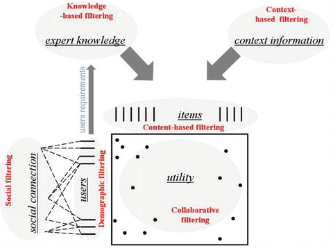
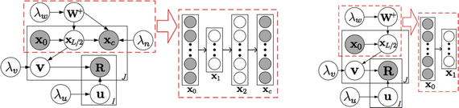

# 七、推荐算法和电子商务

电子商务和数字营销正在成为数据密集型领域。深度学习可以在这些领域产生巨大的影响，因为可以在精确度方面获得边际收益，从而获得高收益。例如，在 PC 或移动设备上与 web 内容交互的用户的点击率(CTR)预测或转换率(CR)方面的微小改进，可能会在客户获取方面节省数百万美元。然而，这个问题正变得越来越复杂，因为用户在购买产品之前的旅程可能是复杂的，在购买之前有许多接触点。因此，复杂的模型属性(在购买产品之前发现用户的轨迹)对于正确分配广告预算是必要的。

在线用户响应预测、点击率和转化率对于网络搜索、推荐系统、赞助搜索和展示广告至关重要。例如，在在线广告中，根据个人用户的数字旅程来锁定他们的能力是至关重要的。这些定向技术依赖于预测广告相关性的能力，换句话说，就是用户在特定环境下点击广告并购买某种产品或服务的概率。

凭借 2 万亿美元的规模，电子商务有强大的动力依靠更复杂的推荐算法来改善用户体验，并通过交叉销售或追加销售来增加销售额。

## 7.1 在线用户行为

基于网站内先前的交互来预测用户意图(购买给定产品或服务的愿望)，对于电子商务和广告显示网络，尤其是重定向，是至关重要的。通过跟踪消费者的搜索模式，在线商家可以深入了解他们的行为和意图。

在移动电子商务中，可以获得丰富的数据，潜在消费者在做出购买决定之前搜索产品信息，从而反映消费者的购买意图。用户显示不同的搜索模式(即每个项目花费的时间、搜索频率和回访)。

点击流数据可用于使用机器学习技术量化搜索行为，主要集中在购买记录上。虽然购买表明消费者在同一类别中的最终偏好，但搜索也是衡量对特定类别的意向的重要组成部分。您可以使用概率生成过程来模拟用户的探索和购买历史，其中引入了潜在的上下文变量来捕捉来自时间和位置的同时影响。通过识别消费者的搜索模式，你可以预测他们在特定情境下的点击决策，并推荐合适的产品。

现代搜索引擎使用机器学习方法来预测 web 内容中的用户活动。流行的模型包括逻辑回归(LR)和增强决策树。神经网络比 LR 具有优势，因为它们能够捕捉输入特征之间的非线性关系，并且因为它们的“更深”架构具有内在的更大建模强度。决策树——尽管在这个领域很流行——面临着高维度和稀疏数据的额外挑战。受深度神经网络启发的概率生成模型的优势在于，它们可以模拟消费者购买行为的过程，并捕捉潜在变量来解释数据。

在我 2016 年的论文中，我提出了( [`https://arxiv.org/pdf/1511.06247.pdf`](https://arxiv.org/pdf/1511.06247.pdf) )一种基于自编码器的算法，以识别导致购买会话的某些用户的活动模式，然后推断为模板，以预测相关网站的高购买概率。所使用的数据由大约 100 万个包含用户点击数据的会话组成。然而，只有 3%的训练数据包含购买会话，这使得它成为一个非常不平衡的数据集。为了解决这个问题，我使用了欠采样技术(即，只选择一小部分负面例子)。

## 7.2 重新定位

赞助搜索、上下文广告和最近出现的实时竞价(RTB)显示广告都依赖于学习模型预测广告点击率的能力。目前应用的 CTR 估计模型大多是线性的，从逻辑回归[E12]和朴素贝叶斯到逻辑回归，采用大量带有一键编码的稀疏(分类)特征作为输入。线性模型具有易于实现和高效学习的优势，但也具有相对较低的性能，因为它们无法学习非平凡模式，即特征之间的相互作用[LCWJ15]。

另一方面，非线性模型能够利用不同的特征组合，因此有可能提高估计性能。例如，因式分解机器(FMs)将用户和项目二元特征映射到低维连续空间( [`www.algo.uni-konstanz.de/members/rendle/pdf/Rendle2010FM.pdf`](http://www.algo.uni-konstanz.de/members/rendle/pdf/Rendle2010FM.pdf) )。与支持向量机相比，FMs 使用因子分解的参数显式地建模变量之间的相互作用，即使在具有巨大稀疏性的问题(如推荐系统)中也表现良好。

梯度推进树[M13]是一种集成技术，在生长每个决策/回归树的同时自动学习特征组合。其中一些技术(如随机森林)比人工神经网络有优势，即使在高维问题中，它们也很难过度拟合。然而，增强技术，如极端梯度增强(XGBoost ),很容易使数据过度拟合，特别是当您与随机森林比较时，即使有内置的正则化项。

无论多么强大，这些模型都无法利用不同特性的所有可能组合。此外，许多模型需要手动设计的功能工程，例如，按一周中的某一天或一年中的某个月来聚合交互。主流广告点击率估计模型的另一个问题是，大多数预测模型具有浅层结构，并且具有有限的表达来描述来自复杂和大型数据集的潜在模式，从而限制了它们的泛化能力。

将 DL 应用于该问题的困难在于，CTR 估计中的大多数输入特征是可能包含数千个不同值的离散类别:位置、设备、广告类别等等。此外，它们的本地依赖性大多是未知的。深度学习可以通过学习特征表示来改善 CTR 估计。

臧等人( [`http://wnzhang.net/papers/ortb-kdd.pdf`](http://wnzhang.net/papers/ortb-kdd.pdf) )开发了实时竞价展示广告幻灯片的竞价优化算法；`http://wnzhang.net/slides/ecir16-rtb.pdf`见。RTB 通过激励用户数据竞价超越了上下文广告——不要与赞助搜索(Google AdWords)拍卖相混淆。需求方需要自动化。基于一些预算，您想要最大化一些 KPI，例如转换或销售。作者推导了简单的竞价函数，并得出结论，最佳竞价策略应该试图对更多的印象进行竞价，而不是专注于一小组高价值的印象。相对于评价较高的印象，评价较低的印象更具性价比，胜出的几率也相对较高。

## 7.3 推荐算法

推荐算法在几乎任何电子商务网站中都是普遍存在的。推荐系统(RS)是一种向用户推荐他可能感兴趣的项目的算法。它使用来自用户对一组有限项目的过去偏好(交易数据)的输入信息，或者是显式的(评级)，或者是隐式的(监控用户的行为，如听到的歌曲、下载的应用程序、访问的网站)，以及关于用户或项目本身的信息。RS 还可能使用人口统计数据(年龄、国籍、性别)、社交媒体(关注者、被关注者、推文)和来自物联网的信息(GPS 定位、RFID、实时健康信号)。

作为输出，RS 为每个用户创建一个排序的项目列表——这可能会考虑到特定的上下文。RS 不仅通过准确性(被用户接受的项目的比例)来评估，还通过新颖性(算法在向新用户推荐新项目方面的表现)、分散性(推荐对不太受欢迎的项目的差异)和稳定性(预测如何随着时间的推移而保持)来评估。

基本上有三种类型的推荐系统。

*   基于事务的协作过滤器(CFs)
*   基于内容的 CFs
*   混合方法

基于内容的方法利用用户档案或产品描述进行推荐。基于 CF 的方法使用过去的活动或偏好，例如用户对项目的评级，而不使用用户或产品内容信息。混合方法结合了基于内容和基于 CF 的方法。

### 7.3.1 协作过滤器

协同过滤是一种流行的推荐算法，它使用其他用户对项目的评级(或行为)来预测用户购买其他产品的可能性。它假设过去用户的意见提供了足够的信息来选择新产品的未来偏好。如果用户同意某些项目的相关性，那么他们可能会同意其他项目。

CF 有两种类型:用户对用户和项目对项目。用户对用户 CF，也称为 k-NN CF，是一种简单的算法，它基于两个用户与物品或产品的交互模式之间的向量相似性来评估两个用户之间的相似性(见图 [7-1](#Fig1) )。由于搜索用户的邻居是耗时的，所以随着用户基础的增长，用户到用户 CF 遭受可扩展性问题。

单品到单品 CF 利用产品之间的相似性，最初被亚马逊广泛采用。项目对项目 CF 使用项目评分模式之间的相似性，而不是使用用户评分行为之间的相似性来预测偏好。这种方法比用户对用户 CF 具有更好的可扩展性并获得更好的结果。

CF 算法有两个重要问题:冷启动和内部通吃。第一个问题很严重:如果评论很少，或者数据库中有很多新用户/项目(形成非常稀疏的用户-项目矩阵)，系统很难创建推荐。第二个已知的问题涉及这样一个事实，即只推荐最热门的作品，所以系统缺乏多样性。深度学习模型旨在解决这两个问题。

图 7-1

Recommendation system based on collaborative filter algorithm (source: [`https://tel.archives-ouvertes.fr/tel-01585248/document`](https://tel.archives-ouvertes.fr/tel-01585248/document) )

### 7 . 3 . 2 RSs 的深度学习方法

基于协作过滤器的算法使用用户对项目的评级作为创建推荐的唯一信息来源。然而，评级的稀疏性可能会降低基于 CF 的方法的性能。解决这个问题的唯一方法就是使用物品内容等辅助信息。协作主题回归是一种采用这种方法并紧密耦合两个组件的方法； [`https://arxiv.org/abs/1409.2944`见](https://arxiv.org/abs/1409.2944)。然而，当辅助信息稀疏时，通过协作主题回归学习的潜在表示可能无效。

DL 可以通过以分层贝叶斯方式推广协作主题回归来解决这个问题。与传统技术相比，深度学习技术还允许从项目特征(文本、图像、视频和音频)中更好地提取特征。这允许对项目进行更精确的建模，并且潜在地允许混合的和基于内容的方法的能力。深度学习方法提供的另一个优势是，它们允许数据的不同视图，允许标准的协作过滤技术，如矩阵分解，并且通常将用户与项目的交互视为矩阵结构的数据，通常忽略数据中的时间结构和顺序。卷积和循环神经网络等深度学习技术允许您对这些数据中的时间结构进行建模，从而显著提高性能。

Salakhutdinov 等人率先将 DL 用于推荐系统，提出了一种基于深度信念网络的架构，该架构具有潜在节点来表示数据的隐藏特征； [`www.machinelearning.org/proceedings/icml2007/papers/407.pdf`见](http://www.machinelearning.org/proceedings/icml2007/papers/407.pdf)。这些作者使用这种架构的修改版本在网飞电影分级竞赛中取得了好成绩。

最近，郝[WWY15]提出了一种称为协作深度学习(CDL)的方法，该方法从项目/用户的内容中联合学习深度表示，同时还考虑评分矩阵，结果明显更好。

CDL 依靠一种使用紧密耦合方法的技术，允许评级矩阵和内容之间的双向交互(见图 [7-2](#Fig2) )。评级信息指导特征的学习，反过来，提取的特征可以提高 CF 模型的预测能力。紧密耦合的方法通常优于松散耦合的方法。这种方法结合了基于概率主题建模的 CF、潜在因素和内容分析的思想。

对于一个特定的用户，CDL 可以推荐喜欢类似文章的其他用户的文章。潜在因素模型在推荐已知文章方面效果很好，但不能推广到以前未见过的文章。为了推广到看不见的文章，该算法使用主题建模。主题建模根据从集合中发现的潜在主题来提供文章的表示。这个额外的组件可以推荐与用户喜欢的其他文章具有相似内容的文章，即使没有使用任何先前的评级。文章的主题表示允许算法在任何人对文章进行评级之前，对文章做出有意义的推荐。

图 7-2

Scheme of a possible collaborative deep learning model. On the left is the graphical model. The dashed rectangle represents an auto-encoder. On the right is the graphical model of the degenerated model. The dashed rectangle represents the encoder component of SDAE (source: [`www.wanghao.in/paper/KDD15_CDL.pdf`](http://www.wanghao.in/paper/KDD15_CDL.pdf) ).

这种方法的有用之处在于，它能够以半监督的方式创建用户、产品和关系之间相似性的平滑语义图。另外一个很大的优点就是可以很好的泛化，从而克服冷启动问题。问题是，每次添加新用户或产品(或通过代理工作)时，都需要创建新节点。

值得注意的是，在使用单一指标(即精确度或召回率)来评估 RS 时应该小心。分散性和新颖性应该被考虑，因为它们可能与产品密切相关。其他重要的指标是算法学习的速度，以解决不可避免的冷启动问题，以及它对于高需求应用程序的可扩展性。

### 7.3.3 Item2Vec

在 Item2Vec ( [`https://arxiv.org/abs/1603.04259`](https://arxiv.org/abs/1603.04259) )中，作者将 Word2vec 扩展到基于项目的产品推荐。当用户数量超过目录中的产品数量时，例如在音乐领域，或者当用户匿名浏览电子商务页面导致用户与商品的关系不可用时，这种方法非常有效。这种方法在推荐不太受欢迎的项目时特别有用，并且不会遭受 CF 的冷启动问题。Python 中的代码可在 [`https://github.com/DoosanJung/I2V_project`](https://github.com/DoosanJung/I2V_project) 获得。

在最近的出版物“学习产品搜索的潜在向量空间”( [`http://arxiv.org/pdf/1608.07253.pdf`](http://arxiv.org/pdf/1608.07253.pdf) )中，作者介绍了一种潜在向量空间模型，该模型联合学习单词、电子商务产品的潜在表示，以及两者之间的映射，而不需要显式注释。该模型的强大之处在于它能够直接对产品和描述它们的词语之间的关系进行建模。作者将这种方法与现有的潜在向量空间模型(LSI，LDA 和 Word2vec)进行了比较，声称由于更好的产品表示，准确性更高。

## 7.4 推荐算法的应用

一些首创推荐系统的公司仍然严重依赖它们。大多数大型商业和社交网站都有某种形式的推荐系统，推荐产品或关系。例如，商务社交网站 LinkedIn 为用户可能认识的人、你可能喜欢的工作、你可能想关注的群体或你可能感兴趣的公司提供建议。LinkedIn 使用 Hadoop 和 Mahout 大规模运行 CF 模型。

亚马逊使用基于内容的推荐。当你选择购买一件商品时，亚马逊会根据该商品推荐其他用户购买的其他商品(作为一个商品到下一个商品购买可能性的矩阵)。亚马逊为这种行为申请了专利，称为项目到项目的协同过滤。

Hulu，一个流媒体网站，使用推荐引擎来识别用户可能感兴趣的内容。它还使用基于项目的协同过滤和 Hadoop 来扩展海量数据的处理。

2006 年，网飞举办了一场奖金 100 万美元的竞赛，奖励能够将其推荐系统 RMSE 提高 10%的团队。2009 年，三个团队联合构建了一个由 107 个推荐算法组成的集合，产生了一个单一的预测。这种集成被证明是提高预测准确性的关键。

阿里巴巴团队最近的一篇论文报告了该公司目前用于预测 CTR 的一种算法；参见( [`https://arxiv.org/pdf/1706.06978.pdf`](https://arxiv.org/pdf/1706.06978.pdf) )。该模型被称为深度兴趣网络(DIN ),与广度和深度模型有一个主要区别。相反，它使用从机器翻译文献中导入的注意机制。DIN 用兴趣分布来表示用户的不同兴趣，并设计了一种类似注意力的网络结构，根据候选广告来局部激活相关兴趣。与候选广告相关性更高的行为获得更高的注意力分数，并主导预测。他们报告说，相对于其他类型的神经网络，使用这种模型有很大的好处。

Kumar 等人提出了一种深度神经模型( [`http://ceur-ws.org/Vol-1866/paper_85.pdf`](http://ceur-ws.org/Vol-1866/paper_85.pdf) )，使用 LSTM 关注度来推荐新闻内容，并使用全连接网络来学习内容项到用户的映射。他们显示出比最先进的结果显著提高了 4.7%(命中率为 10)。该模型在处理用户冷启动和物品冷启动问题上也是有效的。

## 7.5 未来方向

改进推荐系统的一些未来方向包括明确考虑时间效应(用户或产品口味的变化)，考虑序列顺序(在购买手机后推荐手机外壳与在获得手机外壳后推荐手机不同)，以及更丰富的产品和内容表示。参见 [`https://www.cs.princeton.edu/chongw/papers/WangBlei2011.pdf`](https://www.cs.princeton.edu/chongw/papers/WangBlei2011.pdf) 了解 RSs 的未来发展方向。

元数据质量差是现实生活中经常出现的问题；例如，缺少值或者没有系统地分配值。即使元标签是完美的，这样的数据也只能更间接、更不详细地表示实际的商品，而不是它的图片。在深度学习的帮助下，内容(图像、视频、文本)的实际、内在属性可以被合并到推荐中。使用 DL，项目到项目的关系可以基于一个更全面的产品图片，并减少对人工标记和大量交互历史的依赖。

将内容纳入推荐系统的一个很好的例子是 Spotify 在 2014 年试图让歌曲推荐更加多样化，并为用户创造更好的个性化体验。音乐流媒体服务在其推荐系统中使用了一种协作过滤方法。但 Spotify 的博士生兼实习生桑德·迪勒曼(Sander Dieleman)认为这是其最大的缺陷。严重依赖使用数据的方法不可避免地低估了隐藏的宝石和未来艺术家的鲜为人知的歌曲，这些是音乐发现的圣杯。Dieleman 使用一种深度学习算法来分析音乐本身，他在 50 万首歌曲的 30 秒摘录中教授了这种算法。结果是，网络的连续层逐渐学习到歌曲的更复杂和不变的特征，就像它们处理图像分类问题一样。事实上，“在网络的最高全连接层，就在输出层之前，学习过滤器对某些子类别非常有选择性”，如福音音乐、中国流行音乐或深层音乐。在实践中，这意味着这样的系统可以仅基于歌曲的相似性来有效地进行音乐推荐(这是组装个性化播放列表的优秀特性)。目前还不清楚 Spotify 是否将这些发现纳入了它的算法，但这仍然是一个有趣的实验。

冷启动是推荐系统的大敌。它会影响用户和项目。对于用户来说，冷启动意味着系统对客户的行为和偏好的信息有限或没有。项目冷启动表示缺少用户与数据的交互，在此基础上可以绘制项目到项目的关系(仍然有元数据，但这通常不足以提供真正微调的建议)。冷启动项目是上述基于内容的方法的一个明显的领域，因为它使系统更少依赖于事务和交互数据。

然而，为新用户创造有意义的个性化体验是一个更棘手的问题，不一定能通过简单地收集他们的更多信息来解决。这是非常典型的，尤其是在电子商务网站或具有广泛产品组合的在线市场的情况下，随着时间的推移，客户会带着完全不同的目标访问网站。他们先是来买微波炉，但下一次他们要找的是手机。在这种情况下，在第一次会话中收集的数据与第二次会话无关。

解决用户冷启动问题的一个有趣的方法是基于会话或项目到会话的推荐。这大致意味着，系统不是依赖于客户的整个交互历史，而是将这些数据分割成单独的会话。然后，捕捉用户兴趣的模型建立在特定于会话的点击流上。通过这种方法，很有可能未来的推荐系统将不会如此严重地依赖于几个月甚至几年建立起来的复杂的客户档案；相反，在用户点击网站一段时间后，他们能够给出合理的相关建议。

这是一个研究还很少的领域，但可能会为增强个性化的在线体验带来巨大的机会。重力 R&D 公司的研究人员在 EU-资助的 CrowdRec 项目上工作，最近合著了一篇论文( [`https://arxiv.org/abs/1706.04148`](https://arxiv.org/abs/1706.04148) )，描述了一种提供基于会话的推荐的循环神经网络方法。这是第一篇寻求将深度学习用于基于会话的推荐的研究论文，他们的结果表明，他们的方法明显优于当前使用的最先进的算法。