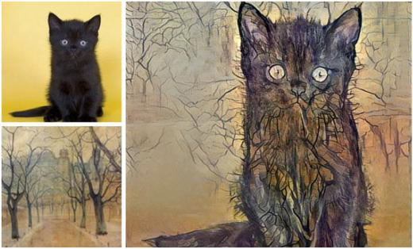
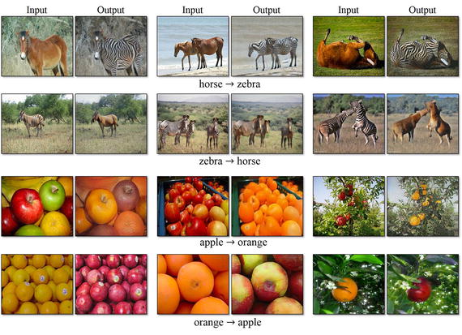
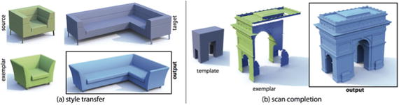

# 八、游戏和艺术

深度学习应用最令人兴奋的领域之一是创意产业和游戏，要么通过算法玩传统的棋盘游戏或视频游戏，要么创建虚拟游戏角色或沉浸式现实。最近 AlphaGo 的成功击败了世界围棋冠军，点燃了人们对人工智能为机器带来超人能力的兴趣。

## 8.1 国际象棋的早期步骤

20 年前，IBM 的深蓝打败了国际象棋世界冠军加里·卡斯帕罗夫。从那以后，下棋的计算机让最优秀的人类相形见绌。但是这些算法使用的技术仍然严重依赖于“强力”树搜索所有可能的移动组合。

人工智能的最新进展使得自学程序的开发成为可能。长颈鹿( [`https://chessprogramming.wikispaces.com/Giraffe`](https://chessprogramming.wikispaces.com/Giraffe) )是神经网络算法下棋的先驱之一。它是通过评估游戏位置学会下棋的。它由四层神经网络组成，以三种不同的方式共同检查棋盘上的每个位置。第一个查看游戏的全局状态，例如每一方棋子的数量和类型，哪一方要移动，阉割权利，等等。第二个着眼于以棋子为中心的特征，如每一方的每一个棋子的位置，最后一个绘制每一个棋子进攻和防守的方格。

训练算法玩棋盘游戏的通常方式是手动评估每个位置，并使用这些信息来教会机器识别哪些位置强，哪些位置弱。取而代之的是一种自举技术，长颈鹿与自己比赛，目的是提高它的预测能力。这是可行的，因为有固定的参考点最终决定了头寸的价值——游戏是赢了、输了还是平局。这样，计算机就学会了哪些位置强，哪些位置弱。在 72 小时的训练中，长颈鹿达到了世界上最好的程序的水平。

## 8.2 从象棋到围棋

尽管在下棋方面取得了进步，但对于机器来说，围棋仍然是一个难以捉摸的挑战。围棋是一种简单的棋盘游戏，两名玩家轮流将黑色或白色的石头放在棋盘上，试图抓住对手的石头或围绕空白空间以取得领土。尽管规则简单，但围棋是一种非常复杂的游戏，因为大约有 10 170 种可能的棋盘配置——远远超过宇宙中的原子数量，大约是 10 100 。

最成功的程序之一是围棋的多面性，它实现了 13-kyu 的性能，由 David Fotland 在十年间编写了 30，000 行代码。但是从来没有达到高手的水平。

蒙特卡洛(MC)算法是由布鲁诺·布兹在 21 世纪初引入棋盘游戏算法的。MC 使用取样来获得难以处理的积分的近似值。后来 Rémi Coulom 使用 MC 评估和树搜索，并创造了术语蒙特卡罗树搜索(MCTS)； [`https://www.remi-coulom.fr/CG2006/CG2006.pdf`见](https://www.remi-coulom.fr/CG2006/CG2006.pdf)。他的程序 CrazyStone 在那年的 KGS 计算机围棋锦标赛中，以 9×9 的小型围棋变体击败了其他程序，如 NeuroGo 和 GNU Go。MCTS 使用蒙特卡罗滚动来估计搜索树中每个州的值。随着越来越多的模拟被执行，搜索树变得越来越大，并且相关值变得越来越精确。这是一种探索大搜索空间的有效采样算法。

2013 年，DeepMind 发表了一篇论文，该论文使用了深度神经网络的强化学习(通过 LSTM 训练)，只使用了屏幕上的像素输入(由 CNN 处理)。它创造了一个深度 Q 网络，它学会了玩一些游戏，如 Breakout，Pong 等。2014 年，DeepMind 发表了另一篇名为“教授深度卷积神经网络下围棋”( [`https://arxiv.org/abs/1412.3409`](https://arxiv.org/abs/1412.3409) )的论文，与之前的案例不同，该论文使用神经网络来产生人类围棋选手从给定位置做出每个可能移动的概率。

AlphaGo 使用了两个神经网络:一个策略和一个价值网络。快速部署策略 P π 和监督学习(SL)策略网络 p σ 被训练来预测人类专家在位置数据集中的移动。强化学习(RL)策略网络 p ρ 被初始化为策略网络，然后通过策略梯度学习进行改进，以相对于先前版本的策略网络最大化结果(即赢得更多游戏)。一个新的数据集是和自己玩游戏产生的，换句话说就是和 RL 策略网络的自我游戏。最后，通过回归训练价值网络 v θ 以从自玩数据集中预测位置的预期结果(当前玩家是否获胜)。

AlphaGo 算法的细节在 [`https://storage.googleapis.com/deepmind-media/alphago/AlphaGoNaturePaper.pdf`](https://storage.googleapis.com/deepmind-media/alphago/AlphaGoNaturePaper.pdf) 中有详细解释。

## 8.3 其他游戏和新闻

本部分涵盖其他游戏和新闻。

### 厄运

2016 年，卡内基梅隆大学学生开发的一个人工智能代理赢得了经典视频游戏《末日》——胜过了游戏内置的人工智能代理和人类玩家。见 [`https://arxiv.org/pdf/1609.05521v1.pdf`](https://arxiv.org/pdf/1609.05521v1.pdf) 和 [`https://www.youtube.com/watch?v=oo0TraGu6QYlist=PLduGZax9wmiHg-XPFSgqGg8PEAV51q1FT`](https://www.youtube.com/watch?v=oo0TraGu6QYlist=PLduGZax9wmiHg-XPFSgqGg8PEAV51q1FT) 的一些不平凡的视频。

3D 游戏环境对于算法来说是具有挑战性的，因为玩家必须仅基于部分观察到的迷宫来行动。与《毁灭战士》不同,《雅达利》和《围棋》给代理人提供了完整的游戏信息，换句话说，就是完全可观察的环境。

当机器玩家在游戏中导航时，它采用了深度 Q 网络，这是 DeepMind 用来掌握 Atari 游戏的强化学习架构。当看到敌人时，代理会切换到深度循环 Q 网络，其中包括一个长短期记忆(LSTM)模块，可以帮助代理跟踪敌人的运动并预测向哪里射击。

虽然人工智能代理仅依赖视觉信息来玩游戏，但作者在训练期间使用 API 来访问游戏引擎。这有助于代理学习如何更快地识别敌人和游戏棋子。没有这种帮助，他们发现代理人在 50 小时的模拟游戏中几乎什么也没学到，相当于 500 多小时的计算机时间。

### 8.3.2 Dota

2017 年，OpenAI 的一个人工代理赢得了一场著名的 Dota2(世界上最受欢迎的视频游戏之一)锦标赛，击败了一名职业人类选手。

Dota 和 Starcraft II 等实时战斗和策略游戏对国际象棋或围棋等传统棋盘游戏构成了重大挑战。这些游戏需要长期的战略思维，而且——不像棋盘游戏——它们对玩家隐藏了重要的信息。算法要预测和先发制人对手会怎么做；你可以称之为直觉。

Dota 有额外的复杂性，就像人类玩家必须在五人小组内合作行动，协调复杂的策略。游戏中有数百个角色，每个人都有自己的技能，配备了许多独特的物品。动作的复杂性如此之大，以至于几乎不可能将一个程序的获胜策略硬编码到 Dota 代理中。

与人工智能代理结果同样重要的是它如何自学游戏。AlphaGo 通过观察人类以前玩的游戏来学习如何玩游戏。OpenAI 的代理从头开始自学一切。

即使一些代理行为是预编程的，它也能够自己开发复杂的策略，比如通过假装触发攻击来伪装对手，但很快就取消了，使人类玩家处于弱势地位。

尽管 OpenAI 代理取得了胜利，但真正的挑战将是 5v5 比赛，代理不仅要管理决斗，还要管理有多个代理和几十个支持单位的混乱战场。

### 其他应用

可以找一些神经网络的实现来玩几个视频游戏，像 TensorFlow 里的马里奥赛车( [`https://kevinhughes.ca/blog/tensor-kart`](https://kevinhughes.ca/blog/tensor-kart) )和超级马里奥( [`https://www.engadget.com/2015/06/17/super-mario-world-self-learning-ai/`](https://www.engadget.com/2015/06/17/super-mario-world-self-learning-ai/) )。

在最近的一项工作中，来自 Maluuba(微软)的一个团队提出了一种技术，详细描述在“强化学习的混合奖励架构”( [`https://static1.squarespace.com/static/58177ecc1b631bded320b56e/t/594050d7bf629a891ef31605/1497387537190/HRA_Maluuba.pdf`](https://static1.squarespace.com/static/58177ecc1b631bded320b56e/t/594050d7bf629a891ef31605/1497387537190/HRA_Maluuba.pdf) )。他们能够在很大程度上提高 QDN 或演员评论家方法(AC3)的准确性，击败了吃豆人雅达利游戏中的最佳人类。这种称为 HRA 的技术将分解的奖励函数作为输入，并为奖励函数的每个分量学习单独的值函数。因为每个组件仅依赖于所有特征的子集，所以总体值函数更平滑，并且可以更容易地通过低维表示来近似，从而实现更有效的学习。

数独是一种流行的数字谜题，它要求你用数字填充 9×9 网格中的空白，以便每列、每行和 9 个 3×3 子网格中的每一个都包含从 1 到 9 的所有数字。在 [`https://github.com/Kyubyong/sudoku`](https://github.com/Kyubyong/sudoku) 详述的项目中，Kyubyong 使用了一个简单的卷积神经网络(在 TensorFlow 中)来解决数独，而没有任何基于规则的后处理。它达到了 86%的准确率。

深度学习的挑战之一是解决具有挑战性的瑞文渐进矩阵(RPM)测试。RPM 是一种非语言智力测试，通常用于测量一般智力。RPM 由一个符号矩阵组成，这些符号构成了一个视觉几何图案，并且矩阵中的一个符号缺失。应试者被给予六到八个可能的候选解，并且基于这些和矩阵的几何设计，确定矩阵中缺少哪个符号。尽管该测试仅限于测量应试者从复杂的视觉几何结构中提取信息的能力，但其与其他多领域智力测试的高度相关性使其在心理测量空间中处于中心地位[SKM84]。

已经部署了一些有希望的努力来使用使用上下文 CNN 自编码器作为生成器(最初应用于图像修补( [`https://arxiv.org/abs/1604.07379`](https://arxiv.org/abs/1604.07379) )的生成式对抗网络(GANs)来解决这个矩阵，但是该算法在处理看不见的符号方面有困难。

## 8.4 人工字符

微软宣布了一个项目，使程序员能够塑造和开发其技术。AIX 是一个新的软件开发平台，研究人员可以用它来开发代理——人工智能驱动的角色。

《我的世界》增加了一个使用人工智能的虚拟现实助手。该平台名为 AIX，是一个沙箱，允许研究人员开发漫游《我的世界》世界的代理。这个想法是让他们具备像普通玩家一样的行为能力，包括基本的命令，如爬山，以及更复杂的要求，如导航各种地形，构建景观，以及在游戏中生存。

来自 Tubigen 大学的一个团队正在进行一个项目，通过允许超级马里奥游戏角色在游戏环境中发展自己的态度，赋予他们“真实的生活”； [`https://www.uni-tuebingen.de/en/newsfullview-landingpage/article/super-mario-erhaelt-soziale-intelligenz.html`见](https://www.uni-tuebingen.de/en/newsfullview-landingpage/article/super-mario-erhaelt-soziale-intelligenz.html)。

毒蛇。AI ( [`https://github.com/SerpentAI/SerpentAI`](https://github.com/SerpentAI/SerpentAI) )是一个帮助开发者创建游戏代理的框架。它可以帮助你把你拥有的任何视频游戏变成一个沙盒环境进行实验。

Unity 推出了 Unity 机器学习代理( [`https://blogs.unity3d.com/2017/09/19/introducing-unity-machine-learning-agents/`](https://blogs.unity3d.com/2017/09/19/introducing-unity-machine-learning-agents/) )，支持使用 Unity 编辑器创建游戏和模拟。在这些环境中，可以通过简单易用的 Python API，使用强化学习、神经进化或其他机器学习方法来训练智能代理。这些平台并不新鲜，PROWLER.io ( [`https://www.prowler.io/`](https://www.prowler.io/) )是先驱。这些类型的环境对于开发能够通过自我游戏和模拟学习复杂的紧急行为的智能体将变得非常重要。

## 8.5 艺术中的应用

如果说 DL 在玩游戏方面取得了显著的成绩，也许最显著的成就是在一个不寻常的领域:艺术。

Gatys 等人[GEB15]应用卷积神经网络，使用最初设计用于捕捉纹理信息的特征空间来获得艺术家风格的表示(输入图像)。通过包含多层的特征相关性，他们获得了输入图像的静态、多尺度表示。他们证明了卷积神经网络中内容和风格的表示是可分的。这两种表示都可以被独立地操纵，以产生新的、感知上有意义的图像。为了证明这一发现，他们从两幅不同的源图像中生成了混合了内容和风格表现的图像；见图 [8-1](#Fig1) 。

Ulyanov 等人[ULVL16]提出了一种技术，即给定纹理的单个示例，CNN 能够生成任意大小的相同纹理的多个样本，并且能够将艺术风格从给定图像转移到任何其他图像。生成的网络相对较小，可以快速生成高质量的纹理。

图 8-1

Artificially generated images using CNNs trained on two set of images (source: [`www.demilked.com/inceptionism-neural-network-drawings-art-of-dreamssource`](http://www.demilked.com/inceptionism-neural-network-drawings-art-of-dreamssource) ). See also a demo online at [`http://ostagram.ru/`](http://ostagram.ru/) or the mobile app Prisma.

CycleGAN ( [`https://arxiv.org/pdf/1703.10593.pdf`](https://arxiv.org/pdf/1703.10593.pdf) )是一种使用未对齐图像进行图像到图像转换(输入图像和输出图像之间的映射)的最新方法(见图 [8-2](#Fig2) )。它能够学习映射 G : X → Y，使得来自 G(X)的图像分布与使用对抗损失的分布 Y 不可区分。因为这个映射是高度欠约束的，所以它与一个逆映射 F : Y → X 耦合，并且它引入了一个循环一致性损失来推 F(G(X)) ≈ X(反之亦然)。它提供了马到斑马的可靠转换，反之亦然。代码(Pytorch 中)和视频在 [`https://github.com/junyanz/pytorch-CycleGAN-and-pix2pix`](https://github.com/junyanz/pytorch-CycleGAN-and-pix2pix) 。

图 8-2

Object transfiguration with CycleGAN (source: [`https://github.com/junyanz/CycleGAN`](https://github.com/junyanz/CycleGAN) )

瑞典公司 Peltarion ( [`http://peltarion.com/`](http://peltarion.com/) )发布了一种神经网络，可以通过从原始传感器数据中提取高级特征来执行复杂的计算机生成的编排。该系统被称为 chor-rnn，使用循环神经网络以个人编舞的微妙编舞语言和风格生成新颖的编舞材料。它还可以创建更高层次的组合内聚力，而不仅仅是生成运动序列。神经网络在原始运动捕捉数据上进行训练，它可以为独舞者生成新的舞蹈序列。作者使用微软 Kinect v2 传感器捕捉了五个小时的当代舞蹈动作，跟踪了 25 个关节，产生了 1350 万个三维时空关节位置。使用这些数据进行训练，作者表明他们的网络可以输出新颖的舞蹈动作，展示对日益复杂的动作的渐进学习。

在最近的一项工作( [`https://arxiv.org/pdf/1706.07068.pdf`](https://arxiv.org/pdf/1706.07068.pdf) )中，作者们使用了一种生成对抗网络来创建合成艺术品，这种艺术品与人类生成的艺术品几乎没有区别。创造性对立网络(CANs)的工作方式类似于 GANs，只是鉴别器向生成器返回两个信号，而不是一个信号:某样东西是否符合艺术的标准，以及它能在多大程度上把生成器的样本归类为一种确切的风格。一项定量评估显示，53%的情况下，人类认为罐子图像是由人类生成的，而由人类生成的抽象表现主义者的比例为 85%。

在一篇博客文章( [`http://karpathy.github.io/2015/05/21/rnn-effectiveness/`](http://karpathy.github.io/2015/05/21/rnn-effectiveness/) )中，安德鲁·卡帕西描述了一个基于 RNN 和 LSTM 联合的模型，该模型是根据莎士比亚作品训练的。该模型能够创作出与英国作家的一些著名作品有显著相似之处的散文。

松原仁(Hitoshi Matsubara)使用了一种基于 DL 的算法来生成一个短篇故事( [`http://mashable.com/2016/03/26/japan-a-i-novel`](http://mashable.com/2016/03/26/japan-a-i-novel) )。这个故事最终从 1000 份投稿中脱颖而出，成为 10 个故事之一。

吉恩·科岗( [`http://genekogan.com/`](http://genekogan.com/) )将 AI 作为创作工具，在 [`https://vimeo.com/180044029`](https://vimeo.com/180044029) 中创造了一些有趣的效果。

## 8.6 音乐

音乐可以被表示为一个时间序列，从而被建模为音乐事件之间的条件概率。例如，在和声音轨中，给定最后的和弦，一些和弦比其他和弦更可能出现，而和弦进行通常取决于音乐的整体模式。在许多自动合成系统中，通过假设当前状态 p (n)的概率仅取决于过去状态的概率，p(n–k)…p(n–1)来简化这些关系。给定一个种子序列，然后通过预测下面的事件产生一个音乐序列。

音乐创作被认为是创造性的、直觉的，因此是人类的特权。然而，dnn 带来了挑战这一假设的新工具。自动音乐创作通常包括诸如旋律、和弦、节奏甚至歌词的创作等任务，传统上是通过隐马尔可夫模型(hmm)来解决的。这些模型的记忆为 1(当前状态完全决定了到下一个状态的转换)。然而，深度 LSTM 网络可以处理任意历史来预测未来事件，因此具有比 HMM 更复杂的表达能力。

由人工智能算法创作的音乐并不新鲜，因为它允许作曲家更有效地进行实验。专辑《0music》和《Lamus》完全由弗朗西斯科·哈维尔·维科(Francisco Javier Vico)创立的乐队 Melomics 创作。两者都使用模仿生物学的策略来学习和进化更复杂的作曲机制。这些算法是为了产生音乐而明确编写的。

Choi 等人[https://arxiv . org/pdf/1604 . 05358 v1 . pdf](https://arxiv.org/pdf/1604.05358v1.pdf)使用基于 LSTM 的算法来学习表示和弦进行和鼓轨的文本文档内的关系。代码(基于 Keras)可以在 GitHub 上获得。结果非常好，尤其是鼓；你可以在 SoundCloud 上找到一些例子。

普林斯顿大学的金智成(Ji-Sung Kim)最近部署了一个名为 Deep Jazz 的项目，使深度学习能够产生音乐。该项目基本上是一个 RNN 与 LSTM 训练了几个小时的爵士乐。经过 128 个时期的训练，该算法能够创造新的音乐。该代码可以在 GitHub 上获得，并且基于 Keras 和 Theano 库。作者正在努力将这一概念推广到大多数音乐风格，而不必为每一种风格训练一个神经网络。在这部作品中，ML 被用来教音乐学生超越传统的和弦。

另一个最近的项目( [`http://imanmalik.com/cs/2017/06/05/neural-style.html`](http://imanmalik.com/cs/2017/06/05/neural-style.html) )使用循环网络通过阅读乐谱来学习如何演奏乐器(MIDI 格式)。质量如此之好，几乎与人类执行者没有区别。

同步项目( [`http://syncproject.co/blog/2017/6/5/making-music-with-ai-an-introduction`](http://syncproject.co/blog/2017/6/5/making-music-with-ai-an-introduction) )使用了一个名为 Folk-RNN 的循环网络，研究人员将数以千计的凯尔特民间音乐转录样本输入深度学习系统，该系统从 MIDI 歌曲信息中学习，以创建新的旋律。研究人员惊讶地发现，该系统每尝试五次就能创作出一首“听起来真实”的旋律。

Southern 的专辑《我是艾》(I AM AI)由 Amper ( [`https://www.ampermusic.com/`](https://www.ampermusic.com/) )创作，Amper 是一个人工智能的音乐作曲家、制作人、表演者。用户选择要创建的音乐类型的参数，例如“环境振奋人心的电影”或“史诗般的驾驶”。该程序使用其机器学习算法在几秒钟内生成一首歌曲。然后，人类能够操纵该轨道的一部分，但也有可能将所有和弦结构和乐器都交给计算机。请看这个例子: [`https://www.youtube.com/watch?v=XUs6CznN8pw`](https://www.youtube.com/watch?v=XUs6CznN8pw) 。

深度学习在音乐中的应用调查，请参见 [`https://arxiv.org/pdf/1709.01620.pdf`](https://arxiv.org/pdf/1709.01620.pdf) 。

## 8.7 多模态学习

Tamara Berg 通过利用图像、视频和观看这些图像的人之间的关系，率先将数字图像应用于时尚。她探索了计算机视觉和自然语言处理来理解文本到图像的关系。在一个项目中，给定一幅带字幕的图像，卷积神经网络可以确定哪些单词(例如，“打电话的女人”或“远处的车辆”)对应于图像的哪个部分。该工具允许用户仅使用自然语言编辑或合成真实的图像(例如，“从这张照片中删除垃圾车”或“制作一张三个男孩追逐一只毛茸茸的狗的图像”)。她在 [`www.tamaraberg.com/`](http://www.tamaraberg.com/) 的网页上有一些可用的数据集。她还协调项目 Exact Street to Shop ( [`http://tamaraberg.com/street2shop/`](http://tamaraberg.com/street2shop/) )，该项目将现实世界中的一件衣服与网上商店中的同一件衣服进行匹配。这是一项极具挑战性的任务，因为真实照片和网店照片之间存在视觉差异。作者为此应用程序收集了一个新的数据集，包含从 25 个不同的在线零售商收集的 404，683 张商店照片和 20，357 张街道照片，总共提供了 39，479 个项目。结果可在 [`http://arxiv.org/pdf/1608.03914.pdf`](http://arxiv.org/pdf/1608.03914.pdf) 获得。

来自多伦多大学的 Ryan Kiros 为自然语言开发了一个多模态神经语言模型，该模型可以以其他模态为条件。与生成图像描述的其他方法不同，该模型不使用模板、结构化模型或语法树。相反，它依赖于从数百万个单词中学习的单词表示，并根据从深度神经网络中学习的高级图像特征来调节模型。

Lassner 等人在“穿着衣服的人的生成模型”( [`http://files.is.tue.mpg.de/classner/gp`](http://files.is.tue.mpg.de/classner/gp) )中提出了一种能够在全身设置中生成穿着衣服的人的图像的模型。作者从大型图像数据库中学习生成模型，处理人类姿势、形状和外观的高度变化。作者将生成过程分为两个部分:身体和服装的语义分割，然后在生成的分割上创建一个条件模型，以创建逼真的图像。

来自麻省理工学院计算机科学和人工智能实验室(CSAIL)的研究人员展示了一种算法，该算法有效地学习了如何预测声音。当显示物体被击中的无声视频剪辑时，该算法可以为击中产生足够真实的声音，以欺骗人类观众。这个“声音的图灵测试”代表的不仅仅是一个聪明的计算机技巧。研究人员设想类似算法的未来版本被用于自动为电影和电视节目制作声音效果，以及帮助机器人更好地理解物体的属性。更多信息见 [`http://news.mit.edu/2016/artificial-intelligence-produces-realistic-sounds-0613`](http://news.mit.edu/2016/artificial-intelligence-produces-realistic-sounds-0613) 。

他们用 46，000 种声音的 1，000 个视频训练了一个发声算法，这些声音代表了各种物体被击打、刮擦和用鼓槌刺激。这些视频被提交给美国有线电视新闻网，该网对声音进行解构，并分析其音高和响度。该算法查看了该视频每一帧的声音属性，并将它们与数据库中最相似的声音进行匹配。

在最近的工作中，周等人提出了一种在给定视觉输入的情况下生成声音并在给定输入视频帧的情况下生成原始波形样本的方法；参见“视觉到声音:为野外视频生成自然声音”( [`https://arxiv.org/abs/1712.01393`](https://arxiv.org/abs/1712.01393) )。

## 8.8 其他应用

以下是一些其他应用:

*   廖等人提出了一种技术( [`https://arxiv.org/pdf/1705.01088.pdf`】用于跨具有不同外观但感知语义结构相似的图像的视觉属性转移。他们将该技术称为深度图像类比，其中使用由粗到细的策略来计算最近邻场以生成结果。他们将其应用于风格/纹理转换、颜色/风格交换、素描/绘画到照片以及时间推移。](https://arxiv.org/pdf/1705.01088.pdf)
*   每年举行一次关于人工智能在创意产业中的应用的会议( [`http://events.nucl.ai/`](http://events.nucl.ai/) )。
*   在 [`www.subsubroutine.com/sub-subroutine/2016/11/12/painting-like-van-gogh-with-convolutional-neural-networks`](http://www.subsubroutine.com/sub-subroutine/2016/11/12/painting-like-van-gogh-with-convolutional-neural-networks) 的博文中有一个关于如何用 TensorFlow 实现风格转换的教程。
*   最近，整部电影《太阳之春》的剧本是由一个循环神经网络从数百部科幻小说的剧本中产生的。有一些无意义的对话，但大部分是可信的和有趣的-视频可在 [`https://www.youtube.com/watch?v=LY7x2Ihqjmc`](https://www.youtube.com/watch?v=LY7x2Ihqjmc) 获得。
*   在 [`http://iq.intel.com/getting-creative-ai-and-machine-learning/`](http://iq.intel.com/getting-creative-ai-and-machine-learning/) 的博文包含了一些关于艺术机器学习的项目。
*   谷歌造梦( [`https://research.googleblog.com/2015/06/inceptionism-going-deeper-into-neural.html`](https://research.googleblog.com/2015/06/inceptionism-going-deeper-into-neural.html) )机器使用 CNN 来创造幻想。DeepDream 是一个计算机视觉程序，它使用一个卷积神经网络，通过算法的 pareidolia 来寻找和增强图像中的模式，从而在故意过度处理的图像中创建一个梦一样的迷幻外观。在 [`https://deepdreamgenerator.com/`](https://deepdreamgenerator.com/) 有一个在线演示。
*   博客[creativeai.net](http://www.creativeai.net)很好地展示了最近与艺术相关的人工智能项目
*   谷歌大脑的创意人工智能项目 Magenta 致力于通过机器学习来创作音乐和艺术。它发布了第一首音乐曲目，展示了人工神经网络创作创造性音乐的潜力。
*   伦敦 Goldsmiths 的一名研究人员对《银翼杀手》电影的所有帧训练了一个变分自编码器深度学习模型，然后要求网络以原始序列重建视频，以及网络没有训练过的其他视频。图片不是很清晰，但仍然可以识别；你可以把它想象成压缩率为 1:1000 的压缩算法。
*   NYU 大学的研究人员根据电影剧本训练了一个循环神经网络，这些电影包括《捉鬼敢死队》、《星际穿越》和《第五元素》，并要求网络生成一个小说剧本。结果是一组看似合理的表达式。
*   在 [`http://arxiv.org/abs/1606.03073`](http://arxiv.org/abs/1606.03073) 中，作者利用深度神经网络对人脸草图进行反演，合成出了照片级真实感人脸图像。他们首先通过扩展现有的无约束人脸数据集，构建了一个包含大量不同风格的计算机生成人脸草图和相应人脸图像的半模拟数据集。
*   马蒂亚斯·贝奇(Matthias Bethge)的研究小组展示了( [`https://arxiv.org/abs/1604.08610`](https://arxiv.org/abs/1604.08610) )卷积神经网络可以用来从一幅画中学习艺术风格的表现，并将其应用于照片。他们表明，风格可以从单个图像中学习，并转移到整个视频序列中。进行了两项改进。当某些区域可能暂时被遮挡时，为了确保风格一致性扩展到更长的视频序列，作者使用了长期运动估计。此外，多通道算法对视频进行多次处理，并在向前和向后方向上交替，以消除图像边界处的伪影；参见 [`https://vimeo.com/167126162`](https://vimeo.com/167126162) 和 [`https://vimeo.com/175540110`](https://vimeo.com/175540110) 的视频。
*   政治演讲生成( [`https://arxiv.org/abs/1601.03313`](https://arxiv.org/abs/1601.03313) )使用在美国国会议员辩论记录上训练的语法语言模型和文本一致性主题模型；作者能够自动生成对特定主题持支持或反对意见的演讲。
*   深度补全( [`http://bamos.github.io/2016/08/09/deep-completion/`](http://bamos.github.io/2016/08/09/deep-completion/) )有一个很好的关于图像补全的对抗性神经网络的教程。
*   有几个面向艺术家的机器学习在线课程；最受欢迎的是来自纽约的大学( [`https://www.kadenze.com/courses/machine-learning-for-musicians-and-artists/info`](https://www.kadenze.com/courses/machine-learning-for-musicians-and-artists/info) )。
*   看看 [`https://arxiv.org/pdf/1705.01908.pdf`](https://arxiv.org/pdf/1705.01908.pdf) ，这是关于使用生成神经网络从描述或草图生成漫画的。
*   [`https://arxiv.org/pdf/1705.05823.pdf`](https://arxiv.org/pdf/1705.05823.pdf) 的作者应用了一种方法来加速从低分辨率(LR)图像到高分辨率(HR)图像的渲染。这对于高清电视流、医疗和卫星成像(通常带宽和计算成本都很高)来说是一个至关重要的过程。该算法生成的文件比 JPEG 和 JPEG 2000 小 2.5 倍，比 WebP 小 2 倍，比 BPG 小 1.7 倍。编解码器被设计成轻量级的；在 GPU 上，它可以在大约 10ms 内对柯达数据集进行编码或解码。该架构是一个自编码器，其特征在于金字塔分析、自适应编码模块和预期码长的正则化。他们还补充了专门用于压力环境的对抗训练。这使您能够以非常低的比特率产生视觉上令人愉悦的重建。
*   Pix2code ( [`https://uizard.io/research#pix2code`](https://uizard.io/research#pix2code) )是初创公司 UIzard 的一款新工具，它创建了一个系统，让计算机查看网页的截图，并生成生成该页面的底层代码。这种方法可以为 iOS 和 Android 操作系统生成代码，准确率高达 77%。换句话说，它五次中有四次正确地得到了底层代码。
*   微软更新了其用于 iOS 设备的智能相机应用程序 Microsoft Pix ( [`https://www.microsoft.com/en-us/research/product/microsoftpix/`](https://www.microsoft.com/en-us/research/product/microsoftpix/) )，增加了在用户照片上叠加艺术滤镜的新功能。它使用 DL 来浏览经典绘画的大型数据集，以了解给定绘画风格的特征。结果很有趣，尤其是在社交媒体上分享时。微软 Pix 团队还计划在其 Instagram 个人资料中添加标签为`#PixStyling`的社交分享。
*   亚马逊的 Lab126 演示了( [`https://www.technologyreview.com/s/608668/amazon-has-developed-an-ai-fashion-designer/`](https://www.technologyreview.com/s/608668/amazon-has-developed-an-ai-fashion-designer/) )它可以使用 GANs 生成符合某个目标风格的新颖时尚单品，为未来的时装设计师提供灵感。
*   DeepMind 和暴雪发布了星际争霸 2 学习环境(SC2LE)，如 [`https://deepmind.com/blog/deepmind-and-blizzard-open-starcraft-ii-ai-research-environment/`](https://deepmind.com/blog/deepmind-and-blizzard-open-starcraft-ii-ai-research-environment/) 所示，旨在加速专注于强化学习和多智能体系统的 AI 研究。它包括一个 Blizzard ML API 来挂钩游戏(环境、状态、动作、轨迹)，多达 50 万个匿名化的游戏回放，一个基于 Python 的 RL 环境，以及几个简单的基于 RL 的迷你游戏来进行性能基准测试。这个游戏特别有趣，因为它需要长期规划和多智能体协作，并具有潜在的不同子目标。
*   Unity 推出了 Unity 机器学习代理( [`https://blogs.unity3d.com/2017/09/19/introducing-unity-machine-learning-agents/`](https://blogs.unity3d.com/2017/09/19/introducing-unity-machine-learning-agents/) )，支持使用 Unity 编辑器创建游戏和模拟。在这些环境中，可以通过简单易用的 Python API，使用强化学习、神经进化或其他机器学习方法来训练智能代理。

图 8-3

3D Style transfer (source: [`https://people.cs.umass.edu/kalo/papers/ShapeSynthesis_Analogies/2014_st_preprint.pdf`](https://people.cs.umass.edu/kalo/papers/ShapeSynthesis_Analogies/2014_st_preprint.pdf) )

*   谷歌人工智能实验( [`https://aiexperiments.withgoogle.com/`](https://aiexperiments.withgoogle.com/) )有几个很酷的实验可以玩，从猜谜游戏到音乐生成再到图像自动完成。
*   亚历克斯·尚标准( [`https://github.com/alexjc`](https://github.com/alexjc) )使用 CNN 通过一种他称为随机神经网络的技术来生成纹理，这种技术能够基于纯噪声和一些预训练来生成高质量的图像。
*   马里奥·克林格曼( [`http://mario-klingemann.tumblr.com/`](http://mario-klingemann.tumblr.com/) )是一位活跃的研究者，他致力于将生成神经网络应用于图像和艺术
*   Choy 等人的一个作品( [`https://arxiv.org/pdf/1604.00449.pdf`](https://arxiv.org/pdf/1604.00449.pdf) )使用 CNN 的组合来传递来自两个对象的知识，以基于模板集创建新的对象表示；见图 [8-3](#Fig3) 。