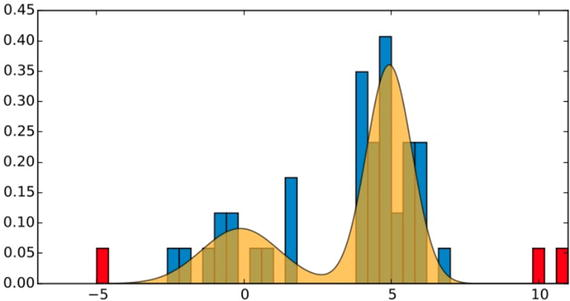

# 九、其他应用

深度学习的应用范围远远超出了前几章提到的范围。本章将概述与业务相关的其他应用。DL 已经融入到许多服务和产品中，包括客户服务、财务、法律、销售、质量、定价和生产。

与此同时，云计算和存储、推动物联网(IoT)的无数数据传感器的激增、量化的自我以及移动设备的普遍使用都在释放技术和经济方面的破坏性力量。机器学习将允许极端的上下文和个性化，使我们有可能将每个客户和每个问题视为独特的。它也将是解决公司在优化运营和预测方面面临的复杂问题的关键，这是机器学习激增的理想场景。

机器学习将使一切程序化，从广告到客户体验，并将允许公司建立更好的应用程序，与人们创造的东西互动，如图片、语音、文本和其他杂乱的东西。这使得公司能够创造出与人类自然互动的产品。

构建机器学习产品需要三个组件:训练数据(有监督或无监督)、软件/硬件和人才。随着软件的商业化和硬件的现场可轻松获得，关键的组成部分是人才和数据，以及在组织中使用它们的流程。

## 9.1 异常检测和欺诈

异常值或离群值是与其余数据分布显著不同的数据点，并且不太可能是它的一部分。异常检测应用于网络入侵检测、信用卡欺诈检测、传感器网络故障检测、医疗诊断等众多领域[CBK09]。

处理异常检测的模型可以分为三类。

*   纯分类模型(根据过去的事件预测欺诈事件的可能性)
*   新颖性检测(异常模式的检测)
*   网络分析(识别单独看起来合法的协同异常事件)

传统的数据分析方法长期以来一直用于检测欺诈，即通过数据库中的知识发现(KDD)、数据挖掘、机器学习和统计。一阶统计的简单评估，如平均值、分位数、性能指标或概率分布，通常用作第一线检测。时间序列分析、无监督聚类(如 k-means)、数据组之间的模式和关联分类以及检测用户交易行为异常的匹配算法构成了第二道防线。

异常检测中的典型方法是数据点的重建误差，即原始数据点与其重建之间的误差；这被用作异常分数。主成分分析(PCA)是用于这种方法的常用方法，其中第一次观察和根据前 n 个 PCA 特征向量的重建之间的距离可以用作观察异常程度的度量。

然而，这些传统方法中的大多数缺乏灵活性来适应不断变化的环境，例如欺诈检测。DNN 方法能够以监督或无监督的方式学习可疑模式。

在监督学习中，通常会抽取数据的子样本，并将其手动分类为欺诈或非欺诈。这是使分类器更少偏差所必需的，因为大多数事件是正常的或非虚假的，通常超过 99%，有时超过 99.99%。有三种类型的无监督技术。

图 9-1

Anomaly detection with density estimation (source: [`https://www.slideshare.net/agramfort/anomalynovelty-detection-with-scikitlearn`](https://www.slideshare.net/agramfort/anomalynovelty-detection-with-scikitlearn) )

*   基于密度的方法:在这种方法中，你拟合一个密度模型，如高斯混合模型，并通过定位不符合分布的点来识别异常(见图 [9-1](#Fig1) )。
*   内核方法:平滑来自内核的数据，并识别平滑之外的点。典型的方法是 OneClassSVM。
*   聚类:这就像最近邻。当一个点离任何聚类都太远时，它就是异常值。

所有这些类型的检测仅能够检测类似于先前已经发生并且已经被人类分类的欺诈。检测一种新型欺诈可能需要使用无监督的机器学习算法。

深度学习非常适合处理这些不平衡的数据集(绝大多数交易都是非数据流的)，因为你可以用所有(未标记的)数据预先训练网络。softmax 监督图层可应用于最后一个图层，但使用平衡数据集。

生成对抗网络也可以用于异常检测和一次性学习，因为它们需要弱监督。例如，米什拉等人使用了一种简单但强大的技术，该技术基于条件变分自编码器`(` [`https://arxiv.org/pdf/1709.00663.pdf`](https://arxiv.org/pdf/1709.00663.pdf) `)`。变分自编码器是一种图形模型，用于学习隐藏的潜在表示 z 相对于数据 x 的分布。条件变分自编码器最大化条件似然 p(x|c)的变分下限，这有助于生成具有期望属性的样本(由类别 c 编码)。然后，可以将重建误差分配给每个类别，并且可以通过一次性学习来生成新的类别。

堆叠式自编码器(SAE)可用于分层降维，从而从数据中获得抽象和更具代表性的特征。[ZCLZ16]提出了一种基于深度神经网络的异常检测建模方法；他们称之为深度结构化基于能量的模型(DSEBM)，其中能量函数是具有结构的确定性深度神经网络的输出。该模型处理静态、顺序和空间数据。新颖之处在于，模型架构适应数据结构，从而匹配或优于其他竞争方法。

Schreyer 等人提出了一种使用深度自编码器网络( [`https://arxiv.org/pdf/1709.05254.pdf`](https://arxiv.org/pdf/1709.05254.pdf) )检测异常的方法。被训练的网络的重构误差被个体属性概率正则化，被解释为高度自适应的异常评估。与强基线相比，这导致异常的检测精度显著提高。

### 9.1.1 欺诈防范

欺诈是银行和保险公司最大的损失之一，在美国每年的损失高达 17 亿美元。欺诈是一个庞大、复杂且非常棘手的问题，涉及针对这些组织的不断变化且更加复杂的计划。

大多数当前检测欺诈的方法在很大程度上是静态的，并且依赖于从历史交易的子集导出的模式。银行基本上查看交易数据，根据一组硬性规则、从过去事件中学习到的试探法以及检测特定交易不合法可能性的机器学习方法来验证给定交易是否有效。对于信用卡支付，这些模型通常可以将欺诈比率从 1:10000 提高到 1:100。然而，没有已知签名的首次欺诈几乎总是被遗漏。协同(网络)类型的欺诈也很难发现，因为每笔交易看起来都是合法的。在保险业，这个问题甚至更难解决，因为涉及到更多的中介机构，存在更复杂的欺诈手段。

剖析(也称为行为描述)试图描述个人、群体或人群的典型行为。例如，“某个客户群的典型手机使用情况是怎样的？”这个问题可能不容易回答，因为它可能需要对夜间和周末通话、国际使用、漫游费、短信分钟等进行复杂的描述。行为可以应用于整个细分市场，也可以应用于小团体甚至个人层面。剖析通常用于建立异常检测的行为规范，例如监控入侵或欺诈。例如，如果一个人通常用信用卡购买的东西是已知的，您可以确定卡上的新费用是否符合该配置文件，并创建分数警报。然而，假阳性的数量通常很高。

另一种处理欺诈和安全的技术是链接预测。它试图通过建议这些节点上的链接并可能估计链接的强度来预测图中节点(人的对象)之间的连接。链接预测在社交网络系统中很常见。例如，为了向客户推荐电影，您可以考虑客户和他们观看或评价的电影之间的图表。在(二分)图中，算法发现客户和电影之间不存在但可能存在的关系。

沙巴尼等人( [`http://arxiv.org/abs/1508.03965`](http://arxiv.org/abs/1508.03965) )最近的一项工作表明，通过识别和对未被发现的与罪犯密切相关的个人进行预防性观察，图表分析在预测芝加哥的暴力犯罪团伙活动方面是有效的。

安等人将变分自编码器(VAE)用于使用来自 VAE ( [`http://dm.snu.ac.kr/static/docs/TR/SNUDM-TR-2015-03.pdf`](http://dm.snu.ac.kr/static/docs/TR/SNUDM-TR-2015-03.pdf) )的重建概率的异常检测方法。该重构概率考虑了数据中更细微的相关性，使其成为比重构误差更好的异常分数，重构误差通常由 AE 和 PCA 使用。由于 vae 是生成模型，它们允许您理解异常背后的特征。

### 9.1.2 在线评论中的欺诈

在线评论中的欺诈也越来越普遍。虚假评论是由撰写它们的企业或购买评论者撰写的，以提高其产品的受欢迎程度或降低竞争力。对于电子商务来说，识别并删除这些评论以保持客户的信任至关重要。虚假评论可能占到评论总数的 80%。各种特征可用于欺诈检测，例如评级、评论、时间戳和相关性。这个问题可以描述为:给定一组用户、产品和带有时间戳的评级，计算每个用户的可疑性得分。大多数算法使用时间方法来检测评级欺诈，方法是捕捉在短时间内收到大量正面或负面评论的产品，通过欺诈性评论的突然增加来检测，以偏向流行度或诋毁其竞争对手。另一种方法是基于对评分分布的分析，以找到对产品的评分与其他用户非常不同的用户。

这个问题可以用贝叶斯方法来描述，这是在具有极端评级分布的用户和具有大量评级的用户之间建立良好平衡的自然选择。这就给了这个问题一个很自然的答案:“一个 20 分平均 5 分的用户比一个 100 分平均 4.8 分的用户更可疑吗？”关于假冒内容检测应用的最近应用，参见 [`https://arxiv.org/pdf/1703.06959.pdf`](https://arxiv.org/pdf/1703.06959.pdf) 。

虚假评论变得更加难以检测，因为最近的一项工作显示，神经网络可以生成几乎与人类无法区分的人工评论； [`https://arxiv.org/pdf/1708.08151.pdf`见](https://arxiv.org/pdf/1708.08151.pdf)。在这项工作中，作者使用字符级 LSTM 和编码器-解码器架构来生成很少有人能识别为假的餐馆虚假评论。这里有一些虚假评论的例子(注意，有一些风格的一致性；评论是假装青少年用户写的):

*   “我喜欢这个地方。我来这里已经很多年了，这是一个和朋友家人一起出去玩的好地方。我喜欢这里的食物和服务。我在那里时从未有过不好的经历。”
*   “我吃了带薯条的烤蔬菜汉堡！！！！哦，还有味道。Omgggg！很有味道！太好吃了，我都没拼出来！!"
*   “我和我的家人都是这个地方的超级粉丝。员工非常好，食物也很棒。鸡肉很不错，蒜蓉酱也很完美。水果冰淇淋也很好吃。强烈推荐！”

## 9.2 安全和预防

随着信息的数字化，公司越来越容易受到各种类型的攻击。入侵检测对网络安全至关重要。除了检测网络攻击之外，入侵检测还有助于发现异常的系统行为，从而检测事故或不良情况。

2016 年，卡巴斯基记录了超过 6900 万次恶意代码攻击，2.61 亿个唯一 URL 被 web 防病毒组件识别为恶意。恶意代码分析和检测是入侵检测技术中的一个关键问题。恶意代码的检测目前分为两种方法:基于主机和基于网络。机器学习可以通过学习入侵代码与正常代码的特征来有效地检测恶意代码。Long 等人[LCWJ15]综述了各种恶意代码检测应用中的各种特征提取方法和机器学习方法，包括朴素贝叶斯、决策树、人工神经网络、支持向量机等。虽然这些方法取得了一些成功，但特征提取并不合适，因为检测率和检测精度不高，并且算法复杂。

深度学习技术已被证明优于浅层学习模型(如支持向量机)——例如参见 [`https://pdfs.semanticscholar.org/45ba/f042f5184d856b04040f14dd8e04aa7c11f6.pdf`](https://pdfs.semanticscholar.org/45ba/f042f5184d856b04040f14dd8e04aa7c11f6.pdf) 。基于 LSTM 单位的模型能够模拟复杂的时间依赖性。关于 LSTM 检测信用卡欺诈的应用的回顾，见 [`http://thirdworld.nl/credit-card-transactions-fraud-detection-and-machine-learning-modelling-time-with-lstm-recurrent-neural-networks`](http://thirdworld.nl/credit-card-transactions-fraud-detection-and-machine-learning-modelling-time-with-lstm-recurrent-neural-networks) 。

在 [`https://www.technologyreview.com/s/601955/machine-visions-achilles-heel-revealed-by-google-brain-researchers/`](https://www.technologyreview.com/s/601955/machine-visions-achilles-heel-revealed-by-google-brain-researchers/) 中，库拉金等人证明了对抗性的例子(与真实数据几乎无法区分的输入数据)可以很容易地欺骗图像分类器。以前的研究假设直接访问 ML 分类器，这样对立的例子是直接馈入模型的细粒度的每像素修改。相反，这项工作表明，当通过手机摄像头感知图像时，为愚弄预先训练的 ImageNet 初始网络而创建的对立例子也会被错误分类。

在 [`http://homepages.inf.ed.ac.uk/csutton/publications/leet08sbayes.pdf`](http://homepages.inf.ed.ac.uk/csutton/publications/leet08sbayes.pdf) 中，作者探索了使用机器学习来颠覆垃圾邮件过滤器。

Deep Instinct 了解所有恶意软件和自我更新的共同特征。Deep Instinct 使用卷积神经网络(CNN ),根据一组带标签的数据进行训练——对于在线网站，图像像素带有一组主题元数据，而对于 Deep Instinct，则是二进制可执行文件。它将相同的技术应用于可执行文件。

在 [`https://people.csail.mit.edu/kalyan/AI2_Paper.pdf`](https://people.csail.mit.edu/kalyan/AI2_Paper.pdf) 中，来自麻省理工学院和机器学习初创公司 PatternEx 的研究人员展示了一个名为 AI2 的人工智能平台，该平台通过不断整合人类专家的输入，比现有系统更好地预测网络攻击。AI2 可以检测到 85%的攻击，大约是以前基准测试的三倍，同时还将误报数量减少了五分之一。

## 9.3 预测

开发了几种用于预测的机器学习算法，如多层感知器、贝叶斯神经网络、K-最近邻回归、支持向量回归和高斯过程。深度架构允许出现复杂的模型，这些模型可以超越传统的统计方法，如自回归综合移动平均(ARIMA)。

能源预测是一个至关重要的问题，因为过度需求会导致中断，而过度供应则会被浪费。在美国这个每年价值超过 1 万亿美元的行业中，每一个微小的进步都会产生巨大的影响。由于大型数据集的可用性，ML 对能量负荷很感兴趣。Busseti 等人使用 2012 年全球能源预测竞赛 Kaggle 竞赛的数据，使用 DL 算法进行能源需求预测，仅使用时间和温度数据来预测不同电网区域的能源负荷。数据包括 20 个不同地理区域四年半的每小时需求和 11 个区域的类似每小时温度读数。由于庞大的数据集，他们能够实现复杂的非线性模型，而不会过度拟合。他们使用了一个循环神经网络，实现了 530kWh/h 的 RMSE 和 99.6%的测试数据相关性，这几乎是前馈神经网络错误率的一半。他们还在输入数据中使用了基于到质心的平方指数距离的内核化局部回归。

对于几种深度学习算法以及一些传统算法的比较，对于能源预测，请参见 [`https://www.jesuslago.com/wp-content/uploads/forecastingPrices.pdf`](https://www.jesuslago.com/wp-content/uploads/forecastingPrices.pdf) 。

凯利等人使用了一个模型( [`https://arxiv.org/pdf/1507.06594.pdf`](https://arxiv.org/pdf/1507.06594.pdf) )用于一个能源分解装置，该装置通过测量家庭电力需求的单个电表来计算电力消耗。他们使用了三种深度神经网络架构来进行能量分解:一种具有 LSTM 的递归网络形式，去噪自编码器，以及一种作为时间回归的网络。

请参见 [`https://arxiv.org/pdf/1703.00785.pdf`](https://arxiv.org/pdf/1703.00785.pdf) 了解当前用于负载分解和能源预测的深度学习方法的概述。

天气预报是一个复杂的问题，它以时空网格的形式使用了以前条件下的许多测量数据。目前的预测模型是基于巨大的基于网格的有限元方法计算。微分方程中流体动力学的大集合被迭代求解，结果被用作下一步的初始条件。这在计算上极其昂贵，并且由于每个预测时间步长的误差增加，预测精度受到限制。Xi 等人使用 3D 卷积神经网络与带有 STM 细胞的神经网络的组合来建立精确的预测模型，使用多达 1 亿个参数，可从一端到另一端进行训练。提前两天的天气预报，在笔记本电脑上只需不到 0.1 秒，比在超级计算机上需要几个小时计算的模型更准确； [`http://arxiv.org/pdf/1506.04214v2.pdf`见](http://arxiv.org/pdf/1506.04214v2.pdf)。

Epelbaum 等人( [`https://hal.archives-ouvertes.fr/hal-01598905/document`](https://hal.archives-ouvertes.fr/hal-01598905/document) )应用了一些深度学习网络架构来预测巴黎的交通模式。这些算法旨在处理汽车数据的历史速度，以预测道路交通数据。

流体和烟雾的实时模拟是计算机图形学中的一个难题，其中最先进的方法需要大量的计算资源，使得实时应用通常不切实际。Tompson 等人提出了一种基于神经网络的数据驱动方法，以获得快速和高度逼真的模拟；在 [`http://cims.nyu.edu/schlacht/CNNFluids.htm`](http://cims.nyu.edu/schlacht/CNNFluids.htm) 看他们的作品和一些视频。他们使用来自一组模拟训练的卷积网络，使用半监督学习方法来最小化长期速度发散。结果令人印象深刻。

优步使用循环神经网络( [`https://eng.uber.com/neural-networks/`](https://eng.uber.com/neural-networks/) )来预测对其服务的需求并削减运营成本。该模型使用 LSTM RNN，总部设在 TensorFlow 和 Keras。该公司利用来自美国多个城市的五年数据训练了一个模型。在对一组数据进行测试时，得到的 RNN 具有很好的预测能力，这些数据包括圣诞节等主要节日之前、期间和之后七天内在美国多个城市的旅行，尽管它可以预测一些高峰，因为它们很少见。这个系统在处理尖峰假期方面明显更好，并且它稍微提高了其他日子的准确性，例如 MLK 日和独立日。

### 9.3.1 交易和对冲基金

投资管理行业正密切关注人工智能的最新进展。像贝莱德、布里奇沃特和施罗德这样的老牌资产管理公司和对冲基金正在投资这项技术，以建立可能超越人类的投资平台。不管这个目标看起来有多未来，人工智能的最新成就正在推动人们认为可能的极限。

神经网络是量化基金经理长期放弃的一个研究领域，因为过去试验的投资决策不透明，而且往往很糟糕。然而，近年来情况发生了巨大变化。深度学习被证明能够解决人类最难解决的难题，并设计复杂的策略来赢得围棋或扑克比赛。DL 神经网络可能是第一个被称为直觉的机器。

对于对冲基金来说，这些超人的认知能力可能代表着从错综复杂的金融市场中获取洞察力的明显优势。对冲基金管理公司 Man Group 的量化部门 AHL 是目前正在探索深度学习是否可以应用于投资的人之一。纽约基金经理欧几里德也在探索其可能性。

神经网络和深度学习只是多面人工智能世界的一个领域。但是用清晰的规则和完全可观察的状态打败一个游戏是一回事。市场更难理解。许多新的专注于人工智能的对冲基金可能会失败，但投资行业正处于彻底转型的风口浪尖的感觉是不可避免的。

Sirignano ( [`https://arxiv.org/pdf/1601.01987v7.pdf`](https://arxiv.org/pdf/1601.01987v7.pdf) )使用了一个空间神经网络来模拟下一次状态变化时最佳买价和卖价的联合分布。该模型还考虑了变化后的最佳买价和卖价的联合分布，以预测限价订单簿的变化。他使用了一个 4 层的神经网络，每个隐藏层有 250 个神经元，而空间神经网络有 50 个单元。辍学是用来防止过度拟合。该模型在 2014 年至 2015 年期间对超过 489 只股票进行了训练，使用了 200 个特征描述的 50TB 数据:前 50 个非零买价和卖价水平的限价订单簿的价格和规模。他可以提前一秒钟预测订单，还可以预测下一次买卖价格变化的时间，声称与逻辑回归相比，错误率降低了 10%。

费勒和费耶里格尔[FF15]使用递归自编码器，根据金融新闻标题中的文字来预测德国股票的回报。他们使用了德国市场的英语特别新闻公告数据集(8，359 个标题)，涵盖了 2004 年至 2011 年的新闻。他们达到了 56%的准确率，这比随机森林(准确率为 53%)有了相当大的提高。

熊等人预测了([`https://arxiv.org/pdf/1512.04916.pdf`](https://arxiv.org/pdf/1512.04916.pdf))S&p500 的日波动率，从开盘价、高价位、低价位、收盘价来估计。他们使用一个单一的 LSTM 隐藏层组成的一个 LSTM 块。他们使用每日标准普尔 500 的收益和波动性作为输入。它们还包括 25 个国内谷歌趋势，涵盖经济的部门和主要领域。他们使用每批 32 个样品的 Adam 方法，并使用平均绝对百分误差(MAPE)作为客观损失函数。他们设定 LSTM 的最大滞后包括 10 次连续观测。结果，他们的 LSTM 方法胜过了 GARCH，Ridge 和 LASSO 技术。

2016 年，希顿等人试图( [`https://arxiv.org/abs/1605.07230`](https://arxiv.org/abs/1605.07230) )创建一个跑赢生物技术指数 IBB 的投资组合。他们的目标是用少量股票和较低的验证误差来跟踪指数。他们还试图通过在大规模提款期间反相关来跑赢指数。他们没有直接模拟协方差矩阵；相反，它是在深度架构拟合过程中训练的，这允许非线性。他们使用带有正则化和 ReLUs 的自编码。他们的自编码器有一个由五个神经元组成的隐藏层。在训练中，他们使用了 2012 年至 2016 年 IBB 成份股的周收益率数据。他们对指数中的所有股票进行自编码，并评估每只股票与其自编码版本之间的差异。他们保留了与自编码版本最相似的十种最“共有”的股票。他们还保留了不同数量的其他股票，这些股票的数量是通过交叉验证选择的。对于结果，他们显示了跟踪误差作为投资组合中股票数量的函数，但似乎没有与传统方法进行比较。他们还用正回报取代了指数缩水，并找到了跟踪这一修正指数的投资组合。

## 9.4 医学和生物医学

深度学习已经在医疗保健行业产生了强大的影响，因为学习算法的容量和准确性增加了，并且因为大量医疗保健数据的广泛可用性，通过数字化(结构化和非结构化)医疗记录以及个人遗传数据和其他源自移动设备的个性化数据成为可能。

然而，ML 技术在医学上的应用有很长的失败历史。其中，一个特别棘手的方面是个体之间的可变性，这导致更简单的机器学习算法错过模式并给出错误的答案，这在对错误容忍度低的领域中是特别敏感的。

然而，正如戴夫·钱宁正确指出的那样，将人工智能应用于医学的一个大障碍是要有一个可靠的“真实”来源来训练机器。给定图像的真实解释是什么？一系列不常见症状背后的原因是什么？如果是一种罕见的疾病，统计数据将无济于事，这些症状可能会很容易地欺骗机器，以标记更多的常见病例。众包症状可以是一个解决方案，但它更棘手，因为它需要专门的信息来做出明智的决定。由于设备和诊断条件的可变性，该问题甚至更加复杂。最后，还有一个问题是如何处理要求可解释性的繁重的监管实体。dnn 是黑匣子，得出某个结论后再去找机器解释是没有希望的。令我们欣慰的是，人类专家对复杂情况的共识也很少。

### 9.4.1 图像处理医学图像

在物体识别和面部识别方面实现了人类水平的性能后，深度学习在医学成像处理的应用中具有巨大的潜力，在这个领域，主观解释是常见的，上下文是消除几种可能解释的关键。

一些公司正在应用 DL 来识别 X 射线等医学图像中的癌症，许多自动化图像识别工具已经在医院中使用。然而，基于医学图像处理的诊断只是医学领域中 DL 潜力的一小部分。然而，有几个挑战，如缺乏训练图像，缺乏全面的注释，向罕见疾病倾斜的分布，以及非标准化的注释度量。

有关生物医学图像数据集的更多信息，请访问 [`https://medium.com/the-mission/up-to-speed-on-deep-learning-in-medical-imaging-7ff1e91f6d71`](https://medium.com/the-mission/up-to-speed-on-deep-learning-in-medical-imaging-7ff1e91f6d71) 。

深度学习算法今天在阿尔茨海默病检测、骨折检测和乳腺癌诊断方面比人类更精确，如图 [9-1](#Fig1) 所示。

这些是一些致力于医学成像深度学习的初创公司:

*   Enlitic 使用医学图像和其他患者记录的系统来帮助医生诊断和治疗复杂的疾病。它在 2015 年 10 月筹集了 1000 万美元。
*   Lumiata 使用广泛的医疗记录数据库来填充病史知识图表。它最近筹集了 1000 万美元。
*   Synapsify 构建了一些应用程序，这些应用程序可以像人类一样从书面内容中进行语义读取和学习，以加速发现。
*   谷歌 DeepMind 研究项目与伦敦 Moorfields 眼科医院合作，致力于黄斑变性的早期检测。这项工作包括分析视网膜的光学相干断层扫描。
*   波士顿的马萨诸塞州总医院启动了其临床数据科学中心，以创建一个专注于使用人工智能技术诊断和治疗疾病的中心。许多创业公司已经着手解决这个问题，但这是一家重量级的医疗保健提供商做出的宣布，英伟达是其创始技术合作伙伴。
*   DL 正在帮助盲人和视力受损者“看见”微软最近的一个项目展示了一个名为 Seeing AI ( [`https://www.youtube.com/watch?v=R2mC-NUAmMk`](https://www.youtube.com/watch?v=R2mC-NUAmMk) )的新视觉项目，该项目使用计算机视觉和 NLP 来描述一个人的周围环境，阅读文本，回答问题，并识别人脸上的情绪。百度有个类似的产品叫 DuLight。脸书已经开始向盲人和视障人士提供其内容。
*   基于一种读取大脑活动并直接连接到肌肉的技术，ML 也使截瘫患者重新获得一些控制和行动能力成为可能，超越了受损的神经回路。生理学。org/ doi/ pdf/ 10。1152/ physrev。​00027.2016 。
*   iCarbonX 的近期目标是从基因组、医学和生活方式数据中预测疾病的发作。
*   Veritas Genetics 是一家提供直接面向消费者的全基因组测序以及产前测试和乳腺癌靶向筛查的公司，通过收购生物信息学公司 Curoverse 进军人工智能。他们一起致力于改善疾病风险评分和遗传学与疾病的因果关系。
*   该领域的其他公司包括 BayLabs、Imagia、MD.ai、AvalonAI、looke . ai 和 Kheiron Medical。

DL 不仅可以用于分析图像，还可以用于分析文本(病历)、数百万项关于药物有效性和药物相互作用的研究和医学研究，甚至可以用于分析遗传学，以创建量身定制的假设以及准确的诊断和个性化治疗。Watson for Medical 是最知名的技术，但也有许多初创公司在这一领域开展工作。例如，见 [`http://www.sciencedirect.com/science/article/pii/S1532046417300710`](http://www.sciencedirect.com/science/article/pii/S1532046417300710) 。

一些公司，如 Apixio，通过挖掘医疗记录来分析文本，并将其应用于帮助保险提供商对他们的哪些病人患有哪些疾病进行分类。这种分类过程通常由人工完成，包括将书面诊断与一组医学数字代码进行匹配。

病理学家的报告对于评估和设计癌症治疗程序至关重要。其中一个输入是患者的生物组织样本，由分辨率高达 30，000×30，000 像素的若干载玻片组成，分辨率可达细胞水平的μm。这是一项复杂而耗时的任务，需要多年的培训。

然而，在不同的病理学家对同一患者进行的具有癌细胞的组织的识别中可能存在很大的可变性，从而导致误诊。某些形式的乳腺癌的诊断符合率可能低至 50 %,前列腺癌的诊断符合率也同样低。

Camelyon 2017 Challenge 是一项国际比赛，旨在评估已经扩散(转移)到乳房附近淋巴结的乳腺癌定位算法的质量。在本次比赛的最新版本中，深度学习算法实现了超越人类的精度水平；`https://camelyon17.grand-challenge.org/results/`见。详细解释见 [`https://arxiv.org/pdf/1606.05718.pdf`](https://arxiv.org/pdf/1606.05718.pdf) 。作者获得了整个载玻片图像分类任务的受试者操作曲线下面积(AUC)为 0.97，肿瘤定位任务的得分为 0.89。病理学家独立审查了相同的图像，获得了 0.96 的全切片图像分类 AUC 和 0.73 的肿瘤定位分数。这些结果证明了使用深度学习在病理诊断的准确性方面产生显著改善的能力。图 [9-2](#Fig2) 总结了深度学习在医学图像处理中的影响。

图 9-2

Impact of DL in medical image (source: ARK report)

### 9.4.2 组学

在基因组学、蛋白质组学或代谢组学中，遗传信息(转录组和蛋白质组)数据由一组原始序列组成，通常是 DNA 或 RNA。由于下一代测序技术，这些数据已经变得可以负担得起了。此外，蛋白质接触图(显示三维结构中氨基酸对的距离)和微阵列基因表达数据也很容易获得。

研究最多的问题之一是蛋白质的二级结构预测或接触图。DNNs 已广泛应用于蛋白质结构预测研究。陈等人【CLN + 16】将应用于微阵列和 RNA 转序列表达数据，仅从 1000 个标志性基因中推断出多达 21000 个目标基因的表达。Asgari 等人[AM15]采用了 skip-gram 模型(在 Word2vec 上使用),并表明它可以有效地学习生物序列的分布式表示，具有许多“组学”应用的一般用途，包括蛋白质家族分类。

基因表达调控(包括剪接点或 RNA 结合蛋白)和蛋白质分类也在积极研究中。CNN 可以被训练来同时预测密切相关的因素。一维 CNN 也已经用于生物序列数据。Alipanahi 等人分别提出了基于 CNN 的转录因子结合位点预测和 164 细胞特异性 DNA 可及性多任务预测方法，用于疾病相关遗传变异体的鉴定。周等人[ZT15]提出了一个基于 CNN 的算法框架(DeepSEA)，根据预测来学习转录因子结合和疾病相关的遗传变异。

桑德比等人[SSN+15]应用了具有 LSTM 隐藏单元和一维卷积层的双向 RNNs 来学习氨基酸序列的表示，并对蛋白质的亚细胞位置进行分类。Lee 等人[LBP + 16]将 RNNs 应用于 microRNA 识别和靶预测，并获得了最先进的结果。

转录组学分析利用各种类型转录物(信使 RNA、长非编码 RNA、微小 RNA 等)丰度的变化。)来收集一系列的功能信息，从剪接密码到各种疾病的生物标志物。转录组数据通常从不同类型的平台(各种微阵列平台、测序平台等)获得。)的差异在于所测量的基因组和信号检测的方法。许多因素导致基因表达数据的可变性。因此，即使是单平台分析也需要标准化。跨平台分析需要标准化技术，这可能是一个重大挑战。dnn 特别适合于跨平台分析，因为它们具有很高的泛化能力。他们也准备好处理基因表达数据的一些其他主要问题，如数据集的大小和维数减少和选择性/不变性的需要。

虽然在外科手术中，只有 36%的任务可以在未来几年内由人工智能取代，但对放射科医生来说，这一数字可能高达 66%。

机器学习技术可以用来从医学图像中发现不同类型的异常，如乳腺癌、皮肤癌和眼病。由吴恩达领导的斯坦福大学的一个团队已经表明([`https://www.technologyreview.com/s/608234/the-machines-are-getting-ready-to-play-doctor/`](https://www.technologyreview.com/s/608234/the-machines-are-getting-ready-to-play-doctor/))ML 模型可以比专家更好地从心电图(ECG)中识别心律失常。该团队训练了一种 DL 算法，以识别心电图数据中不同类型的不规则心跳。一些违规行为可能会导致严重的健康并发症，包括心脏性猝死，但信号可能很难检测到，因此患者经常被要求佩戴心电图传感器数周。即使这样，医生也很难区分良性和需要治疗的异常。他们从不同形式的心律失常患者那里收集了 30，000 个 30 秒的剪辑。为了评估他们算法的准确性，该小组将它的性能与五位不同的心脏病专家在 300 个未诊断片段上的性能进行了比较。一个由三名心脏病专家组成的小组提供了一个基本事实判断。

### 9.4.3 药物研发

机器学习的最新进展对药物发现做出了重大贡献。在推断小分子化合物的性质和活性时，深度神经网络尤其在预测能力方面提供了显著的提升。Mamoshina 等人( [`https://www.ncbi.nlm.nih.gov/pubmed/28029644`](https://www.ncbi.nlm.nih.gov/pubmed/28029644) )使用生成对抗自编码器(AAE)为药物发现生成新的分子指纹。他们使用了一个七层 AAE 架构，其中潜在的中间层作为鉴别器。作为输入和输出，AAE 使用二进制指纹和分子浓度的向量。在潜伏层中，他们还引入了负责生长抑制百分比的神经元，当其为阴性时，表明治疗后肿瘤细胞数量的减少。他们用 NCI-60 细胞系分析数据对 AAE 进行了训练，这些数据针对 MCF-7 细胞系中的 6252 种化合物。AAE 的输出被用于筛选 PubChem 中的 7200 万种化合物，并选择具有潜在抗癌特性的候选分子。

计算机辅助药物设计(CADD)具有巨大的潜力，但也存在一些挑战，无论是基于结构的药物设计(药物结合的蛋白质三维结构)，还是基于配体的药物设计(化学和定量结构活性关系[QSAR])。在过去的几十年里，许多被批准的药物是 CADD 在识别和筛选具有特定生物活性的小分子方面所做的巨大努力的结果。

然而，生物学是一个极其复杂的系统，CADD 只是克服药物发现挑战的许多步骤之一。我们可能还远远没有实现这样一个世界，即计算机发现药物，在一群机器人化验中进行虚拟测试，然后只需点击几下鼠标就能把药物送到患者手中。在计算机上，CADD 的平台很容易超负荷，并且经常不能交付实际的预期项目。不是“软件吃掉生物技术”，今天药物发现的现实是生物吃掉一切。候选新药的主要失败模式源于一个简单的事实:人类生物学极其复杂。干扰错误靶点或系统的候选药物会导致不良结果(“脱靶”毒性)。它们可以干扰正确的目标，但产生错误的效果(“对目标”或基于机制的毒性)。他们通常是杂乱的，与许多事物相互作用，一些是已知的，许多是未知的。除了它们的目标药理学，药物还以无数方式与人体相互作用，使它们无效或更糟(吸收、分布、代谢和排泄是四个重要方面)。而且，至关重要的是，生物学可能无法改善特定疾病、降低死亡率或提高生活质量。经常选择错误的目标进行询问，这是第二阶段及以后损耗的主要原因。更具挑战性的是，患者之间的差异(甚至物种之间的差异！)也导致了复杂性的增加，有好的(有见地的)也有坏的(不幸的)。公平地说，即使药物获得批准，我们也不了解它们的一切。

几家公司正在利用 DNN 的计算能力和现有的生物医学数据来加快 sillico 的药物发现。一种药物的发现可能需要数十年和数亿美元，而且失败率很高。机器学习可以加快这一过程，并在一小部分时间和成本内快速发现新药。这方面有很多公司在做，像递归( [`https://www.recursionpharma.com/`](https://www.recursionpharma.com/) )、仁者 AI ( [`http://benevolent.ai/`](http://benevolent.ai/) )、Atomwise ( [`www.atomwise.com/`](http://www.atomwise.com/) )，包括大制药。

布伦丹·弗雷(Brendan Frey)领导的 Deep Genomics ( [`https://www.deepgenomics.com/`](https://www.deepgenomics.com/) )公司能够训练一个神经网络来破译 RNA 非编码区背后的代码。基本上，它考虑用更长的核苷酸序列来训练一个深度网络。

## 9.5 其他应用

以下几节重点介绍一些其他应用。

### 9.5.1 用户体验

深度学习正在成为核心技术，使真正自然、无摩擦的用户与机器交互成为可能。语音识别已经达到人类水平的准确性，使语音而不是关键词成为与智能手机和其他智能设备交互的自然方式。这已经在个人助理亚马逊 Echo 或谷歌 Home 等产品中成为现实。这些设备专为全语音交互而设计，用自然语言回答问题。它们还可以与其他家用设备集成，创建更好的能源管理和安全系统。

DL 将通过交互和个性化来帮助重塑用户体验，以模糊人类和机器之间的界限。界面可以被简化、抽象，甚至对用户完全隐藏。UX 程序员的传统思维(如何创建滚动页面、按钮、点击和点击)是基于一个旧的范例。DL 输入允许非常自然的交互和个性化； [`https://techcrunch.com/2016/08/15/using-artificial-intelligence-to-create-invisible-ui/`见](https://techcrunch.com/2016/08/15/using-artificial-intelligence-to-create-invisible-ui/)。

设备需要更多地了解我们，才能让隐形 UI 成为现实。今天的语境意识是有限的。例如，当通过谷歌地图问路时，系统知道你的位置，如果你是在纽约还是在加利福尼亚，它会返回不同的结果。

但是，即使有了所有的传感器和数据，机器也需要更多地了解我们，了解我们的世界正在发生什么，才能创造出我们真正需要的体验。一种解决方案是结合多个设备/传感器的能力来收集更多信息。但这通常会缩小和限制用户群——这并不是一件容易向客户推销的事情。

### 9.5.2 大数据

数据呈指数级增长，其中 80%是非结构化数据(如社交媒体、电子邮件记录、通话记录、客户服务、竞争对手和合作伙伴定价)，这使得公司能够增强预测并探索隐藏的模式。DL 对于处理未标记的数据特别有用，因为它广泛使用了无监督的方法。

多模态学习将允许人们第一次将文本、声音、图像甚至视频结合在一个联合的知识表示中；这是一项已经在图像搜索中实现的技术。这将允许高级查询，例如“给我看一些与此图像相关但颜色更亮或形状更瘦的东西”，或者甚至“给我看一部电影，其中有一个场景是一个金发女孩在埃菲尔铁塔附近的日落时接吻”，或者甚至“给我看一个场景，其中有来自街道交通的巨大噪音。”

尽管人们对聊天机器人议论纷纷，但它们肯定会改变用户与内容互动的方式。对话比查询更自然，因为它可以通过迭代过程将问题置于上下文中。此外，它可以针对每个客户进行个性化设置，可以了解客户的更多信息，而且，也许最重要的是，这是一种更自然的交互。

谷歌最近为 Gmail 账户推出了自动回复选项，将根据谷歌人工智能建议的三个回复发送回复；它只对某些消息有效。您也可以使用建议的回答作为起点，根据自己的喜好编辑或添加文本。智能回复是基于 DNN 来预测一封电子邮件是否是某人可能会写一封简短回复的邮件。

## 9.6 未来

算法正在朝着我们留给人类的不那么传统和意想不到的任务发展。例子包括打扑克，处理谈判，甚至锻造关系。训练正从严格监督向更高层次、弱监督甚至无监督的模式演变。一个例子是通过展示一些例子来教机器人执行复杂的任务。强化学习的一个例子是，你输入游戏规则，算法通过与自己对抗来发现策略。

谈判是一个几年前不可想象的领域，你可以期待在这个领域取得重大进展。大多数聊天机器人已经可以进行简短的对话，并完成简单的任务，如预订餐馆或带语音助手的发型师。然而，建造能够与人类进行有意义对话的机器在不久的将来可能是遥不可及的，因为它需要对对话的理解和对世界的知识。

脸书人工智能研究(FAIR)团队发表了一篇论文( [`https://arxiv.org/abs/1706.05125`](https://arxiv.org/abs/1706.05125) )介绍了具有协商能力的对话代理。研究人员表明，目标不同的对话代理可以与其他机器人或人进行从头到尾的谈判，同时达成共同的决定。值得注意的是，这些机器人可以达到不同的目标，解决冲突，然后谈判达成妥协。

每个代理都有自己的价值函数，表示它对每种类型的项目的关心程度。正如在生活中一样，双方都不知道对方的价值函数，必须从对话中推断出来。公平研究人员创造了许多这样的谈判场景，总是确保双方不可能同时得到最好的交易。

谈判同时是一个语言问题和一个推理问题，在这个过程中，一个意图必须被表达出来，然后在口头上实现。这种对话包含合作和对抗的成分，要求代理理解和制定长期计划，并生成话语来实现他们的目标。

具体来说，FAIR 开发了一种新技术，其中代理通过在对话结束时推出对话模型来模拟未来的对话，以便可以选择具有最大预期未来回报的话语。