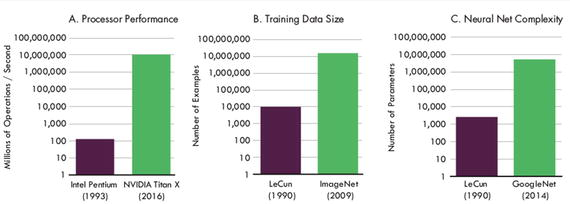
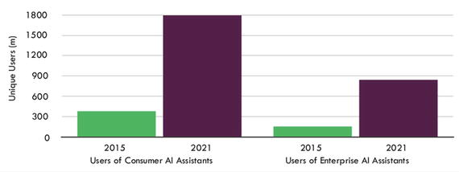

# 十、DL 技术的业务影响

“很长一段时间，我对深度学习持怀疑态度，但现在的进展是真实的。结果是真实的。很管用。”——美国企业家马克·安德森

计算成本的下降和访问云管理集群的便利性以一种我们从未见过的方式使人工智能民主化。在过去，建立一个计算机集群来训练一个深度神经网络是非常昂贵的。你还需要一个拥有数学博士学位的人来理解关于循环神经网络等主题的学术研究论文。如今，用一台配有 GPU 的电脑，每月花几百美元就可以运行一个集群一整夜来试验新的算法。

人工智能已经从实验室出现，并坚定地进入商业世界，对流程和服务的自动化产生了巨大影响。例如，人工智能支持的 CRM 系统可以根据客户、公司和销售代表的信息，使用旨在最大化销售可能性的算法，实时向销售代表提供线索。

公司被迫建立自己的人工智能能力和团队，而不是依赖第三方顾问来获得这一关键能力。人工智能不能被视为一蹴而就的过程，而是商业战略中至关重要的组成部分。

DL 将深刻影响每一个行业，包括汽车工业、机器人、无人机、生物技术、金融或农业。根据 ARK Invest 的研究，基于深度学习的公司将在未来二十年内释放数万亿美元的生产力收益，并为全球股票增加 17 万亿美元的市值； [`https://ark-invest.com/research/artificial-intelligence-revolution`见](https://ark-invest.com/research/artificial-intelligence-revolution)。

以下是来自 [`https://ark-invest.com/research/artificial-intelligence-revolution`](https://ark-invest.com/research/artificial-intelligence-revolution) 的一些主要预测:

*   到 2036 年，深度学习公司创造的市值将达到 17 万亿美元
*   到 2027 年，自主按需运输的收入将达到 6 万亿美元
*   到 2022 年，数据中心深度学习处理器的收入将达到 60 亿美元，在 5 年内增长超过 10 倍
*   160 亿美元的诊断放射学潜在市场
*   通过提高信用评分节省 1000 亿到 1700 亿美元的成本和利润
*   到 2035 年，自动化将为美国带来 12 万亿美元的实际 GDP 增长

自英特尔最初的奔腾处理器以来，处理器性能已经提高了大约五个数量级。但是深度学习程序的性能也取决于用于训练的数据量。由于互联网的规模和范围，深度学习以最小的成本访问非常大的数据集而蓬勃发展。虽然 1990 年的 LeCun 手写阅读器使用了从美国邮政服务收集的大约 10，000 个样本，但 2009 年的 ImageNet 数据集包含超过 1，000 万个高分辨率照片的例子。此外，百度的 DeepSpeech 是在超过 10，000 小时的音频数据上训练的，而传统数据集中只有几百小时。

从自由“参数”的数量来看，神经网络本身已经变得更大、更复杂。如今，拥有十亿个参数的网络很常见。更大的网络允许更强的表达能力来捕捉数据中的关系。今天的深度学习网络大约有一千万个参数，比 LeCun 最初的手写阅读器多四个数量级(见图 10-1 )。

图 10-1

Evolution of computational power and artificial neural networks

## 10.1 深度学习机会

基于深度学习的人工智能已经在改变大多数行业。人工智能将从根本上改变和自动化公司内部的众多功能，从定价、预算分配、欺诈检测和安全到营销优化。但对于一个充分利用人工智能的组织来说，它需要完全集成到所有不同的部门和职能中；这将使组织真正变得以客户为中心。

深度学习非常适合广告和点击信息等数据密集型活动。大多数数据将由手机收集，无数设备将提供实时地理参考信息。多模态学习将允许公司将文本、图像、视频和声音整合到一个统一的表示中。

应用于自动驾驶汽车等特定领域的 DL 技术的影响是显而易见的，其后果可能会彻底改变交通系统和汽车所有权。在其他领域，影响可能看起来不那么明显和直接；然而，随着 DL 技术的进步，更多的行业也将面临被颠覆的风险。将列举一些。

## 10.2 计算机视觉

深度学习算法是一种关键工具，用于自动化和加速对传感器生成的数据(包括图像)激增所产生的大型数据集的分析。

虽然基本的算法是相同的，但是信息的使用方式是不同的。计算机视觉在以下行业有着广泛的应用:汽车、体育和娱乐、消费和移动、机器人和机器视觉、医疗以及安全和监控。Tractica 估计这些细分市场的潜在市场总额为 350 亿美元。

然而，很少有公司拥有培训和部署机器视觉产品的专业知识和计算基础设施。计算机视觉即服务现在可以通过许多行业参与者的 API 获得，如微软和谷歌。这些服务允许公司将图像处理卸载到云中，对每张图像收费。服务包括分类、光学字符识别、面部检测和徽标检测。与亚马逊众包 Mechanical Turk 等服务的人工图像读取相比，这些基于云的 API 大约便宜一个数量级。

## 10.3 人工智能助手

由 DNNs 支持的 GAIs 最大、最直接的影响可能不是在机器人领域，而是在客户服务领域。在不久的将来，发送特定电子邮件、移动推送或特定商店或活动的客户通行证等服务可能会实现自动化，高级分析工具甚至会实现一些支持决策流程的自动化。联络中心处理非常普通的互动，很快将通过聊天机器人和个人助理等自动化信息服务。人工智能可以帮助建议如何进行对话、用户兴趣和产品。它甚至可以使用这些数据进行二次提议，例如基于以前交互的风险评估。

人工智能助手是能够进行人类水平的语音和理解的计算机程序。能够与人类对话、理解需求并帮助完成任务的算法将有利于提高生活质量和全球生产率。直到最近，这样的突破还仅限于科幻小说领域。但当苹果在 2011 年 10 月推出 Siri 时，AI 助手成为主流。谷歌在 2012 年紧随其后，微软 Cortana 和亚马逊 Echo 在 2014 年紧随其后。如今，许多其他公司都在竞相开发人工智能助手和聊天机器人，一些人认为它们的规模将超过应用经济。

语音交互在许多设备中已经很普遍，占谷歌搜索量的 20%以上。这之所以成为可能，是因为 DL 语音识别技术即使在嘈杂的环境中也非常准确(我们已经达到了人类水平的准确度)，并且可以捕捉(并适应)每个用户的语音细微差别。DL 在语音识别方面获得的额外准确性现在达到了 96%以上，这看起来可能只是一个很小的增量，但从用户界面的角度来看，这是非常重要的；一个小小的错误可能就足以破坏一个平稳无摩擦的互动。

研究公司 Tractica 估计，全球消费者人工智能助理的使用将平均每年增长 25%，从 2015 年的 3.9 亿用户增加到 2021 年底的 18 亿用户。在同一时期，企业人工智能助手的用户预计将以 33%的年增长率增长，从 1.55 亿增加到 8.43 亿，如图 10-2 所示。人工智能助手通常分为两个阵营:基于语音的和基于文本的。Siri、Google Now、Cortana 和 Alexa/Echo 等基于语音的界面已经得到了广泛的采用和使用。基于文本的人工智能助手是新生事物，尚未实现主流采用。

图 10-2

Users of AI assistants (source: Tractica)

随着智能手机市场的成熟，开发者和投资者加大了对下一个大平台的搜索力度。消息机器人——主要通过文本操作的人工智能助手——可能是答案。关注消息机器人的一些原因是微信等公司在中国的成功(用户可以在对话应用程序中购买商品和支付账单)，消息应用程序用户和时间的增长，以及自然语言处理中与深度学习相关的改进。

和 AI 一样，消息机器人可以是狭义的，也可以是广义的。狭义消息机器人执行非常具体的任务，例如回复电子邮件，而理论上，一般消息机器人可以执行任何任务，就像个人助理一样。

窄消息机器人已经在实际应用中成功部署。例如，人工智能助理 Amy by x.ai 可以为无法访问彼此日历的个人安排会议。Amy 阅读主持人的日历，并通过给被邀请者写和发送电子邮件来建议开放的时间段。收到回复后，她可以阅读并理解电子邮件，安排会议，或建议新的时间段来应对冲突。谷歌的智能回复也可以阅读一封邮件，并提出三个回复。据谷歌称，超过 10%的收件箱应用程序的电子邮件回复是通过智能回复发送的。

消息机器人的天然家园是在消息应用程序中。2016 年，微软、脸书和 Kik 都为各自的消息应用推出了聊天机器人平台。截至 2017 年 7 月，Messenger 上已有超过 11，000 个机器人启动，Kik 上有超过 20，000 个。这些机器人有一系列功能，从订购鲜花到查看天气，从推荐书籍到充当私人教练。

## 10.4 法律

随着 NLP 能力的提高，很自然地会对律师产生巨大的影响，自动完成复杂的搜索、自动语义查询等任务，甚至从零开始起草基于证据的完整论点。同时，随着机器变得聪明，意向性和所有权的概念也会变得模糊。像“谁应该为自动驾驶汽车发生事故负责？”可能很难回答:车主，厂家，还是车本身？

然而，当前教授这些机器的方法存在一些限制。

*   学习算法很慢，需要大量数据(通常需要数百万个数据点来正确训练一个模型)。
*   理解法律文本仍然是一个挑战，存在巨大的错误和遗漏空间。
*   模型不容易解释。

尽管如此，一些公司还是蒸蒸日上。DoNotPay 是一家自动化停车罚单上诉过程的初创公司。它已经成功地处理了 16 万张停车罚单，成功率为 64%。对话机器人能够在美国所有 50 个州和整个英国帮助解决 1000 多个不同的法律问题。用户只需在搜索栏中输入问题，就会弹出针对他们所在位置的相关帮助链接。在浏览了不同的选项后，聊天机器人会提出问题，并整理出一封信或其他法律文件。机器人可以帮助写信或填写表格，解决产假申请、房东纠纷、保险索赔和骚扰等问题。该公司已经节省了大约 930 万美元的罚款。

## 10.5 放射学和医学影像

深度学习正在诊断放射学方面取得快速进展。方舟报告估计，计算机辅助诊断软件的全球潜在市场总额可能达到 160 亿美元。从今天的 10 亿美元收入来看，医疗软件公司和成像设备制造商的年平均增长率可能为 20%至 35%，因为深度学习可以提高他们的生产力，并在未来 10 至 15 年内创造新产品和服务。

诊断放射学对现代医疗保健至关重要；然而，医学图像的视觉解释是一个费力且容易出错的过程。根据 [`https://www.ncbi.nlm.nih.gov/pmc/articles/PMC1955762/`](https://www.ncbi.nlm.nih.gov/pmc/articles/PMC1955762/) ，历史上放射科医生的平均诊断错误率约为 30%。由于技术不成熟，肺癌结节经常被遗漏，特别是在发展的早期阶段，8%到 10%的骨折被遗漏或误诊。最初，放射科医生错过了回顾性检查中可见的乳房 x 光照片中大约三分之二的乳腺癌。

由深度学习驱动的智能软件有可能改变现状。早期的结果很有希望:最新的深度学习系统已经在各种诊断任务中超过了放射科医生和现有的算法。

早期诊断是成功治疗的关键。根据英国癌症研究中心的数据，每年全世界有超过 200 万人死于肺癌和乳腺癌。如果 10%的晚期病例可以在第一阶段用计算机辅助设计(CAD)发现，ARK 估计这将节省 15 万生命年。以每年 50，000 美元计算，第一阶段 51 例乳房或肺部诊断将相当于挽救 76 亿美元的生命价值。从骨折到阿尔茨海默氏病，深度学习的价值会大几个数量级，影响广泛的放射学问题。

美国国立卫生研究院发布了一个庞大的胸部 x 光数据集，由来自 3 万多名患者的 10 万张照片组成( [`https://www.nih.gov/news-events/news-releases/nih-clinical-center-provides-one-largest-publicly-available-chest-x-ray-datasets-scientific-community`](https://www.nih.gov/news-events/news-releases/nih-clinical-center-provides-one-largest-publicly-available-chest-x-ray-datasets-scientific-community) )。预计几个月后会有一个大的 CT 扫描数据集。

ARK 估计 CAD 软件的市场规模可能达到 160 亿美元。这一估计是基于美国 34，000 名放射科医生每年审查 20，000 例病例。鉴于放射科医生为现有的图像存档和通信系统(PACS)支付每例 2 美元，一个比人类更好的诊断系统的价格可能是每例 10 美元。假设全部采用，仅美国市场就价值 68 亿美元。

葛兰素史克正通过致力于人工智能驱动的药物发现的公司 Exscientia 投资 4300 万美元用于人工智能驱动的药物开发。其目的是在多个治疗领域中为多达 10 个疾病相关靶点发现新的选择性小分子。

## 10.6 自动驾驶汽车

考虑到 94%的车祸源于人为错误，而且欧洲的司机平均每周要花 6 个小时在交通堵塞上，不难接受深度学习最具变革性的应用之一是自动驾驶汽车。根据一些估计，自动驾驶汽车可以减少多达 90%的城市交通，并增加同样多的免费空间，目前专用于停车。

如果没有深度学习，完全自动驾驶的汽车将是不可想象的。在街道、天气条件和不可预测的交通中导航车辆是一个开放式问题，深度学习等学习算法可以解决这个问题。ARK 认为，深度学习是 4 级或更高级别自动驾驶(5 级对应全自动驾驶汽车)的基本要求。

深度学习解决了自动驾驶面临的两个关键问题:感知和路径规划。神经网络允许计算机将世界划分为可行驶和不可行驶的路径，检测障碍物，解释路标，并对交通灯做出反应。此外，通过强化学习，神经网络可以学习如何改变车道，使用环形交叉路口，以及在复杂的交通条件下导航。

虽然自动驾驶系统尚未达到自动驾驶所需的水平，但从谷歌和其他公司观察到的进展速度表明，自动驾驶技术将在这个十年结束前问世。

完全部署的自动驾驶技术将降低运输成本，并实现移动即服务(MaaS)。根据 ARK 的研究，到 2020 年，不仅大多数汽车将拥有自动驾驶功能，而且旅行成本将降至每英里 0.35 美元，大约是人类驾驶出租车成本的十分之一。因此，交通将主要过渡到按需模式，将大量新消费者引入点对点移动市场。到 2027 年，自动驾驶的里程数将从微不足道大幅上升至每年 18 万亿英里。按照每英里 0.35 美元的价格，未来十年，自主按需运输市场将接近 6 万亿美元的规模。

## 10.7 数据中心

深度学习作为一种新的高要求工作负载的增长意味着超大规模数据中心将需要大力投资深度学习加速器，无论它们是 GPU、FPGAs 还是 ASICs。ARK 估计，深度学习加速器的收入将每年增长 70%，从 2016 年的 4 亿美元增长到 2022 年的 60 亿美元。根据研究，到那时，加速器收入的大约一半将用于训练，另一半用于推理。

培训目前占据了大部分收入，因为加速器是高效培训的必备工具。相反，推理可以在标准服务器上运行。由于超大规模供应商的持续投资，云中基于 GPU 的服务器的可用性增加，以及非互联网行业对深度学习的采用，特别是汽车公司，该技术将是自动驾驶汽车的关键，因此训练模型应该增长到 30 亿美元的业务。

随着基于深度学习的服务在网络和移动应用中变得无处不在，推理需求应该会增长，并推动对加速器的需求。微软在各自数据中心部署 FPGAs 和谷歌推出 TPU 表明这一趋势已经开始。我们预计超大规模互联网公司将推动大部分投资，本地企业部署将落后大约两年。

## 10.8 与 DL 建立竞争优势

DL 要么与初创公司联系在一起，要么与谷歌、亚马逊或百度等大公司联系在一起。然而，传统企业也可以从这种快速利用竞争格局的变革性技术中获利。

从业务角度来看，重要的是要有数据科学基础和深度学习背后的算法的坚实基础，以掌握其在组织内的深远战略影响，而不是一味地炒作。拥有以数据为中心的业务文化的含义不仅对特定的问题有用，而且正在展现一组力量，这些力量将导致在不同的部门中应用类似的方法。

以客户为中心的观点需要收集大量的数据，以及对非结构化数据进行稳健学习的能力。DL 为这种方法提供了工具，这种方法与传统的营销活动相比，可以提供实质性的提升，例如针对正确的客户。

这些想法扩散到在线广告行业和在线广告，以纳入在线社会联系的数据。公司考虑如何从他们的数据和数据科学能力中获得竞争优势。数据是一种战略资产，但您需要仔细考虑数据和数据科学如何在您的业务战略环境中提供价值，以及它是否会在您的竞争对手的战略环境中提供同样的价值。

有时，创造战略价值的不是数据，也不是算法，而是如何将提取的见解用于改进产品、客户服务，以及最重要的是，重组业务流程以实现业务转型。预测模型的有效性可能主要取决于问题工程、创建的属性、不同模型的组合等等。即使算法已经发布，许多实现细节对于让一个在实验室有效的解决方案在生产中发挥作用可能是至关重要的。

成功也可能依赖于无形资产，如公司文化——接受商业试验的文化与不接受商业试验的文化完全不同。成功的标准不是数据科学家设计的模型的准确性；它是从业务实现中创造的价值。

## 10.9 人才

数据科学只有在有才华的数据科学家团队中才有可能实现——这是很难找到的，尤其是在 DL 中。任何人都可以称自己为数据科学家，但不幸的是，很少有公司注意到这一点。必须至少有一名顶级数据科学家才能真正评估潜在雇员的质量，因为优秀的数据科学家喜欢与其他顶级数据科学家合作。

优秀的数据科学经理还必须具备一系列其他能力，这些能力在个人身上很少见。

*   他们需要真正理解和重视业务需求。此外，他们应该能够预测业务需求，以便能够与其他职能领域的同行互动，为新的数据科学产品和服务出谋划策。
*   他们需要能够与“技术人员”和“西装革履者”很好地沟通，并得到他们的尊重；通常这意味着将数据科学术语(本书试图尽量减少)翻译成业务术语，反之亦然。
*   他们需要协调技术上复杂的活动，例如具有业务约束和成本的多个模型或过程的集成。他们通常需要理解业务的技术架构，例如数据系统或生产软件系统，以确保团队产生的解决方案在实践中确实有用。
*   他们需要能够预测数据科学项目的结果。数据科学类似于 R&D，所以他们只是提供投资指导。对于一个研究项目的成功，只有一个可靠的预测指标，而且是高度可预测的:研究者先前的成功。
*   他们需要在特定公司的文化中完成所有这些工作。

最后，对于竞争对手来说，复制数据科学能力可能很困难或很昂贵，因为他们可以更好地雇佣数据科学家和数据科学经理。从数据资产中获得最大价值的两个最重要的因素是，公司的管理层必须分析性地思考数据，公司的管理层必须创造一种数据科学和数据科学家蓬勃发展的文化。

伟大的数据科学家和普通的数据科学家之间，伟大的数据科学团队和伟大的数据科学家个人之间的效率有着巨大的差异。

然而，市场困难并不意味着失去了一切。许多数据科学家希望拥有比在大型企业中更大的个人影响力。许多人希望在产生数据科学解决方案的更广泛的过程中承担更多责任(以及随之而来的经验)。有些人有成为公司首席科学家的愿景，并且明白在更小、更多样化的公司中从事项目可能会更好地铺平通往首席科学家的道路。一些人有成为企业家的愿景，并明白成为初创公司的早期数据科学家可以给他们带来宝贵的经验。有些人只是享受参与快速增长的风险投资的兴奋感:在一家年增长率为 20%或 50%的公司工作与在一家年增长率为 5%或 10%(或者根本没有增长)的公司工作有很大不同。在所有这些情况下，在招聘方面具有优势的公司是那些创造了培养数据科学和数据科学家的环境的公司。如果你没有足够数量的数据科学家，要有创造力。鼓励您的数据科学家加入本地数据科学技术社区和全球数据科学学术社区。

## 10.10 这不仅关乎准确性

Wise.io 的联合创始人约书亚·布鲁姆(Joshua Bloom)在他的博客文章“我们应该如何优化构建人工智能系统的价值链”( [`www.wise.io/tech/towards_cost-optimized_artificial_intelligence`](http://www.wise.io/tech/towards_cost-optimized_artificial_intelligence) )中提出了一个中肯的观点。大多数人工智能研究都将优化准确性视为圣杯。还应考虑交付生产就绪型解决方案的时间和成本等其他因素。用他的话说，“我们优化什么取决于我们俯视问题的高度。在各个层面，我们关注不同的事情。”退房 [`https://www.youtube.com/watch?v=i-1UmCYyzi4`](https://www.youtube.com/watch?v=i-1UmCYyzi4) 。

在评估算法的可用性时，他考虑了三个层次的重要性。

*   算法/模型:学习率、凸性、误差界限/保证、缩放
*   软件/硬件:真实数据的准确性/性能、训练期间的内存使用、预测期间的内存使用、磁盘使用要求、CPU 需求、学习时间、预测时间
*   项目:人员需求(数据科学家、软件工程师、开发运营)、实现概念验证/撰写论文的时间、边际附加资源成本、生产中模型的可靠性/稳定性、模型管理/可维护性、可实验性
*   组织:机会成本、结果与公司其他业务线的相互作用、项目的市场价值、项目工作的损益、完成项目的长期收益(例如，从招聘的角度)、支持人员的成本
*   消费者:结果的直接价值、可用性、可解释性、可操作性
*   社会:结果的影响(例如，国内生产总值的剩余收益，人民的福利)

说明这一点的著名案例是网飞 100 万美元竞赛，获胜的解决方案没有实现，因为增量收益很小，同时需要计算成本和复杂性。

## 10.11 风险

人工智能并非没有风险。Techcrunch 上的一篇有趣的博客文章( [`https://techcrunch.com/2016/09/16/hard-questions-about-bot-ethics/`](https://techcrunch.com/2016/09/16/hard-questions-about-bot-ethics/) )提出了一些问题和假设，即随着我们全面进入信息革命，社会中不平等和排斥的风险因技术而大大加快。

凯茜·奥尼尔有一个有趣的博客，她在博客中讨论了由算法管理社会的副作用。她还出版了一本有趣的书，名为《数学毁灭的武器》[O'N03],她在书中提到了一些偏见、副作用和严重的问题，如果太多重要的决定被放在没有人真正理解的“模糊”算法手中。

## 10.12 当个人助理变得比我们更优秀

虚拟助理在未来将发挥至关重要的作用，从订购披萨等最平凡的任务到健康甚至治疗建议等最微妙的任务都将有所帮助。他们还将监控我们的大部分生活，跟踪我们几乎所有的活动，无论是线上还是线下。虚拟助手将在管理不同设备和使用收集的数据帮助用户做出明智决定方面发挥至关重要的作用。虚拟助手将变得更加自主，并理解上下文，以便理解“我冷”意味着它必须打开恒温器。

助理甚至可以帮我们约会。Alexa 已经与约会网站 eHarmony 合作，搜索具有共同兴趣的可能匹配。将来，她可能会代表我们迈出第一步，与你潜在伴侣的私人助理开始最初的对话。

但是，当个人数字助理变得比我们更聪明，比我们最亲近的人更了解我们时，会发生什么呢？

目前的数字助理大多是反应式的。他们一直等到你让他们做某件事，而不是预测用户的需求。将来，它们会更加复杂。在不久的将来，你的汽车可能能够读懂你的表情，识别出你的悲伤，并播放适当的音乐或设置适合你情绪的驾驶模式。它们将变得更加自主，也更加适应用户的特殊性。

就像我们把宠物当作家庭成员一样，数字助理可能会获得一种“像活人一样”的地位，成为我们的一部分。一旦人类能够理解我们并通过声音交流，我们就会像对待人类一样对待事物。

但是对于能够帮助解决这种个人问题的个人数字助理来说，它需要被给予大量的个人信息。隐私和安全风险非常大。警察能把 Alexa 作为谋杀证人吗？老大哥没在看着你，但 Alexa 可能会....

助手很快不仅会对命令做出反应，还会对对话做出反应。如果你认为脸书储存了很多关于你的信息，想象一下一个虚拟助理可能会知道你什么。它可能比你最亲密的朋友更了解你，包括你去过哪里，你做过什么，你和谁在一起，你们谈了什么，以及你是如何到达那里的。