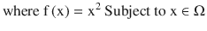
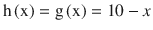
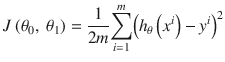
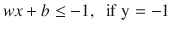
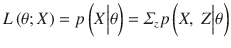
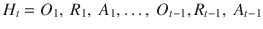

# 三、最优化和机器学习综述

在我们深入研究深度学习的模型和组件之前，重要的是要解决它所适合的更广泛的领域，即机器学习。但在此之前，我想简单地讨论一下优化。优化是指从一组可用的备选方案中选择最佳元素。大多数机器学习算法的目标是在给定一个函数和一些输入集的情况下找到最优解。正如已经提到的，这通常属于监督学习问题或无监督学习问题的概念，尽管过程大致相同。

## 无约束最优化

无约束最优化指的是一个我们很难找到最优解的问题。与约束优化相反，我们选择的 x 值是有约束的，这允许我们从更多的途径接近解决方案。无约束最优化问题的一个例子是下面的玩具问题:

![$$ \mathrm{Minimize}\ \mathrm{f}\left(\mathrm{x}\right),\kern0.5em \mathrm{where}\ \mathrm{f}\left(\mathrm{x}\right) = {\mathrm{x}}²,\ \mathrm{x}\in \left[-100,100\right] $$](img/A435493_1_En_3_Chapter_Equa.gif)

图 3-1 显示了该功能。


图 3-1。

Visualization of f(x)

在这个问题中，因为没有约束，所以我们可以在定义的范围内选择 x 的任意值。给定我们寻求最小化的等式，x 的答案是 100。我们可以看到，当我们选择 x 时，我们全局最小化 f(x)的值。因此，我们声明 x = 100 = x*，这是 f(x)的全局极小值。相比之下，这里有一个约束优化问题:




我们想要最小化的函数是一个实值函数，称为目标/成本函数。向量 x 是由独立变量组成的长度为 n 的向量，其中![$$ \mathrm{x}={\left[{\mathrm{x}}_1,\ {x}_2,\dots,\ {x}_n\right]}^T\in {\mathrm{\mathbb{R}}}^n $$](img/A435493_1_En_3_Chapter_IEq2.gif)。这个向量中的变量通常被称为决策变量。集合ω是ℝ的子集，称为约束/可行集。我们说，前面的优化问题是一个决策问题，其中我们必须找到 x 的最佳向量，以满足目标主体的约束。这里，x 的最佳向量将导致目标函数的最小化。在这个函数中，因为我们有一个约束，我们称之为约束优化问题。被称为集合约束。通常，这采取


的形式

其中 h 和 g 是一些给定的函数。h 和 g 被称为功能约束。

假设我们仍然在查看图 3-1 中显示的同一个函数，只是我们的可行集是ω。为简单起见，我们假设 h(x)和 g (x)等于如下:



因此，约束优化问题的答案将是 x = 10，因为这最接近 f(x)的全局极小值，x = 100，同时还满足ω中列出的函数约束。正如我们所看到的，约束集限制了我们选择解决方案的能力，因此必须做出妥协。我们每天都会遇到实际意义上的约束优化。例如，假设一个企业主正试图将他们工厂的生产成本降到最低。这将是一个受约束的优化问题，因为如果企业所有者不希望对他们的业务产生负面影响(并且仍然继续生产)，他们可能会受到产量约束，从而限制了他们可能的选择。

读者将会遇到的大多数机器学习问题都在约束优化问题的范围内，并且该约束通常是被分析的数据集的函数。其原因通常是因为在深度学习模型开发之前，这是我们可以接近人工智能的最接近的方法。概括地说，大多数专注于回归的机器学习算法都是约束优化问题，其目标是在给定的模型内最小化精度损失。正如我们在前面的玩具问题中简要讨论的，有两种极小值:局部极小值和全局极小值。

### 局部最小值

假设是定义在某个集合上的实值函数。对于所有的，点 x*是ω上 f 的局部极小值。

### 全局最小化器

假设相同的函数 f 及其三级性质，点 x*是 f 在ω上的全局极小点，如果对于所有

一般来说，在一个给定的问题中可以有多个局部极小值，但是如果有全局极小值，也只能有一个。在图 3-2 中，我们可以看到这与一个函数的映射有关。


图 3-2。

Local versus global minima

根据我们在给定时刻评估的函数的多少，我们可以选择大量的局部最小值。但是如果我们评估这个函数的整个范围，我们可以看到只有一个全局最小值。现在讨论一下我们如何确切地知道我们得出的解决方案，从数学上来说，是最优的，这是很有用的。

### 局部最小值的条件

在这一节中，我们导出了点 x*成为局部极小点的条件。我们用函数的导数回忆一下，f 的一阶导数，记为 Df 是

![$$ D f\triangleq \left[\frac{\partial f}{\partial {x}_1},\frac{\partial f}{\partial {x}_2}, \dots, \frac{\partial f}{\partial {x}_n}\right] $$](img/A435493_1_En_3_Chapter_Equf.gif)

f 的梯度只是 Df 的转置。二阶导数，或 f 的黑森，是


一阶导数/梯度给出了函数 f 在特定点的近似值的方向。二阶导数，或 Hessian，给了我们 f 在一点的二次近似。Hessian 和梯度都可以用来寻找最优化问题的局部解。如前所述，梯度用于参数更新，例如在通过梯度下降的线性回归中。然而，Hessian 也可以用于深度学习环境中的参数更新。我将在后面详细讨论这一点，但循环神经网络通常用于对时序或文本段等序列中出现的数据进行建模。具体而言，循环神经网络通常难以通过具有长期数据依赖性的某些数据序列的乘积来训练。在训练其他深度学习架构时，由于权重数量非常大，我们会遇到训练问题。这产生了一个大的海森矩阵，实际上使牛顿的方法失效。

Hessian-free 优化专注于最小化目标函数，其中我们计算矩阵向量乘积，而不是计算 Hessian。假设 Hessian 矩阵是正定的，我们收敛到一个解。通过解下面的方程，我们可以有效地用牛顿法对权重矩阵训练一个网络


其中 H <sub>p</sub> 是矩阵矢量积，θ是某个参数(在本例中是权重)，d 是用户确定的值。

在 Hessian 矩阵不是正定的情况下，不能保证收敛于一个解，并导致完全不同的结果。然而，我们可以使用黑森矩阵的高斯-牛顿近似来近似黑森矩阵，于是黑森矩阵等于


其中 J 是参数的雅可比矩阵。

这产生了一个有保证的正定矩阵，因此验证了保证收敛所必需的假设。从回归向前，我想讨论分类算法的数学基础之一:邻域。

## 附近

邻域是分类算法范例中的一个重要概念。例如，使用这个概念的优秀算法是 K-最近邻。用户定义的 K 参数是最简单的算法之一，它决定了用于最终将对象分类为一类点的相邻数据点的数量。我们将一个点的邻域定义为包含上述点而不离开该集合的点集。考虑一点。这个集合的一个邻域将是方程


其中ϵ是在给定上下文中定义的某个正数。ϵ表示定义给定邻域大小的界限。视觉上，我们可以把一个邻域看作一个球体，或者两个半空间之间的空间，以 x 为中心，以ϵ为半径，如图 3-3 所示。


图 3-3。

Visualization of a neighborhood of a point x

这对于理解任何使用ε密集损失来定义观测分离的算法是很重要的。ε密集损失尤其用于支持向量机的情况，但是 K-最近邻广泛地利用邻域的概念来定义给定类内的观察值。

### 内部和边界点

如果集合 S 包含 x 的某个邻域，则称点为集合 S 的内点。如果 x 的某个邻域内的所有点都在 S 中，则称 S 的所有内点的集合为 S 的内部。如果 x 的每个邻域都包含 S 中的一个点和不在 S 中的一个点，则称点 x 为集合 S 的边界点。类似地，S 的所有边界点都命名为边界。如果一个集合包含它的每个点的邻域，或者没有边界点，那么这个集合就是开的。如果一个集合包含它的边界，那么它就是闭的。如果一个集合既闭又有界，那么它就是紧的。

我们现在已经完成了对优化的回顾。现在，我们已经解决了必要的先决信息，我们可以深入讨论机器学习，并掌握这种范式中算法的更广泛的含义。

## 机器学习方法:监督学习

机器学习可以分为两大类:监督学习和非监督学习。监督学习的区别在于，在拟合模型之前，我们知道标签/响应变量 Y 是什么。因此，我们可以有效地评估模型的功效。在无监督学习中，我们没有这些信息，这不允许我们确定我们正确的程度。在讨论这两种范式的挑战之前，讨论一下这个领域的发展是合理的

### 机器学习的历史

机器学习是在 20 世纪 50 年代中期开发出来创造人工智能的。它的重点转移到创建程序，这些程序在迭代的基础上得到改进，但是专门用来完成一个任务，并且通常可以被看作是一种函数优化的方法。人工智能最终开始成为自己的领域，随着 20 世纪末的到来，机器学习开始成为一门更加发达和成熟的科学。机器学习从许多领域获得贡献和灵感，如统计学和计算机科学，重叠是如此之多，以至于许多统计程序经常包括并鼓励他们的学生精通这些技术。接下来的章节将讨论一些最常见的机器学习算法，包括一些为以下章节中描述的深度学习模型提供灵感的算法。

### 什么是算法？

在这之前，我偶尔会提到算法。简单地说，算法是我们为了完成某项任务而创建的过程。在接下来的章节中，在处理深度学习模型之前，我们将回顾除了在数据科学的一般实践中有用的算法之外，将在深度学习模型中使用的重要机器学习算法。

## 回归模型

回归指的是我们试图预测特定值的一系列问题。这些可能是房价、雇员的工资或者花瓣的长度。更重要的是，回归也可以用来衡量解释变量 x 影响响应变量 y 的程度。

### 线性回归

假设我们试图预测一个给定节目的电视收视率。根据之前的研究，我们知道这个节目最受欢迎的人群是 25-50 岁的人。我们还看到这两个变量之间有很强的线性相关性。因此，我们决定将此视为我们的解释变量或 x 变量，将评级视为我们的响应变量或 Y 变量。我们到底该如何进行？简单的线性回归是最合理的方法。简单线性回归利用相对基本的概念将解释变量 x 建模为响应变量 y

，

其中β <sub>0</sub> 为 y 截距，β <sub>1</sub> 至β <sub>k</sub> 为每个解释变量 x <sub>1</sub> 至 x <sub>k</sub> 对应的偏斜率，其中 k = 1，2，…，m，m =解释变量的个数。这就是所谓的线性概率模型，因为我们对 Y 的期望值建模是基于这样的假设，即 Y 位于普通最小二乘预测的可能点分布中的某个位置。

#### 普通最小二乘法(OLS)

普通最小二乘法是线性回归的最基本形式。我们选择特定点 x 处的特定 E(Y)值的直觉是，我们希望找到一个 E(Y)值，使实际值和预测值之间的平方差最小。当在给定的实验中满足上述假设时，我们发现 OLS 方法会产生 Y 的最小方差和无偏估计值，同时也是 Y 的最大似然估计值

该模型的基本假设如下:

*   误差项呈正态分布。
*   当观察误差项时，存在恒定的方差。
*   数据的观测值是独立同分布的。
*   解释变量之间没有多重共线性。

我们选择特定点 x 处的特定 E(Y)值的直觉是，我们希望找到一个 E(Y)值，使实际 Y 值和预测 Y 值之间的平方差最小。在给定的实验中，当满足上述假设时，我们发现 OLS 方法会产生 Y 值的最小方差和无偏估计值，同时也是 Y 值的最大似然估计值。假设我们有一个 xy 图，类似于图 3-4 所示的图。


图 3-4。

Plotting of the response variable x

理论上，我们可以绘制无限多的 E(Y)线图。然而，只有一个解产生最佳解，使 E(Y)和 Y 之间的误差最小。假设只有一个解释变量，我们得出回归系数如下:


或者，回归系数方程可以写成


  给予】

我们在这里所做的目的是最小化回归系数的大小，以便当我们将它乘以 x 时，简单地说，我们试图在数据和回归线之间找到一条最佳拟合线，以便最小化预测和实际数据点之间的平均误差。在我们推导出回归系数后，我们可以找到 y 截距，或 x = 0 时 y 的值，如下:


由此，我们有了 E(Y)方程的所有组成部分，现在可以对数据进行建模。

也就是说，使用 OLS 来寻找解决方案并不总是最佳的方法。对于相对小而简单的数据，利用 OLS 并不是一个特别的问题。当数据复杂且庞大，并且我们不满足 OLS 回归的假设时，利用梯度下降法可能更有效。

#### 梯度下降算法

如前所述，函数的梯度代表函数中增长率最大的点，其大小是图中该方向的斜率。考虑到这一点，我们如何将梯度的概念应用到算法中，以便迭代地改进它呢？梯度下降是一种迭代算法，在这种算法中，根据您定义的某个阈值或一定次数的迭代，通过梯度的负值来更新参数。梯度通常乘以学习率，学习率决定了函数向最优解收敛的速度。

在线性回归的情况下，我们的目标是最小化 y^和 y 之间的残差值，称为误差函数，由



给出

其中 h <sub>θ</sub> (x <sup>i</sup> 是预测的 y 值。

如果我们的目标是尽可能快地最小化成本函数，并且梯度是指向最陡方向的向量，则我们想要获取成本函数的梯度。梯度由以下给出:


为了更新参数，包括 y 轴截距和回归系数，我们计算如下，直到算法收敛于最优解:


#### 通过梯度下降的多元线性回归

通过梯度下降的多元线性回归背后的直觉与简单线性回归相同——只有一个修改来适应在每次迭代时被调整的多个部分斜率:


#### 学习率

要讨论的最后一个方面是学习率，表示为α，它实际上是梯度下降算法最重要的方面之一。学习率决定了梯度下降算法收敛到最优解的速度。通常，学习率被初始化为一个相对较小的值，通常为 0.01 或更小。也就是说，选择一个最佳的学习率并不总是显而易见的，不这样做可能会影响“解决方案”的产生。通常，梯度下降算法有两个停止条件:1)找到了最优解，2)达到了允许的最大迭代次数。以下与较差算法性能相关的问题是由以下情况引起的:

*   学习率太小:在我们选择一个太小的学习率的例子中，算法给出的解实际上不是最优解，我们达到最优解是由于第二个停止条件。有些人可能会说，避免这种情况的方法是通过选择学习率来增加迭代次数，但这很可能会破坏这种方法的目的，即其计算效率。
*   学习率太大:如果我们选择一个比需要的学习率大得多的学习率，我们也可能永远达不到一个最优解，尽管这是由于一个不同的原因。当学习率太大时，我们发现每次迭代的成本函数可能会过校正，并给出太小或太大的系数的更新值。因此，我们达成解决方案是靠运气，而且在大多数情况下，我们最终会达成最大的解决方案。

## 选择合适的学习速度

既然我们已经了解了与选择不正确的学习率相关的问题是什么，我们需要找出如何选择一个学习率。一个可能的解决方案是硬编码各种梯度，并观察算法在每次迭代中的表现。在下面的方法中，我们在梯度下降算法的每次迭代中更新步长。

粗体驱动方法将最近的梯度值与根据先前迭代导出的梯度值进行比较。如果误差已经减小，则适度增加学习速率。如果误差增加，将学习率降低 50%。

在下面的代码示例中，我们正在修改虹膜数据集。这个数据集可以追溯到罗纳德·费雪；他用它做了一系列初步实验。当显示各种统计和机器学习算法的基本方面时，它很受欢迎。这里，我们采用 iris 数据集的第一列，并针对 X 变量(仅仅是长度)进行建模，这样显示的数据就形成了一个线性模式。这只是一个展示 OLS 线性回归机制的例子。在下面的代码中，我们通过`lm()`函数将数据拟合到 OLS 回归中。然后，我们计算残差平方和，在输出中表示为`Cost`。然后，我们从`lm()`函数中提取该模型的回归系数，然后在数据框中输出这两个属性:

```py
#Modifying Data From Iris Data Set
data(iris)
Y <-  matrix(iris[,1])
X <-  matrix(seq(0,149, 1))

olsExample <- function(y = Y, x = X){
y_h <- lm(y ∼ x)(1)
  y_hf <- y_h$fitted.values
  error <- sum((y_hf - y)²) (2)
  coefs <- y_h$coefficients (3)
  output <- list("Cost" = error, "Coefficients" = coefs)
  return(output)
}

```

当我们运行代码时，我们观察到如图 3-5 所示的结果。


图 3-5。

Output of OLS regression function

`Cost`是平方和，因此`Coefficients`被列为 y 截距，后跟 x 变量的部分斜率。我们将以此为基准，通过梯度下降来比较线性回归的性能。同样，本说明的目的是展示梯度下降算法复制简单 OLS 回归结果的效率和能力:

```py
#Gradient Descent Without Adaptive Step
gradientDescent <- function(y = Y, x = X, alpha = .0001, epsilon = .000001, maxiter = 300000){
  #Intializing Parameters
  theta0 <-  0
  theta1 <-  0
  cost <- sum(((theta0 + theta1*x) - y)²)
  converged <- FALSE
  iterations <- 1

```

接下来，我们定义一个通过梯度下降实现线性回归的函数。这种梯度下降算法具有恒定的学习速率，但是如果您选择在其他数据集上使用这种实现，您可以改变该参数以及损失容限。我们已经将最大迭代次数定义为 300，000 次，如果在此之前没有达到最优解，将会强制算法在该解处停止。当具体分析代码时，我们首先将参数`theta0`和`theta1`初始化为 0。用户可以随意修改代码，用从正态分布中随机抽取的值初始化参数，但是应该将这些值除以 10，以确保它们不会过大。我们将`cost`函数初始化为 0 减去所有 y 值的 SSR，从这里我们将开始改变参数:

```py
#Gradient Descent Algorithm
while (converged == FALSE){
  gradient0 <- as.numeric((1/length(y))*sum((theta0 + theta1*x) - y))
  gradient1 <- as.numeric((1/length(y))*sum((((theta0 + theta1*x) - y)*x)))

  t0 <- as.numeric(theta0 - (alpha*gradient0))
  t1 <- as.numeric(theta1 - (alpha*gradient1))

  theta0 <- t0
  theta1 <- t1

  error <- as.numeric(sum(((theta0 + theta1*x) - y)²))

  if (as.numeric(abs(cost - error)) <= epsilon){
    converged <- TRUE
  }
    cost <- error
    iterations <- iterations + 1
  if (iterations == maxiter){
    converged <- TRUE
  }
}

```

尽管我们还没有收敛到一个解决方案，或者我们还没有达到执行函数时允许的最大迭代次数，但是我们创建了`gradient0`和`gradient1`变量，它们分别对应于参数`theta0`和`theta1`。然后，我们使用包含在`gradient0`和`gradient1`变量中的梯度更新`theta0`和`theta1`参数。此后，我们计算误差，并从`while` ( `converged == FALSE`)继续循环，直到达到停止条件:

```py
  output <- list("theta0" = theta0, "theta1" = theta1, "Cost" = cost, "Iterations" = iterations)
  return(output)
}

```

这里，我们运行一个简单的线性回归，其中`y`和`x`变量被随机初始化。当我们按照说明运行代码时，我们会得到如图 3-6 所示的结果。


图 3-6。

Output of gradient descent without adaptive step function

`theta0`是 y 轴截距，`theta1`是`x`变量的偏斜率，`cost`是平方和，`iterations`是执行的迭代次数。在这里，我们观察到较低的回归系数，大致相同的基线平方和误差。然而，如果我们使用一个太大的学习率，我们经常会得到一个错误，因为回归系数变得无限大。当学习率太小时，我们会注意到图 3-7 中显示的内容。


图 3-7。

Output of gradient descent with small learning rate

我们看到，该算法没有收敛到最小值，而是达到了一个可行的解决方案，并被我们设置的损失容限切断。顺便说一下，我们也接近了允许的最大迭代次数。错误选择算法的后果与应用给定算法的环境有关。但所有用户都应该谨慎评估他们在任何机器学习或深度学习算法上找到的结果。因此，在选择解决方案时，我们要尽可能地自信，这一点很重要。

在下一个示例中，我们使用自适应步长运行相同的算法来比较性能:

```py
#Gradient Descent with Adaptive Step
adaptiveGradient <- function(y = Y, x = X, alpha = .0001, epsilon = .000001, maxiter = 300000){
  #Intializing Parameters
  theta0 <-  0
  theta1 <-  0
  cost <- sum(((theta0 + theta1*x) - y)²)
  converged <- FALSE
  iterations <- 1

  #Gradient Descent Algorithm
  while (converged == FALSE){
    gradient0 <- as.numeric((1/length(y))*sum((theta0 + theta1*x) - y))
    gradient1 <- as.numeric((1/length(y))*sum((((theta0 + theta1*x) - y)*x)))

    t0 <- as.numeric(theta0 - (alpha*gradient0))
    t1 <- as.numeric(theta1 - (alpha*gradient1))

    delta_0 <- t0 - theta0
    delta_1  <- t1 - theta1
    if (delta_0 < theta0){
      alpha <- alpha*1.10
    } else {
      alpha <- alpha*.50
    }

```

这里，我们应用相同的梯度下降函数，除了现在我们应用大胆的驱动方法，以便我们有一个自适应的学习率。bold driver 方法基于先前的结果，从一个单独的迭代到下一个迭代改变学习速率。简单来说，如果梯度从一次迭代到下一次迭代增加，学习率增加 10%。如果梯度降低，我们将学习率降低 50%。读者可以随意更改这些参数，对收到的结果进行实验:

```py
    theta0 <- t0
    theta1 <- t1
    error <- as.numeric(sum(((theta0 + theta1*x) - y)²))
    if (as.numeric(abs(cost - error)) <= epsilon){
      converged <- TRUE
    }
    cost <- error
    iterations <- iterations + 1
    if (iterations == maxiter){
      converged <- TRUE
    }
  }
  output <- list("theta0" = theta0, "theta1" = theta1, "Cost" = cost, "Iterations" = iterations, "Learning.Rate" = alpha)
  return(output)
}

```

执行此功能后，我们会收到如图 3-8 所示的结果。


图 3-8。

Output of gradient descent with adaptive learning rate functions

在我们测试的算法中，考虑到我们的目标是最小化成本和回归系数大小，通过梯度下降和自适应步长的线性回归或 OLS 方法是可以接受的。作为一个有趣的观察，该算法收敛到这个解决方案明显快于梯度下降法与静态学习率。

### 牛顿方法

对于我们寻求最小化二次函数的例子，牛顿的方法经常被证明是有用的。牛顿法是一种求函数根的方法，或者 f(x)等于 0 的地方。它是由艾萨克·牛顿和约瑟夫·拉弗森发明的。为了计算一个最佳点，我们推导出方程式


其中 f’是给定函数的一阶导数，f”是给定函数的二阶导数。这就是所谓的割线法。如果 f’(x)> 0，牛顿方法工作得特别好，但是如果 f”(x)< 0，它可能不会收敛到全局最小值。我们知道，如果函数的 Hessian 是半正定的，牛顿函数将总是收敛到全局最优。牛顿方法的另一个缺点是，如果起始点离全局最小值相当远，就不能保证收敛。在牛顿法不收敛于全局最小值的情况下，有一种启发式方法可以用来克服这一点，这将在下一章中介绍。

### 勒文伯格-马夸特启发式

Levenberg-Marquardt (LM)算法最适用于函数不是二次可微或其 Hessian 矩阵不是正定的情况。这个方程由下面给出:


考虑一个非正定的方阵 F。这个矩阵的特征值可能不是正的，但都是实数。考虑一个矩阵


其中G 的特征向量为。因此，以下必然成立:


通过这种修改，G 的所有特征值都是正的，那么 G 必须是正定的。如果μ也足够大，我们可以确定牛顿算法选择的方向将总是朝着最陡下降的方向。对算法的最后修改将是增加一个步长:


## 什么是多重共线性？

多重共线性是许多数据科学家在解决问题时都会遇到的问题。在这种情况下，解释变量与其他变量几乎完全相关。在这种情况下，通过 OLS 或梯度下降使用线性回归变得很困难，因为该技术不能精确地估计回归系数，经常导致这些参数的值被夸大。这是因为很难区分一个解释变量对另一个解释变量的影响，以及随后每个解释变量对响应变量的影响。作为多重共线性的产物，我们观察到每次初始化线性回归算法时，回归系数的值都会发生变化，有时变化幅度很大。最终，这使得传统的线性回归成为处理显示这些类型模式的数据的不太可取的方法。

## 多重共线性测试

非常高的正回归系数是多重共线性的第一个迹象。除此之外，我们还应该计算所有解释变量之间的相关性。相关系数也应该引起数据科学家的警惕。不过，具体来说，我们可以使用一个统计数据来确定我们的数据集中是否绝对存在多重共线性，该统计数据称为方差膨胀因子。

### 差异通货膨胀系数(VIF)

VIF 统计是在从开始的范围内计算的。通常，经验法则是任何 VIF 分数为> 5 表示多重共线性，任何超过 10 的分数表示严重多重共线性。统计数据的计算方法是将一个给定的解释变量与其他变量进行回归，然后使用结果来计算决定系数，得出以下结果:


### 里脊回归

为了解决多重共线性问题，岭回归被开发出来，并且是一种有用的技术。与我们之前对规范的讨论(L1 对 L2)相关，岭回归使用 L2 规范来获得最优解。岭回归方程如下:


岭回归的关键区别之一是调整参数λ，它决定了回归系数收缩的程度。由于 L2 范数形成了一个球形或圆形区域，其中回归系数的最优解沿着该形状的“脊”选择，因此该技术被命名为脊。从视觉上看，这通常类似于图 3-9 。


图 3-9。

Ridge regression OLS estimates

### 最小绝对收缩和选择算子(LASSO)

Lasso 与岭回归非常相似，只是 LASSO 在回归解释变量和响应变量时执行变量选择。LASSO 和岭回归之间的主要区别在于，LASSO 使用 L1 范数而不是 L2 范数，根据数据的维度为选择区域提供正方形或立方体形状。在图 3-10 的中，我们可以看到拉索 OLS 估计:


图 3-10。

LASSO regression

### 比较岭回归和 LASSO

这两种方法在数据存在多重共线性的情况下都非常有用，但在试图像简单线性回归那样拟合数据的情况下，应避免使用这两种方法，而应使用之前给出的梯度法和 OLS 法。如果你没有一个以上的解释变量，这些方法将不会对你有用。尽管这在大多数情况下不太可能发生，但是记住这一点还是很重要的。

### 评估回归模型

除了构建回归模型之外，我们还需要找到一种方法来确定模型得出的结果有多准确，并最终根据具体情况选择最佳模型。在回归的情况下，评估机器学习模型的有用方法是通过自举。通常，bootstrapping 涉及使用比原始数据集更小的数据集和随机排列的原始观察值在多次迭代中运行不同的回归模型，然后对几个统计数据进行采样，并将它们的值与其他模型的值进行比较。流程如下:

1.  建立几个模型。
2.  收集样本统计数据，我们在 N 次实验迭代中使用这些数据作为每个模型的评估者。
3.  对每个评估者进行采样，并在每次迭代时收集统计数据，例如:
    1.  平均
    2.  标准偏差
    3.  最大
    4.  福建话 
4.  评估结果，并根据您的目标和情况选择最有效的模型。

本节的其余部分将介绍在引导过程中应该选择的赋值器。

#### 决定系数(R <sup>2</sup>

如第二章所述，决定系数是我们用来评估模型通过 x 的可变性解释 y 的可变性的准确程度。R <sup>2</sup> 值越高越好。也就是说，一般来说，“好”的 R <sup>2</sup> 值应该在以下范围内:. 70 ≤ R <sup>2 ≤ .95。任何低于 0.70 的都应被视为一般不可接受，任何高于 0.95 的都应被检查，以查看模型中是否存在过度拟合。虽然这在给定的迭代中不会有很大的变化，但是我们仍然应该在模型中客观地评估这一点。</sup>

#### 均方误差

MSE 测量 y 的给定预测值与实际响应变量的平均值之间的距离。我们对任何回归模型的目标都是尽可能地最小化这个统计量，所以我们希望选择相对于其他模型具有最低 MSE 的模型。这将是显示跨模型的最大差异的评估器，并且应该是在我们应该选择哪个模型方面给我们最大推理能力的评估器。

#### 标准误差

在回归模型的情况下，我们可能会测量给定模型的标准误差。我们的目标应该是标准误差尽可能接近 0。高度负的或高度正的标准误差值通常是不期望的。

#### 分类

超越预测特定值的情况，我们的数据观察通常属于我们想要给它们贴上标签的某个类别。我们将这种问题范式称为分类问题。为了向读者介绍这些类型的问题，我们从解决这些算法中最基本的问题开始:逻辑回归。

#### 逻辑回归

除了回归，机器学习的一个重要任务是对观察值进行分类。尽管有多项分类算法，我们将从检查二元分类器开始，这种方法通常用作剩余分类器的基线。逻辑回归的名字来源于为其提供动力的函数，即逻辑函数，如图 3-11 所示。


图 3-11。

Visualization of logistic function

函数本身是这样写的:


我们如何对观测值进行分类的直觉很简单:我们为给定的 f(x)值设置一个阈值，如果它达到或超过该阈值，则将其分类为 1，否则分类为 0。在许多情况下，x 变量将被线性回归公式所取代，在该公式中，我们对数据进行建模。因此，f(x)的方程式，或对数几率，将是


其中，π =对数概率，π*是给定阈值。至于我们建立的阈值，这取决于我们想要最大化什么:准确性、敏感性或特异性。

*   Sensitivity/recall: The ability of a binary classifier to detect true positives:

    

*   Specificity: The ability of a binary classifier to detect true negatives:

    

*   Accuracy: The ability of a binary classifier to accurately classify both positives and negatives:

    

在某些情况下，放大这些统计数据可能更有利，但这都是相对于这些算法的应用场合而言的。例如，如果您正在测试手机电池燃烧的可能性，您可能希望确保尽可能减少误报。但是，如果你试图检测某人在约会网站上找到匹配的概率，你可能会想最大化真正的积极因素。使用 ROC 曲线最容易说明这些预测能力之间的权衡关系，该曲线显示了改变π*的值如何影响模型的分类统计。

### 受试者工作特性曲线

ROC 曲线最初在第二次世界大战期间用于雷达探测的目的，但它的用途很快被考虑到其他领域，统计学就是其中之一。ROC 曲线显示了二元分类器准确检测真阳性并同时通过显示其假阳性率来检查其不准确程度的能力。如图 3-12 所示。


图 3-12。

Example ROC curve plot

在逻辑回归的情况下，给定π的特定阈值，任何特定模型的评估最终由曲线下面积或 AUC 决定。该图的顶点是. 50 AUC 分数，这表明该模型，如果它的分数是这样的话，在分类上并不比随机猜测好。理想情况下，这个 AUC 分数应该接近 1，但是我们通常接受任何≥ .70 的分数。

### 混淆矩阵

评估分类模型的另一种方法是混淆矩阵，它是分类器预测与给定观察值的实际标签的图形表示。从这个可视化中，我们得到了前面列出的统计值，这些值最终帮助我们准确地评估分类模型的性能。图 3-13 显示了混淆矩阵的可视化示例。


图 3-13。

Confusion matrix

解释混淆矩阵中的值通常是一项由读者决定的主观任务。在某些情况下，误报，比如确定用户是否应该购买某个产品，对于解决手头的问题并没有那么有害。在其他情况下，例如确定汽车发动机是否有故障，假阳性实际上可能是有害的。读者应该意识到他们正在执行的任务，并相应地调整模型以限制假阳性和/或假阴性。

### 逻辑回归的局限性

逻辑回归只能预测离散的结果。它需要普通线性回归所必需的许多假设，并且数据的过度拟合会变得非常普遍。除此之外，当我们有明显可分的数据时，用逻辑回归分类效果最好。出于这些原因，除了有更复杂的技术可用这一事实之外，一种常见的建模实践是将逻辑回归模型视为基线，通过它我们可以并列其他分类方法并观察其细微差别。

接下来，我们将看一个使用逻辑回归的简单例子。对于那些对该模型生产过程感兴趣的人来说，该数据集将在后面的章节以及第十章中详细引用。：

```py
#Code Redacted, please check github!
#Logistic Regression Model
lr1  <- glm(data[,1] ∼ data[,2] + data[,3] + data[,4] + data[,5] + data[,6] + data[,7],
            family = binomial(link = "logit"), data = data)

#Building Random Threshold
y_h <- ifelse(lr1$fitted.values >= .40, 1, 0)

#Construct ROC Curve
roc(response = data[,1], predictor = y_h, plot=TRUE, las=TRUE,    legacy.axes=TRUE, lwd=5, main="ROC for Speed Dating Analysis", cex.main=1.6, cex.axis=1.3, cex.lab=1.3)

```

我们模型的 ROC 曲线如图 3-14 所示。


图 3-14。

ROC curve for logistic regression example

使用前面的代码，我们得到了. 7353 曲线下的面积。考虑到我们之前设置的阈值，该模型的性能可以接受，但可能需要进行更多的调整。

### 支持向量机(SVM)

在可用的更复杂的机器学习模型中，支持向量机是一种二进制分类方法，它比逻辑回归模型更灵活，因为它们可以执行非线性分类。这是通过其核函数来执行的，核函数是将数据正交投影到新特征空间的方程，对象的分类是作为由范数构造的两个超平面的产物来执行的(参见第二章)。

在线性支持向量机的情况下，我们将响应变量 Y 和解释变量 x 作为输入。我们将这些数据正交投影到特征空间，从而形成分离数据点的超平面。这些超平面的大小由权重的欧几里德范数或 w 确定，向量除了上界和下界之外，分别表示为:


我们不断重复这个过程，直到我们达到一个范数 w，使两个类之间的分离最大化。通过最小化||w||，类的分离被最大化，因为超平面的大小由下面给出:


以下约束也阻止我们允许观察值落在两个超平面之间:




最终落在超平面边界上的观察是最重要的，因为它们是定义分类之间的分离的“支持向量”。这种转变如图 3-15 所示。


图 3-15。

Orthogonal transformation of data via kernel function

除了 SVM 的目标之外，由这些约束形成的优化问题由下面给出:


#### 内核的类型

为了扩展支持向量机的灵活性，已经开发了不同的内核。其中包括以下内容:

*   多项式
*   高斯径向基函数
*   双曲正切

### 次梯度法在支持向量机中的应用

函数的次梯度被定义为导数对不可微函数的推广。简单来说，就是经过函数导数，但落在导数以下的直线的斜率。当处理不仅仅具有 10⁵ 特征和 10⁵ 观测值的数据时，对 SVM 算法的现代修改已经产生了性能更好的分类模型。我们将优化问题定义为

![$$ f\left( w, b\right)=\left[\frac{1}{n}{\displaystyle \sum_{i = 1}^n} \max \left(0,1-{y}_i\left( w x+ b\right)\right)\right]+\lambda {\left|\left| w\right|\right|}² $$](img/A435493_1_En_3_Chapter_Equar.gif)

其中 f 是 w 和 b 的凸函数。此外，这允许我们使用梯度下降方法，因为它们在凸集上特别有效。给定一个成本函数 C(w)，定义为实际分类减去预测分类，我们使用梯度下降公式因此如下:


次梯度步长选择方法类似于本章前面描述的 bold driver 方法。一如既往，算法应用的环境应该最终决定使用哪种方法，而不仅仅是哪种方法执行得更好。

### 支持向量机的扩展

Vladimir Vapnik，Harris Druck，Christopher Burges，Linda Kaugman 和 Alexander Smola 在 1996 年提出的回归方法是支持向量机的更流行的扩展。不同的是，在 SVR 中，我们不关心落在超平面内的观测值。相反，我们只修改超平面的形状来响应落在损失容差区域之外的点，目标是最小化落在该区域之外的这些点的数量。所执行的回归类型可以通过前面列出的相同内核函数再次改变。除此之外，K-均值聚类的一种替代方法是使用高斯核作为正交投影的激活函数。这里，该算法搜索生成超平面，使得包围数据图像的最小球体定义给定的聚类。聚类算法将在本章后面介绍。

### 与支持向量机相关的限制

支持向量机的主要问题来自于它们为什么如此强大的关键:内核函数。确定使用合适的内核通常被认为是这种技术的最大缺点。当深入研究算法训练的这个方面时，具体地说，损失参数和高斯核的宽度参数的选择并不明显，并且高度受制于使用算法的环境。第二，尽管支持向量机在大型数据集上表现良好，但它们是一种计算昂贵的方法，并且在应用于行业设置时需要足够好的硬件。因此，在研究之外的环境中，或者在任何需要分析实时数据的环境中，使用支持向量机并不总是有意义的。

以下是在 iris 数据集上使用的支持向量机的快速示例:

```py
#Code Redacted, please check github!
require(LiblineaR)
require(e1071)

#SVM Classification
output  <- LiblineaR(data=s, target=y_train, type = 3, cost = heuristicC(s))

#Predicted Y Values
y_h <- predict(output, s, decisionValues = TRUE)$predictions

#Confusion Matrix
confusion_matrix <- table(y_h, y_train)
print(confusion_matrix)

```

当执行我们的代码时，它会产生如图 3-16 所示的混淆矩阵。


图 3-16。

Confusion matrix for support vector machine

## 机器学习方法:无监督学习

超越我们知道我们试图预测的答案的范式，是深度学习中更模糊的部分，我们试图根据我们的算法进行推理。这个特定的问题子集被称为无监督学习的一部分，或者我们事先不知道答案应该是什么的问题。

### k 均值聚类

到目前为止，我们主要谈论了监督学习，但机器学习的另一个重要方面是在无监督学习情况下算法的使用。通常，无监督学习可以作为探索性的研究方法来进行，或者作为实验的主要部分之前的预备步骤来进行。无监督学习的最好例子之一是 K-means 聚类算法。该算法背后的动机是基于它们远离聚类中心的距离来寻找相似的观察值。

### 分配步骤

这里，我们取数据的观察值，通过计算数据中三个随机观察值的平均值，给出一组初始的 k 平均值。从这一点，我们将每个观察值分配给聚类中心，基于哪一个分配产生最小的聚类平方和，由观察值的平均值和聚类中心平均值


之间的欧几里德范数确定

其中 S =聚类中心，x <sub>p</sub> 是观察平均值。

### 更新步骤

然后，我们通过取中心内观察值的平均值来重新计算聚类平均值，然后重复这两步，直到重新分配停止:


### K 均值聚类的局限性

K-means 聚类的主要问题是所得到的解通常依赖于均值的初始化位置，因此不能保证收敛到全局最小值。此外，根据所选 K 均值的变化，收敛所需的时间也可能不是特别快。

下面是 K 均值聚类的一个简单示例:

```py
#Upload data
data  <- read.table("http://statweb.stanford.edu/∼tibs/ElemStatLearn/datasets/nci.data", sep ="", header = FALSE)
data <- t(data)
k_means  <- c()
k  <-  seq(2, 10, 1)
for (i in k){
  k_means[i]  <- kmeans(data, i, iter.max = 100, nstart = i)$tot.withinss
}

clus <- kmeans(data, 10)$cluster
summ  <- table(clus)
#Removing NA Values
k_means  <- k_means[!is.na(k_means)]
#Plotting Sum of Squares over K
plot(k, k_means,  main ="Sum of Squares Over K-Clusters", xlab = "K Clusters", ylab= "Sum of Squares",
     type = "b", col = "red")

```

通常，当执行 K-means 聚类时，最困难的部分是确定我们应该选择 K 的哪个值。通常，一个人拥有的聚类越多，其观察值和聚类中心之间的平方和就越低。然而，存在的聚类越多，这些聚类的信息量就越少。因此，挑战变成了 K 个聚类的平方和与尽可能少的聚类之间的权衡，以使观察值合理地可区分。图 3-17 显示了一个帮助我们努力的图。


图 3-17。

Within cluster sum of squares over K clusters

在图 3-17 的曲线图中，我们注意到我们的平方和在开始时急剧下降，但是我们看到值在接近结束时逐渐变小。因此，我们选择一个介于 6 和 8 之间的值是合理的，如果不是，最好接近 6。这遵循上一段中列出的目标，并将为我们提供可操作的见解，或者为包含分类或回归算法要检测的显著差异的数据视图创建一个特征。

## 期望最大化算法

EM 算法在无监督学习的范例中很流行，可以用于多种目的，例如分类或回归。对用户来说，最具体的用途是，它可以用来估算数据集中缺失的值。我们将在第十一章中展示这种能力。无论如何，EM 算法是一个概率模型，这使它区别于许多机器学习模型，后者往往是确定性的。该算法使用对数似然函数来估计参数，然后最大化找到的期望对数似然。

### 期望步骤

考虑一组未知值 Z，它是数据集 x 的子集。我们根据给定 x 的 Z 的条件分布来计算参数的对数似然。下面的等式得出参数的最大似然估计的期望值:



![$$ Q\left(\theta \Big|{\theta}^t\right)={E}_{\left( Z\Big| X,{\theta}^t\right)}\left[ \log L\left(\theta; X,\ Z\right)\right] $$](img/A435493_1_En_3_Chapter_Equax.gif)

### 最大化步骤

在这一步，我们寻求最大化我们正在分析的给定参数的概率。这个方程由下面给出:


#### 期望值最大化算法的局限性

EM 算法也趋向于非常缓慢地收敛，并且不产生 MLE 的渐近方差-协方差矩阵。除此之外——类似于朴素贝叶斯分类器的相同限制，因为 MLE 估计器假设特征独立——如果被分析的特征实际上不独立，则不建议使用这种方法。以下是用于通过聚类进行分类的 EM 算法的示例:

```py
#Expectation-Maximization Algorithm for Clustering
require(MASS)
require(mclust)
y_h <- Mclust(x_train, G = 3)$classification
print(table(y_h, y_train))
plot(Mclust(x_train, G = 3), what = c("classification"), dimens=c(1,3))

```

当执行我们的代码时，它会产生如图 3-18 所示的图。


图 3-18。

Iris data clusters from EM algorithm clustering

## 决策树学习

决策树通常用于各种领域的数据挖掘，提供了一种相对简单的方法来揭示隐藏在数据表面下的洞察力。广义上有两种类型的决策树，它们通常用于回归和分类。决策树是通过创建确定决策流向的规则来构建的。想法是你使用一个漏斗方法，其中第一个规则是最广泛的，你把问题分解成子集，直到最后的“叶子”是确定的最细粒度的方面。

通常与决策树相关的好处是，总的来说，它们相对容易理解，并且通常非常有效。此外，决策树可以比一些机器算法更好地处理缺失数据，而无需替换或更改数据(我们可以只对值或分类进行平均)，并且相对于其他建模技术，它们可以快速计算最终值。最重要的是，有各种各样的方法可以用来帮助树有效地学习，当传统的回归方法不能时，它们可以很好地模拟数据。

### 分类树

分类树类似于回归树。分割通常由二进制变量决定，但它们可以是数字的，也可以是分类的。除此之外，分类树可以进行两种类型的预测:1)点预测，简单地表示类别，以及 2)分布预测，给出每个类别的概率。对于概率预测，树中的每个终端节点产生类别分布。如果叶子对应于答案的序列，由 A = a，B = b，… Q = q 给出，那么下面的等式产生概率:


为了评估分类树，使用前面描述的评估不同分类模型的相同方法。但是我们也引入了平均损失的概念。简单地说，一些错误可能会对准确达到正确的分类造成更大的“损害”。平均损失公式如下:


除此之外，我们可以使用归一化负对数似然来确定模型在不确定或不确定的情况下是否做出了错误的分类。它的公式由


给出

其中 Q(Y = y|X = x)是模型预测的条件概率。在这种情况下，L 也被称为交叉熵。如果完美的分类是可能的，我会是 0。如果分类中存在某种不可约的不确定性，则最佳可能分类器将给出 L = H[Y|X]，即给定 X 时 Y 的条件熵。下面是一个分类树的示例:

```py
require(rpart)
#Classification Tree
classification_tree <- rpart(y_train ∼ x_train[,1] + x_train[,2] + x_train[,3] + x_train[,4]
                             +x_train[,5] + x_train[,6], method = "class")
pruned_tree <- prune(classification_tree, cp = .01)

#Data Plot
plot(pruned_tree, uniform = TRUE, branch  = .7, margin = .1, cex = .08)
text(pruned_tree, all = TRUE, use.n = TRUE)

```

当执行我们的代码时，我们产生了如图 3-19 所示的图。


图 3-19。

Classification tree splits based on Classification tree model fitted above

伴随该模型的混淆矩阵如图 3-20 所示。


图 3-20。

Confusion matrix for classification tree

### 回归树

该模型的主要目标是最大化作为被分析变量的产物落在给定叶子上的概率。我们寻求最大化我们得到的关于响应变量的信息。这是仿照

![$$ I\left[ C: Y\right] $$](img/A435493_1_En_3_Chapter_Equbc.gif)

其中 I 是信息，C 是决定我们走向的叶子的变量，Y 是响应变量

![$$ I\left[ Y; A\right]={\varSigma}_a \Pr \left( A= a\right) I\left[ Y; A= a\right] $$](img/A435493_1_En_3_Chapter_Equbd.gif)

![$$ I\left[ Y; A= a\right] = H\left[ Y\right] - H\left[ Y\Big| A= a\right] $$](img/A435493_1_En_3_Chapter_Eqube.gif)哪里，

其中

![$$ H(X)= E\left[ I(X)\right]= E\left[- \ln \left( P(X)\right)\right] $$](img/A435493_1_En_3_Chapter_Equbf.gif)

不管我们看的是连续变量还是离散变量，我们计算平方和的方式都是一样的


其中为叶 c 的预测。

使用回归树进行预测的不确定性，类似于在分类树中看到的不确定性，是使用这些模型时值得考虑的问题。首先，这些不确定性是对条件概率的不精确估计。该树也随着响应值的变化而主动变化。如果我们从同一个分布中抽取不同的样本，我们会很理想地想要一个树会有多不同的度量。这可以使用非参数自举来估计。假设数据(x <sub>1</sub> ，y <sub>1</sub> )，(x <sub>2</sub> ，y <sub>2</sub> )，…，(x <sub>n</sub> ，y <sub>n</sub> )，我们从数字 1:n 中独立均匀地抽取一组随机整数 J <sub>1</sub> ，J <sub>2</sub> ，…，J <sub>n</sub> ，并进行替换。然后我们设定


在这里，我们像对待原始数据一样对待这个自举样本，并为其拟合一棵树。经过多次迭代，我们得到了树的 bootstrap 抽样分布。这接近回归树的实际抽样分布。我们的自举树的预测在原始树周围的分布表明了这种分布。

### 决策树的局限性

通常，构建决策树最困难的部分是选择创建最佳决策树的规则，并选择不太复杂的树大小，这将导致训练集中的过度拟合，或者根本不会产生任何可操作的见解。更糟糕的是，仅仅从训练错误中很难判断出过度拟合的确切时间。为了减轻这些问题，通常鼓励决策树具有足够的训练样本大小。理想情况下，模型与数据吻合得相当好，用于确定方向分裂的规则不应过于复杂。停止标准最终决定了我们何时到达一片叶子。经常使用的规则的例子是当产生的信息减少到低于某个用户确定的阈值时，或者当“父”节点的“子”产生足够小的一组数据点时停止。然而，从这一点向前发展，决策树是相对简单的模型，对于回归问题，它并不总是在复杂数据上表现得很好，对于每个类别有多个级别的分类数据，它也表现得不好。

## 集成方法和其他启发式方法

对于标准机器学习算法失败的情况，可以通过实际上是多种算法组合的算法来实现精确度的显著提高。我们称之为系综方法。

### 梯度推进

梯度推进最初由 Leo Breiman 开发，是一种用于回归和分类问题的技术，目的是从较弱的模型中产生较好的模型。它迭代建立模型，优化问题是最小化这个函数的梯度。让我们以模型 F 为例，我们期望它预测值 y <sub>h</sub> ，目标是最小化平方误差。设 M 是我们想要进行的提升迭代的次数，其中 1 ≤ m ≤ M。我们假设在我们的实验开始时，我们将有一个模型 F <sub>m</sub> ，我们试图改进它。因此:


梯度提升旨在使比之前的模型更加正确。已经提出的其他损失函数是由


给出的平方误差损失函数

其中


其中 n =数据集 x 内的观察次数。

### 梯度推进算法

1.  Define the optimization problem as

    ![$$ {F}^{*}= \arg \underset{F}{ \min }{E}_{x, y}\Big L\left( y,\ F(x)\right) $$

    where L(y, F(x)) is some differentiation loss function, such as the gradient of the squared loss as shown earlier.  
2.  Calculate the residuals as given by the following equation for m = 1, …, M:

    ![$$ {r}_{i m} = -{\left[\frac{\partial L\left({y}_i,\ F\left({x}_i\right)\right)}{\partial F\left({x}_i\right)}\right]}_{F(x)= F{(x)}_{m-1}} $$](img/A435493_1_En_3_Chapter_Equbn.gif)

3.  使用具有训练集的初始模型来迭代地提高性能。
4.  Calculate γ <sub>m</sub> via the following equation:

    

5.  重复 2–4 直到收敛。

### 随机森林

我将在这一章中讲述的最后一个系综方法是随机森林。简而言之，随机森林是几个决策树的组合，使得每个决策树在给定分支评估的特征方面可以被认为是与其他决策树不同的。尽管这些树的长度是同质的，但是每棵树的决策都是相互独立的。我们为给定观测值选择的值通常是回归情况下所有树的平均值，或者是分类中所有树的平均(或最普遍)观测值。

### 随机森林的限制

随机森林的主要局限性在于，与组成它们的树木相似，它们有过度适应的倾向。我推荐在决策树上使用的相同技术，例如修剪和抢先限制增长，应该在这里使用，以限制树过度拟合的可能性。

## 贝叶斯学习

贝叶斯学习建立在贝叶斯定理的基础上，并最终在许多机器学习和自然语言处理模型中使用，它通过有向图使用随机变量及其条件依赖的表示。贝叶斯学习用于这样的情况，例如在给定单词所处的上下文的情况下确定该单词的情感，以及基于通常在测试集中规定的性别找到名字是女性还是男性的概率。

### 朴素贝叶斯分类器

贝叶斯定理的一个简单应用是分类。朴素贝叶斯分类器使用条件概率来确定事件的可能性。假设我们有一个向量![$$ z=\left[{z}_1,\ {z}_1,\dots,\ {z}_3\right] $$](img/A435493_1_En_3_Chapter_IEq21.gif)，我们想要确定事件 a 的概率。我们将这个方程建模为


其中 P(A|Z)定义为后验概率，P(z|A)是先验概率，P(A)是似然性，P(z)是实例发生的概率(这个几乎总是可以忽略)。现在我们想用这个公式来正确地对观察结果进行分类。对此，我们把这变成一个优化问题，由下面的等式给出:


我们根据使某个事件 a 的概率最大化的值为 y 赋值。虽然这不是使用朴素贝叶斯分类器的唯一方法，但它是将贝叶斯定理应用于分类的一种更常见方法的示例。

### 贝叶斯分类器的局限性

贝叶斯分类器最大的局限性在于它假设了特征的独立性，这在我们分析数据的许多环境中并不总是如此。一旦确定特征独立性不存在，我们根本不能使用这个分类器:

```py
#Bayesian Classifier
require(e1071)

#Fitting Model
bayes_classifier <- naiveBayes(y = y_train, x = x_train , data = x_train)
y_h <- predict(bayes_classifier, x_train, type = c("class"))

#Evaluating Model
confusion_matrix <- table(y_h, y_train)
print(confusion_matrix)

```

执行前面的代码时，会产生如图 3-21 所示的混淆矩阵。


图 3-21。

Confusion matrix for Bayesian classifier example

### 关于调整机器学习算法的最后评论

实践机器学习算法的更困难的部分之一是参数调整的概念，我还没有解决这个问题。可以调整的参数数量取决于所采用的算法，但尽管如此，这仍然是整个学科都面临的挑战。我们已经讨论了为什么确保不发生过度拟合非常重要，这样我们才能获得尽可能稳健的解决方案。一般来说，稳健性通过从一个数据集到下一个数据集的预测能力的稳定性来反映，而过度拟合通过从一个数据集到下一个数据集的预测能力的明显下降来反映。现在，我将在接下来的小节中讨论如何通过方法实现这种健壮性。

#### 50/25/25 交叉验证

用户应该使用一个验证集来进行参数调整，验证集应该是总数据集大小的 50%。然后，用户应该创建两个训练集:一个将用于训练他们调整的算法，另一个用于测试鲁棒性程度/检查过度拟合。可以检查其他百分比分割，以了解性能差异。

#### 一次调整一个参数

如果读者使用的是软件包，而不是算法的自定义实现，可能会有一些参数被设置为默认值。试图一次改变一个以上的参数是困难的，这不仅是为了及时产生算法的结果，而且是因为很难将特定参数的贡献与输出中的变化程度分开。例如，随机森林从单棵树的巨大以及给定模型中允许的树的数量中获得大量的能量。同时增加这两个因素会扭曲我们可以从整体上适当调整算法的能力，最终会导致欠拟合或过拟合。

#### 使用搜索算法调整机器学习参数

希望采用更高级方法的读者被建议密切关注第八章，其中我们深入讨论了可用于选择机器学习算法的搜索算法。尽管仍是一个发展中的研究领域，但通过降低回归算法的误差统计或增加分类算法产生的 AUC 分数，使用 GridSearch 和其他局部搜索算法来选择更好的算法已经取得了显著的成功。

## 强化学习

强化学习与监督学习的不同之处在于，在监督学习问题中，我们所针对的标签是永远不会给出的。相反，我们关注于在利用模型中的现有知识和我们希望模型从未知环境中找到的知识之间找到适当的平衡。强化学习领域不可或缺的是概率论的这个副主题。在这些类型的问题中，我们假设在一组吃角子老虎机附近有一个游戏者，他必须决定玩哪些机器，每台机器玩多少次，以及以什么顺序玩机器。当玩时，每台机器从特定于给定机器的概率分布中提供随机奖励。目标是最大化游戏者在这个游戏周期中获得的钱数。向前看，我们通常可以把强化学习问题描述为一个需要对环境进行智能探索的问题，参考多臂赌徒方法中描述的相同目标。

区分强化学习与监督和非监督方法的事实是，我们采取的行动会显著影响我们获得的后续信息，因此强调在给定算法的每次迭代中做出最佳决策。基本算法描述如下:

*   代理人
    1.  执行给定的操作
    2.  观察某种结果
    3.  获得奖励，通常以标量的形式建模
*   环境
    1.  接收代理执行的操作
    2.  输出一个观察和一个标量奖励

我们将历史定义为相对于代理人和给定环境发生的观察、奖励和行动的序列，记为。所有随后的观察、奖励和行动都受到历史的影响，因为它存在于给定的实验中。这就是我们定义的状态，表示为。环境的状态对代理来说是不可见的，所以它不允许代理可能选择的动作有偏差。相反，代理的状态是内部的。信息也有一个状态，它被描述为马尔可夫过程。需要注意的是，由于这是一本深度学习的入门书籍，所以强化学习的应用不会像更高级的书籍那样深入。也就是说，我希望通过阅读这本书，那些目前发现强化学习问题难以解决的人将能够在对本文过程中提出的概念有了坚实的理解后解决这些问题。

## 摘要

我们现在已经结束了对优化和机器学习的必要组成部分的回顾。这一章，以及前一章，应该作为理解一些更复杂的算法的参考点，我们将在后面的章节中讨论。现在，我们将继续讨论深度学习范式中最简单的模型:单层感知器。