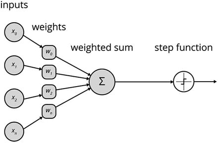
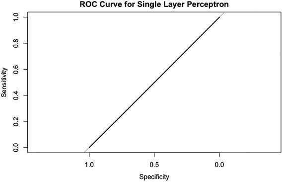
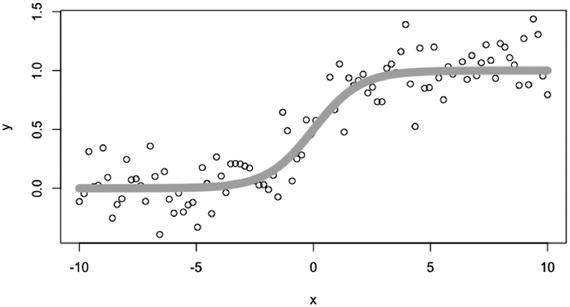
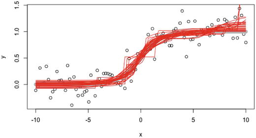
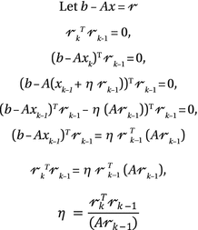

# 四、单层和多层感知器模型

有了足够的背景知识，是时候开始讨论神经网络了。我们将从两个最常见和最简单的神经网络开始，它们的用例围绕着分类和回归。

## 单层感知器(SLP)模型

最简单的神经网络模型 SLP 是由研究人员麦卡洛克和皮茨设计的。在许多机器学习科学家的眼中，SLP 被视为人工智能的开端，并为开发其他神经网络模型和机器学习模型提供了灵感。SLP 的架构是这样的，单个神经元由许多突触连接，每个突触都包含一个权重(如图 4-1 所示)。



图 4-1。

Visualization of single perceptron model

权重影响神经元的输出，这在示例模型中将是分类问题。然后，乘以输入的权重的合计值在神经元内被求和，然后被馈入激活函数，标准函数是逻辑函数:

设输入向量![$$ x={\left[{x}_1,{x}_2,\dots,\ {x}_n\right]}^T $$](img/A435493_1_En_4_Chapter_IEq1.gif)和权重向量![$$ w=\left[{w}_1,\ {w}_2,\dots,\ {w}_n\right] $$](img/A435493_1_En_4_Chapter_IEq2.gif)。

函数的输出由


给出

当使用逻辑函数时，激活函数如下:


### 训练感知器模型

我们通过用从正态分布中随机采样的值初始化所有权重来开始训练过程。我们可以使用梯度下降方法来训练模型，目标是最小化误差函数。我们将感知器模型描述为


其中


其中π* =对数概率的阈值，如第三章中逻辑回归所述。

### WH 算法

该算法由 Bernard Widrow 和 Macron Hoff 在 20 世纪 50 年代末开发，用于训练 SLP 模型。虽然类似于用于训练神经网络的梯度方法(如前所述)，但 WH 算法使用所谓的瞬时算法，由


给出

其中


因此，我们可以将前面的方程式总结如下:


以这种方式，我们有同样的优化问题，我们会在任何传统的梯度方法。我们的目标是通过梯度下降调整应用于数据输入的权重来最小化模型的误差。考虑到分类问题，让我们使用逻辑回归作为我们的基线指标，同时使用 WH 算法将其与固定速率感知器指标和 bold 驾驶员自适应梯度进行比较。

### 单一感知器模型的局限性

导致后来神经网络模型发展的 SLP 模型的主要限制是，感知器模型只有在处理明显线性可分的数据时才是准确的。这显然在数据更加密集和复杂的情况下变得困难，并且有效地消除了这种技术在实际环境中遇到的分类问题中的有用性。这方面的一个例子是异或问题。假设我们有两个输入，x <sub>1</sub> 和 x <sub>2</sub> ，对于这两个输入，给定了响应 y，使得以下为真:

<colgroup><col> <col> <col></colgroup> 
|   | x <sub>1</sub> | x2y |
| --- | --- | --- |
| Zero | Zero | Zero |
| one | Zero | one |
| Zero | one | one |
| one | one | Zero |

从下面的例子中，我们可以看到，当任一解释变量等于 1 时，响应变量等于 1，但当两个解释变量彼此相等时，响应变量等于 0。这种情况如图 4-2 所示。


图 4-2。

XOR problem

现在，让我们来看一个使用 SLP 的例子，其中的数据不是严格线性可分的，以了解该模型的表现。对于这个例子，我已经创建了一个简单的单层感知器模型的示例函数。对于误差函数，我使用 1 减去 AUC 分数，因为这将给我们一个数字量，这样我们可以通过使用梯度下降的反向传播来训练权重矩阵。读者可以随意使用下一个函数以及更改参数。

我们首先设置一些与通过梯度下降执行的线性回归算法相同的参数。(如果您需要复习梯度下降的细节以及如何将其应用于参数更新，请复习第三章。)这里唯一的区别是，我们使用的误差函数不同于回归中使用的均方误差:

```py
singleLayerPerceptron <- function(x = x_train, y = y_train, max_iter = 1000, tol = .001){
#Initializing weights and other parameters
  weights <- matrix(rnorm(ncol(x_train)))
  x <- as.matrix(x_train)
  cost <- 0
  iter <- 1
  converged <- FALSE

```

这里，我们为单层感知器定义一个函数，通过第三章中定义的梯度下降算法，设置类似于线性回归的参数。像往常一样，我们在每次迭代时交叉验证(这部分代码被编辑，请查看 GitHub)我们的数据，以防止权重过度拟合。在下面的代码中，我们为上一节中描述的 SLP 定义了算法:

```py
  while(converged == FALSE){
        #Our Log Odds Threshold here is the Average Log Odds
      weighted_sum <- 1/(1 + exp(-(x%*%weights)))
      y_h <- ifelse(weighted_sum <= mean(weighted_sum), 1, 0)
      error <- 1 - roc(as.factor(y_h), y_train)$auc
}

```

最后，我们使用梯度下降训练我们的算法，误差定义为 1–AUC。在下面的代码中，我们定义了重复的过程，直到我们收敛到最优解或允许的最大迭代次数:

```py
#Weight Updates using Gradient Descent
#Error Statistic := 1 - AUC
if (abs(cost - error) > tol | iter < max_iter){
        cost <- error
        iter <-  iter + 1
        gradient <- matrix(ncol = ncol(weights), nrow = nrow(weights))
        for(i in 1:nrow(gradient)){
          gradient[i,1] <- (1/length(y_h))*(0.01*error)*(weights[i,1])
        }
(Next section redacted, please check github!)

```

和往常一样，读者评估他们的实验结果是有用的。图 4-3 显示了除最后一次 AUC 评分之外的 AUC 评分汇总统计数据，并绘制了各自的 ROC 曲线:



图 4-3。

ROC curve

```py
  #Performance Statistics
  cat("The AUC of the Trained Model is ", roc(as.factor(y_h), y_train)$auc)
  cat("\nTotal number of iterations: ", iter)
  curve <- roc(as.factor(y_h), y_train)
  plot(curve, main = "ROC Curve for Single Layer Perceptron")
}

```

### 汇总统计数据

```py
       Mean    Std.Dev       Min       Max     Range
1 0.4994949 0.03061466 0.3973214 0.6205357 0.2232143

```

请注意，AUC 分数相当差，平均评级比猜测好不了多少。有时，这里的算法会达到稍微好一点的结果，但是这对于部署来说仍然是不够的。这可能是由于类的线性可分性不是很明显，导致了错误分类，每次迭代时都会更新权重矩阵。

现在我们已经看到了 SLP 的局限性，让我们继续这个模型的继任者，多层感知器，或 MLP。

## 多层感知器(MLP)模型

MLP 与 SLP 的区别在于存在影响模型输出的隐藏层。这个显著的因素也恰好是它们的优势，因为它允许它们更好地处理 XOR 问题。这个模型中的每一个神经元都接收来自一个神经元的输入，或者在输入神经元的情况下接收来自环境的输入。每个神经元由一个突触连接，突触上附着一个类似 SLP 的重物。在引入一个隐藏层后，我们可以让模型表示一个布尔函数，而引入两个层则允许网络表示一个任意的决策空间。

一旦我们超越了 SLP 模型，一个更困难且不太明显的问题就变成了 MLP 的实际架构应该是什么，以及这如何影响模型性能。本节讨论了读者应该记住的一些问题。

### 收敛于全局最优

根据模型的设计，MLP 模型不是线性的，因此寻找最优解远不像 OLS 回归那么简单。在 MLP 模型中，用于训练的标准算法是反向传播算法，这是早先描述的 Widrow-Hoff 算法的扩展。它最初是由鲁梅尔哈特和麦克莱兰在 20 世纪 80 年代提出的，被认为是训练 MLP 网络的第一个实用方法。这是使用梯度下降训练 MLP 模型的原始方法之一。设 E 为多层网络的误差函数，其中


我们用下面的公式表示输入到隐藏层的单个神经元的加权和值:


同样，我们把从隐藏层到输出层的输出表示如下:


用下面的权重表示:


### MLP 模型的反向传播算法；

1.  通过从正态分布中取样来初始化所有权重。
2.  输入数据，然后通过隐藏层将数据传递到输出层。
3.  计算梯度并相应地更新权重。
4.  重复步骤 2 和 3，直到算法收敛于可容忍的丢失阈值或达到最大迭代次数。

在概念上回顾了这个模型之后，让我们看一个玩具例子。对多层感知器在实际问题中的应用感兴趣的读者应该特别注意第十章。在下面的代码段中，我们生成新的数据并显示在下面的图中(如图 4-4 ):



图 4-4。

Plotting generated data sequence

```py
#Generating New Data
x <- as.matrix(seq(-10, 10, length = 100))
y <- logistic(x) + rnorm(100, sd = 0.2)

#Plotting Data
plot(x, y)
lines(x, logistic(x), lwd = 10, col = "gray")

```

本质上，我们有一个逻辑函数，数据围绕它分布，因此围绕这个逻辑函数存在方差。然后，我们定义包含 MLP 模型权重的变量。我使用的是打包的 monmlp，但用户也可以自由地尝试其他包中的实现，如 RSNSS 和 h2o。第十章在从框架访问深度学习模型的背景下简要介绍了 h2o:

```py
#Loading Required Packages
require(ggplot2)
require(lattice)
require(nnet)
require(pROC)
require(ROCR)
require(monmlp)

#Fitting Model
mlpModel <- monmlp.fit(x = x, y = y, hidden1 = 3, monotone = 1,
                    n.ensemble = 15, bag = TRUE)
mlpModel <- monmlp.predict(x = x, weights = mlpModel)

#Plotting predicted value over actual values
for(i in 1:15){
  lines(x, attr(mlpModel, "ensemble")[[i]], col = "red")
}

```

当绘制 MLP 模型的预测图时，我们看到的结果如图 4-5 所示。



图 4-5。

Predicted lines laying over function representing data

如您所见，在某些情况下，模型会捕捉到一些噪声，这可以从与逻辑函数形状的任何偏差中得到证明。但是所有生成的行总体上都是数据模式下逻辑函数的良好概括。这是 MLP 模型处理非线性函数能力的一个简单展示。虽然是一个玩具例子，但这个概念在实际例子中也是成立的。

### MLP 模型的局限性和注意事项

当使用误差是权重的函数的反向传播算法时，收敛到全局最优可能难以实现，这通常是一个问题。如前所述，当我们试图优化非线性函数时，许多局部最小值掩盖了全局最小值。因此，我们可能会被欺骗，认为我们已经找到了一个可以有效解决问题的模型，而实际上我们选择了一个不能有效地达到全局最小值的解决方案(见图 4-6 )。


图 4-6。

Error over weight plot

为了减轻这种情况，应用共轭梯度算法。共轭梯度算法不同于传统的梯度下降法，它的学习速率是在每次迭代时调整的。已经发展了许多类型的共轭梯度法，但是它们都有相同的动机。在 MLP 网络的背景下，我们试图找到最小化误差函数的权重。为了做到这一点，我们朝着最陡下降的方向移动，但是我们以这样的方式改变步长，使得在搜索全局最优时最小化任何可能的“失误”。让我们举一个简单的例子，在这里我们试图解决


其中 x 是未知向量，或 MLP 网络中的权重向量，A 是解释变量的矩阵，b 是响应变量。现在看二次函数


其中 c 是常数标量。当考虑一个例子，其中 A 是正定的，最小化 f(x)的最优解是计算梯度时的的解，我们发现意味着最陡下降的方向将等于因此，我们想用下面的等式调整权重向量 x:


该方法的操作部分是学习速率η的变换。根据定义，当函数相对于学习率的方向导数等于零时，η最小化该函数。根据链式法则:


最后，我们确定学习率如下:



### 要用多少隐藏层，里面有多少神经元

我们通常只在数据不可线性分离的情况下选择使用隐藏层。每当使用阶跃函数、重侧函数或阈值激活函数时，通常建议使用两个隐藏层。至于使用一个以上的隐藏层，这在很大程度上是不必要的，因为在大多数情况下，使用两个或两个以上的隐藏层所带来的性能提升可以忽略不计。在可能不是这种情况的情况下，通过观察隐藏层数的 RMSE 或另一个统计指标的实验应该被用作决定的方法。通常，当向神经网络模型添加一个层时，这将是简单的编辑函数中的参数，或者在 mxnet(在后面的章节中介绍)等一些深度学习框架的情况下，通过一个全新的函数传递前一层的值。关于在给定的隐藏层中应该有多少神经元，这必须以最小化训练误差为目标进行测试。有人建议它必须在输入和输出层大小之间，永远不要超过输入数量的两倍，捕捉初始数据集的. 70-.90 方差-或者使用下面的公式:。

简而言之，让我们用下面的代码来看看共轭梯度训练方法和使用 R 中的 RNSS 包的传统梯度下降之间的区别:

```py
#Conjugate Gradient Trained NN
conGradMLP <- mlp(x = x, y = y,
size = (2/3)*nrow(x)*2,
                  maxit = 200,
                  learnFunc = "SCG")
#Predicted Values
y_h <- predict(conGradMLP, x)

```

我们首先使用`mlp()`函数定义神经网络，其中我们特别将`learnFunc`参数表示为 SCG(比例共轭梯度)。我们还使用前面提到的 2/3 规则来选择`size`参数(神经网络中神经元的数量)。

现在，让我们比较之前显示的 MLP 模型和我们刚刚构建的这个模型的 MSE:

*   共轭梯度下降训练模型的 MSE:0.03533956
*   梯度下降训练模型的 MSE:0.03356279

虽然在这种情况下只有微小的差别，但我们可以看到，在这种情况下，共轭梯度法产生的 MSE 值比传统的梯度下降法稍差。因此，考虑到保持一致性的趋势，选择梯度下降训练方法将是明智的。

## 摘要

这一章是对神经网络世界的介绍。接下来，我们将讨论为任务开发的模型，这些任务通常超出了 SLP 和 MLP 模型的适用范围。具体来说，在第五章中，我们将研究用于图像识别的卷积神经网络以及用于时间序列预测的循环神经网络。建议对本章讨论的概念还不太熟悉的读者在继续阅读第五章之前，再次回顾第 2 到第四章，因为第五章中提到的许多概念在这些章节中都有详细介绍。