# 六、循环神经网络

循环神经网络(RNNs)是被创建来处理模式识别范围内的问题的模型，并且基本上建立在关于前馈 MLPs 的相同概念上。不同之处在于，虽然 MLP 根据定义具有多层，但 rnn 没有，而是具有将输入转换为输出的定向循环。本章开始时，我将介绍几个 RNN 模型，并以 RNNs 的实际应用结束。

## 完全递归网络

假设我们有一个输入 x，我们将其输入到 RNN 模型中，其中我们将状态定义为 h，输入乘以权重矩阵 w。到目前为止，一切都与之前描述的神经网络模型相同，但如前所述，rnn 随着时间的推移对输入执行相同的任务。正因为如此，为了计算一个神经网络的当前状态，我们推导出如下等式:

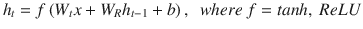

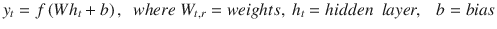

这里的关键特征是，当神经网络执行这些操作时，它会“展开”成多个新状态，每个新状态都依赖于先前的状态。因为这些网络对每个输入都执行相同的任务，除了模型的功能依赖性之外，rnn 通常被称为具有记忆。图 [6-1](#Fig1) 显示了一个 RNN。

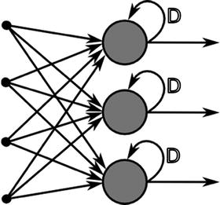

图 6-1。

Architecture of recurrent neural network

这种形式的 RNN 是在 20 世纪 80 年代开发的。与其他神经网络类似，多层神经元通过权重连接，每个权重通过反向传播方法改变。我们基于评估统计来改变我们的权重，在这种情况下，评估统计是给定时间步长激活单元的加权和。总误差是所有时间步长上所有这些单独加权和的总和。在某些时间步骤中，某些输出单元可能会有教师驱动的目标激活。例如，如果输入序列是对应于说出的数字的语音信号，则在序列末尾的最终目标输出可以是对该数字进行分类的标签。对于每个序列，其误差是由网络计算的所有目标信号与相应激活的偏差之和。对于大量序列的训练集，总误差是所有单个序列的误差之和。

## 通过时间反向传播训练 RNNs(BPPT)

Sepp Hochreiter 和 Jurgen Schmidhuber 等人被认为是开发深度学习训练方法的最伟大的先驱之一。标准方法被称为时间反向传播(BPTT)。BPTT 与常规反向传播大致相同，只是它是为了处理 rnn 的一个特定问题而创建的，即我们正在通过不同的时间步骤进化一个模型。对于每个训练时期，我们首先在相当小的序列上进行训练，然后逐渐增加上述训练序列的长度。直观上，这通常被设想为对长度为 1，2 到 N 的序列进行训练，其中 N 是该序列的最大可能长度。这里有一个方程更简洁地描述了这种现象

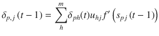

其中 t =时间步长，h = t 处隐藏节点的索引，j = t = 1 步处的隐藏节点，δ =误差。

具体来说，我们可以这样看待这些现象:我们用等式

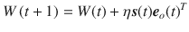

将 W 定义为输出层的权重矩阵

其中 e <sub>o</sub> =来自输出层的错误:

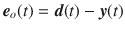

我们现在有了 k 个序列，通过它们我们将网络展开成一个常规的前馈网络，我们一直观察到现在。然而，RNN 模型中的循环层同时接受前一层和后一层的输入。为了抵消反向传播误差时由于同时输入而发生的权重变化，我们对每一层接收到的更新进行平均。

## Elman 神经网络

RNN 建筑公司还收到了杰弗里·埃尔曼的额外捐款，他创建了以他的名字命名的埃尔曼网络模型。Elman 构建的体系结构主要是用于语言处理算法，但它们也可以用于输入数据是顺序的或基于时间序列的任何问题。图 [6-2](#Fig2) 显示了 Elman 网络的基本结构。


图 6-2。

Illustration of Elman network

Elman 在该体系结构中包括一层上下文单元，其区别在于它们的功能高度关注先前的内部状态。Elman 网络的关键区别之一是隐藏层的输出也馈入前一层中的上下文单元，但是连接上下文单元和隐藏层的权重具有恒定值 1，使得关系是线性的。此后，输入层和上下文层同时激活隐藏层，于是隐藏层在执行更新步骤的同时也输出一个值。在下一个时期期间，先前描述的训练序列以相同的方式发生，除了这里我们观察到具有上下文单元的层现在采用来自前一时期的隐藏层的值。上下文单元的这一特征通俗地被描述为具有记忆的网络。训练这个神经网络需要许多步骤，步骤的数量最终取决于所选字符串的长度。

## 神经历史压缩器

消失梯度特指网络早期层中的梯度变得极小。这是由于我们使用的激活函数，通常是 tanh 或 sigmoid。因为这些激活函数将输入“挤压”到相对较小的范围内，使得插值结果更容易，这使得导出梯度变得非常困难。在多个堆叠层之后重复这个挤压输入的过程，当我们反向传播到第一层时，我们的梯度已经“消失”了消失梯度的问题通过神经历史压缩器的创建得到了部分解决，这是一种早期的生成模型，作为循环神经网络的无监督“堆栈”来实现。输入级学习从以前的输入历史预测它的下一个输入。在下一个更高级别的 RNN 中，输入仅包括堆栈中 rnn 子集的不可预测输入，这确保了内部状态很少被重新计算。因此，每个高级 RNN 学习下面 RNN 中信息的压缩表示。通过设计，我们可以从最高级别的序列表示中精确地重构输入序列。当我们使用具有相当可预测性的序列数据时，监督学习可以用于通过最高级别的 RNN 对更深层次的序列进行分类。

## 长短期记忆(LSTM)

LSTM 是一个越来越受欢迎的模型，它的优势在于处理数据噪音中信号之间未知大小的间隙。LSTMs 是由 Sepp Hochreiter 和 Jurgen Schmidhuber 在 20 世纪 90 年代末开发的，它是通用的，当存在足够多的网络单元时，计算机可以计算的任何东西都可以用 LSTMs 复制，假设我们有一个正确校准的权重矩阵。图 [6-3](#Fig3) 所示。

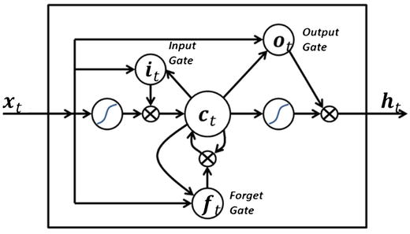

图 6-3。

Visualization of long short-term memory network

LSTMs 的应用范围部分解释了它们受欢迎的原因，因为它们经常用于机器人控制、时间序列预测、语音识别和其他任务的领域。与我们在其他 RNN 体系结构中常见的单元不同，LSTM 网络包含块。LSTMs 的另一个关键区别因素是能够长时间“记住”一个给定值，并且模型中的门决定输入序列的几个属性。门的考虑因素包括输入重要性、何时应该保留内存或进行“垃圾收集”并删除数据，以及输出值时间。LSTM 模块的典型实现如图 [6-3](#Fig3) 所示。标准 LSTM 中的 sigmoid 单位包含等式

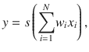

其中 s 是挤压函数(在许多情况下，通常是逻辑函数或任何激活函数，如先前模型中所述)。查看图 [6-3](#Fig3) ，最左边的 sigmoid 单元将输入馈送到 LSTM 块的“存储器”从这一点开始，图中的其他单元就像门一样，允许或拒绝对 LSTM 存储器的访问。标题为 I 的单元，我们将其表示为图中的输入门，将阻止所有非常小(接近于零)的值进入存储器。图底部的单元“遗忘”门“遗忘”它所记忆的任何值，并将其从内存中丢弃。该图右上角的单元是“输出门”，它决定是否应该输出存储在 LSTM 存储器中的值。有时，我们观察到用以下符号表示的单位:P 或σ。具有求和符号的单元被反馈到 LSTM 块中，以便于在没有值衰减的许多时间步长上记忆相同的值。典型地，该值也被输入到三个门单元，以改善它们各自的决策过程。在 LSTMs 中使用的矩阵的 Haramard 乘积或 entrywise 乘积由以下索引符号给出:

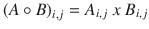

## 传统 LSTM

上面，我们有一个 LSTM 的层，我们的数据通过它传递

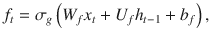

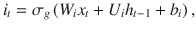

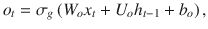

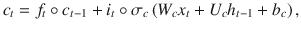

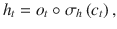

其中 x =输入向量，h <sub>t</sub> =输出向量，c <sub>t</sub> =细胞状态，(W，U，b) =参数矩阵和向量，(f <sub>t</sub> ，i <sub>t</sub> ，o<sub>t</sub>=记忆信息，获取信息，输出，分别为，sg = sigmoid 函数，sc =原始双曲正切，sh =原始双曲正切。

## 培训 LSTMs

BPPT 用于 LSTM，但是由于 LSTM 的特殊特征，我们也可以像传统一样通过 BP 使用梯度下降。LSTMs 中的消失梯度由误差转盘专门处理。LSTMs“记住”它们的反向传播误差，然后反馈给每个权重。因此，规则的反向传播对于训练 LSTM 块在很长的持续时间内记住值是有效的。

## RNNs 内的结构阻尼

如果我们使用共轭梯度法，它偏离原始 x 太远，曲率估计变得不准确，我们可能会观察到无法收敛到全局最优。根据 Martens 和 Sutskever 的建议，当使用共轭梯度法时，建议使用结构阻尼。用这种方法，我们惩罚与 x 的大偏差，其中公式由

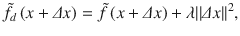

给出

其中| |δx | |<sup>2</sup>是偏差的大小。λ，类似于岭回归，用作调整参数。

调谐参数是自适应的，通过类似于第 [3](03.html) 章所述的 Levenburg-Marq 算法的过程进行选择。建议我们找到一个减速比，由下面的等式给出:

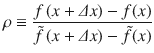

## 调整参数更新算法

权重在每个时间步长更新，因此增加矩阵中的值会导致输出的剧烈变化:

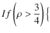

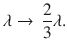

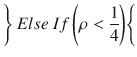

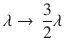

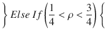

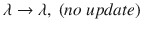

## RNN 的实际例子:模式检测

让我们以尝试预测基于时序的序列数据为例。在这种情况下，我们将尝试预测一年中不同时间的牛奶产量(图 [6-4](#Fig4) 和 [6-5](#Fig5) )。让我们从检查我们的数据开始，以获得对它的理解:

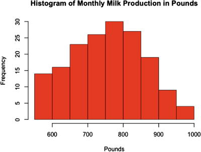

图 6-5。

Visualization of milk data via histogram

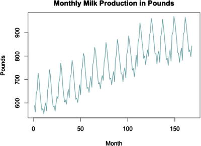

图 6-4。

Visualization of sequence

```py
#Clear the workspace
rm(list = ls())
#Load the necessary packages
require(rnn)

#Function to be used later
#Creating Training and Test Data Set
dataset <- function(data){
  x <- y <- c()
  for (i in 1:(nrow(data)-2)){
    x <- append(x, data[i, 2])
    y <- append(y, data[i+1, 2])
  }
  #Creating New DataFrame
  output <- cbind(x,y)
  return(output[1:nrow(output)-1,])
}

```

当处理时间序列数据时，我们将不得不执行大量的数据转换。特别是，我们必须创建与给定数据略有不同的 X 和 Y 变量。从`dataset()`函数中，我们创建了一个新的 X 变量，它是从原来的 Y 变量开始的时间步长 t。我们创建一个新的 Y 变量，它是从原来的 Y 变量 t + 1 而来的。然后，我们将数据截断一行，这样就可以删除缺失的观察值。接下来，让我们加载并可视化数据(如图 [6-4](#Fig4) 和 [6-5](#Fig5) ):

```py
#Monthly Milk Production: Pounds Per Cow
data <- read.table("/Users/tawehbeysolow/Downloads/monthly-milk-production-pounds-p.csv", header = TRUE, sep = ",")
#Plotting Sequence
plot(data[,2], main = "Monthly Milk Production in Pounds", xlab = "Month", ylab = "Pounds",
     lwd = 1.5, col = "cadetblue", type = "l")
#Ploting Histogram
hist(data[,2], main = "Histogram of Monthly Milk Production in Pounds", xlab = "Pounds", col = "red")

```

如您所见，尽管值的范围看起来很广，但我们的数据在值的频率方面有严重的右偏。

现在您已经直观地理解了我们的数据，让我们继续准备要输入到 RNN 中的数据:

```py
#Creating Test and Training Sets
newData <- dataset(data = data)

#Creating Test and Train Data
rows <- sample(1:120, 120)
trainingData <- scale(newData[rows, ])
testData <- scale(newData[-rows, ])

```

我建议所有用户在将数据输入到 RNN 之前使用最大-最小缩放，因为这有助于减少给定神经网络的误差。与标准归一化类似，最大-最小缩放会显著缩小输入数据集的范围，但它是通过对 0 到 1 之间的观察值进行分类来实现的，而不是通过返回数据偏离平均值的标准偏差来实现的。完成这一步后，我们可以输入数据。用户可以随意试验这些参数，但是我已经训练了网络以获得良好的性能。

现在让我们评估我们的培训和测试结果(如图 [6-6](#Fig6) 和 [6-7](#Fig7) ):

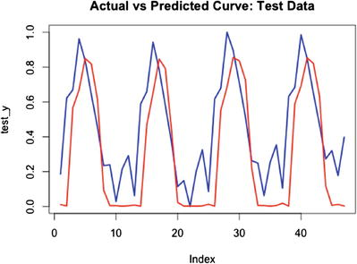

图 6-7。

Test set performance

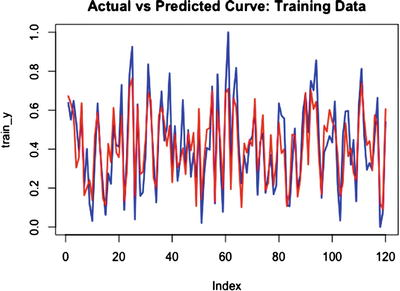

图 6-6。

Training data performance

```py
#Max-Min Scaling
x <- trainingData[,1]
y <- trainingData[,2]

train_x <- (x - min(x))/(max(x)-min(x))
train_y <- (y - min(y))/(max(y)-min(y))

#RNN Model
RNN <- trainr(Y = as.matrix(train_x),X = as.matrix(train_y),
learningrate = 0.04, momentum = 0.1,
network_type = "rnn", numepochs = 700, hidden_dim = 3)

y_h <- predictr(RNN, as.matrix(train_x))
#Comparing Plots of Predicted Curve vs Actual Curve: Training Data
plot(train_y, col = "blue", type = "l", main = "Actual vs Predicted Curve", lwd = 2)
lines(y_h, type = "l", col = "red", lwd = 1)
cat("Train MSE: ", mse(y_h, train_y))

```

```py
#Test Data
testData <- scale(newData[-rows, ])
x <- testData[,1]
y <- testData[,2]
test_x <- (x - min(x))/(max(x)-min(x))
test_y <- (y - min(y))/(max(y)-min(y))
y_h2 <- predictr(RNN, as.matrix(x))

#Comparing Plots of Predicted Curve vs Actual Curve: Test Data
plot(test_y, col = "blue", type = "l", main = "Actual vs Predicted Curve", lwd = 2)
lines(y_h3, type = "l", col = "red", lwd = 1)
cat("Test MSE: ", mse(y_h2, test_y))

```

训练集和测试集的 MSEs 分别为 0.01268307 和 0.06666131。虽然训练集的 MSE 较低，但这可能只是因为训练集明显大于测试集。通过直观地比较各个图中的曲线，我们可以看到测试性能不如训练集准确。如您所见，训练集和测试集中的实际曲线显示出比 RNN 完全捕获的更高的方差。如果你在读电子书，实际曲线是蓝色的，预测曲线是红色的。

## 摘要

本章有效地涵盖了最常提到的 RNN 例子。它还引导读者解决时间序列数据问题。第 7 章讲述了深度学习的一些最新发展，并探索了我们如何利用这些见解来解决更困难的问题。