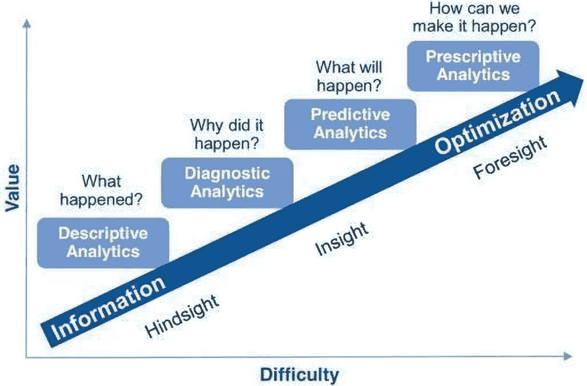

# 1. 决策智能概述

*规范性 AI*是一种旨在提供建议、解决方案或行动，以优化或改善特定流程或结果的人工智能。它不同于描述性 AI（描述过去/现在“发生了什么”）、推断性/诊断性 AI（帮助我们理解“为什么”会发生某事）以及预测性 AI（帮助预测未来可能发生什么）。一旦我们有了预测，规范性 AI 便专注于应采取哪些行动来实现特定目标或结果。

规范性 AI 可用于多种应用，例如在医疗领域帮助医生诊断疾病和制定治疗方案，在金融领域做出投资决策，以及在制造业优化生产流程。它通常使用机器学习算法和其他先进技术来分析大型数据集，并基于数据生成建议。

总体而言，规范性 AI 的目标是通过提供基于数据驱动分析的准确且可操作的见解，帮助人类做出更好的决策。

如前所述，规范性 AI 系统与描述性和预测性 AI 系统的不同之处在于，它们不仅基于数据分析提供见解和预测，还提供具体的建议或行动。规范性 AI 更进一步，通过建议实现预期结果的最佳解决方案和策略。

在本章中，我们将从 AI 的类型开始，然后深入探讨规范性 AI 和决策智能。

## 人工智能的类型

描述型、诊断型、预测型和规定型人工智能是四种不同类型的人工智能，应用于各种场景。以下是每种类型的概述：

- **描述型人工智能：** 描述型人工智能，也称为*描述性分析*，用于描述过去或当前正在发生的事情。它涉及分析历史数据以识别模式、趋势和洞察。描述型人工智能常用于报告和商业智能应用，例如汇总关键绩效指标的仪表盘和计分卡。它也可用于探索性数据分析，以发现隐藏的洞察和相关性。

例如，一家零售公司可能使用描述型人工智能来分析其销售数据，识别哪些产品销量最高、哪些门店业绩最佳、哪些客户购买最多。这些信息随后可用于在库存管理、定价策略和营销活动方面做出数据驱动的决策。

- **诊断型人工智能：** 诊断型人工智能，也称为*诊断性分析*，用于识别问题或事件的根本原因。它涉及分析数据以确定导致特定结果或事件的因素。诊断型人工智能常用于医疗、金融和制造应用。

例如，一家医院可能使用诊断型人工智能来分析患者数据，并识别导致再入院的因素。这可能涉及分析患者人口统计数据、病史和治疗方案，以识别常见的风险因素，并制定有针对性的干预措施来减少再入院率。

- **预测型人工智能：** 预测型人工智能，也称为*预测性分析*，用于预测未来可能发生的事情。它涉及使用统计建模和机器学习技术来分析历史数据，并对未来结果做出预测。预测型人工智能常用于营销、金融和客户服务应用。

例如，一家银行可能使用预测型人工智能来分析客户数据，并预测哪些客户最有可能贷款违约。这些信息随后可用于主动联系这些客户，为他们提供个性化的贷款修改方案以避免违约。

- **规定型人工智能：** 规定型人工智能，也称为*规定性分析*，用于根据预测型人工智能做出的预测，提供关于应采取何种行动的建议。它涉及使用优化算法，基于一组约束条件和目标来确定最佳行动方案。规定型人工智能常用于供应链管理、物流和资源规划应用。

例如，一家物流公司可能使用规定型人工智能，根据实时交通数据、天气状况和交付截止时间来优化其配送路线。这些信息随后可用于自动重新规划送货卡车的路线，以避免交通拥堵并确保准时交付。

总之，如图 1-1 所示，描述型人工智能用于描述已发生的事情，诊断型人工智能用于识别问题的根本原因，预测型人工智能用于预测可能发生的事情，规定型人工智能用于根据这些预测建议应采取的行动。每种类型的人工智能都有不同的应用，可用于解决不同类型的问题。

人工智能类型示意图。这些类型从信息到优化，涵盖事后洞察、实时洞察和事前洞察，分别是描述性分析、诊断性分析、预测性分析和规定性分析。

**图 1-1** 人工智能的类型

规定型人工智能通常涉及使用机器学习算法分析大量数据，以识别变量之间的模式和关系。然后，它利用这种分析提供建议或决策，以优化业务流程、改善客户体验或实现其他期望的结果。

规定型人工智能应用的例子包括个性化医疗（AI 系统根据患者的基因和病史为医生提供个性化治疗建议）和供应链管理（AI 系统优化物流和库存管理以降低成本并提高效率）。

我们试图通过决策智能来实现感知型人工智能。

## 决策智能

*决策智能*（DI）是一门结合了人工智能、决策理论和行为科学技术的学科，旨在支持和改进人类决策。它旨在通过使用数据和数据分析来帮助人们做出更好的决策，从而为决策提供更结构化和严谨的方法。它涉及结合人类专业知识和机器智能，在复杂和不确定的情况下做出更好的决策。

决策智能涉及多种技术，包括机器学习、优化、模拟和行为科学，为决策者提供洞察和建议。它通常涉及从各种来源收集和分析数据，识别决策标准，并根据各种约束条件和目标生成可能的备选方案。

决策智能的最终目标是使组织和个人能够做出更符合其目标、价值观和偏好的更好决策。这可以在商业、医疗、政府和教育等广泛领域带来效率、效益和竞争力的提升。

## 决策智能发展史

决策智能源于多个领域，包括决策理论、博弈论和运筹学。让我们了解一下决策智能的简要历史。

- **决策理论：** 决策理论是一个已有超过一个世纪历史的研究领域。在 20 世纪初，经济学家和数学家开始为决策制定正式的模型，其中包括效用理论和期望值等要素。这些模型为理解如何做出决策以及如何优化结果提供了框架。

- **运筹学：** 运筹学（OR）在第二次世界大战期间作为解决军事后勤问题的一种方法而出现。运筹学涉及使用数学和统计方法来分析复杂系统并做出决策。运筹学已应用于广泛的行业，包括制造业、交通运输和医疗保健。

- **博弈论：** 博弈论是数学的一个分支，研究人们在战略情境中如何互动。它由约翰·纳什和约翰·冯·诺伊曼等数学家在 20 世纪中期发展起来，并已被用于研究经济学、政治学和心理学等领域的决策。

- **商业分析：** 近年来，随着大数据和数据分析的兴起，决策越来越以数据为驱动。商业分析涉及使用数据为决策提供信息，并已被用于优化流程、改善客户体验和推动收入增长。

- **决策智能：** 决策智能在 21 世纪初出现，旨在整合决策所涉及的各个学科，包括决策理论、博弈论和分析学。决策智能涉及使用一系列工具和技术来支持决策，包括机器学习、优化和模拟。

## 人工智能应用面临的挑战

企业在应用人工智能技术时会面临若干挑战。以下是其中一些关键挑战：

- **数据质量与可用性：** 人工智能系统高度依赖数据，因此数据质量低下或数据匮乏会削弱系统的有效性。
- **技术专长：** 实施/维护人工智能系统通常需要专门的技术专长，而企业内部可能并不具备这些人才。
- **成本：** 人工智能系统的实施和维护成本可能很高，尤其是在企业缺乏必要基础设施的情况下。
- **变革阻力：** 习惯于传统系统和流程的员工可能会对变革产生抵触情绪。
- **伦理考量：** 人工智能系统可能引发与隐私、偏见和透明度相关的伦理问题，必须加以解决以确保决策符合伦理规范。
- **与现有系统的集成：** 将人工智能与现有系统集成可能颇具挑战，尤其是当这些系统已过时或与新技术不兼容时。
- **法规与合规性：** 人工智能系统可能需要遵守诸如`GDPR`或`HIPAA`等法规，这为其实施增加了额外的复杂性。
- **认知不足：** 企业领导者和员工可能对人工智能技术的潜在优势和局限性缺乏了解，从而阻碍其应用。

为了克服这些挑战，企业需要仔细评估应用人工智能的潜在收益和风险，确定所需的资源和专业知识，并制定全面的计划，将该技术实施并集成到现有系统和流程中。同时，他们还需要优先考虑伦理问题，并与员工密切合作，确保他们能够舒适且自信地使用新技术。

## 决策智能如何弥合人工智能与商业之间的鸿沟？

人工智能面临的挑战之一在于，人们很难理解其决策过程。决策智能可以通过揭示人工智能模型的工作原理来提供帮助，使业务用户能够理解并解读正在做出的决策。

- **集成：** 决策智能有助于将人工智能技术集成到现有的业务流程和工作流中，使业务用户无需学习复杂的新系统就能更轻松地利用人工智能的能力。
- **定制化：** 决策智能可以根据企业的具体需求进行定制，从而在决策过程中采用更个性化的方法，充分考虑组织面临的独特挑战和机遇。
- **风险管理：** 决策智能有助于识别并减轻与人工智能技术相关的风险，例如偏见、隐私问题和数据质量问题，确保在实现人工智能优势的同时将风险降至最低。
- **透明度：** 决策智能可以通过提供清晰易懂的决策解释来提高决策过程的透明度，有助于在业务用户和利益相关者中建立对人工智能技术的信任和信心。

通过以符合企业特定需求的方式利用人工智能的力量，决策智能有助于弥合人工智能与商业之间的鸿沟，使组织能够享受人工智能技术的优势，同时将风险降至最低，并确保决策过程透明、合乎伦理且高效。

## 决策智能的必要性

在当今世界，决策智能正变得越来越重要，原因如下：

- **信息过载：** 随着数据和信息的爆炸式增长，决策者常常被过多的信息所淹没，难以做出明智的决策。决策智能可以通过分析和综合相关数据，将其转化为可操作的见解，从而帮助排除干扰。
- **复杂且不确定的环境：** 当今许多决策都是在复杂且不确定的环境中做出的，需要考虑多种因素和变量。决策智能可以帮助决策者更好地理解不同选项之间的相互依赖关系和权衡，并基于概率建模和模拟提供建议。
- **认知偏差：** 人类的决策常常受到认知偏差的影响，例如过度自信、锚定效应和确认偏差。决策智能可以通过提供更客观、数据驱动的决策方法来帮助减轻这些偏差。
- **竞争优势：** 在当今竞争激烈的环境中，能够更快做出更好决策的组织更有可能成功。决策智能可以通过使组织基于数据驱动的洞察做出更优决策，从而提供竞争优势。
- **提升决策质量：** 决策智能可以通过提供基于数据和分析的见解与建议，帮助决策者做出更好、更明智的决策。这可以带来更好的结果和更高的效率。
- **风险管理：** 许多决策都涉及一定程度的风险。决策智能可以通过提供概率评估和情景分析，帮助决策者理解并管理这些风险。
- **敏捷性与灵活性：** 在当今快节奏且瞬息万变的环境中，组织需要具备敏捷和灵活的决策能力。决策智能可以通过提供实时数据和见解，帮助组织快速有效地应对变化的环境。
- **透明度与问责制：** 决策智能可以通过提供清晰的决策过程审计追踪和文档记录，确保决策的透明度和可问责性。
- **个性化：** 决策智能可以根据个人偏好和目标来定制决策，从而实现更具针对性、更有效的决策过程。

总体而言，决策智能可以帮助组织和个人做出更符合其目标、价值观和偏好的更好决策，从而带来更优的结果和绩效。

## 决策方式的演变

企业的发展受到多种因素的塑造，包括技术进步、组织结构变革，以及数据与分析日益增长的重要性。以下是企业决策方式演变过程中的一些关键里程碑：

-   **基于直觉的决策：** 在商业早期，决策往往依赖于领导者和管理者的直觉与经验。决策过程快速且非正式，主要基于预感或直觉。
-   **基于规则的决策：** 随着企业规模扩大和复杂性增加，决策变得更有条理、更遵循规则。管理者根据预设的标准和规则，制定了标准化的决策流程和程序。
-   **数据驱动的决策：** 随着信息技术和数据分析的兴起，企业的决策方式转向了更加数据驱动的方法。管理者开始利用数据和指标来辅助决策，并借助商业智能、数据可视化和预测性分析等工具。
-   **协作式决策：** 近年来，企业决策变得更加协作化，注重让组织内各利益相关方参与决策过程。这种方法有助于确保决策能吸纳多元视角，并充分考虑所有相关信息和专业知识。
-   **人工智能驱动的决策：** 随着人工智能和机器学习技术的不断进步，企业开始探索如何利用它们来支持决策。人工智能驱动的决策系统可以帮助企业快速处理海量数据，并识别出人类可能不易察觉的模式和洞察。

总体而言，企业决策方式的演变呈现出向更加数据驱动、协作化和技术赋能的方向转变，越来越强调利用数据和分析来支持决策过程。

## 挑战

决策智能的实施颇具挑战性，因为它涉及多个复杂且相互关联的过程。以下是决策智能难以实现的一些原因：

-   **数据的复杂性：** 在许多情况下，决策智能所需的数据复杂、庞大且非结构化，这使得数据的收集、清洗和处理变得困难。
-   **AI 模型的可解释性：** AI 模型可能很复杂且难以解释，这给理解它们如何得出决策带来了挑战。
-   **所需的专业知识：** 实施决策智能需要数据科学、机器学习和决策理论等领域的专业知识。寻找并雇佣合适的人才可能很困难，尤其是在这些技能需求旺盛的情况下。
-   **与现有系统的集成：** 决策智能通常需要与现有系统集成，这可能复杂且耗时，尤其是在这些系统过时或与新技术不兼容的情况下。
-   **变革管理：** 实施决策智能可能需要对现有业务流程和工作流程进行重大变革，这可能会给管理和向员工传达信息带来困难。

尽管存在这些挑战，但决策智能能够帮助企业做出更明智、更有效的决策，从而带来显著收益。通过仔细规划和管理实施过程，企业可以克服这些挑战，充分发挥决策智能的潜力。

### 应用

决策智能在不同领域有着广泛的应用。以下是一些例子：

-   **商业：** 决策智能可以帮助企业在定价、产品开发、供应链管理和客户服务等领域做出更好的决策。例如，决策智能可以帮助零售商根据客户行为和竞争对手分析来优化定价策略。
-   **医疗保健：** 决策智能可用于帮助医疗专业人员在患者护理、诊断和治疗方面做出更明智的决策。例如，决策智能可以帮助医生根据患者的病史和症状确定最佳治疗方案。
-   **政府：** 政府机构可以利用决策智能来改进政策制定、资源分配和应急响应等领域的决策。例如，决策智能可以帮助应急响应人员在自然灾害期间做出更快、更有效的决策。
-   **金融：** 决策智能可以帮助金融机构在投资管理、风险管理和欺诈检测等领域做出更好的决策。例如，决策智能可以帮助投资经理根据市场趋势和风险状况优化投资组合配置。
-   **教育：** 决策智能可用于改进学生表现评估、课程设计和资源分配等领域的决策。例如，决策智能可以帮助教师根据学生的个人需求和学习风格进行个性化教学。
-   **市场营销：** 决策智能可以帮助营销人员在客户细分、活动优化和产品定位等领域做出更好的决策。例如，决策智能可以帮助营销人员识别针对不同客户细分市场最有效的营销渠道。
-   **制造业：** 决策智能可用于优化制造流程、改进质量控制和减少浪费。例如，决策智能可以帮助制造商根据原材料成本、能耗和产品质量等变量确定最高效的生产方法。
-   **交通运输：** 决策智能可用于优化交通系统、改进路线规划和减少拥堵。例如，决策智能可以帮助交通规划者根据乘客需求和交通模式确定最佳公交路线。
-   **农业：** 决策智能可用于提高作物产量、减少用水量和优化肥料施用。例如，决策智能可以帮助农民根据天气模式和土壤条件确定最佳播种和收获时间。
-   **能源：** 决策智能可用于优化能源消耗、减少排放和提高能源效率。例如，决策智能可以帮助能源公司根据地理位置和天气模式等因素确定最具成本效益的可再生能源来源。

总体而言，决策智能有潜力改善广泛领域的决策，从而带来更好的结果和更高的效率。

## 理解决策智能在 AI 生命周期中的定位

决策智能在 AI 生命周期中扮演着关键角色，尤其是在流程的后期阶段。以下是决策智能如何融入 AI 生命周期：

- **数据收集：** AI 生命周期的第一阶段涉及收集和清洗数据。这一阶段对决策智能至关重要，因为所收集数据的质量将影响决策的质量。

- **数据准备：** 数据收集完成后，必须对其进行处理，为 AI 模型的使用做好准备。此阶段可能涉及数据转换、特征工程和数据增强。这些步骤会影响决策智能的准确性和有效性。

- **模型训练：** 此阶段涉及使用机器学习算法训练 AI 模型。决策智能在此阶段至关重要，因为它涉及选择合适的算法、定义问题和目标，以及验证模型的准确性和可靠性。

- **模型部署：** 模型训练完成后，需要将其部署到生产系统中。决策智能在此阶段的重要性在于确保模型的部署方式能最大化其影响和有效性，同时将风险降至最低。

- **监控与优化：** AI 模型必须持续监控和优化，以确保其按预期运行。决策智能在此阶段发挥关键作用，因为它涉及分析性能指标、识别改进领域，并做出优化模型的决策。

- **决策制定：** 最后，决策智能用于根据 AI 模型生成的洞察和预测来指导决策制定。这可能涉及根据模型生成的预测选择最佳行动方案，或利用模型为战略决策流程提供信息。

总体而言，决策智能是 AI 生命周期的一个关键组成部分，因为它有助于确保 AI 模型的开发、部署和使用方式能够最大化其影响和有效性。

### 决策智能方法论

根据所解决的具体问题和可用数据，有多种方法论可用于决策智能。以下是一些常用的方法论：

- **决策分析：** 该方法论涉及将决策问题构建成决策树，识别可能的备选方案，评估每个方案的结果，并为每个结果分配概率。这有助于决策者理解不同选项之间的权衡，并选择最佳行动方案。

- **机器学习：** 该方法论涉及使用算法学习数据中的模式，并基于这些模式进行预测或决策。机器学习可用于预测建模、分类和聚类等任务。

- **优化：** 该方法论涉及在特定约束条件下，找到最大化或最小化特定目标函数的问题的最佳解决方案。优化可用于资源分配、生产计划和调度等任务。

- **模拟：** 该方法论涉及创建系统或流程的计算机模型，并利用它生成数据和测试不同场景。模拟可用于风险评估、性能评估和流程改进等任务。

- **博弈论：** 该方法论涉及对竞争情境（如拍卖、谈判和定价）中的决策进行建模。博弈论可用于预测其他参与者的行为，并基于该预测选择最佳策略。

- **贝叶斯推断：** 该方法论涉及基于新数据更新先验信念，以做出概率性预测或决策。贝叶斯推断可用于欺诈检测、客户细分和异常检测等任务。

- **多准则决策分析：** 该方法论涉及基于多个准则或属性评估备选方案，并根据每个准则的重要性进行加权。多准则决策分析可用于支持涉及具有不同偏好的多个利益相关者的复杂决策。

- **模糊逻辑：** 该方法论通过使用模糊集合和模糊规则来处理不精确或不确定的数据。模糊逻辑可用于在数据不完整或模糊的情况下（例如自然语言处理）对决策进行建模。

- **专家系统：** 该方法论涉及将人类专业知识和经验编码到计算机系统中，以提供决策支持。专家系统可用于诊断问题、推荐解决方案，并为其推理提供解释。

- **启发式方法：** 该方法论涉及基于过往经验或常识，使用经验法则或捷径来快速高效地做出决策。启发式方法可用于在时间或资源有限的情况下支持决策。

这些方法论可以组合和定制，以适应特定的决策问题和数据集，从而在复杂和不确定的环境中提供更严谨、结构化的决策方法。

让我们了解在模型做出预测后，决策智能系统如何在真实场景中使用。

假设前一个例子中的金融机构已使用决策智能开发了一个预测模型，用于识别哪些客户最有可能使用新的信用卡产品。该模型预测，经常在某些零售商处购物的客户最有可能使用新信用卡。

### 排版后的内容

- **制定有针对性的营销活动：** 金融机构将利用模型的预测结果，制定有针对性的营销活动，向经常在已识别零售商处购物的客户推广新信用卡。该活动可能包括个性化优惠、定向广告和激励措施，以鼓励客户申请新信用卡。金融机构可以使用数据分析工具，根据已识别客户的购物行为、人口统计数据和信用记录对其进行细分，从而针对其特定需求定制活动信息和优惠。

- **监控活动效果：** 金融机构将通过收集和分析客户数据（如响应率、转化率以及新信用卡产品产生的收入）来监控营销活动的效果。利用这些数据，机构可以优化活动信息、改进活动定位，并优化其决策流程。

- **持续更新模型：** 随着新数据的出现，金融机构将持续更新预测模型，以提高其准确性和有效性。这可能涉及整合新的数据源，例如客户反馈、社交媒体数据或外部经济指标。机构还可能调整模型算法、调整不同变量的权重，或使用集成建模技术来提升模型性能。

- **评估业务影响：** 金融机构将通过收集和分析数据（如产生的收入、客户满意度和留存率）来评估新信用卡产品对业务的影响。利用这些数据，机构可以调整策略、优化模型，并优化其决策流程，以最大化业务绩效。

通过利用决策智能，基于预测模型的预测结果制定有针对性的营销活动，金融机构可以最大化其营销工作的效果，并提高新信用卡产品的成功几率。通过持续更新模型并评估其对业务的影响，机构可以进一步优化其决策流程并提升整体绩效。

## 决策智能的一些潜在优缺点

以下是决策智能的一些优点：

- **改进决策：** 决策智能可以通过提供数据驱动的洞察来帮助企业做出更好的决策，而这些洞察是使用传统决策方法难以获得的。

- **提高效率：** 决策智能可以自动化某些决策流程，从而为企业节省时间和金钱。

- **增强准确性：** 决策智能算法可以分析大量数据并识别人类可能无法看到的模式，从而带来更准确的预测和更好的决策。

- **定制化：** 决策智能可以根据企业的特定需求进行定制，从而实现更个性化的决策方法。

- **改进风险管理：** 决策智能可以通过分析数据和预测潜在结果来帮助企业识别和减轻风险。

- **可扩展性：** 决策智能可以扩展以处理大量数据和决策任务，而这些任务手动完成可能非常困难或不可能。

- **实时决策：** 决策智能可以提供实时洞察和决策，这在时间紧迫的情况下至关重要。

- **竞争优势：** 决策智能可以通过使企业比竞争对手更快地做出更好的决策，从而为其提供竞争优势。

- **持续改进：** 决策智能算法可以随着时间的推移不断学习和改进，使企业能够优化其决策流程并保持领先地位。

- **成本效益：** 从长远来看，与传统决策方法相比，决策智能可能更具成本效益，尤其是在处理大量数据时。

以下是决策智能的一些缺点：

- **数据质量问题：** 决策智能严重依赖于其所用数据的质量，如果数据不准确或不完整，则可能导致有缺陷的决策。

- **隐私问题：** 决策智能通常涉及收集和分析大量数据，这可能会引起客户和利益相关者的隐私担忧。

- **偏见：** 如果决策智能算法在有偏见的数据上训练，或者算法本身存在偏见，则可能产生偏见。

- **过度依赖技术：** 决策智能可能导致对技术的过度依赖，从而缺乏人工输入和监督。

- **复杂性：** 决策智能可能复杂且难以理解，这可能会使企业难以有效实施和使用。

- **技术专长：** 实施决策智能需要一些企业可能缺乏的技术专长和资源。

- **伦理问题：** 决策智能引发了与隐私、偏见和透明度相关的伦理问题，企业必须解决这些问题以确保合乎伦理的决策。

- **对数据的依赖：** 决策智能依赖于拥有足够的数据来做出明智的决策，而数据可能并非总是可用。

- **集成挑战：** 将决策智能集成到现有决策流程中可能具有挑战性，并且需要付出巨大努力。

- **采用障碍：** 由于对变革的抵制或对其潜在好处的缺乏理解，决策智能的采用可能面临障碍。

## 公司利用决策智能的示例

很难估计成功实施决策智能的公司数量，因为决策智能的采用仍然相对较新，并且因行业和组织而异。然而，有几个成功实施决策智能并看到显著收益的公司示例。以下是一些例子：

- **第一资本：** 金融服务公司第一资本已实施决策智能来改进其信用决策流程。通过将机器学习模型与人类专业知识相结合，第一资本能够提高信用决策的准确性并降低违约风险。

- **波音：** 航空航天公司波音已实施决策智能来优化其飞机维护流程。通过分析飞机发动机传感器数据，波音可以预测何时需要维护并主动安排维修，从而减少停机时间并提高安全性。

- **宝洁：** 消费品公司宝洁已实施决策智能来改进其供应链运营。通过分析库存、生产和物流数据，宝洁可以优化其供应链以降低成本并改善交货时间。

- **UPS：** 物流公司 UPS 已实施决策智能来优化其包裹递送流程。通过使用机器学习模型预测包裹需求并优化递送路线，UPS 能够减少燃料消耗、降低成本并改善递送时间。

虽然这些只是几个例子，但它们展示了决策智能在改进决策和推动业务价值方面的潜力。随着决策智能采用的持续增长，我们可以期待看到更多公司实施决策智能并实现其收益。

## 结论

你现在了解了规范性 AI 是什么、它的历史、工作原理、方法论、应用以及优缺点。在接下来的章节中，我们将深入探讨这些方面的每一个，同时构建一个端到端的决策智能解决方案。

