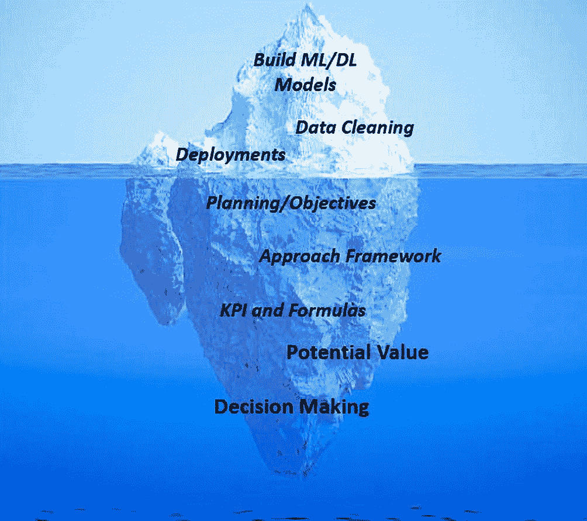
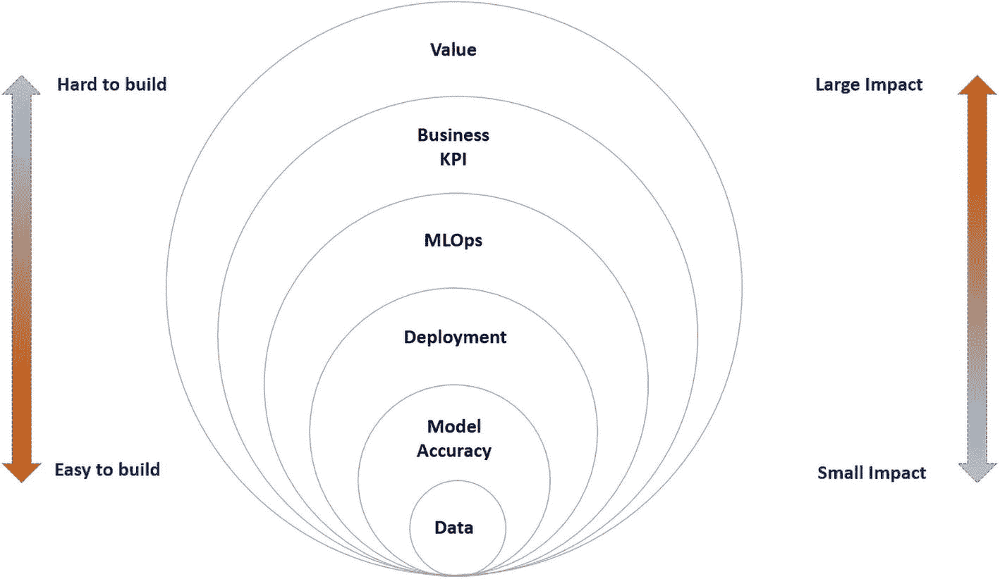

# 2. 决策智能需求

许多人工智能项目将在各行各业遭遇失败，因为 AI 项目可能复杂且充满挑战，许多潜在因素都可能导致其失败。失败的原因包括缺乏明确目标、数据质量问题，以及将 AI 系统集成到现有流程中的困难。此外，还可能存在组织层面的挑战，例如缺乏利益相关者的支持或认同、不切实际的期望，以及对 AI 能力和局限性的理解不足。

在本章中，我们将讨论如何通过规划、明确需求以及理解 DI 需求框架来减少失败。

## 为什么 AI 项目会失败？

AI 项目可能因多种原因失败，包括缺乏明确定义的目标、数据不足或数据质量差、缺乏专业知识或资源，以及难以将 AI 系统集成到现有流程或系统中。此外，伦理方面的考量，例如数据或算法本身存在的偏见，也可能导致 AI 项目失败。

决策智能（DI）是一个结合了人工智能（AI）和决策技术的领域，旨在帮助组织做出更好的决策。决策智能需求指的是一个 DI 系统要有效并对组织有价值所必须满足的具体需求和标准。

让我们退一步，理解一下在启动任何 AI 项目之前需要提出的一些问题。

- “AI 能否比现有流程表现更好？”

- “数据是否适合 AI 模型？”

- “AI 项目的目标/目的是否明确定义？”

- “这个 AI 项目是否创造了价值？”

- “我们是否选择了正确的关键绩效指标来衡量 AI 项目的价值？”

- “AI 结果是否被（通过采取行动）应用？”

- “业务用户是否从 AI 预测中受益？”

以下是围绕 AI 的一些常见误解：

- **误解 1：** 合适的数据科学家和正确的算法就能创造出完美的 AI。

- **误解 2：** 要在 AI 领域获胜，你需要大量数据，并且需要最好的算法。

- **误解 3：** AI 模型越准确越好。

- **误解 4：** AI 试点在一个区域/领域有效，同样的 AI 模型在企业推广中也有效。

- **误解 5：** 如果 AI 模型今天有效，它就永远有效。

为了回答上述问题并克服这些误解，一个 DI 需求框架至关重要。该框架如同 AI 项目的“圣经”，因为它包含了从构思阶段到运营阶段项目的所有细节。

要通过 AI 交付价值，遵循一些指导方针/路径非常重要，这些方针有助于确保决策智能解决方案的成功实施和采用。

- **明确定义问题：** 在实施任何 AI 和决策智能解决方案之前，必须清楚理解需要解决的问题。这意味着要识别利益相关者、他们的需求和期望、问题的范围以及预期的结果。

- **收集和分析数据：** AI 解决方案严重依赖数据。因此，收集和分析所需数据以确保解决方案基于准确可靠的信息至关重要。

- **确定决策标准：** AI 应通过提供评估备选方案的标准来支持决策。这些标准应基于问题定义、利益相关者需求和相关数据。

- **选择合适的决策方法：** 根据问题和可用数据，可以使用不同的决策方法。选择合适的、能基于现有信息提供最佳结果的方法非常重要。这将在第 3 章详细讨论。

- **构建 AI 模型：** 一旦确定了标准和决策方法，就可以构建模型。模型应透明、可解释且用户友好。

- **验证模型：** 应对 AI 模型进行验证，以确保其准确可靠。这可以通过测试、模拟和实时分析来完成。

- **实施解决方案：** 模型验证后，即可实施解决方案。确保解决方案与现有系统集成，并且利益相关者经过培训并获得支持以有效使用该解决方案至关重要。

- **监控和评估解决方案：** 应持续监控和评估 AI 解决方案，以确保其交付预期价值。这可以通过定期性能检查和利益相关者反馈来实现。

牢记所有这些指导方针，让我们构建一个 DI 需求框架，它将作为在启动项目之前构建需求文档的手册。

## DI 需求框架

要使 AI 项目成功，仅仅构建花哨的机器学习和深度学习模型并部署它们是不够的。那只是冰山一角。真正的努力需要投入到规划、定义明确目标、构建方法框架以及评估这些项目可能产生的潜在价值上，如图 2-1 所示。



一幅描绘冰山浸没部分的插图展示了 AI 生命周期中隐藏的步骤。这些步骤包括：构建 ML 或 DL 模型、数据清洗、部署、规划或目标、方法框架、KPI 和公式、潜在价值以及决策制定。

**图 2-1** AI 生命周期中的隐藏步骤

那么，让我们详细讨论一个框架。第一步是进行适当的规划。

### 规划

规划是任何人工智能项目的关键环节，它有助于确保项目定义明确、组织有序，并拥有清晰的成功路径。以下是规划对人工智能项目至关重要的具体原因：

-   **明确问题：** 首先明确人工智能能够帮助解决或应对的具体问题或机遇。这可能涉及从改善客户服务、自动化重复性任务到识别新的收入来源等各个方面。许多人工智能项目是在原本没有问题的情况下，强行将人工智能塞入业务流程中。

-   **定义项目目标与目的：** 规划有助于确保项目拥有清晰、可衡量且可实现的目标与目的。这能指导人工智能系统的开发，并确保其与组织的整体战略保持一致。

-   **识别并应对潜在风险：** 规划使团队能够识别并评估可能影响项目的潜在风险，例如数据不足、缺乏专业知识，或难以将人工智能系统集成到现有流程中。尽早应对这些风险有助于减轻其影响，确保项目成功。

-   **组建合适的团队：** 组建一支拥有数据科学家、工程师和领域专家等多元化技能的团队。这将有助于确保项目有效执行，并使人工智能系统能够针对组织的特定需求进行定制。

-   **管理期望：** 规划通过向利益相关者清晰传达项目的目标、目的、时间表和预算来管理期望。这有助于确保各方达成共识，并确保项目按预期交付。

-   **识别并应对伦理考量：** 规划使团队能够识别并应对可能影响项目的伦理考量，例如数据或算法中潜在的偏见。

-   **理解数据：** 确保你能获取必要的数据，并且这些数据质量较高。了解数据是如何收集、存储的，以及如何用于训练和运行人工智能系统。

-   **衡量结果：** 规划并定义合适的 KPI 和指标来衡量人工智能项目的结果。这将有助于确定系统的有效性，并避免日后产生混淆。

-   **传达价值：** 向组织内外的利益相关者传达人工智能项目的价值。这将有助于获得支持，并确保项目被视为成功。

总体而言，规划对人工智能项目至关重要，因为它有助于确保项目定义明确、组织有序，并拥有清晰的成功路径。

### 方法

着手一个人工智能项目需要仔细考虑几个关键因素，包括要解决的问题类型、可用数据、可用计算资源以及部署要求。以下是着手人工智能项目的一些通用指南：

-   **模型类型：** 根据你要解决的问题，选择合适的机器学习或深度学习模型。有许多不同的模型可供选择，例如基于神经网络的模型、决策树和支持向量机。你对模型的选择将取决于你要解决的具体问题，以及数据的数量和质量。

    -   **分类：** 当你拥有带标签的数据并希望预测分类结果时，使用分类方法。这通常用于需要判断新数据点属于哪个类别或分类的场景。例如，你可以使用分类方法根据客户的个人信息预测他们是否会购买产品。

-   **回归：** 当你拥有带标签的数据并希望预测连续结果时，使用回归方法。这通常用于需要预测数值的场景，例如房屋价格或特定地区的降雨量。当你需要做出不限于离散值集合的预测时，回归模型非常有用。

-   **无监督学习：** 当你拥有未标记的数据并希望识别数据中的模式或分组时，使用无监督学习。这通常用于在没有任何先验知识的情况下，发现数据中隐藏的关系或结构。聚类是一种常见的无监督学习技术，可以根据特征将相似的数据点分组。

在决定使用这些不同类型的学习方法时，考虑数据的大小和质量也很重要。如果你的数据集较小且特征有限，你可能希望使用像逻辑回归或 K 近邻这样的简单模型。另一方面，如果你有包含复杂特征的大型数据集，你可能希望使用像深度神经网络这样更复杂的模型。

最终，学习算法的选择将取决于你的项目和数据的具体情况。

-   **框架：** 根据你选择的模型，为你的 AI 项目选择一个框架。有许多流行的框架可用于构建机器学习和深度学习模型，包括 `TensorFlow`、`PyTorch` 和 `Scikit-learn`。选择一个适合你的模型，并具备所需特性和功能的框架。

-   **部署细节：** 部署 AI 模型是整个项目的重要组成部分，应提前规划，以确保模型能够顺利集成到生产环境中。以下是规划 AI 模型部署的一些步骤：

    -   **明确部署要求：** 首先明确在生产环境中部署模型的要求。考虑因素包括运行模型所需的硬件和软件基础设施、数据输入和输出，以及任何安全或合规性考量。

-   **选择部署策略：** 一旦明确了部署要求，选择适合你的模型和项目目标的部署策略。一些常见策略包括将模型部署为 Web 服务、将其集成到现有应用程序中，或将其部署到边缘设备上。

-   **选择部署平台：** 根据你的部署策略，选择一个适合你的模型和项目目标的部署平台。有许多可用于部署 AI 模型的平台，包括云平台如 `AWS`、`Azure` 和 `Google Cloud`，以及边缘设备如 `Raspberry Pi` 和 `Nvidia Jetson`。

通过在实施之前采取恰当的方法，我们可以确保人工智能项目能够长期交付价值，而不会最终沦为玩具项目。

### 审批机制/组织对齐

为人工智能项目建立审批机制是确保项目与组织目标和价值观保持一致的重要步骤。以下是建立人工智能项目审批机制可遵循的步骤：

1.  **确定利益相关者：** 首先确定应参与审批流程的利益相关者。这可能包括高管层、法律顾问、数据隐私和安全专家，以及来自受影响业务部门的代表。

2.  **建立评估标准：** 定义用于评估人工智能项目的标准。这可能包括数据质量、对利益相关者的潜在影响、产生的价值以及与组织目标的一致性等因素。

3.  **制定审批流程：** 创建一个正式的审批流程，概述决策过程中的步骤和涉及的利益相关者。这可能包括提交项目提案、根据既定标准评估提案以及做出最终决定。

4.  **设立审查委员会：** 建立一个负责审查、批准或拒绝人工智能项目的审查委员会。审查委员会应包括已确定的利益相关者的代表，并负责确保项目符合既定的评估标准。

5.  **进行风险评估：** 在批准人工智能项目之前，进行全面的风险评估，以识别潜在风险并制定缓解策略。这可能涉及评估对利益相关者的潜在影响、识别数据中的潜在偏差，以及评估人工智能模型的准确性和可靠性。

通过为人工智能项目建立审批机制，可以确保项目得到负责任且合乎道德的评估，并与组织目标和价值观保持一致。

### 关键绩效指标

衡量人工智能项目的成果对于了解其有效性并确定改进领域至关重要。通过使用清晰的指标、收集和分析数据、将数据与基线进行比较、确定改进领域以及沟通结果，组织可以确保人工智能系统与项目的目标和目的保持一致，并随着时间的推移持续产生价值。

#### 定义清晰的指标

定义清晰且具体的指标，用于衡量人工智能项目的成果。这些指标应与项目的目标和目的保持一致，并且易于理解和沟通。

可用于衡量人工智能项目成果的指标示例包括：用于流失预测模型的准确流失率、客户满意度评分、用于路线优化算法的平均配送时间、投资回报率等。

收集正确的关键绩效指标是衡量人工智能项目成果的重要步骤。关键绩效指标是用于衡量系统或流程绩效的特定指标，它们有助于提供一种清晰客观的方式来衡量人工智能项目的成果。

在为人工智能项目选择关键绩效指标时，务必确保它们与项目的目标和目的保持一致，并且易于理解和沟通。同时，考虑衡量这些关键绩效指标所需的数据，并确保数据可用且质量高，这一点也很重要。

务必执行以下操作：

-   持续跟踪业务关键绩效指标相对于基准的表现。

-   分析业务关键绩效指标与模型关键绩效指标，以了解模型性能如何影响最终收益。

-   计算已实现的价值（以美元计）和投资回报率。

从利益相关者处获取业务关键绩效指标是衡量人工智能项目成果的重要步骤。以下是从利益相关者处获取这些关键绩效指标的步骤：

1.  **确定利益相关者：** 确定组织中的关键利益相关者，包括将受人工智能项目影响的人员、将使用该系统的人员，以及将负责其实施和维护的人员。

2.  **沟通目标和目的：** 向利益相关者清晰传达人工智能项目的目标和目的。这将有助于确保所有人达成共识，并且项目与组织的整体战略保持一致。

3.  **让利益相关者参与规划过程：** 让利益相关者参与规划过程，例如识别问题、理解数据和定义用例。这将有助于确保项目针对组织的特定需求量身定制，并且利益相关者对其成功投入精力。

4.  **确定关键绩效指标：** 与利益相关者合作，确定用于衡量人工智能项目成果的具体关键绩效指标。这将有助于确保关键绩效指标与项目的目标和目的保持一致，并且与利益相关者相关。

5.  **沟通流程：** 沟通收集和分析数据的流程，以及衡量成果的时间表。这将有助于确保利益相关者理解流程，并能提供必要的数据和支持。

6.  **衡量关键绩效指标：** 一旦模型投入生产，按计划衡量人工智能项目的关键绩效指标，并根据可控因素进行影响分析。评估人工智能是否真正增加了价值并有助于做出适当的决策。

7.  **让利益相关者了解情况：** 让利益相关者了解人工智能项目的成果，包括系统的性能、需要改进的领域以及所做的任何更改。

通过遵循这些策略，组织可以从利益相关者处获取必要的业务关键绩效指标，并确保人工智能项目与组织的目标和目的保持一致。

### 价值

组织面临的最大挑战之一是量化其人工智能举措的收益。价值实现需要付出努力，在了解通过人工智能举措获得了哪些收益之前，无法对其进行改进。难怪大多数人工智能用例由于难以实现其业务价值而根本无法获得任何采用。

如图 2-2 所示，处理数据、构建高精度模型以及部署模型似乎比跟踪和实现人工智能的价值更容易。这似乎很困难，因为我们在构建人工智能项目时是从价值角度出发的，但从未跟踪过关键绩效指标和投资回报。



一个从内到外包含数据、模型精度、部署、MLOps、业务关键绩效指标和价值的堆叠维恩图。左侧一个垂直的双向箭头分别标记为“难以构建”和“易于构建”。右侧另一个箭头标记为“影响大”和“影响小”。

图 2-2

从数据到价值

让我们讨论一下什么是投资回报率，以及如何为人工智能项目计算它。

#### 投资回报率

项目的投资回报率（`ROI`）应综合考虑项目实施成本及其为业务带来的潜在价值。

AI 项目的 `ROI` 是指实施 AI 解决方案或计划所预期或实际获得的财务回报。其计算方式是将项目实施成本（包括数据采集、硬件软件及人员成本）与预期或实际收益进行比较。

AI 项目的收益可能难以量化，但通常包括效率提升、准确性改善、决策优化以及劳动力成本降低。AI 项目的 `ROI` 可通过将净财务收益（如收入增加或成本降低）除以项目总成本，再乘以 100 得出百分比。

但如何计算潜在价值呢？我们来探讨一下。

#### 每次决策的价值

通过估算 AI 项目每次决策的潜在影响，来计算每次决策的价值。

**示例 1：**

再次以客户流失预测为例。如果我们成功预测某位客户即将流失，用户可采取相应措施挽留该客户。因此，单个客户带来的价值为 `X` 美元。

在此场景中，

单次预测价值 = 单个客户产生的价值

**示例 2：**

在某些情况下，我们可能希望了解整体产生的价值，而非单次预测层面的价值。

每次预测的价值可通过将项目总价值除以决策次数来计算。

综合考虑这些因素，您可以推导出 AI 项目的潜在价值，或计算每次决策的价值。

请注意，实际价值可能因以下多种因素而异：

- **概率性或不确定性结果：** 由于预测具有概率性，并非每次预测都能带来 100% 的价值。

- **错误成本：** 即模型产生错误所导致的成本。

因此，整体 `ROI` 的计算公式如下：

```
ROI = 回报 / 投资
```

其中 `回报 = 模型收益 – 预测不确定性`

`投资 = 资源 * 资源成本`

请记住，从 AI 预测中推导出美元价值可能颇具挑战性，尤其是在收益并非直接体现为财务指标时。然而，通过明确问题、定义用例、识别成本与收益、计算 `ROI` 并传达价值，组织可以更清晰地了解 AI 系统的财务影响。

## AI 预测的消费

AI 生命周期的一个关键环节是确保业务能够消费 AI 预测。否则，价值将无法产生。因此，在规划阶段，理解业务将如何消费输出至关重要。以下是清晰理解这一点的步骤：

1. **考虑置信水平：** AI 模型通常会提供与预测相关的置信度或概率。在决定如何使用预测时，考虑这一置信水平非常重要。例如，如果置信水平较低，可能需要在采取行动前用其他数据或方法验证预测。

2. **确定合适的存储方案：** 根据 AI 预测的类型和用例，您可能需要使用不同的存储方案。例如，如果预测结果是图像或视频，可能适合使用 Blob 存储；而对于文本数据，API 调用可能更合适。

3. **设置存储方案：** 确定合适的存储方案后，您需要对其进行设置和适当配置。这可能涉及创建存储容器、配置访问策略和权限，或与其他系统集成。

4. **建立数据流：** 为了消费 AI 预测，您需要在 AI 模型和存储方案之间建立数据流。这可能涉及设置事件触发器、建立数据传输协议或配置 API 端点。

5. **确保数据安全：** 在处理敏感数据时，确保采取适当的安全措施至关重要。这可能涉及对传输中和静态数据进行加密、配置访问控制和权限，或与其他安全系统集成。

6. **识别用户群体：** 问题定义明确后，识别将使用 AI 预测的不同用户群体。这可能包括不同的部门、团队或个人。

7. **了解用户需求：** 对于每个用户群体，了解他们使用 AI 预测的具体需求和条件至关重要。这包括了解他们需要做出哪些决策、需要访问哪些数据，以及需要何种详细程度和准确性。

8. **提供培训和支持：** 在向用户提供 AI 预测后，提供培训和支持以确保用户能够有效消费并依据预测采取行动至关重要。这可能涉及提供用户指南、培训课程或支持资源。

9. **理解预测：** 在消费 AI 预测之前，理解其含义及生成方式至关重要。这包括了解输入数据、所用算法、模型的准确性和局限性，以及建模过程中所做的任何假设。

10. **确定如何使用预测：** 理解预测后，确定如何利用它来做出决策或采取行动。这可能涉及将预测用作另一个系统的输入，或用于触发警报或通知。还应包括以下方面：

    - **可解释性：** 系统必须能够为其决策和建议提供清晰透明的解释，这有助于在利益相关者之间建立信任和理解。

- **可扩展性：** 系统必须能够处理大量数据，应对问题的复杂性，并适应不断变化的条件。
- **灵活性：** 系统应能处理不同类型的问题，并能在组织的不同领域使用。
- **集成性：** 系统应能与现有系统和流程集成，以确保工作流程顺畅高效。

通过遵循这些步骤，您可以识别 AI 预测的用户，并确保他们获得有效使用预测以支持决策和改善结果所需的信息和资源。

## 总结

在本章中，我们讨论了 AI 项目失败的潜在原因、决策智能在利用 AI 做出更好决策中的重要性，以及成功实施 AI 解决方案的指南。本章强调了在启动任何 AI 项目之前提出关键问题的必要性，并揭穿了围绕 AI 的一些迷思。我们还介绍了一个 DI 需求框架，涵盖了规划、方法、审批机制、KPI、潜在价值以及 AI 预测的消费，这些是 AI 项目的基础。