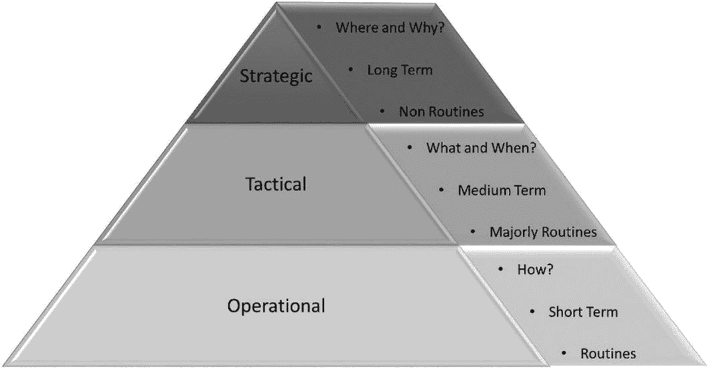
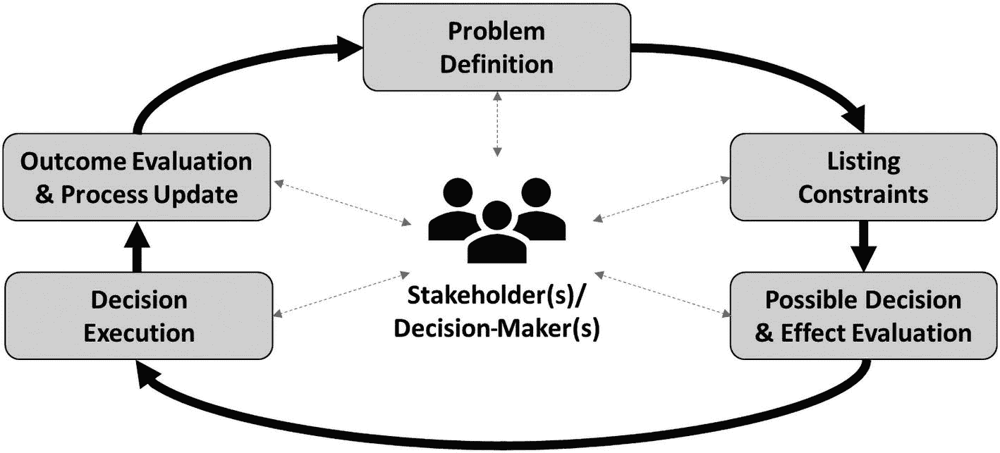
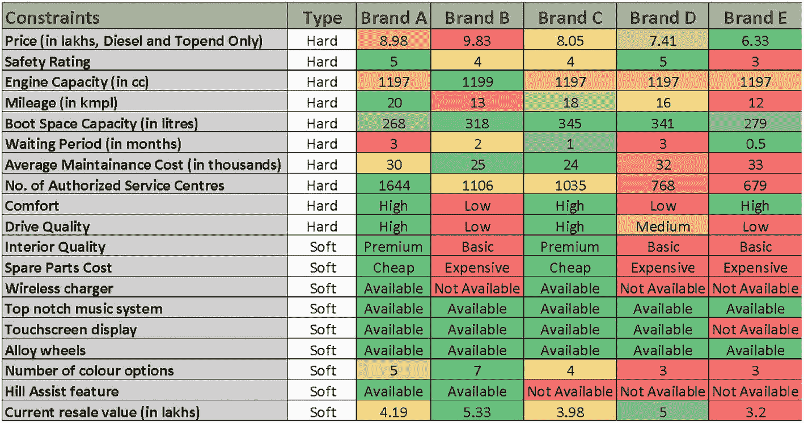
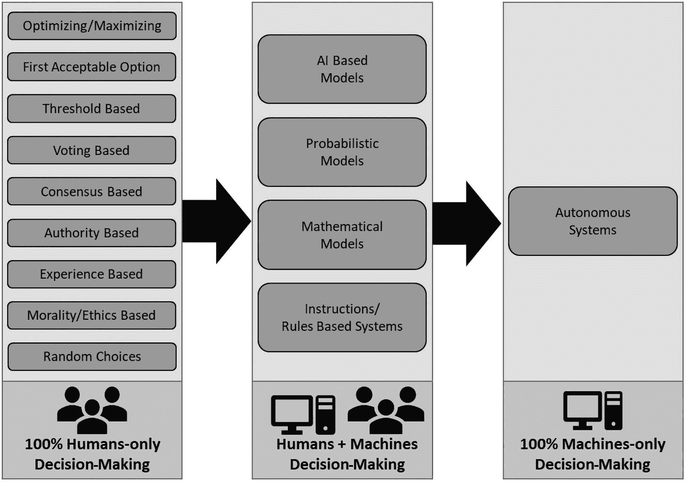

# 3. 决策智能方法论

决策的概念及其类型是本章的主要议题。我们将从决策的定义开始，审视其不同形式。然后，通过一个示例来理解决策过程。接下来，我们将更详细地探讨人类历史上采用的决策方法演变，即*决策智能方法论*，及其优缺点。我们的讨论将以针对不同场景的决策智能方法建议作为结束。

## 决策

要了解不同的决策智能方法论，首先需要理解什么是决策。

决策可以定义为在不同选项中进行选择的心理过程，最终选定某个信念或行动方案。因此，决策包含两个主要组成部分：

*   目标函数

*   实现目标可用的备选方案/选项

简单来说，目标函数就是要达成的目标。目标的复杂程度各异，小到为派对挑选一套服装，大到寻找癌症的治疗方法。实现目标函数通常有多种途径，这些途径被称为*备选方案*或*选项*，必须对其进行评估才能做出决策。决策过程涉及评估这些备选方案以实现既定目标。例如，在为派对挑选服装时，一位男士可能有两个选择：蓝色燕尾服和黑色燕尾服。他可能会考虑多种因素，如个人偏好、外观效果、派对主题等，来做出决定；或者他可能不假思索地随机挑选一个。决策背后的思维过程可能复杂也可能简单，而决策者的推理过程，无论理性与否，都是该过程的重要组成部分，并会影响最终结果。

根据所考虑的因素，决策可以按多种方式分类，例如单准则与多准则决策、参与人数（个人决策与群体决策）以及决策层级（战略决策、战术决策与运营决策）。

### 决策的类型

决策基本上有三种类型。我们来逐一详细探讨。

#### 个人决策与群体决策

顾名思义，个人决策是指由单一个人负责的决策。这种决策方式多见于个人生活中，个人需要为自己的生活做出决定。它是一种解决问题的方式，用于从多个备选方案中识别并选择行动路线。在个人决策中，个人对决策结果负全部责任，决策基于其个人的价值观、信念和经验。

另一方面，群体决策是指由一群人共同做出决策的过程。这种决策方式可应用于多种场景，例如工作场所、政府或社会组织中。群体决策是一种解决问题的方式，用于从多个备选方案中识别并选择行动路线。群体成员共同识别和评估不同的选项，然后做出集体商定的决策。群体决策可能比个人决策更有效，因为它允许分享不同的观点和想法，并能增加做出更优决策的可能性。

#### 单准则决策与多准则决策

单准则决策（SCDM）是一种仅使用单一准则来评估备选方案的决策方法。在这种类型中，决策者选择能使所选准则价值最大化的方案。当决策基于单一目标（如最大化利润/收入或最小化成本/时间）时，这种方法非常有用。单准则决策的例子包括仅根据价格选择出租公寓，或仅根据品牌购买鞋子。

与单准则决策不同，多准则决策（MCDM）是一种使用多个准则来评估备选方案的决策方法。这种决策类型涉及不同准则之间的权衡，通常要求决策者为每个准则分配权重，以反映其相对重要性。当决策涉及多个目标时，多准则决策非常有用。例如，对于之前的例子，选择出租公寓不仅要考虑价格，还要考虑位置、面积、景观、到公共交通的距离等因素。

多准则决策相对于单准则决策的主要优势之一在于，它能对备选方案进行更全面的评估。在多准则决策中，决策者可以考虑一系列因素，并评估它们之间的权衡。此外，多准则决策有助于确保其他重要准则不被忽视，而在单准则决策中，当仅使用单一准则进行决策而忽略其余准则时，这种情况就可能发生。然而，多准则决策也可能比单准则决策更复杂、更耗时，并且需要更多的信息和分析。此外，为准则分配权重可能很困难，结果也可能对所选权重敏感。

总之，当决策基于单一目标时，单准则决策是合适的；而当决策涉及需要相互权衡的多个目标时，多准则决策则更为合适。

#### 战略决策、战术决策与运营决策

战略决策、战术决策和运营决策在组织中很常见。图 3-1 是战略、战术和运营条件下决策过程的高层概览。它解释了这些决策类型回答什么问题、其执行时间框架以及执行频率。我们来逐一详细探讨。

一个关于战略、战术和运营决策的金字塔图。战略层包含“在哪里”和“为什么”，是长期且非常规的。战术层包含“做什么”和“何时做”，是中期且主要为常规的。运营层包含“如何做”，是短期且常规的。

**图 3-1** 战略决策、战术决策与运营决策

战略决策是确定个人/组织的长期目标和目的以及实现这些目标所需采取行动的过程。在组织环境中，这类决策通常由高层管理人员制定，通常涉及重大投资以及对组织整体战略和结构的变革。因此，它们通常是非常规决策。这类决策通常进展缓慢，变化发生在较长的时间跨度内。

战术决策涉及中期计划和目标的实施与执行。在组织环境中，这类决策通常由中层管理人员制定。这类决策通常涉及日常运营的管理以及资源的分配，以实现与组织整体战略相一致的中期目标。这类决策是常规任务和非常规任务的混合体，其执行速度比战略决策快，但比运营决策慢，并且是为中长期规划的。

运营决策是与个人/组织的日常管理和运营相关的决策过程。这些决策通常由一线管理人员和员工制定，包括日程安排、生产以及其他维持组织平稳运行所必需的活动。这类决策是执行速度最快的，是为短期规划的，并且涉及常规任务。

#### 决策过程

根据 Baker 等人（2001 年）的研究，在做出决策之前，重要的是要确定负责决策的个人或群体，以及将受其影响的个人或群体。这有助于减少在问题定义、需求、目标和标准方面可能出现的任何分歧。一旦确定了个人/群体，建议遵循结构化的决策方法，如图 3-2 所示。

决策过程示意图。它包括问题定义、列出约束条件、可能的决策与效果评估、决策执行，以及结果评估与流程更新。

**图 3-2** 决策过程

**步骤 1：问题定义**

这是决策过程中最关键且常常被忽视的步骤。通常，构建问题陈述本身比解决方案更耗时，且更具迭代性。它需要利益相关者的输入，理解决策所处的环境，以及如果问题维持现状（即不做任何决策）会发生什么。只有当问题定义经过所有相关方审查并达成一致后，此步骤才算完成，才能进入后续步骤。

问题定义阶段还需要定义“理想”状态，即做出决策后，问题的理想解决方案是什么样的。

错误的问题定义会导致错误的决策，而实际问题依然存在，从而对个人/群体产生负面影响。

**步骤 2：列出约束条件**

几乎在所有情况下，决策都离不开约束条件。这些约束条件可以是财务、伦理/道德、环境、时间等方面的。约束条件有助于筛选备选方案，将其从可能无限的数量减少到有限的数量。针对特定问题列出所有约束条件与问题定义同等重要。错误的约束条件可能导致无法做出决策或做出错误决策。

约束条件可分为硬约束和软约束。硬约束是必须满足的，在任何条件下都不可协商。这些约束不能被忽视。另一方面，软约束并非“强制要求”，而是“最好具备”。它们能为决策增加更多价值，但即使不满足，也不会成为障碍。

**步骤 3：可能的决策及其效果评估**

一旦定义了问题并列出了约束条件，就需要评估可能的决策/解决方案，以及它们与步骤 1 中提到的理想状态的接近程度。在约束条件范围内，列出每个可能决策/解决方案的优缺点，是选择正确方案的良好实践。

**步骤 4：决策执行**

在评估所有可能的解决方案/备选方案并选出最佳方案后，就可以在给定的约束条件下执行决策了。

**步骤 5：结果评估与流程更新**

此步骤使您能够监控所做出决策的结果，并将其与步骤 3 中显示的预期结果进行比较。这有助于重新评估整个过程，并在必要时更改问题、约束条件和决策。

这些步骤以循环方式持续进行，直到得出结果正确的正确决策。让我们通过一个示例来了解决策过程。

#### 决策过程示例

在此示例中，我们将跟随一位想要购买汽车的人经历整个决策过程。我们将看到此人如何按照图 3-2 所列的流程，根据自身需求做出购买哪辆车的决定。

**步骤 1：问题定义**

Amit，一位来自班加罗尔的 25 岁未婚软件专业人士，正计划购买一辆汽车。这将是他人生中的第一辆车，因此他对此感到非常兴奋。他希望确保在购车过程中做好充分的尽职调查，以免日后后悔。

**步骤 2：列出约束条件**

以下是硬约束：

*   **车况：** 全新（不考虑二手车）

*   **预算：** 80-100 万印度卢比（约 9600-12000 美元）

*   **尺寸：** 掀背车，长 13.7 英尺（164.4 英寸）× 宽 6 英尺（72 英寸）× 高 5.4 英尺（64.8 英寸），可舒适容纳四人

*   **安全评级：** 4 或 5 星（NCAP）

*   **用途：** 通勤上班及周末与家人短途旅行

*   **发动机：** 柴油（手动挡），以获得更好的燃油经济性

*   **后备箱空间：** 至少 250 升

*   **等待时间：** 1 至 3 个月

*   **售后服务费用：** 经济实惠（每年 2.5-3.5 万印度卢比）

*   **授权服务中心：** 覆盖范围广，即使在偏远地区也有

*   **舒适性：** 舒适平稳的驾驶品质

以下是软约束：

*   高级内饰

*   便宜的备件成本

*   无线充电器

*   顶级音响系统

*   触摸屏显示器

*   合金轮毂

*   多种颜色选择

*   坡道辅助功能

*   良好的转售价值

**步骤 3：可能的决策及其效果评估**

由于这是 Amit 第一次买车，他联系了拥有或曾经拥有掀背车的家人、密友、亲戚等。他想通过他们的经验，至少了解售后服务和授权服务中心的详细信息。他还通过社交媒体、品牌网站、论坛等渠道获取的详细信息进行二次研究，这将他获取信息的范围扩展到了家人/同龄人之外，并验证了他们的说法。他根据需求准备了一份约束条件及数值/参数清单（如图 3-3 所示）。他还参观了各品牌的展厅，试驾了车辆，并了解了驾驶品质、舒适度和等待时间等细节。

可能的决策及其效果评估表。它包括约束条件、类型、品牌 A、品牌 B、品牌 C 和品牌 E。约束条件包括价格、安全评级、发动机排量、燃油经济性、后备箱空间容量、等待时间等。

**图 3-3** 可能的决策及其效果评估

**步骤 4：决策执行**

从表 3-3 来看，品牌 A 和品牌 C 在满足 Amit 需求方面最为接近。品牌 A 比品牌 C 稍贵，后备箱空间更小，等待时间更长，维护成本一般。品牌 C 的安全评级低于品牌 A，燃油经济性略差，授权服务中心更少，颜色选择更少，转售价值也更低。在进行成本效益分析并考虑即时需求后，Amit 最终决定购买品牌 C。价格和等待时间在他做出决策时起到了比其他一些因素更重要的作用。

**步骤 5：结果评估与流程更新**

理想情况下，对于这种一生可能只有一次的决定，此步骤并非必需，因为决策者通常会在充分研究后才做出决定。然而，Amit 在购车后可能会遇到问题，例如贷款问题、展厅的隐藏收费、等待期突然延长等。因此，Amit 可能会取消购买，转而选择品牌 A，或重新评估所有其他选项。Amit 在提车后也可能遇到问题，例如燃油经济性低于宣传、车辆部件故障、维护成本高于预期等，这可能会迫使他卖掉汽车，考虑购买新车或关注二手车。

## 决策方法论

人类在漫长岁月中不断进化，其决策方式也随之发生了诸多变化。从个体随机的决策，到理性群体决策，再到结合随机与流程导向、个体与群体的决策，决策过程的复杂性一直在持续增加。

决策方法论大致可分为三大类：纯人类决策、人机协同决策和纯机器决策，如图 3-4 所示。

一幅示意图包含三个组成部分。纯人类决策包括随机选择、基于经验、基于权威、基于共识和阈值决策。机器与人类决策包括基于人工智能、概率与数学模型以及指令决策。这两类决策最终都指向自主系统。

**图 3-4** 决策方法论

这种分类方式完全基于人类与机器在决策中所占的比重。

接下来，让我们更详细地审视各种决策方法论。

### 纯人类决策

纯人类决策是指完全依靠人类自身的判断来做出选择或决定的过程，不涉及人工智能、机器学习或任何自动化决策系统。

在机器（从算盘到计算机和人工智能机器人）出现之前，人类一直以个体或群体的形式，为满足个人、社会或组织需求而做出决策。人类决策的类型因具体情况、决策的关键程度、决策者的心理状态等因素而异，范围从完全随机到基于结果，再到更系统化的复杂决策。

人类决策的历史可以追溯到最早的文明时期，当时决策由领袖、长者或掌权者做出。随着时间的推移，民主制度、法律和规范的发展，使得对个体自主权以及个体为自己做决策的能力的重视程度日益提高。

让我们进一步评估不同类型的纯人类决策技术。

#### 随机决策

随机决策是指随机选择选项或做出决定的过程，而非依赖推理、直觉或个人偏好。这种决策技术是我们与生俱来的，常用于以下场景：风险不高、需要紧急决策、缺乏历史数据支持决策过程，或以上情况的任意组合。随机决策的例子包括抛硬币或掷骰子。

以下是随机决策的优点：

- **消除确认偏误：** 通过依靠随机性而非个人偏好，随机决策有助于消除个人偏见，提高客观性。

- **提升创造力：** 随机选择可能带来意想不到的、富有创造性的解决方案。

- **促进探索：** 通过迫使个体考虑他们原本可能不会考虑的选项，随机决策可以鼓励探索，增加发现新颖创新解决方案的机会。

以下是其缺点：

- **缺乏控制：** 随机决策几乎无法进行控制或引导，可能导致次优甚至负面结果。

- **效率低下：** 生成足够多的随机结果以做出明智决策可能非常耗时。

- **不可预测：** 随机决策的结果难以预测和控制，导致对决策过程缺乏信心。

#### 基于道德/伦理的决策

基于伦理或道德的决策，是指做出符合一套道德或伦理原则与价值观的选择和行动的过程。这类决策的结果可能对决策者有利，也可能不利；但无论如何，它们都符合最高的伦理标准。与之相反的是不道德的决策，即决策者故意做出不符合伦理、且通常对自己有利的决定。基于伦理的决策有几种类型，包括：

- **功利主义：** 这是一种道德理论，主张采取能促进幸福或快乐的行为，反对导致不幸或伤害的行为。功利主义的一个例子是，选择陪孩子玩耍而不是完成办公室报告，因为你在陪伴孩子中获得了更多快乐。

- **义务论：** 这种方法侧重于遵循一套道德责任和义务，无论结果如何。义务论的经典例子是“不撒谎、不偷窃、不欺骗”。

- **美德伦理学：** 这种方法在判断决策的道德性时，强调决策者的品格和习惯，而非规则或后果。美德伦理学的一个例子是，顾客返回商店，为无意中未付款的商品结账，或者当收银员多退了款项时主动告知。

以下是其优点：

- **一致性：** 通过遵循一套伦理原则，个体可以做出与其价值观和信念一致的决策。

- **增强信任：** 伦理决策可以增加组织内部及人际关系中的信任，因为人们认为决策是公平公正的。

- **个人成就感：** 做出符合个人价值观和信念的决策，可以带来个人成就感和满足感。

以下是其缺点：

- **主观性：** 伦理和道德可能是主观的，并且可以有多种解释，导致对正确行动方案产生分歧和冲突。

- **耗时：** 基于伦理做出决策可能非常耗时，需要大量的研究和思考。

- **潜在的负面后果：** 基于伦理的决策可能优先考虑道德原则而非实际考量，从而导致产生负面结果的决策。

#### 基于经验

基于经验的决策是指根据过往经验、知识和专长做出选择并采取行动的过程。基于经验的决策有多种类型，包括以下几种：

-   **基于规则：** 这涉及根据过往经验，遵循既定的规程、程序和指南。

-   **基于直觉：** 这涉及依靠基于过往经验和知识的直觉或本能来做决策。

-   **基于证据：** 这涉及根据数据、研究和过往经验来做出决策，为决策过程提供信息和支持。

以下是其优点：

-   **速度快：** 基于经验的决策可以更快，因为个人可以依靠过往经验来指导自己的选择。

-   **准确性更高：** 基于经验的决策可以带来更准确的结果，因为个人可以借鉴过往经验来指导自己的选择。

-   **个性化：** 基于经验的决策可以个性化，因为个人可以根据自己的经验和知识来调整决策。

以下是其缺点：

-   **偏见：** 过往经验可能会给决策过程带来偏见，导致次优甚至负面的结果。

-   **缺乏创新：** 仅仅依赖过往经验会限制创新的空间，并限制对新解决方案的探索。

-   **不灵活：** 基于经验的决策可能导致僵化和抵制变革，因为个人可能不愿偏离既定的规程或方法。

#### 基于权威

基于权威的决策，也称为“唯命是从”式决策，是指由处于权威地位的个体做出决策，而下属则需无条件执行这些决策的过程。这种方法重视服从和等级制度，常用于时间有限或需要立即采取行动的情况。在此类场景中，决策责任是集中的，层级较低的个体应执行上级的决策。这种方法可以带来高效的决策执行，但也可能抑制主动性、创造性和批判性思维，并可能导致决策结果缺乏问责。基于权威的决策有多种类型，包括以下几种：

-   **层级式：** 这涉及根据组织或团体内部的指挥链做出决策。

-   **法律式：** 这涉及根据法律、法规和法定授权做出决策。

-   **专家式：** 这涉及根据具有专业知识或专长的人士的建议或指导做出决策。

以下是其优点：

-   **效率高：** 基于权威的决策可以很高效，因为个人可以依赖上级或专家的指导来做决策。

-   **清晰明确：** 基于权威的决策可以提供清晰度，因为个人清楚地了解谁负责决策以及自己的角色是什么。

-   **责任减轻：** 基于权威的决策可以减轻个人责任，因为个人可以遵从上级或专家的决定。

以下是其缺点：

-   **缺乏自主性：** 基于权威的决策会限制个人的自主性和创造力，因为个人受到上级决策的限制。

-   **可能被滥用：** 基于权威的决策可能导致权力滥用，因为处于权威地位的个体可能滥用权力做出有利于自身利益的决策。

-   **不灵活：** 基于权威的决策可能导致僵化，因为个人适应变化环境并做出最符合实际情况的决策的能力可能受到限制。

#### 基于共识

基于共识的决策是一种群体决策过程，其中团体的所有成员都参与达成一个大家都能支持的决策。这种方法重视协作、沟通和共识，而不是依赖单个人或多数投票。参与者共同识别和探索各种选项，并寻求找到一个令所有人都满意的解决方案。共识决策的目标是找到一个能解决所有相关方关切和需求的方案，从而使得决策的执行更加投入和有效。基于共识的决策有多种类型，包括以下几种：

-   **全体一致：** 这涉及基于团体中所有个体的同意来做出决策。

-   **协作式：** 这涉及通过协作过程做出决策，在此过程中，个体共同努力以达成共同的理解和协议。

以下是其优点：

### 基于共识的决策

-   **包容性强：** 基于共识的决策可以促进包容性，因为团体中的所有个体在决策过程中都有发言权和角色。

-   **结果更优：** 基于共识的决策可以带来更好的结果，因为个人可以借鉴团体中多样化的观点和经验来指导自己的选择。

-   **承诺度更高：** 基于共识的决策可以增加对决策的承诺，因为个人更有可能支持并执行他们参与制定的决策。

以下是其缺点：

-   **耗时长：** 基于共识的决策可能非常耗时，因为个体可能需要进行广泛的讨论和协商才能达成共识。

-   **可能产生群体思维：** 基于共识的决策可能导致群体思维，即个体顺从团体的意见并压制不同观点。

-   **难以达成一致：** 基于共识的决策可能很困难，因为个体可能有不同的意见、价值观和经验，这使得达成共识具有挑战性。

### 基于投票

基于投票的决策是指一群人通过投票来决定行动方案的过程。决策基于票数统计，需要多数或绝对多数才能确定结果。这种方法通常在时间有限或无法达成共识时使用。投票可以采取多种形式，例如简单多数、三分之二多数，或根据成员个人持股或影响力进行加权投票。

这种方法注重效率和公平性，并确保决策反映群体的意愿。然而，它也可能导致少数人的意见被忽视或忽略。基于投票的决策有几种类型，包括以下几种：

-   **简单多数：** 这涉及根据群体中多数个体的意愿做出决策。

-   **绝对多数：** 这涉及根据群体中特定比例个体的同意做出决策。

-   **相对多数：** 这涉及根据获得最多票数的候选人或选项做出决策，即使他们未获得多数票。

以下是其优点：

-   **公平性：** 基于投票的决策可以促进公平，因为群体中的所有个体都有平等的机会影响结果。

-   **民主性：** 基于投票的决策是民主制度的基石，因为它允许表达和实施人民的意愿。

-   **透明度：** 基于投票的决策可以提高透明度，因为投票结果清晰且易于理解。

以下是其缺点：

-   **代表性有限：** 基于投票的决策可能无法准确代表群体中所有个体的观点，因为有些人可能不参与投票，或者其观点可能被多数人稀释。

-   **结果有偏：** 基于投票的决策可能导致有偏见的结果，因为结果可能受到选民投票率或代表性不均等因素的影响。

-   **缺乏问责：** 基于投票的决策可能导致缺乏问责，因为个人可能不太愿意为投票或选举的结果承担责任。

### 基于阈值

这种类型的决策会考虑给定活动的特定阈值来执行操作。当结果样本空间非常有限，并且有大量基于结果所做的决策的历史信息时，就会采用这种方法。基于阈值的决策有几种类型，包括以下几种：

-   **法定人数：** 这涉及根据群体中必须出席或代表才能做出决策的最少人数来做出决策。

-   **批准阈值：** 这涉及根据在做出决策前必须达到的最低批准或支持水平来做出决策。

-   **绩效阈值：** 这涉及根据在做出决策前必须达到的最低绩效或成就水平来做出决策。

以下是其优点：

-   **客观性：** 基于阈值的决策可以为决策提供客观标准，因为它基于具体、可衡量的标准。

-   **透明度：** 基于阈值的决策可以提高透明度，因为决策标准清晰且易于理解。

-   **一致性：** 基于阈值的决策可以带来决策的一致性，因为每个人都遵循相同的标准和期望。

以下是其缺点：

-   **僵化性：** 基于阈值的决策可能僵化且不灵活，因为它可能不允许考虑背景因素或个人情况。

-   **缺乏创造力：** 基于阈值的决策可能限制创造力和创新，因为个人可能只专注于满足最低标准，而不是探索新的创新解决方案。

-   **代表性不足：** 基于阈值的决策可能无法准确代表群体中所有个体的观点和需求，因为有些人可能达不到最低标准，或者其观点可能被其他达到标准的人稀释。

### 基于首个可接受匹配

首个可接受匹配，也称为满意决策，是指个体选择第一个满足最低可接受标准的选项，而不是寻找最佳可能解决方案的过程。这种方法注重效率和速度，通常在决策者面临时间限制或资源有限时使用。在满意方法中，个体设定一个最低可接受的质量或绩效水平，然后选择第一个满足该标准的选项。这种方法可以快速做出决策，但可能导致次优结果，因为它可能忽略了需要额外努力或资源才能发现的更好选项。满意也可能导致未能充分探索所有可用选项，并考虑决策的长期后果。基于满意的决策有几种类型，包括以下几种：

-   **有限理性：** 这涉及基于有限的信息、资源和时间做出决策，并选择第一个满足最低可接受水平的选项。

-   **满意启发法：** 这涉及基于经验法则或捷径做出决策，帮助个体快速识别满足最低可接受水平的选项。

以下是其优点：

-   **效率：** 基于满意的决策可以是一种高效的决策方式，因为它允许个体快速识别满足最低可接受水平的选项。

-   **现实性：** 基于满意的决策可以促进现实性，因为它承认个体拥有有限的信息、资源和时间，并且并非总能实现最佳解决方案。

-   **实用性：** 基于满意的决策可以是一种实用的决策方式，因为它关注可实现和现实的目标，而不是理想或最优的目标。

以下是其缺点：

-   **质量不足：** 基于满意的决策可能导致质量较低的结果，因为个体可能满足于一个达到最低可接受水平的选项，而不是争取最佳解决方案。

-   **视角有限：** 基于满意的决策可能基于有限的信息、资源和时间，并且可能不考虑所有相关因素或视角。

-   **错失机会：** 基于满意的决策可能导致错失机会，因为个体可能满足于一个达到最低可接受水平的选项，而不是探索替代或更好的选项。

### 基于优化/最大化

优化或最大化决策是一种个体根据所有可用信息和约束条件，力求做出最佳决策的过程。这种方法重视寻找最优解，常用于决策后果重大或影响深远的场景。在优化方法中，个体会考虑所有可用选项，权衡利弊，并选择能带来最大收益或最小损失的方案。这种方法能带来最佳结果，但也可能耗时且消耗资源，因为它需要对所有选项进行彻底分析。如果个体被可用信息淹没而无法做出决定，最大化决策也可能导致决策瘫痪。基于优化/最大化的决策有多种类型，包括：

-   **线性规划：** 利用数学模型，根据约束条件和目标来优化决策。

-   **非线性规划：** 利用数学模型，根据变量与约束之间复杂的非线性关系来优化决策。

其优势如下：

-   **高质量：** 基于优化/最大化的决策能产生更高质量的结果，因为个体力求找到最佳解决方案。

-   **高效率：** 基于优化/最大化的决策是一种高效的决策方式，因为它涉及评估所有选项并选择最佳方案。

-   **视角全面：** 基于优化/最大化的决策能考虑所有相关因素和视角，为决策过程提供全面完整的视角。

其劣势如下：

-   **复杂性：** 基于优化/最大化的决策可能很复杂，因为它需要评估所有选项并考虑多重因素。

-   **资源密集：** 基于优化/最大化的决策可能消耗大量资源，需要大量的时间、信息和计算资源来寻找最佳解决方案。

-   **不切实际的期望：** 基于优化/最大化的决策可能导致不切实际的期望，因为个体可能追求最佳解决方案，即使它无法实现或不切实际。

在纯人工决策中，往往存在许多不同的认知偏差。让我们深入探讨认知偏差的概念及其不同类型。

### 纯人工决策导致的认知偏差

认知偏差是指我们思维中可能导致错误决策的系统性错误。这些偏差源于我们的情绪、经验和信念，并可能扭曲我们对现实的感知。一些常见的认知偏差包括：确认偏差（我们倾向于偏爱支持自己现有信念的信息）、消极偏差（我们对负面信息赋予更多权重），以及过度自信偏差（我们高估自身能力和判断的准确性）。理解这些偏差很重要，因为它们会影响我们的决策并导致次优结果。通过识别并纠正我们的偏差，我们可以做出更明智、更客观的决策。

我们将在后续章节详细研究认知偏差。

## 人机协同决策

随着人类的进化，决策技术也在不断进化。就像我们发明工具/技术来简化日常生活（例如，用于旅行的轮子、用于耕作的工具等）一样，我们也开始创造工具和技术来辅助我们的决策过程。这导致了人机交互的产生，帮助我们更快、更准确地做出决策，并在一定程度上减轻认知偏差的影响。让我们评估不同类型的人机协同决策，即机器辅助决策。

### 基于指令/规则的系统

在这种技术中，存在一个计算机化系统，它使用一组明确陈述的规则来支持决策活动。这些规则源于领域专业知识、法规或最佳实践，并被编码到系统中以辅助决策过程。该系统通过将特定案例的事实与规则进行匹配，并建议最符合规则的行动方案来运作。基于规则的人机协同决策在决策过程定义明确且规则易于理解的场景中非常有用，因为它提供了一种一致且可重复的决策方法。然而，它可能不适用于规则复杂或经常变化的场景，因为这需要手动更新系统的规则库。在计算机系统出现之前，还有其他用于决策的工具。例如，算盘曾用于财务计算。基于指令/规则的决策系统有多种类型，包括：

-   **专家系统：** 这些是使用一组规则和知识来模拟人类专家决策能力的计算机程序。

-   **决策树：** 这些是一组规则或条件的图形化表示，用于指定如何根据一组变量或因素做出决策。

其优势如下：

-   **一致性：** 基于指令/规则的决策系统能提供一致的结果，因为它们依赖于一组预定义的规则来指定如何做出决策。

-   **速度快：** 基于指令/规则的决策系统能快速做出决策，因为它们依赖于预定义的规则和算法。

-   **准确性：** 基于指令/规则的决策系统能提供准确的结果，因为它们依赖于经过测试和验证的、定义明确的规则和算法。

其劣势如下：

-   **僵化：** 基于指令/规则的决策系统可能很僵化，因为它们依赖于一组可能无法适应变化环境或新信息的预定义规则。

-   **缺乏灵活性：** 基于指令/规则的决策系统可能缺乏灵活性，因为它们依赖于可能无法涵盖所有可能场景或例外的预定义规则。

-   **视角有限：** 基于指令/规则的决策系统可能视角有限，因为它们依赖于可能未考虑所有相关因素或视角的预定义规则。

### 数学模型

在该技术中，存在一个基于计算机的系统，它运用数学和统计技术来支持决策。该系统整合了数学模型、数据和算法，用以分析复杂问题并提供建议或解决方案。数学决策系统中使用的模型可以是线性或非线性规划、动态规划，或任何适用于特定问题的数学方法。该系统还可以包含数据可视化工具，帮助用户理解分析结果。数学模型的目标是为决策问题提供客观且可量化的见解，并帮助用户做出更明智的决策。数学模型广泛应用于金融、工程和医疗等领域，以支持复杂的决策过程。基于数学模型的决策系统有多种类型，包括以下几种：

-   **线性规划：** 涉及使用数学模型，基于约束条件和目标来优化决策。

-   **非线性规划：** 涉及使用数学模型，基于变量与约束条件之间复杂的非线性关系来优化决策。

-   **决策分析：** 涉及使用数学模型，根据不同行动方案的预期结果、风险和不确定性来评估它们。

以下是其优点：

-   **准确性：** 数学模型能够对不同决策的结果提供准确的预测。

-   **速度：** 数学模型依赖算法和数学方程，因此可以快速做出预测。

-   **一致性：** 数学模型依赖经过测试和验证的明确定义的算法和方程，因此能提供一致的结果。

以下是其缺点：

-   **复杂性：** 数学模型可能很复杂，因为它们涉及可能不易理解或解释的数学方程和算法。

-   **视角有限：** 数学模型可能视角有限，因为它们依赖变量之间预定义的关系，这些关系可能无法涵盖所有相关因素或视角。

-   **模型假设：** 数学模型依赖于关于变量之间关系的某些假设，而这些假设在现实中可能并不总是成立。这可能导致数学模型预测出现不准确。

### 概率模型

在该技术中，存在一个使用概率论来支持决策的计算机化系统。其核心理念是，许多现实世界的问题都涉及不确定性，在这种情况下，概率方法比确定性方法更为合适。该系统使用概率模型，例如贝叶斯网络或马尔可夫决策过程，来表示变量之间的关系及其相关的不确定性。这些模型用于计算在给定特定输入时不同结果的概率，并通过提供建议或推荐具有最高期望值的行动来支持决策。概率决策广泛应用于金融、保险和医疗等领域，在这些领域中，决策必须在面对不确定性时做出。通过显式地建模和量化不确定性，概率模型可以为决策提供更稳健、更灵活的支持。基于概率的决策系统有多种类型，包括以下几种：

-   **贝叶斯网络：** 这是一种概率图模型，用于表示变量及其概率之间的关系。

-   **蒙特卡洛模拟：** 涉及从概率模型中生成大量随机样本，以估计不同结果的概率。

-   **决策分析：** 涉及使用概率模型，根据不同行动方案的预期结果和风险来评估它们。

以下是其优点：

-   **考虑不确定性：** 基于概率的决策系统通过使用概率模型来估计不同结果的可能性，从而考虑了不确定性。

-   **准确性：** 基于概率的决策系统依赖统计方法和算法，能够对不同结果的可能性提供准确的预测。

-   **一致性：** 基于概率的决策系统依赖经过测试和验证的明确定义的算法和方程，因此能提供一致的结果。

以下是其缺点：

-   **复杂性：** 基于概率的决策系统可能很复杂，因为它们涉及可能不易理解或解释的统计方法和算法。

-   **数据有限：** 基于概率的决策系统依赖历史数据或其他相关信息来估计不同结果的概率。如果这些数据有限或不具代表性，那么基于概率的决策系统做出的预测可能不准确。

-   **模型假设：** 基于概率的决策系统依赖于关于变量之间关系的某些假设，而这些假设在现实中可能并不总是成立。这可能导致基于概率的决策系统估计的概率出现不准确。

### 基于人工智能的模型

在该技术中，存在一个使用人工智能和机器学习算法来支持决策的计算机系统。它分析数据、预测结果并提供建议，以帮助决策者做出明智的选择。该系统可用于各种应用，例如评估风险、优化业务流程和预测未来趋势。其目标是为决策者实时提供准确且相关的信息，从而提高决策的速度和质量。基于人工智能或机器学习的决策系统有多种类型，包括以下几种：

-   **监督学习：** 涉及在标记数据上训练机器学习算法，以根据这些数据预测结果。

-   **无监督学习：** 涉及在未标记数据上训练机器学习算法，以识别数据片段中的模式和关系。

以下是其优点：

-   **自动化：** 基于人工智能或机器学习的决策系统可以自动化决策过程，减少人工决策所需的时间和精力。

-   **准确性：** 基于人工智能或机器学习的决策系统能够根据其训练所用的数据提供准确的预测和决策。

-   **可扩展性：** 基于人工智能或机器学习的决策系统可以轻松扩展以处理大量数据，使其非常适合大型、复杂的决策过程。

以下是其缺点：

-   **偏见：** 如果训练数据存在偏见或不具代表性，基于人工智能或机器学习的决策系统可能会产生偏见。

-   **可解释性：** 基于人工智能或机器学习的决策系统可能难以解释或说明，因为其决策基于复杂的算法和数学模型。

-   **训练数据的局限性：** 基于人工智能或机器学习的决策系统依赖其训练所用的数据来进行预测和决策。如果训练数据有限或不具代表性，那么基于人工智能或机器学习的决策系统做出的决策可能不准确。

### 纯机器决策

多年来，人机决策让人类意识到，某些决策可以完全通过机器自动化完成，几乎不需要或完全不需要人工监督。这催生了一种更先进的新型决策方式，即纯机器决策，而执行这类决策的机器被称为自主系统。下面我们来看几个纯机器决策的例子。

#### 自主系统

自主系统能够在无需人工干预的情况下做出决策并采取行动。它们利用人工智能、机器学习和其他先进技术来分析数据、识别模式并进行预测。自主系统旨在独立运行，并根据对数据和情境的理解做出决策。这类系统可应用于多种场景，例如机器人技术、无人机（UAV）、自动驾驶汽车和智能家居。自主系统的目标是提供实时、准确且相关的信息以支持决策，同时减少对人工干预的需求，提高效率和速度。完全自主的决策系统有几种类型，包括以下几种：

-   **基于规则的系统：** 这类系统根据预设规则（如 if-then 语句）做出决策。

-   **基于模型的系统：** 这类系统使用数学、概率或基于人工智能的模型（如决策树或神经网络）来做出决策。

-   **强化学习系统：** 这类系统通过试错来做出决策，目标是最大化奖励信号。

以下是其优势：

-   **效率：** 完全自主的决策系统比人类更快、更准确地做出决策，因为它们不受人类偏见或局限性的影响。

-   **全天候运行：** 完全自主的决策系统可以全天候运行，无需休息，非常适合需要持续运行的任务。

-   **提高安全性：** 在某些情况下，完全自主的决策系统能比人类做出更安全的决策，因为它们可以处理更多信息并基于这些信息实时做出决策。

以下是其劣势：

-   **缺乏灵活性：** 完全自主的决策系统可能受限于其编程所依据的规则、算法或模型，可能无法适应新情况或变化的条件。

-   **责任归属：** 很难确定谁应对完全自主决策系统做出的决策负责，因为这些系统不受人类控制或监督。

-   **缺乏透明度：** 完全自主的决策系统可能难以理解、解释或说明，因为其决策基于复杂的算法和数学模型。这可能会使人类难以理解完全自主决策系统做出决策背后的推理过程。

## 结论

如我们所见，决策过程及其不同的方法论是复杂的。人类社会由个人、群体、组织、政府等构成，这增加了其复杂性。因此，通常不存在单一的决策方式。它可能涉及结合使用不同方法论的各种决策技术。例如，一个人计划购买公寓，可以通过以下方式实现：

-   在他们可能居住的同一个社区购买公寓，因为他们过去有良好的体验：战略性的纯人类个体决策，采用单一标准，即社区。

-   在线上研究、咨询朋友/家人/同行，并根据价格、面积、与公共交通和工作地点的连通性探索不同区域后购买公寓：战略性的多人机群体决策，采用多重标准。

决策的这种复杂性正是我们之所以为人的原因，也帮助我们站在了食物链的顶端。我们可以预期决策过程会随着时间的推移变得更加复杂，从而确保人类进一步进化。