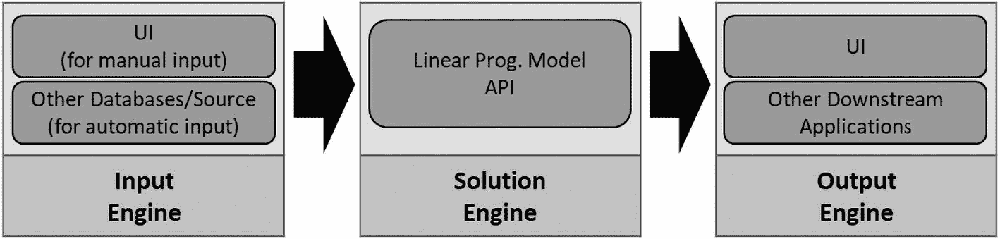
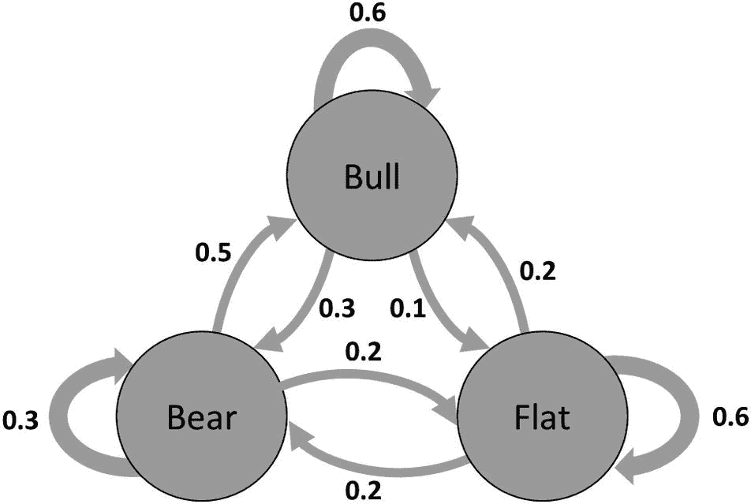

# 4. 解读不同方法论的结果

在上一章中，我们了解了不同的决策智能方法论及其优势和局限性。在本章中，我们将使用 Python 编程语言实现各种人机决策方法论。由于在一章甚至一本书中不可能涵盖所有方法论，我们将重点介绍最常用的几种：基于数学、概率和人工智能的技术。此外，我们还将探讨如何解读这些方法论产生的结果，以及如何利用它们来做出决策。

## 决策智能方法论：数学模型

数学模型长期以来被用于各种流程。如前一章所述，这类模型因其准确性、执行速度和结果的一致性而优于其他模型。在因素/变量行为一致且不确定性较低的情况下，这类模型表现非常出色。因此，我们可以在物理和工程领域找到许多数学模型的用例。让我们来看一些线性和非线性数学模型的例子。


### 线性模型

线性模型，顾名思义，是描述两个或多个变量之间线性关系的数学方程。它们由以下方程表示：

`y = β0 + β1x1 + β2x2 +….+ βnxn`

其中：

- `y` 是因变量（需要根据输入进行计算/预测的变量）。
- `x1`, `x2`, …., `xn` 是作为输入的 n 个自变量。
- `β0` 是一个常数值。当 `x1`, `x2`, …., `xn` 均为 0 时，它等于 `y`。
- `β1`, `β2`, …., `βn` 分别是自变量 `x1`, `x2`, …., `xn` 的贝塔系数。

线性模型方程通常在其自变量满足特定约束条件下运行。让我们通过一个实际案例来探索线性模型。

**问题陈述：**

一家工厂生产四种不同的产品：尿布、卫生巾、面巾纸和卫生纸。这四种产品的日产量分别为 `x[1]`、`x[2]`、`x[3]` 和 `x[4]`。

**条件：**

基于以下条件，工厂管理层希望制定一个生产计划以实现利润最大化：

- 尿布、卫生巾、面巾纸和卫生纸的单位产品利润分别为 10 美元、11 美元、8 美元和 12.5 美元。
- 由于劳动力限制，每天生产的总单位数不能超过 45。
- 生产上述产品所需的原材料是木浆和纤维。生产一个单位的尿布需要消耗 5 个单位的木浆。每个单位的卫生巾需要 7 个单位的木浆和 2 个单位的纤维。每个单位的面巾纸需要 2 个单位的木浆和 1 个单位的纤维。最后，每个单位的卫生纸需要 3 个单位的纤维。
- 由于运输和存储限制，工厂每天最多能消耗 100 个单位的木浆和 75 个单位的纤维。

**解决方案：**

由于该问题与生产优化相关，可以安全地假设环境是可控的，不确定性很小或没有。因此，我们可以使用数学模型作为解决方案。

根据给定的问题陈述和相关条件，数学模型可以定义如下：

最大化：`10x[1] + 11x[2] + 8x[3] + 12.5x[4]`（利润）

约束条件：

`x[1] + x[2] + x[3] + x[4] ≤ 45`（人力）

`5x[1] + 7x[2] + 2x[3] ≤ 100`（木浆）

`2x[2] + 1x[3] + 3x[4] ≤ 75`（纤维）

`x[1], x[2], x[3], x[4] ≥ 0`

我们将使用 Python 中一个名为 `PuLP` 的通用开源线性规划建模包。由于其卓越的特性，如用户友好性、多功能性、与其他 Python 库的兼容性、来自活跃社区的持续支持以及开源可用性，它是解决各种优化问题的非常合适的选择。

**第 1 步：导入 PuLP 库并定义数学模型对象**

```
[In]: from pulp import LpProblem, LpMaximize, LpVariable, LpStatus, lpSum
[In]: opt_model = LpProblem(name="production-planning", sense=LpMaximize)
```

这里，模型对象使用 `LpProblem` 模块定义，并将 `sense` 设置为 `LpMaximize`，因为我们希望最大化生产利润。

**第 2 步：定义决策变量**

```
[In]: x = {i: LpVariable(name=f"x{i}", lowBound=0) for i in range(1, 5)}
[In]: print(x)
[Out]: {1: x1, 2: x2, 3: x3, 4: x4}
```

**第 3 步：添加约束条件**

```
[In]: opt_model += (lpSum(x.values()) <= 45, "Manpower")
[In]: opt_model += (6 * x[1] + 4 * x[2] + 2 * x[3] <= 100, "Wood Pulp")
[In]: opt_model += (2 * x[2] + 4 * x[3] + 6 * x[4] <= 75, "Fiber")
```

**第 4 步：设置目标函数**

```
[In]: opt_model += (10 * x[1] + 11 * x[2] + 8 * x[3] + 12.5 * x[4], "Objective Function")
```

**第 5 步：使用默认求解器求解给定的优化问题**

```
[In]: status = opt_model.solve()
```

**第 6 步：获取结果**

```
[In]: print(f"status: {opt_model.status}, {LpStatus[opt_model.status]}")
[In]: print(f"objective: {opt_model.objective.value()}")
[In]: for var in x.values():
print(f"{var.name}: {var.value()}")
[In]: for name, constraint in opt_model.constraints.items():
print(f"{name}: {constraint.value()}")
[Out]:
status: 1, Optimal
objective: 512.5
x1: 20.0
x2: 0.0
x3: 0.0
x4: 25.0
Manpower: 0.0
Wood_Pulp: 0.0
Fiber: 0.0
```

从之前的输出中，我们可以看到模型建议在给定约束条件下生产 20 个单位的 `x[1]`（即尿布）和 25 个单位的 `x[4]`（即卫生纸），以获得最大利润（512.5 美元）。现在，在动态的实际工厂环境中，约束条件会发生变化，因此需要构建一个能够根据多种因素随时间变化（例如，产品利润值的变化）来更新约束条件的解决方案。因此，可以将此解决方案构建成一个 API 解决方案，该方案可以通过 UI 手动输入或通过其他系统输出来接收输入（约束条件和其他细节），并且结果可以通过同一 UI 或任何其他应用程序（Excel、自定义应用程序等）来使用。

图 4-1 展示了高级解决方案架构的外观。



线性数学模型的框图。输入引擎由 UI、其他数据库和源组成，流向由线性规划模型 API 组成的解决方案引擎，最后到达由 UI 和其他下游应用程序组成的输出引擎。

**图 4-1** 高级架构：线性数学模型


### 非线性模型

线性模型假设输入与输出之间的关系始终是线性的。然而在现实世界中，变量之间的关系往往复杂且非线性，这一假设通常不成立。因此，非线性模型应运而生。它们能够更准确地捕捉输入与输出之间的复杂行为/关系，并可用以下方程表示：

`y = f(x)`

其中：

- `y` 是因变量（需要根据输入计算/预测的变量）。
- `f(x)` 可以是任意非线性函数，例如多项式、指数函数、三角函数或其他非线性函数。

接下来，我们通过以下案例来理解如何求解非线性问题。

**问题描述：**

新冠疫情后，X 公司计划逐步让员工返回办公室工作，同时确保其两栋办公楼的最低占用率均维持在 25%，以保证运营效率。政府提供了一个风险指数，帮助公司评估在当前情况下重新开放办公室的风险。风险指数（RI）定义如下：

`RI = 3x_1² + 3x_1³ + x_1*x_2 - 2x_2² + 2x_2³`

其中：

- `x_1` = A 栋楼可用容量的比例
- `x_2` = B 栋楼可用容量的比例

根据风险指数，X 公司恢复办公室工作的最安全方式是什么？

**解决方案：**

根据风险指数的定义，并考虑到 X 公司希望将风险降至最低，我们可以将目标函数定义如下：

最小化：`RI = 3x_1² + 3x_1³ + x_1*x_2 - 2x_2² + 2x_2³`

约束条件：

- `x_1 >= 0.25`
- `x_2 >= 0.25`
- `x_1, x_2 <= 1`

针对这个非线性问题，我们将使用`scipy`包来求解。

**步骤 1：导入所需库（尤其是 scipy）**

```
[In]:
import numpy as np
import pandas as pd
import random
from scipy.optimize import minimize
```

**步骤 2：创建生成起始点的函数**

我们将使用以下函数，在该问题的可行范围内生成一组起始点元组：

```
[In]:
def geneate_kickoff_points(number_of_points):
    '''
    number_of_points [list]: 需要生成的点的数量
    '''
    kickoff_points = []
    for point in range(number_of_points):
        kickoff_points.append((random.random(), random.random()))
    return kickoff_points
```

**步骤 3：构建目标函数与约束条件**

```
objective_function = lambda x: (3*x[0]**2) + (3*x[0]**3) + (x[0]*x[1]) - (2*x[1]**2) + (2*x[1]**3)
constraints = [
    {'type': 'ineq', 'fun': lambda x: x[0] - 0.25}, # A 栋楼容量 >= 0.25
    {'type': 'ineq', 'fun': lambda x: x[1] - 0.25}  # B 栋楼容量 >= 0.25
]
boundaries = [(0,1), (0,1)]
```

**步骤 4：运行最优解函数**

```
#### 生成 N 个潜在起始点的列表
[In]: kickoff_points = geneate_kickoff_points(20)
[In]: first_iteration = True
[In]:
for point in kickoff_points:
    # 对每个点运行算法
    result = minimize(
        objective_function,
        [point[0], point[1]],
        method='SLSQP',
        bounds=boundaries,
        constraints=constraints
    )
    # 第一次迭代始终作为当前最优解
    if first_iteration:
        better_solution_found = False
        best_solution = result
    else:
        # 如果找到更优解，则采用它
        if result.success and result.fun < best_solution.fun:
            better_solution_found = True
            best_solution = result
#### 如果算法成功，打印结果
[In]:
if best_solution.success:
    print(f"""找到最优解：
    -  A 栋楼可用容量的比例: {round(best_solution.x[0], 3)}
    -  B 栋楼可用容量的比例: {round(best_solution.x[1], 3)}
    -  风险指数值: {round(best_solution.fun, 3)}""")
else:
    print("未找到问题的解")
[Out]:
找到最优解：
    -  A 栋楼可用容量的比例: 0.25
    -  B 栋楼可用容量的比例: 0.597
    -  风险指数值: 0.096
```

根据上述模拟，我们发现 X 公司可以让员工返回办公室工作，其中 A 栋楼容量为 25%，B 栋楼容量约为 60%，在给定的约束/条件下，最优风险约为 10%。

该解决方案的部署方式与线性模型相同。不过，某些细节（如基础设施）可能需要调整，因为与线性模型相比，非线性解决方案通常需要更多的计算能力来进行计算。

## 决策智能方法论：概率模型

概率模型运用概率论原理来建模问题，这与使用数学方程的数学模型不同。这使得概率模型特别适用于结果受众多不确定因素影响的情况。概率模型常用于金融、经济和医疗保健等领域，在这些领域中，决策的结果具有不确定性和不可预测性。接下来，我们将了解如何使用一种广泛使用的概率模型——马尔可夫链，来构建决策智能系统。


### 马尔可夫链

马尔可夫链模型是一种可用于研究动态系统的概率模型，其中从一个状态转移到另一个状态的可能性仅由当前状态决定，与系统的历史无关。

马尔可夫链模型的一个例子是股票市场模型，该模型具有三种状态：牛市、熊市和横盘。我们可以将其表示为三状态马尔可夫链模型，其中状态之间的转移概率仅取决于当前状态。例如，假设从牛市转移到熊市的概率为 0.3，而停留在牛市的概率为 0.6。从熊市转移到横盘的概率为 0.2，停留在熊市的概率为 0.3。从横盘转移到牛市的概率为 0.2，停留在横盘的概率为 0.6。图 4-2 展示了股票市场模型的转移矩阵。



一个马尔可夫链模型的示意图，包含三种状态：牛市、熊市和横盘。牛市到牛市的概率为 0.6，牛市到横盘的概率为 0.1，牛市到熊市的概率为 0.3，熊市到牛市的概率为 0.5，横盘到牛市的概率为 0.2，熊市到熊市的概率为 0.3，横盘到横盘的概率为 0.6，熊市到横盘的概率为 0.2，横盘到熊市的概率为 0.2。

**图 4-2** 状态转移图：马尔可夫链

该矩阵告诉我们，在给定的一天中，有 60%的概率停留在牛市，30%的概率转移到熊市，10%的概率转移到横盘。类似地，有 30%的概率停留在熊市，20%的概率转移到横盘，50%的概率转移到牛市。最后，有 20%的概率从横盘转移到牛市，20%的概率转移到熊市，60%的概率停留在横盘。

让我们了解如何将马尔可夫链模型用于为不同的营销渠道/接触点分配预算。

### 问题陈述

X 公司正在推出一款新的 Android/iOS 费用管理应用程序，并希望在其目标受众中建立知名度。该公司计划为通过网站订阅的用户提供一个月的免费试用。为了实现其营销目标，他们需要确定能够触达目标受众并通过网站注册产生高投资回报率的有效营销渠道。虽然他们拥有之前类似活动的数据，并且一直使用启发式模型（最后接触归因）进行预算分配，但他们希望利用其机器学习团队的输入来构建一个更具数据驱动性的解决方案，以分析和优化其营销渠道。

### 解决方案

基于给定的问题，机器学习团队建议使用马尔可夫链模型，因为它最适合归因问题。团队的主要目标是根据马尔可夫链模型的输出，找出每个营销渠道的最佳预算分配百分比。

团队可以访问历史用户路径数据以及每个渠道的每日营销支出。

团队提议使用`ChannelAttribution` Python 包构建模型。

##### 步骤 1：导入所需的库

```
[In]:
import numpy as np
import pandas as pd
from ChannelAttribution import *
```

##### 步骤 2：读取历史活动数据（用户路径和渠道的每日营销支出）

```
[In]:
attribution_data = pd.read_csv('attribution_data.csv')
attribution_data['time'] = pd.to_datetime(attribution_data['time'])
daily_budget = pd.read_csv('daily_budget.csv')
```

##### 步骤 3：数据预处理

我们创建用户与不同渠道交互时的路径顺序（这相当于 SQL 窗口函数）。

```
[In]:
attribution_data['path_order'] = attribution_data.sort_values(['time']).groupby(['cookie']).cumcount() + 1
```

我们将用户交互过的渠道聚合到单行中。

```
[In]:
attribution_data_paths = attribution_data.groupby('cookie')['channel'].agg(lambda x: x.tolist()).reset_index()
attribution_data_paths = attribution_data_paths.rename(columns={'channel': 'path'})
```

我们按 cookie ID 聚合转化次数及其价值。

```
[In]:
attribution_data_conversions = attribution_data.groupby('cookie', as_index=False).agg({'conversion': 'sum', 'conversion_value': 'sum'})
```

我们将路径数据与转化数据合并。

```
[In]:
attribution_data_final = pd.merge(attribution_data_paths, attribution_data_conversions, how='left', on='cookie')
[In]:
print('总转化次数: {}'.format(sum(attribution_data.conversion)))
print('总转化率: {}%'.format(round(sum(attribution_data.conversion) / len(attribution_data)*100)))
print('转化总价值: ${}'.format(round(sum(attribution_data.conversion_value))))
print('平均转化价值: ${}'.format(round(sum(attribution_data.conversion_value) / sum(attribution_data.conversion))))
[Out]:
总转化次数: 19613
总转化率: 3%
转化总价值: $122529
平均转化价值: $6
```

我们将创建一个变量`path`，其格式符合归因模型包的要求，即用户交互的有序渠道之间用`>`分隔。

```
[In]:
def listToString(df):
str1 = ""
for i in df['path']:
str1 += i + ' > '
return str1[:-3]
attribution_data_final['path'] = attribution_data_final.apply(listToString, axis=1)
```

我们移除用户的 cookie，并按路径分组，以查看特定渠道组合导致转化或空结果的次数。

```
[In]:
attribution_data_final.drop(columns = 'cookie', inplace = True)
attribution_data_final['null'] = np.where(attribution_data_final['conversion'] == 0,1,0)
attribution_data_final = attribution_data_final.groupby(['path'], as_index = False).sum()
attribution_data_final.rename(columns={"conversion": "total_conversions", "null": "total_null", "conversion_value": "total_conversion_value"}, inplace = True)
```

##### 步骤 4：构建归因模型（用于比较的启发式模型和用于计算的马尔可夫模型）并将结果保存到数据框中

```
[In]:
heuristic_models = heuristic_models(attribution_data_final,"path","total_conversions",var_value="total_conversion_value")
markov_model = markov_model(attribution_data_final, "path", "total_conversions", var_value="total_conversion_value")
[Out]:
模拟次数: 100000 - 收敛达到: 0.85% < 5.00%
在达到最大步数(456)之前成功结束的模拟路径百分比: 99.99%
[In]:
all_attribution_models_result = pd.merge(heuristic_models,markov_model,on="channel_name",how="inner")
all_attribution_models_conversion_result = all_attribution_models_result[["channel_name","first_touch_conversions","last_touch_conversions",\
"linear_touch_conversions","total_conversions"]]
all_attribution_models_conversion_result.columns = ["channel_name","first_touch","last_touch","linear_touch","markov_model"]
all_attribution_models_conversion_value_result = all_attribution_models_result[["channel_name","first_touch_value","last_touch_value",\
"linear_touch_value","total_conversion_value"]]
all_attribution_models_conversion_value_result.columns = ["channel_name","first_touch","last_touch","linear_touch","markov_model"]
all_attribution_models_conversion_value_result = pd.melt(all_attribution_models_conversion_value_result, id_vars="channel_name")
```

##### 步骤 5：计算营销渠道的最佳预算


| `channel_name` | `markov_model` | `cost` | `channel_weight` | `cost_weight` | `roas` | `optimal_budget` | `optimal_budget_percentage` |
| --- | --- | --- | --- | --- | --- | --- | --- |
| Facebook | 5289.103801 | 1481.679 | 0.26967337 | 0.305076822 | 0.883952337 | 1309.733172 | 27 |
| Instagram | 4468.380797 | 641.159 | 0.227827502 | 0.1320143 | 1.725778963 | 1106.498714 | 23 |
| 付费搜索 | 3957.708706 | 1187.142 | 0.201790073 | 0.244431809 | 0.825547518 | 980.0417185 | 20 |
| 在线展示广告 | 2395.295285 | 554.937 | 0.12212794 | 0.114261236 | 1.068848407 | 593.1435285 | 12 |
| 在线视频 | 3502.511411 | 991.823 | 0.178581115 | 0.204215833 | 0.874472427 | 867.3218664 | 18 |

```
[In]:
daily_budget_agg = daily_budget.drop(['day', 'impressions'], axis=1).groupby('channel', as_index=False).sum('cost')
daily_budget_agg.columns = ['channel_name', 'cost']
roas_data = pd.merge(all_attribution_models_conversion_result, daily_budget_agg)
roas_data['channel_weight'] = (roas_data['markov_model'])/(sum(roas_data['markov_model']))
roas_data['cost_weight'] = (roas_data['cost'])/(sum(roas_data['cost']))
roas_data['roas'] = (roas_data['channel_weight'])/(roas_data['cost_weight'])
roas_data['optimal_budget'] = (roas_data['cost'])*(roas_data['roas'])
roas_data['optimal_budget_percentage'] = (round((roas_data['optimal_budget'])/(sum(roas_data['optimal_budget'])),2))*100
roas_data.head()
[Out]:
```

根据之前的输出，团队发现 Instagram 和在线展示广告渠道虽然在推动转化方面表现出色，但预算不足。它们需要获得更高的营销预算份额，在本例中，Instagram 和在线展示广告的预算份额分别为 23% 和 12%。

## 决策智能方法论：AI/ML 模型

AI/ML 模型基于机器学习算法，这些算法能够从数据中学习并随时间推移提升性能。这类模型广泛应用于图像识别、自然语言处理、预测分析和决策制定等多个领域。

与数学和概率模型不同，AI 模型不需要明确的公式或关于变量之间关系的假设。相反，它们从大型数据集中学习模式和关系，并能识别出人类难以或无法辨别的复杂模式和趋势。

让我们通过一个人力资源分析用例来了解如何将 AI/ML 模型用于决策智能。

### 问题陈述

一家拥有九个不同业务领域的跨国公司，在选拔适合晋升至管理岗位（及以下职位）的候选人，并为他们提供及时培训方面面临挑战。最终的晋升公告仅在评估之后才会发布，这导致员工在过渡到新角色时出现延迟。因此，该公司寻求帮助，希望在特定的检查点识别出合格的候选人，以加速整个晋升流程。

该公司拥有包含人口统计、教育背景、工作经验和技能细节以及晋升详情的历史数据。

### 解决方案

由于公司可以获取历史数据，因此构建一个能够识别适合晋升员工特征的机器学习模型是合理的。由于目标是找出可以晋升的员工名单，这属于监督分类的范畴。

#### 第 1 步：导入库并读取训练和测试数据

```
[In]:
from sklearn.preprocessing import LabelEncoder, StandardScaler, RobustScaler
from sklearn.model_selection import train_test_split, StratifiedKFold
from sklearn.linear_model import LogisticRegression
from sklearn.impute import SimpleImputer
from sklearn.metrics import *
import pandas as pd
import numpy as np
[In]:
training_data = pd.read_csv('hr_train.csv')
test_data = pd.read_csv('hr_test.csv')
```

#### 第 2 步：数据预处理

由于 `employee_id` 列是一个 ID 列，它在建模过程中没有作用。因此，我们从训练和测试数据中删除 `employee_id` 列。

```
[In]:
del training_data['employee_id']
del test_data['employee_id']
categorical_columns = [c for c in training_data.columns if training_data[c].dtypes=='object']
numeric_columns = [n for n in training_data.columns if n not in categorical_columns]
true_categorical_columns = ['department', 'region', 'education', 'gender', 'recruitment_channel','awards_won?',
'previous_year_rating','length_of_service', 'no_of_trainings']
true_numeric_columns = [c for c in training_data.columns if c not in true_categorical_columns]
true_numeric_columns.remove('is_promoted')
```

有极少数员工的工作经验达到 30 年或以上（占 0.1%）。这些人可以被视为异常值，最佳实践是在将数据输入模型之前将其移除。

```
[In]:
training_data = training_data[training_data.length_of_service<30]
```

我们对 `education` 和 `previous_year_rating` 列应用插补策略。

```
[In]:
target = training_data.pop('is_promoted')
all_data = pd.concat([training_data, test_data], axis=0)
si_most_frequent = SimpleImputer(strategy= 'most_frequent')
all_data['education'] = si_most_frequent.fit_transform(all_data.education.values.reshape(-1, 1))
si_mean = SimpleImputer(strategy='mean')
all_data['previous_year_rating'] = si_mean.fit_transform(all_data.previous_year_rating.values.reshape(-1, 1))
```

我们将分类特征转换为虚拟变量。

```
[In]:
all_data_dummy = pd.get_dummies(all_data)
new_training_data = all_data_dummy.iloc[:len(training_data)]
new_test_data = all_data_dummy.iloc[len(training_data):]
```


我们应用`StandardScaler`来标准化训练数据和测试数据中的特征。

```
ss = StandardScaler()
new_training_data = ss.fit_transform(new_training_data)
new_test_data = ss.transform(new_test_data)
```

#### 步骤 3：模型训练（逻辑回归）与评估

我们对数据执行分层 K 折交叉验证，训练模型并评估其性能。由于本次活动的目的是展示如何将 AI/ML 模型的输出用于决策智能，我们将保持建模过程非常简单，不会训练多种算法来比较性能。相反，我们将训练一个逻辑回归模型，使用默认参数或进行最小限度的修改，并观察如何解释结果。

```
[In]:
scores = []
probs = np.zeros(len(new_training_data))
y_le = target.values
folds = StratifiedKFold(n_splits=5, shuffle=True, random_state=42)
for fold_, (train_ind, val_ind) in enumerate(folds.split(new_training_data, y_le)):
print('fold:', fold_)
X_tr, X_test = new_training_data[train_ind], new_training_data[val_ind]
y_tr, y_test = y_le[train_ind], y_le[val_ind]
clf = LogisticRegression(max_iter=200, random_state=2020)
clf.fit(X_tr, y_tr)
probs[val_ind]= clf.predict_proba(X_test)[:, 1]
y = clf.predict_proba(X_tr)[:,1]
print('train:',roc_auc_score(y_tr, y),'val :' , roc_auc_score(y_test, (probs[val_ind])))
print(20 * '-')
scores.append(roc_auc_score(y_test, probs[val_ind]))
print('log reg  roc_auc=  ', round(np.mean(scores)*100,2))
probs_rnd = np.where(probs > 0.5, 1, 0)
print('F1 Score= ', round(f1_score(target, probs_rnd)*100,2))
print('Recall Score= ', round(recall_score(target, probs_rnd)*100,2))
[Out]:
fold: 0
train: 0.7931202718718571 val : 0.7819824102253672

fold: 1
train: 0.7897501709069539 val : 0.79278434937156

fold: 2
train: 0.7868061847019592 val : 0.804318671120831

fold: 3
train: 0.7930340720726938 val : 0.7815370354855481

fold: 4
train: 0.7943494182608088 val : 0.7806564317616108

log reg  roc_auc=   78.83
F1 Score=  44.66
Recall Score=  29.24
```

正如我们所见，模型性能令人满意，并且通过其他技术可以进一步提升。现在，人力资源团队可以利用 ML 模型对员工做出的预测，根据他们的概率得分创建一份潜在的晋升候选人名单。

## 结论

在本章中，我们探讨了实际世界中的用例问题，以及如何通过不同的决策智能方法论来解决这些问题。我们还了解了如何解释不同模型的输出，以及如何从中构建一个决策智能工作流。我们特别关注了一些最常用的数学、概率和 AI/ML 模型，因为在一章或一本书中涵盖所有方法论是不可能的。

