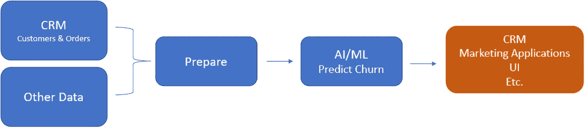
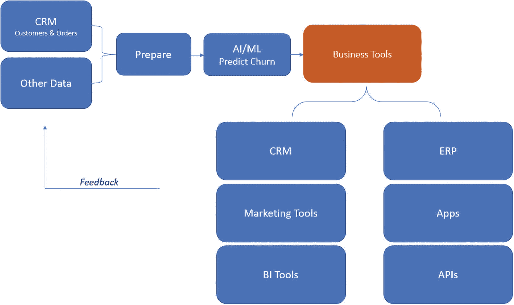
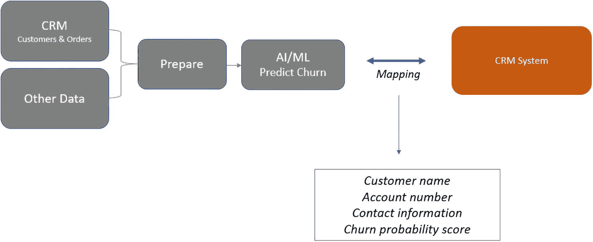

# 5. 将决策智能结果增强到业务工作流中

在当今快速变化的商业环境中，组织面临着越来越大的压力，需要做出明智的决策以推动增长和竞争力。决策智能（DI）是一个强大的工具，可以通过利用人工智能（AI）和数据分析的力量来帮助组织做出更好的决策。然而，要完全实现 DI 的益处，将 DI 模型的输出集成到现有的业务工作流中是至关重要的。

在本章中，我们将讨论如何通过开发用户友好的应用程序，将 AI 预测连接到现有业务工具，从而有效地将 DI 集成到业务工作流中；DI 专家与业务团队之间协作的重要性；以及将 DI 集成到现有业务系统中所涉及的一些技术挑战。通过成功地将 DI 集成到业务工作流中，组织可以利用 AI 的力量来推动更好的决策并改善业务成果。

## 挑战

将决策智能与业务工作流集成可能是一个复杂的过程，并伴随着若干挑战。以下是组织可能面临的一些主要挑战：

- **数据质量和可用性：** 主要挑战之一是确保 DI 流程使用的数据具有高质量且易于获取。数据质量问题，例如数据缺失或不正确，可能会影响 DI 流程所生成洞察的准确性和有用性。

- **模型选择与验证：** 另一个挑战是为特定的业务问题选择合适的机器学习模型，并验证其准确性和可靠性。这需要数据科学和特定分析领域的专业知识。

- **与现有系统的集成：** 将 AI 输出与现有系统集成可能具有挑战性。这需要深入了解组织的 IT 基础设施和安全协议，以确保应用程序能够顺利、安全地集成。

- **用户采用与培训：** 如果用户不愿意或无法采用，即使设计再好的应用程序也可能无效。确保用户采用并提供充分的培训对于应用程序的成功至关重要。

- **持续的维护与更新：** 与所有软件应用程序一样，这也需要持续的维护和更新，以确保其保持功能正常，并与最新的技术和数据保持同步。这需要资源和专业知识来确保应用程序随着时间的推移保持有效。

特别是，将决策智能与现有系统集成可能因以下几个原因而具有挑战性：

- **不同的数据格式：** 现有系统可能以不同的格式存储数据，这使得与 DI 系统集成变得困难。例如，一个系统可能使用 CSV 文件格式，而另一个系统可能使用数据库格式。在格式之间转换数据可能既耗时又容易出错。

- **遗留系统：** 一些组织可能仍在使用未设计为与现代软件应用程序集成的遗留系统。这些系统可能功能有限，并且可能不支持现代集成方法，例如 REST API。

- **安全考量：** 现有系统可能具有严格的安全协议来保护敏感数据。与这些系统集成可能需要额外的安全措施，例如身份验证和加密，以确保数据得到保护。

- **可扩展性：** 现有系统可能未设计为处理与 DI 系统集成所带来的增加的工作负载。这可能导致性能问题，并可能需要额外的硬件或基础设施来支持集成。

- **复杂性：** 现有系统可能很复杂且难以理解，特别是如果它们已经使用了多年。这使得识别 DI 系统所需的数据以及设计有效的集成策略变得具有挑战性。

总的来说，将 DI 与现有系统集成需要深入了解现有的 IT 基础设施，以及数据集成和系统架构方面的专业知识。应对这些挑战对于确保集成成功以及 DI 系统能够提供准确可靠的洞察以支持决策至关重要。

### 工作流程

让我们了解确保决策智能（DI）输出被正确纳入业务工作流程并克服先前挑战所涉及的步骤。

1. **清晰定义业务问题：** 在启动 DI 流程之前，清晰定义你试图解决的业务问题至关重要。这将帮助你识别相关数据源，并开发与业务目标一致的机器学习模型。

2. **让关键利益相关者参与：** 让关键利益相关者（包括业务用户、数据科学家和 IT 专业人员）参与 DI 流程。这将有助于确保 DI 输出与业务需求保持一致，并能集成到现有的业务工作流程中。

3. **集成：** 开发易于集成到现有业务工作流程中的用户友好型界面。这可能涉及开发可从业务应用程序内部调用的 API，或将模型集成到现有业务流程中。业务工作流程可能存在于 CRM、营销应用程序、应用等之中。

4. **确保数据质量：** 确保 DI 流程中使用的数据准确、完整且相关。这可能需要进行数据清洗、标准化和转换。

5. **监控性能：** 监控 DI 流程的性能，并评估其对业务成果的影响。这将帮助你识别需要改进的领域，并进行必要的调整。

6. **提供培训和支持：** 为业务用户提供关于如何在日常工作中使用 DI 输出的培训和支持。这将有助于确保 DI 输出被正确纳入业务工作流程，并使组织能够从 DI 流程中获得最大价值。

如图 5-1 所示，组织可以确保 DI 输出被正确纳入业务工作流程，从而带来更好的决策、改进的运营和竞争优势。

决策智能的工作流程示意图。客户、订单及其他数据流经准备阶段，然后进入 AI 或 ML 预测流失环节，最终流向 CRM 营销应用程序 UI。

## 决策智能应用

企业利用预测的方式之一是通过应用程序。因此，让我们探讨如何构建/集成带有 DI 的应用程序，以及这为何重要。

通过应用程序集成 DI 框架涉及开发能够利用 DI 流程所生成洞察的应用程序。以下是集成 DI 时需要考虑的一些步骤：

1. **定义业务问题：** 清晰定义你试图通过 DI 解决的业务问题。这将帮助你识别相关数据源，并确定要使用的适当机器学习模型。

2. **开发 DI 流程：** 开发 DI 流程以生成与业务问题相关的洞察。这可能涉及数据清洗、特征工程、模型训练和验证。

3. **开发应用程序：** 开发一个能够利用 DI 流程所生成洞察的应用程序。这可能涉及开发可从应用程序内部调用的 API，或将模型集成到应用程序的功能中。

4. **测试与验证：** 测试并验证应用程序，确保其按预期工作。这可能涉及单元测试、集成测试和用户验收测试。

5. **部署应用程序：** 将应用程序部署到生产环境，以便业务用户使用。这可能涉及与 IT 专业人员合作，确保应用程序安全、可扩展且可靠。

6. **监控性能：** 监控应用程序和 DI 流程的性能，以识别需要改进的领域，并进行必要的调整。

### 如何做及为何做？

开发一个集成 DI 的应用程序涉及创建一个利用 DI 流程所生成洞察的软件应用。以下是关于如何以及为何为 DI 开发应用程序的一些细节：

1. **识别用例：** 第一步是识别应用程序的用例。你试图通过 DI 解决什么业务问题？你需要生成哪些洞察来解决这个问题？一旦你清楚理解了用例，就可以确定应用程序所需的功能。

2. **定义用户界面：** 下一步是定义应用程序的用户界面。这涉及识别用户角色，并设计一个易于使用和理解的界面。该界面应以清晰直观的方式向用户提供 DI 流程生成的洞察。

3. **开发应用程序功能：** 定义用户界面后，下一步是开发应用程序的功能。这可能涉及开发可从应用程序内部调用的 API，以访问 DI 流程生成的洞察。也可能涉及将机器学习模型集成到应用程序的功能中，以便根据用户输入生成预测或建议。

4. **测试与验证应用程序：** 应用程序开发完成后，对其进行测试和验证以确保其按预期工作至关重要。这可能涉及单元测试、集成测试和用户验收测试。测试阶段有助于识别在应用程序部署前需要解决的任何错误或问题。

5. **部署应用程序：** 应用程序经过测试和验证后，即可部署到生产环境。这可能涉及与 IT 专业人员合作，确保应用程序安全、可扩展且可靠。

通过开发集成 DI 的应用程序，组织可以为业务用户提供便捷访问 DI 流程所生成洞察的途径。该应用程序有助于简化工作流程、改进决策并推动业务价值。然而，确保应用程序用户友好、可靠且安全至关重要，以最大限度地提高采用率，并确保组织能够从 DI 流程中获得最大价值。

#### 用户友好型界面

在将决策智能输出集成到业务工作流中时，设计用户友好型界面至关重要。由于用户是非技术人员，因此开发易于使用并能采取行动的界面非常重要。

以下是用户友好型界面至关重要的几个原因：

- **促进采用：** 用户友好型界面使业务用户更容易在日常工作中采用和使用 `DI` 输出。如果界面难以使用，可能会阻碍采用，从而削弱 `DI` 流程的有效性。

- **增强可用性：** 用户友好型界面增强了 `DI` 输出的可用性。通过使界面易于使用和理解，业务用户可以快速访问所需的洞察并做出更好的决策。

- **提高生产力：** 用户友好型界面可以通过减少访问 `DI` 输出所需的时间和精力来提高生产力。这有助于简化业务工作流、提高效率并降低成本。

- **支持协作：** 用户友好型界面可以支持业务用户和数据科学家之间的协作。通过提供访问 `DI` 输出的通用界面，业务用户和数据科学家可以更有效地合作，并更轻松地分享洞察。

- **增加参与度：** 用户友好型界面可以增加对 `DI` 输出的参与度。通过提供视觉上吸引人且直观的界面，业务用户更有可能参与 `DI` 流程所提供的洞察。

总之，在将 `DI` 输出集成到业务工作流中时，设计用户友好型界面至关重要。它可以促进采用、增强可用性、提高生产力、支持协作并增加参与度。通过优先考虑用户体验，组织可以最大化从 `DI` 流程中获得的价值，并实现更好的业务成果。

### 将 AI 预测增强到业务工作流

将 `AI` 预测连接到业务工具涉及将 `AI` 系统与现有业务系统（如企业资源规划（`ERP`）系统、客户关系管理（`CRM`）系统和商业智能（`BI`）工具）集成。以下是将 `AI` 预测连接到业务工具的技术步骤：

1. **收集和处理数据：** 收集和处理 `AI` 模型进行预测所需的数据。这些数据可以来自内部业务系统或外部来源。

2. **构建和训练 AI 模型：** 开发将根据数据生成预测的 `AI` 模型。使用历史数据训练模型以确保预测准确。

3. **部署 AI 模型：** 将训练好的 `AI` 模型部署到业务工具可以访问的环境中。这可以通过应用程序编程接口（`API`）、Web 服务或其他集成工具来完成。

4. **连接到业务工具：** 将 `AI` 模型连接到相关的业务工具，例如 `ERP` 系统、`CRM` 系统或 `BI` 工具。这可以通过 `API`、自定义集成或预构建连接器来完成。

5. **测试和验证：** 测试集成以确保 `AI` 预测正确集成到业务工具中。验证预测是否符合业务目标和目的。

6. **监控和维护：** 监控 `AI` 系统以确保其持续提供准确的预测。可能需要进行维护和更新，以应对业务环境的变化或提高预测的准确性。

如图 5-2 所示，总之，将 `AI` 预测连接到业务工具涉及数据收集和处理、构建和训练 `AI` 模型、部署模型、连接到业务工具、测试和验证集成以及持续的监控和维护。通过遵循这些技术步骤，组织可以确保 `AI` 预测有效集成到其业务流程中，并支持明智的决策。

一个将 `AI` 预测增强到业务决策智能的工作流。客户、订单及其他数据流向准备阶段，然后进入 `AI` 或 `ML` 预测流失、`CRM` 营销应用 `UI`，最后到达由 `CRM`、`ERP`、`API`、`BI`、应用程序和营销工具组成的业务工具。

**图 5-2** 使用业务工具增强预测

#### 连接到业务工具

将 `AI` 预测连接到业务工具意味着将 `AI` 模型连接到相关的业务工具，例如 `ERP` 系统、`CRM` 系统或 `BI` 工具。这一步至关重要，因为它使 `AI` 模型能够与对业务运营至关重要的其他系统共享其预测。

将 `AI` 模型连接到业务工具涉及将 `AI` 模型与业务工具的 `API` 集成。`API` 为不同系统之间的相互通信提供了标准接口，使数据能够在系统之间无缝交换。集成过程通常包括以下步骤：

1. **识别合适的 API：** 确定业务工具支持哪个 `API` 以及它使用什么数据格式。

2. **定义数据需求：** 确定业务工具利用 `AI` 模型预测所需的具体数据。

3. **映射数据：** 将 `AI` 模型产生的数据映射到业务工具所需的数据。这可能涉及数据转换或格式转换，以确保数据兼容。

4. **测试集成：** 测试集成以确保数据正确传输，并且业务工具能够有效使用 `AI` 模型的预测。

有多种方法可以将 `AI` 模型连接到业务工具，包括自定义集成、预构建连接器和第三方集成平台。方法的选择取决于组织的具体需求以及被集成的系统。

总之，将 `AI` 预测连接到业务工具涉及将 `AI` 模型与业务工具的 `API` 集成、在两个系统之间映射数据，并测试集成以确保其有效运行。通过将 `AI` 模型连接到业务工具，组织可以利用 `AI` 预测来支持明智的决策并改善业务成果。

#### 映射数据

在将人工智能预测与业务工具相连接的背景下，映射数据指的是识别 AI 模型产生的相关数据，并将其与业务工具所需的数据对齐的过程。AI 模型产生的数据格式可能与业务工具要求的格式不同，因此需要进行映射，以确保数据能在两个系统之间有效共享。

例如，如图 5-3 所示，假设某组织有一个预测客户流失的 AI 模型。该 AI 模型会生成一份高流失风险客户名单，并附上每位客户的概率评分。为了将此预测结果集成到组织的 CRM 系统中，该组织需要将 AI 模型的数据映射到 CRM 系统所需的数据。

一个预测客户流失的 AI 模型工作流程图。客户、订单及其他数据流经准备阶段，随后进入 AI 或机器学习预测流失环节，并映射到 CRM 系统，以及客户姓名、账号、联系信息和流失概率评分。

**图 5-3** 预测客户流失的 AI 模型示例

映射数据需要识别 CRM 系统中与 AI 模型生成数据相对应的特定字段。例如，CRM 系统除了需要流失概率评分外，可能还需要客户姓名、账号和联系信息。组织需要确保 AI 模型生成的数据与 CRM 系统所需的数据对齐，并可能需要进行数据转换或格式调整以保证兼容性。

一旦数据映射完成，组织便可通过 CRM 系统的 API 或其他集成方法，将 AI 模型连接到 CRM 系统，从而与 CRM 系统共享 AI 预测结果。这使得组织能够利用 AI 预测来制定客户留存策略，并采取有针对性的措施来防止客户流失。

总之，映射数据涉及将 AI 模型生成的数据与业务工具所需的数据对齐，以确保数据能够有效共享并用于支持业务运营。

## 结论

在本章中，我们讨论了如何通过开发用户友好的应用程序，将决策智能集成到业务流程中，从而将 AI 预测与现有业务工具相连接。我们强调了 DI 专家与业务团队协作的重要性，以确保 DI 模型的输出能够正确集成到业务流程中。我们还讨论了将 DI 集成到业务流程中涉及的一些技术挑战，例如连接遗留系统和确保数据安全。

为了成功地将 DI 集成到业务流程中，开发用户友好的界面至关重要，这能让非技术用户轻松与 DI 模型交互并理解其输出。开发将 AI 预测与现有业务工具相连接的自定义应用程序是实现这一目标的有效方法。为了提高用户采用率，必须让业务团队参与开发过程，并提供培训和支持，帮助用户了解如何有效使用这些应用程序。

总体而言，将 DI 集成到业务流程中需要结合技术专长、DI 专家与业务团队之间的协作，并专注于开发用户友好的界面，使非技术用户能够轻松与 DI 模型的输出进行交互。通过成功地将 DI 集成到业务流程中，组织可以利用 AI 的力量来支持明智的决策并改善业务成果。