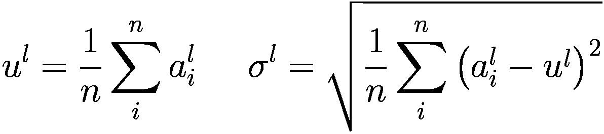
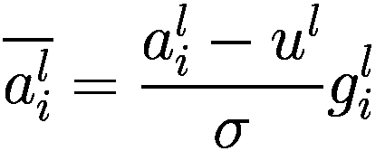
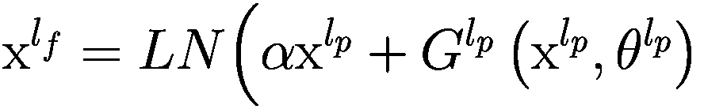
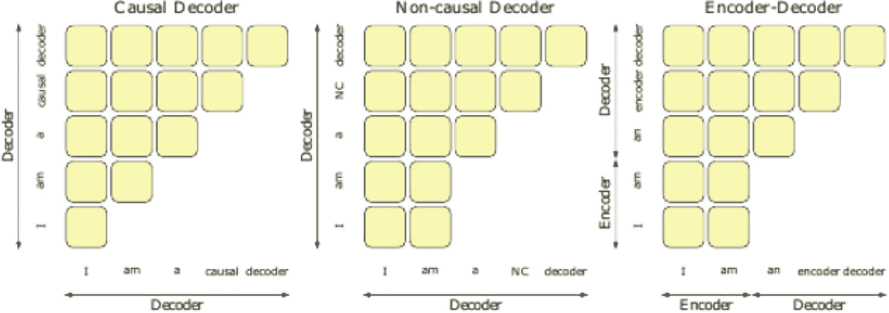
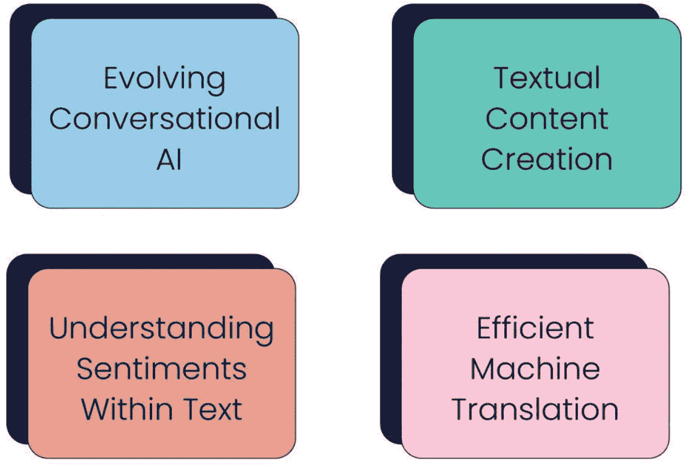

# 2. 什么是大型语言模型？

人类通过语言进行交流的非凡能力始于幼儿时期，并贯穿一生不断发展。然而，除非配备强大的 AI 算法，否则机器天生不具备理解和运用人类语言进行交流的能力。^(¹⁹) 长期以来，研究面临的挑战和追求的目标一直是让机器能够获得类似人类的阅读、写作和交流技能。

大型语言模型（LLM）的出现可归因于深度学习（DL）技术的进步、大量计算资源的可用性以及训练数据的丰富性。这些模型通常在广泛的网络语料库上进行预训练，具备掌握复杂模式、语言细微差别和语义关系的能力。针对特定任务对这些模型进行微调已取得了有希望的结果，在各种基准测试中实现了最先进的性能。

# 语言模型的发展阶段

提升机器的语言智能是通过语言建模实现的关键目标。广义上，语言建模涉及对词序列的概率进行建模，以预测未来的可能性。语言模型研究已获得广泛关注，并经历了四个显著的发展阶段。

语言模型的第一个里程碑是**统计语言模型**的出现，包括`n`元语法模型。^(²⁰) 这些模型根据前`n`个词的频率来评估序列中下一个词的概率。^(²¹) 例如，二元语法模型利用词对的频率来估计后续词的概率。

语言模型发展的第二阶段引入了**神经语言模型**，也称为神经语言建模。这种方法利用神经网络，根据序列中前面的词来预测下一个词的概率分布。循环神经网络及其变体，如长短期记忆网络和门控循环单元，在此范式中被普遍使用。^(²²)

语言模型演进的第三阶段涵盖了上下文词嵌入的出现，称为**预训练语言模型**。这些模型利用神经网络获取词的向量表示，该表示考虑了词出现的上下文。上下文词嵌入的例子包括`ELMo`^(²³)和`BERT`。

语言模型发展的第四阶段标志着大规模预训练语言模型的诞生，即**大型语言模型**。^(²⁴) 以`GPT-3`和`GPT-4`为代表的这些模型，具备在各种自然语言处理任务中表现出色的能力。它们在大量文本数据上进行训练，并可针对特定任务（如语言翻译或问答）进行微调。

总而言之，语言模型的这四个发展阶段（如图 2-1 所示）标志着该领域的重大进步，每个阶段都建立在前一阶段的基础上，并不断拓展机器在自然语言处理和计算机视觉领域所能达到的边界。


图 2-1

不同类型的语言建模（来源：[`www.researchgate.net/figure/Types-of-language-modeling_fig1_372258530`](http://www.researchgate.net/figure/Types-of-language-modeling_fig1_372258530)。许可协议：知识共享署名 4.0 国际）

大型语言模型是语言模型的高级迭代版本，通过深度学习方法在大量文本数据集上进行训练。这些模型展现出生成与人类表达极为相似的文本的能力，并在各种自然语言处理任务中表现出色。

相比之下，语言模型的定义围绕着通过分析文本语料库为词序列分配概率这一概念。语言模型的复杂度各不相同，从基本的`n`元语法模型到更复杂的神经网络模型。然而，“大型语言模型”一词通常指采用深度学习技术并拥有大量参数（从数百万到数十亿不等）的模型。这类模型擅长捕捉复杂的语言模式，生成的文本往往与人类创作的内容无异。

“大型语言模型”通常体现为一个巨大的 Transformer 模型，其规模通常太大，无法在单台计算机上运行。因此，它通过 API 或 Web 界面作为服务提供。这些模型在来自不同来源（如书籍、文章、网站和各种书面内容形式）的大量文本数据上进行训练。通过这种训练，它们分析词、短语和句子之间的统计关系，从而能够对提示或查询生成连贯且与上下文相关的响应。

例如，`ChatGPT`中的大型语言模型`GPT-3`，就是在海量互联网文本数据上训练的实例，这使其具备理解多种语言并拥有跨不同主题知识的能力。它在各种风格（包括翻译、文本摘要和问答）下生成文本的能力可能看起来非常出色。然而，这些能力是利用与提示对齐的特定“语法”来运作的，这解释了其令人印象深刻的表现。

## 大型语言模型是如何工作的？

大型语言模型通过分析大量文本数据来学习语言中的模式和关系。利用先进的神经网络架构，它们根据提供的上下文预测最可能的词序列，从而生成类似人类的文本。这个过程涉及复杂的计算层和海量数据集，以实现其令人印象深刻的能力。

像`GPT-3`这样采用 Transformer 架构的大型语言模型，通过以下简化流程运作：

- **从海量文本中学习：** 这些模型首先吸收来自互联网的大量文本，类似于从一个庞大的信息库中学习。

- **创新架构：** 采用一种称为 Transformer 的独特结构，它们能够理解和保留大量信息。

- **词汇分解：** 模型将句子分解成更小的组成部分，有效地拆分单词。这种分割提高了它们处理语言的效率。

- **理解句子结构：** 与简单的程序不同，这些模型不仅理解单个单词，还理解它们在句子中的关系，把握整个上下文。

- **专门训练：** 在初始学习阶段之后，模型可以针对特定主题进行进一步训练，提高其在回答问题或撰写特定主题文章等任务中的熟练程度。

- **任务执行：** 当收到提示时，这些模型利用其获得的知识生成响应，就像一个能够理解和生成文本的智能助手。

## 大型语言模型的总体架构

大型语言模型的基础结构主要由各种神经网络层组成，包括循环层、前馈层、嵌入层和注意力层。

这些层协同工作，处理输入文本并制定输出预测：

1.  **嵌入层** 用于将输入文本中的每个词转换为高维向量表示。这些嵌入封装了词的语义和句法信息，帮助模型把握上下文的细微差别。

2.  **大型语言模型中的前馈层** 包含多个全连接层，对输入嵌入应用非线性变换。这些层有助于模型识别输入文本中更高层次的抽象。

3.  **循环层** 旨在按顺序从输入文本中解读信息，它们维护一个在每个时间步更新的隐藏状态。这种动态特性使模型能够有效捕捉句子中词之间的依赖关系。

4.  作为大型语言模型的一个组成部分，**注意力机制** 使模型能够选择性地关注输入文本的不同部分。这种机制增强了模型关注输入文本中最相关部分的能力，从而产生更精确的预测。

# 大型语言模型的深度架构

大型语言模型（LLM）的核心是一种旨在模拟人类智能的人工智能形式。它们通过运用复杂的统计模型和深度学习技术来分析海量文本数据。这些模型学习数据中固有的复杂模式和关系，从而能够生成与特定作者或体裁的风格和特征高度相似的新内容。

该过程始于预训练，在此阶段，LLM 会接触到来自书籍、文章和网站等多种来源的海量文本语料库。通过无监督学习，模型根据前文单词的上下文来预测句子中的下一个单词，从而培养对语法、句法和语义关系的理解。

LLM 的预训练流程包括第一步：收集语料库来源，这些来源分为通用数据和专业数据。随后，数据预处理变得至关重要，以生成预训练语料库，这涉及去除嘈杂、冗余、不必要和潜在有害的内容。

第二阶段包括质量过滤，使用语言过滤、统计过滤和关键词过滤等技术来消除低质量和不需要的数据。第三阶段涉及去重，旨在解决重复数据会降低语言模型多样性、影响训练稳定性和模型性能的问题。

第四阶段侧重于隐私保护，承认使用基于网络的数据时与隐私泄露相关的担忧。实施隐私保护措施是为了从预训练语料库中移除个人身份信息（PII）。最后一步是分词，将原始文本分割成单个词元，然后输入到 LLM 中。

预训练之后，LLM 会进行微调，这涉及在特定任务或领域上进行训练。带标签的示例引导模型为目标任务生成更准确且上下文更合适的响应。微调使 LLM 能够专精于语言翻译、问答或文本生成等应用。

LLM 之所以表现出色，是因为它们能够捕捉训练数据中的统计模式和语言细微差别。通过处理大量文本，它们发展出对语言的全面理解，从而生成连贯且上下文相关的响应。

在推理阶段，当与 LLM 交互时，用户输入提示或查询，模型会根据学到的知识和上下文生成响应。此响应是使用概率方法生成的，该方法会考虑在给定输入上下文的情况下各种单词或短语的可能性，这展示了用于预训练 LLM 的数据预处理流程。

## 分词

在训练 LLM 以预测文本的过程中，一个基本的预处理步骤是分词，这是自然语言处理系统中的常见做法。分词旨在将文本分解为不可再分的单元，称为词元。这些词元可以是字符、子词、符号或单词，具体取决于模型的大小和类型。

*   **WordPiece**：最初作为一种新颖的文本分割技术被引入，用于日语和韩语，以增强语音搜索系统的语言模型。WordPiece 会选择那些能提高基于词元词汇表训练的 n-gram 语言模型可能性的词元。

*   **BPE**：源自压缩算法，`字节对编码（BPE）` 是一个迭代过程，通过用新符号替换相邻符号对来生成词元。此方法涉及合并输入文本中出现频率最高的符号对。

*   **UnigramLM**：在这种分词方法中，使用初始的子词单元词汇表训练一个基本的 unigram 语言模型（LM）。然后，通过从列表中移除可能性最低的项目（即 unigram LM 中表现不佳的元素）来迭代地精简词汇表。

## 注意力

注意力的概念，特别是选择性注意力，已在感知、心理物理学和心理学领域得到广泛研究。选择性注意力可以理解为“主体对哪些刺激将被处理或编码以及处理顺序的编程”。

虽然这一定义源于视觉感知，但它与 LLM 中最近提出的注意力机制^(²⁵)（决定处理哪些刺激）和位置编码（决定处理顺序）有着惊人的相似之处。

### LLM 中的注意力机制

注意力机制通过建立输入序列中不同位置（词元）之间的关系，在计算输入序列的表示中起着至关重要的作用。存在多种计算和实现注意力的方法，这里概述了一些众所周知的类型：

*   **自注意力**：也称为内部注意力，自注意力涉及所有源自同一模块（编码器或解码器）的查询、键和值。该层以 `O(1)` 的空间复杂度建立所有序列位置之间的连接，使其在学习输入中的长距离依赖关系方面非常有效。

*   **交叉注意力**：在编码器-解码器架构中，编码器模块的输出作为解码器中间表示的查询。这种设置提供了键和值，用于计算以编码器为条件的解码器表示，这被称为交叉注意力。

*   **全注意力**：自注意力的直接实现被称为全注意力。

*   **稀疏注意力**：自注意力的时间复杂度为 `O(n²)`，当扩展 LLM 以处理大型上下文窗口时，这变得不切实际。有人提出了自注意力的近似方法，显著提高了 GPT 系列 LLM 在合理时间内处理更多输入词元的能力。

*   **闪速注意力**：使用 GPU 计算注意力的瓶颈在于内存访问，而非计算速度。闪速注意力利用经典的输入分块方法，在 GPU 片上 SRAM 中处理输入块，而不是为每个词元从高带宽内存（HBM）执行 I/O。将此方法扩展到稀疏注意力，可以复制在全注意力实现中看到的速度提升。与使用稀疏注意力的 LLM 相比，这一创新使得 LLM 能够处理更大的上下文长度窗口。

### 位置编码

注意力模块在设计上本身并不考虑处理顺序。为了解决这个问题，Transformer 引入了“位置编码”，将输入序列中词元的位置信息纳入其中。目前已经提出了多种位置编码变体。有趣的是，最近的一项研究^(²⁶)表明，对于最先进的仅解码器 Transformer 而言，加入这些信息可能并不会产生显著影响。

- **绝对位置编码：** 最直接的方法是在将序列输入注意力模块之前，通过为序列中的每个位置分配一个唯一标识符来添加序列顺序信息。

- **相对位置编码：** 为了传递序列中不同位置词元之间的相对依赖关系信息，通过某种形式的学习来计算相对位置编码。

**两种值得注意的相对编码类型如下：**

- **Alibi：** 这种方法从使用两个词元计算出的注意力分数中减去一个标量偏置，并且该偏置随着词元位置之间的距离增加而增大。这种学习方法有效地使注意力更倾向于最近的词元。

- **RoPE：** 在大型语言模型中，键、查询和值都是向量。`RoPE` 涉及将查询和键的表示旋转一个角度，该角度与它们在输入序列中的绝对位置成比例。这种旋转产生了一个相对位置编码方案，该方案随着词元之间的距离增加而衰减。

### 激活函数

激活函数在增强神经网络的曲线拟合能力方面起着至关重要的作用。当代大型语言模型中使用的激活函数与早期的挤压函数不同，但它们是大型语言模型成功的关键组成部分。

#### ReLU

修正线性单元 (`ReLU`) 定义为 `ReLU(x) = max(0, x)` (1)。

#### GELU

高斯误差线性单元 (`GELU`) 结合了 `ReLU`、dropout 和 zoneout。它是当前大型语言模型文献中使用最广泛的激活函数。

#### GLU 变体

门控线性单元是一种神经网络层，涉及输入的线性变换与经过 sigmoid 变换 (σ) 的线性投影之间的逐元素乘积 (⊗)，其公式如下：

```
GLU(x,W,V,b,c)=(xW+b)⊗σ(xV+c) (2)
```

*这里，`x` 表示层的输入，`W`、`b`、`V` 和 `c` 是学习到的参数。*

`GLU` 被修改以评估各种变体在 Transformer 训练和测试中的影响，从而获得了改进的实验结果。以下是大型语言模型中引入^(²⁷)和使用的不同 `GLU` 变体：

- `ReGLU(x,W,V,b,c)=max(0,xW+b)`⊗

- `GEGLU(x,W,V,b,c)=GELU(xW+b)`⊗`(xV+c)`

- `SwiGLU(x,W,V,b,c,`β`)=Swish`β`(xW+b)`⊗`(xV+c)`

### 层归一化

层归一化有助于更快地收敛，并且是 Transformer 中的一个常见组件。在本节中，我们将探讨大型语言模型文献中广泛使用的各种归一化技术。

#### LayerNorm

层归一化使用以下公式计算层 (`l`) 内所有隐藏单元的统计量：



在此公式中，`n` 表示层 `l` 中的神经元数量， 是层 `l` 中第 *i* 个神经元的聚合输入。`LayerNorm` 对权重缩放和分布重新居中都具有不变性。

#### RMSNorm

`RMSNorm` 对 `LayerNorm` 假定的不变性提出了挑战。它表明，通过一种计算高效的归一化技术，可以在牺牲重新居中不变性以换取速度的情况下，获得与 `LayerNorm` 相当的性能优势。`LayerNorm` 中层 `l` 的归一化求和输入表示如下：



#### Pre-norm 和 Post-norm

在大型语言模型领域，Transformer 架构作为基础，存在一些变体。最初的实现是在残差连接之后进行层归一化，通常称为后层归一化。其顺序为：多头注意力 – 残差 – 层归一化。另一种顺序称为前层归一化，它将归一化步骤放在自注意力层之前，顺序为：层归一化 – 多头注意力 – 残差。前层归一化被认为能为训练提供更高的稳定性。

#### DeepNorm

尽管前层归一化在后层归一化训练方面具有优势，但前层归一化训练可能会无意中影响梯度，^(²⁸)导致较浅层的梯度比底层的梯度更大。`DeepNorm` 被引入作为一种缓解这些对梯度不利影响的解决方案。其公式表示为：



在此表达式中，`α` 表示一个常数，`θ_lp` 表示层 `lp` 的参数。这些参数通过另一个常数 `β` 进行缩放。这两个常数都依赖于架构。

#### 大型语言模型的分布式训练

大型语言模型的分布式训练涉及同时利用多个计算资源，以高效地处理和学习海量数据集。它可以加速训练时间，并能够处理拥有数十亿参数的模型，确保可扩展性和增强的性能。通过分配工作负载，训练那些原本在计算上不可行的复杂模型成为可能。

**大型语言模型有多种分布式训练方法：**

- **数据并行：** 这种方法将模型复制到多个设备上，并将批次数据在这些设备之间进行划分。在每个训练迭代结束时，所有设备上的权重会进行同步。

- **张量并行：** 张量并行将张量计算分布到多个设备上，也称为水平并行或层内模型并行。

- **流水线并行：** 在流水线并行中，模型层被分布到不同的设备上，也称为垂直并行。

- **模型并行：** 模型并行是张量并行和流水线并行的组合。

- **3D 并行：** 这种方法集成了数据并行、张量并行和模型并行。

- **优化器并行：** 也称为零冗余优化器，优化器并行在设备间实现优化器状态分区、梯度分区和参数分区。这可以在最小化通信成本的同时减少内存消耗。

#### 数据预处理

数据预处理是机器学习和深度学习中的关键步骤，涉及将原始数据清洗、转换并组织成可用格式。这一过程能提升数据质量、确保一致性，并为高效分析和模型训练准备好数据集，最终获得更准确可靠的结果。

在大语言模型（LLM）训练中使用的数据预处理技术包括以下内容：

- **质量过滤：** 确保训练数据的质量对于获得最佳结果至关重要。过滤数据采用两种方法：(1) 基于分类器的方法和 (2) 基于启发式规则的方法。基于分类器的方法在高品质数据上训练一个分类器，以预测文本质量并进行过滤。而基于启发式规则的方法则利用预定义的规则（包括语言、指标、统计数据和关键词）进行数据过滤。

- **数据去重：** 重复数据会对模型性能产生负面影响，并导致数据记忆化。因此，数据去重是训练大语言模型时一个关键的预处理步骤。这一过程可以在不同层级进行，例如句子、文档乃至整个数据集。

- **隐私削减：** 大语言模型的大部分训练数据来自网络，其中包含私人信息。为解决隐私问题，许多大语言模型采用基于启发式规则的方法来过滤掉姓名、地址和电话号码等敏感信息，防止模型学习到个人细节。

## 架构

本节从更高层面探讨了 Transformer 架构的不同变体，这些变体源于注意力机制的应用方式以及 Transformer 模块连接方式的变化。图 2-2 展示了这些架构的注意力模式。



图 2-2

因果解码器 vs. 非因果解码器 vs. 编码器-解码器架构（来源：[`https://arxiv.org/`](https://arxiv.org/)）

### 编码器-解码器

Transformer 最初是为序列转导模型设计的，采用了编码器-解码器架构，特别适用于机器翻译等任务。这种架构设计包含一个编码器，负责将输入序列编码为可变长度的上下文向量。这些向量随后被传递给解码器，其目标是使预测的令牌标签与实际目标令牌标签之间的差异最小化。

### 因果解码器

大语言模型的主要目标是根据输入序列预测下一个令牌。虽然编码器提供了额外的上下文，但研究发现，即使没有编码器，仅依靠解码器，大语言模型也能表现良好。与原始编码器-解码器架构中的解码器模块类似，这种解码器限制了信息的反向流动。换句话说，预测的令牌 `tk` 仅依赖于它之前的令牌，直到 `tk−1`。这种变体被广泛应用于最先进的大语言模型中。

### 前缀解码器

在编码器-解码器架构中，因果掩码注意力是合理的，因为编码器可以通过自注意力机制从任何位置关注句子中的所有令牌。然而，当移除编码器而仅保留解码器时，这种注意力的灵活性就丧失了。在仅解码器架构中，一种变体是将掩码从严格的因果掩码改为对输入序列的一部分完全可见。前缀解码器也被称为非因果解码器架构。

### 预训练目标

大语言模型的预训练目标包括以下内容：

- **完整语言建模：** 这涉及一个自回归语言建模目标，模型的任务是基于前面的令牌预测未来的令牌。

- **前缀语言建模：** 这种方法引入了一个非因果训练目标，随机选择一个前缀，并根据剩余的目标令牌计算损失。

- **掩码语言建模：** 在此训练目标中，令牌或跨度（令牌序列）被随机掩码，模型需要结合过去和未来的上下文来预测被掩码的令牌。

- **统一语言建模：** 统一语言建模结合了因果、非因果和掩码语言训练目标。在此框架下的掩码语言建模中，注意力是单向的，从左到右或从右到左流动。

## 模型适配

本节概述了大语言模型适配的基本阶段，涵盖从预训练到针对下游任务和实际应用的微调。术语“对齐微调”用于表示与人类偏好对齐，而文献中有时可能使用“对齐”一词表示不同目的。

### 预训练

在初始阶段，模型在一个大型语料库上进行自监督训练，根据输入预测下一个令牌。大语言模型的设计选择涵盖多种架构，包括编码器-解码器和仅解码器，并采用不同的构建模块和损失函数。

### 微调

微调大语言模型可以通过多种方法实现：

- **迁移学习：** 预训练的大语言模型在各种任务中展现出强大的性能。然而，为了提升特定下游任务的性能，预训练模型会使用任务特定数据进行微调，这一过程称为迁移学习。

- **指令微调：** 为了使模型能够有效响应用户查询，预训练模型会在指令格式的数据上进行微调，这些数据由指令和相应的输入-输出对组成。指令通常包含以纯自然语言形式呈现的多任务数据，指导模型对提示和输入做出适当响应。这种微调策略能提升零样本泛化能力和下游任务性能。

- **对齐微调：** 大语言模型可能会生成虚假、有偏见或有害的文本。为纠正此问题，模型会使用人类反馈进行对齐，以确保输出是有用、诚实且无害的。对齐微调涉及提示大语言模型生成意外响应，然后更新其参数以避免此类响应。^(²⁹)

### 对齐验证与利用

确保大语言模型与人类意图和价值观保持一致至关重要。如果一个模型满足有用、诚实且无害这三个标准，则认为该模型是“对齐的”。

研究人员采用基于人类反馈的强化学习（RLHF）进行模型对齐。在 RLHF 中，一个在演示数据上微调过的模型会进一步通过奖励建模和强化学习进行训练。以下简要讨论 RLHF 中的奖励建模和强化学习流程。

- **奖励建模：** 此过程训练一个模型，使用分类目标根据人类偏好对生成的响应进行排序。人类对由大语言模型生成的响应进行标注，并根据 HHH 标准提供反馈。

- **强化学习：** 结合奖励模型，强化学习在后续阶段用于对齐。先前训练好的奖励模型将大语言模型生成的响应排序为偏好或非偏好，有助于使用近端策略优化（PPO）使模型对齐。此迭代过程持续进行直至收敛。

### 提示/利用

提示是一种向训练好的大语言模型（LLM）查询以生成响应的方法。LLM 可以在多种设置下被提示，通过适应指令（无需微调或基于包含不同提示风格的数据进行微调）来工作：

- **零样本提示：**^((30)) LLM 展现出零样本学习能力，能够在提示中未提供任何示例的情况下回答查询。

- **上下文学习：**^((31)) 也称为少样本学习，这种方法涉及向模型提供多个输入-输出演示对，以生成期望的响应。

- **LLM 中的推理：**^((32)) LLM 可以作为零样本推理器，通过推理为逻辑问题、任务规划、批判性思维等提供答案。不同的提示风格被用来激发推理，并且有方法在推理数据集上训练 LLM 以提升其性能。用于推理的各种提示技术包括：

  - **思维链（CoT）：**^((33)) 一种特殊的提示情况，其中演示包含与输入和输出聚合的推理信息，引导模型通过逐步推理生成结果。

  - **自洽性：** 通过生成多个响应并选择最频繁的答案来改进 CoT 的性能。

  - **思维树（ToT）：** 探索多个推理路径，具备前瞻和回溯的可能性以解决问题。

- **单轮指令：**^((34)) 在这种设置下，LLM 仅被查询一次，所有相关信息都包含在提示中。LLM 通过理解上下文来生成响应，无论是在零样本还是少样本设置下。

- **多轮指令：**^((35)) 解决复杂任务需要与 LLM 进行多次交互，其中来自其他工具的反馈和响应作为输入提供给 LLM 以进行后续轮次。这种在循环中使用 LLM 的风格在自主智能体中很常见。

## LLM 的训练

开发大型语言模型包含几个对其成功训练至关重要的基本步骤。该过程通常从收集和预处理来自不同来源（包括书籍、文章、网站和各种文本语料库）的大量文本数据开始。精心策划的数据集构成了训练大型语言模型（LLM）的基石。训练过程本身围绕无监督学习展开，其中模型学会根据前面的上下文预测序列中的下一个单词。这个特定任务通常被称为语言建模。

LLM 采用先进的神经网络架构，例如 Transformer，使它们能够捕捉语言中复杂的模式和依赖关系。主要的训练目标是优化模型的参数，旨在最大化在给定上下文中生成正确下一个单词的可能性。这种优化通常通过一种称为随机梯度下降（SGD）或其变体的算法来实现，并结合反向传播，该算法迭代计算梯度以更新模型的参数。

## LLM 在各领域的优势与挑战

LLM 具有广泛的应用范围，本次讨论聚焦于它们在医学、教育、金融和工程领域的重要作用。选择这些领域是因为它们具有显著的影响力以及 LLM 在这些领域内的变革潜力。LLM 应对复杂挑战（如图 2-3 所示）的多功能性和能力，以及辅助人类工作的潜力，通过这些应用得到了充分展示。



图 2-3

大型语言模型的四大优势

### 通用用途

LLM 作为多功能工具脱颖而出，能够处理各种任务，甚至包括那些超出其特定训练范围的任务。它们的能力在于能够以符合上下文且类人的方式理解、生成和修改文本。这种多功能性使它们能够承担一系列功能，从简单的语言翻译和回答问题，到更复杂的活动，如文本摘要、创意写作和编程辅助。LLM 的适应性还延伸到模仿其所处理文本的风格和语气，从而产生既以用户为中心又对上下文敏感的输出。

在日常场景中，LLM 可作为虚拟个人助理使用，协助完成诸如撰写电子邮件或安排会议等任务。它们也越来越多地应用于客户服务，处理常规查询，从而使人类员工能够专注于更复杂的事务。此外，LLM 正被用于数字平台的内容创作，根据指定的提示生成类人文本。LLM 的另一个重要作用是数据分析，它们可以筛选和总结大量文本数据，比人类分析师更快地识别模式和关键点。

尽管 LLM 用途广泛，但必须认识到，与任何 AI 技术一样，它们受到训练数据质量的限制。因此，需要谨慎使用它们，因为它们可能无意中反映出训练数据中存在的偏见，导致结果可能带有偏差或不准确。

### 医疗应用

在医疗领域，像 `ChatGPT` 这样的大语言模型已在多种医疗应用中展现出卓越前景。大量研究表明，它们已被有效应用于医学教育、放射学决策、临床遗传学以及患者护理。例如，在医学教育中，`ChatGPT` 已成为一种宝贵的互动学习和问题解决工具。它在美国执业医师资格考试（`USMLE`）中的表现尤为出色，其得分达到或超过了及格标准，展现了其在无需专门训练的情况下对医学知识的深刻理解。

多项研究指向了由人工智能驱动的临床决策工具的未来发展。例如，`ChatGPT` 在放射学决策中已显示出潜力，能够优化临床工作流程并促进放射学服务的合理使用。`Kung` 等人的研究表明，像 `ChatGPT` 这样的大语言模型可以显著改善个性化、富有同情心且可扩展的医疗服务交付，同时助力教育和临床决策。

一项关于临床遗传学的研究发现，`ChatGPT` 在回答遗传学相关问题时的表现与人类回答相当，在基于记忆的查询中表现出色，但在批判性思维任务中稍逊一筹。该研究还指出，`ChatGPT` 能够为正确和错误的回答都提供多样且看似合理的解释。此外，一项评估 `ChatGPT` 在生命支持和复苏问题中准确性的研究发现，其回答基本准确，尤其是在美国心脏协会的基础生命支持和高级心血管生命支持考试的问题中。

在神经外科研究和患者护理方面，`ChatGPT` 的潜在作用已在患者数据收集、调查管理以及提供护理和治疗信息等领域得到探索。然而，此类技术的部署需要谨慎考虑，以确保其有效性和安全性。一项涵盖生命科学中多种人工智能应用（包括决策支持、`NLP`、数据挖掘和机器学习）的综合研究，强调了人工智能模型开发中可重复性的重要性，并探讨了当前的研究挑战。

像 `ChatGPT` 这样的人工智能驱动聊天机器人，有望通过促进患者与医疗服务提供者之间的更好沟通来改善患者预后。利用 `NLP`，这些聊天机器人可以为患者提供易于理解的护理和治疗信息。此外，人工智能正被用于开发针对 COVID-19 药物重用的数据库，而现有的工具如 `Ada Health`、`Babylon Health` 和 `Buoy Health` 已经促进了患者互动。大语言模型的兴起可能会进一步增强患者对这些聊天机器人的信心，并提升它们所提供的服务。例如，像 `XrayGPT` 这样的工具正在被开发用于 X 射线图像的自动分析，使患者能够就自身病情进行互动式对话。

在人工智能领域，像 `GPT-4` 这样的大语言模型彻底改变了机器理解和生成人类语言的方式。它们的能力不仅限于文本生成，还影响着技术、教育、商业、医疗和创意艺术等多个领域。

### 医疗沟通与管理

大语言模型正在彻底改变医疗沟通方式。它们协助患者互动，提供关于医疗状况和治疗的清晰解释。大语言模型还可以帮助起草患者信息手册，确保其易于理解且通俗易懂。在医院管理中，它们协助整理患者记录、安排日程和处理行政任务，从而提升整体效率。

### 增强的自然语言处理

大语言模型是高级自然语言处理（`NLP`）的支柱。它们擅长理解上下文、生成连贯的回复以及改进沟通界面。这在聊天机器人、虚拟助手和客户服务应用中尤为明显，大语言模型在这些场景中提供了更自然、更类人的交互。例如，它们可以处理复杂的客户查询、提供个性化推荐并自动化常规任务，从而显著提升效率和用户体验。

### 教育

近期的讨论凸显了人工智能（AI）在教育领域的变革性作用，尤其是在学生作业和考试方面。自 `OpenAI` 推出 `ChatGPT` 以来，学生接触教育内容、作业和课程的方式发生了显著变化。

将 `ChatGPT` 和人工智能机器人融入教育环境的一个显著好处是提高了作业完成的效率。例如，`ChatGPT` 擅长针对各种提示生成高质量的答案，从而为学生的学术工作节省大量时间和精力。此外，人工智能机器人有潜力简化评分流程，减轻教育工作者的负担，同时让他们有机会为学生提供更全面的反馈。

这些人工智能工具的另一个关键优势是能够提供量身定制的学习体验。人工智能机器人可以评估学生在过去作业和考试中的表现，并利用这些数据来定制未来的学习建议。这种方法有助于学生识别自己的学术优势和劣势，使他们能够专注于需要改进的领域。

著名的非营利教育机构 `Khan Academy` 已表示有兴趣通过其人工智能聊天机器人 `Khanmigo` 来利用 `ChatGPT`。这个虚拟导师和课堂助手旨在通过促进学生直接互动来丰富辅导和指导。此类举措反映了人们对人工智能在教育领域潜力的乐观态度，挑战了其主要用途是作弊的误解。人工智能技术虽然仍在发展，但被认为在满足多样化学生需求方面前景广阔。

然而，在教育中使用 `ChatGPT` 和人工智能机器人并非没有潜在的缺点。一个主要的担忧是学生创造力和批判性思维能力可能被削弱。在作业和考试中过度依赖人工智能可能会阻碍独立解决问题和批判性分析等基本技能的发展。

### 内容创作与增强

大语言模型最突出的用途之一在于内容创作。它们协助生成文章、报告、论文和创意写作，减少了完成这些任务所需的时间和精力。像 `GPT-4` 这样的大语言模型可以生成涵盖广泛主题的内容，并遵循指定的风格和指南。此外，它们还协助编辑和润色文本，提升质量和连贯性。

### 语言翻译与本地化

大语言模型在打破语言障碍方面取得了重大进展。它们提供实时、准确的翻译服务，实现了跨语言的无缝沟通。这一能力对于全球业务、旅行和跨文化交流至关重要。此外，大语言模型还协助本地化，确保内容在文化上恰当且能与当地受众产生共鸣。

### 研究与数据分析

研究人员利用大语言模型进行文献综述、假设生成和数据解读。这些模型能够快速处理海量信息，识别出人类研究人员可能遗漏的模式和见解。这一能力在医学等领域价值连城，大语言模型可以协助根据医学文献诊断疾病或提出治疗建议。

### 金融

大型语言模型（LLM）在金融领域的影响力日益增强，其应用范围涵盖从金融自然语言处理任务到风险分析、算法交易、市场预测和财务报告等多个方面。像 `BloombergGPT` 这样的模型——一个拥有 500 亿参数、基于庞大且多样化的金融数据集训练而成的大型语言模型——显著提升了金融自然语言处理中的新闻分类、实体识别和问答等任务。通过利用其掌握的海量金融数据，该模型能够有效解答客户疑问并提供顶级金融建议，从而显著增强客户服务能力。

大型语言模型在风险管理和评估方面也发挥着重要作用。通过分析历史市场趋势和数据，这些模型能够识别潜在风险，并通过各种金融算法提出缓解策略。金融机构正在利用这些模型在信用风险评估、贷款审批和投资规划等领域做出更明智的决策。此外，大型语言模型还被应用于算法交易，它们运用预测分析能力来发现市场中的交易机会。

然而，金融数据的敏感性及相关隐私问题要求采取数据加密、脱敏以及遵守数据保护政策等措施，以确保大型语言模型的运行符合数据隐私标准。在此背景下，近期的一项举措是 `FinGPT`，这是一个专为金融领域设计的开源大型语言模型，表明该领域正受到越来越多的关注并持续发展。

### 创意艺术

在创意艺术领域，大型语言模型是激发灵感和创造力的工具。它们协助艺术家、作家和音乐家构思创意、创作歌词、剧本，甚至完成整部作品。人工智能与人类创造力之间的这种协作过程，正在催生新的艺术形式和娱乐方式。

### 道德与负责任使用

尽管有这些优势，大型语言模型的使用也引发了关于伦理、偏见和错误信息的担忧。确保其负责任且合乎道德地使用至关重要。这包括持续监控、更新模型以减少偏见，以及制定防止滥用的指导方针。

### 法律与合规辅助

在法律领域，大型语言模型越来越多地被用于法律文件的主题审查。它们在数据集的初始编码、识别关键主题以及根据这些主题对数据进行分类方面发挥着关键作用。法律专业人士与大型语言模型之间的协同作用，在分析法律文本（例如关于盗窃案的司法意见）方面尤其有益，既提高了法律研究的效率，也提升了质量。此外，大型语言模型在提供法律术语解释方面也表现出色，其重点在于增强事实准确性和相关性。这是通过将相关判例法中的句子整合到大型语言模型中实现的，使其能够产生更准确、更高质量的解释，并减少事实错误。此外，大型语言模型已经过特定法律知识的开发和训练，使其能够有效参与法律推理任务并回答法律问题。

### 金融分析与预测

在金融领域，大型语言模型用于市场分析、预测和风险评估。它们可以分析财务报告、新闻和市场数据，为投资机会或经济趋势提供见解。这有助于投资者和公司做出明智的决策。同时，它们还有助于自动化执行报告生成和数据分析等常规金融任务。

### 灾难响应与管理

在灾难响应中，大型语言模型可以在分析来自各种来源的数据以提供受灾地区的实时信息方面发挥关键作用。它们可以协助起草紧急通信、协调响应工作以及管理后勤。这对于挽救生命和减轻灾害影响至关重要。

### 个性化营销与客户洞察

大型语言模型通过分析客户数据并生成针对性内容，提供个性化营销解决方案。它们有助于创建能与特定受众群体产生共鸣的个性化电子邮件营销活动、社交媒体内容和广告文案。此外，它们可以分析客户反馈和社交媒体讨论，以提供有关消费者行为和偏好的见解。

### 游戏与互动娱乐

在游戏行业，大型语言模型被用于创建动态、响应式的叙事和对话。它们可以生成能够适应玩家选择的情节、角色和对话，从而创造更具沉浸感的游戏体验。它们还通过为游戏世界和任务生成创意和内容来辅助游戏设计。

### 无障碍增强

大型语言模型极大地促进了技术的无障碍化。它们可以为音频和视频内容生成实时字幕和描述，帮助有听力或视力障碍的人士。它们还改进了语音识别软件，使技术对于具有不同说话模式或口音的个人更加易用。

### 环境监测与可持续性

在环境科学领域，大型语言模型协助分析来自各种来源的数据，以监测气候变化和环境退化。它们可以帮助起草环境影响报告并提出可持续实践建议。这对于环境保护的研究和政策制定至关重要。

### 大语言模型与工程应用

大语言模型因其在各类工程学科中的广泛影响而日益受到认可。例如，在软件工程领域，`ChatGPT` 已被应用于代码生成、调试、软件测试、自然语言处理、文档创建和团队协作等任务。它帮助开发者生成代码片段、识别并修正错误、制定测试场景，并简化软件文档编写与团队协作流程。`ChatGPT` 的语言理解与生成能力提升了软件工程的效率与沟通质量。

具体而言，在软件工程中，`ChatGPT` 能够根据自然语言描述生成代码，从而节省开发者的时间并提高生产力。它还能通过识别错误并提出解决方案来辅助调试，从而加快调试过程。在软件测试方面，`ChatGPT` 可以根据自然语言输入创建测试用例，提升测试流程的有效性。

在机械工程领域，Tiro 的一项研究探索了将 `ChatGPT` 用于机械计算，但发现其准确性存在局限，因此终止了这一研究方向。这表明，在目前状态下，`ChatGPT` 可能无法可靠地用于解决实际工程问题，应谨慎使用。

在数学教育领域，Wardat 等人的研究表明，`ChatGPT` 可以辅助数学教学，提供互动式且个性化的学习体验。作为虚拟导师，它能提供实时反馈和定制化的解题策略。然而，该模型在解决数学问题方面的有效性可能因问题的复杂性和输入信息的准确性而异。Frieder 等人的研究进一步探讨了 `ChatGPT` 的数学能力，将其与其他模型进行比较，并评估了其对专业数学家的实用性。

在制造业领域，Wang 等人的研究评估了 `ChatGPT` 在支持设计与制造教育方面的效用。虽然该模型在生成连贯内容和初步解决方案方面表现出潜力，但有时在理解查询和准确应用知识方面存在困难。相反，Badini 等人在增材制造故障排除方面的研究发现，`ChatGPT` 在处理熔融沉积成型中的特定技术问题时，其方法准确且条理清晰。他们建议将 `ChatGPT` 集成到增材制造软件中，以实现实时优化，从而可能提升流程效率与质量。

总体而言，尽管像 `ChatGPT` 这样的大语言模型在多个工程领域展现出巨大潜力，但其当前的局限性也凸显了将其作为传统方法与人工监督之外的辅助工具的重要性。

### 聊天机器人

聊天机器人在客户服务角色中日益普遍，擅长处理咨询、提供支持和解决问题。其应用范围还扩展到娱乐、医疗和教育领域。这些聊天机器人通常与大语言模型集成，以打造更高级、更具互动性的对话体验。例如，聊天机器人可能会使用像 `ChatGPT` 这样的大语言模型来提升其文本回复的质量。此类聊天机器人的知名例子包括 `ChatGPT`、`Google Bard` 和 `Microsoft Bing`。下文提供了一个与 `ChatGPT` 进行教育互动的示例。

在比较方面，`ChatGPT` 和 `Google Bard` 代表了当前使用的两种领先大语言模型。两者都擅长生成文本、翻译语言、创作各种形式的创意内容，并为查询提供信息丰富的回复。尽管存在相似之处，但这些模型之间也存在显著差异。例如，`ChatGPT` 以其创造力而闻名，而 `Google Bard` 则以其真实性著称。下文对 `ChatGPT`、`Google Bard` 和 `Microsoft Bing` 聊天机器人进行了详细比较，突出了各自独特的功能与能力。

### 大语言模型智能体

大语言模型智能体是使用大规模语言模型（如 OpenAI 的 `GPT-4`）构建的先进人工智能系统。可以将它们视为高度智能的虚拟助手，能够理解和生成人类语言，使其在各种任务中极具通用性。

大语言模型智能体能够理解复杂问题和指令背后的含义，因此在理解人类语言方面表现出色。它们可以像人类一样写作，起草电子邮件、创建报告，甚至撰写故事或文章。

这些智能体可以与你聊天，提供相关的回复并进行有意义的对话。非常适合用于客户服务或虚拟助手。它们可以从庞大的数据库中提取信息，甚至利用实时数据为你提供最新的答案。

大语言模型智能体还具有可扩展性。它们可以同时处理大量交互，因此非常适合客户互动量大的企业。

它们能够处理重复性任务，从而将人类工作者解放出来，专注于更复杂的工作。通过自动化日常任务，它们有助于节省运营成本，因此具有成本效益。

## 大语言模型的局限性

尽管大语言模型对自然语言处理做出了重大贡献，但它们也伴随着一系列缺陷。本节概述了各种此类局限性。这些包括用于训练的数据中的偏见、对表面模式的过度依赖、缺乏稳健的常识、推理和处理反馈方面的挑战、对大量数据和计算能力的需求，以及知识泛化方面的问题。

此外，大语言模型在可解释性、处理罕见或未知词汇、掌握句法和语法复杂性、拥有领域特定专业知识，以及易受针对性错误信息攻击等方面存在困难。伦理问题也很突出，同时还有上下文语言处理、情感与情绪分析、多语言支持以及记忆限制等方面的困难。它们的创造力有限，实时处理能力、训练和维护成本的可负担性也受到限制。可扩展性、因果理解、多模态输入处理、注意力跨度、迁移学习、超越文本的世界知识，以及对人类行为和心理学理解等方面也存在额外局限。

大语言模型在生成长篇文本、有效协作、处理模糊信息、理解文化细微差别、增量学习、处理结构化数据，以及应对嘈杂或错误输入方面也面临挑战。鉴于这些众多的局限性，研究人员和从业者必须认识并应对这些挑战，以确保负责任且有效地使用大语言模型，并努力开发能够克服这些限制的新模型。

### 偏见

语言模型中的偏见源于其训练数据反映了现存的成见。正如 Schramowski^(³⁶) 及其同事所指出的，这些模型虽然旨在模仿自然语言，却可能无意中传播偏见，导致不公平或带有倾向性的输出。这可能在政治、法律和社会等各个领域引发批评。偏见的形式包括以下几种：

- **训练数据偏见：** 这些模型基于海量人类语言数据集进行训练。如果这些数据集包含关于种族、性别或社会经济地位的偏见，模型可能会复现这些偏见。例如，带有性别偏见的数据可能导致模型在输出中偏向某一性别。

- **用户交互偏见：** 用户的输入塑造了聊天机器人的回应。如果输入始终带有偏见或成见，模型可能会学习并重复这些偏见。例如，一个频繁接触到针对特定群体的歧视性查询的模型，可能会在其回应中开始反映这些偏见。

- **算法偏见：** 用于训练和运行这些模型的算法可能会引入偏见。如果模型被训练为优化特定指标（如准确率或用户参与度），它可能会产生符合这些指标的偏见性回应。

- **上下文偏见：** 聊天机器人根据其接收到的上下文做出回应。如果该上下文包含与用户位置、语言或其他因素相关的偏见，其回应可能带有偏见。一个例子是，如果模型在特定上下文中缺乏足够信息，它可能会生成关于某种文化或宗教的偏见性回应。

理解并解决这些偏见对于确保语言模型输出的公平性和准确性至关重要。

### 幻觉

大型语言模型偶尔会生成偏离事实准确性的内容，这种现象被称为“信息幻觉”。^(³⁷) 这通常发生在模型试图填补其知识或上下文中的空白时，它会依赖学到的模式而非实际数据。此类情况可能导致虚假或误导性信息，这在关键应用中尤其令人担忧。

这些幻觉背后的根本原因仍在调查之中。当前研究表明，问题可能源于多个方面，包括训练过程、所用数据集以及模型结构。大型语言模型可能倾向于生成更具吸引力或更连贯的内容，这无意中增加了幻觉的可能性。

为遏制幻觉，人们已提出若干策略。其中一种方法涉及调整训练方案以抑制幻觉，例如“现实锚定”技术。扩大训练数据集，使其更加多样化和广泛，也能减少模型做出无根据假设的倾向。

另一个正在探索的方向是使用可验证或可进行事实核查的数据来训练模型。这种方法旨在使模型更依赖事实信息而非假设。然而，实施这一策略需要精心选择数据和指标。

未来的研究对于更深入地理解和更好地管理大型语言模型中的幻觉至关重要。这可能包括开发更先进的、能够区分事实与假设的模型，以及创新训练方法和数据集。

#### 易受各类网络攻击

该模型容易受到不同形式的对抗性攻击。这些攻击包括“提示注入”，即使用误导性提示来欺骗模型；“越狱”攻击，旨在提取敏感信息；以及“数据投毒”攻击，意图篡改模型的输出。

## 超越大型语言模型的热潮——它们为何如此受欢迎？

在过去一年中，我们观察到技术的显著进步，尤其是在大型语言模型及相关人工智能技术领域。生成式人工智能平台的广泛采用正在彻底改变个人和企业收集与处理信息的方式。这场革命正显著影响着工业市场、企业分析、医疗保健、金融服务、客户关系和教育等行业。

当前的行业分析预测，人工智能领域的价值将从 2023 年的 113 亿美元增长到 2028 年的 518 亿美元。鉴于 `ChatGPT` 已成为有史以来增长最快的互联网应用，显而易见，人工智能和大型语言模型将持续存在并快速发展。要真正理解大型语言模型在全球市场的影响力，深入了解大型语言模型领域及其在重塑各行各业中的作用至关重要。

在将大型语言模型整合到企业的运营流程之前，掌握整体市场动态以及人工智能技术对关键领域的影响至关重要。预计到 2029 年，大型语言模型市场的价值将增长四倍，这意味着创新、进步和增长的机会十分巨大。

大型语言模型为全球各行各业提供了自动化智力任务、提供全天候客户互动以及从海量数据和分析中提取关键洞察的能力。它们支持企业预测市场趋势，同时最大限度地减少所涉及的时间、资源和费用。

这些模型通过行业特定数据进行定制，使其能够在需要复杂领域知识的领域中提供精确可靠的结果。经过适当配置的大型语言模型可以处理庞大的文本数据集和复杂的结构。这种能力为组织提供了更可靠的洞察，从而释放资源以专注于其他领域并放大业务增长机会。

### 共同优势——LLM 如此受欢迎的真正原因

LLM 在各行各业提供的一个关键优势是提升客户体验。通过利用自动化聊天机器人和交互式平台，这些模型为消费者建立了更快捷、更便捷的沟通渠道，确保他们的疑问和需求得到高效满足。企业通过为客户提供持续、及时的响应和支持，从而提高了客户满意度、忠诚度和留存率。

像 `GPT-4` 这样的大型语言模型之所以流行，还有其他关键原因：

- **先进的自然语言理解与生成：** 这些模型展现出理解和生成类人文本的卓越能力。这一能力支撑了从写作辅助到对话代理的广泛应用。

- **多功能性与适应性：** 大型语言模型无需针对特定任务进行编程，即可应用于多种任务。它们可以执行翻译、摘要、问答甚至创意写作等任务。

- **易于集成：** 这些模型可以相对容易地集成到现有软件和服务中，从而立即提升用户体验和功能。

- **持续学习与改进：** 随着更多数据的可用和模型的进一步训练，它们的性能和能力会不断提升，使其随着时间的推移越来越有价值。

- **商业效率：** 它们可以自动化和增强以前需要大量人力投入的任务，例如客户服务、内容创建和数据分析，从而为企业节省成本并提高效率。

- **AI 技术的可及性：** 通过 API 和基于云的服务，这些模型对更广泛的用户和开发者来说更加易于访问，从而促进了创新和更广泛的采用。

- **公众兴趣与媒体报道：** 这些模型令人印象深刻的能力吸引了大量媒体关注，提高了公众对 AI 的认识和兴趣。

- **研发投入：** 来自私营和公共部门对 AI 研发的大量投资推动了该领域的快速进步。

- **个性化与用户参与：** LLM 提供个性化响应，适应个体用户的风格和偏好。这增强了用户参与度，使交互更加贴切和有效。

- **多语言支持：** 许多 LLM 在包含多种语言的数据集上进行训练，使其成为全球通信和翻译服务的多功能工具。

- **增强创造力与创意生成：** LLM 可以协助创意过程，如头脑风暴、写作和设计，提供新颖的想法和视角，激发人类的创造力。

- **知识与专业知识的民主化：** 通过提供跨领域的信息和专家级指导，LLM 使知识民主化，让更广泛的受众更容易获得专家建议。

- **教育应用：** LLM 越来越多地应用于教育环境，用于辅导、语言学习以及帮助有学习障碍的学生，从而提升教育体验。

- **对话式 AI 的进步：** LLM 对话能力的提升带来了更自然、更有效的语音助手和聊天机器人，彻底改变了客户服务和个人助理领域。

- **数据分析与洞察：** LLM 可以处理和分析大量文本数据，提供有价值的见解，并辅助商业和研究领域的决策过程。

- **为残障人士提供便利：** LLM 提供了改善无障碍环境的工具，例如为长文本生成摘要或提供语音转文本服务，从而帮助各种残障人士。

- **可扩展性：** LLM 可以处理大量同时进行的交互或请求，使其成为各种规模企业和组织的可扩展解决方案。

- **持续演进与学习：** LLM 领域正在快速发展，频繁的更新和改进不断扩展其能力和应用范围。

- **协作与社区建设：** LLM 通过跨越语言障碍连接人们，并提供共享学习和互动的平台，从而促进协作和社区建设。

- **对艺术与创造力的影响：** 除了文本，一些 LLM 正在涉足艺术领域，协助音乐创作、视觉艺术和创意写作，从而影响艺术格局。

- **减少人为错误：** 通过自动化日常任务和提供准确的信息检索，LLM 有助于减少各个领域的人为错误。

- **高性价比的解决方案：** 对许多企业和用户而言，LLM 通过自动化原本需要大量人力和资源的任务，提供了高性价比的解决方案。

- **增强的研究能力：** 在学术和科学研究中，LLM 有助于文献综述、假设生成甚至研究论文的撰写，显著增强了研究能力。

- **环境监测与可持续性：** 一些 LLM 被用于环境监测，分析大型数据集以支持可持续发展努力和气候变化研究。

- **娱乐与游戏：** 在娱乐领域，LLM 为游戏开发、故事讲述和互动媒体做出贡献，提升了用户体验。

- **公共政策与治理：** LLM 有助于分析公众舆论、起草政策文件和管理大规模公共沟通，辅助治理和政策制定。

- **伦理与哲学探索：** LLM 的兴起引发了关于 AI 伦理、未来工作以及先进 AI 哲学意义的重要讨论。

- **全球沟通与协作：** LLM 促进全球沟通与协作，打破语言障碍，连接世界各地的人们。

AI 和大型语言模型（LLM）彻底改变了个人和组织与数字技术互动的方式。这些进步推动了各行各业的创新和流程自动化，节省了时间，同时改变了专业人士的决策过程和客户沟通策略。它们重塑了特定的行业领域，推动了工业进步和创新潜力。随着研发的持续推进，AI 驱动的模型正朝着模仿人类语言和交互特征的方向发展。

### 面向企业的大型语言模型

#### 数字内容创作

语言模型擅长创作各种高质量的数字内容，从博客文章和论文到产品描述和社交媒体内容，从而为企业节省资源和时间。它们也经常被用于编辑和校对文本。作为数字写作助手，这些模型在语法、拼写、风格改进和替代措辞方面提供即时建议。

此外，这些模型通过评估现有材料、当前趋势和受众偏好，协助生成创意内容想法和结构。这一特性使内容创作者能够构思出新颖且相关的概念，以吸引其目标受众。

此外，大型语言模型能够迅速将长篇文本压缩成简短精炼的摘要，这在专业环境中为生成冗长文档的摘要版本或执行摘要极为有用。

### 提升搜索引擎优化（SEO）

语言模型在优化搜索引擎策略方面发挥着重要作用，具体体现在以下几个方面：

-   推荐合适的主关键词和长尾关键词，以提高内容在搜索引擎中的可见度。

-   识别常用的搜索查询，帮助企业调整内容以更好地匹配用户意图。

-   针对语音搜索查询定制内容，顺应语音搜索日益增长的趋势。

-   优化元描述和标签，这对于在搜索结果中吸引点击至关重要。

-   结构化内容，以提高其可发现性和搜索引擎排名。

-   建议相关术语和当前热门话题，帮助企业创建能吸引并引起当代受众共鸣的内容。

-   确保网站结构便于搜索引擎爬虫轻松索引和抓取，从而提高在搜索结果中的可见度。

-   执行 SEO 审计，评估网站的各种组件，如加载速度、移动端兼容性和 URL 结构，识别潜在的改进点。

-   将大语言模型提供的见解融入 SEO 策略，可以提升用户参与度，延长用户在网站或应用上的停留时间，并全面改善在线搜索能力和可见度。

### 内容审核

在自动化内容监管领域，大型语言模型（LLM）不可或缺，它们能够熟练地识别并筛选各种数字平台上的用户生成内容。其能力包括识别攻击性语言、仇恨言论、威胁、虚假信息、垃圾邮件以及其他形式的有害或不恰当内容，从而营造一个更安全的数字环境。这些模型可以将此类内容标记出来以供进一步审查，或者根据既定的审核政策自动将其删除。

必须承认，尽管 LLM 在内容监管方面提供了巨大帮助，但人工监督的必要性依然存在，尤其是在处理复杂或微妙的案例时。

### 情感/情绪分析

LLM 擅长通过社交媒体帖子、评论和反馈来评估客户情绪。这一过程使企业能够了解客户的观点和满意度，是监控社交媒体和管理品牌形象的宝贵资产。

这些模型将情绪基调分为积极、消极或中性等不同类别，并通过识别不同的强度和微妙的表达差异来提供详细的情感分析，从而更深入地理解文本中所传达的情感。

此外，它们对语境的理解能力也在不断发展，能够识别讽刺、反语和其他复杂的语言形式。尽管已取得显著进展，但该领域仍在发展中，预计未来将持续改进。

### 客户服务

LLM 通过改进和自动化客户互动的不同方面，为客服领域做出了显著贡献。

具体包括以下内容：

-   **聊天机器人**：持续处理查询、提供信息、指导故障排除并管理标准的客户服务任务。

-   **语音助手**：通过语音命令实现自然交互，执行任务、检索信息并提供个性化帮助。

-   **虚拟销售助理**：与客户互动，回答关于产品的问题，提供建议，并引导他们完成购买流程。

### 语言翻译

LLM 已经改变了语言翻译领域，提供了高效且准确的翻译能力。其关键特性是能够实时翻译口语或书面材料，这在实时对话、国际活动或即时客户支持中极具价值。

此外，LLM 可以专注于特定领域或行业，以提高翻译精度，包括行业特定术语。利用 LLM，企业可以与国际客户有效沟通，弥合语言鸿沟，并开拓新市场。

### 虚拟团队协作

在工作场所整合 LLM 能显著提高员工生产力和协作能力。它们在虚拟团队协作和简化日常运营中至关重要，能够：

-   生成会议摘要和记录。

-   为多语言团队提供实时翻译。

-   协助有视觉或听觉障碍等残疾的团队成员。

-   记录组织和项目流程。

-   整理公司文档。

-   促进知识交流。

### 招聘与人力资源支持

LLM 正在改变招聘和人力资源支持，优化招聘的各个方面并协助人力资源专业人员。其影响领域包括：

-   **简历分析：** LLM 会仔细审查简历，提取技能、经验和资质等相关数据，帮助人力资源部门高效地筛选候选人。

-   **候选人搜寻：** 它们协助从招聘网站和社交网络等各种平台寻找潜在候选人。

-   **资料匹配：** LLM 将职位要求与候选人资料进行匹配，精准定位最符合条件的人选。

-   **在线面试：** 它们通过建议问题、评估回答和总结讨论来支持虚拟面试。

-   **新员工入职：** LLM 通过提供信息、培训资源和公司政策指导来引导新员工。

### 销售提升

LLM 通过在整个销售周期提供见解和支持，极大地帮助了销售团队，包括：

-   **潜在客户发现：** 分析大量数据以识别潜在客户，了解客户偏好以进行有针对性的互动。

-   **AI 聊天机器人：** 与网站访客互动，收集信息，向销售团队提供见解，并生成潜在客户。

-   **定制化外联：** 协助制作个性化的销售信息和推荐，以提高转化率。

-   **分析客户反馈：** AI 工具评估客户反馈，以实现更量身定制的销售方法和更牢固的关系。

### 欺诈识别

LLM 在文本分析、模式识别和异常检测方面表现出色，使其在风险评估和欺诈预防方面非常有效。它们能够实时监控金融交易和客户互动等数据流，快速识别异常或可疑模式，并立即触发警报以供调查。

此外，它们基于广泛的数据为各种交易或活动分配风险评分，有助于评估欺诈可能性。

人工智能的未来范围和能力仍不确定，但其创新和进步的潜力似乎是无限的。人工智能在商业和工业领域的迅速扩张表明，我们才刚刚开始发掘其全部潜力。

随着人工智能功能的发展变得更快、更高效，医疗保健、教育和金融服务等行业将更加繁荣，为全球的患者、学生和客户提供可靠且值得信赖的护理和服务。LLM 在数据分析和分析方面提供关键支持，随着专业人员重新调整其关注点和精力，这将带来成本降低。这个时代以激动人心的技术进步为标志，用户和开发者都在探索商业和技术的未来方向。

# 摘要

本章深入探讨了大语言模型（`LLMs`）的概念，梳理了其发展历程、能力范围及底层技术。同时，本章还描述了`LLMs`的架构，该架构包含多种神经网络层，例如循环层、前馈层、嵌入层和注意力层。这些层协同工作，处理输入文本并生成输出预测。

`LLMs`的发展归功于深度学习的进步、强大的计算资源以及丰富的训练数据。这些模型通常在海量网络语料库上进行预训练，能够掌握复杂的模式、语言细微差别和语义关系。针对特定任务对这些模型进行微调，使其在各种基准测试中均取得了最先进的性能。

在下一章中，我们将深入探讨：

- 什么是`Python`及其语法设计原则

- 如何在 Windows、Mac 和 Linux 上安装`Python`

- `Python`变量与数据类型

- `Python`布尔值与运算符

- 条件语句与循环

- `Python`数据结构

- `Python`函数

- 使用`Python`进行面向对象编程

- 模块与文件处理

- `Python 3.11`的强大特性

脚注 1 2 3 4 5 6 7 8 9 10 11 12 13 14 15 16 17 18 19