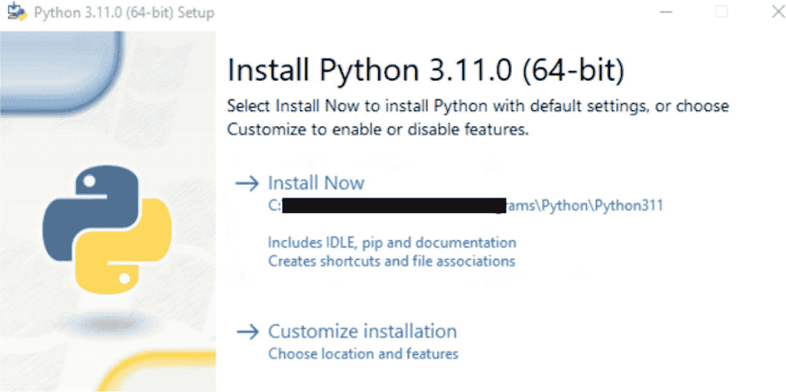
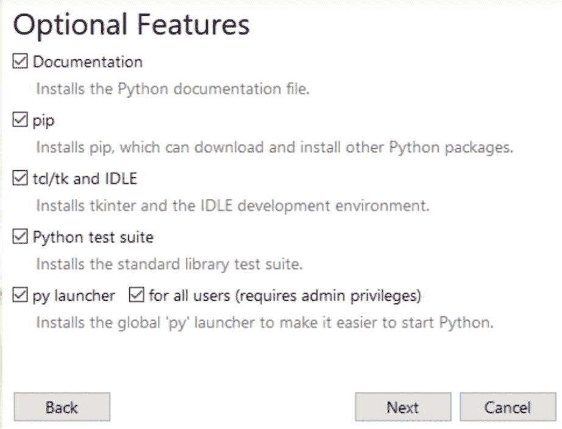
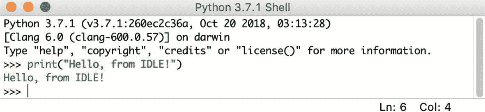
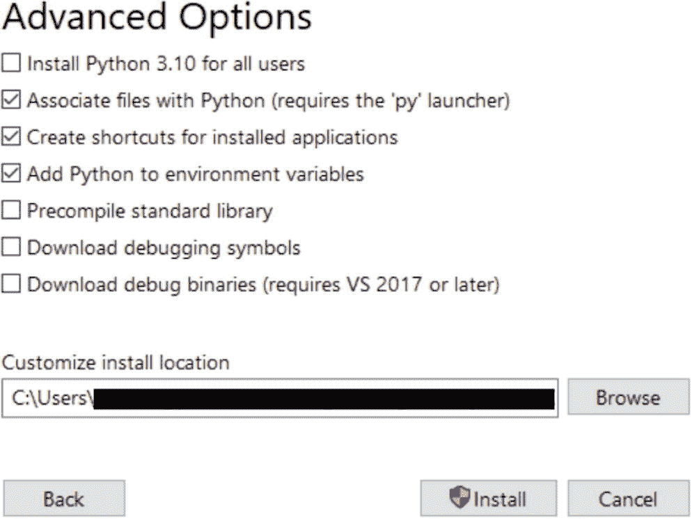

# 3. Python 与 LLMs

`Python`是一种用户友好且功能强大的编程语言，以其高级、高效的数据结构和简洁的面向对象编程方法而闻名。其精炼的语法、动态类型以及可解释的特性，使得`Python`成为跨多个平台、在众多领域进行脚本编写和快速应用开发的理想选择。

在本章中，我们将回顾`Python`对于大语言模型（`LLMs`）的重要性。本章还将深入探讨`Python`的语法和语义，指出其与`Perl`、`C`和`Java`等语言的相似之处，同时强调其独特特性。但首先，让我们从一个快速入门开始。

## Python 概览

在使用计算机的过程中，我们常常会意识到自动化某些任务是非常有益的。例如，你可能希望自动化编辑多个文本文件的过程；其他任务可能包括创建一个基本数据库、一个独特的 GUI 应用程序、构建一个简单的游戏，或者在日常工作中处理数据科学、机器学习和人工智能。

专业软件开发人员经常需要与各种`C`/`C++`/`Java`库进行交互，但标准的编写、编译、测试和重新编译周期可能效率低下。为这些库编写测试套件，以及为程序添加扩展语言，是其他一些期望实现自动化和简洁性的常见任务。在这些场景下，`Python`成为了理想的解决方案。

另一方面，`Python`不仅更易于使用，而且可在包括 Windows、Mac OS X 和 Unix 在内的多种操作系统上使用。其简洁性并未削弱其作为真正编程语言的能力，与 shell 脚本或批处理文件相比，它为大型程序提供了更多的结构和支持。

`Python`的模块化特性允许代码在其他程序中重用，从而提高了效率。它附带大量标准模块，这些模块可以作为你程序的基础，或者作为学习`Python`编程的示例。这些模块涵盖了广泛的功能，包括文件 I/O、系统调用、套接字以及与`Tk`等 GUI 工具包的接口。

作为一种解释型语言，`Python`缩短了开发时间，因为它不需要编译和链接。其交互特性便于轻松试验语言特性、编写临时程序，或以自底向上的方式测试函数以进行程序开发。`Python`还可以作为一个方便的桌面计算器。

`Python`能够编写紧凑且可读性强的程序，这是其关键优势之一。用`Python`编写的程序通常比用`C`、`C++`或`Java`编写的等效程序更短。这种简洁性源于几个因素：高级数据类型允许在单个语句中执行复杂操作；使用缩进而非括号来分组语句；以及无需声明变量或参数。

### Python 语法与语义

管理`Python`程序编写和解释（无论是计算机还是人类读者）的规则和约定，构成了`Python`编程语言的语法。`Python`与`Perl`、`C`和`Java`等语言共享一些特性，但也表现出明显的差异。它支持多种编程方法，如结构化编程、面向对象编程和函数式编程，非常灵活。此外，`Python`以其动态类型和自动内存管理而闻名。

`Python`以其简单统一的语法而著称，其指导哲学是：完成一项任务应该有一种——且最好只有一种——显而易见的方法。该语言集成了原生数据类型、控制结构、一等函数和模块，增强了代码重用和组织性。与许多严重依赖标点符号的语言不同，`Python`选择使用英文关键字，这有助于其代码外观清晰易懂。

`Python`在错误管理方面表现出色，拥有全面的异常处理机制，并在其标准库中包含调试器，从而简化了调试过程。`Python`语法的设计强调清晰性和用户友好性，使其成为新手和经验丰富的程序员的共同首选。

有趣的是，`Python`的名字来源于 BBC 的节目“蒙提·派森的飞行马戏团”，与蛇毫无关联。事实上，在文档中引用蒙提·派森短剧的内容不仅是允许的，而且是积极鼓励的。

### 语法设计原则

`Python`被认为是一种可读性极高的编程语言。`Python`语法设计的简洁性和一致性是其核心，其指导原则是“*应该有一种——并且最好只有一种——显而易见的方法来完成它*”，这一原则源自 Python 之禅。^(³⁸)

### Python 之禅

- *优美胜于丑陋。*

- *显式胜于隐式。*

- *简单胜于复杂。*

- *复杂胜于凌乱。*

- *扁平胜于嵌套。*

- *稀疏胜于密集。*

- *可读性至关重要。*

- *特殊情况也不足以特殊到打破规则。*

- *尽管实用性胜过纯粹性。*

- *错误不应被无声地忽略。*

- *除非明确需要沉默。*

- *面对歧义，拒绝猜测的诱惑。*

- *应该有一种——最好只有一种——显而易见的方法来做这件事。*

- *尽管这种方法一开始可能并不明显，除非你是荷兰人。*

- *现在做总比永远不做好。*

- *虽然“永远不做”通常比“立刻做”要好。*

- *如果实现难以解释，那它就是个坏主意。*

- *如果实现易于解释，那它可能是个好主意。*

- *命名空间是一个绝妙的主意——让我们更多地使用它们吧！*

### Python 标识符

在 Python 中，标识符指的是赋予变量、函数、类、模块或其他对象等实体的名称。它以字母（A-Z 或 a-z）或下划线（`_`）开头，后跟字母、下划线和数字（0-9）的任意组合。Python 标识符不能包含特殊字符，例如 `@`、`$` 或 `%`。

Python 是**区分大小写**的，这意味着像 `"Hello"` 和 `"hello"` 这样的标识符被视为不同的。

**Python 遵循特定的标识符命名约定：**

- Python 中的类名以大写字母开头，而所有其他标识符以小写字母开头。

- 以单下划线开头的标识符被视为私有。

- 以双下划线开头的标识符被视为强私有。

- 以双下划线开头和结尾的标识符保留给语言定义的特殊名称。

**表 3-1** 列出了 35 个不能用作标识符的关键字或保留字。

**表 3-1** Python 保留字

| `and` | `as` | `assert` | `async` | `await` | `break` | `class` |
|-------|------|----------|---------|---------|---------|---------|
| `continue` | `def` | `del` | `elif` | `else` | `except` | `False` |
| `finally` | `for` | `from` | `global` | `if` | `import` | `in` |
| `is` | `lambda` | `None` | `nonlocal` | `not` | `or` | `pass` |
| `raise` | `return` | `True` | `try` | `while` | `with` | `yield` |

### Python 缩进

Python 使用空白字符来定义控制流块，遵循 off-side 规则。这种使用缩进而非标点或关键字来表示代码块范围的特征，继承自其前身语言 ABC。

在计算机编程中，如果一种语言的代码块结构由缩进决定，则称其遵循 off-side 规则语法。这个术语由**彼得·兰丁**引入，被认为是对足球中越位规则（offside rule）的文字游戏。这个概念不同于自由格式语言，尤其是那些使用花括号的语言，在这些语言中缩进没有计算意义，纯粹是编码风格和格式的问题。应用**off-side 规则**的语言通常以其有意义的缩进为特征。

相比之下，在从 ALGOL 块结构演变而来的“自由格式”语言中，代码块使用花括号（`{ }`）或特定关键字来界定。通常，在这些语言中，程序员会按照惯例缩进块的内容，以便在视觉上将其与相邻代码区分开来。

**示例：**

```
def greetings():
    print("hello world")
    for i in range(10)
        print(i)
```

**在 Python 中，代码缩进遵循特定规则至关重要：**

- 避免使用反斜杠（`\`）字符将缩进分割到多行。

- 不得缩进 Python 代码的第一行；否则会导致`Indentation Error`。

- 在缩进时选择制表符还是空格，一致性是关键。在整个代码中坚持使用你偏好的缩进方式。混用制表符和空格可能导致缩进错误。

- 通常建议对第一级缩进使用一个制表符或四个空格，对于更深层次的缩进，则再增加四个空格（或再增加一个制表符）。

### Python 多行语句

在 Python 中，语句通常以换行符结束。然而，Python 提供了使用行连接符（`\`）的灵活性，以指示一行应该继续。

**示例：**

```
total = one + \
        two + \
        three
```

包含在方括号 `[]`、花括号 `{}` 或圆括号 `()` 内的语句不需要行连接符。例如，以下语句在 Python 中是有效的：

**示例：**

```
days = ['Monday', 'Tuesday', 'Wednesday',
        'Thursday', 'Friday']
```

### Python 中的引号

在 Python 中，字符串字面量可以使用单引号（`'`）、双引号（`"`）或三引号（`'''` 或 `"""`）来表示，前提是使用相同类型的引号来开始和结束字符串。

另一方面，三引号用于包含跨越多行的字符串。例如，以下示例在 Python 中都是有效的：

**示例：**

```
name = 'Alice'
print(f"My name is {name}.")
quote = "To be or not to be, that is the question."
print(f"Shakespeare once said, '{quote}'")
story = """Once upon a time,
there was a brave knight
who embarked on a grand adventure."""
print(story)
```

**输出：**

```
My name is Alice.
Shakespeare once said, 'To be or not to be, that is the question.'
Once upon a time,
there was a brave knight
who embarked on a grand adventure.
```

### Python 注释

在 Python 中，注释是源代码中供程序员阅读的解释或注解。它们被包含进来是为了增强代码对人类读者的可理解性，并且会被 Python 解释器忽略。

与许多现代编程语言一样，Python 支持单行（行尾）注释和多行（块）注释。Python 注释的结构与 PHP、BASH 和 Perl 等语言中的注释非常相似。

要在 Python 中创建注释，请使用井号（`#`）。任何不在字符串字面量中的井号都标志着注释的开始。`#` 符号之后直到该物理行末尾的所有内容都被视为注释的一部分，Python 解释器会忽略它。

```
# 第一个注释
print ("Hello, World!") # 第二个注释
```

**你可以在语句或表达式之后在同一行输入注释：**

```
Name = "John" # 同一行上的注释
```

**你可以像下面这样注释多行：**

```
# 注释 1

# 注释 2

# 注释 3
```

**Python 解释器也会忽略紧随其后的三引号字符串，使其可以作为多行注释：**

```
'''
这是我的第一个多行
注释。
'''
```

#### 在 Python 代码中使用空行

Python 代码中的空行是指仅包含空白字符或可能包含注释的行，Python 会完全忽略它。在交互式解释器会话中工作时，你必须输入一个空的物理行来结束一个多行语句。

#### 在一行中组合多个语句

你可以使用分号（`;`）在一行中包含多个语句，前提是这些语句中没有一个会启动一个新的代码块。以下是一个演示分号用法的示例片段：

**示例：**

```
x = 5; y = 10; z = x + y; print(z)
```

### 如何安装 Python 及编写你的第一个 Python 程序

安装 Python 的方式可能因你使用的操作系统而异。因此，本文提供了以下操作系统的安装说明：

- Windows

- macOS

- Linux

**注意：** 不同操作系统上的 Python 安装  

*请注意，安装步骤可能因你的具体操作系统及其版本而异。要在你的特定平台上安装 Python，请按照此处为你相应操作系统提供的说明进行操作。*

#### 在 Windows 上安装 Python

本节提供了在 Windows 操作系统上安装 Python 的分步指南。请按照以下说明在你的 Windows 电脑上成功设置 Python。

**步骤 1：下载 Python 安装程序**

首先，访问 Python 官方网站，获取适用于 Windows 的最新 Python 3.x 版本。该网站会自动检测你的操作系统，并提供适合你系统的安装程序（32 位或 64 位）。

**步骤 2：启动安装程序**

找到下载的安装程序文件（通常位于“下载”文件夹中），然后双击它以启动安装过程。你可能会遇到用户账户控制 (UAC) 提示，要求你授予权限。点击“是”继续。

**步骤 3：自定义安装（可选）**

进入安装程序的欢迎界面后，你会看到两个选项：“立即安装”和“自定义安装”（图 3-1）。

> *如果你希望使用默认设置进行标准安装，只需点击“立即安装”。*



图 3-1：Python 安装过程的步骤 1

如需自定义安装，你可以修改安装目录或选择特定组件等参数，请点击“自定义安装”（图 3-2）。



图 3-2：安装过程中的可选功能

**此选择提供以下选项：**

- **文档：** 此选项随安装包一起包含 Python 的文档文件。

- **pip：** 此选项安装 `pip`，使你能够根据需要安装其他 Python 包。

- **Tkinter 和 IDLE** (tcl/tk 和 IDLE)：此选项安装 `tkinter` 和 IDLE。

- **Python 测试套件：** 选择此选项将安装标准库测试套件，有助于测试你的代码。

- **py launcher (for all users)：** 这些选项允许你从命令行启动 Python。

**完成选择后，点击“下一步”。将出现一个包含高级选项的新对话框，提供更多选择，如图 3-3 所示。**



图 3-4：Python Shell 中的第一个 Python 程序



图 3-3：安装过程中的高级选项

- 为所有用户安装 Python 3.11。

- 将文件与 Python 关联（需要 `py` 启动器）。

- 为已安装的应用程序创建快捷方式。

- 将 Python 添加到环境变量。

- 预编译标准库。

- 下载调试符号。

- 下载调试二进制文件（需要 VS 2017 或更高版本）。

确保选择的安装目录正确，然后进入下一步。

**步骤 4：开始安装 Python**

配置好你偏好的安装设置后，点击“安装”以启动安装过程。安装程序会将必要的文件复制到你的电脑并配置 Python。此过程可能需要几分钟。

**步骤 5：确认安装**

安装完成后，通过打开命令提示符（在“开始”菜单中搜索 `cmd`）并输入以下命令，确认 Python 已成功安装：

```
python --version
```

#### 在 macOS 上安装 Python

**步骤 1：验证 macOS 上现有的 Python 版本**

在 macOS 上开始安装 Python 之前，明智的做法是确认系统上当前的 Python 版本。macOS 通常默认包含一个较旧的 Python 版本（Python 2.x）。要确定你系统的 Python 版本，请打开“终端”应用程序（通过 Spotlight 搜索或在“应用程序”➤“实用工具”下找到它）。然后，输入以下命令：

```
python --version
```

按下“回车”键，版本号将显示在输出中，如下所示：

```
Python 2.7.x
```

如果你的系统上已安装了 Python 3.x，你可以通过执行以下命令来确定其版本：

```
python3 --version
```

**步骤 2：访问 Python 网站并下载 macOS 安装程序**

导航到下载页面，你会找到与最新 Python 版本对应的 macOS 安装程序包（`.pkg` 文件）。继续将安装程序下载到你的电脑。

找到你下载的安装程序文件（通常位于“下载”文件夹中），然后双击它以启动安装过程。随后，按照屏幕上的提示进行操作。

**步骤 3：验证 Python 和 IDLE 是否正确安装**

安装过程完成后，你的桌面上会打开一个文件夹。在此文件夹内，点击“IDLE”应用程序。IDLE 是 Python 自带的独立开发环境。启动 IDLE 后，Python shell 应会自动打开。

**要验证其是否正常运行，你可以通过输入如下所示的打印命令进行测试：**

```
print("Test message")
```

按下“回车”键，你应该会看到文本“Test message”出现在 IDLE 环境中的下一行。你也可以通过“终端”应用程序确认安装。打开“终端”并输入以下命令：

```
python3 --version
```

按下“回车”键，你应该会在输出中看到你最近安装的 Python 版本。这确认了 Python 已成功安装到你的 Mac 上。

#### 在 Linux 上安装 Python – Ubuntu/Debian 和 Fedora

**步骤 1：检查是否已预装 Python**

要确定你的系统上是否已安装 Python，请打开一个终端窗口并执行以下命令：

```
python --version
```

**步骤 2：通过包管理器安装 Python**

在 Linux 系统上安装 Python 最直接的方法是使用与你发行版对应的包管理器。以下是针对流行发行版的一些常用命令：

**对于 Ubuntu/Debian，使用**

```
sudo apt-get install python3
```

**对于 Fedora，执行**

```
sudo dnf install python3
```

这些命令将帮助你使用相应的包管理器轻松地在你的 Linux 发行版上安装 Python。

# 你的第一个 Python 程序

你可以选择使用名为 IDLE 的简易代码编辑器，或者集成开发环境（IDE），后者是 Python 安装包的一部分。有多种方式可以交互式地运行 Python。你可以选择系统控制台、Python IDLE（图 3-4）或 Python Shell，所有这些都包含在[`www.python.org`](http://www.python.org)提供的标准 Python 安装包中。

要编写你的第一个程序，请打开它并输入以下代码行，然后按回车键：

```
print("Hello, from IDLE!")
```

你可以通过打开操作系统的终端应用程序并输入`python3`来激活 Python 解释器。此命令将在你的终端中启动 Python 解释器，使你能够直接从命令行与 Python 进行交互。

Python 在使用上具有多功能性，允许你以两种主要模式使用它：交互模式和脚本模式。你安装的 Python 程序本质上就是一个解释器。解释器会处理文本命令并在你输入时立即执行，这使得它特别适合实验和快速测试。

# 变量与数据类型、数字、字符串和类型转换

变量是我们在程序中想要存储和操作的数据的标签。让我们看一个例子：假设你的程序需要保存用户的姓名。为此，我们可以创建一个名为`user_name`的变量，并使用以下语句进行初始化：

```
user_name = "John"
```

一旦你定义了`user_name`变量，你的程序就会在计算机内存中分配一个特定区域来保存这些数据。随后，你可以通过其年龄`user_age`来访问和修改这些数据。在引入新变量时，你必须为其提供一个初始值。在这个例子中，我们为其赋值为`John`。需要注意的是，你之后随时可以在程序中更改这个值。

此外，你还可以一步定义多个变量。只需这样写：

```
use_rage, user_name = 30, 'Peter'
```

## 命名变量

在 Python 中，变量名必须遵循一定的规则和约定：

1. 变量名可以包含字母（大小写均可）、数字和下划线（`_`）。但是，它们必须以字母或下划线开头，第一个字符不能是数字。例如，有效的变量名有`userName`、`user_name`或`userName2`，但`2userName`是不允许的。

2. 某些单词在 Python 中是保留字，因为它们在语言中已有预定义的含义。这些保留字包括`print`、`input`、`if`、`while`以及之前提到的所有保留关键字。你不能将这些保留字用作变量名。我们将在后续章节中更详细地探讨这些保留字。

3. Python 中的变量名是区分大小写的。这意味着`username`和`userName`被视为不同的变量。

在 Python 中命名变量时，有两种常见的约定可供遵循：

- **驼峰式命名法：** 这种做法涉及使用大小写混合的复合词，其中除第一个单词外，每个单词都以大写字母开头。例如，`thisIsAVariableName`。本书的其余部分将使用此约定。

- **下划线分隔法：** 另一种约定是使用下划线（`_`）来分隔变量名中的单词。对于喜欢这种风格的人来说，你可以将变量命名为`this_is_a_variable_name`。

- **帕斯卡命名法：** 与驼峰式命名法相同，但第一个单词也大写。例如：`NumberOfUsers`。

最终，遵循这些规则和约定可以确保你的变量名在 Python 编程语言中既有效又具有可读性。

使用下划线分隔变量名中的单词，也称为蛇形命名法，是 Python 变量命名约定中更广泛使用的一种。这种约定由官方 Python 风格指南 PEP 8 推荐，并被 Python 社区广泛遵循。蛇形命名法被认为更符合 Python 风格，是大多数 Python 项目和库中变量名的首选风格。

# 数据类型

## Python 中的数字

Python 中有三种数字类型：

- `int`

- `float`

- `complex`

```
x = 10  # int
y = 2.8 # float
z = 3 + 2j # complex
```

### 整数

整数表示整数，无论是正数还是负数，都没有小数部分。例如，在神经科学领域，研究人员可能会使用整数来统计特定时刻活跃神经元的数量。

### 浮点数

浮点数，也称为浮点实数值，包含可以包含小数点的实数。例如，记录参与者完成特定任务的反应时间（以毫秒为单位）会用到浮点数。

### 复数

在 Python 中，复数是一种内置数据类型，用于表示形式为`a + bj`的数字，其中`a`和`b`是实数，`j`代表虚数单位，等于 -1 的平方根。复数通常用于需要同时处理实部和虚部的数学和科学计算中。

你可以对 Python 中的复数执行各种运算，包括加法、减法、乘法、除法等。Python 的标准库提供了用于处理复数的函数和方法。

**注意**

数值变量

当你为它们赋值时，它们会自动生成，这使得常规编码变得简单直接。因此，你可以为变量赋值，而无需关心指定它们的数据类型。

### 字符串

字符串是字符的集合，可以包括字母、数字、符号或空格，在 Python 中用单引号或双引号括起来。需要注意的是，Python 中的字符串是不可变的，这意味着一旦创建了字符串，你就不能直接修改其内容；相反，你只能通过重新定义变量来覆盖它。

```
>>> a = "Hello World!"
>>> print(a)
>>> Hello World!
```

你可以使用`print`函数在屏幕上显示字符串。在 Python 中，字符串是字节序列，你可以使用索引（在 Python 中称为切片）来访问字符串中的特定字符，如代码示例所示：

```
>>> a = "Hello World!"
>>> print(a[0:2])
>>> He
```

请注意，切片字符串时，最后一个字符是不包含在内的！

Python 中有许多用于操作字符串的内置函数；部分如下所示：

- `split()`：按字符或空格分割字符串并将其转换为列表

- `replace()`：将字符串中的一个字符替换为另一个字符

- `upper()`：将字符串中的所有字符转换为大写

- `lower()`：将字符串中的所有字符转换为小写

- `len()`：获取字符串的长度

# 字符串定界符与特性

在 Python 中，你可以使用单引号或双引号来定义字符串字面量。起始定界符与对应结束定界符之间包含的任何字符都被视为字符串的一部分。Python 对字符串的长度没有严格限制，只要机器内存资源允许，它可以包含任意数量的字符。此外，字符串甚至可以是空的。

*当需要将引号本身作为字符串的一部分包含进来时，该如何处理？* 正如你所见，直接的方法会遇到问题。在给定的示例中，字符串以单引号开头，导致 Python 将括号内的下一个单引号解释为结束定界符，无意中将其视为字符串的一部分。因此，最后一个单引号变成了多余的字符，导致语法错误：

```
>>> print('This is a single quote (') character.')
SyntaxError: invalid syntax
```

要在字符串中包含任何一种引号，一个简单有效的方法是使用相反类型的引号将字符串括起来。*如果你想包含单引号，就用双引号将字符串括起来；反之，如果需要包含双引号，就用单引号将字符串括起来。* 这种方法可以确保所需的引号被正确解释为字符串的一部分。

```
>>> print("This contains a single quote (') character.")
This string contains a single quote (') character.
>>> print('This contains a double quote (") character.')
This string contains a double quote (") character.
```

## 处理字符串中的特殊字符

在某些情况下，你可能需要 Python 以不同的方式解释字符串中的特定字符。

**这可以通过两种方式实现：**

- **抑制特殊解释：** 你可能希望阻止某些字符在字符串中具有其通常的特殊含义。

- **应用特殊解释：** 或者，你可能希望赋予通常按字面意义处理的字符以特殊含义。

为此，你可以使用反斜杠（`\`）字符。当反斜杠出现在字符串中时，它表示紧随其后的一个或多个字符应以特殊方式处理。这种机制被称为“转义序列”，因为反斜杠导致后续字符序列偏离其标准解释。

```
>>> print('String contains a single quote (') character.')
SyntaxError: invalid syntax
>>> print('String contains a single quote (\') character.')
This string contains a single quote (') character.
```

### 原始字符串

要表示原始字符串字面量，你可以使用前缀`r`或`R`，这表示字符串中的转义序列将保持不变。这意味着反斜杠字符不会被解释为转义字符：

**原始字符串：**

```
print(r'foo\nbar')
foo\nbar
```

**原始字符串：**

```
print(R'foo\\bar')
foo\\bar
```

在原始字符串中，反斜杠不被视为转义字符，从而保留其字面表示。

## Python 中的三引号字符串

Python 提供了另一种定义字符串的方法，称为三引号字符串。这些字符串由三个连续的单引号（`'''`）或三个连续的双引号（`"""`）括起来。虽然转义序列在三引号字符串中仍然有效，但你可以包含单引号、双引号甚至换行符而无需转义。此功能简化了包含单引号和双引号的字符串的创建：

例如：

```
print('''This string has a single (') and a double (") quote.''')
This string has a single (') and a double (") quote.
```

在三引号字符串中，包含单引号和双引号不需要转义字符，使其成为此类场景的便捷选择。

# 布尔值与运算符

## 布尔值

Python 布尔类型是 Python 编程语言中内置的基本数据类型之一。其主要目的是传达给定表达式的真值，辅助逻辑评估。例如，表达式`1 <= 2`计算结果为`True`，而`0 == 1`计算结果为`False`。*全面理解 Python 布尔值的工作原理对于有效的 Python 编程至关重要。*

**Python 的布尔类型仅包含两个可能的值：**

- `True`

- `False`

Python 中没有其他值属于`bool`类型。你可以通过使用内置的`type()`函数来确定`True`和`False`的类型：

```
>>> type(False)
<class 'bool'>
>>> type(True)
<class 'bool'>
```

*输出`<class 'bool'>`表明该变量是布尔数据类型。* 值得注意的是，`bool`类型是 Python 的内在组成部分，无需导入外部库。然而，名称`bool`本身并不是 Python 语言中的保留关键字。

**注意**

Python 中的`True`和`False`

*Python 中的关键字`True`和`False`必须始终以大写字母开头。尝试使用小写的`true`或`false`会导致错误。*

```
>>> x = true
Traceback (most recent call last):
  File "<stdin>", line 1, in <module>
NameError: name 'true' is not defined
```

## 将整数和浮点数转换为布尔值

在 Python 中，你可以通过使用内置的`bool()`函数将整数和浮点数转换为布尔值。当整数、浮点数或复数的值为零时，它会产生布尔结果`False`。相反，如果该数字设置为任何其他非零值（无论是正数还是负数），它都会计算为`True`。

**例如：**

```
zero_int = 0
bool(zero_int)

# 输出: False
pos_int = 1
bool(pos_int)

# 输出: True
neg_flt = -5.1
bool(neg_flt)

# 输出: True
```

## 布尔运算符

布尔运算围绕对真值和假值逻辑值的操作与组合展开。在 Python 中，布尔值表示为`True`或`False`，你可以使用布尔运算符对它们执行操作。

**Python 中常用的布尔运算符如下：**

- `or`

- `and`

- `not`

- `==`（等于）

- `!=`（不等于）

在以下代码段中，两个变量`A`和`B`分别被赋值为布尔值`True`和`False`。随后，使用布尔运算符对这些布尔值执行各种操作：

```
A = True
B = False
A or B       # 结果: True
A and B      # 结果: False
not A        # 结果: False
not B        # 结果: True
A == B       # 结果: False
A != B       # 结果: True
```

此外，你可以通过组合布尔运算符并使用括号确定优先级来创建复杂的布尔表达式：

```
C = False
A or (C and B)    # 结果: True
(A and B) or C    # 结果: False
```

表 3-2 总结了布尔运算和布尔运算符。

**表 3-2** 布尔运算

| A | B | 非 A | 非 B | A == B | A != B | A 或 B | A 与 B |
|---|---|---|---|---|---|---|---|
| T | F | F | T | F | T | T | F |
| F | T | T | F | F | T | T | F |
| T | T | F | F | T | F | T | T |
| F | F | T | T | T | F | F | F |

## Python 运算符

运算符是用于对值和变量执行操作的特殊符号。它们包含一组专用于执行算术和逻辑计算的独特符号。运算符作用的对象称为操作数。

#### 算术运算符

如表 3-3 所示，Python 算术运算符用于执行数学运算，包括加法、减法、乘法和除法。

**表 3-3** Python 算术运算符

| 运算符 | 描述 | 语法 |
| --- | --- | --- |
| `+` | 加法：将两个操作数相加 | `x + y` |
| `–` | 减法：将两个操作数相减 | `x – y` |
| `*` | 乘法：将两个操作数相乘 | `x * y` |
| `/` | 除法（浮点）：第一个操作数除以第二个操作数 | `x / y` |
| `//` | 除法（向下取整）：第一个操作数除以第二个操作数 | `x // y` |
| `%` | 取模：返回第一个操作数除以第二个操作数的余数 | `x % y` |
| `**` | 幂运算（指数）：返回第一个操作数的第二个操作数次幂 | `x ** y` |

**示例：**

```
>>> a = 3
>>> b = 2
>>> print(a + b)
>>> print(a - b)
>>> print(a * b)
>>> print(a % b)
>>> print(a ** b)
```

**有两种类型的除法运算符：**

- 浮点除法

- 向下取整除法

**浮点除法示例：**

```
>>> print(5/5)
>>> print(10/2)
>>> print(-10/2)
>>> print(20.0/2)
```

**输出：**

```
1.0
5.0
-5.0
10.0
```

**向下取整除法示例：**

```
>>> print(10//3)
>>> print(-5//2)
>>> print(5.0//2)
>>> print(-5.0//2)
```

**输出：**

```
2.0
-3.0
```

#### 比较运算符

表 3-4 展示了使用关系运算符进行的比较，涉及对值的评估，并根据条件是否满足产生`True`或`False`的结果。

**表 3-4** 关系运算符比较

| 运算符 | 描述 | 语法 |
| --- | --- | --- |
| `>` | 大于：如果左操作数大于右操作数，则为`True` | `x > y` |
| `<` | 小于：如果左操作数小于右操作数，则为`True` | `x < y` |
| `==` | 等于：如果两个操作数相等，则为`True` | `x == y` |
| `!=` | 不等于：如果操作数不相等，则为`True` | `x != y` |
| `>=` | 大于或等于：如果左操作数大于或等于右操作数，则为`True` | `x >= y` |
| `<=` | 小于或等于：如果左操作数小于或等于右操作数，则为`True` | `x <= y` |

**示例：**

```
>>> a = 5
>>> b = 3
>>> print(a > b)
True
>>> print(a < b)
False
>>> print(a == b)
False
>>> print(a != b)
True
>>> print(a >= b)
True
>>> print(a <= b)
False
```

#### 逻辑运算符
```

在 Python 领域，逻辑运算符在处理条件语句时发挥作用，这些条件语句通常围绕 `True` 或 `False` 结果展开，如表 3-5 所示。这些运算符负责执行逻辑与、逻辑或和逻辑非运算。

**表 3-5** Python 逻辑运算符

| 运算符 | 描述 | 语法 | 示例 |
| --- | --- | --- | --- |
| `and` | 如果两个操作数都为真，则返回 `True` | `x and y` | `x>5 and x>7` |
| `or` | 如果任一操作数为真，则返回 `True` | `x or y` | `x<7 or x>21` |
| `not` | 如果操作数为假，则返回 `True` | `not x` | `not(x>11 and x>21)` |

**示例：**

```python
>>> a = True
>>> b = False
>>> print(a and b)
False
>>> print(a or b)
True
>>> print(not a)
False
```

### 位运算符

Python 的位运算符，如表 3-6 所示，在单个位级别上运行，并执行涉及位本身操作的操作。它们在处理二进制数时很有用。

**表 3-6** 位运算符

| 运算符 | 描述 | 语法 |
| --- | --- | --- |
| `&` | 按位与 | `x & y` |
| `|` | 按位或 | `x | y` |
| `~` | 按位非 | `~x` |
| `^` | 按位异或 | `x ^ y` |
| `>>` | 按位右移 | `x>>` |
| `<<` | 按位左移 | `x<<` |

**示例：**

```python
>>> a = 10
>>> b = 4
>>> print(a & b)
>>> print(a | b)
>>> print(~a)
>>> print(a ^ b)
>>> print(a >> 2)
>>> print(a << 2)
```

### 赋值运算符

Python 中的赋值运算符，如表 3-7 所示，用于为变量赋值。

**表 3-7** 赋值运算符

| 运算符 | 描述 | 语法 |
| --- | --- | --- |
| `=` | 将表达式右侧的值赋给左侧操作数 | `x = y + z` |
| `+=` | 加后赋值：将右侧操作数与左侧操作数相加，然后赋值给左侧操作数 | `a+=b` `a=a+b` |
| `-=` | 减后赋值：从左侧操作数中减去右侧操作数，然后赋值给左侧操作数 | `a-=b` `a=a-b` |
| `*=` | 乘后赋值：将右侧操作数与左侧操作数相乘，然后赋值给左侧操作数 | `a*=b` `a=a*b` |
| `/=` | 除后赋值：将左侧操作数除以右侧操作数，然后赋值给左侧操作数 | `a/=b` `a=a/b` |
| `%=` | 取模后赋值：使用左右操作数取模，并将结果赋值给左侧操作数 | `a%=b` `a=a%b` |
| `//=` | 向下取整除后赋值：将左侧操作数除以右侧操作数，然后将值（向下取整）赋值给左侧操作数 | `a//=b` `a=a//b` |
| `**=` | 幂运算后赋值：使用操作数计算指数（幂）值，并将值赋值给左侧操作数 | `a**=b` `a=a**b` |
| `&=` | 对操作数执行按位与运算，并将值赋值给左侧操作数 | `a&=b` `a=a&b` |
| `|=` | 对操作数执行按位或运算，并将值赋值给左侧操作数 | `a|=b` `a=a|b` |
| `^=` | 对操作数执行按位异或运算，并将值赋值给左侧操作数 | `a^=b` `a=a^b` |
| `>>=` | 对操作数执行按位右移运算，并将值赋值给左侧操作数 | `a>>=b` `a=a>>b` |
| `<<=` | 对操作数执行按位左移运算，并将值赋值给左侧操作数 | `a <<= b` `a= a << b` |

**示例：**

```python
>>> a = 10
>>> b = a
>>> print(b)
>>> b += a
>>> print(b)
>>> b -= a
>>> print(b)
>>> b *= a
>>> print(b)
>>> b >>= a
>>> print(b)
```

### 身份运算符

在 Python 中，`is` 和 `is not` 是身份运算符，用于验证两个值是否占用相同的内存位置，如表 3-8 所示。需要注意的是，两个变量相等并不一定意味着它们相同。

**表 3-8** 身份运算符

| 运算符 | 描述 |
| --- | --- |
| `is` | 如果操作数相同，则为 `True` |
| `is not` | 如果操作数不相同，则为 `True` |

**示例：**

```python
>>> a = 10
>>> b = 20
>>> c = a
>>> print(a is not b)
True
>>> print(a is c)
True
```

### 成员运算符

在 Python 中，`in` 和 `not in` 运算符被归类为成员运算符（表 3-9），其主要功能是评估特定值或变量是否存在于给定的序列中。

**表 3-9** 成员运算符

| 运算符 | 描述 |
| --- | --- |
| `in` | 如果在序列中找到该值，则为 `True` |
| `not in` | 如果在序列中未找到该值，则为 `True` |

**示例：**

```python
>>> x = 21
>>> y = 10
>>> list = [10, 20, 30, 40, 50]
>>> if (x not in list):
...    print("x is NOT present in given list")
>>> else:
...    print("x is present in given list")
>>> x is NOT present in given list
>>> if (y in list):
...    print("y is present in given list")
>>> else:
...    print("y is NOT present in given list")
>>> y is present in given list
```

### 三元运算符

三元运算符，也称为条件表达式，是一种用于评估条件为真或假的运算符。它从 Python 2.5 版本开始引入。它是一种在一行内评估条件的简洁方式，从而取代了多行 `if-else` 语句的需要，使代码更紧凑。

**语法：** `[on_true] if [expression] else [on_false]`

**示例：**

```python
>>> a, b = 10, 20
>>> min = a if a < b else b
>>> print(min)
>>> 10
```

# 条件语句与循环

条件语句和循环是编程中的基本结构，使开发者能够创建动态、高效且响应迅速的应用程序。条件语句，也称为决策语句，允许程序根据特定标准执行不同的操作。通过评估布尔表达式，诸如 `if`、`else if` 和 `else` 之类的条件语句决定了执行流程，使程序能够适应不同的输入和条件。

另一方面，循环是迭代控制结构，只要给定条件为真，就会重复执行一段代码块。常见的循环类型包括 `for` 循环和 `while` 循环。这些结构对于需要重复操作的任务至关重要，例如处理数组中的元素、处理用户输入直到收到有效响应，或迭代执行复杂计算。通过利用条件语句和循环，程序员可以设计出健壮且灵活的代码，能够处理各种场景并提高整体程序效率。

## 条件语句

在迄今为止的示例中，你已经积累了相当多的 Python 编程知识，重点关注按线性顺序执行的代码。这意味着每条命令都会按照它们排列的精确顺序依次处理。

然而，现实世界中的场景通常需要更高的灵活性。程序可能需要跳过某些指令、重复执行一组语句，或者根据不同的条件从不同的指令集中进行选择。

这就是**控制结构**概念变得至关重要的地方。控制结构在引导程序内的执行流程（也称为其**控制流**）方面起着重要作用。

在 Python 的上下文中，`if` 语句是进行决策的基本机制。它允许根据表达式的评估结果，有条件地执行单个语句或一组语句。

**示例：**

```
if <expr>:
    <statement>
```

**在此代码片段中：**

*   `"<expr>"` 代表一个表达式，Python 会对其进行评估以确定其真值，这一概念在 Python 运算符和表达式教程中关于逻辑运算符的讨论中有详细阐述。

*   `"<statement>"` 指遵循缩进规则的任何有效 Python 代码行。

*   当 `<expr>` 产生一个真值结果（意味着 Python 将其解释为真）时，则会执行 `<statement>`。相反，如果 `<expr>` 产生一个假值（解释为假），则 `<statement>` 会被跳过且不执行。

*   需要注意的是，`<expr>` 后面必须要有**冒号（`:`）**。与某些要求将 `<expr>` 括在括号内的语言不同，Python 没有这样的要求。

**示例：**

```python
>>> x = 0
>>> y = 5
>>> if x < y:   # 真值
...     print('yes')
yes
```

### 语句分组

正如本章前面所述，Python 采用了一种称为“越位规则”的编程原则。此规则的特点是使用缩进来界定代码块。Python 属于实现越位规则的相对小众的语言群体。

缩进的作用不仅仅是风格上的，**在 Python 代码中具有功能上的意义**。其原因现在很清楚了：缩进用于界定复合语句或代码块。**因此，在 Python 中，具有相同缩进级别的代码行被视为同一代码块的一部分。**

因此，Python 中复合 `if` 语句的结构是通过缩进来定义的：

```
1| if <expr>:
2|    <statement>
3|    <statement>
4|    <statement>
...
5| <following_statement>
```

在这种情况下，具有相同缩进级别的语句（第 2 行到第 4 行）被分组为一个代码块。如果 `<expr>` 评估为真，则执行整个代码块；如果 `<expr>` 为假，则跳过该代码块。处理完此代码块后，程序继续执行 `<following_statement>`。

### 嵌套代码块

Python 中的代码块可以嵌套到任意深度，其中每增加一个缩进级别都表示一个新代码块的开始，而每减少一个缩进级别则表示当前代码块的结束。这种代码块的层次结构创建了一种简单、统一且易于理解的结构。

**示例：**

```python
age = 20
has_license = True
if age >= 18:
    if has_license:
        print("你有资格驾驶。")
    else:
        print("你未达到驾驶年龄。")
```

### Else 和 Elif 子句

你已经学会了使用 `if` 语句根据条件执行单个指令或一组指令。现在，让我们探索更多的功能。有时，你可能需要评估一个情况，并在条件成立时采取一种行动方案，同时在条件不成立时定义另一种不同的方案。这种情况可以通过添加一个 `else` 子句来有效管理。

```
if <expr>:
    <statement(s)>
else:
    <statement(s)>
```

当 `<expr>` 评估为真时，**程序执行第一组语句并跳过第二组**。相反，如果 `<expr>` 为假，程序跳过第一组并**继续执行第二组**。完成这些条件分支后，程序的流程将继续执行第二组语句之后的代码。

**示例：**

```python
temperature = 30
if temperature > 25:
    print("今天很热。")
else:
    print("今天不热。")
```

Python 提供了一种通过使用一个或多个 `elif` 子句（代表 `else if`）来导航多个条件路径的方法。该语言会顺序评估每个条件（`<expr>`），并执行与第一个评估为真的条件相关联的代码块。如果所有条件都为假，并且存在 `else` 子句，则将执行 `else` 子句下的代码块。

**示例：**

```python
score = 75  # 假设这是百分制分数
if score >= 90:
    print("等级：A")
elif score >= 80:
    print("等级：B")
elif score >= 70:
    print("等级：C")
elif score >= 60:
    print("等级：D")
else:
    print("等级：F")
```

### 单行 if 语句

通常，`if` 语句中的 `<expr>` 写在一行，而 `<statement>` 缩进在下一行。然而，也可以将整个 `if` 语句构建在一行上，实现相同的功能。

**语法：**

```
if <expr>: <statement>
```

可以通过使用分号分隔多个 `<statement>` 来将它们包含在一行中：

**语法：**

```
if <expr>: <statement>; <statement>; ...; <statement>
```

## Python 循环（For 和 While）

编程中的循环是一个基本概念，它允许根据条件或直到满足某个条件重复执行一段代码块。循环用于自动化重复性任务，使得可以对数据集合执行操作、生成序列或等待特定事件，而无需多次编写相同的代码行。

**循环有几种类型，但最常见的包括以下几种：**

*   **For 循环**：遍历一个序列（例如列表、元组、字典、集合或字符串），并为序列中的每个项目执行一段代码块。当迭代次数已知或有限时，通常使用它。

*   **While 循环**：只要指定的条件保持为真，就继续执行一段代码块。当循环开始前迭代次数未知，并且取决于某个条件何时改变时，使用它。

循环可以包含各种控制语句来修改其执行流程，例如使用 `break` 提前退出循环，使用 `continue` 跳过当前迭代并继续下一次迭代，或者使用 `else` 在循环条件不再为真时执行一段代码块（适用于 Python）。

### Python 中的 while 循环

在 Python 中，`while` 循环会在指定条件保持为真时，重复执行一组语句。一旦条件求值为假，程序将继续执行循环之后紧接着的代码行。

**语法：**

```
while expression:
    statement(s)
```

与 `if` 条件语句类似，Python 根据编程结构后统一的缩进级别，将语句组合成单个代码块。用于缩进语句的空格数量决定了它们是否属于同一个代码块。

**示例：**

```python
counter = 0  # 初始化计数器
while counter < 5:
    print("Counter is", counter)
    counter += 1  # 递增计数器
print("Loop finished")
```

**输出：**

```
Counter is 0
Counter is 1
Counter is 2
Counter is 3
Counter is 4
Loop finished
```

### while 循环中的 else 语句

在 Python 中，`else` 语句可以与 `while` 循环一起使用。以下是一个示例：

```python
count = 0  # 初始化计数
while count < 3:
    print("Count is", count)
    count += 1  # 递增计数
else:
    print("Count is no longer less than 3")
```

在此示例中，只要 `count` 小于 3，`while` 循环就会执行。它会打印 `count` 的当前值，然后在每次循环中将 `count` 递增 1。当 `count` 达到 3 时，循环条件 `count < 3` 变为假，导致循环退出。此时，`else` 代码块被执行，打印 "Count is no longer less than 3"。`while` 循环的 `else` 部分在循环条件自然变为假时运行，这意味着它不是通过 `break` 语句退出的。

### 使用 Python while 循环创建无限循环

为了无限次地重复执行代码块，可以使用 Python 的 `while` 循环来实现此目的。这种方法涉及使用条件为 `(count == 0)` 的 `while` 循环。只要 `count` 的值保持为 0，循环就会继续执行。鉴于 `count` 初始设置为 0，这会导致一个无限运行的循环，因为其条件永远为真。

**警告**

通常不建议使用这种无限循环，因为它创建了一个没有自然结束的循环，其中的条件永远为真，需要强制终止程序的执行。

### Python 中的 for 循环

`for` 循环便于进行迭代处理，允许对列表、字符串或数组等结构进行有序迭代。Python 使用 `for in` 循环，类似于其他各种编程语言中的 `foreach` 循环。

**语法：**

```
for iterator_var in sequence:
    statements(s)
```

**示例：**

```python
n = 5
for i in range(0, n):
    print(i)
```

**输出：**

```
0
1
2
3
4
```

**注意**

`range()` 函数与循环

在 Python 中将 `range()` 函数与 `for` 循环结合使用时，务必记住该函数会生成从 0 开始到（但不包括）结束索引的数字。这意味着如果你使用 `range()` 迭代到 5，循环将使用数字 0 到 4 执行，总共进行 5 次迭代。结束索引（在此例中为 5）是不包含在内的。

### for 循环中的 else 语句

与 `while` 循环类似，Python 中的 `for` 循环也可以与 `else` 语句配对使用。然而，由于 `for` 循环不是基于条件表达式终止，而是完成对序列的迭代，因此 `else` 代码块会在 `for` 循环结束后立即执行。

**示例：**

```python
for i in range(3):
    print(f"i is {i}")
else:
    print("Loop completed without break")
```

在此示例中，`for` 循环迭代由 `range(3)` 生成的序列，该序列产生数字 0、1 和 2。每次迭代都会打印出 `i` 的值。一旦循环迭代完序列中的所有项（即打印完 0、1 和 2 之后），循环自然结束，控制权传递给 `else` 代码块。然后 `else` 代码块执行，打印 "Loop completed without break"。

### Python 中的嵌套循环

Python 编程语言支持将一个循环包含在另一个循环内部，这种概念称为嵌套循环。以下示例用于演示此概念的实际应用。

**语法：**

**For 循环：**

```python
for iterator_var in sequence:
    for iterator_var in sequence:
        statements(s)
    statements(s)
```

**While 循环：**

```python
while expression:
    while expression:
        statement(s)
    statement(s)
```

**示例：**

```python
# 外层循环
for i in range(3):  # 将迭代 0, 1, 2
    # 内层循环
    for j in range(2):  # 将迭代 0, 1
        print(f"i = {i}, j = {j}")
```

在此示例中，有两个循环：一个外层循环和一个内层循环。外层循环迭代从 0 到 2（包含）的数字范围，对于外层循环的每次迭代，内层循环都会迭代从 0 到 1（包含）的数字范围。

外层循环从 `i = 0` 开始。然后，内层循环开始执行，`j` 依次取值 0 和 1。对于内层循环的每次迭代，它都会打印 `i` 和 `j` 的当前值。

在内层循环完成 `j = 0` 和 `j = 1` 的迭代后，控制权返回到外层循环，将 `i` 递增到下一个值。

此过程重复进行，直到外层循环完成其所有迭代（对于 `i = 0`、`i = 1` 和 `i = 2`）。

结果是打印出一系列显示 `i` 和 `j` 每种组合的输出，演示了如何使用嵌套循环生成或迭代两个范围的笛卡尔积。这种模式常用于需要迭代多个维度的场景，例如处理二维矩阵或网格中的单元格。

**输出：**

```
i = 0, j = 0
i = 0, j = 1
i = 1, j = 0
i = 1, j = 1
i = 2, j = 0
i = 2, j = 1
```

### 循环控制语句

循环中的控制语句会改变正常的执行流程。退出作用域会导致该作用域内所有自动创建的对象被销毁。Python 为此提供了几种控制语句：

- **Continue 语句：** 此语句将流程重定向回循环的开头，有效地跳过当前迭代中循环体的剩余部分。

- **Break 语句：** 使用此语句会完全退出循环，将控制权转移到循环之后紧接着的语句。

- **Pass 语句：** Python 中的 `pass` 语句用于定义语法占位符，允许创建空循环，以及在控制结构、函数和类中创建占位符，而不会影响执行流程。

**演示 `continue`、`break` 和 `pass` 的示例：**

```python
for num in range(1, 10):  # 从 1 循环到 9
    if num % 2 == 0:
        continue  # 对于偶数，跳过循环的剩余部分
    if num == 5:
        pass  # 对于 num == 5 不做任何操作，作为未来代码的占位符
    if num == 7:
        break  # 当 num 为 7 时退出循环
    print(num)
```

## Python 数据结构：列表、集合、元组、字典

Python 提供了多种内置数据结构，为存储和操作数据提供了灵活的方式：

- **列表** 是有序集合，允许重复元素并支持索引。

- **集合** 是无序集合，会自动移除重复项并提供快速的成员资格测试。

- **元组** 是不可变的有序集合，非常适合固定数据序列。

- **字典** 是键值对，允许基于唯一键进行高效的数据检索。

每种数据结构都有不同的特性和用例，使 Python 成为管理数据的强大且灵活的语言。

### 什么是数据结构？

数据的组织、管理和存储在提高数据访问和修改效率方面起着至关重要的作用。**数据结构** 提供了一种框架，用于以促进数据集合存储、建立数据间关系以及高效执行操作的方式来排列数据。

### Python 的内置数据结构

Python 原生支持多种数据结构，能够高效地存储和检索数据。这些结构包括 `列表`、`字典`、`元组` 和 `集合`，每种都提供了独特的数据操作能力。

#### Python 中的自定义数据结构

Python 还允许用户设计自己的数据结构，从而完全控制其功能。其他编程语言中常见的诸如 `栈`、`队列`、`树` 和 `链表` 等数据结构，同样可以在 Python 中实现。在了解了可用的数据结构之后，我们现在可以继续探索如何在 Python 中实现和使用这些结构。

### 内置数据结构

#### 列表

`列表` 是 Python 中一种通用的数据结构，允许你存储包含多种数据类型的元素序列。列表中的每个元素都被分配了一个唯一的索引，用于访问该元素。第一个元素的索引从 0 开始，这被称为正索引；此外还有负索引，从 -1 开始，用于从列表末尾向前访问元素。

##### 创建列表

你可以通过将元素放在方括号内来创建列表。如果方括号内为空，则会创建一个空列表。

**示例：**

```python
my_list = [1, "Hello", 3.14]

# 创建一个空列表
empty_list = []
print("我的列表:", my_list)
print("空列表:", empty_list)
```

**输出：**

```
我的列表: [1, 'Hello', 3.14]
空列表: []
```

##### 添加元素

要向列表中添加元素，Python 提供了以下方法：

- `append()` 方法将其参数作为单个元素添加到列表末尾。

- `extend()` 方法展开其参数，将每个元素逐个添加到列表中。

- `insert()` 方法在指定索引处插入一个给定元素，从而增加列表的长度。

**示例：**

```python
# 从一个空列表开始
fruits = []

# 使用 append() 向列表添加元素
fruits.append("苹果")
fruits.append("香蕉")
fruits.append("樱桃")
print("水果列表:", fruits)
```

**输出：**

```
水果列表: ['苹果', '香蕉', '樱桃']
```

##### 删除元素

可以使用多种技术从列表中删除元素：

- `del` 语句按索引删除元素，但不返回该元素。

- `pop()` 方法删除并返回指定索引处的元素。

- 要按值删除元素，可以使用 `remove()` 方法。

**示例：**

```python
# 创建一个数字列表
numbers = [10, 20, 30, 40, 50]

# 使用 del 按索引删除元素
del numbers[1]  # 删除索引为 1 的 20
print("使用 del 后:", numbers)

# 使用 remove() 按值删除元素
numbers.remove(30)  # 删除第一次出现的 30
print("使用 remove() 后:", numbers)

# 使用 pop() 删除元素并返回它
popped_element = numbers.pop(2)  # 弹出索引为 2 的元素（现在是 50）
print("使用 pop() 后:", numbers)
print("弹出的元素:", popped_element)
```

**输出：**

```
使用 del 后: [10, 30, 40, 50]
使用 remove() 后: [10, 40, 50]
使用 pop() 后: [10, 40]
弹出的元素: 50
```

##### 访问元素

访问列表中的元素非常直接，类似于访问字符串中的字符：使用索引来获取所需的元素。

**示例：**

```python
# 创建一个水果列表
fruits = ["苹果", "香蕉", "樱桃", "枣", "接骨木莓"]

# 通过正索引访问元素
print("第一个水果:", fruits[0])  # 苹果
print("第三个水果:", fruits[2])  # 樱桃

# 通过负索引访问元素
print("最后一个水果:", fruits[-1])  # 接骨木莓
print("倒数第二个水果:", fruits[-2])  # 枣

# 访问列表的一个切片
slice_of_fruits = fruits[1:4]  # 从索引 1（包含）到索引 4（不包含）
print("水果切片:", slice_of_fruits)  # ['香蕉', '樱桃', '枣']
```

在这个示例中：

- 我们创建了一个名为 `fruits` 的列表，包含五个元素。

- 我们使用正索引和负索引访问单个元素。正索引从列表开头（0）开始，负索引从列表末尾（-1）开始。

- 我们还演示了如何使用切片语法 `list[start:stop]` 访问列表的一个子部分（切片），其中 `start` 是切片开始的索引（包含），`stop` 是切片结束的索引（不包含）。这会返回一个包含指定部分的新列表。

#### 其他列表操作

列表附带了一系列有用的方法，用于操作和查询：

- `len()` 返回列表中的项目数。

- `index()` 搜索给定值并返回其第一次出现的索引。

- `count()` 统计给定值在列表中出现的次数。

- `sorted()` 和 `sort()` 都用于对列表进行排序。`sorted()` 返回一个新的已排序列表，原列表保持不变；而 `sort()` 则就地排序列表。

**示例：**

```python
my_numbers = [5, 2, 8, 10, 25, 10]
print(len(my_numbers))          # 查找列表的长度
print(my_numbers.index(10))     # 查找元素第一次出现的索引
print(my_numbers.count(10))     # 查找特定元素的出现次数
print(sorted(my_numbers))       # 打印列表的排序版本，不改变原列表
my_numbers.sort(reverse=False)  # 将原列表按升序排序
print(my_numbers)
```

**输出：**

```
[2, 5, 8, 10, 10, 25]
[2, 5, 8, 10, 10, 25]
```

理解这些列表的基础知识将增强你在 Python 中有效管理和操作数据的能力。

### Python 中的字典

Python 中的 `字典` 是一种以键值对形式存储数据的集合，类似于电话簿，其中每个名字（键）都与一个电话号码（值）相关联。键是映射到值的唯一标识符，允许高效的数据检索。这种结构类似于在电话簿中查找名字以找到对应的号码。

#### 创建字典

你可以通过将键值对放在花括号 `{}` 内来创建字典，或者使用 `dict()` 构造函数。每个键值对都以这种方式添加到字典中。

**示例：**

```python
# 使用键值对创建字典
person_info = {"name": "张三", "age": 30, "city": "纽约"}

# 创建一个空字典
empty_dict = {}
print("人员信息:", person_info)
print("空字典:", empty_dict)
```

**输出：**

```
人员信息: {'name': '张三', 'age': 30, 'city': '纽约'}
空字典: {}
```

#### 修改和添加键值对

要修改现有条目，你可以引用该键并为其分配一个新值。添加新的键值对就像为字典中的新键分配一个值一样简单。

**示例：**

```python
# 初始字典
car = {"make": "福特", "model": "野马", "year": 1964}

# 修改现有的键值对
car["year"] = 2020

# 添加新的键值对
car["color"] = "蓝色"
print("更新后的汽车字典:", car)
```

**输出：**

```
更新后的汽车字典: {'make': '福特', 'model': '野马', 'year': 2020, 'color': '蓝色'}
```

### 删除键值对

- `pop()` 方法根据键删除键值对，并返回被删除键的值。

- `popitem()` 方法删除并返回最后一个键值对，以元组形式呈现。

- `clear()` 方法清空整个字典，移除其所有内容。

**示例：**

```python
# 初始字典
book = {"title": "The Great Gatsby", "author": "F. Scott Fitzgerald", "year": 1925}

# 使用 pop() 删除键值对
removed_year = book.pop("year")
print("被删除的年份:", removed_year)
print("执行 pop() 后的书籍字典:", book)

# 使用 del 删除键值对
del book["author"]
print("执行 del 后的书籍字典:", book)

# 使用 popitem() 删除最后插入的键值对
removed_item = book.popitem()
print("被删除的项:", removed_item)
print("执行 popitem() 后的书籍字典:", book)

# 使用 clear() 清空整个字典
book.clear()
print("执行 clear() 后的书籍字典:", book)
```

**输出：**

```
被删除的年份: 1925
执行 pop() 后的书籍字典: {'title': 'The Great Gatsby', 'author': 'F. Scott Fitzgerald'}
执行 del 后的书籍字典: {'title': 'The Great Gatsby'}
被删除的项: ('title', 'The Great Gatsby')
执行 popitem() 后的书籍字典: {}
执行 clear() 后的书籍字典: {}
```

### 访问元素

元素通过其键进行访问。你可以直接通过键引用值，或使用 `get()` 方法，该方法返回与给定键关联的值。

**示例：**

```python
# 创建一个字典
student_info = {
"name": "Alice",
"age": 25,
"grade": "A"
}

# 直接通过键访问元素
name = student_info["name"]
age = student_info["age"]
print("姓名:", name)
print("年龄:", age)

# 使用 get() 方法访问元素
grade = student_info.get("grade")
print("成绩:", grade)
```

**输出：**

```
姓名: Alice
年龄: 25
成绩: A
```

### 其他函数

字典提供了几种与其中包含的数据进行交互的方法：

- `keys()` 方法返回字典键的视图。

- `values()` 方法提供值的视图。

- `items()` 方法返回键值对（以元组形式）的视图。

本概述介绍了 Python 字典可用的基本操作和方法，展示了它们在组织和访问数据方面的灵活性和强大功能。

**示例：**

```python
# 创建一个字典
student_info = {
"name": "Alice",
"age": 25,
"grade": "A"
}

# 使用 keys() 方法获取键
keys = student_info.keys()
print("键:", keys)

# 使用 values() 方法获取值
values = student_info.values()
print("值:", values)

# 使用 items() 方法获取键值对
items = student_info.items()
print("项:", items)

# 使用 items() 遍历键值对
print("遍历键值对:")
for key, value in items:
print(key, ":", value)
```

**输出：**

```
键: dict_keys(['name', 'age', 'grade'])
值: dict_values(['Alice', 25, 'A'])
项: dict_items([('name', 'Alice'), ('age', 25), ('grade', 'A')])
遍历键值对:
name : Alice
age : 25
grade : A
```

## Python 中的元组

Python 中的元组在很多方面与列表相似，但有一个关键区别：一旦数据被添加到元组中，就不能再更改或修改。不过，有一个例外：当元组中包含的数据本身是可变的时，则可以更改。

### 创建元组

你可以使用圆括号 `()` 或 `tuple()` 函数来创建元组。

**示例：**

# Python 数据结构与函数

## 元组

### 创建元组

使用圆括号创建元组：
```python
fruits_tuple = ("Apple", "Banana", "Cherry", "Date")
```

使用 `tuple()` 构造函数创建元组：
```python
colors_tuple = tuple(("Red", "Green", "Blue"))
print("水果元组:", fruits_tuple)
print("颜色元组:", colors_tuple)
```

**输出：**
```
水果元组: ('Apple', 'Banana', 'Cherry', 'Date')
颜色元组: ('Red', 'Green', 'Blue')
```

### 访问元素

访问元组中的元素与访问列表中的值完全相同。

**示例：**
```python
# 创建一个元组
fruits_tuple = ("Apple", "Banana", "Cherry", "Date")

# 通过索引访问元素
first_fruit = fruits_tuple[0]
second_fruit = fruits_tuple[1]
print("第一个水果:", first_fruit)
print("第二个水果:", second_fruit)

# 使用负索引访问元素
last_fruit = fruits_tuple[-1]
second_last_fruit = fruits_tuple[-2]
print("最后一个水果:", last_fruit)
print("倒数第二个水果:", second_last_fruit)
```

**输出：**
```
第一个水果: Apple
第二个水果: Banana
最后一个水果: Date
倒数第二个水果: Cherry
```

### 追加元素

要向元组追加值，可以使用 `+` 运算符，它允许你将另一个元组连接到当前元组上。

**示例：**
```python
# 创建两个元组
tuple1 = (1, 2, 3)
tuple2 = (4, 5, 6)

# 通过创建新元组来追加元素
appended_tuple = tuple1 + tuple2
print("元组 1:", tuple1)
print("元组 2:", tuple2)
print("追加后的元组:", appended_tuple)
```

**输出：**
```
元组 1: (1, 2, 3)
元组 2: (4, 5, 6)
追加后的元组: (1, 2, 3, 4, 5, 6)
```

### 其他函数

元组可用的函数与列表类似，因为元组在数据访问和操作方面与列表共享许多特性。

**示例：**
```python
# 创建一个包含整数和可变列表的元组
my_tuple = (1, 2, 3, ['hindi', 'python'])

# 修改元组内的元素（一个列表元素）
my_tuple[3][0] = 'english'

# 打印修改后的元组
print("修改后的元组:", my_tuple)

# 统计元组中某个元素出现的次数
count_2 = my_tuple.count(2)

# 查找元组中特定元素（修改后的列表）的索引
index_element = my_tuple.index(['english', 'python'])

# 打印计数和索引结果
print("元组中 '2' 的个数:", count_2)
print("元组中 ['english', 'python'] 的索引:", index_element)
```

**输出：**
```
修改后的元组: (1, 2, 3, ['english', 'python'])
元组中 '2' 的个数: 1
元组中 ['english', 'python'] 的索引: 3
```

## 集合

Python 中的集合是唯一且无序元素的集合。这意味着即使数据重复多次，它在集合中也只会出现一次，类似于数学中的集合。集合支持类似于算术集合中使用的操作。

### 创建集合

要在 Python 中创建集合，需要使用花括号 `{}`。与字典不同，你只需提供值，而不是键值对。

**示例：**
```python
# 创建一个包含唯一元素的集合
my_set = {1, 2, 3, 4, 4, 5}

# 打印集合
print("我的集合:", my_set)
```

**输出：**
```
我的集合: {1, 2, 3, 4, 5}
```

### 添加元素

要向集合中添加元素，可以使用 `add()` 函数并传入你想要添加的值。

**示例：**
```python
# 创建一个空集合
my_set = set()

# 使用 add() 方法向集合添加元素
my_set.add(1)
my_set.add(2)
my_set.add(3)

# 打印更新后的集合
print("更新后的集合:", my_set)
```

**输出：**
```
更新后的集合: {1, 2, 3}
```

### 集合运算

此处演示了并集、交集等多种集合运算。这些运算允许你根据需要操作和组合集合。

**示例：**
```python
# 创建两个集合
my_set = {1, 2, 3, 4}
my_set_2 = {3, 4, 5, 6}

# 执行集合运算，并使用 union 和 | 运算符进行比较
union_result = my_set.union(my_set_2)
union_operator_result = my_set | my_set_2

# 执行集合运算，并使用 intersection 和 & 运算符进行比较
intersection_result = my_set.intersection(my_set_2)
intersection_operator_result = my_set & my_set_2

# 执行集合运算，并使用 difference 和 - 运算符进行比较
difference_result = my_set.difference(my_set_2)
difference_operator_result = my_set - my_set_2

# 执行集合运算，并使用 symmetric_difference 和 ^ 运算符进行比较
symmetric_difference_result = my_set.symmetric_difference(my_set_2)
symmetric_difference_operator_result = my_set ^ my_set_2

# 清空第一个集合
my_set.clear()

# 打印结果并添加注释
print("并集结果:", union_result, '等价于', union_operator_result)
print("交集结果:", intersection_result, '等价于', intersection_operator_result)
print("差集结果:", difference_result, '等价于', difference_operator_result)
print("对称差集结果:", symmetric_difference_result, '等价于', symmetric_difference_operator_result)
print("已清空的集合:", my_set)  # 该集合现在为空
```

**输出：**
```
并集结果: {1, 2, 3, 4, 5, 6} 等价于 {1, 2, 3, 4, 5, 6}
交集结果: {3, 4} 等价于 {3, 4}
差集结果: {1, 2} 等价于 {1, 2}
对称差集结果: {1, 2, 5, 6} 等价于 {1, 2, 5, 6}
已清空的集合: set()
```

**在此示例中：**

- **并集：** `union()` 函数合并两个集合中的数据，创建一个包含两个集合中所有唯一元素的新集合。

- **交集：** `intersection()` 函数找出两个集合共有的数据。它返回一个仅包含两个集合中都存在的元素的新集合。

- **差集：** `difference()` 函数从第一个集合中移除两个集合共有的数据，并输出一个仅包含第一个集合中存在但第二个集合中不存在的数据的新集合。

- **对称差集：** `symmetric_difference()` 函数与 `difference()` 函数类似，但略有不同。它从两个集合中移除共有的数据，并输出一个包含每个集合中独有数据的新集合。

这些函数允许你执行各种集合运算，并根据需要操作集合以获取特定的数据子集。

## 函数

### Python 中的函数是什么？

在编程中，函数用于将一系列步骤组合在一起，这些步骤要么需要多次执行，要么足够复杂，需要封装在一个独立的子程序中以便按需调用。本质上，函数是一段旨在执行特定操作的代码。根据此操作的性质，函数可能需要多个输入才能运行，并且在完成时，它能够返回一个或多个结果。

**Python 区分了三类函数：**

- **内置函数**，例如用于请求帮助的 `help()`、用于确定最小值的 `min()` 以及用于将对象输出到终端的 `print()` 等。这些函数的更完整列表是可用的。

- **用户自定义函数 (UDF)**，即用户为方便其任务而创建的自定义函数。

- **匿名函数**，通常称为 lambda 函数，其独特之处在于它们无需使用传统的 `def` 关键字即可定义。

**在 Python 中创建用户自定义函数 (UDF) 涉及四个主要步骤：**

1.  首先使用 `def` 关键字表示要创建一个函数，后跟所选函数名。

2.  指定函数所需的任何参数，将它们放在函数名旁边的括号内。此行以冒号结尾。

3.  加入你希望函数执行的指令。

4.  如果你希望函数产生结果，则使用 `return` 语句结束函数。省略 `return` 语句意味着函数将默认返回一个 `None` 对象。

**示例：**
```python
def add_numbers(a, b):
    return a + b

# 调用函数的示例
result = add_numbers(3, 5)
print(result)  # 这将打印 8
```

**输出：**
```
8
```

### `return` 语句

Python 中的 `return` 语句在函数内部使用，用于退出函数并将值返回给调用者。函数可以返回一个值，包括整数、浮点数、字符串、列表、元组、字典等数据类型，甚至其他函数和对象。如果函数没有显式地以 `return` 语句结束，Python 会自动返回 `None`，表示该函数不提供任何特定值。

**`return` 语句可用于：**

- 返回在函数内计算或处理得到的特定结果

- 在函数代码块结束之前的某个点退出函数

- 将控制权传递回程序中调用函数的位置，并可选择将数据传递回该位置

### 函数中的 `return` 与 `print`

在 Python 中，函数内的 `return` 和 `print` 用途不同：

- `return` 将一个值发送回调用者并**退出函数**。它允许函数输出一个结果，该结果随后可在程序的其他地方使用。返回的值可以存储在变量中、在表达式中使用或传递给其他函数。

- 另一方面，`print()` 只是将一个值显示到控制台。它不会退出函数，也不会将任何值发送回调用者。`print` 用于日志记录或调试目的，允许开发者查看输出，而不会影响函数的流程或输出。

简而言之，当你想要从函数输出一个值并进一步使用它时，使用 `return`；当你想要在控制台显示某些内容而不影响函数对其调用者的输出时，使用 `print`。

### 方法与函数

方法是与类关联并通过该类的实例或对象访问的一种函数。另一方面，函数是一个独立的实体，不需要与类关联。因此，虽然每个方法都算作一个函数，但反过来并非所有函数都成立。

以下述场景为例：首先，你创建一个名为 `plus()` 的函数，然后建立一个包含 `sum()` 方法的 `Summation` 类。要使用 `Summation` 类中集成的 `sum()` 方法，必须实例化该类的对象或实例。让我们继续构建这样一个对象。

### 如何在 Python 中调用函数

要在 Python 中调用函数，只需使用函数名后跟括号。如果函数需要参数，则将它们放在括号内，用逗号分隔。以下是基本语法：

**语法：**
```python
function_name(arguments)
```

**例如：**
```python
result = add_numbers(5, 3)
```

这将执行 `add_numbers` 函数，以 `5` 和 `3` 作为其参数，并将返回值存储在变量 `result` 中。如果函数不需要任何参数，你仍然需要使用括号，但将其留空：
```python
function_name()
```

此语法非常直接，对于内置函数和用户自定义函数都是相同的。

### Python 中的函数参数

在 Python 中，函数参数是在调用函数时传递给函数的值。函数利用这些参数根据输入执行操作或生成结果。Python 支持多种类型的参数，使得函数在处理输入时具有高度的灵活性。以下是主要类型。

#### 位置参数

这是最常见的参数类型，参数的传递顺序至关重要。调用时位置参数的数量必须与函数定义中期望的数量相匹配。

**示例：**
```python
def add(a, b):
    return a + b

# 使用位置参数调用函数
result = add(2, 3)  # 2 和 3 是位置参数
print(result)
```

**输出：**
```
5
```

#### 关键字参数

这类参数通过显式指定参数名称和值传递给函数。调用函数时，关键字参数可以按任意顺序列出。这使代码更具可读性，并允许你以与定义时不同的顺序调用函数。

**示例：**
```python
def greet(name, message):
    return f"{message}, {name}!"

# 使用关键字参数调用函数
greeting = greet(message="Hello", name="Alice")
```

#### 默认参数

函数可以为参数设置默认值。如果调用者未提供该参数的值，函数将使用默认值。默认参数使某些参数变为可选。

**示例：**
```python
def log(message, level='INFO'):
    print(f"[{level}] {message}")

# 未指定 level 时调用函数
log("User logged in")  # 使用默认级别 INFO
```

#### 可变长度参数（`*args` 和 `**kwargs`）

- `*args` 允许函数接受任意数量的位置参数。当你无法确定会向函数传递多少个参数时使用。

- `**kwargs` 允许接受任意数量的关键字参数。当你希望处理未提前显式定义的命名参数时使用。

**示例：**
```python
def make_sentence(*words, **punctuation):
    sentence = ' '.join(words) + punctuation.get('mark', '.')
    return sentence.capitalize()

# 使用 *args 表示单词，**kwargs 表示标点
sentence = make_sentence('hello', 'world', mark='!')
```

函数参数提高了函数的灵活性和可重用性，使你能够编写更通用、更强大的代码。

### Python 中的匿名函数

Python 中的匿名函数，也称为 lambda 函数，是没有名称的函数。它们使用 `lambda` 关键字创建，因此常被称为 lambda 函数。匿名函数通常用于简短、简单的操作，这些操作以内联方式编写更易读，特别是作为高阶函数（接受其他函数作为输入的函数）的参数时。

**匿名函数的基本语法是**
```python
lambda arguments: expression
```

此语法允许 lambda 函数接受任意数量的参数，但只能包含一个表达式。当调用 lambda 函数时，该表达式会被求值并返回。

**Lambda 函数的特性**

- **单一表达式**：与使用 `def` 定义的标准函数（可包含多个表达式和语句）不同，lambda 函数仅限于单个表达式。

- **自动返回**：表达式的结果由 lambda 函数自动返回。

- **无需 return 语句**：与普通函数不同，无需显式返回结果；表达式的结果自动成为返回值。

- **用途广泛**：Lambda 函数可用于任何需要函数的地方，通常与 `map()`、`filter()` 和 `reduce()` 等函数结合使用，也用于 GUI 事件处理程序和其他简短的回调函数。

**示例：**
```python
square = lambda x: x * x
print(square(5))  # 输出：25
```

**输出：**
```
25
```

以下是一个将 lambda 函数与 `filter()` 函数结合使用，从列表中过滤出偶数的示例：
```python
numbers = [1, 2, 3, 4, 5, 6]
even_numbers = list(filter(lambda x: x % 2 == 0, numbers))
print(even_numbers)  # 输出：[2, 4, 6]
```

**输出：**
```
[2, 4, 6]
```

Lambda 函数特别适用于可以用单行表达式的简单操作。然而，对于复杂操作，建议使用命名函数以保证清晰度和可读性。

## 总结

Python 是一种通用、高级编程语言，是跨多个领域和平台进行脚本编写和快速应用程序开发的理想选择。在本章中，我们回顾了 Python 的语法和语义，指出了它与其他编程语言的相似之处，同时强调了其独特特性。在下一章中，我们将了解 Python 如何支持多种编程方法，包括结构化编程、面向对象编程和函数式编程。