# 5. 大语言模型架构组件基础概述

本章深入探讨构成大语言模型（LLM）架构的复杂组件。理解这些要素对于领会 LLM 如何将原始文本数据转化为有意义、具备上下文感知能力的输出至关重要。本章讨论的关键组件包括`嵌入层`、`前馈层`、`循环层`和`注意力机制`。每一个组件在使 LLM 能够处理和生成类人语言方面都发挥着关键作用。

`嵌入`层是 LLM 的基础，它将单词等离散标记转换为连续的向量表示。这些层中的`嵌入`矩阵最初填充随机值，是一个可在训练过程中调整的可学习组件。该矩阵的每一行对应模型词汇表中的一个唯一标记。`嵌入`层会获取这些行来创建向量表示，这些表示即为模型对标记含义的理解。各种嵌入算法增强了模型捕捉位置和上下文细微差别的能力，使其能够有效处理多样化的语言场景。

`前馈`神经网络（FFN）是一种简单直接的人工神经网络，其特点是数据通过隐藏层从输入节点单向流向输出节点。这些层中的每个神经元都通过加权连接与相邻层的神经元相连。FFN 通过计算加权和、应用激活函数并生成输出来处理输入数据。在 LLM 中，前馈层对于识别和吸收复杂模式至关重要，从而增强了模型的理解能力。

`循环`层对于处理序列数据（尤其是在自然语言处理中）至关重要。这些层维护隐藏状态，将序列中先前元素的信息向前传递，使得模型在解释当前单词时能够考虑前面单词的上下文。训练循环层涉及诸如随时间反向传播（BPTT）等技术，该技术根据模型在整个序列上的表现来调整权重。诸如长短期记忆（LSTM）单元和门控循环单元（GRU）等变体被用来更有效地管理长期依赖关系。

`注意力`机制是现代 LLM 的基石，它使模型能够聚焦于输入文本中与当前任务最相关的特定部分。注意力机制通过两阶段方法运作：在注意力阶段，单词会寻找并与上下文中的相关单词交换信息；在前馈阶段，它们处理这些累积的信息。Transformer 是一种 LLM，它利用多个注意力头并行执行各种信息交换任务，从而增强了高效处理长文本的能力。

`自注意力`机制允许句子中的每个单词关注所有其他单词，从而捕捉它们之间的上下文关系。`多头注意力`机制在此基础上扩展，使模型能够同时关注句子的不同部分，从而提升其对句法和语义关系的理解。这些机制对于需要全面理解文本的任务（如翻译和摘要）至关重要。

`分词`是将文本分解为称为标记的可管理单元的过程，这些标记随后被转换为称为嵌入的数值表示。这种分割是 LLM 高效处理和学习大型数据集的基础。这些标记的分布和处理，尤其是预测序列中的下一个标记，构成了许多 LLM 任务（包括文本生成和翻译）的基础。

## `嵌入`层

神经网络（包括大型语言模型）中的`嵌入`层在将离散输入（如单词或标记）转换为连续向量形式方面发挥着关键作用。这种转换的核心是`嵌入矩阵`，它是该层的一个可学习组件，初始时包含随机值。

该矩阵的行对应模型词汇表中的唯一标记。在操作中，`嵌入`层会对每个输入标记进行查找，从矩阵中获取相应的行。这些获取的行即为`标记的连续向量表示，或称嵌入（图 5-1）`。这概述了`嵌入`层的基本操作，尽管每种嵌入算法可能有所不同，会融入句子的位置和上下文。这些差异使得不同模型在不同场景下能够以不同的有效性执行任务。

图 5-1

词嵌入可视化（来源：[http://medium.com](http://medium.com)）

词嵌入（图 5-2）将文本中的单个单词表示为向量，这些向量由为此目的设计的专门模型生成。每个单词都被分配一个独特的向量，本质上是一个填充了数字的数组，用于唯一标识该单词。这些向量是多维实体，每个维度代表该单词特定的一个数值分量。这些向量的唯一性使得文档中的每个单词都能得到独特的表示。

词嵌入的原理是将含义相似的单词在向量空间中映射到彼此接近的位置。例如，分配给“apple”的向量与“orange”的向量会比与“violin”的向量更相似，这反映了水果之间比与乐器之间更紧密的关系。向量之间的这种相似性反映了单词之间的语义接近度。

图 5-2

嵌入（来源：[http://medium.com](http://medium.com)）

需要指出的是，这些向量的维度选择由模型架构师决定。以 `Word2Vec` 为例，它使用 300 维的向量，用 300 个不同的数字来表示每个单词。在此上下文中，我们旨在仅使用两个维度来构建一个基本的词嵌入模型。

### 阶段 1：节点

初始阶段涉及建立一系列节点，这些节点分组在一个“隐藏层”中（图 5-3）。每个节点通过加权连接与一个输入词相关联。节点分为两个部分。第一部分聚合来自每个词的加权输入。这个聚合后的总和随后被传递到第二部分，即激活函数。激活函数的作用是根据其特定过程确定节点的输出。在此场景中，激活函数充当简单的恒等函数，保持输入不变。

如前所述，节点的总数决定了向量的维度。这意味着它设定了分配给每个输入词的数字（或向量分量）的数量。通常，在实际应用中，节点的数量从几十到几百不等。

数据集中的每个词都以特定的权重输入到每个节点中，旨在帮助模型学习词之间的关系，同时不增加系统的复杂性。

图 5-3

输入词通过神经网络中的隐藏层进行处理（来源：[http://medium.com](http://medium.com)）

在初始阶段，如上所述，每个词通过加权连接与节点相连，表示为（`w₁`，`w₂`，... `w[n]`）。这些权重最初由模型设置为随机值，以启动学习过程。目标是通过多次迭代调整和优化这些权重，以提高模型的准确性。当然，直接对字符串（词）和数字进行乘法等数学运算并不可行。因此，采用了一种二进制方法，将词编码为 0 或 1。具体来说，紧邻待预测目标词之前的词被赋值为 1。

### 阶段 2：返回至词

在第二阶段，每个节点生成的输出被分配回各个词（图 5-4），使用的是随机分配的权重。

图 5-4

详细的神经网络图，重点展示隐藏层，并包含连接的特定权重

### 阶段 3：实现 Softmax 层

在第三阶段，我们在模型中引入一个 softmax 层。该层作为一种激活机制，主要用于多分类场景的最终输出层。Softmax 层（图 5-5）的目的是将一系列数值转换为概率分布。它处理与每个类别（在我们的上下文中是每个词）相关联的数值，执行计算，并为每个类别生成一个概率分数。与之前可能使用随机分配权重的层不同，softmax 层使用特定的公式进行操作。

该函数处理一个输入向量，对其中的每个元素应用其公式。例如，给定一个输入向量如 `[3, 5, 7]`，softmax 层会输出一个向量如 `[0.016, 0.117, 0.867]`，其中输出向量的元素之和等于 1，表示一个概率分布。

图 5-5

Softmax 函数计算

### 前馈层

神经网络中的前馈层是指节点之间的连接不形成循环的层。一层中的每个节点仅连接到下一层的节点，允许信息单向流动——从输入到输出。这种结构是神经网络中用于分类和回归等任务的基础。

#### 什么是前馈神经网络？

前馈神经网络（通常称为“FFN”）是最简单的人工神经网络类型之一，其特点是数据从输入节点到输出节点单向流动，经过隐藏节点，没有任何循环或回路。这种简单的设计使其区别于更复杂的网络，如循环神经网络（RNN）和卷积神经网络（CNN），因为它没有反馈回路，所以更容易构建。

其架构围绕三个主要组成部分构建：输入层、隐藏层和输出层。每一层由称为神经元的单元组成，一层中的每个神经元通过加权连接与下一层中的神经元完全连接。

在操作中，输入层的神经元接收数据并将其向前传递。输入层中神经元的数量与输入数据的大小相匹配。位于输入和输出之间的隐藏层执行计算，同时对输入和输出保持隐藏。

这些层中的神经元计算来自前一层输出的加权和，应用激活函数引入非线性，并将结果向前传递。这个过程是迭代的，直到到达输出层，然后生成网络的最终输出。跨层的神经元之间的连接使得前馈神经网络完全连接，权重象征着连接强度，网络在学习过程中调整权重以最小化输出误差。

前馈神经网络的操作分为两个关键阶段：前馈阶段和反向传播阶段。

#### 前馈阶段

在此阶段，网络通过将输入逐层推进来处理输入。隐藏层计算输入的加权和，然后应用激活函数（例如，`ReLU`、`Sigmoid`、`TanH`）来引入非线性，持续向前传递数据，直到到达输出层并做出预测。

#### 反向传播阶段

在做出预测之后，网络评估实际输出与预期输出之间的差异。然后，这个误差通过网络向后传播。为了减少误差，网络采用梯度下降优化技术，相应地调整连接上的权重。

# 大语言模型与前馈层

大语言模型包含前馈层，这些层由多个相互连接的层级组成，对输入数据执行非线性变换。这种结构有助于模型识别并吸收输入文本中隐藏的复杂模式，从而增强其对材料的理解能力。这些层通过提取更复杂的概念，帮助模型解读用户在文本中想要传达的信息。

在前馈网络（图 5-6）中，系统独立处理每个词向量，旨在预测下一个词，此时词与词之间没有任何交互。前馈层会单独检查每个词，但可以利用注意力机制先前捕获的任何数据。GPT-3 最大规模模型中的前馈层架构正是以这种方式设计的。

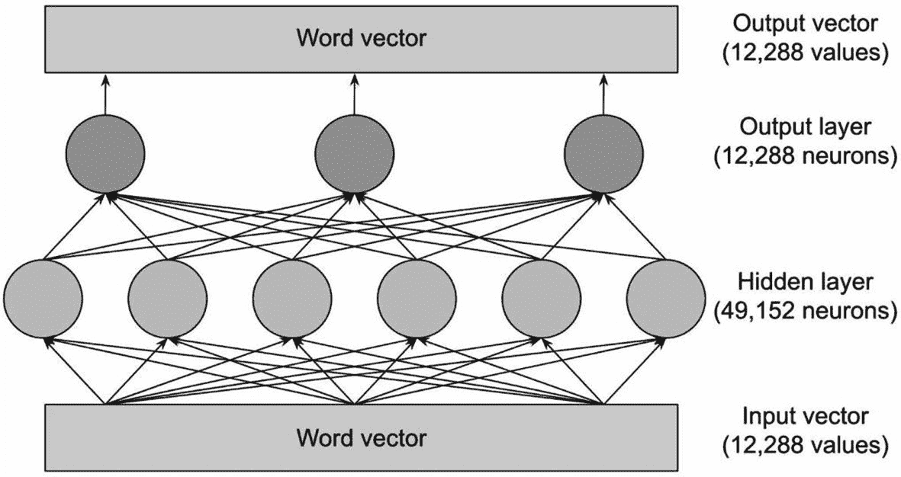

图 5-6

前馈神经网络

彩色圆圈代表神经元，它们本质上是计算其输入加权和的数学函数。前馈层的优势在于其广泛的连接网络。尽管图中只展示了少量神经元，但 GPT-3 前馈层的实际规模要大得多，其输出层拥有 12,288 个神经元，以匹配其 12,288 维的词向量，而隐藏层则拥有惊人的 49,152 个神经元。

在 GPT-3 最全面的版本中，仅隐藏层就包含 49,152 个神经元，每个神经元接收 12,288 个输入，相当于每个神经元有相同数量的权重参数。输出层包含 12,288 个神经元，每个神经元有 49,152 个输入，因此每个神经元有 49,152 个权重参数。这种配置使得每个前馈层拥有超过 12 亿个权重参数，而这样的层共有 96 个，总参数数量达到 1160 亿。这个庞大的数字几乎占 GPT-3 总参数数量（1750 亿）的三分之二。

特拉维夫大学 2020 年的研究^(³⁹)表明，前馈层通过模式识别发挥作用：隐藏层中的每个神经元都会识别输入文本中的特定模式。例如，在一个 16 层的 GPT-2 模型中，发现神经元能够识别的模式范围很广，从以 "substitutes" 结尾的词序列，到与军事基地、时间间隔和电视节目相关的模式，这展示了各层所识别模式的抽象程度在不断提高。早期层定位特定词汇，而更深层则在更广泛的语义领域中识别短语。

鉴于前馈层是逐个处理每个词的，这一发现尤其引人入胜。例如，在识别一个短语与电视相关时，它依赖于 "archived" 这个词的向量，而无法直接访问 "NBC" 或 "daytime" 等关联词。这表明，前馈层之前的注意力机制会将上下文信息整合到向量中，从而实现模式识别。

识别出模式后，神经元会用额外信息丰富该词向量，这些信息虽然有时很抽象，但通常能暗示下一个可能的词。

## 循环层

大语言模型的最后一层被称为循环层。这一层负责理解输入文本序列中的词汇，使其能够把握用户提示所呈现的序列中各个词汇之间的联系。

大语言模型中的循环层对于处理序列数据至关重要，尤其是在自然语言处理领域。这些层使大语言模型能够处理文本数据中的时间依赖关系和上下文细微差别，充分利用语言的序列特性。

### 深入了解循环层在大语言模型中的运作方式

#### 序列数据处理

与前馈层独立处理输入不同，循环层擅长处理序列数据。它们通过遍历输入序列的每个元素来实现这一点，并向前传递一个包含先前元素信息的状态。这个状态充当一种记忆，影响未来元素的处理，使得模型在解释当前词时能够考虑前面词的上下文。

##### 隐藏状态

循环层的核心是隐藏状态，它在序列的每一步都会更新。当接收到新的输入时，循环层会将其与现有的隐藏状态结合，产生一个新的隐藏状态。这种机制使模型能够累积到当前点为止整个序列的知识，这对于理解文本的结构和含义至关重要。

#### 时间反向传播

训练循环层涉及一种称为时间反向传播的技术。该方法将循环网络在每个时间步展开，将其视为一个深层前馈网络，其中每一层对应序列中的一个时间步。时间反向传播通过基于损失函数的梯度调整权重，使模型能够学习长期依赖关系，该梯度考虑了模型在整个序列上的表现。

#### 挑战与解决方案

循环层的一个挑战是由于梯度消失和梯度爆炸等问题，难以学习长期依赖关系。大语言模型通常采用循环层的先进变体，如长短期记忆单元或门控循环单元，以缓解这些问题。这些变体引入了控制信息流的门控机制，使得记住或遗忘某些信息变得更容易，从而增强了模型从长序列中学习的能力。

在大语言模型的背景下，循环层通过提供对序列上下文的细致理解，为文本生成、翻译和情感分析等任务做出贡献。它们通过记住之前所说的内容，并利用这些信息影响后续内容，使模型能够生成连贯且上下文相关的文本。

大语言模型架构的组成部分也强调了注意力机制的重要性。大语言模型利用这种机制来集中处理输入文本中与当前任务相关的特定部分。自注意力机制层的加入有助于模型生成更高精度的输出。

### 注意力机制

让我们探索 Transformer 在处理输入文本时的内部运作机制。该机制采用双阶段方法来更新每个单词的上下文信息：

-   首先，在`注意力阶段`，单词会在上下文中寻找与之相关的其他单词，从而实现信息交换。

-   随后，在`前馈阶段`，每个单词会处理从注意力阶段积累的见解，以预测下一个单词。

需要特别注意的是，这些操作是由整个网络而非单个单词执行的。这一澄清对于强调 Transformer 在单词级别（而非更大的文本块）分析文本的方法至关重要。这种策略利用了现代 GPU 强大的并行处理能力，使大型语言模型（LLM）能够高效处理长篇文本，而这正是以往模型所面临的局限。

注意力机制的功能类似于单词的“配对系统”，其中每个单词会生成一个查询向量，描述它要寻找的单词特征，以及一个键向量，描述它自身的特征。网络通过点积计算来评估键向量和查询向量的匹配程度，从而识别匹配的单词，并促进它们之间的信息交换。

设想一个场景：Transformer 需要确定句子片段中“his”指的是“John”。这个过程涉及将“his”的查询向量（可能正在寻找一个指代男性的名词）与“John”的键向量（表明它是一个指代男性的名词）进行匹配。一旦找到匹配，网络就会将信息从“John”传递到“his”。

Transformer 在每个注意力层中设有多个“注意力头”，使其能够并行处理各种信息交换任务。这些任务包括将代词与名词关联、澄清同音异义词，以及连接多词短语。注意力头的操作是顺序进行的，前一层的输出作为下一层的输入，复杂任务通常需要多个注意力头协同完成。

以 GPT-3 的最大变体为例，它包含 96 层，每层有 96 个注意力头，这意味着每次单词预测都需要进行 9,216 次注意力运算。

基于 Transformer 架构的大型语言模型（LLM）利用复杂的注意力机制来处理和生成语言。这些机制对于理解句子中单词之间的上下文和关系至关重要。接下来，让我们探讨 LLM 中使用的主要注意力机制类型。

#### 自注意力（内部注意力）

自注意力是 Transformer 模型的基石，它允许句子中的每个单词关注所有其他单词，以捕捉它们之间的上下文关系。这种机制帮助模型在整个句子的语境中理解每个单词的含义。它在识别依赖关系和关联方面尤为有效，无论这些关系在文本中的距离有多远。

##### 多头注意力

多头注意力是自注意力的扩展，它允许模型同时关注句子的不同部分。通过将注意力机制划分为多个“头”，模型可以并行捕捉单词上下文的各个方面，例如句法和语义关系。这有助于更全面地理解文本。

##### 交叉注意力（编码器-解码器注意力）

交叉注意力用于具有编码器-解码器结构的模型中，其中解码器关注编码器的输出。这种机制对于翻译等任务至关重要，因为模型在生成输出序列时需要参考输入序列（编码后的信息）。交叉注意力帮助解码器聚焦于输入文本的相关部分，从而提高生成输出的准确性。

##### 掩码注意力

掩码注意力主要用于 Transformer 的解码器部分，它防止某个位置关注其后续位置。这在训练过程中至关重要，以确保对特定单词的预测仅依赖于之前生成的单词，从而保持自回归特性。掩码注意力是生成连贯且上下文恰当的文本的关键。

##### 稀疏注意力

稀疏注意力机制旨在提高处理长文本序列时的效率和可扩展性。通过有选择地关注输入位置的一个子集，稀疏注意力降低了计算复杂度。像`Longformer`和`BigBird`这样的模型实现了稀疏注意力的变体，以有效处理更长的文档。

##### 全局/局部注意力

一些模型结合了全局和局部注意力机制，以在关注整个文本和聚焦于特定相关片段之间取得平衡。全局注意力可能考虑所有输入标记，而局部注意力则关注当前标记周围的邻域，从而优化性能和计算效率。

这些注意力机制使 LLM 能够以前所未有的规模处理和理解语言，应对复杂的语言模式和细微差别。通过利用这些多样化的注意力策略，LLM 在广泛的自然语言处理任务中取得了卓越的性能，从翻译和摘要到问答和创意写作。

## 理解 Token、Token 分布以及预测下一个 Token

在自然语言处理中，Token 是文本的最小单元，例如单词或字符。分词将文本分解成这些片段以供分析。Token 分布指的是文本中 Token 的频率和模式。理解这一点有助于模型训练时关注常见模式。预测下一个 Token 使用 n-gram、隐马尔可夫模型和神经网络等模型来分析先前 Token 的上下文。这增强了文本生成、自动补全和语言翻译等应用。

### 理解大型语言模型中的分词

像 GPT-3 这样的大型语言模型（LLM）通过将海量文本数据分解成可管理的单元（称为 Token）来革新文本处理。这种将文本分割成 Token 的过程是关键一步，使这些模型能够高效地消化和学习来自庞大数据集的知识。

将分词想象成一把解锁 LLM 潜力的万能钥匙，使其能够吸收和解释海量文本。通过将文本转换为 Token，这些模型可以轻松地浏览和处理大型数据集。分词就像一把精密工具，将文本分割成易于处理的小块，从而使模型能够扩展其理解和处理能力。它确保没有数据集过于庞大或复杂，使其成为在广泛文本集合上训练模型的基础。

分词作为一种关键机制，尤其在自然语言处理（NLP）领域，使 LLM 能够解析和利用即使是最令人生畏的文本汇编。这个过程不仅增强了模型的理解和生成能力，还显著拓宽了它们的知识范围和适用性。

### 分词技术对大型语言模型的优势

将文本分词为更小的元素为大型语言模型带来了多重优势，提升了它们在语言理解方面的效率和有效性：

- **改进的数据管理：** 分词简化了数据处理，使模型能够更准确地导航和解读语言趋势与模式。

- **资源优化：** 它有助于更高效地利用内存和计算资源，为构建更强大、更具可扩展性的模型铺平了道路。

- **应用的多功能性：** 通过分词实现输入标准化，确保大型语言模型能够无缝集成到从医疗到金融等不同领域，增强了各种文本分析系统之间的互操作性。

### 局限性与挑战

尽管分词扮演着关键角色，但它并非没有挑战。有时它会导致细微信息的丢失，尤其是在处理上下文丰富、含义微妙或格式非传统的语言或文本时。此外，分词在处理其预定义词汇表之外的单词或基于字符的语言时可能会遇到困难，这给完全捕捉人类语言的复杂性带来了障碍。

本质上，虽然分词是大型语言模型开发和功能性的基石，但应对其局限性仍然是释放语言理解与处理更大能力的关键关注领域。

### 当前分词技术面临的挑战

分词技术面临着若干挑战。这些挑战包括处理多种语言和方言、管理词汇表外的单词、应对复杂的词法形态以及解决上下文敏感性问题。此外，分词在处理习语表达和不同词元长度时也可能遇到困难，从而影响语言模型的性能。克服这些挑战对于提高自然语言处理应用的准确性和效率至关重要。

分词是自然语言模型处理文本的关键步骤，它面临着几个显著的挑战。

#### 分词中的大小写敏感性

分词器通常会根据单词的大小写来区分它们。例如，`"hello"` 可能被分配一个单一词元 ID（例如 `31373`），而 `"HELLO"` 则可能被分解成多个词元，如 `[13909, 3069, 46]`，对应于片段 `["HE", "LL", "O"]`。这种差异给处理大小写敏感的单词带来了复杂性。

#### 数值数据处理

从设计上看，Transformer 模型在数值任务上表现出的能力有限，部分原因是分词器对数字的表示不稳定。像 `200` 这样的数字可能被封装成一个单一词元，而 `201` 则可能被分割成多个词元（例如 `[20, 1]`），导致对数值数据的处理不一致。

#### 尾部空格的不一致性

分词器在处理尾部空格时可能表现出不可预测的行为。像 `"last"` 这样的单词可能会被分词为带有附加空格的 `" last"`，这与预期中将空格和单词分别分词成独立实体的方式不同。这种不一致性可能会影响模型根据输入是否以空格结尾来准确预测后续单词的能力。

#### 模型特定的分词实践

尽管字节对编码（BPE）方法或类似方法在分词中被广泛采用，但像 `GPT-4`、`LLaMA` 和 `OpenAssistant` 这样的语言模型各自都开发了定制的分词器。这意味着即使采用相同基础分词策略的模型，也可能有独特的实现方式，从而影响不同系统间的互操作性和一致性。

#### 把握上下文细微差别

将文本分割成单个词元可能导致上下文稀释，这个问题在那些富含微妙表达或高度依赖上下文的语言中尤为突出。这种潜在的上下文丢失可能会损害自然语言理解系统的有效性。

#### 处理歧义

分词可能难以解决词汇歧义问题，即一个单词具有多种含义。解读出正确的含义可能是一个复杂的难题。

#### 解释习语

将习语表达分割成离散的词元，可能会剥离其固有的含义，因为这些短语的意义来源于特定单词组合在一起使用。

#### 处理特殊符号和字符

独特符号、标点或字符的存在给分词策略带来了挑战，可能阻碍其准确处理和解释文本的能力，尤其是在使用技术语言或专业术语的领域。

### 大型语言模型中的分词策略

分词在自然语言处理的预处理阶段扮演着不可或缺的角色，它采用从简单的基于空格的分割到更复杂的方法（如片段分割和二进制代码配对）等一系列技术。分词技术的选择受到自然语言处理任务的具体要求、语言特征以及所涉及数据集性质的影响。

**常见分词方法**

- **单词分词：** 此方法将文本分割成单个单词，是最常用的分词技术。

- **句子分词：** 此方法将文本分割成其组成的句子，有助于需要理解句子边界的任务。

- **子词分词：** 子词分词将单词分解成更小的组成部分，以应对语言中形态多样性的挑战。

- **字符分词：** 通过将文本分割到单个字符级别，此方法允许对文本数据进行细粒度分析。

- **字节对编码（BPE）：** BPE 通过迭代过程运行，合并最常出现的连续词元对，以构建一个全面的词汇表。该算法在处理大型语言模型固有的庞大且多样的词汇方面特别有效，在字符分词的粒度与单词分词的效率之间取得了平衡。

这些分词技术为大型语言模型提供了基础工具，使其能够以卓越的准确性和细腻度处理、理解并生成人类语言。

# 什么是令牌分布？

在大型语言模型（LLM）中，例如 `GPT`（生成式预训练变换器）模型，令牌分布指的是模型如何基于令牌序列处理和生成文本。在这些模型的语境中，“令牌”是模型理解和操作的基本文本单元。令牌分布的概念可以从以下几个角度来理解：

- **令牌化过程：** 文本输入通过令牌化过程被转换为令牌。这个过程可能有所不同；例如，它可能涉及将文本分割成单词、子词甚至字符，具体取决于分词器的设计。分词方式的选择会影响模型的词汇量大小及其处理不同语言或专业术语的能力。

- **词汇分布：** 大型语言模型的词汇表由模型训练过的一组固定令牌组成。这个词汇表旨在尽可能覆盖广泛的文本。然而，训练数据中令牌的分布会影响模型的性能。与罕见或未见过的令牌相比，训练数据集中常见的令牌或短语会被模型更好地表示和理解。

- **令牌频率与表示：** 在训练数据集中，某些令牌出现的频率高于其他令牌，导致分布不均，即少量令牌占据了文本的绝大部分。模型通常经过训练来处理这种不平衡，但其有效性可能有所不同。高频令牌通常能以更高的准确度和细节被表示。

- **嵌入空间分布：** 语言模型词汇表中的每个令牌都关联着一个嵌入，即在高维空间中表示该令牌的向量。这些嵌入的分布反映了模型如何感知令牌之间的关系，包括语义和句法上的相似性。

- **输出令牌分布：** 在生成文本时，模型基于其词汇表上的概率分布来预测序列中的下一个令牌。这个分布受到输入上下文、模型内部表示及其训练过程的影响。生成文本的多样性和合理性直接与模型管理此分布的能力相关。

- **处理罕见或未见令牌：** 大型语言模型采用字节对编码（BPE）或类似的令牌化方法来处理罕见或未见过的单词，通过将它们分解为子词单元。这使得模型能够处理各种文本输入，即使这些输入包含训练词汇表中未明确出现的单词。

本质上，大型语言模型中的令牌分布是一个关键方面，它影响着模型对语言的理解、生成和整体处理能力。它涵盖了文本如何被令牌化、令牌在模型内部如何表示和管理，以及这些令牌如何影响模型的输出。

## 预测下一个令牌

大型语言模型在各种自然语言处理（NLP）任务中取得了显著进展，包括机器翻译、逻辑推理、编码和自然语言理解。像 `GPT-3`、`GPT-4` 和 `LaMDA` 这样的模型建立在庞大的文本数据集之上，使它们能够生成既连贯又与给定提示上下文相符的回复。值得注意的是，这些模型主要基于一个简单的原则运作：**预测序列中的下一个令牌**。

尽管这种方法很简单，但在足够全面的数据集上训练的模型已经展现出解决复杂问题的能力。让我们深入探讨“下一个令牌”预测所涉及的过程。

1. 首先，单词被分割成令牌，随后这些令牌被转换成称为嵌入的数值表示。这些嵌入（图 5-7）在维度为 `[512, 1]` 的向量中保留了原始单词的语义精髓。

   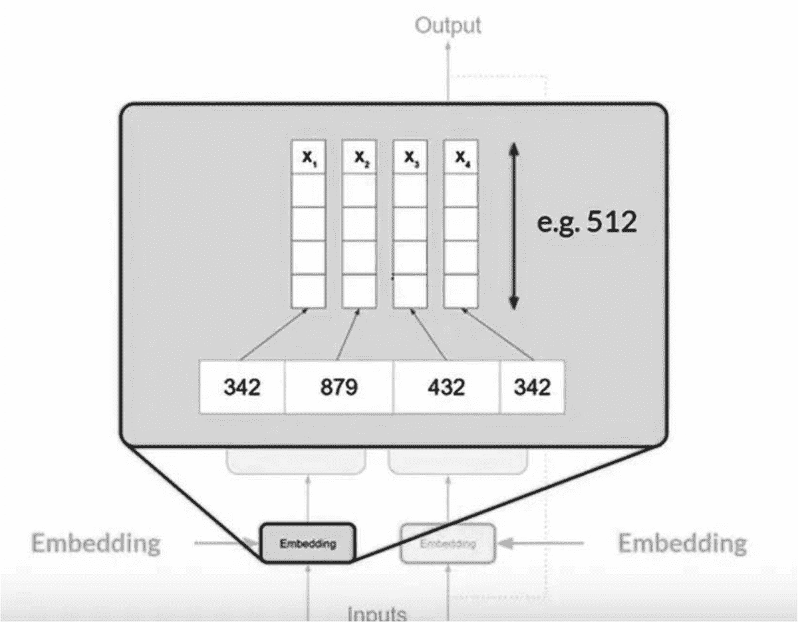

   **图 5-7** 令牌嵌入可视化（来源：Coursera）

2. 当将这些令牌向量纳入编码器和解码器框架时，还会添加位置编码。这种技术允许模型同时处理所有输入令牌，同时通过使用位置信息（图 5-8）保留单词的顺序。

   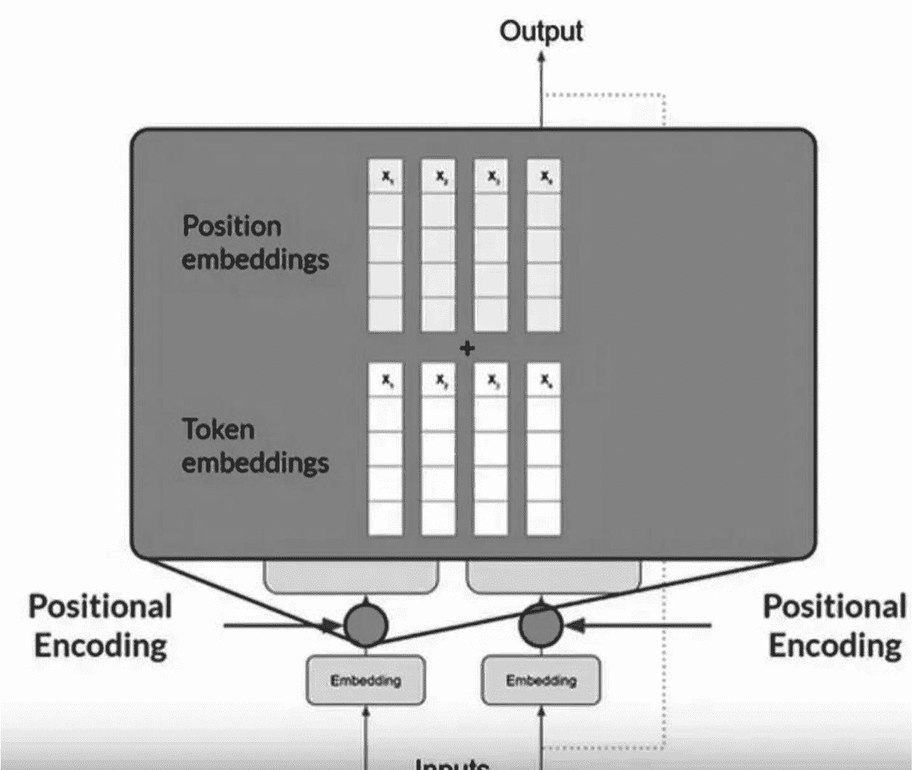

   **图 5-8** 令牌和位置嵌入（来源：Coursera）

3. 输入令牌和位置编码的组合向量随后被送入自注意力机制。在这一层中，模型评估输入中所有令牌之间的相互关系。自注意力机制旨在训练期间学习并存储权重，这些权重表示每个令牌与输入中其他每个令牌的相关性。值得注意的是，变换器模型采用了多头自注意力方法（图 5-9），使得能够并行学习多组自注意力权重，每组都解读不同的语言特征。

   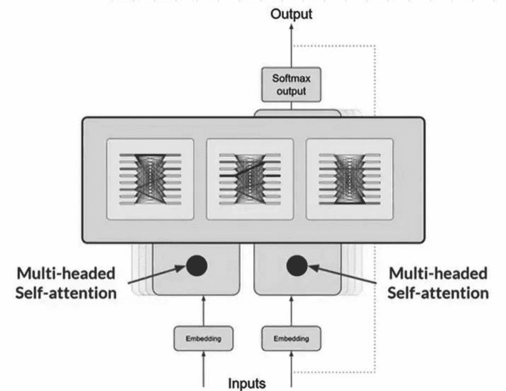

   **图 5-9** 多头自注意力机制（来源：Coursera）

4. 在将注意力权重应用于输入之后，得到的数据通过一个密集的前馈网络进行传递。

   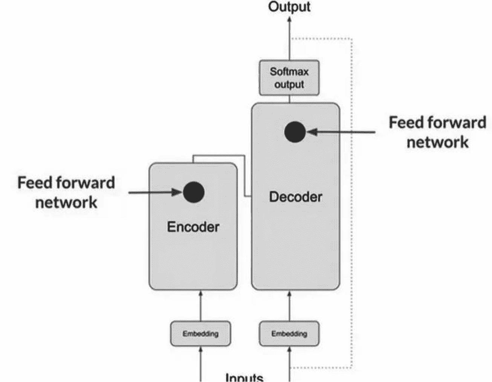

   **图 5-10** 编码器-解码器前馈网络（来源：Coursera）

5. 这个网络（图 5-10）产生一个与模型词汇表中每个令牌可能性相关的 logits 向量。这些 logits 随后通过一个 softmax 层被归一化为每个词汇单词的概率分数。

   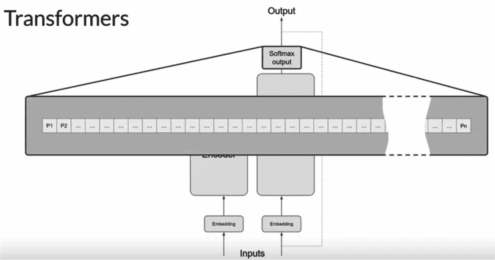

   **图 5-11** 变换器模型架构（来源：Coursera）

6. 变换器（图 5-11 和图 5-12）选择概率分数最高的单词，然后将其输入解码器以促进下一个单词的生成。这个迭代过程持续进行，直到模型生成一个结束令牌，这展示了变换器执行语言翻译的过程。

   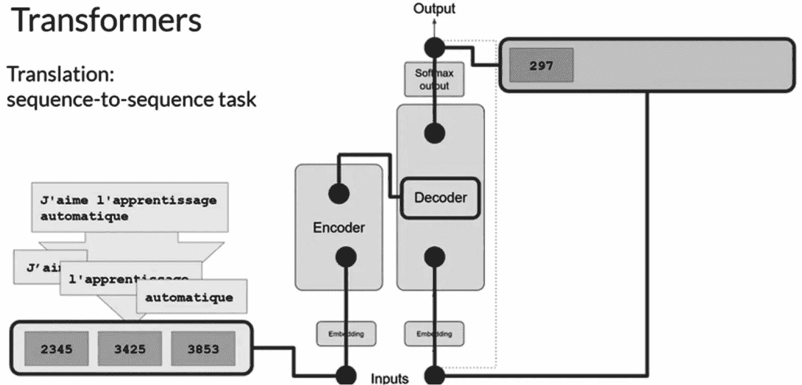

   **图 5-12** 基于变换器的序列到序列翻译（来源：Coursera）

## 零样本与少样本学习

零样本学习和少样本学习是深度学习中的技术，它们使模型能够在几乎没有或只有很少训练样本的情况下识别和分类新的、未见过的数据。零样本学习允许模型基于语义关系和先验知识进行预测，而无需新类别的任何训练样本。另一方面，少样本学习涉及使用非常少量的样本训练模型，利用迁移学习和元学习从有限的数据中进行泛化。这些方法在标记数据稀缺的场景中特别有用。

### 少样本学习

少样本学习是一种技术，它涉及在比通常使用的数据集小得多的数据集上训练模型。这种方法是无学习的一个典型例子，在元训练阶段，模型会在一系列相关任务上进行训练。这个过程使模型能够通过利用极少数量的样本，在新的、未见过的数据上有效执行。

#### 少样本学习的意义

`少样本学习`因其能够减少对大量数据收集的需求而脱颖而出，从而降低了数据采集的相关成本和计算开销。它在传统监督学习或无监督学习因数据不足而难以发挥作用的场景中表现出色，能够从极少的样本中做出准确预测。

这种学习模式模仿了人类的能力，例如从少量样本中识别新的手写字符，而机器通常需要海量数据才能完成此类任务。在医学领域，`少样本学习`通过计算机视觉辅助诊断罕见疾病，仅需少量数据输入即可分析异常情况。

#### 少样本学习的实际应用

- **计算机视觉：** 包括字符识别、图像分类，以及图像检索和手势识别等专业图像任务，同时涵盖视频相关应用。

- **自然语言处理（NLP）：** `少样本学习`有助于解析、翻译、从简短评论中进行情感分析、用户意图识别以及各种文本分类任务。

- **机器人技术：** 该技术应用于视觉导航、执行连续控制任务，以及从有限的演示中学习操作技巧。

- **音频处理：** 用于跨语言语音转换，以及将一个人的声音适配到另一个人。

- **其他领域：** `少样本学习`广泛应用于医疗诊断、物联网（IoT）、数学建模和材料科学等领域。

### 零样本学习

`零样本学习`是机器学习中的一种先进方法，经过训练的模型能够对训练阶段从未见过的类别进行预测。这项技术从人类认知能力中汲取灵感，能够基于已学概念识别和关联新信息，从而使机器也能类似地识别新类别。

`零样本学习`的主要目标是让模型能够准确分类或识别全新类别中的对象，而无需直接针对这些特定类别进行训练。这一能力通过从先前学习的数据中迁移知识来实现，强调模型理解并应用语义关系和属性来处理新的、未见过的数据。

`零样本学习`专注于开发能够解释和利用中间语义特征来识别新类别的模型。一个说明性的例子可以通过区分斑马和马匹的类比来理解。即使从未见过斑马，只要知道它像马一样但有黑白条纹，就能在第一次见到时识别出来。

#### 零样本学习的意义与用例

- **数据利用效率：** `零样本学习`显著减少了对大量数据标注的需求，而数据标注通常既耗时又耗费资源。当特定类别的标注数据稀缺时，这种方法尤为宝贵。

- **适应性：** 它允许模型适应新任务，而无需对先前获得的知识进行重新训练，展现了学习中的卓越灵活性。

- **增强模型泛化能力：** `零样本学习`旨在提升模型的泛化能力，使其更擅长处理各种任务和数据类型。

- **创新学习策略：** 该方法提出了一种替代传统学习策略的方案，通过利用直接知识迁移，可能绕过试错学习的局限性。

- **视觉识别：** 在图像分类和物体检测领域，`零样本学习`在无需事先接触的情况下识别和分类图像或对象，证明其价值不可估量。

- **深度学习应用：** `零样本学习`在推进各种深度学习框架（包括图像生成和检索）方面至关重要，它使模型能够根据未见对象的描述生成或查找图像。

通过这些应用，`零样本学习`在机器学习中呈现了一种变革性的方法，为构建更直观、高效且多功能的模型搭建了桥梁，这些模型能够以模仿人类学习的方式理解和作用于世界。

#### 解读有限数据学习：少样本学习、单样本学习和零样本学习详解

在机器学习领域，用稀缺数据训练模型带来了一系列独特的挑战和解决方案。其中，`少样本学习`、`单样本学习`和`零样本学习`是三种创新方法，旨在以不同方式利用最少的数据。

- **少样本学习** 适用于仅有有限数据集可用于训练的情况。这种方法使模型能够通过仅训练少量数据样本来学习和执行任务，如图像分类和人脸识别。当数据稀缺但仍可用于模型训练时，`少样本学习`特别有用。

- **单样本学习** 进一步将数据需求降至最低，通过仅使用一个数据实例或示例来训练模型。这种方法大幅减少了对大量数据集的需求，使其在特定识别任务（例如通过单张身份证件验证个人身份）中非常高效。`单样本学习`展示了模型从单个示例中泛化以理解和识别新实例的能力。

- **零样本学习** 则在手头任务没有直接训练数据的情况下运作。`零样本学习`模型不依赖示例学习，而是利用已有的知识和语义理解来分类或识别从未明确训练过的对象。这种方法在无法为每个可能的类别或结果提供训练数据的场景中尤为强大，使模型能够推断并对完全未见过的数据做出预测。

这三种方法各自从不同角度应对数据稀缺的挑战，提供了从利用少量示例到在没有任何示例的情况下进行有根据猜测的解决方案。通过这些方法论，机器学习可以实现卓越的灵活性和适应性，即使在数据有限的情况下也能突破可能性的边界。

#### 示例

当然，以下是`少样本学习`、`单样本学习`和`零样本学习`在大语言模型背景下的示例。

### 少样本学习

- **场景：** 向语言模型提供少量示例以执行特定任务。

- **示例：** 您希望语言模型以某位特定诗人的风格创作诗歌。您向它提供该诗人写的几首诗（例如三到五首）。

- **训练数据：** 诗人 A `–` 三到五首诗

- **任务：** 在看到这几个示例后，语言模型能够生成模仿诗人 A 风格和主题的新诗。

### 单样本学习

- **场景：** 向语言模型提供一个示例以学习一项任务。

- **示例：** 您希望语言模型将特定短语从英语翻译成一种它从未见过的稀有语言。您向它提供一个翻译示例。

- **训练数据：**

    - 英语短语：`"Good morning"`

    - 稀有语言短语：`"Buenos días"`

- **任务：** 在看到这个单一示例后，语言模型能够将其他类似的短语从英语翻译成该稀有语言。

### 零样本学习

- **场景：** 要求语言模型利用其通用知识，执行一项未经明确训练的任务。

- **示例：** 你要求一个语言模型总结一篇关于它从未见过的主题的科学文章，它运用对语言的理解和关于科学的通用知识来完成。

- **训练数据：** 科学概念和语言模式的通用知识。

- **零样本学习的辅助信息：** 模型利用其关于科学文章和总结技巧的既有知识。

- **任务：** 准确总结一篇新的科学文章，即使模型之前从未见过这篇特定的文章或主题。

这些示例说明了大型语言模型如何能够通过不同数量的特定训练数据，甚至仅凭描述性信息，适应新的任务和情境，展示了现代人工智能系统的灵活性和强大能力。

## 大语言模型幻觉

人工智能幻觉指的是，先进的人工智能系统，特别是大型语言模型和计算机视觉技术，生成包含虚构或无意义信息的输出，这些信息并非基于现实或它们所训练的数据。这种现象可能导致从人类视角来看显得怪异或完全错误的回应或视觉输出。

通常，用户期望人工智能生成的回应能准确反映与其查询或提示相关的信息。然而，在某些情况下，人工智能的算法会产生偏离底层训练数据的结果，因有缺陷的解码过程而误解输入，或在没有可辨别的逻辑基础的情况下生成回应，即有效地“幻觉”出信息。

使用“幻觉”一词来描述此类人工智能行为起初可能显得奇怪，因为它将通常用于人类或动物体验的术语拟人化地用于机器过程。然而，这个比喻恰当地传达了这些输出出人意料且往往超现实的本质，让人联想到人类如何从云朵中辨别形状或在月球上看到人脸，其背后是人工智能因过拟合、训练数据中的偏差或不准确性以及模型本身的固有复杂性等问题导致的误解。

人工智能幻觉已在多个备受瞩目的案例中被注意到，这凸显了部署生成式、开源人工智能技术所固有的挑战。例如，谷歌的 `Bard` 聊天机器人对天文发现提出了毫无根据的说法，微软的人工智能表达了不恰当的情感依恋或行为，以及 Meta 因其 `Galactica` 大语言模型演示传播有偏见或不正确的信息而将其撤回。

尽管已采取措施来解决和纠正这些问题，但它们凸显了在应用人工智能技术时，即使在最佳条件下，也可能产生意想不到且有时有问题的结果。

### 大语言模型中幻觉的分类

大语言模型表现出两种主要类型的幻觉，按其性质和影响区分：事实性幻觉和忠实性幻觉。

#### 事实性幻觉

当大语言模型生成事实上不正确的信息时，就会发生这种情况。一个例子是，大语言模型声称查尔斯·林德伯格是第一个登上月球的人，这显然是一个事实错误。此类错误通常源于模型对上下文的理解不足，以及其训练数据中存在不准确或误导性信息，导致输出与实际情况不符。

#### 忠实性幻觉

这一类包括大语言模型生成的内容偏离或违背了其本应反映或总结的源材料的情况。例如，在总结任务中，如果一篇源文章提到美国食品药品监督管理局在 2019 年批准了第一种埃博拉疫苗，忠实性幻觉可能表现为模型不准确地陈述美国食品药品监督管理局未批准该疫苗（内在幻觉），或者它可能引入不相关的信息，例如中国开发了新冠疫苗（外在幻觉），而这两者均未得到源文本的支持。

这些分类凸显了大语言模型在准确解释和复现信息方面面临的挑战，强调了持续努力提高其理解能力和可靠性的重要性。

### 人工智能幻觉的影响

人工智能幻觉的影响是深远的，尤其是在医疗保健等关键领域，人工智能的误诊可能会将无害的病症错误地识别为严重疾病，从而引发不必要的治疗。此外，人工智能生成的不准确信息可能助长虚假信息的传播。设想一个场景，人工智能驱动的新闻平台基于未经核实的事实不准确地报道一场正在发生的危机，可能通过传播错误信息而加剧局势。

导致人工智能幻觉的一个主要因素是训练数据中存在偏差。当人工智能系统在存在偏差或不完全具有代表性的数据集上进行训练时，它们可能会生成不准确地反映这些偏差的输出，解释不存在的模式或特征。

此外，人工智能系统容易受到对抗性攻击，恶意实体故意改变输入以欺骗人工智能做出错误的识别或决策。在图像识别的背景下，这种攻击可能涉及向图像引入难以察觉的、经过特殊设计的噪声，导致人工智能错误地对其进行分类。这种脆弱性在公共安全和安保至关重要的领域尤其令人担忧，包括网络安全措施和自动驾驶技术的发展。

为了应对这些威胁，人工智能研究人员正在努力开发稳健的防御机制，例如对抗性训练，即在标准输入和经过对抗性修改的输入上训练人工智能模型，以增强其对此类攻击的抵抗力。尽管取得了这些进展，但在训练过程中保持严格的标准并确保信息的彻底验证，对于减轻与人工智能幻觉相关的风险仍然至关重要。

**大语言模型幻觉发生的原因有几个：**

- **训练数据的局限性：** 大语言模型是在从互联网和其他来源收集的海量数据集上进行训练的，这些数据集可能包含不准确、偏见或过时的信息。模型可能会在其回应中复制这些不准确之处。

- **推理与泛化：** 大语言模型基于训练期间学到的模式和关联来生成回应。在试图提供连贯且符合语境的答案时，它们可能会推断出细节或做出不正确的概括。

- **缺乏对真实世界的理解：** 虽然大语言模型能够以看似理解的水平处理和生成语言，但它们并不具备真正的理解力或意识。它们基于词语之间的统计关系运作，这可能导致看似合理但完全虚构的陈述。

- **语言和知识的复杂性：** 语言本质上是模糊和复杂的。大语言模型可能在处理微妙或复杂的主题时遇到困难，导致简化或错误，从而表现为幻觉。

减轻大语言模型幻觉的努力包括改进模型的训练数据、优化其架构，以及开发更复杂的检查和验证生成内容的技术。此外，用户反馈和提示工程（设计更有可能产生准确和相关输出的模型输入）是减少幻觉发生的关键策略。

### 降低 AI 幻觉风险：预防策略

为有效遏制 AI 幻觉的发生，必须采取主动措施，确保 AI 模型在准确性和可靠性的范围内运行。以下是维护 AI 输出完整性的关键策略。

#### 确保高质量训练数据

生成式 AI 性能的基础在于训练数据。为避免幻觉，使用全面、多样且精心筛选的训练数据集至关重要。高质量数据有助于减少偏差，增强模型对任务的理解，从而产生更准确、更可靠的输出。

#### 明确模型的目的与约束

明确 AI 模型的具体目标和限制，对于减少不相关或错误的输出至关重要。为模型的预期用途建立清晰的指导方针，有助于将其能力聚焦于生成相关结果，从而降低幻觉出现的可能性。

#### 实施数据模板

利用数据模板可以标准化输入数据的格式，引导 AI 模型生成符合既定规范的输出。这种方法能促进模型响应的一致性，并有助于防止其偏离到不准确或不相关的领域。

#### 限制可能的结果

限制 AI 模型响应的范围可以显著减少幻觉。通过过滤机制或概率阈值设定明确的边界，可以提高模型输出的准确性和一致性。

#### 持续测试与优化

在部署前进行严格测试，并对 AI 模型进行持续评估，对于保持其有效性至关重要。定期评估允许根据需要进行及时的调整或重新训练，确保模型在新数据出现时保持最新和准确。

#### 引入人工监督

将人工审核纳入 AI 输出验证流程，是防范幻觉的重要保障。人工监督提供了额外的审查层级，能够识别并纠正 AI 可能忽略的不准确之处。专家审核员还能贡献宝贵的见解，进一步提升模型的准确性和相关性。

## 幻觉何时可能有益？

`LLM`（大型语言模型）幻觉指的是模型生成不准确或完全虚构信息的情况。虽然这通常被视为缺点，但在某些情境下，这些幻觉可能是有益的：

*   **创意写作：** 幻觉可以激发创造力，产生人类作家可能无法构思的独特创意、故事情节或角色。这在小说创作、剧本写作或游戏设计的头脑风暴环节中尤其有用。

*   **艺术表达：** 在诗歌、歌词及其他艺术表达形式中，生成意想不到的超现实意象可以增强创作过程，并催生创新的艺术形式。

*   **头脑风暴与构思：** 在头脑风暴的初始阶段，幻觉可以提供广泛的想法，包括那些纯粹基于事实的方法可能无法产生的、跳出框架的概念。

*   **角色扮演与模拟：** 在游戏和虚拟环境中，幻觉可以创造动态且不可预测的场景，增强玩家的沉浸式体验。

*   **教育目的：** 在某些教育情境中，幻觉可以激发批判性思维和分析能力。例如，可以让学生识别生成文本中的不准确或虚构之处，从而磨练他们的研究和事实核查技能。

*   **治疗用途：** 创意写作和讲故事常用于治疗环境。幻觉内容可以帮助患者以新颖的方式探索自己的想法和感受，提供新的视角和见解。

*   **探索替代现实：** 对于科幻和思辨小说，幻觉有助于构建替代现实、未来场景或平行宇宙，用富有想象力的可能性丰富叙事。

尽管幻觉有这些潜在益处，但在准确性至关重要的情境（如新闻、医疗建议和法律信息）中，必须谨慎管理，以避免错误信息的传播。

# 未来影响

尽管大型语言模型（`LLM`）有望变革众多行业，但认识到其局限性及引发的伦理问题至关重要。企业和专业人士应权衡实施 `LLM` 的潜在收益与风险。此外，模型开发者必须持续优化设计，以减少偏见并增强其在多样化场景中的适用性。

在探索大型语言模型（`LLM`）现有边界的过程中，对人工智能下一次突破的追寻正引导研究人员走上创新之路。推动这一进程的关键洞察在于：人类日常交互的大部分数据几乎未被数字化，而其中文本数据占比更小。

多模态学习的研究正成为一个关键方向，它将文本数据与图像、视频和音频等其他形式相融合。这种整合有望解锁更丰富、更复杂的信息理解能力，使 AI 系统能够以前所未有的深度和细腻度掌握并解读人类语言。

要实现这种增强的理解力，需要在计算机视觉和视频分析等专业领域取得进展，这可能会彻底改变语音识别技术，从而带来更具参与感和整体性的 AI 交互体验。然而，转向多模态方法也带来了新的挑战，尤其是在处理日益增长的数据规模和复杂性方面，这需要创新的解决方案来简化和优化训练过程。

为应对这些挑战，开发更高效、更环保的训练方法已成为焦点。少样本学习、迁移学习和元学习等技术正被用来减少对海量数据集和计算能力的依赖，从而推动更可持续、更易获取的 AI 发展格局。这些策略利用现有知识，将其应用于不同领域，以培育不仅性能卓越，而且注重能源使用和环境影响的人工智能应用。

与这些努力并行的是，通过将符号人工智能与深度学习相结合，人们越来越重视增强 AI 的语境理解和泛化能力，由此催生了混合人工智能。这种方法旨在将联结主义的数据驱动洞察与符号人工智能的结构化推理相结合——后者曾因可扩展性挑战而被边缘化，但现在人们认识到其与统计模型协同作用的潜力。

混合人工智能旨在从海量数据集中自动提取符号规则，将手动定义这些系统的艰巨任务转变为由机器主导的简化流程。这种融合不仅提升了 AI 的认知和问题解决能力，还通过将决策建立在明确定义的规则和逻辑之上，解决了深度学习模型固有的可解释性和可理解性问题。

展望未来，尽管当前 AI 领域的热潮主要集中在生成式模型和 `LLM` 上，但有迹象表明它们的性能可能很快会达到饱和点。然而，AI 的疆域远不止于此，多模态学习、可持续实践和混合人工智能将有望定义下一代 AI 系统。这些进步将迎来一个更加多功能、更可持续、且能够以更高效率和更强泛化能力应对更广泛挑战的人工智能时代。

# 大型语言模型架构示例

大型语言模型（`LLM`）凭借其理解和生成类人文本的能力，彻底改变了自然语言处理领域。关键示例包括由 OpenAI 开发的 `GPT`（生成式预训练变换器），它利用变换器架构根据给定提示生成连贯且上下文相关的文本。另一个著名例子是由谷歌创建的 `BERT`（来自变换器的双向编码器表示），它专注于理解双向（左右）上下文，适用于问答和情感分析等任务。此外，同样由谷歌开发的 `T5`（文本到文本迁移变换器）将所有 NLP 任务转换为文本到文本格式，从而为各种语言任务提供了统一的方法。这些架构利用变换器的强大能力，在多样化的 NLP 应用中实现了最先进的性能。

### GPT-4

作为 OpenAI 基础模型系列的第四代产品，生成式预训练 Transformer 4（`GPT-4`）是一款多模态语言模型，于 2023 年 3 月 14 日发布。用户可通过订阅制的 ChatGPT Plus、OpenAI 的 API 以及免费聊天机器人服务 Microsoft Copilot 进行访问。`GPT-4` 采用 Transformer 架构，利用公开数据与第三方授权数据的组合进行预训练。其训练过程涉及预测后续 token，并通过人类与 AI 生成的强化学习反馈进行微调，以确保模型符合人类价值观并遵守政策准则。

与上一代 `GPT-3.5` 相比，`GPT-4` 版本的 ChatGPT 被视为一项升级，但仍保留了早期版本的一些局限性。`GPT-4` 的一个显著特性（称为 `GPT-4V`）包括在 ChatGPT 中处理图像输入的能力。尽管取得了进步，OpenAI 选择不公开该模型的具体技术细节和指标，包括其确切规模。

### 模型特性

-   **GPT-4 的规模与架构：** `GPT-4` 拥有约 **1.8 万亿个参数**，分布在 **120 层**中，规模远超 `GPT-3` 十倍以上。

-   **通过 MoE 集成专家知识：** 该架构采用了 16 个专业专家模块，每个模块拥有约 **1110 亿个参数**，专门用于多层感知机（MLP）。每次前向传播时，会从中选择两个专家，以优化成本效率。

-   **训练数据集构成：** 模型的训练方案涵盖了约 13 万亿个 token，这些 token 来自文本和代码数据的混合，并辅以来自 **ScaleAI** 和内部资源的微调贡献。

-   **训练数据的多样性：** 其数据集融合了来自 **Common Crawl 和 RefinedWeb** 的内容，以及其他推测来源如 **Twitter、Reddit、YouTube** 和大量教科书集合，总计 13 万亿个 token。

-   **开发成本：** `GPT-4` 的开发资金投入约为 6300 万美元，这反映了所需的大量计算资源和时间投入。

-   **推理运营成本：** 运行 `GPT-4` 的成本是其前身（拥有 1750 亿参数的 Davinci 模型）的三倍，这归因于需要更大的计算集群以及资源利用效率的降低。

-   **推理过程：** 该模型的推理机制在 128 个 GPU 组成的网络上运行，利用 8 路张量并行和 16 路流水线并行来实现高效处理。

-   **增强的视觉能力：** `GPT-4` 集成了一个类似于 Flamingo 架构的视觉编码器，使模型能够解释网页并转录图像和视频内容。此功能引入了额外的参数，并通过约 2 万亿个 token 的微调数据进一步优化，丰富了其多模态能力。

-   **训练计算量：** 在约 25,000 个 Nvidia A100 GPU 上训练了 90-100 天。

-   **训练数据：** 在约 13 万亿个 token 的数据集上进行训练。

-   **上下文长度：** 支持最多 32,000 个 token 的上下文。

`GPT-4` 能够处理超过 **25,000 个单词的文本**，适用于长篇内容创作、扩展对话以及文档搜索和分析等用例。

#### GPT-4 的局限性

与其前身类似，`GPT-4` 有时会生成训练数据中不存在或与用户输入相矛盾的信息，这种现象通常被称为“幻觉”。此外，该模型的决策过程缺乏透明度。虽然它可以为其回复提供解释，但这些解释是在事后生成的，可能无法准确反映其底层推理过程。通常，`GPT-4` 提供的解释可能与其先前的回复不一致。

在使用 **ConceptARC**（一个旨在评估抽象推理能力的基准测试）进行评估时，`GPT-4` 的表现显著低于预期，在所有类别中的得分均低于 33%。这与专门模型和人类的表现形成鲜明对比，后两者的得分分别约为 60% 和至少 91%。

这一结果表明，抽象推理（涉及理解复杂关系和模式）对于像 `GPT-4` 这样的通用 AI 模型来说仍然是一个具有挑战性的领域。该基准测试专注于抽象推理，这是人类认知的一个关键方面，涉及识别模式、逻辑规则以及对象之间的关系。`GPT-4` 低于 33% 的表现表明它在此领域存在困难。

那些采用特定架构设计或在针对抽象推理定制的数据集上训练的专门模型，表现要好得多，得分达到 60%，这强调了领域特定训练和优化的重要性。

专门模型是指那些专门设计和优化以处理特定类型任务或领域的模型。在抽象推理和 ConceptARC 基准测试的背景下，专门模型的表现优于 `GPT-4`。以下是关于这些专门模型的详细信息。

表 5-1 比较了人类、ARC-Kaggle 竞赛的前两名参赛作品以及 `GPT-4` 在各种概念任务上的表现。每个任务根据完成任务的成功率进行评估。

**表 5-1** 概念任务上的性能比较

| -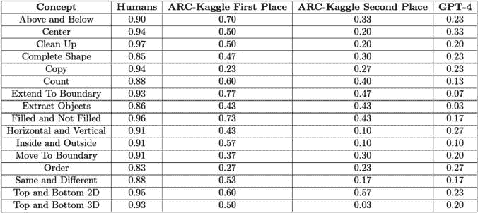 |

1.  **ARC-Kaggle 挑战赛获胜者**：在 ConceptARC 基准测试上评估了 ARC-Kaggle 挑战赛的第一名和第二名程序。这些模型是专门为解决抽象与推理语料库（ARC）任务而设计的，这些任务涉及与 ConceptARC 类似的抽象推理。它们的设计可能包含针对识别和操作抽象模式与概念进行优化的算法。

2.  **人类表现**：作为参照，通过 Amazon Mechanical Turk 和 Prolific 等平台在相同任务上接受测试的人类参与者，其表现始终优于 `GPT-4` 和专门模型，这凸显了抽象推理任务的复杂性以及当前 AI 能力与人类认知之间的差距。

在 ConceptARC 基准测试中，专门模型（ARC-Kaggle 的第一名和第二名）在各个概念组中的表现均优于 `GPT-4`。以下是其表现的一些示例。

-   **上方与下方**：ARC-Kaggle 第一名得分为 70%，而 `GPT-4` 得分为 23%。

-   **延伸至边界**：ARC-Kaggle 第一名得分为 77%，而 `GPT-4` 得分为 7%。

-   **填充与未填充**：ARC-Kaggle 第一名得分为 73%，而 `GPT-4` 得分为 17%。

### 关键要点

- **针对特定任务的优化**：专用模型的成功凸显了根据抽象推理任务的具体要求定制算法的重要性，包括从核心概念的具体实例中进行泛化的能力。

- **通用模型的局限性**：`GPT-4`虽然功能强大，但作为一个通用模型，并未针对`ConceptARC`中的此类任务进行专门优化。这说明了人工智能需要持续发展，以弥合抽象推理能力方面的差距。

未参与该研究的科研人员**萨姆·鲍曼**指出，考虑到评估是视觉导向的，而`GPT-4`主要是一个语言模型，这些发现未必表明`GPT-4`在抽象推理能力上存在缺陷。

科恩儿童医学中心的研究人员在 2024 年 1 月的一项研究中报告称，`GPT-4`在诊断儿科疾病方面的准确率仅为 17%，凸显了其医疗诊断能力的局限性。

关于偏见问题，`GPT-4`经历了一个两阶段的训练过程。最初，它被输入海量的互联网文本，以学习预测序列中的下一个词元。随后，它通过基于人类反馈的强化学习进行优化，旨在教会模型拒绝那些可能导致有害行为的提示（由`OpenAI`定义）。这包括生成与非法活动、自残或描述露骨内容相关的回复。

微软的研究人员提出担忧，认为`GPT-4`可能表现出某些认知偏见，包括确认偏误、锚定效应和基率忽视，这表明模型的推理可能在某些方面受到固有偏见的影响。

### BERT

`BERT`是“来自变换器的双向编码器表示”的缩写，是一个为自然语言处理（NLP）相关任务开发的免费软件库。`BERT`由谷歌 AI 语言团队于 2018 年推出，旨在理解人类语言的细微差别和上下文。

#### BERT 简介

`BERT`的核心是利用基于变换器的神经网络架构来处理和解读人类语言的细微之处。与包含编码器和解码器组件的传统变换器模型不同，`BERT`仅采用编码器机制。这一设计选择强调了`BERT`专注于理解输入文本，而非生成新文本。

#### BERT 的双向特性

传统的语言模型通常以线性方式分析文本，按顺序（正向或反向）逐个处理单词。这种方法可能会忽略单词周围的完整上下文。与此相反，`BERT`采用双向策略，同时评估句子中一个单词两侧的上下文。这种方法使`BERT`能够通过一次性考虑整个句子的上下文，从而获得对文本的全面理解。

*以句子“She went to the bank to _______ some money.”为例。在单向处理文本的模型中，空白处的含义很大程度上取决于前面的单词，可能会混淆“bank”是指河岸还是金融机构。然而，`BERT`的双向特性会同时评估空白处前后的上下文（“She went to the bank to”和“some money”）。这种方法提供了更具层次感的解读，根据“money”的上下文，识别出这里的“bank”指的是金融机构。这展示了`BERT`通过考虑整个句子的上下文所实现的增强理解能力，克服了单向模型中的局限性。*

#### BERT 的训练阶段：预训练与微调

`BERT`的开发涉及一个两阶段策略：

- **在大量未标记文本数据上进行预训练**，以掌握单词之间的上下文关系

- **使用特定任务的标记数据进行微调**，以将这种理解应用于特定的 NLP 挑战

## 阶段一：使用未标记数据进行预训练

在预训练期间，`BERT`会接触大量没有特定标签的文本语料库。它学习丰富的词嵌入，这些嵌入根据上下文反映了单词的含义。此阶段包括自监督任务，例如填充句子中的空白（一种称为掩码语言建模或`MLM`的技术）以及判断两个句子是否逻辑连贯。这些练习使`BERT`能够捕捉语言和句子结构的细微差别。

## 阶段二：针对特定任务的微调

一旦预训练完成，`BERT`会通过在较小的、特定任务的数据集上调整其参数来进行微调。这个过程将`BERT`广泛的语言理解能力精炼为执行特定任务，如情感分析、问答或实体识别。该模型的多功能架构使其能够轻松适应各种 NLP 应用，每个新任务只需进行微小的调整。

## BERT 的工作原理

`BERT`仅利用变换器架构中的编码器部分，处理输入词元序列以生成上下文相关的词元嵌入（图 5-13）。与线性预测下一个单词的传统模型不同，`BERT`采用了两种新颖的预训练目标：

- **掩码语言模型（MLM）**：`BERT`随机隐藏一部分输入词元，然后根据其上下文预测这些被掩码的词元，从而增强其对语言上下文的理解。

- **下一句预测（NSP）**：`BERT`评估两个句子是否逻辑上连续，进一步优化其对叙事流程的理解。

## BERT 的架构创新

`BERT`的架构，无论是`BASE`变体还是`LARGE`变体，都在原始变换器模型（图 5-14）的基础上进行了扩展，拥有更多的编码器层、更大的前馈网络和更多的注意力头，使其能够捕捉更深层次的语言细节。`BASE`模型包含 12 个变换器块（768 个隐藏单元和 12 个注意力头），而`LARGE`模型则将这一容量翻倍。

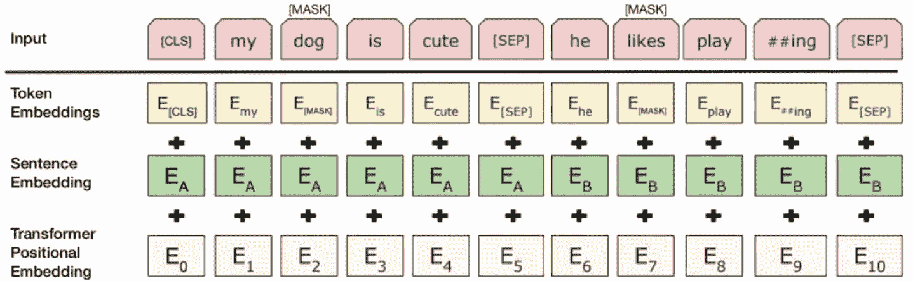

图 5-13

`BERT`输入嵌入可视化（来源：[`medium.com`](http://medium.com)）

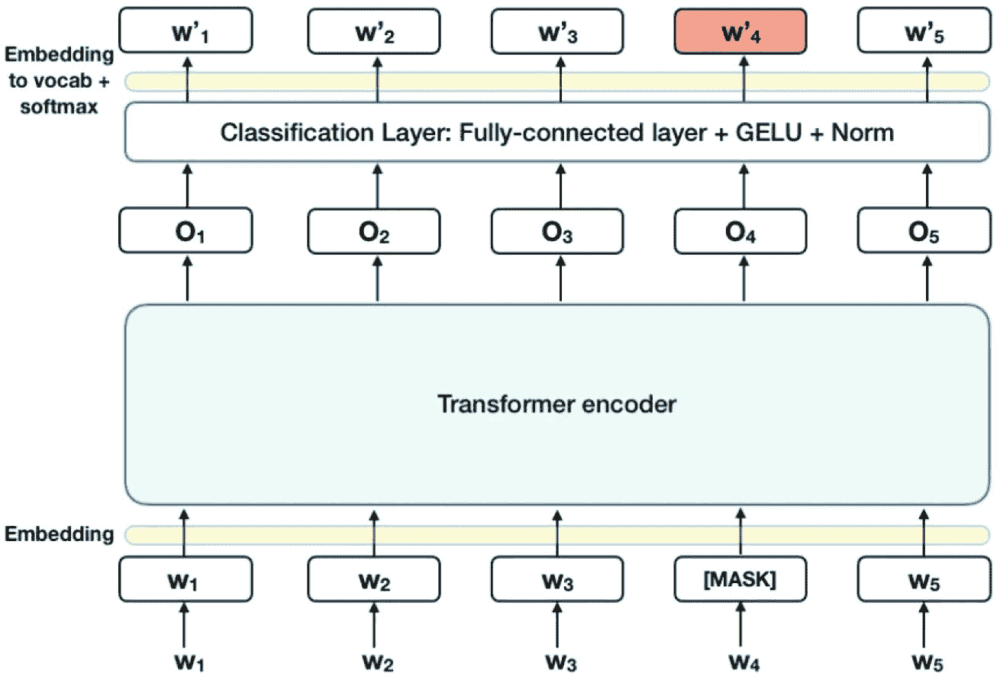

图 5-14

变换器编码器分类层（来源：[`medium.com`](http://medium.com)）

## 从训练到应用

`BERT`处理输入时，首先以一个特殊的分类词元（`CLS`）开头，后跟输入文本。模型的各层依次应用自注意力和前馈网络，为每个词元生成一个向量表示。`CLS`词元的最终表示可以作为分类任务的特征，这展示了`BERT`将其预训练嵌入转化为特定任务应用（例如单层神经网络分类）的能力，并取得了显著成功。

## BERT 在语言处理中的应用

BERT 的能力被广泛应用于各种语言理解与生成任务，例如：

- **生成词嵌入：** BERT 擅长在其句子上下文中创建单词的详细表示，从而增强对其含义和关系的理解。

- **命名实体识别（NER）：** 它能够精准定位文本中的特定人名、组织、地点等，对于从文档中提取相关信息具有重要价值。

- **文本分类：** 对于情感分析、垃圾邮件识别或主题分类等任务，BERT 的深度上下文洞察显著提升了准确性和效率。

- **促进问答系统：** 通过理解问题并从提供的文本中寻找准确答案，BERT 增强了阅读理解辅助工具和自动查询系统的有效性。

- **增强机器翻译：** 利用其上下文理解能力，BERT 通过捕捉跨语言准确传达含义所必需的语言细微差别，提高了翻译质量。

- **文本摘要：** 在从长篇文本中提取要点以生成连贯且相关的摘要时，BERT 对上下文和语义的理解能力得以彰显。

- **赋能对话界面：** 无论是在聊天机器人、数字助手还是交互式系统中，BERT 对语言的细致解读使得对话更加流畅自然。

- **评估语义相似度：** 通过比较 BERT 生成的文本嵌入，可以评估它们的语义接近程度，有助于识别同义改写、检测重复内容以及基于语义相似度进行信息检索。

通过这些应用，BERT 显著推动了自然语言处理领域的发展，为以往棘手的问题提供了精妙的解决方案。

## T5

“文本到文本迁移转换器”（T5）（图 5-15）由谷歌于 2020 年发布，^(⁴⁴) 代表了一种基于 Transformer 架构的高级模型框架，它特别采用了编码器和解码器两个组件来生成文本。这种方法使其有别于其他著名的基于 Transformer 的模型，如 BERT 或 GPT，后者仅使用编码器或解码器结构，而非两者兼用。T5 模型的创新之处还在于其引入了海量清洁爬取语料库（C4），这是一个经过精心清洗的大型数据集，旨在通过自监督学习技术对语言模型进行预训练。

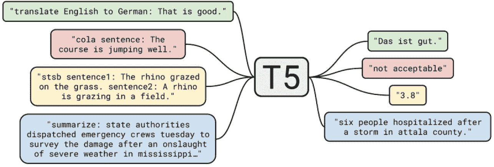

图 5-15 T5 模型任务与输出（来源：Google 博客）

训练或微调 T5 模型需要一对输入和输出文本序列，从而能够执行文本生成、翻译等多种任务。随后的发展催生了原始 T5 模型的多个迭代版本，包括得益于架构改进并仅在 C4 数据集上进行预训练的 `T5v1.1`；跨 101 种语言训练的多语言变体 `mT5`；利用字节序列而非子词标记序列的 `ByT5`；以及专为处理长文本输入而设计的 `LongT5`。

T5 模型对 Transformer 架构（图 5-16）的考察揭示了三种主要类型：标准编码器-解码器、单层语言模型和前缀语言模型，每种类型都通过独特的掩码策略来控制注意力机制。其中，编码器-解码器设置以其全面的掩码技术为特征，被证明是最有效的。

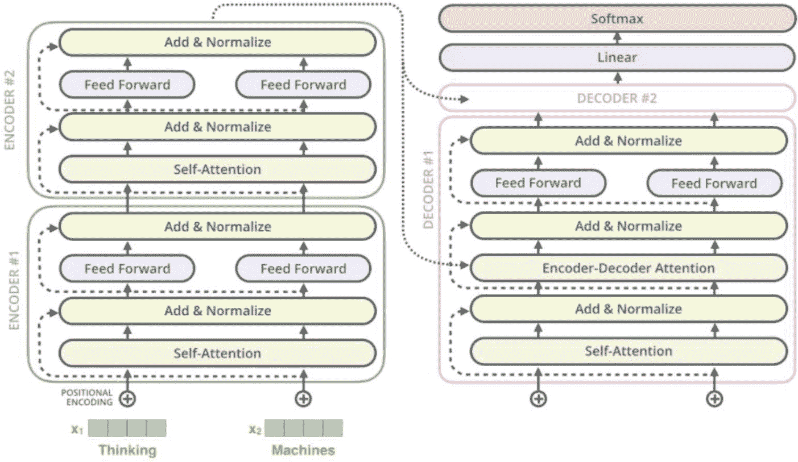

图 5-16 Transformer 编码器-解码器架构（来源：Jay Alamar 的博客）

T5 的预训练策略采用了多任务学习方法，将任务分为无监督学习和监督学习两类。无监督任务涉及在 C4 数据集上进行训练，重点是最小化似然目标；而监督任务则涵盖一系列 NLP 应用，所有这些任务都被重新格式化为编码器-解码器模型所必需的“文本输入，文本输出”范式。这种方法的多样性，以及用于格式化文本序列的特殊标记的引入，促进了模型的灵活训练。

对无监督训练目标的探索凸显了不同策略的有效性，其中 BERT 风格的掩码方法表现更优。这涉及掩码文本中的特定单词或片段供模型预测，通过实验不同的破坏率和片段长度来优化性能。

## Cohere

Cohere 已成为自然语言处理（NLP）领域的杰出实体，自成立以来取得了显著进展。该组织致力于掌握语言理解，并因此创建了先进的语言模型。Cohere 的一个关键成就是集成了 Transformer 技术，增强了模型在分析文本和生成文本时对上下文和含义的敏锐感知能力。此外，Cohere 高度重视人工智能的道德部署，制定了全面的措施来对抗偏见并遵守道德原则，从而确保开发出既强大又合乎道德的 AI 工具。

Cohere 技术基础设施的核心在于采用了尖端的神经网络创新，特别是 Transformer 模型。这些模型擅长处理序列信息，把握单词内部及句子之间的复杂动态关系。通过运用注意力机制，Cohere 的模型能够在需要时巧妙地优先处理文本中的重要部分。这种对上下文和序列的细致关注赋予了 Cohere 卓越的能力，以解读语言的细微差别，包括其语气、风格和潜在含义。该架构在设计时考虑了可扩展性，能够轻松适应从简单的文本分类到复杂的问答框架等一系列语言任务。

Cohere 的模型以其有效性和可扩展性而闻名，即使在有限的计算条件下也能提供一致的结果。这些模型对于寻求定制化解决方案的企业尤其有利，该方案能够无缝融入其现有基础设施，而无需大量的计算能力。Cohere 在语言理解和生成方面的熟练程度使其成为自动化客户支持、情感分析和内容创作的绝佳工具。

在各个领域，Cohere 的 AI 模型都展现了其多功能性。例如，在客户支持方面，它为聊天机器人提供动力，这些机器人不仅能理解和处理用户查询，还能根据客户的情绪状态和过往互动来定制回复。在内容审核方面，Cohere 在高效筛选和管理用户生成内容以确保符合社区标准方面发挥着关键作用。此外，在教育技术领域，Cohere 的模型有助于根据个人偏好和学习速度定制学习材料，从而改变电子学习的格局。

## PaLM 2

语言模型彻底革新了自然语言处理领域，显著提升了人工智能理解和生成接近人类交流文本的能力。在这些创新发展中，Pathways 语言模型 2（`PaLM 2`）是一个突出的例子，它推进了语言理解和上下文感知处理的边界。

本指南将深入探讨 `PaLM 2`，审视其结构、功能以及它为实现无与伦比的语言掌握所采用的突破性方法。在其前身 `PaLM` 奠定的基础上，这一迭代引入了前沿方法论，彻底改变了自然语言理解的格局。

请随我们一同踏上旅程，揭示 `PaLM 2` 的复杂性，展望语言建模的未来方向。

### PaLM 2 的工作原理

理解 `PaLM 2` 的功能需要深入探究其基础技术和组件。以下是 `PaLM 2` 运作方式的分解说明。

#### 初始数据获取与准备

`PaLM 2` 首先从多种来源收集庞大且多样化的数据集，包括书籍、文章、网站和社交媒体，以覆盖广泛的语言使用场景。然后对这些数据进行细致的清洗和预处理，以去除无关内容和噪声，接着进行分词处理，将文本分解为可管理的单元和句子。这一步确保了数据的统一性，并准备好进行分析。

#### 利用 Transformer 架构

`PaLM 2` 的核心采用了开创性的 Transformer 架构，该架构通过引入自注意力机制彻底改变了 NLP。这些机制使模型能够评估单词在上下文中的重要性，从而增强其做出精确预测和加深语言理解的能力。该架构在训练和并行处理方面的效率使其成为管理像 `PaLM 2` 这样的大型语言模型的理想选择。

#### 广泛的预训练

预训练阶段涉及模型通过预测缺失单词、理解上下文以及在庞大数据集上生成连贯文本来进行学习。这种训练让 `PaLM 2` 熟悉各种语言模式和细微差别，逐步磨练其语言表征技能。

#### 特定任务的微调

虽然通用预训练提供了广泛的语言基础，但微调通过在特定领域的数据集上训练，使 `PaLM 2` 能够针对特定应用进行定制。这个过程使模型能够将其广泛的语言理解能力有效地应用于特定的现实世界任务。

#### 新颖的 Pathways 架构

使 `PaLM 2` 与众不同的是其独特的 Pathways 架构，该架构具有多个独立的路径来处理不同的语言元素。这种设计允许对语言的各个方面进行专门关注，从而增强模型的整体理解能力。

#### 独立路径运作

每条路径都自主运行，专注于特定的语言特征，而不会相互干扰。这种独立性允许进行专门的处理，例如句法分析或语义理解，从而实现对文本更丰富的解读。

#### 自适应计算资源分配

`PaLM 2` 根据输入的复杂性动态调整其计算资源分配，确保对简单和复杂查询都能进行高效且准确的处理。

### 路径交互与协作

尽管彼此独立，`PaLM 2` 中的路径被设计为可以交互并共享信息，通过利用每条路径的优势来促进对语言的全面理解。

#### 选择性路径参与

接收到输入后，`PaLM 2` 会评估并选择最合适的路径进行处理，从而优化其响应的准确性和与当前特定语言挑战的相关性。

#### 生成输出

处理完成后，`PaLM 2` 会生成针对其微调任务量身定制的输出，展示了其在各种语言处理应用中的多功能性。

`PaLM 2` 标志着人工智能领域的一次巨大飞跃，开启了复杂语言理解和生成的新纪元。通过融合先进技术和多层面架构，`PaLM 2` 在适应性和泛化能力方面表现出色，成为解决复杂语言任务的强大工具。

凭借其对上下文和细微表达的深刻把握，`PaLM 2` 有望实现更自然、更类人的 AI 系统交互，提升各种应用中的用户体验。展望未来，`PaLM 2` 对对话代理、机器翻译和文本摘要发展的影响无疑将是深远的，标志着 AI 技术演进中的一个重要里程碑。

## Jurassic-2

AI21 的 `Jurassic-2` 语言模型有三种变体——`Jumbo`、`Grande` 和 `Large`——每种都有不同的价格等级。模型大小的具体细节保密；然而，文档强调 `Jumbo` 版本是最强大的选择。这些模型被描述为多功能，在所有类型的生成任务中都表现出色。`Jurassic-2` 模型精通七种语言，并允许使用特定数据集进行微调。用户可以通过 AI21 平台获取 API 密钥，并利用 `AI21()` 类来访问模型。

`J2` 模型是使用庞大的文本内容数据库开发的，使其具备生成高度模仿人类写作的文本的能力。它们在广泛复杂活动中表现出色，包括但不限于回答问题、文本分类等。

通过使用提示工程，这些模型几乎可以适应任何涉及语言的任务。这涉及设计一个概述手头任务并可能包含示例的提示。它们对于创建广告内容、驱动对话代理以及增强创意写作工作特别有益。

虽然尝试不同的提示可以为您的特定需求带来满意的结果，但优化性能并扩展应用程序的能力可能需要训练一个定制模型。

## Claude v1

`Claude v1` 是 Anthropic 首次发布其对话式 AI 助手的版本，标志着该公司在创造安全的人工通用智能征程中的一项重大成就。Anthropic 由 Dario Amodei 和 Daniela Amodei 于 2021 年创立，此前他们在 OpenAI 专注于 AI 安全，是一家总部位于旧金山的 AI 安全初创公司。该组织致力于打造有益、无害且真实的人工智能技术，强调通过以安全和伦理为先的研究方法，使 AI 发展与人类价值观保持一致的重要性。

2022 年 4 月，经过一年多的秘密开发，Anthropic 向公众推出了 `Claude v1`。此次发布旨在展示该公司致力于提供安全有效的对话式 AI 工具的承诺。`Claude` 被设计为能够进行自然对话，同时避免产生有害、不道德或虚假的交流。

### 数据与训练方法

`Claude v1`的训练基础是一种名为`Constitutional AI`的方法，该方法利用了大量多样化的自然对话数据集，这些对话体现了各种角色和沟通风格，并有意排除了任何有害内容。`Anthropic`开发了一种名为`Vigilance`的独特训练方法，旨在将安全机制嵌入`Claude`中，通过社会学习和评估反馈，鼓励系统学习并遵守社会规范和伦理准则。

`Claude`的初始训练采用了监督学习方法，以优化模型生成有益且无害响应的能力。同时辅以自监督学习，以增强`Claude`更广泛的对话能力。

### 模型设计

`Anthropic`为`Claude v1`定制了一种基于 Transformer 技术的神经网络结构，该技术常用于自然语言处理任务。虽然`Claude v1`模型的具体规模属于专有信息，但其数十亿的参数使其能够处理涵盖众多主题的广泛讨论。

通过将`Constitutional AI`和`Vigilance`等安全措施融入其架构，`Claude v1`被设计用于避免不安全的交互。其主要功能包括进行自然对话、提供有价值的帮助、避免生成有害内容、保持诚实、提供个性化体验，以及具备持续改进的能力。

### Claude v1 的局限性

尽管取得了进步，`Claude v1`仍面临一些限制：

- 它仅依赖训练数据获取知识，这限制了对许多主题的理解。

- 它偶尔会产生不准确或不相关的回复。

- 其专长仅限于对话任务，缺乏数据分析或复杂问题解决的能力。

- `Claude v1`仅作为纯文本界面运行，无法直接与物理世界交互或处理语音。

## Falcon 40B

`Falcon 40B`是`Falcon`系列大型语言模型（`LLMs`）的一员，由技术创新研究院（`TII`）开发。该系列还包括`Falcon 7B`和`Falcon 180B`等模型。具体来说，`Falcon 40B`是一个因果解码器专用模型，专为各种自然语言处理任务而设计。

该模型支持多语言，涵盖英语、德语、西班牙语和法语，并对意大利语、葡萄牙语、波兰语、荷兰语、罗马尼亚语、捷克语和瑞典语等其他语言具备部分处理能力。

### 模型设计

`Falcon 40B`的设计（图 5-17）借鉴了`GPT-3`架构，但进行了显著增强以提升性能。它引入了旋转位置嵌入来改善对序列的理解。该模型还受益于先进的注意力机制，包括多查询注意力和`Flash Attention`，以及一个将并行注意力与多层感知机（`MLP`）结构相结合的解码器架构，所有这些都在双层归一化框架下进行，以优化计算效率。

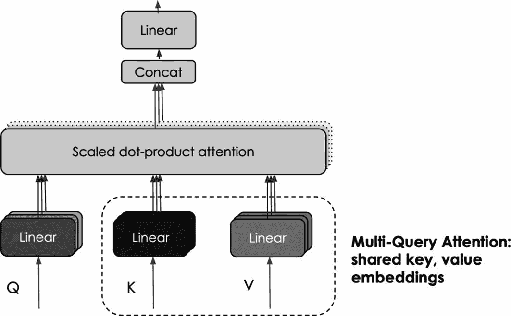

图 5-17 多查询注意力机制（来源：Falcon 博客）

### 训练数据

`Falcon 40B`的训练使用了超过 1 万亿个 token，这些 token 来自`RefinedWeb`（一个经过精心过滤以确保数据质量的网络语料库）以及其他精心挑选的数据集。`TII`通过广泛的去重和严格的过滤流程，专注于提升数据质量，确保使用优质数据集，这极大地促进了`Falcon`模型的卓越性能。

### 训练过程

`Falcon 40B`的训练利用了配备 384 块`A100 40GB GPU`的`AWS SageMaker`，采用了 3D 并行方法（`张量并行度=8`，`流水线并行度=4`，`数据并行度=12`），并与`ZeRO`优化协同工作。训练于 2022 年 12 月开始，历时两个月完成。

对于有兴趣使用`PyTorch`训练大型语言模型的爱好者和开发者，有一份全面的指南可供参考，该指南涵盖了从设置到执行的整个过程。

### 多查询注意力机制

`Falcon 40B`引入了多查询注意力机制，这与传统的多头注意力方法有所不同。在此机制中，所有注意力头共享一个键值对。这种策略虽然不会显著改变预训练结果，但能极大地提升模型在推理过程中的可扩展性。

### 用于增强性能的指令版本

除了标准模型外，`TII`还发布了指令变体，例如`Falcon-7B-Instruct`和`Falcon-40B-Instruct`。这些版本使用指令和对话数据进行了微调，优化了它们执行助手类任务的能力，并确保了性能的提升。

### 用户可访问性

尽管`Falcon 40B`需要大量的 GPU 资源，但通过量化等技术，它可以在性能较低的 GPU 上运行。对于资源有限的用户，较小的`Falcon 7B`模型是一个替代选择，可以在`Google Colab`等平台中使用。

## LLaMA

# Meta AI 与 LLaMA 系列

Meta AI 于 2023 年 2 月启动了 LLaMA（Large Language Model Meta AI）项目，推出了一系列自回归大型语言模型（LLM），标志着该领域的重大进步。初始版本发布了多种复杂程度的模型，包括拥有 7、13、33 和 650 亿参数的版本。

令人印象深刻的是，拥有 130 亿参数的版本在众多 NLP 基准测试中超越了规模大得多的 GPT-3（拥有 1750 亿参数），而最大的 LLaMA 模型在与 PaLM 和 Chinchilla 等领先模型的竞争中表现出了具有竞争力的结果。^(⁴⁵) 与以往通常通过受限 API 提供的高容量 LLM 不同，Meta 采取了前所未有的举措，在非商业许可下向研究人员开放 LLaMA 的模型，尽管模型权重在发布后不久就在网上泄露了。

2023 年 7 月，Meta 与微软合作，进一步扩展了其 LLaMA 产品线，推出了 LLaMA 2。这一代新模型包括 7、13 和 700 亿参数的版本，^(⁴⁶) 尽管架构基础与第一版相似，但用于训练的数据增加了 40%。Meta 的策略不仅包括发布基础模型，还包括发布针对对话进行微调的版本，称为 LLaMA-2 Chat，这些版本可用于广泛的商业用途，尽管某些限制引发了关于其开源状态的争论。

2023 年 11 月，Patronus AI 在一项专门测试中将 LLaMA 2 与 GPT-4 和 Anthropic 的 Claude 2 等其他知名 AI 模型进行了比较，揭示了它们在处理和解释复杂金融文档方面的优势和劣势。

利用 Transformer 架构，LLaMA 融入了独特的功能，例如 SwiGLU 激活函数、^(⁴⁷) 旋转位置嵌入、^(⁴⁸) 和均方根层归一化，^(⁴⁹) 以增强其性能，而不是使用标准的层归一化。LLaMA 2 系列进一步提升了其上下文长度能力，突显了 Meta 不断推动 LLM 效率和有效性的努力。

这些模型的训练优先考虑增加数据量而非参数数量，LLaMA 1 模型在包含来自不同公共来源的 1.4 万亿个 token 的数据集上进行训练。LLaMA 2 模型受益于更大的数据集，该数据集经过精心策划以增强可靠性并最大程度地减少隐私问题，同时通过创新的训练方法进行专门的微调以优化对话交互并确保 AI 对齐。

从 LLaMA 到 LLaMA 2 的演变不仅展示了 Meta 对推进 AI 技术的承诺，也强调了其让强大的 LLM 更易于访问并适用于各种用途的意图，为语言模型的开发和部署树立了新标准。

## LaMDA

LaMDA 由 Google 在 2020 年作为 Meena 的下一代产品推出，于 2021 年的 Google I/O 主题演讲中首次亮相，其进展在随后的年份中得以揭示。这种对话式 AI 模型以其能够进行无限制对话的能力而著称。

LaMDA 的开发涉及全面而详细的训练流程，利用了包含超过 1.56 万亿个单词的庞大文档、对话和口头交流集合。这个庞大的数据集促进了 LaMDA 对多样化对话动态的理解。

人类评估员对于完善 LaMDA 的性能至关重要，他们评估模型的输出。这些评估基于搜索引擎验证，有助于提高 LaMDA 的精确性和信息准确性。这些评估基于回复的有用性、准确性和对事实的遵循程度。

LaMDA 的优势源于其能够生成不限于特定任务的自发对话。它擅长识别和适应各种用户意图，应用强化学习技术，并在看似无关的主题之间流畅切换。

LaMDA 建立在 Google 的 BERT 和 Transformer 模型之上，特别侧重于对话驱动的任务。它通过训练来自真实交互的多样化对话数据（包括文本和音频记录），与依赖书面文本的传统 NLP 模型区分开来。

LaMDA 的一个突出特点是其擅长生成针对开放式问题上下文的回复。它能理解用户问题的潜在意图，并生成反映当前对话上下文的回复。例如，LaMDA 可以通过考虑用户过去的交互和偏好以及更广泛的对话上下文，来定制关于某部特定电影的回复。

除了对话系统，Google 还设想 LaMDA 的实用性扩展到搜索和信息检索领域，有望提供更相关、更具上下文感知的结果。

LaMDA 标志着对话式 AI 的一次飞跃，有望显著提升人机交互质量。然而，它也引发了关于隐私和潜在意外后果的担忧，强调了对其开发和应用的警惕性监督的必要性。

LaMDA 采用基于 Transformer 的架构，专为对话建模而设计，包含用于输入处理的编码器和用于回复生成的解码器。编码器利用自注意力层来理解文本关系，捕捉即时和整体的对话上下文。解码器根据输入，通过一个额外的注意力机制（专注于相关的输入文本片段）来生成特定于上下文的回复。

通过融入多轮对话处理和命名实体识别等功能，LaMDA 旨在实现更丰富、更相关的对话交互。其架构促进了细微差别的对话，为对话式 AI 树立了新标准。

Google 在 2022 年的开发者大会上宣布了 LaMDA 2，展示了该 AI 系统的增强版本。LaMDA 2 在大量对话数据上进行了训练，有望实现更自然、更准确、更安全的对话。演示突出了其创造性和切题的回复能力，以及“List It”功能，该功能可将复杂主题分解为可操作的见解。

Google 还推出了 Bard，一个实验性的 AI 聊天服务，通过直接从互联网获取数据来区别于竞争对手，承诺提供新鲜、高质量的答案。Bard 基于 Transformer 架构，采用了 LaMDA 的精简版本，旨在实现广泛的可访问性，同时利用互联网数据生成回复。

## Guanaco-65B

`Guanaco`，一个大型语言模型（LLM），采用了一种名为 `LoRA` 的微调技术，由华盛顿大学自然语言处理组的 `Tim Dettmers` 及其同事创建。该方法利用 `QLoRA`，能够在 48GB GPU 上微调多达 650 亿参数的模型，且性能与 16 位模型相当，无退化。

`Guanaco` 系列模型在 `Vicuna` 基准测试中超越了所有先前模型的性能。然而，由于其基于 `LLaMA` 模型家族，其在商业环境中的使用受到限制。

`QLoRA` 是一种突破性的微调技术，旨在显著降低内存需求，使得在单个 48GB GPU 上微调多达 650 亿参数的模型成为可能，同时不牺牲 16 位微调任务的质量。该方法创新性地将梯度反向传播通过一个静态量化的 4 位预训练语言模型，导向低秩适配器（`LoRA`）。

名为 `Guanaco` 的顶级模型套件树立了新标准，在 `Vicuna` 基准测试中超越了所有先前可用的模型，仅通过在单个 GPU 上微调 24 小时就达到了 `ChatGPT` 性能的 99.3%。`QLoRA` 的内存效率通过几项关键创新实现：引入了 `4-bit NormalFloat`（`NF4`），一种针对正态分布权重的最优高效数据类型；`Double Quantization`，通过量化量化常数进一步降低内存需求；以及 `Paged Optimizers`，旨在平滑内存使用峰值。

## Orca

微软研究院发布了 `Orca 2`，这是 `LLaMA 2` 语言模型的进阶版本，其性能与参数数量十倍于它的模型相当甚至更优。这一效率飞跃归功于一种新颖的训练方法，涉及合成数据集和一种称为 `Prompt Erasure` 的技术。

在 `Orca 2` 的开发中，采用了教师-学生学习框架，其中更大、更熟练的语言模型（教师）引导更小、更简单的模型（学生）达到与显著更大的模型相媲美的性能水平。

这种方法允许较小的模型学习各种推理策略，并为任何给定问题选择最合适的策略。教师模型使用复杂提示来引发特定的推理行为，但通过 `Prompt Erasure`，这些提示不会传递给学生模型。相反，学生模型仅接收任务规范和预期结果。

这种方法使得一个 130 亿参数的 `Orca 2` 模型在基准测试中比同等规模的 `LLaMA 2` 模型高出 47.54%。此外，70 亿参数版本的 `Orca 2` 在推理任务中表现“优于或相当于”700 亿参数的 `LLaMA 2`。

## StableLM

`Stability AI` 推出了 `StableLM`，标志着在机器学习领域增强语言理解方面迈出了重要一步。此次发布包含两个版本的 `StableLM`，一个配备 30 亿参数，另一个配备 70 亿参数。

`StableLM` 的 alpha 版本邀请用户探索和评估模型性能，提供有助于完善其能力的见解。`Stability AI` 正准备推出另外两个模型，分别拥有 150 亿和 650 亿参数，以进一步推动语言处理能力的边界。

`StableLM` 作为一个自回归模型运行，擅长识别语言模式并根据提供的输入生成响应。它包含一个可靠预测后续标记的基础模型，以及一个经过微调以遵循明确指令的更专门化模型。此微调过程利用了多种数据集，如 `Alpaca`、`GPT4All`、`Dolly` 和 `HH`，增强了模型在提供定制化响应和指令方面的能力。

`StableLM` 的设计使其能够适应各种上下文和语言风格，使其成为广泛语言处理和生成任务的灵活工具。

`Stability AI` 推出的 `StableLM` 因其对自然语言处理领域的贡献而值得关注，特别是由于该模型透明的架构和训练方法。这种开放性使其与竞争模型区分开来，鼓励开发和创新社区扩展和完善 `Stability AI` 的产品，从而促进该领域的协作进步。

此外，`Stability AI` 致力于拓宽语言模型的可访问性。通过创建能够在消费级硬件（如智能手机和个人电脑）上运行的模型，`Stability AI` 正在使先进的语言处理工具民主化。这一举措不仅拓宽了潜在应用的范围，还使个人和小型实体能够使用最先进的语言模型进行各种用途。

## Palmyra

`Palmyra Base` 的主要训练阶段侧重于英语文本，尽管其训练数据集中也包含来自 `Common Crawl` 的一小部分非英语内容。`Palmyra Base` 采用因果语言建模（CLM）策略进行预训练，与 `GPT-3` 等模型一致，其架构中仅包含解码器组件。这种以自监督因果语言建模为核心的训练方法，与 `GPT-3` 类似，包括使用类似的提示和实验框架进行评估。

`Palmyra Base` 以其卓越的速度和能力脱颖而出，在多种复杂任务中表现出色，包括情感分析和内容摘要。

模型 `Palmyra Base (5b)` 是使用 `Writer` 策划的专有数据集开发的。

`Palmyra Base` 旨在内化和表示英语，使其成为提取适用于一系列下游应用的特征的宝贵工具。然而，其主要优势在于基于提示的文本生成，这是其最初设计和训练的任务。

## GPT4All

`GPT4All` 是一款开创性的开源解决方案，旨在提升数字领域的可访问性和隐私性。它专为那些寻求功能强大、注重隐私、可在本地机器上运行且无需复杂硬件或互联网连接的聊天机器人而设计，`GPT4All` 兼具性能与隐私保护。

**`GPT4All` 的主要特性如下：**

- **本地化与免费运行：** 在本地设备上运行，无需互联网连接。

- **兼容消费级硬件：** 专为标准 CPU 高效运行而设计，`GPT4All` 无需高端 GPU 即可使用，但要求 CPU 支持 `AVX` 或 `AVX2` 指令集。

- **性能优化：** 能够在笔记本电脑和台式机等日常计算设备上处理参数规模从 30 亿到 130 亿的语言模型。

- **模型体积小巧：** 模型大小在 3GB 到 8GB 之间，简化了下载和集成过程。

**生态系统组件**

- **`GPT4All` 后端：** `GPT4All` 的核心，包含一个经过通用优化的 C API，专为运行大型 Transformer 解码器模型而设计。该 API 可适配其他语言，如 C++、Python 和 Go 等。

- **`GPT4All` 绑定：** 封装了编程语言绑定，包括命令行界面 (CLI)。

- **`GPT4All` API：** 目前正在开发中，该组件将引入 REST API 端点，以便于获取语言模型的补全和嵌入结果。

- **`GPT4All` 聊天：** 一款跨平台应用程序，适用于 macOS、Windows 和 Linux 用户，提供聊天功能，并通过 `LocalDocs` 等插件与本地文档交互，增强了隐私和安全性。

- **`GPT4All` 数据集：** 由 `Nomic AI` 牵头，该项目提供 `Atlas` 平台，用于简化训练数据集的管理和整理。

- **`GPT4All` 开源数据湖：** 鼓励社区以注重隐私的方式共享助手调优数据，参与改进 `GPT4All` 模型，其中用户同意至关重要。

**`GPT4All` 的优势在于其支持多种模型架构，包括：**

- EleutherAI 的 `GPT-J`

- Meta 的 `LLaMA`

- Mosaic ML 的 `MPT`

- `Replit`

- TII 的 `Falcon`

- BigCode 的 `StarCoder`

这些模型会定期更新，以确保提供最佳性能和质量，其中 `GPT-J` 和 `MPT` 模型与 `LLaMA` 相比表现尤为出色，而 `MPT` 模型的持续创新预示着未来令人兴奋的增强功能。

`GPT4All` 项目由 `Nomic AI` 开发和维护，它证明了高质量、安全且本地运行的聊天机器人解决方案的潜力，为个人和专业用途提供了跨多种模型架构的通用性。

## 总结

本章概述了大型语言模型 (LLM) 架构的组成部分，这些组件对于将原始文本数据转换为有意义的、感知上下文的输出至关重要。首先介绍了嵌入层，它通过一个可适应的嵌入矩阵将词元转换为连续的向量表示。

接下来介绍了前馈神经网络 (FFN)，强调了它们通过加权求和和激活函数处理输入数据以识别复杂模式的作用。还讨论了循环层，强调了它们通过维护隐藏状态并考虑先前单词的上下文来处理序列数据的重要性。

本章还涵盖了注意力机制，例如自注意力和多头注意力，这对于关注输入文本的相关部分至关重要。Transformer 利用这些机制来高效处理大量文本。此外，还讨论了激活函数和归一化技术，以增强神经网络性能和训练稳定性。

**在下一章中，我们将探索 Python 生态系统中大型语言模型的多样且具有影响力的应用，例如：**

- **文本生成：** 讨论为各种内容创作需求生成类似人类文本的方法和重要性

- **语言翻译：** 重点介绍使用 LLM 进行多语言文本翻译的进展和技术

- **文档摘要：** 涵盖将冗长文档压缩为简洁摘要同时保留关键信息的方法

- **聊天机器人与虚拟助手：** 解释为客服和其他用途构建和部署复杂的 AI 驱动聊天机器人

- **实际应用：** 包括客户服务自动化、高效文档搜索和知识管理等用例

脚注 1 2 3 4 5 6 7 8 9 10 11