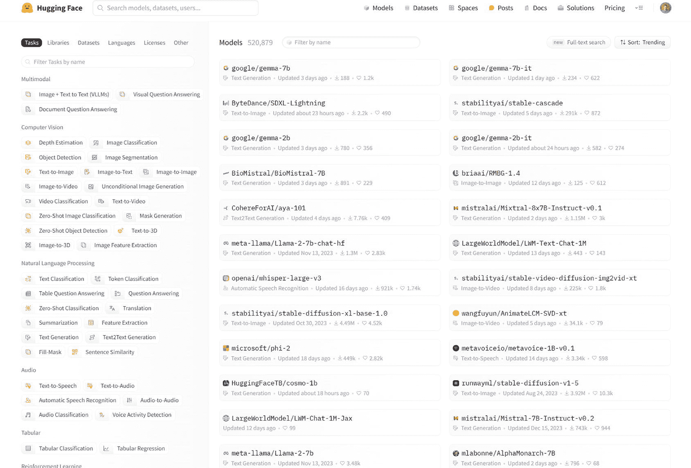

# 7. 利用 Python 3.11 和 Python 库进行大语言模型开发

在不断发展的人工智能领域，大语言模型已成为从自然语言处理到复杂人工智能驱动解决方案等多种应用的强大工具。Python 3.11 的出现带来了许多新特性和优化，显著增强了这些复杂模型的开发。结合一系列强大的 Python 库，本章深入探讨了如何有效利用 Python 3.11，借助 `LangChain`、`Hugging Face`、`Pinecone`、`OpenAI`、`Cohere` 和 `Lamini.ai` 等平台，开发基于大语言模型的应用。

我们探讨了各种类型的数据源以及数据收集策略的重要性。接着，我们将指导您完成数据清洗、标准化和转换的过程，强调每一步在消除噪声和提高数据质量方面的重要性。我们将特别关注分词和嵌入技术，这些技术对于将文本数据转换为大语言模型可以有效处理和理解的形式至关重要。

## LangChain

`LangChain` 是一个公共开源平台，旨在赋能从事人工智能和机器学习领域的开发者。它促进了大型语言模型与各种外部系统的集成，从而能够创建由大语言模型驱动的应用。`LangChain` 的主要目标是在强大的大语言模型（如 OpenAI 的 GPT-3.5 和 GPT-4、`Cohere`）与多个外部数据源之间建立连接。这种集成旨在增强自然语言处理应用的开发和利用。

该框架面向精通 Python、JavaScript 或 TypeScript 的开发者、软件工程师和数据科学家，提供这些语言的软件包。`LangChain` 由 Harrison Chase 和 Ankush Gola 于 2022 年作为公共开源项目发起，其第一个版本也在同年发布。

`LangChain` 的重要性在于它能够简化生成式人工智能应用的创建过程。它通过组织和使大量数据易于访问，为开发者提供了一条构建复杂自然语言处理应用的简化途径。这对于需要处理和访问海量数据集的大语言模型尤其有益。

### LangChain 特性

`LangChain` 包含一套旨在增强自然语言处理应用开发和功能的组件：

- **模型交互：** 这一方面，也称为模型输入/输出，促进了与任何语言模型的交互。它负责管理向模型输入数据以及解释输出数据。

- **数据连接与检索：** 此功能允许对大语言模型可访问的数据进行转换、存储和检索。数据可以存储在数据库中，并通过查询获取。

- **链：** 为了创建复杂的应用，`LangChain` 能够集成各种组件或多个大语言模型。此过程创建了所谓的 LLM 链，连接不同的模型和工具。

- **代理：** 通过代理模块，大语言模型可以确定解决问题的最佳行动方案。这是通过向大语言模型和其他资源发送一系列指令来实现的，引导它们完成特定请求。

- **记忆：** 此组件帮助大语言模型保留用户交互的上下文。它允许根据应用需求整合短期和长期记忆。

### LangChain 有哪些集成？

`LangChain` 还通过与 LLM 提供商和外部数据源的集成来支持应用。它可以通过合并来自 `Hugging Face`、`Cohere` 和 `OpenAI` 等实体的大语言模型与 `Apify Actors`、`Google Search` 和 `Wikipedia` 等数据存储库，来创建聊天机器人或问答系统。这种融合允许应用处理用户查询，并从这些平台获取最佳响应。

此外，`LangChain` 可以与云存储服务（如 Amazon Web Services、Google Cloud 和 Microsoft Azure）以及用于存储和查询高维数据的向量数据库（如 `Pinecone`）集成。这些集成利用尖端的自然语言处理技术来打造高效且有效的应用。

### 如何在 LangChain 中构建应用？

使用 `LangChain` 创建应用涉及利用语言模型的能力来构建定制化应用。

开发过程通常遵循几个基本步骤：

1.  **定义应用目的：** 首先，开发者需要确定应用的具体功能和范围。这包括确定将使用的必要集成、组件和语言模型。

2.  **开发应用逻辑：** 使用提示词，开发者可以构建应用将遵循的逻辑或功能。

3.  **功能定制：** `LangChain` 为开发者提供了调整和修改其代码的灵活性，从而能够创建满足应用特定需求的定制功能。

4.  **优化语言模型：** 为任务选择合适的语言模型，并根据应用的具体需求对其进行调优，对于获得最佳性能至关重要。

5.  **数据准备：** 通过清洗技术确保数据的清洁和准确性至关重要，同时还要实施安全协议以保护敏感信息。

6.  **持续测试：** 为保持应用的效率和可靠性，需要进行持续的测试。

这种方法能够开发出利用语言模型能力来满足多样化和特定用例的健壮应用。

### LangChain 的应用场景

LangChain 在利用大型语言模型（LLM）方面的能力，为众多行业和领域解锁了广泛的高级应用。以下是一些示例和应用场景：

- **客户支持聊天机器人：** LangChain 有助于创建能够处理复杂咨询甚至执行交易的先进聊天机器人。这些机器人旨在理解和记住用户对话的上下文，类似于 ChatGPT 的运作方式，从而提升客户服务与体验。

- **编程助手：** 利用 LangChain，结合 OpenAI 等平台的 API，可以开发出帮助软件开发者和技术专业人士提升编码能力、提高生产力的工具。

- **医疗健康创新：** 在医疗领域，基于 LangChain 构建的应用正在革新诊断方式，并简化预约安排等行政任务。这种自动化让医疗专业人员能够将更多时间投入到关键的患者护理中。

- **营销与电商工具：** 由 LLM 驱动的应用通过理解消费者行为、购买模式和产品细节，正在改变电商和营销领域。这使得生成个性化产品推荐和引人入胜的产品描述成为可能，帮助企业吸引并留住客户。

这些示例凸显了 LangChain 在创建解决方案方面的多功能性，这些方案能够满足从改善客户互动到支持医疗保健提供者、再到增强电商策略等广泛领域的复杂需求。

### LangChain 应用示例 – 文章摘要生成器

**工作流程**

- **安装必要包：** 首先安装所需的包：`requests`、`newspaper3k` 和 `langchain`。

- **数据收集：** 使用 `requests` 包从特定文章 URL 获取内容。

- **提取信息：** 利用 `newspaper` 包解析收集到的 HTML，提取文章标题和正文。

- **预处理文本：** 清理并结构化提取的内容，为输入到 ChatGPT 做准备。

- **生成摘要：** 使用 ChatGPT 生成文章内容的简洁摘要。

- **显示结果：** 将摘要与原始标题一同呈现，快速了解每篇文章的要点。

这个利用 ChatGPT 的应用，能让你借助 AI 摘要功能快速掌握文章的关键信息。它旨在让你无需花费大量时间阅读全文即可保持信息灵通，展示了 AI 在提升信息消费效率方面的实用性。

首先，获取你的 OpenAI API 密钥，这是使用摘要生成器的前提。这需要在 OpenAI 网站上创建一个账户并获取 API 访问权限。账户设置完成后，找到 API 密钥部分以获取你的密钥。

通过执行以下命令确保安装必要的库：`pip install langchain==0.1.4 deeplake openai==1.10.0 tiktoken`。同时，安装 `newspaper3k` 库也很重要，特别是版本 `0.2.8`，因为本教程已验证该版本的兼容性。

在你的 Python 脚本或笔记本中，将你的 API 密钥分配给名为 `OPENAI_API_KEY` 的环境变量。要使用 `.env` 文件实现此操作，请使用 `load_dotenv` 函数。

**在以下应用中：**

1.  你需要选择一篇文章的 URL 来创建摘要。将其添加到值为 `YOUR-URL` 的变量中。

2.  随后的脚本利用 `requests` 库和自定义的 `User-Agent` 头从一组 URL 中获取文章。

3.  接着，它使用 `newspaper` 库分离每篇文章的标题和内容。

4.  你需要使用命令 `pip install python-dotenv` 安装 Python Dotenv。

5.  要生成 `.env` 文件，请使用终端进入你的项目目录，并按如下方式执行 `touch` 命令：`touch .env`。

6.  在那里以 `variable = OPEN_AI_KEY = Your API Key` 的形式添加你的 API 密钥。

7.  然后加载环境变量：

    ```
    from dotenv import load_dotenv
    load_dotenv()
    ```

**然后使用以下代码：**

```
import json
from dotenv import load_dotenv
load_dotenv()
import requests
from newspaper import Article
headers = {
'User-Agent': 'Mozilla/5.0 (Windows NT 10.0; Win64; x64) AppleWebKit/537.36 (KHTML, like Gecko) Chrome/89.0.4389.82 Safari/537.36'
}
article_url = "YOUR-URL"
session = requests.Session()
try:
response = session.get(article_url, headers=headers, timeout=10)
if response.status_code == 200:
article = Article(article_url)
article.download()
article.parse()
print(f"Title: {article.title}")
print(f"Text: {article.text}")
else:
print(f"Failed to fetch article at {article_url}")
except Exception as e:
print(f"Error occurred while fetching article at {article_url}: {e}")
```

**示例输出：**

```
Title: Meta claims its new AI supercomputer will set records
Text: Ryan is a senior editor at TechForge Media with over a decade of experience covering the latest technology and interviewing leading industry figures. He can often be sighted at tech conferences with a strong coffee in one hand and a laptop in the other. If it's geeky, he’s probably into it. Find him on Twitter (@Gadget_Ry) or Mastodon (@gadgetry@techhub.social)
Meta (formerly Facebook) has unveiled an AI supercomputer that it claims will be the world’s fastest.
```

## Hugging Face

虽然“Hugging Face”这个词可能会让许多人联想到一个友好的表情符号 ，但在技术社区中，它代表着更为重要的东西：一个类似于机器学习（ML）领域的“GitHub”的中心枢纽，致力于通过开源协作进行自然语言处理（NLP）和机器学习模型的协同开发、训练与部署。

Hugging Face 的突出特点在于它提供了**预训练模型**。这一关键创新意味着开发者不再需要从零开始启动项目；相反，他们可以利用这些现成的模型，根据自身特定需求进行调整，从而简化开发流程。

Hugging Face 是数据科学家、研究人员和机器学习工程师分享见解、寻求支持并为更广泛的开源运动做出贡献的重要聚集地。Hugging Face 将自己定位为“*构建未来的人工智能社区*”，其理念深深植根于社区驱动的进步。

该平台的快速扩张也归功于其用户友好的设计，无论是初学者还是经验丰富的专业人士都能轻松上手。通过努力积累最广泛的 NLP 和 ML 资源，Hugging Face 的使命是让 AI 技术大众化，使其广泛惠及全球用户。

### Hugging Face 的发展历程

Hugging Face 于 2016 年作为一家美法合资企业起步，最初专注于打造一款面向青少年的 AI 驱动聊天机器人。公司的转折点出现在它决定将聊天机器人的底层模型向全球开源，这一举措使其发展轨迹转向为 AI 领域提供强大且易于使用的工具。

2018 年发布的变革性 `Transformers` 库是 Hugging Face 发展史上的里程碑，它将 `BERT` 和 `GPT` 等预训练模型引入 AI 社区，这些模型迅速成为 NLP 任务的基础工具。

在随后的几年里，Hugging Face 深刻重塑了机器学习格局。其对开源协作的承诺激发了 NLP 领域的创新浪潮，培育了共同成长与技术进步的社区文化。

Hugging Face 已发展成为模型与数据集交换的核心枢纽，加速了 AI 领域的研究进展与实际应用。

### Hugging Face 的核心组件

Hugging Face 已成为自然语言处理（NLP）领域的基石，提供了一套满足多样化语言处理需求的工具和资源。以下是其核心组件与功能的概述。

#### Transformers 库

Hugging Face 的核心是 `Transformers` 库，这是一个专为 NLP 任务量身定制的尖端机器学习模型集合。该库包含大量预训练模型，适用于文本分析、内容生成、语言翻译和摘要创建等应用。`pipeline()` 方法的引入简化了将这些复杂模型应用于实际场景的过程，为各种 NLP 任务提供了直观的 API。该库对于普及先进 NLP 技术至关重要，使用户能够轻松定制和部署复杂的模型。

#### Hugging Face Hub

Hugging Face Hub 是一个动态的在线仓库，在撰写本书时，它拥有超过 35 万个模型、7.5 万个数据集和 15 万个演示应用（称为 Spaces）的惊人收藏，所有这些资源都是开源且免费访问的。该平台被设计为一个协作生态系统，使个人能够发现、实验、协作和开发机器学习技术。作为关键的聚集地，Hub 促进了机器学习项目的探索与创建，鼓励社区内的开放协作与创新。

Hugging Face Hub 采用基于 Git 的仓库来对所有相关文件进行版本控制管理。这包括以下内容：

- **模型：** 专为 NLP、视觉和音频处理任务量身定制的全面尖端模型集合

- **数据集：** 涵盖各种领域和类型的广泛数据集合，支持多样化的机器学习项目

- **Spaces：** 允许在网页浏览器中直接演示机器学习模型的交互式应用

此外，Hub 还配备了版本控制、提交历史、差异对比、分支以及与十多个库的集成等功能。如需深入了解这些功能，可查阅仓库文档。

#### 模型中心

作为社区的枢纽，模型中心（图 7-1）是用户探索和分享大量模型与数据集的地方。该功能促进了 NLP 开发的协作环境，使从业者能够贡献自己的模型，并从社区的集体智慧中受益。模型中心在 Hugging Face 网站上易于导航，提供多种筛选器帮助用户找到适合特定任务的模型。该中心对于培育一个动态、不断发展的生态系统至关重要，新模型在此定期添加和优化。



**图 7-1** 模型中心 - Hugging Face 可用模型

在超过 20 万个模型的庞大库中，你可以访问广泛的功能，包括以下内容：

- **自然语言处理（NLP）：** 涵盖语言翻译、内容摘要和文本生成等多种任务。这些能力构成了 OpenAI 的 GPT-3 通过 ChatGPT 提供的核心功能。

- **音频处理：** 你可以在此进行自动语音识别、检测说话（语音活动检测）或将文本转换为语音等操作。

- **计算机视觉：** 这些模型使计算机能够解释和理解来自世界的视觉信息。应用包括估计物体距离（深度估计）、图像分类以及图像到图像的转换。此类技术对于自动驾驶汽车等发展至关重要。

- **多模态模型：** 这些高级模型能够处理多种数据类型（文本、图像和音频）并生成输出。这种多功能性使其能够跨不同媒体实现广泛的应用。

#### 分词器

作为文本预处理的关键，分词器将语言分解为可管理的片段（即 token），机器学习模型随后使用这些 token 来理解和生成人类语言。这些 token 可以代表单词、子词或字符，对于将文本转换为机器可读格式至关重要。Hugging Face 的分词器针对与 `Transformers` 库的兼容性进行了优化，确保了对各种语言和文本格式的高效文本预处理。

#### 数据集库

Hub 拥有超过 5,000 个数据集的丰富集合，涵盖 100 多种语言，适用于 NLP、计算机视觉和音频分析等广泛的应用领域。它简化了发现、下载和贡献数据集的过程。为了提升用户体验，每个数据集都通过数据集卡片提供全面的文档，并配有交互式数据集预览，支持在浏览器中直接探索。

数据集库提供了一种编程方式来与这些数据集交互，使它们能够轻松集成到您的项目中。该库支持高效的数据处理，通过流式技术，即使数据集超出本地存储容量，也能访问其中最大的数据集。

## 示例应用

首先，在 Hugging Face 上注册一个账户，然后安装所需的软件包（请注意，这些软件包是所选模型所必需的，对于其他模型可能有所不同）。

代码首先使用`pip`安装必要的Python包。这些包包括`torch` (PyTorch)、`huggingface_hub`、`torch accelerate`、`torchaudio`、`datasets`、`transformers`和`pillow` (PIL – Python图像库)。这些包对于处理深度学习模型、数据集和图像处理至关重要。

```
!pip install torch
!pip install --upgrade huggingface_hub
!pip install torch accelerate torchaudio datasets
!pip install --upgrade transformers
!pip install git+https://github.com/huggingface/transformers.git
!pip install pillow
```

安装所需的软件包后，代码会从这些包中导入必要的模块和函数。关键导入包括用于与Hugging Face模型Hub交互的`huggingface_hub`、用于访问预训练模型的`transformers`、用于处理图像的`PIL.Image`、用于发起HTTP请求获取图像的`requests`、用于神经网络操作的`torch.nn`以及用于绘制图像的`matplotlib.pyplot`。

```
from transformers import SegformerImageProcessor, AutoModelForSemanticSegmentation
from PIL import Image
import requests
import matplotlib.pyplot as plt
import torch.nn as nn
```

**登录Hugging Face模型Hub：** 代码使用`login()`函数登录Hugging Face模型Hub。如果您计划使用Hugging Face平台上托管的私有模型或数据集，则需要执行此步骤。

```
from huggingface_hub import login
login()
```

**应用代码的后续步骤：**

- **初始化图像处理器和模型：** 它初始化一个图像处理器（`SegformerImageProcessor`）和一个语义分割模型（`AutoModelForSemanticSegmentation`）。这些模型使用指定的模型名称（`mattmdjaga/segformer_b2_clothes`）从Hugging Face模型Hub加载。这些模型在大型数据集上进行了预训练，可以针对语义分割等推理任务进行微调或直接使用。

- **获取图像：** 代码使用`requests`模块从指定的URL获取图像，并使用PIL的`Image.open()`函数打开它。

- **预处理图像：** 它使用初始化的图像处理器（`processor`）对获取的图像进行预处理。此步骤准备图像以输入到语义分割模型。

- **模型推理：** 预处理后的图像作为输入馈送到语义分割模型（`model`）以获得分割预测。`model()`函数返回logits，它表示模型在应用任何激活函数之前的原始预测。

- **上采样Logits：** 使用双线性插值将获得的logits上采样到原始图像大小。这确保了分割预测与原始图像的尺寸匹配。

- **提取分割掩码：** 代码通过对上采样后的logits沿通道维度执行argmax操作来提取预测的分割掩码。这会为每个像素识别出概率最高的类别，从而有效地生成分割掩码。

- **显示分割掩码：** 最后，使用`matplotlib.pyplot.imshow()`显示预测的分割掩码。这可视化了分割掩码，突出显示了原始图像中与衣物对应的区域。

```
processor = SegformerImageProcessor.from_pretrained("mattmdjaga/segformer_b2_clothes")
model = AutoModelForSemanticSegmentation.from_pretrained("mattmdjaga/segformer_b2_clothes")
url = "https://www.telegraph.co.uk/content/dam/luxury/2018/09/28/L1010137_trans_NvBQzQNjv4BqZgEkZX3M936N5BQK4Va8RWtT0gK_6EfZT336f62EI5U.JPG"
image = Image.open(requests.get(url, stream=True).raw)
inputs = processor(images=image, return_tensors="pt")
outputs = model(**inputs)
logits = outputs.logits.cpu()
upsampled_logits = nn.functional.interpolate(
logits,
size=image.size[::-1],
mode="bilinear",
align_corners=False,
)
pred_seg = upsampled_logits.argmax(dim=1)[0]
plt.imshow(pred_seg)
```

总之，该代码段演示了如何使用预训练的语义分割模型对从URL获取的图像中的衣物进行分割，并可视化分割结果。

# OpenAI API

OpenAI API是通往OpenAI开发的先进机器学习能力的网关，使您能够将最先进的AI功能无缝集成到您的应用程序中。本质上，此API充当一个管道，允许访问OpenAI的复杂算法，这些算法包括文本理解、生成甚至代码创建的能力，所有这些都无需深入了解驱动这些能力的模型的技术细节。

## OpenAI API的特性

本节深入探讨了使OpenAI API成为适用于广泛应用程序的多功能且强大工具的关键特性。此外，我们还将讨论其用户友好的集成选项、可自定义的设置和可扩展性，这些特性使其能够在各种平台和项目中无缝实施。

### 预训练模型

该API提供对各种预训练模型的访问，这些模型由OpenAI开发和优化。这些模型，包括GPT-4、GPT-3.5及其他版本，已准备好部署用于从文本和代码生成到图像创建和音频转录等任务。该集合还包括用于嵌入、内容审核等的专用模型，所有这些模型都在海量数据集上使用大量计算资源进行训练，使复杂的机器学习能够为更广泛的受众所用。

**关键模型包括以下内容：**

- **GPT-4和GPT-3.5：** 能够生成和理解文本和代码的高级模型

- **DALL-E：** 根据文本描述生成和修改图像

- **Whisper：** 将口语转换为文本

- **嵌入和审核模型：** 分别用于将文本转换为数值表示和识别敏感内容

### 通过微调进行定制

该API允许通过微调对预训练模型进行定制，使其更好地适应特定需求。此过程涉及在您自己的数据上重新训练模型，提高其在特定任务上的性能，这可以节省成本并提高针对性应用的效率。

### 用户友好的API接口

OpenAI API设计简洁，即使对于数据科学新手也易于访问，其提供直观的文档和示例，引导用户轻松地将AI集成到他们的项目中。

### 可扩展的基础设施

OpenAI API背后的基础设施，包括强大的Kubernetes集群，确保了可扩展性，以适应任何规模的项目。这种可扩展性对于支持大型模型的部署以及适应用户项目随时间推移的增长至关重要。

### OpenAI API的行业应用

OpenAI API的多功能性体现在其跨行业的广泛应用中：

-   **聊天机器人与虚拟助手：** 利用`GPT-4`等模型，该API能够驱动对话式代理，提供逼真且引人入胜的用户交互，适用于客户服务和互动应用。

-   **情感分析：** 通过分析客户反馈或社交媒体帖子等文本数据，该API能够提供关于公众情绪和客户满意度的宝贵见解。

-   **图像识别：** 借助`CLIP`等模型，该API将其能力扩展到视觉任务，实现物体检测和图像分类，在从零售到医疗保健等领域都有应用。

-   **文本比较：** OpenAI API提供了一项文本比较功能，该功能利用`text-embedding-ada-002`模型，这是一个先进的第二代嵌入模型。该模型通过将文本映射到向量空间并测量这些向量之间的距离，来评估文本片段之间的相似性或差异性。距离越大，文本被认为越不相似。此嵌入功能支持多种应用，包括文本聚类、识别文本间的差异和相关性、生成推荐、分析情感以及执行文本分类，其成本基于处理的文本量计算。虽然OpenAI的文档承认存在第一代嵌入模型，但它强调了最新模型卓越的效率和成本效益。然而，它也提醒用户注意，该模型可能对某些群体表现出社会偏见，这一点已在各种测试中被发现。

-   **代码补全：** 在代码开发方面，OpenAI API包含一项由OpenAI Codex驱动的代码补全服务。OpenAI Codex是一个先进的模型，在大量的自然语言语料库和来自公开来源的数十亿行代码上进行了训练。该服务目前处于有限的测试阶段，并且在撰写本文时是免费提供的，它支持多种编程语言。该服务依赖`code-davinci-002`和`code-cushman-001`等模型，以便根据用户提供的提示插入代码行或生成代码块。虽然`code-cushman-001`模型以其速度著称，但`code-davinci-002`模型因其全面的能力而脱颖而出，尤其是在代码自动补全方面。

-   **游戏与强化学习：** 该API支持开发能够在游戏环境中导航的AI，无论是自主游戏还是辅助人类玩家，展示了其在强化学习应用中的潜力。

-   **图像生成：** 这是OpenAI API最直观的功能之一。基于`DALL-E`图像模型，OpenAI API的图像功能提供了用于根据自然语言提示生成、编辑和创建图像变体的端点。虽然它还没有高级功能，但其输出比Midjourney和Stable Diffusion等生成式艺术模型更令人印象深刻。在调用图像生成端点时，您只需提供提示词、图像大小和图像数量。但图像编辑端点要求您除了其他参数外，还要包含您希望编辑的图像和一个标记编辑点的RGBA蒙版。另一方面，变体端点只需要目标图像、变体数量和输出尺寸。图像生成端点能够根据文本描述创建独特的视觉效果。使用`DALL-E 3`，这些图像可以生成为`1024x1024`、`1024x1792`或`1792x1024`像素的尺寸。

OpenAI API是将先进AI集成到众多项目中的强大工具，它使机器学习创新得以普及，并促进了智能、响应式和个性化技术的发展。

### 连接到OpenAI API的简单示例

该应用程序利用OpenAI平台生成指定人物的摘要传记。用户输入他们感兴趣的人名，应用程序向OpenAI的聊天API发送请求。该API使用`GPT-4`模型来理解用户的请求，并生成该人物传记的简洁摘要。然后，摘要传记会显示给用户，为他们提供该人物生平和成就的快速概览。

**示例应用：**

```
pip install openai
from openai import OpenAI
client = OpenAI(
api_key='YOUR API KEY'  # 这也是默认值，可以省略
)
person = input() # 输入您感兴趣的人名。
response = client.chat.completions.create(
model="gpt-4",
messages=[
{"role": "system", "content": "你是一个人物传记摘要生成器。"},
{"role": "user", "content": f"为我总结一下{person}的传记"},
]
)
print(response.choices[0].message.content)
```

**操作说明**

1.  **使用pip安装OpenAI包：**

    `pip install openai==1.35.7`

2.  **导入OpenAI模块：**

    `from openai import OpenAI`

3.  **使用您的API密钥设置OpenAI客户端：**

    ```
    client = OpenAI(
    api_key='YOUR API KEY'  # 这也是默认值，可以省略
    )
    ```

4.  **提示用户输入他们感兴趣的人名：**

    `person = input() # 输入您感兴趣的人名。`

5.  **向OpenAI的聊天API发送请求，以总结指定人物的传记：**

    ```
    response = client.chat.completions.create(
    model="gpt-4",
    messages=[
    {"role": "system", "content": "你是一个人物传记摘要生成器。"},
    {"role": "user", "content": f"为我总结一下{person}的传记"},
    ]
    )
    ```

    使用API密钥设置好OpenAI客户端后，Python脚本会向OpenAI的聊天API发送请求，以生成指定人物的传记摘要。

    **以下是该请求的详细说明：**

    -   **模型选择：** `model`参数设置为`"gpt-4"`，表示用于生成摘要的GPT（生成式预训练Transformer）模型版本。在此例中，指定为`"gpt-4"`。

    -   **消息：** `messages`参数是一个包含两个字典的列表，每个字典代表用户与系统之间对话中的一条消息。

        -   第一个字典代表来自系统的一条消息，`role`设置为`"system"`，`content`为`"你是一个人物传记摘要生成器。"`。此消息告知AI模型对话的上下文。

        -   第二个字典代表来自用户的一条消息，`role`设置为`"user"`，`content`使用f-string格式化动态生成。它提示AI总结指定人物的传记。人物的名字包含在消息的内容中。

    一旦请求发送到OpenAI API，响应将包含生成的摘要，然后使用`print`语句提取并打印该摘要。

6.  **打印摘要传记：**

    ```
    print(response.choices[0].message.content)
    ```

# Cohere

Cohere成立于2019年，总部横跨多伦多和旧金山，并在帕洛阿尔托和伦敦设有办事处，是一家专注于为企业提供人工智能解决方案的全球性科技企业，尤其致力于开发先进的大型语言模型。公司的创始人是`Aidan Gomez`、`Ivan Zhang`和`Nick Frosst`，他们都拥有多伦多大学的学术背景。

Cohere的根源可以追溯到2017年人工智能研究的一个变革性时刻。当时，Gomez作为Google Brain团队的成员，合著了开创性论文《注意力就是一切》，该论文引入了彻底改变自然语言处理任务的Transformer模型。这项开创性的工作为Gomez、Frosst和Zhang创立Cohere奠定了基础，他们此前曾在`FOR.ai`共事。

自成立以来，Gomez一直担任Cohere的首席执行官。公司在2022年底任命YouTube前首席财务官Martin Kon为总裁兼首席运营官，这标志着一个重要的里程碑。Cohere的技术进步获得了大力支持，包括2021年与Google Cloud建立战略合作伙伴关系，以利用Google的基础设施和TPU进行产品开发。

Cohere对创新的承诺在2022年6月成立的Cohere For AI中得到了进一步体现。这是一项非营利性研究计划，旨在在前`Google Brain`成员Sara Hooker的领导下推进开源机器学习研究。该公司还在语言处理方面取得了进展，开发了一个能够理解超过100种语言的多语言模型，这是使非英语语言处理更易普及的一项重大成就。

2023年，与Oracle、McKinsey和LivePerson的合作扩大了Cohere的业务范围，为企业提供生成式AI服务和定制语言模型，提高了各行业的自动化和运营效率。此外，Cohere积极践行合乎道德的AI实践，遵守白宫和加拿大为AI开发和管理制定的自愿措施。

作为OpenAI的竞争对手，Cohere的技术套件服务于寻求将AI应用于从聊天机器人和搜索引擎到内容审核和数据分析等各种场景的企业。该平台的API便于与主要云服务集成，确保了其多功能性和广泛的应用。

## Cohere模型

Cohere提供多种多样的模型，以满足广泛的需求。对于寻求更定制化解决方案的用户，可以选择自定义训练模型，使其精确符合特定要求。

### Command

Command模型是Cohere的主要生成工具，旨在解释和执行用户的文本命令或提示。该模型不仅能根据指令生成文本，还具备对话能力，非常适合驱动基于聊天的应用程序。

### Embed

Embed模型提供生成文本嵌入或根据一组标准对文本进行分类的功能。这些嵌入可用于多种任务，例如衡量句子之间的语义相似度、选择最可能接续另一个句子的句子，或将用户反馈分类。

此外，Embed模型中的Classify功能支持各种分类或分析任务。Representation模型通过额外的支持功能（包括输入的语言检测）增强了这些能力。

### Rerank

最后，Rerank模型旨在通过根据特定标准重新排序现有模型的结果，来优化和改进其输出。此功能对于提高搜索算法的效率特别有用。

#### 情感分析示例应用

在 Cohere 网站上注册并获取您的 API 密钥，然后在您的笔记本或终端中使用以下命令安装 Cohere SDK：`pip install cohere`，然后使用以下代码：

```python
import cohere
from cohere.responses.classify import Example
co = cohere.Client('GHviIR5p9NC7kNzRf383ykOxU2Y9LQVbSAvAdNSj')
examples=[
Example("Dermatologists don't like her!", "Spam"),
Example("'Hello, open to this?'", "Spam"),
Example("I need help please wire me $1000 right now", "Spam"),
Example("Nice to know you ;)", "Spam"),
Example("Please help me?", "Spam"),
Example("Your parcel will be delivered today", "Not spam"),
Example("Review changes to our Terms and Conditions", "Not spam"),
Example("Weekly sync notes", "Not spam"),
Example("'Re: Follow up from today's meeting'", "Not spam"),
Example("Pre-read for tomorrow", "Not spam"),
]
user_input = input()
inputs=[
user_input
]
response = co.classify(
model = 'large',
inputs=inputs,
examples=examples,
)
print(response.classifications)
```

**输出：**

```
Looking forward to your email
[Classification]
```

这段 Python 代码使用 `cohere` 库执行情感分析。以下是代码功能的分解说明：

1.  **导入必要的模块：**

    -   `cohere`：用于与 Cohere API 交互的主库。

    -   来自 `cohere.responses.classify` 的 `Example`：用于定义带有相应标签的示例输入，以训练模型。

2.  **创建一个 `cohere.Client` 对象：**

    -   创建一个客户端对象以与 Cohere API 交互。它需要一个 API 密钥进行身份验证。

3.  **定义一组带有相应标签的示例输入：**

    -   每个示例都是来自 `cohere.responses.classify` 模块的 `Example` 类的一个实例。

    -   这些示例用于训练分类模型。它们被标记为 `Spam` 或 `Not spam`。

4.  **提示用户输入：**

    -   `input()` 函数提示用户输入一些文本，这些文本将被分类为 `Spam` 或 `Not spam`。

5.  **创建一个包含用户输入的列表：**

    -   用户的输入存储在一个名为 `inputs` 的列表中。

6.  **使用 `co.classify()` 方法对用户输入进行分类：**

    -   `co.classify()` 方法接受几个参数：

    -   `model`：指定用于分类的模型。此处设置为 `large`。

    -   `inputs`：要分类的输入列表。在这种情况下，它只包含用户的输入。

    -   `examples`：用于训练模型的示例输入及其标签列表。

    -   此方法返回一个响应对象。

7.  **打印分类结果：**

    -   `response.classifications` 属性包含输入文本的分类结果。

    -   这将打印出分类结果，指示输入被归类为 `Spam` 还是 `Not spam`。

# Pinecone

在当今的数字时代，快速访问和存储各种信息形式至关重要，传统的关系数据库在处理文档、键值对和图等多样化数据类型方面存在不足。向量数据库时代应运而生，这是一种利用向量化技术实现增强搜索能力、高效存储和深度数据分析的前沿解决方案。

在这些创新的数据库中，Pinecone 作为领先的向量数据库脱颖而出，被广泛认为能够解决与复杂性和维度相关的问题。Pinecone 是一个为云环境设计的向量数据库，擅长管理高维向量数据。其核心是利用近似最近邻（ANN）搜索算法，在海量数据集中快速查找并排序最接近的匹配项。

本指南将深入探讨 Pinecone 的复杂性，重点介绍其主要特性、解决的问题以及实际应用。

### 向量数据库的运作方式

与传统数据库寻求与查询完全匹配不同，向量数据库旨在找到与查询最接近的向量匹配。通过利用 ANN 搜索，这些数据库能够快速高效地提供近乎准确的结果。

`Pinecone` 是一个托管在云端的向量数据库，专为机器学习项目而设计。如果“向量数据库”这个术语听起来很复杂，让我们进一步分解它。

以下是向量数据库运行机制的详细说明：

1.  **数据转换与索引：** 首先，数据被转换为向量，并创建索引以便快速搜索。

2.  **搜索与比较：** 数据库使用相似度度量将查询向量与索引向量进行比较，识别出最接近的匹配项。

3.  **结果优化：** 然后，基于相似度评估，对最相关的结果进行优化和呈现。

### 向量数据库究竟是什么？

向量数据库是专门设计用于管理向量嵌入（vector embeddings）的存储系统——这些是封装了文本信息的紧凑数字数组。在机器学习语境中，这些嵌入对于理解词义及其相互关系至关重要。通过对这些向量进行索引，数据库能够根据其相似性快速定位和检索项目，使其成为自然语言处理和人工智能技术应用中的强大工具。

### Pinecone 的特性

`Pinecone` 凭借一系列满足现代数据基础设施需求的功能而脱颖而出：

-   **快速且实时的向量搜索：** `Pinecone` 确保极低的查询延迟，能够高效处理数十亿个项目。其索引会持续更新，确保访问到最新数据。

-   **过滤搜索：** 它允许将向量搜索与元数据过滤器相结合，从而产生更精确、更快速的结果。

-   **动态数据更新：** 与需要全面重新索引的传统向量索引不同，`Pinecone` 支持即时数据修改。

-   **数据管理：** `Pinecone` 提供常规数据备份以及将特定索引保存为“集合”以备将来使用的选项。

-   **易用的 API：** 用户友好的 API 便于开发向量搜索应用程序，并兼容多种编程语言。

-   **成本效益：** 得益于其云原生架构，`Pinecone` 不仅高效，还提供按使用量付费的定价模式。

尽管有诸多优势，`Pinecone` 也面临如下挑战：

-   随着时间的推移，与其他系统的集成复杂性增加。

-   通过强大的安全机制确保数据隐私。

-   基于向量的模型的可解释性仍然是一个挑战，使得理解某些数据关系背后的原理变得困难。

### 实际应用

`Pinecone` 的实用性遍及众多领域：

-   **音频/文本搜索：** 为文本和音频数据提供高级搜索能力

-   **自然语言处理：** 促进 NLP 应用，包括文档分类和情感分析

-   **推荐系统：** 通过个性化推荐引擎提升用户体验

-   **图像和视频检索：** 加速识别相关图像和视频内容的过程

-   **时间序列分析：** 协助识别时间序列数据中的模式，助力推荐和数据聚类

`Pinecone` 代表了数据库技术的重大飞跃，提供了一个可扩展、高效且多功能的向量数据库解决方案。凭借其高性能的搜索功能和处理复杂向量数据的能力，`Pinecone` 成为寻求应对现代数据管理挑战的企业的强大工具。

**示例应用：**

首先，在 `Pinecone` 网站上注册并获取您的 API 密钥，然后使用以下命令安装 `Pinecone` 客户端：`pip install pinecone-client`。总的来说，以下代码片段演示了 `Pinecone` 的基本用法，包括创建索引、向其中添加向量，以及根据特定条件查询相似向量。

**使用以下代码：**

```python
from pinecone import Pinecone
pc = Pinecone(api_key="YOUR-API-KEY")
index = pc.Index("test-index")
index.upsert(
vectors=[
{
"id": "vec1",
"values": [0.1, 0.1, 0.1, 0.1, 0.1, 0.1, 0.1, 0.1],
"metadata": {"genre": "drama"}
}, {
"id": "vec2",
"values": [0.2, 0.2, 0.2, 0.2, 0.2, 0.2, 0.2, 0.2],
"metadata": {"genre": "action"}
}, {
"id": "vec3",
"values": [0.3, 0.3, 0.3, 0.3, 0.3, 0.3, 0.3, 0.3],
"metadata": {"genre": "drama"}
}, {
"id": "vec4",
"values": [0.4, 0.4, 0.4, 0.4, 0.4, 0.4, 0.4, 0.4],
"metadata": {"genre": "action"}
}
],
namespace= "ns1"
)
index.query(
namespace="ns1",
vector=[0.3, 0.3, 0.3, 0.3, 0.3, 0.3, 0.3, 0.3],
top_k=2,
include_values=True,
include_metadata=True,
filter={"genre": {"$eq": "action"}}
)
```

**输出：**

```json
{'matches': [{'id': 'vec2',
'metadata': {'genre': 'action'},
'score': 1.0,
'values': [0.2, 0.2, 0.2, 0.2, 0.2, 0.2, 0.2, 0.2]},
{'id': 'vec4',
'metadata': {'genre': 'action'},
'score': 1.0,
'values': [0.4, 0.4, 0.4, 0.4, 0.4, 0.4, 0.4, 0.4]}],
'namespace': 'ns1',
'usage': {'read_units': 6}}
```

以下是该应用逐步执行的操作：

-   **导入：** 安装包后，从 `pinecone` 模块导入 `Pinecone` 类。

-   **初始化：** 使用 API 密钥创建 `Pinecone` 类的实例。此 API 密钥用于身份验证和授权，以访问 `Pinecone` 服务。

-   **创建索引：** 使用 `pc.Index()` 方法创建一个名为 `test-index` 的新索引。`Pinecone` 中的索引是一种存储结构，用于组织向量并允许高效查询。

-   **插入/更新向量：** 使用 `upsert()` 方法将向量添加到索引中。每个向量由一个 ID、一个表示向量本身的值列表以及可选的元数据组成。在此示例中，添加了四个向量，每个向量都包含一个 ID、一个值列表以及指定类型的元数据。

-   **查询索引：** 使用 `query()` 方法搜索与给定查询向量相似的向量。在此案例中，提供了一个查询向量 `[0.3, 0.3, 0.3, 0.3, 0.3, 0.3, 0.3, 0.3]`。`top_k` 参数指定应返回最相似的前两个向量。`include_values` 和 `include_metadata` 参数设置为 `True`，以在查询结果中分别包含向量值和元数据。此外，还应用了一个过滤器，仅检索具有 `action` 类型元数据的向量。

## Lamini.ai

`Lamini` 处于人工智能创新的前沿，推出了一个先进的、由 AI 驱动的大型语言模型（LLM）平台，旨在变革企业软件开发。利用生成式 AI 和机器学习的力量，`Lamini` 提供了一个动态工具，能够自动化工作流程、丰富软件开发生命周期并提升生产力水平。该平台的独特之处在于，它能够为开发者配备先进的工具和功能，使其能够打造出在效率、速度和易用性上超越传统 LLM 的私有化定制模型。

# Lamini 的运行机制

`Lamini` 将 GPT-3 和 ChatGPT 的前沿功能整合到企业软件开发领域，使开发者能够访问那些能提升速度、融入企业特定功能并确保私有数据安全处理的特性。该平台会根据每个组织的独特数据和运营需求定制模型，从而提高 AI 生成输出的相关性和有效性。

**Lamini 运行的关键方面包括以下内容：**

-   选择一个初始基础模型作为基础

-   通过检索增强训练来扩展模型知识

-   高效微调以实现针对性定制

-   高级数据生成工具

-   自动性能评估机制

# Lamini 的特性、功能与优势

`Lamini` 拥有一系列特性和功能，能为企业带来显著益处，包括以下内容：

-   **简化模型训练：** 借助 `Lamini` 的工具包，训练新的 LLM 只需极少的编码工作，从而促进更顺畅的部署。

-   **免运维基础设施管理：** `Lamini` 负责托管和计算，让开发者能够专注于创新。

-   **保障数据隐私：** 组织可以在其安全环境中运行，在保持隐私的同时最大化数据利用率。

-   **最先进的模型基础：** `Lamini` 基于来自 Hugging Face 和 OpenAI 等行业领导者的最新模型构建。

-   **量身定制：** 模型会根据每家企业的语言细微差别和特定需求进行定制。

-   **部署灵活性：** 模型既可以托管在 `Lamini` 的云上，也可以私有化部署在本地或私有云中。

# Lamini 的应用场景与用例

`Lamini` 功能多样，支持广泛的应用场景和用例，使企业能够：

-   **部署用于客户服务的 AI 驱动聊天机器人**，这些机器人能够理解并操作公司特定的术语和流程。

-   **使用 AI 工具生成和优化内容**，使其符合品牌指南和风格。

-   **简化编码和调试工作流程**，通过擅长处理公司独特代码库和编程方法的 AI 模型来实现。

**示例应用：**

要使用 `Lamini`，首先需要在你的笔记本或终端中安装并升级它，并在其网站上注册以获取 API 密钥。使用以下命令安装和升级 `Lamini`：

```
pip install lamini
pip install --upgrade lamini
```

**然后使用以下代码：**

```python
import lamini
lamini.api_key = "YOUR-API-KEY"
from lamini import LaminiClassifier
llm = LaminiClassifier()
prompts={
"cat": "Cats are generally more independent and aloof than dogs, who are often more social and affectionate.",
"dog": "Dogs are more pack-oriented and tend to be more loyal to their human family.",
}
llm.add_data_to_class("dog", ["woof", "group oriented"])
llm.add_data_to_class("cat", ["Oh, I prefer to do stuff on my own than dogs", "meow"])  # list of examples is valid too
llm.prompt_train(prompts)
llm.predict(["I'm more independent than dogs", "woof"])
```

**示例输出：**

```
0%|          | 0/10 [00:34<?, ?it/s]
ERROR:lamini.classify.llama_classifier:Failed to generate examples for class cat
ERROR:lamini.classify.llama_classifier:string indices must be integers
0%|          | 0/10 [00:00<?, ?it/s]ERROR:lamini.classify.llama_classifier:string indices must be integers
ERROR:lamini.classify.llama_classifier:Consider rerunning the generation task if the error is transient, e.g. 500
0%|          | 0/10 [00:33<?, ?it/s]
ERROR:lamini.classify.llama_classifier:Failed to generate examples for class dog
ERROR:lamini.classify.llama_classifier:string indices must be integers
ERROR:lamini.classify.llama_classifier:string indices must be integers
ERROR:lamini.classify.llama_classifier:Consider rerunning the generation task if the error is transient, e.g. 500
100%|██████████| 2/2 [00:01<00:00,  1.62it/s]
['cat', 'dog']
```

**解释**

上述代码利用 `Lamini` 库进行文本分类，具体是将文本分类到不同的类别中。以下是代码各部分作用的详细说明：

1.  **安装 Lamini**

前两行（`"!pip install lamini"` 和 `"!pip install --upgrade lamini"`）使用 Python 的包管理系统 `pip` 来安装 `Lamini` 库并确保其为最新版本。

2.  **导入 LaminiClassifier**

`from lamini import LaminiClassifier` 从 `lamini` 模块中导入 `LaminiClassifier` 类，该类是 `Lamini` 库的一部分。

3.  **创建 LaminiClassifier 实例**

`llm = LaminiClassifier()` 创建了 `LaminiClassifier` 类的一个实例，该实例将用于文本分类任务。

4.  **定义提示词**

    -   `prompts` 是一个字典，包含与不同类别关联的示例文本。字典中的每个键值对代表一个类别标签及其对应的示例文本。

    -   在本例中，有两个类别：`"cat"` 和 `"dog"`，示例文本描述了每个类别相关的特征或行为。

5.  **向类别添加数据**

    -   `llm.add_data_to_class()` 方法用于向每个类别添加训练数据。它将提供的文本示例与相应的类别标签关联起来。

    -   例如，`llm.add_data_to_class("dog", ["woof", "group oriented"])` 将提供的文本 `"woof"` 和 `"group oriented"` 添加到 `"dog"` 类别。

    -   类似地，`llm.add_data_to_class("cat", ["Oh, I prefer to do stuff on my own than dogs", "meow"])` 将提供的文本添加到 `"cat"` 类别。

6.  **使用提示词训练模型**

`llm.prompt_train(prompts)` 使用提供的提示词和关联的示例文本训练 `Lamini` 分类器。此步骤涉及训练模型识别文本数据中的模式，并学习根据提供的示例将新的文本输入分类到适当的类别中。

7.  **进行预测**

    -   `llm.predict(["I'm more independent than dogs", "woof"])` 对提供的文本输入进行预测。

    -   在本例中，模型根据使用提示词和示例文本进行的训练，为给定的文本 `"I'm more independent than dogs"` 和 `"woof"` 预测类别标签。

**注意**

环境变量

*出于安全考虑，建议将你的 API 密钥添加为环境变量。*

# Python 库的数据收集、清洗与准备

大型语言模型（LLM）的有效性在很大程度上可归功于其庞大的规模，因为它们是基于海量数据集开发的。这种广泛的训练使它们能够比受限于数据多样性不足的小型模型更全面地掌握各种主题、体裁和语言。

指导这一方法的原则很简单：数据越多，性能越好。像 `C4`、`The Pile`、`The Bigscience Roots Corpus` 和 `OpenWebText` 这样的数据集，通过聚合和精炼来自网络爬虫的大量文本集合，在扩大训练数据量方面发挥了关键作用，旨在增强 LLM 的预训练。

然而，人工审查和精炼如此庞大数据集的成本高昂，意味着许多数据集存在质量问题。其重要性不仅体现在困惑度和验证损失等技术性能指标上；还意味着模型可能会无意中学习并传播其训练材料中存在的偏见。因此，理解这些数据集的性质和构成不仅是一项技术需求，其本身也是一个研究挑战。

由于数据是 LLM 发展的基石，理解和编目训练数据集的细节变得至关重要。这对于评估数据在模型预测和决策中的价值至关重要，尤其是因为训练数据的适用性会因应用场景的不同而有很大差异。推荐的策略是记录数据集中潜在的问题方面，而不是试图完全消除它们。

在机器学习领域，训练数据和测试（评估）数据之间通常存在相似性或一致性。然而，LLM 是在本质上是“原始文本”的数据上进行训练的，这在创建不重叠的训练集、验证集和测试集分割时带来了独特的挑战，尤其是在涉及基准数据集时。

基于这种理解，让我们来探讨管理训练这些先进模型所需的庞大数据集的方法！

## 大型语言模型的数据收集与准备

大型语言模型（LLM）的基础在于其预训练数据的质量和准备。与较小的模型不同，LLM 的有效性和能力在很大程度上取决于其预训练语料库的丰富程度以及预处理的细致程度。

### 数据获取

开发一个强大的 LLM 始于收集一个全面的自然语言语料库，该语料库来源于各种平台。从这些来源收集的数据的多样性和数量直接影响模型的熟练程度。

**使用的数据类型**

- **通用数据：** 当前 LLM 的大部分预训练语料库由通用数据组成，包括来自网页、书籍和对话的内容。这类数据因其广泛的可用性、多样性和易于获取而受到青睐，有助于模型理解和生成类似人类的文本。

- **专业数据：** 为了使 LLM 具备解决特定问题的能力，研究人员还会将专业数据集纳入训练组合中。这些数据集可以包括富含多语言内容、科学文献和编程代码的数据集，旨在提升模型在特定领域的专业知识。

### 什么是数据预处理？

数据清洗，通常被称为数据预处理，是数据分析和机器学习模型开发领域中的一个关键阶段。这一阶段致力于对原始数据进行细致的检查、修改和纠正，以提升其质量、精确性和一致性。

数据清洗的本质在于能够识别并修正数据集中的错误、噪声、缺失元素、重复、不一致以及其他缺陷。这个精炼过程对于准备数据以进行后续的分析、建模和知识发现步骤至关重要。当数据集与模型的特定目标相关、具有多样性并保持高质量标准时，其价值会显著提升。

鉴于缺失值、重复和噪声等挑战普遍存在，大型数据集不能以其原始形式用于训练复杂的语言模型。此类数据集需要经过严格的清洗和标注程序，才能适用于训练大型语言模型。

这种转换对于在开发这些模型时充分利用算法、计算资源和其他技术进步的潜力至关重要。例如，GPT-3 的初始数据集达到了惊人的 45TB；然而，在清洗过程之后，只有 570GB 的数据（约占原始数据量的 1%）达到了纳入训练语料库所需的高质量标准。

### 准备用于训练的数据集

语言模型的训练目标可能因其预期用途而异，但有一些关键实践需要采用，以确保 LLM 的训练数据既干净又可靠。

**这些实践包括**

- 管理不需要的数据

- 去重

- 去污染

- 毒性和偏见控制

- 个人身份信息控制

- 提示控制

- 分词与向量化

- 缺失数据处理

- 数据增强

### 管理无用数据

大型数据集尽管规模庞大，但通常包含大量无用的内容，例如无意义的文本和标准模板材料，如 HTML 代码或占位符文本（例如 Lorem ipsum）。当从网络收集文本用于语言模型训练时，特别是对于包含多种语言的数据集，过滤掉这些“垃圾”数据至关重要。在训练模型根据前一个词元预测下一个词元之前，必须从数据集中清除此类元素。

像 `justext` 和 `trafilatura` 这样的工具和方法能有效消除标准网页填充内容，同时保持最小化无关内容（精确率）和保留所有相关内容（召回率）之间的平衡。此外，利用与网页内容相关的元数据也可以作为一种有效的过滤手段。

**一个使用 `trafilatura` 的简单示例：**

```python
import trafilatura
def filter_unwanted_data(url, output_file, unwanted_keywords):

# 从网页下载并提取文本内容
downloaded_data = trafilatura.fetch_url(url)
extracted_text = trafilatura.extract(downloaded_data)

# 打开输出文件进行写入
with open(output_file, 'w') as output_f:

# 根据指定的关键词过滤掉无用数据
for line in extracted_text.split('\n'):
if not any(keyword in line for keyword in unwanted_keywords):
output_f.write(line + '\n')
if __name__ == "__main__":

# 定义要提取内容的网页 URL
url = 'https://example.com'

# 定义输出文件路径
output_file_path = 'filtered_content.txt'

# 定义无用关键词列表
unwanted_keywords = ['unwanted1', 'unwanted2', 'unwanted3']

# 调用 filter_unwanted_data 函数过滤无用数据
filter_unwanted_data(url, output_file_path, unwanted_keywords)
print("无用数据已成功过滤！")
import trafilatura
def filter_unwanted_data(url, output_file, unwanted_keywords):

# 从网页下载并提取文本内容
downloaded_data = trafilatura.fetch_url(url)
extracted_text = trafilatura.extract(downloaded_data)

# 打开输出文件进行写入
with open(output_file, 'w') as output_f:

# 根据指定的关键词过滤掉无用数据
for line in extracted_text.split('\n'):
if not any(keyword in line for keyword in unwanted_keywords):
output_f.write(line + '\n')
if __name__ == "__main__":

# 定义要提取内容的网页 URL - 可随意更改 URL
url = 'https://blog.hootsuite.com/what-is-discord/'

# 定义输出文件路径
output_file_path = 'filtered_content.txt'

# 定义无用关键词列表，可随意添加
unwanted_keywords = ['platform', 'business', 'marketing']

# 调用 filter_unwanted_data 函数过滤无用数据
filter_unwanted_data(url, output_file_path, unwanted_keywords)
print("无用数据已成功过滤！")
```

**文件中的内容：**

# Discord 与社交媒体管理

## 什么是 Discord？

如果你从事社交媒体工作，你可能会想：“Discord 是什么——等等，我为什么要关心它？”

### Discord 应用是什么？

服务器可以是公开或私密的。你可以加入一个为有共同兴趣的人们准备的大型社区，或者为一群朋友创建一个较小的私密服务器。

### Discord 是如何起步的？

Discord 于 2015 年推出，其最初的快速增长主要得益于游戏玩家的广泛采用。然而，直到 COVID-19 大流行，它才开始吸引更广泛的受众。

该公司接受了其新受众，于 2020 年 5 月将其口号从“为游戏玩家而生”更改为“为社区和朋友而生”，以反映其更具包容性的方向。

### 现在谁在使用 Discord？

来源：eMarketer

## Discord 的使用策略

### 1. 建立社区

这些 `lfg` 频道为《堡垒之夜》完成了两件事。首先，它们通过让粉丝更容易联系，围绕品牌建立了一个社区。其次，它们让玩家更容易使用他们的产品。

在这种情况下，Discord 不仅帮助《堡垒之夜》玩家在游戏外联系，还改善了他们对产品本身的体验。

### 2. 使用角色自定义受众的 Discord 体验

（Discord 角色是一组你可以授予用户的预定义权限。它们在很多情况下都很方便，包括自定义社区在服务器上的体验。）

以下是在服务器中使用角色的一些方法：

- **外观**：使用角色为用户提供美学特权，例如更改其用户名的颜色或为他们提供自定义图标。
- **自定义提醒**：在聊天栏中使用 `@role` 来通知所有拥有该角色的用户。这允许你向受众的特定群体发送消息。
- **基于角色的频道**：授予用户访问仅对拥有特定角色的用户开放的专属频道的权限。
- **VIP 角色**：用 VIP 角色奖励付费订阅者或客户。结合基于角色的频道，你可以创建仅限订阅者的频道。
- **身份角色**：Discord 个人资料相当简单。通过角色，用户可以互相告知他们的代词或来自哪个国家。

## 服务器模板

服务器模板提供了 Discord 服务器的基本结构。模板定义了服务器的频道、频道主题、角色、权限和默认设置。

你可以使用 Discord 的预制模板、第三方网站的模板，或创建自己的模板。

## 在 Discord 上做广告

使用 Hootsuite 节省管理社交媒体形象的时间。发布和安排帖子、查找相关对话、与受众互动、衡量结果等等——所有这些都可以在一个仪表板上完成。今天就免费试用吧。

---

# 在此应用中

- `filter_unwanted_data` 函数接受三个参数：`url`（要提取内容的网页 URL）、`output_file`（输出文件路径）和 `unwanted_keywords`（表示无用数据的关键词列表）。

- 该函数使用 `trafilatura` 下载网页内容，从中提取文本内容，并过滤掉包含任何无用关键词的行。

- 过滤后的文本内容随后被写入输出文件。

- 在 `__main__` 代码块中，定义了网页 URL、输出文件路径以及无用关键词列表。

- 使用这些参数调用 `filter_unwanted_data` 函数，以过滤网页内容中的无用数据。

- 打印一条消息，表明无用数据已成功过滤。

## 处理文档长度

在语言建模中，其目标是根据前面的词元生成文本，从数据集中排除过短的文档（词元数量少于约 100 个的文档）可以减少干扰，从而促进对文本依赖关系进行更连贯的建模。鉴于当代语言模型普遍采用 Transformer 架构，进行预处理以将长文档分割成一致且可管理的片段是有益的。以下来自 `datasets` 库的代码片段展示了如何将大型文档分割成离散的、不重叠的部分：

**简单示例：**

```python
def segment_text(examples):
    segmented_texts = []
    for text in examples['text']:
        # 将文本分割成 70 个字符的片段
        segmented_texts += [text[j:j + 70] for j in range(0, len(text), 70)]
    return {'segmented_texts': segmented_texts}
```

## 机器生成的文本

语言模型开发的一个主要目标是准确呈现人类语言的多样性。然而，从网络爬取的数据集往往包含大量机器生成的文本。这包括现有语言模型的输出、通过光学字符识别（`OCR`）技术数字化的文本，以及经过机器翻译的内容。

例如，`C4` 语料库大量整合了来自 `patents.google.com` 的数据，该网站依赖机器翻译将全球专利局的专利转换为英文。此外，基于网络的数据集经常包含来自扫描书籍和文档的 `OCR` 文本。鉴于 `OCR` 技术固有的不完善性，生成的文本往往偏离英语的自然分布，并表现出可预测的错误，如拼写错误和遗漏。

识别机器生成的文本面临巨大挑战，这也是一个持续研究的领域。尽管如此，像 `ctrl-detector` 这样的工具仍具备一定的检测此类机器生成内容的能力。在为语言建模准备数据集时，识别、描述并记录其中可能包含的任何机器生成文本至关重要。

## 移除重复内容

从网络收集文本数据时，经常会遇到同一文本重复出现的情况。例如，在《去重训练数据让语言模型更优秀》这项研究中发现，一个特定的 50 词文本序列在 `C4` 数据集中出现了 6 万次。在已移除重复项的数据集上训练语言模型，不仅能加快训练速度，还能降低模型记忆特定序列的风险。

此外，近期研究表明，在包含重复数据的数据集上训练的模型容易遭受隐私泄露，攻击者可以提示模型复现特定序列，从而揭示模型记住了哪些数据。研究《去重训练数据可减轻语言模型中的隐私风险》表明，模型从其训练数据中复现特定序列的频率，与该序列在数据中的出现次数呈超线性增长。例如，出现十次的序列被模型生成的几率，比仅出现一次的序列高出 1000 倍。

移除重复项（即去重）可以在不同粒度级别上实施，从识别完全匹配到应用更精细的模糊匹配技术。诸如 `deduplicate-text-datasets` 和 `datasketch` 等工具，通过移除重复内容，能有效减少数据集中的冗余。研究人员指出，必须认识到去重是一项资源密集型任务，需要大量的计算能力（包括 CPU 和内存），尤其是考虑到网络爬取数据集的庞大规模。因此，通常建议在分布式计算环境中执行这些操作，以高效应对需求。

**简单示例：**

```python
import pandas as pd

# 包含重复内容的示例列表
content = ["示例文本", "唯一内容", "示例文本", "另一段独特内容", "唯一内容"]

# 将列表转换为 DataFrame
df = pd.DataFrame(content, columns=['文本'])

# 删除重复行
df = df.drop_duplicates()

# 如有需要，转换回列表
unique_content = df['文本'].tolist()
print(unique_content)
```

**输出：**

```
['示例文本', '唯一内容', '另一段独特内容']
```

## 数据净化

确保机器学习中数据的清洁与完整性，涉及一些直接的做法，比如分离训练集和测试集。然而，对于从广阔的互联网中同时获取训练数据和评估数据的大型语言模型（`LLMs`）而言，保持清晰的界限成为一项复杂的挑战。

例如，如果在评估过程中，某个 `LLM` 理解和回答问答对的效果被高估，很可能是因为这些问答对本身就是模型训练数据的一部分。在这种情况下，净化操作至关重要，其目标是排除训练数据中任何已属于模型评估所用基准数据集的内容。例如，OpenAI 有意从其 `WebText` 数据集的训练材料中排除了维基百科内容，因为维基百科在基准数据集中被广泛使用。同样，EleutherAI 通过其 `lm-eval harness` 包引入了基准数据集净化的方法，以应对训练数据净化不可行的情况。

**净化主要解决两个问题：**

- **输入-输出污染**，即模型可能只是简单复现训练数据中的答案，而非生成新的见解，这在抽象摘要等任务中尤为相关，因为期望的输出可能已存在于训练语料中。

- **输入污染**，即评估样本（不含标签）出现在训练数据中，可能会人为地提升模型在零样本或少样本评估中的性能指标。

**简单示例：**

```python
import pandas as pd

# 包含敏感和非敏感行的示例 DataFrame
data = {'文本': ["用户邮箱是 example@example.com",
                 "联系我们 contact@example.net",
                 "我们的支持邮箱是 support@example.org"],
        '是否敏感': [True, True, False]}
df = pd.DataFrame(data)

# 直接移除敏感行，无需创建中间切片
df_non_sensitive = df.loc[~df['是否敏感']].copy()

# 现在 df_non_sensitive 仅包含非敏感行，且避免了警告
print(df_non_sensitive)
```

**输出：**

```
文本  是否敏感
2  我们的支持邮箱是 support@example.org      False
```

**提供的代码执行了以下操作：**

- **导入 Pandas 库：** 这是一个用于数据操作和分析的流行 Python 库。

- **创建示例 DataFrame：** 它使用一个字典，其中键代表列名（`'文本'` 和 `'是否敏感'`），值则是包含每列数据的列表。`'文本'` 列包含字符串，`'是否敏感'` 列包含布尔值（`True` 或 `False`），指示相应行是否被视为敏感。

- **过滤掉敏感行：** 代码使用 `df.loc[~df['是否敏感']]` 仅选择 `'是否敏感'` 列为 `False` 的行（即非敏感行）。波浪号（`~`）是按位非运算符，在此用于反转布尔序列，从而选择未被标记为敏感的行。

- **创建过滤后 DataFrame 的副本：** 通过对过滤后的 DataFrame 调用 `.copy()`，确保 `df_non_sensitive` 是一个独立于原始 `df` 的新 DataFrame。这一步至关重要，可以避免 pandas 中可能出现的 `SettingWithCopy` 警告，该警告通常发生在修改另一个 DataFrame 的切片时。

- **打印非敏感 DataFrame：** 最后，它打印 `df_non_sensitive`，该 DataFrame 现在仅包含原始 DataFrame 中被标记为非敏感的行。敏感行已被移除。

## 处理有害内容和偏见

网络来源语料库的庞大规模不可避免地包含了各种内容，其中有害和带有偏见的材料尤为突出。例如，像 `RealToxicityPrompts`^(⁵⁰) 这样的研究已经量化了广泛使用的数据集中有害内容的普遍性，凸显了过滤此类内容以防止模型输出中持续存在有害偏见的必要性。

诸如 `Perspective API` 之类的技术和工具可用于识别并减少训练数据集中有害材料的纳入，确保最终的语言模型不会传播或放大这些偏见。然而，过滤有害内容和偏见需要细致考量，以避免压制边缘化群体的声音或强化主流叙事，这要求在训练前对内容进行综合分析，识别其中与性别、宗教及其他敏感领域相关的贬损性语言和偏见。

**以下是使用 Python 的简化方法：**

- **数据加载与预处理：** 加载数据集并进行预处理以供分析。这通常涉及文本清洗（移除特殊字符、转换为小写等）。

- **有害内容检测：** 使用专门检测有害内容的预训练模型或 API。谷歌的 `Perspective API` 就是可用于此目的的工具之一。

- **偏见检测：** 实施或使用现有工具来检测文本中的偏见。这可能包括检查刻板语言、某些群体的代表性不足等。

- **数据过滤与标注：** 根据有害性和偏见评分，过滤掉高有害性或高偏见的内容，或对其进行标注以供进一步审查。

- **审查与调整：** 手动审查一部分被标记的文本，以确保自动化流程能准确识别问题内容。根据需要调整阈值或方法。

- **数据集扩充：** 可选地，用更多样化、更平衡的内容扩充数据集，以解决代表性不足的问题。

- **最终数据集准备：** 通过将数据集拆分为训练集、验证集和测试集，准备最终的、清洗后的数据集用于训练。

以下是整合了这些步骤的 Python 程序的基本框架。它假设你可以访问一个有害内容检测 API 和用于偏见检测的函数，你可能需要根据可用资源自行实现或集成这些功能：

**简单示例：**

```python
import pandas as pd
from your_toxicity_detection_tool import detect_toxicity
from your_bias_detection_tool import detect_bias

# 加载数据集
def load_dataset(file_path):
    return pd.read_csv(file_path)

# 预处理文本
def preprocess_text(text):
    # 在此处实现文本清洗
    return text.lower()

# 检测并过滤有害内容
def filter_toxic_content(data):
    data['toxicity_score'] = data['text'].apply(detect_toxicity)
    return data[data['toxicity_score'] < 0.5]  # 根据需要调整阈值

# 检测并标注偏见内容
def annotate_biased_content(data):
    data['bias_score'] = data['text'].apply(detect_bias)
    return data[data['bias_score'] > 0.5]  # 根据需要调整阈值

# 主函数
def main():
    dataset_path = 'path_to_your_dataset.csv'
    dataset = load_dataset(dataset_path)
    dataset['text'] = dataset['text'].apply(preprocess_text)

    # 过滤和标注数据集
    dataset = filter_toxic_content(dataset)
    dataset = annotate_biased_content(dataset)

    # 可选：在此处审查和调整数据集

    # 准备最终数据集
    dataset.to_csv('cleaned_dataset.csv', index=False)
    print("数据集清洗和准备完成。")

if __name__ == "__main__":
    main()
```

### 保护个人身份信息 (PII)

大型数据集的聚合也凸显了管理个人身份信息 (PII) 的关键问题，这些信息涵盖姓名、社会识别号码到医疗记录等细节。法律和道德标准要求谨慎处理 PII，要么通过匿名化，要么直接移除，以在将此类数据用于语言模型训练之前保护隐私。像 `presidio` 和 `pii-codex` 这样的工具提供了检测、分析和管理 PII 的方法，强调了在语言模型开发中负责任的数据管理实践的重要性。

### 处理缺失数据

处理数据集中的缺失值对于保持模型训练的完整性至关重要。处理缺失数据的选项包括删除或插补。删除包含缺失值的行或列是一种直接的方法，但会减少可用于训练的数据量。

或者，插补技术（即根据均值、中位数或更复杂的预测（如回归）用估计值替换缺失值）可以保留数据量。通过比较研究，先进的机器学习插补方法，如 `missForest` 和 k-近邻算法，已被验证是有效的。

**简单示例：**

```python
import pandas as pd
from sklearn.impute import SimpleImputer

# 创建示例数据
data = {
    'Feature1': [1, 2, None, 4],
    'Feature2': [None, 2, 3, 4],
    'Feature3': [1, None, 3, 4]
}
df = pd.DataFrame(data)
print("原始 DataFrame:")
print(df)

# 处理缺失数据

## 选项 1：删除包含缺失数据的行
df_dropped = df.dropna()
print("\n 删除包含缺失数据的行后的 DataFrame:")
print(df_dropped)

## 选项 2：用均值插补缺失值
imputer = SimpleImputer(strategy='mean')
df_filled_mean = pd.DataFrame(imputer.fit_transform(df), columns=df.columns)
print("\n 用均值插补缺失值后的 DataFrame:")
print(df_filled_mean)

## 选项 3：用中位数插补缺失值
imputer.strategy = 'median'
df_filled_median = pd.DataFrame(imputer.fit_transform(df), columns=df.columns)
print("\n 用中位数插补缺失值后的 DataFrame:")
print(df_filled_median)

## 选项 4：用众数插补缺失值
imputer.strategy = 'most_frequent'
df_filled_most_frequent = pd.DataFrame(imputer.fit_transform(df), columns=df.columns)
print("\n 用众数插补缺失值后的 DataFrame:")
print(df_filled_most_frequent)
```

**输出：**

```
原始 DataFrame:
   Feature1  Feature2  Feature3
0       1.0       NaN       1.0
1       2.0       2.0       NaN
2       NaN       3.0       3.0
3       4.0       4.0       4.0

删除包含缺失数据的行后的 DataFrame:
   Feature1  Feature2  Feature3
3       4.0       4.0       4.0

用均值插补缺失值后的 DataFrame:
   Feature1  Feature2  Feature3
0  1.000000       3.0  1.000000
1  2.000000       2.0  2.666667
2  2.333333       3.0  3.000000
3  4.000000       4.0  4.000000

用中位数插补缺失值后的 DataFrame:
   Feature1  Feature2  Feature3
0       1.0       3.0       1.0
1       2.0       2.0       3.0
2       2.0       3.0       3.0
3       4.0       4.0       4.0

用众数插补缺失值后的 DataFrame:
   Feature1  Feature2  Feature3
0       1.0       2.0       1.0
1       2.0       2.0       1.0
2       1.0       3.0       3.0
3       4.0       4.0       4.0
```

**该程序演示了处理缺失数据的四种基本策略：**

- **删除包含缺失数据的行：** 这是最简单的方法，即删除任何包含至少一个空值的行。
- **用均值插补缺失值：** 用每列的均值替换缺失值。适用于没有极端异常值的数值数据。
- **用中位数插补缺失值：** 用每列的中位数替换缺失值。相比均值，它对异常值更稳健。
- **用众数插补缺失值：** 用每列中出现频率最高的值替换缺失值。适用于分类数据。

这些方法是基础且广泛使用的，但方法的选择取决于数据集的特性以及具体问题。对于复杂数据集，还可以探索更高级的技术，例如使用模型预测缺失值或采用深度学习进行插补。

### 通过数据增强提升数据集质量

数据增强是一种扩大数据集规模和多样性的策略，在数据稀缺的场景下尤其有价值。由于成本效益高，该技术广泛应用于机器翻译和计算机视觉模型的训练中。通过应用翻转、旋转和缩放等变换，可以生成现有数据的新颖且逼真的变体，这在需要大量数据集的领域（如医学影像）至关重要。`Deep AutoAugment` 作为一项最新进展，在增强数据增强方面展现出潜力，并在 `ImageNet` 等基准测试中表现出更优的性能。

### 数据归一化

归一化在将数据集特征的结构标准化到统一尺度方面起着关键作用，从而提升机器学习模型的效率和准确性。机器学习从业者通常采用 `Min-Max` 缩放、对数变换和 `z-score` 标准化等技术来实现这种统一性。通过将数据调整到更受限的范围内，归一化有助于模型更快地收敛。数据科学领域的研究表明，对数据集应用归一化技术可以将多分类模型的性能提升高达 6%。

**简单示例：**

```python
import pandas as pd
from sklearn.preprocessing import MinMaxScaler, StandardScaler

# 创建示例数据
data = {
'Feature1': [1, 2, 3, 4],
'Feature2': [10, 20, 30, 40],
'Feature3': [100, 200, 300, 400]
}
df = pd.DataFrame(data)
print("原始数据框：")
print(df)

# 数据归一化

## 选项 1：Min-Max 缩放
min_max_scaler = MinMaxScaler()
df_min_max_scaled = pd.DataFrame(min_max_scaler.fit_transform(df), columns=df.columns)
print("\nMin-Max 缩放后的数据框（归一化到 0 和 1 之间）：")
print(df_min_max_scaled)

## 选项 2：标准化（Z-score 归一化）
standard_scaler = StandardScaler()
df_standard_scaled = pd.DataFrame(standard_scaler.fit_transform(df), columns=df.columns)
print("\n 标准化后的数据框（Z-score 归一化）：")
print(df_standard_scaled)
```

**输出：**

```
原始数据框：
Feature1  Feature2  Feature3
0         1        10       100
1         2        20       200
2         3        30       300
3         4        40       400
Min-Max 缩放后的数据框（归一化到 0 和 1 之间）：
Feature1  Feature2  Feature3
0  0.000000  0.000000  0.000000
1  0.333333  0.333333  0.333333
2  0.666667  0.666667  0.666667
3  1.000000  1.000000  1.000000
标准化后的数据框（Z-score 归一化）：
Feature1  Feature2  Feature3
0 -1.341641 -1.341641 -1.341641
1 -0.447214 -0.447214 -0.447214
2  0.447214  0.447214  0.447214
3  1.341641  1.341641  1.341641
```

**解释**

*   **Min-Max 缩放：** 该技术对每个特征单独进行缩放和平移，使其落在训练集的给定范围内，例如零到一之间。当需要将特征值严格限制在两个值之间时，这非常有用。
*   **标准化（Z-score 归一化）：** 该技术通过移除均值并缩放到单位方差来标准化特征。对于假设所有特征都以零为中心且具有相同方差的算法，这通常比 `Min-Max` 缩放更有用。

这些归一化方法是基础性的，并广泛适用于各种类型的数据集。在 `Min-Max` 缩放和标准化之间的选择取决于模型的具体要求以及数据的特征。

例如，如果您的模型需要输入特征在特定范围内，那么 `Min-Max` 缩放可能更合适。另一方面，如果您的模型受益于具有标准正态分布属性（均值=0，方差=1）的特征，那么标准化将是更好的选择。

### 数据解析

解析是将数据分解以理解其语法并提取有用信息的过程。这些信息随后成为大型语言模型（LLM）的输入。在结构化数据领域，例如 `XML`、`JSON` 或 `HTML`，解析是直接的，因为它涉及具有清晰组织的数据格式。对于自然语言处理（NLP），解析承担着解读句子或短语语法结构的任务，这对于机器翻译、文本摘要和情感分析等应用至关重要。

此外，解析还扩展到理解半结构化或非结构化数据源，包括电子邮件、社交媒体内容或网页。这种能力对于执行主题建模、识别实体以及提取它们之间的关系等任务至关重要。

**简单示例：**

```python
import string
def preprocess_text(file_path):
"""
此函数读取文本文件并进行预处理：
- 移除标点符号
- 转换为小写
- 分割成单词
"""

# 定义用于移除标点符号的转换表
translator = str.maketrans('', '', string.punctuation)

# 读取文件
with open(file_path, 'r', encoding='utf-8') as file:
text = file.read()

# 移除标点符号
text = text.translate(translator)

# 将文本转换为小写
text = text.lower()

# 将文本分割成单词
words = text.split()
return words

# 数据文件的路径
file_path = 'sample_data.txt'

# 预处理文本
parsed_data = preprocess_text(file_path)

# 打印前 10 个单词以展示输出
print(parsed_data[:10])
```

**输出：**

```
['lorem', 'ipsum', 'is', 'simply', 'dummy', 'text', 'of', 'the', 'printing', 'and']
```

**Sample_data.txt 内容：**

```
Lorem Ipsum is simply dummy text of the printing and typesetting industry. Lorem Ipsum has been the industry's standard dummy text ever since the 1500s, when an unknown printer took a galley of type and scrambled it to make a type specimen book. It has survived not only five centuries, but also the leap into electronic typesetting, remaining essentially unchanged. It was popularised in the 1960s with the release of Letraset sheets containing Lorem Ipsum passages, and more recently with desktop publishing software like Aldus PageMaker including versions of Lorem Ipsum.
```

**解释**

*   `preprocess_text` 函数将文件路径作为输入，并返回一个预处理后的单词列表。
*   它使用 Python 内置的 `string` 模块来移除标点符号，并将所有文本转换为小写以实现统一性。
*   然后使用 `split()` 方法将文本分割成单个单词。
*   最后，脚本打印处理后的数据集中的前十个单词，以展示解析结果。

这个示例非常基础，仅用于演示目的。根据您的具体需求，您可能希望包含额外的预处理步骤，例如移除停用词、词干提取、词形还原，或处理特殊文本模式和表情符号。

### 分词

分词是将文本分割成更小单元（称为词元）的过程。这些词元可以是单个单词、子词，甚至是字符。这种分割将复杂的文本转化为更简单、结构化的格式，便于模型高效处理。通过将文本分解为词元，模型能够深入了解语言的细微差别和句法结构，从而促进连贯词序列的生成与分析。

此外，分词在建立词汇表和开发词嵌入方面起着关键作用，这对于模型理解和生成语言的能力至关重要。这一基础步骤对于大型语言模型（LLM）的文本预处理至关重要，为高级语言建模和理解奠定了基础。

**简单示例：**

```python
import nltk
from nltk.tokenize import word_tokenize
nltk.download('punkt')

# 示例文本
text = "Hello, world! This is an example of tokenization for language models."

# 执行词级分词
tokens = word_tokenize(text)
print(tokens)
```

**输出：**

```
['Hello', ',', 'world', '!', 'This', 'is', 'an', 'example', 'of', 'tokenization', 'for', 'language', 'models', '.']
```

**解释**

*   使用命令 `pip install nltk` 安装 `nltk`。
*   首先，脚本导入了 `nltk` 以及来自 `nltk.tokenize` 的 `word_tokenize` 函数。`word_tokenize` 函数旨在使用 Punkt 分词器将文本分割成单词。
*   定义了一个示例文本用于分词。
*   然后，以示例文本为参数调用 `word_tokenize` 函数，该函数返回一个单词词元列表。
*   最后，打印词元列表以显示分词结果。

此示例演示了基本的词级分词，适用于许多自然语言处理（NLP）任务。然而，在使用大型语言模型（LLM）时，特别是那些使用 BERT 或 GPT 等模型的场景，你可能会使用更高级的分词器，例如字节对编码（BPE）、WordPiece 或 SentencePiece。

这些分词器能够将文本分解为子词单元，帮助模型更高效地处理更广泛的词汇，包括训练期间未见过的词汇。许多深度学习框架和库，例如 Hugging Face 的 Transformers，都提供了便捷的方式来使用这些高级分词器。

### 词干提取与词形还原

词干提取和词形还原是关键的文字预处理方法，旨在将单词简化为其基本形式，从而降低模型词汇表的复杂性和大小。

词干提取是一种基本技术，通过切除单词的末尾部分来获取其词根形式，通常会导致派生词缀被移除。相比之下，词形还原是一种更细致的方法，它考虑单词的上下文用法及其语法类别，以准确地将单词浓缩为其词元（即词典形式）。这些策略简化了文本数据，提高了模型学习和理解语言的效率。

要执行这些操作，首先需要使用命令 `pip install nltk` 安装 NLTK，然后下载所需的数据：

```python
import nltk
nltk.download('wordnet')
nltk.download('omw-1.4')
nltk.download('punkt')
```

**词干提取示例：**

# 自然语言处理与特征工程

## 词干提取与词形还原

### 词干提取示例

```python
import nltk
from nltk.stem import PorterStemmer
from nltk.tokenize import word_tokenize
nltk.download('punkt')

# 初始化词干提取器
stemmer = PorterStemmer()

# 示例文本
text = "The leaves on the tree are falling quickly due to the strong wind."

# 对文本进行分词
tokens = word_tokenize(text)

# 对文本中的每个单词进行词干提取
stemmed_words = [stemmer.stem(word) for word in tokens]
print("原始单词:", tokens)
print("词干提取后的单词:", stemmed_words)
```

**输出：**

```
原始单词: ['The', 'leaves', 'on', 'the', 'tree', 'are', 'falling', 'quickly', 'due', 'to', 'the', 'strong', 'wind', '.']
词干提取后的单词: ['the', 'leav', 'on', 'the', 'tree', 'are', 'fall', 'quickli', 'due', 'to', 'the', 'strong', 'wind', '.']
```

### 词形还原示例

```python
import nltk
from nltk.stem import WordNetLemmatizer
from nltk.tokenize import word_tokenize
nltk.download('wordnet')

# 初始化词形还原器
lemmatizer = WordNetLemmatizer()

# 示例文本
text = "The leaves on the tree were falling quickly due to the strong winds."

# 对文本进行分词
tokens = word_tokenize(text)

# 对文本中的每个单词进行词形还原
lemmatized_words = [lemmatizer.lemmatize(word) for word in tokens]
print("原始单词:", tokens)
print("词形还原后的单词:", lemmatized_words)
```

**输出：**

```
原始单词: ['The', 'leaves', 'on', 'the', 'tree', 'were', 'falling', 'quickly', 'due', 'to', 'the', 'strong', 'winds', '.']
词形还原后的单词: ['The', 'leaf', 'on', 'the', 'tree', 'were', 'falling', 'quickly', 'due', 'to', 'the', 'strong', 'wind', '.']
```

**解释**

*   **词干提取：** 使用 NLTK 中的 `PorterStemmer` 类进行词干提取，它通过粗略地切除单词末尾来将单词简化为其词根形式。这有时会导致生成的单词在词典学上不正确。

*   **词形还原：** `WordNetLemmatizer` 类需要 WordNet 数据，它通过使用词汇表和单词的形态分析来还原单词，返回单词的基本形式或词典形式，即词元。

## 大型语言模型的特征工程

特征创建是机器学习中的一个关键过程，涉及开发有意义的属性或表示，以促进输入数据到期望输出的映射。对于大型语言模型（LLM）而言，这通常意味着创建嵌入（词嵌入或上下文嵌入），这些嵌入能够在多维空间中巧妙地捕捉单词的语义和句法细微差别。这种能力增强了模型理解和生成语言的能力。

特征创建是一种通过向输入数据注入额外见解或组织来提升模型效能的深思熟虑的方法。数据预处理为数据处理做好准备，而特征创建则进一步优化数据，使其更适合机器学习算法的消费。

### 词嵌入

此过程将单词或短语转换为数值向量，将含义相似的单词在连续向量空间中彼此靠近放置。像 Word2Vec、GloVe 和 fastText 这样的静态词嵌入技术以生成这些紧凑、多维的文本表示而闻名。

词嵌入捕捉单词上下文和语义关系的本质，通过理解单词的用法和关联，帮助语言模型完成文本分类、情感分析和语言翻译等任务。

### 上下文嵌入

上下文嵌入超越了传统的词嵌入，根据单词在句子中的用法生成动态的单词表示。这种被 GPT 和 BERT 等模型采用的方法，允许对多义词（具有多种含义的单词）和同形异义词（拼写相同但含义不同的单词）进行细微的含义区分，例如单词“bank”，它可以指金融机构或河岸。

上下文嵌入动态调整单词表示，以反映其在句子中的特定上下文，通过捕捉单词含义的复杂变化，显著提高了大型语言模型（LLM）在一系列 NLP 应用中的性能。

### 子词嵌入

子词嵌入代表了另一种创新策略，它将单词分解为更小的子词单元或向量。这项技术对于处理模型已知词汇表之外的罕见词或未登录词（OOV）来说非常宝贵。通过将单词拆解为其子组件，模型仍然可以为这些不熟悉的术语赋予有意义的表示。

字节对编码（`BPE`）和 `WordPiece` 等技术在此过程中起着关键作用。`BPE` 逐步合并频繁出现的子词对，而 `WordPiece` 则先将单词拆分为字符，再合并常见的字符对。这些方法能够巧妙地掌握单词的形态结构，增强模型处理庞大且多样化词汇的能力，从而提升其对单词语义和句法的辨别力。

要创建一些嵌入，首先你需要使用以下命令安装 `transformers`：

```
pip install transformers
```

**然后编写以下 Python 代码：**

```python
from transformers import BertTokenizer, BertModel
import torch

# 初始化分词器和模型
tokenizer = BertTokenizer.from_pretrained('bert-base-uncased')
model = BertModel.from_pretrained('bert-base-uncased')

# 编码文本
text = "Hello, world!"
encoded_input = tokenizer(text, return_tensors='pt')

# 获取嵌入
with torch.no_grad():
outputs = model(**encoded_input)

# 最后的隐藏状态是模型最后一层隐藏状态的序列
last_hidden_states = outputs.last_hidden_state

# 为简化起见，我们可以取最后隐藏状态的均值作为句子嵌入
sentence_embedding = torch.mean(last_hidden_states, dim=1)
print(sentence_embedding)
```

**输出：**

```
tensor([[-1.0990e-01, 8.5800e-02, 3.6918e-01, -3.1260e-01, 2.9934e-02,
1.0340e-01, 6.7850e-01, 6.0747e-01, -2.2346e-01, -5.2585e-01,
3.2231e-02, -5.4380e-01, -2.6335e-01, 5.3497e-01, -5.0481e-01,
....
2.8772e-02]])
```

**这段代码的作用如下：**

- 它加载了 `BERT` 分词器和模型。

- 它对输入文本进行分词。

- 它将分词后的输入传递给模型以获得嵌入。

- 最后，它通过对最后一个隐藏状态输出在词元维度上取均值，计算出一个简单的句子嵌入。

请记住，这是获取句子嵌入的一种基本方法，针对特定任务或捕捉更深层语义含义，还有更复杂的方法。

## 数据处理最佳实践

有效管理大型语言模型（LLM）的训练数据，对于最大化这些模型的效率和准确性至关重要。遵循数据管理的最佳实践不仅能保持数据的质量和完整性，还能解决常见障碍，使数据准备过程更加顺畅。实施这些指导原则能显著影响 LLM 的性能。

### 实施强大的数据清洗协议

保持高标准的数清洁度对于成功训练 LLM 至关重要。这包括勤勉地清洗数据，以消除可能对模型性能产生不利影响的不准确、冗余或无关细节。建立明确的数据验证和清洗协议，确保 LLM 在可靠、高质量的数据上进行训练，从而提升模型在各种应用中的准确性和鲁棒性。

### 主动进行偏差管理

解决训练数据中的偏差问题，对于防止产生不公平、不平衡或潜在偏见的结果至关重要。这既包括明显的偏见，如歧视性语言，也包括更微妙的偏见，如特定群体或观点的代表性不足。通过主动策划数据、选择多样化的数据集，并仔细审查模型输出中的偏差，你可以帮助确保你的 LLM 公平且包容地运行。

### 实施持续的质量控制和反馈机制

为了保持 LLM 的相关性和准确性，建立持续的质量控制和反馈机制至关重要。此类系统有助于及早发现数据差异、模型性能问题或新的偏差，从而允许及时采取纠正措施。这种利用性能数据和用户反馈的持续改进循环，确保了 LLM 保持有效和与时俱进。

### 促进跨学科合作

鼓励不同专业领域之间的合作——将数据工程师、机器学习专家和领域专家联合起来——可以显著提升数据准备和模型训练过程。这种协作环境确保了数据质量和模型开发的整体性方法，从而产生更复杂、更准确的 LLM。

### 优先考虑教育成长和技能发展

确保参与 LLM 数据管理的团队精通最新的方法、工具和行业见解，是维持高质量数据处理实践的关键。组织持续的教育项目，如研讨会和讲座，并培养持续学习的文化，能够赋能团队成员提升他们的专业知识。这种对技能提升的承诺对于驾驭 LLM 数据管理的复杂性至关重要，从而能够开发出更精细、更精确的模型。

## 深入探索关键库

在软件开发和数据科学领域，库是提升生产力、效率和功能性的不可或缺的工具。这些库提供了函数，使开发者无需从头开始即可实现复杂任务。深入探索关键库涉及研究那些能够简化从数据处理、可视化到深度学习解决方案等流程的必备框架和包。这种探索不仅为开发者提供了强大的工具，也加深了他们对深度学习和大语言模型领域内最佳实践与先进技术的理解。

### 自然语言处理与高级分析

- **Hugging Face 的 `Transformers`：** 这个庞大的库是前沿 NLP 模型的中心，使高级语言处理变得易于使用。

- **`Gensim`：** 专注于在大量文本语料库中发现潜在语义模式和主题建模，`Gensim` 擅长理解文本含义。

- **`TextBlob`：** 设计简洁，`TextBlob` 为处理标准 NLP 操作提供了直观的 API，简化了文本处理。

- **`Natural Language Toolkit (NLTK)`：** 一个基础库，为各种 NLP 功能提供了全面的工具包，以其多功能性而闻名。

- **`Polyglot`：** 针对跨多种语言的 NLP 任务进行了优化，`Polyglot` 为全球语言处理带来了丰富的语言工具集。

- **`Pattern`：** 从网络提取数据的首选工具，`Pattern` 融合了 NLP、网络爬取和数据挖掘功能，用于在线内容分析。

### 数据准备与完整性

- **`NumPy`：** Python 中数值计算的基础包。它广泛用于数据处理，并支持对大型多维数组和矩阵的操作。

- **`Pandas`：** 提供了用于操作数值表格和时间序列的数据结构与操作。它非常适合数据预处理任务，如数据清洗、过滤和聚合。

- **`Dask`：** 使用分块算法和任务调度在 Python 中提供并行计算。它通过将数据分块，特别适用于在单机上扩展 `Pandas` 工作流以处理大于内存的数据集。

- **`TorchText`：** 作为 PyTorch 生态系统的一部分，该库为 NLP 领域提供了数据处理工具和常用数据集。它对于构建文本处理和训练的数据管道非常有用。

- **`TensorFlow Data Services (TFDS)`：** 一个可直接与 TensorFlow 配合使用的数据集集合，具备数据加载和预处理能力。虽然不专门用于 NLP，但它支持多种可用于训练语言模型的数据集。

- **`Scikit-learn`：** 虽然主要是一个机器学习库，但它提供了广泛的数据归一化、缩放和转换的预处理函数。它可用于文本数据的特征提取和归一化。

- **`Apache Arrow`：** 一个用于内存数据的跨语言开发平台。它提供了高效的数据交换和处理能力，特别适用于预处理期间处理大型数据集。

- **`Unstructured`：** 致力于为机器学习算法精炼非结构化数据，提升数据就绪度。

- **`Pydantic`：** 在 Python 生态系统中，对数据验证和设置管理起着关键作用。

- **`Scrapy`：** 一个强大的网络爬取框架，能够轻松地从互联网中提取结构化数据。

## 总结

本章重点介绍了如何利用 Python 3.11 和 Python 库来开发大语言模型（LLM），引入了诸如 `LangChain` 和 Hugging Face 等关键框架，并详细说明了它们的特性、应用及实际实现。

当我们结束在 Python 和大语言模型（LLM）这个迷人世界的旅程时，显而易见，这些强大的工具已经彻底改变了技术和数据科学的格局。Python 的简洁性与多功能性，加上 LLM 的变革能力，为跨领域的创新和问题解决提供了前所未有的机遇。

无论你是在开发复杂的 AI 应用、自动化复杂的工作流，还是探索自然语言处理的新前沿，从本书中获得的知识和技能都为你奠定了坚实的基础。在你继续实验、学习和成长的过程中，请记住，创造力、好奇心与技术实力的融合是释放 Python 和 LLM 全部潜力的关键。未来是光明的，你的贡献无疑将塑造下一波技术进步的浪潮。

# 脚注