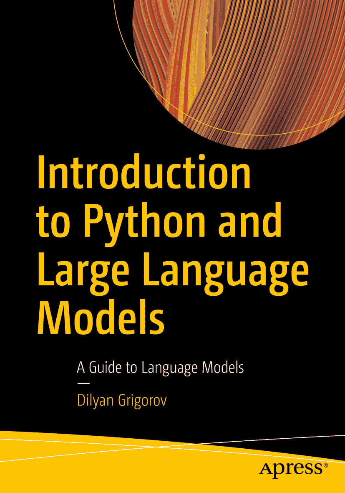

ISBN 979-8-8688-0539-4 电子书 ISBN 979-8-8688-0540-0 [`doi.org/10.1007/979-8-8688-0540-0`](https://doi.org/10.1007/979-8-8688-0540-0) © Dilyan Grigorov 2024 本作品受版权保护。所有权利均独家授权给出版商，无论涉及材料的全部或部分，具体包括翻译、重印、重用插图、朗诵、广播、以缩微胶卷或任何其他物理方式复制，以及传输或信息存储与检索、电子改编、计算机软件，或通过目前已知或未来开发的任何相似或不同方法。在本出版物中使用通用描述性名称、注册商标名称、商标、服务标志等，即使未作明确声明，也不意味着这些名称不受相关保护性法律和法规的约束，因此可自由用于一般用途。出版商、作者和编辑可以假定，本书中的建议和信息在出版之日是真实和准确的。出版商、作者或编辑均不对本文所含材料或可能存在的任何错误或遗漏提供明示或暗示的担保。出版商在已出版地图和机构归属方面的管辖权主张上保持中立。

本 Apress 印记由注册公司 APress Media, LLC（Springer Nature 的一部分）出版。

注册公司地址为：1 New York Plaza, New York, NY 10004, U.S.A.

*本书谨献给我在谷歌的所有导师，他们不仅点燃了我对编程的热情，也激励我不断追求，永不停歇。*

## 引言

在科技不断演进、科幻与现实的界限日益模糊的今天，一项变革性工具应运而生：大型语言模型（LLM）。这些作为人工智能精密引擎的模型，不仅重新定义了人与机器的交互方式，也为理解人类语言开辟了新途径。本书共分为七个全面章节，旨在为那些踏上探索 LLM 及其 Python 应用这一复杂世界的旅程的人们，既充当灯塔，也架起桥梁。

第 1 章“大型语言模型的演变与重要性”奠定了全书基础。我们在此开启旅程，揭开自然语言处理（NLP）和大型语言模型复杂而迷人的世界。本章用超过 50 页的篇幅进行铺垫，旨在让读者对 LLM 的演变、重要性和基本概念有扎实的理解。通过对文本预处理、词嵌入和情感分析等主题的细致探索，我们揭示了 LLM 的魔力与机制，及其在各个领域的影响。

第 2 章“什么是大型语言模型？”将焦点转向使 LLM 工作成为可能的工具，特别强调了“Python 及其为何适用于 LLM？”它揭开了 Python 的神秘面纱——这种在编程世界中兼具简洁与强大特性的语言。从基本语法到 Python 3.11 的细微特性，读者将获得必要的知识，以驾驭后续章节，并利用 Python 进行 LLM 的探索。

在第 3 章“用于 LLM 的 Python”中，我们深入 LLM 的核心，剖析其组成部分并理解其工作原理。本章涵盖了从嵌入层到注意力机制的所有内容，深入解析了 GPT-4、BERT 等模型的技术构成。本章旨在让读者深刻理解 LLM 如何预测下一个词元、如何从少量示例中学习，以及偶尔出现的“幻觉”现象。

第 4 章“Python 与其他编程方法”是一份利用 Python 进行 LLM 开发的实用指南。在此，读者将熟悉 Hugging Face 和 OpenAI API 等关键的 Python 库、框架和平台，探索它们在构建基于 LLM 的应用中的用途。本章侧重于数据准备，并展示了使用每个框架构建的基本示例，证明了 Python 在 AI 民主化进程中的作用。

第 5 章“LLM 架构组件的基本概述”通过实际的 Python 应用展示了 LLM 的多功能性和潜力。读者将学习如何将 LLM 用于从文本生成到聊天机器人等任务，每个任务都附有分步示例。本章不仅突出了 LLM 的能力，也激励读者构想并创建自己的应用。

你文档中的第 6 章，标题为“LLM 在 Python 中的应用”，探讨了大型语言模型（LLM）如何在各个领域中使用，重点关注文本生成和创意写作。它详细介绍了 LLM 如何利用 RNN 和 Transformer 等模型生成类似人类的文本。本章涵盖了关键用例，包括内容创作、聊天机器人、虚拟助手和数据增强。它还强调了 LLM 如何在创意写作任务、头脑风暴、对话构建、世界构建和实验文学中提供帮助。此外，本章还讨论了语言翻译、文本摘要和文档理解，强调了 LLM 在提高这些领域准确性和效率方面的影响。最后，本章给出了一个使用 LLM 构建问答聊天机器人的示例。

第 7 章探讨了如何利用 Python 3.11 以及 LangChain、Hugging Face 等库来开发由大型语言模型（LLM）驱动的应用程序。它涵盖了 LangChain 的特性，如模型交互、数据连接和记忆，并解释了如何使用这些工具构建应用程序。本章还讨论了 LangChain 在客户支持、编码助手、医疗保健和电子商务等各个行业的集成和用例，突出了其在创建 AI 驱动解决方案方面的灵活性。

本书是一份邀请函，邀请您进入一个理解与创造相遇的世界。它面向那些渴望解码 AI 语言的求知者，以及那些准备好塑造未来的创造者。无论你是学生、软件工程师、数据科学家、AI 或 ML 研究人员或从业者，抑或仅仅是一名爱好者，阅读这些篇章的旅程都将使你掌握必要的知识和技能，参与到人类与机器之间持续的对话中。欢迎来到语言、学习和想象的前沿。

## 致谢

在回顾撰写本书的历程时，我对无数在这条道路上支持、启发和指导我的人充满了感激之情。

首先，我要向我的家人致以最深切的感谢，他们坚定不移的支持和无限的耐心一直是我的支柱和力量源泉。

我非常感谢我的导师和同事们，他们分享智慧，以善意批评我的想法，并鼓励我不断突破知识的边界。特别感谢我的导师 Alexandre Blanchette，他富有洞察力的反馈和鼓励对本书的完成至关重要。

