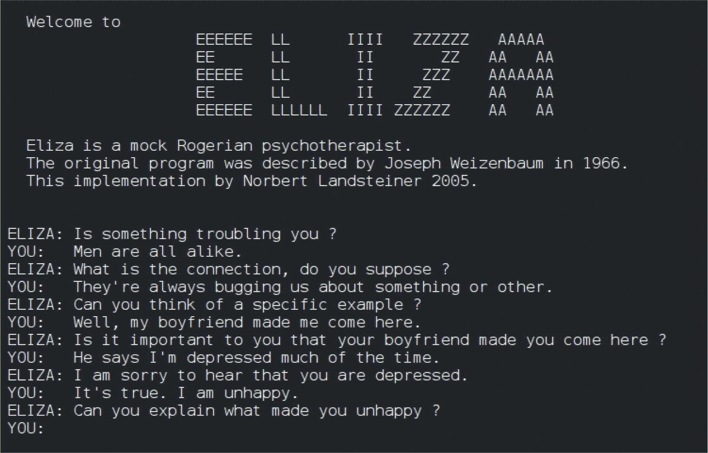
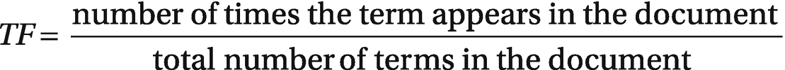
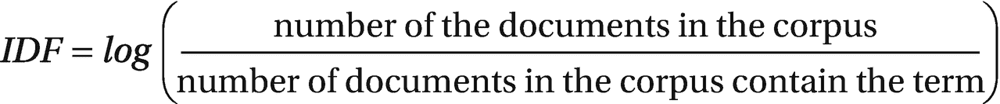
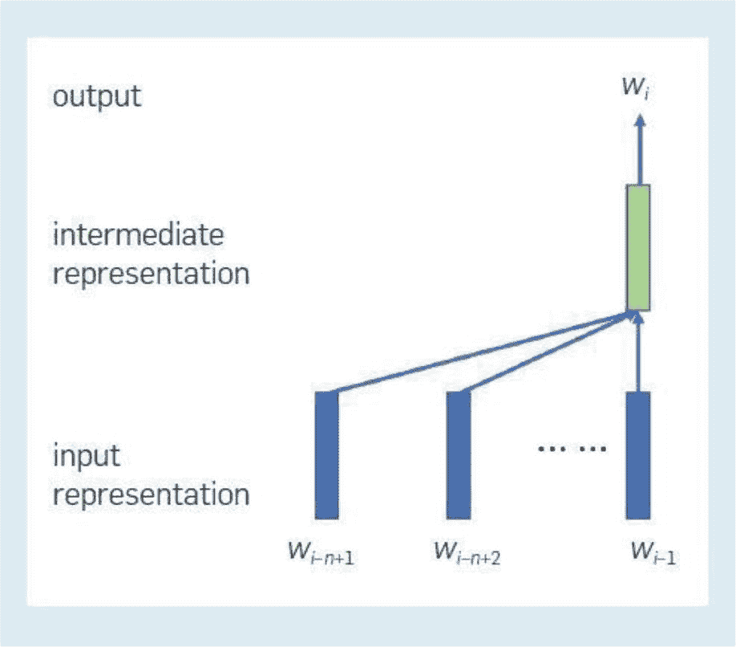

# 首个聊天机器人：`ELIZA`

语言模型的探索可追溯至 20 世纪 50 年代，当时研究人员致力于研究基于规则的语言处理系统。早期的尝试因需要手动构建语法规则而受阻。

1966 年，约瑟夫·维森鲍姆^(⁴)推出了“`ELIZA`”程序（图 1-1），这标志着一次重大突破。`ELIZA` 是最早能够通过聊天和问答与人类互动的计算机程序之一。作为一个模拟罗杰斯式心理治疗师的程序，`ELIZA` 通过文本对话与用户交流，堪称对话模拟的开创性范例。然而，`ELIZA` 的交互严重依赖预定义模式，缺乏对语言细微差别的真正理解。

图 1-1

“`ELIZA`”程序，来源：维基百科

`ELIZA` 于 1966 年诞生于麻省理工学院，使用 `LISP-MAD` 语言编写。它利用知识数据库，在响应用户查询时识别排名最高的关键词，然后通过脚本提供的转换规则对句子模式进行处理。一个流行的脚本示例名为 `DOCTOR`。`ELIZA` 的成功激励了研究人员扩展这一思路，并开发其他基于规则的聊天机器人系统。

在 `ELIZA` 问世后的一段时间里，研究人员对基于规则的聊天机器人程序给予了显著关注。随后几年中，出现了多个类似系统，如 `PARRY`、`ALICE`、`CLEVER`、`SHRDLU` 等。这些早期的基于规则聊天机器人系统的特点是简单，且依赖手动编写的规则和脚本中定义的句子模式。因此，这些程序的知识库和功能仅限于预定义的规则和信息。

在随后的几十年里，随着更复杂的基于规则系统的发展，语言理解能力的提升取得了进展。尽管有所进步，但这些系统仍难以应对人类语言的复杂性，无法捕捉上下文细微差别并适应多样化的语言表达。研究人员日益认识到，必须从僵化的基于规则方法转向能够从数据中学习和泛化的模型。这一转变催生了统计语言处理技术，如 n-gram 和隐马尔可夫模型，为更精细的语言分析打开了大门。

这一区别也凸显了早期基于规则的聊天机器人程序与基于神经网络和大语言模型（LLM）的当代先进模型之间的显著差异。另一类早期语言模型依赖于信息检索（IR）技术。在这种方法中，聊天机器人通过匹配预构建对话对数据库中的模式来生成回复。以 20 世纪 80 年代末的 `CleverBot` 为例的基于信息检索的聊天机器人，受益于词频-逆文档频率（`TF-IDF`）、余弦相似度以及词级别的状态空间模型等技术。

## 统计语言处理

尽管语言建模领域的一些早期设计和模型在当今先进的架构中已显过时，但某些基础技术已成为当代语言模型及更广泛机器学习方法中不可或缺的组成部分。自然语言处理的关键构建模块包括 n-gram、词袋（`BOW`）和 `TF-IDF`。

### N-gram

n-gram 模型在 20 世纪 90 年代和 21 世纪初的引入，标志着统计语言建模的关键进步。这些模型基于一个简单而强大的概念，通过检查序列中前一个词来评估某个词出现的可能性。

尽管本质简单，n-gram 模型为理解语言中的上下文提供了一种关键机制。它们表示数据样本中 n 个相邻项目的序列，例如句子中的单词。通过关注词与词之间的局部关系，这些模型开始捕捉构成有意义语言表达的内在依赖关系。

尽管简单，n-gram 在基于前 n-1 个词预测第 n 个词的概率方面发挥了关键作用。这一概念在基础语言建模和更复杂模型的发展中都至关重要。

注意

谷歌 PageRank 算法

*n-gram 的一个显著应用出现在 1996 年谷歌开创性的 PageRank*^(⁵) *算法中。该算法通过使用 n-gram 分析评估网页中词语的共现情况，从而有效排序网页的相关性，彻底改变了网络搜索。这一创新应用展示了 n-gram 模型在超越语言处理的现实场景中的多功能性。N-gram 模型不仅强调了上下文信息在语言中的重要性，还为开发能够捕捉更广泛语言细微差别的更复杂技术铺平了道路。*

### 词袋模型（BOW）

语言建模中的另一项基础技术是词袋模型（BOW）。这种简单的方法根据文档中单词的频率，将语言元素表示为数值。本质上，BOW^(⁶) 利用词频来创建固定长度的向量，用于表示文档。

尽管简单，但 BOW 一直是一种基础性的向量化或嵌入技术。现代语言模型通常建立在先进的词嵌入和分词技术之上。

BOW 模型提供了一种将文档转换为数值形式的方法，这是在机器学习算法中使用文档之前的一个必要步骤。在任何自然语言处理任务中，这种初始转换都是必不可少的，因为机器学习算法无法直接处理原始文本；因此，我们必须将文本转换为数值表示，这个过程被称为`文本嵌入`。

文本嵌入涉及两种主要方法：词向量和文档向量。在词向量方法中，文本中的每个单词都被表示为一个向量（一个数字序列），然后整个文档被转换为一组这些词向量的序列。相反，文档向量将整个文档嵌入为一个单一的向量，与单个词嵌入相比，这种方法简化了过程。

此外，它确保了所有文档都被嵌入为相同的大小，这对于通常需要固定大小输入的机器学习算法来说非常方便。例如，对于一个包含 1000 个单词的词汇表，文档被表示为一个 1000 维的向量，其中每个条目表示对应词汇在文档中出现的频率。

虽然这种技术对于复杂任务可能有所局限，但它对于较简单的分类问题效果很好。其简单性和易用性使其成为嵌入一组文档并应用各种机器学习算法的一个有吸引力的选择。BOW 模型易于实现且执行迅速。

与其他通常需要专门领域知识或大量预训练的嵌入方法不同，这种方法避免了此类复杂性，甚至无需手动特征工程。它基本上可以开箱即用。然而，其有效性仅限于那些不依赖于理解词语上下文细微差别的相对简单的任务。

词袋模型的典型应用是嵌入文档以用于分类器训练。分类任务涉及将文档归类到多个类型中，该模型的特征对于垃圾邮件过滤、情感分析和语言识别等任务特别有效。

例如，可以根据“立即行动”和“紧急回复”等关键短语的频率来识别垃圾邮件，而情感分析则可以使用“无聊”和“糟糕”与“美丽”和“壮观”等词语来辨别积极或消极的语气。此外，在检查词汇时，语言识别也变得简单直接。

一旦文档被嵌入，就可以将它们输入到分类算法中。常见的选择包括朴素贝叶斯分类器、逻辑回归或决策树/随机森林 `–` 与更复杂的神经网络解决方案相比，这些选项相对容易实现和理解。

### TF-IDF（词频-逆文档频率）

TF-IDF^(⁷) 是另一种利用词频来评估一个词在给定文档集合中相关性的统计度量。与词袋模型相比，TF-IDF 更为先进，因为它使用两种不同的度量标准来更精确地量化词与文档之间的关系。

TF-IDF 应用于信息检索和文本挖掘，特别是在文档中搜索关键词等任务中。它也是自然语言处理应用和语言模型中的一个有价值的工具。词频-逆文档频率（TF-IDF）同样是一种广泛使用的统计方法，用于衡量一个词在单个文档中相对于整个文档集合（称为语料库）的重要性。

在文本向量化过程中，文本文档中的单词被转换为重要性分数，而 TF-IDF 是最常见的评分方案之一。本质上，TF-IDF 通过将词频（TF）与逆文档频率（IDF）相乘来为一个词打分。

词频（TF）衡量一个词在文档中出现的频率，相对于该文档的总词数。

另一方面，逆文档频率（IDF）评估语料库中包含该词的文档所占的比例。对于仅出现在一小部分文档中的术语，例如技术行话，其 IDF 值要高于在所有文档中都出现的常见词，如“a”、“the”和“and”。

一个词的 TF-IDF 分数由其 TF 和 IDF 分数相乘得出。简而言之，当一个词在特定文档中频繁出现，但在其他文档中很少出现时，它就具有高重要性。这种由 TF 衡量的文档内部普遍性与由 IDF 衡量的文档间稀有性之间的平衡，产生了 TF-IDF 分数，指示了该词对于语料库中某个文档的重要性。

TF-IDF 应用于各种自然语言处理任务，包括搜索引擎，用于对查询的文档相关性进行排序。它还应用于文本分类、文本摘要和主题建模。

需要注意的是，计算 IDF 分数存在不同的方法。计算通常使用以 10 为底的对数，尽管一些库可能选择自然对数。此外，在分母上加 1 是一种常见的做法，以防止除以零。

### 向量空间模型与状态空间模型

值得注意的是，词袋（BOW）模型被认为是一种基础的词嵌入技术，它将词语与向量关联起来。然而，将词语嵌入向量空间的广泛应用取得了显著进展，尤其是在 21 世纪初的突破之后，以及随后在 2013 年和 2014 年分别出现的`Word2Vec`^(⁸)和`GloVe`。词嵌入技术已成为语言建模中不可或缺的一部分，并被其他各种模型广泛采用。

向量空间模型和状态空间模型是语言建模中的基本概念。向量空间模型涉及用代数方法将语言元素表示为嵌入到特定向量空间中的向量。

向量空间由向量组成，这些向量是词语、句子甚至文档的数值表示。虽然基本向量（如地图坐标）只有两个维度，但自然语言处理中使用的向量可能包含数千个维度。

将词语表示为向量的概念（通常称为词嵌入或词向量化）自 20 世纪 80 年代以来就已存在。^(⁹)这简化了评估词语之间的相似度或搜索查询与文档相关性的过程。余弦相似度通常用于衡量向量之间的相似度。通过使用非二元词项权重的线性代数，向量空间模型能够计算两个对象（例如查询和文档）之间的连续相似度，从而实现部分匹配。

**注意**

**状态空间模型**

*尽管向量空间模型已在自然语言处理（NLP）领域得到深入研究和广泛应用，但最近 NLP 领域对状态空间模型的兴趣激增。尽管如此，状态空间模型已在包括信号处理和控制理论在内的多个领域的序列建模中证明了其价值。鉴于状态空间模型在处理长序列方面的有效性，这些模型为在语言建模中构建创新架构以及改进现有技术提供了广阔前景。*

### 神经语言模型——大语言模型的崛起

2001 年，约书亚·本吉奥及其同事引入了最早的神经语言模型之一，标志着语言建模新时代的开端。值得注意的是，本吉奥^(¹⁰)、杰弗里·辛顿和扬·勒昆因其开创性贡献荣获 2018 年 ACM 图灵奖，他们被广泛认为使深度神经网络成为计算领域的关键组成部分。

传统的 n-gram 模型在学习能力上存在局限性。常规方法是通过平滑方法从语料库中估计条件概率`p(wi|wi-n+1, wi-n+2, ···, wi-1)`。然而，随着`n`值的增加，模型参数以`O(V^n)`的速度呈指数增长，其中`V`代表词汇量大小。这种指数增长，加上训练数据的稀疏性，阻碍了模型参数的准确学习。

本吉奥等人的神经语言模型通过两项关键改进增强了 n-gram 模型。首先，它引入了一个称为词嵌入的实值向量来表示单个词语或词语组合。与词语的“独热向量”表示（其中对应元素为 1，其余为 0）相比，词嵌入的维度显著降低。

作为一种“分布式表示”形式，词嵌入与独热向量相比，具有更高的效率、更强的泛化能力、鲁棒性和可扩展性。其次，该语言模型被构建为神经网络，从而大幅减少了模型中的参数数量。

人工神经网络（ANN）已成为自然语言处理以及各种机器学习和人工智能模型开发中广泛采用的方法。

在本吉奥及其同事的贡献之后，涌现了大量关于词嵌入和神经语言建模的技术，并从不同角度引入了改进。

21 世纪后期见证了一个关键转变，其标志是对神经网络（尤其是深度学习技术的出现）重新燃起的兴趣。利用循环神经网络（RNN）和长短期记忆网络（LSTM）^(¹¹)处理序列数据，在推动语言理解和生成方面发挥了关键作用。这一变革时期出现了显著的应用，尤其是在机器翻译领域。谷歌在 2016 年推出的“神经机器翻译”系统就是这一进步的例证，它通过利用深度学习技术进行语言翻译，超越了传统方法。

这一时期的一个显著里程碑是 2013 年由托马斯·米科洛夫及其在谷歌的团队发布的`Word2Vec`模型。该模型通过学习基于词语在大型文本数据集中上下文使用的分布式词表示，彻底改变了语言表示方式。`Word2Vec`模型为捕捉词语之间的语义关系奠定了基础，将语言理解提升到了超越单纯统计关联的水平。

#### 循环神经网络

循环神经网络（RNN）（图 1-2）代表了继基本统计模型和基于规则的模型之后语言模型的关键进步。RNN 起源于 20 世纪 80 年代，在处理序列和时间序列数据方面发挥了重要作用。虽然 RNN 促进了语言模型的发展，但它在处理长期依赖关系^(¹²)方面面临挑战，例如梯度消失和梯度爆炸问题。研究人员一直在寻求改进的解决方案，以解决这些局限性并增强处理长序列的能力。

在循环神经网络（RNN）领域，一个关键方面是中间表示或状态的概念。词语之间的相互依赖关系通过 RNN 模型中状态之间的关系得以体现。虽然模型的参数在不同位置是共享的，但生成的表示会根据其各自位置而有所不同。

**图 1-2** RNN 层的基本架构

在 RNN 的每个位置，每一层都存在一个中间表示，它体现了到该位置为止的词语序列的“状态”。当前位置当前层的中间表示由前一位置同一层的中间表示以及当前位置下一层的中间表示共同决定。当前位置的最终中间表示在计算下一个词语的概率时起着关键作用。

