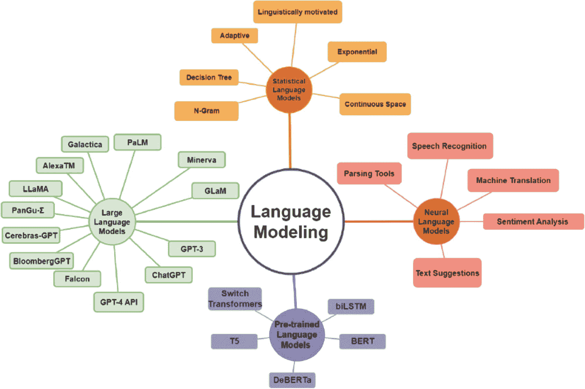

# 语言模型的发展阶段

提升机器的语言智能是通过语言建模实现的关键目标。广义上，语言建模涉及对词序列的概率进行建模，以预测未来的可能性。语言模型研究已获得广泛关注，并经历了四个显著的发展阶段。

语言模型的第一个里程碑是**统计语言模型**的出现，包括`n`元语法模型。^(²⁰) 这些模型根据前`n`个词的频率来评估序列中下一个词的概率。^(²¹) 例如，二元语法模型利用词对的频率来估计后续词的概率。

语言模型发展的第二阶段引入了**神经语言模型**，也称为神经语言建模。这种方法利用神经网络，根据序列中前面的词来预测下一个词的概率分布。循环神经网络及其变体，如长短期记忆网络和门控循环单元，在此范式中被普遍使用。^(²²)

语言模型演进的第三阶段涵盖了上下文词嵌入的出现，称为**预训练语言模型**。这些模型利用神经网络获取词的向量表示，该表示考虑了词出现的上下文。上下文词嵌入的例子包括`ELMo`^(²³)和`BERT`。

语言模型发展的第四阶段标志着大规模预训练语言模型的诞生，即**大型语言模型**。^(²⁴) 以`GPT-3`和`GPT-4`为代表的这些模型，具备在各种自然语言处理任务中表现出色的能力。它们在大量文本数据上进行训练，并可针对特定任务（如语言翻译或问答）进行微调。

总而言之，语言模型的这四个发展阶段（如图 2-1 所示）标志着该领域的重大进步，每个阶段都建立在前一阶段的基础上，并不断拓展机器在自然语言处理和计算机视觉领域所能达到的边界。

图 2-1

不同类型的语言建模（来源：[`www.researchgate.net/figure/Types-of-language-modeling_fig1_372258530`](http://www.researchgate.net/figure/Types-of-language-modeling_fig1_372258530)。许可协议：知识共享署名 4.0 国际）

大型语言模型是语言模型的高级迭代版本，通过深度学习方法在大量文本数据集上进行训练。这些模型展现出生成与人类表达极为相似的文本的能力，并在各种自然语言处理任务中表现出色。

相比之下，语言模型的定义围绕着通过分析文本语料库为词序列分配概率这一概念。语言模型的复杂度各不相同，从基本的`n`元语法模型到更复杂的神经网络模型。然而，“大型语言模型”一词通常指采用深度学习技术并拥有大量参数（从数百万到数十亿不等）的模型。这类模型擅长捕捉复杂的语言模式，生成的文本往往与人类创作的内容无异。

“大型语言模型”通常体现为一个巨大的 Transformer 模型，其规模通常太大，无法在单台计算机上运行。因此，它通过 API 或 Web 界面作为服务提供。这些模型在来自不同来源（如书籍、文章、网站和各种书面内容形式）的大量文本数据上进行训练。通过这种训练，它们分析词、短语和句子之间的统计关系，从而能够对提示或查询生成连贯且与上下文相关的响应。

例如，`ChatGPT`中的大型语言模型`GPT-3`，就是在海量互联网文本数据上训练的实例，这使其具备理解多种语言并拥有跨不同主题知识的能力。它在各种风格（包括翻译、文本摘要和问答）下生成文本的能力可能看起来非常出色。然而，这些能力是利用与提示对齐的特定“语法”来运作的，这解释了其令人印象深刻的表现。

## 大型语言模型是如何工作的？

大型语言模型通过分析大量文本数据来学习语言中的模式和关系。利用先进的神经网络架构，它们根据提供的上下文预测最可能的词序列，从而生成类似人类的文本。这个过程涉及复杂的计算层和海量数据集，以实现其令人印象深刻的能力。

像`GPT-3`这样采用 Transformer 架构的大型语言模型，通过以下简化流程运作：

- **从海量文本中学习：** 这些模型首先吸收来自互联网的大量文本，类似于从一个庞大的信息库中学习。
- **创新架构：** 采用一种称为 Transformer 的独特结构，它们能够理解和保留大量信息。
- **词汇分解：** 模型将句子分解成更小的组成部分，有效地拆分单词。这种分割提高了它们处理语言的效率。
- **理解句子结构：** 与简单的程序不同，这些模型不仅理解单个单词，还理解它们在句子中的关系，把握整个上下文。
- **专门训练：** 在初始学习阶段之后，模型可以针对特定主题进行进一步训练，提高其在回答问题或撰写特定主题文章等任务中的熟练程度。
- **任务执行：** 当收到提示时，这些模型利用其获得的知识生成响应，就像一个能够理解和生成文本的智能助手。

## 大型语言模型的总体架构

大型语言模型的基础结构主要由各种神经网络层组成，包括循环层、前馈层、嵌入层和注意力层。

这些层协同工作，处理输入文本并制定输出预测：

1.  **嵌入层** 用于将输入文本中的每个词转换为高维向量表示。这些嵌入封装了词的语义和句法信息，帮助模型把握上下文的细微差别。
2.  **大型语言模型中的前馈层** 包含多个全连接层，对输入嵌入应用非线性变换。这些层有助于模型识别输入文本中更高层次的抽象。
3.  **循环层** 旨在按顺序从输入文本中解读信息，它们维护一个在每个时间步更新的隐藏状态。这种动态特性使模型能够有效捕捉句子中词之间的依赖关系。
4.  作为大型语言模型的一个组成部分，**注意力机制** 使模型能够选择性地关注输入文本的不同部分。这种机制增强了模型关注输入文本中最相关部分的能力，从而产生更精确的预测。

