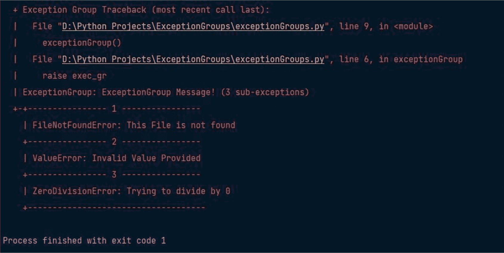

# Python 文件打开

在执行任何文件操作（如读取或写入）之前，第一步是打开文件。为此，Python 提供了内置函数 `open()`。然而，在打开文件时，必须指定模式，该模式指明了打开文件的目的。

**示例：**

创建文件 `example.txt` 并将其放在与你的 `.py` 文件相同的文件夹中。

**我的 `example.txt` 包含以下内容：**

> *Lorem Ipsum 是印刷和排版行业的简单占位文本。自 16 世纪以来，Lorem Ipsum 一直是行业标准的占位文本，当时一位不知名的印刷商取了一盘铅字并打乱它们，制作了一本字体样本册。它不仅存活了五个世纪，还成功进入了电子排版时代，基本保持不变。它在 20 世纪 60 年代因包含 Lorem Ipsum 段落的 Letraset 纸张的发布而普及，最近又随着像 Aldus PageMaker 这样的桌面出版软件（包含各种版本的 Lorem Ipsum）而流行。*

如果我们遵循树形结构，那么文件应如下所示：

```
├── example.txt
└── test.py
```

```
# 指定文件路径（请替换为实际文件路径）
file_path = "example.txt"
try:
    # 打开文件并读取其内容
    file = open(file_path, 'r')
    file_contents = file.read()
    # 打印文件内容
    print(file_contents)
    # 关闭文件
    file.close()
except FileNotFoundError:
    print(f"未找到文件 '{file_path}'。")
except IOError:
    print(f"读取文件 '{file_path}' 时发生错误。")
```

**输出：**

```
Lorem Ipsum is simply dummy text of the printing and typesetting industry. Lorem Ipsum has been the industry's standard dummy text ever since the 1500s, when an unknown printer took a galley of type and scrambled it to make a type specimen book. It has survived not only five centuries, but also the leap into electronic typesetting, remaining essentially unchanged. It was popularized in the 1960s with the release of Letraset sheets containing Lorem Ipsum passages, and more recently with desktop publishing software like Aldus PageMaker including versions of Lorem Ipsum.
```

**支持以下模式：**

*   `r`：以读取模式打开现有文件。
*   `w`：以写入模式打开现有文件。如果文件已包含数据，则会被覆盖。如果文件不存在，则会创建它。
*   `a`：以追加模式打开现有文件。它不会覆盖现有数据。
*   `r+`：允许读取和写入文件中的数据。文件中的现有数据将被覆盖。
*   `w+`：允许写入和读取数据。它会覆盖现有数据。
*   `a+`：允许追加和读取文件中的数据。它不会覆盖现有数据。

## 在读取模式下工作

在 Python 中，有多种方法可以从文件中读取内容。让我们探讨一下当文件以读取模式打开时，如何检索文件内容。

**在以下示例中，我们将打开包含以下内容的文件 `test.txt`：**

*Lorem Ipsum 是印刷和排版行业的简单占位文本。自 16 世纪以来，Lorem Ipsum 一直是行业标准的占位文本，当时一位不知名的印刷商取了一盘铅字并打乱它们，制作了一本字体样本册。它不仅存活了五个世纪，还成功进入了电子排版时代，基本保持不变。它在 20 世纪 60 年代因包含 Lorem Ipsum 段落的 Letraset 纸张的发布而普及，最近又随着像 Aldus PageMaker 这样的桌面出版软件（包含各种版本的 Lorem Ipsum）而流行。*

**示例：**

```
# 以读取模式（'r'）打开名为 "test.txt" 的文件
file = open('test.txt', 'r')
# 逐行打印文件中的每一行
for line in file:
    print(line, end='')  # 打印每一行，不添加额外的换行符
# 关闭文件
file.close()
```

**输出：**

```
Lorem Ipsum is simply dummy text of the printing and typesetting industry. Lorem Ipsum has been the industry's standard dummy text ever since the 1500s, when an unknown printer took a galley of type and scrambled it to make a type specimen book. It has survived not only five centuries, but also the leap into electronic typesetting, remaining essentially unchanged. It was popularised in the 1960s with the release of Letraset sheets containing Lorem Ipsum passages, and more recently with desktop publishing software like Aldus PageMaker including versions of Lorem Ipsum.
```

**示例：**

```
# Python 代码演示 read() 模式
file = open("test.txt", "r")
print(file.read())
```

**输出：**

```
Lorem Ipsum is simply dummy text of the printing and typesetting industry. Lorem Ipsum has been the industry's standard dummy text ever since the 1500s, when an unknown printer took a galley of type and scrambled it to make a type specimen book. It has survived not only five centuries, but also the leap into electronic typesetting, remaining essentially unchanged. It was popularised in the 1960s with the release of Letraset sheets containing Lorem Ipsum passages, and more recently with desktop publishing software like Aldus PageMaker including versions of Lorem Ipsum.
```

**示例：**

```
# Python 代码演示 with() 的用法
with open("geeks.txt") as file:
    data = file.read()
print(data)
```

**输出：**

```
Lorem Ipsum is simply dummy text of the printing and typesetting industry. Lorem Ipsum has been the industry's standard dummy text ever since the 1500s, when an unknown printer took a galley of type and scrambled it to make a type specimen book. It has survived not only five centuries, but also the leap into electronic typesetting, remaining essentially unchanged. It was popularized in the 1960s with the release of Letraset sheets containing Lorem Ipsum passages, and more recently with desktop publishing software like Aldus PageMaker including versions of Lorem Ipsum.
```

在 Python 中，可以在读取文件时分割行。`split()` 函数默认在遇到空格时将字符串分割成多个部分。不过，你可以自定义分割字符为任意字符。

**示例：**

```
# Python 代码演示 split() 函数
with open("test.txt", "r") as file:
    data = file.readlines()
    for line in data:
        word = line.split()
        print(word)
```

**输出：**

```
['Lorem', 'Ipsum', 'is', 'simply', 'dummy', 'text', 'of', 'the', 'printing', 'and', 'typesetting', 'industry.', 'Lorem', 'Ipsum', 'has', 'been', 'the', "industry's", 'standard', 'dummy', 'text', 'ever', 'since', 'the', '1500s,', 'when', 'an', 'unknown', 'printer', 'took', 'a', 'galley', 'of', 'type', 'and', 'scrambled', 'it', 'to', 'make', 'a', 'type', 'specimen', 'book.', 'It', 'has', 'survived', 'not', 'only', 'five', 'centuries,', 'but', 'also', 'the', 'leap', 'into', 'electronic', 'typesetting,', 'remaining', 'essentially', 'unchanged.', 'It', 'was', 'popularised', 'in', 'the', '1960s', 'with', 'the', 'release', 'of', 'Letraset', 'sheets', 'containing', 'Lorem', 'Ipsum', 'passages,', 'and', 'more', 'recently', 'with', 'desktop', 'publishing', 'software', 'like', 'Aldus', 'PageMaker', 'including', 'versions', 'of', 'Lorem', 'Ipsum.']
```


### 使用 `write()` 函数创建文件

与在 Python 中读取文件类似，写入文件也有多种方法。此处，我们将演示如何使用 Python 的 `write()` 函数将内容写入文件。

**示例：**

```python
# 指定文件路径（替换为所需的文件路径）
file_path = "new_file.txt"
try:
    # 以写入模式（'w'）打开文件
    with open(file_path, 'w') as file:
        # 向文件写入内容
        file.write("这是第一行。\n")
        file.write("这是第二行。\n")
        file.write("这是第三行。\n")
    print(f"文件 '{file_path}' 已创建，内容写入成功。")
except IOError:
    print(f"创建或写入文件 '{file_path}' 时发生错误。")
```

**输出：**

```
文件 'example.txt' 已创建，内容写入成功。
```

**现在，如果你打开该文件，将看到以下内容：**

```
这是第一行。
这是第二行。
这是第三行。
```

### 使用追加模式

```python
# Python 代码演示 append() 模式
file = open('test.txt', 'a')
file.write("这将添加这一行")
file.close()
```

**现在，在文件中，你将看到以下内容：**

```
这是第一行。
这是第二行。
这是第三行。
这将添加这一行
```

## Python 3.11 的强大功能

Python 3.11 于 2022 年 10 月 24 日首次亮相，速度更快，用户友好性更强。经过 17 个月的密集开发，它现已准备好被广泛采用。

与其前身一样，Python 3.11 引入了大量增强和修改。虽然可以在文档中找到这些内容的完整列表，但本章将深入探讨最令人兴奋和最具影响力的新功能。

### TypedDicts

`TypedDict` 在 PEP 589 中定义，并在 Python 3.8 中引入。在旧版本的 Python 上，你可以从 `typing_extensions` 安装它（`pip install typing_extensions`）。在 Python 3.11 中，它直接从 `typing` 导入。

#### `TypedDict` 还是仅仅一个 `Dict`？

- `dict[key: value]` 类型允许你声明统一的字典类型，其中每个值都具有未定义的类型，并且支持任意键。
- 但 `TypedDict` 允许我们描述一个结构化字典，其中每个字典值的类型取决于键。

**示例：**

```python
from typing import TypedDict, List

class SalesSummary(TypedDict):
    sales: int
    country: str
    product_codes: List[str]

def get_sales_summary() -> SalesSummary:
    return {
        "sales": 1_000,
        "country": "UK",
        "product_codes": ["SUYDT"],
    }
```

**`TypedDict` 不能同时继承自 `TypedDict` 类型和非 `TypedDict` 基类。**

### `Required[]` 和 `NotRequired[]`

**示例：**

```python
from typing import TypedDict, NotRequired

class User(TypedDict):
    name: str
    age: int
    married: NotRequired[bool]

marie: User = {'name': 'Marie', 'age': 29, 'married': True}
fredrick: User = {'name': 'Fredrick', 'age': 17}  # 'married' 不是必需的
```

**示例：**

```python
from typing import TypedDict, Required

# 'total=False' 表示默认情况下所有字段都不是必需的
class User(TypedDict, total=False):
    name: Required[str]
    age: Required[int]
    married: bool  # 现在这是可选的

marie: User = {'name': 'Marie', 'age': 29, 'married': True}
fredrick: User = {'name': 'Fredrick', 'age': 17}  # 'married' 不是必需的
thomas: User = {'age': 29, 'married': True}  # 由于缺少键，将被高亮显示！
```

**一元运算符 `+` / `-` / `~` 作为 `Required`/`NotRequired` 的示例：**

```python
class MyThing(TypedDict, total=False):
    req1: +int    # + 表示必需的键，或 Required[]
    opt1: str
    req2: +float

class MyThing(TypedDict):
    req1: int
    opt1: -str    # - 表示可能缺失的键，或 NotRequired[]
    req2: float

class MyThing(TypedDict):
    req1: int
    opt1: ~str    # ~ 表示与正常整体性相反的键
    req2: float
```

### Self 类型

以前，如果你必须定义一个返回类自身对象的方法，代码看起来会像这样：

```python
from typing import TypeVar

T = TypeVar('T', bound=type)

class Circle:
    def __init__(self, radius: int) -> None:
        self.radius = radius

    @classmethod
    def from_diameter(cls: T, diameter) -> T:
        circle = cls(radius=diameter/2)
        return circle
```

为了能够说明一个方法返回与类本身相同的类型，你必须定义一个 `TypeVar` 并说明该方法返回与当前类本身相同的类型 `T`。

#### 使用 Self 类型

得益于其简洁紧凑的语法（如 PEP 673 中所规定），`Self` 类型是返回类实例的方法的推荐注解。从 Python 3.11 版本开始，你可以直接从 Python 的 `typing` 模块导入 `Self` 类型。对于 3.11 之前的 Python 版本，你可以通过 `typing_extensions` 模块访问 `Self` 类型。

```python
from typing import Self

class Language:
    def __init__(self, name, version, release_date):
        self.name = name
        self.version = version
        self.release_date = release_date

    def change_version(self, version) -> Self:
        self.version = version
        return Language(self.name, self.version, self.release_date)

lang = Language("Python", 3.11, "November")
lang.change_version(3.12)
print(lang.version)
```

**输出：**

```
3.12
```

### 改进的异常处理

#### 更好的错误消息

到目前为止，在回溯中，你只能获得关于异常引发位置的行信息。在 Python 3.11 中，回溯中会显示确切的错误位置：

```
Traceback (most recent call last):
  File "asd.py", line 15, in <module>
    print(get_margin(data))
          ^^^^^^^^^^^^^^^^
  File "asd.py", line 2, in print_margin
    margin = data['profits']['monthly'] / 10 + data['profits']['yearly'] / 2
             ~~~~~~~~~~~~~~~~~~~~~~~~~~^~~
TypeError: unsupported operand type(s) for /: 'NoneType' and 'int'
```

#### 异常注释

Python 3.11 引入了异常注释（PEP 678）。现在，在你的 `except` 子句中，你可以在引发错误时调用 `add_note()` 函数并传递自定义消息。

**示例：**

```python
import math

try:
    math.sqrt(-1)
except ValueError as e:
    e.add_note("传入了负值！请重试。")
    raise
```

#### 添加异常注释的另一种方法：将其定义为自定义异常类的属性

**示例：**

```python
import math

class MyOwnError(Exception):
    __notes__ = ["这是一个自定义错误！"]

try:
    math.sqrt(-1)
except:
    raise MyOwnError
```

#### 异常组

理解异常组（图 4-1）的一种方式是，它们是包装了多个其他常规异常的常规异常。然而，虽然异常组在许多方面表现得像常规异常，但它们也支持特殊的语法，帮助你有效地处理每个被包装的异常。在 Python 3.11 中，我们使用 `ExceptionGroup()` 对异常进行分组。

**示例：**

```python
def exceptionGroup():
    exec_gr = ExceptionGroup('异常组消息！',
                             [FileNotFoundError("未找到此文件"),
                              ValueError("提供了无效值"),
                              ZeroDivisionError("试图除以 0")])
    raise exec_gr
```



**图 4-1** Python 中的分组异常


#### TOML 支持

`TOML` 是 Tom's Obvious Minimal Language 的缩写。这是一种在过去十年中流行起来的配置文件格式。Python 社区已将 `TOML` 作为指定包和项目元数据的首选格式。

`TOML` 的设计目标是既易于人类阅读，也易于计算机解析。虽然许多工具多年来一直在使用 `TOML`，但 Python 此前并未内置对 `TOML` 的支持。这一情况在 Python 3.11 中发生了改变，`tomllib` 被添加到了标准库中。这个新模块构建在流行的第三方库 `tomli` 之上，允许你解析 `TOML` 文件。

**示例：**

```
[second]
label   = { singular = "second", plural = "seconds" }
aliases = ["s", "sec", "seconds"]
[minute]
label      = { singular = "minute", plural = "minutes" }
aliases    = ["min", "minutes"]
multiplier = 60
to_unit    = "second"
[day]
label      = { singular = "day", plural = "days" }
aliases    = ["d", "days"]
multiplier = 24
to_unit    = "hour"
[year]
label      = { singular = "year", plural = "years" }
aliases    = ["y", "yr", "years", "julian_year", "julian years"]
multiplier = 365.25
to_unit    = "day"
```

新的 `tomllib` 库提供了对解析 `TOML` 文件的支持。`tomllib` 不支持写入 `TOML`。它基于 `tomli` 库。使用 `tomllib.load()` 时，你需要传入一个文件对象，并且必须通过指定 `mode="rb"` 以二进制模式打开该文件。

**`tomllib` 中的两个主要函数如下：**

*   `load()`: 从文件加载字节
*   `loads()`: 从字符串加载

**示例：**

```
import tomllib
# 会引发 TypeError，必须使用二进制模式
with open('t.toml') as f:
tomllib.load(f)
# 正确用法
with open('t.toml', 'rb') as f:
tomllib.load(f)
```

#### 改进的类型变量

*   任意字面量字符串类型
*   负零格式化
*   改进的类型变量
*   可变参数泛型

#### 任意字面量字符串类型

为了解决这个限制，Python 3.11 引入了一个新的通用类型 `LiteralString`，它允许用户输入任何字符串字面量，如下所示：

```
from typing import LiteralString
def paint_color(color: LiteralString):
pass
paint_color("cyan")
paint_color("blue")
```

#### 可变参数泛型

```
from typing import Generic, TypeVar
Dim1 = TypeVar('Dim1')
Dim2 = TypeVar('Dim2')
Dim3 = TypeVar('Dim3')
class Shape1(Generic[Dim1]):
pass
class Shape2(Generic[Dim1, Dim2]):
pass
class Shape3(Generic[Dim1, Dim2, Dim3]):
Pass
```

如图所示，对于三个维度，我们必须定义三个类型及其各自的类，这不够简洁，并且代表了我们应该警惕的高度重复。Python 3.11 引入了 `TypeVarTuple`，它允许你使用多种类型创建泛型。

```
from typing import Generic, TypeVarTuple
Dim = TypeVarTuple('Dim')
class Shape(Generic[*Dim]):
Pass
```

#### 负零格式化

通常，只有一个零，它既不是正数也不是负数。在使用浮点数进行计算时，你可能会遇到的一个奇怪概念是负零。

```
small_num = -0.00321
print(f"{small_num:z.2f}")
# 0.00
```

### 理解 Python 3.11 在 AI 和 NLP 中的作用 – 为什么选择 Python？

#### 为什么选择 Python 用于 AI？

Python 是一种流行且广泛使用的用于人工智能（AI）的编程语言，原因如下：

1.  **丰富的生态系统：** Python 拥有庞大且健壮的库和框架生态系统，专门为 AI 和机器学习设计，例如 `TensorFlow`、`PyTorch`、`scikit-learn`、`Keras` 等。这些库为数据操作、模型开发和训练等任务提供了预构建的工具和函数，使 AI 开发更加便捷和高效。

2.  **社区支持：** Python 拥有一个庞大且活跃的开发者、研究人员和数据科学家社区，他们为 AI 生态系统做出了贡献。这带来了持续的更新、改进以及丰富的资源，包括文档、教程和用于支持的在线论坛。

3.  **易于学习和阅读：** Python 以其简单性和可读性而闻名。其清晰简洁的语法使其成为初学者和经验丰富的程序员的绝佳选择。这种简单性降低了个人进入 AI 领域的门槛。

4.  **多功能性：** Python 是一种多功能语言，可用于 AI 之外的广泛任务，包括 Web 开发、数据分析、脚本编写等。这种多功能性意味着你可以跨不同领域应用 Python，并将 AI 解决方案集成到各种项目中。

5.  **跨平台兼容性：** Python 可在多个平台上使用，包括 Windows、macOS 和各种 Linux 发行版。这种跨平台兼容性确保了 AI 项目可以在不同环境中无缝运行。

6.  **集成能力：** Python 可以轻松地与其他语言和工具集成，使其适用于各种环境下的 AI 开发。例如，它可以与 C/C++ 库、Java 应用程序和 Web 服务交互，使你能够将 AI 整合到现有系统中。

7.  **广泛的数据科学支持：** Python 是数据科学家的热门选择，它提供了强大的库，如 `NumPy`、`pandas` 和 `Matplotlib`，用于数据操作、分析和可视化。这些工具对于 AI 至关重要，因为它们有助于预处理数据和评估模型性能。

8.  **开源：** Python 及其大多数 AI 库都是开源的，这意味着它们可以免费使用，并且可以根据需要进行定制或扩展。这种开放性促进了 AI 社区的创新和协作。

9.  **行业采用：** Python 已在 AI 和机器学习行业获得广泛采用。许多科技公司和研究机构将 Python 作为 AI 开发的主要语言，这促进了其流行度和增长。

#### 为什么选择 Python 用于 NLP？

Python 是自然语言处理（NLP）的首选语言，原因如下：

1.  **丰富的 NLP 库：** Python 拥有广泛的 NLP 库和框架，例如 `NLTK`（自然语言工具包）、`spaCy`、`Gensim`、`TextBlob` 等。这些库为文本分词、词性标注、情感分析、命名实体识别和语言建模等任务提供了预构建的工具和资源，简化了 NLP 开发。

2.  **活跃的 NLP 社区：** Python 拥有一个由开发者、研究人员和语言学家组成的充满活力的 NLP 社区，他们不断为 NLP 库和资源做出贡献并加以改进。这带来了频繁的更新、新模型以及丰富的教程和文档，以帮助 NLP 从业者。

3.  **机器学习集成：** NLP 通常涉及机器学习技术，而 Python 广泛的机器学习库，如 `scikit-learn`、`TensorFlow` 和 `PyTorch`，使得构建和训练 NLP 模型变得非常方便。

4.  **预训练模型：** 基于 Python 的 NLP 库通常为各种 NLP 任务提供预训练模型。例如，`spaCy` 和 `Hugging Face Transformers`、`OpenAI` 和 `LangChain` 为文本分类、翻译和问答等任务提供了预训练模型，节省了开发者的时间和精力。

5.  **开源生态系统：** Python 中的大多数 NLP 库都是开源的，允许开发者根据需要访问、修改和扩展它们。这促进了 NLP 社区内的协作和创新。

6.  **广泛采用：** Python 在学术界、研究界和工业界被广泛用于 NLP 相关项目。许多领先的研究论文、会议和组织将 Python 作为 NLP 研究和开发的主要语言。


