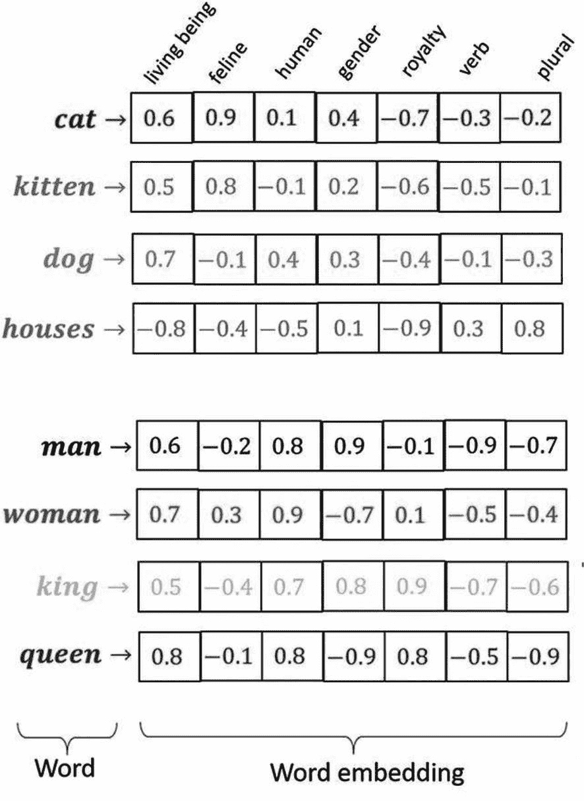
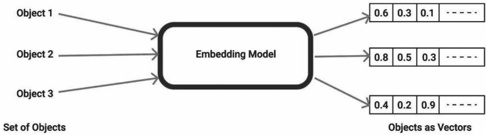
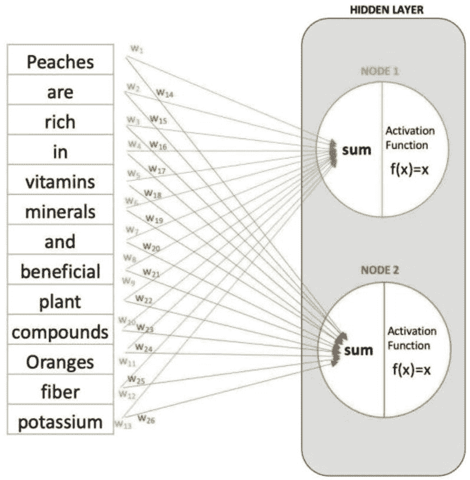
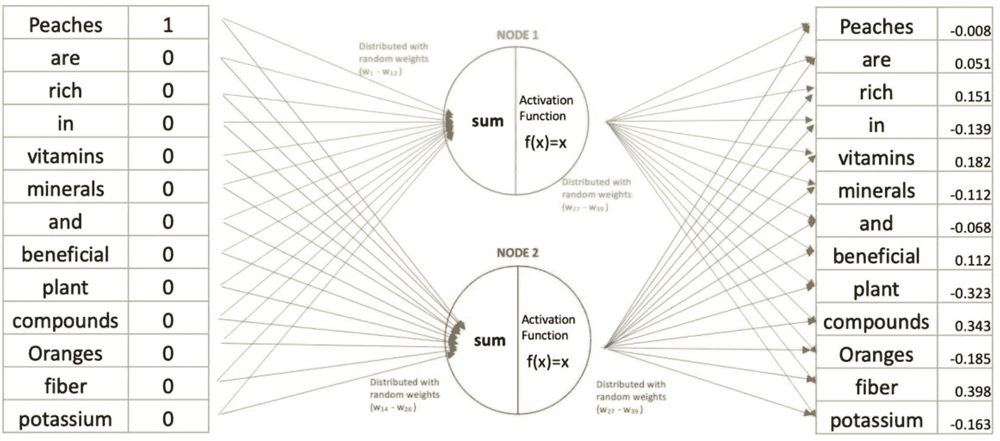
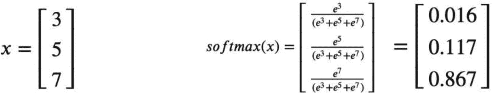

# 5. 大语言模型架构组件基础概述

本章深入探讨构成大语言模型（LLM）架构的复杂组件。理解这些要素对于领会 LLM 如何将原始文本数据转化为有意义、具备上下文感知能力的输出至关重要。本章讨论的关键组件包括**嵌入层、前馈层、循环层和注意力机制**。每一个组件在使 LLM 能够处理和生成类人语言方面都发挥着关键作用。

`嵌入`层是 LLM 的基础，它将单词等离散标记转换为连续的向量表示。这些层中的`嵌入`矩阵最初填充随机值，是一个可在训练过程中调整的可学习组件。该矩阵的每一行对应模型词汇表中的一个唯一标记。`嵌入`层会获取这些行来创建向量表示，这些表示即为模型对标记含义的理解。各种嵌入算法增强了模型捕捉位置和上下文细微差别的能力，使其能够有效处理多样化的语言场景。

`前馈`神经网络（FFN）是一种简单直接的人工神经网络，其特点是数据通过隐藏层从输入节点单向流向输出节点。这些层中的每个神经元都通过加权连接与相邻层的神经元相连。FFN 通过计算加权和、应用激活函数并生成输出来处理输入数据。在 LLM 中，前馈层对于识别和吸收复杂模式至关重要，从而增强了模型的理解能力。

`循环`层对于处理序列数据（尤其是在自然语言处理中）至关重要。这些层维护隐藏状态，将序列中先前元素的信息向前传递，使得模型在解释当前单词时能够考虑前面单词的上下文。训练循环层涉及诸如随时间反向传播（BPTT）等技术，该技术根据模型在整个序列上的表现来调整权重。诸如长短期记忆（LSTM）单元和门控循环单元（GRU）等变体被用来更有效地管理长期依赖关系。

`注意力`机制是现代 LLM 的基石，它使模型能够聚焦于输入文本中与当前任务最相关的特定部分。注意力机制通过两阶段方法运作：在注意力阶段，单词会寻找并与上下文中的相关单词交换信息；在前馈阶段，它们处理这些累积的信息。Transformer 是一种 LLM，它利用多个注意力头并行执行各种信息交换任务，从而增强了高效处理长文本的能力。

`自注意力`机制允许句子中的每个单词关注所有其他单词，从而捕捉它们之间的上下文关系。`多头注意力`机制在此基础上扩展，使模型能够同时关注句子的不同部分，从而提升其对句法和语义关系的理解。这些机制对于需要全面理解文本的任务（如翻译和摘要）至关重要。

`分词`是将文本分解为称为标记的可管理单元的过程，这些标记随后被转换为称为嵌入的数值表示。这种分割是 LLM 高效处理和学习大型数据集的基础。这些标记的分布和处理，尤其是预测序列中的下一个标记，构成了许多 LLM 任务（包括文本生成和翻译）的基础。

## `嵌入`层

神经网络（包括大型语言模型）中的`嵌入`层在将离散输入（如单词或标记）转换为连续向量形式方面发挥着关键作用。这种转换的核心是**嵌入矩阵**，它是该层的一个可学习组件，初始时包含随机值。

该矩阵的行对应模型词汇表中的唯一标记。在操作中，`嵌入`层会对每个输入标记进行查找，从矩阵中获取相应的行。这些获取的行即为**标记的连续向量表示，或称嵌入（图** **5-1****）**。这概述了`嵌入`层的基本操作，尽管每种嵌入算法可能有所不同，会融入句子的位置和上下文。这些差异使得不同模型在不同场景下能够以不同的有效性执行任务。

图 5-1

词嵌入可视化（来源：[*http://medium.com*](http://medium.com)）

词嵌入（图 5-2）将文本中的单个单词表示为向量，这些向量由为此目的设计的专门模型生成。每个单词都被分配一个独特的向量，本质上是一个填充了数字的数组，用于唯一标识该单词。这些向量是多维实体，每个维度代表该单词特定的一个数值分量。这些向量的唯一性使得文档中的每个单词都能得到独特的表示。

词嵌入的原理是将含义相似的单词在向量空间中映射到彼此接近的位置。例如，分配给“apple”的向量与“orange”的向量会比与“violin”的向量更相似，这反映了水果之间比与乐器之间更紧密的关系。向量之间的这种相似性反映了单词之间的语义接近度。

图 5-2

嵌入（来源：[*http://medium.com*](http://medium.com)）

需要指出的是，这些向量的维度选择由模型架构师决定。以 `Word2Vec` 为例，它使用 300 维的向量，用 300 个不同的数字来表示每个单词。在此上下文中，我们旨在仅使用两个维度来构建一个基本的词嵌入模型。

### 阶段 1：节点

初始阶段涉及建立一系列节点，这些节点分组在一个“隐藏层”中（图 5-3）。每个节点通过加权连接与一个输入词相关联。节点分为两个部分。第一部分聚合来自每个词的加权输入。这个聚合后的总和随后被传递到第二部分，即激活函数。激活函数的作用是根据其特定过程确定节点的输出。在此场景中，激活函数充当简单的恒等函数，保持输入不变。

如前所述，节点的总数决定了向量的维度。这意味着它设定了分配给每个输入词的数字（或向量分量）的数量。通常，在实际应用中，节点的数量从几十到几百不等。

数据集中的每个词都以特定的权重输入到每个节点中，旨在帮助模型学习词之间的关系，同时不增加系统的复杂性。

图 5-3

输入词通过神经网络中的隐藏层进行处理（来源：[*http://medium.com*](http://medium.com)）

在初始阶段，如上所述，每个词通过加权连接与节点相连，表示为（`w₁`，`w₂`，... `w[n]`）。这些权重最初由模型设置为随机值，以启动学习过程。目标是通过多次迭代调整和优化这些权重，以提高模型的准确性。当然，直接对字符串（词）和数字进行乘法等数学运算并不可行。因此，采用了一种二进制方法，将词编码为 0 或 1。具体来说，紧邻待预测目标词之前的词被赋值为 1。

### 阶段 2：返回至词

在第二阶段，每个节点生成的输出被分配回各个词（图 5-4），使用的是随机分配的权重。

图 5-4

详细的神经网络图，重点展示隐藏层，并包含连接的特定权重

### 阶段 3：实现 Softmax 层

在第三阶段，我们在模型中引入一个 softmax 层。该层作为一种激活机制，主要用于多分类场景的最终输出层。Softmax 层（图 5-5）的目的是将一系列数值转换为概率分布。它处理与每个类别（在我们的上下文中是每个词）相关联的数值，执行计算，并为每个类别生成一个概率分数。与之前可能使用随机分配权重的层不同，softmax 层使用特定的公式进行操作。

该函数处理一个输入向量，对其中的每个元素应用其公式。例如，给定一个输入向量如 `[3, 5, 7]`，softmax 层会输出一个向量如 `[0.016, 0.117, 0.867]`，其中输出向量的元素之和等于 1，表示一个概率分布。

图 5-5

Softmax 函数计算

### 前馈层

神经网络中的前馈层是指节点之间的连接不形成循环的层。一层中的每个节点仅连接到下一层的节点，允许信息单向流动——从输入到输出。这种结构是神经网络中用于分类和回归等任务的基础。

#### 什么是前馈神经网络？

前馈神经网络（通常称为“FFN”）是最简单的人工神经网络类型之一，其特点是数据从输入节点到输出节点单向流动，经过隐藏节点，没有任何循环或回路。这种简单的设计使其区别于更复杂的网络，如循环神经网络（RNN）和卷积神经网络（CNN），因为它没有反馈回路，所以更容易构建。

其架构围绕三个主要组成部分构建：输入层、隐藏层和输出层。每一层由称为神经元的单元组成，一层中的每个神经元通过加权连接与下一层中的神经元完全连接。

在操作中，输入层的神经元接收数据并将其向前传递。输入层中神经元的数量与输入数据的大小相匹配。位于输入和输出之间的隐藏层执行计算，同时对输入和输出保持隐藏。

这些层中的神经元计算来自前一层输出的加权和，应用激活函数引入非线性，并将结果向前传递。这个过程是迭代的，直到到达输出层，然后生成网络的最终输出。跨层的神经元之间的连接使得前馈神经网络完全连接，权重象征着连接强度，网络在学习过程中调整权重以最小化输出误差。

前馈神经网络的操作分为两个关键阶段：前馈阶段和反向传播阶段。

#### 前馈阶段

在此阶段，网络通过将输入逐层推进来处理输入。隐藏层计算输入的加权和，然后应用激活函数（例如，`ReLU`、`Sigmoid`、`TanH`）来引入非线性，持续向前传递数据，直到到达输出层并做出预测。

#### 反向传播阶段

在做出预测之后，网络评估实际输出与预期输出之间的差异。然后，这个误差通过网络向后传播。为了减少误差，网络采用梯度下降优化技术，相应地调整连接上的权重。

