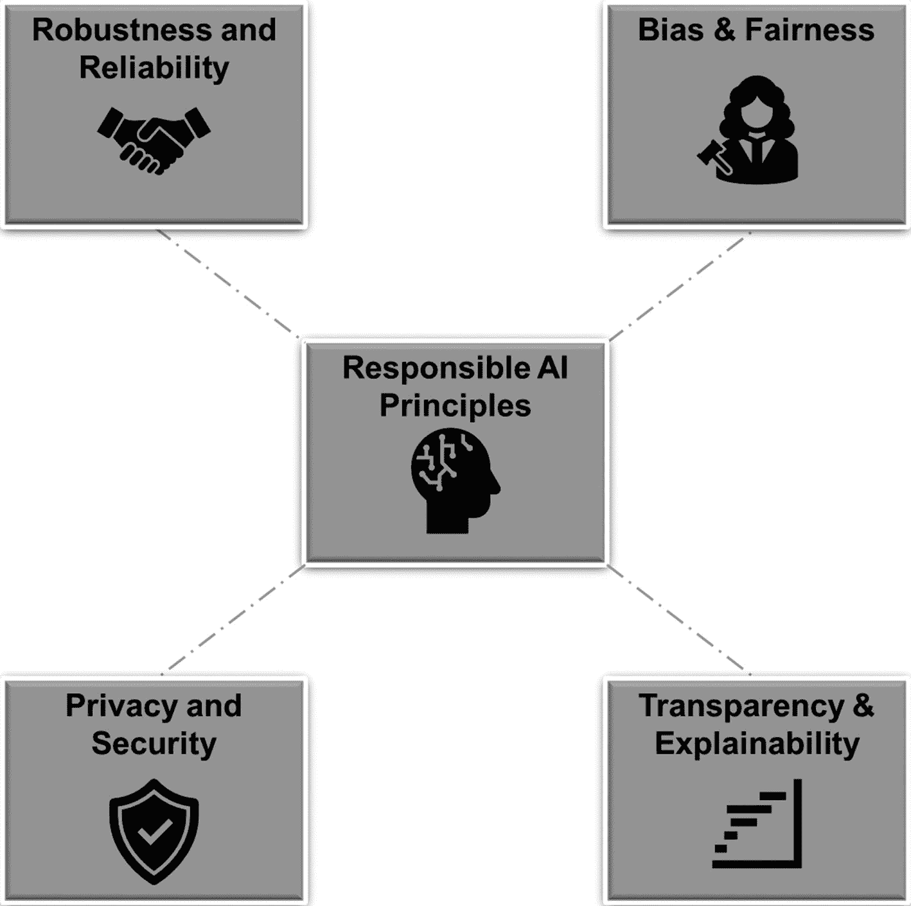

# 1. 引言

在一个被数字创新渗透的世界里，人工智能（AI）的崛起堪称我们这个时代最显著的进步之一。AI，即能够模仿人类认知过程的机器模拟智能，已点燃了一场变革浪潮，席卷了从医疗、金融到教育和娱乐的各个行业。随着 AI 的边界不断扩展，它重塑社会结构的潜力也在同步增长。

在本章中，我们将踏上一段旅程，简要概述 AI 及其所蕴含的巨大潜力。随后，我们将深入探讨负责任 AI 之所以重要的令人信服的原因。最后，我们将审视支撑负责任 AI 领域的基础伦理原则。

## AI 及其潜力概述

人工智能，曾经是科幻小说的领域，如今已演变为塑造我们当代世界的变革力量。这项植根于对人类智能模拟的技术奇迹，开启了一个充满前所未有可能性的时代。在本节中，我们将简要探讨 AI 的基本概念、其多样化的表现形式，以及它在各个领域所蕴含的非凡潜力。

### AI 的基础：从概念到现实

AI 的核心是一个跨学科领域，旨在开发能够执行通常需要人类智能的任务的机器。它涵盖了一系列技术和方法，每一种都为 AI 能力的进步做出了贡献。

AI 的发展历程可追溯至二十世纪中期，艾伦·图灵等先驱为该领域的理论基础奠定了基础。早期 AI 系统（通常基于符号推理）的发展标志着向前迈出的重要一步。这些系统旨在通过操纵符号和规则来复制人类的思维过程。

然而，正是机器学习的出现彻底改变了 AI 的发展轨迹。机器学习使计算机能够从数据中获取知识，从而随着时间的推移调整和提升其性能。受人类大脑工作方式启发的神经网络，催生了革命性的深度学习技术，该技术在视觉（图像识别）、语音（自然语言处理）等领域取得了突破性成就。

### AI 在行动：多元化的应用图景

AI 的潜力巨大，其应用范围广泛，每一项应用都增强了我们应对复杂挑战的能力。AI 最突出的表现之一是在数据分析领域。AI 算法能够筛选海量数据集并提取有意义的见解，这彻底改变了金融、医疗和营销等行业。例如，金融机构利用 AI 驱动的算法来检测欺诈活动并预测市场趋势，从而增强决策和风险管理能力。

AI 的卓越能力还体现在其自动化能力上。机器人流程自动化（RPA）简化了常规任务，将人力资源解放出来用于更具战略性的工作。制造业、物流和客户服务领域都见证了 AI 驱动自动化所带来的效率和精准度。

另一个值得关注的领域是自然语言处理（NLP），它使机器能够理解和生成人类语言。该技术应用于聊天机器人、语言翻译和情感分析，改变了企业与客户互动以及分析文本数据的方式。

医疗保健，一个始终寻求创新的行业，正通过 AI 经历一场革命。由 AI 驱动的诊断工具有助于疾病的早期检测，而预测分析则有助于识别疫情爆发和规划资源分配。AI 与医学影像的结合正在提高诊断准确性，加快治疗决策，并有可能挽救生命。

### AI 的前景：释放无限潜力

AI 的潜力不仅限于渐进式的进步；它有能力重塑行业、提升我们的生活质量并应对社会挑战。其中一个前景在于自动驾驶汽车。AI 驱动的自动驾驶汽车有潜力减少事故、优化交通流量并重新定义城市出行方式。

在环境保护领域，AI 发挥着关键作用。预测模型分析复杂的气候数据以预测自然灾害，有助于备灾和响应。此外，AI 驱动的精准农业优化了作物产量，减少了资源浪费，并促进了可持续粮食生产。

教育领域也将从 AI 中受益匪浅。个性化学习平台利用 AI 使内容适应个人学习风格，确保有效的知识吸收。此外，AI 驱动的辅导系统为学生提供即时反馈，促进对学科的更深层次理解。

### 驾驭 AI 前沿

当我们站在 AI 革命的前沿时，地平线上充满了潜力。从简化行业到彻底改变医疗保健和赋能教育，AI 的变革性影响毋庸置疑。然而，伴随其强大能力而来的是责任：必须以合乎道德和负责任的方式利用其潜力，确保进步伴随着同情心、包容性和问责制。在接下来的章节中，我们将深入探讨支撑 AI 负责任地融入我们生活的伦理考量和指导原则。

## 负责任 AI 的重要性

在日新月异的技术格局中，AI 作为创新的灯塔脱颖而出，有望彻底改变行业、提升人类能力并重新定义解决问题的范式。然而，随着 AI 成为焦点，责任的必要性比以往任何时候都更加突出。在本次探讨中，我们将深入剖析负责任 AI 的深远重要性，揭示其伦理维度、社会影响，以及在塑造可持续未来方面所起的关键作用。

### 人工智能时代的伦理：责任之呼唤

随着人工智能能力的蓬勃发展，其影响人类生活、社会和经济的能力日益凸显。然而，这种潜力也伴随着固有的伦理困境——即创造和操控具备决策、学习甚至自主能力的机器的权力。负责任的人工智能应运而生，成为指导人工智能技术开发、部署和治理的北极星。

负责任的人工智能核心要求技术创新与社会价值观的审慎对齐。它召唤开发者、政策制定者和利益相关者在人工智能的整个生命周期中坚守伦理原则、问责制和透明度。其重要性超越了单纯的技术范畴；它象征着对保障人类福祉、确保所有人公平受益的承诺。

### 减轻偏见与歧视：开创公平与公正

人工智能领域一个突出的问题是算法中可能嵌入偏见和歧视。基于有偏见数据训练的人工智能系统可能会固化社会偏见，加剧现有的不平等。负责任的人工智能勇于直面这一问题，要求严格的数据预处理、算法透明度以及对公平性的追求。

通过有原则的设计和伦理考量，负责任的人工智能致力于创建反映人类社会多元结构的系统。它敦促各方共同努力弥合数字鸿沟，确保人工智能的影响不被歧视性实践所玷污。通过倡导公平与公正，负责任的人工智能为这样一个未来铺平了道路：技术成为赋能的工具，而非分裂的媒介。

### 监控时代的隐私：平衡创新与安全

数字进步的时代导致数据创造空前增长，引发了对个人隐私和数据安全的担忧。人工智能对数据的贪婪需求，要求在其学习算法中谨慎平衡创新与个人权利的保护。负责任的人工智能通过推广强加密、安全存储和严格的访问管理，强调了保护数据的重要性。

通过倡导负责任的数据处理实践，负责任的人工智能在技术与个人之间培养了一种信任感。它赋予个人对其个人信息的掌控权，同时使组织能够利用数据洞察实现积极变革。因此，它巩固了隐私的支柱，确保技术进步不以牺牲个人自主权为代价。

### 以人为本的设计：促进人机协作

在人工智能革命中，机器将取代人类角色的担忧尤为强烈。负责任的人工智能通过拥抱以人为本的技术理念来驱散这一观念。它将人工智能视为一种赋能者，能够放大人类能力、增强决策能力，并促进人与机器之间创新的协同效应。

在人工智能系统中保持人类监督的重要性怎么强调都不为过。负责任的人工智能鼓励开发“可解释的人工智能”，即算法的决策过程是可理解和可追溯的。这不仅建立了信任，还使个人能够做出明智的选择，从而确保人工智能作为仁慈的盟友而非神秘的力量运作。

### 人工智能治理中的伦理：驾驭复杂格局

负责任的人工智能将其视野扩展到技术开发之外，涵盖了治理与监管这一错综复杂的领域。在人工智能系统跨越法律、社会和文化边界的时代，确保伦理监督变得至关重要。负责任的人工智能呼吁建立强有力的框架、行为准则和监管机制，以规范人工智能技术的部署。

负责任的人工智能治理的重要性在于其能够避免潜在危害、解决问责问题，并使人工智能的发展轨迹与社会期望保持一致。它防止了不受约束的技术无序扩散，并确保人工智能被用于集体利益，从而开启一个合作进步的时代。

### 结论：持续的责任对话

随着人工智能踏上其变革之旅，负责任的人工智能的重要性始终坚定不移。它在技术走廊中回响，在伦理辩论中产生共鸣，提醒我们技术对生活产生的深远影响。塑造人工智能发展轨迹的责任掌握在我们手中——开发者、政策制定者、公民皆然——并且需要集体致力于伦理创新、社会效益和负责任的管理的信条。

在接下来的章节中，我们将更深入地探索负责任的人工智能的多维格局。我们将揭示其核心原则，阐明其实际应用，并审视其对不同领域的影响。当我们踏上这一探索之旅时，我们将高举责任的火炬，照亮一条将人工智能的能力与人类对公正、公平和伦理丰富的未来的共同愿景相结合的道路。

## 核心伦理原则

负责任的人工智能包含一套指导原则，用以规范人工智能技术的伦理开发、部署及其影响。这些原则（见图 1-1）如同指南针，指引我们穿越创新与社会福祉的复杂交汇点。在本摘要中，我们提炼了这些核心原则的精髓。

图 1-1

人工智能的演进

### 1. 偏见与公平：负责任人工智能的基石

在人工智能领域，从创造力到伦理义务的演变催生了负责任的人工智能这一概念。在其指导原则中，偏见与公平问题比其他问题更迫切需要解决。随着人工智能技术日益融入我们的日常生活，确保消除偏见并遵循公平原则已成为一个关键焦点。在本摘要中，我们深入探讨了偏见与公平作为负责任人工智能基础要素的复杂性，探索了它们的影响和挑战，以及在人工智能领域解决这些问题的必要性。

#### 揭示偏见：隐藏的挑战

偏见是一种根深蒂固的人类倾向，可能通过用于训练人工智能系统的数据无意中渗入其中。人工智能算法从海量数据集中学习模式和关联，而这些数据集可能无意中包含人类决策和社会结构中存在的偏见。这可能导致歧视性结果，固化刻板印象并加剧社会差距。

负责任的人工智能承认，消除所有偏见可能不可行，但减轻其影响至关重要。重点转向解决那些导致不公正或有害后果的明显偏见，同时努力确保人工智能系统促进对所有个体的公平对待。

#### 公平性作为北极星：伦理必要性

人工智能中的公平性强调构建能够公平对待所有个体的系统，无论其背景、人口统计特征或特质如何。它超越了统计定义，深入伦理考量，以确保公正且无偏见的成果。负责任的人工智能将公平性视为道德和社会的必要要求，强调需要纠正历史性和系统性的不平等。

公平性的一个关键方面是算法公平性，它致力于确保人工智能系统的决策不受种族、性别或社会经济地位等敏感属性的影响。各种公平性指标、算法和技术已经涌现，用于评估和纠正偏见，促进公平结果，并增强社会对人工智能技术的信任。

#### 量化公平性的挑战

追求公平性在量化和实施过程中面临挑战。定义一个普遍接受的公平性概念仍然难以实现，因为不同情境需要不同的定义。在相互竞争的公平性概念之间取得平衡是一项重大挑战，有些方法倾向于平等对待，而另一些则优先解决历史差异。

量化公平性带来了复杂性，需要校准算法以满足预定义的公平性阈值。不同类型公平性之间的权衡可能错综复杂，需要仔细考虑它们对边缘化群体和整体社会福祉的影响。

#### 缓解策略与前进之路

负责任的人工智能倡导采取主动策略来缓解偏见并确保人工智能系统的公平性，具体如下：

- 意识提升和教育发挥着关键作用，有助于深入理解偏见的表现形式及其潜在后果。

- 数据预处理技术，如重采样、重加权和数据增强，为减轻训练数据中的偏见提供了途径。

- 此外，对抗训练和公平性感知学习等算法干预措施，可引导人工智能系统产生更公平的结果。

在数据收集、模型开发和评估中融入多样性，可降低延续偏见的风险。我们将在后续章节中深入探讨不同的缓解策略。

#### 伦理考量与社会影响

解决偏见并促进人工智能的公平性超越了技术算法；它深入伦理考量和社会影响。负责任的人工智能要求开发者、利益相关者和政策制定者就偏见与公平性的伦理维度进行持续对话。它促使组织采用全面的人工智能伦理框架，将伦理考量融入人工智能开发生命周期。

社会影响凸显了解决偏见和促进公平性的紧迫性。有偏见的人工智能系统不仅会延续现有的不平等，还可能侵蚀对技术的信任并加剧社会分裂。通过倡导公平性，负责任的人工智能培育了一种技术格局，反映了社会对公正和公平未来的渴望。

#### 结论：迈向公平的技术前沿

在追求负责任的人工智能过程中，解决偏见并确保公平性不仅仅是一个勾选框；它是一项变革性的努力，需要协作、创新和伦理信念。随着人工智能技术持续重塑行业并影响无数生命，坚持偏见缓解和公平性原则是一项伦理上的必要要求。前进的道路涉及多学科方法，技术创新与伦理考量交汇融合，为人工智能促进包容性、公平性和全人类福祉的未来铺平道路。

### 2. 透明度与可解释性

在人工智能领域，算法做出的决策影响着我们的生活，透明度和可解释性原则成为关键保障。这些原则是负责任的人工智能框架的组成部分，该框架旨在确保人工智能开发和部署的伦理、公平和问责。在本摘要中，我们探讨了透明度和可解释性作为负责任人工智能基石的重要性，深入研究了它们的影响、挑战以及所提供的变革潜力。

#### 透明度：照亮黑箱

人工智能中的透明度指的是人工智能系统决策过程的开放性和可理解性。它解决了复杂人工智能算法的“黑箱”性质，即输入和过程产生输出，但背后的推理过程缺乏清晰可见性。负责任的人工智能要求开发者和利益相关者使人工智能系统透明化，使个人能够理解决策是如何达成的。

透明度具有多重目的。它促进问责制，使开发者能够识别并纠正偏见、错误或意外后果。它也使受人工智能决策影响的个人能够质疑看似不公平或歧视性的结果。此外，透明度培养了人工智能系统与用户之间的信任，这是广泛采用的关键要素。

然而，实现透明度并非易事。人工智能模型通常由复杂的层级和非线性变换组成，这使得提取人类可解释的见解具有挑战性。在透明度的需求与人工智能算法的复杂性之间取得平衡仍然是一项微妙的任务。

#### 可解释性：弥合鸿沟

可解释性通过以人类可理解的方式提供人工智能决策背后的推理过程，对透明度进行补充。透明度揭示了整体决策过程，而可解释性则深入细节，揭示促成特定结果的因素。

可解释性解决了人工智能过程固有的复杂性与人类认知之间的认知差距。它力求回答诸如“为什么做出这个决定？”和“算法是如何得出这个结论的？”等问题。通过将人工智能输出转化为与人类推理产生共鸣的解释，可解释性使用户能够更自信地信任和参与人工智能系统。

然而，实现有意义的可解释性并非没有挑战。在简单性和准确性之间取得平衡，尤其是在深度神经网络等复杂人工智能模型中，需要创新技术，将复杂的交互综合成可解释的见解。

#### 影响与应用

透明度和可解释性的影响遍及一系列人工智能应用。在金融和医疗保健等领域，人工智能驱动的决策可能产生深远后果，透明度和可解释性有助于利益相关者理解风险评估、诊断和治疗建议。在刑事司法系统中，这些原则可以确保人工智能驱动的预测模型不会延续种族或社会经济偏见。

此外，透明度和可解释性对于监管合规至关重要。随着政府和机构制定人工智能治理框架，审计和验证人工智能决策的能力变得至关重要。透明且可解释的人工智能系统使监管机构能够评估公平性、准确性以及是否符合法律和伦理标准。

##### 挑战与未来方向

尽管透明度和可解释性的重要性已得到广泛认可，但挑战依然存在，例如：

- 模型复杂度与可解释性之间的权衡仍是一个根本性难题。开发既能保持准确性又能提供清晰解释的技术，是当前研究的前沿领域。

- 人工智能模型的动态特性也带来了挑战。可解释性不应仅限于模型初始部署阶段，还应涵盖模型更新、适配和微调过程。确保解释在整个 AI 系统生命周期中保持准确且有意义，是一项复杂的任务。

- 此外，在透明度与商业机密之间取得平衡如同走钢丝。企业可能不愿透露专有算法或敏感数据，但在知识产权保护与公众知情权之间找到平衡点至关重要。

## 结论

透明度与可解释性不仅仅是技术上的必要条件，更是负责任 AI 的基石。它们在 AI 驱动的世界中促进信任、问责和明智决策。通过揭示 AI 的决策过程，弥合算法与人类理解之间的鸿沟，透明度与可解释性为构建一个合乎道德、公平且包容的 AI 格局奠定了基础。随着 AI 的持续演进，秉持这些原则将确保我们迈向未来的旅程始终以清晰、正直和赋能为指引。

### 3. 隐私与安全

在技术飞速发展的时代，AI 融入我们生活的方方面面带来了诸多益处与挑战。随着 AI 系统日益普及且日趋复杂，保护个人隐私和确保数据安全成为负责任 AI 范畴内的关键环节。本摘要深入探讨了隐私与安全之间错综复杂的相互作用，阐述了它们的重要性、影响，以及作为负责任 AI 技术开发与部署核心原则所发挥的关键作用。

#### 数字时代的隐私：一种宝贵的财富

隐私作为个人自由的基石，在数字时代呈现出新的维度。随着 AI 系统积累海量数据用于分析和决策，保护个人隐私权变得至关重要。负责任 AI 认识到，保护隐私是人与生俱来的权利，必须确保个人信息得到最高程度的尊重与审慎处理。

负责任 AI 的关键原则之一是知情同意。个人有权知晓其数据将如何被使用和共享，从而能够做出明智的决定。AI 开发者与用户之间的透明沟通有助于建立信任，并赋予个人对其个人信息的控制权。

此外，数据最小化是支撑负责任 AI 的基本原则。它主张仅收集、处理和保留执行特定 AI 任务所必需的数据。这种方法最大限度地降低了意外泄露的风险，并有助于缓解潜在的隐私侵犯问题。

#### 数据安全：加固数字堡垒

隐私的密不可分的伙伴是数据安全。负责任 AI 认识到，AI 系统收集和使用的数据是宝贵的资产，保护其免受未经授权的访问、篡改或窃取至关重要。强大的数据安全措施，包括加密、访问控制和安全存储，构成了可信 AI 生态系统的支柱。

负责任的 AI 开发者必须在整个 AI 生命周期中优先考虑数据保护。从数据收集、存储到数据共享和处置，都必须严格执行安全协议。通过加固数字堡垒，负责任 AI 致力于保护敏感信息免受恶意侵害，维护个人身份和体验的完整性。

#### 挑战与机遇

虽然隐私和安全是负责任 AI 的基石，但它们也带来了需要创新解决方案的复杂挑战，具体如下：

- AI 系统收集的海量数据需要复杂的匿名化技术来去除个人标识符，确保即使在聚合数据集中也能维护个人隐私。

- 此外，数据流的全球性要求对隐私和安全法规采取协调一致的方法。负责任 AI 倡导建立国际标准，以指导数据处理实践，超越地理界限，确保为全球个人提供一致的保护。

面对这些挑战，负责任 AI 开启了变革性的机遇。隐私保护型 AI 技术，如联邦学习和同态加密，使 AI 系统能够从分散的数据源中学习和生成见解，同时不损害个人隐私。这些创新方法与负责任 AI 的精神相契合，既促进了技术进步，又维护了道德诚信。

#### 信任与超越：隐私、安全与负责任 AI 的交汇点

隐私与安全在负责任 AI 框架内的交织远不止于技术层面的考量。它体现了 AI 开发者和利益相关者对为其生态系统提供数据的个人所肩负的道德责任。通过优先考虑隐私和安全，负责任 AI 在技术与人类之间培育信任，强化了社会对 AI 技术的接受与采纳。

负责任 AI 承认，保护隐私和安全不仅仅是遵守法规的问题，更是一种道德义务。它包含了一种将数据视为受托物的承诺，以诚信的态度处理数据，并确保数据被用于造福集体，而非被滥用于不当监控或剥削。

总之，隐私与安全是负责任 AI 原则星群中不可分割的双子星。它们的重要性超越了技术领域，体现了 AI 技术赖以立足的道德基础。通过秉持并坚守这些原则，负责任 AI 开辟了一条通往未来的道路，在这条道路上，技术进步与个人权利和谐共存，既以 AI 的变革潜力赋能社会，又守护着隐私与数据安全的神圣性。

### 4. 鲁棒性与可靠性

在 AI 不断演进的格局中，确保 AI 系统的鲁棒性和可靠性是负责任 AI 的首要原则。鲁棒性要求 AI 模型能够在多样且具有挑战性的场景中保持性能，而可靠性则要求持续提供准确的结果。本摘要深入探讨了这些相互交织原则的重要性、它们的影响，以及在 AI 系统中实现这些原则所必需的措施。

#### 鲁棒性：抵御复杂性的风暴

AI 中的`鲁棒性`体现了算法在复杂性、不确定性和对抗性条件下保持有效性和准确性的能力。缺乏鲁棒性的 AI 系统在面对新情况、数据变化或蓄意欺骗时可能会表现不佳。一个鲁棒的 AI 模型能够从训练数据中很好地泛化到新颖的现实场景，从而最大限度地降低可能损害其效用和可信度的错误与偏见风险。

鲁棒性的重要性在众多领域都有体现。在自动驾驶汽车中，一个鲁棒的 AI 系统应能可靠地应对各种天气条件、道路布局和意外障碍。在医疗诊断中，鲁棒的 AI 模型能确保在不同患者群体和医疗环境下保持一致的准确性。应对鲁棒性挑战对于构建能在现实复杂性中表现出色的 AI 系统至关重要。

#### 可靠性：信任的基石

`可靠性`通过强调随时间推移持续提供准确结果来补充鲁棒性。一个可靠的 AI 系统不仅在挑战性条件下，而且在持续运行中都能保持其性能。用户、利益相关者乃至整个社会都依赖 AI 系统进行关键决策，这使得可靠性成为信任的基本要素。

不可靠的 AI 系统可能导致严重后果。在金融等领域，AI 辅助风险评估和投资策略，一个不可靠的模型可能导致巨额财务损失。在医疗保健领域，一个不可靠的诊断 AI 可能危及患者健康。对可靠性的追求确保 AI 始终维持其性能标准，使用户能够自信地将 AI 驱动的洞察融入其决策过程。

#### 挑战与缓解策略

实现 AI 系统的鲁棒性和可靠性并非易事，因为这些原则与 AI 开发和部署的多个维度相互交织，具体如下：

- **数据质量与多样性**：鲁棒的 AI 需要多样化且具有代表性的训练数据，涵盖广泛场景。有偏见或不完整的数据会削弱鲁棒性。负责任的 AI 强调数据质量保证、无偏采样和持续监控，以确保 AI 模型从全面的数据集中学习。

- **对抗性攻击**：易受对抗性攻击的 AI 系统在接触到经过细微修改的输入数据时可能做出错误决策。防御此类攻击涉及鲁棒的训练策略、对抗性训练以及持续的模型评估，以强化 AI 系统抵御潜在漏洞的能力。

- **迁移学习与泛化**：将知识从一个领域泛化到另一个领域的能力对鲁棒性至关重要。AI 开发者采用迁移学习技术，确保模型无需大量重新训练就能适应新环境并表现良好。

- **模型监控与反馈循环**：为确保可靠性，在现实场景中持续监控 AI 模型至关重要。反馈循环使模型能够根据其性能进行调整和改进，从而随时间推移增强可靠性。

- **可解释 AI**：构建能对其决策过程提供透明洞察的 AI 系统，既能增强鲁棒性也能增强可靠性。可解释 AI 使用户能够理解并信任 AI 生成的结果，从而在复杂的决策领域中培养可靠性。

- **协作生态系统**：研究人员、开发者、政策制定者和领域专家的协作努力对于推进鲁棒且可靠的 AI 至关重要。开放对话、知识共享和跨学科合作有助于识别挑战并制定有效的缓解策略。

#### 结论：搭建通往可信 AI 的桥梁

鲁棒性和可靠性是负责任的 AI 的支柱，滋养着能够驾驭复杂性、交付准确结果并赢得信任的 AI 系统的成长。在追求这些原则的过程中，AI 从业者踏上了一条持续改进之路，技术进步与伦理考量在此交织。随着 AI 在我们生活中扮演日益关键的角色，对鲁棒性和可靠性的追求确保它始终是一种赋能工具，在增强各行业人类努力的同时，守护信任与问责的根基。

## 结论

在本章中，我们对 AI 世界进行了全面介绍，强调了其变革行业和社会的巨大潜力。我们深入探讨了负责任 AI 的迫切需求，认识到随着 AI 影响力的增长，确保其伦理和道德维度的重要性也随之增加。通过审视负责任 AI 的核心原则，如公平性、透明度、安全性和可靠性，我们强调了指导 AI 开发和部署的基本框架。

显而易见，负责任 AI 不仅是一种选择，更是一种伦理义务，确保技术以公正和公平的方式服务于人类。展望未来，拥抱负责任 AI 将对塑造一个创新与伦理考量和谐共存的未来至关重要。在接下来的章节中，我们将深入探讨每个核心原则，并通过包含代码讲解的示例来展示如何实现它们。