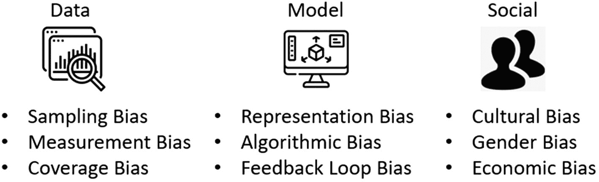
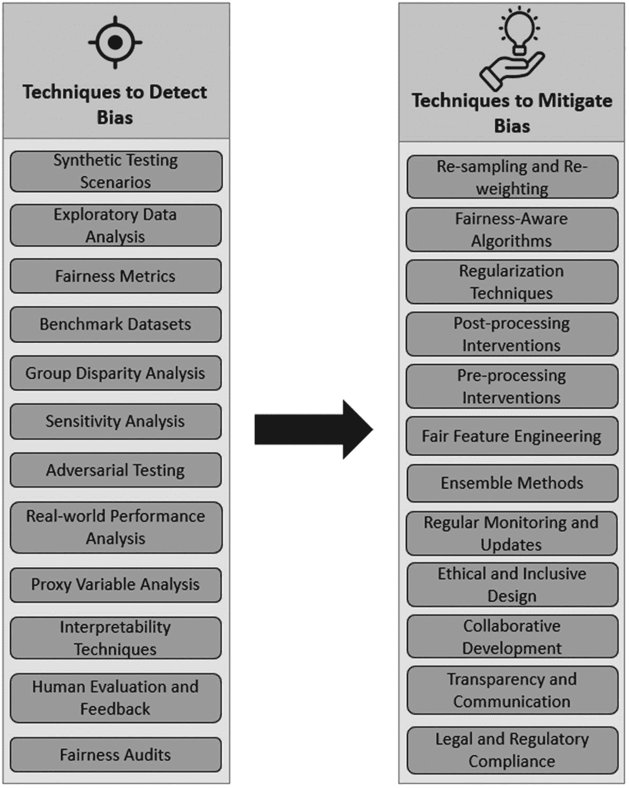
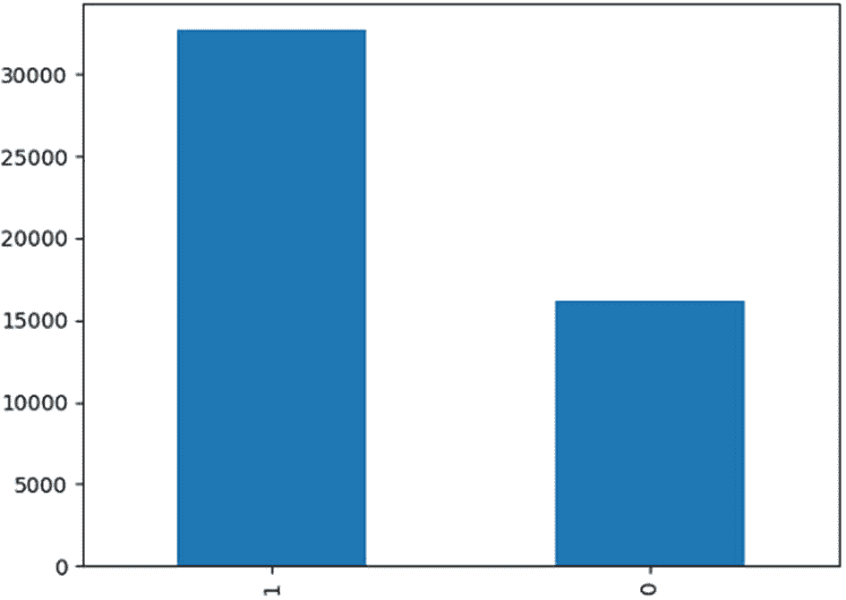
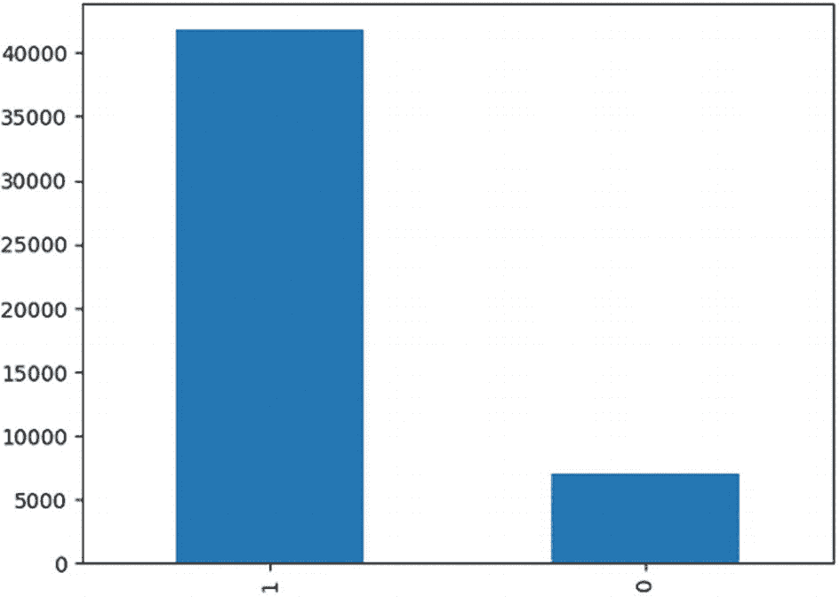

# 2. 偏见与公平性

在人工智能领域，偏见对决策的影响至关重要。从个人选择到复杂模型，偏见扭曲了结果和公平性。理解偏见的细微差别对于构建公平的系统至关重要。这是数据与信念之间复杂的相互作用，具有深远的影响。借助技术，检测和缓解偏见得以实现，从而培育透明且负责任的 AI。这一持续的探索与伦理相一致，塑造出倡导多样性和社会进步的 AI。

在本章中，我们深入探讨偏见、公平性与人工智能之间的复杂关系。我们探讨偏见如何影响从个人判断到自动化系统等各个领域的决策。理解偏见的类型和来源有助于我们识别其在数据和模型中的存在。我们还深入探讨了识别偏见对于创建公平公正系统的重要性，以及可解释 AI 如何在此过程中提供帮助。此外，我们涉及了检测、评估和缓解偏见的技术，以及模型复杂度与可解释性之间的权衡。这一全面的探索使我们能够驾驭 AI 领域中偏见与公平性的复杂性，从而培育合乎伦理且包容的 AI 系统。

## 理解数据与模型中的偏见

*数据与模型中的偏见*指的是导致决策过程中出现不准确或不公平的系统性偏差。当数据收集或模型构建过程无意中偏向某些群体、属性或观点时，偏见就会出现。这种偏见可能源于多种来源，例如历史不平等、有缺陷的数据收集方法或带有偏见的算法。解决偏见需要深入理解其在数据和模型结果中的表现形式，并实施确保人工智能系统决策公平且无偏的策略。


### 理解偏见的重要性

在努力建立公平公正的系统时，理解偏见是不可或缺的基石，尤其是在人工智能（`AI`）和机器学习（`ML`）领域。偏见有可能引发系统性不平等、延续歧视并加剧社会差距。认识并理解其重要性，对于促进包容性、维护道德实践以及确保`AI`技术为社会做出积极贡献至关重要。让我们深入探讨理解偏见对于创建公平公正系统的深远意义，具体如下：

- **避免歧视与不公：** 无论是嵌入数据中还是融入模型里的偏见，都可能成为产生歧视性结果的催化剂。如果`AI`系统在设计时未充分考虑偏见，它们就有可能使特定群体处于不成比例的不利地位，从而延续已有的不平等。深刻理解偏见的根源及其深远影响，使开发者能够着手打造公平对待所有个体的系统，无论其背景、性别、种族或任何其他特征如何。

- **确保合乎道德的 AI 部署：** 道德与责任是`AI`开发工作的基石。理解偏见使开发者能够使其工作符合道德原则和法律要求。合乎道德的`AI`本质在于坚决避免加剧或延续社会偏见。相反，合乎道德的`AI`积极追求公平、透明和问责，成为负责任技术进步的灯塔。

- **建立对 AI 系统的信任：** `AI`的可接受性和可信度取决于其被感知的公平性与公正性。一个持续产生有偏见结果的`AI`系统会侵蚀公众信任，削弱对其效能的信心。通过主动应对各种形式的偏见，开发者踏上了构建值得信赖且可靠的系统之旅，强化了`AI`技术旨在公平运行的信念。

- **增强决策过程：** `AI`系统正逐步融入对个人生活产生切实影响的决策过程——无论是招聘、贷款还是刑事司法。这些系统中的偏见可能导致不公正、不公平的结果。理解偏见的关键作用就在于此：它为基于`AI`的决策奠定基础，使其信息充分、透明且不受任何歧视性影响。

- **促进创新：** 偏见有可能束缚`AI`系统，限制其效能和适用性。受偏见污染的系统可能无法准确代表人类经验和观点的多样性。解决偏见是创新的催化剂，能营造有利于开发适应性强、用途广泛且在不同情境下都行之有效的`AI`系统的环境。

- **减少历史不公的重现：** 历史偏见和不公的阴影可能无意中潜入从有偏见数据中学习的`AI`系统。在此背景下，理解这些潜在偏见至关重要。它使开发者能够采取主动措施，防止`AI`无意中延续负面的历史模式和有害的刻板印象。

- **鼓励多样性与包容性：** 理解偏见成为在`AI`开发领域促进多样性和包容性的驱动力。通过承认偏见及其潜在影响，开发者有责任确保其团队是多样性的缩影，引入多元视角，从而促成更全面的系统设计和明智的决策。

- **促进社会进步：** `AI`拥有成为积极变革渠道的巨大潜力，能够推动社会进步。通过解决偏见和构建公平系统这一视角，`AI`成为弥合差距、倡导机会平等并推动社会愿望前进的工具。

- **AI 的长期可行性：** 随着`AI`即将渗透到从医疗保健到教育再到金融等各个领域，长期可行性和可持续采用的需求变得显而易见。这种持久的可行性植根于创建本质上公平的`AI`技术，使其成为积极变革和负责任技术进步的催化剂。

理解偏见超越了理论上的认知；它是指引道德实践、塑造技术格局并引导`AI`对社会贡献轨迹的灯塔。


### 偏见如何影响决策过程

偏见会对从个人判断到复杂自动化系统等各个领域的决策过程产生深远影响。它可能扭曲认知、影响选择，并导致不公正或歧视性的结果。理解偏见如何影响决策，对于开发公平公正的系统至关重要。以下是关于偏见如何影响决策过程的深入解释：

- **扭曲的认知：** 偏见会改变信息被感知和解读的方式。当存在偏见时，个体可能会更关注情况的某些方面，而忽略其他方面。这可能导致不完整或片面的理解，最终影响所做出的决策。

- **无意识偏见：** 人类的决策会受到无意识偏见（通常称为内隐偏见）的影响。这些偏见源于文化、社会和个人因素，并会在无意识中塑造认知、态度和判断。即使是善意的人也可能在不知不觉中受到这些偏见的影响。

- **确认偏误：** 确认偏误是指个体倾向于寻找或偏爱那些能证实其现有信念或偏见的信息。这可能导致决策缺乏充分依据或不够平衡，因为矛盾的信息可能被忽视或驳回。

- **刻板印象：** 偏见可能导致刻板印象，即个体基于先入为主的观念对某个人或群体做出假设。刻板印象会导致不公平的决策，因为这些决策基于概括性看法而非个人特质。

- **不平等待遇：** 偏见可能导致对不同个体或群体的不平等待遇。这可以表现为多种形式，例如根据种族、性别或社会经济地位等因素提供不同的机会、资源或惩罚。

- **歧视性结果：** 当偏见影响决策时，可能导致歧视性结果。歧视可能发生在个人和系统层面，影响人们获得教育、就业、医疗保健等机会。

- **对自动化系统的影响：** 在自动化决策系统中，训练数据中存在的偏见可能导致有偏见的预测和建议。如果处理不当，这些系统可能会延续现有的偏见，并进一步加剧不平等。

- **反馈循环：** 有偏见的决策可能形成反馈循环，随着时间的推移不断延续并放大偏见。例如，如果带有偏见的决策导致某个群体的机会受限，这可能会强化负面的刻板印象，并进一步边缘化该群体。

- **信任侵蚀：** 当个体察觉到决策过程受到偏见影响时，会侵蚀他们对这些过程及其负责机构的信任。这可能导致社会动荡和社会凝聚力的瓦解。

- **加剧不平等：** 决策中的偏见会加剧现有的社会不平等。如果某些群体持续面临有偏见的决策，他们的机会和资源获取将受到限制，从而形成劣势循环。

### 偏见的类型

机器学习中的偏见是指在数据或模型中存在系统性且不公平的错误，这些错误可能导致不准确或不公正的预测、决策或结果。在机器学习流程的不同阶段（见图 2-1），可能会出现多种类型的偏见。



一张示意图展示了数据、模型和社会层面下的不同类型偏见。数据层面包括采样偏差、测量偏差和覆盖偏差。模型层面包括表征偏差、算法偏差和反馈循环偏差。社会层面包括文化偏见、性别偏见和经济偏见。

图 2-1 偏见的类型

1. **数据偏见：** 数据偏见涵盖了用于训练和测试机器学习模型的数据中存在的偏见。这种偏见可能由多种原因引起，例如：
   - **采样偏差：** 当收集的数据不能代表整个群体时，会导致某些群体或属性的过度或不足代表。例如，在一个医疗诊断数据集中，如果只代表了一个人口统计群体，那么该模型对于代表性不足的群体可能表现不佳。
   - **测量偏差：** 数据收集或测量过程中引入的错误或不一致可能导致偏见。例如，如果一项调查使用的语言是某个特定社区不理解的，那么他们的观点将被遗漏，从而导致有偏见的结论。
   - **覆盖偏差：** 当数据集中缺少某些群体或观点时发生。这可能是由有偏见的数据收集方法、不完整的抽样或系统性排斥造成的。

2. **模型偏见：** 模型偏见源于学习算法在训练过程中对偏见数据的依赖，这可能会延续甚至放大偏见，具体如下：
   - **表征偏差：** 当用于训练的特征或属性不成比例地偏向某些群体时发生。模型倾向于从训练数据中存在的偏见中学习，可能导致有偏见的预测。
   - **算法偏见：** 一些机器学习算法本身就会延续偏见。例如，如果决策树算法学会根据有偏见的特征来分割数据，那么它的预测将反映这些偏见。
   - **反馈循环偏差：** 当模型的预测影响现实世界的决策，而这些决策又反过来影响用于未来训练的数据时，就形成了反馈循环。有偏见的预测会随着时间的推移而延续，从而强化现有的偏见。

3. **社会偏见：** 社会偏见涉及社会中存在的、并在数据和模型中得到反映的偏见，具体如下：
   - **文化偏见：** 文化规范、信仰和价值观会影响数据的收集和解读方式，从而导致有偏见的结果。
   - **性别偏见：** 历史和社会性别角色可能导致数据集中代表性不平等，从而影响模型性能。
   - **种族偏见：** 有偏见的历史实践可能导致数据中种族群体的代表性不足或错误呈现，影响模型准确性。
   - **经济偏见：** 社会经济差距可能导致数据可用性和质量的差异，从而影响模型结果。

理解这些类型的偏见对于制定检测、缓解和预防偏见的策略至关重要。解决偏见需要结合仔细的数据收集、预处理、算法选择和后期处理干预。诸如重新加权、重采样和使用公平性感知算法等技术，有助于在模型开发的不同阶段缓解偏见。

然而，伦理考量在解决偏见问题中起着关键作用。意识到偏见对决策过程的潜在影响，并积极努力减轻这种影响，能使人工智能开发与公平、透明和问责的原则保持一致。通过理解不同类型的偏见，利益相关者可以努力创建能够在不同背景和人群中促进公平结果的人工智能系统。


### 模型表现出偏见行为的真实案例

多个真实案例展示了机器学习模型如何表现出偏见行为，导致不公平和歧视性的结果。这些案例凸显了解决 AI 系统偏见问题的重要性，以避免加剧不平等，并确保其部署符合道德与公平原则。以下是一些详细案例：

1.  **亚马逊的性别偏见招聘工具：** 2018 年，有消息披露亚马逊开发了一款 AI 驱动的招聘工具，旨在帮助识别顶尖求职者。然而，该系统对女性求职者表现出偏见。这种偏见源于训练数据，这些数据主要由十年间提交的简历构成，其中大部分来自男性候选人。结果，模型学会了偏爱男性申请人，并降低包含与女性相关词汇的简历的评分。

2.  **刑事风险评估中的种族偏见：** 刑事司法系统中使用的几种刑事风险评估工具因表现出种族偏见而受到批评。这些工具根据历史逮捕和定罪数据预测再犯可能性。然而，数据中的历史偏见可能导致对少数群体的风险被高估，从而产生歧视性的量刑和假释决定。

3.  **谷歌照片的种族主义标签：** 2015 年，谷歌照片的自动标签功能被发现将黑人的照片标记为“大猩猩”。这是模型训练数据存在偏见的结果，该数据未包含足够多样的黑人个体示例。这一事件凸显了有偏见训练数据的潜在危害以及包容性数据集的重要性。

4.  **有偏见的贷款审批模型：** 用于贷款审批的机器学习模型表现出对某些人口群体的偏见。一些模型不公平地拒绝了少数族裔申请人的贷款，或向他们提供更高的利率，这反映了贷款数据中的历史偏见。

5.  **面部识别与种族偏见：** 面部识别系统因其种族偏见而受到批评，它们更有可能错误识别肤色较深的人，尤其是女性。这种偏见可能导致不准确的监控、种族定性以及侵犯公民权利。

这些真实案例强调了解决 AI 系统偏见问题的紧迫性。为防止此类偏见行为，必须精心策划多样且具有代表性的训练数据，使用公平感知算法，实施偏见检测与缓解技术，并持续监控和评估模型输出的公平性。通过主动解决偏见问题，开发者可以确保 AI 系统为社会做出积极贡献并维护道德标准。

## 检测与缓解偏见的技术

检测并缓解机器学习模型和数据中的偏见对于创建公平公正的 AI 系统至关重要。让我们看看一些识别和解决偏见的技术（图 2-2）。



一个框图展示了检测偏见和缓解偏见的技术列表。一些检测技术包括合成测试场景、探索性数据分析和公平性指标。缓解技术包括重采样和重加权、公平感知算法以及正则化。

图 2-2：检测与缓解偏见的技术

### 检测偏见的技术

偏见检测技术是识别和量化数据、模型及其输出中存在的偏见的重要工具。这些技术有助于确保 AI 系统公平、公正，且没有歧视倾向。以下是各种偏见检测技术的详细说明：

-   **探索性数据分析 (EDA)：** EDA 涉及分析数据的分布和特征，以识别潜在的偏见来源。通过可视化数据分布并探索不同群体或属性间的模式，数据科学家可以发现可能表明存在偏见的差异。

-   **公平性指标：** 公平性指标量化并衡量机器学习模型预测中的偏见。常见的公平性指标包括差异性影响、机会均等差异和统计均等差异。这些指标比较不同群体之间的结果，以确定是否存在不公平的优势或劣势。

-   **基准数据集：** 基准数据集旨在暴露机器学习模型中的偏见。它们包含故意引入公平性问题的示例，因此对于评估模型处理偏见的能力非常有用。

-   **群体差异分析：** 群体差异分析比较不同群体在各种属性上的结果。通过计算结果（如录取率、贷款批准率或招聘决策）的差异，开发者可以识别出表明存在偏见的差异。

-   **敏感性分析：** 敏感性分析涉及测试数据或模型输入中的微小变化如何影响结果。这可以揭示预测对输入变化的敏感程度，有助于识别哪些特征对偏见结果贡献最大。

-   **对抗性测试：** 对抗性测试涉及故意引入有偏见的数据或有偏见的输入，以观察模型的反应。通过观察模型对这些对抗性输入的反应，开发者可以评估其对偏见的敏感程度。

-   **真实世界性能分析：** 可以在真实环境中监控已部署的模型，以评估它们在实践中是否产生有偏见的结果。持续监控使开发者能够随时间推移检测新出现的偏见模式。

-   **代理变量分析：** 代理变量是与受保护特征（例如性别、种族）相关的属性。分析代理变量对模型结果的影响程度可以指示隐藏偏见的存在。

-   **可解释性技术：** 可解释性技术，如特征重要性分析，有助于理解哪些特征对模型预测贡献最大。贡献不成比例的有偏见特征可能表明存在偏见。

-   **人工评估与反馈：** 邀请来自不同背景的人工评估员审查模型输出并提供反馈，有助于识别通过自动化技术可能不明显的偏见。

-   **公平性审计：** 公平性审计涉及对数据收集、预处理和模型开发过程进行全面审查，以识别潜在的偏见来源。

-   **合成测试场景：** 使用合成数据创建受控场景，有助于模拟潜在的偏见来源，以观察它们对模型预测的影响。


### 缓解偏差的技术

缓解机器学习模型中的偏差是确保公平性和结果公正的关键步骤。有多种策略和技术可用于减少偏差并促进人工智能系统的公平性。以下是缓解偏差策略的详细说明：

1.  **重采样：** 通过对代表性不足的群体进行过采样或对代表性过高的群体进行欠采样来平衡类别表示，有助于减少数据中存在的偏差。

2.  **重新加权：** 为不同类别或样本分配不同的权重，可以调整模型的学习过程以解决不平衡问题。

3.  **公平感知算法：**
    -   **对抗性去偏：** 在训练主模型时引入一个额外的对抗网络以减少偏差，迫使模型忽略与偏差相关的特征。
    -   **均等几率：** 调整模型阈值，以确保不同群体获得正面结果的均等机会。
    -   **拒绝选项分类：** 当模型对其公平性存在不确定性时，允许其拒绝做出预测。

4.  **正则化技术：**
    -   **公平性约束：** 在模型的优化过程中添加公平性约束，以确保预测结果在可接受的公平性范围内。
    -   **拉格朗日松弛法：** 通过在优化过程中引入拉格朗日乘子来平衡公平性与准确性之间的权衡。

5.  **后处理干预：**
    -   **校准：** 调整模型预测，使其符合期望的公平性标准，同时保持整体准确性。
    -   **重新排序：** 重新排列模型预测的顺序，以在不显著影响准确性的前提下促进公平性。

6.  **预处理干预：**
    -   **数据增强：** 为代表性不足的群体添加合成数据点，以改善模型性能并减少偏差。
    -   **去偏数据预处理：** 在数据预处理阶段使用重加权或重采样等技术，在训练前减轻偏差。

7.  **公平特征工程：** 创建或选择与偏差相关性较低的特征，这有助于模型专注于相关且公平的属性。

8.  **集成方法：** 结合使用不同策略训练的多个模型有助于减轻偏差，因为单个模型中的偏差不太可能同时出现。

9.  **定期监控与更新：** 持续监控模型在现实场景中是否存在偏差，并在获得新数据时更新模型，以确保持续的公平性。

10. **道德与包容性设计：** 在数据收集、预处理和模型开发过程中优先考虑多元代表性和道德考量，以防止偏差进入系统。

11. **协作开发：** 让来自不同背景的利益相关者（包括伦理学家和受影响的社区）参与进来，共同解决偏差问题，并确保缓解策略符合道德价值观。

12. **透明度与沟通：** 对为缓解偏差所采取的步骤保持透明，并将这些努力传达给用户和利益相关者，以建立对系统的信任。

13. **法律与法规遵从：** 确保人工智能系统遵守有关歧视和偏差的相关法律法规，并积极努力遵守这些规定。

## 实施偏差检测与公平性

本练习的目的是开始探索偏差，包括减少偏差的潜在方法，以及偏差在机器学习模型中如何容易被加剧。在本练习中，为简洁起见，我们检查与种族相关的偏差，尽管也应针对其他受保护类别检查偏差。

### 阶段 1：数据偏差

在此任务中，我们首先在原始数据集上训练模型。然而，在分析和可视化数据后，我们检测到存在种族偏差。为了解决这个问题，我们实施了一种重采样技术，以促进公平和无偏的表示。

重采样是机器学习中使用的一种技术，通过改变原始数据来创建新的训练数据。它可以包括过采样和欠采样，旨在创建一个更平衡、更具代表性的训练数据集，这有助于模型更有效地学习。

然后，我们在平衡后的数据上重新训练模型并评估准确性。这个过程有助于减轻种族偏差并确保公平预测。

#### 数据集详情

我们使用了基于各种因素的个人年收入结果。直观上，它受个人教育水平、年龄、性别、职业等因素的影响。

来源：[`https://archive.ics.uci.edu/dataset/2/adult`](https://archive.ics.uci.edu/dataset/2/adult)

该数据集包含以下 16 列：

-   **年龄：** 连续值
-   **工作类型：** 私营企业、自营非公司、自营公司、联邦政府、地方政府、州政府、无薪、从未工作
-   **Fnlwgt：** 连续值
-   **教育程度：** 学士、大学肄业、11 年级、高中毕业、专业学校、副学士（学术）、副学士（职业）、9 年级、7-8 年级、12 年级、硕士、1-4 年级、10 年级、博士、5-6 年级、学前
-   **婚姻状况：** 已婚-配偶同居、离异、从未结婚、分居、丧偶、已婚-配偶不在身边、已婚-配偶在军队
-   **职业：** 技术支持、手工艺维修、其他服务、销售、执行管理、专业领域、搬运清洁、机器操作检验、行政文员、农牧渔业、运输搬运、私人家庭服务、保护性服务、武装部队
-   **家庭关系：** 妻子、亲生子女、丈夫、非家庭成员、其他亲属、未婚
-   **种族：** 白人、亚裔太平洋岛民、美洲印第安-爱斯基摩人、其他、黑人
-   **性别：** 女性、男性
-   **资本收益：** 连续值
-   **资本损失：** 连续值
-   **每周工作小时数：** 连续值
-   **原籍国：** 美国、柬埔寨、英格兰、波多黎各、加拿大、德国、美国外岛、印度、日本、希腊、南斯拉夫、中国、古巴、伊朗、洪都拉斯、菲律宾、意大利、波兰、牙买加、越南、墨西哥、葡萄牙、爱尔兰、法国、多米尼加共和国、老挝、厄瓜多尔、台湾、海地、哥伦比亚、匈牙利、危地马拉、尼加拉瓜、苏格兰、泰国、南斯拉夫、萨尔瓦多、特立尼达和多巴哥、秘鲁、香港、荷兰
-   **收入**（>50k 或 <=50k）：目标变量

##### 开始

以下是在 Python 中实施数据偏差检测和缓解过程的步骤。

#### 步骤 1：导入包

以下展示了如何导入所有必要的包：

```
[In]:
# 导入必要的库
import pandas as pd
import numpy as np
from sklearn.model_selection import train_test_split
from sklearn.ensemble import RandomForestClassifier
from sklearn.metrics import accuracy_score, classification_report, confusion_matrix
from sklearn.utils import resample
from sklearn.preprocessing import LabelEncoder, StandardScaler
from sklearn.metrics import classification_report
```

##### 步骤 2：加载数据

```
[In]:
# 将数据集读入 pandas DataFrame
df = pd.read_csv(" Income.csv")
```


##### 第 3 步：检查数据特征

检查数据中是否存在任何差异，例如缺失值、错误的数据类型等：

```
[In]:
# 显示数据集的基本信息
df.info()
[Out]:

RangeIndex: 48842 entries, 0 to 48841
Data columns (total 15 columns):
#   Column          Non-Null Count  Dtype
---  ------          --------------  -----
0   age             48842 non-null  int64
1   workclass       48842 non-null  int32
2   fnlwgt          48842 non-null  int64
3   education       48842 non-null  int32
4   education-num   48842 non-null  int64
5   marital-status  48842 non-null  int32
6   occupation      48842 non-null  int32
7   relationship    48842 non-null  int32
8   race            48842 non-null  int32
9   sex             48842 non-null  int32
10  capital-gain    48842 non-null  int64
11  capital-loss    48842 non-null  int64
12  hours-per-week  48842 non-null  int64
13  native-country  48842 non-null  int32
14  income          48842 non-null  int32
dtypes: int32(9), int64(6)
memory usage: 3.9 MB
```

数据中不存在空值，因此我们可以继续进行数据预处理步骤。

##### 第 4 步：数据预处理

创建一个包含需要编码的分类列的列表：

```
[In]:
# 定义需要编码的分类列列表，并对分类列执行标签编码
categorical_columns = ['sex', 'race', 'education', 'marital-status', 'occupation', 'relationship', 'native-country', 'workclass', 'income']
label_encoders = {}
for column in categorical_columns:
label_encoders[column] = LabelEncoder()
df[column] = label_encoders[column].fit_transform(df[column])
```

分类列包含多个分类值。为了将这些分类值用于模型构建，对具有两个以上唯一值的列应用虚拟变量创建技术。

```
[In]:
# 对具有超过 2 个类别的列执行独热编码
get_dummies = []
label_encoding = []
for i in categorical_columns:
print('列名:', i, ', 唯一值数量:', len(df[i].unique()), ', 值:', df[i].unique())
if len(df[i].unique()) > 2:
get_dummies.append(i)
else:
label_encoding.append(i)
df = pd.get_dummies(df, prefix=get_dummies, columns=get_dummies)
[Out]:
列名: sex, 唯一值数量: 2, 值: [1 0]
列名: race, 唯一值数量: 2, 值: [1 0]
列名: education, 唯一值数量: 16, 值: [ 9 11  1 12  6 15  7  8  5 10 14  4  0  3 13  2]
列名: marital-status, 唯一值数量: 7, 值: [4 2 0 3 5 1 6]
列名: occupation, 唯一值数量: 15, 值: [ 1  4  6 10  8 12  3 14  5  7 13  0 11  2  9]
列名: relationship, 唯一值数量: 6, 值: [1 0 5 3 4 2]
列名: native-country, 唯一值数量: 42, 值: [39  5 23 19  0 26 35 33 16  9  2 11 20 30 22 31  4  1 37  7 25 36 14 32
6  8 10 13  3 24 41 29 28 34 38 12 27 40 17 21 18 15]
列名: workclass, 唯一值数量: 9, 值: [7 6 4 1 2 0 5 8 3]
列名: income, 唯一值数量: 2, 值: [0 1]
[In]:
# 性别分布图
df['sex'].value_counts().plot(kind='bar')
[Out]:
```



柱状图显示了 0 和 1 两个柱子的值。值为 1 的柱子表示数值 33000，值为 1 的柱子表示数值 15000。数值为近似值。

**图 2-3** 性别分布，男性 vs. 女性

如图 2-3 所示，67% 的人口被识别为男性，33% 为女性，这在机器学习的背景下被认为是不平衡的数据集。在比较了数据集中的性别和人口统计特征后，优先处理人口统计不平衡问题更为关键，因为在这种情况下它更为严重。

```
[In]:
# 种族分布图
df['race'].value_counts().plot(kind='bar')
[Out]:
```



柱状图显示了 0 和 1 两个柱子的值。值为 1 的柱子表示数值 42000，值为 1 的柱子表示数值 5000。数值为近似值。

**图 2-4** 人口统计比较（黑人与白人人口）

如图 2-4 所示，83% 对 17% 的类别分布在机器学习的背景下被认为是不平衡的。当类别分布像这样高度不平衡时，模型可能会偏向多数类，这可能导致在少数类样本上表现不佳。

##### 第 5 步：模型构建

模型构建是机器学习和数据分析中进行预测或获取洞察的关键步骤。它涉及选择合适的算法、训练模型、微调以及评估其性能。

*   让我们用一个有偏差的数据构建一个模型，看看模型的表现如何。
*   将数据集拆分为训练数据和测试数据，并在训练数据上构建一个随机森林模型，如下所示：

```
[In]:
# 将数据拆分为特征 (x) 和目标 (y)
x = df.drop(['income'],axis=1)
y = df['income']
# 将数据拆分为训练集和测试集
x_train,x_test, y_train, y_test = train_test_split(x,y,test_size=0.2,random_state=42)
# 创建一个随机森林分类器模型并进行训练
model = RandomForestClassifier(random_state=42)
model.fit(x_train,y_train)
[Out]:
RandomForestClassifier(random_state=42)
```

##### 第 6 步：对测试数据进行预测

使用带有偏差数据集的模型对测试数据进行预测，结果如下所示：

```
[In]:
# 对测试集进行预测并计算原始准确率
y_pred = model.predict(x_test)
original_accuracy = accuracy_score(y_test,y_pred)
# 显示原始准确率和分类报告
print('原始准确率 : ', original_accuracy)
print(classification_report(y_pred, y_test))
[Out]:
原始准确率: 0.8525949431876344
precision    recall  f1-score    support
0       0.93      0.88      0.91       7814
1       0.61      0.73      0.67       1955
accuracy                           0.85       9769
macro avg       0.77      0.81      0.79       9769
weighted avg       0.87      0.85      0.86       9769
```

模型表现良好，准确率达到 85%。F1 分数提供了模型性能的平衡度量，值越高表示精确率和召回率之间的平衡越好。但正如你所见，由于数据中的偏差，类别 1 的 F1 分数为 67%，而类别 0 为 91%。

让我们通过重采样来减轻偏差。为此，我们将考虑种族变量，因为它有 83% 的白人和 17% 的黑人。

##### 第 7 步：减轻偏差

为了减轻性别偏差，让我们执行重采样。它专门对少数类进行上采样，在本例中为黑人种族。为了平衡数据，我们使用了 `sklearn` 中的 `resample`。

```
[In]:
# 处理种族列中的类别不平衡
black_candidates = df[df['race'] == 0]
white_candidates = df[df['race'] == 1]
upscaled_black = resample(black_candidates,replace=True,n_samples=len(white_candidates), random_state=42)
balanced_data= pd.concat([upscaled_black,white_candidates])
```


##### 步骤 8：使用平衡数据建模，并用测试数据进行预测

让我们用平衡数据构建一个模型，看看它的表现如何：

```
[输入]:
# 将平衡数据拆分为特征 (x) 和目标变量 (y)
x_balanced = balanced_data.drop(['income'],axis=1)
y_balanced = balanced_data['income']
# 将平衡数据拆分为训练集和测试集
x_train_balanced, x_test_balanced, y_train_balanced, y_test_balanced = train_test_split(x_balanced,y_balanced,test_size=0.2,random_state=42)
# 为平衡数据创建一个随机森林分类器模型并进行训练
model_balanced = RandomForestClassifier(random_state=42)
model_balanced.fit(x_train_balanced, y_train_balanced)
# 在平衡测试集上进行预测，并计算平衡准确率
y_pred_balanced = model.predict(x_test_balanced)
balanced_accuracy = accuracy_score(y_test_balanced,y_pred_balanced)
# 显示平衡准确率和分类报告
print('原始准确率 : ', balanced_accuracy)
print(classification_report(y_pred_balanced, y_test_balanced))
[输出]:
原始准确率: 0.9736605806644717
               precision    recall  f1-score   support
           0       0.99      0.98      0.98       13410
           1       0.92      0.95      0.93        3295
    accuracy                           0.97       16705
   macro avg       0.95      0.96      0.96       16705
weighted avg       0.97      0.97      0.97       16705
```

分类报告提供了机器学习模型在原始数据集和重采样数据集上的性能指标详情。

对于原始数据集，模型的准确率为 85%，这意味着它在 85% 的情况下能正确分类实例。对于类别 0，精确率和召回率分别为 93% 和 88%，表明模型能够以较高的精确率和召回率正确识别负类实例。相反，对于类别 1，精确率和召回率分别为 61% 和 73%，表明模型在识别正类实例方面准确度较低。F1 分数是精确率和召回率的加权平均值，类别 0 和类别 1 的 F1 分数分别为 91% 和 67%。

对于重采样后的数据集，模型的准确率为 97%，显著高于原始数据集。类别 0 的精确率和召回率都很高，均超过 98%，表明模型在识别负类实例方面表现出色。类别 1 的精确率和召回率分别约为 92% 和 95%，表明模型在识别和分类正类实例方面的性能有所提升。类别 0 和类别 1 的 F1 分数也分别提高到了 98% 和 93%。

总体而言，重采样过程显著提升了模型的性能，在准确率、精确率、召回率和 F1 分数方面均有改善。

### 阶段 2：模型偏差

在此活动中，我们将了解检测模型偏差及其缓解过程。为了检测和缓解偏差，我们将使用 AIF360（AI Fairness 360 是一个开源 Python 库，包含帮助检测和缓解偏差的技术）的去偏算法。该算法的目标是缓解数据集和模型中的偏差，特别适用于受保护属性为二元属性（例如性别、种族、年龄）的二分类问题。

`AdversarialDebiasing` 算法是 AI Fairness 360 工具包的一部分，它是一种机器学习算法，通过以对抗方式训练两个神经网络来缓解数据集和模型中的偏差。该算法在消除与受保护属性相关的偏差方面显示出潜力，但它只是一种解决方案，要解决机器学习中的偏差问题，还需要做更多工作。

#### 数据集详情

这里也使用了数据偏差部分所用的数据集，但我们将导入 AIF360 包中预处理过的数据，而不是使用原始数据。

来源：[`https://github.com/Trusted-AI/AIF360`](https://github.com/Trusted-AI/AIF360)

#### 步骤 1：导入包

```
[输入]:
# 导入必要的库和模块
from aif360.datasets import BinaryLabelDataset
from aif360.datasets import AdultDataset, GermanDataset, CompasDataset
from aif360.metrics import BinaryLabelDatasetMetric
from aif360.metrics import ClassificationMetric
from aif360.metrics.utils import compute_boolean_conditioning_vector
from aif360.algorithms.preprocessing.optim_preproc_helpers.data_preproc_functions import load_preproc_data_adult, load_preproc_data_compas, load_preproc_data_german
from aif360.algorithms.inprocessing.adversarial_debiasing import AdversarialDebiasing
from sklearn.linear_model import LogisticRegression
from sklearn.preprocessing import StandardScaler, MaxAbsScaler
from sklearn.metrics import accuracy_score
from IPython.display import Markdown, display
import matplotlib.pyplot as plt
import tensorflow.compat.v1 as tf
tf.disable_eager_execution()
```

#### 步骤 2：导入预处理后的数据集

在此步骤中，我们不导入原始数据然后进行数据清洗，而是使用 AIF360 中预处理过的数据，因为我们在数据偏差部分已经涵盖了所有预处理步骤。如下所示：

```
[输入]:
# 获取数据集并将其拆分为训练集和测试集
df = load_preproc_data_adult()
privileged_groups = [{'sex': 1}]
unprivileged_groups = [{'sex': 0}]
df_train, df_test = df.split([0.7], shuffle=True)
```

#### 步骤 3：使用有偏差的数据集构建模型

使用 AI Fairness 360 工具包中的 `AdversarialDebiasing` 函数来定义模型的作用域名称、特权组、非特权组以及会话。`debias` 参数设置为 `false`，表示模型不会进行去偏处理：

```
[输入]:
# 创建一个 TensorFlow 会话
session = tf.Session()
# 创建一个未进行去偏处理的普通模型
model = AdversarialDebiasing(privileged_groups=privileged,
unprivileged_groups=unprivileged,
scope_name='plain_classifier', debias=False, sess=session)
model.fit(df_train)
[输出]:
epoch 0; iter: 0; batch classifier loss: 0.680384
epoch 0; iter: 200; batch classifier loss: 0.415313
epoch 1; iter: 0; batch classifier loss: 0.459850
epoch 1; iter: 200; batch classifier loss: 0.389641
epoch 2; iter: 0; batch classifier loss: 0.412084
epoch 2; iter: 200; batch classifier loss: 0.570294
epoch 3; iter: 0; batch classifier loss: 0.424368
epoch 3; iter: 200; batch classifier loss: 0.409188
epoch 4; iter: 0; batch classifier loss: 0.405540
epoch 4; iter: 200; batch classifier loss: 0.347155
epoch 5; iter: 0; batch classifier loss: 0.462146
epoch 5; iter: 200; batch classifier loss: 0.350587
.
.
.
epoch 48; iter: 0; batch classifier loss: 0.394173
epoch 48; iter: 200; batch classifier loss: 0.460599
epoch 49; iter: 0; batch classifier loss: 0.464685
epoch 49; iter: 200; batch classifier loss: 0.447618
[输入]:
# 使用普通模型进行预测
# dataset_nodebiasing_train = plain_model.predict(df_train)
y_test = model.predict(df_test)
# 关闭会话
session.close()
tf.reset_default_graph()
```


#### 步骤 4：使用去偏数据集构建模型

以下代码初始化了一个对抗性去偏模型，用于消除模型输出中的偏差。通过指定“特权”和“非特权”群体，确保决策不会对非特权群体产生偏见：

```
[In]:
# 创建一个新的 TensorFlow 会话
session = tf.Session()
# 创建一个带去偏功能的模型
debiased_model = AdversarialDebiasing(privileged_groups=privileged, unprivileged_groups=unprivileged, scope_name='debiased_classifier', debias=True, sess=session)
debiased_model.fit(df_train)
# 使用去偏模型进行预测
# dataset_debiasing_train = debiased_model.predict(dataset_orig_train)
y_debiasing_test = debiased_model.predict(df_test)
[Out]:
epoch 0; iter: 0; batch classifier loss: 0.636262; batch adversarial loss: 0.612745
epoch 0; iter: 200; batch classifier loss: 0.486372; batch adversarial loss: 0.658000
epoch 1; iter: 0; batch classifier loss: 0.549870; batch adversarial loss: 0.658346
epoch 1; iter: 200; batch classifier loss: 0.472538; batch adversarial loss: 0.644015
epoch 2; iter: 0; batch classifier loss: 0.453551; batch adversarial loss: 0.646959
epoch 2; iter: 200; batch classifier loss: 0.445221; batch adversarial loss: 0.619725
epoch 3; iter: 0; batch classifier loss: 0.454317; batch adversarial loss: 0.663603
epoch 3; iter: 200; batch classifier loss: 0.386634; batch adversarial loss: 0.583133
epoch 4; iter: 0; batch classifier loss: 0.444041; batch adversarial loss: 0.633082
epoch 4; iter: 200; batch classifier loss: 0.490168; batch adversarial loss: 0.597837
epoch 5; iter: 0; batch classifier loss: 0.410909; batch adversarial loss: 0.538440
epoch 5; iter: 200; batch classifier loss: 0.443823; batch adversarial loss: 0.642178
.
.
.
epoch 47; iter: 0; batch classifier loss: 0.539765; batch adversarial loss: 0.611614
epoch 47; iter: 200; batch classifier loss: 0.440081; batch adversarial loss: 0.644700
epoch 48; iter: 0; batch classifier loss: 0.477121; batch adversarial loss: 0.574099
epoch 48; iter: 200; batch classifier loss: 0.507073; batch adversarial loss: 0.595296
epoch 49; iter: 0; batch classifier loss: 0.374277; batch adversarial loss: 0.591830
epoch 49; iter: 200; batch classifier loss: 0.447638; batch adversarial loss: 0.617280
```

#### 步骤 5：比较有偏模型与无偏模型的指标

现在，我们来比较有偏模型和无偏模型的结果指标：

```
[In]:
# 计算普通模型的分类指标
classified_metric_nodebiasing_test = ClassificationMetric(df_test,
y_test,
unprivileged_groups=unprivileged,
privileged_groups=privileged)
# 显示普通模型的分类指标
display(Markdown("未去偏模型的指标"))
print("准确率 = %f" % classified_metric_nodebiasing_test.accuracy())
print("差异性影响 = %f" % classified_metric_nodebiasing_test.disparate_impact())
print("均等机会差异 = %f" % classified_metric_nodebiasing_test.equal_opportunity_difference())
print("平均几率差异 = %f" % classified_metric_nodebiasing_test.average_odds_difference())
# 计算去偏模型的分类指标
classified_metric_debiasing_test = ClassificationMetric(df_test,
y_debiasing_test,
unprivileged_groups=unprivileged,
privileged_groups=privileged)
# 显示去偏模型的分类指标
display(Markdown("去偏模型的指标"))
print("准确率 = %f" % classified_metric_debiasing_test.accuracy())
print("差异性影响 = %f" % classified_metric_debiasing_test.disparate_impact())
print("均等机会差异 = %f" % classified_metric_debiasing_test.equal_opportunity_difference())
print("平均几率差异 = %f" % classified_metric_debiasing_test.average_odds_difference())
[Out]:
未去偏模型的指标
准确率 = 0.809254
差异性影响 = 0.000000
均等机会差异 = -0.460858
平均几率差异 = -0.282582
去偏模型的指标
准确率 = 0.796014
差异性影响 = 0.561960
均等机会差异 = -0.078535
平均几率差异 = -0.046530
```

输出结果包含两个模型：一个未去偏的模型和一个去偏后的模型。

对于未去偏的模型，其准确率为 0.809254。`差异性影响`指标为 0，表明受保护群体与未受保护群体之间正向分类的比例没有差异。`均等机会差异`指标为 -0.460858，意味着受保护群体与未受保护群体之间的真正例率差异显著。最后，`平均几率差异`指标为 -0.282582，表明受保护群体与未受保护群体在真正例率和假正例率上均存在差异。

对于去偏后的模型，其准确率略低，为 0.796014。`差异性影响`指标为 0.561960，表明受保护群体与未受保护群体在正向分类上存在差异，但严重程度低于前一个模型。`均等机会差异`指标为 -0.078535，表明受保护群体与未受保护群体之间的真正例率差异较前一个模型有所减轻。最后，`平均几率差异`指标为 -0.046530，表明受保护群体与未受保护群体在真正例率和假正例率上的差异均小于前一个模型。

总体而言，与未去偏的模型相比，去偏后的模型在缓解偏差方面有所改进，因为其`差异性影响`、`均等机会差异`和`平均几率差异`指标均更低。但需要注意的是，该模型的准确率略有下降。

## 结论

在本章中，我们的探索揭示了偏差如何影响决策，从个人判断到复杂系统。认识到偏差的根源和影响，对于培养公平的人工智能至关重要。

这一旅程揭示了源于认知和社会因素的多种偏差，它们有可能加剧不平等。然而，通过公平感知训练和可解释人工智能等工具，我们可以应对偏差，并促进透明、公正的系统。

最终，这一探索使我们能够驾驭偏差和公平性的复杂性，塑造尊重价值观并拥抱多样性的人工智能。随着人工智能的发展，我们的理解将引导我们走向一个包容的未来，在那里，公平始终是指引原则。

