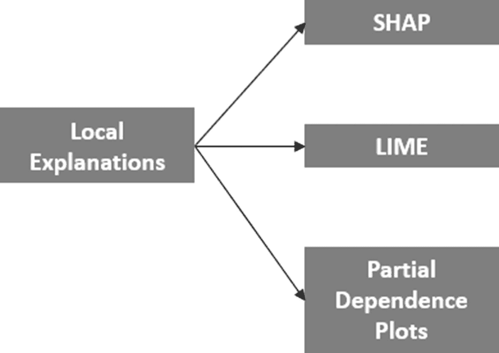
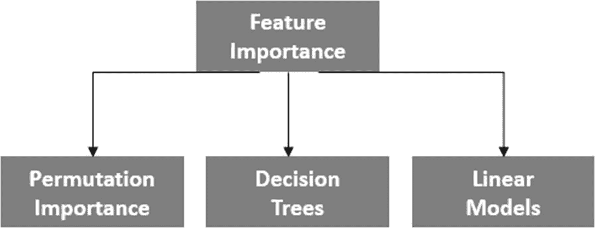
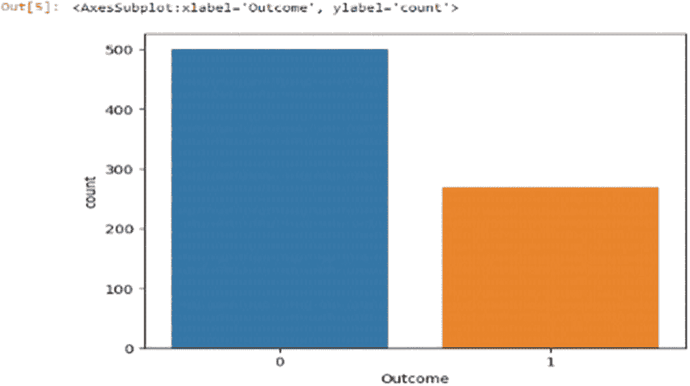
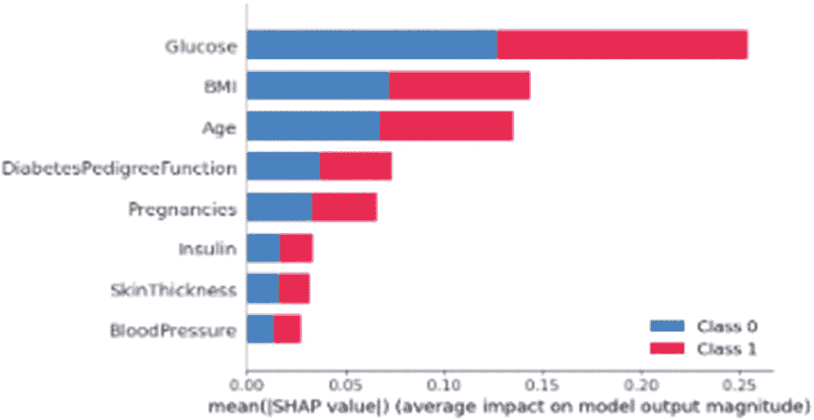
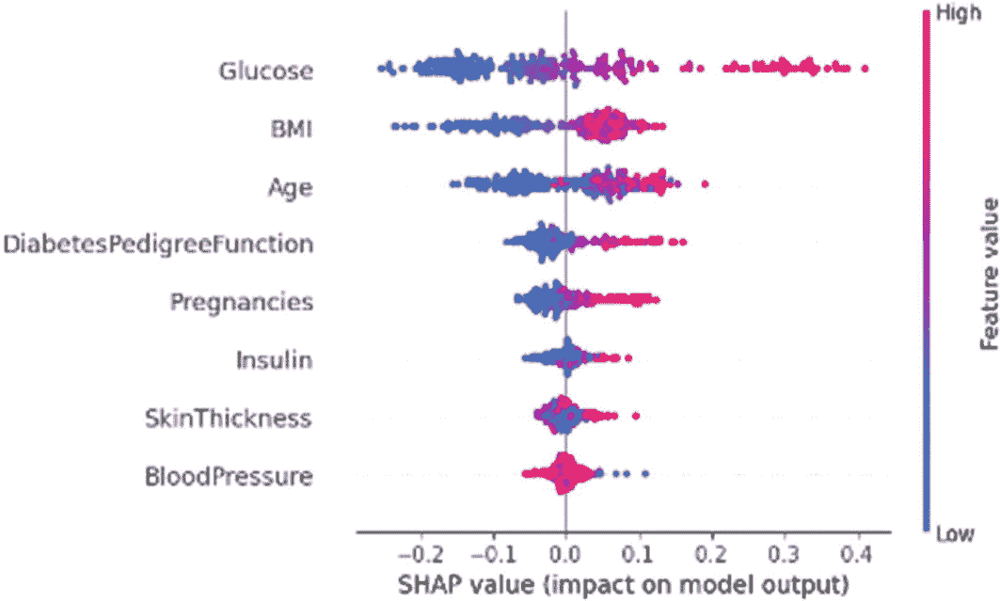
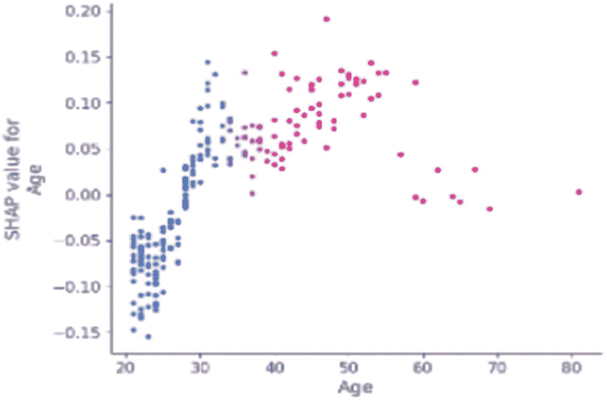
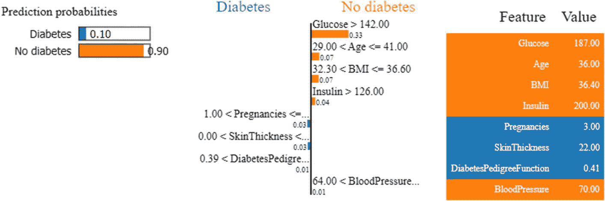

# 3. 透明度与可解释性

在人工智能（AI）快速发展的格局中，AI 系统做出的决策在我们生活的各个方面正扮演着越来越关键的角色。随着 AI 技术日益复杂，并无缝集成到医疗、金融、司法程序和自动驾驶系统等关键领域，全面理解这些系统决策过程背后的机制已成为当务之急。这凸显了秉持透明度和可解释性原则的极端重要性。

## 透明度

“透明度”指的是 AI 系统决策过程能够被理解的开放性和清晰度。本质上，它涉及揭示 AI 系统用于得出结论的内部机制、算法和数据。透明的系统使利益相关者（包括开发者、用户、监管机构，甚至普通公众）能够理解为何做出特定决策。

## 可解释性

可解释性更进一步，不仅揭示决策过程，还为此类决策提供易于理解的解释。一个可解释的人工智能系统能够描述影响特定输出的因素、特征或数据点。这不仅有助于建立信任，还能帮助诊断错误、识别偏见，并解决人工智能决策过程中潜在的伦理问题。

## 透明度与可解释性在人工智能模型中的重要性

透明度与可解释性是确保人工智能系统值得信赖、可问责且符合伦理原则的基础。以下是这些概念如何在这些重要方面发挥作用：

1.  **信任：**  

    透明度与可解释性是建立对人工智能系统信任的基石。当用户、利益相关者和公众能够理解人工智能系统如何得出结论时，他们更有可能信任其输出。在人工智能决策影响人类生活关键领域（如医疗诊断、法律判决或金融交易）中，信任尤为重要。透明且可解释的人工智能能让人们确信，该技术不会做出武断或有偏见的决策。

2.  **问责制：**  

    问责制与透明度紧密相连。当人工智能系统透明时，开发者和组织可以为其技术的功能和结果负责。如果人工智能系统做出有疑问或不正确的决策，对决策过程保持透明能使组织调查并纠正问题。这也延伸到法规遵从性，因为透明的系统更容易被审计，并确保遵守伦理和法律标准。

3.  **伦理考量：**  

    人工智能系统可能会无意中放大其训练数据中存在的偏见，导致不公平或有偏见的结果。透明度和可解释性原则在解决这一伦理问题中起着关键作用。当人工智能系统为其决策提供理由时，有助于识别影响这些决策的任何偏见模式。这使开发者和研究人员能够主动减轻偏见，并确保人工智能系统行为公平公正。

4.  **知情决策：**  

    透明且可解释的人工智能使用户和利益相关者能够基于人工智能生成的见解做出明智的决策。例如，在医疗领域，医生需要理解人工智能系统为何得出某个诊断结论，以判断其准确性和相关性。同样，基于人工智能建议做出财务决策的消费者，可以更好地评估这些建议的有效性和背后的逻辑。

5.  **错误检测与改进：**  

    透明且可解释的人工智能系统有助于检测错误、异常或意外行为。当决策过程清晰时，可以迅速识别并纠正与预期结果的偏差。这种主动方法能随着时间的推移提高人工智能系统的可靠性和稳健性。

在人工智能领域，透明度和可解释性是培养信任、问责制以及人工智能伦理发展和实施的基本原则。这些理念旨在连接人工智能系统复杂的内部机制与人类对理解和合理性的需求。随着人工智能在社会中扮演越来越重要的角色，拥有透明且可解释的人工智能系统对于打造服务于人类福祉并维持伦理标准的技术至关重要。

## 透明人工智能影响的现实案例

透明人工智能可以在各种现实场景中产生重大影响，例如：

1.  **医疗诊断：**  

    透明人工智能可以通过提高诊断准确性和透明度来显著影响医疗保健。例如，IBM 的 `Watson for Oncology` 使用透明人工智能来辅助医生进行癌症诊断和治疗建议。该系统为其建议提供解释，使医生能够理解每条建议背后的理由。这种透明度改善了医患沟通，并建立了对治疗过程的信任。

2.  **信用评分：**  

    在金融领域，透明人工智能可以解决信用评分中的偏见问题。借贷平台 `Upstart` 使用透明人工智能来评估信用度。传统的信用评分方法有时会歧视信用记录有限的个人。`Upstart` 的透明人工智能纳入了教育和职业经历等额外因素，为贷款决策提供解释，并促进公平性。

3.  **刑事司法：**  

    透明人工智能可以减轻刑事司法系统中的偏见。`Northpointe` 的 `COMPAS` 算法用于评估再犯风险，曾因潜在的种族偏见而受到批评。`ProPublica` 的调查揭示了风险评估中的差异。透明人工智能解决方案（例如斯坦福计算政策实验室开发的方案）旨在为风险预测提供清晰的解释，使法官和被告能够理解并对结果提出质疑。

4.  **自动驾驶汽车：**  

    透明人工智能对于建立对自动驾驶汽车的信任至关重要。`Alphabet Inc.` 的子公司 `Waymo` 是该领域的先驱。他们的自动驾驶汽车为驾驶决策（如变道和刹车）提供实时解释。透明人工智能帮助乘客理解车辆的行为，并建立对其在复杂交通场景中导航能力的信心。

5.  **自然语言处理：**  

    透明人工智能正在改变自然语言处理（NLP）应用。`OpenAI` 的 `GPT-3` 是一个高度先进的语言模型，可以生成类似人类的文本。为确保透明度，`OpenAI` 提供了指南，帮助用户理解如何负责任地与这项技术互动，从而降低产生偏见或不适当输出的风险。

6.  **医学与药物发现：**  

    透明人工智能有助于药物发现和医学研究。`BenevolentAI` 使用人工智能来识别针对各种疾病的潜在候选药物。他们的平台解释了为何根据某些分子的特性和相互作用将其选为候选药物。这种透明度有助于研究人员就优先研究哪些分子做出明智的决定。

7.  **在线内容审核：**  

    透明人工智能在 `YouTube` 等平台的内容审核中很有价值。`Google` 的 `Perspective API` 采用透明人工智能来标记和评估评论和讨论中可能不适当的内容。通过提供内容审核决策原因的相关见解，用户可以更好地理解社区准则。

8.  **环境监测：**  

    透明人工智能有助于环境监测和保护工作。例如，`Wildlife Insights` 利用人工智能来识别和追踪相机陷阱图像中的野生动物。该系统提供透明的分类，使研究人员能够验证和纠正识别错误，确保野生动物种群数据的准确性。

透明人工智能通过促进问责制、公平性和用户信任，正在重塑各个领域。从医疗保健和金融到刑事司法和自动驾驶汽车，现实案例展示了透明人工智能如何增强决策过程、促进公平、减轻偏见，并最终为人工智能技术的负责任和伦理使用做出贡献。

## 实现可解释人工智能的方法

实现可解释人工智能（XAI）是人工智能领域的一项关键任务，其驱动力来自于使复杂的机器学习模型更加透明和可解释的需求。一些实现 XAI 的方法包括：

### 可解释模型的解释方法：决策树与基于规则的系统

在需要透明度和理解决策过程的领域，可解释模型至关重要。决策树和基于规则的系统是能够为其预测提供清晰解释的模型范例。这些模型的解释方法在使人工智能可理解且值得信赖方面发挥着关键作用：

1. **决策树：** 决策树是一种层级结构，通过提出一系列问题来分割数据。树中的每个决策都会缩小可能性范围，直到得出最终预测。

   - **特征重要性：** 决策树根据特征对模型决策的贡献程度为其分配重要性分数。重要性越高的特征对预测的影响越大。

   - **路径解释：** 通过追踪从根节点到特定叶节点的路径，可以理解决策树如何得出特定预测。这一系列决策构成了其推理依据。

   - **可视化表示：** 可视化工具以图形方式描绘决策树。用户可以沿着分支和节点直观地把握决策过程。

   - **规则提取：** 决策树可以转化为一组 `if-then` 规则。这些规则概述了导致特定预测的条件，提供了明确的见解。

2. **基于规则的系统：** 基于规则的系统依据预定义的规则运行，这些规则规定了输入如何映射到输出。

   - **人类可读的规则：** 基于规则的系统中的规则以自然语言或简化语法表述，即使是非技术用户也能轻松理解。

   - **规则权重与确定性：** 某些基于规则的系统会为规则分配权重或确定性，以表明其重要性。这提供了对规则相对重要性的洞察。

   - **规则集简化：** 可以通过移除冗余或影响较小的规则来简化复杂的规则集。这简化了解释过程。

3. **对比解释：** 基于规则的系统可以与人类专业知识或监管指南进行对比。当规则与人类知识一致时，会增强信任度。

4. **混合方法：** 结合决策树和基于规则系统的优势可以产生更全面的解释。可以提取决策树规则并将其集成到基于规则的系统中。

像决策树和基于规则系统这样的可解释模型的解释方法，对于实现人工智能的透明度和可信度至关重要。通过为预测提供可解释的推理依据，这些方法弥合了人工智能复杂性与人类理解之间的鸿沟。在问责制、公平性和人类协作至关重要的领域，这些方法使利益相关者能够做出明智的决策，并确保人工智能在不同应用中的负责任使用。

### 生成特征重要性分数与局部解释

解释机器学习模型的决策过程对于理解其行为至关重要。生成特征重要性分数和局部解释是用于揭示单个特征贡献的技术，并能提供对模型在单个实例层面预测的洞察（图 3-1）。

1. **创建显著性图：** 解释机器学习模型的决策对于建立信任和确保人工智能的伦理使用至关重要。显著性图是一种可视化工具，帮助我们理解模型预测如何受到输入数据中不同特征的影响。显著性图突出显示了输入图像或数据实例中对模型决策过程贡献最大的相关区域。

   - **概述：** 显著性图通过分析模型输出相对于输入特征的梯度来生成。梯度指示了模型预测对输入特征变化的敏感程度。

     - **基于梯度的方法：** 基于梯度的方法，例如梯度加权类激活映射（`Grad-CAM`），计算模型预测类别得分相对于最终卷积层特征图的梯度。这些梯度用于对特征图进行加权，从而突出显示对预测影响强烈的区域。

   - **反向传播：** 反向传播计算模型输出相对于输入特征的梯度。这些梯度指示了每个输入特征对最终预测的贡献程度。

2. **生成局部解释：**

   

   一个图表显示了一个标记为“局部解释”的区块，分支指向 `SHAP`、`LIME` 和部分依赖图。

   图 3-2

   局部解释的类型

   - **概述：** 局部解释侧重于解释模型对单个实例的预测，而非整个数据集（图 3-2）。它们帮助用户理解模型为何对给定输入产生特定输出。

     - **`LIME`（局部可解释模型无关解释）：** `LIME` 在感兴趣的实例周围生成一个简化的代理模型。通过改变输入特征来创建扰动样本，代理模型学习模仿黑盒模型的预测。代理模型的解释（如特征重要性分数）会突出显示有影响力的特征。

     - **`SHAP`（`SHapley` 加法解释）：** `SHAP` 将每个预测相对于平均模型输出的偏差归因于特定特征。它考虑所有可能的特征组合并计算其贡献。正的 `SHAP` 值表示特征将预测值推高，负值则表示特征将预测值拉低。

     - **部分依赖图（`PDP`）：** `PDP` 展示了在保持其他特征不变的情况下，单个特征的变化如何影响模型预测。它有助于可视化特征与模型输出之间的关系。

3. **生成特征重要性分数：**

   - **概述：** 特征重要性分数量化了每个输入特征对模型预测的影响程度。这些分数有助于确定哪些特征在驱动模型结果方面最为相关。

     - **排列重要性：** 排列重要性涉及打乱单个特征的值，同时保持其他特征不变。当该特征被置换时，模型性能（例如准确率）的下降反映了其重要性。导致性能显著下降的特征被认为更重要。

### 特征重要性方法

### 平均不纯度减少（决策树）

对于基于决策树的模型，特征重要性可以通过平均不纯度减少来衡量。该指标计算使用特定特征进行分裂时，不纯度（如基尼不纯度）的减少量。减少量越大，表示特征重要性越高。

### 系数大小（线性模型）

在线性模型中，特征重要性可以从系数的大小推断出来。系数越大，表示特征对输出的影响越强。



框图表示特征重要性分支为排列重要性、决策树和线性模型。

**图 3-1** 特征重要性方法的类型

生成特征重要性分数和局部解释是解释机器学习模型的关键技术。它们揭示了哪些特征最重要，并帮助用户理解模型在单个实例上的行为原因。这些技术促进了信任、问责制和透明度，有助于在各个领域实现负责任的 AI 部署。

显著性图是理解机器学习模型内部工作原理的宝贵工具。通过可视化驱动模型决策的输入特征，显著性图促进了透明度、信任和问责制。这些图使用户、专家和监管者能够理解模型行为、识别偏见，并确保在不同应用中实现道德和负责任的 AI 部署。

## 透明度与可解释性的工具、框架与实现

AI 透明度与可解释性的工具、框架和实现，对于使复杂的机器学习模型变得可理解和可问责至关重要。这些资源包含多种软件库、方法论和实践，使数据科学家和开发者能够在 AI 系统中实现更高的透明度和可解释性。通过使用这些工具和框架，组织与研究人员可以增强 AI 在现实应用中的可信度和道德使用。

### AI 模型透明度工具与库概览

随着人工智能领域的发展，AI 模型的透明度和可解释性变得越来越重要。已经开发出多种工具和库，帮助从业者、研究人员和组织理解、解释并负责任地使用 AI 模型。这些工具有助于可视化、解释和评估 AI 模型的行为。

1.  **`InterpretML`**：`InterpretML` 是一个开源库，提供了多种解释机器学习模型的技术。它支持黑盒模型，并包含 `SHAP`（`SHapley Additive exPlanations`）和 `LIME`（`Local Interpretable Model-agnostic Explanations`）等方法。

    特性：

    *   支持多种机器学习模型，包括黑盒模型（指复杂的算法，如深度神经网络，因其复杂的内部工作原理而难以解释）和白盒模型（更简单且可解释，如决策树或线性回归）。

    *   实现了 `SHAP`（`SHapley Additive exPlanations`）和 `LIME`（`Local Interpretable Model-agnostic Explanations`）方法。

    *   提供模型预测的全局和局部解释。

    *   适用于表格、文本和图像数据。

    *   提供用户友好的 API，便于集成和使用。

2.  **`SHAP`（`SHapley Additive exPlanations`）**：`SHAP` 是一个用于解释任何机器学习模型输出的框架。它基于合作博弈论，计算每个特征对模型预测的贡献。

    特性：

    *   是一个基于合作博弈论的通用框架。

    *   计算用于解释模型预测的特征重要性值。

    *   提供 `Shapley` 值，确保特征之间公平分配贡献。

    *   为多种模型类型提供统一的全局和局部解释。

    *   能够量化特征贡献。

3.  **`LIME`（`Local Interpretable Model-agnostic Explanations`）**：`LIME` 是一种通过在特定实例周围训练可解释的代理模型来解释单个预测的技术。它扰动输入数据并观察对模型预测的影响。

    特性：

    *   专注于解释黑盒模型做出的单个预测。

    *   生成局部可解释的代理模型，以近似黑盒模型的行为。

    *   使用扰动样本在特定实例周围训练一个简单的可解释模型。

    *   支持表格和文本数据以生成解释。

    *   提供特定预测的特征重要性洞察。

    *   适用于在实例层面理解复杂模型行为。

4.  **`TensorBoard`**：`TensorBoard` 是由 `Google` 开发的可视化工具包，用于理解和调试基于 `TensorFlow` 构建的机器学习模型。它提供训练指标、模型图和嵌入的可视化。

    特性：

    *   由 `Google` 开发，`TensorBoard` 主要是 `TensorFlow` 模型的可视化工具包。

    *   提供训练指标、模型图、直方图、嵌入等的可视化。

    *   帮助用户跟踪模型训练进度、理解复杂架构并诊断问题。

    *   能够可视化模型行为、权重和层激活。

    *   与基于 `TensorFlow` 的项目无缝集成。

    *   通过可视化洞察，用于分析模型性能、调试和模型解释。

5.  **XAI（可解释 AI）库**：各种 XAI 库，如 `Alibi`，提供了一系列解释和解读 AI 模型的技术。例如，`Alibi` 包含反事实解释和锚点等方法。

    特性：

    *   提供多种可解释的机器学习方法。

    *   为模型预测提供 `LIME` 和 `SHAP` 解释。

    *   支持多种模型类型，包括回归和分类。

    *   包含用于更好理解的可视化工具。

    *   用于生成局部和全局解释。

6.  **`ELI5`（`Explain Like I’m 5`）**：`ELI5` 是一个 Python 库，提供机器学习模型的简单解释。它支持多种模型类型，并包含特征重要性和排列重要性等方法。

    特性：

    *   简化机器学习模型的解释。

    *   支持多种模型类型，包括基于树的、线性和文本模型。

    *   提供特征重要性、排列重要性和系数。

    *   为非技术用户提供直接的解释。

    *   适用于快速模型评估和解释。

7.  **`Yellowbrick`**：`Yellowbrick` 是一个用于可视化机器学习模型行为的 Python 库。它提供了评估模型性能、选择特征和诊断常见问题的工具。

    特性：

    *   专注于模型行为和性能的可视化。

    *   提供用于评估模型训练、选择和调试的可视化工具。

    *   包含多种可视化工具，如 ROC 曲线、特征重要性、残差等。

    *   与 `Scikit-Learn` 和其他流行库兼容。

    *   通过可视化洞察帮助理解复杂的模型输出。

旨在促进 AI 模型透明度的工具和库，在使机器学习模型更易理解、更可问责和更符合道德方面发挥着关键作用。这些资源使用户能够发现洞察、解释模型决策、识别偏见，并确保在各个领域负责任地部署 AI。随着该领域的发展，这些工具有助于在 AI 系统与其用户之间建立信任。

### 可解释人工智能的实现

融入可解释人工智能带来了诸多优势。对于决策者和相关方而言，它能提供对 AI 驱动决策背后逻辑的透彻理解，有助于做出更明智的选择。此外，它还有助于识别模型中潜在的偏差或不准确性，最终产生更精确、更公平的结果。

## 关于数据集

这些数据由美国国家糖尿病、消化和肾脏疾病研究所收集并提供，是皮马印第安人糖尿病数据库的一部分。从更广泛的数据库中选取这些实例时，应用了特定标准。值得注意的是，这里涉及的所有个体均为皮马印第安人血统（美洲原住民的一个分支），且是 21 岁及以上的女性。

来源：[`https://www.kaggle.com/datasets/kandij/diabetes-dataset?resource=download`](https://www.kaggle.com/datasets/kandij/diabetes-dataset%253Fresource%253Ddownload)

让我们来看看数据集的特征：

- `Pregnancies`：怀孕次数
- `Glucose`：口服葡萄糖耐量试验两小时后的血浆葡萄糖浓度
- `BloodPressure`：舒张压（mm Hg）
- `SkinThickness`：三头肌皮褶厚度（mm）
- `Insulin`：2 小时血清胰岛素（mu U/ml）
- `BMI`：身体质量指数（体重 kg/（身高 m）²）
- `DiabetesPedigreeFunction`：糖尿病遗传函数
- `Age`：年龄（岁）
- `Outcome`：糖尿病/非糖尿病（目标变量）

## 入门指南

目标是实现一个体现透明度、可解释性和伦理性原则的 AI 解决方案。目标是利用模型无关解释、特征重要性分析和可视化方法等技术，在模型性能与可解释性之间取得平衡。所实现的解决方案应能应对现实世界的挑战，并提升用户信任。

### 阶段 1：模型构建

模型构建是机器学习和数据分析中用于进行预测或获取洞察的关键步骤。它涉及选择合适的算法、训练模型、微调以及评估其性能。

#### 步骤 1：导入所需库

```python
# 导入必要的库
import pandas as pd
import seaborn as sns
import matplotlib.pyplot as plt
from sklearn.model_selection import train_test_split
from sklearn.tree import DecisionTreeClassifier, plot_tree
from sklearn.ensemble import RandomForestClassifier
from sklearn.metrics import classification_report
import shap
from lime.lime_tabular import LimeTabularExplainer
import eli5
```

#### 步骤 2：加载糖尿病数据集

| Pregnancies | Glucose | BloodPressure | SkinThickness | Insulin | BMI | DiabetesPedigreeFunction | Age | Outcome |
| --- | --- | --- | --- | --- | --- | --- | --- | --- |
| 6 | 148 | 72 | 35 | 0 | 33.6 | 0.627 | 50 | 1 |
| 1 | 85 | 66 | 29 | 0 | 26.6 | 0.351 | 31 | 0 |
| 8 | 183 | 64 | 0 | 0 | 23.3 | 0.672 | 32 | 1 |
| 1 | 89 | 66 | 23 | 94 | 28.1 | 0.167 | 21 | 0 |

```python
# 将数据集读入 pandas DataFrame
df = pd.read_csv('diabetes.csv')
df.head()
```

#### 步骤 3：检查数据特征

检查是否存在任何差异，例如缺失值、错误的数据类型等。

```python
# 显示数据集的基本信息
df.info()
```

```
RangeIndex: 768 entries, 0 to 767
Data columns (total 9 columns):
 #   Column                    Non-Null Count  Dtype
---  ------                    --------------  -----
 0   Pregnancies               768 non-null    int64
 1   Glucose                   768 non-null    int64
 2   BloodPressure             768 non-null    int64
 3   SkinThickness             768 non-null    int64
 4   Insulin                   768 non-null    int64
 5   BMI                       768 non-null    float64
 6   DiabetesPedigreeFunction  768 non-null    float64
 7   Age                       768 non-null    int64
 8   Outcome                   768 non-null    int64
dtypes: float64(2), int64(7)
memory usage: 54.1 KB
```

数据中不存在空值，因此我们可以继续进行数据预处理步骤。

#### 步骤 4：探索性数据分析

这是每个列的统计度量摘要。

|   | Pregnancies | Glucose | BloodPressure | SkinThickness | Insulin | BMI | DiabetesPedigreeFunction | Age | Outcome |
| --- | --- | --- | --- | --- | --- | --- | --- | --- | --- |
| **count** | 768.000000 | 768.000000 | 768.000000 | 768.000000 | 768.000000 | 768.000000 | 768.000000 | 768.000000 | 768.000000 |
| **mean** | 3.845052 | 120.894531 | 69.105469 | 20.536458 | 79.799479 | 31.992578 | 0.471876 | 33.240885 | 0.348958 |
| **std** | 3.369578 | 31.972618 | 19.355807 | 15.952218 | 115.244002 | 7.884160 | 0.331329 | 11.760232 | 0.476951 |
| **min** | 0.000000 | 0.000000 | 0.000000 | 0.000000 | 0.000000 | 0.000000 | 0.078000 | 21.000000 | 0.000000 |
| **25%** | 1.000000 | 99.000000 | 62.000000 | 0.000000 | 0.000000 | 27.300000 | 0.243750 | 24.000000 | 0.000000 |
| **50%** | 3.000000 | 117.000000 | 72.000000 | 23.000000 | 30.500000 | 32.000000 | 0.372500 | 29.000000 | 0.000000 |
| **75%** | 6.000000 | 140.250000 | 80.000000 | 32.000000 | 127.250000 | 36.600000 | 0.626250 | 41.000000 | 1.000000 |
| **max** | 17.000000 | 199.000000 | 122.000000 | 99.000000 | 846.000000 | 67.100000 | 2.420000 | 81.000000 | 1.000000 |

```python
df.describe()
```

```python
sns.countplot(x='Outcome',data=df)
```



柱状图显示了结果为 0 和 1 的计数。结果为 0 的计数为 500，结果为 1 的计数为 250。数值为近似值。

**图 3-3** 结果分布

37%对 63%的类别分布略微不平衡，但其是否可接受取决于您的具体问题和算法。某些算法可以处理这种情况，而其他算法可能需要采用过采样或欠采样等平衡技术。

#### 步骤 5：模型构建

现在我们将数据集拆分为训练集和测试集。使用糖尿病数据集构建一个随机森林分类器来预测糖尿病结果。

```python
# 分离训练和测试变量
x = df.drop('Outcome',axis=1)
y = df['Outcome']
# 创建训练和测试数据
x_train,x_test,y_train,y_test = train_test_split(x,y,test_size=0.3,random_state=101)
# 构建模型
model = RandomForestClassifier(max_features=2, n_estimators =100, bootstrap = True)
model.fit(x_train, y_train)
```

#### 步骤 6：对测试数据进行预测

```python
# 预测测试数据并生成分类报告
y_pred = model.predict(x_test)
print(classification_report(y_pred, y_test))
```

```
precision    recall  f1-score   support
           0       0.83      0.81      0.82       155
           1       0.63      0.67      0.65        76
    accuracy                           0.76       231
   macro avg       0.73      0.74      0.73       231
weighted avg       0.77      0.76      0.76       231
```

随机森林分类器在预测糖尿病结果方面表现良好，仍有改进空间，但我们现在将继续使用此模型。

现在，让我们将可解释性层集成到模型中，以便为输出提供更多洞察。下一节将重点介绍模型可解释性的两类方法：模型特定方法和模型无关方法。

### 阶段 2：SHAP

模型无关方法可以应用于任何机器学习模型，无论其类型如何。它们侧重于分析特征的输入和输出对。本节将介绍并讨论广泛使用的模型`SHAP`。

#### 步骤 1：创建解释器与特征重要性图

```python
# 创建解释器
explainer = shap.TreeExplainer(model)
shap_values = explainer.shap_values(x_test)
# 变量重要性图
figure = plt.figure()
shap.summary_plot(shap_values, x_test)
```



一张水平堆叠条形图展示了葡萄糖、BMI、年龄、糖尿病遗传函数、怀孕次数、胰岛素、皮肤厚度和血压的类别 1 和类别 2 的平均 SHAP 值。

**图 3-4** SHAP 汇总图

使用 `summary_plot()` 函数，特征会根据其平均 SHAP 值进行排序，最重要的特征位于顶部，最不重要的特征位于底部。这使得理解每个特征如何影响模型的预测变得更加容易。

图 3-4 中的图表显示，前三个条形图中每个类别所占比例相同。这表明每个特征对糖尿病（1）和非糖尿病（0）的预测影响程度相同。它证明了前三个特征具有最佳的预测能力。然而，怀孕次数、皮肤厚度、胰岛素和血压的贡献并不显著。

#### 步骤 2：汇总图

```python
shap.summary_plot(shap_values[1], x_test)
```



一张 SHAP 汇总图从上到下依次展示了葡萄糖、BMI、年龄、糖尿病遗传函数、怀孕次数、胰岛素、皮肤厚度和血压的 SHAP 值。这些图根据从低到高的特征值尺度呈现不同的颜色深浅。

**图 3-5** SHAP 输出影响图

这种方法可以更详细地展示每个属性如何影响特定结果。

- 在图 3-5 的图表中，正值将模型的预测推向糖尿病。相反，负值则推向非糖尿病。
- 升高的血糖水平可能与糖尿病风险增加有关，而低血糖水平并不表示没有糖尿病。
- 类似地，年龄较大的患者更有可能被诊断为糖尿病。然而，模型对于年轻患者的诊断似乎不确定。

对于年龄属性，处理此问题的方法是使用依赖图来获取更详细的见解。

#### 步骤 3：依赖图

依赖图展示了每个数据实例中特征与结果之间的关系。它不仅仅是收集额外的具体数据，还通过确认或质疑其他全局特征重要性度量的结果，来验证所分析特征的重要性。

```python
shap.dependence_plot('Age', shap_values[1], x_test, interaction_index="Age")
```



一张年龄的 SHAP 值相对于年龄的散点图，展示了以不同颜色着色的点的分布。这些图最初呈上升趋势，大约在 55 岁后下降。

**图 3-6** SHAP 依赖图

依赖图显示，30 岁以下的患者被诊断为糖尿病的风险较低。相比之下，30 岁以上的个体被诊断为糖尿病的可能性更高。

### 阶段 3：LIME

让我们使用训练数据和目标来拟合 LIME 解释器。将模式设置为分类。

#### 步骤 1：拟合 LIME 解释器

```python
class_names = ['糖尿病', '非糖尿病']
feature_names = list(x_train.columns)
explainer = LimeTabularExplainer(x_train.values, feature_names =
feature_names,
class_names = class_names,
mode = 'classification')
```

#### 步骤 2：绘制解释器

让我们使用随机森林显示测试数据中第一行的 LIME 解释，并展示特征贡献。

结果包含三个主要信息：

1. 模型的预测
2. 特征的贡献
3. 每个特征的实际值

```python
explainer = explainer.explain_instance(x_test.iloc[1], model.predict_proba)
explainer.show_in_notebook(show_table = True, show_all = False)
```



一张图示展示了糖尿病的预测概率。糖尿病的值为 0.10，而非糖尿病的值为 0.90。右侧的表格列出了 8 个特征的值，并高亮显示了怀孕次数、皮肤厚度和糖尿病遗传函数。

**图 3-7** LIME 解释器

我们观察到它预测 90% 为非糖尿病，因为如图 3-7 所示，

- 血糖水平大于 142；
- 年龄介于 29 到 41 之间；
- BMI 介于 32 到 36 之间；并且
- 胰岛素大于 126。

### 阶段 4：ELI5

ELI5 是一个 Python 包，允许检查机器学习分类器并为其预测提供解释。它是调试机器学习算法的常用工具，例如 scikit-learn 回归器和分类器、XGBoost、CatBoost、Keras 等。借助 ELI5，开发人员和数据科学家可以更好地理解模型如何得出特定结果，识别模型的任何限制或问题，并最终提高模型的准确性和可靠性。

来源：[`https://github.com/TeamHG-Memex/eli5`](https://github.com/TeamHG-Memex/eli5)

#### 步骤 1：查看拟合模型的权重

这使用 ELI5 显示模型的权重及其对应的特征名称。

| 权重 | 特征 |
| --- | --- |
| 0.2678 ± 0.1203 | 葡萄糖 |
| 0.1609 ± 0.1013 | BMI |
| 0.1385 ± 0.0899 | 年龄 |
| 0.1244 ± 0.0692 | 糖尿病遗传函数 |
| 0.0895 ± 0.0565 | 血压 |
| 0.0869 ± 0.0635 | 怀孕次数 |
| 0.0670 ± 0.050 | 皮肤厚度 |
| 0.0652 ± 0.0639 | 胰岛素 |

```python
# 获取数据集中所有特征名称/列的列表
all_features = x.columns.to_list()
# 使用 ELI5 显示模型的权重，并提供特征名称
eli5.show_weights(model, feature_names=all_features)
```

上表给出了每个特征对应的权重。该值告诉我们一个特征对预测的平均影响程度，而符号则告诉我们影响的方向。在这里，我们可以观察到“葡萄糖”特征的权重最高，为 0.2678 ± 0.1203，这意味着它对算法的预测影响最大。

此表可用于识别与算法预测高度相关的最具影响力的特征。

## 步骤 2：解释测试数据

此处展示了 `ELI5` 结合特征值的预测解释。

| 贡献值 | 特征 | 数值 |
| --- | --- | --- |
| 0.348 | `<BIAS>` | 1 |
| 0.325 | `Glucose` | 187 |
| 0.083 | `BMI` | 36.4 |
| 0.047 | `Age` | 36 |
| 0.019 | `DiabetesPedigreeFunction` | 0.408 |
| 0.011 | `BloodPressure` | 70 |
| 0.01 | `Insulin` | 200 |
| 0.001 | `Pregnancies` | 3 |
| -0.005 | `SkinThickness` | 22 |

```
[In]:
# 使用 ELI5 展示测试样本之一的预测结果（此处仍为样本 1）
# 将 show_feature_values 参数设为 True 以显示特征值
eli5.show_prediction(model, x_test.iloc[1], feature_names=all_features, show_feature_values=True)
[Out]:
y=1 (概率 0.840) 主要特征
```

该表格表明，给定实例被分类为“1”的概率为 0.840。表格按降序展示了对此预测贡献最大的主要特征，其依据是预测时分配给每个特征的权重值。

表格第一行的值为 0.348，代表偏置项，这是每个预测中默认添加的值，对模型输出具有固有贡献。其他特征的贡献均与此偏置项进行比较。我们可以观察到，特征 `Glucose` 的贡献最高，为 0.325，其次是 `BMI`（贡献值 0.083）和 `Age`（贡献值 0.047）。`DiabetesPedigreeFunction`、`BloodPressure`、`Insulin`、`Pregnancies` 和 `SkinThickness` 这些特征的影响较小，贡献值在 0.001 到 0.019 之间。

该输出通过粗略展示每个特征对该实例最终预测的贡献程度，有助于理解不同特征在预测结果中的相对重要性。

### 阶段 5：结论

本练习对可解释人工智能进行了不错的入门介绍，并阐述了一些有助于建立信任的原则，这些原则能够为数据科学家及其他利益相关者提供必要的技能，以辅助做出有意义的决策。

## 实现透明度与可解释性面临的挑战及解决方案

深度学习与复杂人工智能架构中的复杂性挑战是重大障碍，这些挑战源于先进模型的复杂本质以及对更高性能的日益增长的需求。这些挑战涵盖多个方面，包括模型可解释性、训练难度、计算资源以及伦理考量。下面我们来详细探讨这些挑战：

1.  **黑箱特性：** 深度学习模型，尤其是神经网络，由多个包含大量参数的层级构成。这种复杂性使它们能够捕捉数据中的复杂模式。

    挑战：高度复杂的模型可能难以解释和理解。随着层数和参数的增加，决策过程会变得更加不透明。

2.  **数据驱动的复杂性：** 包括深度学习模型在内的复杂人工智能架构对数据需求量大，需要海量数据进行训练。

    挑战：获取和预处理大型数据集可能耗费大量资源和时间。数据中存在的偏差也可能导致模型输出出现偏差。

3.  **准确性与可解释性：** 人工智能中准确性与可解释性之间的权衡，源于这样一个事实：随着模型变得越准确、越复杂，其决策过程就越难理解。虽然高精度模型通常采用复杂的架构，能够取得显著成果，但其复杂性可能掩盖预测背后的原因。然而，可解释性更强的模型往往更简单、更容易理解，但可能会牺牲一些准确性。要找到恰当的平衡点，需要仔细考虑应用需求、伦理问题以及建立用户和利益相关者信任所需的透明度。

    挑战：平衡准确性与可解释性之间的权衡，在确定理想平衡点时面临挑战——即模型复杂度既能保证高精度，又能产生可理解的结果。高精度的复杂模型可能难以解释，从而引发用户信心下降和监管合规问题。反之，为追求极致可解释性而设计的模型可能牺牲准确性，限制其实际应用范围。实现平衡需要管理伦理方面的问题、遵守法规并减轻潜在偏差，同时提供用户能够轻松理解并信赖的精确结果。

### 应对 AI 模型的“黑箱”特性

应对 AI 模型的“黑箱”特性，需要努力让复杂的机器学习算法更加透明和易于理解。这对于确保 AI 系统值得信赖、可被验证，以及其决策过程能够被解释和解读至关重要。我们采用各种技术、工具和方法来揭示 AI 模型如何以及为何得出其预测结果，从而在各类应用中增强其可问责性、公平性和道德性。

1.  **模型选择：**

    说明：选择具有内在可解释性或能产生可理解输出的模型。

    方法：优先选用决策树、线性回归或基于规则的模型等更具可解释性的模型。这些模型能提供关于特征如何影响预测的洞察。

2.  **架构简化：**

    说明：使用复杂模型的简化版本，以便于解释。

    方法：与其部署深度神经网络，不如考虑使用层数更少、架构更小的模型，使其更易于理解。

3.  **混合模型：**

    说明：将复杂模型与可解释组件相结合。

    方法：构建包含决策规则等可解释组件的混合模型，使用户能够理解决策过程的某些部分。

4.  **局部解释：**

    说明：为单个预测结果提供解释。

    方法：采用 `LIME`（局部可解释模型无关解释）或 `SHAP`（沙普利加性解释）等技术，为特定预测生成解释。

5.  **特征重要性分析：**

    说明：理解各个特征对预测结果的贡献。

    方法：使用 `SHAP` 或特征重要性评分等技术，识别对模型输出影响最大的特征。

6.  **替代模型：**

    说明：创建简化的替代模型来模仿黑箱模型的行为。

    方法：训练线性回归等可解释模型来近似复杂模型的预测。这些替代模型能提供对决策过程的洞察。

7.  **可视化技术：**

    说明：将模型行为和预测结果可视化。

    方法：利用 `SHAP` 图、显著性图或特征贡献图等可视化工具，使模型的决策过程更易于理解。

8.  **反事实解释：**

    说明：生成为获得不同模型结果所需改变输入的示例。

    方法：通过向用户展示对输入数据进行哪些修改会导致不同的预测结果，来解释模型的预测。

9.  **上下文信息：**

    说明：融入领域特定知识，为模型输出提供上下文背景。

    方法：提供关于影响模型决策的相关因素或领域特定规则的信息。

10. **研究与教育：**

    说明：推动可解释 AI 领域的研究与教育。

    方法：鼓励 AI 社区开发增强可解释性的技术和框架。教育用户了解 AI 系统的局限性和可能性。

11. **伦理考量：**

    说明：解决与模型不透明性相关的伦理问题。

    方法：实施识别和减轻偏见的机制，确保黑箱模型做出的决策是公平且无偏的。

12. **法规与标准：**

    说明：倡导制定要求 AI 系统具备可解释性的法规。

    方法：支持制定定义各行业 AI 模型透明度要求的标准。

13. **模型内部机制研究：**

    说明：探究黑箱模型的内部工作原理。

    方法：研究能够理解复杂模型的技术，例如可视化激活、注意力机制或显著性图。

应对某些 AI 模型的“黑箱”特性，需要综合运用模型选择、解释技术、可视化、教育和伦理考量。随着 AI 技术的进步，提升透明度和可解释性的努力，对于构建值得信赖、可问责且能被用户、监管机构和利益相关者理解与接受的 AI 系统，将变得愈发重要。

### 平衡模型性能与可解释性

平衡模型性能与可解释性，是指在复杂机器学习模型的准确性与更简单、可解释模型的透明度之间找到恰当权衡的实践。这对于确保人工智能系统既能提供准确结果，又能让人类理解这些结果是如何以及为何产生的至关重要。在信任、问责制和伦理考量至关重要的应用中，达成这种平衡尤为关键。

1.  **理解权衡关系：**

    -   **说明：** 随着模型复杂度的增加，性能通常会提升，但可解释性可能会下降。

    -   **方法：** 认识到在追求最高准确性与保持解释和理解模型决策的能力之间存在权衡。

2.  **领域与应用背景：**

    -   **说明：** 在决定所需可解释性水平时，需考虑领域和应用场景。

    -   **方法：** 在透明度和问责制至关重要的应用中，即使性能略低，也应优先选择更具可解释性的模型。

3.  **用例分析：**

    -   **说明：** 评估特定用例及其对性能与可解释性平衡的影响。

    -   **方法：** 确定可解释性对于法律合规、伦理考量或用户信任是否更为关键，并据此调整模型复杂度。

4.  **模型选择：**

    -   **说明：** 选择那些天生就能平衡性能与可解释性的模型。

    -   **方法：** 优先选择决策树、线性回归或基于规则的系统等模型，它们在提供合理准确性的同时更具可解释性。

5.  **特征选择与工程：**

    -   **说明：** 通过关注相关特征并减少噪声来简化模型。

    -   **方法：** 特征选择与工程通过聚焦最重要的输入变量，有助于在保持可解释性的同时提升模型性能。

6.  **正则化技术：**

    -   **说明：** 使用正则化来控制模型复杂度并防止过拟合。

    -   **方法：** 诸如 L1 或 L2 正则化等技术有助于平衡模型性能，防止模型变得过于复杂。

7.  **集成模型：**

    -   **说明：** 将多个简单模型组合成集成模型以提升整体准确性。

    -   **方法：** 集成方法（如随机森林）通过组合多个基础模型，可以在提升性能的同时保留一定程度的可解释性。

8.  **模型剪枝：**

    -   **说明：** 修剪复杂模型中不必要的部分以简化模型。

    -   **方法：** 剪枝会移除对模型性能贡献不大的部分，从而得到一个更精简、更易于理解的模型。

9.  **可解释性技术：**

    -   **说明：** 对复杂模型应用模型无关的可解释性技术。

    -   **方法：** 诸如 `LIME` 和 `SHAP` 等技术可以为特定预测提供解释，为黑盒模型增加透明度，同时不影响性能。

10. **文档与沟通：**

    -   **说明：** 向利益相关者和用户传达权衡关系。

    -   **方法：** 记录模型的复杂度水平、优势与局限性，以及模型选择背后的理由，以管理预期。

11. **逐步增加复杂度：**

    -   **说明：** 从简单模型开始，逐步增加复杂度。

    -   **方法：** 如有必要，先从可解释模型入手，只有当性能提升显著且理由充分时，才转向更复杂的架构。

12. **以用户为中心的方法：**

    -   **说明：** 在模型开发中优先考虑用户需求与理解。

    -   **方法：** 根据用户的背景、专业知识和偏好，定制模型的复杂度与可解释性水平。

平衡模型性能与可解释性需要一种深思熟虑的方法，需考虑具体应用、利益相关者需求以及伦理考量。找到恰当的平衡点，能确保人工智能系统不仅准确，而且透明、可解释且值得信赖，从而培养用户信任，并实现负责任的人工智能部署。

### 模型复杂度、性能与可解释性之间的权衡

在机器学习领域，构建模型需要在几个重要因素之间取得平衡：模型复杂度、性能和可解释性。这些方面各自影响着模型的整体有效性和可用性，但它们通常存在一种权衡关系，即提升某一方面可能以牺牲另一方面为代价。

#### 模型复杂度

模型复杂度指的是模型内部关系和模式的精细程度。复杂模型能够捕捉精细的模式，但它们也可能更容易过拟合，即模型过于紧密地拟合训练数据，而在新的、未见过的数据上表现不佳。

#### 性能

模型性能衡量的是模型将其预测泛化到未见数据上的能力。高性能模型表现出低错误率和准确的预测。实现高性能是机器学习的一个基本目标，尤其是在图像识别、自然语言处理和医疗诊断等应用中。

#### 可解释性

可解释性指的是理解和解释模型如何得出其决策的能力。可解释的模型为其预测提供清晰的依据，这能增强用户信任并便于调试。在透明度、问责制和伦理考量至关重要的领域，可解释性尤为关键。

#### 权衡：模型复杂度与性能

模型复杂度与性能之间的权衡是机器学习中的一个基本考量。随着模型复杂度的增加，其在训练数据上的性能或准确性通常会提升。然而，这可能会以降低可解释性和增加过拟合风险为代价，即模型拟合的是数据中的噪声而非潜在模式。更简单的模型更具可解释性，但可能会牺牲一些性能。找到恰当的平衡点是一个关键挑战，它取决于每个机器学习任务的具体要求和约束。

-   复杂模型（例如深度神经网络）可以通过捕捉数据中的精细模式来实现高性能。

-   然而，增加复杂度可能导致过拟合，使模型在新数据上表现不佳。

-   实现高性能通常需要在复杂度与正则化技术之间取得平衡，以防止过拟合。

#### 模型复杂度与可解释性

模型复杂度与可解释性之间的权衡是机器学习中的一个核心挑战。它涉及在以下两者之间找到恰当的平衡：使用能够实现高预测性能但难以解释的复杂模型，以及使用更具可解释性但可能牺牲部分预测准确性的简单模型。在许多现实世界的应用中，特别是那些具有高风险或监管要求的应用，实现模型复杂度与可解释性之间的平衡至关重要。选择取决于任务的具体需求和约束，以及理解模型如何以及为何做出预测的重要性。

-   复杂模型由于其复杂的结构和大量的参数，往往可解释性较差。

-   随着模型复杂度的增加，理解决策过程变得具有挑战性。

-   简化模型（例如线性回归）更具可解释性，但可能会牺牲一些性能。

#### 性能与可解释性

平衡模型性能与可解释性，关键在于在高准确率与模型透明度之间找到恰当的权衡。复杂模型能提供更优性能，但可解释性较差；而简单模型更易于理解，但可能会牺牲部分准确率。具体选择取决于实际应用场景以及对模型决策过程洞察的需求。

-   高性能模型可能依赖于难以解释的复杂“黑箱”结构。

-   模型性能有时会以降低可解释性为代价。

-   实现平衡涉及使用模型无关的解释方法（`LIME`、`SHAP`）或结合两者优势的混合模型。

模型复杂度、性能与可解释性之间的权衡，是机器学习模型设计与部署的核心。找到恰当的平衡点取决于应用需求、用户期望以及伦理考量。理解这些权衡，能使从业者就模型设计与优化做出明智决策，从而构建负责任且高效的 AI 系统。

## 结论

本章涵盖了 AI 透明性与可解释性的多个方面，包括其重要性、挑战、方法、工具、实际案例等。我们深入探讨了这些概念对于建立用户信任、确保公平性以及解决 AI 系统中伦理问题的重要意义。我们探索了实现透明性与可解释性的策略，例如模型可解释性技术、特征重要性分析以及可视化方法。

在模型复杂度方面，我们审视了深度学习及复杂 AI 架构在理解性、问责性、偏见、公平性等方面带来的挑战。我们深入探讨了模型性能与可解释性之间的权衡，并强调了指导此类决策时应遵循的伦理考量。

此外，我们还讨论了可解释 AI 在预防偏见、歧视和社会不平等方面的必要性。我们认识到透明度在增强用户信任与信心方面的价值，同时也承认部署复杂 AI 模型所固有的挑战。

总而言之，对 AI 透明性与可解释性的探索揭示了其在构建负责任、合乎伦理且值得信赖的 AI 系统中的关键作用。随着 AI 技术的持续演进，我们所讨论的这些原则将如同指路明灯，确保创新与社会价值观、用户需求及伦理考量保持一致。追求透明且可解释的 AI，将为所有人创造一个更具包容性、更负责任且更积极的 AI 未来。