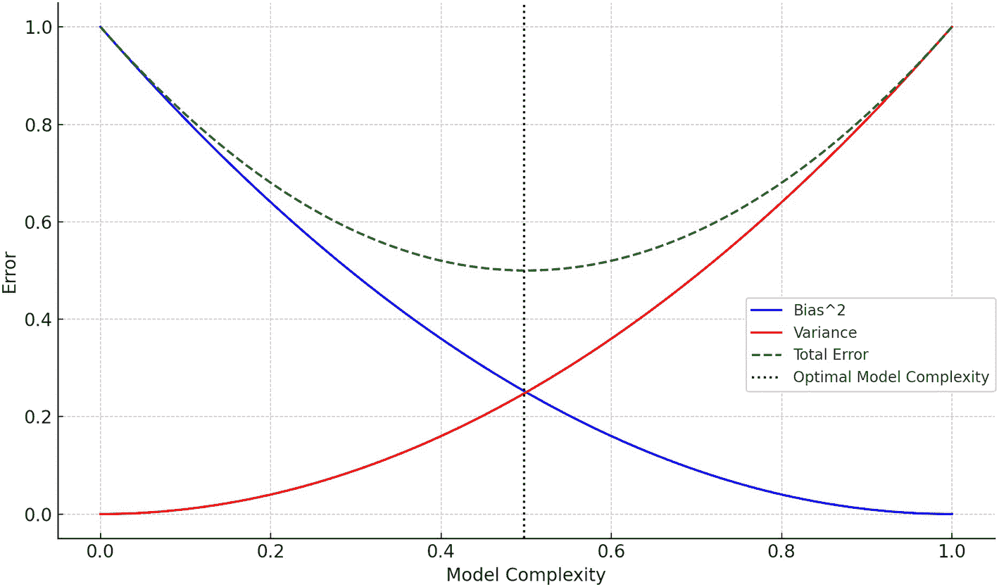

# 5. 鲁棒性与可靠性

尽管围绕人工智能（AI）的兴奋点大多集中在实现高准确率和出色性能上，但鲁棒性与可靠性的重要性却常常被忽视。这些基础要素是构建真正有效且安全的 AI 系统的基石。在一个日益依赖自动化决策的世界里，AI 模型的鲁棒性——即在多变条件下稳定运行的能力——以及可靠性——即产生可信且可重复结果的能力——不仅是理想特质，更是绝对必要。

AI 在现实世界中的应用远比受控的实验室环境复杂且不可预测。AI 模型被部署在医疗诊断、自动驾驶导航、金融欺诈检测以及其他许多关键领域。在这些场景中，模型若缺乏鲁棒性和可靠性，其后果可能从经济损失到危及人类生命。因此，理解如何构建并验证鲁棒且可靠的 AI 模型，不仅是学术研究，更是实际需求。

本章旨在深入探讨确保 AI 系统鲁棒性与可靠性的复杂性。我们将研究开发者和数据科学家在从原型过渡到生产级模型时所面临的挑战与陷阱。本章将涵盖一系列技术，从增强鲁棒性的数据预处理方法到确保可靠性的高级算法，并附有实践代码示例来演示这些技术，提供理解与实现它们的动手实践方法。


## 鲁棒性与可靠性概念

AI 中的鲁棒性指的是系统在面对不利条件或意外输入时保持性能的韧性和能力。这一特性至关重要，尤其是当 AI 模型部署在动态环境中时，它们会遇到多样化的数据模式、噪声，甚至有人蓄意欺骗或操纵（如对抗性攻击）。例如，一个鲁棒的图像识别系统应能准确识别图像中的物体，即使图像部分被遮挡、扭曲或处于不同光照条件下。鲁棒性的核心在于确保 AI 系统能够处理不确定性、异常值和离群点，而不会显著降低性能。

另一方面，可靠性强调 AI 系统在不同场景下随时间推移保持一致的性能。它关乎可信赖性，确保系统在每次被调用时都能按预期运行。在医疗或金融等领域，AI 做出的决策可能产生深远影响，可靠性因此变得至关重要。例如，一款医疗诊断 AI 工具必须长期持续、准确地从患者数据中识别疾病，无论数据量或数据来源如何。可靠性确保用户能够依赖 AI 系统提供可预测且稳定的结果，从而增强信任并促进 AI 技术的更广泛采用。

### 在 AI 系统中的重要性

在当今数字时代，AI 系统已深度嵌入众多应用，从医疗诊断到金融预测，从自动驾驶汽车到内容推荐。AI 在各领域的广泛影响凸显了鲁棒性和可靠性在这些系统中的极端重要性。让我们深入探讨为何这些属性在 AI 应用中如此关键：

*   **医疗领域：** 在医学影像领域，AI 模型协助放射科医生在 X 光片和 MRI 扫描中检测肿瘤或异常。鲁棒的 AI 系统能有效处理低质量图像或带有意外伪影的图像。然而，如果系统缺乏鲁棒性，它可能会误判这些伪影，导致误诊。可靠性则确保在不同扫描和患者之间提供一致的诊断建议。一个不可靠的系统可能会漏诊一位患者的肿瘤，却在另一位情况相似的患者身上检测到，可能导致病情未得到治疗或进行不必要的医疗程序。

*   **自动驾驶汽车：** 自动驾驶汽车高度依赖 AI 来解读周围环境并做出决策。一个不鲁棒的 AI 可能会将水坑误判为坑洞，导致不必要的避让操作。可靠性确保汽车的 AI 系统能持续识别并响应停车标志、交通信号灯和其他信号。一个不可靠的系统可能会偶尔忽略停车标志，给乘客和行人带来重大安全风险。

*   **金融领域：** 金融领域的 AI 驱动算法预测股市走势、评估贷款资格并检测欺诈交易。缺乏鲁棒性时，算法可能会误判市场异常，导致重大财务损失。可靠性确保在分析海量数据集时 AI 决策的一致性。一个不可靠的模型可能会批准高风险贷款，使金融机构面临潜在的违约风险。

*   **电商与内容平台：** Netflix 或亚马逊等平台使用 AI 进行推荐。缺乏鲁棒性时，用户浏览模式的暂时变化（如访客使用其账户）可能会使推荐结果在数周内出现偏差。可靠性确保用户持续获得高质量的推荐。一个不可靠的系统可能会推荐不相关的产品，导致销售额下降和用户不满。

*   **智能助手：** Alexa 或 Siri 等设备解读并响应用户指令。缺乏鲁棒性时，它们可能会因背景噪音或不同口音而误解指令，导致错误操作。可靠性确保设备响应的一致性和准确性。一个不可靠的助手可能会设置错误时间的闹钟或播放不想要的歌曲，降低用户体验。

在所有这些场景中，缺乏鲁棒性会导致 AI 系统在面对意外数据或条件时做出错误决策，通常会造成财务损失、用户信任受损，甚至威胁安全。缺乏可靠性则使 AI 性能变得不可预测，进一步削弱信任，并可能导致决策中反复出现错误。在医疗或自动驾驶等关键应用中，这些缺陷可能带来严重后果，从财务影响到对人类生命的威胁。

### 衡量鲁棒性与可靠性的指标

为确保 AI 系统既鲁棒又可靠，拥有能够评估这些属性的量化指标至关重要。这些指标提供了一种标准化的方式来评估和比较不同模型，指导 AI 系统的开发和部署。

#### 鲁棒性指标

**扰动容忍度**评估模型在微小输入扰动下的性能。如果模型在输入数据略有改变时仍能保持预测一致，则认为该模型是鲁棒的。

给定输入`x`及其扰动版本`x'`，扰动容忍度定义为模型预测的差异：

```
容忍度 = |f(x) - f(x')|
```

其中`f`是模型的预测函数。

**对抗鲁棒性**衡量模型对对抗性攻击的抵抗力，此类攻击中输入被蓄意修改以误导模型。给定一个为最大化预测误差而精心构造的对抗性输入`x_adv`，对抗鲁棒性即为原始输入与对抗性输入上预测结果的差异：

```
鲁棒性 = |f(x) - f(x_adv)|
```

**分布外检测**评估模型识别和处理非训练分布输入的能力。接收者操作特征曲线下面积（AUROC）常用于分布外检测。AUROC 越高，表示分布外检测能力越好。

#### 可靠性指标

**一致性**衡量模型在多次运行中产生一致预测的能力，尤其在随机模型中。

给定同一输入`x`在不同运行中的多次预测`f1(x)`、`f2(x)`、`f3(x)`、……、`fn(x)`，一致性即为这些预测的方差：

```
一致性 = f1(x), f2(x), f3(x), ..., fn(x) 的方差
```

因此，方差越低表示一致性越高。

**平均故障间隔时间**是借鉴自传统可靠性工程的一个指标，表示系统故障之间的平均时间。在 AI 系统中，“故障”可定义为错误预测、API 错误或任何其他不良结果。

```
MTBF = 总运行时间 / 故障次数
```

在概率模型中，**覆盖率**表示模型预测的置信区间包含真实值的实例比例。覆盖率高的模型被认为更可靠。

将这些指标纳入评估过程，可确保从鲁棒性和可靠性角度对 AI 模型进行全面评估。通过量化这些属性，开发者和利益相关者能够就模型部署和进一步优化做出明智决策。


## 实现鲁棒性面临的挑战

到目前为止，我们已经了解到 AI 模型具备鲁棒性的重要性。然而，实现鲁棒性并非易事。随着 AI 模型日益复杂，它们会面临各种可能削弱其鲁棒性的挑战。从故意误导模型的对抗性输入，到模型在训练数据上表现优异但在新数据上表现欠佳的过拟合陷阱，需要考虑的障碍数不胜数。本节将深入探讨这些挑战，揭示 AI 系统中的脆弱性以及这些挑战在实际场景中的影响。

### 对输入变化的敏感性

人工智能模型，特别是深度学习架构，以其捕捉数据中复杂模式的能力而闻名。虽然这种能力在图像识别或自然语言处理等任务中具有优势，但也使得这些模型对其输入数据的细微变化高度敏感。这种敏感性可能是一把双刃剑，在某些场景中会导致意想不到的不良结果。

深度学习模型运行的高维空间使它们能够辨别出简单模型或人类观察者可能无法察觉的模式。然而，这种精细度意味着输入中即使微小的变化也可能在这个空间中沿着截然不同的路径传播，导致输出结果大相径庭。例如，在图像分类任务中，改变几个像素就可能导致模型错误分类图像，即使这种改变对人类肉眼来说难以察觉。

这种敏感性最显著的表现形式之一就是对抗性攻击。在这些攻击中，恶意行为者向输入数据引入精心设计的扰动，导致模型做出错误的预测或分类。这些扰动通常非常细微，不会改变人类对数据的解读，但却能严重影响模型的输出。例如，对图像识别系统的对抗性攻击可能涉及在一张猫的图片中添加几乎不可见的微小噪声，导致模型将其误分类为狗。

为了应对输入变化敏感性带来的挑战，研究人员和从业者采用了多种技术。数据增强是一种常见方法，通过引入受控变化来人为扩展训练数据。这有助于模型降低对此类变化的敏感性。此外，对抗性训练等技术——即让模型同时在原始数据和经过对抗性扰动的数据上进行训练——可以增强模型对此类攻击的抵御能力。

让我们看一个在 CIFAR-10 图像分类数据集上执行数据增强的示例：

```
[In]:
import torch
import torchvision
import torchvision.transforms as transforms
# 为训练集定义数据增强变换
transform_train = transforms.Compose([
transforms.RandomHorizontalFlip(),
transforms.RandomCrop(32, padding=4),
transforms.ToTensor(),
transforms.Normalize((0.5, 0.5, 0.5), (0.5, 0.5, 0.5)),
])
# 为测试集定义变换
transform_test = transforms.Compose([
transforms.ToTensor(),
transforms.Normalize((0.5, 0.5, 0.5), (0.5, 0.5, 0.5)),
])
# 加载 CIFAR-10 数据集
trainset = torchvision.datasets.CIFAR10(root='./data', train=True, download=True, transform=transform_train)
trainloader = torch.utils.data.DataLoader(trainset, batch_size=32, shuffle=True)
testset = torchvision.datasets.CIFAR10(root='./data', train=False, download=True, transform=transform_test)
testloader = torch.utils.data.DataLoader(testset, batch_size=32, shuffle=False)
# 定义一个简单的 CNN 模型（为简洁起见省略）
# 训练循环（为简洁起见省略）
```

在这个示例中，我们使用 CIFAR-10 数据集，并对训练集应用随机水平翻转和随机裁剪作为数据增强技术。这些技术为训练数据引入了多样性，帮助模型对输入的细微变化变得更加鲁棒。

### 模型过拟合

过拟合是机器学习中普遍存在的挑战，指模型对训练数据过于适应，不仅捕捉了其潜在模式，还学习了其中的噪声和异常值。这通常会导致模型在未见过的或新数据上表现不佳。

理解过拟合的核心在于偏差-方差权衡（图 5-1）。一方面，“偏差”指的是由于学习算法中过于简单的假设而产生的误差。高偏差模型可能会遗漏数据中的复杂模式，导致无论数据集大小如何都会出现系统性错误。另一方面，“方差”指的是由于学习算法过度复杂而产生的误差。高方差模型对训练数据中的波动反应过度，常常会捕捉到噪声。在 AI 鲁棒性的背景下，高方差（低偏差）的模型很容易被略微改变的输入所欺骗，使其在现实场景中可靠性降低。在偏差和方差之间取得适当平衡至关重要，因为这能确保模型既在训练数据上准确，又能很好地泛化到新的、未见过的数据。



一条误差与模型复杂度的折线图。方差线从大约 0.0 开始然后上升，而偏差线从 1.0 开始然后下降。一条 U 形曲线代表总误差。

**图 5-1** 偏差-方差权衡

导致过拟合的因素有多种：

- **复杂模型：** 参数数量众多的深度神经网络更容易过拟合，尤其是在训练数据量有限的情况下。
- **数据有限：** 训练数据不足会导致模型过于紧密地适应这些数据，而无法很好地泛化。
- **噪声数据：** 如果训练数据包含错误或噪声，模型可能会将这些作为模式学习，从而导致过拟合。

以下是解决过拟合的一些方法：

- **正则化：** 对于线性模型，可以使用岭回归（L2）和套索回归（L1）等正则化技术。这些技术会在损失函数中添加惩罚项，阻止模型对任何单个特征赋予过高的重要性。较小的系数会带来更简单、更稳定且泛化能力更强的模型。
- **剪枝：** 对于决策树，可以使用剪枝来移除树中那些对预测目标值没有贡献的部分。
- **数据增强：** 通过对原始训练数据应用各种变换，数据增强人为地增加了数据的规模和多样性。这种增强的变异性有助于模型更好地泛化到未见过的数据，从而降低过拟合的可能性。
- **特征选择：** 减少输入特征的数量有助于防止过拟合。可以使用后向消除、前向选择和递归特征消除等技术。
- **增加训练数据：** 如果可行，增加训练数据量有助于改善模型的泛化能力。
- **交叉验证：** 这涉及将训练数据划分为子集，在部分子集上训练模型，并在其他子集上进行验证。这有助于确保模型具有良好的泛化能力。
- **集成方法：** 可以使用装袋和提升等技术来组合多个模型，以改善泛化能力。

以下是一个使用`sklearn`进行岭回归正则化的示例：


```python
[In]:
from sklearn.linear_model import Ridge
from sklearn.datasets import load_boston
from sklearn.model_selection import train_test_split
from sklearn.metrics import mean_squared_error
# 加载数据集
data = load_boston()
X_train, X_test, y_train, y_test = train_test_split(data.data, data.target, test_size=0.2, random_state=42)
# 应用岭正则化
ridge = Ridge(alpha=1.0)
ridge.fit(X_train, y_train)
# 预测并评估
y_pred = ridge.predict(X_test)
mse = mean_squared_error(y_test, y_pred)
print(f"均方误差: {mse:.2f}")
```

在这个示例中，我们在波士顿房价数据集上使用了来自 `sklearn` 的 `Ridge` 回归模型。`alpha` 参数控制正则化的强度。`alpha` 值越大，正则化越强。调整该参数有助于在拟合训练数据与泛化新数据之间找到合适的平衡点，从而防止过拟合。

### 异常值与噪声

数据很少是完美的。异常值——即与其他观测值显著偏离的数据点——可能会扭曲模型训练。例如，在房价数据集中，因数据录入错误导致的异常高值可能会扭曲模型的理解。同样，噪声（即数据中的随机波动）也可能是有害的。以医学影像为例：在带有噪声的 MRI 扫描数据上训练的模型可能会误诊患者，造成严重后果。

异常值和噪声可能在 AI 系统中引发以下问题：

- **模型训练偏差：** 异常值可能不成比例地影响模型参数。例如，在回归模型中，单个异常值可能大幅改变回归线的斜率，导致预测不准确。这种现象在依赖均值和方差的模型中尤为明显，因为异常值会扭曲这些统计指标。
- **模型准确率降低：** 噪声为数据引入了随机性。当模型在带有噪声的数据上训练时，它们可能会捕捉到这种随机性，并将其误认为是真实模式。这可能导致过拟合，即模型在训练数据上表现良好，但在未见过的数据上表现不佳。
- **模型可解释性受损：** 异常值可能导致意外的模型行为。例如，聚类算法可能会为少数异常值创建一个单独的聚类，从而产生误导性的解释。同样，噪声可能掩盖真实模式，使得辨别模型真正学到了什么变得更加困难。

以下是解决这些问题的一些方法：

- **数据清洗：** 这是第一道防线。彻底的探索性数据分析（EDA）有助于可视化和识别异常值。散点图、箱线图和直方图等技术非常有用。一旦识别出异常值，可以根据具体情况将其移除、封顶或转换。
- **鲁棒缩放：** 传统的缩放方法（如最小-最大缩放或标准缩放）对异常值敏感。而鲁棒缩放技术则使用不受异常值影响的统计量来缩放特征，确保缩放后的数据保留其原始分布。
- **统计方法：** IQR（四分位距）法、Z-score 和修正 Z-score 是识别和处理异常值的常用技术。这些方法为判断哪些数据点显著偏离预期标准提供了统计依据。
- **降噪技术：** 平滑方法（如移动平均）有助于减少时间序列数据中的噪声。在图像数据中，可以应用高斯滤波器或中值滤波器等滤波器来降低噪声。
- **正则化：** 正则化技术（如 L1（Lasso）和 L2（Ridge）正则化）会对模型参数施加惩罚，确保模型不会拟合数据中的噪声。这可以使模型对异常值和噪声不那么敏感。

接下来，我们演示如何使用 IQR 方法处理异常值，然后在波士顿房价数据集上应用鲁棒缩放。

```python
[In]:
from sklearn.datasets import load_boston
from sklearn.model_selection import train_test_split
from sklearn.preprocessing import RobustScaler
# 加载数据集
data = load_boston()
X = data.data
y = data.target
# 拆分数据
X_train, X_test, y_train, y_test = train_test_split(X, y, test_size=0.2, random_state=42)
# 使用 IQR 识别并移除异常值
Q1 = np.percentile(X_train, 25, axis=0)
Q3 = np.percentile(X_train, 75, axis=0)
IQR = Q3 - Q1
lower_bound = Q1 - 1.5 * IQR
upper_bound = Q3 + 1.5 * IQR
# 仅保留不含异常值的行
mask = (X_train >= lower_bound) & (X_train <= upper_bound)
X_train = X_train[mask.all(axis=1)]
y_train = y_train[mask.all(axis=1)]
# 应用鲁棒缩放
scaler = RobustScaler()
X_train_scaled = scaler.fit_transform(X_train)
X_test_scaled = scaler.transform(X_test)
```

在这个示例中，我们首先使用 IQR 方法识别并移除异常值。然后，我们应用鲁棒缩放，使模型对数据中任何剩余的异常值不那么敏感。


### 对抗样本的可迁移性

如前所述，对抗样本是经过轻微扰动以欺骗机器学习模型的输入样本。这些扰动通常对人类来说难以察觉，却可能导致模型做出错误预测。对抗样本最引人关注且令人担忧的特性之一是其可迁移性。这意味着，为欺骗某个模型而精心构造的对抗样本，往往也能欺骗另一个模型，即使后者具有不同的架构或是在不同数据上训练的。

可迁移性这一现象表明，不同模型会捕捉到相似的决策边界，尤其是在数据点附近。当对抗样本将一个数据点推过某个模型的决策边界时，它很可能在另一个模型中产生类似效果。这一特性在“黑盒”攻击场景中尤为令人担忧：攻击者虽无法直接访问目标模型的参数或架构，却仍能通过替代模型生成对抗样本。一旦构造完成，这些对抗样本便可被用来攻击目标模型。

这带来了若干影响，例如：

- **更广泛的攻击面：** 可迁移性意味着，即使攻击者无法访问目标模型，他们仍能利用自己有权访问的其他模型来构造有效的对抗样本。这显著扩大了潜在的攻击面。
- **防御挑战：** 由于可迁移性的存在，防御对抗攻击变得更加困难。即使某个模型对直接攻击具有鲁棒性，它仍可能容易受到利用其他模型构造的对抗样本的攻击。
- **模型集成的脆弱性：** 即使是结合多个模型预测以提高准确率的集成方法，也无法幸免。如果对抗样本在单个模型之间具有可迁移性，它们就有可能欺骗整个集成模型。

然而，有多种方法可以应对这一挑战。其中一些方法如下：

- **对抗训练：** 对抗对抗样本最有效的方法之一，是将它们纳入训练过程。通过在原始数据和对抗数据上共同训练模型，模型能对这些扰动变得更加鲁棒。但这种方法计算成本可能很高。
- **输入预处理：** 可以对输入数据应用图像去噪、压缩或平滑等技术，以降低对抗扰动的有效性。
- **随机化防御：** 在模型中引入随机性，无论是在其架构中还是在推理过程中，都能增加对抗样本迁移的难度。例如，随机丢弃神经元或使用随机激活函数可以增强模型的韧性。
- **模型多样性：** 鼓励模型架构和训练数据集的多样性，可以减少对抗样本的可迁移性。如果模型具有不同的决策边界，那么针对一个模型有效的对抗样本可能对另一个模型无效。

以下是一个使用 `sklearn` 和快速梯度符号法（FGSM）生成对抗样本，并利用它们使模型更具鲁棒性的简单示例：

```
[输入]:
import numpy as np
from sklearn import datasets
from sklearn.model_selection import train_test_split
from sklearn.ensemble import RandomForestClassifier
from sklearn.metrics import accuracy_score
# 加载数据集
data = datasets.load_iris()
X = data.data
y = data.target
# 划分数据集
X_train, X_test, y_train, y_test = train_test_split(X, y, test_size=0.3, random_state=42)
# 训练一个随机森林分类器
clf = RandomForestClassifier().fit(X_train, y_train)
# 定义一个使用 FGSM 创建对抗样本的函数
def fgsm_attack(data, labels, classifier, epsilon):
# 计算损失相对于输入数据的梯度
gradient = classifier.decision_path(data)[1].toarray()
# 通过添加梯度符号乘以 epsilon 来创建对抗样本
adversarial_data = data + epsilon * np.sign(gradient)
return adversarial_data
# 生成对抗样本
epsilon = 0.1
X_adversarial_train = fgsm_attack(X_train, y_train, clf, epsilon)
# 使用对抗样本重新训练模型
clf_defended = RandomForestClassifier().fit(X_adversarial_train, y_train)
# 在原始测试集上测试防御后模型的准确率
accuracy_defended = accuracy_score(y_test, clf_defended.predict(X_test))
print(f"防御后的随机森林在原始测试集上的准确率: {accuracy_defended}")
```

在这个示例中，我们首先训练了一个 `RandomForest` 分类器。然后，我们使用快速梯度符号法（FGSM）从训练集中生成对抗样本。接着，我们用这些对抗样本重新训练了 `RandomForest` 分类器。预期结果是，与原始模型相比，防御后的模型在面对对抗攻击（包括可迁移的对抗样本）时表现更佳。

## 确保可靠性面临的挑战

真实世界数据的动态特性、不断演变的用户行为以及变化的环境，都会影响人工智能模型的性能。一个曾被视为最先进的模型，如果不定期更新和监控，可能会迅速过时或变得不可靠。本节将深入探讨可能阻碍人工智能系统可靠性的各种挑战，从数据质量问题到难以捉摸的模型漂移现象。通过理解这些挑战，我们可以更好地装备自己以应对它们，并构建经得起时间考验的人工智能系统。


### 数据质量

在人工智能和机器学习领域，“垃圾进，垃圾出”这句格言尤为贴切。输入模型的数据质量决定了其输出的质量。数据质量低下可能以多种形式表现，每种形式都有其独特的挑战，并对模型的可靠性产生影响。

以下是影响 AI 模型可靠性的一些最常见的数据质量问题：

-   **不完整数据：** 数据集常常存在缺失值或不完整记录。这可能是由多种原因造成的，例如传感器故障、数据录入错误或数据收集问题。当模型基于不完整数据进行训练时，可能会对底层模式形成不完整或片面的理解，从而导致不可靠的预测。
-   **不准确数据：** 错误的条目或错误标记的数据点可能会在训练过程中误导模型。例如，在一个图像分类数据集中，如果几张猫的图片被标记为狗，那么模型可能难以准确区分这两者。
-   **过时数据：** 世界是动态变化的，几年前还相关的数据可能无法反映当前的现实。使用过时数据进行训练会导致模型与当前的趋势、行为或模式脱节。
-   **数据偏差：** 偏差是 AI 中一个普遍存在的问题。正如我们在前几章中所见，如果训练数据不能代表更广泛的群体，或者包含固有的偏见，模型很可能会继承这些偏见。这可能导致不公平、有偏颇或歧视性的预测。

以下是解决这些问题的方法：

-   **数据审计：** 定期审计数据集有助于识别不一致之处、缺失值或异常值。像 Python 中 pandas 的 `describe()` 方法这样的工具可以快速概览数据的统计属性，突出潜在问题。
-   **数据插补：** 可以使用均值插补、中位数插补，甚至更高级的方法（如 k-近邻算法）来填充缺失值，确保数据集的完整性。
-   **异常值检测：** 像孤立森林或 DBSCAN 这样的算法可以检测并处理异常值，确保它们不会扭曲模型的训练。
-   **偏差检测与缓解：** 像 Fairness Indicators 或 AI Fairness 360 这样的工具可以帮助检测和缓解数据集中的偏差。我们在前几章中已经详细探讨过这些内容。

以下是一个简单的示例，说明了一些确保数据质量的技术：

```
[In]:
import pandas as pd
from sklearn.impute import SimpleImputer
from sklearn.ensemble import IsolationForest
# 加载数据
data = pd.read_csv('data.csv')
# 数据审计以快速概览
print(data.describe())
# 使用均值插补处理缺失数据
imputer = SimpleImputer(strategy='mean')
data_imputed = imputer.fit_transform(data)
# 使用孤立森林检测并移除异常值
iso_forest = IsolationForest(contamination=0.05)
outliers = iso_forest.fit_predict(data_imputed)
data_cleaned = data_imputed[outliers != -1]
```

在上面的示例中，我们首先审计数据以了解其统计属性。然后，我们使用均值插补处理缺失值，并使用孤立森林算法检测并移除异常值。这些步骤只是一个起点，根据数据集的具体情况，可能需要采用更高级的技术或工具。

### 模型漂移

模型漂移，通常被称为“概念漂移”，发生在模型试图预测的目标变量的统计属性随时间变化时。这种漂移可能导致模型准确性和可靠性下降。在数据模式不断演变的动态环境中，这是一种常见现象。例如，电子商务中的客户偏好会随季节变化，或者金融交易模式会因经济事件而改变。

模型漂移有以下几种类型：

-   **突然漂移：** 这种情况发生得很突然，模型性能急剧下降。一个例子是，由于外部事件（如疫情）导致用户行为突然改变。
-   **增量漂移：** 在这种情况下，变化是随着时间的推移逐渐发生的。例如，生产线上一台老化的机器多年来产生的输出略有不同。
-   **渐进漂移：** 这涉及在两个或多个状态之间交替。例如，网站的用户行为可能在工作日和周末两种模式之间波动。

检测和处理模型漂移对于维护 AI 系统的可靠性至关重要。定期将模型预测与实际结果进行对比有助于早期发现。如果模型性能大幅下降，可能表明存在模型漂移。一旦识别出来，使用新数据重新训练模型或调整其参数，可以帮助其与当前的数据分布重新对齐。以下是一个如何执行此类操作的简单示例：

```
[In]:
from sklearn.metrics import accuracy_score
# 假设 'model' 是我们训练好的模型，'X_test', 'y_test' 是测试数据和标签
predictions = model.predict(X_test)
initial_accuracy = accuracy_score(y_test, predictions)
# 一段时间后，我们再次测试模型
new_predictions = model.predict(X_new_test)
new_accuracy = accuracy_score(y_new_test, new_predictions)
# 检查准确率是否显著下降
if new_accuracy < initial_accuracy - threshold:
# 重新训练模型或采取纠正措施
model.fit(X_new_train, y_new_train)
```

在这个示例中，我们监控模型随时间变化的准确率。如果出现显著下降，我们通过重新训练模型来采取纠正措施。这是一种简化的方法，在现实场景中，可能需要更复杂的漂移检测机制。


### AI 模型中的不确定性

AI 模型，尤其是那些用于医疗、金融或自动驾驶等关键应用的模型，被期望能够以高度置信度进行预测。然而，在现实场景中，模型经常会遇到训练数据中不存在或代表性不足的情况或数据点。在这种情况下，模型的预测可能伴随着显著的不确定性。这种不确定性可能源于多种来源，例如：

-   **模型不确定性：** 即使拥有完美的训练数据集，模型也可能无法捕捉数据的所有底层复杂性。对于较简单的模型，或者当真实数据分布本身就很复杂时，尤其如此。
-   **数据不确定性：** 现实世界的数据通常包含噪声、不完整甚至错误。当模型基于此类数据进行训练时，其预测会继承这种不确定性。
-   **分布不确定性：** 当模型遇到与其训练数据分布不同的数据时，就会产生这种不确定性。例如，一个在白天拍摄的图像上训练的模型，在预测夜间拍摄的图像时可能会感到不确定。

鉴于在关键应用中基于不确定的预测采取行动所伴随的潜在风险，量化和传达这种不确定性至关重要。

不确定性量化（UQ）是一门专注于量化、表征和管理计算及现实世界系统中不确定性的学科。在 AI 的背景下，UQ 提供了估计与模型预测相关的不确定性的技术。以下是 UQ 可以带来的益处：

-   **置信区间：** 对于回归任务，UQ 可以提供预测周围的置信区间，给出真实值可能所在的区间范围。
-   **概率输出：** 对于分类任务，模型可以被训练为输出所有可能标签的概率分布，而不是提供一个单一的类别标签，这反映了模型对其预测的置信度。
-   **贝叶斯神经网络：** 这些神经网络经过训练，输出的是分布而非点估计。它们天生就能捕捉模型对其预测的不确定性。
-   **模型集成：** 使用模型集成并观察其预测的方差，可以提供不确定性的估计。如果集成中的所有模型都达成一致，则不确定性低。然而，如果它们分歧很大，则不确定性高。

通过整合 UQ 技术，AI 从业者可以确保他们的模型不仅做出准确的预测，还能传达这些预测的置信水平。这种增加的透明度层在决策过程中可能至关重要，尤其是在风险很高的关键应用中。

## 结论

在本章的旅程中，我们深入探讨了确保 AI 模型既稳健又可靠的复杂性。对抗性攻击、模型过拟合和数据噪声带来的挑战，凸显了 AI 系统固有的脆弱性。另一方面，数据质量问题、模型漂移以及现实世界数据的本质所引入的不确定性，突显了确保模型可靠性的复杂性。然而，正如我们所看到的，这些挑战并非不可克服。通过结合数据增强、正则化、持续监控和不确定性量化等一系列技术，我们可以强化我们的 AI 系统，使其免受这些陷阱的影响。

总体信息很明确：虽然 AI 在各个领域都具有变革潜力，但只有当模型既对对抗性扰动具有鲁棒性，又在其预测中保持可靠性时，其真正力量才能被发挥出来。随着 AI 继续渗透到我们生活的方方面面，本章概述的原则和实践将有助于构建不仅性能出色，而且能赢得用户信任的系统。作为从业者，我们有责任确保我们部署的 AI 系统既具有革命性，又具有韧性。

