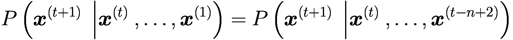

# 1. 语言模型导论

> ***语言是力量，是生命，是文化的工具，是统治与解放的工具。***
> 
> ***——安吉拉·卡特（英国作家）***

使智人区别于地球上其他动物物种的最大发展之一就是语言的进化。语言使我们能够交流和沟通思想与观念，从而带来了包括互联网在内的众多科学发现。语言的重要性由此可见一斑。

因此，当我们涉足人工智能领域时，除非我们确保机器能够理解和领会自然语言，否则该领域取得的进展将十分有限。因此，任何想要涉足人工智能领域，进而涉足通用人工智能领域的人，都有必要深入了解我们在教导机器理解语言方面取得的进展。

本章旨在通过介绍自然语言处理领域的一些历史方面及其向当今最先进的基于神经网络的语言模型的演变，带你领略该领域的发展历程。

## NLP 的历史

自然语言处理是机器学习和人工智能中发展最快的领域之一。其目标是赋予机器理解自然语言的能力，并提供协助人类完成与自然语言相关任务的能力。机器翻译（也称为 MT）的概念最初是在第二次世界大战期间发展起来的，它是 NLP 发展的种子。NLU（自然语言理解）的目标是让机器能够理解自然语言并完成诸如将一种语言翻译成另一种语言、判断特定文本片段的情感或提供（例如）段落摘要等任务。

语言可以分解为其组成部分，这些部分可以被视为一组规则或符号。在整合过程之后，这些符号被用于信息的传输和广播。自然语言处理领域被细分为几个子领域，其中最值得注意的是自然语言生成和自然语言理解。顾名思义，这些子领域关注文本的生成以及文本的理解。注意不要被这些相对较新的术语（如音系学、语用学、形态学、句法学和语义学）所迷惑。

NLP 或 NLU 的主要领域之一不仅是理解特定语言的统计特性，还要理解其语义。借助机器学习，其目标是将某种语言的内容输入机器，让机器不仅理解统计特性，还能理解（例如）某个单词的含义和上下文。

NLP 工程师的工作流程通常包括：首先尝试将单词转换为计算机能够解释的数字，然后开发能够利用这些数字完成许多必要任务的机器学习架构。更具体地说，它应包括以下步骤：

1.  **收集数据**：对于你构思的每个项目，首先要做的是收集与你正在进行的项目直接相关的数据。这对于机器学习研究本身至关重要。我们向许多算法提供海量数据，其中一些数据的获取成本可能高得令人望而却步。在 NLP 的背景下，此阶段可能涉及从亚马逊或 Yelp 等电子商务网站收集推文或评论。此外，此过程还可能涉及对收集到的推文或评论进行清洗和分类。

2.  **分词**：这是将每段文本切分成易于管理的单词块，以便为后续阶段做准备的过程。在此阶段，你可能还需要移除停用词、执行词形还原或词干提取。

3.  **向量化**：在此阶段，将上一步（称为`tokenization`）中获得的词元转换为机器学习算法能够处理的向量。此时我们清楚地认识到，我们开发的模型并非真正像人类那样（或我们认为的那样）看到并理解单词，而是基于这些单词的向量表示进行操作。

4.  **模型创建与评估**：此步骤涉及开发机器学习模型和架构（例如 Transformer），这些模型和架构能够处理所提供的词向量，以完成许多所需的任务。这些任务可能包括翻译、语义分析、命名实体识别等。NLP 工程师负责对模型和架构进行持续评估，并根据预先设定的目标和关键绩效指标进行衡量。


当我们想要理解某事物时，需要先构建该事物的心智模型。例如，若我说自己理解猫的样子，脑海中便会有其毛发、眼睛、腿等特征的心智模型。这些特征或维度使我们能够表征某个事物或概念。

同理，要开始理解一个句子或单词，首先需要为该单词本身建立数学表征。这是因为机器只理解数字，所以我们需要一种方法将表征编码为数字。我们从一个极其简单的统计方法——词袋模型开始，下文将对此进行描述。

### 词袋模型

词袋模型是一种基于词频统计的技术，用于创建包含这些词语的文档的数学表征。所谓数学表征，指的是向量空间中的数学向量，其中每个词可视为该空间中的一个独立维度。

举个简单例子。假设我们有三个文档，每个文档包含一个句子，如下所示：

*   文档 1：I am having fun of my lifetime.
*   文档 2：I am going to visit a tourist destination this time.
*   文档 3：Tourist destinations provide such fun.

现在，我们首先根据文档集中出现的所有词语创建词汇表。由于文档集由这三个文档构成，词汇表如下所示（我们只取不重复的词语）：

*   I
*   am
*   having
*   fun
*   of
*   my
*   lifetime
*   going
*   to
*   visit
*   tourist
*   destination
*   this
*   time
*   provide
*   such

可见，这里共有 16 个词（为简化起见，我们将 *a*、*the* 等词保留在集合中）。这构成了我们的语料库。现在，将每个词视为 16 维向量空间中的一个维度。

如果取文档 1，其维度可编码如下：

```
[1,1,1,1,1,1,1,0,0,0,0,0,0,0,0,0]
```

文档 2 将如下所示：

```
[1,1,0,0,0,0,1,1,1,1,1,1,1,0,0,0]
```

文档 3 将如下所示：

```
[0,0,0,1,0,0,0,0,0,0,1,1,0,0,1,1]
```

这里，1 表示该词在文档中出现。这种机制也称为独热编码，是文档或句子最简单的表征方式。随着本书内容的深入，我们将看到这种词表征机制如何不断优化。

这种表征使机器能够处理这些数字，并对其执行数学运算。

### n-gram 模型

在开始深入理解 n-gram 模型之前，我们先绕个弯，先了解一个称为词袋模型的概念。

由于语言的序列特性，词语在文本中出现的顺序至关重要。即使我们不常刻意思考，这一点也是众所周知的。n-gram 模型使我们能够根据前文词语预测下一个词语。

使用 n-gram 模型生成文本的核心概念基于词语的统计分布。其主要思想是：根据前 n-1 个词出现的概率，确定序列中第 n 个词出现的概率。实际上，它利用概率的链式法则，以特定概率预测某个词的出现。

该计算过程如下所示：



等式左侧表示：在已看到从 `x(1)` 到 `x(t)` 的词语后，看到词语 `x(t+1)` 的概率。

整个概念基于概率的链式法则，简单来说，该法则允许我们将一个复杂的联合分布分解为一组条件分布。

让我们看一个三元模型（trigram model）的简单示例。三元模型保留最后两个词的上下文，以预测序列中的下一个词。

以以下语句为例：

*   “Anuj is walking on the ___.”

这里，我们需要预测“on the”之后的词语。

我们假设，基于数据集，以下可能是后续词语：“road”、“pavement”。

现在我们需要计算概率：

`P(road |on the)` 和 `P(pavement| on the)`

第一个概率是：在词语 *on the* 已出现的情况下，词语 *road* 出现的概率。第二个概率是：在词语 *on the* 已出现的情况下，词语 *pavement* 出现的概率。

计算完概率后，条件概率最高的词语即为下一个词。

我们可以将其重新表述为一种基于统计方法的简单机制：根据前文词语的上下文，计算下一个词出现的概率。随着语料库规模增大和句子数量增加，进行超出简单二元模型的计算将极具挑战性。我们需要学习一种生成这些条件概率分布的方法。所谓条件分布，是指给定某些词语，我们需要理解接下来可能出现的词语的概率分布。由于我们不知道这些分布的形状，因此使用神经网络来近似这些分布的参数。在下一节中，我们将介绍循环神经网络（RNN），它使我们能够完成这项任务。

### 循环神经网络

苹果产品上的 Siri 和谷歌产品上的语音搜索都使用了循环神经网络（RNN），这是目前处理序列输入最先进的算法。

顾名思义，它是一种循环神经网络，由于其循环特性，它最适合处理序列数据，如时间序列或语言。处理序列时，最重要的方面是处理上下文，这需要记住先前序列中发生的情况，并利用这些信息更好地表征当前输入。

由于循环神经网络（RNN）是唯一具有内部记忆的算法，因此它极其强大且可靠。它也是目前使用的最有前途的算法之一。

与许多其他类型的深度学习算法相比，循环神经网络已经存在了相当长的时间。它们最初于 20 世纪 80 年代被开发出来，但直到最近几十年，我们才充分认识到它们的潜力。

尽管 RNN 已被用于处理序列数据，但它们往往存在某些问题，例如梯度消失，并且无法捕捉长期依赖关系。这导致了新神经网络架构的出现，如 LSTM（长短期记忆网络）和 GRU（门控循环单元），它们克服了 RNN 的问题。

LSTM 和 GRU 拥有自己的内部记忆，并且架构比普通 RNN 更精细，能够记住所给数据输入的重要方面，从而使它们能够对未来将发生的事情做出非常准确的预测。

在处理序列数据（如时间序列、语言或主要部署于物联网应用的现场传感器提供的数据）时，LSTM 和 GRU 已成为默认的神经网络架构。


