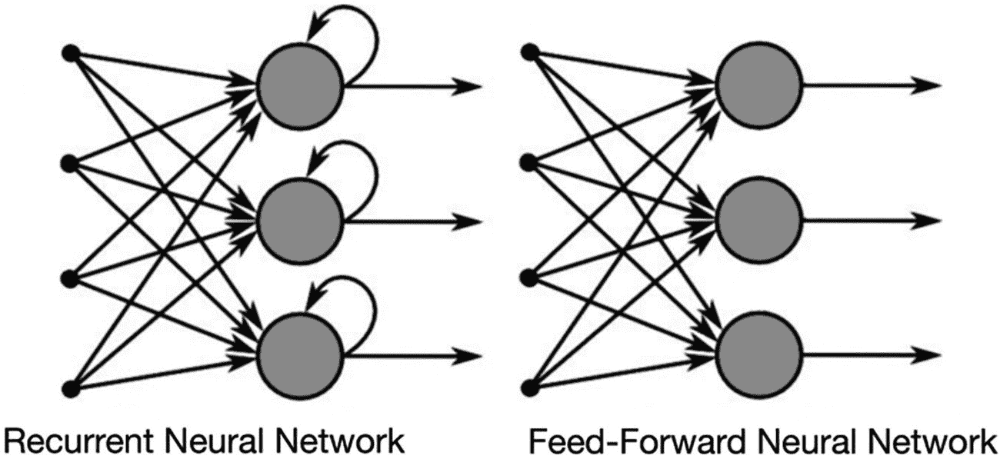
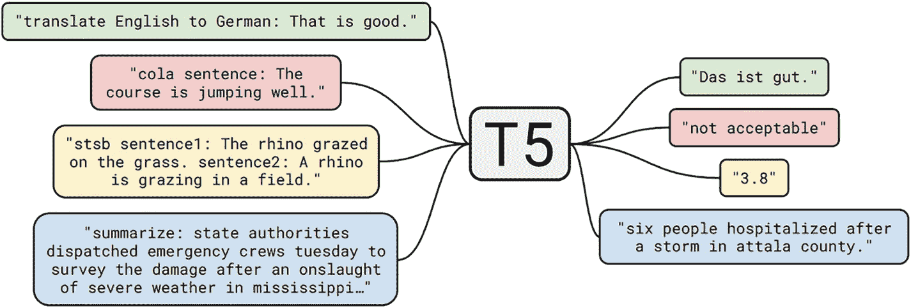

# 循环神经网络（RNN）究竟是什么？

循环神经网络（RNN）是神经网络的一个子类别，对于序列数据的建模非常有用。RNN 源自前馈网络，其表现出的行为与人类大脑的运作方式类似。换句话说，循环神经网络能够利用序列数据产生预测结果，而其他算法则无法做到这一点。

## RNN 的工作原理

为了全面理解 RNN，你需要对“常规”的前馈神经网络以及序列数据有一个实用的认识。

序列数据最基本的定义就是有序数据，其中相关项按时间顺序依次排列。例如 DNA 序列和金融数据。最常见的序列数据可能是时间序列数据，它无非就是按正确时间顺序呈现的一系列数据点。

信息传递的方式赋予了 RNN 和前馈神经网络各自的名称。

前馈网络是一种单程网络，这意味着它内部没有循环。输入数据经过各个层，网络的输出与实际输出进行比较，并通过反向传播机制引入误差修正。这种方法一次只能处理一个输入。

由于一次只能处理一个输入，前馈神经网络在预测接下来会发生什么方面表现很差，因为它没有记忆来存储接收到的信息。前馈网络没有任何时间顺序的概念，因为它只考虑最近的输入。除了它接受的训练之外，它根本不记得过去发生的任何事情。

在 RNN 中，信息在一个循环内无限重复。当需要做出决策时，它除了考虑从先前输入中学到的经验之外，还会考虑最近的输入。

图 1-1 以可视化形式展示了这种差异。

两种神经网络差异的示意图：一种是循环神经网络，另一种是前馈神经网络。

**图 1-1** 简单前馈网络与 RNN 之间的区别

另一种阐明循环神经网络记忆概念的有效方法是通过一个例子来描述。

想象你有一个典型的前馈神经网络，你向它输入单词“machine”。然后你观察网络逐个字符地处理这个单词。因为当它处理到字符“h”时，它已经忘记了“m”、“a”和“c”，所以这种形式的神经网络几乎无法预测下一个字符是什么，因为它已经忘记了这些字符。

然而，由于循环神经网络拥有自己的内部记忆，它能够记住这些字符。它生成输出，复制该输出，然后将这两个版本都反馈回网络。

换句话说，循环神经网络将近期历史纳入对当前情况的分析中。

因此，RNN 将当前和近期的情况都作为输入来考虑。这一点很重要，因为数据序列提供了关于后续内容的关键信息。这也是 RNN 能够完成其他算法无法完成的任务的原因之一。

输出首先由前馈神经网络产生，与所有其他深度学习算法一样，它首先为网络的输入分配一个权重矩阵。请注意，RNN 不仅为最近的输入分配权重，也为之前的输入分配权重。此外，循环神经网络会随着时间的推移，使用梯度下降和反向传播来调整权重。

随着事物的发展，我们发现 RNN 及其同类在处理时间以及捕捉句子中单词之间的长期依赖关系方面存在挑战。这促使我们发展了语言模型，我们将在下一节中描述。

## 语言模型

在过去的十年中，从文本数据中提取信息这一领域取得了长足的发展。自然语言处理取代了文本挖掘成为该领域的名称，因此该领域应用的方法也发生了重大变化。语言模型作为各种旨在从原始文本中提取有用见解的应用的基础，其发展是实现这一转变的主要因素之一。

语言模型的基本构建块是单词或单词序列上的概率分布。在实际应用中，语言模型提供了特定单词序列可以被认为是“有效”的概率。在此讨论中，“有效性”完全不指语句的语法正确性。它表示该序列与人们说话（或者更具体地说，写作）的方式相似，因为语言模型正是通过这种方式获取知识的。语言模型“仅仅”是一种工具，用于以简洁的方式整合丰富的信息，使其能够在样本外场景中重复使用。记住这一点很重要，因为它表明语言模型（像其他机器学习模型，特别是深度神经网络一样）并没有什么魔力。

### 使用语言模型能带来哪些优势？

为了根据上下文推断单词概率所需的自然语言抽象理解能力，可应用于多种场景和任务。

如果我们拥有精准的语言模型，就能对文本进行抽取式或生成式摘要。若掌握多种语言模型，构建自动翻译系统将变得更为简便。在更复杂的应用中，还包括问答系统（无论是否提供上下文）。如今，语言模型正被应用于非常有趣的领域，例如软件代码生成、文本到图像生成（如 OpenAI 的`DALL-E 2`），以及其他文本生成机制（如`GPT3`）等。

必须理解以下两者之间的区别：

1. 属于概率语言模型的统计技术
2. 基于神经网络的语言模型

如“n-grams”部分所述，计算 n-gram 的概率会构建出一个简单的概率语言模型（a）（n-gram 指由 n 个单词组成的序列，n 为大于 0 的整数）。n-gram 的概率可定义为：该 n-gram 的最后一个单词在特定 n-1 gram（不含最后一个单词）之后出现的条件概率。通俗来说，它指的是不含最后一个单词的 n-1 gram 之后出现最后一个单词的频率。给定代表现在的 n-1 gram，代表未来的 n-gram 的概率不依赖于代表过去的 n-2、n-3 等 gram。这是马尔可夫提出的假设。

采用这种方法存在明显的缺点。下一个单词的概率分布仅受其前面 n 个单词的影响，这是最核心的一点。难以理解的文本包含丰富的上下文，这些上下文会对下一个单词的选择产生重大影响。因此，即使 n 高达 50，下一个单词的身份也可能无法从它前面的 n 个单词中辨别出来。

此外，这种方法显然不具备良好的可扩展性：随着数据集规模（n）的增大，可能的排列组合数量会急剧飙升，尽管大多数变体从未在实际文本中出现。而且，每一个出现的概率（或每一个 n-gram 计数）都需要计算和存储！此外，未出现的 n-gram 会导致稀疏性问题，因为当它们数量极少时，概率分布的粒度可能相对较低（单词概率的取值很少，因此大多数单词具有相同的概率）。

### 基于神经网络的语言模型

基于神经网络的语言模型对输入进行编码的方式，使得处理稀疏性问题变得更加容易。嵌入层为每个单词生成一个任意大小的向量，其中考虑了单词之间的语义联系。这些连续向量生成了下一个单词概率分布中迫切需要的粒度。此外，语言模型本质上是一个函数（所有神经网络都包含大量矩阵计算），这意味着无需存储所有 n-gram 计数即可构建下一个单词的概率分布。

神经网络可以解决稀疏性问题，但上下文问题依然存在。首先，语言模型的发展过程就是不断寻找更有效方法来解决上下文问题的过程。这通过引入更多的上下文单词来更有效地影响概率分布得以实现。其次，目标是设计一种架构，使模型能够发现给定上下文中哪些短语比其他短语更重要。

利用循环神经网络（如前所述）是处理上下文问题方面迈出的正确一步。由于它基于 LSTM 或 GRU 单元的网络，在选择下一个单词时会考虑它之前的所有单词。

基于 RNN 的架构是顺序处理的，这是使用这类模型的主要缺点。由于缺乏并行处理的可能性，处理长序列时所需的训练时间会急剧增加。Transformer 架构正是解决这一困境的方案。建议阅读 Google Brain 撰写的原始文档。

此外，OpenAI 的 GPT 模型和 Google 的 BERT 都采用了 Transformer 架构（我们将在后续章节中讨论）。除此之外，这些模型还利用了一种称为注意力机制的技术，该技术使模型能够发现哪些输入在特定情况下比其他输入更值得关注。

在模型架构方面，最重大的飞跃首先是 RNN（特别是 LSTM 和 GRU），它解决了稀疏性问题，使语言模型能够使用更少的磁盘空间；随后是 Transformer 架构，它实现了并行化并创造了注意力机制。这两项发展都至关重要。然而，架构并非语言模型展现其能力的唯一领域。

OpenAI 发布了几个基于 Transformer 架构的语言模型。第一个模型是`GPT1`，最新的是`GPT3`。与`GPT1`的架构相比，`GPT3`几乎没有任何创新特性。但它规模巨大。它使用了模型有史以来训练过的最大的语料库——Common Crawl 进行训练，拥有 1750 亿个不同的参数。这在一定程度上得益于语言模型的半监督训练方法，该方法允许将文本作为训练样本，同时省略部分单词。`GPT3`的强大之处在于，它几乎阅读了过去几年互联网上发布的所有文本，并且具备反映自然语言大部分复杂性的能力。

## 总结

最后，我想介绍一下谷歌提供的 `T5` 模型（图 1-2）。过去，语言模型主要用于传统的自然语言处理任务，例如词性（`POS`）标注或机器翻译，尽管需要做一些微调。由于其理解自然语言基本结构的抽象能力，例如，`BERT` 只需少量额外指令就可以被重新训练为 `POS` 标注器。

这幅图展示了一个语言模型，它代表谷歌的 `T5` 模型，这是一个文本到文本的模型；该模型正在将英语翻译成德语。

**图 1-2**  
谷歌的 `T5` 模型，一个文本到文本的模型

图 1-2 展示了 `T5` 语言模型的一个表示。

使用 `T5` 时，无需任何修改即可完成 `NLP` 任务。如果它接收到包含某些 `M` 标记的文本，它会识别出这些标记代表需要填入正确单词的空白。它也能够提供答案。如果在问题之后提供了一些上下文，它会从该上下文中寻找答案；否则，它会根据自身已有的信息来回答。有趣的是，它的设计者在一个问答竞赛中被它击败了。其他可能应用的例子可以在左侧的图片（图 1-2）中看到。

## 总结

在我看来，`NLP` 是我们最有可能成功开发人工智能的领域。这个术语令人兴奋，许多简单的决策系统以及几乎所有的神经网络都被称为 `AI`；然而，这主要是营销手段。《牛津英语词典》以及几乎所有其他词典都将*人工智能*定义为机器执行与人类类似的、与智能相关的任务。`AI` 的一个关键方面是泛化能力，即单个模型执行多项任务的能力。同一个模型可以执行各种各样的 `NLP` 任务，并能根据输入推断出该做什么，这一事实本身就令人震惊，它让我们离真正开发出与人类智力相当的人工智能系统又近了一步。

