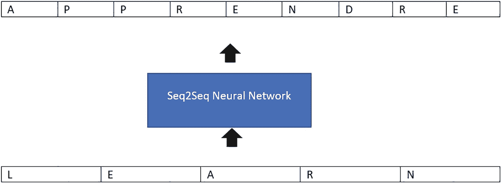
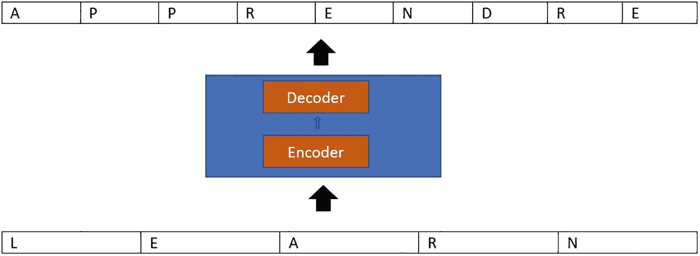
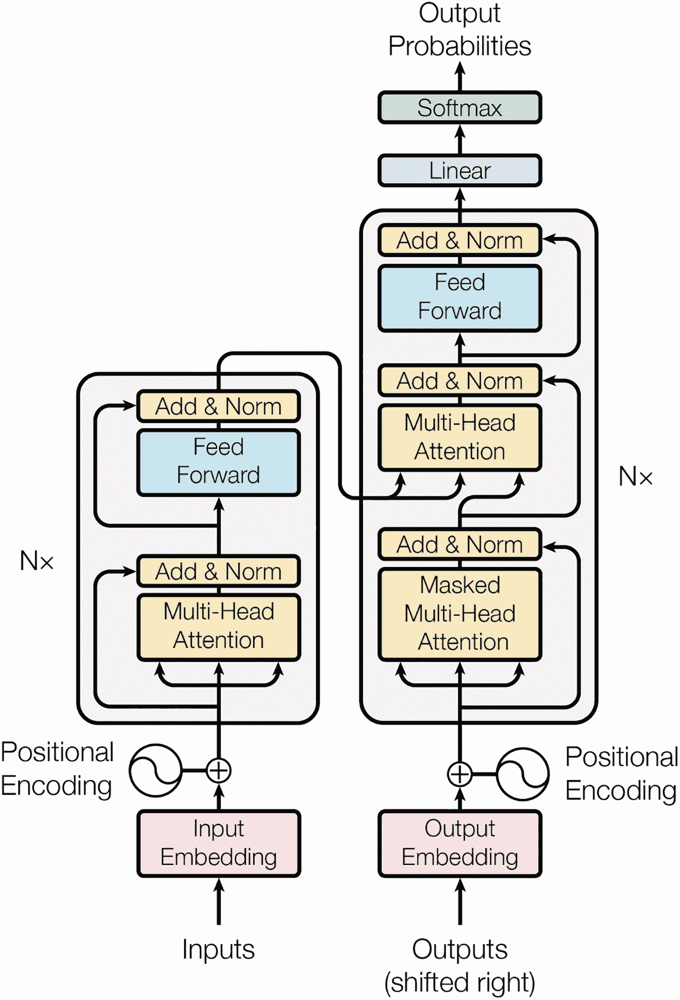

# 2. Transformer 简介

大约在 2017 年 12 月，一篇题为“注意力就是一切”的开创性论文发表了。这篇论文彻底改变了 `NLP` 领域未来的面貌。该论文描述了 Transformer 以及所谓的序列到序列架构。

序列到序列（或 `Seq2Seq`）神经网络是一种将一个序列的组件转换为另一个序列的神经网络，例如将短语中的单词进行转换。（考虑到这个名称，这应该不足为奇。）

`Seq2Seq` 模型擅长翻译，这涉及将一种语言的单词序列转换为另一种语言的单词序列。基于长短期记忆（`LSTM`）的神经网络架构被认为最适合序列到序列这类需求。`LSTM` 模型具有遗忘门的概念，通过它，模型可以遗忘不需要记住的信息。

## 什么是 Seq2Seq 神经网络？

`Seq2Seq` 模型从一个对象序列（例如单词、字母或时间序列）开始，并生成另一个项目序列作为其输出。在神经机器翻译中，我们需要提供特定语言的输入句子，输出应该是另一种语言的翻译文本。

如图 2-1 所示，基于 `Seq2Seq` 架构的神经网络接收单词 *learn* 作为输入，并输出该单词的法语翻译。

`Seq2Seq` 架构的神经网络形式表示，它接收单词 *learn* 的输入并输出其法语翻译。

**图 2-1**  
`Seq2Seq` 网络的功能

如图 2-2 所示，编码器和解码器是构成该模型的两个组成部分。编码器以向量的形式保存输入序列的上下文，然后将其传递给解码器，以便解码器可以根据其中包含的信息构建输出序列。

编码器和解码器的架构主要通过 `RNN`、`LSTM` 或 `GRU` 来实现序列到序列的任务。

解码器和编码器的序列到序列顺序网络表示，解释了翻译掩码的架构。

**图 2-2**  
`Seq2Seq` 网络中的编码器-解码器使用

图 2-2 解释了编码器和解码器如何融入翻译任务的 `Seq2Seq` 架构。

我们不会深入探讨 `Seq2Seq` 架构的细节，因为本书主要关注 Transformer。但要理解 `Seq2Seq` 模型的本质，它们接收一个序列作为输入，并将其转换为另一个序列。

### Transformer

正如本章开头所讨论的，有一篇名为“注意力就是一切”的伟大论文，其中提出了一种名为 Transformer 的新型神经架构。这项工作的主要亮点是一种称为自注意力的机制。Transformer 架构的理念之一是摆脱顺序处理，即一次只向网络提供一个输入。例如，对于一个句子，`RNN` 或 `LSTM` 会一次从句子中接收一个单词输入。这意味着处理只能是顺序的。Transformer 旨在通过一次性将整个序列作为输入提供给网络，并允许网络一次学习整个句子来改变这种设计。这将允许进行并行处理，并允许将学习内容并行分发到其他核心或 `GPU`。

Transformer 架构的要点是仅使用自注意力来捕获序列中单词之间的依赖关系，而不依赖于任何基于 `RNN` 或 `LSTM` 的方法。

### Transformer

Transformer 的高级架构如下所示。它包含两个主要部分：

1.  编码器
2.  解码器

图 2-3 展示了包含编码器和解码器模块的 Transformer 架构。

流程图展示了从输入嵌入和输出嵌入到输出概率的输入和输出，这些概率流经位置编码和 `N x`。

**图 2-3**  
高级 Transformer 架构（取自 Vaswani 的“注意力就是一切”论文）

#### 编码器

让我们详细看看编码器的各个层。

### 输入嵌入

首先要做的是将输入馈送到执行词嵌入的层。可以将词嵌入层理解为一种查找表，它能够获取每个单词的学习向量表示。神经网络中的学习过程基于数字，这意味着每个单词都与一个包含连续值的向量相关联，用以表示该单词。

在应用自注意力机制之前，我们需要将句子中的单词分词为独立的词元。

