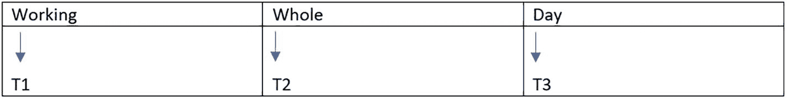
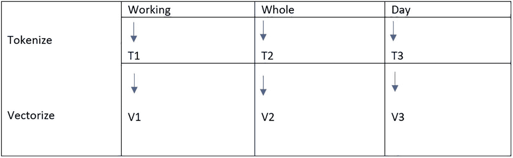
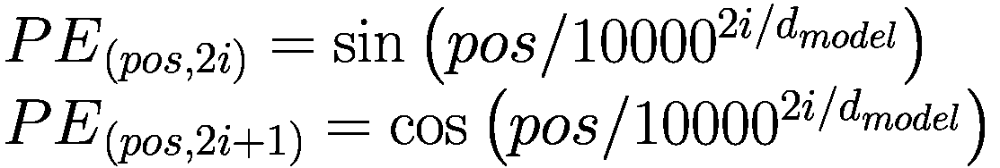
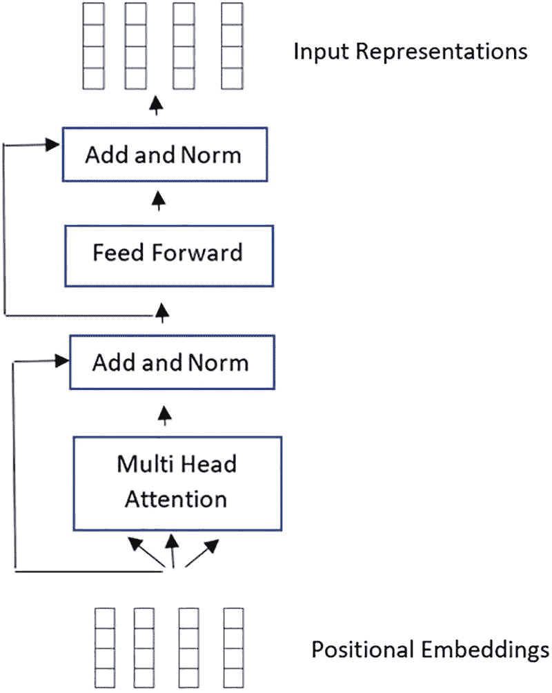
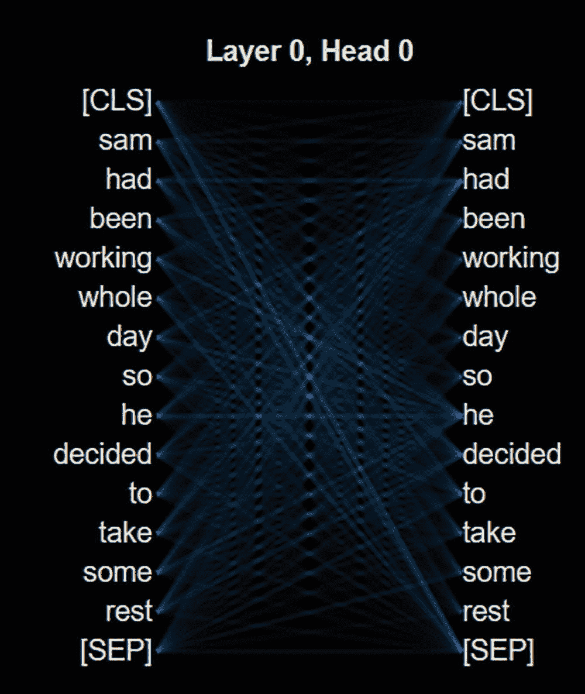
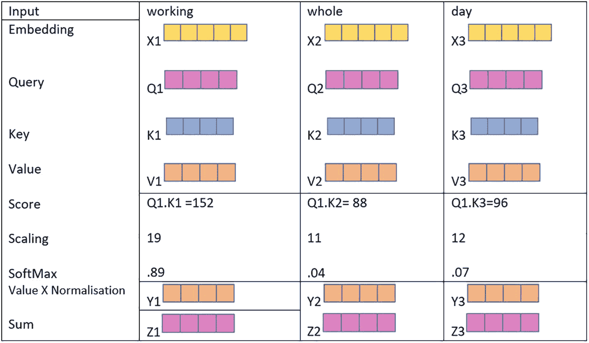
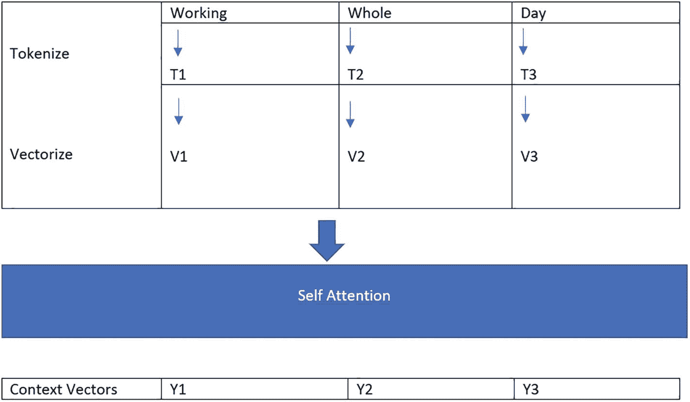

# 分词

图 2-4 展示了一个句子的分词过程，其中句子中的每个单词都被分词。

一个句子的分词过程表示，其中句子中的每个单词都被分词，Working 对应 `T1`，Whole 对应 `T2`，Day 对应 `T3`。

**图 2-4** 句子中的单词分词

#### 向量化

分词之后，我们使用例如 `word2vec` 或 `GloVe` 编码对之前获得的词元进行向量化。现在，每个单词都将表示为一个向量，如图 2-5 所示。

分词和向量化的列表示，其中包含从 `T1` 到 `V1` 的 Working 行，从 `T2` 到 `V2` 的 Whole 行，以及从 `T3` 到 `V3` 的 Day 行。

**图 2-5** 对每个词元单独进行向量化，以创建单词的数学表示

#### 位置编码

这是一种基于特定单词（例如在句子中）位置的编码。

这种编码基于文本在序列中的位置。我们需要在输入嵌入中提供一些关于位置的信息，因为 Transformer 编码器不像循环神经网络那样具有循环性。位置编码正是用来实现这一目标的。作者构思了一种巧妙的策略，利用了正弦和余弦函数。

位置编码的数学表示如公式 2-1 所示：

**（公式 2-1）**

该公式计算每个单词的位置嵌入，使得每个单词在语义分量之外还拥有一个位置分量。

位置编码的数学细节不在本讨论范围之内；然而，其基本原理如下。

如公式 2-1 所示，我们将奇数索引处的单词通过余弦函数处理，偶数索引处的单词通过正弦函数处理。每个单词的输出将是一个向量，代表该特定单词的位置编码。下面我们通过一个例子来解释这一点。

##### 位置编码示例

取一个序列，例如“Sam loves to walk.”。

这里，我们首先定义一些参数的值：

- `N`：10000。
- `K`：单词在句子中的位置，从 0 开始。
- `D`：句子的维度。在我们的例子中为 4。
- `I`：用于映射到列索引。

现在我们计算正弦和余弦分量的值。

**Sam**

| `sin(0/10000^((0/4)))=0` | `cos(0/10000^((0/4)))=1` | `sin(0/10000^((2/4)))=0` | `cos(0/10000^((2/4)))=1` |
|--------------------------|--------------------------|--------------------------|--------------------------|

**Likes**

| `sin(1/10000^((0/4)))=0.8414` | `cos(1/10000^((0/4)))=0.5403` | `sin(1/10000^((2/4)))=0.0099` | `cos(1/10000^((2/4)))=0.999` |
|-------------------------------|-------------------------------|-------------------------------|------------------------------|

**To**

| `sin(2/10000^((0/4)))=0.909` | `cos(2/10000^((0/4)))=-0.416` | `sin(2/10000^((2/4)))=0.0199` | `cos(2/10000^((2/4)))=0.9998` |
|-------------------------------|--------------------------------|-------------------------------|-------------------------------|

**Walk**

| `sin(3/10000^((0/4)))=0.1411` | `cos(3/10000^((0/4)))=-0.989` | `sin(3/10000^((2/4)))=0.0299` | `cos(3/10000^((2/4)))=0.9995` |
|--------------------------------|--------------------------------|-------------------------------|-------------------------------|

我们可以看到，句子“Sam likes to walk”中的每个单词都获得了一个词嵌入向量，用以表示该单词在句子中的位置。

之后，将这些向量添加到与之对应的输入嵌入中。将位置嵌入添加到输入嵌入背后的直觉是，为每个单词在向量空间中提供一个朝向其出现位置的小偏移。因此，如果我们再深入思考一下，就会发现这会导致语义相似且出现在相近位置的单词在向量空间中的表示也彼此靠近。正因为如此，网络获得了关于每个向量位置的准确信息。由于正弦和余弦函数的线性特性以及模型易于学习关注它们，因此选择了这两个函数。

至此，我们到达了编码器层，如图 2-6 所示。编码器层的目标是将所有输入序列转换为一种表示，这种表示能够捕获上下文，同时也会对特定上下文中更重要的单词给予更多关注。它从一个多头注意力子模块开始，然后进入一个全连接网络子模块。最后，紧随其后的是一个归一化层。

编码器组件的流程图，从位置嵌入、多头注意力、加与归一化、前馈网络、加与归一化到输入表示。

**图 2-6** Transformer 的编码器组件

### 多头注意力

编码器在其多头注意力系统中使用了一种称为自注意力的特定注意力过程。多头注意力不过是多个自注意力模块，用于捕获不同类型的注意力。正如本章前面所述，自注意力使我们能够将输入中的每个单词与同一句子中的其他单词关联起来。

让我们更深入地了解一下自注意力层。

以这个句子为例：

> *“Sam had been working whole day so he decided to take some rest”*

在上述句子中，作为人类，当提到单词 *he* 时，我们会自动将其与 *Sam* 联系起来。这简单地意味着，当我们指代单词 *he* 时，我们需要关注单词 *Sam*。自注意力机制允许我们在句子中提及 *he* 时为 *Sam* 提供引用。随着模型的训练，它会查看输入序列中的每个单词，并尝试找出它必须关注的单词，以便为该单词提供更好的嵌入表示。本质上，它通过使用注意力机制更好地捕获了上下文。

在图 2-7 中可以看到，单词 *he* 关注了单词 *Sam*。通过使用自注意力技术，上下文得以更好地被捕获。

A 表示单词 he 通过使用自注意力技术（涉及层 0，头 0，包含 Sam、had、whole、take 等单词）关注了单词 Sam。

**图 2-7** – 工作中的注意力机制

接下来，我们来看看查询、键和值向量是如何工作的。

### 查询、键和值向量

自注意力的概念基于三种向量表示：

1.  查询
2.  键
3.  值

查询、键和值的概念源于信息检索系统。例如，当我们在谷歌或任何搜索引擎中搜索时，我们会提供一个**查询**作为输入。然后，搜索引擎在其数据库或存储库中查找与查询匹配的特定**键**，最终将最佳**值**作为结果返回给我们。

图 2-8 展示了查询、键和值机制如何工作以捕获关于单词表示的上下文信息。

该图片通过输入、working、whole 和 day 列（涉及嵌入、查询、键、值、分数、缩放、softmax 和求和）来表示上下文信息。

**图 2-8** – 工作中的查询、键和值机制

### 自注意力

如图 2-8 所述，一旦我们准备好输入向量，就将其传递到自注意力层，该层实际上通过使用注意力机制在其表示中捕获单词的上下文。

图 2-9 展示了自注意力机制如何工作以创建上下文向量。

通过 tokenize 和 vectorize 列以及从 t1 到 v1 的 working、从 t2 到 v2 的 whole 和从 t3 到 v3 的 day 行来表示上下文向量。

**图 2-9** – 自注意力机制

对于高层级注意力的简单实现，我们获取上一步得到的单个词向量，并且对于每个词向量：

1.  我们将其与自身及其他向量进行点积运算。
2.  我们得到一个分数，例如 `S11`、`S12`、`S13`——在这种情况下，句子中有三个单词，我们想要捕获 `V1` 的嵌入表示。
3.  然后将此分数视为权重，并与 `V1`、`V2` 和 `V3` 相乘。
4.  对分数进行归一化。
5.  对步骤 3 中得到的向量进行求和。

上述步骤的直觉是捕获向量空间中单词之间的接近程度，然后根据这种接近程度分配权重。然后，根据邻居向量所施加的权重对其进行加权，并相加得到单词的表示，该表示考虑了其邻域中单词的接近程度。

尽管这种机制很简单，但其中并没有权重的学习过程。而这正是查询和键矩阵机制发挥作用的地方。这些矩阵中的权重正是网络所学习的。每个单独的单词向量与查询矩阵和键矩阵进行点积运算，以生成查询向量和键向量。

在查询、键和值向量上执行线性层之后，通过对查询和键执行点积矩阵乘法来完成分数矩阵的生成。

分数矩阵用于计算每个单词相对于其他单词应具有的相对权重。因此，每个单词都会被分配一个分数，同时考虑周围的上下文单词。特定单词的分数越高，它被关注的程度就越高。这就是用于将查询映射到键的过程。

之后，通过将分数的总和除以同时包含查询和键的维度的平方根来降低分数。这样做是为了能够构建更稳定的梯度，因为数值相乘可能会产生爆炸性影响。

然后，你必须对缩放后的分数进行 softmax 操作以获得注意力权重，这将为你提供 0 到 1 之间的概率值。当你执行 softmax 时，较好的结果会被放大，而较低的值则会向下调整。因此，模型能够对其应该关注的术语有更大的信心。

### 将 Softmax 输出与值向量相乘

之后，你通过将注意力权重与你的值向量相乘来获得一个输出向量。softmax 分数越高，保留模型所学单词的值就越重要。分数较低的单词将被分数较高的单词淹没。其输出随后被馈送到一个线性层进行处理。

图 2-10 展示了注意力权重与值向量相乘以获得输出的机制。

注意力权重网格与值向量相乘等于输出（由线性层处理）的机制表示。

**图 2-10** – 将注意力权重与值向量相乘

### 计算多头注意力

在应用自注意力之前，你必须首先将查询、键和值分成 `N` 个向量，以便使用这些数据进行多头注意力计算。之后，每个分割后的向量都会经历其自身特定的自注意力过程。术语“头”指的是每个单独的自注意力过程。在通过最后一个线性层之前，每个头生成的输出向量通过拼接合并成一个单一向量。原则上，每个头都会学习到独特的东西，这将使编码器模型具有更强的表示能力。

多头注意力只是以不同方式多次应用自注意力。其目标是通过这些不同的头捕获不同的上下文表示。通过使用多头注意力，我们为特定单词获得的表示非常丰富。

### 残差连接、层归一化与前馈网络

原始的位置输入嵌入会与多头注意力输出向量相加，作为额外的组成部分。这种连接方式被称为残差连接。你可以将此步骤理解为将输入（此处为位置编码）与输出（此处为多头注意力输出）相加。之后，会对残差连接的输出执行一种称为层归一化的操作。层归一化的目标是提升训练性能。

归一化后，输出会通过一个前馈网络，然后该前馈网络的结果会与输入（即馈入前馈网络的数据）一起进行归一化处理。

由于残差连接能使梯度直接在网络中传播，因此它们对网络的训练过程非常有益。层归一化则负责稳定网络，这最终能显著缩短所需的训练时间。

这大致就是从高层视角来看编码器的工作原理。接下来，我们将简要讨论 Transformer 的解码器组件。

### 解码器

解码器的职责是生成文本序列。解码器与编码器类似，都包含以下层：

1.  多头注意力层
2.  加和与归一化层
3.  前馈层

此外，它还有一个带有 softmax 分类器的线性层，用于输出概率。这就是生成部分发挥作用的地方。

解码器的工作原理是：接收起始的标记化单词以及之前的输出（如果有的话），并将其与编码器的输出相结合。

解码过程中涉及的不同方面将在下文进行解释。

#### 输入嵌入与位置编码

在很大程度上，解码器的起始部分与编码器的起始部分相同。为了获得位置嵌入，输入首先会经过一个嵌入层，然后是一个位置编码层。随后，位置嵌入会被送入第一个多头注意力层。

#### 第一层多头注意力

这一层虽然在名称上与我们在编码器中使用的层相似，但在功能上略有不同。原因在于，解码器只能访问句子中当前单词之前的单词。它不应该看到序列中接下来会出现哪个单词。

我们需要一种方法来避免计算未来词元的注意力分数。这里所采用的技术称为掩码。通过使用前瞻掩码，可以限制解码器查看尚未出现的词元。该掩码会在分数缩放之后、softmax 计算之前和之后都进行应用。本书不会讨论前瞻掩码的数学细节。掩码的基本思想是：仅根据当前单词之前的单词来计算其注意力分数，而不考虑句子中未来的单词。

#### 第二层多头注意力

这一层接收来自解码器第一个多头注意力层的输出，并将其与编码器的输出相结合。这将使解码器能够更好地理解应该关注编码器输出的哪些部分。该多头注意力层的输出会通过一个前馈网络。

#### 线性分类器与最终 Softmax 输出概率

前一个多头注意力层和前馈网络的输出会再次进行归一化，然后传递到一个带有 softmax 组件的线性层，用于输出概率——例如，在特定单词序列中下一个单词可能是什么的概率。这就是架构的生成能力大放异彩的地方。

## 总结

本章解释了 Transformer 的工作原理。同时，也详细阐述了 Transformer 所利用的注意力机制的力量，使其能够做出更准确的预测。循环神经网络也可以追求类似的目标，但其有限的短期记忆使得实现这些目标变得困难。如果你希望对长序列进行编码或生成长序列，Transformer 可能是更好的选择。正是由于 Transformer 的设计，自然语言处理领域才能取得前所未有的成果。

在下一章中，我们将从代码的角度更详细地探讨 Transformer 的工作原理。我们将介绍 huggingface 生态系统，它是 Transformer 模型的主要开源仓库之一。

