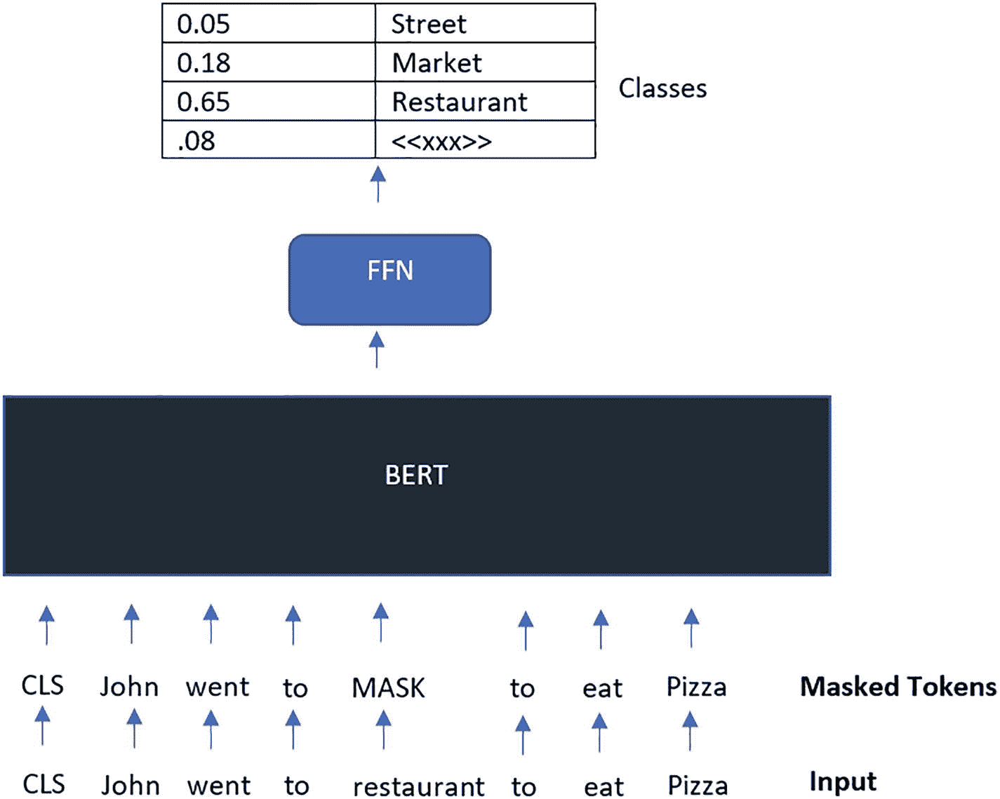
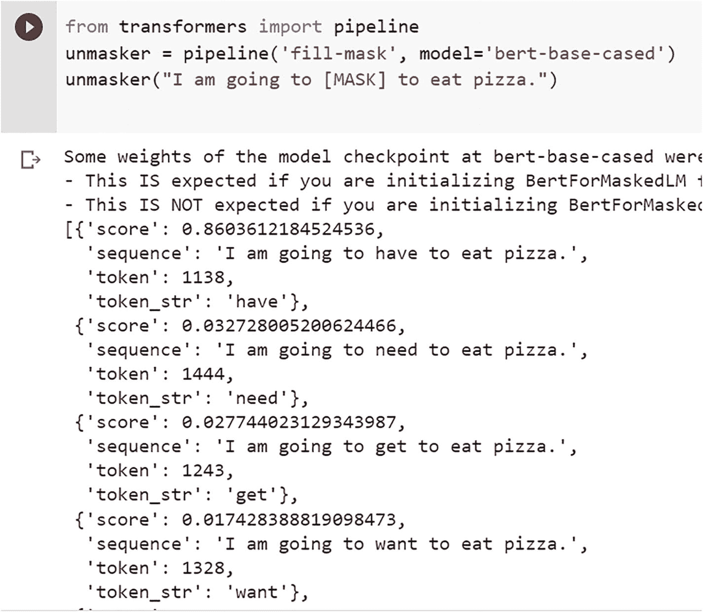
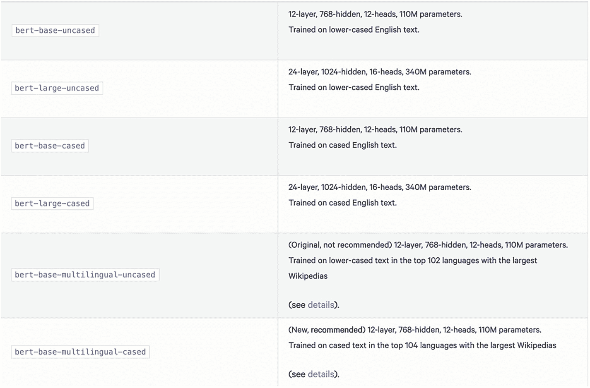
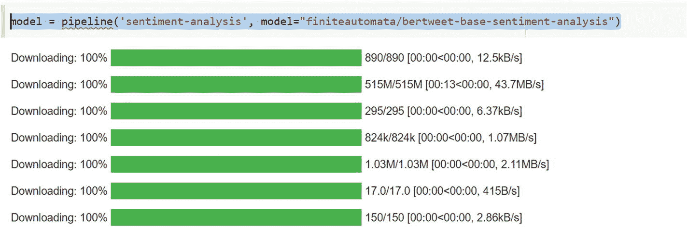

# 3. BERT

在本章中，你将学习由谷歌开发的 Transformer 架构的一种实现，称为 BERT。

谷歌 AI 语言团队的研究人员近期完成的工作，促成了一篇名为《BERT：来自 Transformer 的双向编码器表示》的论文的发表。

BERT 取得的最重要的技术进步，是将流行的注意力模型 Transformer 的双向训练应用于语言建模。根据对语言模型的研究发现，同时进行双向训练的语言模型，能够比仅进行单向训练的模型更好地理解语言的流动和上下文。研究人员在论文中描述了一种独特的训练方法，他们称之为掩码语言模型（MLM）。这种方法使得模型能够进行双向训练，而这在以前是难以实现的。

BERT 还允许我们进行迁移学习，这使得预训练的 BERT 模型可以应用于各种自然语言应用。

根据模型架构的规模，BERT 有两种不同的预训练版本，如下所示：

-   **BERT-Base** 共有 1.1 亿个参数、12 个注意力头、768 个隐藏节点和 12 层。
-   **BERT-Large** 拥有 24 层、1024 个隐藏节点、16 个注意力头和 3.4 亿个参数值。

## BERT 的工作原理

BERT 基于 Transformer 架构，该架构内部使用了第 2 章讨论的注意力机制。BERT 的妙处在于理解句子中的上下文，并在考虑上下文的情况下表示一个单词。这意味着，像 *bank* 这样的词，在金融语境下使用时，与在河岸语境下使用时的表示是不同的。BERT 仅使用 Transformer 架构的编码器机制，主要用于创建更好的单词表示，这些表示随后可用于更多的下游应用。Transformer 的详细工作原理已在第 2 章中介绍过。

Transformer 编码器的输入是一个单词序列，BERT 的架构使其能够双向读取以捕捉单词的上下文，即关注单词之前和之后出现的单词。这克服了例如 LSTM 类型架构中发生的顺序读取（尽管双向 LSTM 是可能的，但它们很复杂，并且仍然存在顺序处理问题）。

在训练语言模型的过程中，必须克服的挑战之一是确定预测目标。大量模型会预测序列中的下一个单词（例如，“太阳正在 ___ 中下沉”），这是一种方向性方法，其本质限制了上下文学习。BERT 采用两种不同的训练策略来克服这一障碍。


### 掩码语言模型（MLM）

向 BERT 提供一个句子，然后优化其内部权重，以便在另一端生成相同的句子，这就是 MLM 的构成。因此，我们给 BERT 一个句子，并要求它生成与输入相同的句子。在我们真正向 BERT 提供该输入句子之前，我们会遮盖掉一些标记。

在输入 BERT 之前，词序列中有 15% 的词会被替换为 `[MASK]` 标记。这一操作在词序列被输入 BERT 之前完成。然后，模型将尝试预测被遮盖词的可能值。它利用左右两侧上下文提供的语境信息。

为了预测被遮盖的句子，我们需要在编码器之上增加一个额外的层，该层将有助于对被遮盖的句子进行分类。

所使用的损失函数仅考虑对遮盖值的预测。直接结果是，该模型比定向模型收敛得更慢；然而，它所拥有的更高上下文感知能力弥补了这一缺点。

图 3-1 展示了训练掩码语言模型的工作原理。大约 15% 的输入标记被遮盖，然后前馈神经网络被训练来仅预测这些被遮盖的标记。



该流程图展示了掩码语言的结构，从输入、被遮盖的标记、BERT 和 FFN，到包含 0.05 街道、0.18 市场及其他类别的类别列。

**图 3-1** 掩码语言模型

MLM 推理的一个示例如图 3-2 所示，该图展示了如何使用掩码语言模型来预测被遮盖的词。



掩码语言模型推理的表示，它描绘了使用掩码语言模型结合模型检查点来预测被遮盖的词。

**图 3-2** 用于标记预测的掩码语言模型用法

这是使用 huggingface 库的截图，我们将在下一章中介绍该库。

### 下一句预测（NSP）

下一句预测（NSP）协议要求向 BERT 提供两个句子，分别指定为句子 A 和句子 B。然后，我们询问 BERT：“嘿，句子 B 跟在句子 A 后面吗？”——根据情况，BERT 将回答 `IsNextSentence` 或 `NotNextSentence`。

让我们考虑数据集中的三个句子：

1.  约翰去了餐厅。
2.  风筝在高空中飞翔。
3.  约翰点了一份披萨。

现在，当我们查看这三个句子时，我们可以很容易地看出句子 2 并不跟在句子 1 后面，相反，句子 3 跟在句子 1 后面。这种涉及跨越较长时间段的短语间依赖关系的推理模式，通过 NSP 教给了 BERT。

为了进行 NSP 训练，BERT 架构将正样本对和负样本对作为输入。

正样本对由彼此相关的句子组成，而负样本对由序列中彼此不相关的句子组成。这些负样本和正样本在数据集中各占 50%。

在将输入添加到模型之前，会按以下方式对其进行处理，以便更好地帮助模型区分训练中使用的两个句子：

1.  在第一个句子的开头插入一个 `[CLS]` 标记，并在每个句子的末尾放置一个 `[SEP]` 标记。
2.  每个标记现在都有一个句子嵌入，指示它属于句子 A 还是句子 B。标记嵌入和句子嵌入在概念上是词汇量为 2 的可比表示。
3.  每个标记都会收到一个额外的嵌入，称为位置嵌入，以便可以确定其在序列中的位置。这在第 2 章的“位置编码”部分有解释。

### NSP 推理

为了演示通过 NSP 进行推理，我们取三个句子：

1.  约翰去了餐厅。
2.  风筝在高空中飞翔。
3.  约翰点了一份披萨。

计算句子 2 是否跟在句子 1 后面的概率，以及句子 3 跟在句子 1 后面的概率。

我们将再次使用 huggingface 库（我们将在下一章中介绍）来计算各个概率。

请参阅将在 Google Colab 中使用的示例代码。（目前不必担心代码，因为第 5 章会有大量示例。）

```
from torch.nn.functional import softmax
from transformers import BertForNextSentencePrediction, BertTokenizer
mdl = BertForNextSentencePrediction.from_pretrained('bert-base-cased')
brt_tkn = BertTokenizer.from_pretrained('bert-base-cased')
sentenceA = 'John went to the restaurant'
sentenceB = 'The kite is flying high in the sky'
encoded = brt_tkn.encode_plus(sentenceA, text_pair=sentenceB, return_tensors='pt')
sentence_relationship_logits = mdl(**encoded)[0]
probablities = softmax(sentence_relationship_logits, dim=1)
print(probablities)
```

**列表 3-1** 用于句子预测的 BERT

我们得到输出：

```
tensor([[0.0926, 0.9074]], grad_fn=<SoftmaxBackward0>)
```

这表明句子 2 跟在句子 1 后面的概率非常低。

现在我们对句子 1 和句子 3 运行相同的推理：

```
sentenceA = 'John went to the restaurant'
sentenceB = 'John ordered a pizza'
```

我们得到输出：

```
tensor([[9.9998e-01, 2.2391e-05]], grad_fn=<SoftmaxBackward0>)
```

这表明句子 3 跟在句子 1 后面的概率很高。

## BERT 预训练模型

BERT 基于 Transformer 架构，主要使用编码器机制。它有许多变体，包括以下内容。

`BERT-Base` 的 Transformer 块和隐藏层的大小比 OpenAI GPT 小，但具有相同的整体模型大小（12 个 Transformer 块、12 个注意力头，隐藏层大小为 768）。

`BERT-Large` 是一个巨大的网络，在 NLP 任务上取得了最先进的结果。它的注意力层数是 `BERT-Base` 的两倍（24 个 Transformer 块、16 个注意力头，隐藏层大小为 1024）。

预训练的 BERT 模型可在 huggingface 上获取，并可直接用于下游任务的微调。

huggingface 上提供的一些预训练 BERT 模型如图 3-3 所示。



BERT 模型的表示，涉及 `bert-base-uncased`、`bert-large-uncased`、`bert-base-cased`、`bert-large-cased`、`bert-base-multilingual-uncased` 等。

**图 3-3** huggingface 的 BERT 模型

## BERT 输入表示

*   始终将序列中的第一个标记视为特殊的分类标记（也缩写为 `CLS`）。对于分类任务，将使用与该标记对应的最终隐藏状态。
*   `[SEP]` 标记用于分隔两个句子之间的界限。
*   每当处理句子对时，将添加一个额外的段嵌入。该嵌入将指示该标记属于句子 A 还是句子 B。
*   给定标记的输入表示是通过将位置嵌入添加到该标记的表示中来构建的。


## BERT 的应用场景

一旦编码器生成了合适的表征，BERT 便可应用于多种下游任务，包括情感分析、摘要生成、问答、文本到 SQL 生成等。

除了使用预训练的 BERT 模型，我们还可以使用特定的文本数据集对其进行微调。这将使我们能够充分利用自己的数据。

与 GPT3 等其他大型学习模型不同，BERT 的源代码对公众完全免费开放，并可在 GitHub 上查看。这使得 BERT 能够在全球范围内更广泛地应用。这彻底改变了格局！

现在，开发者无需投入大量时间或资金，就能快速部署像 BERT 这样的尖端模型并使其运行。

此外，开发者可以专注于微调 BERT，以根据其具体项目的需求定制模型性能。

如果不想花时间微调 BERT，用户应该知道，有成千上万个开源且免费的 BERT 模型已经过预训练，并且目前可用于特定的应用场景。

BERT 模型已针对多种任务进行了预训练，例如：

1. 分析 Twitter 及其他社交媒体上的用户情感
2. 有害评论检测
3. 语音转文本
4. 问答

以及更多其他任务。

下面我们使用 `huggingface` 库，以推文分类为例来介绍 BERT。

## 推文情感分析

BERTweet 语言模型是首个公开可用、针对英文推文进行预训练的大规模模型。其预训练采用了 RoBERTa 的技术来指导 BERTweet 的训练。BERTweet 的预训练数据集包含 8.5 亿条英文推文（160 亿个词元，80 GB 数据），其中 8.45 亿条推文来自 2012 年 1 月 1 日至 2019 年 8 月 8 日，另有 500 万条与新冠疫情相关的推文。

```
model = pipeline('sentiment-analysis', model="finiteautomata/bertweet-base-sentiment-analysis")
代码清单 3-2
使用 BERT 进行情感分析
```

运行这段代码，我们将得到如图 3-4 所示的输出结果。



图 3-4 展示了使用 BERT 对推文进行情感分析的结果。BERT 是一个针对英文推文进行预训练并指导推文训练的大规模模型。

图 3-4

执行代码清单 3-2。此图显示了模型和分词器的下载过程。

然后，我们将两条推文输入模型：

```
data = ["idk about you guys but i'm having more fun during the bear than I was having in the bull.","At least in the bear market it’s down only. Bull market is up and down"]
model(data)
```

这将得到以下输出：

```
[{'label': 'POS', 'score': 0.9888675808906555}, {'label': 'NEG', 'score': 0.7523579001426697}]
```

这表明 BERTweet 模型能够对上述两条推文进行分类。

`POS` 分数表示积极情感，`NEG` 分数表示消极情感。

## BERT 在多种常见语言任务上的表现

BERT 的性能在以下几个基准测试上进行了评估：

1. **SQuAD**（斯坦福问答数据集）：这是一个来自斯坦福大学的问答数据集。BERT 在该数据集上的表现远超现有模型，并且也显著优于人类水平。
2. **SWAG**：SWAG 代表“对抗性生成情境”。这是一个基于日常场景的数据集，主要测试常识和推理能力。在此任务中，BERT 同样超越了其他模型以及人类的表现。
3. **GLUE**：代表“通用语言理解评估”。该基准测试评估模型在理解特定语言方面的能力。这里包含一些特定的评估任务。在此任务中，BERT 的表现也异常出色。

## 总结

BERT 是一个极其复杂且尖端的语言模型，能够帮助用户自动化语言理解。它依托海量数据的训练，并利用 Transformer 架构彻底改变了自然语言处理领域，从而实现了最先进的性能。

得益于 BERT 提供的开源库，以及令人惊叹的 AI 社区为不断改进和分享新 BERT 模型所做的努力，尚未触及的 NLP 里程碑似乎拥有光明的未来。


