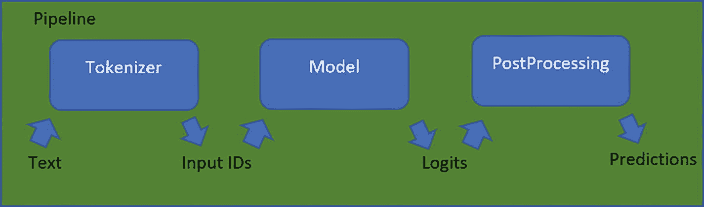
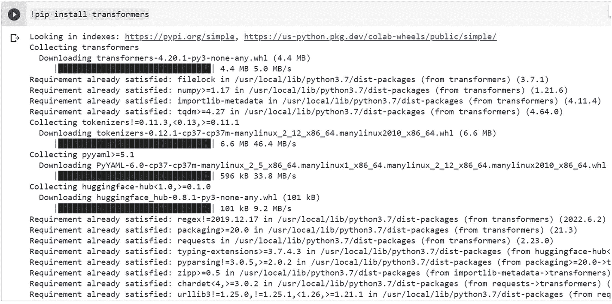
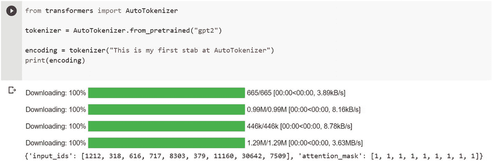
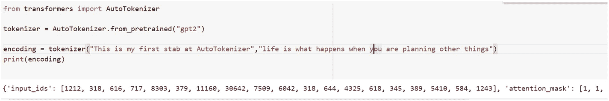
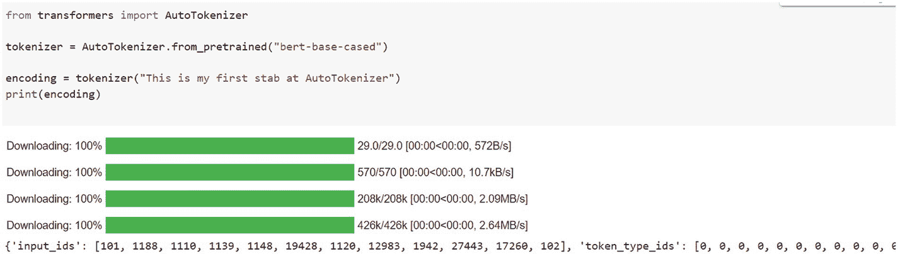
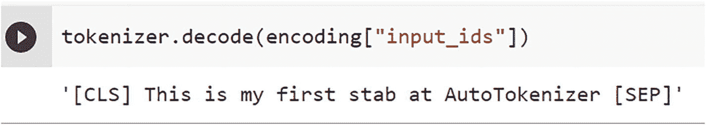

# 4. Hugging Face

如果你对 2018 年以来机器学习和人工智能领域的进展稍有了解，几乎肯定已经注意到自然语言处理（NLP）领域取得的巨大进步。该领域的大部分进展可归功于大型语言模型（LLM）。这些 LLM 背后的架构是我们在第 2 章讨论过的 Transformer 编码器-解码器结构。

Transformer 的成功源于其架构能够并行处理输入数据，并通过注意力机制获得更好的上下文理解能力。我们在前几章已经提到过 Vaswani 等人的论文《注意力就是一切》。在 Transformer 出现之前，上下文信息是通过普通的 RNN 或 LSTM（不含注意力机制）来捕获的。

`Hugging Face`如今被广泛认为是自然语言处理（NLP）领域的一站式平台，不仅提供数据集和预训练模型，还拥有社区甚至课程。

`Hugging Face`是一家基于开源软件和数据原则成立的新公司。从真正意义上说，NLP 革命始于基于 Transformer 架构的 NLP 模型的民主化。`Hugging Face`不仅率先开源了这些模型，还以`Transformers`库的形式提供了便捷易用的抽象接口，使得这些模型的调用和推理变得非常简单。

`Hugging Face`为模型开发者提供了一个中心化的平台或枢纽，让他们可以将模型发布到`huggingface`仓库中，而希望基于这些模型构建应用的消费者则可以方便地使用它们。例如，BERT（来自 Transformer 的双向编码器表示）模型就是由谷歌贡献给`huggingface`的。这使得用户社区能够在自己的应用中使用这些模型。随后，OpenAI 推出了 GPT2 等生成式模型，让最终用户能够编写生成故事、小说等内容的应用程序。GPT2 也是`huggingface`生态系统的一部分。`Hugging Face`不仅提供了调用这些模型的 API，还提供了使用自有数据集进行微调、监控和基准测试的方法。简而言之，像`huggingface`这样的生态系统的出现，为那些希望基于自然语言处理模型构建应用的开发者打开了无数机遇之门。

目前，这些模型的应用范围已不仅限于文本处理。我们现在看到了视觉 Transformer 和基于 Transformer 的音频模型的出现。人们正在构建用于音乐生成或语音克隆的音频领域应用，以及在视觉用例中用于生成虚假图像的应用。还有一些模型挖掘了科学文献，可用于从科学期刊中提取知识。同样，基于法律相关文档的模型也已出现，人们可以基于它们构建问答系统。这些模型根据底层架构的不同，规模也各不相同。例如，GPT3 模型拥有约 1750 亿个参数。

同样，其训练数据集的大小和范围也显著增加。例如，最初的 Transformer 被规模更大的`Transformer-XL`所取代；`BERT-Base`的参数数量从 1.1 亿增加到`Bert-Large`的 3.4 亿；拥有 15 亿参数的 GPT2 模型被拥有 1750 亿参数的 GPT3 模型所取代。中国推出了名为`Wu Dao 2.0`的模型，拥有约 1.75 万亿个参数。规模扩展的支持者认为，随着模型规模的增大，我们也将逐步实现通用人工智能（AGI）的目标。

以 GPT3 为例，它是在一台拥有超过 10000 个 GPU 的超级计算机上训练的。这意味着训练这些模型仅属于大公司的能力范围。如今，由于能够使用这些模型中的大部分，最终用户成为了围绕这些大型语言模型构建的应用开发生态系统的一部分。

## Hugging Face 平台的特点

由于`Hugging Face`平台建立在基于注意力的 Transformer 模型理念之上，因此`Transformers`库位于`Hugging Face`生态系统的核心也就不足为奇了。配套的`Datasets`和`Tokenizers`库为`Transformers`库提供支持。请记住，Transformer 无法理解文本的原始形式（即字符串）。由于我们输入给 Transformer 的是文本，因此必须以一种能够被基于 Transformer 的神经网络架构消费的方式对文本进行编码。为此，我们使用`huggingface`提供的用于分词（tokenizing）的 API，这些 API 被称为`tokenizers`。

除了分词，我们可能还需要使用一些自定义数据集来微调现有模型或从头训练模型。为了保持架构的统一性，`huggingface`通过`Datasets` API 为数据集提供了抽象接口。用户只需使用`huggingface`的 API，就可以拥有自己的数据集、上传数据集、训练/微调模型，以及上传训练好的模型。这无疑是革命性的。

### Hugging Face 的组件

`huggingface`库基于一组丰富的抽象接口，这些接口简化了基于自然语言处理创建应用的复杂性。这些抽象接口为我们提供了一个统一的接口，用于加载模型、使用分词器、跨各种模型、分词器和数据集使用数据集。这对于开发者来说是一种赋能体验，他们的工作因使用这些抽象接口而变得简化。我们将在以下小节中讨论其中一些抽象接口。

#### Pipelines

`Pipelines`为使用`huggingface`模型仓库中的预训练模型提供了强大且便捷的抽象接口。它提供了一个专用于多种任务的简单应用程序编程接口（API）：

1. 判断句子的整体情感是正面还是负面。
2. 问答：接受一个问题，并从文本中提取出对应的答案。
3. 掩码语言建模：根据给定上下文，建议可能的单词来填充掩码输入。
4. 命名实体识别：自动为输入中包含的每个标记分配标签。
5. 摘要：将较长的文章或文档缩减为更简洁的摘要。

`Pipelines`是建立在三个`huggingface`组件之上的抽象接口，即：

1. `Tokenizer`（分词器）
2. `Model`（模型）
3. `Post-processor`（后处理器）



Hugging Face Pipeline 工作流的模型图，展示了分词器、模型以及包含文本、logits、输入 ID 和预测的后处理过程。

**图 4-1** Hugging Face Pipeline 的工作流


### 分词器

流程中的第一个组件是`tokenizer`（分词器），它接收原始文本作为输入，并将其转换为数字，以便模型能够理解。

`tokenizer`负责以下工作：

1.  将输入分割成单个词元的过程，这些词元可以是单词、子词或符号（例如标点符号）。
2.  将每个词元转换为一个整数。
3.  向模型中引入可能被证明有用的新变量。

在训练模型时，我们需要对输入进行分词。当时会使用某个特定的分词器。我们需要确保在实际输入上使用该模型时，使用相同的分词器。`AutoTokenizer`类简化了这项任务，它会自动加载训练期间使用的分词器。这大大简化了开发者的工作。

在以下代码中，我们加载用于预训练`GPT2`模型的分词器。

首先，在 Google Colab 中安装`Transformers`库：

```
!pip install transformers
```

图 4-2 展示了从 Hugging Face 安装`Transformers`库的过程。



从 Hugging Face 在 Google Colab 中安装 Transformers 库的过程，展示了步骤和编码序列。

**图 4-2** 在 Google Colab 中安装`Transformers`库

接下来，添加这段代码。

```
from transformers import AutoTokenizer
tokenizer = AutoTokenizer.from_pretrained("gpt2")
encoding = tokenizer("This is my first stab at AutoTokenizer")
print(encoding)
```

**代码清单 4-1** 一个简单分词器的代码

在 Google Colab 中执行代码清单 4-1 会得到如图 4-3 所示的输出。



下载分词器及分词代码的图示。它提供一个字典，并将字符序列转换为词元序列。

**图 4-3** 下载分词器

分词器将提供一个包含以下条目的字典：

-   词元的数值表示被称为`input_ids`。
-   `attention_mask`是一个掩码，用于指定哪些词元需要被关注。

我们也可以将多个字符串作为输入传递给分词器。代码清单 4-2 展示了一个示例，它对两个句子中的文本进行分词。

```
from transformers import AutoTokenizer
tokenizer = AutoTokenizer.from_pretrained("gpt2")
encoding = tokenizer("This is my first stab at AutoTokenizer","life is what happens when you are planning other things")
print(encoding)
```

**代码清单 4-2** 使用分词器对文本进行分词的代码

这将为每个句子生成词元，如图 4-4 所示。



分词后的句子和编码序列。它提供一个字典，并将字符序列转换为词元序列。

**图 4-4** 分词后的句子

除了`GPT2`，我们也可以使用其他模型，比如`BERT`。代码清单 4-3 给出了一个基于`BERT`的分词器示例。

```
from transformers import AutoTokenizer
tokenizer = AutoTokenizer.from_pretrained("bert-base-cased")
encoding = tokenizer("This is my first stab at AutoTokenizer")
print(encoding)
```

**代码清单 4-3** 使用`BERT`对文本进行分词

图 4-5 展示了基于`BERT`的分词器的输出。这是通过在 Google Colab 中运行代码清单 4-3 实现的。



基于`BERT`的分词器执行及其输出编码的代码表示。通过在 Google Colab 中运行代码清单`BERT`对文本进行分词来实现。

**图 4-5** 执行基于`BERT`的分词器

输出的编码是：

```
{'input_ids': [101, 1188, 1110, 1139, 1148, 19428, 1120, 12983, 1942, 27443, 17260, 102], 'token_type_ids': [0, 0, 0, 0, 0, 0, 0, 0, 0, 0, 0, 0], 'attention_mask': [1, 1, 1, 1, 1, 1, 1, 1, 1, 1, 1, 1]}
```

这会返回一个包含以下三个重要项目的字典：

1.  句子中每个词元对应的索引由`input_ids`变量表示。
2.  `attention_mask`的值指定一个词元是否需要被关注。
3.  当存在多个序列时，`token_type_ids`变量用于确定一个词元属于哪个序列。

我们可以通过解码`input_ids`来还原输入，如下所示：

```
tokenizer.decode(encoding["input_ids"])
```

其输出如图 4-6 所示。



该代码通过将词元作为输入并返回文本作为输出来说明解码过程的编码序列。插入了两个词元`CLS`和`SEP`。

**图 4-6** 展示了通过将词元作为输入并返回文本作为输出来进行解码的过程

可以看出，分词器在句子中插入了两个特殊词元。这些词元被称为`CLS`和`SEP`，分别代表分类器和分隔符。只要相关模型确实需要，分词器会自动为你添加任何必要的特殊词元。

让我们向这个分词器传递多个句子，如代码清单 4-4 所示。

```
from transformers import AutoTokenizer
tokenizer = AutoTokenizer.from_pretrained("bert-base-cased")
encoding = tokenizer("This is my first stab at AutoTokenizer","life is what happens when you are planning other things")
print(encoding)
```

**代码清单 4-4** 此代码将两个句子作为输入并为其生成词元

这将产生多个编码：

```
{'input_ids': [101, 1188, 1110, 1139, 1148, 19428, 1120, 12983, 1942, 27443, 17260, 102, 1297, 1110, 1184, 5940, 1165, 1128, 1132, 3693, 1168, 1614, 102], 'token_type_ids': [0, 0, 0, 0, 0, 0, 0, 0, 0, 0, 0, 0, 1, 1, 1, 1, 1, 1, 1, 1, 1, 1, 1], 'attention_mask': [1, 1, 1, 1, 1, 1, 1, 1, 1, 1, 1, 1, 1, 1, 1, 1, 1, 1, 1, 1, 1, 1, 1]}
```

### 填充

当我们处理一组句子时，它们的长度并不总是一致的。模型的输入需要具有相同的大小，因为这是基于底层标准架构的。这就带来了一个问题。向包含不足数量词元的句子添加填充词元是被称为“填充”策略的一个例子。

现在，我们运行以下示例，其中包含多个输入，并将`padding`设置为`true`，如代码清单 4-5 所示。

```
from transformers import AutoTokenizer
bert_tk = AutoTokenizer.from_pretrained("bert-base-cased")
sentences=["This is my first stab at AutoTokenizer","life is what happens when you are planning other things","how are you"]
encoding = bert_tk(sentences,padding=True)
print(encoding)
```

**代码清单 4-5** 此代码展示了分词器的填充是如何工作的

输出如下：

```
{'input_ids': [[101, 1188, 1110, 1139, 1148, 19428, 1120, 12983, 1942, 27443, 17260, 102], [101, 1297, 1110, 1184, 5940, 1165, 1128, 1132, 3693, 1168, 1614, 102], [101, 1293, 1132, 1128, 102, 0, 0, 0, 0, 0, 0, 0]], 'token_type_ids': [[0, 0, 0, 0, 0, 0, 0, 0, 0, 0, 0, 0], [0, 0, 0, 0, 0, 0, 0, 0, 0, 0, 0, 0], [0, 0, 0, 0, 0, 0, 0, 0, 0, 0, 0, 0]], 'attention_mask': [[1, 1, 1, 1, 1, 1, 1, 1, 1, 1, 1, 1], [1, 1, 1, 1, 1, 1, 1, 1, 1, 1, 1, 1], [1, 1, 1, 1, 1, 0, 0, 0, 0, 0, 0, 0]]}
```

正如我们所见，第三个句子长度较短，因此分词器用零对其进行了填充。


### 截断

模型有时可能无法处理过长的序列。在这种情况下，你需要将序列压缩到更易于管理的长度。

如果你想截断序列，使其达到模型能接受的最大长度，可以将 `truncation` 参数设置为 `true`，如代码清单 4-6 所示。

```python
from transformers import AutoTokenizer
bert_base_tokenizer = AutoTokenizer.from_pretrained("bert-base-cased")
sentences=["This is my first stab at AutoTokenizer","life is what happens when you are planning other things. so plan life accordingly","how are you"]
encoding = bert_base_tokenizer(sentences,padding=True,truncation=True)
print(encoding)
代码清单 4-6
此代码展示了截断标志在分词器中的工作方式
```

输出如下所示：

```python
{'input_ids': [[101, 1188, 1110, 1139, 1148, 19428, 1120, 12983, 1942, 27443, 17260, 102, 0, 0, 0, 0, 0], [101, 1297, 1110, 1184, 5940, 1165, 1128, 1132, 3693, 1168, 1614, 119, 1177, 2197, 1297, 17472, 102], [101, 1293, 1132, 1128, 102, 0, 0, 0, 0, 0, 0, 0, 0, 0, 0, 0, 0]], 'token_type_ids': [[0, 0, 0, 0, 0, 0, 0, 0, 0, 0, 0, 0, 0, 0, 0, 0, 0], [0, 0, 0, 0, 0, 0, 0, 0, 0, 0, 0, 0, 0, 0, 0, 0, 0], [0, 0, 0, 0, 0, 0, 0, 0, 0, 0, 0, 0, 0, 0, 0, 0, 0]], 'attention_mask': [[1, 1, 1, 1, 1, 1, 1, 1, 1, 1, 1, 1, 0, 0, 0, 0, 0], [1, 1, 1, 1, 1, 1, 1, 1, 1, 1, 1, 1, 1, 1, 1, 1, 1], [1, 1, 1, 1, 1, 0, 0, 0, 0, 0, 0, 0, 0, 0, 0, 0, 0]]}
```

流程中的下一个阶段是模型。

### AutoModel

我们将了解 `AutoModel` 如何在加载预训练模型方面简化我们的工作。

Transformers 库使得加载预训练实例的过程变得简单且统一。这意味着你可以像加载 `AutoTokenizer` 一样加载 `AutoModel`。唯一的区别在于需要为当前任务选择合适的 `AutoModel`。

以文本分类为例，加载模型的方式如下所示。

我们将遵循以下步骤：

1.  根据检查点的名称创建分词器和模型的实例。该模型被确定为 BERT 模型，然后将检查点中保存的权重加载到其中。
2.  获取令牌并将其传递给模型。
3.  模型返回 logits。
4.  应用 softmax 来计算句子被分类的类别的概率（对于下面的示例，是负面或正面）。

代码清单 4-7 分为多个部分，其中代码清单 4-7-1 解释了如何通过 Transformers 库加载分词器。

```python
from transformers import AutoTokenizer
tokenizer = AutoTokenizer.from_pretrained("siebert/sentiment-roberta-large-english")
sentences=["This is my first stab at AutoTokenizer","life is what happens when you are planning other things. so plan life accordingly","this is not tasty at all"]
encoding = tokenizer(sentences,padding=True,truncation=True,return_tensors="pt")
print(encoding)
代码清单 4-7-1
加载分词器
```

这将给出以下输出：

```python
{'input_ids': tensor([[    0,   713,    16,   127,    78, 16735,    23,  8229, 45643,  6315,
2,     1,     1,     1,     1,     1,     1],
[    0,  5367,    16,    99,  2594,    77,    47,    32,  1884,    97,
383,     4,    98,   563,   301, 14649,     2],
[    0,  9226,    16,    45, 22307,    23,  1250,     2,     1,     1,
1,     1,     1,     1,     1,     1,     1]]), 'attention_mask': tensor([[1, 1, 1, 1, 1, 1, 1, 1, 1, 1, 1, 0, 0, 0, 0, 0, 0],
[1, 1, 1, 1, 1, 1, 1, 1, 1, 1, 1, 1, 1, 1, 1, 1, 1],
[1, 1, 1, 1, 1, 1, 1, 1, 0, 0, 0, 0, 0, 0, 0, 0, 0]])}
```

代码清单 4-7-2 展示了如何通过 Transformers 库加载模型。

```python
from transformers import AutoModelForSequenceClassification
model_name = "siebert/sentiment-roberta-large-english"
pt_model = AutoModelForSequenceClassification.from_pretrained(model_name)
代码清单 4-7-2
加载模型
```

```python
#用于打印编码
pt_outputs = pt_model(**encoding)
print (pt_outputs)
SequenceClassifierOutput(loss=None, logits=tensor([[ 3.0351, -2.1955], [-3.6225,  2.7819], [ 3.9581, -3.6334]], grad_fn=<AddmmBackward0>), hidden_states=None, attentions=None)
代码清单 4-7-3
生成 logits
```

```python
#用于打印 logits
logits=pt_outputs.logits
print (logits)
```

输出为：

```python
tensor([[ 3.0351, -2.1955],
[-3.6225,  2.7819],
[ 3.9581, -3.6334]], grad_fn=<AddmmBackward0>)
```

最后，我们执行 softmax 来打印输出概率，如代码清单 4-7-4 所示。

```python
output = torch.softmax(logits, dim=1).tolist()[1]
print(output)
代码清单 4-7-4
打印特定于情感类别的概率
```

我们得到以下输出：

```python
[[0.9946781396865845, 0.005321894306689501], [0.001651538535952568, 0.9983484745025635], [0.9994955062866211, 0.0005045001162216067]]
```

我们可以看到所有三个句子的输出概率：

```
This is my first stab at AutoTokenizer
```

第一列给出情感为负面的概率，第二列给出情感为正面的概率：

```
Score [0.9946781396865845, 0.005321894306689501]
```

这表明句子中的情感是负面的。

接下来是第二个句子：

```
life is what happens when you are planning other things. so plan life accordingly
[0.001651538535952568, 0.9983484745025635]
```

这表明句子中的情感是正面的。

现在我们来看一个名为 `pipeline` 的包装类，它可以用更少的代码完成相同的任务，如代码清单 4-8 所示。

```python
from transformers import pipeline
# 使用分词器和模型创建一个 pipeline 实例
roberta_pipe = pipeline(
"sentiment-analysis",
model="siebert/sentiment-roberta-large-english",
tokenizer="siebert/sentiment-roberta-large-english",
return_all_scores = True
)
# 分析我们在前面示例中使用的 3 个句子的情感
roberta_pipe(sentences)
代码清单 4-8
此代码展示了如何使用 pipeline API 进行情感分析
```

我们得到以下输出：

```python
[[{'label': 'NEGATIVE', 'score': 0.9946781396865845}, {'label': 'POSITIVE', 'score': 0.005321894306689501}],
[{'label': 'NEGATIVE', 'score': 0.001651539234444499}, {'label': 'POSITIVE', 'score': 0.9983484745025635}],
[{'label': 'NEGATIVE', 'score': 0.9994955062866211}, {'label': 'POSITIVE', 'score': 0.0005045001744292676}]]
```

我们可以验证，无论是否在代码中使用 `pipeline` 类，输出结果都是一致的。

## 总结

在本章中，我们讨论了 huggingface 库的架构及其组件，例如分词器和模型。我们还学习了如何使用这些组件来执行简单的任务，例如分析句子的情感。在下一章中，我们将通过更多示例来学习如何使用 Transformers 库执行不同类型的任务。

