# 5. 使用 Hugging Face 库的任务

到目前为止，我们已经初步了解了如何将 `transformers` 与 `huggingface Transformers` 库一起使用。现在，我们将开始学习如何将该库用于不同的任务，这些任务不仅涉及文本，还涉及音频和图像。

但在继续之前，我们将向你介绍 `Gradio`，这是一个用于在 `huggingface` 之上构建 UI 的库。

## Gradio：简介

`Gradio` 是一个专为部署和推理机器学习模型而构建的 Web 框架。`Gradio` 允许我们通过 Web 界面快速公开我们的机器学习模型，而无需学习太多编码知识。随着对 `Gradio` 的收购，Hugging Face 在为其社区提供便捷的界面来部署和提供 Hugging Face 模型的用户界面方面又迈进了一步。

在本章中，我们将利用 Hugging Face Spaces，它为我们提供了一个界面，可以快速部署我们的应用程序（使用 Hugging Face API 构建），并为其提供一个 Web 前端，最终用户可以使用该前端与我们的应用程序进行交互。

## 在 Hugging Face 上创建 Space

要在 Hugging Face 基础设施上创建一个 Space，我们需要拥有一个 Hugging Face 账户。可以通过访问 [`https://huggingface.co/`](https://huggingface.co/) 并在那里创建一个账户来完成。创建账户后，我们可以点击最右侧的彩色圆圈，如图 5-1 所示。


登录后 Hugging Face 界面的示意图。右上角有一个打开的菜单栏，从上到下依次标记为：个人资料、通知、添加新模型、新数据集、新 Space、设置和退出。

**图 5-1** 登录后的 Hugging Face 界面

点击 `New space`，我们会看到一个如图 5-2 所示的界面。


创建新 Space 的界面。它包含所有者、Space 名称和许可证等字段。它还有 Space SDK 选项，例如 Streamlet、Gradio 和 static。

**图 5-2** 创建新 Space

为你的 Space 提供一个名称，并选择 `Gradio` 作为 SDK。暂时将可见性保持为 `public` 默认值，最后点击 `Create Space` 按钮。

你将看到如图 5-3 所示的菜单。


Hugging Face 网页上菜单的截图。它包含 Space 规格，如所有者名称和点赞数。从左到右有应用程序、文件和版本、社区和设置等选项。

**图 5-3** Hugging Face 网页上显示的菜单

在本章的大多数应用程序中，我们将使用 `Files and versions` 和 `App` 选项卡。

点击 `Files and versions` 选项卡，在右侧我们会看到 `Add file`。点击它，我们可以添加应用程序所需的文件。

对于我们的应用程序，我们只需要创建两个文件：

1.  `app.py`：这是 `Gradio` 应用程序主要代码的文件。

2.  `requirements.txt`：此文件包含应用程序所需的 Python 依赖项。

## Hugging Face 任务

我们将从一个问答任务开始。

### 问答

模型的输入将是一个段落和该段落中的一个问题。模型推理的输出将是问题的答案。

我们使用的模型是在 SQuAD 数据集上训练的。

斯坦福问答数据集，也称为 SQuAD，是一个阅读理解数据集，由众包工作者在一组维基百科文章上提出的问题组成。每个问题的答案都是来自相应阅读段落的一段文本（也称为跨度），或者该问题可能无法回答。

SQuAD 1.1 包含超过 100,000 个问答对，涵盖 500 多篇不同的文章。

首先，使用 `RoBERTa` [base](https://huggingface.co/roberta-base) 模型，并使用 [SQuAD 2.0](https://huggingface.co/datasets/squad_v2) 数据集进行微调。它已经在问答对（包括无法回答的问题）上进行了训练，用于问答任务。

模型使用的一些超参数包括：

*   `batch_size`: 96

*   `n_epochs`: 2

*   `max_seq_len`: 386

*   `max_query_length`: 64

首先，按照上一节中的步骤，使用 Hugging Face UI 创建一个新的 Space。

点击 UI 上的 `Files and versions` 选项卡。创建一个包含以下内容的 `requirements.txt` 文件：

**requirements.txt**

```
gradio
transformers
torch
```

创建另一个文件 `app.py`，并从清单 5-1 中复制内容。

```
from transformers import AutoModelForQuestionAnswering, AutoTokenizer, pipeline
import gradio as grad
import ast
mdl_name = "deepset/roberta-base-squad2"
my_pipeline = pipeline('question-answering', model=mdl_name, tokenizer=mdl_name)
def answer_question(question,context):
text= "{"+"'question': '"+question+"','context': '"+context+"'}"
di=ast.literal_eval(text)
response = my_pipeline(di)
return response
grad.Interface(answer_question, inputs=["text","text"], outputs="text").launch()
```

**清单 5-1** `app.py` 的代码

通过点击 `Commit changes` 按钮提交更改，如图 5-4 所示。


提交 `app.py` 文件更改的界面。顶部有代码，以及两个单选按钮，用于直接提交到主分支或作为拉取请求打开。它有两个字段用于提交更改。

**图 5-4** 提交 `app.py` 文件

这将触发构建和部署过程，可以点击如图 5-5 所示的 `See logs` 按钮来查看活动。


Hugging Face 网页上菜单的截图。它包含 Space 规格，如所有者名称、点赞数和查看日志。从左到右有应用程序、文件和版本以及社区等选项。

**图 5-5** 显示包括“查看日志”按钮在内的各种选项卡

初始阶段将是构建阶段，如图 5-6 所示。


Hugging Face 网页上菜单的截图。它包含 Space 选项，如所有者名称、点赞数、查看日志和构建中，底部栏中有应用程序、文件和版本、社区和设置。

**图 5-6** 应用程序的部署状态

点击 `See logs`，我们可以看到如图 5-7 所示的活动。


应用程序构建进度的算法。正在从 Docker 库加载镜像。主要命令是运行 `pip install`、`mkdir app`、`apt-get update` 和复制包。

**图 5-7** 显示应用程序的构建进度。这里，它正在加载用于创建容器的 Docker 镜像

可以看到 Docker 镜像正在构建中，然后它将被部署。如果一切运行成功，我们将在 UI 上看到一个绿色的阶段，状态为 `Running`，如图 5-8 所示。


Hugging Face 网页菜单的截图。它包含空间选项，如所有者名称、点赞数和运行状态，底部栏则有应用、文件和版本、社区以及设置。

**图 5-8** 应用状态已变更为“运行中”

完成后，点击 `App` 选项卡（位于 `Files and versions` 选项卡左侧）。这将呈现用于输入信息的用户界面。提供输入后，请点击 `Submit` 按钮，如图 5-9 所示。


一个包含问题和上下文输入框的 UI 对话框。对话框底部有“清除”和“提交”两个按钮。另一个对话框包含一个输出框。

**图 5-9** 通过 Gradio 实现的问答界面。在标记为 `context` 的输入框中提供你选择的段落，并将该段落的问题填入标记为 `question` 的输入框中

在代码清单 5-2 中，我们将尝试在另一个模型上使用相同的段落和问题。我们将使用的模型是 `distilbert-base-cased-distilled-squad`：

**requirements.txt**

```
gradio
transformers
torch
```

```
from transformers import AutoModelForQuestionAnswering, AutoTokenizer, pipeline
import gradio as grad
import ast
mdl_name = "distilbert-base-cased-distilled-squad"
my_pipeline = pipeline('question-answering', model=mdl_name, tokenizer=mdl_name)
def answer_question(question,context):
text= "{"+"'question': '"+question+"','context': '"+context+"'}"
di=ast.literal_eval(text)
response = my_pipeline(di)
return response
grad.Interface(answer_question, inputs=["text","text"], outputs="text").launch()
```

**代码清单 5-2** `app.py` 的代码

提交更改并等待部署状态变为绿色。之后，点击菜单中的 `App` 选项卡启动应用程序。

向 UI 提供输入并点击 `Submit` 按钮查看结果，如图 5-10 所示。


一个基于 Gradio 的 UI 对话框，包含问题和上下文输入框。对话框底部有“清除”和“提交”两个按钮。另一个对话框包含一个输出框。

**图 5-10** 展示了基于 BERT 的问答系统的 Gradio UI

## 翻译

我们要处理的下一个任务是语言翻译。其核心理念是接收一种语言的输入，并根据通过 Hugging Face 库加载的预训练模型将其翻译成另一种语言。

我们在这里探索的第一个模型是 `Helsinki-NLP/opus-mt-en-de` 模型，它接收英文输入并将其翻译成德文。

**代码**

**app.py**

```
from transformers import pipeline
import gradio as grad
mdl_name = "Helsinki-NLP/opus-mt-en-de"
opus_translator = pipeline("translation", model=mdl_name)
def translate(text):
response = opus_translator(text)
return response
grad.Interface(translate, inputs=["text",], outputs="text").launch()
```

**代码清单 5-3** `app.py` 的代码

**requirements.txt**

```
gradio
transformers
torch
transformers[sentencepiece]
```

**输出**

提交更改并等待部署状态变为绿色。之后，点击菜单中的 `App` 选项卡启动应用程序。

向 UI 提供输入并点击 `Submit` 按钮查看结果，如图 5-11 所示。


一个 Gradio UI 对话框。它有一个文本输入框，底部有“清除”和“提交”两个按钮。另一个对话框显示输出。

**图 5-11** 翻译任务的 Gradio UI

现在，我们将在代码清单 5-4 中看看是否可以在不使用 `pipeline` 抽象的情况下编写相同的代码。如果我们还记得，我们之前使用过 `Auto` 类（如 `AutoTokenizer` 和 `AutoModel`）做过同样的事情。让我们开始吧。

**代码**

**app.py**

```
from transformers import AutoModelForSeq2SeqLM,AutoTokenizer
import gradio as grad
mdl_name = "Helsinki-NLP/opus-mt-en-de"
mdl = AutoModelForSeq2SeqLM.from_pretrained(mdl_name)
my_tkn = AutoTokenizer.from_pretrained(mdl_name)
#opus_translator = pipeline("translation", model=mdl_name)
def translate(text):
inputs = my_tkn(text, return_tensors="pt")
trans_output = mdl.generate(**inputs)
response = my_tkn.decode(trans_output[0], skip_special_tokens=True)
#response = opus_translator(text)
return response
grad.Interface(translate, inputs=["text",], outputs="text").launch()
```

**代码清单 5-4** `app.py` 的代码

**requirements.txt**

```
gradio
transformers
torch
transformers[sentencepiece]
```

提交更改并等待部署状态变为绿色。之后，点击菜单中的 `App` 选项卡启动应用程序。

向 UI 提供输入并点击 `Submit` 按钮查看结果，如图 5-12 所示。


一个翻译 Gradio UI 对话框。它有一个文本输入框，底部有“清除”和“提交”两个按钮。另一个对话框显示输出。

**图 5-12** 基于 Gradio 的翻译 UI

为了让你感到欣喜，当我们尝试通过谷歌翻译进行相同的翻译时，我们得到的结果如图 5-13 所示。


谷歌翻译的截图。包含英文和转换后的德文文本两个字段。英文和德文之间有一个转换符号。

**图 5-13** 展示了谷歌翻译如何翻译我们翻译应用所使用的相同文本

我们可以看到我们的结果与谷歌的结果有多么接近。这就是 Hugging Face 模型的力量。

为了巩固概念，我们将用另一种语言翻译重复这个练习。这次我们以英译法为例。

这次我们使用 `Helsinki-NLP/opus-mt-en-fr` 模型，并尝试翻译前一个例子中的相同句子，但这次翻译成法语。

首先，我们使用 `pipeline` 抽象编写代码。

**代码**

**app.py**

```python
from transformers import pipeline
import gradio as grad
mdl_name = "Helsinki-NLP/opus-mt-en-fr"
opus_translator = pipeline("translation", model=mdl_name)
def translate(text):
response = opus_translator(text)
return response
txt=grad.Textbox(lines=1, label="English", placeholder="English Text here")
out=grad.Textbox(lines=1, label="French")
grad.Interface(translate, inputs=txt, outputs=out).launch()
```

**清单 5-5** `app.py` 的代码

**requirements.txt**

```
gradio
transformers
torch
transformers[sentencepiece]
```

提交更改，等待部署状态变为绿色。之后，点击菜单中的 `App` 选项卡启动应用程序。

向用户界面提供输入，然后点击 `Submit` 按钮查看结果，如图 5-14 所示。


**图 5-14** 使用 Gradio 的翻译用户界面

我们得到以下输出。

接下来，我们在清单 5-6 中尝试不使用 `pipeline` API 的相同操作。

**代码**

**app.py**

```markdown
# 摘要

如果我们面对冗长的文档需要阅读，我们的自然倾向是根本不读，或者只浏览最重要的要点。因此，拥有一个信息摘要来节省时间和脑力处理能力将非常有帮助。

然而，在过去，自动总结文本是一项不可能完成的任务。更具体地说，生成抽象式摘要是一项非常困难的任务。抽象式摘要比抽取式摘要更难，后者是从文档中提取关键句子并将它们组合成一个“摘要”。由于抽象式摘要涉及改写词语，因此也更耗时；然而，它有潜力生成更精炼和连贯的摘要。

我们将首先查看 `google/pegasus-xsum` 模型来生成一些文本的摘要。

以下是代码。

**`app.py`**

```python
from transformers import PegasusForConditionalGeneration, PegasusTokenizer
import gradio as grad
mdl_name = "google/pegasus-xsum"
pegasus_tkn = PegasusTokenizer.from_pretrained(mdl_name)
mdl = PegasusForConditionalGeneration.from_pretrained(mdl_name)
def summarize(text):
tokens = pegasus_tkn(text, truncation=True, padding="longest", return_tensors="pt")
txt_summary = mdl.generate(**tokens)
response = pegasus_tkn.batch_decode(txt_summary, skip_special_tokens=True)
return response
txt=grad.Textbox(lines=10, label="English", placeholder="English Text here")
out=grad.Textbox(lines=10, label="Summary")
grad.Interface(summarize, inputs=txt, outputs=out).launch()
```

*清单 5-7*
*`app.py` 的代码*

**`requirements.txt`**

```
gradio
transformers
torch
transformers[sentencepiece]
```

提交更改，等待部署状态变为绿色。之后，点击菜单中的 **App** 选项卡启动应用程序。

向用户界面提供输入，然后点击 **Submit** 按钮查看结果，如图 5-17 所示。


*图 5-17*
*使用 Gradio 的摘要应用。在标记为“English”的框中粘贴一段文字，提交后，标记为“Summary”的框将显示该段文字的摘要*

接下来，我们使用另一段文本，并通过一些参数对模型进行微调。

```python
from transformers import PegasusForConditionalGeneration, PegasusTokenizer
import gradio as grad
mdl_name = "google/pegasus-xsum"
pegasus_tkn = PegasusTokenizer.from_pretrained(mdl_name)
mdl = PegasusForConditionalGeneration.from_pretrained(mdl_name)
def summarize(text):
tokens = pegasus_tkn(text, truncation=True, padding="longest", return_tensors="pt")
translated_txt = mdl.generate(**tokens,num_return_sequences=5,max_length=200,temperature=1.5,num_beams=10)
response = pegasus_tkn.batch_decode(translated_txt, skip_special_tokens=True)
return response
txt=grad.Textbox(lines=10, label="English", placeholder="English Text here")
out=grad.Textbox(lines=10, label="Summary")
grad.Interface(summarize, inputs=txt, outputs=out).launch()
```

*清单 5-8*
*`app.py` 的代码*

提交更改，等待部署状态变为绿色。之后，点击菜单中的 **App** 选项卡启动应用程序。

向用户界面提供输入，然后点击 **Submit** 按钮查看结果，如图 5-18 所示。


*图 5-19*
*用于文本摘要的 Google Pegasus 模型*
*图片来源：* [`https://1.bp.blogspot.com/-TSor4o51jGI/Xt50lkj6blI/AAAAAAAAGDs/`](https://1.bp.blogspot.com/-TSor4o51jGI/Xt50lkj6blI/AAAAAAAAGDs/)


*图 5-18*
*通过 Gradio 应用对文本进行摘要*

我们可以看到，在代码中提供了以下参数：

```python
translated_txt = mdl.generate(**tokens,num_return_sequences=5,max_length=200,temperature=1.5,num_beams=10)
```

文本生成是通过使用束搜索（beam search）来实现的，`num_beams` 指的就是这个。与仅返回最有可能出现的下一个单词的贪婪搜索不同，此方法返回最有可能出现的 `n` 个单词。

`num_return_sequences` 返回输出的数量。在前面的示例中，我们将序列数设置为 `5`。

改变由神经网络计算的输出分布，是使用温度函数的一个理由。根据公式 5-1（温度函数），它被添加到 logits 向量中：

`𝑞𝑖 =exp(𝑧𝑖/𝑇)/ ∑𝑗exp(𝑧𝑗/𝑇)` 公式 5-1

其中 `𝑇` 是温度参数。

你必须明白，这会导致整体概率发生变化。你可以随意选择任何你喜欢的 `T` 值（`T` 值越高，分布就越“平滑”；如果设置为 `1`，输出分布将与正常的 softmax 输出相同），但请记住，分布越平滑，`T` 值就应该越高。当我说模型的预测会变得“更平滑”时，我的意思是模型对其预测能力的信心会降低。随着参数 `T` 趋近于 `0`，分布的“难度”会增加。

1. 示例“硬” softmax 概率：`[0.01,0.04,0.95]`

2. 示例“平滑” softmax 概率：`[0.15,0.25,0.6]`

在上面的示例中，“a”是一个更硬的分布。你的模型对其预测表现出很高的置信度。另一方面，在大多数情况下，你可能不希望模型表现出这种行为。例如，如果你使用 RNN 生成文本，你基本上是从输出分布中抽取一个样本，并将该采样词用作输出 token（以及下一个输入）。如果你的模型具有很高的自信度，它可能会生成非常重复且不太有趣的文本。你希望它生成主题更多样化的文本，但它无法做到这一点，因为在采样过程中，大部分概率质量会集中在少数几个 token 上，因此你的模型会一遍又一遍地选择同一小部分词语。你可以引入温度变量来生成更多样化的文本，并让其他词也有机会被采样。这将达到同样的效果。

指数函数是导致较高温度产生更平坦分布的原因。这是因为该函数的工作原理。温度参数对较大的 logits 施加的负权重比施加在较小 logits 上的更大。指数函数被称为“递增函数”。因此，如果一个项已经相当显著，对其进行少量惩罚会使其（按百分比计算）比该项相对较小的情况下小得多。

对于更敏锐的用户，以下是关于 Pegasus 模型的简要介绍。

## Pegasus

在 Pegasus 系统的预训练阶段，会从源文档中删除几个完整的句子。然后，模型的任务是检索这些句子。文档中缺失的句子作为此类预训练的输入，而文档本身则作为输出。输入的文档被称为“输入文档”。这是一个自监督模型，在训练数据集中不需要任何标注。

### 零样本学习

顾名思义，零样本学习是指使用在特定数据集上训练过的预训练模型，应用于训练期间未见过的不同数据集。举例来说，这意味着从 HuggingFace 获取一个在特定数据集上训练的模型，并将其用于对从未见过的样本进行推理。

#### 零样本文本分类

众所周知，文本分类是自然语言处理中的一项任务，要求模型对文本文档所属的类别进行预测。在传统方法中，我们需要使用大量已标注的数据来训练模型。此外，它们无法使用未见过的数据进行预测。将零样本学习与文本分类相结合，在自然语言处理中已达到前所未有的复杂程度。

与零样本文本分类技术相关的任何模型的主要目标，都是在不使用任何标注数据或未见过任何标注文本的情况下对文本文档进行分类。这可以通过在未见任何标注文本的情况下对文档进行分类来实现。我们最常在 transformers 中找到零样本分类的实现。在 HuggingFace 库中，有超过 60 个基于零样本分类运行的 transformer 模型。

当我们讨论零样本文本分类时，还有一件事会浮现在脑海中。与零样本分类类似的是少样本分类，它与零样本分类非常相似。然而，与零样本分类不同，少样本分类在训练过程中使用了非常少的标注样本。少样本分类方法的实现可以在 OpenAI 中找到，其中 GPT3 分类器是少样本分类器的一个著名例子。

### 为什么需要零样本学习

1.  要么完全没有训练数据，要么只有非常有限的数据可用（在未收到用户任何数据的情况下检测用户意图）。

2.  类别和标签数量极其庞大（成千上万）。

3.  需要一个“开箱即用”的分类器，以降低基础设施和开发成本。

我们将首先使用 `pipeline` API，看看能否仅通过零样本学习就创建一个简单的分类器。

**代码**

**`app.py`**

```python
from transformers import pipeline
import gradio as grad

zero_shot_classifier = pipeline("zero-shot-classification")

def classify(text, labels):
    classifer_labels = labels.split(",")
    # ["software", "politics", "love", "movies", "emergency", "advertisment", "sports"]
    response = zero_shot_classifier(text, classifer_labels)
    return response

txt = grad.Textbox(lines=1, label="English", placeholder="text to be classified")
labels = grad.Textbox(lines=1, label="Labels", placeholder="comma separated labels")
out = grad.Textbox(lines=1, label="Classification")

grad.Interface(classify, inputs=[txt, labels], outputs=out).launch()
```

*代码清单 5-9 `app.py` 代码*

**`requirements.txt`**

```
gradio
transformers
torch
transformers[sentencepiece]
```

提交更改，等待部署状态变为绿色。之后，点击菜单中的“App”选项卡启动应用程序。

在 UI 中提供输入，然后点击“Submit”按钮查看结果，如图 5-20 所示。

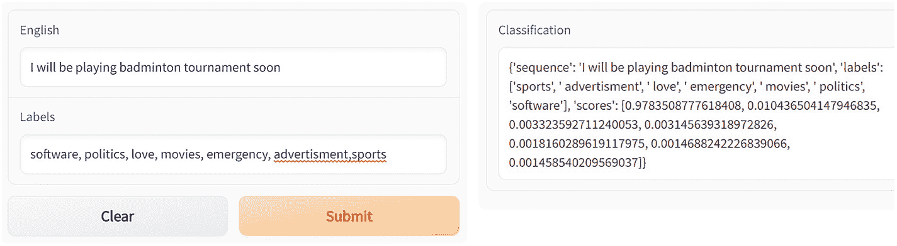

*图 5-20*
*零样本分类*

我们可以看到这段文本被正确分类到“sports”类别下。

我们再尝试另一个示例，如图 5-21 所示。

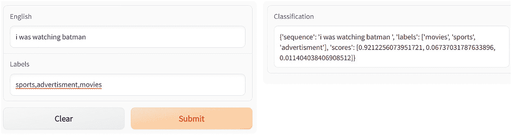

*图 5-21*
*零样本分类的另一个示例。标记为“Classification”的框显示了各个类别的得分/概率*

另一种不使用 `pipeline` API 实现相同功能的方法如下所示。

**代码**

**`app.py`**
```

### 文本生成任务/模型

文本生成模型的发展始于几十年前，远早于近期深度学习热潮的兴起。这类模型需要能够根据给定的文本片段，对特定单词或单词序列做出准确预测。当输入一段文本时，模型会在搜索空间中导航，从单词的联合分布中生成下一个最可能单词的概率。

最早的文本生成模型基于马尔可夫链。马尔可夫链类似于一个状态机，仅利用前一个状态来预测下一个状态。这与我们在二元语法中研究的内容类似。

在马尔可夫链之后，引入了能够保留更大文本上下文的循环神经网络（RNN）。它们基于具有循环特性的神经网络架构。RNN 能够保留所引入文本的更大上下文。然而，这类网络能够记住的信息量是有限的，并且训练它们也很困难，这意味着它们在生成长文本时效果不佳。为了解决 RNN 的这个难题，演化出了 LSTM 架构，它能够捕捉文本中的长期依赖关系。最后，我们迎来了 Transformer，其解码器架构在用于生成文本的生成模型中变得非常流行。

在本节中，我们将重点介绍 GPT2 模型，并了解如何使用 Hugging Face API 来调用 GPT2 模型执行生成任务。这将使我们能够使用预训练模型生成文本，并在需要时使用自定义文本数据集对其进行微调。

### 代码

#### `app.py`

```python
from transformers import GPT2LMHeadModel,GPT2Tokenizer
import gradio as grad
mdl = GPT2LMHeadModel.from_pretrained('gpt2')
gpt2_tkn=GPT2Tokenizer.from_pretrained('gpt2')
def generate(starting_text):
tkn_ids = gpt2_tkn.encode(starting_text, return_tensors = 'pt')
gpt2_tensors = mdl.generate(tkn_ids)
response = gpt2_tensors
return response
txt=grad.Textbox(lines=1, label="English", placeholder="English Text here")
out=grad.Textbox(lines=1, label="Generated Tensors")
grad.Interface(generate, inputs=txt, outputs=out).launch()
```

*清单 5-11* `app.py` 代码

#### `requirements.txt`

```
gradio
transformers
torch
```

提交更改，等待部署状态变为绿色。之后，点击菜单中的“App”选项卡启动应用程序。

向用户界面提供输入，然后点击“Submit”按钮查看结果，如图 5-23 所示。

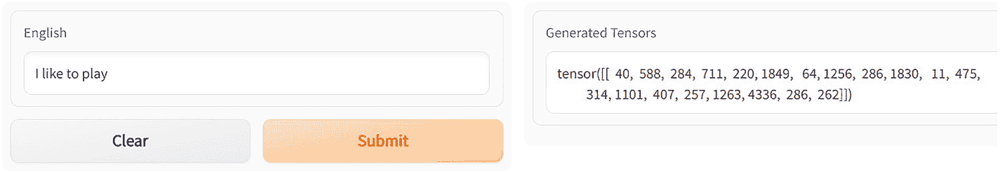

**图 5-23** 英文文本的张量

接下来，我们在 `generate` 函数中解码这些张量。

```python
def generate(starting_text):
tkn_ids = gpt2_tkn.encode(starting_text, return_tensors = 'pt')
gpt2_tensors = mdl.generate(tkn_ids)
response=""
#response = gpt2_tensors
for i, x in enumerate(gpt2_tensors):
response=response+f"{i}: {gpt2_tkn.decode(x, skip_special_tokens=True)}"
return response
```

*清单 5-12* `Generate` 函数

我将输入另一段文本进行检查。

提交更改，等待部署状态变为绿色。之后，点击菜单中的“App”选项卡启动应用程序。

向用户界面提供输入，然后点击“Submit”按钮查看结果，如图 5-24 所示。

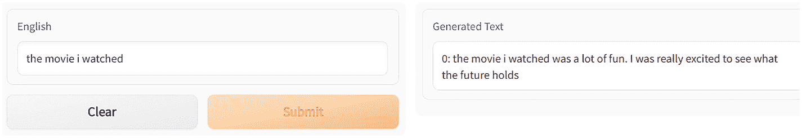

**图 5-24** 通过 Gradio 实现的代码生成应用程序

接下来，我们将更改模型中的一个简单参数。

我们再次稍微修改 `generate` 函数，如下所示。

```python
def generate(starting_text):
    tkn_ids = gpt2_tkn.encode(starting_text, return_tensors = 'pt')
    gpt2_tensors = mdl.generate(tkn_ids, max_length=100)
    response = ""
    # response = gpt2_tensors
    for i, x in enumerate(gpt2_tensors):
        response = response + f"{i}: {gpt2_tkn.decode(x, skip_special_tokens=True)}"
    return response
```

*清单 5-13* `app.py` 中 `generate` 函数的修改代码

提交更改，等待部署状态变为绿色。之后，点击菜单中的 **App** 选项卡启动应用程序。

在用户界面提供输入，然后点击 **Submit** 按钮查看结果，如图 5-25 所示。

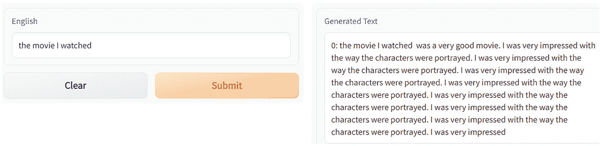

**图 5-25** 使用 Gradio 进行文本生成

我们可以看到生成的输出中存在大量重复。为了缓解这个问题，我们向模型添加另一个参数。

```python
def generate(starting_text):
    tkn_ids = gpt2_tkn.encode(starting_text, return_tensors = 'pt')
    gpt2_tensors = mdl.generate(tkn_ids, max_length=100, no_repeat_ngram_size=True)
    response = ""
    # response = gpt2_tensors
    for i, x in enumerate(gpt2_tensors):
        response = response + f"{i}: {gpt2_tkn.decode(x, skip_special_tokens=True)}"
    return response
```

*清单 5-14* 为避免重复而修改的 `app.py` 中 `generate` 函数代码

提交更改，等待部署状态变为绿色。之后，点击菜单中的 **App** 选项卡启动应用程序。

在用户界面提供输入，然后点击 **Submit** 按钮查看结果，如图 5-26 所示。

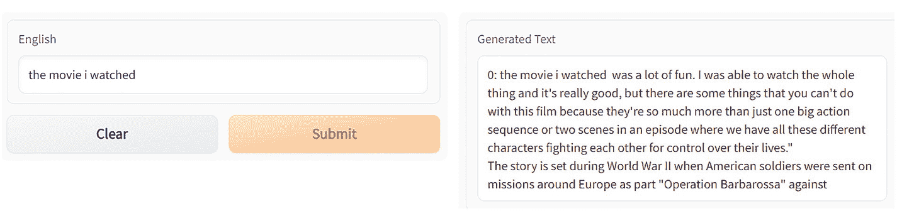

**图 5-26** 生成器现在避免文本重复的文本生成

到目前为止，模型为寻找下一个词所执行的搜索基于贪心搜索。

这是最直接的方法，即从所有备选词中选择概率最高的那个。当没有指定特定参数时，就会使用这种方法。这个过程本质上是确定性的，这意味着如果我们使用相同的参数，生成的文本将与之前相同。

接下来，我们指定一个参数 `num_beams` 来执行束搜索。

它会返回概率最高的序列，然后在选择时，挑选出概率最高的那个。`num_beams` 的值由参数 X 表示。我们再次修改 `generate` 函数来调整这个参数。

```python
def generate(starting_text):
    tkn_ids = gpt2_tkn.encode(starting_text, return_tensors = 'pt')
    gpt2_tensors = mdl.generate(tkn_ids, max_length=100, no_repeat_ngram_size=True, num_beams=3)
    response = ""
    # response = gpt2_tensors
    for i, x in enumerate(gpt2_tensors):
        response = response + f"{i}: {gpt2_tkn.decode(x, skip_special_tokens=True)}"
    return response
```

*清单 5-15* 修改后的 `app.py` 中 `generate` 函数代码，指定了 `num_beams`

提交更改，等待部署状态变为绿色。之后，点击菜单中的 **App** 选项卡启动应用程序。

在用户界面提供输入，然后点击 **Submit** 按钮查看结果，如图 5-27 所示。

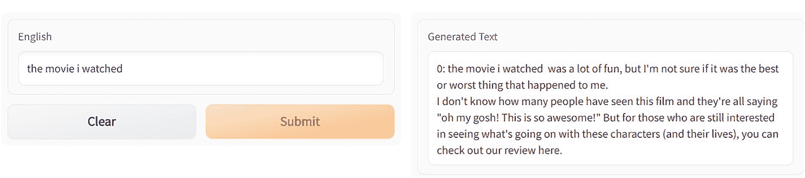

**图 5-27** 在 `generate` 函数中使用束搜索后的文本生成用户界面

我们采取的下一步方法是采样。

采样是一个参数，通过它可以从概率分布中随机选择下一个词。

在这种情况下，我们在 `generate` 函数内部设置参数 `do_sample=true`。

```python
def generate(starting_text):
    tkn_ids = gpt2_tkn.encode(starting_text, return_tensors = 'pt')
    gpt2_tensors = mdl.generate(tkn_ids, max_length=100, no_repeat_ngram_size=True, num_beams=3, do_sample=True)
    response = ""
    # response = gpt2_tensors
    for i, x in enumerate(gpt2_tensors):
        response = response + f"{i}: {gpt2_tkn.decode(x, skip_special_tokens=True)}"
    return response
```

*清单 5-16* 使用采样的 `app.py` 中 `generate` 函数修改代码

提交更改，等待部署状态变为绿色。之后，点击菜单中的 **App** 选项卡启动应用程序。

在用户界面提供输入，然后点击 **Submit** 按钮查看结果，如图 5-28 所示。

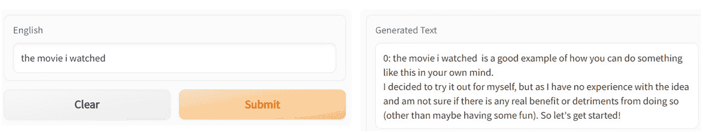

**图 5-28** 后台使用采样的 `generate` 函数的 Gradio 用户界面

可以改变分布的“温度”，以提高成功从最可能的候选词中选出一个词的可能性。

生成模型表现出的贪婪程度与温度成正比。

如果温度较低，除了具有最高对数概率的样本类别之外，其他样本类别的概率将会很低。因此，模型很可能会输出最正确的文本，但会相当单调，且变化很少。

如果温度较高，模型输出不同于最高概率词的其他词的可能性更大。生成的文本将包含更多样化的主题，但生成无意义文本和包含语法错误的可能性也会增加。

我们再次修改 `generate` 函数。

```python
def generate(starting_text):
    tkn_ids = gpt2_tkn.encode(starting_text, return_tensors = 'pt')
    gpt2_tensors = mdl.generate(tkn_ids, max_length=100, no_repeat_ngram_size=True, num_beams=3, do_sample=True, temperature=1.5)
    response = ""
    # response = gpt2_tensors
    for i, x in enumerate(gpt2_tensors):
        response = response + f"{i}: {gpt2_tkn.decode(x, skip_special_tokens=True)}"
    return response
```

*清单 5-17* 温度设置为 1.5 的 `app.py` 中 `generate` 函数修改代码

提交更改，等待部署状态变为绿色。之后，点击菜单中的 **App** 选项卡启动应用程序。

在用户界面提供输入，然后点击 **Submit** 按钮查看结果，如图 5-29 所示。


**图 5-29** 在 Gradio 用户界面中显示的、使用温度设置为 1.5 的 `generate` 函数进行的文本生成

当我们以较低的温度运行相同的代码时，输出的变化性会降低。

```markdown
# 文本生成与 T5 模型应用

## 使用 GPT-2 进行文本生成

### 代码清单 5-18：`app.py` 中 `generate` 函数的修改版本，温度设置为 0.1

```python
from transformers import GPT2LMHeadModel,GPT2Tokenizer
import gradio as grad
mdl = GPT2LMHeadModel.from_pretrained('gpt2')
gpt2_tkn=GPT2Tokenizer.from_pretrained('gpt2')
def generate(starting_text):
    tkn_ids = gpt2_tkn.encode(starting_text, return_tensors = 'pt')
    gpt2_tensors = mdl.generate(tkn_ids,max_length=100,no_repeat_ngram_size=True,num_beams=3,do_sample=True,temperatue=0.1)
    response=""
    #response = gpt2_tensors
    for i, x in enumerate(gpt2_tensors):
        response=response+f"{i}: {gpt2_tkn.decode(x, skip_special_tokens=True)}"
    return response
txt=grad.Textbox(lines=1, label="English", placeholder="English Text here")
out=grad.Textbox(lines=1, label="Generated Text")
grad.Interface(generate, inputs=txt, outputs=out).launch()
```

提交更改，等待部署状态变为绿色。之后，点击菜单中的 `App` 选项卡启动应用程序。

在 UI 中输入内容，点击 `Submit` 按钮查看结果，如图 5-30 所示。


使用 Gradio UI 进行文本生成的两个对话框。`English` 对话框有一个输入框以及 `Clear` 和 `Submit` 两个按钮。生成的文本对话框也有一个文本输入框。

为了更深入地理解文本生成的概念，我们将考虑另一个名为 `distilgpt2` 的模型。

### 代码清单 5-19：使用 GPT2 模型进行文本生成的 `app.py` 代码

**app.py**

```python
from transformers import pipeline, set_seed
import gradio as grad
gpt2_pipe = pipeline('text-generation', model='distilgpt2')
set_seed(42)
def generate(starting_text):
    response= gpt2_pipe(starting_text, max_length=20, num_return_sequences=5)
    return response
txt=grad.Textbox(lines=1, label="English", placeholder="English Text here")
out=grad.Textbox(lines=1, label="Generated Text")
grad.Interface(generate, inputs=txt, outputs=out).launch()
```

**requirements.txt**

```
gradio
transformers
torch
transformers[sentencepiece]
```

提交更改，等待部署状态变为绿色。之后，点击菜单中的 `App` 选项卡启动应用程序。

在 UI 中输入内容，点击 `Submit` 按钮查看结果，如图 5-31 所示。

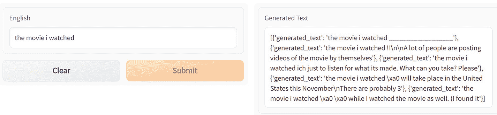

使用 GPT2 模型进行文本生成的两个对话框。`English` 对话框有一个输入框以及 `Clear` 和 `Submit` 两个按钮。生成的文本对话框也有一个文本输入框。

## 文本到文本生成

在本节中，我们将介绍使用 T5 模型进行文本到文本生成。

一种基于 Transformer 架构、采用文本到文本方法的模型被称为 T5，即 Text-to-Text Transfer Transformer（文本到文本转换 Transformer）。

在文本到文本方法中，我们将问答、分类、摘要、代码生成等任务转化为一个问题，为模型提供某种形式的输入，然后教会它生成某种形式的目标文本。这使得我们可以将相同的模型、损失函数、超参数和其他设置应用于我们所有不同的任务集。

T5 模型由 Google Research 开发并公开发布，它对先前的研究做出了以下贡献：

1.  它生成了一个更干净的巨型 Common Crawl 数据集版本，称为 Colossal Cleaned Common Crawl (`C4`)。该数据集比 Wikipedia 大约大 100,000 倍。

2.  它在 Common Crawl 上为 T5 准备了主体。

3.  它提出将每一个 NLP 任务重新思考为从输入文本到输出文本的表述。

4.  它证明了通过利用预训练的 T5 和文本到文本的表述，在摘要、问答和阅读理解等多种任务上进行微调，可以达到最先进的结果。

5.  此外，T5 团队还进行了深入研究，以了解预训练和微调的最有效方法。在他们的论文中，他们详细说明了哪些参数对于获得理想结果最为重要。

### 代码清单 5-20：`app.py` 代码

**app.py**

```python
from transformers import AutoModelWithLMHead, AutoTokenizer
import gradio as grad
text2text_tkn = AutoTokenizer.from_pretrained("mrm8488/t5-base-finetuned-question-generation-ap")
mdl = AutoModelWithLMHead.from_pretrained("mrm8488/t5-base-finetuned-question-generation-ap")
def text2text(context,answer):
    input_text = "answer: %s  context: %s " % (answer, context)
    features = text2text_tkn ([input_text], return_tensors='pt')
    output = mdl.generate(input_ids=features['input_ids'],
                          attention_mask=features['attention_mask'],
                          max_length=64)
    response=text2text_tkn.decode(output[0])
    return response
context=grad.Textbox(lines=10, label="English", placeholder="Context")
ans=grad.Textbox(lines=1, label="Answer")
out=grad.Textbox(lines=1, label="Genereated Question")
grad.Interface(text2text, inputs=[context,ans], outputs=out).launch()
```

**requirements.txt**

```
gradio
transformers
torch
transformers[sentencepiece]
```

提交更改，等待部署状态变为绿色。之后，点击菜单中的 `App` 选项卡启动应用程序。

在 UI 中输入内容，点击 `Submit` 按钮查看结果，如图 5-32 所示。

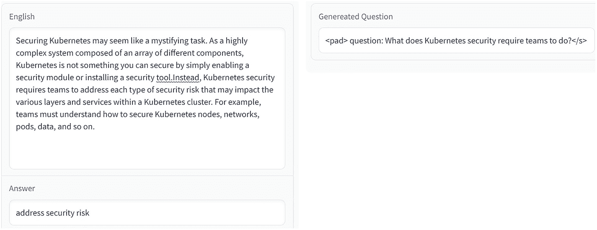

用于生成问题的两个对话框。`English` 对话框有两个输入框，一个用于输入段落，另一个用于输入答案。生成的问题对话框也有一个包含问题的输入框。

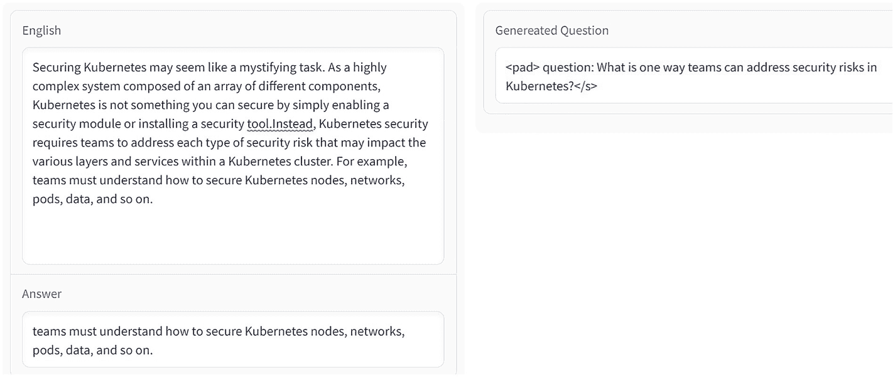

用于问题生成的两个对话框。`English` 对话框有两个输入框，一个用于输入段落，另一个用于输入答案。生成的问题对话框也有一个包含问题的输入框。

在同一个示例中，让我们稍微改变一下答案。

现在我们来看 T5 的另一个用例，即总结一段文本。

### 代码清单 5-21 `app.py` 代码

**app.py**

```python
from transformers import AutoTokenizer, AutoModelWithLMHead
import gradio as grad
text2text_tkn = AutoTokenizer.from_pretrained("deep-learning-analytics/wikihow-t5-small")
mdl = AutoModelWithLMHead.from_pretrained("deep-learning-analytics/wikihow-t5-small")
def text2text_summary(para):
    initial_txt = para.strip().replace("\n","")
    tkn_text = text2text_tkn.encode(initial_txt, return_tensors="pt")
    tkn_ids = mdl.generate(
        tkn_text,
        max_length=250,
        num_beams=5,
        repetition_penalty=2.5,
        early_stopping=True
    )
    response = text2text_tkn.decode(tkn_ids[0], skip_special_tokens=True)
    return response
para=grad.Textbox(lines=10, label="段落", placeholder="复制段落")
out=grad.Textbox(lines=1, label="摘要")
grad.Interface(text2text_summary, inputs=para, outputs=out).launch()
```

**requirements.txt**

```
gradio
transformers
torch
transformers[sentencepiece]
```

提交更改并等待部署状态变为绿色。之后，点击菜单中的 `App` 标签页启动应用程序。

向用户界面提供输入，并点击 `Submit` 按钮查看结果，如图 5-34 所示。

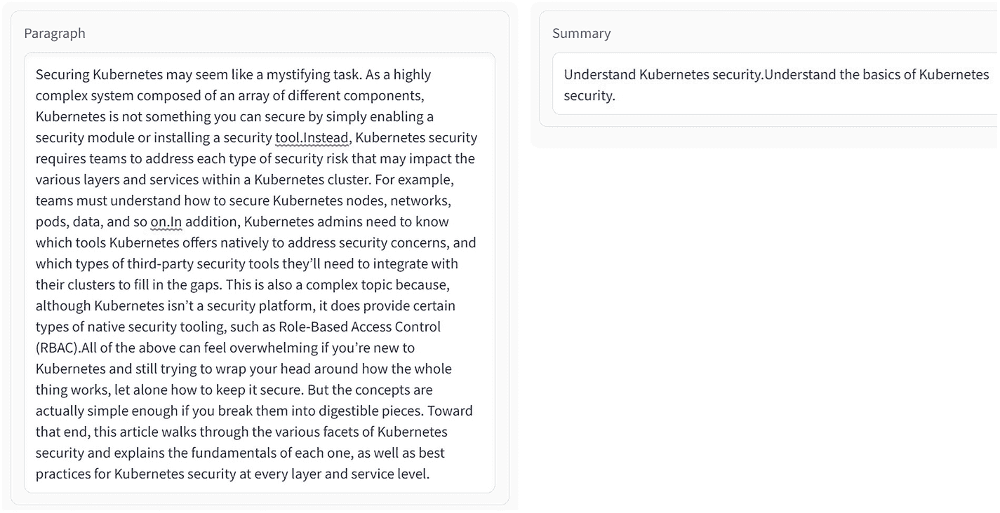

使用 Gradio 应用进行文本摘要的两个对话框。段落对话框包含一个输入段落的字段。摘要对话框也包含一个单行文本字段。

接下来，我们将介绍更多可以使用 T5 模型完成的任务。其中部分任务列举如下：

1.  翻译

2.  情感分类

3.  释义

4.  判断句子中的陈述是否正确

5.  以及其他任务

我们将在后续内容中介绍上述部分任务。

## 使用 T5 进行英译德

如下代码片段所示，我们需要在文本前添加前缀 `translate English to German`，以生成对应的德语翻译。

### 代码清单 5-22 `app.py` 代码

**app.py**

```python
from transformers import T5ForConditionalGeneration, T5Tokenizer
import gradio as grad
text2text_tkn= T5Tokenizer.from_pretrained("t5-small")
mdl = T5ForConditionalGeneration.from_pretrained("t5-small")
def text2text_translation(text):
    inp = "translate English to German:: "+text
    enc = text2text_tkn(inp, return_tensors="pt")
    tokens = mdl.generate(**enc)
    response=text2text_tkn.batch_decode(tokens)
    return response
para=grad.Textbox(lines=1, label="英文文本", placeholder="输入英文")
out=grad.Textbox(lines=1, label="德语翻译")
grad.Interface(text2text_translation, inputs=para, outputs=out).launch()
```

**requirements.txt**

```
gradio
transformers
torch
transformers[sentencepiece]
```

提交更改并等待部署状态变为绿色。之后，点击菜单中的 `App` 标签页启动应用程序。

向用户界面提供输入，并点击 `Submit` 按钮查看结果，如图 5-35 所示。

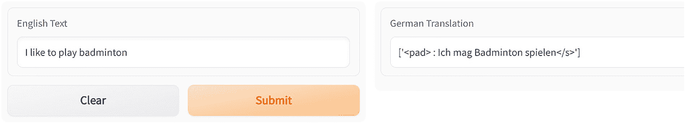

使用 T5 模型进行文本翻译的两个对话框。英文对话框包含一个输入字段以及“清除”和“提交”两个按钮。德语翻译对话框也包含一个文本字段。

如果我们将这段翻译后的文本放入谷歌翻译，会得到如图 5-36 所示的结果。

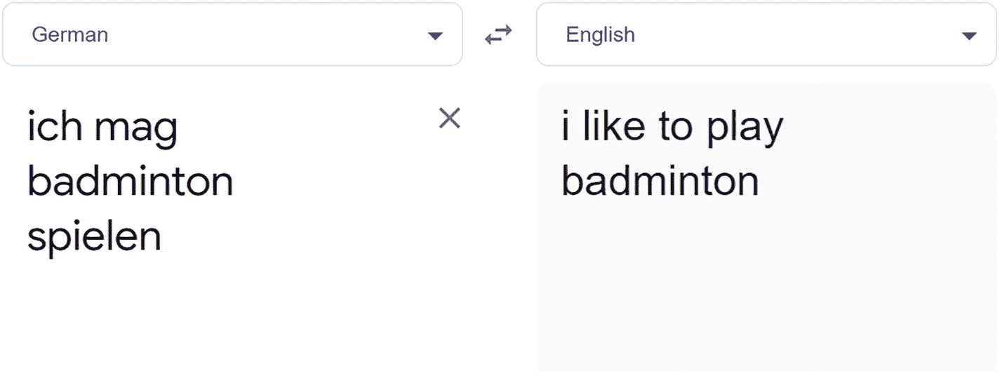

谷歌翻译截图。包含德语和转换后的英文文本两个字段。英文和德语之间有一个转换符号。

这正好是我们输入的原文。

现在，我们将 `app.py` 中的前缀改为 `translate English to French`。

### 代码清单 5-23 `app.py` 代码

```python
from transformers import T5ForConditionalGeneration, T5Tokenizer
import gradio as grad
text2text_tkn= T5Tokenizer.from_pretrained("t5-small")
mdl = T5ForConditionalGeneration.from_pretrained("t5-small")
def text2text_translation(text):
    inp = "translate English to French:: "+text
    enc = text2text_tkn(inp, return_tensors="pt")
    tokens = mdl.generate(**enc)
    response=text2text_tkn.batch_decode(tokens)
    return response
para=grad.Textbox(lines=1, label="英文文本", placeholder="输入英文")
out=grad.Textbox(lines=1, label="法语翻译")
grad.Interface(text2text_translation, inputs=para, outputs=out).launch()
```

提交更改并等待部署状态变为绿色。之后，点击菜单中的 `App` 标签页启动应用程序。

向用户界面提供输入，并点击 `Submit` 按钮查看结果，如图 5-37 所示。

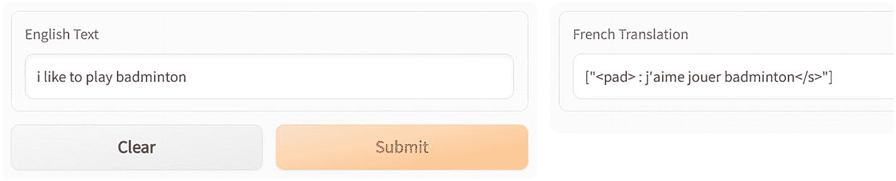

使用 T5 模型进行摘要的两个对话框。英文对话框包含一个输入字段以及“清除”和“提交”两个按钮。法语翻译对话框也包含一个文本字段。

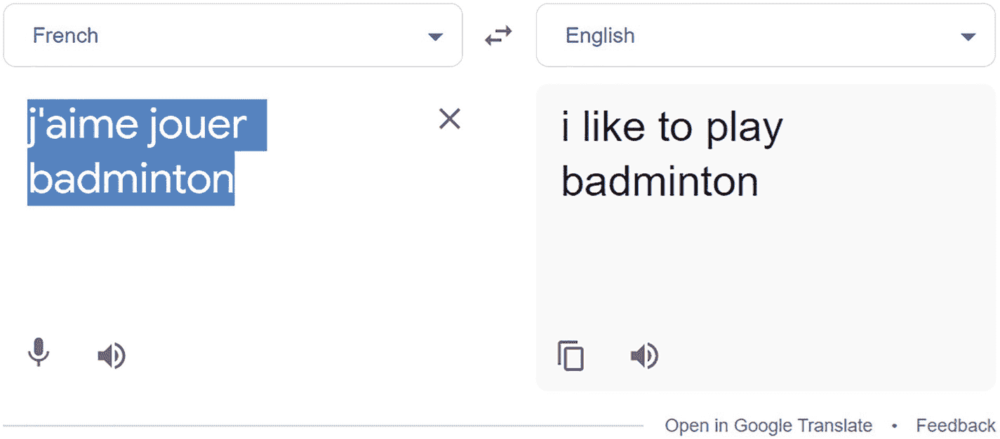

谷歌翻译截图。包含法语和转换后的英文文本两个字段。法语和德语之间有一个转换符号。

我们在谷歌上对相同内容进行了验证。

可以看到结果与谷歌翻译完全一致。

## 情感分析任务

接下来，我们尝试使用 `T5` 模型进行情感分类。我们使用 `sst2` 句子前缀来进行情感分析。

### 代码

**app.py**
```

### 情感分析任务

提交更改并等待部署状态变为绿色。之后，点击菜单中的 `App` 标签启动应用程序。在用户界面提供输入，并点击 `Submit` 按钮查看结果，如图 5-39 所示。

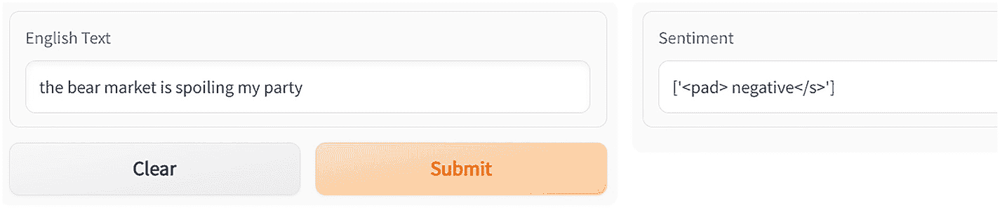

*图 5-40* 使用 T5 进行情感分析任务 – 负面

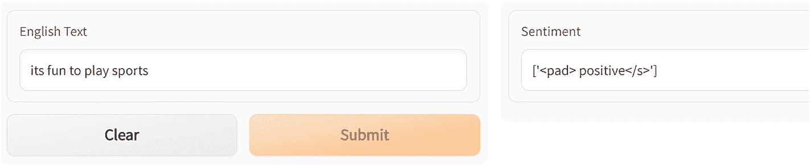

*图 5-39* 使用 T5 进行情感分析任务 – 正面

让我们对另一段文本再次运行代码。我们得到以下输出。你可以再次观察到，仅通过在各种任务上使用这些预训练模型，工作变得多么简单。

接下来，我们使用 `T5` 模型，通过 `cola` 句子前缀来检查文本的语法可接受性，如下所示。

**代码**

**app.py**

```python
from transformers import T5ForConditionalGeneration, T5Tokenizer
import gradio as grad
text2text_tkn= T5Tokenizer.from_pretrained("t5-small")
mdl = T5ForConditionalGeneration.from_pretrained("t5-small")
def text2text_acceptable_sentence(text):
inp = "cola sentence: "+text
enc = text2text_tkn(inp, return_tensors="pt")
tokens = mdl.generate(**enc)
response=text2text_tkn.batch_decode(tokens)
return response
para=grad.Textbox(lines=1, label="English Text", placeholder="Text in English")
out=grad.Textbox(lines=1, label="Whether the sentence is acceptable or not")
grad.Interface(text2text_acceptable_sentence, inputs=para, outputs=out).launch()
```

*代码清单 5-25* `app.py` 代码

**requirements.txt**

```
gradio
transformers
torch
transformers[sentencepiece]
```

提交更改并等待部署状态变为绿色。之后，点击菜单中的 `App` 标签启动应用程序。在用户界面提供输入，并点击 `Submit` 按钮查看结果，如图 5-41 所示。

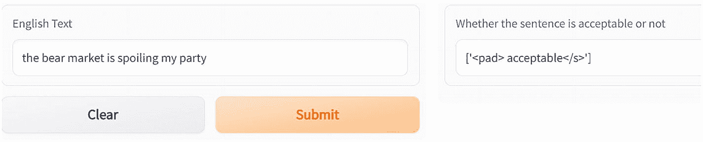

*图 5-41* 句子可接受性

### 句子释义任务

现在，我们使用 `mrpc` `sentence1` `sentence2` 前缀来检查两个句子是否互为释义。

**代码**

**app.py**

```python
from transformers import T5ForConditionalGeneration, T5Tokenizer
import gradio as grad
text2text_tkn= T5Tokenizer.from_pretrained("t5-small")
mdl = T5ForConditionalGeneration.from_pretrained("t5-small")
def text2text_paraphrase(sentence1,sentence2):
inp1 = "mrpc sentence1: "+sentence1
inp2 = "sentence2: "+sentence2
combined_inp=inp1+" "+inp2
enc = text2text_tkn(combined_inp, return_tensors="pt")
tokens = mdl.generate(**enc)
response=text2text_tkn.batch_decode(tokens)
return response
sent1=grad.Textbox(lines=1, label="Sentence1", placeholder="Text in English")
sent2=grad.Textbox(lines=1, label="Sentence2", placeholder="Text in English")
out=grad.Textbox(lines=1, label="Whether the sentence is acceptable or not")
grad.Interface(text2text_paraphrase, inputs=[sent1,sent2], outputs=out).launch()
```

*代码清单 5-26* `app.py` 代码

**requirements.txt**

```
gradio
transformers
torch
transformers[sentencepiece]
```

提交更改并等待部署状态变为绿色。之后，点击菜单中的 `App` 标签启动应用程序。在用户界面提供输入，并点击 `Submit` 按钮查看结果，如图 5-42 所示。

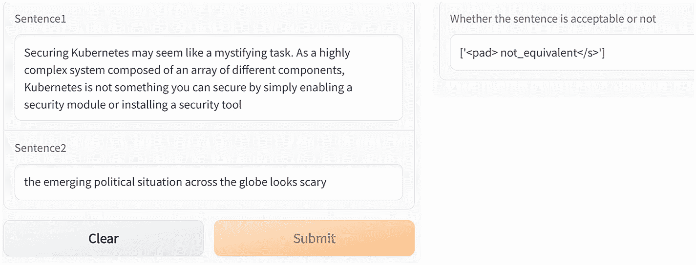

*图 5-43* 再次显示句子是否等价

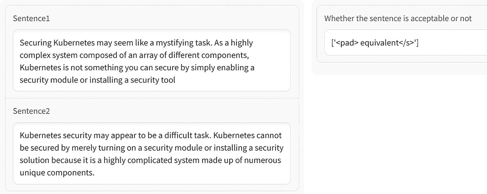

*图 5-42* 显示句子是否等价

接下来，让我们对两个完全不同的句子运行相同的代码。我们得到以下输出。

接下来，我们研究一个任务：检查从一段文本中推断出的陈述是否正确。我们再次通过 `T5` 模型来完成。为此，我们需要使用 `rte` `sentence1` `sentence2` 前缀，如下面的代码所示。

**代码**

**app.py**

```python
from transformers import T5ForConditionalGeneration, T5Tokenizer
import gradio as grad
text2text_tkn= T5Tokenizer.from_pretrained("t5-small")
mdl = T5ForConditionalGeneration.from_pretrained("t5-small")
def text2text_deductible(sentence1,sentence2):
inp1 = "rte sentence1: "+sentence1
inp2 = "sentence2: "+sentence2
combined_inp=inp1+" "+inp2
enc = text2text_tkn(combined_inp, return_tensors="pt")
tokens = mdl.generate(**enc)
response=text2text_tkn.batch_decode(tokens)
return response
sent1=grad.Textbox(lines=1, label="Sentence1", placeholder="Text in English")
sent2=grad.Textbox(lines=1, label="Sentence2", placeholder="Text in English")
out=grad.Textbox(lines=1, label="Whether sentence2 is deductible from sentence1")
grad.Interface(text2text_ deductible, inputs=[sent1,sent2], outputs=out).launch()
```

*代码清单 5-27* `app.py` 代码

**requirements.txt**

```
gradio
transformers
torch
transformers[sentencepiece]
```

提交更改并等待部署状态变为绿色。之后，点击菜单中的 `App` 标签启动应用程序。在用户界面提供输入，并点击 `Submit` 按钮查看结果，如图 5-44 所示。

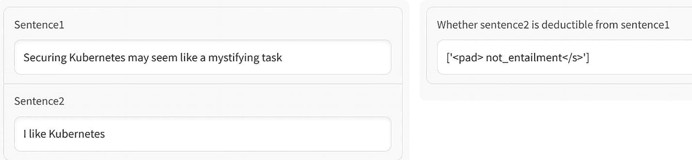

*图 5-45* 用于检查一个句子是否可从另一个句子推断得出的 Gradio 应用 – 无蕴含关系

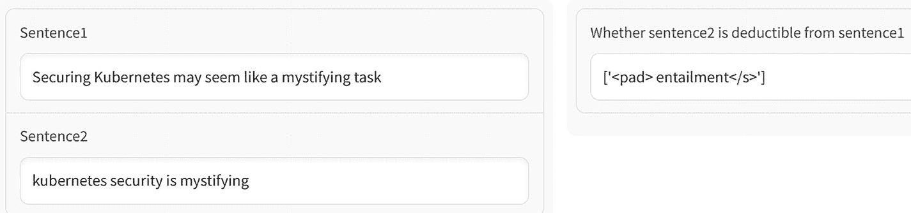

图 5-44：用于检查一个句子是否可从另一个句子推导出的 Gradio 应用——蕴含关系

此处，蕴含关系意味着 `sentence2` 可从 `sentence1` 推导出来。让我们为同一任务提供不同的句子，看看会得到什么输出。结果如下所示。其中，输出中的 `not_entailment` 表示 `sentence2` 不能从 `sentence1` 推导出来。

从 T5 转向聊天机器人领域，我们将展示如何利用 Hugging Face API 轻松开发一个聊天机器人。

## 聊天机器人/对话机器人

作为本章的最后一个示例，我们将展示如何使用 Transformers 库构建一个简单的对话系统。

机器学习研究在构建开放域聊天机器人方面面临着一个巨大障碍。虽然先前的研究表明，扩展神经模型可以带来更好的结果，但这并非开发优秀聊天机器人时应考虑的唯一因素。一次良好的对话需要大量技能，聊天机器人必须具备这些技能才能进行无缝对话。这些技能包括理解当前对话内容，以及对话中前几句话所谈论的内容。机器人还应能够处理有人试图用脱离上下文的问题来误导它的场景。

下面我们展示一个基于微软 DialoGPT 模型的简单机器人，名为 Alicia。

### 代码

**app.py**

```python
from transformers import AutoModelForCausalLM, AutoTokenizer,BlenderbotForConditionalGeneration
import torch
chat_tkn = AutoTokenizer.from_pretrained("microsoft/DialoGPT-medium")
mdl = AutoModelForCausalLM.from_pretrained("microsoft/DialoGPT-medium")
#chat_tkn = AutoTokenizer.from_pretrained("facebook/blenderbot-400M-distill")
#mdl = BlenderbotForConditionalGeneration.from_pretrained("facebook/blenderbot-400M-distill")
def converse(user_input, chat_history=[]):
user_input_ids = chat_tkn(user_input + chat_tkn.eos_token, return_tensors='pt').input_ids
# keep history in the tensor
bot_input_ids = torch.cat([torch.LongTensor(chat_history), user_input_ids], dim=-1)
# get response
chat_history = mdl.generate(bot_input_ids, max_length=1000, pad_token_id=chat_tkn.eos_token_id).tolist()
print (chat_history)
response = chat_tkn.decode(chat_history[0]).split("")
print("starting to print response")
print(response)
# html for display
html = ""
for x, mesg in enumerate(response):
if x%2!=0 :
mesg="Alicia:"+mesg
clazz="alicia"
else :
clazz="user"
print("value of x")
print(x)
print("message")
print (mesg)
html += " {}".format(clazz, mesg)
html += ""
print(html)
return html, chat_history
import gradio as grad
css = """
.mychat {display:flex;flex-direction:column}
.mesg {padding:5px;margin-bottom:5px;border-radius:5px;width:75%}
.mesg.user {background-color:lightblue;color:white}
.mesg.alicia {background-color:orange;color:white,align-self:self-end}
.footer {display:none !important}
"""
text=grad.inputs.Textbox(placeholder="Lets chat")
grad.Interface(fn=converse,
theme="default",
inputs=[text, "state"],
outputs=["html", "state"],
css=css).launch()
```

代码清单 5-28：`app.py`代码

**requirements.txt**

```
gradio
transformers
torch
transformers[sentencepiece]
```

提交更改，等待部署状态变为绿色。之后，点击菜单中的“App”选项卡启动应用程序。

在 UI 中输入内容，点击“Submit”按钮查看对话，如图 5-46 所示。

图 5-46：使用微软 DialoGPT 模型的聊天机器人

## 代码与代码注释生成

代码生成正迅速成为自然语言处理（NLP）领域的热门话题，与普遍看法相反，这并非空穴来风。OpenAI Codex 模型刚刚发布。如果你看过 Codex 的演示之一，就能观察到这些模型将如何影响未来软件编程的发展。由于预训练模型并未向公众开放，如果研究需求不仅仅是使用 API 进行简单实验，那么从研究人员的角度来看，使用 Codex 模型几乎是不可能的。从技术上讲，利用已发表的论文复现 Codex 是可能的；但要做到这一点，你需要一个大型 GPU 集群，而这是极少数人能够获得或负担得起的。我认为这一限制将使研究变得更加困难。想象一下，如果作者选择不公开预训练权重，那么可供我们使用的 BERT 下游应用数量将会骤降。我们只能希望 Codex 不是目前唯一可用的代码生成范式。

在本章中，我们将介绍 CodeGen，这是一个编码器-解码器代码生成模型，其预训练检查点已公开，你现在就可以进行测试。

### CodeGen

CodeGen 是一种语言模型，能将简单的英文提示转换为可执行的代码。你无需自己编写代码，而是用自然语言描述代码应实现的功能，机器会根据你的描述为你编写代码。

在由 Erik Nijkamp、Bo Pang、Hiroaki Hayashi、Lifu Tu、Huan Wang、Yingbo Zhou、Silvio Savarese 和 Caiming Xiong 撰写的论文《A Conversational Paradigm for Program Synthesis》中，提出了一系列用于程序合成的自回归语言模型，称为 CodeGen。这些模型最初以三种不同的预训练数据变体（NL、Multi 和 Mono）以及四种不同的模型大小变体（350M、2B、6B、16B）提供下载。

在本章中，我们将探讨一些示例，展示如何使用 CodeGen 模型生成代码。我们将使用一个拥有 3.5 亿参数的小型 CodeGen 模型。

### 代码

**app.py**

```python
from transformers import AutoTokenizer, AutoModelForCausalLM
import gradio as grad
codegen_tkn = AutoTokenizer.from_pretrained("Salesforce/codegen-350M-mono")
mdl = AutoModelForCausalLM.from_pretrained("Salesforce/codegen-350M-mono")
def codegen(intent):
# give input as text which reflects intent of the program.
#text = " write a function which takes 2 numbers as input and returns the larger of the two"
input_ids = codegen_tkn(intent, return_tensors="pt").input_ids
gen_ids = mdl.generate(input_ids, max_length=128)
response = codegen_tkn.decode(gen_ids[0], skip_special_tokens=True)
return response
output=grad.Textbox(lines=1, label="生成的 Python 代码", placeholder="")
inp=grad.Textbox(lines=1, label="在此输入你的意图")
grad.Interface(codegen, inputs=inp, outputs=output).launch()
```

代码清单 5-29：`app.py`代码

**requirements.txt**

```
gradio
git+https://github.com/huggingface/transformers.git
torch
transformers[sentencepiece]
```

提交更改，等待部署状态变为绿色。之后，点击菜单中的“App”选项卡启动应用程序。

在 UI 中输入内容，点击“Submit”按钮查看结果，如图 5-47 所示。

图 5-47：用于查找两个数中较大者的示例代码生成器

正如我们所见，代码并非完全准确，但捕捉到了意图。

接下来，我们尝试生成如图 5-48 所示的冒泡排序代码。

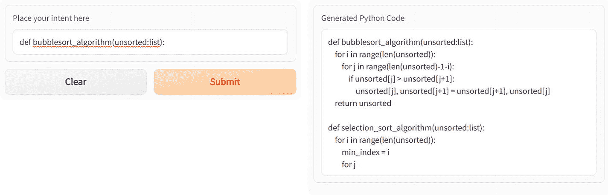

冒泡排序文本转代码的两个对话框。一个对话框用于输入意图文本，带有清除和提交按钮。另一个用于显示生成的 Python 代码。

**图 5-48** 冒泡排序文本转代码示例

通过修改`app.py`文件（将`max_length`参数改为 256），可以对归并排序进行同样的操作。

```
from transformers import AutoTokenizer, AutoModelForCausalLM
import gradio as grad
codegen_tkn = AutoTokenizer.from_pretrained("Salesforce/codegen-350M-mono")
mdl = AutoModelForCausalLM.from_pretrained("Salesforce/codegen-350M-mono")
def codegen(intent):
# give input as text which reflects intent of the program.
#text = " write a function which takes 2 numbers as input and returns the larger of the two"
input_ids = codegen_tkn(intent, return_tensors="pt").input_ids
gen_ids = mdl.generate(input_ids, max_length=256)
response = codegen_tkn.decode(gen_ids[0], skip_special_tokens=True)
return response
output=grad.Textbox(lines=1, label="Generated Python Code", placeholder="")
inp=grad.Textbox(lines=1, label="Place your intent here")
grad.Interface(codegen, inputs=inp, outputs=inp).launch()
text = """def merge_sort(unsorted:list):
"""
input_ids = codegen_tkn(text, return_tensors="pt").input_ids
gen_ids = mdl.generate(input_ids, max_length=256)
print(codegen_tkn.decode(gen_ids[0], skip_special_tokens=True))
```

**代码清单 5-30** `app.py` 代码

提交更改并等待部署状态变为绿色。之后，点击菜单中的**App**选项卡启动应用程序。

在 UI 中输入内容，然后点击**Submit**按钮查看结果，如图 5-49 所示。

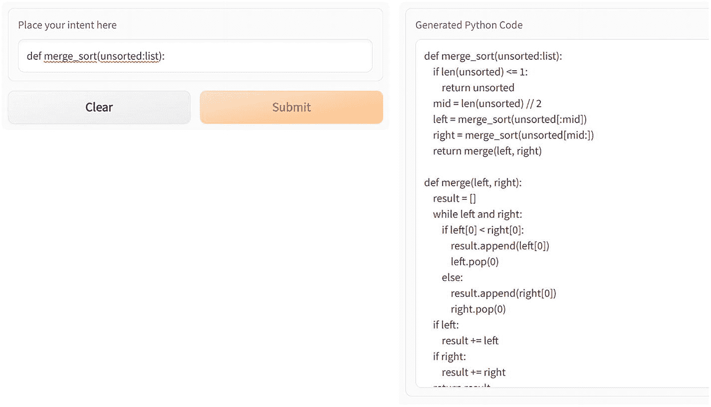

为归并排序生成代码的两个对话框。一个对话框用于输入意图文本，带有清除和提交按钮。另一个用于显示生成的 Python 代码。

**图 5-49** 为归并排序生成代码

### 代码注释生成器

本节的目标是输入一些代码，让模型为这些代码生成注释。在此案例中，我们将使用 Salesforce CodeT5 模型，该模型针对 Java 代码进行了微调。

顾名思义，T5 编码器-解码器范式是 CodeT5 [1] 构建的基础。与将源代码视为任何其他自然语言文本不同，它应用了一种新的、能识别标识符的预训练目标，充分利用了代码语义。这与依赖传统预训练方法的先前代码生成模型形成了对比。

作者发布了两个预训练模型：一个包含 2.2 亿数据点的基本模型，以及一个仅包含 6000 万数据点的较小模型。除此之外，他们还通过公共 GCP 存储桶发布了所有微调检查点。此外，著名的 huggingface 库使得这两个预训练模型均可使用。

CodeT5 是一个统一的预训练编码器-解码器 Transformer 模型。CodeT5 方法利用了一个统一框架，这不仅促进了多任务学习，还以轻松的方式支持代码解释和生成活动。

CodeT5 的预训练是通过两个独立目标按顺序完成的。在前 100 个 epoch 中，模型通过一个能识别标识符的去噪目标进行优化。这训练模型区分标识符（如变量名、函数名等）和特定编程语言的关键字（例如`if`、`while`等）。然后，利用双模态双重生成目标，总共进行 50 次迭代优化。最终目标是确保代码与自然语言描述之间更加对齐。

由于此示例需要从非 huggingface 仓库下载模型（在撰写本书时，该模型尚未在 huggingface 上更新），我们将在 Google Colab 中而非 huggingface 上执行此示例。

在 Colab 中创建一个新的笔记本。

在开始注释生成代码之前，我们需要安装依赖项：

```
!pip install -q git+https://github.com/huggingface/transformers.git
```

创建一个注释模型目录：

```
!mkdir comment_model
%cd comment_model
!wget -O config.json https://storage.googleapis.com/sfr-codet5-data-research/pretrained_models/codet5_base/config.json
!wget -O pytorch_model.bin https://storage.googleapis.com/sfr-codet5-data-research/finetuned_models/summarize_java_codet5_base.bin
from transformers import RobertaTokenizer, T5ForConditionalGeneration
model_name_or_path = './comment_model'  #  指向之前创建的文件夹的路径。
codeT5_tkn = RobertaTokenizer.from_pretrained('Salesforce/codet5-base')
mdl = T5ForConditionalGeneration.from_pretrained(model_name_or_path)
```

提供代码片段作为输入：

```
text = """ public static void main(String[] args) {
int num = 29;
boolean flag = false;
for (int i = 2; i <= num / 2; ++i) {
// condition for nonprime number
if (num % i == 0) {
flag = true;
break;
}
}
if (!flag)
System.out.println(num + " is a prime number.");
else
System.out.println(num + " is not a prime number.");
} """
input_ids = codeT5_tkn(text, return_tensors="pt").input_ids
gen_ids = mdl.generate(input_ids, max_length=20)
print(codeT5_tkn.decode(gen_ids[0], skip_special_tokens=True))
```

**代码清单 5-31** 从源代码文件生成注释的代码

我们得到以下输出：

```
A test program to check if the number is a prime number .
```

我们输入另一段文本并检查：

```
text = """ LocalDate localDate = new LocalDate(2020, 1, 31);
int numberOfDays = Days.daysBetween(localDate, localDate.plusYears(1)).getDays();
boolean isLeapYear = (numberOfDays > 365) ? true : false;"""
input_ids = codeT5_tkn(text, return_tensors="pt").input_ids
gen_ids = mdl.generate(input_ids, max_length=150)
print(codeT5_tkn.decode(gen_ids[0], skip_special_tokens=True))
```

输出：

```
Returns true if the year is a leap year
```

接下来，我们尝试使用访问 Google 搜索 API 的代码。

```
text = """
String google = "http://ajax.googleapis.com/ajax/services/search/web?v=1.0&q=";
String search = "stackoverflow";
String charset = "UTF-8";
URL url = new URL(google + URLEncoder.encode(search, charset));
Reader reader = new InputStreamReader(url.openStream(), charset);
GoogleResults results = new Gson().fromJson(reader, GoogleResults.class);
// Show title and URL of 1st result.
System.out.println(results.getResponseData().getResults().get(0).getTitle());
System.out.println(results.getResponseData().getResults().get(0).getUrl());
"""
input_ids = codeT5_tkn(text, return_tensors="pt").input_ids
gen_ids = mdl.generate(input_ids, max_length=50, temperature=0.2,num_beams=200,no_repeat_ngram_size=2,num_return_sequences=5)
print(codeT5_tkn.decode(gen_ids[0], skip_special_tokens=True))
```

**代码清单 5-32** 尝试为 Google 搜索代码生成注释的代码

输出结果为：

```
https://www. googleapis. com / ajax. services. search. web?v = 1\. 0 &q = 123 Show title and URL of 1st result.
```

最后一个结果可能看起来不太好，但可以通过调整特定参数来改进，这部分留给你去尝试。

最后，这些预训练模型也可以针对特定的编程语言（如 C、C++等）进行微调。

## 总结

在本章中，我们探讨了 Transformer 如何用于处理文本并将其应用于分类、翻译、摘要等各种任务的不同用例和实现。我们还了解了如何使用 huggingface API 轻松构建聊天机器人。

在下一章中，我们将探讨 Transformer 如何应用于图像处理领域。