# Gradio：简介

`Gradio` 是一个专为部署和推理机器学习模型而构建的 Web 框架。`Gradio` 允许我们通过 Web 界面快速公开我们的机器学习模型，而无需学习太多编码知识。随着对 `Gradio` 的收购，Hugging Face 在为其社区提供便捷的界面来部署和提供 Hugging Face 模型的用户界面方面又迈进了一步。

在本章中，我们将利用 Hugging Face Spaces，它为我们提供了一个界面，可以快速部署我们的应用程序（使用 Hugging Face API 构建），并为其提供一个 Web 前端，最终用户可以使用该前端与我们的应用程序进行交互。

## 在 Hugging Face 上创建 Space

要在 Hugging Face 基础设施上创建一个 Space，我们需要拥有一个 Hugging Face 账户。可以通过访问 [`https://huggingface.co/`](https://huggingface.co/) 并在那里创建一个账户来完成。创建账户后，我们可以点击最右侧的彩色圆圈，如图 5-1 所示。

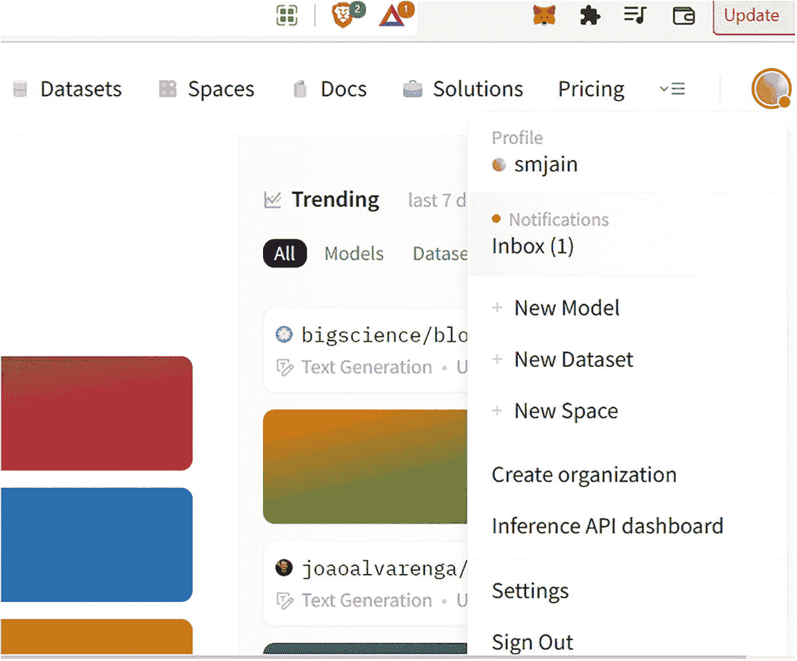

登录后 Hugging Face 界面的示意图。右上角有一个打开的菜单栏，从上到下依次标记为：个人资料、通知、添加新模型、新数据集、新 Space、设置和退出。

**图 5-1** 登录后的 Hugging Face 界面

点击 `New space`，我们会看到一个如图 5-2 所示的界面。

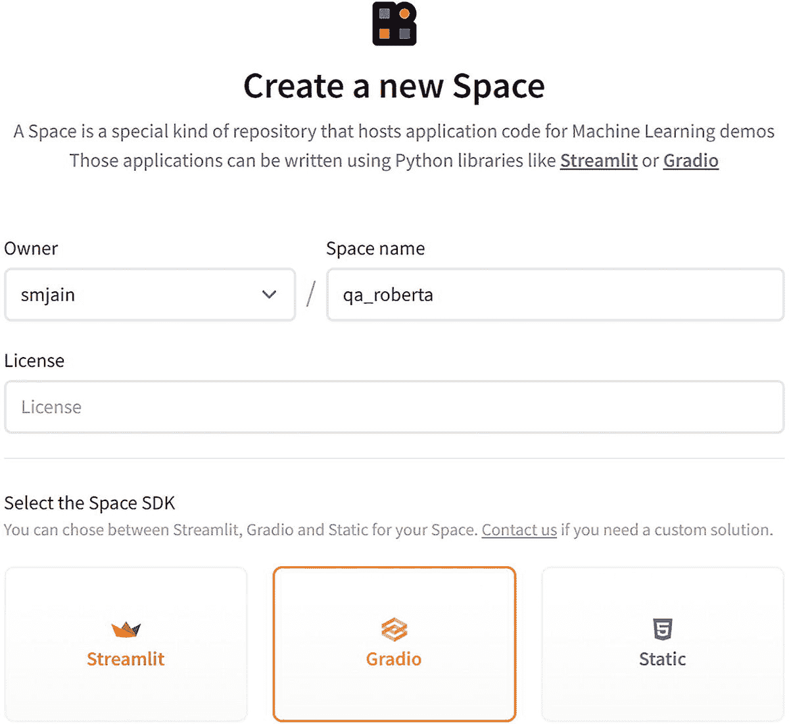

创建新 Space 的界面。它包含所有者、Space 名称和许可证等字段。它还有 Space SDK 选项，例如 Streamlet、Gradio 和 static。

**图 5-2** 创建新 Space

为你的 Space 提供一个名称，并选择 `Gradio` 作为 SDK。暂时将可见性保持为 `public` 默认值，最后点击 `Create Space` 按钮。

你将看到如图 5-3 所示的菜单。

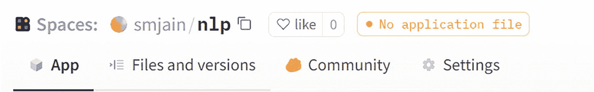

Hugging Face 网页上菜单的截图。它包含 Space 规格，如所有者名称和点赞数。从左到右有应用程序、文件和版本、社区和设置等选项。

**图 5-3** Hugging Face 网页上显示的菜单

在本章的大多数应用程序中，我们将使用 `Files and versions` 和 `App` 选项卡。

点击 `Files and versions` 选项卡，在右侧我们会看到 `Add file`。点击它，我们可以添加应用程序所需的文件。

对于我们的应用程序，我们只需要创建两个文件：

1.  `app.py`：这是 `Gradio` 应用程序主要代码的文件。
2.  `requirements.txt`：此文件包含应用程序所需的 Python 依赖项。

## Hugging Face 任务

我们将从一个问答任务开始。

### 问答

模型的输入将是一个段落和该段落中的一个问题。模型推理的输出将是问题的答案。

我们使用的模型是在 SQuAD 数据集上训练的。

斯坦福问答数据集，也称为 SQuAD，是一个阅读理解数据集，由众包工作者在一组维基百科文章上提出的问题组成。每个问题的答案都是来自相应阅读段落的一段文本（也称为跨度），或者该问题可能无法回答。

SQuAD 1.1 包含超过 100,000 个问答对，涵盖 500 多篇不同的文章。

首先，使用 RoBERTa [base](https://huggingface.co/roberta-base) 模型，并使用 [SQuAD 2.0](https://huggingface.co/datasets/squad_v2) 数据集进行微调。它已经在问答对（包括无法回答的问题）上进行了训练，用于问答任务。

模型使用的一些超参数包括：

*   `batch_size`: 96
*   `n_epochs`: 2
*   `max_seq_len`: 386
*   `max_query_length`: 64

首先，按照上一节中的步骤，使用 Hugging Face UI 创建一个新的 Space。

点击 UI 上的 `Files and versions` 选项卡。创建一个包含以下内容的 `requirements.txt` 文件：

**requirements.txt**

```
gradio
transformers
torch
```

创建另一个文件 `app.py`，并从清单 5-1 中复制内容。

```
from transformers import AutoModelForQuestionAnswering, AutoTokenizer, pipeline
import gradio as grad
import ast
mdl_name = "deepset/roberta-base-squad2"
my_pipeline = pipeline('question-answering', model=mdl_name, tokenizer=mdl_name)
def answer_question(question,context):
text= "{"+"'question': '"+question+"','context': '"+context+"'}"
di=ast.literal_eval(text)
response = my_pipeline(di)
return response
grad.Interface(answer_question, inputs=["text","text"], outputs="text").launch()
```

**清单 5-1** `app.py` 的代码

通过点击 `Commit changes` 按钮提交更改，如图 5-4 所示。

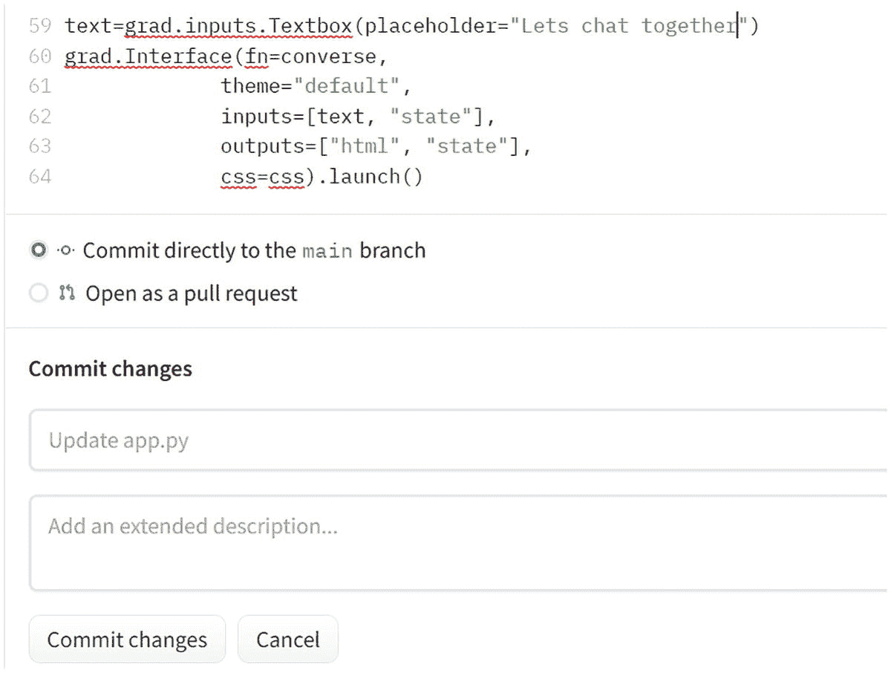

提交 `app.py` 文件更改的界面。顶部有代码，以及两个单选按钮，用于直接提交到主分支或作为拉取请求打开。它有两个字段用于提交更改。

**图 5-4** 提交 `app.py` 文件

这将触发构建和部署过程，可以点击如图 5-5 所示的 `See logs` 按钮来查看活动。

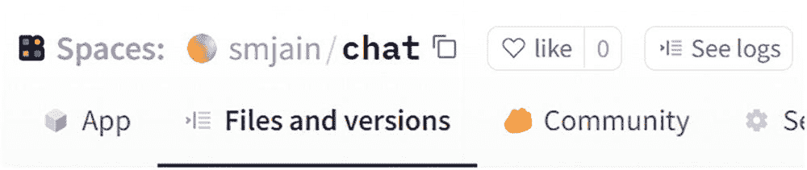

Hugging Face 网页上菜单的截图。它包含 Space 规格，如所有者名称、点赞数和查看日志。从左到右有应用程序、文件和版本以及社区等选项。

**图 5-5** 显示包括“查看日志”按钮在内的各种选项卡

初始阶段将是构建阶段，如图 5-6 所示。

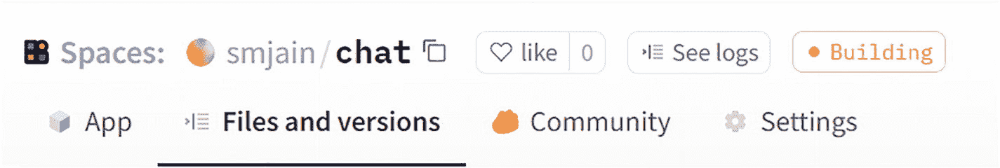

Hugging Face 网页上菜单的截图。它包含 Space 选项，如所有者名称、点赞数、查看日志和构建中，底部栏中有应用程序、文件和版本、社区和设置。

**图 5-6** 应用程序的部署状态

点击 `See logs`，我们可以看到如图 5-7 所示的活动。

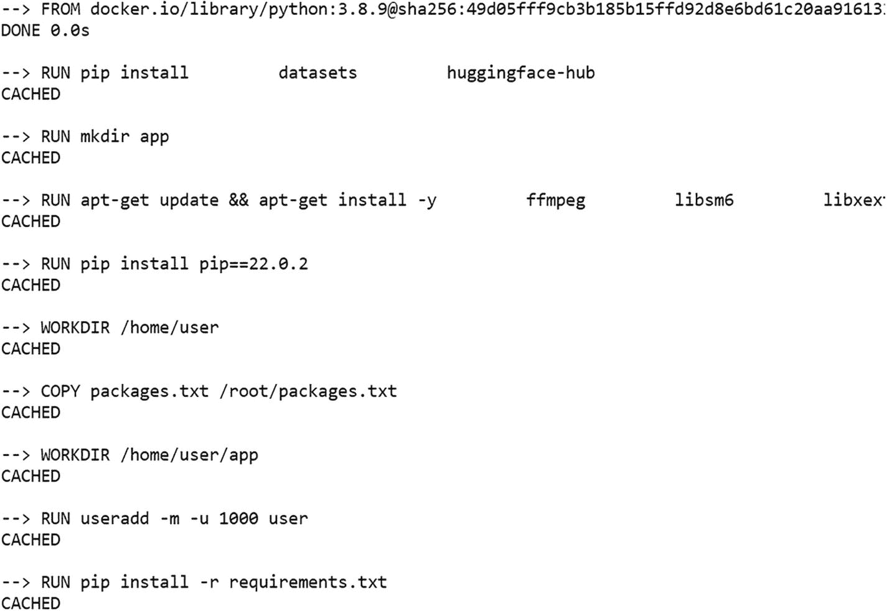

应用程序构建进度的算法。正在从 Docker 库加载镜像。主要命令是运行 `pip install`、`mkdir app`、`apt-get update` 和复制包。

**图 5-7** 显示应用程序的构建进度。这里，它正在加载用于创建容器的 Docker 镜像

可以看到 Docker 镜像正在构建中，然后它将被部署。如果一切运行成功，我们将在 UI 上看到一个绿色的阶段，状态为 `Running`，如图 5-8 所示。


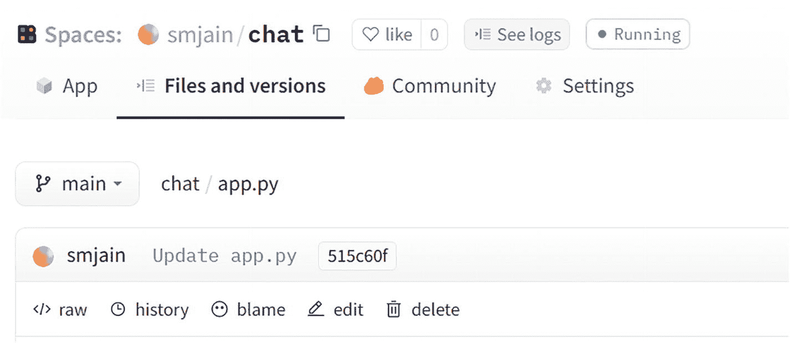

Hugging Face 网页菜单的截图。它包含空间选项，如所有者名称、点赞数和运行状态，底部栏则有应用、文件和版本、社区以及设置。

**图 5-8** 应用状态已变更为“运行中”

完成后，点击 `App` 选项卡（位于 `Files and versions` 选项卡左侧）。这将呈现用于输入信息的用户界面。提供输入后，请点击 `Submit` 按钮，如图 5-9 所示。

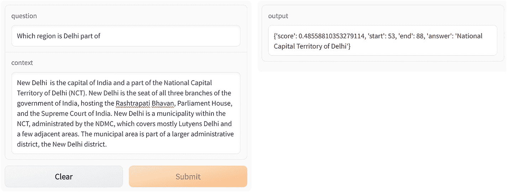

一个包含问题和上下文输入框的 UI 对话框。对话框底部有“清除”和“提交”两个按钮。另一个对话框包含一个输出框。

**图 5-9** 通过 Gradio 实现的问答界面。在标记为 `context` 的输入框中提供你选择的段落，并将该段落的问题填入标记为 `question` 的输入框中

在代码清单 5-2 中，我们将尝试在另一个模型上使用相同的段落和问题。我们将使用的模型是 `distilbert-base-cased-distilled-squad`：

**requirements.txt**

```
gradio
transformers
torch
```

```
from transformers import AutoModelForQuestionAnswering, AutoTokenizer, pipeline
import gradio as grad
import ast
mdl_name = "distilbert-base-cased-distilled-squad"
my_pipeline = pipeline('question-answering', model=mdl_name, tokenizer=mdl_name)
def answer_question(question,context):
text= "{"+"'question': '"+question+"','context': '"+context+"'}"
di=ast.literal_eval(text)
response = my_pipeline(di)
return response
grad.Interface(answer_question, inputs=["text","text"], outputs="text").launch()
```

**代码清单 5-2** `app.py` 的代码

提交更改并等待部署状态变为绿色。之后，点击菜单中的 `App` 选项卡启动应用程序。

向 UI 提供输入并点击 `Submit` 按钮查看结果，如图 5-10 所示。

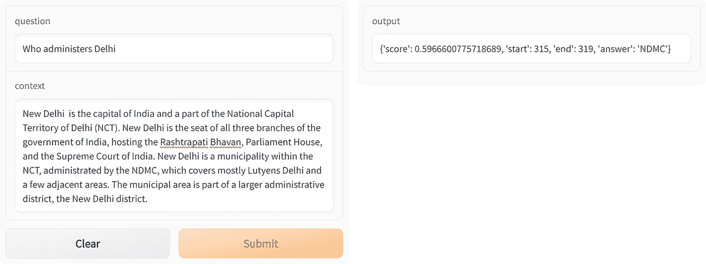

一个基于 Gradio 的 UI 对话框，包含问题和上下文输入框。对话框底部有“清除”和“提交”两个按钮。另一个对话框包含一个输出框。

**图 5-10** 展示了基于 BERT 的问答系统的 Gradio UI

## 翻译

我们要处理的下一个任务是语言翻译。其核心理念是接收一种语言的输入，并根据通过 Hugging Face 库加载的预训练模型将其翻译成另一种语言。

我们在这里探索的第一个模型是 `Helsinki-NLP/opus-mt-en-de` 模型，它接收英文输入并将其翻译成德文。

**代码**

**app.py**

```
from transformers import pipeline
import gradio as grad
mdl_name = "Helsinki-NLP/opus-mt-en-de"
opus_translator = pipeline("translation", model=mdl_name)
def translate(text):
response = opus_translator(text)
return response
grad.Interface(translate, inputs=["text",], outputs="text").launch()
```

**代码清单 5-3** `app.py` 的代码

**requirements.txt**

```
gradio
transformers
torch
transformers[sentencepiece]
```

**输出**

提交更改并等待部署状态变为绿色。之后，点击菜单中的 `App` 选项卡启动应用程序。

向 UI 提供输入并点击 `Submit` 按钮查看结果，如图 5-11 所示。

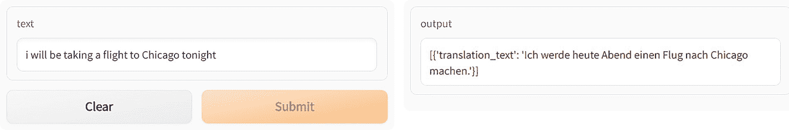

一个 Gradio UI 对话框。它有一个文本输入框，底部有“清除”和“提交”两个按钮。另一个对话框显示输出。

**图 5-11** 翻译任务的 Gradio UI

现在，我们将在代码清单 5-4 中看看是否可以在不使用 pipeline 抽象的情况下编写相同的代码。如果我们还记得，我们之前使用过 `Auto` 类（如 `AutoTokenizer` 和 `AutoModel`）做过同样的事情。让我们开始吧。

**代码**

**app.py**

```
from transformers import AutoModelForSeq2SeqLM,AutoTokenizer
import gradio as grad
mdl_name = "Helsinki-NLP/opus-mt-en-de"
mdl = AutoModelForSeq2SeqLM.from_pretrained(mdl_name)
my_tkn = AutoTokenizer.from_pretrained(mdl_name)
#opus_translator = pipeline("translation", model=mdl_name)
def translate(text):
inputs = my_tkn(text, return_tensors="pt")
trans_output = mdl.generate(**inputs)
response = my_tkn.decode(trans_output[0], skip_special_tokens=True)
#response = opus_translator(text)
return response
grad.Interface(translate, inputs=["text",], outputs="text").launch()
```

**代码清单 5-4** `app.py` 的代码

**requirements.txt**

```
gradio
transformers
torch
transformers[sentencepiece]
```

提交更改并等待部署状态变为绿色。之后，点击菜单中的 `App` 选项卡启动应用程序。

向 UI 提供输入并点击 `Submit` 按钮查看结果，如图 5-12 所示。

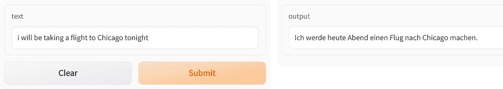

一个翻译 Gradio UI 对话框。它有一个文本输入框，底部有“清除”和“提交”两个按钮。另一个对话框显示输出。

**图 5-12** 基于 Gradio 的翻译 UI

为了让你感到欣喜，当我们尝试通过谷歌翻译进行相同的翻译时，我们得到的结果如图 5-13 所示。

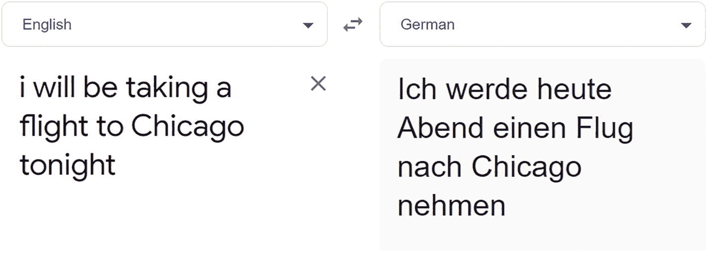

谷歌翻译的截图。包含英文和转换后的德文文本两个字段。英文和德文之间有一个转换符号。

**图 5-13** 展示了谷歌翻译如何翻译我们翻译应用所使用的相同文本

我们可以看到我们的结果与谷歌的结果有多么接近。这就是 Hugging Face 模型的力量。

为了巩固概念，我们将用另一种语言翻译重复这个练习。这次我们以英译法为例。

这次我们使用 `Helsinki-NLP/opus-mt-en-fr` 模型，并尝试翻译前一个例子中的相同句子，但这次翻译成法语。

首先，我们使用 pipeline 抽象编写代码。

**代码**

**app.py**


```python
from transformers import pipeline
import gradio as grad
mdl_name = "Helsinki-NLP/opus-mt-en-fr"
opus_translator = pipeline("translation", model=mdl_name)
def translate(text):
response = opus_translator(text)
return response
txt=grad.Textbox(lines=1, label="English", placeholder="English Text here")
out=grad.Textbox(lines=1, label="French")
grad.Interface(translate, inputs=txt, outputs=out).launch()
```

*清单 5-5*  
*`app.py` 的代码*

**`requirements.txt`**

```
gradio
transformers
torch
transformers[sentencepiece]
```

提交更改，等待部署状态变为绿色。之后，点击菜单中的 **App** 选项卡启动应用程序。

向用户界面提供输入，然后点击 **Submit** 按钮查看结果，如图 5-14 所示。

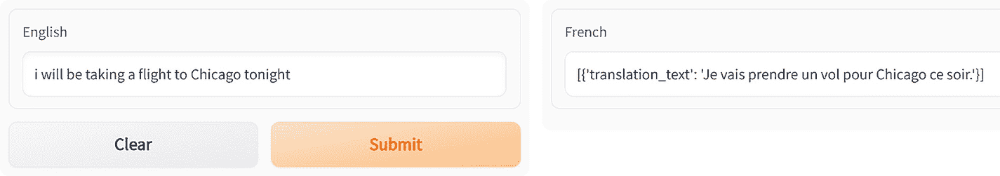

*图 5-14*  
*使用 Gradio 的翻译用户界面*

我们得到以下输出。

接下来，我们在清单 5-6 中尝试不使用 pipeline API 的相同操作。

**代码**  
**`app.py`**

```python
from transformers import AutoModel,AutoTokenizer,AutoModelForSeq2SeqLM
import gradio as grad
mdl_name = "Helsinki-NLP/opus-mt-en-fr"
mdl = AutoModelForSeq2SeqLM.from_pretrained(mdl_name)
my_tkn = AutoTokenizer.from_pretrained(mdl_name)
#opus_translator = pipeline("translation", model=mdl_name)
def translate(text):
inputs = my_tkn(text, return_tensors="pt")
trans_output = mdl.generate(**inputs)
response = my_tkn.decode(trans_output[0], skip_special_tokens=True)
#response = opus_translator(text)
return response
txt=grad.Textbox(lines=1, label="English", placeholder="English Text here")
out=grad.Textbox(lines=1, label="French")
grad.Interface(translate, inputs=txt, outputs=out).launch()
```

*清单 5-6*  
*`app.py` 的代码*

**`requirements.txt`**

```
gradio
transformers
torch
transformers[sentencepiece]
```

提交更改，等待部署状态变为绿色。之后，点击菜单中的 **App** 选项卡启动应用程序。

向用户界面提供输入，然后点击 **Submit** 按钮查看结果，如图 5-15 所示。

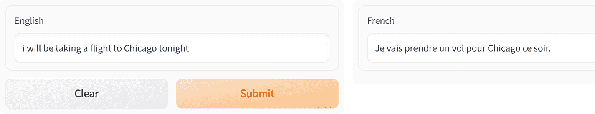

*图 5-15*  
*未直接使用 pipeline API 的 Gradio 翻译任务用户界面*

再次将结果与谷歌翻译的结果进行比较，如图 5-16 所示。

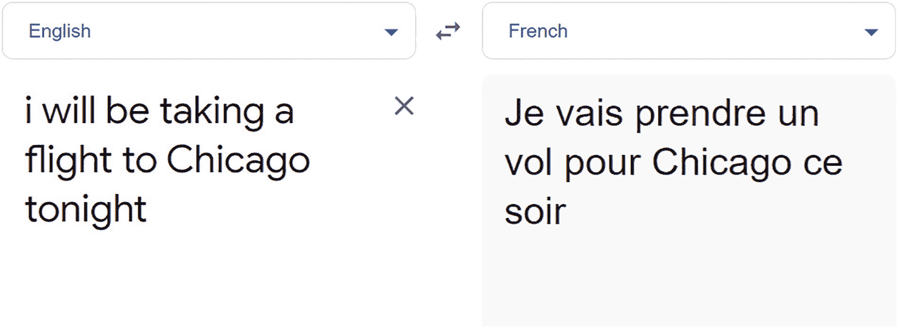

*图 5-16*  
*针对我们 Gradio 应用所使用的相同文本的谷歌翻译*

正如我们所见，结果完全匹配。这值得欢呼。

### 摘要

如果我们面对冗长的文档需要阅读，我们的自然倾向是根本不读，或者只浏览最重要的要点。因此，拥有一个信息摘要来节省时间和脑力处理能力将非常有帮助。

然而，在过去，自动总结文本是一项不可能完成的任务。更具体地说，生成抽象式摘要是一项非常困难的任务。抽象式摘要比抽取式摘要更难，后者是从文档中提取关键句子并将它们组合成一个“摘要”。由于抽象式摘要涉及改写词语，因此也更耗时；然而，它有潜力生成更精炼和连贯的摘要。

我们将首先查看 `google/pegasus-xsum` 模型来生成一些文本的摘要。

以下是代码。

**`app.py`**

```python
from transformers import PegasusForConditionalGeneration, PegasusTokenizer
import gradio as grad
mdl_name = "google/pegasus-xsum"
pegasus_tkn = PegasusTokenizer.from_pretrained(mdl_name)
mdl = PegasusForConditionalGeneration.from_pretrained(mdl_name)
def summarize(text):
tokens = pegasus_tkn(text, truncation=True, padding="longest", return_tensors="pt")
txt_summary = mdl.generate(**tokens)
response = pegasus_tkn.batch_decode(txt_summary, skip_special_tokens=True)
return response
txt=grad.Textbox(lines=10, label="English", placeholder="English Text here")
out=grad.Textbox(lines=10, label="Summary")
grad.Interface(summarize, inputs=txt, outputs=out).launch()
```

*清单 5-7*  
*`app.py` 的代码*

**`requirements.txt`**

```
gradio
transformers
torch
transformers[sentencepiece]
```

提交更改，等待部署状态变为绿色。之后，点击菜单中的 **App** 选项卡启动应用程序。

向用户界面提供输入，然后点击 **Submit** 按钮查看结果，如图 5-17 所示。

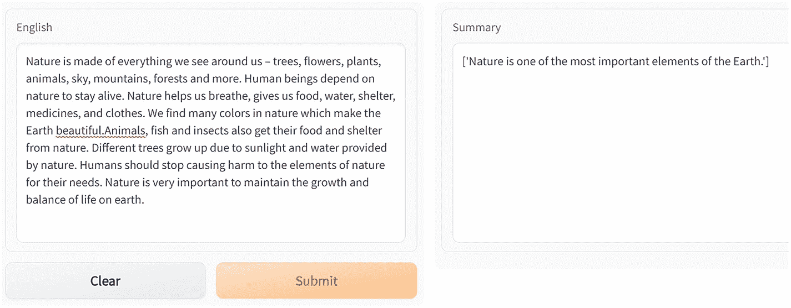

*图 5-17*  
*使用 Gradio 的摘要应用。在标记为“English”的框中粘贴一段文字，提交后，标记为“Summary”的框将显示该段文字的摘要*

接下来，我们使用另一段文本，并通过一些参数对模型进行微调。

```python
from transformers import PegasusForConditionalGeneration, PegasusTokenizer
import gradio as grad
mdl_name = "google/pegasus-xsum"
pegasus_tkn = PegasusTokenizer.from_pretrained(mdl_name)
mdl = PegasusForConditionalGeneration.from_pretrained(mdl_name)
def summarize(text):
tokens = pegasus_tkn(text, truncation=True, padding="longest", return_tensors="pt")
translated_txt = mdl.generate(**tokens,num_return_sequences=5,max_length=200,temperature=1.5,num_beams=10)
response = pegasus_tkn.batch_decode(translated_txt, skip_special_tokens=True)
return response
txt=grad.Textbox(lines=10, label="English", placeholder="English Text here")
out=grad.Textbox(lines=10, label="Summary")
grad.Interface(summarize, inputs=txt, outputs=out).launch()
```

*清单 5-8*  
*`app.py` 的代码*

提交更改，等待部署状态变为绿色。之后，点击菜单中的 **App** 选项卡启动应用程序。

向用户界面提供输入，然后点击 **Submit** 按钮查看结果，如图 5-18 所示。

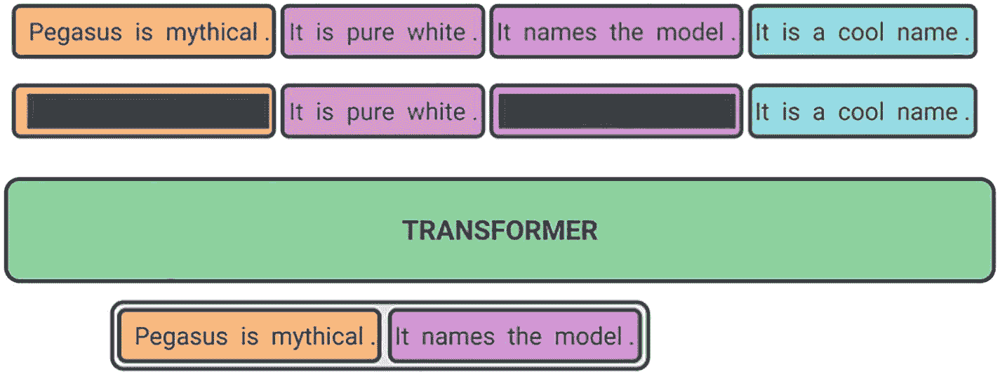

*图 5-19*  
*用于文本摘要的 Google Pegasus 模型*  
*图片来源：* [`https://1.bp.blogspot.com/-TSor4o51jGI/Xt50lkj6blI/AAAAAAAAGDs/`](https://1.bp.blogspot.com/-TSor4o51jGI/Xt50lkj6blI/AAAAAAAAGDs/)

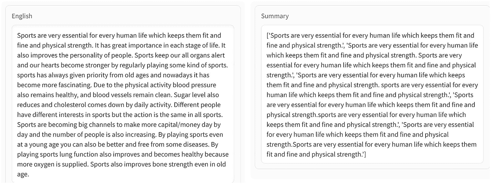


