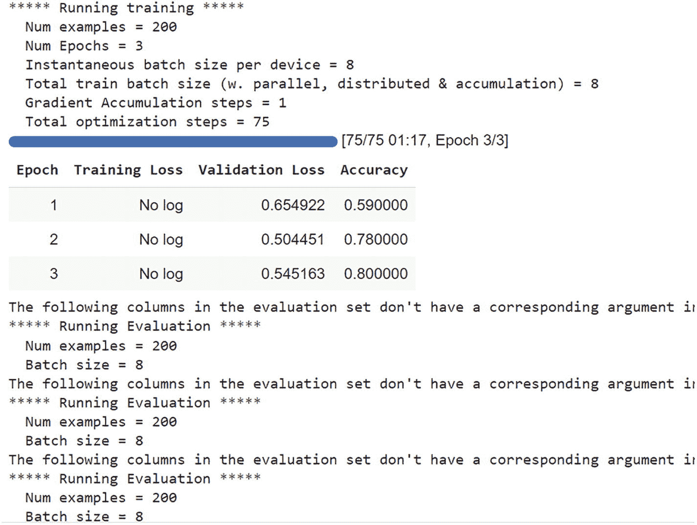
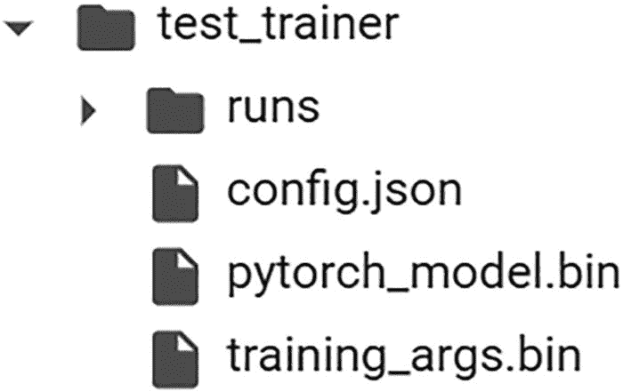
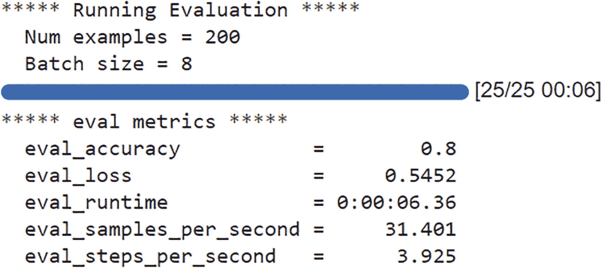

# 6. 微调预训练模型

到目前为止，我们已经了解了如何使用包含预训练模型的 Hugging Face API 来创建简单的应用程序。如果你能从头开始，仅使用自己的数据来训练模型，那岂不是妙不可言？

如果你没有大量的空闲时间或充足的计算资源，利用迁移学习是最有效的策略。与从头开始训练模型相比，使用 Hugging Face 进行迁移学习有两个主要优势。

正如我们在第 4 章中所述，像 GPT3 这样的模型需要巨大的基础设施资源才能进行训练。这超出了我们大多数人的能力范围。那么，我们如何才能以更灵活的方式使用这些模型，而不仅仅是下载预训练模型来使用呢？答案在于使用我们拥有的额外数据来微调这些模型。与从头开始训练一个完整的大型语言模型相比，这所需的资源非常少，并且更容易实现。

将一个基础模型转变为能够生成可靠结果的模型，需要投入大量的时间和资源。由于迁移学习的存在，你可以省去繁琐的训练步骤，只需花费少量时间将数据集调整到满足你的特定需求。

事实上，来自 Hugging Face 的预训练模型即使无需额外的微调，也能在各种领域的任务中表现出色。人们甚至可能可以在零样本学习场景中使用这些模型，但如果你有特定的数据集，那么我们的好朋友——Hugging Face API——为我们提供了微调这些现有模型所需的抽象接口。

因此，在训练方面，我们基本上可以将迁移学习视为一种捷径。只需利用预训练语言模型，你就可以在计算需求方面节省数万美元和数千小时。除非你正在处理的任务极其特殊，无法使用现有模型解决，否则你应该坚持使用迁移学习。

既然我们对迁移学习的应用和优势有了更好的理解，现在可以继续学习我们的 Hugging Face 微调指南了。

微调的工作流程如下所示：

-   从 Hugging Face 中选择一个适合你用例需求的预训练模型。
-   额外的自定义数据集必须符合 Hugging Face 的数据集规范，因此我们需要预处理数据，使其符合所需的格式。
-   将数据集上传到 Colab、S3 或任何其他存储位置。
-   使用 Hugging Face 的 `Trainer` API 来微调现有模型。
-   将模型保存到本地或上传到 Hugging Face 仓库。

有了基本概念后，让我们开始使用 Hugging Face 库进行一些迁移学习。

在微调阶段，大部分神经架构是被冻结的。这意味着我们只调整输出层的权重。由于我们已经在前面章节中介绍了分词器，这里将简要概述 Hugging Face 的数据集，这是本章最重要的概念。一旦我们理解了 `Datasets` API，我们将继续通过迁移学习，为预训练模型使用自定义数据集。

## 数据集

在本节中，我们将描述 Hugging Face 的基本数据集结构及其一些基本功能。

在任何机器学习项目中，你所使用的数据都将至关重要。真正的准确性不仅来源于所用数据的数量，也来源于其质量，无论你使用的是何种算法或模型，这一点都成立。

访问大型数据集有时可能是一项具有挑战性的工作。以适当的方式抓取、积累然后清理这些数据可能需要花费大量时间。幸运的是，对于对 NLP 以及图像和音频处理感兴趣的人来说，Hugging Face 附带了一个已准备好使用的中心化数据集仓库。在接下来的段落中，我们将简要了解如何使用这个数据集模块来为你的项目选择和准备合适的数据集。

要安装数据集库，请使用以下命令：

```
!pip install datasets
```

在我们阅读数据集仓库的文档时，我们发现了几种主要方法。第一种方法是我们可以用来研究可用数据集列表的方法。你应该会看到有近 6800 个不同的数据集可供使用，所有这些数据集目前都是可用的：

```
from datasets import list_datasets, load_dataset, list_metrics, load_metric
# 打印所有可用的数据集
print(len(list_datasets()))
```

输出：

```

```

加载一个数据集：

```
dataset = load_dataset('imdb')
```

打印数据集对象：

```
DatasetDict({ train: Dataset({ features: ['text', 'label'], num_rows: 25000 }) test: Dataset({ features: ['text', 'label'], num_rows: 25000 }) unsupervised: Dataset({ features: ['text', 'label'], num_rows: 50000 }) })
```

它构成了一个包含训练集、测试集和无监督数据集的字典，每个数据集都有特征和 `num_rows` 作为值。这里，示例取自 IMDB 数据集，因此我们将要进行情感分析的文本也取自 IMDB。

让我们访问训练数据集：

```
dataset['train'][2]
{'label': 0, 'text': "If only to avoid making this type of film in the future. This film is interesting as an experiment but tells no cogent story.One might feel virtuous for sitting thru it because it touches on so many IMPORTANT issues but it does so without any discernable motive. The viewer comes away with no new perspectives (unless one comes up with one while one's mind wanders, as it will invariably do during this pointless film).One might better spend one's time staring out a window at a tree growing."}
```

描述数据集：

```
dataset['train'].description
```

我们得到以下输出：

```
Large Movie Review Dataset.\nThis is a dataset for binary sentiment classification containing substantially more data than previous benchmark datasets. We provide a set of 25,000 highly polar movie reviews for training, and 25,000 for testing. There is additional unlabeled data for use as well.
```

列出数据集的特征：

```
dataset['train'].features
```

我们可以看到有两个特征：

```
{'label': ClassLabel(num_classes=2, names=['neg', 'pos'], id=None), 'text': Value(dtype='string', id=None)}
```

在某些情况下，你可能不想使用 Hugging Face 的数据集。这个数据集对象仍然能够加载本地存储的 CSV 文件以及其他类型的文件。例如，如果你想处理一个 CSV 文件，你可以轻松地将此信息连同本地机器上 CSV 文件的路径一起传递给 `load_dataset` 方法。

## 微调预训练模型

现在我们已经理解了数据集结构，是时候使用我们自己的数据集对预训练模型应用一些迁移学习了。下面我们展示一个如何使用 IMDB 数据集微调预训练模型的示例。

我们将微调部分分为两部分。训练部分是我们将使用 Hugging Face 的 `Trainer` API 来微调模型并保存它。另一部分是推理部分，我们将加载这个微调后的模型来实现推理。


### 微调训练

首先，使用以下命令安装 `transformers` 和 `datasets`：

```
!pip install datasets transformers
```

接下来，加载 IMDB 数据集：

```
from datasets import load_dataset
dataset = load_dataset("imdb")
dataset["train"][100]
```

以下是一条示例评论：

```
{'label': 0, 'text': "Terrible movie. Nuff Said.These Lines are Just Filler. The movie was bad. Why I have to expand on that I don't know. This is already a waste of my time. I just wanted to warn others. Avoid this movie. The acting sucks and the writing is just moronic. Bad in every way. Even that was ruined though by a terrible and unneeded rape scene. The movie is a poorly contrived and totally unbelievable piece of garbage.OK now I am just going to rag on IMDb for this stupid rule of 10 lines of text minimum. First I waste my time watching this offal. Then feeling compelled to warn others I create an account with IMDb only to discover that I have to write a friggen essay on the film just to express how bad I think it is. Totally unnecessary."}
```

接下来，我们需要使用 BERT 分词器对我们加载的数据集进行分词。第一步是在 Google Colab 中创建一个新的 Jupyter notebook，并逐行复制以下代码：

```
from transformers import AutoTokenizer
brt_tkn = AutoTokenizer.from_pretrained("bert-base-cased")
def generate_tokens_for_imdb(examples):
return brt_tkn(examples["text"], padding="max_length", truncation=True)
tkn_datasets = dataset.map(generate_tokens_for_imdb, batched=True)
```

上述代码会产生以下输出：

```
loading configuration file https://huggingface.co/bert-base-cased/resolve/main/config.json from cache at /root/.cache/huggingface/transformers/a803e0468a8fe090683bdc453f4fac622804f49de86d7cecaee92365d4a0f829.a64a22196690e0e82ead56f388a3ef3a50de93335926ccfa20610217db589307
Model config BertConfig {
"_name_or_path": "bert-base-cased",
"architectures": [
"BertForMaskedLM"
],
"attention_probs_dropout_prob": 0.1,
"classifier_dropout": null,
"gradient_checkpointing": false,
"hidden_act": "gelu",
"hidden_dropout_prob": 0.1,
"hidden_size": 768,
"initializer_range": 0.02,
"intermediate_size": 3072,
"layer_norm_eps": 1e-12,
"max_position_embeddings": 512,
"model_type": "bert",
"num_attention_heads": 12,
"num_hidden_layers": 12,
"pad_token_id": 0,
"position_embedding_type": "absolute",
"transformers_version": "4.20.1",
"type_vocab_size": 2,
"use_cache": true,
"vocab_size": 28996
}
loading file https://huggingface.co/bert-base-cased/resolve/main/vocab.txt from cache at /root/.cache/huggingface/transformers/6508e60ab3c1200bffa26c95f4b58ac6b6d95fba4db1f195f632fa3cd7bc64cc.437aa611e89f6fc6675a049d2b5545390adbc617e7d655286421c191d2be2791
loading file https://huggingface.co/bert-base-cased/resolve/main/tokenizer.json from cache at /root/.cache/huggingface/transformers/226a307193a9f4344264cdc76a12988448a25345ba172f2c7421f3b6810fddad.3dab63143af66769bbb35e3811f75f7e16b2320e12b7935e216bd6159ce6d9a6
loading file https://huggingface.co/bert-base-cased/resolve/main/added_tokens.json from cache at None
loading file https://huggingface.co/bert-base-cased/resolve/main/special_tokens_map.json from cache at None
loading file https://huggingface.co/bert-base-cased/resolve/main/tokenizer_config.json from cache at /root/.cache/huggingface/transformers/ec84e86ee39bfe112543192cf981deebf7e6cbe8c91b8f7f8f63c9be44366158.ec5c189f89475aac7d8cbd243960a0655cfadc3d0474da8ff2ed0bf1699c2a5f
loading configuration file https://huggingface.co/bert-base-cased/resolve/main/config.json from cache at /root/.cache/huggingface/transformers/a803e0468a8fe090683bdc453f4fac622804f49de86d7cecaee92365d4a0f829.a64a22196690e0e82ead56f388a3ef3a50de93335926ccfa20610217db589307
Model config BertConfig {
"_name_or_path": "bert-base-cased",
"architectures": [
"BertForMaskedLM"
],
"attention_probs_dropout_prob": 0.1,
"classifier_dropout": null,
"gradient_checkpointing": false,
"hidden_act": "gelu",
"hidden_dropout_prob": 0.1,
"hidden_size": 768,
"initializer_range": 0.02,
"intermediate_size": 3072,
"layer_norm_eps": 1e-12,
"max_position_embeddings": 512,
"model_type": "bert",
"num_attention_heads": 12,
"num_hidden_layers": 12,
"pad_token_id": 0,
"position_embedding_type": "absolute",
"transformers_version": "4.20.1",
"type_vocab_size": 2,
"use_cache": true,
"vocab_size": 28996
}
```

一旦我们对数据集进行了分词，为了简化操作，我们将仅对 200 个样本进行微调，以便更快地调整模型。我们鼓励你尝试使用更多样本：

```
training_dataset = tokenized_datasets["train"].shuffle(seed=42).select(range(200))
evaluation_dataset = tokenized_datasets["test"].shuffle(seed=42).select(range(200))
```

加载基于 BERT 的序列分类模型：

```
from transformers import AutoModelForSequenceClassification
mdl = AutoModelForSequenceClassification.from_pretrained("bert-base-cased", num_labels=2)
```

Transformers 库包含一个专门用于训练 huggingface transformer 模型的 `Trainer` 类。这个类使得开始训练变得更加简单，无需手动编写自己的代码。`Trainer` API 提供了日志记录、监控等功能。

在这里，我们通过实例化一个名为 `TrainingArguments` 的类来提供训练参数，该类包含了所有可以尝试的超参数。在本例中，我们将只使用默认值：

```
from transformers import TrainingArguments
training_args = TrainingArguments(output_dir="imdb")
```

在训练过程中，`Trainer` 不会自动评估模型的表现。如果你希望 `Trainer` 能够计算并报告指标，你需要向其传递一个函数。这就是我们在以下代码段中要做的事情：

```
import numpy as np
from datasets import load_metric
mdl_metrics = load_metric("accuracy")
def calculate_metrics(eval_pred):
logits, labels = eval_pred
predictions = np.argmax(logits, axis=-1)
return mdl_metrics.compute(predictions=predictions, references=labels)
from transformers import TrainingArguments, Trainer
trng_args = TrainingArguments(output_dir="test_trainer", evaluation_strategy="epoch", num_train_epochs=3)
```

实例化一个 `Trainer` 对象，其中包含你的模型、训练参数、用于训练和测试的数据集以及评估函数：

```
Mdl_trainer = Trainer(
model=model,
args=trng_args,
train_dataset=training_dataset,
eval_dataset=evaluation_dataset,
compute_metrics=calculate_metrics,
)
```

训练模型：

```
trainer.train()
```

图 6-1 展示了我们用于微调现有预训练模型的 IMDB 数据集的训练过程。



一个展示数据集仓库文档及主要方法的示意图，包括组件输出、加载数据集和打印数据集对象。

**图 6-1** 用于微调的 IMDB 数据集训练过程

保存微调后的训练模型：

```
trainer.save_model()
```



一个展示训练器保存模型（文件名为 test trainer）的示意图。

**图 6-2** 在本地保存模型（我们有一个基于 PyTorch 的模型，扩展名为 `.bin`）

我们可以看到微调后的模型以 `pytorch_model.bin` 的名称保存。

我们可以使用以下代码检查模型的准确率：

```
metrics = mdl_trainer.evaluate(evaluation_dataset)
trainer.log_metrics("eval", metrics)
trainer.save_metrics("eval", metrics)
```



一个展示运行评估的示意图，包含样本数量、批次大小以及评估指标，如评估准确率、损失、运行时间、每秒样本数和每秒步数。

**图 6-3** 微调模型在准确率方面的评估


### 推理

在微调模型并保存后，接下来要对训练数据集之外的数据进行推理。

我们将从指定路径加载微调后的模型，并用它进行分类，本例中是对 IMDB 电影评论进行情感分类：

```
from transformers import BertTokenizer
```

从以下路径加载微调后的模型：

```
PATH = 'test_trainer/'
md = AutoModelForSequenceClassification.from_pretrained(PATH, local_files_only=True)
def make_classification(text):
# 分词
inps = brt_tkn(text, padding=True, truncation=True, max_length=512, return_tensors="pt").to("cuda")
# 获取输出
outputs = model(**inps)
# 使用 softmax 生成概率
probablities = outputs[0].softmax(1)
# 获取最佳匹配结果
return probablities .argmax()
```

以下是第一次推理：

```
text = """
这是一部让你观看时脸上洋溢笑容的剧集。你会爱上剧中的每一个角色。最后，我觉得八集根本不够看。期待第二季。
"""
print(make_classification(text))
```

输出结果如下：

```
tensor(1, device='cuda:0')
输出为 1 表示正面评价
```

以下是第二次推理：

```
text = """
观看过程挺有趣，但并没有给我留下太深印象，我觉得浪费了钱，爆米花、披萨、汉堡都白买了。
阿克谢应该只拍喜剧片，这种国王类型的电影只适合有王者气质的演员，完全是浪费。
"""
print(make_classification(text))
```

输出结果如下：

```
tensor(0, device='cuda:0')
输出为 0 表示负面评价
```

## 总结

在本章中，我们学习了 Hugging Face 数据集及其不同功能。我们还学习了如何使用 Hugging Face API，用其他数据集对现有的预训练模型进行微调。

索引 A 应用程序编程接口（API） 通用人工智能（AGI） 人工智能（AI） 注意力机制 “注意力就是一切” 注意力机制 `AutoModel` 概率 文本分类 `Transformers` 库 包装类 `AutoTokenizer` B 反向传播（BP） 词袋模型 `BERT-Base` `BERT-based` 问答 `BERT-based` 分词器 `BERT-Large` 来自 Transformer 的双向编码器表示（BERT） 应用 双向训练 `BERT-Base` `BERT-Large` Hugging Face 推理 下一句预测（NSP） 输入表示 `LSTM`类型架构 掩码语言模型（MLM） 性能 预训练模型 情感分析 推文 训练语言模型 过程 迁移学习 Transformer 架构 用例 C 聊天机器人/对话机器人 `CLS`和`SEP` 代码注释生成器 `CodeGen` `CodeT5`模型 注释模型 目录 编码器-解码器 Transformer 模型 Google 搜索 API Java 代码 非 Hugging Face 仓库 预训练模型 顺序方式 `T5`编码器-解码器范式 大规模清洗过的通用爬虫（C4） 通用爬虫 CSV 文件 D 解码器 `distilbert-base-cased-distilled-squad` `distilgpt2` Docker 镜像 E 编码器 前馈网络 输入嵌入 层归一化 多头注意力系统 残差连接 指数函数 F `FeatureExtractor` 前馈网络 微调 数据集 评估 Hugging Face IMDB 数据集 推理 神经架构 `Trainer` API 训练工作流 更平坦的分布 G 通用语言理解评估（GLUE） Google Colab Google Pegasus 模型 `google/pegasus-xsum`模型 Google 的 BERT Google 的 T5 模型 Google 翻译 `GPT3`模型 GPU 集群 `Gradio` 代码生成 应用文件 Hugging Face Hugging Face 基础设施 SDK 摘要生成应用 文本生成 翻译 UI Web 框架 H 更硬的分布 `Helsinki-NLP/opus-mt-en-de`模型 `Helsinki-NLP/opus-mt-en-fr`模型 Hugging Face `AutoModel` 参见 AutoModel 生态系统 特性 `GPT3`模型 NLP 开源软件与数据管道 仓库 分词器 参见 Tokenizer `Transformers`库 Hugging Face API Hugging Face 数据集 Hugging Face 基础设施 Hugging Face Spaces Hugging Face 任务 代码注释生成器 代码生成 对话系统 语言翻译 问答 SQuAD 数据集 文本生成模型 文本到文本生成 参见 T5 模型 零样本学习 Hugging Face UI 超参数 I, J, K 图像到标题映射 输入文档 输入嵌入 L 语言模型 优势 发展 基于神经网络的词序列 大型语言模型（LLM） 层归一化 长短期记忆网络（LSTM） M 机器学习 机器翻译（MT） 马尔可夫链 掩码语言建模（MLM） 掩码 Microsoft DialoGPT 模型 多头注意力系统 多头自注意力（MSA） 多层感知机（MLP） N 自然语言（NL） 生成 理解 自然语言处理（NLP） 人工智能 历史 大型语言模型 基于神经网络的语言模型 神经网络 下一句预测（NSP） BERT 推理 n-gram `Num_return_sequences` O 独热编码 OpenAI Codex 模型 OpenAI 的 GPT 模型 P, Q 填充 词性标注（POS） Pegasus 系统 `Pipeline` API 管道 位置嵌入 位置编码 预训练模型 微调 参见微调 Hugging Face Hugging Face API 迁移学习 零样本学习 编程语言（PL） R 循环神经网络（RNN） 设计 与前馈网络对比 门控循环单元（GRU） 信息 长短期记忆网络（LSTM） 1980 年代 序列数据 残差连接 `RoBERTa`基础模型 S 采样 自信 自注意力 自注意力机制 句子改写任务 情感分析任务 情感分类 序列到序列（Seq2Seq）神经网络 解码器 编码器 编码器-解码器 用法 函数 LSTM 序列对象 序列数据 对抗生成情境（SWAG） 更软的分布 跨度 斯坦福问答数据集（SQuAD） T, U `T5`语言模型 `T5`模型 `app.py`代码 英译德 生成问题 Google 研究 句子改写 情感分析 文本摘要 基于 Transformer 的架构 `T5`模型为基础的翻译 温度 温度函数 张量 文本分类 文本生成 深度学习 `GPT2`模型 LSTM 架构 马尔可夫链 参数 `num_beams` 重复 循环神经网络（RNN） 采样 直接方法 UI 文本挖掘 文本处理 文本到文本模型 分词 `Tokenizer` `AutoTokenizer`类 基于`BERT`的代码 字典 函数 Google Colab `GPT2`模型 库 多重编码 填充 管道组件 专用标记 `Transformers`库 截断 传统 NLP 模型 `Trainer`类 迁移学习 基于 Transformer 的模型 基于 Transformer 的神经网络架构 `Transformers`架构 解码器 输入嵌入与位置编码层 线性分类器与最终 softmax 输出概率 多头注意力 编码器组件 前馈网络 输入嵌入 层归一化 多头注意力系统 残差连接 高层架构 库 序列到序列（Seq2Seq）模型 `Transformer-XL` 三元模型 截断 V 向量化 视觉 Transformer（ViT） 架构 `Gradio` 基于图像的机器学习 图像分类 多层感知机（MLP） 论文 任务 W, X, Y 词分词 Z 零样本分类 零样本学习 分类器 对预训练模型的需求 文本分类 UI
