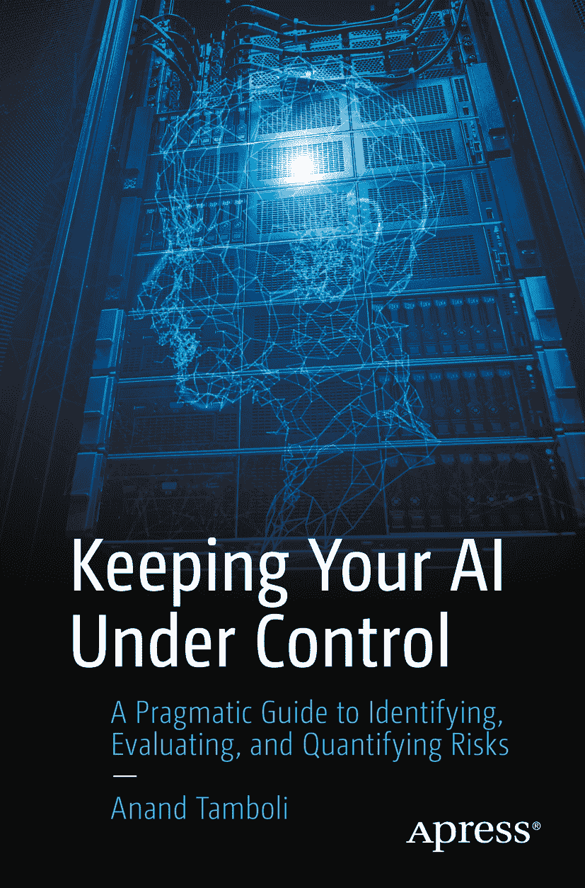

ISBN 978-1-4842-5466-0 e-ISBN 978-1-4842-5467-7 [`doi.org/10.1007/978-1-4842-5467-7`](https://doi.org/10.1007/978-1-4842-5467-7) © Anand Tamboli 2019 本作品受版权保护。出版商保留所有权利，涉及材料的全部或部分，特别是翻译、重印、重用插图、朗诵、广播、以缩微胶片或任何其他物理方式复制，以及传输或信息存储与检索、电子改编、计算机软件，或现在已知或以后开发的类似或不同方法的权利。本书中可能出现商标名称、标识和图像。我们并非在每次出现商标名称、标识或图像时都使用商标符号，而是仅以编辑方式使用这些名称、标识和图像，以利于商标所有者，且无意侵犯商标权。本出版物中使用的商品名称、商标、服务标志和类似术语，即使未标明为商标，也不应被视为对其是否受专有权利保护的表达意见。尽管本书中的建议和信息在出版时被认为是真实准确的，但作者、编辑和出版商均不对可能出现的任何错误或遗漏承担法律责任。出版商对本书所含材料不作任何明示或暗示的保证。本书通过 Springer Science+Business Media New York 在全球图书贸易中发行，地址：233 Spring Street, 6th Floor, New York, NY 10013。电话：1-800-SPRINGER，传真：(201) 348-4505，电子邮件：orders-ny@springer-sbm.com，或访问 www.springeronline.com。Apress Media, LLC 是加利福尼亚州的有限责任公司，其唯一成员（所有者）是 Springer Science + Business Media Finance Inc (SSBM Finance Inc)。SSBM Finance Inc 是特拉华州的一家公司。

*献给所有相信人类比机器更有价值的人！*

对《*掌控你的 AI*》的早期赞誉

“可信 AI 和 AI 中的偏见检测是近期变得至关重要的领域。如今，大多数 AI 用例都需要可解释性作为关键特性。本书为 CIO 提供了极佳的用例，用于评估其 AI 项目及其当前有效性。此外，本书还涵盖了一个重要方面——负责任的 AI，并通过‘牵引系统’加以强调，该体系概述了组织如何对其 AI 项目进行合理性检查。”

> —Shalini Kapoor，IBM 印度公司 Watson IoT 总监兼首席技术官

“在当今云服务和 AUTOML（自动化机器学习）框架的世界中，AI 模型的开发已变得相当有条理（即使不简单），并且由框架驱动。当你拥有解决特定问题的定义步骤或流程时，它便具有内在的自我修正机制。如今，我们从流程和技术角度拥有了 AI 开发和实施的框架，但我们缺乏一个用于设计具有自我修正或反馈机制、能够从错误中学习并对其负责的负责任 AI 模型的框架。本书通过‘牵引系统’填补了这一空白，以无偏见的方式实施 AI，使其从效用角度更具责任感，并使你的模型更加真实（即使不拟人化）。AI 模型没有自己的思想，因此本书将帮助 AI 设计师设计代表负责任人类思维的 AI 解决方案。”

> —Rahul Kharat，Eton Solutions LP 人工智能总监兼负责人

“当我们在 1996 年编写第一个基于专家系统的应用程序时，我完全没想到 AI 会带来如此巨大的变革。《*掌控你的 AI*》不仅阐述了 AI 如何改变世界，更重要的是，它为我们提供了如何按照高道德标准构建 AI 的指南。Anand 擅长将复杂的话题和技术术语转化为简单的语言；因此，本书对程序员和最终用户同样具有吸引力。

本书有助于引发一场集体辩论，探讨人类应如何利用 AI 这样强大的工具来造福全人类。”

> —Amit Danglé，Saviant Consulting 客户成功副总裁

## 引言

未来技术总是带给我们两样东西：承诺和后果。*负责任的 AI*正是关于这些后果的，如果不是，那它本应如此。

关于人工智能未来的耸人听闻的新闻和由此引发的歇斯底里随处可见。媒体的夸张描述使许多人相信他们已经生活在未来。

作为消费者，我们日常生活的许多方面都与人工智能交织在一起。毫无疑问，人工智能是一项强大的技术，而伴随这种力量而来的是责任！

AI 的夸张宣传催生了“*AI 解决方案主义*”的思维模式。以至于许多人认为，只要给他们足够的数据，他们的机器学习算法就能解决人类的所有问题。

几年前，我们已经看到类似思维模式的兴起，即“*有一个应用程序可以解决它*”的思维模式，并且我们知道它在现实生活中并没有带来任何好处。它非但没有支持任何进步，反而危及新兴技术的价值，并设定了不切实际的期望。

AI 解决方案主义还导致了一种不计后果的推动，试图将 AI 用于一切事物。这种推动使许多公司采取“*准备-开火-瞄准*”的方法，这不仅不利于公司的增长，而且在多个层面上对客户构成危险。

更好的方法是考虑适用性和可行性，运用实践智慧，做必要的事情。然而，害怕错过导致了诸多失误，并最终造成了我们可能永远无法偿还的巨额智力债务。

处理这个问题的方法之一是负责任地使用 AI，并始终将其置于你的控制之下。然而，负责任 AI 范式的问题在于，每个人都知道*为什么*它是必要的，但没有人知道*如何*实现它。

本书旨在通过可操作的细节引导你走向负责任的 AI。负责任的 AI 不仅仅是一个花哨的术语或抽象的概念——它意味着要合乎道德、谨慎、可控、小心、合理和负责，即在设计、开发、部署和使用 AI 时负起责任。

在整本书中，你将了解开发和部署 AI 解决方案所涉及的各种风险。一旦你能够识别风险，你将能够评估和量化它们。以结构化的方式做到这一点意味着你的方法在设计和使用 AI 时将更加负责任。

知道我们不知道什么具有显著优势。不幸的是，AI 科技巨头们不断将用户公司推向危险区域，在那里公司不知道他们不知道什么。这种推动是危险的，不仅从风险集中的角度来看，而且为了你自己的业务着想。你必须寻求理解 AI 黑箱内部的东西。

应用结构化方法来评估风险并勤勉地管理它们，可以帮助你了解风险敞口并尽可能减轻风险。本书将使你能够做到这一点，并帮助你保持控制。

任何解决问题的努力都必须涵盖三个关键方面——做正确的事、正确地做事、并覆盖所有基础。本书中解释的方法论将帮助你详细了解这些方面。

我将本书的内容分为三个部分。在第一部分中，我通过评估即将到来的事物来探索 AI 的未来状态。我不仅谈论过去的失败和吸取的教训，还详细阐述了人工智能作为一种技术所带来的风险。

第二部分是关于风险预防。我将带你了解各种风险的评估方法，例如 AI 解决方案风险、部署期间的风险以及人机交互相关的风险。此外，我还讨论了系统性的风险缓解方法。

虽然预防总是比治疗更好的策略，但拥有更好的控制系统和缓解计划可能非常有用。第三部分涵盖了缓解方面。我详细阐述了使用*红队*进行 AI 解决方案压力测试，以及剩余风险管理。

随后，我还讨论了可以覆盖你未知新风险的 AI 保险。在撰写关于 AI 保险的章节时，我非常谨慎，并且在咨询了保险行业专家并审核内容后才进行撰写。

不知道你不知道什么，比任何已知风险都更危险。识别并缓解此类风险可以让你安心。即使出现问题，你也能够处理它们，或者至少你的损失可能得到弥补。

技术不是一切，还需要人员、流程和时机的恰当组合才能达到最佳效果。本书帮助你涵盖所有这些方面。

请记住，如果你了解风险并更好地理解它们，你就可以针对你的特定用例开发负责任的 AI。

我不仅邀请你阅读本书，还邀请你尝试将书中解释的技术和方法应用于你的公司，并向他人传授这些知识——我们需要共同努力，让 AI 再次变得负责任！

## 致谢

有句名言——“*养育一个孩子需要一个村庄的力量*”——写书也是如此。

拥有一个想法并将其变成一本书，和听起来一样困难。这段经历既充满内在挑战，也令人收获颇丰。如果没有我生命中这么多支持我的人，这一切都不可能实现。

我相信支持总是始于我们最核心的圈子，那些与你同呼吸共命运的人。对我来说，我的亲密圈子里有三个点：我的妻子*Jyoti*、我的儿子*Aadi*和女儿*Manasvi*。这三个点非常擅长以最具创意的方式激励和鼓舞我。在撰写本书的整个过程中，他们确保我保持动力、灵感迸发并且吃得饱饱的！

我永远感激*我的父母*，他们是我写作基因的来源，从小培养了我对书籍的热爱，并尽其所能支持我所有的探索，贯穿他们的一生。

我感谢*Gregory Bell*的帮助。Greg 帮助审阅了本书中几个章节的初稿并提供了反馈。我记得与 Greg 的长谈，这些谈话总是有助于澄清我在本书中提出的几个观点。谢谢 Greg！

一次激动人心的 30 天咖啡挑战让我遇到了*Chris Stallard*，他帮助我完成了本书中一个关键的章节。Chris 拥有普通保险背景，并在该领域拥有丰富的经验。他的意见极大地帮助澄清了 AI 保险的概念、确保事实性写作，并使该章节成为可能。谢谢伙计！

与我之前关于物联网的书相比，我写这本书的方法截然不同。它是先构思一个概念，围绕它进行广泛研究，然后在市场上测试我的想法以获取反馈，最后以精炼的形式写下来。这涉及到过去一年中的多次演示和会议。在此过程中，来自*德勤*的*Paulina Kabaczuk*以及来自*悉尼创业咖啡馆*的*Zara Crichton*和*Nathan Plummer*在帮助我提供在活动中演讲和发言的平台方面发挥了重要作用。这有助于获得有用的反馈并完善内容。各位，谢谢你们！

是*Lalit Kumar*帮助我进行了许多富有智慧的讨论，从而构思出*牵引系统*——一种负责任的 AI 开发的实用方法。这个系统是本书中解释的过程和内容的基础。谢谢 Lalit！

最后，感谢所有在我取得成就过程中参与其中的人：非常感谢*Apress*团队中帮助本书面世的每一位成员。特别感谢*Nikhil Karkal*的介绍，以及*Shivangi Ramchandran*将提案推进下去。谢谢你，*Rita Fernando*，作为一位耐心且包容的编辑。

### 关于作者

