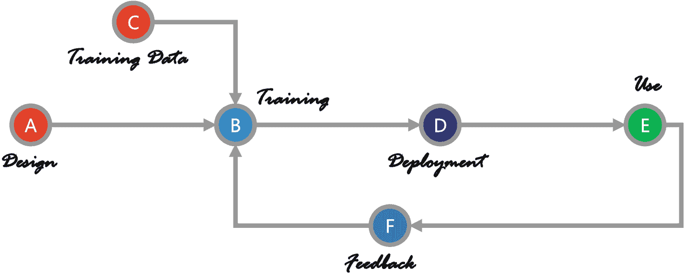

# 4. 评估人工智能解决方案的风险

人工智能作为一项如此强大的技术，本身就带有高风险。它是我们必须管理的重大新威胁的来源。这种风险并非集中在人工智能的某个特定部分，而是遍布于人工智能系统的所有阶段和组件。它包括人工智能解决方案的设计方法、人工智能解决方案本身、其开发与部署，以及后续的使用。此外，人工智能系统的训练和反馈循环也带有显著风险。

要预防每一种风险，意味着我们必须评估每个组件本身，并寻找预防的途径。甚至在讨论预防之前，识别风险是必要的。图 4-1 展示了人工智能解决方案生命周期的六个主要阶段。

首先，在本章中，我们将讨论与人工智能解决方案相关的风险。我们将从两个角度进行评估——第一，检查它是否是*正确的解决方案*；第二，验证该解决方案是否*设计正确*。

如果缺少其中一项，即解决方案正确但设计错误，或者设计正确但解决方案从根本上就是错误的——每一种情况都会带来更高的风险。

图 4-1. 人工智能解决方案生命周期的六个主要阶段

## 从正确的假设开始

当你想验证自己是否在朝着正确的解决方案努力时，`假设检验`就变得至关重要。

通常，假设可以被定义为对某事物的解释。它也可以是一种假设或临时想法，一种需要进一步验证的有根据的猜测。

与我们的信念不同（信念不需要验证或评估），一个好的假设总是可验证或可检验的。它可以被证明为真或为假。

从科学角度来看，假设必须具有可证伪性，这意味着存在某些条件或场景下，该假设或假定将不成立。

最重要的是，在检验假设或思考解决方案之前，你必须将假设作为第一步来构建。如果你不遵循这一规则，最终可能会陷入“事后补救”式的解决方案，而这可能无法取得完全的效果。

你必须将假设作为第一步来构建，然后再进行检验或思考解决方案。

如果你从一个有缺陷的假设开始，你很可能会选择错误的解决方案，并且多种风险会随之渗透进来。与错误假设相关的一些风险包括：财务损失（通常表现为收入流失或运营损失）、客户忠诚度下降和挫败感增加、品牌声誉受损，以及其他诸多问题。

你可能会想：“为什么形成正确的假设如此重要？” 让我们来看一个例子。

### Acme Solutions 的奇特案例

`Acme Solutions`（一家虚构的公司）的产品和服务正在经历显著增长。`Acme` 的客户群在持续扩大。客户群的增加导致其事件管理支持中心的电话数量不断上升。

为了跟上增长步伐，`Acme Solutions` 希望增加其事件管理支持中心的人员编制。然而，考虑到人类的局限性，`Acme` 热衷于实施人工智能聊天机器人解决方案。通过这样做，他们期望在不增加人员编制的情况下，为客户报告的事件提供足够的支持。客户将能够与聊天机器人互动并报告他们的问题；或许还能立即获得解决方案。

`Acme Solutions` 应该启动 AI 聊天机器人项目吗？

如果这个项目完成了，按照所有标准来看，它能解决 `Acme` 的问题吗？

如果你深入思考，就会发现 `Acme` 的思维过程，也就是他们的假设，存在一个缺陷。他们的假设是：如果我们实施 AI 聊天机器人，我们就能在不增加人员编制的情况下，处理数量不断增长的客户报告事件。

这有什么问题呢？

这里的首要问题是“`事后补救思维`”。`Acme Solutions` 是先从脑海中有了一个解决方案，然后试图将其与当前客户群增长和事件报告增多的问题相匹配。他们在已经选定了解决方案之后才形成假设，这正是假设构建中的根本性错误。

相反，如果他们首先聚焦于问题本身，解决方案可能会有所不同。如果 `Acme` 承认客户群的增长导致了事件报告的增加，那么他们的服务或产品本身就存在根本性缺陷。他们的服务或产品中有些内在因素首先导致了事件的发生，而解决这个问题的最佳方式就是消除事件的根源。

一旦 `Acme` 意识到解决产品/服务中的缺陷就能消除或减少报告的事件数量，他们对增加人员编制的需求很可能就会消失。当这种情况发生时，对 AI 聊天机器人的需求也会随之消失。

在这种情况下，如果 `Acme` 执意推进 AI 聊天机器人项目，他们的事件数量并不会减少。然而，他们将能够响应更多报告事件的客户。现在，无论这个聊天机器人多么智能和高效，一旦客户报告事件，他们就已经对 `Acme` 的产品和服务感到不满和沮丧。`Acme` 的品牌忠诚度已经受到了打击，解决客户问题也无法恢复它；最多只能阻止情况进一步恶化。

你会注意到，AI 风险并不一定始于 AI 系统或应用程序本身。它们在解决方案构建开始或部署之前，可能就已经悄然潜入了。

因此，正确地构建假设、用数据验证它，并用统计分析来支持它，是至关重要的。这应该是你评估 AI 解决方案风险时的第一个检查点。

正确地构建假设、用数据验证它，并用统计分析来支持它，是至关重要的。

## 解决方案是否针对了有效的根本原因？

一旦你构建了正确的假设，并验证了你确实需要一个 AI 系统来为你解决某些问题，那么就该决定：到底需要修复什么？

通常，我们可以通过以下方式建立问题与其原因之间的关系：

*   `y = f (x)`

其中 `y` 是问题，`x` 是该问题的原因或驱动因素（或多个原因或驱动因素），而 `f` 代表使 `x` 导致 `y` 的过程或公式。

如果我们继续沿用之前 `Acme Solutions` 的例子，它可能看起来像这样：

*   `事件报告 = f (糟糕的产品手册，低质量的产品，等等)`

这意味着事件报告是由糟糕的产品手册引起的，客户看不懂手册，因此产生了问题。这也意味着有时产品手册可能不是唯一的问题，产品质量差也可能导致事件报告。

所以，如果你的解决方案要解决*事件报告增加*的问题，它无法直接对事件报告本身做任何事。它必须作用于产品手册、产品构建以及其他促成因素。当这些因素得到改善时，事件报告自然会减少。

如果通过实施基于 AI 的转录器，产品手册的质量得到了提升，它能够自动编写产品手册并验证其内容质量，那会怎样？

这将是一个有用的 AI 解决方案，它旨在解决一个有效的根本原因。你的 AI 解决方案必须能够解决你主要问题的一个或多个根本原因。这能确保你的问题得到解决。

如果 AI 解决方案没有针对任何根本原因，或者它只针对影响较小的根本原因，而忽略了影响巨大的那些，这就是一个风险，你必须加以修正。确保你的解决方案是正确的。

## 解决方案是否得到了正确训练？

AI 解决方案开发的关键阶段之一是对系统进行训练。

如果你正在处理一个复杂的解决方案，它通常会遵循两阶段学习。而对于简单的 AI 解决方案，则仅在一个阶段内完成，即在模型构建阶段。

训练阶段是基础首次形成的阶段，解决方案会利用这些模型进行训练。因此，这些模型的准确性高度依赖于训练数据集。

如果在解决方案训练期间输入的数据质量不佳，可能会导致后续出现若干问题，并且风险会以不同形式显现。

例如，算法偏见可能会渗透到解决方案中，从而影响所有结果。机器学习算法会识别数据中的模式，然后基于该模式构建预测模型。AI 解决方案制定的任何规则或做出的任何决策都依赖于该模式。如果这些模式中存在任何偏见，那么解决方案将会放大这种偏见，并可能产生进一步强化该偏见的结果。

这种无形偏见的风险在于，当 AI 解决方案出现任何错误时，很难诊断并定位问题的根源。

如果你怀疑 AI 解决方案的训练质量，或对用于训练的数据存有疑虑，那么该解决方案出现问题的风险就更高。另一方面，如果你对源数据和所遵循的训练过程充满信心，那么风险就相当低。

训练 AI 系统没有唯一且绝对正确的方法；存在各种差异。如果对这些训练程序和训练数据的置信度较低，那么解决方案就具有高风险。反之，如果你感到满意，则可能风险较低。

## 解决方案是否考虑了所有场景？

遵循“设计正确”的解决方案这一前提——评估 AI 解决方案风险的关键因素之一是设计的深度和广度。你需要理解并确信，手头的解决方案已完全准备好处理业务中可能出现的所有场景。

AI 系统并非有意识地执行任务。它们依赖于训练数据，这意味着如果输入数据存在问题，系统的可靠性及其结果的可靠性就会面临风险。这些数据问题不仅仅是偏见和内容质量，还涉及数据中各种场景的表示。

典型的 IT 解决方案，包括 AI 及类似技术，大多是点状的，即它们专注于实现一个目标，并附带少数几个参数用于在实现该目标时进行优化。不幸的是，它们永远无法做到包罗万象和全面；对它们期望过高是不现实的。

让我们以自动驾驶汽车为例。如果你要求汽车尽快将你送到目的地，它可能会做到。然而，当你到达时，你可能已经违反了多条交通规则，并将同行者的生命置于危险之中。这些都是不可接受的。但是，如果你的 AI 过于狭隘，只见树木不见森林，这种情况就可能发生。

仅包含少数几种场景类型的大量数据无法针对现实用例训练解决方案，这是一个重大风险。除非你的训练数据集代表了所有可能的用例和场景，否则它毫无用处。

由于机器学习是一个归纳过程，你的解决方案所使用的基础模型只能覆盖它被训练过并在数据中看到的内容。如果你的训练遗漏了低发生率的场景（也称为长尾或边缘情况），你的解决方案将无法支持它们。你的解决方案在这些场景下风险过高，或者可能会失败。

如果数据缺乏多样性，则可能导致未来出现问题。使用有限数据集和狭隘训练开发的解决方案将具有高风险。同时，如果解决方案设计涵盖了数据的广度和深度，并尽可能合理地覆盖了多种场景，那么风险就会较低。

## 是否有优雅停止的选项？

一个“设计正确”的系统总是会内置冗余。新一代 AI 解决方案可能非常强大，一旦出现问题，可能会导致大规模的损害。

因此，请向你的开发团队或 AI 供应商询问“终止开关”。与他们核实是否可以在需要时优雅地停止系统。

一个没有优雅停止选项的系统是一个高风险系统。

可能的情况是，你有一个在需要时停止系统的选项。然而，行使该选项并不像拔掉电源那么简单。这意味着，如果你决定停止它，你仍可能面临在此过程中危及业务连续性的重大风险。

不过，能够停止总比完全无法停止要好。在这种情况下，你必须评估你的选项和备用计划。当这些备用选项被启用时，会带来哪些财务和整体业务影响？如果在紧急情况下停止 AI 系统意味着你需要组建一个 100 人的团队来应对局面，那对你来说可能是一个巨大的财务和人力资源负担。

在根据此参数评估你的 AI 解决方案时，请检查是否有终止开关或优雅停止和重启选项。如果没有此类选项，则属于高风险解决方案。然而，如果这些选项可用，但会带来一定程度的不便和轻微损失，则可称为中等风险解决方案。虽然可能性极小，但可能存在一种易于停止和重启的解决方案。如果这样做不会耗费你太多资源，那么从风险角度来看，它可能是一个低风险选项，并且应该是最优选的。

如果你无法轻松、优雅地停止 AI 解决方案，它就是高风险解决方案。相反，如果你完全可控，并且可以轻松行使该选项且没有任何重大损失，那么它就是低风险，即更好的解决方案。

## 解决方案是否可解释且可审计？

一个软件解决方案，无论多么复杂，始终是可审计和可理解（可解释）的，除非它*设计不当*。

具体到人工智能解决方案，可解释性一直是讨论最多的话题之一。由于开发人工智能解决方案的方法多种多样，确定系统如何做出决策变得越来越困难。借助可解释且可审计的人工智能解决方案，我们应该能够明确责任归属，并进行修正和采取纠正措施。

对于许多行业来说，人工智能的可解释性是一项监管要求。例如，随着《通用数据保护条例》（`GDPR`）法律的生效，公司将需要向消费者提供基于人工智能的决策的解释。^(¹²)

当人工智能在缺乏充分可解释性的情况下实施时，风险会日益增加。这些风险影响伦理、业务绩效、监管，以及我们从人工智能实施中迭代学习的能力。无法解释的人工智能（即所谓的“黑箱”）的危险是真实存在的。

人们不愿意接受由他们不理解的*某个实体*做出的武断决定。为了使其可接受且值得信赖，你需要知道系统为何做出特定决策。

除了可解释性，可审计性是正确人工智能解决方案的另一个关键。每当出现问题时，你需要能够恢复整个交易的审计追踪。如果不可审计，人工智能解决方案将构成重大风险。在缺乏可验证记录的情况下，监管罚款可能会增加，财务损失也可能迅速累积。不仅如此，这还会成为你业务发展的限制因素。没有恰当的解释和理解，你就无法改进。当你处于“黑暗”中时，受控且可衡量的改进几乎不可能实现。

如果解决方案是可解释且可审计的，那么错误决策及其进一步后果的风险就会降低，也更有利于业务的改进。

## 解决方案是否针对你的用例量身定制？

大多数人工智能解决方案都声称能为最终用户提供个性化服务。然而，关键问题在于，在你部署或开始实施这些解决方案之前——它们是否为你进行了定制或调整？

对于许多用例，存在特定于地理区域的规则。例如，如果你是一家欧洲企业，你在数据处理、可解释性、可验证性等方面的义务与其他国家不同。如果你的业务在中国，那么人脸识别技术可能是可以接受的；然而，对于大多数其他国家来说，情况则恰恰相反。

如果你期望你的解决方案能够转录医生的笔记并据此做出预后或决策，那么你的解决方案必须理解当地的语言、俚语和其他语言细微差别。例如，`trash can`（美国）与 `garbage bin`（澳大利亚），或 `sidewalk`（美国）与 `footpath`（澳大利亚），它们意思相同但用词不同。这里给出的例子相当基础；然而，对于一个复杂的应用程序来说，语言差异意味着很多问题。

对于招聘解决方案或申请人跟踪系统（`ATS`）而言，如果解决方案在初始阶段是基于本地化或特定地理区域的数据进行训练的，这难道不相关吗？不同国家的招聘模式和标准差异很大，这意味着使用标准解决方案并不适合其目的。

地理差异也会影响用户与任何软件系统的交互，用户体验也是如此。如果开发团队中有本地专家，这最好在解决方案设计阶段处理。这些专家可以提供宝贵的见解和知识，使解决方案更有效，更能适应最终用户的用例。

在大多数情况下，没有针对你的用例量身定制的解决方案并非致命问题。然而，稳妥的做法是假设考虑和评估其相关性至关重要。

如果解决方案没有针对你的用例进行定制，你可能面临很高的潜在风险。评估定制化程度有助于预估潜在风险。

## 解决方案是否具备处理漂移的能力？

数据随时间变化，从而影响静态编程（或假设）关系的问题，是机器学习其他几个现实场景中的常见现象。在机器学习领域，这种情况的技术术语是“概念漂移”。^(¹³)

这里的术语*概念*指的是输入和输出之间未知或隐藏的关系。数据变化可能由各种现实场景引起，这可能导致人工智能解决方案的性能下降。

如果解决方案*设计得当*，它首先就会考虑到这种漂移，因此能够适应不断变化的场景。然而，如果不是这样，你的解决方案要么会失败，要么性能会下降，这也可能意味着准确率降低、速度变慢、误差范围增大以及其他此类问题。

但请记住，识别可能发生概念漂移的任何场景是很困难的，尤其是在你首次训练模型时。因此，你的解决方案不应致力于部署前的检测，而应稳妥地假设漂移会发生，并相应地设置处理机制。

如果你的解决方案无法处理漂移，你将不得不持续进行修复。这是一个代价高昂的方案，因为你需要不断花钱进行修复。同时，还存在容忍一段时间性能不佳的风险。如果漂移的检测不明显，这种风险就会增加。如果你因某种原因在较长时间内未能检测到漂移，这可能在多个方面带来相当大的风险。因此，漂移的检测也是一个关键因素。

检查你的解决方案是否考虑到了概念漂移，如果是，考虑到了什么程度。对该检查的回答将告诉你风险水平。

## AI 解决方案评估问卷

以下是可用于评估 AI 解决方案风险的问卷。无论您是内部开发、外包开发，还是从其他供应商处购买现成方案，该问卷均适用：

1.  您是否正确构建了假设？

2.  您是否用数据验证了假设，并且统计分析是否支持该假设？

3.  总体而言，您的 AI 解决方案解决了多少个根本原因？

4.  您的解决方案是否解决了高影响力的根本原因？理想情况下，它应解决所有驱动因素，但若不能，至少应处理最重要的那些。

5.  您是否了解您的解决方案是如何训练的？训练了多少次、多长时间以及何时进行的？

6.  您是否了解 AI 系统训练时使用了哪种类型的数据集？数据来源何处？您认为数据及其来源的可靠性如何？

7.  如何评估训练数据集对特定用途的适用性？

8.  训练数据集是否完全代表了所考虑的目标群体？

9.  训练数据集是否包含偏差？如果包含，是哪种偏差？如果不包含，是如何确定的？

10. 在初始阶段，您是否执行了数据集清洗和标准化？您是否发现了任何异常？您是否了解这些异常的来源？在训练前是如何纠正这些异常的？

11. 训练数据集是否包含完整的数值范围？是否有任何长尾值被丢弃？如果有，团队是如何做出该决定的？

12. 在需要时，AI 解决方案能否快速且优雅地停止？您是否了解执行此操作的流程？

13. 一旦停止，该解决方案能否重新部署？重新部署的流程是什么？

14. 您的 AI 解决方案能否忘记所有学习内容并从头开始重新学习？重新训练系统需要哪些资源？如果 AI 解决方案无法“遗忘”并重新训练，您如何修复任何问题？

15. 当解决方案停止时，业务将如何运作？您是否制定了业务连续性计划？您是否评估了与此相关的财务影响、停机时间、索赔及其他影响？

16. 您的 AI 解决方案是否针对您的用例进行了定制？定制程度如何？如果未完全定制，预计会有何种程度的交叉影响？您是否有应对计划？

17. 该解决方案是否经过概念漂移测试？如果没有，原因是什么？如果有，是如何测试的？

18. 解决方案内置了哪些预防措施来处理漂移？您是否知道如何识别漂移？以及如何修复它？

19. 您能否解释并理解您的 AI 解决方案的决策和预测？

20. 您能否对您的 AI 解决方案进行全面审计？

21. 如果出现问题，审计并追溯故障根本原因需要多长时间？这对业务有何影响？

从这些问题中汲取灵感，您可能会想到更多需要寻求答案的问题。最终，这对您是有益的，因为这样您就能对自己的 AI 解决方案更有信心，并更好地理解它。

### 全面评估，掌控全局

从经济角度来看，目前存在显著的信息不对称，这使得 AI 解决方案的创造者比使用者处于更有利的地位。

据说，当技术买家对技术的了解远少于卖家时，他们处于劣势。在大多数情况下，决策者并不具备评估这些系统的能力。然而，借助上述问卷和信息，这种情况应该会有所改变。

问题的关键在于，你不能指望 AI 开发者（无论是内部还是外部）进行自我监督，以确保其设计开发的审慎性。

我们自然会不断进化并挑战极限。然而，有些事情是无法挽回的。这里没有 `undo`（撤销）选项。因此，我们必须放慢脚步，或者极度谨慎。

由于放慢脚步可能是一个不太容易被接受的选项，因此极度谨慎是必要的。严格评估风险并建立强有力的治理机制，是你可以采取的一些关键步骤。

如果你的笔记本电脑崩溃、搜索引擎显示奇怪且不相关的结果，或者流媒体服务向你推荐烂片，这可能只是小麻烦。但是，如果系统控制着汽车、电网或金融交易系统，它最好能正确运行。微小的故障都是不可接受的。

为了让你对自己的 AI 系统充满信心，你必须确保你正在开发的是“正确的解决方案”，并且该解决方案是“设计正确的”。

从战术上讲，“正确地做事”至关重要；而从战略上讲，“做正确的事”则更为关键。面对像 AI 这样强大的技术，两者都不可或缺。

脚注 1 2

## 降低 AI 解决方案部署风险

在上一章中，我们重点讨论了 AI 解决方案的设计及其相关的风险方面。我们的目标是确保解决方案是“设计正确的”。在本章中，我们将重点关注解决方案的部署方面，并涵盖“解决方案是正确的”这一方面。

当你能够使用像 AI 这样强大的工具和技术时，在正确的时间为正确的问题部署正确的解决方案几乎成为一项强制性要求。这在过去也并无不同。然而，由于 AI 现在能够产生影响的规模之大，它要求更高程度的理智和责任感。

“你不知道你不知道什么”这一事实，在处理像 AI 这样的解决方案时构成了重大障碍。打破这一障碍的最佳方法是提出正确的问题并寻求答案。

对于 AI 解决方案的部署，尽早掌控规划和架构至关重要。未能尽早提出正确的问题，可能意味着你最终得到的解决方案质量欠佳，收益降低。你很可能因为做了某些不影响关键指标的事情而浪费了全部投资。

如果你过早地提出尖锐的问题，可能会显得你在拖延；但请记住，这是为了更大的利益。对于像 AI 这样的新产品和技术，新奇感往往很畅销！你不想买一个花哨且昂贵的玩具系统。你想做的是奠定基础，从而显著推动你的业务发展。

### 确保长期战略已明确

我常说，技术解决方案不再是单一的点状解决方案；它们是复杂的系统组成部分。因此，期望你的 AI 解决方案即插即用或安装即用是错误的。^(¹⁴)

你必须问自己和你的领导团队，在部署 AI 解决方案后，你的战略路线图看起来应该是什么样子，或者应该变成什么样子。如果你没有任何此类路线图，那这就是你的首要任务，立即着手制定。没有战略路线图，部署任何解决方案都毫无意义。

使用像 AI 这样的新兴技术是一个方向，而非终点。因此，你的路线图应展示出随着你吸收这些技术，你的业务将如何演变。以分阶段的方式规划这些信息将非常有用。

对于每个里程碑和关键步骤，确保记录哪些业务指标将得到改善，以及预期的成果是什么。

然后，这个战略路线图可以成为你的终极指南——你整个技术部署旅程中的北极星。随着你不时地调整战略和期望，这类文档自然会不断演变。

## 正确定义你的问题

在上一章中，我们在*假设的重要性*下部分地讨论了这一点。假设是对某事物的解释或需要进一步验证的假定。

然而，如果你一开始就没有正确定义问题，那么之后形成的任何假设或解释都将无济于事。针对错误的业务问题或优先级最低的问题提出正确的假设，不会产生显著收益。

如果你有一个需要解决的正确问题，但在构建假设时犯了错误，这可能会导致资源浪费，并对你的业务产生其他副作用；这里的关键词是“可能”。然而，如果你选择了一个错误（或不太关键）的问题来解决，那么即使假设构建正确也无济于事；你从一开始就走错了路。因此，你将浪费资源并对业务产生负面影响；这里的关键词是“一定”。

假设就像交通工具，而问题则像目的地。如果你选择了正确的目的地（即要解决的问题），选择糟糕的交通工具会让你稍晚到达目的地，而选择正确的交通工具则会让你更快到达。无论如何，你都会到达目的地，也就是说，问题会得到解决。然而，如果你的目的地是错误的，那么无论交通工具多好，都毫无意义。

定义你的业务问题主要是一项战略性的工作。你可以评估你的目标是什么，以及是什么阻碍了你实现这些目标。你可以将这些障碍视为需要解决的问题。一旦你列出了问题，并对其进行了适当的量化和验证，你就可以为每个问题构建假设。

请记住，在进入构建假设阶段之前，正确定义问题是基础要求。

问题是你的目的地，而假设是你对交通工具的选择。

## 验证所有根本原因

如果你的 AI 解决方案针对的是你已验证的根本原因，那么它很可能是正确的解决方案。然而，一个重要的问题是——你如何知道你的根本原因是有效的？

我始终推荐一个双向流程来验证根本原因。这个流程能确保你选择了有效的根本原因，并能对最终结果产生显著影响。

第一部分涉及传统的统计和分析方法。这些方法主要包括统计假设检验和五问法。应用这些技术可以让你筛选出潜在的根本原因；其中一些可能很重要，而另一些则可能不重要。最好将这些根本原因视为主要问题的单纯驱动因素。并非所有原因都是问题的唯一驱动因素，因此消除它们不一定能解决问题。这就是流程第二部分发挥作用的地方。

### 应用反向推理

第二部分涉及*反向推理*技术。这项技术有助于你证明你所发现的问题驱动因素（如果存在）的逻辑谬误。这样做要么能证明某个特定结果（问题）完全是由某个特定事件（驱动因素）产生的，要么能推翻它。如果被推翻，你可以确信消除或减少该根本原因并不能解决你的问题。相反，如果反向推理证明给定根本原因的特定事件是问题发生的唯一确定路径，那么你可以确信解决它将解决主要问题。

例如，客户评价差是联络中心互动充满摩擦、产品手册质量差以及产品本身质量低劣共同导致的结果。如果你应用反向推理，使联络中心互动变得顺畅*可能*并不一定会提高评价。然而，提高产品质量*肯定*能带来更好的评价。因此，这里的首要根本原因就是产品质量，你必须改进它才能对最终结果（评价）产生显著影响。

### 应用 MECE 原则

根本原因还需要遵循*相互独立，完全穷尽*，即 MECE 原则。这意味着所有问题驱动因素的最佳排列是穷尽的，并且你已经包含了所有驱动因素，同时你不会重复计算那些重叠或具有相同效果的问题驱动因素。确保 MECE 意味着你正在优化资源来解决这些问题，并且它们的工作没有重叠。这将有助于你避免部署两个解决同一问题的方案，从而使其中一个变得多余。

使用两步流程验证所有找到的根本原因，你就可以确信你的*AI 解决方案是正确的*。

## 规划业务连续性

保持怀疑态度是降低 AI 解决方案部署风险的关键。

考虑业务连续性规划（BCP），以防这些解决方案未能按预期工作。我见过几个项目未能按时交付或根本未能交付，这要求运营回退到原有状态。

这种规划不仅在部署期间需要，而且在持续运营中也需要。如果出于某种原因，你需要将 AI 解决方案下线，你的业务能否照常运行？如果答案是否定的，请确保在部署开始前有替代方案。

## 明确责任归属

从项目管理的角度来看，确定责任相对容易，因为有相应的方法。然而，当 AI 解决方案部署过程中出现问题时，情况并非黑白分明。虽然解决方案可能表现异常（表明供应商的过错），但也完全可能是由于输入了错误的训练数据（表明你的责任）。此外，由于 AI 部署中的事情无法如此精确，因此明确和确定责任至关重要。

你的团队必须在部署期间列出所有潜在的故障场景，将责任分配给相关方，并让他们签字确认。这样做可以确保当实施遇到障碍时，能够在不互相指责和浪费额外资源的情况下解决问题。

## 确保基础设施的可用性

这关乎你在技术层面的准备情况。虽然你的业务领导层可能已准备好迎接挑战并着手实施 AI，但你当前的基础设施却可能成为关键链条中最薄弱的环节之一。

请对现有 IT 基础设施与能力状况进行现实评估。为 AI 项目升级 IT 基础设施并非*点击即购*的简单事务，需要投入大量资源进行准备，包括硬件和网络。如果存在差距，或对其适用性缺乏信心，那么优先解决这个问题将是审慎之举。

`流程成熟度`是另一个必须关注的方面。除了 IT 基础设施，强烈建议将运营流程提升至显著成熟的水平。若非如此，随着需求持续变化，过程中将出现多次迭代，并导致大量临时调整。这些迭代和变更显然会侵蚀预算，并可能使实施延迟超出可接受范围。持续变更带来的疲劳感会迅速消耗团队精力，打击士气，并很快演变成重大问题。

`数据就绪度`是降低 AI 部署风险的第三个关键方面。一个简单的判断方法是——如果你对自身数据能力存疑，就不要考虑任何规模的 AI 解决方案。AI 解决方案需要海量数据才能达到可接受的性能水平。然而，如果你不清楚该收集哪些数据，这就会成为一个重大问题。在考虑 AI 解决方案实施之前，务必确保你在所有方面都已做好数据准备。

## 设定成功的目标指标

与其他所有项目一样，AI 项目也会经历一段蜜月期。一旦结束，利益相关者就会关注真实、可衡量的业务价值。

如果你没有预先确定关键指标并将其与项目成果挂钩，这可能会成为问题。你应该在项目启动前就识别并验证预期影响，这样你就能知道何时该期待什么结果。这还能让你在关键指标未产生价值或进展偏离计划时，及时叫停部署。

在业务中实施一项“酷炫”技术或许能让你获得一些炫耀资本，但它不会直接贡献于你的营收或利润。每项业务指标都必须与每项计划举措建立清晰关联。在启动 AI 项目时，建立这种关联应是第一步。要明确如何衡量指标变化、可接受的变化范围是多少、下限又是什么。

拥有这套衡量体系将帮助你在推进过程中稳步前行，或在必要时暂停并重新调整。

## 定义验收标准

在部署 AI 解决方案之前，你必须为部署成果设定验收标准。提前这样做有助于避免确认偏差，也能防止你陷入禀赋效应。

禀赋效应指出，人们更倾向于保留自己已拥有的物品（比如 AI 解决方案），而非去获取尚未拥有的相同物品。

因此，一旦你部署了 AI 解决方案，你很可能会放宽验收标准，接受一个低于标准的方案，仅仅因为你已经投入了资源来实施它。一旦发生这种情况，你将不得不长期忍受一个功能失调或质量低劣的 AI 解决方案。你可能会辩称后续会有持续改进，但事实是，你将永远处于追赶状态，这绝非理想局面。

如果你接受一个低于标准的方案，并希望后续再改进，最终只会陷入与技术赛跑的困境，这并不好。

为了迎合输出结果而定义验收标准，无异于事后修正，会让你背负巨大的智力债务。智力债务是指你接受了答案，却不知道它是如何得出的，并期望在未来某个时间点才能弄明白。陷入智力债务会极大增加你的风险敞口，使你处于最脆弱的境地。

如果你想降低 AI 部署的风险，请先定义好验收标准并坚持执行。如果结果不够出色，或未达到最低通过/验收标准，就拒绝该方案并重新开始。这比让你的业务暴露在更大的（未知）风险中要好。

## 构建执行能力

部署 AI 解决方案需要广泛的技能和对业务多个方面的深入了解，才能取得成功的成果。如果内部团队不具备合适的能力，这将成为障碍。不过，如果你能及早发现这一差距，就可以着手弥补。

一般来说，最理想的情况是将人才和能力作为核心业务团队的一部分内部拥有。然而，情况往往并非如此，如果是这样，寻求外部支持就是下一步该做的事。此时，你在寻求外部帮助时应明确表达你的期望。找到合适的支持至关重要。

有一点你需要特别注意。你的 AI 供应商应仅负责在指定约束条件下按时、完美地交付。产品和项目的所有权以及问责制，必须由你的内部领导团队掌握。如果你在这方面妥协，可能会导致不良后果。因此，如果缺乏这种（领导）能力，请在继续推进之前先解决这个问题。

## 处理安全与合规问题

AI 解决方案通常是黑箱操作，并以带来意外“惊喜”而闻名。它们可能造成的破坏性影响会让你付出巨大代价。它们不仅可能带来严重的负面运营影响，还可能造成相当大的声誉压力。根据你的品牌和公司规模，风险水平可能高或低。

请注意，网络安全与 AI 安全略有不同，在规划 AI 解决方案部署时必须认识到这一点。从一开始就拥有合适的专业知识，将确保你的实施没有任何漏洞，并能抵御各种可能的威胁。

为 AI 解决方案配备审计功能至关重要。这不仅从运营角度来看是必要的，而且在整个部署过程中也是必需的。这意味着，在任何时间点——无论是部署解决方案时还是实施之后——你都应该能够看到发生了什么（无论好坏）、如何发生以及为何发生。拥有一个完全合规、可审计且可追溯的系统，意味着在出现负面后果时，你的业务能得到保障。

## 与你的其他系统集成

AI 系统并非孤立运行，即使简单的交互也可能导致大麻烦。

这里有一个经典例子：2011 年，两个相互竞争的算法最终导致一本书在亚马逊上的标价高达 210 万美元。生物学家迈克尔·艾森有一天从他的学生那里发现，一本不起眼的二手书——*《果蝇的诞生：动物设计的遗传学》*——在亚马逊上由最低价卖家出售，售价略高于 170 万美元，另加 3.99 美元运费。第二便宜的副本价格则高达 210 万美元。各自的卖家都信誉良好，拥有数千条正面评价。当艾森第二天访问该页面时，价格又进一步上涨了。^(¹⁵)

最终，他们意识到两个卖家是如何试图系统地相互竞争，从而导致了这种情况。

在另一个例子中，不经思考的自动化部署导致了客户投诉数量的增加。当一家一级电信公司部署自动化系统时，该系统被设置为在指定期限内自动关闭故障工单。一级公司期望，如果客户遇到问题，二级公司会重新开启故障工单，并继续使用同一张工单直至问题解决。然而，二级公司也决定（不经思考地）将其系统自动化，即在一级公司关闭工单后，其系统会立即关闭工单。这样做意味着——如果问题持续存在——客户需要提交新的故障工单，这将被计为额外的故障工单，尽管实际上它们是同一个问题。

由于两个系统都在竞相尽快关闭工单，它们忽略了验证环节，导致了客户投诉数量的增加。这个问题严重损害了它们的声誉，并使运营指标承受了无法挽回的压力。两家公司都不得不损失（或浪费）资金和其他资源来处理这种情况。

这是两个简单的例子，说明了当多个系统相互交互时可能发生的事情，并由此产生了集体愚蠢的上升。

当你计划部署 AI 解决方案时，必须评估所有集成点，并确保它们稳定可靠。确保你为这些集成制定了适当的测试和验证计划，可以使你免于未知的风险和损失。

很多时候，你可能需要做出临时安排来连接两个系统进行交互，并确保它们协同工作。这些是你在部署期间和部署后必须监控的薄弱环节。

## AI 解决方案部署问卷

以下是可用于降低 AI 解决方案部署风险的问卷。这份问卷将帮助你回答关键问题，并突出显示与 AI 部署相关的任何差距或风险：

1.  你是否有在业务中实施 AI 系统的战略路线图？该（战略路线图）是否明确定义了关键步骤和里程碑？

2.  在考虑 AI 解决方案之前，你是否正确定义了核心问题？你如何确保它是正确且必要的问题？

3.  解决这个问题如何符合你的战略？通过解决这个问题，你将获得哪些好处？

4.  你是否验证了导致给定问题的所有根本原因？你是否使用反向推理技术确认了这些根本原因？

5.  你的根本原因列表是否遵循 MECE 原则？

6.  你是否准备好了业务连续性计划？你是否明确定义了与 BCP 相关的问责制和职责？每个负责和问责的人是否都了解它？他们是否知道你对他们的期望？

7.  你是否拥有合适的 IT 基础设施来实施 AI 系统？你的 IT 硬件和网络是否能够本地运行复杂的 AI 算法？如果 IT 基础设施出现问题，你将如何处理？

8.  你正在部署 AI 解决方案的流程是否足够成熟？你是否预见到该流程会发生任何重大变化？

9.  你是否拥有生成或收集 AI 解决方案所需数据的系统？你是否拥有充足且适当的数据存储设施？你是否有数据管理计划？如果数据可用性出现问题，你将如何处理？

10. 项目时间表的延迟是否会影响 AI 训练的数据集有效性（新鲜度）？如果是，影响是什么？如果不是，为什么以及如何不影响？

11. 你是否设定了目标成功指标？你计划如何衡量它们？是否每个人都同意这些指标和衡量方法？

12. 你是否为 AI 的推出设定了验收标准？如果不可接受，你的行动计划是什么？可接受的最低限度是多少？接受解决方案的上限是多少？如果 AI 解决方案仅仅是通过标准，该怎么办？

13. 你是否了解 AI 部署所需的内部能力要求？

14. 你是否有内部能力来监督 AI 部署？你计划如何弥合存在的差距？你是否有预算来获取外部支持？

15. 是否可以在每个步骤审计系统部署？如果可以，如何审计？如果不可以，为什么？

16. 你如何确保系统符合法律和政策要求？

17. 你如何确保系统的安全性？如果需要，是否有办法修改安全限制？如果有，如何修改？

18. 你是否已考虑到 AI 解决方案与其他系统的所有交互点？需要多少临时安排才能使事情无缝运行？你计划如何减轻这些交互点的风险？

19. 如果系统交互偏离常规，是否有控制和警报机制？如果有，阈值是多少？这些阈值可以更新吗？

### 提出正确的问题是必须的

如果你准备在开始 AI 部署之前提出这些问题，那么每个问题及其答案都会引发更广泛的讨论。如何将其引导至合乎逻辑的结论完全取决于你。如果你以正确的方式做到这一点，它将给你足够的信心继续前进。

然而，如果你没有得到令人满意的答案，它将促使你回到绘图板，重新制定战略和规划。

AI 解决方案的部署比典型的 IT 软件部署更复杂，如果不谨慎对待，可能会在其整个运营生命周期及之后留下糟糕的体验。

良好的开端是成功的一半，而提出正确的问题正是其中一部分！

脚注 1 2