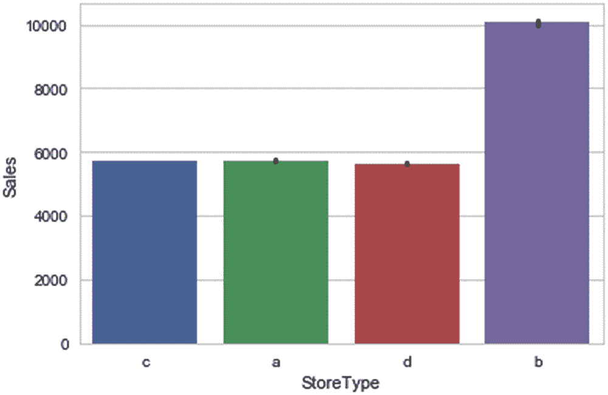

# 三、用于监督学习的深度神经网络：回归

在第 1 和 2 章中，我们探讨了 DL 的主题，并研究了 DL 是如何从 ML 发展而来，以解决一个有趣的问题领域的。我们讨论了对 DL 框架的需求，并简要探讨了市场上一些流行的框架。然后，我们研究了 Keras 的特殊之处，并花了一些时间研究了为开发 DNNs 而提供的基本构建模块，同时也从整体上理解了 DL 模型背后的直觉。然后，我们将从实践练习中获得的所有知识整合在一起，为波士顿房价用例开发一个婴儿神经网络。

现在我们已经对不同的 DL 构建模块和相关的科学有了一个相当好的理解，让我们在本章中探索一个回归用例的实际 DNN。

## 入门指南

人工智能作为一个领域的演变以及该领域越来越多的研究人员和从业人员创造了一个成熟和仁慈的社区。今天，很容易获得工具、研究论文、数据集，事实上甚至是基础设施来将 DL 作为一个领域来实践。对于我们的第一个用例，我们需要一个数据集和一个业务问题来开始。这里有几个受欢迎的选择。

*   ****:**[`www.kaggle.com/`](http://www.kaggle.com/)**

    **Kaggle 是世界上最大的数据科学家和机器学习者社区。它最初是一个在线 ML 竞赛论坛，后来发展成为一个成熟的平台，强烈推荐给数据科学领域的每个人。它仍然主办 ML 竞赛，还提供 ML 数据集、内核或社区开发的解决 ML 问题的脚本、ML 作业，以及为主办的竞赛和公共数据集开发和执行 ML 模型的平台。**

***   **美国政府公开数据** **:** [`www.data.gov/`](https://www.data.gov/)

    提供对数千个农业、气候、金融等数据集的访问。

    *   **印度政府公开数据** **:** [`https://data.gov.in/`](https://data.gov.in/)

    为印度的人口统计、教育、经济、工业等提供开放数据集。

    *   **亚马逊网络服务数据集** **:** [`https://registry.opendata.aws/`](https://registry.opendata.aws/)

    提供了一些来自 NASA NEX 和 Openstreetmap、德意志银行公共数据集等的大型数据集。

    *   **谷歌数据集搜索** **:** [`https://toolbox.google.com/datasetsearch`](https://toolbox.google.com/datasetsearch)

    这相对较新，仍处于测试阶段(在撰写本书时)，但非常有前途。它提供了一个简单的搜索查询访问成千上万的公共数据集进行研究实验。它聚集了来自几个公共数据集存储库的数据集。

    *   **UCI ML 资源库**??:[`https://archive.ics.uci.edu/ml/`](https://archive.ics.uci.edu/ml/)

    探索 ML 和 DL 数据集的另一个流行的存储库。** 

 **我们将使用 Kaggle 公共数据存储库来获取 DL 用例的数据集。我们将使用 Rossmann 商店销售数据集，该数据集可在 [`www.kaggle.com/c/rossmann-store-sales/data`](https://www.kaggle.com/c/rossmann-store-sales/data) 获得。这是几年前举办的一个非常受欢迎的比赛，有相当大的数据集。你需要向 Kaggle 注册并接受竞赛规则，才能下载数据。如果你还没有注册 Kaggle，我强烈建议你注册。每个数据科学专业人士都应该密切关注 Kaggle，因为它为数据科学提供了很好的学习、实验和讨论平台。

从数据集来看，只需要 train.csv 和 store.csv，分别是 38MB 和 45KB 左右。请下载数据并将其保存在单独的文件夹中。

## 问题陈述

Rossmann 是德国最大的连锁药店之一，业务遍及欧洲。截至 2018 年，他们在欧洲拥有超过 3900 家店铺，年营业额为 90 亿欧元。我们的任务是预测某一天几个确定的商店的销售额。

现在，让我们从纯商业的角度来看问题。您需要问的第一个问题是:谁是业务问题的最终利益相关者，他将如何利用解决方案？好吧，鉴于这是一个在线数据科学竞赛，我们不会对这个问题有一个有效的答案，但我们或多或少可以弄清楚一个会是什么样子。

首先，我们需要用一种稍微有策略的方式重新构建问题陈述，以便能够将问题陈述表示为设计解决方案。有几个被市场认可的问题解决框架来帮助以标准方式定义和表示问题陈述，以便更有效地解决问题。麦肯锡的“情境-复杂-解决”(SCR)和穆适马公司的“情境复杂问题”(SCQ)是最受欢迎的框架。我们将利用上述框架之一，以更有效和简洁的方式来表示我们的问题陈述。但是让我们首先理解为什么这很重要。

### 为什么用设计原则表达问题陈述很重要？

大多数大型复杂的问题需要详细的设计、同行评审、方法和策略的验证、大量的头脑风暴，甚至可能在开始之前需要一个小的概念验证。企业软件开发就是一个经典的例子。您将有一个团队来定义业务需求并记录它们以供将来参考，设计一个高层次的图表，然后是低层次的设计，最后详细说明每个软件组件的细节以及最终解决方案的外观。在任何时候，如果一个新的工程师加入团队进行协作，设计文档、方法和业务需求将帮助他理解更大的图景，而不需要单独讨论。此外，在任何时候，设计和方法都有助于总体目标的顺利实现。

在开始任何工作之前，数据科学和 ML/DL 中的问题需要类似的方法。虽然不可能在一开始就起草完整的解决方案，但是考虑到整个过程是迭代的和探索性的，我们仍然可以更好地表现问题和解决方案的高层次方法。为了理解设计原则框架下的问题定义，让我们来看一个。

### 设计 SCQ

由 Mu 适马公司设计和发布的 SCQ 框架是一种流行的框架，用于表示咨询公司中的问题。它把问题分成三个简单的组，用正确的问题展开每个组，最后连接到期望的未来状态。

这四个组成部分可以定义如下:

*   **期望的未来状态**

    问题解决后我们想要达到的最终状态。

*   **情况**

    对整个问题陈述的简要叙述，详细描述了风险承担者所面临的问题。这个一般最多包两行。

*   **并发症**

    确定阻碍利益相关者从当前情况向期望的未来情况过渡的主要障碍。

*   **问题**

为了减少障碍，需要回答的关键问题。

对于我们的用例，我们可以定义如下图所示的 SCQ。


有了 SCQ，我们现在对问题陈述有了更全面的理解。我们知道，有一个营销团队正在设计针对特定商店的促销活动，以锁定目标客户并增加整体收入，同时更明智地使用资源。因此，他们不希望向无论如何都表现出色的商店提供促销活动。如果他们能够看到预计的未来销售额，他们可以根据为实现预期目标所需的折扣和促销的定义阈值，将一些商店分为“低”、“中”和“高”。

团队遇到了障碍，因为他们没有办法估计给定商店的未来销售额。因此，为了解决这个问题，我们提出以下问题:“我们如何估计一个商店的未来销售额？”鉴于路障已经被克服，营销团队现在有办法研究和估计未来的商店销售，从而设计更有效的促销活动。

### 设计解决方案

商业问题的关键问题的答案现在可能很容易猜到了。我们将开发一个 ML 模型，它可以将商店的销售额作为内部、外部和时间(基于时间)属性的函数来学习，然后根据可用的属性来预测未来的销售额。

这可能看起来像一个时间序列预测问题，在这种情况下，我们纯粹将销售额或类似目标定义为时间的函数(即，考虑历史每周或每天的销售额，并通过模拟趋势和模式来预测未来的数据点)。但这仅适用于我们只需要对一家商店进行估算的情况。对于 1000 家商店，手动研究每周销售额并开发模型来估计未来销售额是一个费力且不可行的解决方案。或者，我们可以使用全局时间序列模型来解决这个问题(即，只开发一个用于所有商店的模型)。虽然这肯定是可能的，但是预测的结果不会给利益相关者增加任何价值，因为它很可能会偏离目标。

相反，我们可以通过将这个问题从时间序列预测问题转化为回归问题来开发一个更有效的模型。万一这很难理解，让我们用一个例子来简化它。任何用例可用的数据都可以分为时间序列或横截面。在时间序列数据中，每个训练样本(即一行数据)都与和时间序列相关联的另一个样本有关系。日销售额或周销售额是时间序列数据的适当示例，因为一周的销售额与前几周的销售额有关系。在横截面数据中，每个训练样本都是独立的，与其他样本没有基于时间的关系。客户的广告点击或信用客户通过信用卡提供商进行的交易都是横截面数据的例子。这两个样本之间没有基于时间的关系。

在我们的用例中，我们可以将数据表示为

> *作为商店功能的销售额+其他属性*

而不是基于时间序列的模型定义为

> *作为时间函数的销售额*

通过这种方式，我们可以定义一个模型，该模型可以从各种商店和其他外部属性(我们将使用数据探索这些属性)中学习模式，以预测预期的销售额。随着我们探索数据和更接近模型开发，这个过程将变得清晰。现在让我们从探索数据开始。

## 探索数据

我希望你已经在注册账户并接受比赛规则后从 Kaggle 链接下载了数据集。如果您还没有，以下是详细的步骤:

1.  进入 Kaggle 首页: [`www.kaggle.com`](https://www.kaggle.com)

2.  使用“注册”创建新帐户或使用现有帐户登录。

    前往罗斯曼专卖店销售竞赛: [`www.kaggle.com/c/rossmann-store-sales/data`](https://www.kaggle.com/c/rossmann-store-sales/data)

3.  导航到页面中间，找到“全部下载”选项。你会得到一个竞赛规则页面，你必须阅读，然后接受这些条件。一旦它们被接受，就可以下载了。

4.  将下载的数据集解压缩并移动到一个新文件夹中，以供练习使用。

您需要两个重要的文件:

*   train.csv

*   大.csv

一旦数据准备就绪，我们就可以开始使用 Python 来探索和分析数据。你可以打开 Jupyter 笔记本，正如在第二章中所讨论的，它已经安装了 Anaconda。请在您的终端或命令提示符下使用命令`'jupyter notebook'`并按回车键；然后，Jupyter 应该会在您的默认浏览器中打开。您可以为我们的 DL 练习创建一个新笔记本。或者，您也可以使用来自 Anaconda 的任何 Python IDE 或 Spyder IDE 但是，强烈推荐 Jupyter。

为了探索数据，我们需要基本的 Python 命令。我们将使用懒惰编程方法来学习用 Python 进行数据探索；也就是说，当我们遇到一个代码块或者一个新的包时，我们会讨论它的细微差别。如果您是 Python 的新手，只需通读代码块和注释，然后通读代码块的解释就足够了。

让我们首先将数据导入我们的系统开始分析。下面的代码片段导入 Python 包“pandas ”,该包提供了可用的函数来导入、浏览、操作、转换、可视化以及以所需的形式导出数据。

```py
import pandas as pd
df = pd.read_csv("/Users/jojomoolayil/Book/Ch3/Data/train.csv")

```

数据被导入到变量`df` *中。*因为 Python 是面向对象的，我们现在可以使用熊猫相关的函数作为对象的方法。

一旦导入了数据，我们需要研究的第一件事就是数据的长度、宽度和类型。下面的代码片段将数据的形状打印为长×宽，然后展示数据集的前五行。

```py
print("Shape of the Dataset:",df.shape)
#the head method displays the first 5 rows of the data
df.head(5)

```

**输出**

```py
Shape of the Dataset: (1017209, 9)

```


同样，让我们导入第二个数据集 store.csv，并查看它的长度、宽度和前 5 行。

```py
store = pd.read_csv("/Users/jojomoolayil/Book/Ch3/Data/store.csv")
print("Shape of the Dataset:",store.shape)

#Display the first 5 rows of data using the head method of pandas dataframe
store.head(5)

```

**输出**

```py
Shape of the Dataset: (1115, 10)

```


如您所见，训练数据集有 1，017，209 行和 9 列。head 方法展示了 dataframe 的前 5 行，我们可以通过浏览不言自明的列名来查看数据中的内容。在 train 数据集中，我们有不同日期商店的数据。我们有特定一天的总销售额和几个附加属性。

同样，商店数据有 1，115 行和 10 列数据。它为我们提供了额外的商店属性，这些属性描述了商店的特征，如产品组合类型、竞争情况以及促销相关属性。

### 查看数据字典

让我们看看 Kaggle 上比赛页面提供的数据字典。如果你错过了，你可以在这里通读一些定义。

*   **店铺** **:** 每个店铺的唯一 ID

*   **销售额** **:** 某一天的营业额(我们的目标 y 变量)

*   **客户** **:** 某一天的客户数量

*   **开门** **:** 店铺是否开门的指标:0 =关门，1 =开门

*   **法定假日** **:** 表示法定假日。通常，除了少数例外，所有的商店在法定假日都不营业。请注意，所有学校在公共假日和周末都关闭。a =公共假日，b =复活节，c =圣诞节，0 =无

*   **学校假期** **:** 表示(商店，日期)是否受到公立学校关闭的影响

*   **商店类型** **:** 区分四种不同的商店模式:a、b、c、d

*   **产品组合** **:** 描述产品组合级别:a =基本，b =附加，c =扩展

*   **竞争距离** **:** 距离最近的竞争对手商店的米数

*   **竞争优势[月/年]** **:** 给出最近的竞争对手开业的大概年月

*   **促销** **:** 表示当天商店是否有促销活动

*   **Promo2** **:** Promo2 是部分店铺的持续促销:0 =店铺不参与，1 =店铺参与

*   **Promo2 since[Year/Week]****:**描述商店开始参与 promo 2 的年份和日历周

*   **促销间隔** **:** 描述促销 2 开始的连续间隔，命名促销重新开始的月份(例如，“二月、五月、八月、十一月”表示该商店的每一轮促销在任何给定年份的二月、五月、八月和十一月开始)

为了将所有数据点放在一起，我们需要创建一个具有商店和促销功能的单一数据框架。我们可以通过连接“store”列上的两个数据帧来实现这一点，该列代表商店 ID。Pandas 提供了一个“合并”功能，类似于 SQL 中的 join 语句。我们可以使用一个或多个列作为连接键，在一个或多个数据帧上执行左、右、内和全外连接。

以下代码片段连接训练和存储数据帧以创建新的数据帧。

```py
df_new = df.merge(store,on=["Store"], how="inner")
print(df_new.shape)

```

**输出**

```py
(1017209, 18)

```

该形状向我们展示了两个数据帧中的所有列都在一个统一的数据帧中。对行数的简单检查(在我们的例子中是一致的)有助于我们理解连接以预期的方式工作。

现在我们有了统一形式的数据，让我们开始探索数据集以理解如下几个重要问题:我们有多少商店的数据？我们有多长时间的数据？一天的平均销售额是多少？商店在日常销售中彼此差别很大吗？让我们找出答案。

我们将首先找到数据中唯一商店的数量、我们拥有数据的唯一天数以及所有商店的平均销售额。

```py
print("Distinct number of Stores :", len(df_new["Store"].unique()))
print("Distinct number of Days :", len(df_new["Date"].unique()))
print("Average daily sales of all stores : ",round(df_new["Sales"].mean(),2))

```

**输出**

```py
Distinct number of Stores : 1115
Distinct number of Days : 942
Average daily sales of all stores :  5773.82

```

我们可以看到，总共有 1，115 家不同的商店有 942 天的数据，平均每天销售额为 5，773。

pandas dataframe 的`unique`方法返回所选列的唯一元素列表，而`len`函数返回列表中元素的总数。dataframe 的`mean`方法返回所选列的平均值，在我们的例子中是销售额。

您可能已经注意到，使用 Python 非常简单。对于几乎所有可以在数据上执行的主流任务，pandas 都提供了一个简单的方法，只需几个参数就可以使用。让我们继续研究数据集以理解其他列。

### 查找数据类型

我们需要知道数据帧中每个元素的数据类型。到目前为止，我们只看到了数据集中的实际内容；显示为数字的列可能在内部存储为字符。让我们看看最终合并的数据集中每一列的数据类型。

```py
df_new.dtypes

```

**输出**

```py
Store                          int64
DayOfWeek                      int64
Date                          object
Sales                          int64
Customers                      int64
Open                           int64
Promo                          int64
StateHoliday                  object
SchoolHoliday                  int64
StoreType                     object
Assortment                    object
CompetitionDistance          float64
CompetitionOpenSinceMonth    float64
CompetitionOpenSinceYear     float64
Promo2                         int64
Promo2SinceWeek              float64
Promo2SinceYear              float64
PromoInterval                 object
dtype: object

```

我们在这里看到混合的数据类型，大部分是`int`，其余的是 object 或 float。对象是字符数据类型的一种形式。从技术上讲，我们必须了解数据集中的每一列或每一个特征，才能开发出有效的模型。在模型开发中，大部分时间消耗在数据工程、清理和探索上。

### 与时间一起工作

我们现在对`Store`列有了一个大致的了解；我们来看看`DayOfWeek`的特点。

```py
df_new["DayOfWeek"].value_counts()

```

**输出**

```py
5    145845
4    145845
3    145665
2    145664
7    144730
6    144730
1    144730
Name: DayOfWeek, dtype: int64

```

正如我们所料，对于“星期几”特性，我们可以看到七个不同的值，每个值都有相似的记录数。假设我们已经将日期作为一个特性，我们可以直接使用日期列来创建星期几，还可以创建一些其他特性。让我们创建额外的特性来帮助我们的模型更好地学习模式。我们将从日期变量中创建周数、月、日、季度和年作为特性。同样，由于我们已经创建了与时间相关的特征，我们可以添加一个基于气候和季节的新特征。考虑到商店在欧洲，我们可以参考标准的季节周期，用春、夏、秋和冬的值创建一个新的季节特征。Pandas 提供了易于使用的函数来提取与日期相关的特征；与季节相关的特征可以用简单的“if else”等价约定来创建。

```py
#We can extract all date properties from a datetime datatype
import numpy as np
df_new['Date'] = pd.to_datetime(df_new['Date'], infer_datetime_format=True)
df_new["Month"] = df_new["Date"].dt.month
df_new["Quarter"] = df_new["Date"].dt.quarter
df_new["Year"] = df_new["Date"].dt.year
df_new["Day"] = df_new["Date"].dt.day
df_new["Week"] = df_new["Date"].dt.week

df_new["Season"] = np.where(df_new["Month"].isin([3,4,5]),"Spring",
                      np.where(df_new["Month"].isin([6,7,8]),"Summer",
                           np.where(df_new["Month"].isin([9,10,11]),"Fall",
                                np.where(df_new["Month"].isin([12,1,2]),"Winter","None"))))

#Using the head command to view (only) the data and the newly engineered features
print(df_new[["Date","Year","Month","Day","Week","Quarter","Season"]].head())

```

**输出**

```py
        Date  Year  Month  Day  Week  Quarter  Season
0 2015-07-31  2015      7   31    31        3  Summer
1 2015-07-30  2015      7   30    31        3  Summer
2 2015-07-29  2015      7   29    31        3  Summer
3 2015-07-28  2015      7   28    31        3  Summer
4 2015-07-27  2015      7   27    31        3  Summer

```

### 预测销售额

列表中的下一个特性是`Sales`列。这是我们的目标变量(即，我们开发模型来预测变量)。

```py
#Import matplotlib, python most popular data visualizing library
import matplotlib.pyplot as plt
%matplotlib inline

#Create a histogram to study the Daily Sales for the stores
plt.figure(figsize=(15,8))
plt.hist(df_new["Sales"])
plt.title("Histogram for Store Sales")
plt.xlabel("bins")
plt.xlabel("Frequency")
plt.show()

```

**输出**


直方图有助于我们在高层次上理解数据的分布。从前面的图中，我们可以看到数据范围是从 0 到 40，000，但是在 20，000 之后几乎没有任何数据。这表明大多数商店的销售额在 0-20，000 之间，只有少数商店的销售额超过 20，000。移除这些异常值可能是值得的，因为这有助于模型更好地学习。

### 浏览数字列

接下来，我们还有几个数字列要探索。为了节省时间，我们可以使用 pandas 内部提供的`hist`功能。Pandas 还通过内部包含 matplotlib 来提供绘图功能。以下命令帮助我们可视化数据集中所有数字列的直方图。

```py
#Use the  histogram function provided by the Pandas object
#The function returns a cross-tab histogram plot for all numeric columns in the data
df_new.hist(figsize=(20,10))

```

**输出**


让我们分析上图中展示的直方图的结果。我们可以看到，特征 Promo、Promo2、学校假期和 Open 实际上是二元分类特征:它们表示两个与性别相似的可能值:男性或女性。因此，这些实际上是分类特征，但已经编码为数字列。这太好了；我们不需要进一步处理它们，因为 DL 模型只理解数值。

Promo2 在两个不同的值之间分布良好，而 Promo 有更多的“1”记录，Open 有大部分商店记录为“1”。“Open”的值之间的分布是有意义的，因为除了法定假日，商店在大多数日子都是开放的。

大多数商店的顾客数量在 0 到 2，000 之间。一些商店每天有多达 7000 名顾客，但这些都是异常值，我们可能需要在建模前修复它们。

下一组数值变量是 Promo2SinceWeek 和 Promo2SinceYear 这些显示了相对均匀分布的特征。其余的直方图基本上是不言自明的。

我们忽略了一个重要的方面:数据集中是否有任何缺失的数据？前面的图通常不考虑缺失值；相反，它们排除了图中的空值。

让我们以相关的百分比形式来看看每一列中缺失数据点的数量(如果有)。

dataframe 的`isnull()`命令返回一个矩阵，其中包含所有数据点的真值，无论是否为空。将此输出传递给 sum 函数可以计算每个组中的空值数量。我们将这个数字除以总行数，再乘以 100，得到百分比形式的最终数字。

```py
df_new.isnull().sum()/df_new.shape[0] * 100

```

**输出**

```py
Store                         0.000000
DayOfWeek                     0.000000
Date                          0.000000
Sales                         0.000000
Customers                     0.000000
Open                          0.000000
Promo                         0.000000
StateHoliday                  0.000000
SchoolHoliday                 0.000000
StoreType                     0.000000
Assortment                    0.000000
CompetitionDistance           0.259730
CompetitionOpenSinceMonth    31.787764
CompetitionOpenSinceYear     31.787764
Promo2                        0.000000
Promo2SinceWeek              49.943620
Promo2SinceYear              49.943620
PromoInterval                49.943620
Month                         0.000000
Quarter                       0.000000
Year                          0.000000
Day                           0.000000
Week                          0.000000
dtype: float64

```

突出显示的行显示了相应列中大量缺失的数据点。我们可以看到`Promo2SinceWeek`、`Promo2SinceYear`、`PromoInterval`、`CompetitionOpenSinceMonth`、`CompetitionOpenSinceYear`有超过 30%的空值。这是一个巨大的损失，我们对此无能为力。根据经验，如果有 0%到 10%之间的任何损失，我们可以尝试填充缺失的点并使用该特性。但是，30%在技术上超出了可用范围。另一方面，我们可以看到`CompetitionDistance`有大约 0.25%的缺失值。这将更容易处理和修复。

有几种方法可以处理丢失的数据点。最常见的方法，如“替换为平均值”和“替换为模式”,易于使用且效果相对较好。然而，这将完全取决于您的功能。如果在一个非常关键的特性中有 2%的损失，您可能想要利用一个更好的估计方法来填补缺口。在这种情况下，流行的技术是对缺失值进行聚类处理，开发更小的回归模型来估计缺失值，*等等*。

现在，在这个用例中，我们将使用模式来填充缺失值的空白。这很简单，只需找到列的模式(列中最常见的值)，忽略空值并用模式替换所有空值。下面的代码片段展示了 Python 中的方法。

```py
#Replace nulls with the mode
df_new["CompetitionDistance"]=df_new["CompetitionDistance"].fillna(df_new["CompetitionDistance"].mode()[0])

#Double check if we still see nulls for the column
df_new["CompetitionDistance"].isnull().sum()/df_new.shape[0] * 100

```

**输出**

```py
0.0

```

### 理解分类特征

既然我们已经对所有数字特征有了基本的了解，现在让我们来看看分类特征。总之，我们有`StoreType`、分类和新创建的季节特征作为分类特征。虽然“Open”、“Promo”、“Promo2”、“??”等是二元分类变量，但它们已被存储为数值，并已显示在我们研究的直方图中。现在让我们花点时间来看看剩下的三个特性。研究分类变量的最好方法是研究单个类别对目标变量的影响。我们可以通过绘制特征中不同类别值的平均销售额来实现这一点。为了实现这一点，我们可以利用“seaborn”，这是另一个强大且易于使用的 Python 可视化库，类似于 matplotlib，但提供了更漂亮的视觉效果。

```py
import seaborn as sns  #Seaborn is another powerful visualization library for Python
sns.set(style="whitegrid")

#Create the bar plot for Average Sales across different Seasons
ax = sns.barplot(x="Season", y="Sales", data=df_new)

```


```py
#Create the bar plot for Average Sales

across different Assortments
ax = sns.barplot(x="Assortment", y="Sales", data=df_new)

```


```py
#Create the bar plot for Average Sales across different Store Types
ax = sns.barplot(x="StoreType", y="Sales", data=df_new)

```



正如您所看到的，seaborn 包在内部计算了所提供的分类列的类的平均销售额，并显示了一个漂亮的条形图，展示了与我们的目标变量的关系。如果需要，我们可以将聚合函数更改为不同的函数；这可以通过使用`barplot`功能中的“估算器”参数来改变。不同季节的销售额似乎没有什么不同；然而，各种产品的销售似乎有增长的趋势。分类为“b”的商店通常销售额最高。商店类型还显示了与不同商店类型的销售额之间的独特关系。我们还可以看到“b”类商店的销售额也相当高。然而，在我们结束我们的观察之前，还需要进行一次检查来验证这些假设。如果前面提到的不同类型商店的数量不成比例或有偏差，该怎么办？在这种情况下，我们的观察可能是错误的。为了巩固我们对观察结果的理解，我们可以使用带有一个附加参数设置的相同的`barplot`函数简单地检查每个类别中的数据点数量。我们将使用一个新的聚合函数来显示计数，作为条形图的指标。下面的代码片段可视化了我们前面研究的同一组分类变量的条形图，尽管是计数。

```py
ax = sns.barplot(x="Season", y="Sales", data=df_new,estimator=np.size)

```


```py
ax = sns.barplot(x="Assortment", y="Sales", data=df_new,estimator=np.size)

```


```py
ax = sns.barplot(x="StoreType", y="Sales", data=df_new,estimator=np.size)

```


我们可以注意到，一个类别中不同类别之间的数据点分布是偏斜的。对`StoreType`和分类的简单检查显示`b`在数据集中的商店或数据点数量明显较少。因此，我们最初对观察到的关系的理解是不正确的。

因此，假设我们已经研究了数据集的长度、宽度、内容、性质和摘要，并进一步分别研究了连续(数值)和分类特征以获得对数据的良好理解，我们现在可以继续为开发 DL 模型准备数据。

## 数据工程

如前所述，DL 模型只理解数字数据。因此，对于模型训练数据，所有存储为文本列的分类特征都需要转换为一次性编码形式。

一键编码是将分类列表示为扩展的二进制标记矩阵的简单过程。因此，具有三个不同值的分类特征，比如“A 类”、“B 类”和“C 类”，可以用三列而不是一列来表示，其中每一列都代表一个单独类别值的二进制标志。这将在下面的例子中进一步总结。


在我们的数据集中，我们有三个分类变量需要转换；它们是季节、商店类型和分类。然而，在分类变量的上下文中，星期几、月、日、季度以及实际上商店 ID 也可以被定义为分类变量。乍一看，这似乎违反直觉，但实际上，这些特性有一定数量的不同类别；例如，星期几只能是 1 到 7 之间的值。如果不同的类之间存在显著的差异，那么将它们表示为一个带有数字的列可能不是一个好主意。例如，周日和周一的销售额完全不同，但在内部，如果周日= 0，周一= 1，周二= 2 等等，则从周日到周一的阶梯增长与从周一到周二的阶梯增长是不同的。在这种情况下，用一个 hot 编码版本表示一个分类列是一个好的实践。但是我们在哪里停下来？在有些情况下，一个特性有有限但数量非常大的类，比如我们示例中的商店号有 1000 个。将商店编号表示为 1，000 个特征或仅表示为 1 个具有数值的特征有用吗？

这个问题的答案并不简单。最好的情况肯定是用它的一个热编码版本来表示商店号，但是这带来了数据大小的巨大问题。展开所有必要的列后，我们可能会得到一个大约有 1，200 个宽列和 100 万行的训练数据集。这将是一个 10GB 的数据集。在 RAM 有限的普通计算机上，开发具有这种规模的训练数据的模型可能是一个挑战。

为了克服这一困境，您可以回归到一个简单的经验法则:如果您有良好的硬件资源(GPU、RAM 和计算能力)，就继续进行一键编码转换。但是如果您的资源有限，那么只转换那些看起来最重要的，并且有相当少的不同类的资源。然后，用模型性能结果反复验证实验是否有效。如果存在严重的折衷，您可能需要重新考虑训练数据扩充和要使用的硬件基础设施。

在这个用例中，我们首先将季节、分类、月份、年份、季度、星期和商店类型处理成一个热编码形式，暂时将星期、星期和商店保留为连续的。在我们建立了几个模型并研究了它们的性能之后，我们将再次讨论这个问题。

为了将分类列转换成一次性编码的版本，Python 在 sklearn 包中提供了预处理模块，该模块具有丰富且易于使用的函数。下面的代码片段将训练数据帧设计成模型开发所需的最终形式。

```py
#Define a variable for each type of feature
from sklearn.preprocessing import LabelEncoder
from sklearn.preprocessing import OneHotEncoder
target = ["Sales"]
numeric_columns = ["Customers","Open","Promo","Promo2","StateHoliday","SchoolHoliday","CompetitionDistance"]
categorical_columns = ["DayOfWeek","Quarter","Month","Year", "StoreType","Assortment","Season"]

#Define a function that will intake the raw dataframe and the column name and return a one hot encoded DF
def create_ohe(df, col):
    le = LabelEncoder()
    a=le.fit_transform(df_new[col]).reshape(-1,1)
    ohe = OneHotEncoder(sparse=False)
    column_names = [col+ "_"+ str(i) for i in le.classes_]
return(pd.DataFrame(ohe.fit_transform(a),columns =column_names))

#Since the above function converts the column, one at a time
#We create a loop to create the final dataset with all features
temp = df_new[numeric_columns]
for column in categorical_columns:
    temp_df = create_ohe(df_new,column)
    temp = pd.concat([temp,temp_df],axis=1)

```

可以使用 shape 命令和数据集中的不同数据类型对前面的数据工程步骤的输出进行双重检查。如果有任何非整数列，在继续之前，我们将剩下最后一步将其转换为数字。

```py
print("Shape of Data:",temp.shape)
print("Distinct Datatypes:",temp.dtypes.unique())

```

**输出**

```py
Shape of Data: (1017209, 44)
Distinct Datatypes: [dtype('int64') dtype('O') dtype('float64')]

```

正如您所看到的，使用新的 one-hot 编码形式的数据，数据的形状看起来很好，但是在我们的 dataframe 中至少有一列的数据类型是 object。让我们检查哪一列仍在等待数据处理。

```py
print(temp.columns[temp.dtypes=="object"])

```

**输出**

```py
Index(['StateHoliday'], dtype="object")

```

我们可以看到，在数据处理中，我们只遗漏了一列。在将它转换成数字或一键编码形式之前，让我们先看看特性的内容。

```py
temp["StateHoliday"].unique()

```

**输出**

```py
array(['0', 'a', 'b', 'c', 0], dtype=object)

```

该特征的值似乎不正确。理想情况下，`StateHoliday`应该将 0 或 1 作为可能的值来指示它是否是假日。让我们通过将“a”、“b”和“c”的所有值替换为 1，将其余的值替换为 0 来修复这个特性，从而将变量转换为数字。

```py
temp["StateHoliday"]= np.where(temp["StateHoliday"]== '0',0,1)
#One last check of the data type
temp.dtypes.unique()

```

**输出**

```py
array([dtype('int64'), dtype('float64')], dtype=object)

```

现在我们已经有了整数形式的所有列，让我们继续构建我们的训练和测试数据集。如前所述，我们应该按照 60:20:20 的比例划分训练、验证和测试数据集。假设我们有一个相当大的训练数据集，如果需要保留大部分用于训练，我们会减少验证的规模。这一步不是必需的，但它是一个选项。

我们将首先以 80:20 的比例创建训练和测试数据集。然后，我们将使用训练数据集以 90:10 的比例进一步划分为训练数据集和验证数据集。这些比例可以根据你的判断进一步调整。我们可以使用 scikit-learn 包提供的`train_test_split`函数来划分数据集。

```py
from sklearn.cross_validation import train_test_split
#Create train and test dataset with an 80:20 split
x_train, x_test, y_train, y_test = train_test_split(temp,df_new[target],test_size=0.2,random_state=2018)
#Further divide training dataset into train and validation dataset with an 90:10 split
x_train, x_val, y_train, y_val = train_test_split(x_train,y_train,test_size=0.1,random_state=2018)

#Check the sizes of all newly created datasets
print("Shape of x_train:",x_train.shape)
print("Shape of x_val:",x_val.shape)
print("Shape of x_test:",x_test.shape)
print("Shape of y_train:",y_train.shape)
print("Shape of y_val:",y_val.shape)
print("Shape of y_test:",y_test.shape)

```

**输出**

```py
Shape of x_train: (732390, 44)
Shape of x_val: (81377, 44)
Shape of x_test: (203442, 44)
Shape of y_train: (732390, 1)
Shape of y_val: (81377, 1)
Shape of y_test: (203442, 1)

```

所有需要的数据集的形状看起来都很好。既然我们有了模型开发和训练所需形式的数据集，我们需要设计 DNN 架构。与以前的小型网络不同，我们现在需要改进模型的架构，以便进行适当的学习和预测。此外，我们稍后将需要测量模型性能，并验证它是否表现良好。

我们如何确定我们的模型是否表现良好？

即使在我们开始设计模型性能之前，这也是一个需要解决的重要问题。对于我们将要开发的每个模型，我们需要创建一个基线分数，作为考虑模型有用的最低分数。在大多数情况下，我们假设没有模型也能做出什么预测。对于回归模型，如果我们假设训练数据集中销售额的平均值是测试数据集中所有样本的预测值，我们将得到一个基本基准分数。DL 模型至少应该比这个分数更好才能被认为是有用的。

## 定义模型基线性能

要定义模型基线性能，我们应该将训练数据集中目标变量的平均值视为所有测试样本的预测值。我们将使用 MAE(平均绝对误差)进行测试。

```py
#calculate the average score of the train dataset
mean_sales = y_train.mean()
print("Average Sales :",mean_sales)

```

**输出**

```py
Average Sales : Sales    5773.099997
dtype: float64

```

现在，如果我们假设平均销售额是测试数据集中所有样本的预测值，那么 MAE 指标是什么样的呢？

```py
#Calculate the Mean Absolute Error on the test dataset
print("MAE for Test Data:",abs(y_test - mean_sales).mean()[0])

```

**输出**

```py
MAE for Test Data: 2883.587604303215

```

因此，我们的基准性能是 2，883.58。

如果我们的 DL 模型没有交付比基线分数更好(即更低)的结果，那么它几乎不会增加任何价值。

## 设计 DNN

设计 DNN 时，我们需要考虑几个重要方面。我们有有限的计算能力和时间，所以测试所有可能的架构组合的奢侈被简单地排除了。DL 模型消耗大量的数据和计算时间用于训练。我们需要明智地设计能够尽快学习的网络架构。

这里有一些指导原则。

*   **规则 1:从** **小架构** **开始。**

    在 DNNs 的情况下，总是建议从具有大约 100-300 个神经元的单层网络开始。使用定义的指标训练网络并测量性能(同时定义基线分数)。如果结果不令人鼓舞，试着增加一层同样数量的神经元，重复这个过程。

*   **规则 2:当** **小型架构** **(有两层)失败时，增加规模。**

    当来自小型网络的结果不是很大时，您需要将层中的神经元数量增加三到五倍(即，每层大约 1000 个神经元)。此外，将两层的正则化(将在第五章中深入讨论)增加到 0.3、0.4 或 0.5，并重复该过程进行训练和性能测量。

*   **法则三:当有两层的******更大的网络失效时，深入下去。****

    **尝试使用越来越多的图层来增加网络的深度，同时在每个密集图层(或您选择的图层)之后使用丢失率介于 0.2 和 0.5 之间的丢失图层(如果需要)来保持正则化。**

***   **法则四:当** **更大更深的关系网** **也失败时，去更大更深的地方。**

    如果拥有大约 1000 个神经元和五层或六层的大型网络也不能提供理想的性能，请尝试增加网络的宽度和深度。尝试添加每层有 8，000–10，000 个神经元的层，压差为 0.6 到 0.8。

    *   **法则五:当一切都失败时，重温数据** **。**** 

 **如果上述所有规则都失败了，重新访问数据以改进特征工程和标准化，然后您将需要尝试其他 ML 替代方案。

那么，我们开始吧。下面的代码片段创建了一个只有一层 150 个神经元的 DNN。

```py
#Create Deep Neural Network Architecture
from keras.models import Sequential
from keras.layers import Dense, Dropout

model = Sequential()
model.add(Dense(150,input_dim = 44,activation="relu"))
#The input_dim =44, since the width of the training data=44 (refer data engg section)
model.add(Dense(1,activation = "linear"))

#Configure the model
model.compile(optimizer='adam',loss="mean_absolute_error",
metrics=["mean_absolute_error"])

#Train the model
model.fit(x_train.values,y_train.values, validation_data=(x_val,y_val),epochs=10,batch_size=64)

```

**输出**

```py
Train on 732390 samples, validate on 81377 samples
Epoch 1/10
732390/732390 [==============================] - 14s 19us/step - loss: 2484443.9857 - mean_absolute_error: 982.3168 - val_loss: 1705817.0064 - val_mean_absolute_error: 866.8005
Epoch 2/10
732390/732390 [==============================] - 15s 20us/step - loss: 1556789.8048 - mean_absolute_error: 851.0444 - val_loss: 1513560.3941 - val_mean_absolute_error: 880.7449
Epoch 3/10
732390/732390 [==============================] - 14s 19us/step - loss: 1365229.7217 - mean_absolute_error: 823.4470 - val_loss: 1354828.9200 - val_mean_absolute_error: 843.5079
Epoch 4/10
732390/732390 [==============================] - 15s 20us/step - loss: 1264298.7544 - mean_absolute_error: 800.4497 - val_loss: 1176297.4208 - val_mean_absolute_error: 775.9128
Epoch 5/10
732390/732390 [==============================] - 14s 20us/step - loss: 1191949.2337 - mean_absolute_error: 776.4975 - val_loss: 1118038.9334 - val_mean_absolute_error: 754.8027
Epoch 6/10

732390/732390 [==============================] - 15s 21us/step - loss: 1145511.8379 - mean_absolute_error: 757.7596 - val_loss: 1077273.3024 - val_mean_absolute_error: 737.5510
Epoch 7/10
732390/732390 [==============================] - 15s 21us/step - loss: 1115707.3112 - mean_absolute_error: 744.6207 - val_loss: 1110957.5719 - val_mean_absolute_error: 747.7849
Epoch 8/10
732390/732390 [==============================] - 14s 19us/step - loss: 1096126.8665 - mean_absolute_error: 734.5611 - val_loss: 1056226.5925 - val_mean_absolute_error: 721.077873 - ETA: 0s - loss: 1096330.8107 - mean_absolute_error: 73
Epoch 9/10
732390/732390 [==============================] - 14s 20us/step - loss: 1077081.6034 - mean_absolute_error: 723.8428 - val_loss: 1043093.3088 - val_mean_absolute_error: 712.8212an_absolute_error: 7
Epoch 10/10

732390/732390 [==============================] - 14s 19us/step - loss: 1064185.7429 - mean_absolute_error: 715.7054 - val_loss: 1028792.2388 - val_mean_absolute_error: 697.6917

```

当模型训练 DNN 时，前面的输出会逐步显示。它在一次迭代中获取一批 64 个训练样本，通过网络传递每个样本，并测量我们定义的损失度量。它使用我们配置的优化技术来更新模型权重，并重复直到一个时期的最后一批。整个过程重复 10 次，因为我们将时期数设置为 10。在每个时期结束时，模型使用验证数据集来评估和报告我们配置的指标。

从初步结果来看，我们可以看到积极的表现。验证数据集上的模型性能是 697，这比我们的基线分数好得多。

### 测试模型性能

现在让我们在测试数据集上测试模型性能。

```py
#Use the model's evaluate method to predict and evaluate the test datasets
result = model.evaluate(x_test.values,y_test.values)

#Print the results
for i in range(len(model.metrics_names)):
    print("Metric ",model.metrics_names[i],":",str(round(result[i],2)))

```

**输出**

```py
203442/203442 [==============================] - 2s 10us/step
Metric  loss : 810.1835326664134
Metric  mean_absolute_error : 674.5

```

我们开始了:我们在测试数据集上也获得了相对一致的性能。

### 改进模型

现在，让我们通过试验几个更复杂的架构来进一步提高模型性能。在之前的网络中，我们使用`mean_absolute_error`作为损失函数。为了改进与用例同步的学习，我们可以使用`mean_squared_error`。误差的平方有助于更多地惩罚较高的误差率。

在下面的网络中，我们添加了两个神经元数量相似的层。我们将把损失函数更新为均方误差，而不是平均误差。让我们训练网络，看看在测试数据集上的性能。

```py
model = Sequential()
model.add(Dense(150,input_dim = 44,activation="relu"))
model.add(Dense(150,activation="relu"))
model.add(Dense(150,activation="relu"))
model.add(Dense(1,activation = "linear"))

model.compile(optimizer='adam',loss="mean_squared_error",metrics=["mean_absolute_error"])

history = model.fit(x_train,y_train, validation_data=(x_val,y_val),epochs=10,batch_size=64)

#result = model.evaluate(x_test,y_test)
for i in range(len(model.metrics_names)):
    print("Metric ",model.metrics_names[i],":",str(round(result[i],2)))

```

**输出**

```py
Train on 732390 samples, validate on 81377 samples
Epoch 1/10
732390/732390 [==============================] - 23s 32us/step - loss: 1708038.6039 - mean_absolute_error: 848.4737 - val_loss: 1138718.0817 - val_mean_absolute_error: 713.3368
Epoch 2/10
732390/732390 [==============================] - 23s 31us/step - loss: 1145557.5467 - mean_absolute_error: 718.0267 - val_loss: 1019385.8800 - val_mean_absolute_error: 679.1929
Epoch 3/10
732390/732390 [==============================] - 23s 31us/step - loss: 1075842.6427 - mean_absolute_error: 695.9032 - val_loss: 1066319.3633 - val_mean_absolute_error: 698.5687
Epoch 4/10
732390/732390 [==============================] - 23s 31us/step - loss: 1053733.9089 - mean_absolute_error: 688.2615 - val_loss: 996584.2376 - val_mean_absolute_error: 672.7340
Epoch 5/10
732390/732390 [==============================] - 23s 31us/step - loss: 1028932.4075 - mean_absolute_error: 681.4085 - val_loss: 963295.3702 - val_mean_absolute_error: 662.4607
Epoch 6/10

732390/732390 [==============================] - 23s 31us/step - loss: 1004636.7859 - mean_absolute_error: 673.8713 - val_loss: 985398.1829 - val_mean_absolute_error: 678.7933
Epoch 7/10
732390/732390 [==============================] - 24s 33us/step - loss: 980104.8595 - mean_absolute_error: 667.2302 - val_loss: 914751.1625 - val_mean_absolute_error: 651.7794
Epoch 8/10
732390/732390 [==============================] - 23s 32us/step - loss: 963304.7831 - mean_absolute_error: 662.4571 - val_loss: 955510.7847 - val_mean_absolute_error: 669.5784
Epoch 9/10

732390/732390 [==============================] - 23s 31us/step - loss: 944079.1561 - mean_absolute_error: 656.3804 - val_loss: 886288.1656 - val_mean_absolute_error: 639.5075
Epoch 10/10
732390/732390 [==============================] - 23s 31us/step - loss: 924452.3857 - mean_absolute_error: 650.0512 - val_loss: 911133.2878 - val_mean_absolute_error: 643.0542

203442/203442 [==============================] - 4s 19us/step
Metric  loss : 909847.03
Metric  mean_absolute_error : 638.72

```

我们可以看到，随着我们创建一个更深入的模型，它在测试数据集上的性能进一步提高。目前的结果比我们以前的模型好得多。

让我们再做几个实验，看看我们是否能期待性能的进一步提高。我们可以开发另一个更深层次的模型，它有五个隐藏层，每个隐藏层有 150 个神经元。在这种情况下，我们将纪元的数量从 10 个增加到 15 个。因此这将增加计算量。

```py
model = Sequential()
model.add(Dense(150,input_dim = 44,activation="relu"))
model.add(Dense(150,activation="relu"))
model.add(Dense(150,activation="relu"))
model.add(Dense(150,activation="relu"))
model.add(Dense(150,activation="relu"))
model.add(Dense(1,activation = "linear"))

model.compile(optimizer='adam',loss="mean_squared_error",metrics=["mean_absolute_error"])

model.fit(x_train,y_train, validation_data=(x_val,y_val),epochs=15,batch_size=64)

result = model.evaluate(x_test,y_test)
for i in range(len(model.metrics_names)):
    print("Metric ",model.metrics_names[i],":",str(round(result[i],2)))

```

**输出**

```py
732390/732390 [==============================] - 30s 41us/step - loss: 1101835.3958 - mean_absolute_error: 702.2829 - val_loss: 1010836.5122 - val_mean_absolute_error: 678.2764

    ----Skipping output for in between epochs----

Epoch 14/15
732390/732390 [==============================] - 30s 41us/step - loss: 891425.8829 - mean_absolute_error: 635.5511 - val_loss: 844685.8285 - val_mean_absolute_error: 620.1237
Epoch 15/15
732390/732390 [==============================] - 30s 41us/step - loss: 883631.1386 - mean_absolute_error: 632.5584 - val_loss: 871893.6526 - val_mean_absolute_error: 638.8337
203442/203442 [==============================] - 5s 23us/step
Metric  loss : 872514.05
Metric  mean_absolute_error : 635.84

```

我们现在可以看到一个饱和点。在测试数据集上的准确率为 635.8；虽然这是整体性能的一个小改进，但并没有我们预期的那么多。创建更深的网络对这种规模可能没什么用。让我们试着增加神经元的数量，从一层或两层开始。

### 增加神经元的数量

下面的代码片段设计了一个具有两个隐藏层的神经网络，每个隐藏层有 350 个神经元，并使用了一个与前面的体系结构类似的模型配置。

```py
model = Sequential()
model.add(Dense(350,input_dim = 44,activation="relu"))
model.add(Dense(350,activation="relu"))
model.add(Dense(1,activation = "linear"))

model.compile(optimizer='adam',loss="mean_squared_error",metrics=["mean_absolute_error"])

model.fit(x_train,y_train, validation_data=(x_val,y_val),epochs=15,batch_size=64)

result = model.evaluate(x_test,y_test)
for i in range(len(model.metrics_names)):
    print("Metric ",model.metrics_names[i],":",str(round(result[i],2)))

```

**输出**

```py
Train on 732390 samples, validate on 81377 samples
Epoch 1/15
732390/732390 [==============================] - 38s 52us/step - loss: 1697413.8672 - mean_absolute_error: 854.0277 - val_loss: 1467867.2202 - val_mean_absolute_error: 832.8275
Epoch 2/15
732390/732390 [==============================] - 39s 54us/step - loss: 1154938.1155 - mean_absolute_error: 725.5312 - val_loss: 1007847.0574 - val_mean_absolute_error: 685.1245
Epoch 3/15
732390/732390 [==============================] - 39s 53us/step - loss: 1085253.5922 - mean_absolute_error: 700.4208 - val_loss: 1050960.9477 - val_mean_absolute_error: 689.2257

    ----Skipping output for in between epochs----

Epoch 14/15

732390/732390 [==============================] - 44s 60us/step - loss: 889136.7336 - mean_absolute_error: 637.8075 - val_loss: 832445.6279 - val_mean_absolute_error: 621.5381
Epoch 15/15
732390/732390 [==============================] - 42s 57us/step - loss: 883337.1976 - mean_absolute_error: 635.5014 - val_loss: 844103.7393 - val_mean_absolute_error: 626.2723
203442/203442 [==============================] - 7s 33us/step
Metric  loss : 847824.59
Metric  mean_absolute_error : 623.83

```

当我们使用由更多神经元构建的架构时，我们可以看到相当多的改进。这是对模型的一个相当大的改进。现在让我们尝试相同架构的更深层次的模型。此外，我们向模型添加了一个新的[可选]配置，以记录培训过程中各种指标的历史。这可以通过添加`callbacks`参数来实现，如下例所示。我们可以使用历史、后期训练来可视化和理解模型的学习曲线。

```py
from keras.callbacks import History
history = History()

model = Sequential()
model.add(Dense(350,input_dim = 44,activation="relu"))
model.add(Dense(350,activation="relu"))
model.add(Dense(350,activation="relu"))
model.add(Dense(350,activation="relu"))
model.add(Dense(350,activation="relu"))
model.add(Dense(1,activation = "linear"))

model.compile(optimizer='adam',loss="mean_squared_error",metrics=["mean_absolute_error"])

model.fit(x_train,y_train, validation_data=(x_val,y_val),
epochs=15,batch_size=64,callbacks=[history])

result = model.evaluate(x_test,y_test)

for i in range(len(model.metrics_names)):
    print("Metric ",model.metrics_names[i],":",str(round(result[i],2)))

```

**输出**

```py
Train on 732390 samples, validate on 81377 samples
Epoch 1/15
732390/732390 [==============================] - 83s 113us/step - loss: 1652045.7426 - mean_absolute_error: 842.9293 - val_loss: 1176475.4327 - val_mean_absolute_error: 722.2341
Epoch 2/15
732390/732390 [==============================] - 78s 107us/step - loss: 1166282.9895 - mean_absolute_error: 723.2949 - val_loss: 1200598.2506 - val_mean_absolute_error: 741.1529
Epoch 3/15
732390/732390 [==============================] - 78s 107us/step - loss: 1107753.5017 - mean_absolute_error: 704.6886 - val_loss: 1014423.8244 - val_mean_absolute_error: 685.8464

    ----Skipping output for in between epochs----

Epoch 14/15

732390/732390 [==============================] - 72s 99us/step - loss: 867543.7561 - mean_absolute_error: 626.8261 - val_loss: 909483.9017 - val_mean_absolute_error: 639.9942
Epoch 15/15
732390/732390 [==============================] - 84s 115us/step - loss: 856165.2330 - mean_absolute_error: 622.1622 - val_loss: 823340.0147 - val_mean_absolute_error: 614.6816
203442/203442 [==============================] - 12s 59us/step
Metric  loss : 825525.53
Metric  mean_absolute_error : 612.01

```

正如您可能已经注意到的，我们已经看到了具有更深层次架构的模型的整体测试性能的进一步提高。我们可以继续探索各种架构，只要我们能为实验提供计算和训练时间。我强烈建议您探索更多的 DNN 架构，以了解性能是如何变化的。

### 绘制跨时段的损失度量

该模型还存储了我们为该模型配置的一些重要参数和指标的历史。要了解模型训练过程是什么样子，我们可以绘制跨时期的损失度量，并查看模型在每个时期实现的减少量。

下面的代码片段展示了模型跨时期的训练和验证损失。

```py
plt.plot(history.history['loss'])
plt.plot(history.history['val_loss'])
plt.title("Model's Training & Validation loss across epochs")
plt.ylabel('Loss')
plt.xlabel('Epochs')
plt.legend(['Train', 'Validation'], loc='upper right')
plt.show()

```


我们可以看到，在一个点之后，损失的净减少相当低，但仍然相对较好。我们可能会增加历元的数量，以测试模型性能是否会进一步提高。当然，这伴随着大量的训练计算时间，但是一旦您最终确定了模型的架构，您就可以增加训练的时期数，并检查是否有任何进一步的改进。

### 手动测试模型

我们还可以在测试数据集上手动测试模型的性能，而不是使用模型的`evaluate`函数。以下代码片段通过对测试数据集使用手动预测来计算模型在测试数据集上的均方误差。

```py
#Manually predicting from the model, instead of using model's evaluate function
y_test["Prediction"] = model.predict(x_test)
y_test.columns = ["Actual Sales","Predicted Sales"]
print(y_test.head(10))

#Manually predicting from the model, instead of using model's evaluate function
from sklearn.metrics import mean_squared_error, mean_absolute_error
print("MSE :",mean_squared_error(y_test["Actual Sales"].values,y_test["Predicted Sales"].values))
print("MAE :",mean_absolute_error(y_test["Actual Sales"].values,y_test["Predicted Sales"].values))

```

**输出**

```py
        Actual Sales  Predicted Sales
115563             0         0.103189
832654             0         0.103189
769112          2933      3073.666748
350588          8602      7848.280762

84435           9239      8838.069336
53018              0         0.103189
262419             0         0.103189
702267          5885      5651.779297
981431             0         0.103189

MSE : 825525.5321821237
MAE : 612.0117530558458

```

## 摘要

在这一章中，我们从头到尾探讨了 DNN 的监督回归问题。我们从问题陈述开始，并使用行业标准框架来定义它，以便直观地理解我们为什么要解决这个问题。然后，我们研究了这些数据，以了解可用的特性和不同的数据类型。我们学习了基本的 Python 技能，以帮助我们接收、操作、可视化数据，并将数据转换成 DNNs 所需的形式。然后，我们利用在第二章中看到的 DNNs 和 Keras 的构建模块来设计、构建和迭代各种 DL 架构。我们看到了如何使用 DNNs 测量性能并进一步提高性能。

在下一章中，我们将看看另一个商业问题，我们可以使用监督学习中的分类 DNN 来解决这个问题。****