# 1. TensorFlow 2.0 简介

本书的目的在于向读者介绍 TensorFlow 库的最新版本。因此，本章主要关注自 TensorFlow 1.0 版本以来 TensorFlow 库中的变化。我们将涵盖各种变化，并突出尚未引入变化的具体部分。本章分为三个部分：第一部分讨论 TensorFlow 的内部结构；第二部分重点介绍 TensorFlow 2.0 在 TensorFlow 1.0 之后实施的变化；最后一部分涵盖 TensorFlow 2.0 的安装方法和基本操作。

你可能已经知道，TensorFlow 作为机器学习实现库被广泛使用。它是作为谷歌大脑项目的一部分由谷歌创建的，后来作为开源产品发布，因为当时有多个机器学习和深度学习框架吸引了用户的注意。随着开源的可用性，人工智能（AI）和机器学习社区越来越多的人能够采用 TensorFlow，并在其基础上构建功能和产品。它不仅帮助用户实现标准机器学习和深度学习算法，还允许他们为商业应用和各种研究目的实现定制和差异化的算法版本。事实上，它很快成为了机器学习和 AI 社区中最受欢迎的库之一——如此受欢迎，以至于人们已经在 TensorFlow 的底层构建了大量的应用程序。这主要归功于谷歌本身在其大多数产品中使用 TensorFlow，无论是谷歌地图、Gmail 还是其他应用程序。

虽然 TensorFlow 在某些领域具有优势，但也存在一些限制，这使得与 PyTorch、Theano 和 OpenCV 等其他库相比，开发者发现它有点难以采用。由于谷歌 TensorFlow 团队认真对待 TensorFlow 社区的反馈，它回到起点，开始着手进行大多数必要的更改，以使 TensorFlow 更加有效且易于使用，今年很快推出了 TensorFlow 2.0 预览版。TensorFlow 2.0 声称移除了一些之前的障碍，以便开发者能够更加无缝地使用 TensorFlow。在本章中，我们将逐一介绍这些变化，但在介绍这些变化之前，让我们花些时间了解 TensorFlow 究竟是什么，以及它为什么是今天进行机器学习和深度学习最佳选择之一。

## 张量 + 流 = TensorFlow

张量是 TensorFlow 的构建块，因为所有计算都是使用张量来完成的。那么，张量究竟是什么呢？

根据谷歌 TensorFlow 团队提供的定义，

> *张量是向量矩阵向更高维度的推广。在内部，TensorFlow 将张量表示为基础数据类型的 n 维数组。*

但我们希望更深入地探讨一下张量，以便提供关于它们是什么的不仅仅是概述。我们希望将它们与向量或矩阵进行比较，以便突出使张量如此强大的关键动态属性。让我们从一个简单的向量开始。向量通常被理解为具有大小和方向的某种东西。简单来说，它是一个包含有序值列表的数组。没有向量的方向，张量就变成了只有大小的标量值。

向量可以用来表示 `n` 个事物。它可以表示面积和不同的属性，以及其他事物。但让我们超越仅仅大小和方向，试图理解向量的真实组成部分。

### 分量和基础向量

假设我们有一个向量 ，如图 1-1 所示。这个向量目前没有考虑任何坐标系，但我们大多数人已经熟悉笛卡尔坐标系（x、y、z 轴）。

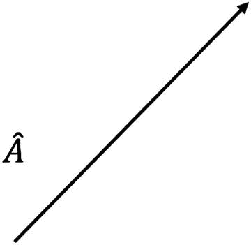

图 1-1

简单向量

如果向量  在三维空间中表示，它看起来就像图 1-2 中所示的那样。这个向量  也可以借助基础向量来表示。

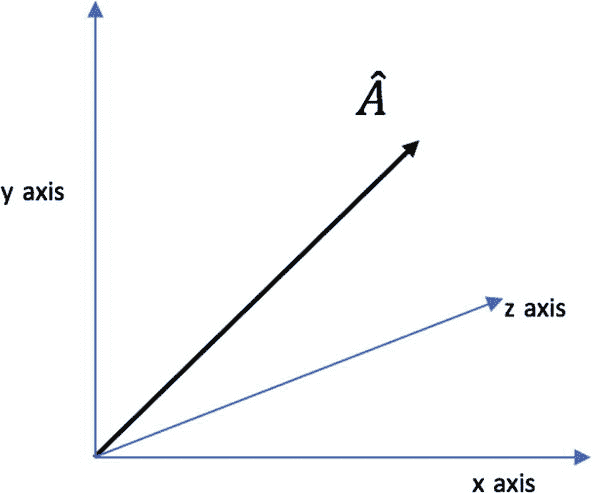

图 1-2

变量类型

基础向量与坐标系相关联，可以用来表示任何向量。这些基础向量的长度为 1，因此也被称为 *单位向量*。这些基础向量的方向由它们的相应坐标决定。例如，对于三维表示，我们有三个基础向量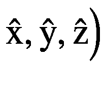，因此将具有 x 轴坐标的方向，而基础向量将具有 y 轴的方向。同样，对于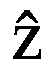也是如此。

一旦有了基向量，我们就可以使用坐标系来找到表示原始向量  的分量。为了简单起见，并且为了更好地理解向量的分量，让我们将坐标系从三维降低到二维。因此，现在向量  看起来就像图 1-3 中所示的那样。

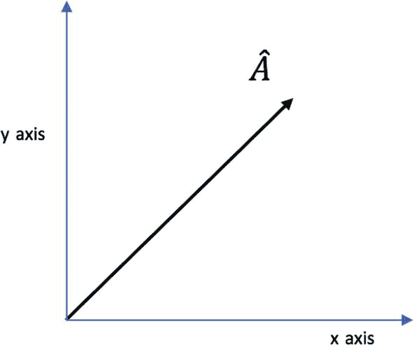

图 1-3

二维视图

要找到向量  在 x 轴上的第一个分量，我们将它投影到 x 轴上，如图 1-4 所示。现在，投影与 x 轴相交的点就是向量的 x 分量，或第一个分量。

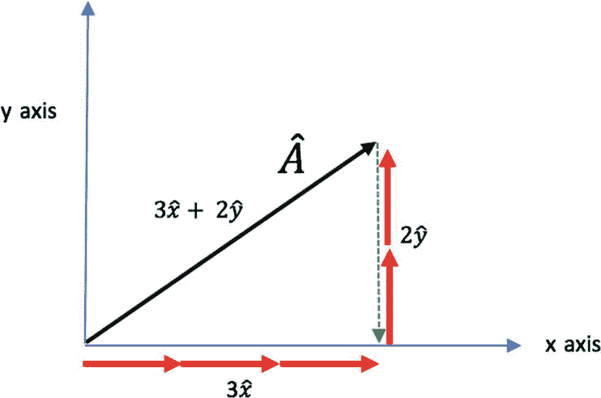

图 1-4

向量大小

如果你仔细观察，可以很容易地识别出这个 x 分量是沿着 x 轴的几个基向量的和。在这种情况下，添加三个基向量将给出向量  的 x 分量。同样，我们可以通过将向量  投影到 y 轴上，并将沿着 y 轴的基向量（2）相加来表示它。简单来说，我们可以将其视为为了到达向量  需要在 x 轴方向和 y 轴方向上移动多少。

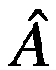 = 3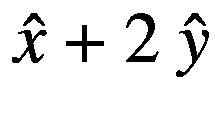

另一个值得注意的事情是，随着向量  和 x 轴之间的角度增加，x 分量会减小，但 y 分量会增加。向量是称为张量的更大类对象的一部分。

如果我们将一个向量与另一个向量相乘，得到的结果是一个标量量，而如果我们用一个向量乘以一个标量值，它只是在相同比例下增加或减少其大小，而不会改变其方向。然而，如果我们用一个向量乘以一个张量，它将得到一个新的向量，其大小和方向都会改变。

## 张量

最后，张量也是一个数学实体，用于表示不同的属性，类似于标量、向量或矩阵。确实，张量是标量或向量的推广。简而言之，张量是多维数组，具有一些动态属性。向量是一维张量，而二维张量是矩阵（如图 1-5 所示）。

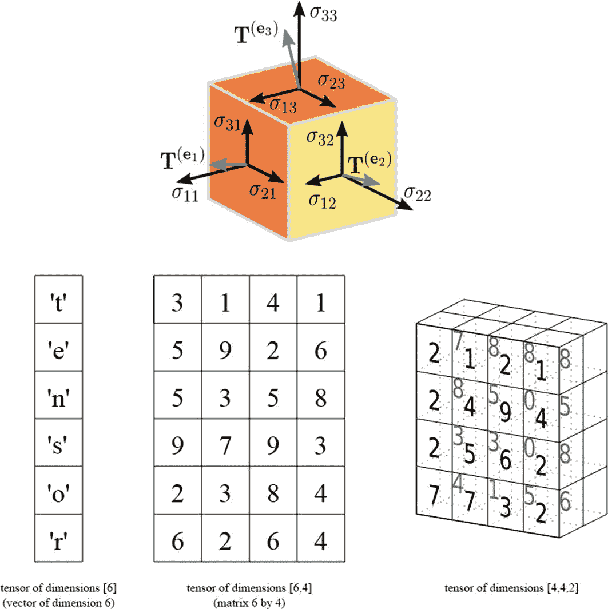

图 1-5

张量

张量可以是两种类型：常量或变量。

### 秩

张量的秩有时会让人困惑，但从张量的角度来看，秩仅仅表示描述对象属性所需的方向数，意味着张量本身包含的数组的维度。对不同对象进行分解，标量没有方向，因此自动成为 0 秩张量，而向量，只能用一个方向来描述，成为一秩张量。下一个对象，即矩阵，需要两个方向来描述，成为二秩张量。

### 形状

张量的形状表示每个维度中的值数。

+   标量—32：张量的形状将是 []。

+   向量—[3, 4, 5]：一秩张量的形状将是 [3]。

+   矩阵 = 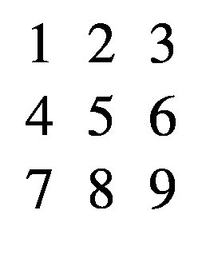：第二秩张量的形状将是 [3, 3]。

### 流

接下来是 TensorFlow 的第二部分：流。这基本上是一个底层图计算框架，它使用张量进行执行。一个典型的图由两个实体组成：节点和边，如图 1-6 所示。节点也被称为顶点。

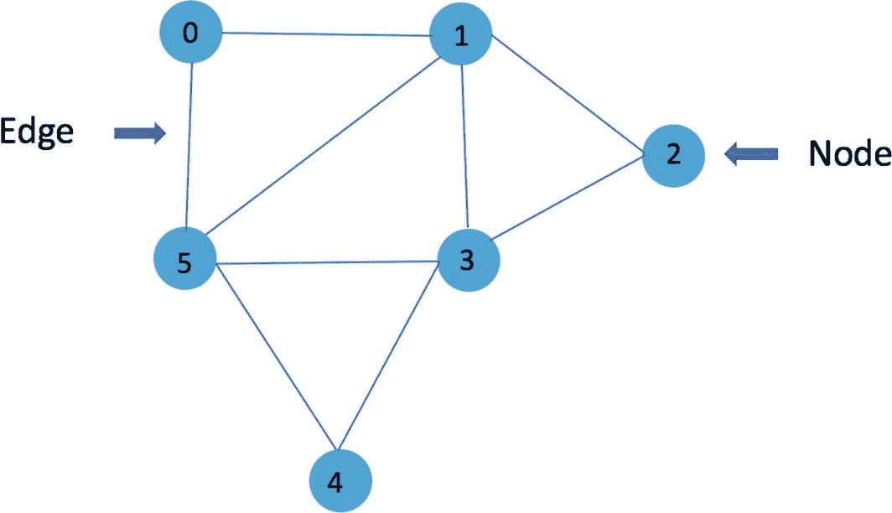

图 1-6

典型图

边实际上是节点/顶点之间的连接，数据通过这些连接流动，而节点是实际计算发生的地方。现在，一般来说，图可以是循环的或非循环的，但在 TensorFlow 中，它始终是非循环的。它不能从同一个节点开始和结束。让我们考虑一个简单的计算图，如图 1-7 所示，并探讨其一些属性。

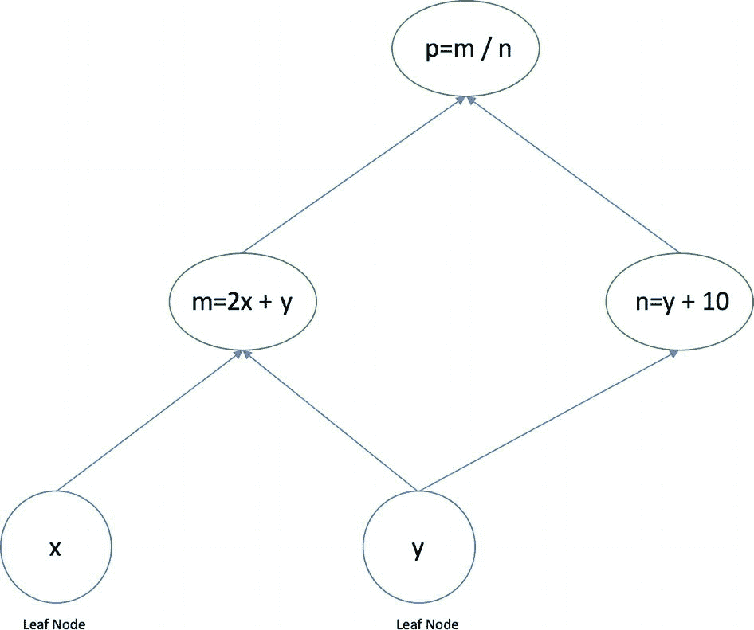

图 1-7

计算图

图中的节点表示某种计算，例如加法、乘法、除法等，除了叶节点，叶节点包含实际的操作张量，这些张量可以是常量值或变量值。这些张量通过节点之间的边或连接流动，下一个节点的计算结果将形成一个新的张量。因此，在示例图中，通过使用其他张量 x 和 y 在节点上进行计算，创建了一个新的张量`m`。在这个图中需要关注的是，计算仅在叶节点之后的下一个阶段进行，因为叶节点只能是简单的张量，它们成为通过边流动到下一个节点计算输入。我们也可以通过分层结构表示每个节点的计算。同一级别的节点可以并行执行，因为它们之间没有相互依赖。在这种情况下，`m`和`n`可以同时并行计算。`graph`的这个属性有助于以分布式方式执行计算图，这使得 TensorFlow 可以用于大规模应用。

## TensorFlow 1.0 与 TensorFlow 2.0

尽管 TensorFlow 在开源后得到了 IT 社区的广泛采用，但在用户友好性方面仍然存在很多差距。用户发现编写基于 TensorFlow 的代码有些困难。因此，开发者和研究社区对 TensorFlow 的一些方面提出了很多批评反馈。因此，TensorFlow 核心开发团队开始采纳这些建议的变更，使产品更易于使用且更有效。本节回顾了已纳入 TensorFlow 2.0 测试版中的那些变更。TensorFlow 2.0 中引入了主要分为三个广泛的变更类别。

1.  与可用性相关的修改

1.  与性能相关的修改

1.  与部署相关的修改

在本章中，我们将仅关注前两个类别，因为第六章涵盖了 TensorFlow 模型部署。

### 可用性相关变更

变更的第一个类别主要关注 TensorFlow 的易用性和更一致的 API。为了详细说明这些变更，我们根据三个广泛的类型进一步将这些变更进行了子分类。

1.  简化的 API

1.  改进的文档

1.  更多的内置数据源

#### 简化的 API

用户对 TensorFlow 最常见的一项批评是其 API 不够友好，因此 TensorFlow 2.0 的一个主要焦点是彻底重写其 API。现在，TensorFlow 2.0 提供了两个级别的 API：

1.  高级 API

1.  低级 API

##### 高级 API

高级 API 使得使用 TensorFlow 进行各种应用更加容易，因为这些 API 在本质上更加直观。这些新的高级 API 使得调试相对于早期版本来说相对容易。由于 TensorFlow 1.0 是基于图控制的，用户无法轻松地调试他们的程序。现在 TensorFlow 2.0 引入了情境执行，它立即执行操作并返回输出。

##### 低级 API

另一套可用的 API 是低级 API，它为用户提供更多灵活性和配置能力，以便根据他们的特定要求定义和参数化模型。

###### 会话执行

使用过 TensorFlow 早期版本的读者可能已经经历过传统的程序执行过程，即会话执行，以获得一个操作图，这通常包括以下步骤：

1.  首先，创建`tf.Graph`对象并将其设置为当前作用域的默认图。

1.  在 TensorFlow 中声明计算部分：`c=tf.matmul(m,n)`。

1.  根据需要定义变量共享和作用域。

1.  创建并配置`tf.Session`以构建图并连接到`tf.Session`。

1.  提前初始化所有变量。

1.  使用`tf.Session.run`方法启动计算。

1.  然后`tf.Session.run`触发一个计算最终输出的过程。

###### 情境执行

在情境执行中，TensorFlow 2.0 采用了一种根本不同的方法，并消除了执行大多数先前步骤的需要。

1.  TensorFlow 2.0 不需要图定义。

1.  TensorFlow 2.0 不需要会话执行。

1.  TensorFlow 2.0 不强制要求初始化变量。

1.  TensorFlow 2.0 不需要通过作用域进行变量共享。

为了详细了解这些差异，让我们通过 TensorFlow 1.0 与 TensorFlow 2.0 的例子来进行分析。

```py
[In]: import tensorflow as tf
[In]: tfs=tf.InteractiveSession()
[In]: c1=tf.constant(10,name='x')
[In]: print(c1)
[Out]: Tensor("x:0", shape=(), dtype=int32)
[In]: tfs.run(c1)
[Out]: 10
```

导入 TensorFlow 的新版本。

```py
[In]: ! pip install -q tensorflow==2.0.0-beta1
[In]: import tensorflow as tf
[In]: print(tf.__version__)
[Out]: 2.0.0-beta1
[In]: c_1=tf.constant(10)
[In]: print(c_1)
[Out]: tf.Tensor(10, shape=(), dtype=int32)
# Operations
```

**TensorFlow 1.0**

```py
[In]: c2=tf.constant(5.0,name='y')
[In]: c3=tf.constant(7.0,tf.float32,name='z')
[In]: op1=tf.add(c2,c3)
[In]: op2=tf.multiply(c2,c3)
[In]: tfs.run(op2)
[Out]: 35.0
[In]: tfs.run(op1)
[Out]: 12.0
```

**TensorFlow 2.0**

```py
[In]:c2= tf.constant(5.0)
[In]:c3= tf.constant(7.0)
[In]: op_1=tf.add(c2,c3)
[In]: print(op_1)
[Out]: tf.Tensor(12.0, shape=(), dtype=float32)
[In]: op_2=tf.multiply(c2,c3)
[In]: print(op_2)
[Out]: tf.Tensor(35.0, shape=(), dtype=float32)
```

**TensorFlow 1.0**

```py
g = tf.Graph()
with g.as_default():
a = tf.constant([[10,10],[11.,1.]])
x = tf.constant([[1.,0.],[0.,1.]])
b = tf.Variable(12.)
y = tf.matmul(a, x) + b
init_op = tf.global_variables_initializer()
with tf.Session() as sess:
sess.run(init_op)
print(sess.run(y))
```

**TensorFlow 2.0**

```py
a = tf.constant([[10,10],[11.,1.]])
x = tf.constant([[1.,0.],[0.,1.]])
b = tf.Variable(12.)
y = tf.matmul(a, x) + b
print(y.numpy())
```

### 注意

在 TensorFlow 1.0 的图执行中，程序状态（如变量）存储在全局集合中，其生命周期由`tf.Session`对象管理。相比之下，在情境执行期间，状态对象的生命周期由相应的 Python 对象的生命周期决定。

##### tf.function

TensorFlow 2.0 的另一个强大功能是其`tf.function`能力，它将相关的 Python 代码转换为强大的 TensorFlow 图。它结合了情境执行的灵活性和图计算的强度。正如之前提到的，TensorFlow 2.0 不需要创建`tf.session`对象。相反，简单的 Python 函数可以通过`tf.function`装饰器转换为图。简单来说，为了在 TensorFlow 2.0 中定义一个图，我们必须定义一个 Python 函数，并用`@tf.function`装饰器进行装饰。

##### Keras

`tf.keras` 最初是为小型模型设计的，因为它有非常简单的 API，但它并不可扩展。TensorFlow 还引入了估计器，这些估计器是为扩展机器学习模型的缩放和分布式训练而设计的。估计器具有巨大的优势，因为它们在分布式环境中提供了容错训练，但其 API 并不非常用户友好，常常被认为令人困惑且难以理解。因此，TensorFlow 2.0 引入了 `tf.keras` 的标准化版本，它结合了 Keras 的简单性和估计器的强大功能。

TensorFlow 版本 1.13 和 2.0 中的 `tf.keras` 代码保持不变，但底层的变化是 Keras 与 TensorFlow 2.0 的新功能的集成。为了详细说明，如果在版本 1.13 中使用 `tf.keras` 运行特定的代码片段，它将构建一个基于图的模型，在后台运行一个会话，这是我们通过代码启动的。在版本 2.0 中，相同的模型定义将以即时模式运行，无需任何修改。

与早期基于图的执行相比，使用即时模式更容易调试代码。在即时模式中，数据集管道的行为与 NumPy 数组的行为完全相同，但 TensorFlow 以最佳方式处理优化。图仍然是 TensorFlow 的重要组成部分，但在后台运行。

##### 冗余

来自社区的关于 TensorFlow 使用的另一个有用反馈是，存在太多的冗余组件，在使用它们的不同地方时造成了混淆。例如，在构建模型时，人们必须从多个优化器和层中进行选择。TensorFlow 2.0 已经移除了所有冗余元素，现在只提供一套优化器、指标、损失和层。重复的类也已被减少，使用户更容易确定使用什么以及何时使用。

#### 改进的文档和更多内置数据源

[TensorFlow.org](http://tensorflow.org) 现在包含更多详尽和详细的 TensorFlow 文档。这对于用户来说至关重要，因为早期版本提供的示例和教程有限。新文档包括许多新的数据源（从小到大数据源），供用户在其程序或学习目的中使用。新的 API 也使得在 TensorFlow 中导入任何新的数据源变得非常容易。TensorFlow 内部提供的一些来自不同领域的数据集如表 1-1 所示。

表 1-1

TensorFlow 2.0 内部的数据集

| 序号 | 类别 | 数据集 |
| --- | --- | --- |
| 1 | 文本 | `imdb_reviews`, `squad` |
| 2 | 图像 | `mnist`, `imagenet2012` , `coco2014`, `cifar10` |
| 3 | 视频 | `moving_mnist`, `starcraft_video`, `bair_robot_pushing_small` |
| 4 | 音频 | `Nsynth` |
| 5 | 结构化 | `titanic`, `iris` |

### 性能相关更改

TensorFlow 的开发团队还声称，新的更改在产品性能上超过了早期版本。基于使用不同处理器（GPU、TPU）进行训练和推理的结果，似乎 TensorFlow 的速度平均提高了两倍。

## TensorFlow 2.0 的安装和基本操作

我们可以使用多种方式来使用 TensorFlow（本地以及云端）。在本节中，我们将介绍 TensorFlow 2.0 在本地以及云端使用的两种方式。

1.  Anaconda

1.  Colab

1.  Databricks

### Anaconda

这是本地系统上使用 TensorFlow 的最简单方式。我们可以按照以下方式使用`pip`安装 TensorFlow 的最新版本：

```py
[In]: pip install -q tensorflow==2.0.0-beta1
```

### Colab

由 Google 的 TensorFlow 团队提供的最方便使用 TensorFlow 的方式是 Colab。简称*Colaboratory*，这代表了协作和在线实验室的理念。这是一个免费的基于 Jupyter 的 Web 环境，无需设置，因为它包含了预先构建的所有依赖项。它提供了一个简单方便的方式，让用户可以在浏览器中编写 TensorFlow 代码，无需担心任何安装和依赖问题。让我们来看一下如何使用 Google Colab 进行 TensorFlow 2.0 的步骤。

1.  前往[`https://colab.research.google.com`](https://colab.research.google.com)。您会看到控制台有多个选项，如图 1-8 所示。

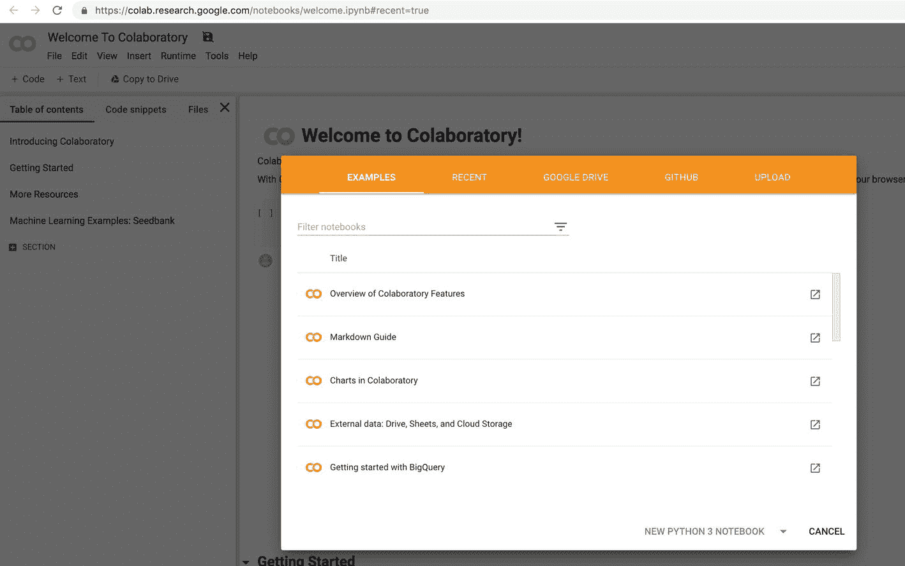

图 1-8

Python Notebook Colaboratory (Colab)控制台

1.  从控制台选择相关选项，其中包含以下五个标签：

    1.  示例。显示 Colab 中提供的默认笔记本

    1.  最近。用户最近工作的几个笔记本

    1.  Google Drive. 链接到用户 Google Drive 账户的笔记本

    1.  GitHub. 允许链接用户 GitHub 账户中现有的笔记本

    1.  上传。上传新的`ipynb`或`github`文件选项

1.  点击“新建 Python 3 笔记本”，一个新的 Colab 笔记本就会出现，如图 1-9 所示。

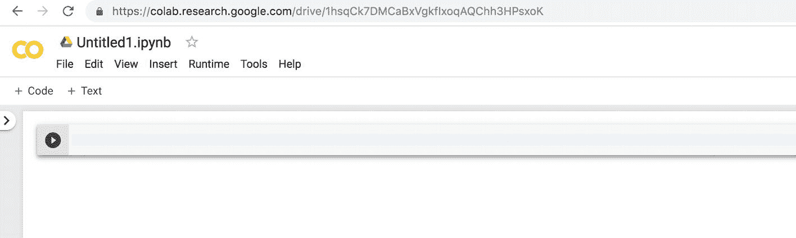

图 1-9

新笔记本

1.  安装并导入 TensorFlow 2.0（Beta）。

```py
[In]:! pip install -q tensorflow==2.0.0-beta1
[In]: import tensorflow as tf
[In]: print(tf.__version__)
[Out]: 2.0.0-beta1
```

使用 Colab 的另一个巨大优势是，它允许您在后台使用 GPU 构建模型，使用 Keras、TensorFlow 和 PyTorch。它还提供 12GB RAM，使用时间可达 12 小时。

### Databricks

使用 TensorFlow 的另一种方式是通过 Databricks 平台。以下展示了在 Databricks 上安装 TensorFlow 的方法，使用的是社区版账户，但同样的步骤也可以用于商业账户的使用。第一步是登录到 Databricks 账户并启动一个所需大小的集群（图 1-10–1-12）。

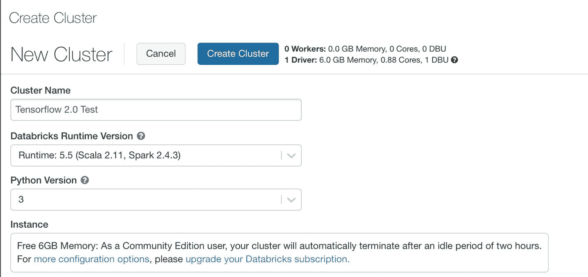

图 1-12

集群设置

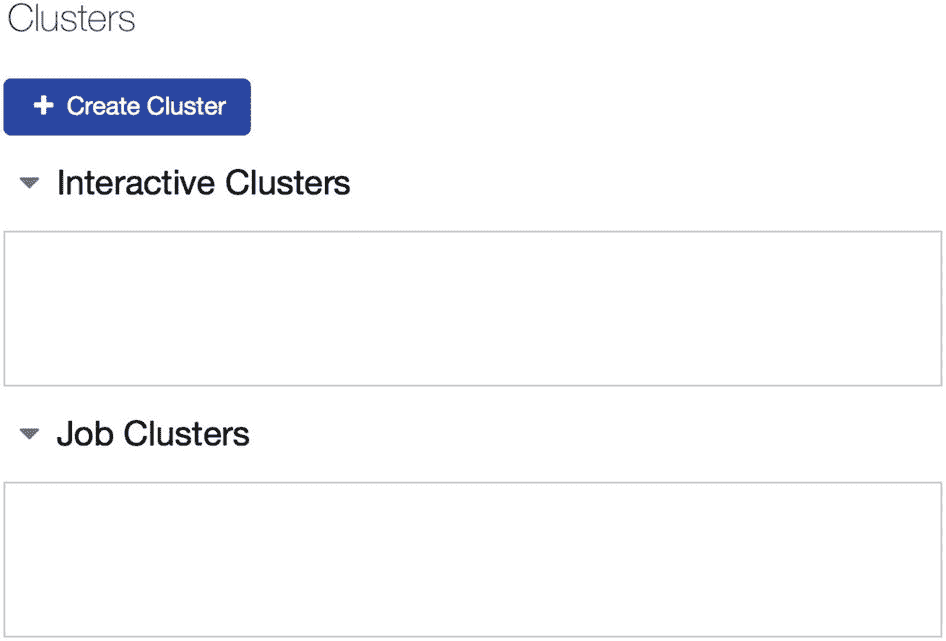

图 1-11

集群

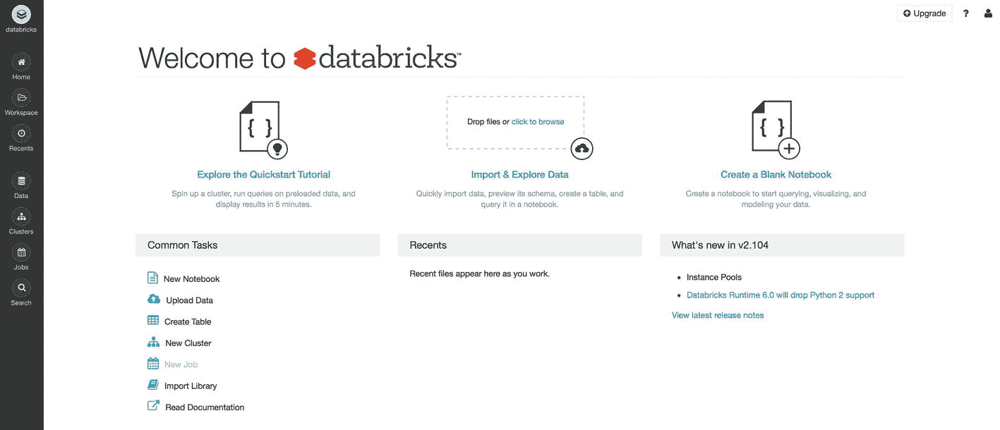

图 1-10

Databricks

一旦集群启动并运行，我们通过操作选项进入集群的库选项，如图 1-13 所示。

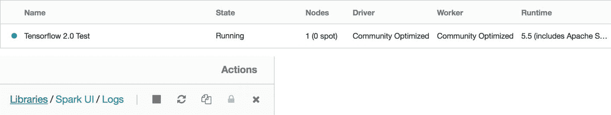

图 1-13

集群库

在库选项卡中，如果集群已经预装了一套库，它们将被列出；或者，如果是新集群，则不会安装任何包。然后我们点击“安装新包”按钮（如图 1-14）。

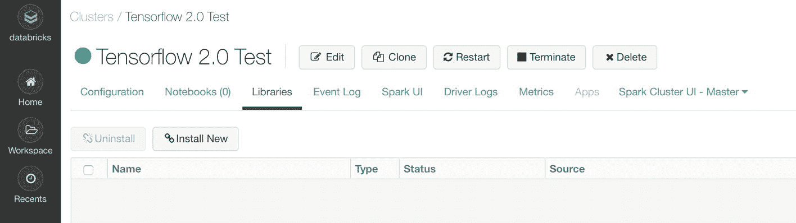

图 1-14

安装新库

这将打开一个新窗口，其中包含多个选项，用于在 Databricks 中导入或安装新的库（如图 1-15）。我们选择 PyPI，并在包选项中说明要安装的 TensorFlow 所需的版本，如图 1-16 所示。

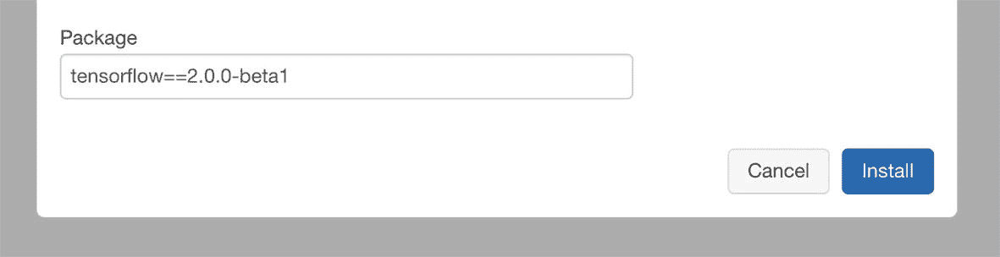

图 1-16

TensorFlow 包

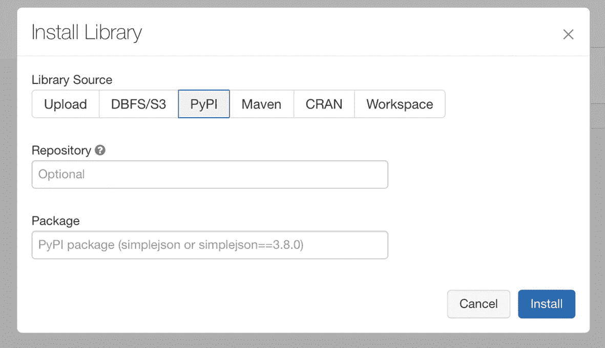

图 1-15

PyPI 源

这将需要一些时间，然后我们可以在 Databricks 的库中看到 TensorFlow 成功安装。现在我们可以使用相同的集群打开一个新的或现有的笔记本（如图 1-17 和 1-18）。

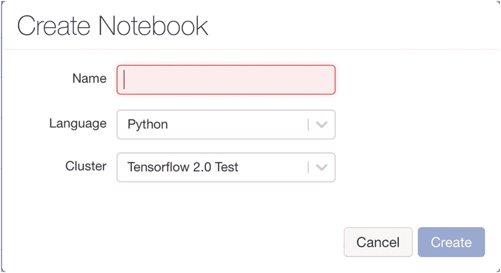

图 1-18

新笔记本

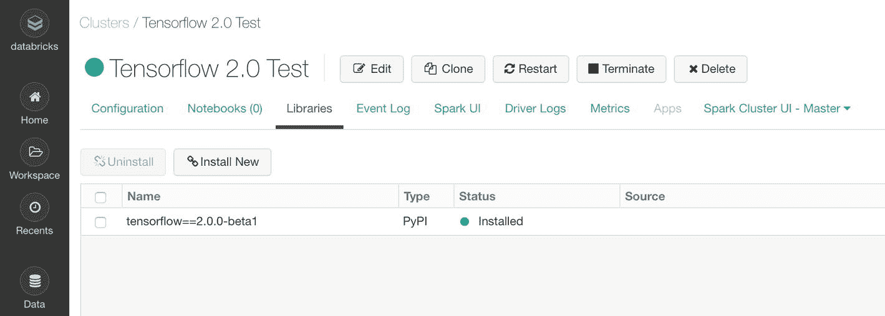

图 1-17

运行集群

最后一步是在笔记本中导入 TensorFlow 并验证版本。我们可以打印 TensorFlow 版本，如图 1-19 所示。

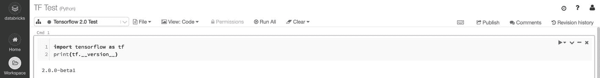

图 1-19

TensorFlow 笔记本

## 结论

在本章中，我们解释了向量和张量之间的基本区别。我们还涵盖了 TensorFlow 旧版本和新版本之间的主要区别。最后，我们介绍了在本地以及云环境中（使用 Databricks）安装 TensorFlow 的过程。
