# 5. 使用 TensorFlow 2.0 进行自然语言处理

本章主要关注自然语言处理（NLP）的一些方面，使用 TensorFlow 2.0。NLP 本身就是一个复杂的领域，开源社区为用户提供了多种工具和技术。本章主要分为三个部分。第一部分简要介绍了 NLP 和 TensorFlow 2.0 中文本处理的基本构建块。在第二部分，我们讨论了词嵌入以及如何使用它们来检测单词的语义意义。在最后一部分，我们将构建一个深度神经网络，以预测用户评论的情感。我们还将使用 TensorFlow Projector 绘制词嵌入，并在三维空间中查看它们。

## NLP 概述

自然语言处理（NLP）是一个庞大的领域，我们将简要介绍在过去几十年中发生的一些基本转变。NLP 研究可以追溯到 20 世纪 50 年代，当时人们开始着手解决与语言翻译相关的问题。自那时起，它不断发展，我们正在见证这一研究领域的突破性工作。如果我们考虑这种演变的历程，我们可以参考论文“跳跃 NLP 曲线”（Cambria and White，2014）中提到的 NLP 曲线图，如图 5-1 所示。

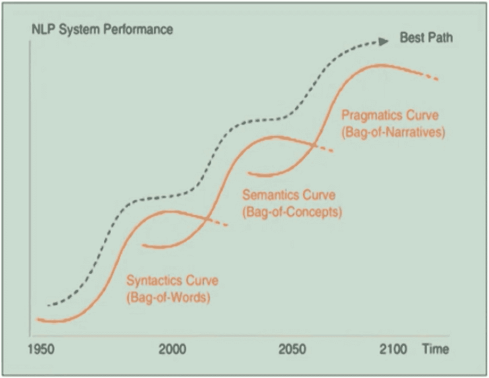

图 5-1

NLP 曲线

我们从句法层开始，这里的重点是分解文本为更小的部分。进行了诸如词性标注（POS）、分块和词形还原等技术，以使整体文本达到更理想的形式。这就是所谓的“词袋”方法。慢慢地，我们逐渐进入了被称为第二层——语义曲线。在这一层，所有的工作都是关于提取文本的意义。它使用不同的技术来找出文本中单词的概念和意义。它帮助我们从简单地使用文本作为符号，实际上使用它们在整体文本中的意义和相关性。这一阶段也被称为“概念袋”模型。NLP 曲线时间线的最后和第三阶段是语用曲线，它超越了文本的意义，而是处理上下文信息。它追求解码讽刺、理解极性的深层方面以及人格识别的能力。研究人员已经在这一方向上工作，以实现这一阶段。这涉及到与文本和计算机相关的许多组件。事实上，NLP 是语言学和计算机交叉的部分。

文本数据占全球生成数据的很大比例。因此，它提供了一个令人难以置信的平台，可以以许多其他方式使用。在文本数据方面，最具影响力的用例之一是根据人们写的评论来识别与特定品牌相关的观点。它帮助企业在市场上重新调整其策略，以管理其品牌价值。属于文本类别的监督学习问题可以广泛地识别为

+   评论/文本分类

+   文本摘要（新闻、博客、期刊）

+   垃圾邮件检测

+   社交媒体平台上的受众细分

+   聊天机器人

在本章中，我们将重点关注文本分类类型。

## 文本预处理

文本数据可以是结构化或非结构化的形式。大多数时候，我们必须在将其用于之前应用某些清理和转换技术来预处理文本数据。在本节中，我们将通过使用 TensorFlow 查看一些处理文本数据的技术。

### 分词

在文本数据上使用的第一种技术被称为分词。标记代表文本中出现的单个单词/符号/数字。例如，如果我们有一个简单的文本，并且我们想要对其应用分词，我们可以简单地创建一个分词实例并应用它，如下所示。

```py
[In]: sample_text=['This is a chapter on text processing using tf','Text processing requires careful handling']
[In]: from tensorflow.keras.preprocessing.text import Tokenizer
[In]: tokenizer=Tokenizer()
[In]: tokenizer.fit_on_texts(sample_text)
```

分词器收集文本中出现的所有不同单词，并为每个单词分配一个标签。它还会以这种方式分配标签，即初始值分配给高频标记。我们可以通过检查样本中出现的单词频率来验证这一点。要查看每个标记的标签，我们可以在分词文本上调用`word_index`。

```py
[In]: word_dict=tokenizer.word_index
[In]: print(word_dict)
[Out]:
{'text': 1, 'processing': 2, 'this': 3, 'is': 4, 'a': 5, 'chapter': 6, 'on': 7, 'using': 8, 'tf': 9, 'requires': 10, 'careful': 11, 'handling': 12}
```

分词器在后台进行大量工作，通过处理重复/相似单词、删除标点符号并将字母转换为小写。例如，如果文本中出现 tf 和 tf!，分词器会通过在后台删除“!”将两者视为相同的标记。

```py
[In]: sample_edit_text=['This is a chapter on text processing using tf','Text processing requires careful handling','tf!']
[In]: tokenizer=Tokenizer()
[In]: tokenizer.fit_on_texts(sample_edit_text)
[In]: word_dict=tokenizer.word_index
[In]: print(word_dict)
[Out]:
{'text': 1, 'processing': 2, 'tf': 3, 'this': 4, 'is': 5, 'a': 6, 'chapter': 7, 'on': 8, 'using': 9, 'requires': 10, 'careful': 11, 'handling': 12}
```

到目前为止，我们已经看到了分配给这些标记的标签，但最终我们处理的是句子，即单词的集合。因此，我们必须以某种方式将这些单个标签组合起来，以数值形式表示整个句子。将单词序列转换为数值形式的最基本方法之一就是简单地在整个文本句子上应用文本到序列的功能。

```py
[In]: seq=tokenizer.texts_to_sequences(sample_edit_text)
[In]: print(seq)
[Out]:
[[4, 5, 6, 7, 8, 1, 2, 9, 3], [1, 2, 10, 11, 12], [3]]
```

如我们所见，我们得到了三个不同的数组，分别代表`sample_edit_text`中的单个句子。尽管我们达到了目标，但在这个表示中仍然存在一些差距。一个是每个数组长度不同，这在将这些向量用于任何类型的机器学习模型训练时可能是一个潜在问题。为了处理数组的长度差异，我们可以利用一种称为填充的技术。通过在向量的开始或末尾填充 0 的值，将不同长度的向量转换为相同长度的向量。

```py
[In]: from tensorflow.keras.preprocessing.sequence import pad_sequences
[In]: padded_seq=pad_sequences(seq,padding='post')
[In]: print(padded_seq)
[Out]:
[[ 4  5  6  7  8  1  2  9  3]
[ 1  2 10 11 12  0  0  0  0]
[ 3  0  0  0  0  0  0  0  0]]
```

现在，我们剩下三个长度相等的向量。

### 词嵌入

我们已经看到了将句子中的一组词以数值形式表示的方法，使用标签和填充技术。除了在数值形式表示文本之外，还有一些更简单和更复杂的方法。我们可以基本上将它们分为两大类：

1.  基于频率

1.  基于预测

基于频率的技术包括矢量器、tf-idf 和哈希矢量器，而基于预测的技术包括 CBOW（连续词袋）和 Skip-Gram 模型。我们不会深入探讨这些方法的细节，因为有关这些方法的足够文章和信息在各种平台上都可以找到。本节的想法是使用我们输入数据集中的词嵌入并使用 TensorFlow Projector 进行可视化。但在我们开始构建模型之前，让我们简要讨论一下嵌入的确切含义。

嵌入再次是文本信息的数值表示，但与其它方法相比，它们更强大、更相关。嵌入实际上是一个浅层神经网络隐藏层的权重，该网络是在某个特定文本集上训练的。我们可以根据需要决定这些嵌入的大小（50、100 或更多），但这里要记住的关键点是，基于不同的训练数据，相同的文本的嵌入值可能不同。词嵌入提供的核心优势是它捕捉了词的语义意义，因为它使用了分布式表示的概念。它根据与该词相似的其他词来预测这些嵌入值。因此，在特定词和其他相似词之间存在一定程度上的依赖性或相似性。我们将在本章后面看到，相似词往往在高维表示中具有彼此更接近的嵌入。有一些标准的现成方法可用于计算词嵌入，包括以下几种：

+   Word2Vec（由谷歌开发）

+   GloVe（由斯坦福大学开发）

+   fastText（由 Facebook 开发）

## 使用 TensorFlow 进行文本分类

在本节中，我们将构建一个深度神经网络来预测消费者评论的情感（正面或负面）。构建这个网络的想法不是关注其准确性，而是处理文本分类在 TensorFlow 2.0 中的过程以及词嵌入的可视化。我们将用于这个任务的数据库是人们关于亚马逊网站上产品的评论摘要。我们将使用摘要信息而不是整个评论。数据集包含在这本书的代码包中。我们首先导入所需的库并读取数据集。

```py
[In]: import pandas as pd
[In]: import numpy as np
[In]: df=pd.read_csv('product_reviews_dataset.csv',encoding= "ISO-8859-1")
[In]: df.columns
[Out]: Index(['Sentiment', 'Summary'], dtype="object")
[In]: df.head(10)
[Out]:
```

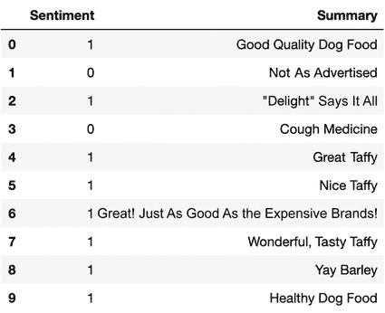

```py
[In]: df.Sentiment.value_counts()
[Out]:
1    486417
0     82037
```

如我们所见，数据框中只有两列（情感，摘要），与负面的摘要（80K）相比，正面的计数在较高的一侧。

### 文本处理

现在我们应用了一些文本清洗技术，使用一个辅助函数。在这个辅助函数中，我们使用正则表达式来移除不需要的符号、字符和数字，将评论设置为标准格式。我们将这个辅助函数应用于数据框的摘要列。

```py
[In]: import re
[In]: def clean_reviews(text):
text=re.sub("[^a-zA-Z]"," ",str(text))
return re.sub("^\d+\s|\s\d+\s|\s\d+$", " ", text)
[In]: df['Summary']=df.Summary.apply(clean_reviews)
[In]: df.head(10)
[Out]:
```


如我们所见，文本看起来现在更干净，并且准备好进行分词。在分词之前，让我们从数据框中创建输入和输出列。如前所述，这个练习的目标不是达到非常高的准确率，而是理解整个过程。因此，我们不会将数据分成训练集和测试集。

```py
[In]: X=df.Summary
[In]: y=df.Sentiment
[In]: tokenizer=Tokenizer(num_words=10000, oov_token="xxxxxxx")
```

在这里，通过应用`tokenizer`，我们确保我们想要考虑的最大词汇量为 10,000 个单词。对于未见过的单词，我们使用默认标记。

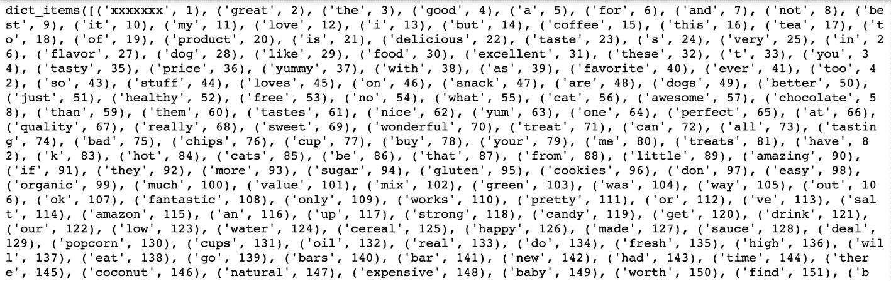

```py
[In]: tokenizer.fit_on_texts(X)
[In]: X_dict=tokenizer.word_index
[In]: len(X_dict)
[Out]: 32763
[In]: X_dict.items()
[Out]:
```

因此，文本中有超过 32,000 个独特的单词。我们现在对整个序列应用分词。

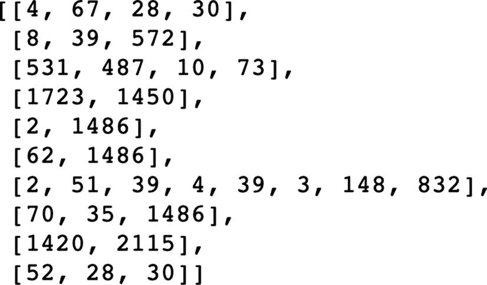

```py
[In]: X_seq=tokenizer.texts_to_sequences(X)
[In]: X_seq[:10]
[Out]:
```

如我们所见，每个摘要都被转换成了一个向量，但长度不同。我们现在应用填充（`post`），使向量的长度相等（`100`）。

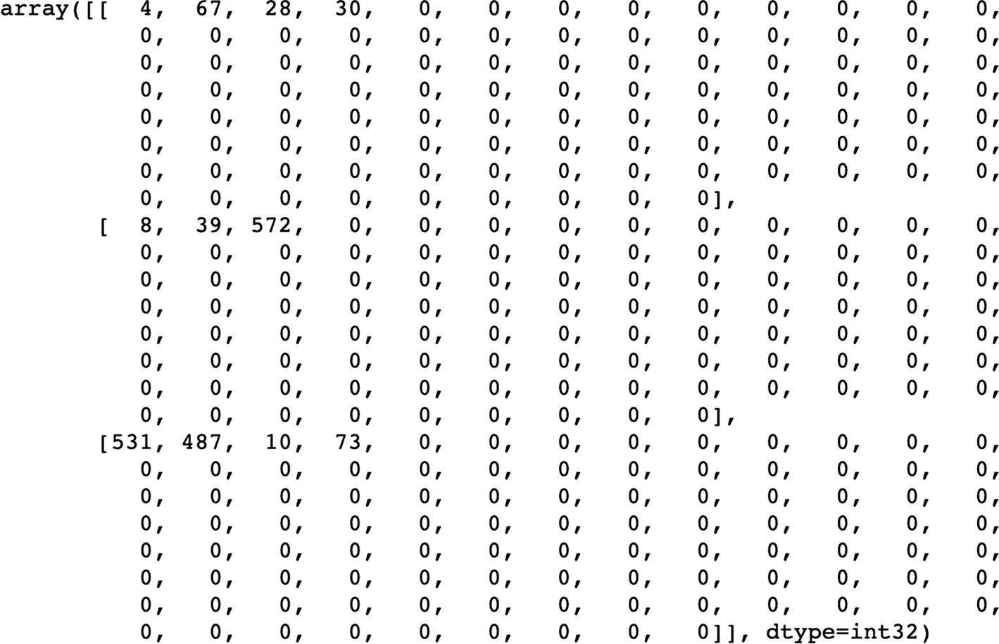

```py
[In]: X_padded_seq=pad_sequences(X_seq,padding='post',maxlen=100)
[In]: X_padded_seq[:3]
[Out]:
```

```py
[In]: X_padded_seq.shape
[Out]: (568454, 100)
```

由于填充，我们最终得到了数据集中每个摘要的数值表示（向量长度为 100）。在我们开始构建模型之前，最后一件事是将目标变量`y`从 Pandas 的序列对象转换为 NumPy 数组。

```py
[In]: type(y)
[Out]: pandas.core.series.Series
[In]: y = np.array(y)
[In]: y=y.flatten()
[In]: y.shape
[Out]: (568454,)
[In]: type(y)
[Out]: numpy.ndarray
```

### 深度学习模型

现在我们可以开始构建深度学习模型了，它将是一个序列类型。我们通过声明`output_dim`为 50 来保持嵌入大小为 50。

```py
[In]: num_epochs = 10
[In]: text_model = tf.keras.Sequential([tf.keras.layers.Embedding(in put_length=100,input_dim=10000,output_dim=50),
tf.keras.layers.Flatten(),
tf.keras.layers.Dense(6, activation="relu"),
tf.keras.layers.Dense(1, activation="sigmoid")
])
[In]: ext_model.compile(loss='binary_crossentropy',optimizer='adam',metrics=['accuracy'])
[In]: text_model.summary()
[Out]:
Model: "sequential_2"
_______________________________________________________________
Layer (type)                 Output Shape              Param #
=================================================================
embedding_2 (Embedding)      (None, 100, 50)           500000
_________________________________________________________________
flatten_2 (Flatten)          (None, 5000)              0
_________________________________________________________________
dense_4 (Dense)              (None, 6)                 30006
_________________________________________________________________
dense_5 (Dense)              (None, 1)                 7
=================================================================
Total params: 530,013
Trainable params: 530,013
Non-trainable params: 0
```

我们现在通过调用 `fit` 方法在输入数据上训练模型。在每个时期，我们见证损失。

```py
[In]: text_model.fit(X_padded_seq,y, epochs=num_epochs)
[Out]:
```

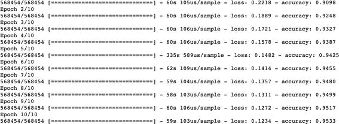

### 嵌入

现在模型已经训练好，我们可以使用 `layers` 函数从模型中提取嵌入。每个嵌入是一个大小为 50 的向量，因为我们总共设置了 10,000 个单词，所以我们有 10,000 个嵌入。

```py
[In]: embeddings = text_model.layers[0]
[In]: embeddings.weights
array([[-1.6631930e-03, -3.1805714e-03, -4.2120423e-03, ...,
6.7197871e-03, -6.8611807e-05,  5.0362763e-03],
[ 2.5697786e-02, -3.3429664e-01,  1.4324448e-01, ...,
2.6591510e-01, -6.1628467e-01,  4.6738818e-01],
[-1.2153953e+00, -5.7287562e-01,  1.3141894e+00, ...,
1.6204183e+00, -8.5191649e-01,  9.6747494e-01],
...,
[-4.6929422e-01, -7.9158318e-01,  1.0746287e+00, ...,
1.3168679e+00, -8.7972450e-01,  7.3542255e-01],
[-6.2262291e-01, -2.9126891e-01,  2.6975635e-01, ...,
5.5762780e-01, -4.7142237e-01,  3.8534114e-01],
[ 3.8236725e-01, -3.2562292e-01,  5.2412951e-01, ...,
8.0270082e-02, -4.5245317e-01,  2.1783772e-01]], dtype=float32)>]
[In]: weights = embeddings.get_weights()[0]
[In]: print(weights.shape)
[Out]:(10000, 50)
```

为了在 3D 空间中可视化嵌入，我们必须反转嵌入及其相应单词的关键值，以便通过其嵌入表示每个单词。为此，我们创建了一个辅助函数。

```py
[In]: index_based_embedding  = dict([(value, key) for (key, value) in X_dict.items()])
[In]: def decode_review(text):
return ' '.join([index_based_embedding.get(i, '?') for i in text])
[In]: index_based_embedding[1]
[Out]:'xxxxxxx'
[In]: index_based_embedding[2]
[Out]:'great'
[In]:weights[1]
[Out]:
array([ 0.02569779, -0.33429664,  0.14324448,  0.08739081, 0.52831393,
0.27268887,  0.07457237,  0.12381076,  0.10957576,  0.06356773,
-0.5458272 , -0.3850583 , -0.61023813,  0.3267659 , -0.1641999 ,
0.35547504,  0.16175786, -0.29544404, -0.29933476, -0.4590062 ,
0.31590942,  0.43237656,  0.32122514,  0.11494219,  0.05063607,
-0.08631186,  0.42692658,  0.44402826, -0.4839747 ,  0.2801508 ,
-0.37493172, -0.24629472,  0.11664449,  0.30983022, -0.08926664,
0.12418804, -0.6622275 , -0.5364327 , -0.03189574, -0.30058974,
-0.22386044, -0.46651962,  0.3162022 , -0.19460349,  0.10765371,
0.46291786, -0.15769395,  0.2659151 , -0.61628467,  0.46738818],
dtype=float32)
```

在这个练习的最后部分，我们提取嵌入值并将其放入一个 `.tsv` 文件中，以及另一个捕获嵌入单词的 `.tsv` 文件。

```py
[In]: vec = io.open('embedding_vectors_new.tsv', 'w', encoding='utf-8')
[In]: meta = io.open('metadata_new.tsv', 'w', encoding='utf-8')
[In]: for i in range(1, vocab_size):
word = index_based_embedding[i]
embedding_vec_values = weights[i]
meta.write(word + "\n")
vec.write('\t'.join([str(x) for x in embedding_vec_values]) + "\n")
meta.close()
vec.close()
```

## TensorFlow Projector

现在我们有了数据集的个别嵌入和元数据，我们可以使用 TensorFlow Projector 在 3D 空间中可视化这些嵌入。为了查看嵌入，我们必须首先访问 [`projector.tensorflow.org/`](https://projector.tensorflow.org/)，如图 5-2 所示。

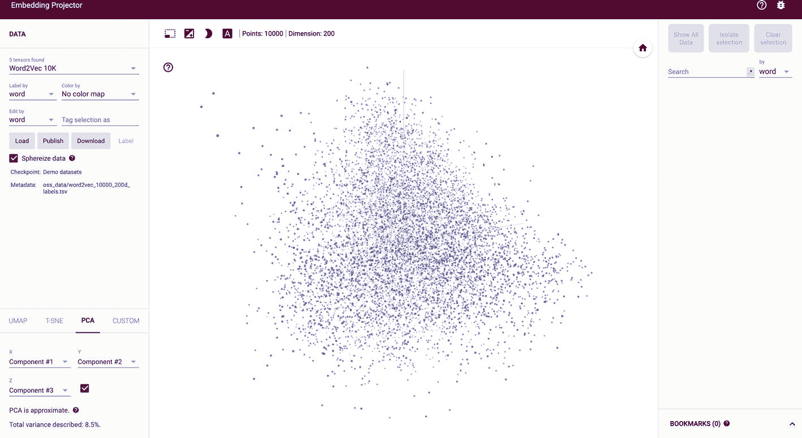

图 5-2

TensorFlow Projector

下一步是将我们在上一节中保存的嵌入和元数据 `.tsv` 文件上传到页面上的加载选项，如图 5-3 所示。

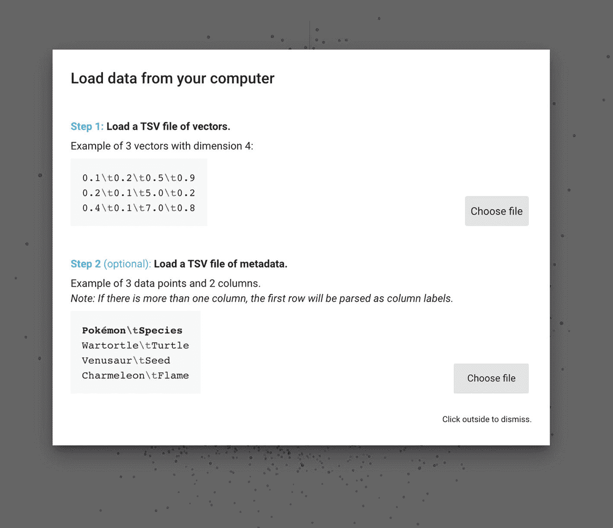

图 5-3

嵌入数据加载

一旦加载，嵌入将在投影仪中可用，我们可以根据每个嵌入的值观察形成的不同集群，如图 5-4 所示。

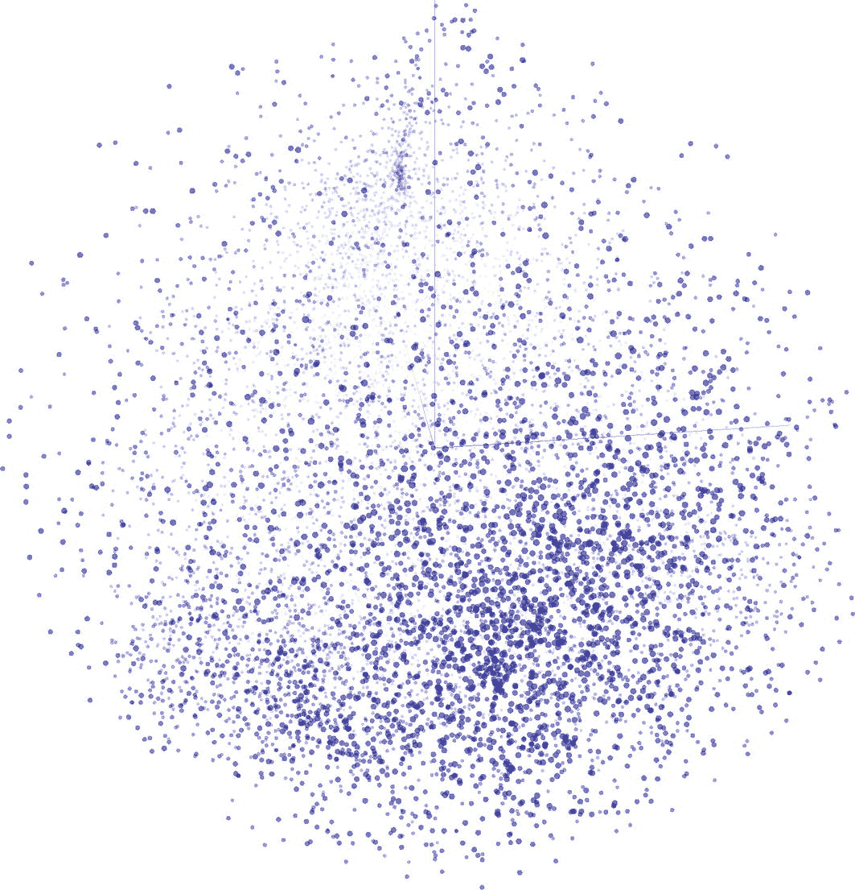

图 5-4

嵌入可视化

我们还可以观察到每个嵌入在整体上下文中的位置。有些是中性的，有些在正面的，有些在中心的负面，如图 5-5 所示。我们现在将确认正面单词嵌入在可视化中是否彼此更近，反之亦然对于负面单词。从逻辑上讲，中性单词应该与这两个集群都分开。

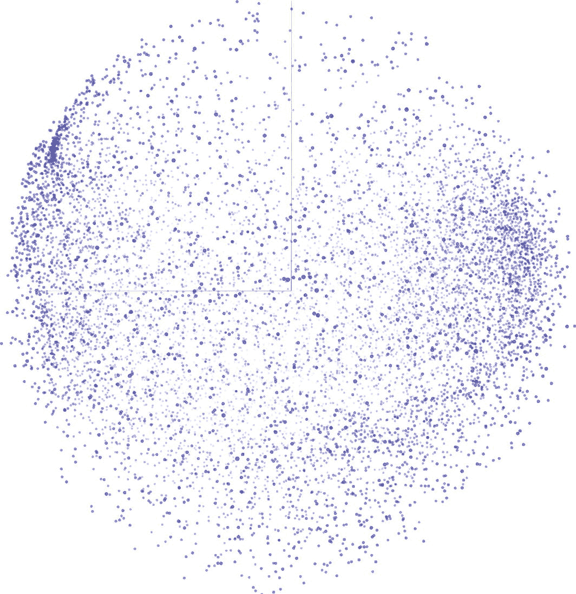

图 5-5

正面、负面和中性嵌入

例如，如果我们观察单词 *like* 的嵌入，我们可以清楚地看到，像 *likeable*、*liked*、*likely* 和 *likes* 这样的相似单词都靠近实际的 like 嵌入，而像 *dislike* 和 *disliked* 这样的反义词则位于组的另一端，如图 5-6 所示。

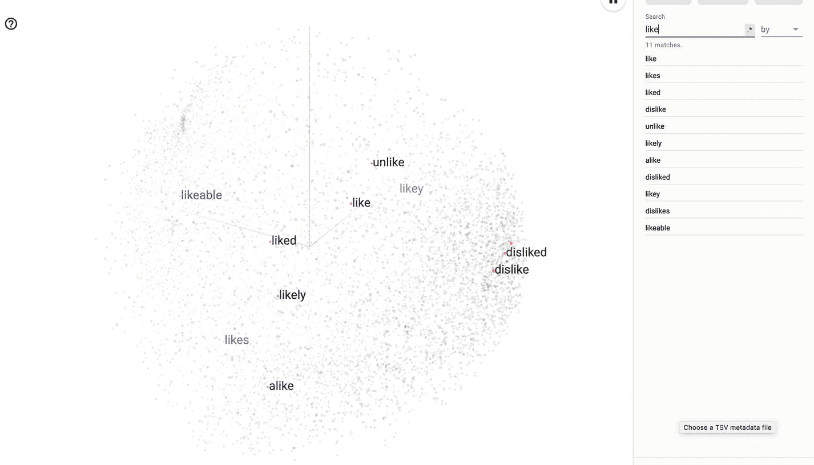

图 5-6

相似嵌入

让我们再考虑一个例子，以验证嵌入是否捕捉了单词的语义意义。我们以“fanta”作为根词来查看嵌入。我们可以清楚地看到，像*fantastic*、*fantabulous*等单词彼此更接近，而像*fantasy*这样的中性词位于中心，如图 5-7 所示。

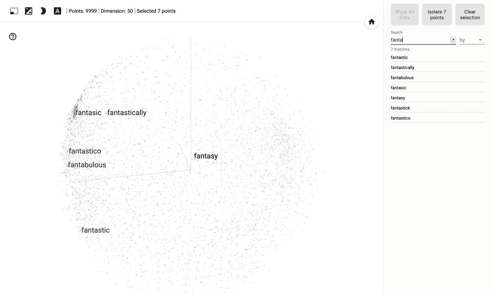

图 5-7

相似嵌入

最后的示例展示了不同嵌入之间的实际距离以及最近的嵌入。如果我们观察嵌入投影中的单词*worse*，我们会看到最近的相似单词是*dangerous*、*lousy*、*poor*、*blah*和*wasted*，如图 5-8 所示。这些单词也聚集在视图的负端。

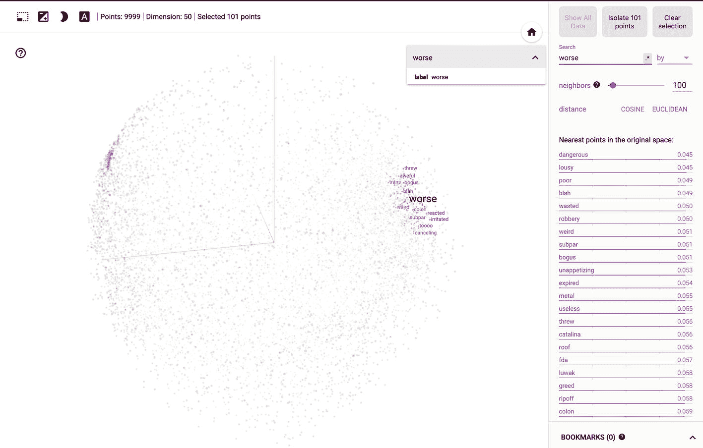

图 5-8

最近的嵌入

## 结论

本章简要介绍了自然语言处理（NLPs）以及使用 TensorFlow 2.0 进行文本预处理的流程。我们构建了一个深度学习模型来对文本情感进行分类，并使用 TensorFlow Projector 可视化了单个嵌入。
