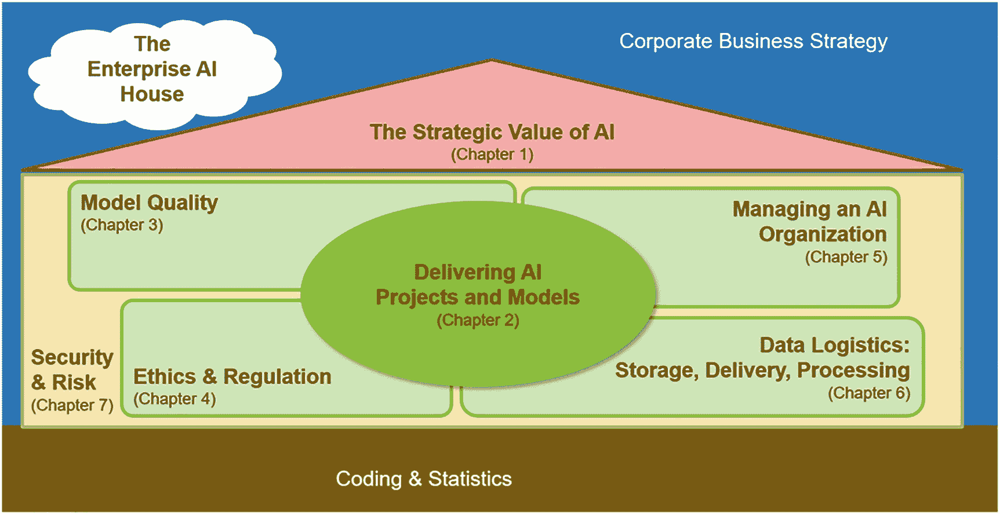

# 引言

人工智能（AI）之于当今时代，正如 19 世纪的西部荒野和 20 世纪 60 年代的月球：是新的前沿。它激励着企业家和商业战略家，是 CEO、CFO 或 COO 们的希望。它吸引着雄心勃勃的工程师和经验丰富的管理者，渴望成为这场伟大革命的一部分。他们都有一个共同点——渴望找到自己独特的角色，贡献自己的经验，助力 AI 计划取得成功。本书为数据科学家、CIO 和高层管理者、敏捷领导者以及项目或项目群管理者铺平道路，助其成功运行人工智能计划。重点既不是光鲜亮丽的企业战略世界，也不是数学世界，而是如何连接这两个世界。本书帮助您管理 AI 交付组织和 AI 运营（机器学习/ML Ops），与高度专业化的数据科学家协作，使您的组织能够提供高层管理和业务战略家所需的 AI 能力，以推动组织转型。它帮助您掌握项目管理、技术管理以及 AI 带来的组织挑战。

与普遍看法相反，挑战并非在于寻找合格的数据科学家。大学在培养他们方面做得很好。挑战在于组建一个团队和组织，在企业环境中交付人工智能解决方案，将这些解决方案集成到 IT 应用架构中，并运行和维护它们。这个领域还很年轻，因此缺乏拥有五年或十年企业经验的人工智能管理者和运营工程师。如今，雄心勃勃的 IT 专业人士有绝佳的机会填补这些角色。如果您想深化关于企业 AI 的知识，即让 AI 在组织中发挥作用所需的所有艰苦工作，本书就是您通往企业人工智能新前沿的钥匙。

本书浓缩了作者在金融行业和 IT 服务提供商超过 15 年的经验，包括担任项目经理、解决方案架构师、核心银行系统顾问、流程工程师、分析产品经理以及信息系统等角色。它是作者花费一年多时间梳理思路并付诸笔端的结果，凝聚了无数个夜晚、清晨和周末，外加几个月的全职研究。最终成果，即您现在阅读的这本书，为以下领域提供了具体知识（图 1）：

* 从战略角度看，组织如何从 AI 中受益？数据驱动型公司的本质是什么——AI 又如何助力？（第 1 章）
* 如何成功交付 AI 项目，涵盖从范围界定到 AI 模型，再到将其集成到整体 IT 架构的方方面面？（第 2 章）
* 哪些质量保证措施有助于验证 AI 模型的准确性及其在整体 IT 架构中的集成？（第 3 章）
* 伦理讨论以及法律法规如何影响 AI 专家的工作？（第 4 章）
* 如何从项目过渡到稳定的服务交付组织和成功的团队？（第 5 章）

**图 1** 企业 AI 之屋：构建 AI 世界——以及本书的结构

* 有哪些技术选项可以存储数据，并将数据提供给数据科学家的训练环境或生产系统？（第 6 章）
* 组织如何保护数据、信息、AI 模型和系统环境？这些都是宝贵的资产。保护它们至关重要。（第 7 章）

本书并非讨论所有现有的理论构想、学术文献、各种思想流派、统计或数学算法，并堆砌脚注和参考文献，而是汇编并呈现概念和最佳实践，引导管理者做出最关键的决策。它有助于构建和组织工作，并确保您的计划始终在正轨上。目标始终是通过提供读者在其他地方不易获得的信息，帮助他们在职业生涯中脱颖而出。

在本引言结束时，祝您阅读愉快，灵感迸发。恭喜您踏上通往企业 AI 新前沿的旅程。我期待您的反馈，了解您和您的组织如何基于我在本书中分享的知识取得成功并进一步成长。

