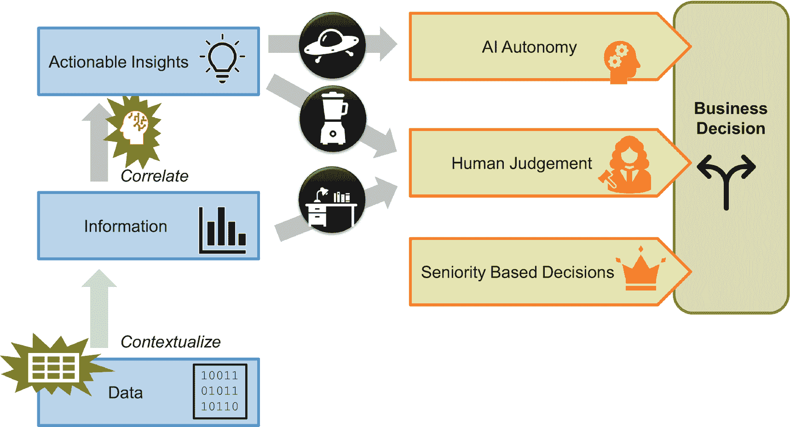
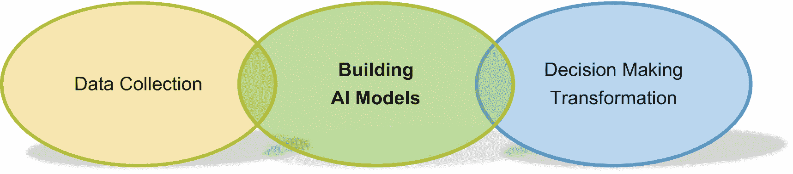
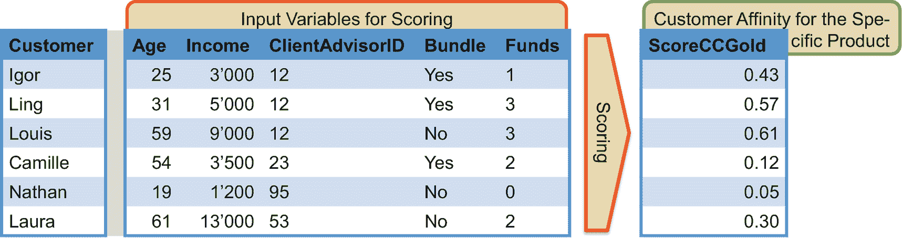
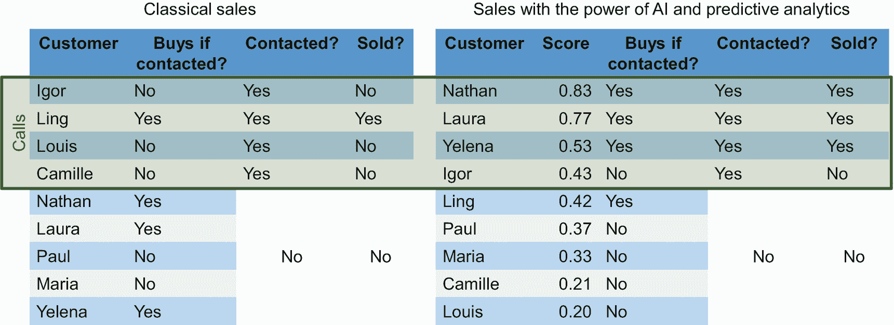
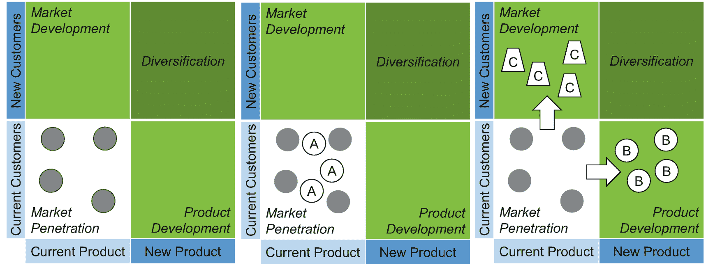
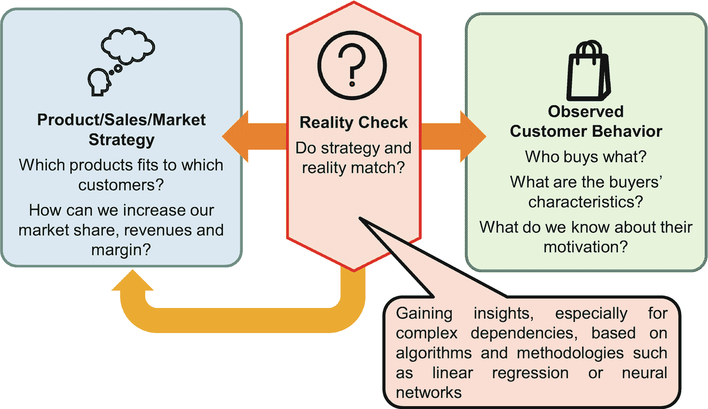
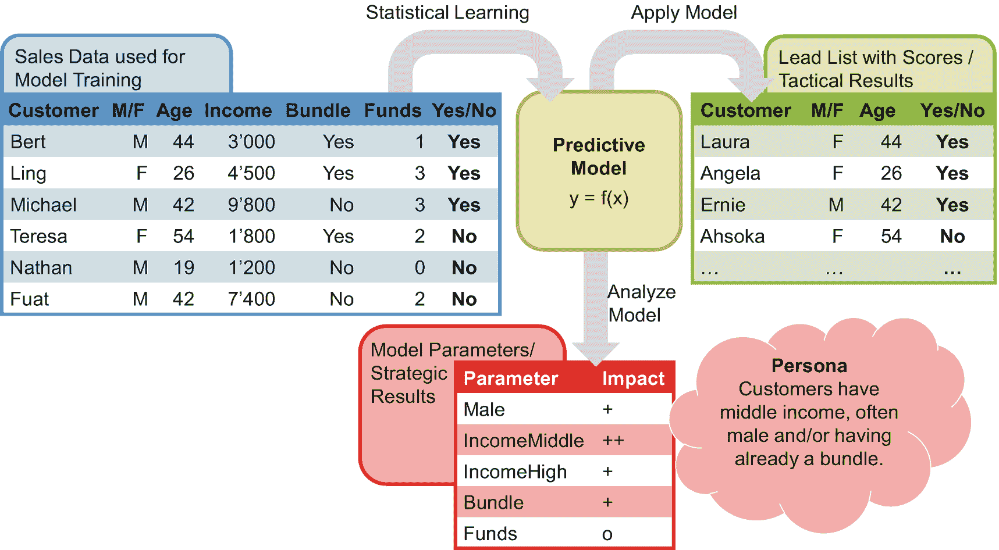
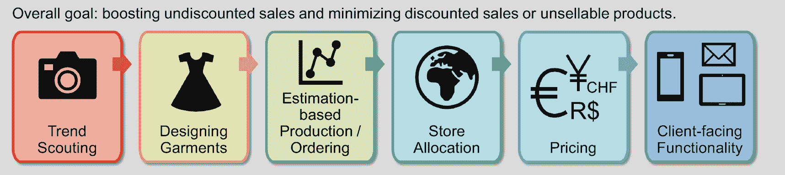

# 1. 企业为何投资人工智能

在一些公司，管理者似乎与 AI 服务和软件供应商达成了一种默契，将 AI 视为魔法：没人理解发生了什么，但 AI 承诺能精准实现每个人的期望，即便没人知道结果应该是什么。数据科学家们喜欢这样的项目。他们可以做任何最令他们兴奋的事情——至少，直到某位高层管理者叫停并终止项目为止。

此类项目失败的根源在于混淆了两个层面：第一，是什么引起了管理者的兴趣；第二，哪些项目能为公司带来价值。引起管理者的兴趣很简单，因为他们别无选择。《哈佛商业评论》曾发表多篇关于 AI 和数据驱动型组织的文章，将这一话题推至董事会层面。CEO 和 COO 们希望并且必须转型其组织。挑战在于第二部分：塑造并交付一个成功的 AI 项目。在此，CIO 的角色是构建和运营技术基础，例如 AI 和数据管理能力。对 IT 部门来说，好消息是，在这种情况下资金是有保障的。相反，他们面临一个不同的挑战：在一个碎片化的市场中识别正确的软件产品、服务和合作伙伴。感觉此刻就像一场 AI 淘金热。企业纷纷投资并设立项目；初创公司致力于创新；咨询公司调整其业务。供应商则对老式服务进行重新包装，使其在新世界中听起来性感且具有吸引力。

复杂的市场、新的要求以及满足董事会期望的压力，对高级管理者来说是一个令人生畏的组合。他们面临的情况类似于一个拥有成百上千块碎片的巨大拼图。随机挑选一块拼图并寻找匹配的碎片，往往不如先花些时间了解全局来得成功。因此，本章通过回答以下问题，将 AI 置于数据驱动型企业的背景中：

*   数据驱动型公司有何特点，AI 如何提供帮助？
*   项目和计划如何计算 AI 项目及服务的商业价值？项目经理如何构建商业案例？
*   数据驱动型公司如何利用 AI 进行创新？典型的销售用例以及来自时尚行业的创新理念，说明了业务部门如何看待 AI。
*   为什么扩大现有数据仓库（DWH）和商业智能（BI）团队的范围以涵盖 AI 服务可能不是一个好主意？

## AI 在数据驱动型公司中的角色

人工智能与数据驱动型组织——这可能是目前大多数公司最热门的两个话题。它们各自有何独特之处，又有何共同点？C 级高管和企业战略家在制定创新和转型计划时需要答案。

简而言之，“数据驱动型组织”一词涵盖两个方面——首先，是更技术性的需求，即在整个公司内系统地收集数据。其次，是决策方式的组织性转变，即（更多地）关注事实，减少对资历的依赖。人工智能通过生成洞察并识别人类在手动分析中无法发现的数据相关性，帮助做出更明智的决策。

在我们的日常生活中，我们互换使用数据、信息、知识或洞察等术语。根据上下文，每个人都能理解实际所指。然而，精确的定义有助于理解数据驱动型组织以及 AI 的角色（图 1-1）。

**数据**是原始形式：磁盘上的 1 和 0，作为来自物联网设备流的一部分，或数据库中的字符串和数字。在这个层面上，我们对数据一无所知。数据本身不携带任何意义。它可能有助于也可能无助于理解物理或数字世界。

图 1-1

AI 与数据驱动型公司 – 全景图

**信息**是情境化的数据。一串 1 和 0 变成了来自监控生产线的摄像头的视频信号。在数据库中，一个字符串现在代表客户名称或订单 ID。一个数字变成了年利润，另一个数字变成了上个月的营业额。数据变成了信息——并且现在有了意义。

在可预见的未来，情境化是并且仍将是一项主要由人类完成的任务。自动化识别员工或客户姓名或订单 ID 是直接的。但理解一个表存储的是未结订单的订单 ID 还是客户投诉过的订单的订单 ID，则要难以自动化得多。只有人类才能理解复杂的数据模型语义。他们能够从智力上洞察那些看似相似但用途不同的数据元素（如未结订单、已交付订单和退货订单）的所有细微差别。

**可操作的洞察**——也称为“知识”——代表指导决策的信息集合。生产线上是否存在异常？哪些客户退货最频繁？正如“可操作的洞察”一词所暗示的，必须有人决定是否以及执行哪些行动——而 AI 则提供有用或必要的输入和选项。

从历史上看，生成可操作的洞察是白领办公人员的领域。管理者和分析师将充满数字的大型 Excel 表格转化为漂亮的图表。这种传统方法有两个局限性。首先，人类只能理解和试验有限数量的影响参数。其次，虽然有统计学家和数学家处理核心业务问题的例子（例如保险公司的精算师），但对于大多数其他行业部门来说，情况并非如此。大多数管理者和分析师几十年前在大学里听说过统计显著性，但从未在实践中应用过这个概念。因此，对于将信息转化为可操作的洞察，人工智能是革命性的。AI 模型融合了高度复杂的相关性，包括非线性关系；此外，AI 开发方法论强调稳健的质量控制措施。

作为一项已有数十年历史的研究、开发和工程学科，AI 拥有众多方面，以及三个常被提及的方向或思想流派：

# 人工智能的三种类型

- **Artificial narrow intelligence**（狭义人工智能）隔离或单独处理高度专业化的任务，这些任务以前只能由人类完成：例如识别图像中的物体或下棋。得益于深度神经网络，狭义人工智能推动了当今的创新，并改变了社会和企业。

- **Artificial general intelligence**（通用人工智能）旨在构建一个类似人类的智能系统，能够像人类和人类大脑一样学习、理解和行为。

- **Artificial superintelligence**（超级人工智能）希望构建比人类大脑和智能更优越的“更聪明的大脑”。

这些概念的影子已经存在于我们的流行文化中。超级人工智能是几年前电影《她》（*HER*）的主题。新一代创新手机配备了`AI`助手。这些`AI`助手在智力上比人类更先进——并最终脱离人类及其有限的智力。图灵测试，一个源自 20 世纪 50 年代的学术概念，如今广为人知。要通过图灵测试，`AI`系统必须在聊天中与真实的人类对话伙伴无法区分。这是否已经是通用人工智能？不。构建一个模仿人类的`AI`系统只反映了通用人工智能非常有限的一个方面。此外，图灵测试并不要求任何学习能力。

当今商业上成功的聊天机器人甚至不会尽可能多地模仿人类的对话风格。它们明确表示自己只是机器人。它们并非设计用来通过图灵测试或达到通用人工智能的水平。它们是狭义人工智能的完美例子。它们通过提供比例如`SQL`命令行界面更人性化的界面，简化了在线客户的购买或预订流程，或查询支持数据库。

狭义人工智能改进了可操作洞察的生成。基于这些洞察，决策需要某种形式的判断。如果银行职员预计八位客户可能会签约，他应该给十位潜在客户打电话吗？他是否应该给三十位而不是十位客户打电话，以完成十一笔而不是八笔销售？大楼里有入侵者。我们是报警，还是让夜间保安去检查情况？

狭义人工智能的兴起改变了企业的决策方式。一个`AI`模型击败了拥有 20 年经验和高级头衔的专家。过去，除了基于资历的决策之外，通常别无选择，大多数专家在其领域拥有多年经验。他们并非以独裁者风格发号施令来证明自己的权力。然而，他们无法与设计良好的`AI`模型抗衡，尽管`AI`并非资深专家的终结。他们仍然对企业至关重要，只是有了新的关注点：在没有专用`AI`模型的领域进行决策，质疑特定`AI`模型是否有利于组织，以及基于`AI`提出的建议做出最终决策。

总的来说，有三种决策模式值得一提：

- **基于汇总信息的决策**：领域专家收集所有相关数据，查看相关性和依赖性。他自行决定，或为管理决策准备提案。

- **将`AI`的力量与人类判断相结合**：`AI`生成洞察，最终决策权仍由人类掌握。这种模式有利于一次性战略决策，例如明年是进入俄罗斯市场还是澳大利亚市场更好。

- **自主算法**：`AI`模型生成提案并直接触发其执行——无需任何人工干预。这种模式适用于运营性常规决策，尤其是在人类判断成本过高或速度过慢的情况下。投放在线广告就是一个完美的例子。算法必须在几毫秒内选择合适的广告。此外，单个广告产生的收入很低——只有几分钱，有时是几欧元。对于此类用例，人工干预成本太高且速度太慢。

当考虑数据如何成为信息，信息如何成为可操作洞察，以及不同的决策模式如何运作时，数据驱动和`AI`角色的理念在大局中变得清晰（图 1-2）。数据驱动的组织需要数据，因此投资于数据收集及其情境化以获取信息。这是基于事实进行决策的基础。无论是人类还是算法和`AI`将收集到的信息转化为可操作洞察，`AI`对于重复性决策以及从庞大复杂的数据源中筛选出相关参数非常有益。此外，一旦模型训练完成，`AI`模型可以（近乎）实时决策，并且不会为每次决策带来高昂成本。

图 1-2

使用`AI`能力的数据驱动组织面临的三大挑战

当公司变得数据驱动并引入`AI`时，其商业案例不能只涵盖`AI`能力。它们必须包含为实现数据驱动而产生的费用：建立从数据仓库或业务应用、从`IoT`设备、以及从工程或服务部门系统中收集数据的能力——再加上重新设计决策流程的费用（以及时间和资源）（图 1-2）。将这三个挑战——数据收集、构建`AI`模型、转变企业决策——作为一个整体来看待，是成功的关键。

## 计算人工智能的商业价值

高层承诺成为数据驱动型企业并投资人工智能，为人工智能项目提供了良好的培育环境。然而，构建并建立具体的人工智能服务需要资金，而资金则需要有说服力的商业案例。对于高度创新的项目来说，商业案例可能是一个障碍，因为量化其收益是一项挑战。幸运的是，经济学研究确定了信息技术投资创造价值的四种方式。它们有助于构建具体的商业案例。这四种方式或选项是：

*   **信息效益**，例如，向决策者提供信息。
*   **事务效益**，例如，改善日常运营和削减成本。
*   **战略效益**，例如，改变公司在市场上的竞争方式或其产品的性质。
*   **转型效益**指的是未来效益，例如，由于新工具的额外功能，员工在熟悉该工具后开始使用它，从而能够优化他们的工作。

关于效益，有很多轶事证据，但很少有涵盖众多公司的系统性实证研究。一个例外是伊丽莎贝塔·拉古塞奥对法国各种规模公司进行的一项研究。在她的研究中，她关注了大数据技术。这些技术处理和分析以高速和多种格式涌入的海量数据。大数据与数据驱动型企业或人工智能从大量数据中生成洞察的核心目标密切相关，这使得她的研究也与本书相关。

伊丽莎贝塔发现，在所有考虑的行业领域中，提高员工生产力是最相关的事务效益。降低运营成本位居第二。接下来最相关的战略效益是使信息技术与业务战略保持一致，并能够更快地应对变化。

在转型效益领域，扩展能力被认为是最重要的。例如，可以通过让新员工快速开始工作并整合额外的数据源来实现这一点。在信息效益领域，他们列出了提供管理数据、提高数据准确性、以更可用的格式提供数据、使数据更易于访问以及使数据访问速度更快。

在将上述见解应用于你的人工智能项目商业案例时，有两个关键点需要考虑。首先，领域相近，但并不完全相同。拉古塞奥的研究结果是很好的灵感来源，并非金科玉律。其次，公司文化和政治因素会影响哪种效益类型在你的组织和你的管理者中效果最佳：

*   某些效益**易于量化**——尤其是（但不仅限于）事务效益。项目计算当前成本，并估算实施项目后的潜在节省。这类商业案例非常适合由财务数据驱动、且受财务控制者及类似管理者影响较大的公司。
*   有些效益**难以量化**。预测分析会使销售额增长 1%还是 10%？商业案例中的计算与实际成本和节省可能存在巨大差异。许多战略效益和转型效益都属于这一类。这类论点能说服有远见和创新驱动的决策者，但无法说服吹毛求疵的人。
*   信息效益最容易获得资金支持。当管理者认为需要数据时，如果在其预算范围内，她就会资助一个项目或服务。**无需事先量化**任何效益。

当商业价值明确后，管理层会决定是否投资于转型，以成为数据驱动型组织，并构建和扩展其人工智能能力。在大多数情况下，人工智能计划会从那些成果易于衡量的“低垂果实”开始，例如改进和优化销售。

## 用例：销售运营效率

提高销售效率是实现事务效益的一个例子：更多的销售额，更少的努力。该用例利用数据（和算法）的力量来促进销售并识别可能终止合同的客户。在此类用例中，人工智能会预测，例如，哪些客户可能会购买产品。

传统上，销售代理或销售管理层会根据直觉筛选客户名单，以了解哪些客户可以致电。过去和现在，他们的职责都是在选择要致电的客户时做出正确的选择。他们对结果负责。

对于人工智能生成的名单，数据科学家（至少部分地）对销售成功负责。这些名单为销售代理提供了明确的行动指南。如果你想销售办公家具，这些是最有可能购买的客户。给他们打电话！这些客户可能会取消他们的有线电视订阅。采取行动并阻止它！无论谁创建了这样的名单，都要对其质量负责。

### 向上销售、交叉销售与客户流失用例为何能蓬勃发展及其运作方式

交叉销售与客户流失相关的 AI 用例之所以广泛存在，有令人信服的理由。首先，它们实施起来简单直接。AI 项目通常可以依赖单一源系统的数据（例如 ERP 系统、CRM 系统或数据仓库）来创建良好的模型。其优势在于：AI 项目无需整合来自不同来源的数据，而这往往是一项耗时的任务，甚至可能成为项目风险。其次，交易层面的收益显而易见且易于验证。AI 项目与经验丰富的市场营销及销售专业人士进行对决。市场营销专家和 AI 各自挑选 50 名客户。这各 50 名客户分别是市场营销专家和 AI 认为最有可能购买产品的客户。然后，销售代表联系这一百名客户。他们尝试达成交易，但并不知道这是一场实验。最后，统计有多少客户从人工生成的列表中购买了产品，又有多少客户从 AI 提供的列表中购买了产品。AI 列表的优越性应当非常显著。

然而，这个用例需要销售组织的积极支持。如果销售人员反对这个想法，会发生什么？幸运的是，数据科学家可以仅凭数据实施另一个不同的用例，无需其他团队的帮助：即客户流失预测用例。例如，一个客户流失预测 AI 模型可以预测哪些客户即将取消他们的手机套餐订阅。数据科学家生成列表——然后等待。也许一周，也许一个月。接着，他们检查自己的预测是否成真，并向管理层展示，由于业务部门忽视了 AI 生成的洞察，公司流失了多少客户。

向上销售和客户流失预测模型都基于对客户进行评分，通常为每个客户分配一个介于 0 和 1 之间的数值。这些分数表示客户购买产品或取消合同的可能性有多大。组织会优先安排呼叫中心资源联系得分高的客户。他们会先联系得分为`0.57`的客户，然后再联系得分为`0.12`的客户（图 1-3）。表格中的输入变量列反映了我们对客户的了解。基于这些输入变量，评分函数（即 AI 模型）会计算出客户对一张金色信用卡的偏好度。

**图 1-3** 客户评分，一个典型的 AI 用例

使用评分进行优先级排序的效果类似于香槟气泡。“有趣”的客户会上升到列表顶部，就像香槟气泡在香槟杯中升到顶部一样。图 1-4 说明了这一点，左侧代表随机联系客户，右侧代表根据评分选择客户。

假设一个呼叫中心客服从这个列表中给一位潜在客户打电话。如果他感兴趣，就会因为这次通话而购买。如果我们给一个不感兴趣的客户打电话，我们就“浪费”了一次通话。

图 1-4 右侧的表格包含相同的名字；只是顺序因 AI 而改变。更多想要购买产品的客户位于列表顶部，并首先被联系。在这个例子中，对于左侧的表格，销售代理在四次通话后只成交了一笔交易。相比之下，在右侧表格所反映的基于评分的方法中，被联系的四个客户中有三个签约了。这种销售额的增长源于 AI 和分析的力量——管理者可以实施同样的方法，并为其用例计算交易层面的收益。

**图 1-4** 当联系潜在客户的资源有限时，AI 如何支持销售。使用 AI，您可以增加联系到有意向客户的机会

### 成功的障碍与先决条件

热情的 AI 布道者、软件供应商或外部顾问有时会忘记提及 AI 在销售领域应用的两个严格限制或先决条件。首先，AI 需要足够大的训练数据集。AI 算法从这些训练数据中进行归纳，学习并创建模型。没有（好的）训练数据就意味着没有（好的）模型。

当首次推出新产品时，例如一张带有闪烁粉色 LED 灯的环保金色信用卡，就没有历史训练数据。没有人购买过这个产品。因此，没有训练数据。创建一个 AI 模型是不可能的。

第二个严格的限制是，这些 AI 用例仅在资源短缺时才有帮助，例如，当销售组织无法联系所有潜在客户时。资源短缺在零售银行大众市场很常见，但在财富管理领域或当一家欧洲大型飞机制造商向航空公司销售飞机时则不然。在后一种情况下，每个客户都能带来高额收入。与单笔交易产生的收入相比，销售人员的成本很低。飞机制造商能够负担得起庞大的销售团队和超额产能。这对 AI 意味着：没有资源短缺就意味着没有必要投资 AI。销售团队与他们的客户在高层保持持续联系，无需 AI 就知道谁明年可能购买 20 架飞机。潜在客户甚至可能主动联系飞机制造商。AI 能够优化的每个客户的销售能力并不短缺。瓶颈在于销售团队能与航空公司高层管理人员交谈多长时间。CEO 们没有时间每周与一个供应商交谈数小时。因此，AI 可以帮助识别隐藏的需求和交叉销售机会，使销售人员能够提出正确的想法和产品。换句话说：我们下周拜访某个特定客户时，应该向他推荐哪五种产品和服务？这是每个人都从在线商店中了解到的 AI 功能：“购买牛排和薯片的顾客也会购买德国啤酒。”

除了这两个严格的限制——需要足够的训练数据以及 AI 仅在需要优化的资源短缺情况下才有帮助——还有第三个障碍，涉及商业模式和公司文化。某些行业和商业模式依赖于销售人员与客户之间密切的个人关系。例如保险业或面向超级富豪客户的私人银行业务。在这些领域，销售人员可能将 AI 视为对其职业自豪感、自我认知以及作为员工价值的直接攻击。AI（以及 IT 部门）声称比那些认识富裕客户几十年并见过他们本人的银行顾问更了解客户。此外，销售人员的薪酬取决于成交率——以及他们向合适客户销售合适产品的技能。如果电脑做得更好，客户顾问会担心自己在组织中的长期价值——以及他们的奖金和佣金。

对自身价值的担忧是一个工作文化方面的因素，它表明仅靠数据科学家无法将组织转变为一个依赖 AI 提高效率的数据驱动型公司。数据科学家能够且必须创建一个好的模型。处理（例如）销售人员的怀疑态度，是一项变革管理任务。他们的经理和组织的最高管理层必须处理这个问题并做出决定。他们可以阻止 AI 在其领域的使用——这种情况在公司中确实存在。然而，创新的管理者无论如何都会推动前进。他们甚至无视愤怒的销售人员，或者通过引导和规避问题，例如通过启动直接的在线销售渠道来应对。

### 组织影响

如果人工智能接管了销售和营销领域的客户评分工作，它会对销售组织中的员工产生怎样的影响？首先，评分并非新鲜事物。营销和销售专业人员几十年来一直在做这件事。人工智能革新了评分的计算方式以及任务的执行者。它不再基于营销人员的直觉——比如一位拥有 30 年经验的专业人士，凭经验“非常、非常确定”35 至 55 岁的男性是理想客户。现代评分形式基于人工智能，整合了尽可能多的信息，例如年龄、性别、购买历史，或用户在网店中对产品和广告的点击情况。

当人工智能接管评分工作时，这会对销售管理组织产生影响。IT 部门及其软件解决方案将负责创建潜在客户名单，列出接下来需要联系以销售特定产品的人员。销售管理层可以将精力从摆弄 Excel 表格转移到更高价值的任务上，例如设计营销活动，以及了解应该向谁销售全新的产品和服务。

对销售人员的影响则取决于具体的商业模式。是否存在深厚的个人关系？这种（耗时的）个人关系能否转化为足够的额外收入？销售代表是否将客户视为“自己的”客户，而这种信念是否得到现实的支持？例如，在（外呼）呼叫中心，人工智能生成的潜在客户名单并不会改变客服人员的工作方式。和以前一样，他们仍然会收到一份需要联系的（潜在）客户名单。唯一的区别是，他们应该能达成更多交易，因为人工智能生成的名单上的客户包含更多有购买意向的客户。因此，他们能创造更高的收入（或者在更短的时间内达到之前的目标）。拥有个人关系的销售人员会看到一些变化，因为人工智能用统计得出的洞察补充了他们对客户的个人理解。尤其是在后一种情况下，成功取决于 IT、数据科学以及组织变革的结合。

## 产品战略洞察

人工智能不仅能在战术或运营层面为销售组织带来立竿见影的成效。它还能提供战略洞察，例如为产品和服务经理提供支持。我们通过审视人工智能对产品管理和销售的好处及其背后的方法论，来举例说明生成战略洞察的这后一个方面。

### 识别业务挑战

增加收入和利润是每个成功公司的基因。产品经理渴望找到新的方法来促进其产品组合的销售。上一节已经介绍了一个如何推动销售的具体例子。在这里，我们采取一个更广泛、更全面的视角：安索夫矩阵（图 1-5，左图）。安索夫矩阵涵盖了最知名的增长战略，以增加销售额。市场渗透是最直接的执行策略：向现有客户群销售更多现有产品——这正是上一节关于运营效率部分所介绍的方法（图 1-5，中图）。

图 1-5

安索夫矩阵及各种销售策略的说明。由于多元化战略失败风险高且从人工智能中获益不明显，故未作说明。

产品开发是另一种增长战略：向现有客户群销售新产品。例如，多年前，银行推出信用卡并向其现有客户群销售。指望人工智能直接产生这样的产品创意并不现实。然而，它可以帮助匹配客户细分市场和产品，以识别利基市场。

这种方法并非应用人工智能模型来预测谁会申请信用卡。该策略需要分析人工智能模型本身。从模型中可能获得的洞察包括：

-   青少年没有信用卡。
-   低收入家庭的成年人很少拥有信用卡。
-   退休人员通常没有信用卡。即使有，他们也很少使用。

这些洞察有助于产品经理推出产品创新。在这个例子中，银行存在未被服务的客户细分市场，例如不能向其提供贷款的青少年，以及违约风险高的成年人。产品经理需要一款新产品，因为现有的产品不适合这些客户群体。我们都知道解决方案：预付信用卡。它看起来像信用卡，但你只能花费预先存入卡中的金额。对于担心信用卡支付风险的退休人员，网络欺诈保障是一个可选方案。因此，人工智能可以借助其模型来帮助塑造和开发新产品（图 1-5，右图/B）。此类分析的另一个结果可能是发现类似产品的客户群存在重叠。在这种情况下，产品经理可能希望重组其产品组合，因为产品之间会相互蚕食，并且每个产品都有固定成本。

人工智能模型同样有助于市场开发增长战略。假设产品经理分析人工智能模型，能够描绘出潜在购买者的特征（例如，30 岁以上，无子女，无猫，可能有狗）。有了这些信息，他可以联系拥有地址数据库的市场调研或直效营销公司。这些公司可能会提供符合这些标准的人员名单，使他们成为潜在的新客户（图 1-5，右图/C）。

图 1-6 从流程角度说明了如何利用人工智能模型获取洞察的机制。其思路是检查既定的产品或市场策略与观察到的客户行为是否匹配。如果不匹配，则意味着在重新调整产品和市场策略并再次检查时，存在增长机会。

图 1-6

用于战略产品管理的人工智能

### AI 与数据分析 vs. Excel

当 AI 项目经理或数据科学家向其他团队解释 AI 如何彻底改变该团队工作的美妙新世界时，他们绝不能忘记一个事实：在 AI 专业人士介入之前，组织的其他部分运转良好。因此，AI 专业人士可能不得不反复解释，为什么 AI 生成的列表优于基于 Excel 的手动方法。我清楚地记得一位银行市场专员对我说过的话：一个实习生用`Excel`在两到三天内就能生成一份潜在客户名单。他们不需要 AI。

在产品管理领域，比较销售策略与销售现实并非新鲜事。然而，与传统的`Excel`手动方法相比，尤其是分析或统计方法能够提供更深入的理解。`Excel`适用于 20 或 30 个标准。它适合手动验证其中一两个标准（如性别或年龄，或两者兼有）的影响。这类用于手动验证的简单假设可能是“只有 25 岁以下的客户才会订购能量饮料”或“有孩子的家庭喜欢购买带有独角兽和火烈鸟图案的粉色床单”。

`AI`带来了两项改进。首先，**无需假设**哪些属性可能是最相关的并需要手动验证。相反，AI 算法在学习与模型创建过程中会审视所有提供的属性，并识别出真正相关的属性。其次，AI 算法甚至能处理**数千个属性**，而使用`Excel`表格的人类在面对这种复杂程度时则会束手无策。

尤其是复杂的关系，人类很难理解。用`Excel`需要多久才能找出三个客户群体？一个群体由 25 岁以下的男性客户组成，一个是居住在郊区、年龄在 30 至 40 岁之间的富裕女性，第三个也是最后一个群体是居住在乡村、养狗的 60 岁以上老年人。这种高级洞察力有助于产品经理和营销专家识别并构建他们的**用户画像**。用户画像是指具有相似人口统计学特征（以及根据上下文，具有相似动机）的（潜在）购买者或产品用户群体。

一个来自银行界的例子：一家银行想了解为什么企业银行客户会终止关系。他们意识到：银行顾问向商业客户推销一款新推出的产品，销售情况相当不错。这是通过分析得出的知识。得出结论、进行判断和决策则是银行家们的任务。他们必须弄清楚为什么客户在购买了畅销产品后却离开了。他们了解到，银行顾问不顾产品是否合适，强行向客户推销。客户感到被欺骗，从而终止了银行关系。这个客户流失案例说明了数据驱动型公司如何受益，因为他们获得了无人能预见的洞察力。而这些洞察力帮助公司领先于竞争对手。没有人看到畅销产品与客户流失之间的联系——AI 模型让这一点变得显而易见。

### 理解 AI 项目交付成果与方法论

如上一节所述，数据科学家和 AI 项目如何为产品经理生成战略洞察？这个挑战涉及多个方面。起点始终是作为训练数据来创建 AI 模型的真实世界数据。对于图 1-7 中的销售场景示例，这就是“用于模型训练的销售数据”表格。数据、属性或参数越多越好。关键在于包含预期输出或预测的列。在示例中，这就是“是/否”列。谁会购买——这是模型应该做出的最终预测。

数据科学家对这些训练数据应用学习算法，旨在创建一个预测模型。该模型是战略和战术洞察的基础。战术洞察是指那些购买产品可能性很高的客户。为此，数据科学家将预测模型应用于尚未被销售代表联系过的客户。他们为每位客户打分——这就是“潜在客户名单”表格——以评估如果联系他们，其购买产品的可能性有多大。该分数有助于确定优先联系谁。

数据科学家通过审视模型来获取战略洞察。AI 模型包含的信息显示，中等收入客户与产品有很强的关联性。其他可能对产品感兴趣的客户指标包括：男性、高收入或购买了银行套餐。

图 1-7

AI 在销售与销售管理中的应用——全景图

# 人工智能驱动的时尚创新

人工智能的典型主营业务是识别追加销售或交叉销售机会，以及理解客户特征。然而，人工智能也可以很酷、很时尚——或者至少，数据科学家可以帮助他人变得并保持时尚与潮流。时尚行业，尤其是快时尚行业，似乎只关乎在远东寻找廉价工厂进行生产，并在营销活动上投入巨资。然而，人工智能在时尚领域至关重要，并且渗透到了比高度数字化的银行业等更多关键职能中。

当你问自己，是否会在北达科他州的商店和米兰、巴黎的旗舰店库存中放置相同的设计和完全相同的尺码时，人工智能的广泛应用就不足为奇了。你的客户在世界各地都有相同的时尚感吗？你应该在全球范围内为你的商品统一定价吗？这些问题颇具挑衅性——至少如果你住在北达科他州的话——但 H&M 在向所有门店配送相似商品时损失惨重。他们未能按计划以非折扣价格售出足够多的服装，这严重影响了他们的收入和利润率。因此，H&M 投资于“本地化”。人工智能预测每家门店的客户对哪些时尚单品最感兴趣，并据此调配服装。这些预测基于销售点数据和其忠诚俱乐部会员（及其购物地点）的信息。

然而，时尚行业的价值链更长、更复杂，人工智能也可以在众多其他环节提供帮助（见图 1-8）。**趋势侦察**反映出，如今大品牌和时尚零售商的影响力有限。巴黎和意大利的时装秀不再像 20 世纪那样主导潮流。影响者和社交媒体策划着新趋势。理解这些趋势要么需要人工查看和分类随处可见的时尚照片和视频，要么让人工智能通过分类图像（例如，按服装款式或颜色）来确定趋势。在服装设计方面，Tommy Hilfiger 与 IBM 以及曼哈顿的纽约时装技术学院合作开展了一个联合项目。他们利用人工智能技术、Tommy Hilfiger 的产品库以及 T 台走秀图片，使学生能够基于该品牌的美学风格创作新的时装设计。目前尚不清楚他们是否打算将此类创意融入其时装设计方法中。然而，这个例子说明了一个重要观点：数据和人工智能也可以创新**创意流程**。同样，H&M 还销售过一款“数据连衣裙”。其设计是个人生活和环境（如天气）的产物。这些影响参数决定了颜色、材质和细节的选择，从而打造出真正个性化的连衣裙。

图 1-8 快时尚与人工智能

价值链的下一步是评估产品的销售成功率，而**订购**匹配数量的单品是人工智能典型的预测问题。一旦明确了哪些商品分配给哪家门店，下一步就是为这些单品定价。客户愿意支付什么价格？我们预计以每种价格销售多少件？H&M 报告了使用人工智能——尤其是结合人工智能与最终人工判断——所带来的益处。

最后，还有面向客户的功能，如应用程序、电子邮件或推送消息。它们有助于实现前面提到的用例，如追加销售和交叉销售，或识别购物者群体及其特征。虽然这在各行业都是标准做法，但基于人工智能的 Tommy Hilfiger **品牌与购物体验**是一个令人兴奋的高科技理念：“即看即买”。顾客可以在时装秀上模特展示服装时直接购买。同样，一款应用程序允许顾客通过相机快照识别时尚单品，并直接在网店中购买。即使是非时尚爱好者，看到人工智能以如此多的方式创新时尚行业，也会感到启发和眼界大开。这应该能激励其他行业领域的企业高管和数据科学家也睁大眼睛，在日常工作中发现创新的机会。

## 商业智能与人工智能

之前所有关于销售、产品管理或快时尚的例子都展示了人工智能如何为企业带来创新。当管理者想要启动类似项目时，第一个问题是：谁来负责这个项目？我们是否拥有具备相关经验的合格团队？

大多数公司都设有数据仓库（DWH）和商业智能（BI）团队。这些团队非常了解公司数据。他们运营着一个至少具备首批人工智能用例所需所有技术特性的平台。然而，当我注意到许多公司——尤其是中型企业——会建立独立的人工智能项目和数据科学团队，而不是用数据科学知识来增强数据仓库或商业智能团队时，我起初感到惊讶。

这一现象突显了：仅仅拥有最优秀、最聪明的专家，即使他们及其软件解决方案符合业务需求，也是不够的。组织兼容性至关重要。以下四个原因证明了这一点。它们说明了为什么公司会在商业智能和数据仓库团队之外，单独建立人工智能团队：

1.  商业智能团队通常侧重于总结性**报告**，而不是生成额外的知识和洞察（参见图 1-1 中关于数据、信息和知识的讨论）。并非每个专注于报告的商业智能团队都能自我革新（并且有资金支持这样做）。

2.  **赞助方**不同。通常，数据仓库的资金来自控制部门或市场营销与销售部门。因此，这些团队必须为其赞助方交付有价值的成果。与数据科学团队不同，他们不能将大量工程师转移到赞助方兴趣领域之外的项目上。

3.  数据仓库团队通常专注于开发经过全面测试和明确定义的解决方案。这种谨慎的方法对于监管报告等来说是必要的。而人工智能的期望则不同。假设业务需要针对一个一次性且不再重复的问题**快速给出答案**。并非所有数据仓库团队都为此做好了准备。

4.  小型数据仓库团队通常忙于维持系统及其所有数据源的正常运行。他们必须确保每日、每周或每月的关键业务报告能够顺利交付。这类团队在**运维**和工程方面实力雄厚，但缺乏处理更高级、数学上更具挑战性的人工智能任务的专业知识。

在将人工智能相关职责分配给现有的数据仓库或商业智能团队之前，组织应考虑这四个方面。然而，正如我们在后续章节中看到的，数据仓库是数据科学家的绝佳数据来源。现有的数据仓库可以加速许多人工智能项目。因此，对于一个组织来说，让商业智能和数据仓库团队与数据科学家理解他们是互补的，这一点至关重要。他们并非竞争关系。

# 总结

在本章结尾，我想快速总结一下要点：

- 数据驱动型公司基于事实和数据而非经验和资历做出决策。人工智能有助于从庞大复杂的数据集中提取可操作的见解。
- 人工智能的四大优势是：信息性（提供额外信息）、事务性（让事物变得更好或更便宜）、战略性（影响公司或产品在市场中的地位）以及变革性（为未来改进铺平道路）。
- 人工智能的核心在于创建模型。这些模型对组织具有战术性益处。它们可以预测个体行为，例如某人是否可能购买手机。模型也能提供战略性见解，比如识别典型购买者的特征。
- 人工智能有助于优化单一任务，如交叉销售和追加销售。此外，人工智能还能推动商业模式的变革，如时尚行业的例子所示。
- 许多公司拥有数据仓库和商业智能团队，这些团队至少可以接手较为简单的人工智能项目。然而，当服务模式、资金和治理结构不同时，独立的人工智能团队至关重要。

有了这些知识，我们便可以探讨如何运行人工智能项目并实现创新。但请记住一句古老的谚语：“我们钦佩我们所不理解的事物。”读完下一章后，你将了解数据科学家的工作方式以及如何改进项目。届时，人工智能对你而言将不再那么神秘！

