# 2. 构建与交付人工智能项目

恭喜，董事会决定推进人工智能项目。高级管理层选定你作为人工智能项目及项目经理。现在是你交付成果的时刻。你曾拥有愿景，如今可以将其变为现实。但别忘了：有些真理适用于所有项目，无论是人工智能项目还是非人工智能项目。企业界期望项目能够以成本高效、及时且可靠的方式交付成果。大多数公司无法也不愿支付十位博士的薪酬并等待八个月来获得一个完美的解决方案。学术界有耐心并投入大量时间和精力，但企业并非如此。作为人工智能项目经理，你的挑战是与两三位 IT 专业人员合作，在六到八周内交付初步成果。基于这样的背景，本章将为以下人工智能项目管理挑战提供答案（见图 2-1）：

- 人工智能技术栈中有哪些不同层次，使企业能够通过人工智能进行创新？
- 人工智能项目经理如何界定项目范围，以满足业务利益相关者和赞助方的期望？
- 人工智能模型是人工智能项目的核心交付物。例如，基于神经网络或统计学的模型是什么样的？
- 适用于人工智能项目的开发方法论是什么？关键效率因素有哪些？
- 如何将人工智能模型集成到现有的企业应用架构中？

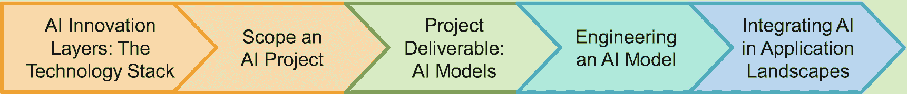

图 2-1 本章结构

## 创新的四个层次

管理人工智能项目和团队有一些特殊性。与传统应用开发者相比，团队成员往往更倾向于技术，拥有更强的计算机科学和数学背景，但在业务问题上的经验较少。传统软件工程中已知的模式和成熟工具链较少。因此，人工智能项目经理需要提供更多指导，以确保交付具体的业务价值。他们必须不断挑战数据科学家，防止后者陷入人工智能研究或重复造轮子。

将技术领域分层并定义技术栈是一种长期存在且广泛实践的方法。以 Java 为例，Java 后端应用在 Java 虚拟机中运行代码。Java 虚拟机运行在虚拟机监控程序上，后者运行在操作系统上，而操作系统则运行在物理硬件上。人工智能也有类似的层次（图 2-2）。最底层是**硬件层**。例如，神经网络需要大量矩阵乘法运算。普通 CPU 可以执行这些运算，但存在更快的硬件选项：图形处理器（GPU）、现场可编程门阵列（FPGA）或专用集成电路（ASIC）。这一层的创新来自 AMD 或 NVIDIA 等硬件公司。购买此类创新产品的客户是服务器和工作站制造商或公有云提供商。这些客户群体需要为其数据中心配备能够高效运行人工智能密集型工作负载的硬件。

**人工智能框架层**构成了下一层。它代表机器学习和人工智能的框架，例如`TensorFlow`。`TensorFlow`将训练大规模神经网络的工作负载分布到大型异构服务器集群上，从而利用其计算能力。`TensorFlow`为数据科学家屏蔽了底层硬件的复杂性。它自主并行化计算任务。数据科学家可以在单台笔记本电脑上，或在拥有数百个节点且硬件针对人工智能优化的集群上运行相同的代码和学习算法，并受益于集群的性能。数据科学家无需针对不同硬件配置更改代码，从而节省了大量工作与精力。

公司使用人工智能框架来开发新的人工智能算法和创新的神经网络设计。假设一家公司希望在`GPT-3`之后开发下一个重大突破，或一个全新的计算机视觉算法。在这种情况下，其数据科学家会使用人工智能框架来设计和测试新算法。换句话说：几乎所有数据科学家都不会在这一层进行创新，而是在现有框架之上工作。

在这一层进行创新只有两种场景：改进现有框架（如`TensorFlow`）或开发一个全新的框架。这些活动通常是学术研究的一部分。对于公司而言，只有当其能够覆盖大量数据科学家时，这样做才有意义。后者适用于公有云提供商或人工智能软件公司。他们需要创新来提供“最佳”人工智能框架，以吸引数据科学家使用其人工智能和/或云平台。

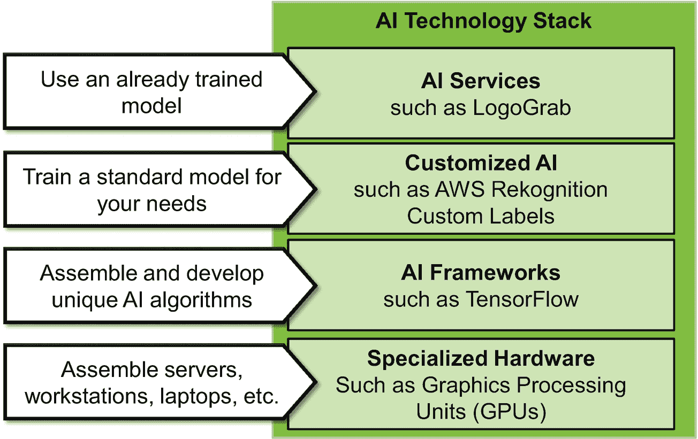

图 2-2 人工智能技术栈

接下来是定制化 AI 层。在明确了顶层（**AI 服务层**）的目的后，其具体细节就很容易理解了。AI 服务使软件工程师能够通过调用现成的 AI 功能，将 AI 集成到他们的解决方案中。工程师不需要任何 AI 或数据科学知识。一个例子是`Visua/LogoGrab`。该服务可以检测图像或视频中的品牌标识。例如，它通过检查赞助商品牌在体育赛事电视转播中出现的频率和时长，来衡量营销活动的成功程度。它还能在互联网和电子市场上发现品牌产品的仿冒品和相似品。`LogoGrab`是一个高度专业化 AI 服务的例子。

也有一些关注范围更广的现成 AI 服务，例如来自 AI 供应商或大型云提供商（如`Microsoft Azure`、`Google Cloud`和`Amazon AWS`）的服务。例子包括`AWS Rekognition`或`Amazon Comprehend Medical`。后者分析患者信息，并提取例如患者本人及其医疗状况的数据。`AWS Rekognition`（图 2-3）支持多种用例，例如识别图片中特定的通用物体，如汽车或瓶子。你看到更多顾客在喝啤酒、白葡萄酒还是红葡萄酒？营销专家可以将节日照片输入`AWS`服务，让该服务判断图像中的内容，并准备显示结果的统计数据。如果知道 80%的节日参与者喝葡萄酒，15%喝香槟，只有 5%喝啤酒，这对于一家啤酒厂决定是否赞助这个节日来说可能是一个危险信号。

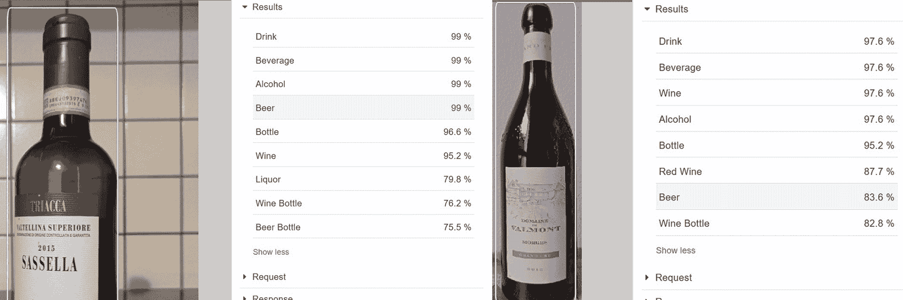

图 2-3：使用标准标签的`AWS Rekognition`。在此示例中，该服务可靠地确定这是一个瓶子。该服务在处理左侧瓶子（它是一个半尺寸瓶子）时遇到困难，并认为它更可能是啤酒而不是葡萄酒。在右侧，该服务甚至检测到这是一个红葡萄酒瓶。

公司可以通过在现有 AI 服务（如`LogoGrab`）的基础上进行构建，从而更快地进行创新。他们将此类服务集成到自己的流程和软件解决方案中。他们不需要 AI 项目或数据科学家。不存在因 AI 模型问题而导致项目延迟或失败的风险。

在许多情况下，通用 AI 服务不足以应对具体场景。如果一位营销专家需要判断图片中是瑞士葡萄酒、其他葡萄酒还是其他饮料，她该怎么办？她需要一个针对其特定细分领域进行定制和训练的神经网络。

如前所述，`AWS Rekognition`附带了一组该服务可以识别的标准对象类型（例如在图片中）。然而，`AWS Rekognition`更加强大。工程师可以训练他们特定的神经网络，以检测其特定需求的对象类型。工程师必须提供样本图片，例如瑞士葡萄酒瓶的图片。然后，**`AWS Rekognition Custom Label`** 会为这些客户特定的对象类别训练一个机器学习模型。

这个`AWS`服务只是构成**定制化 AI 层**的服务之一。它们基于客户提供的客户特定训练数据，训练并提供现成的、客户特定的神经网络。在图 2-4 中，一位瑞士葡萄酒的营销专家可能想了解节日参与者是更喜欢瑞士葡萄酒、其他葡萄酒还是其他饮料。因此，她准备了带有这三种饮料类型标签的训练和测试数据图片。当点击“训练模型”按钮时，`AWS`无需任何进一步输入，也无需任何 AI 知识，就能生成神经网络。


图 2-4：在`AWS Rekognition Custom Label`（控制台视图）中准备训练和测试数据集。数据科学家可以上传图片并为其添加标签。

定制化 AI 对于那些希望优化特定业务流程步骤以获得竞争优势的公司来说极具吸引力。得益于定制化 AI，他们无需庞大的数据科学团队就能实现这些目标。他们可以使用摄像头在生产线上检查产品是否存在缺陷。因此，他们收集可以发货和不能发货给客户的产品样本图片，让定制化 AI 服务训练一个神经网络，并将此 AI 模型应用于来自生产线上方摄像头的图像。所有典型的供应商都提供定制化 AI 服务：云提供商以及分析和 AI 软件供应商。

AI 服务、定制化 AI、AI 框架和 AI 专用硬件——AI 创新有多种形式。对于创新而言，公司和组织主要依赖大学培养的数据科学家。这些数据科学家非常了解 AI 框架层。然而，这一层更适合学术研究人员，而不是（大多数）公司的关注点。因此，管理者必须清晰地传达他们的战略：公司正在哪个（些）层上进行 AI 创新？AI 服务、定制化 AI、AI 框架，还是专用硬件？这个四层 AI 技术栈可以作为任何 AI 项目和任何 AI 管理者的沟通工具。

## 界定 AI 项目范围

清晰的项目范围是任何项目成功的关键因素；这是我管理和重组 IT 项目的个人经验。这条规则同样适用于 AI 项目。高级管理人员资助这些项目，是因为他们希望或必须实现特定目标，而 AI 可能会有所帮助。因此，首先，AI 项目经理必须理解这些目标，并交付预期的成果。他们的第二个辅助目标是确保项目团队专注于这些目标，而不将时间和精力花费在可选或不相关的话题上。

六步 AI 项目范围界定指南（图 2-5）有助于 AI 项目经理实现这一目标。根据具体情况，项目经理本人（可能连同解决方案架构师和 AI 专家一起）处理这些主题。或者，根据组织环境，他可能将这些主题委托给传统的业务分析师和架构师角色，或者委托给我们在后续章节中讨论的较新的 AI 翻译员角色。重要的是对业务主题和 AI 技术的良好理解，并结合社交技能。一旦项目完成了这六个步骤，技术实施就开始了，即处理模型并集成整体应用架构，希望遵循结构化的方法论。

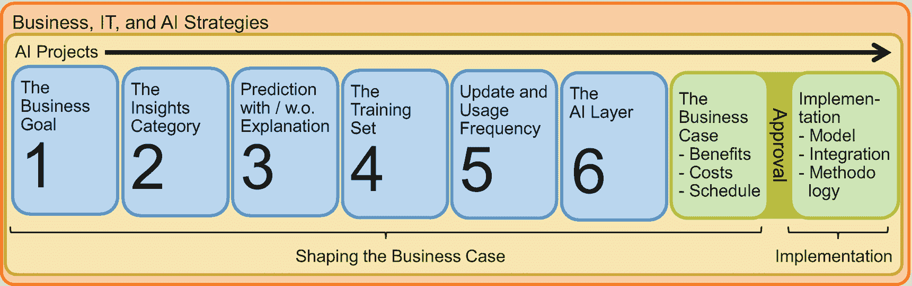

图 2-5：界定 AI 项目范围的六个步骤——并形成商业案例

### 理解业务目标

第一步是一项相当通用的项目管理任务：理解业务想要实现什么。当企业投入五十万或三百万欧元来实施 AI 解决方案时，这清楚地表明了对 AI 创新潜力的信任。显然，他们相信 AI 能帮助他们更好地运营业务。然而，为了避免失望，商业案例必须回答以下问题：

-   业务的具体目标是什么？他们为何投资？
-   判断项目是否交付了所有预期成果的标准是什么？
-   该项目与战略性和战术性业务目标有何关联？
-   预期的项目时间线是怎样的？
-   是否已有预算？预算金额是多少？

这些问题的答案有助于撰写实际的商业案例。AI 项目经理可以验证管理层的期望与范围界定阶段之后实际的高层项目规划是否匹配。项目的方向、可交付成果和时间线是否符合高级管理层的期望？

### 理解洞察类别

范围界定的第二步是将业务问题转化为 AI 问题。解决方案是监督学习还是无监督学习？需要哪个子类别？无监督学习中的聚类、关联或降维，还是监督学习中的预测和分类？训练数据由表格、文本、音频、视频还是其他数据类型组成？图 2-6 提供了一个初步概览。

`监督`学习算法使用包含输入和对应正确输出的训练数据。它总是一个配对，例如一个英文单词及其对应的德语翻译：`<red, rot> <hat, Hut>`。监督学习的一个子类别是`分类`。分类算法将数据项或对象归入已定义的类别之一。其工作原理类似于《哈利·波特》书籍和电影中的分院帽。分院帽会为每位新生决定他/她最适合并应在未来几年居住的四个学院之一。一个典型的分类用例是图像识别：图片中是猫还是狗？

`预测`是监督学习洞察的第二个类别。我们应该订购多少糖和奶油才能生产出足够的冰淇淋供明天销售？根据去年的数据、今天的天气以及明天的天气预报，明天的冰淇淋销量会是多少？监督学习通常可以直接采取行动。因此，它们对于旨在成为数据驱动和 AI 赋能的企业和组织来说，在转变运营业务流程方面非常有益。

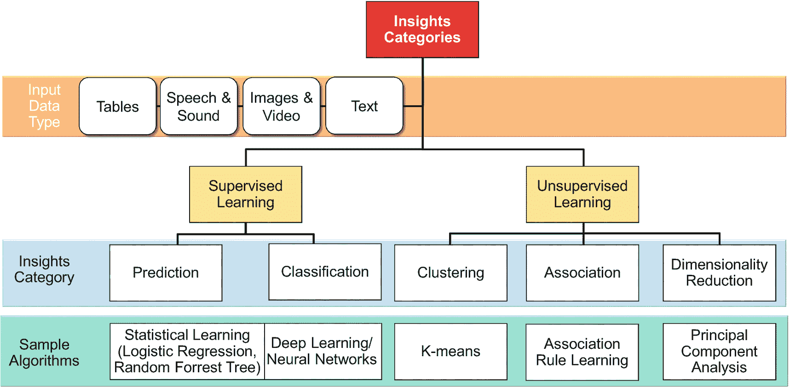

图 2-6  
洞察类别 – 快速概览

`无监督`学习对输入数据进行结构化处理。`聚类`算法会查看所有数据点。例如，它会得出三个彼此非常接近的数据点组：注重地位的客户、对价格敏感的客户以及暴发户客户。聚类为销售和市场部门以及产品经理提供了额外的洞察，但不会直接触发任何行动。`关联`识别数据元素之间的关系，而`降维`则简化复杂的高维数据，例如去除图像中的噪声。

通常，无监督学习算法会揭示数据中隐藏的结构，但（通常）不会直接告诉你要做什么。虽然本书主要使用监督学习算法作为示例，但许多方法论同样适用于无监督学习算法。

当项目确定了所需的洞察类别后，下一步是理解用于训练模型的数据类型——以及从何处获取这些数据。`数据库`或`CSV/Excel 表格`是常见的格式，尽管具体的格式或文件类型并不重要。重要的是机器学习算法能获得结构化的、类似表格的输入。

`图像和视频`是其他类型的输入数据。它们有助于处理生产过程中的摄像头图像，检查生产出的物品是否质量良好，或处理来自闭路电视的视频流以检查是否有人员进入限制区域。`语音和声音`（例如，发动机噪音）或文档或电子邮件形式的`文本`是其他可选类型。

确切的数据类型本身并不影响 AI 能否提出解决方案。它更多是为了做出更好的工作量估算（简而言之：处理表格比处理语音工作量小）并更精确地规划时间线。此外，AI 项目经理可以验证数据科学家在解决此业务问题所需的特定 AI 领域的经验水平。没有项目经理希望在项目中途才发现项目缺少关键技能，不清楚是否存在合适的 AI 代码库，或者必须寻找特定的外部服务来构建解决方案。

回答了范围界定第二步中提出的问题，会使项目更接近于决定使用哪些 AI 方法和算法。然而，这个决定仍然需要明确可解释性问题。

### “仅预测” vs. “预测与解释”

两个相似的问题需要略有不同的方法以及可能不同的 AI 学习算法。假设一个电视流媒体平台的销售部门想要提升销售额。首先，他们可以询问应该给哪些客户打电话，以便在一周内尽可能多地销售订阅升级。其次，他们可能有兴趣了解他们的客户群与总体人群有何不同。例如，产品经理可能意识到她的客户主要位于瑞士的德语区。增加法语和意大利语的产品选项可能是促进瑞士业务增长的一个选择。

第一个选项（提供潜在买家名单）是操作性的。销售经理需要一份应该打电话或发邮件的客户名单。他们不关心这份名单是来自统计模型、一个没人能理解的 100 层神经网络，还是来自用水晶球占卜的算命先生。他们需要一份能准确预测谁会购买的名单。

第二个问题询问的是买家的特征。同样，数据科学家需要一个能预测谁可能购买什么的模型。但这次，理解和解释模型至关重要。属性及其值很重要。它们有助于区分购买客户和其他客户。算命先生或 100 层神经网络可能在预测上非常准确，但准确性较低的统计模型通常更擅长理解特征。“可解释性”是后面某一章中的一个重要主题。

因此，AI 项目经理或数据科学家可以提供“仅预测”的 AI 模型，或者必须交付“预测与解释”的模型。这就像把房子刷成白色或粉色。两者皆可。你只需非常清楚地阐明你的客户期望什么，以防止日后出现惊讶的反应。

### 训练集的挑战

训练人工智能模型需要优质的训练数据。训练数据越好，训练出的模型准确率就越高。人工智能训练算法无疑至关重要，但根据经验法则，人工智能模型的质量不可能超过其输入训练数据的质量。五位顶尖生物学家讨论某张图片上的植物是什么，能比一只醉醺醺的猴子做同样的事准备出更好的训练数据。假设目标是让决策“比人类更出色”。关于何时以及如何实现这一点，有三种解释：

*   模仿比普通人类专家更优秀的人（“五位顶尖生物学家”）。
*   自动获取的真实世界训练数据，例如来自购物篮或服务器日志的数据。
*   人类会疲劳，因此会犯更多错误，而人工智能组件不会。

因此，在质量保证或事件分析等领域，将人类判断自动化需要由知识渊博的人来准备训练集。

对于监督学习，训练数据依赖于样本输入值以及预期的正确输出。训练一个区分西红柿和樱桃的模型，需要大量带有标签的样本图像，标明某张具体图像是樱桃还是西红柿。获取这样带有标签的训练数据对许多项目来说都是一个挑战。

总的来说，主要有四种方法：日志、手动标注、从网络下载现有训练集以及数据库导出。**现有的训练集**使研究人员能够为图像分类等常见问题开发更好的算法。它们通常有助于验证那些已有多种解决方案的挑战性算法。因此，总的来说，它们对学术界更有益。企业应检查是否已经存在（预训练且）可直接使用的模型。毫不奇怪，商业人工智能项目通常使用**日志**（例如，客户的购物历史或显示客户如何浏览网页的点击日志）或耗时的**手动数据标注**（例如，人工标记图像中是否包含樱桃或西红柿）来构建训练数据集。从**数据库和数据仓库导出**构建训练集，通常适用于商业或商务领域的人工智能场景，例如销售，并且可能结合日志使用。

### 模型更新与使用频率

人工智能项目的一个重大成本模块是将人工智能组件**集成**到整体应用架构中。这需要大量的时间和工程资源来让人工智能组件与现有及新的应用程序顺畅协作。与此密切相关的是**自动化**，即从各种源系统收集训练数据，并对数据进行清洗和转换以创建人工智能模型。

人工智能项目经理必须了解其项目在多大程度上需要劳动密集型的集成和自动化功能。关键的决策参数是模型使用频率和模型更新频率。**模型使用频率**表示人工智能模型（例如，对图片进行分类或预测客户行为）的使用频率。该模型是用于一次性的、非常具体的邮件营销活动，之后就不再使用了吗？还是用于一个每天计算要突出展示哪些商品项的网店？模型使用得越频繁，将人工智能模型集成到应用架构中的益处就越大。集成通过自动化将文件和数据从人工智能训练环境传输到生产系统来减少人工工作。这种技术集成最大限度地降低了手动数据传输的操作风险，例如复制错误的文件或忘记上传新数据。此类错误的实际影响可能很严重。一个网店可能会推荐不符合客户需求的商品。十几岁的男性顾客可能不会在一个试图向他们推销昂贵粉色手包的网店上花更多钱。因此，对于频繁使用的模型，需要将人工智能组件与其他应用程序进行充分测试的集成，以减少人工工作和操作风险。

与模型使用频率密切相关的是**模型更新频率**。它指的是数据科学家重新训练人工智能模型的频率。重新训练意味着保持模型结构、数据源、输出数据结构等不变，“仅仅”更新模型的参数值，使其反映最新的数据。重新训练的频率取决于现实世界及其在数据中的反映变化的频率。当一家运动时尚店为冬季和滑雪季训练了一个模型后，该店不应在炎热的夏季（此时每个人都在海滩或户外泳池度过周末和夜晚）使用同一个模型。建议为粉色比基尼搭配粉色滑雪板可能会让网店登上新闻，但不会带来额外收入。我们观察到与使用频率类似的模式：如果数据科学家必须频繁地执行相同的过程（这次是更新模型的过程），那么是时候将数据收集和准备重新训练模型的工作自动化了。

对人工智能项目经理来说，结论很简单。在项目范围界定阶段，他们必须了解人工智能模型和人工智能训练环境需要与其余 IT 应用架构集成的深度。答案会极大地影响项目成本和进度。

### 确定合适的人工智能层

最后一个范围界定问题旨在明确人工智能项目在多大程度上可以依赖现有的外部人工智能解决方案和服务。这个话题与我们本章开头讨论的人工智能技术栈有关。一个项目可以基于现成的人工智能服务来构建。在这种情况下，项目团队无需具备任何人工智能技能，就能设计出具有人工智能功能的解决方案。其次是定制预训练人工智能模型的领域。例如，预训练模型可以检测汽车，但项目希望它能区分宝马和雪铁龙。最后，人工智能项目可以使用例如`TensorFlow`以及最适合其需求的神经网络架构。

这最后一个关于人工智能层的范围界定问题比之前的问题需要更多的人工智能知识。一个项目甚至可能需要调研市场，以了解是否有合适的外部服务或工具能提供所设想的人工智能功能。这些问题对项目及其商业案例有着巨大影响。它们决定了项目是否需要以及需要多少名数据科学家。

### 从范围界定问题到商业案例

范围界定问题有助于 AI 项目经理在邀请资深数据科学家和软件架构师（或外部供应商）制定高层级项目计划之前，厘清诸多细节。

此阶段的项目计划需确定主要里程碑和潜在有价值的中间交付物，例如最小可行产品。它应说明各里程碑大致何时能实现，并列出所需资源。资源涵盖需要多少名具备特定技能的工程师，并可能指出关键岗位的内部候选人。资源同样包括外部人员、许可证和计算基础设施（无论是内部服务器、高性能笔记本电脑还是公有云资源）的财务预算。

制定项目计划和所需资源是项目经理处理非 AI 和 AI 项目的标准流程。通常，他们必须遵循公司特定的强制性规则和流程，并填写标准模板。

仅包含项目计划和费用的商业案例是不完整的。管理层同样希望了解收益和潜在的投资回报。前一章节已更详细地介绍了 AI 项目的潜在收益。

最终，重要时刻来临。高级经理或管理委员会将根据你的商业案例，决定作为 AI 项目经理的你能否获得项目资金。通过明确的范围、令人信服的高层级项目计划以及针对性的详细商业收益，你可以最大化成功几率。如果获得资金，数据科学家们将乐于准备并着手开发预期的 AI 模型——他们的核心项目交付物。

## 理解 AI 模型

AI 模型旨在解决特定的、狭窄的问题。一个模型可能以闭路电视录像作为输入，并输出摄像头上的“移动物体”是无害的猫还是潜在的窃贼。半个多世纪以来，AI 领域的研究和工程提出了多种生成此类洞察的方法。它们主要分为两大类：计算智能和符号人工智能。

基于符号人工智能的解决方案显式地表示知识，例如使用一阶逻辑或形式语言。这些系统拥有对其符号知识进行操作的形式化规则或操作。这类系统在我上世纪 90 年代末上大学时很流行。因此，一些读者可能熟悉该领域某些概念和语言的名称，例如`状态空间`、`手段-目的分析`、`积木世界`、`专家系统`或`Prolog`和`Lisp`。

一个易于理解的示例如下`Prolog`代码片段。系统知道一个小群体中谁喜欢谁的一些事实：

```
/* 让我们从一些事实开始…… */
likes(peter, john) /* 彼得喜欢约翰*/
likes(peter, andrea) /* 彼得喜欢安德莉亚*/
likes(peter, sophie) /* 彼得喜欢苏菲*/
likes(john, peter) /*约翰喜欢彼得*/
```

推理规则生成新知识并驱动系统的推理。在此示例中，一条规则将朋友定义为相互喜欢对方的两个人。

```
/* 定义友谊的规则…… */
friends(x, y) :- likes (x,y), likes (y,x)
```

向`Prolog`提出查询即启动推理过程。系统尝试证明或反驳一个陈述（安德莉亚和约翰是朋友吗？），或确定使查询成立的值（彼得的朋友是谁？）。

```
/* 让我们提出查询，让系统进行一些推理…… */
?- friends(john, andrea)
No
?- friends(peter, X)
X = john
```

如今，第二大 AI 方法组——计算智能——要流行得多。它以完全不同的方式处理知识和事实的表示、推理以及洞察生成。计算智能方法将信息或事实存储为数字。没有显式的知识表示。洞察生成意味着对大型矩阵进行乘法和操作。

图 2-7 提供了一个示例。输入图片是一个大型矩阵，其中的数字代表颜色和亮度。然后系统实现矩阵运算——即推理和洞察生成。该图包含了第一个矩阵运算，即对单元格值进行平均以减小矩阵尺寸。经过更多矩阵运算后，系统会判断该图像是汽车、卡车、船只还是飞机。

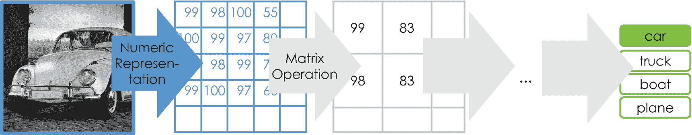

图 2-7

计算智能：通过数字表示图像内容，后续处理也基于数值运算，本例中通过计算输入作为第一步处理和推理步骤。（图片来源：[`​pixabay.​com/​photos/​vw-beetle-oldtimer-classic-1396111/​`](https://pixabay.com/photos/vw-beetle-oldtimer-classic-1396111/)）

计算智能算法是企业当前 AI 革命的核心。虽然数据科学家知道在何种情境下使用何种算法和方法，但 AI 项目经理需要基本理解，以便在“完成定义”或质量保证讨论中做出贡献。对众多算法感兴趣的读者，可以在各种以算法为中心的 AI 教科书中找到详细论述。

下文我们将聚焦于两个示例：一种老式的统计方法（有些人甚至可能不认为它是 AI）和深度学习神经网络。对于后者，我们将介绍基本的神经网络概念并讨论高级拓扑结构。这些算法需要一些入门级数学知识，但即使没有，理解其精髓也是可能的。

### 基于统计的模型

数学家和统计学家在过去几十年甚至几个世纪里开发了各种算法。其中许多算法非常适合处理基于表格的、类似 Excel 的输入数据，这类数据通常存在于 ERP 或核心银行系统中。我们聚焦于一种算法，并从宏观层面进行审视：线性回归。假设一个二手车在线市场想要加入“公平价格”功能。该功能旨在通过向合同双方建议一个“公平价格”，来促进汽车经销商与客户之间的信任，从而使交易更加顺畅。因此，该市场需要算法来估算，例如，一辆保时捷 911 3.8 Turbo Cabrio 的市场价格。

在第一步，模型可能只考虑一个输入参数来进行价格估算：车龄。由于我们使用线性回归，确定汽车价格的数学函数是一个线性函数：

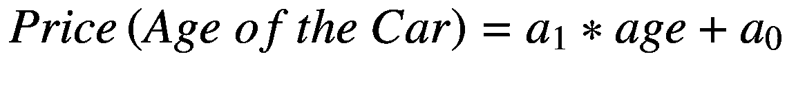

一旦我们知道了两笔汽车销售的价格——例如，一辆 12 个月车龄的汽车售价为 153,900 欧元，一辆 28 个月车龄的汽车售价为 124,150 欧元——我们将这两个数据点放入图表中，并画一条穿过它们的直线。这条直线就是我们汽车价格估算的线性函数（图 2-8，左侧）。

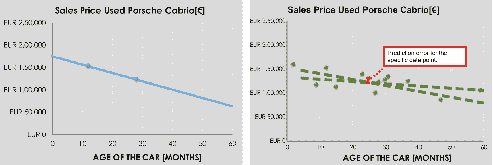

图 2-8

使用线性回归进行价格预测

然而，一个好的定价模型需要成百上千个数据点。图 2-8（右侧）说明了这一点。该示例包含许多数据点，这意味着模型精度应该不错。但是，如果数据点超过两个，要画一条穿过所有数据点的直线是（几乎）不可能的。那么，线性回归如何提供帮助呢？基本上，有两个需求：

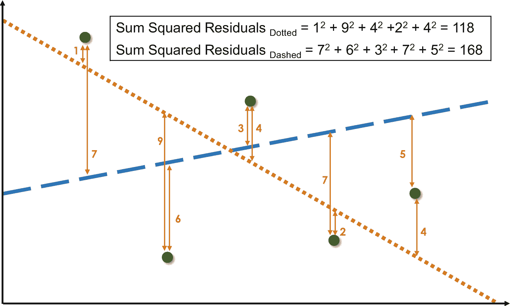

图 2-9

用两条估算函数（虚线和点划线）说明最小二乘法。算法为每个数据点计算预测值与实际数据之间的偏差（残差）。然后，算法对残差进行平方并求和。虚线的结果是 118，点划线的结果是 168。因此，虚线是两者中较好的。然而，可能存在更好的函数，需要额外的实验来寻找。

*   一个误差度量标准，用于衡量函数反映现实的程度。该度量标准使得两个或多个估算函数具有可比性。我们可以衡量哪个函数能更好地估算销售价格。一个广泛用于此目的的度量标准是“最小二乘法”（见图 2-9）。
*   一个算法，它系统地或随机地尝试参数的各种值，例如示例中的 `a[0]` 和 `a[1]`。该算法使用误差度量标准来计算特定参数设置的质量。它会重新调整参数并再次计算误差——直到算法决定终止优化，并返回 `a[0]` 和 `a[1]` 的最佳值。

我们已经提到了影响模型质量的两个因素：学习算法以及训练数据集的大小和质量。同样重要的是模型包含了哪些属性。在我们的示例中，汽车的公平价格估算函数只考虑了一个属性：车龄（`v[1]`）。即使使用数百万个销售数据点进行训练，该函数也是不充分的。原因在于：其他各种因素也显著影响汽车的价格，例如，行驶里程数（`v[2]`）、车辆是否发生过重大事故（`v[3]`）、是否有空调（`v[4]`）或高端音响系统（`v[5]`）。因此，我们得到一个需要优化的更复杂的价格估算函数：

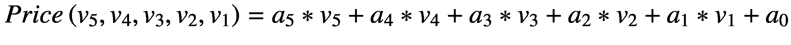

这种线性回归函数的基本假设是问题的本质是线性的。然而，二手车价格估算函数**不是线性的**。当汽车经销商首次将汽车卖给客户时，汽车价值会大幅下降。之后价格下降速度会放缓，并且通常销售价格不会变为负数。根据问题的性质，用不同的（更复杂的）数学函数替换线性估算函数会得到更好的估算结果。

另一个类似于线性回归的算法是**逻辑回归**。逻辑回归有助于分类任务，例如判断特定的信用卡支付是否为欺诈。通常，最后会应用诸如 Sigmoid 函数之类的函数来提供介于 0 和 1 之间的分类值（见图 2-10，左侧）。如果该值大于或等于 0.5，则可能是“是”，否则为“否”。

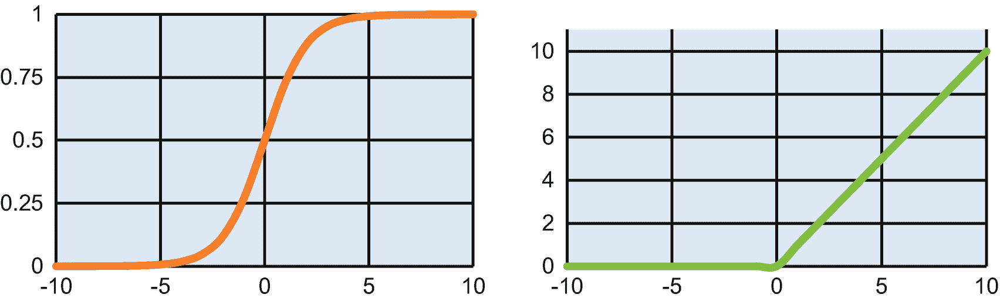

图 2-10

Sigmoid 函数（左侧）和整流器——或 ReLU，修正线性单元——函数（右侧）

### 神经网络

神经网络与统计回归算法的用途相似。它们能够实现更复杂、更精确的预测或分类逻辑，因此在图像识别和自然语言处理等任务中尤为有用。

神经网络的历史可追溯至 20 世纪 50 年代，当时罗森布拉特开发了感知机，用于检测（小型）图像中的模式。关键算法则诞生于 20 世纪 80 年代和 90 年代。其重大突破发生在 2010 年代，并由此在当今工业界得到广泛应用。推动其发展的因素包括计算能力的爆发式增长，以及文本、图像、音频或视频等可用数据的激增。云服务是神经网络普及的最新催化剂。云服务提供商提供高度可扩展的计算资源和即用型 AI 服务。

人脑及其神经元和突触是人工神经网络的灵感来源。神经元是处理单元，突触则连接神经元以交换信息，从而驱动神经网络的信息处理。一个神经元是否被激活并“触发”，（也）取决于其输入神经元的激活状态。

人工神经网络通过两个步骤实现单个神经元的**推理**。首先，神经元计算来自所有前馈神经元的激活值的加权和。在图 2-11 中，神经元 A、B、C 和 D 将其激活值`a[A]`、`a[B]`、`a[C]`和`a[D]`传播给神经元 N。神经元 N 使用权重`w[AN]`、`w[BN]`、`w[CN]`和`w[DN]`计算这些激活值的加权和。因此，计算公式为：`a[A]*w[AN] + a[B]*w[BN] + a[C]*w[CN] + a[D]*w[DN]`。

当权重为正时，连接会促进神经元 N 触发；若权重为负，则会抑制神经元 N 的触发。除了已提及的权重外，通常还会在计算中加入一个称为“偏置”的值，得到如下表达式：`a[A]*w[AN] + a[B]*w[BN] + a[C]*w[CN] + a[D]*w[DN] + b[N]`。

偏置的作用是在 x 轴上平移函数图像。其目的在考察神经元的第二个处理步骤时会变得清晰：神经元对加权和施加一个激活函数，从而得到该神经元的激活值。一种广泛使用的激活函数是整流线性单元（ReLU）函数（见图 2-10，右侧）。如果加权和为正，它返回该值；否则返回 0。这个激活值随后被馈送给其他神经元，例如图 2-11 中的神经元 X、Y 和 Z。

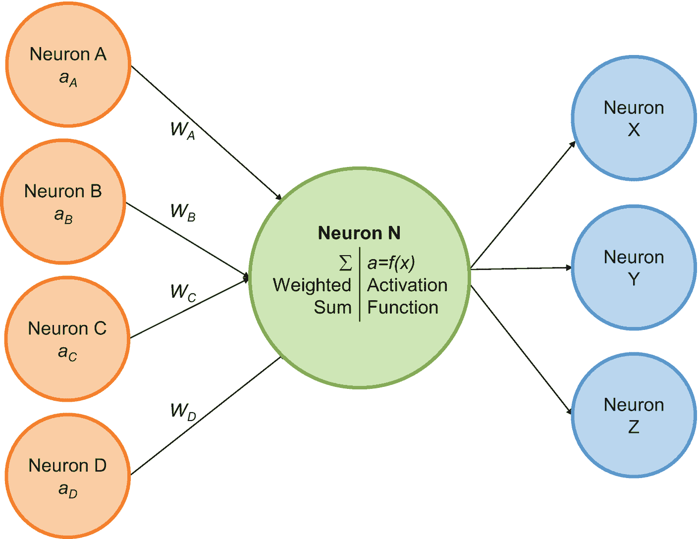

图 2-11

神经元模型

神经网络由大量神经元组成，这些神经元被分组为层（图 2-12）。第一层是输入层，其神经元代表外部世界，例如涡轮机中压力传感器的数值或摄像头的像素。最后一层是**输出层**，它提供人工神经网络的推理结果。根据神经网络的目的，输出层由一个或多个神经元组成。对于二元分类问题——例如图像中是否包含狗或猫——一个神经元就足够了。接近 1 的值表示狗，接近 0 的值表示猫。假设一个神经网络要对动物图片进行分类，例如判断图像是狗、猫、海豚还是蝠鲼，那么输出层将由对应不同动物的多个神经元组成。

在输入层和输出层之间，神经网络可以有零个、一个或多个**隐藏层**。在最简单的神经网络拓扑结构中，一层的所有神经元将其激活值馈送给下一层的所有神经元——这就是全连接神经网络。

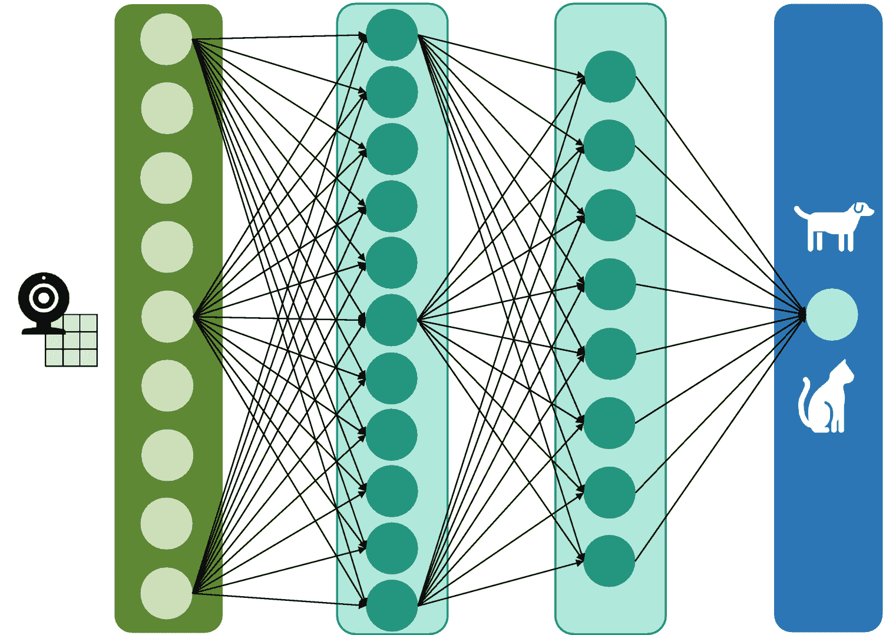

图 2-12

具有两个隐藏层的神经网络拓扑结构

在**训练神经网络**时，第一步是从训练集中选择一个数据项作为输入。我们计算神经网络对该数据项的预测或分类结果，并将神经网络的结果与正确输出进行比较。由于该数据项来自我们的训练集，我们知道正确结果。正确结果与实际结果之间的差异是第二步的输入，用于重新调整权重。对于这种重新调整或学习步骤，数据科学家通常使用反向传播算法——一种梯度下降算法。反向传播算法首先优化输出层的权重，然后逐层向后优化。

权重是神经网络架构的参数，代表了人工神经网络的“大脑”或智能。控制学习过程的参数称为超参数。神经网络架构（如层数和神经元数量）是一个超参数，学习率也是如此。学习率影响当训练数据项的实际输出与正确输出存在差异时，权重调整的幅度。较高的学习率使神经网络在初期能够快速学习。随着时间的推移，学习率必须降低，以确保神经网络收敛到稳定的权重。

### 高级神经网络拓扑结构

近年来，神经网络研究取得了显著进展。数据科学家针对计算机视觉和图像识别等特定应用领域，改进并调整了神经网络架构。他们放宽了“神经元仅将其激活值传播到下一层的所有神经元，而不传播到其他任何地方”这一拓扑规则。这种放宽为三种重要的神经网络拓扑变体奠定了基础：卷积神经网络、循环神经网络和残差神经网络。`残差神经网络`不仅将其神经元的激活值传播到下一层，还可以将这些激活值馈送到更远的层。例如，在图 2-13 中，第 3 层不仅将其激活值转发到第 4 层，还转发到第 6 层。

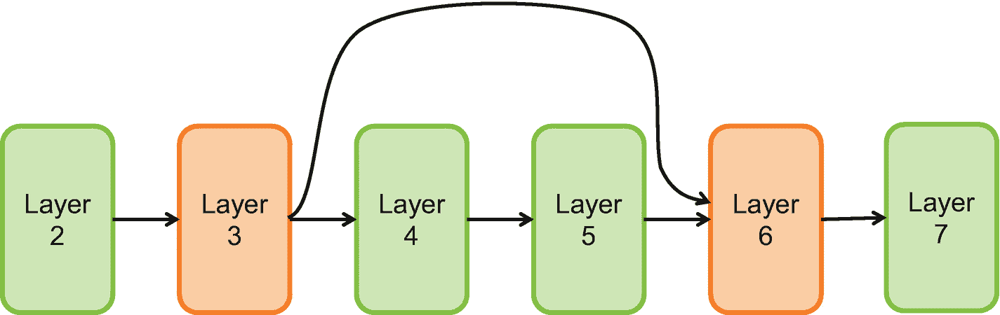

图 2-13  
残差神经网络

`卷积层`是另一种拓扑变体。它们与全连接神经网络层在两个方面有所不同（图 2-14）。首先，卷积层的神经元并不考虑前一层所有神经元的激活值。它们只考虑特定的共置神经元，例如图像的相邻像素。例如，只有前一层中一个 3x3 的神经元矩阵将其激活值作为下一层特定神经元的输入。其次，卷积层的神经元以不同的方式计算其激活值。它们使用一个带有权重的滤波器（称为卷积核）。该滤波器就像一个在包含前一层激活值的矩阵上移动的窗口。

在图 2-14（右侧）中，卷积核的左上角单元格的值为“1”。在计算黑色单元格的值时，激活矩阵中值为“0.9”的左上角值会与权重“1”相乘。然后，“0.7”与“0”相乘，“-1”与“0.1”相乘。这种计算会持续进行，直到处理完滤波器矩阵中的所有其他单元格。为了计算灰色单元格的值，我们从“0.7”开始，将其与“1”相乘。

数据科学家将带有卷积层的神经网络拓扑结构应用于特定的人工智能应用领域，例如处理复杂问题的计算机视觉。这些网络由二十或三十层组成，是全连接层、残差层和许多卷积层的混合体。

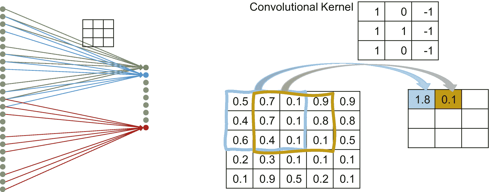

图 2-14  
神经网络的高级架构模式：卷积层/卷积神经网络。左侧展示了拓扑方面，即两层中神经元的连接方式，右侧展示了一个示例滤波器矩阵

在时间序列预测或自然语言与语音处理中，`循环神经网络`是一种流行的神经网络拓扑选择。这种拓扑反映了输入的顺序至关重要。在理解文本时，“Heidi kills Peter”和“Peter kills Heidi”具有不同的含义。循环神经网络连接同一层内的节点，以反映顺序方面（图 2-15）。复杂的循环神经网络拓扑结构基于众所周知的神经网络架构模式，例如长短期记忆单元（LSTM）或门控循环单元（GRU）。它们引入了用于存储先前状态信息的“记忆”概念。在思考犯罪故事时，记忆的相关性很容易理解。这本书可能以“Heidi killed Peter”这句话开头。这句话包含的信息在两句或二十句之后，当警察逮捕 Heidi 时，仍然相关。

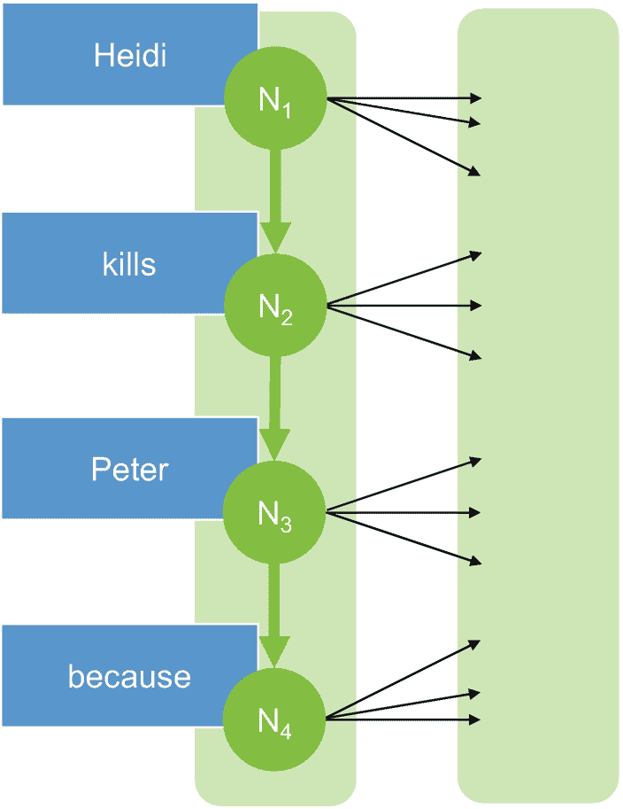

图 2-15  
循环神经网络。其特点是同一层内神经元之间的连接，由粗体绿色箭头表示

即使不设计或优化拓扑结构，AI 项目经理也能从对高级神经网络拓扑结构的基本理解中受益。他们应该意识到存在各种最佳实践拓扑结构。此外，他们应该成为数据科学家的合作伙伴，而不是建议设计和优化公司特定且用例特定的神经网络拓扑结构（并投入数月的工作）而放弃使用最佳实践拓扑结构。

存在最佳实践拓扑结构这一事实会影响项目团队。首先，这是使用现有的、训练有素的 AI 模型（例如来自云提供商的模型）的额外动力。其次，假设项目踏上了设计和实现自己神经网络的旅程。在这种情况下，项目经理应确保其项目团队中拥有一位经验丰富的数据科学家。理想情况下，他能够说服一位在具体应用领域拥有专业知识的高级数据科学家加入。否则，他应尝试至少从这样的人那里获得临时支持。

## 开发 AI 模型

过去几十年给 IT 行业和 IT 专业人士的教训是，非结构化、不协调的工程或非系统性的实验是一条捷径。它唯一的缺点是：它通向灾难，而非成功。因此，AI 项目经理应确保“他的”AI 模型的工程是源于一个富有创造力且系统化的工程过程。接下来，我们重点介绍每位项目经理都应了解的三个主题：

- `Jupyter Notebooks` 作为最广泛使用的 AI 工具
- `CRISP-DM`（跨行业数据挖掘标准流程）作为一种方法论，用于构建从构思到交付的 AI 项目
- 提高 AI 团队效率的方法

### Jupyter Notebook 现象

`Jupyter Notebooks` 是一款引人入胜的软件。我在第一次学习深度学习和人工智能课程时接触到了它。而在我从事数据管理的二十年里（经常涉及 SQL 编程实践），却从未听说过它。正如 `Google Trends` 所示，对 `Jupyter` 笔记本的兴趣从 2014/2015 年左右开始上升。起初，这种兴趣几乎每年翻一番，并且至今仍在增长（图 2-16）。每位人工智能管理者几乎每天都会听到数据科学家提及它们。如果数据科学家的 `Jupyter Notebooks` 出现问题，就会拖慢他们的工作进度。总的来说，`Jupyter` 笔记本的主要用途是开发 Python 脚本。然而，它们并非简单的类似 TOAD 的工具或 Python 版的 `SQL Developer`。它们是一种处理数据的新方式。

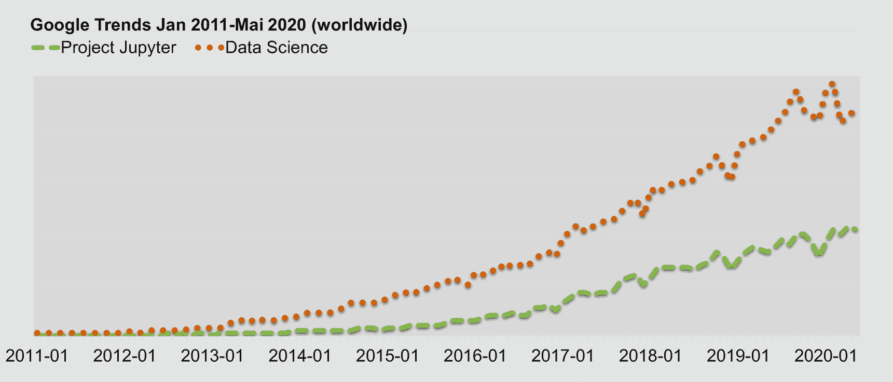

图 2-16

2011 年 1 月至 2020 年 5 月期间，关于“Project Jupyter”和“数据科学”主题兴趣的 Google 趋势分析

`Jupyter Notebooks` 是一个交互式开发环境。其命令支持例如下载数据、清洗或转换数据，以及训练人工智能模型。作为一个交互式环境，数据科学家可以编写几行代码并立即执行。他们可以选择是重新运行整个脚本，还是只运行新的代码行。这个选择至关重要。用于数据准备或生成模型的单个命令可能需要几分钟、几小时甚至几天。为了测试一些新代码行而重新运行整个脚本，通常耗时过长。

除了交互模式，第二个区别在于，使用 `Jupyter Notebooks` 为代码添加注释变得有趣。这与老式的 Java 代码注释不同，感觉更像是在纸质笔记本上做笔记。在编写新命令之前（或之后），添加注释有助于记住其确切目的。否则，数据科学家可能在编写了五条或十条命令之后，就不再记得自己代码中每一行的原因和实际上下文了。`Jupyter Notebooks` 允许对注释进行精美的格式化（例如，粗体、斜体），并集成图片和草图。这些选项表明，注释不仅仅是附加品，而是模型开发过程中不可或缺的一部分。

为了更好地说明 `Jupyter Notebooks` 的概念，图 2-17 包含了一张截图。这个 `Jupyter Notebook` 是一个用于从网络下载图像并将其存储到数组中以便后续处理的脚本。顶部是一个包含注释（“markdown”）的单元格。然后，是一个包含代码的单元格。最初的命令定义并实例化变量，接着是一个用于下载图像的 `for` 循环。最后的命令用于向控制台输出。在包含代码的脚本下方，是 `Jupyter` 笔记本在执行此脚本时写入控制台的输出。

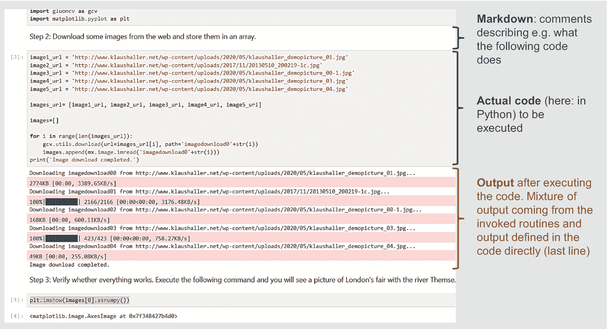

图 2-17

Jupyter Notebook 示例

### 用于模型开发的 CRISP-DM

无论是否使用 `Jupyter` 笔记本，无结构的实验和不协调的工程很少能交付成功的人工智能模型或可运行的人工智能驱动软件解决方案。人工智能项目越大、越重要，方法论就越关键。在人工智能领域，最流行的方法是跨行业数据挖掘标准流程（CRISP-DM）。尽管发布于世纪之交，但其六个阶段（图 2-18）至今仍是行业标准。

第一阶段是业务理解。业务想要实现什么目标——以及相应的人工智能项目目标是什么？业务目标的一个例子是将客户流失率降低 50%。换句话说：当客户需要续签抵押贷款时，更换银行的客户减少了 50%。一个匹配的人工智能项目目标是提供一份下个月可能不续签抵押贷款的 1000 名潜在客户名单。第一阶段还涵盖评估资源状况。项目需要专业知识和充足的人员配备、数据源、工程和人工智能工具，以及训练和生产环境。可能存在需要澄清的法律限制，或者从未被记录下来的隐含的关键基本假设。理解并改善资源状况是制定项目计划的一部分。

因此，`CRISP-DM` 的第一阶段涵盖了在行动项目开始之前与业务案例相关的方面。我们在本章前面的范围界定问题以及上一章的业务收益讨论中详细介绍了这些要素。

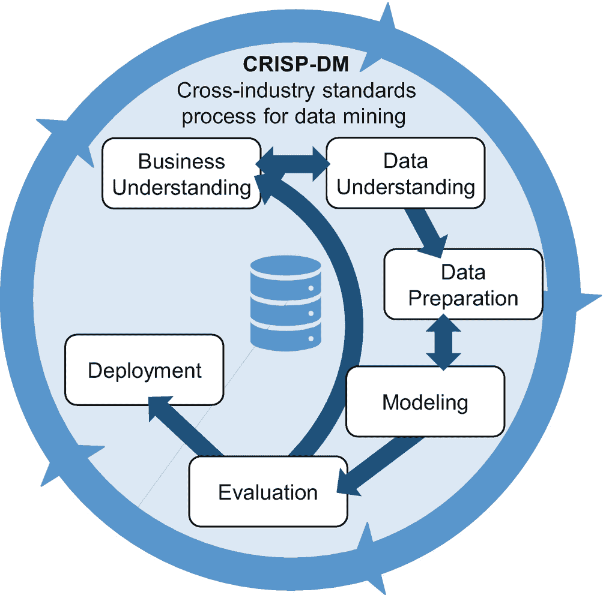

图 2-18

CRISP-DM 模型

第二阶段是数据理解。它始于获取访问权限，并可能从上一阶段确定的数据源复制数据。它涵盖了诸如获取账户、开放防火墙或启动文件传输等任务。数据科学家从高层视角描述并致力于理解数据。他们记录属性的含义、语法（例如，字符串字段与数字字段）、统计分布以及质量。典型的质量问题包括，例如，空字段或仅包含部分数据的表（例如，全球所有客户，但排除了中国或美国）。

在第三阶段——数据准备——数据科学家转换并准备最终的数据集，用于后续的模型创建。他们识别出可能有用的表和属性。经验法则是提供尽可能多的属性，让人工智能训练算法自行决定哪些属性能提高人工智能模型的质量。当试图理解哪些客户可能决定不续签抵押贷款时，我们所知道的关于客户的一切信息都有助于训练模型：账户余额、与银行顾问的联系次数、资金流入和流出——任何与客户、其抵押贷款或其行为和行动广泛相关的信息。数据准备也涵盖特征工程。并非所有潜在有用的输入值都存在于数据库中。数据科学家可能必须从公司的日历解决方案中提取客户顾问的所有客户联系记录，并确定每个客户的联系次数。资产的净流入或流出需要汇总当前和一年前的头寸。

# 数据准备与 CRISP-DM 阶段

数据准备还涵盖数据清洗：跳过属性为空的记录行、将空字段设为默认值，或根据外部信息估算缺失值。在此阶段，数据科学家需要将来自不同表格和数据库的数据整合在一起。所有客户信息必须集中在一个表中，这就要求合并和关联来自一个或多个数据库的表格。核心数据库可能提供账户余额信息，而客户与银行顾问的会面次数则来自客户关系管理系统的表格。最后，有时还需要调整数据的语法或格式：例如布尔值`'Y'`和`'N'`可能需要映射为数字`'0'`和`'1'`。

CRISP-DM 的第四个阶段是**建模**。这是核心任务，也是数据科学家最钟爱的环节：创建人工智能模型。他们需要决定是训练神经网络还是线性回归模型，并定义如何衡量和评估模型质量，在模型创建完成后执行评估。最后，他们需要记录模型的准确率，并对可能相互竞争的模型进行比较。

**评估**阶段将最终决定模型是否可用于生产环境。该阶段涵盖质量保证，以及判断模型是否足够优秀以投入生产。与从 IT/人工智能视角审视模型的建模阶段不同，评估阶段要检验模型是否真正有助于实现业务目标。这甚至可能意味着要在现实中应用和试用模型。例如，某银行分行可能会致电流失风险高的客户。一个月后，项目组将该分行的数据与另一家未采取额外措施挽留潜在流失客户的类似分行进行对比。这种对比能够验证人工智能带来的效益。

第六个也是最后一个阶段是**部署**。项目需要规划模型的使用方式，制定监控策略以检测模型性能退化，并确保人工智能的维护工作。此外，该阶段还包括生成最终项目报告以及举办经验总结研讨会。

项目通常不会以瀑布式线性方式经历这些阶段（参见图 2-18 中的箭头）。有时，后退一步反而能更快或更好地达成最终目标。例如，假设某人工智能项目发现银行上个季度主要流失的是德国客户。这时，合规和销售经理可能会突然想起，正是他们迫使这些客户离开——而他们并未告知人工智能项目团队。于是，新一轮迭代变得必要。事实上，人工智能项目在第二次迭代中会从数据和洞察中获益匪浅。

通常，在缺乏详细的特定公司数据的情况下，项目应规划三次迭代。第二次迭代所需的工作量通常约为第一次的 50%，第三次约为 25%。此外，实践经验表明，实际创建和训练人工智能模型仅占总体时间预算的 10%到 20%。这只是很小的一部分——这也是 IT 组织试图提高数据科学家生产力的原因。他们希望数据科学家能专注于核心任务，并创建能创造商业价值的新模型。

## 提高数据科学家的生产力

提高数据科学家的工作效率是一个重要议题，尽管不同组织的具体动机各不相同。科技公司和初创企业往往无法招募到足够多具备特定技术或领域知识的专家。其他公司——尤其是在 IT 服务或咨询领域——则面临另一种困境。他们（或其客户的管理者）对利用人工智能进行创新有着绝妙的想法。大多数情况下，数据也是可用的。然而，根据我在头脑风暴研讨会上的经验，财务收益、节省的成本与实际项目成本往往并不匹配。没有业务经理愿意投资 10 万瑞士法郎开展一个人工智能项目，只为每年节省 3 万瑞士法郎。人工智能项目很酷，但也很陌生，因此被视为“有风险”。犹豫不决的经理们可能期望看到无懈可击的商业案例。当人工智能组织能够提高生产力时，成本就会下降，而商业价值保持不变。人工智能项目能更快地实现回报，并带来更高的节省或收益。

遵循 CRISP-DM 流程是识别改进潜力的结构化方法（图 2-19）。第一个阶段是“业务理解”。关于**业务分析**和需求分析的广泛现有文献涵盖了理解用户、客户和管理者目标与需求的所有方法论和工具。除了这些通用的方法论知识外，还存在针对人工智能的优化第一阶段的机会。本书在本章开头的**范围界定**部分以及前一章关于商业价值的讨论中对此进行了阐述。


图 2-19

人工智能项目的优化选项

范围界定和业务分析并不能减少数据科学家在清理和准备训练数据以及训练具体模型方面的工作量。然而，良好的业务理解能降低数据科学家未能完全理解业务挑战的风险。对预期目标理解不足，可能会导致——在数周紧张工作之后——得出这样的结论：人工智能模型是正确的且训练有素，但对任何人都没有帮助。

CRISP-DM 流程的第二个阶段“数据理解”涵盖数据收集与获取、理解实际数据以及验证数据质量。此阶段存在两个相关的优化选项：管理训练数据以及建立或引入数据目录。**数据目录**汇总了存储在组织数据湖、数据库和数据仓库中的各种数据集的信息。它有助于数据科学家找到相关的训练数据。其好处是双重的。首先，数据目录减少了数据科学家识别训练数据所需的时间。其次，由于数据科学家能够使用更广泛、更相关的可用训练数据，人工智能模型可能会变得更好。我们将在后续章节中更详细地探讨数据目录。

数据目录有助于找到现有的训练数据。有时，数据科学家会处理那些没有可用训练数据的人工智能解决方案。假设一个由人工智能驱动的应用程序需要根据图像判断装配线上的方向盘是否可以包装并发货给客户。训练这样的模型需要拥有标记为“质量合格”或“质量不合格”的方向盘图像。收集和标记图像既耗时、费力又昂贵，因为训练集必须足够大。在装配线上拍摄 1000 张方向盘照片需要多长时间？其中一些必须适合发货，另一些则不能。对于有缺陷的方向盘，每个质量问题至少需要拍摄 20 张图像。

对于数据科学家和人工智能项目来说，好消息是：他们可以通过`AWS SageMaker Ground Truth`等服务来优化标注任务。该服务通过多种方式革新了标注流程：

1.  将标注任务外包给 AWS 管理的工人或第三方服务提供商。这种外包使数据科学家无需亲自标注大型数据集，也无需识别和协调内部或外部人员来协助他们。如果标注工作不需要过于专业的技能，外包是可行的。此外，数据隐私限制和知识产权保护可能会限制这种外包。

2.  管理劳动力：该服务将待标注的文本或图片批次进行编译，并将其分配给不同的内部或外部贡献者——无需通过邮件和电话询问状态，也无需组织项目会议。

3.  通过让多个贡献者标注相同的图片或文本来提高标注质量。

4.  减少人工标注工作量：AWS 可以区分“简单”的训练数据项。它可以自行标注这些简单项，而具有挑战性的训练数据项则需要人工贡献者来标注。

下一阶段是“数据准备”。这是一项繁琐、耗时且艰巨的工作，旨在将初始数据集整理成有助于训练 AI 模型的形式。数据科学家可以使用特定于 AI 的**集成开发环境**（IDE），例如之前讨论过的`Jupyter`笔记本，来更高效地完成这项工作。这些 IDE 通过允许仅执行长脚本中的选定命令、简化注释和文档的编写以及促进协作，从而加速了开发过程。

自动机器学习（`AutoML`）有望实现数据准备、训练算法选择、超参数设置以及 AI 模型训练的自动化。`AutoML`将这些任务理解为（高维）优化问题，一个智能的`AutoML`算法可以在无需人工干预的情况下自主解决这些问题。你提供一个表格——`AutoML`会返回一个训练好的、可直接使用的 AI 模型。

这听起来像科幻小说，但市场上的各种产品证明了事实并非如此。例如，谷歌的`GCP AutoML Tables`、`SAP Data Intelligence AutoML`或`Microsoft Azure Automated ML`。目前尚不清楚`AutoML`是否以及在何种情况下能够超越或构建出与经验丰富的数据科学家“手工制作”的模型同样优秀的模型。尽管如此，`AutoML`已经是一个游戏规则改变者。它加速并简化了 AI 模型的创建过程，而无需庞大的数据科学团队。帕累托原则（80/20 法则）同样适用于数据科学项目。通常，快速、低投入地获得一个相对较好的模型，比花费数月时间追求完美模型要好。

最后，AI 组织也可以优化部署阶段。这个阶段主要由通用的 IT 工程任务组成。因此，`CI/CD`流水线等通用改进措施能带来好处。AI 模型成为应用程序代码的一部分，或者在独立的 AI 运行时服务器上运行。摩擦越少，潜在错误就越少。其他工程团队联系数据科学家以帮助调试或修复集成问题的频率也会降低。

并非所有介绍的优化方案都对每个 AI 项目都有帮助。在 AI 技术栈中，层级越高，项目和组织需要优化的领域就越少。当公司完全依赖现有的、即用型**AI 服务**时，他们既不需要训练机器学习模型，也不需要处理训练数据。他们将一切都外包了。这样就没有什么可以或需要优化的了。

依赖**定制化 AI**的公司会提供训练数据，但将实际的训练和模型创建委托给外部合作伙伴。采用这种策略的组织可以通过数据目录和改进的数据标注流程来优化其工作。

许多数据科学家和组织（仍然）倾向于使用`TensorFlow`等**AI 框架**来训练机器学习模型。他们受益于数据目录、改进的数据标注流程或 IDE。他们还可以使用`AutoML`来改进和（半）自动化特定的数据科学任务。

总的来说，优化 AI 团队的效率有两个方面。最重要的是，如果可能的话，要追求 AI 技术栈中的高层级。然后，针对所选的 AI 技术层，可以进行额外的优化（图 2-20）。


图 2-20

AI 创新全景图：技术栈、用例、改进方案

# 在 IT 解决方案中集成 AI 模型

网购消费者对这一现象并不陌生。网店会向顾客推荐与购物车内容完美匹配的商品：黑西装配黑袜子？点击！粉色手袋的顾客配粉色鞋子？点击！AI 算法在后台运行。其目标是什么？提升销售额！然而，要让这一切奏效，仅靠 AI 模型是不够的。我们必须将 AI 模型集成到“现实世界”的应用中，例如网店。

那些刚进入大型组织、拥有深厚学术背景的数据科学家，往往低估了集成挑战。他们开始尝试使用商业或免费的 AI 软件包，或是基于云的 AI 服务。他们想通过尝试一些用例来弄清楚是否以及如何从 AI 中获益。此时，他们（尚）不需要 AI 组件与一个或多个应用程序之间的接口。一旦收益变得明显，情况就会发生变化。业务部门和 IT 管理层希望 AI 成为复杂软件解决方案中不可或缺的一部分。例如，一家在线时装店拥有许多与 AI 无关的功能。网店展示时装；顾客可以搜索商品、将其加入购物车并付款。AI 组件只是另一个功能，它“仅仅”为每位顾客确定可能特别感兴趣的商品。AI 组件可能会向购物篮中有西装的顾客推荐黑袜子，并将该推荐信息传输给网店应用程序。然后，顾客就会在浏览器中看到黑袜子作为商品推荐。

AI 组件与应用程序其余部分之间的协作是目标所在。AI——以及具有 AI 功能的软件解决方案——的起点是历史数据。数据科学家需要这些数据来创建 AI 模型，例如用于分析顾客购买行为的模型。然而，如果数据科学家在生产系统上开展工作，那将是一个糟糕的主意。当数据科学家查询大型数据集并运行复杂、资源密集型的语句时，他们可能会干扰日常运营。因此，通过从生产系统中复制或提取数据，并将数据放入具有足够计算能力的训练环境中，从而将他们的工作解耦，这一点至关重要。

一旦 AI 模型准备就绪，数据科学家或 IT 工程师就会将模型部署到生产系统中。没有模型是永恒不变的。基于更新的数据，一个更新的模型会在一天、几周或几个月后取代它（图 2-21）。

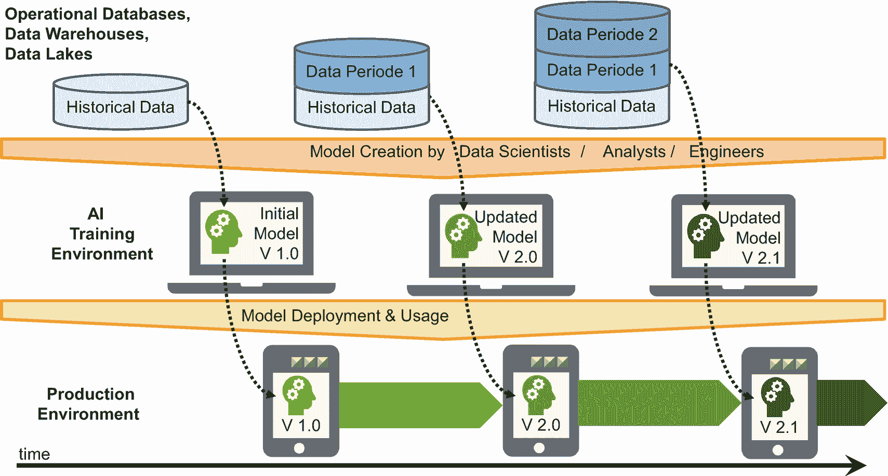

图 2-21

理解数据、模型创建与模型使用

具体的部署或集成可以遵循多种模式。三种主要变体是：

- 预计算
- 重新实现
- 封装的 AI 组件

对于**预计算**，数据科学家开发并创建 AI 模型，例如，该模型为每位顾客确定其最可能购买的下一个商品。接着，数据科学家或 IT 工程师将这些信息上传到应用程序。现在，当顾客稍后再次访问在线商店时，应用程序就知道该向他们推荐哪些商品。应用程序直接使用结果，它并不了解模型本身。AI 组件或环境与应用程序之间无需集成。模型开发和评估在 AI 训练环境中独立进行，而评估或推理始终基于最新的模型（图 2-22）。

如果模型更新的频率与“现实”世界的变化不匹配，预计算就会有一些局限性。以我们的网店为例，在顾客购买了一件霓虹绿鸡尾酒裙后，网店会继续向她推荐该商品，直到下一次数据上传。在这种情况下，广告不仅无法带来额外销售额，还会让顾客觉得这家网店无法提供符合她需求的购物建议。

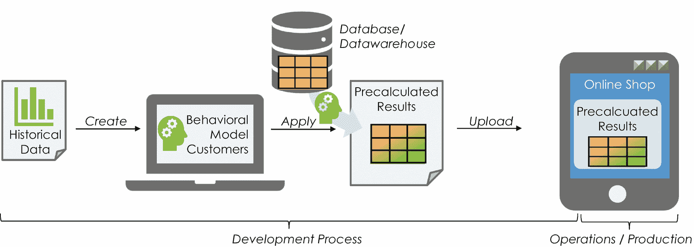

图 2-22

预计算模式

在第二种和第三种变体——重新实现模式和封装的 AI 组件变体中——AI 组件将实时的顾客购物数据输入模型，并始终为网购消费者提供最新的建议。假设数据分析师在 4 月 30 日于其 AI 训练环境中创建了模型。然而，将模型应用于用户数据被推迟到顾客访问网店时。届时，她最新的购物历史会被输入模型，以获取商品推荐。如果她昨天买了一条绿裙子，一小时前又买了一副夸张的太阳镜，AI 组件会考虑到这些信息。在我们的例子中，当顾客在 5 月 17 日访问网店时，应用程序会使用 4 月 30 日创建的模型以及 5 月 17 日的顾客数据。

第二种和第三种变体在技术实现上有所不同。**重新实现模式**意味着为软件应用程序再次编写代码。软件工程师从训练环境中获取模型，然后用另一种语言（例如`Java`）重新实现相同的模型。工程师将神经网络的参数和权重放入一个配置文件中，这样参数更新就无需更改代码。理想情况下，CI/CD 流水线可以实现自动集成。这样的流水线会自动收集所有开发人员和数据科学家的各种来源，创建一个可部署的软件组件，并将其安装在开发、测试和/或生产系统上。因此，当顾客访问网店时，网店中就包含了这个神经网络，就像包含任何其他应用程序功能或代码一样（图 2-23）。

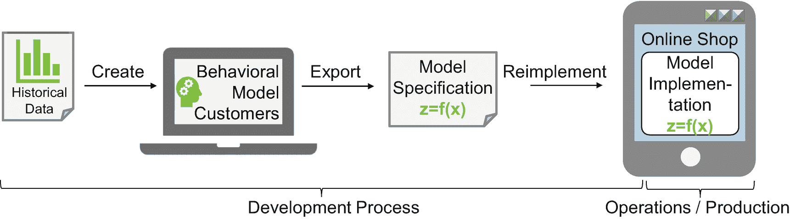

图 2-23

重新实现模式

或者，在封装的 AI 组件模式中，应用程序架构可能包含一个专用的**AI 运行时服务器**（图 2-24）。后者为公司所有依赖 AI 功能的应用程序运行 AI 模型。`RStudio Server`就是这样一个产品。当顾客访问网店时，网店会调用 AI 运行时服务器上的模型，并传入该顾客的购物历史。AI 运行时服务器将购物历史数据输入神经网络，以预测顾客偏好。然后，AI 运行时服务器将此预测结果返回给网店，网店据此向该特定顾客展示并突出推荐相关商品。

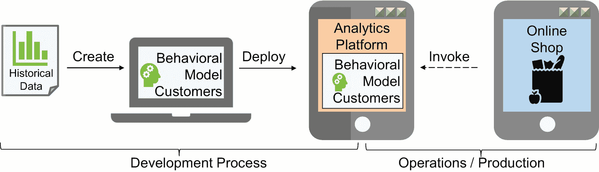

图 2-24

封装的 AI 组件模式

对于这种模式，AI 团队需要搭建、运行并维护一个 AI 运行时服务器，每位数据科学家都将自己的模型部署到该服务器上。

顺便提一句，“能够持续自我优化的模型”听起来既显而易见又富有远见。它们在技术上是可行的。例如，谷歌的 GCP ML Pipeline 就遵循了这一理念。然而，完全自我优化和完全自主的模型可能会产生有害的副作用。假设 AI 只推荐利润率高的夸张领带，因为优化目标是提高利润率。那么，短期内利润可能会增加。但到了某个时候，这家时装网店会被视为领带专卖店，只有想买领带的顾客才会来。人类比完全自动化的优化过程更能察觉到这类趋势。即使在 AI 的世界里，人类大脑仍然是不可或缺的。

# 总结

本章阐述了每个 AI 组织最显而易见且至关重要的任务：交付一个 AI 项目。它详细介绍了 AI 创新的各个方面和层次、AI 项目的范围界定，以及诸如统计模型或神经网络模型（每个 AI 项目的核心交付物）等 AI 模型在实际中的表现。此外，本章还阐述了 AI 模型的开发流程及其在企业 IT 应用环境中的集成。掌握了这些知识后，AI 项目经理面临的下一个重大挑战显而易见：AI 项目经理如何验证 AI 模型是否按预期运行，并提供所需的预测或分类质量？

