# 3. AI 中的质量保证

随着 AI 影响着公司、组织乃至我们私人生活中的重要决策，AI 模型的质量已成为管理者和普通公民共同关心的问题。销售成功取决于能否用个性化和合适的产品来瞄准客户。在医疗领域，研究人员希望通过让 AI 模型分析人们对着麦克风咳嗽的声音来识别新冠感染者。这两个简单的例子证明：AI 已经跨越了从无害的学术实验到现实解决方案的临界点。现在，AI 项目需要可审计的质量保证和测试。错误可能会严重影响财务结果或威胁人类生命。数据科学家、测试经理和产品负责人不能再将 AI 模型视为由才华横溢、无可挑剔且神圣不可侵犯的专家创造的、总是正确的神奇黑匣子。

因此，本章通过深入探讨以下主题，阐述了如何构建和管理预防性质量保证：

- **模型质量指标**：衡量 AI 模型的质量并使模型具有可比性。它们证明或反驳模型是否像数据科学家承诺的那样好和有价值。
- **QA 阶段**：定义一个结构化的流程，规定项目何时以及按何种顺序基于哪些数据计算质量指标。这些阶段确保 AI 项目顺利推进，最终形成可用的 AI 模型。它们避免了混乱、无重点且不透明的实验。
- **模型监控**：持续检查 AI 模型在部署后数周乃至数月内是否仍能提供合理的预测和分类质量。
- **数据质量**：反映优质数据对训练后的 AI 模型预测和分类质量的巨大影响。
- **集成测试**：检查 AI 模型与其余应用程序环境是否正确交互。

图 3-1 总结并说明了这些主题之间的依赖关系。以下各节将详细探讨各个主题框。

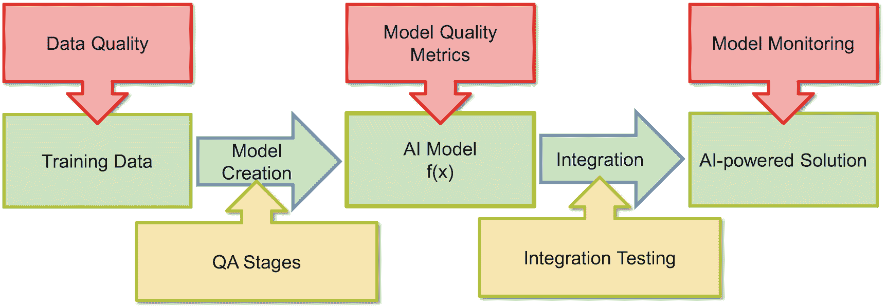

图 3-1 质量保证与人工智能——全景图

## AI 模型质量指标

对 AI 质量指标的基本理解，能使 AI 项目经理与拥有数学、统计学或计算机科学研究生学位的团队成员谈论“数据科学”，并让他们觉得你懂行。方程 `y=67*x[6]+54*x[5]+23*x[4]+54*x[3]-9*x[2]+69*x[1]+42` 能否为二手车提供合理的价格估算？或者我们是否应该将 `54` 替换为 `53` 或 `-8`？仅仅查看一个线性方程或一个神经网络的数千个权重，并不能让我们判断一个 AI 模型在现实中是否正常工作。

### 分类的性能指标

最著名且最广泛使用的分类质量保证指标是**混淆矩阵**（例如，判断客户是否购买了一个包，或者这张图片是否是猫）。混淆矩阵可以比较使用相同算法训练的模型的质量，例如，基于不同数据准备的两个逻辑回归模型。同时，它也能比较使用不同算法训练的模型，例如，一个使用神经网络，另一个使用逻辑回归算法。

图 3-2 展示了一个用于分类的 AI 模型，该模型以图像为输入，并试图判断图像中是否包含狗。在五张被分类为狗的图像中，有四张确实是狗的图像。因此，混淆矩阵中*真正例*单元格的值为 4。一张被错误分类为“真”/“狗”的图像导致混淆矩阵中*假正例*的值为 1。该 AI 模型将图 3-2 中的各种图像分类为不是狗的图像。这对四种情况是正确的（*真负例*），对两种情况是错误的（*假负例*）。

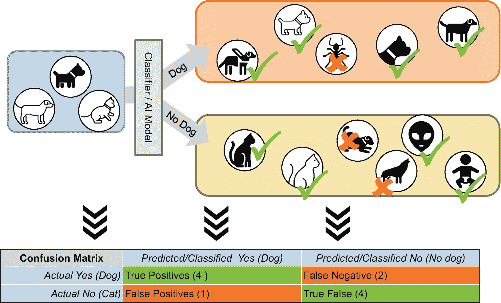

图 3-2 图像分类——查看图像并判断它属于两个类别中的哪一个，狗或猫

混淆矩阵是三个高级指标的基础：

- **准确率**：正确分类的图像百分比。基本上，这是正确识别为包含狗的图像数量，加上正确分类为不包含狗的图像数量，除以图像总数。在示例中，计算如下：

`准确率 = (4 + 4) / (4 + 4 + 1 + 2) = 8 / 11 ≈ 73%`

- **精确率**：反映被分类为狗（无论正确与否）的图像中，真正是狗的比例。在我们的狗示例中，计算如下：

`精确率 = 4 / (4 + 1) = 80%`

- **召回率**：关注 AI 模型识别出了多少“真”案例——在我们的示例中即包含狗的图像。在我们的示例中，AI 模型识别出了六张包含狗的图像中的四张：

`召回率 = 4 / (4 + 2) = 67%`

显然，精确率和召回率越高——即假负例和假正例的数量越低——AI 模型就越好。同时优化精确率和召回率是明智、可取且必要的。然而，最终项目必须决定两者中哪一个更重要。选择取决于使用场景。一旦模型达到良好的预测质量并需要进一步改进时，这通常是一种权衡。

场景一示例是一家信用卡公司。他们每天处理数百万笔支付。他们的收入是交易额的 0.1%。因此，一笔 2000 瑞士法郎的支付产生 2 瑞士法郎的收入。一笔欺诈性支付意味着信用卡公司必须核销全部金额。因此，让一笔欺诈性支付溜走会对收入产生巨大影响。在这种情况下，信用卡公司更倾向于高召回率，并接受较低的精确率。他们会尽可能多地拦截他们能识别出的潜在欺诈支付。显然，这存在局限性。拦截过多的支付会减少收入，如果客户在日常生活中无法正常使用他们的卡，他们就会转向竞争对手。

场景二——确定可能跑赢竞争对手的股票——是优化精确率的一个例子。一只对冲基金可能更倾向于一个能识别出五只跑赢大盘股票的 AI 模型，而不是一个提出二十只股票但其中一半下周股价会暴跌的模型。

这两个示例场景说明，项目经理需要对其项目在精确率与召回率的权衡中如何定位有一个愿景。在理想情况下，他们甚至可以为数据科学家提供一个公式，例如，五个假正例与两个假负例的危害相同。数据科学家将此信息作为输入提供给 AI 模型训练算法。

### 分类与评分

当我们将分类问题理解为**评分**和**排序**任务，而非简单的“是/否”判断时，对分类模型性能的讨论便有了新的维度。逻辑回归通常为每张图像返回一个介于 0 到 1 之间的数值。数值大于 0.5 表示“是狗”，低于该值则表示“不是狗”。然而，我们也可以直接使用这些介于 0 到 1 之间的原始数据，并将其解读为图像包含狗的可能性排序。为避免误解：这些数值并非百分比或概率，仅仅是评分！

图 3-3 正是对图 3-2 中已知的图像进行了这样的排序。

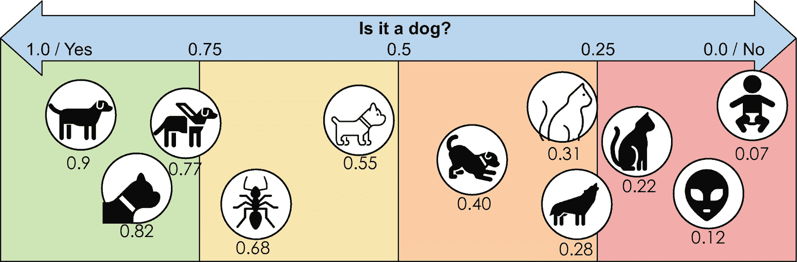

图 3-3

将图像分类视为连续分类问题，而非“是狗/不是狗”的二元现象

理解这种排序的一个绝佳方式是联想香槟中的气泡。当你倒入一杯香槟并观察时，气泡会一个接一个地升到顶部——而不会产生新的气泡。AI 模型将相关元素快速排到前列的能力，也是一种性能指标。

图 3-4 展示了这一过程。图像集包含 6 张狗的图像和 5 张其他图像。随机选择一张图像时，选到狗图像的概率大约为 50%。如果选择两张，预计能选到一张狗图像；选择四张，则预计能选到两张。虚线显示了随机选择图像时，预计能选到多少张狗图像。

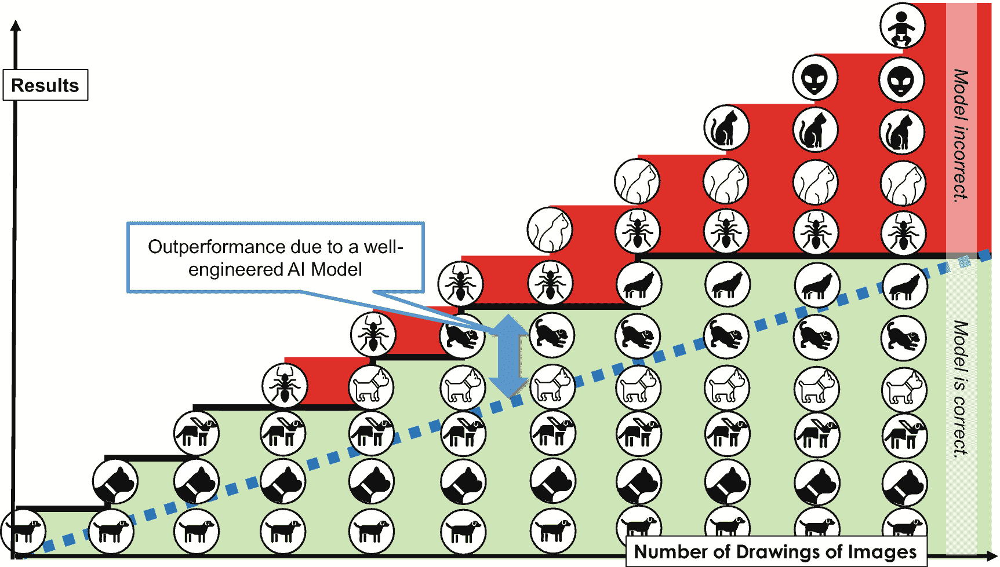

图 3-4

AI 模型（填充单元格）与随机选择图像（虚线）在选取一张、两张、三张或更多图像时的对比（从左至右）

相比之下，填充背景区域表示的是根据评分（从最高分开始）选择图像时，我们能选到多少张狗图像。AI 模型性能的指标在于，有多少张“狗”图像位于虚线上方——虚线代表随机选择图像的预期性能。

在图 3-3 中，前三张图像都是狗——这对 AI 模型来说是一个相当令人印象深刻的结果。随机选择图像时获得如此好结果的概率仅为 12%。

### 其他性能指标

真阳性、假阳性、准确率、精确率、召回率——这些术语和概念适用于二元分类。图片里是否有狗？如果我们通过电子邮件向客户发送折扣券，客户是否会购买一套新的白色西装？对于其他类型的洞察以及输出更复杂的 AI 模型，我们需要更多样化的指标。接下来，我们将探讨另外三种场景下的指标：

*   线性回归
*   多类别分类
*   目标检测，即图像中哪些物体位于何处

假设你是一名 AI 项目经理，正在主持一个状态会议。突然，数据科学家们开始谈论`R`^(`2`)，也称为*R 平方*或*决定系数*。一位优秀的 AI 项目经理必须迅速判断该如何应对。是时候兴高采烈地祝贺团队取得了突破——还是他们需要在与数学世界的惨痛对决后获得情感支持？`R²`是一个反映线性回归模型在多大程度上反映了现实情况或预测问题训练数据集中数据项的指标。因此，对于分类问题，输出是“狗”或“猫”；而对于预测问题，结果则是“我们预计下一个小时呼叫中心每分钟将接到 5.7 个来电”，而不是 20.3，也不是仅仅 1。

`R²`的计算很简单，但其背后的原理需要一些思考。第一步是计算所有数据点的预测值与平均值之间的差值，并对结果进行平方。将这些平方值求和后，结果称为残差平方和（`SQR`）。

第二步，计算实际值与平均值之间的差值，并对结果进行平方。再次对所有数据点的平方值求和。结果称为总平方和（`SQT`）。然后，`R² = 1 – (SQR / SQT)`。

AI 项目经理应该理解的是，`R²`的值介于 0 和 1 之间。越接近 1，模型越好。对于变量清晰且已知的技术和物理过程，可以获得较高的值；而对于预测单个个体的（！）行为，即使 0.1 也可能是不错的结果。然而，当观察较大的人群（而非特定个体层面）时，0.4 到 0.8 甚至更高的值可能是现实的。

AI 项目经理（或 AI 翻译员）的任务是将此类指标和数字置于业务背景中。数据科学家可以向业务部门提供什么建议？例如，业务部门应该做什么？数据科学家对这是正确决策的信心有多大？销售额增长 5%可能已经超出了销售经理的期望和梦想。相反，好的预测和模型可能毫无用处。你知道喜剧演员乔治·卡林那个著名的天气预报吗：“今晚天气预报：天黑。夜间持续黑暗，早晨有零星光亮。”预测显而易见之事的复杂 AI 模型是无用的。如果公司投资于复杂的 AI 模型，那么这些模型必须比一个简单、显而易见的猜测更好。

和往常一样，还有更多的预测性能指标。特别值得一提的是**调整后的`R`^(`2`)指标**。它还考虑了预测函数的复杂性。例如，如果预测函数不仅仅是线性的（`y = ax + b`），还包含二次项（`y = ax² + bx + c`）甚至是更高阶的多项式，该指标会进行惩罚。它还会惩罚纳入过多输入属性，例如`y = ax[0] + bx[1] + cx[2] + dx[3] + ex[4] + f`，而不是只选择最相关的属性，例如`y = ax[0] + bx[3] + c`。其原理是，复杂的函数虽然能提高预测质量，但也可能导致过拟合（后者是本章稍后要讨论的问题）。

**多类分类**意味着分类结果不仅仅是“是/否”，而可以是狗、猫、乌龟或长颈鹿。在商业场景中，此类 AI 模型可能会预测客户的下一个最佳产品。银行顾问应该向客户推销股票基金、抵押贷款还是金卡？

多类分类需要一个扩展的混淆矩阵，如表 3-1 所示。每个类别都需要对应的行和列。同样，该矩阵允许比较预测结果和实际情况。

**表 3-1** 多类分类的混淆矩阵示例

| | 预测：信用卡 | 预测：抵押贷款 | 预测：股票基金 | 预测：储蓄计划 |
|---|---|---|---|---|
| 实际购买：信用卡 | 189 | 5 | 8 | 7 |
| 实际购买：抵押贷款 | 12 | 25 | 5 | 4 |
| 实际购买：股票基金 | 12 | 13 | 58 | 24 |
| 实际购买：储蓄计划 | 7 | 1 | 51 | 125 |

对于多类分类，指标的定义略有变化——并且存在更多指标变体。这里我们解释两种：（多类）准确率和平衡准确率。比较两者可以让项目经理了解不同指标可能具有的不同目的或侧重点。

**多类分类的准确率**是指正确分类或预测的项目所占的比例或百分比。在示例中，我们将对角线上的项目之和除以所有单元格的总和：

```
Acc_multiclass = (189 + 25 + 58 + 125) / (189 + 5 + 8 + 7 + 12 + 25 + 5 + 4 + 12 + 13 + 58 + 24 + 7 + 1 + 51 + 125)
```

频繁类别的预测主导了结果。假设某些类别出现的频率高于其他类别，那么对于稀有类别，分类质量对该指标的影响很小。例如，不同的癌症形式在特定时间点并非多数人患有的疾病。一个对每位患者都预测“无癌症”的算法，其准确率接近 100%。极少数癌症患者对多类准确率（几乎）没有影响。在这种情况下，多类准确率毫无价值。一种能更好地处理稀有但重要类别的指标是**平衡多类准确率**指标。它计算每个类别指标的平均值：

```
Acc_balanced = ( (189 / (189 + 5 + 8 + 7)) + (25 / (12 + 25 + 5 + 4)) + (58 / (12 + 13 + 58 + 24)) + (125 / (7 + 1 + 51 + 125)) ) / 4
```

换句话说：对于该指标，所有类别具有相同的权重，无论它们出现的频率如何。在该指标中，多个不常见类别的表现优于一个或两个主导类别的问题。

多类准确率和平衡多类准确率是多类分类质量指标的两个示例。两者本身并无优劣之分。驱动因素是 AI 模型要解决的业务问题。AI 项目经理必须理解数据科学家使用哪些指标以及为什么使用。这对于交付业务价值至关重要。选择不合适的指标意味着创建的 AI 模型可能无法交付所需的业务价值。然而，做出正确的选择并不总是那么容易，尤其是对于复杂的业务问题。尽管如此，从成熟的指标入手是个好主意。它们被广泛使用是有原因的：它们通常很有用。

衡量**目标检测**的性能远比简单的多类分类复杂。首先，图像可能包含多个目标，例如一个玻璃杯、一个瓶子和一把椅子（见图 3-5）。其次，AI 模型还会为每个目标确定边界框。这些框标明了图像中识别出的目标的位置。通常，如果边界框重叠至少 50%，则目标被视为正确检测到。

在图 3-5 中，AI 模型识别出了瓶子，但没有识别出玻璃杯。虽然“玻璃杯”这个目标类别是正确的，但形状的重叠度太低。最后，椅子未被检测到，并且算法检测到一辆车的地方实际上并没有车。那么，这个 AI 模型有多好？一个指标定义为 1 除以 4，得到 25%的值（交并比）。

总之，预测、多类分类和目标检测的性能指标示例说明了针对不同 AI 挑战的现有指标的多样性。有些指标比其他指标更复杂，但当 AI 项目经理坚持要理解他们的数据科学家在优化什么时，他们是在明智地投入时间。AI 项目的成功取决于 AI 模型优化的指标是否与相关的业务绩效指标相匹配。

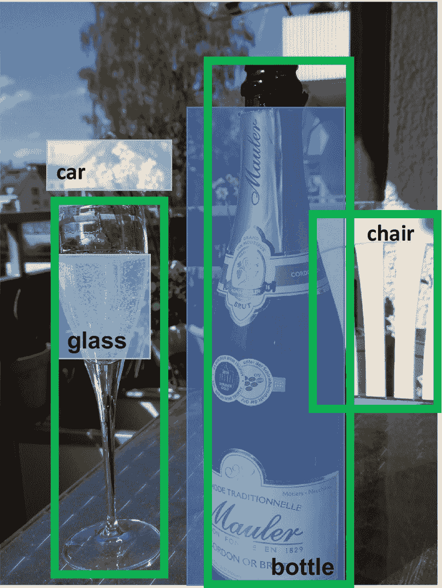

**图 3-5** 包含各种目标的目标检测示例图。绿色边界框是“正确”的，而透明框是模型识别出的边界。

## AI 模型工程中的 QA 阶段

当数据科学家展示他们的 AI 项目模型以及精确率、召回率或`R²`值时，他是否应该立即跑去告诉赞助商他们成功了？该模型是否已准备好投入生产部署？

答案显然是“不”。单一指标永远不够。项目经理至少需要两到三个指标，并确信训练数据被恰当地用于生成这些指标。图 3-6 概述了如何构建 AI 模型质量保证的流程。如果指标没有达到预期或期望，一个好的模型并非随机参数或权重变化的幸运结果。获得一个好的模型意味着从多个候选模型开始。项目驱动它们通过各个 QA 阶段。最终，选定的模型能够通过所有阶段，因为它要么是第一个达到要求的优秀模型，要么是优于所有其他候选模型的模型。


**图 3-6** 理解将数据转化为 AI 模型过程中的质量保证

### 完美但无用的模型指标

项目应避免无用的指标，即那些无助于理解模型性能的指标。一些汽车制造商令人印象深刻地完善了无用指标的概念，结果证明这是个坏主意。他们过度优化了汽车发动机。所有汽车都符合监管排放基准，因为汽车在检测到处于排放测试时会调整发动机。在正常交通条件下的排放则完全不同，且环保性差得多。这对相关管理层和工程师并无益处。AI 项目应避免——即使是无意中——像那些汽车制造商一样制造出好得令人难以置信的指标。当混淆用于训练和评估 AI 模型的数据时，就会发生此类问题。

再补充一点：如果使用相同的数据进行训练和质量保证，你知道实现 100%完美模型的最快方法吗？编写一个组件，检查模型输入数据是否对应于训练集中的条目。如果是，则从训练集中获取正确答案。否则，返回一个随机数。你的模型在训练集上实现了 100%的精确率和召回率——但完全无用。避免无意中陷入此类问题的唯一方法是将训练数据分成三个数据集：训练集、验证集和测试集——并遵循本章解释的严格质量保证流程。

### 训练集、验证集与测试集的数据划分

`训练数据集`的目的是利用特定数据构建并训练机器学习模型。优化和微调 AI 模型的方法有很多，例如尝试不同的数学函数，或改变神经网络的隐藏层数量。数据科学家仅使用训练数据来执行这些优化。相比之下，`验证数据集`的目的是比较多个候选模型并检查过拟合情况。在实际部署模型前的最终测试，则是使用`测试数据集`进行的最终评估。

数据集的划分取决于具体场景。在预测分析和统计场景中，数据集通常包含几百或几千个数据点。对于这些场景，`训练/验证/测试数据集`的典型划分比例为 60%/20%/20%。而在大数据、机器学习和神经网络领域，数据点往往多达数百万个。此时，采用 98%/1%/1%的划分比例更为合理，验证集和测试集包含约一万个数据点就足够了。在开始模型训练之前，将现有的历史训练数据划分为这三个子集至关重要。

### 使用训练数据集评估 AI 模型

对新训练的 AI 模型进行的第一项检查，是评估其在训练集上的表现。如果 AI 模型在此阶段就直接失败，那么它们在“现实世界”的生产环境中使用实时数据时，表现也不太可能更好。因此，这是新 AI 模型的第一个真正的质量保证步骤。

使用训练数据评估训练模型，意味着将训练数据集输入模型，并检查模型的预测是否正确。模型是否能预测出那些对信用卡产品感兴趣的银行客户？数据科学家会计算分类任务的精确率、召回率和准确率（或预测任务的`R²`），并验证这些数值是否满足业务要求。如果公司需要 95%的召回率才能让业务案例成功，而模型在训练集上仅达到 85%，那么继续推进这个模型就是在浪费时间和金钱。AI 项目团队必须首先修复并改进该模型。

图 3-7 中的可视化内容展示了模型失败的可能根本原因。曲线代表 AI 模型，它将区域划分为两个子区域或类别。所有猫的图片位于左上方和中部，所有狗的图片位于下方区域——实现了 100%的精确率和召回率。在图 3-7(a)中，曲线完全正确地分离了数据集。这是理想情况，但通常图 3-7(b)中描绘的情况更接近现实。该图有助于理解 AI 模型甚至可能在其自身训练数据上表现不佳的两个原因。

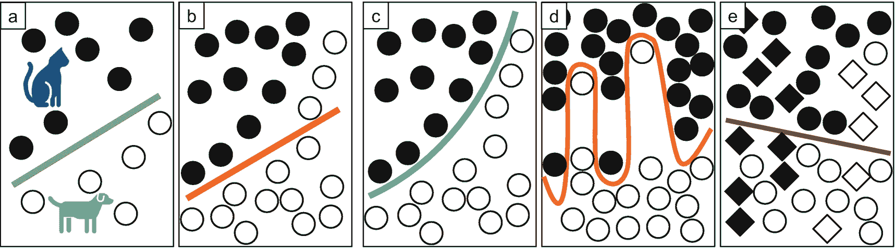

图 3-7
分类场景：代表分类函数的曲线将猫（黑色圆圈）与狗（白色圆圈）图像分离得有多好？

第一个潜在的根本原因是`缺少关键信息`和属性。一张停车场中汽车的照片不足以判断该车辆是否有足够的汽油行驶三十公里。因此，即使理论上可以区分两个类别，如果模型没有掌握所有信息，它也会在特定数据上失败。解决方案显而易见：向训练数据的数据点添加属性，并重新训练模型。

同一张图也代表了 AI 模型在训练数据上失败的第二个原因：底层的`模型`函数过于`简单`（`欠拟合模型`）。线性回归无法很好地应对复杂的非线性挑战。在我们的图示中，AI 模型（仅）画了一条直线来分离类别。只有曲线才能正确分离这些区域（图 3-7，c）。如果数学函数与问题不匹配，AI 模型的表现就会很差。数据科学家通过从线性回归转向神经网络，或调整、扩展神经网络，然后重新训练模型来解决此类问题。

总结：导致 AI 模型在训练数据上质量不足的问题可能有两个根本原因：欠拟合和信息缺失。数据科学家必须深入挖掘并可能进行实验以了解细节。但一旦模型在训练数据上表现良好，就进入了下一个质量保证阶段，该阶段将利用验证数据集。

### 使用验证数据集评估 AI 模型

当 AI 模型在训练数据上表现良好时，下一步就是使用验证数据集对其进行测试。我们执行与先前评估完全相同的操作，只是数据不同。这次，我们输入的是验证数据集。验证数据是*未*用于训练模型的数据。此评估旨在检测训练数据中的**过拟合**或**高偏差**。其症状是相同的——在训练集上表现良好（例如召回率、精确率、`R²`），但在验证集上表现不佳。

在**过拟合**的情况下，模型无法很好地泛化。AI 模型反映了样本数据中的所有异常，但未能进行泛化，而这正是对未知数据表现良好所必需的。对于数学基础扎实的人：如果你有一个包含 1001 个数据点的训练数据集，你可以拟合一个 1000 次多项式作为预测函数。该函数对训练数据完美适用，但在其他任何地方都完全不稳定。图 3-7 (d) 可视化了这一现象。该曲线能很好地将训练数据中的狗和猫图像分开。然而，区域之间的边界非常不规则，导致模型对与训练图像相似且接近的图像分类结果不同。

图 3-8 从另一个角度展示了欠拟合/过拟合的挑战。在图的左侧，模型欠拟合且过于简单。模型在训练集和验证集上的误差都很高。当模型变得更复杂时，其性能提升，即训练数据和验证数据的误差下降。当模型进一步复杂化时，训练数据的模型误差越来越低，而验证数据的模型误差却上升了。我们正在对模型进行过拟合。数据科学家面临的挑战是接近最优的模型复杂度，即欠拟合和过拟合之间的临界点。正则化是简化他们工作的一种选择。这意味着在比较模型质量时，对更复杂的模型进行惩罚。

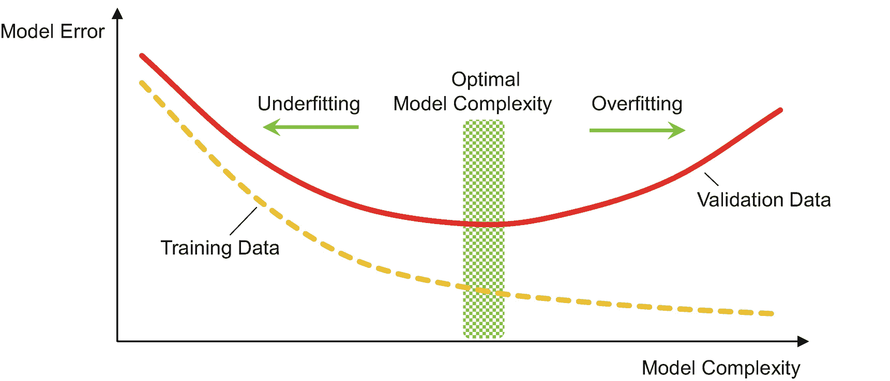

图 3-8

模型复杂度与模型误差的困境

**有偏差的数据**是导致模型在训练数据上表现良好但在验证数据上表现不佳的第二个潜在根本原因。有偏差的数据意味着训练数据和验证数据（以及潜在的现实数据）具有不同的数据分布和特征。在我们的猫狗示例中，一个数据集可能由一组精心制作的狗和猫图片组成。第二个和第三个数据集可能来自从互联网和维基百科爬取与猫和狗相关的图像。显然，使用其中一个数据集训练模型会在该特定数据集上产生良好性能，但在使用其他任何数据集进行测试时则不一定。如果没有预算进行人工审查图像，自动收集的训练数据可能包含被标记为“猫”但实际包含猫粮或宠物猫砂盆的图像。这三种方法对于获取训练、验证和测试数据集都是合理的。当不混合来自不同数据集的图像，而是将一个作为训练集，下一个作为验证集，最后一个作为测试集时，偏差问题就会出现。这些图像集的特征很可能差异过大。

图 3-7 (e) 说明了偏差问题。当使用圆形数据训练模型时，一条垂直线可以很好地将两个类别分开。然而，如果验证数据的分布（用菱形表示）不同，那么模型就无法正确地对它们进行分类。

希望你的 AI 项目训练了一个或多个候选 AI 模型，这些模型在验证测试数据集上表现良好。那么，在投入生产部署之前，该 AI 模型就可以准备使用测试数据进行最终检查了。

### 使用测试数据集评估 AI 模型

最终评估使用的是测试数据集。处于此阶段的 AI 模型已经成功通过了训练数据和验证数据的评估。然而，它仍然可能在测试数据上失败，指标值不佳。那么，在假设验证集和测试集相似的情况下，该模型可能对验证数据过拟合了。

这个解释可能会让人惊讶。验证阶段的目的是检测过拟合，但我们却在测试阶段遇到了这个问题。原因很简单：验证阶段检测的是对训练数据的过拟合，而不是对验证数据的过拟合。由于模型现在处于测试阶段，它在验证数据上表现良好（与其他候选模型相比也是如此）。显然，一个过拟合的模型有很大机会表现良好并进入测试数据阶段。如何解决这个缺陷？增加验证数据集的大小以降低过拟合的可能性，重复验证测试，并为使用测试数据的最终评估选择不同的模型。

## 监控生产环境中的 AI 模型

随着 AI 模型部署到生产环境，以研究为导向的教科书就到此为止了。除了一个高性能的模型，你还能期待什么呢？在实践中，业务部门期望一个性能良好的模型不仅能运行一天，而是能运行数周乃至数月。如果质量下降，就需要重新训练。在部署时，第一个问题可能是模型是否提供了实现预期业务收益所需的分类和预测质量。此外，业务部门可能会提出第二个问题：我们如何确保模型能够长期提供改进和节省成本？即使他们现在不问，如果业务收益消失，或者由于 AI 模型不再那么出色而导致销售额暴跌，他们也会明确表达他们的期望。

一个有远见的 AI 项目经理通过将监控功能作为项目的一部分来实现，以应对这种不确定性和明显的必要性。这与 IT 部门传统的 QA 方法相比是一种范式转变。传统的 QA 策略在上线前进行严格测试。之后，规则是：永远不要碰运行中的系统。AI 模型需要不同的方法。它们可能会在数小时、数天、数周或数月内退化并变得过时。这通常是一个渐进的过程，但存在清晰、可衡量的指标：

-   输入值的显著变化，例如输入变量的均值或分布发生变化。购物篮中是否包含 80%的泳装，而不是 80%的冬季服装类产品？
-   统计模型输出值的显著变化。分类输出的分布是否发生变化，例如从 30%的狗图片变为 45%？是否一天内只向所有客户推荐了 20 种产品，而之前每天推荐 1000 种不同的产品？
-   预测质量下降：与一个月前相比，将 AI 组件推荐的产品添加到购物车的客户是否减少了 20%？

当然，应用程序必须收集这些关键指标，以便业务用户或数据分析师能够识别变化，或者实现自动报警。

监控指标的一个（更复杂的）替代方案是时不时地，甚至每晚重新训练实际模型。使用当前数据生成一个新模型，并与之前的模型进行比较。如果出现显著偏差，数据科学家会用新模型替换旧模型。为了控制目的，你多久生成一次新模型——以及你是否能自动化这个模型创建过程——最终是一个商业问题。

# 数据质量

考试时抄袭邻座答案的作弊问题很简单：通常，准备最不充分的学生不会坐在最优秀、最聪明的学生旁边。他们的邻座可能也毫无头绪——复制错误答案并在此基础上继续推导，通常不会有好结果。

数据科学家也面临类似的情况。他们创建 AI 模型时，有时过于天真，假设训练数据质量良好。最近一项研究发现，学术界和研究领域使用的公开训练集中，有 0.15%到 10.1%的训练集元素存在问题。这些数字应该为数据科学家和 AI 项目经理敲响警钟，让他们在 CRISP-DM 的“数据理解”阶段认真对待这个问题。项目从一开始就关注数据质量会受益匪浅。

文献中充满了好的想法和框架。实施这些想法并确保良好的数据治理实践往往是一个真正的挑战。幸运的是，这并非数据科学家的责任。他们不是应该参与大规模数据清洗工作的人。然而，他们可能不得不自己做一些有限的改进性数据准备。从 AI 或数据科学的角度来看，数据科学家和 AI 项目可以将关注点限制在三个主要的数据质量方面（图 3-9）：

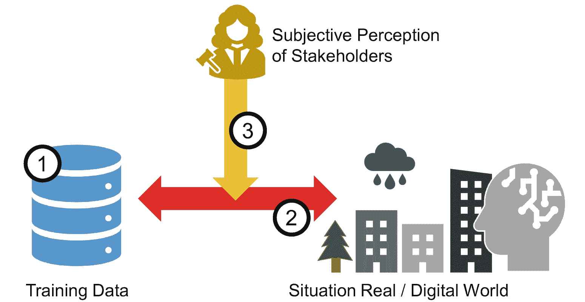

**图 3-9** 数据质量的三个维度

- 技术正确性
- 与现实匹配
- 数据的声誉

## 技术正确性

如果数据与定义的数据模型相匹配，那么从技术角度来看，它就是正确的。必填字段有值，数据集之间存在预期的关系和链接，数据类型与实际数据相匹配。来自数据库领域的 IT 专家有时会忘记一个事实：并非所有用于 AI 模型智能的训练数据都来自具有严格模式约束（如`NOT NULL`或`UNIQUE`）的表格。日志数据、JSON 文件或手动填写的 Excel 表格通常格式不那么严格。此外，某些文档因各种原因损坏，或者属性缺失，或者在创建行时未知的情况下用占位符（如`"xxxxxx"`）填充。当表单不符合他们的需求和现实时，人类会变得相当有创造力。

仅仅跳过——而不是改进——技术上不准确的训练数据可能会产生意想不到的严重副作用。假设你正在为欧盟的客户行为创建一个模型。各种源系统共同为你的训练集提供了 50 万个数据项。其中 3.5 万个缺少多个属性。数据科学家建议跳过它们。作为承受压力的 AI 项目经理，你应该说什么或做什么？

从 50 万个数据点中跳过 3.5 万个并不是重大的数量损失。尽管如此，对模型质量的影响可能很严重。假设这 3.5 万个数据点并非均匀分布在数据集中，而是完整的德国市场数据。如果在没有这些德国数据的情况下训练模型，该模型可能在训练数据上表现良好。即使对于验证和测试数据，如果这些数据也来自跳过了不完整行的数据集，指标可能看起来完美。然而，一旦投入生产，该模型对德国客户的表现可能很差。因此，通过删除数据来解决技术数据质量问题需要三思，并且在从数据集中删除行之前至少要进行初步分析。否则，你可能会跳过重要信息。

## 数据与现实匹配？

澳航应用程序向一名乘客显示的仅腿部空间升级费用约为 1 亿澳元。最终，他的信用卡被扣了 70 澳元。这是一个关于两个系统间数据差异的极端例子。在比较训练集与现实中的数据时，可能存在类似但通常不那么严重的差异。

AI 项目经理和团队无法验证每一个数据项。尽管如此，他们可以通过检查单个数据项或寻找质量问题的线索来验证各个方面。例如，他们可以查看以下内容：

- 提供的数据（如街道名称或销售数字）是否正确？
- 数据是否完整且无冗余，例如，每位客户的购买恰好对应一条预订记录——而不是两条或零条？
- 数据是否一致？例如，如果两个属性存储相同的信息（如税务地点），它们是否始终相同？
- 训练数据的分布是否反映了现实——或者我们的训练数据中，昂贵汽车的照片是否远多于各种标准入门级汽车？
- 现实世界中的变化需要多长时间才能导致数据的更新？它是在一小时后出现在训练集中，还是在下个月客户购买时才出现？

衡量这些客观标准有助于理解何时可以依赖特定的数据源，并检测源是否存在差异以及（时间/延迟导致的）不一致性。

## 数据的声誉

第三个维度与前两个不同。它将人的判断置于前台。数据的接收者（或你的 AI 模型的接收者）对训练数据源的数据质量有何看法？如果他们质疑你的数据源，从而质疑你创建的模型，他们可能短期内没有替代方案。然而，最终他们会找到其他选择——其他团队、用 Excel“额外”做点什么，或者从外部供应商那里获取服务。我在第一个客户项目中就学到了这一课。我们在一家大型 IT 服务提供商内部有一个咨询任务。我试图绘制一个包含所有存储和处理数据的系统的图表。一个系统负责人自豪地告诉我，他的数据质量最高，并且始终是最新的。然而，其中一个接收数据的团队实施了另一种解决方案，在使用数据之前先进行清洗。

这位系统负责人既没有撒谎，也没有疏忽。由于需求和用途不同，同一批数据可能从“毫无用处”到“非常优秀”不等。一个`"已售商品"`属性可以统计顾客放入购物车的商品数量——或者已发货且未退回的商品数量。如果你在财务控制部门，你可能更关注数字的准确性，而不是有效的送货地址。数据质量具有接收者特定的主观成分。这方面对 AI 项目至关重要。如果你使用已知质量良好或已知经常出错的源作为训练数据，它可能会影响 AI 模型的接受度。

# AI 驱动解决方案的质量保证

AI 模型可以支持一次性的战略（管理）决策，也可以优化和改进重复性的运营流程。对于后者而言，仅有优秀的模型是不够的。它必须作为 AI 驱动软件解决方案的一部分来运作。因此，质量保证必须涵盖三个领域：

1.  测试不含 AI 组件的软件解决方案。图形用户界面是否正常工作？计算结果是否正确？
2.  AI 模型的质量保证。预测和分类模型是否有效？
3.  验证 AI 模型与软件解决方案的集成。

第一点涉及标准的软件测试。所有功能是否都按照规范正确实现？时尚商店应用中的购物车功能和支付流程是否正常？应用是否会崩溃？IT 文献广泛涵盖了测试内容。公司拥有标准和指南，并建立了由经验丰富的测试人员和测试经理组成的测试组织。因此，可以假设第一点几乎在任何地方都已得到解决，而前面的页面涵盖了第二点，即 AI 模型的质量保证。这最后一部分将聚焦于第三方面：将 AI 模型集成并耦合到完整软件解决方案中时特有的潜在问题。我们有时尚应用，也有一个向顾客推荐商品的 AI 模型——它们能否协同工作？

集成的质量保证和测试措施取决于所选的集成模式。前一章介绍了三种主要模式。第一种也是最简单的是**预计算**。这种模式不需要 AI 组件与软件解决方案之间进行任何技术集成。相反，数据科学家或 IT 运维专家将最新数据（例如时尚应用客户的购物历史）输入 AI 模型。然后，AI 模型为每位客户单独预测其最可能购买的时尚单品。这些结果被写入一个 CSV 或 Excel 文件。数据科学家或 IT 运维专家将该文件上传到，例如，CRM 工具中。CRM 工具向客户发送个性化的推送消息。这些消息旨在激发客户的好奇心，去查看（并购买）推荐的商品。

集成本身不需要任何测试，只需验证生成的文件是否符合 CRM 工具的格式要求。由于这是一个手动过程，清单或四眼原则可以降低运营风险，尤其是对于重复性流程。

第二种集成模式是**模型（重新）实现**。数据科学家提供模型，例如用 Python 或 R 语言编写。然后，实际软件解决方案的开发者接手。他们直接添加代码，或者用 Java 或 C#重新编写相同的逻辑。该模型成为软件解决方案源代码的一部分。这种模式需要专门的测试用例来解决两个问题。

第一个问题涉及*重新实现中的错误*。用不同语言重新编码代码片段存在调用函数时混淆参数的风险。此外，忽略或忘记重新实现单行代码以及混淆变量名也是风险。使用样本输入/输出数据对的测试用例可以应对这种风险。例如，基于特定狗图像的测试用例。假设在 AI 模型训练环境中输出分类值为`0.857`。那么，软件解决方案中重新实现的 AI 模型必须产生完全相同的结果。

此外，在复制神经网络时，对配置、元数据和权重参数进行校验和检查也很有帮助。所有参数值的总和（一个语义上无关的数字）必须相同。更高级的指标可以检测到参数值互换或行交换。

第二个问题涉及实际的连接或*接口*，特别是参数的使用。第一个参数是最后购买的产品 ID 还是数量——或者顺序是相反的？`1` 表示图像包含狗，还是 `0` 代表狗的信息？简单的错误会导致软件解决方案毫无用处，并损害，例如，时尚商店应用的客户体验和销售数字。AI 项目经理应再次确认软件解决方案的测试人员是否也处理了这些质量风险。

第三种集成选项是**AI 运行时服务器**，例如 RStudio Server。其理念是提供一个服务器，公司内所有 AI 模型都在该服务器上运行。当软件解决方案想要集成一个 AI 模型时，它会调用 AI 运行时服务器上的特定模型。潜在的测试需求再次涉及服务调用时参数使用是否正确。然后，模型管理变得更加重要。调用或部署的是正确的模型（即狗检测模型），而不是猫的模型？当前使用的模型是基于最新的冬季时尚商品目录，还是两年前的沙滩装时尚目录？在实现这种集成模式时，软件开发者和数据科学家可以完全独立地工作，并且（几乎）无需相互沟通。因此，在这种设置下，检查软件解决方案是否使用正确的参数调用了正确的模型变得更为关键。

## 总结

AI 为许多组织提供了新的优化机会。同时，测试和质量保证也面临新的挑战。混淆矩阵或`R²`值等指标是确定 AI 模型质量的基础。它们是任何就绪性评估的核心。根据训练集、验证集和测试集来衡量 AI 模型的性能，为模型训练提供了结构，并使 AI 项目经理能够跟踪项目进度。

与秉持“运行中的系统不要碰”态度的传统软件不同，AI 模型需要监控。几周或几个月后，它们是否仍然适用？还是数据科学家需要训练一个新的、改进的版本？然而，任何令人信服的 AI 模型的关键在于正确的训练数据。AI 项目不仅要重视数据数量，还要重视数据质量。

当然，还存在其他类似非功能性需求的必要条件，例如监管需求、伦理或可解释性。我们将在下一章中涵盖这些质量方面。

# 伦理、法规与可解释性

大型科技公司、创新型初创企业以及利用 IT 创新优势的公司的自由放任时代即将结束——在 AI 领域也是如此。政策制定者多年来一直在讨论监管问题。但现在，他们正在采取行动。AI 组织和公司必须自问——出于伦理原因——他们是否应该创建正在开发的 AI 模型，以及他们的项目是否合法。他们不能再仅仅专注于开发卓越的 AI 模型、验证其质量，而忽略其他一切。

虽然 AI 伦理听起来像是一个象牙塔般的话题，但事实并非如此。首先，大多数公司都害怕负面新闻和公众的愤怒。他们避免声誉风险，尤其是在一些专家在没有明确业务需求或明显收益的情况下玩弄技术时。其次，AI 法规正在变化之中。今天的 AI 伦理讨论是明天 AI 监管需求的来源。这些讨论使 AI 组织能够预测监管机构接下来可能会要求什么。不需要预言家也能预见，AI 监管将成为 2020 年代的主导话题。

因此，本章将讨论监管和伦理话题。第三个话题——可解释性——是对这两个话题的补充。它是一个概念或一种 AI 模型属性，有助于满足特定的 AI 伦理和监管要求。

# AI 伦理

假设你想买一套新公寓。你向银行申请抵押贷款，但被拒绝了。银行职员告诉你，他们的 AI 计算出你在未来两年内离婚的概率为 75%。因此，你无法获得贷款。你会认为这种预测在伦理上是恰当的吗？在与瑞士银行合作的十多年里，我了解到房间里的大象（指显而易见却被刻意回避的问题）就是离婚风险。没有银行家会谈论这个话题——尤其不会与客户讨论——尽管传言很明确：离婚是导致抵押贷款问题的最关键原因。这对银行来说是一个巨大的困境。与大多数其他公司、组织和企业一样，银行希望被视为理性且负责任的，而不是家庭纠纷或关系问题升级的源头。大多数公司都持有比“不作恶”更高的道德标准。这些承诺对其 AI 组织产生了影响。他们必须意识到三个潜在领域，在这些领域中，伦理问题可能会干扰他们的日常工作以及长期业务或 IT 架构目标。

## 伦理风险的三个领域

AI 的伦理风险分为三类（图 4-1）：不道德的用例、不道德的工程实践以及不道德的 AI 模型。

**不道德的用例**，例如计算离婚概率，并非 AI 领域的问题。它们是业务战略决策。数据科学家可以且应该要求对某个用例是否可接受做出明确判断。这种判断应由业务方做出，而非组织的 IT 或 AI 部门。

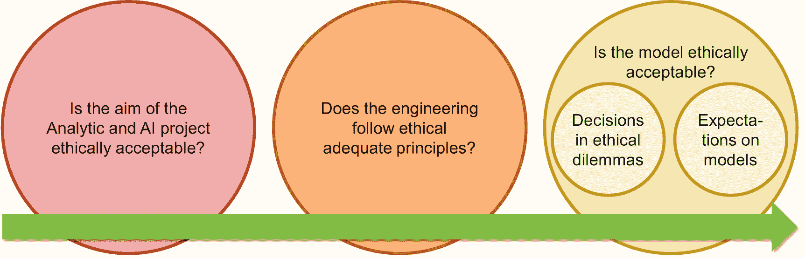

图 4-1

AI 伦理问题的生命周期视角

**工程中的伦理**涉及开发和维护过程。例如，苹果公司的承包商曾监听并转录 Siri 用户的对话，以使苹果能够改进 Siri 的 AI 能力。这种工程和产品改进方法引发了公众的强烈抗议，因为社会认为这种做法侵犯了用户的隐私。

最后，与**AI 模型**及其对客户、社会和人类的影响相关的**伦理**问题，才是任何 AI 伦理讨论的真正核心。当算法决定谁先接种新冠疫苗，而政府将 AI 模型开发外包给一家有争议的 IT 服务提供商时，AI 便在决定生死——而 AI 伦理不再是一个象牙塔里的话题。

## 处理伦理困境

伦理困境与令人不便的管理决策处于不同的维度。一个社交媒体网页是否应该发布一位知名煽动者的言论以吸引点击？一家初创公司是否应该大规模收集公共领域的图片以节省成本，而不是自己制作图片？这些都是管理者面临的棘手问题，他们必须在道德行为与标准以及利润、损失和风险之间取得平衡。然而，真正的伦理困境更为严峻。它们更多地与 AI 模型本身相关。训练一个 AI 模型意味着衡量一个系统的好坏。这意味着量化结果，并优化或最小化损失函数。这些损失函数是**伦理困境**的核心，即那些不存在无可争议选择的挑战性情境。经典的例子是**电车难题**。一辆电车前方的轨道上有三个人。他们无法移动，电车也无法停下。阻止电车撞死这三个人的唯一方法就是让电车变道。结果，电车不会撞死轨道上的人，但会撞死另一个原本不会受到伤害的人。什么是最道德的选择？如果撞死轨道上的人的“伤害”是“-5”，那么撞死一个无辜者的惩罚应该是什么——也是“-5”，还是“-10”？

电车难题是许多伦理困境背后的逻辑，包括自动驾驶汽车是撞向行人还是撞向另一辆车。当 AI 直接影响人们的生活时，理解数据科学家如何训练 AI 模型在这些挑战性情境中选择行动是至关重要的。

数据科学家通常可以通过两种方式设计处理此类情况的 AI 组件：自下而上和自上而下。在自下而上的方法中，AI 系统通过观察来学习。由于这类伦理困境相当罕见，驾驶员可能需要数年甚至数十年才会面临这样的困境——如果真有的话。幸运的是，我们大多数人从未需要决定是碾过一个婴儿还是一个小男孩。观察大众而不是与选定的训练驾驶员合作，是更快获取训练数据的一种选择。其缺点也很明显：大众也会传授不良习惯，例如超速或骂人。

或者，数据科学家可以采用自上而下的方法，通过伦理准则来指导关键情况。最著名的例子是阿西莫夫的机器人三定律：

1.  机器人不得伤害人类，或因不作为而让人类受到伤害。

2.  机器人必须服从人类的命令，除非这些命令与第一定律相冲突。

3.  机器人必须保护自身的存在，只要这种保护不与第一或第二定律相冲突。

阿西莫夫的定律引人入胜，但过于抽象。当事故不可避免时，它们需要被转化或解释，以决定汽车是撞向行人、骑自行车的人还是卡车。

然而，在实践中，法律和法规明确界定了许多情况下可接受和不可接受的行为。如果没有，事情就变得棘手了。一个 5 岁男孩的生命更重要，还是一个有三个十几岁女儿的 40 岁母亲的生命更重要？一个做出杀死谁的决定性判断的 AI 模型，并不是一个在压力下冲动地想要自救的驾驶员。它是一个无情、精于计算且理性的 AI 组件，它做出决定并实施杀戮。对于 AI 系统，社会的期望比人类驾驶员更高。使问题复杂化的是相互矛盾的期望。总的来说，社会期望自动驾驶汽车将人类整体伤害降到最低。只有一个例外：车主希望自己的车辆能保护自己，这与他们在讨论一般汽车时普遍偏爱功利主义伦理无关。

在 AI 系统中实施自上而下的伦理，需要数据科学家或工程师与伦理专家的密切合作。数据科学家构建捕捉世界、控制设备或将伦理判断与 AI 组件的原始目标相结合的框架。由伦理专家来决定如何量化伤害的严重程度并使其具有可比性——或者如何在只有糟糕选项的情况下做出选择。然而，对 AI 专家来说，好消息是：伦理困境属于例外情况。

### 关于合乎道德的 AI 模型

大多数数据科学家在面临其 AI 模型是否符合道德标准的问题时，都必须处理 AI 伦理问题。这些模型影响着人们的生活，无论是信用评分解决方案，还是机场海关用于自动护照检查的人脸检测模型。目前有许多正在进行的研究，但在企业环境中，有两个概念对 AI 组织来说尤为突出：偏见和公平性（图 4-2）。

**偏见**在质量保证章节中已经是一个话题。这个概念关注的是训练数据及其分布。如果训练数据的分布与现实情况存在偏差，我们就称其为有偏见的训练数据。如果一个社会大约由 50%的男性和 50%的女性组成，那么训练数据的分布也应该是相似的。如果用于人脸识别的训练数据由 99%的男性照片组成，那么所创建的 AI 模型很可能对这些照片效果很好。相反，该模型对女性来说很可能不可靠。

使避免偏见成为一项易于获得支持的举措的原因是，消除偏见并提高道德标准能带来商业利益：AI 模型会变得更好。

**公平性**是一个概念，它要求训练好的 AI 模型对所有相关的子群体，即使是小群体，都能表现得同样好。假设一家公司有 95%的女性员工。这种性别不平衡会影响 AI 模型的训练。训练过程可能会优化对女性员工的准确性，而忽略男性员工，但仍然能达到很高的准确率。当 95%的员工是女性，算法正确识别了 99.9%的女性人口，但只正确识别了剩余 5%男性员工中的 10%时，总体而言，该 AI 模型正确识别了 95.4%——还不错，至少如果你是女性的话是这样，但如果你是男性则不然。然而，公平性的道德概念会拒绝这样的模型。如果每位男性员工都必须在前台出示护照，而所有女性员工都可以使用工卡进入，这是不可想象的。

在企业环境中，公平性和偏见有一个关键区别。与偏见不同，公平性会给企业带来成本。公平性意味着不使用最好的 AI 模型，而是使用一个对所有相关子群体都同样有效的模型，例如，通过在训练集中过度代表小的相关子群体。为了说明这一点，我们扩展上面的例子。最好的 AI 模型可能能识别 99.9%的女性员工，但只能识别 10%的男性员工。最好的公平（！）AI 模型可能对男性和女性员工的准确率都达到 90%。这种总体准确率的“微小”变化可能会带来高昂的成本。在机场使用准确率为 95%的自动护照检查系统，需要海关工作人员检查每 20 名旅客中一人的护照。而准确率为 90%则意味着要检查 10%的旅客，这需要将海关工作人员数量增加一倍。

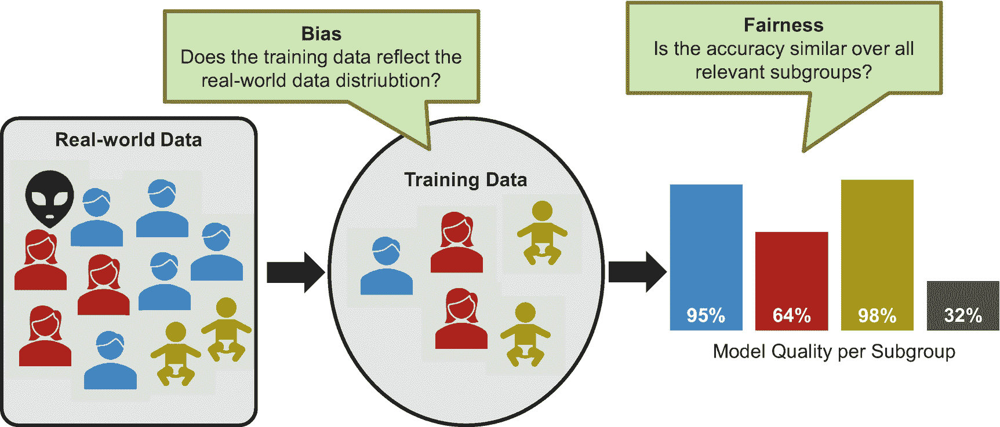

图 4-2

理解偏见与公平性

### AI 伦理治理

AI 伦理是一个涉及众多利益相关者的话题，从数据科学家、AI 经理，到需要 AI 模型的业务专家以及企业社会责任团队。它也是一个高度情绪化的话题。如果不能明确界定由谁或哪个委员会就三个领域（不）道德用例、（不）道德工程实践和（不）道德 AI 模型做出哪些决策，组织就有可能陷入关于什么是恰当的、什么是道德上可接受的以及由谁来决定这些问题的激烈争论。

谷歌/蒂姆尼特·格布鲁的争议事件说明了 AI 组织容易忽视的一个陷阱。格布鲁的声誉建立在她早期的工作上，她曾揭露 IBM 和微软的人脸检测模型对白人男性效果良好，但对有色人种女性则不准确。换句话说：她发现了模型中的缺陷，这些缺陷很可能是由有偏见的训练数据造成的。此类缺陷令人尴尬，但了解这些不足能使数据科学家构建出更好的模型。

在谷歌工作期间，她合著了一篇论文，批评谷歌在一种新语言模型上的工作，原因有二。首先，谷歌使用在线文本训练其模型。这些文本显然（部分地）带有偏见、歧视性，甚至公开的种族主义。当训练集也包含此类文本时，模型也会部分地反映它们。联合国“自动补全真相”活动通过视频展示了这一点。他们让谷歌搜索的自动补全功能建议接下来应该出现哪些词。如果输入“women cannot”得到的结果是“women cannot drive”，这反映了我们语言使用中的偏见。自动补全预测功能运行正常，但结果却有问题。格布鲁过去和现在都是对的：如果你使用在线文本，你就是在复制当今的不公正和不道德倾向。这种批评背后的基本要求是：语言模型不应反映我们今天使用的语言，而应反映一个更好、更纯净的我们自身和我们的语言——没有偏见和歧视。

这种批评同时也质疑了工程方法。谷歌是应该使用来自网络的、不产生成本且反映我们语言的在线文本，还是应该开始过滤和准备训练文本，以排除可能存在问题的文本？突然之间，由于过滤和重写用作训练数据的文本可能需要付出巨大努力，这种批评影响到了 AI 模型开发的速度和商业案例。

她的第二个批评针对的是该语言模型的巨大能源消耗。这种批评与 AI 模型的道德属性（如偏见或公平性）无关。它质疑的是谷歌是否应该开发一个管理层认为对其未来业务至关重要的 AI 模型。权衡商业战略及其对生态的影响是一个有效的伦理问题，只是它更偏向商业层面，而非 AI 伦理的核心。图 4-3 说明了格布鲁研究焦点的这种转变。

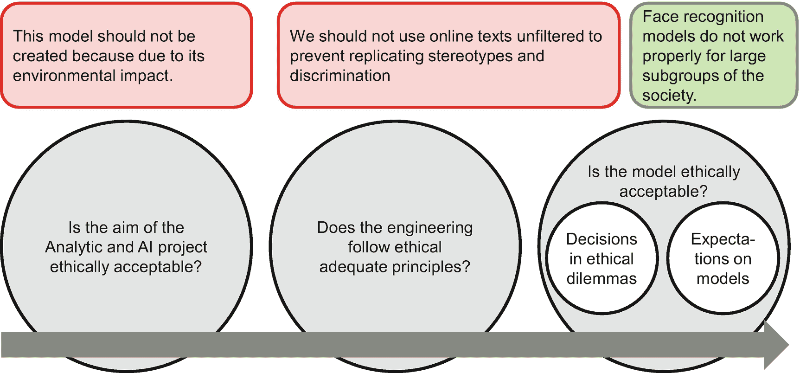

图 4-3

理解谷歌/格布鲁争议

公司及其 AI 组织可以从这场争议中吸取教训。哪位经理或董事会决定 AI 领域的哪个（三个中的）伦理方面？企业社会责任或商业伦理团队的职责是什么？高层管理团队决定什么？

从道德角度、企业文化以及组织声誉来看，AI 伦理都至关重要——更不用说已经存在或预期会出现的监管要求了。因此，从一开始就将其无缝融入公司及其企业文化是必要的。

# 人工智能与法规

虽然遵守道德标准是强烈建议的，但并非强制。而遵守法规则是必须的。在法规方面，全球的政策制定者近年来已通过多项法律，并正在准备更多直接影响人工智能组织的法规。这些法规主要有两种形式：

*   **数据保护法**，规定了公司可以存储哪些数据、如何使用这些数据，以及必须满足哪些附加条件（例如，透明度、被遗忘权）。
*   **人工智能算法法规**，例如欧盟的《人工智能法案》提案，它影响着算法如何处理数据以及哪些用例是可接受的。

欧盟针对数据爆炸以及数据利用领域由人工智能驱动的革命，出台了新的法律。下一节将介绍欧盟两项具有里程碑意义的法规：《通用数据保护条例》和欧盟新的《人工智能法案》提案。许多其他国家至少是在《通用数据保护条例》方面效仿了这一模式。

相比之下，美国的许多相关法规是在人工智能背景下对现有法律和规则的重新诠释。因此，作为第三个例子，我们来看看美国联邦贸易委员会将现有原则应用于人工智能领域的方法。

在审视这些法规之前，有一点需要说明：读者应牢记，法规不仅反映了学术界关于人工智能伦理的讨论。法规也旨在促进创新，并确保本国经济能在全球范围内竞争。

## 数据隐私法：以《通用数据保护条例》为例

当今全球数据隐私的黄金标准是欧盟于 2018 年 5 月颁布的《通用数据保护条例》。《通用数据保护条例》在全球范围内如此知名（且令人畏惧），是因为它结合了两点：首先，罚款高达 2000 万欧元或公司全球营业额的 4%；其次，简单来说，只要公司处理欧盟公民的数据，它就具有全球适用性。无论公司的注册地在哪里，也无论他们在何处存储和处理这些数据。

《通用数据保护条例》定义了数据处理的七项原则——公司及其人工智能组织必须遵守的义务和限制。在人工智能组织或具体软件解决方案的设计阶段就遵循这些原则，是最容易（且成本最低）的实施方式。“**隐私设计**”或“默认隐私”这些术语反映了从一开始就考虑隐私的雄心，而不是试图在后期以某种方式将其塞入代码中。

七项原则中的第一项要求**合法性、公正性和透明度**。任何数据处理都需要法律依据，例如客户同意、法律义务或必要性。公正性要求不误导用户，例如，不误导用户他们正在与谁联系，或者他们批准和接受了什么。

第二项原则是**目的限制**。当公司收集数据时，他们必须清楚透明地说明日后处理这些数据的目的。所声明的目的限制并约束了未来为训练人工智能模型而对数据进行处理和使用的行为（除非有其他合法依据）。第三，**数据最小化**要求仅收集和存储实现既定目的所需的数据。**准确性**要求个人数据正确无误且不具误导性——否则应予以更正。**存储限制**涉及数据存储的时长。公司不得在必要时间之后继续存储个人数据。

**安全原则**（也称为完整性和保密性）要求你保护数据安全。许多公司的 IT 安全部门负责处理此事。此外，后续章节将探讨如何保护训练数据、环境以及训练好的人工智能模型。

最后是**问责制**原则，它要求你对处理个人数据承担责任。

人工智能组织必须遵循这些原则，即使这会带来额外的工作。特别是，人工智能组织必须了解数据的来源以及数据科学家可以将其用于何种目的（数据沿袭）。此外，仅仅声明遵守这些原则无异于埋下一颗定时炸弹，即使人工智能组织确实遵守了。他们需要文档作为**审计证据**。

《通用数据保护条例》还规定了其他义务。例如，公司必须应自然人要求确认是否处理了与其相关的任何数据，并提供所有这些数据的副本。自然人还有权获得额外信息，例如公司存储其数据的时长、数据来源、数据接收方或处理目的（**数据主体访问请求**）。公司需要拥有一个涵盖所有应用程序、处理和外部数据传输的全面**目录**。如果你不知道自己在何处存储了哪些数据，就无法向请求者提供其所有个人数据。对于高风险数据处理，例如涉及人员追踪和监控或敏感个人数据的处理，还需要进行**数据保护影响评估**。因此，人工智能组织必须确保遵循由 IT 部门、数据保护官或法律与合规团队制定的公司指南，以便为下一次审计——或下一位数据主体的请求——做好准备。

### 欧盟《人工智能法案》提案

2021 年 4 月 21 日，欧盟委员会发布了一项《人工智能法案》提案，旨在促进人工智能应用的同时，应对这项新技术带来的风险。该拟议立法对人工智能算法进行了广泛监管，涵盖从统计方法、基于逻辑或知识的系统（包括专家系统），到监督或无监督学习、深度学习及其他方法论。该人工智能法案适用于欧盟管辖范围内的人工智能系统，以及输出结果在欧盟境内使用的境外系统——并适用于企业、公共机构和政府部门，但军事用途系统除外。违反该法案最高可处以企业全球营收 6%的罚款，而违反《通用数据保护条例》的罚款"仅"为 4%。

该提案将人工智能系统分为四类：不可接受风险系统、高风险系统、有限风险系统以及仅具最低风险系统（图 4-4）。

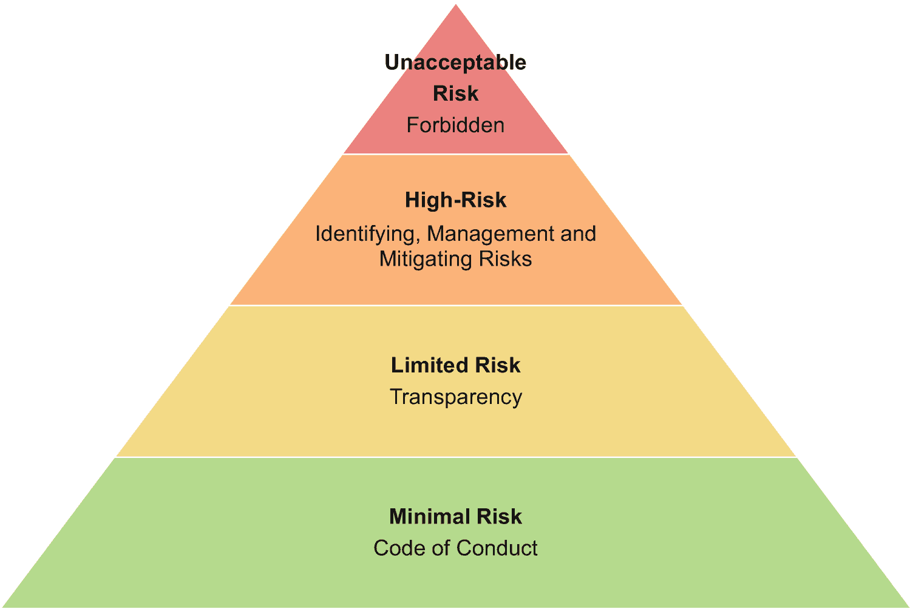

**图 4-4** 《人工智能法案》风险金字塔

该拟议人工智能法规列出了被视为不可接受风险的禁止使用案例。首先，是利用潜意识技术或利用特定个体脆弱性，导致对个人或他人造成身心伤害的系统。其次，该法案禁止公共机构或其代表利用不同场景收集的数据进行社会评分，或评分对个人产生不成比例影响的系统。第三，禁止在公共场所使用实时远程生物识别信息系统，除非涉及非常特定的犯罪情形。

高风险人工智能系统构成第二类。涉及安全与健康的人工智能系统及组件属于此类，例如用于汽车、火车或医疗设备的系统。此外，还包括以下八种用途的人工智能系统：

*   实时或延迟的生物特征身份识别
*   管理运营供水等关键基础设施
*   决定教育机构录取与分派的教育和职业培训场景
*   招聘流程、晋升或解雇决策、任务分配及员工绩效评估
*   公共援助福利决策、紧急救援服务的调度与优先级排序，以及信用评分
*   特定执法场景，如预测个人是否（再次）犯罪，或检测个人情绪状态
*   移民、庇护和边境管控管理，包括测谎场景、评估个人是否构成安全风险或验证文件真实性
*   司法与民主进程管理，包括事实与法律研究，以及将法律适用于具体案件事实

欧盟拟议法规并未禁止高风险系统，而是对其提出了具体要求。企业必须根据预期用途，识别并评估已知和可预见的风险，同时考虑合理可预见的误用情况。在开发或部署此类系统时仅进行一次评估是不够的。企业及其人工智能组织必须在系统生命周期内持续管理这些风险，并考虑模型在生产使用过程中获得的洞察。

对高风险人工智能系统还有额外详细要求，例如技术文档、关键事件日志记录、系统准确性或稳健性的沟通，以及允许并确保人工监督。

第三类包含有限风险系统。它们必须遵守特定的透明度要求。与人类交互的人工智能系统必须揭示其非人类属性。当系统包含情绪识别或生物特征分类功能时，必须告知用户。最后，任何操纵图像、音频和视频内容（"深度伪造"）的系统都必须明确说明。

最低风险人工智能系统构成第四类。据欧盟称，当今大多数应用场景属于此类。该法案不对其进行监管，但建议为其制定行为准则。

该人工智能法案提案历经三年多进程才得以形成。不过，在法案正式生效前仍可能进行额外修改。此外，欧盟正在制定影响人工智能组织的其他法规，例如与责任问题相关的法规。很可能其他国家在未来几年也会出台类似法律，而欧盟这项人工智能法案提案可能产生重大影响并发挥主导作用。因此，欧盟以外的人工智能组织也有必要理解这些欧盟理念。

### 美国联邦贸易委员会的做法

美国联邦贸易委员会（FTC）依据现有法律对人工智能系统进行监管。该美国机构的职责涵盖执行反垄断法，并通过防止不公平、欺骗性或反竞争行为来促进消费者保护。该机构将人工智能视为自动化决策的新技术手段。因此，FTC 并不关注算法类型以判断是否为"相关"人工智能系统，而是关注系统是否进行自动化决策。它基于现有的较早期法律监管人工智能系统：《联邦贸易委员会法》（第 5 条）、《公平信用报告法》和《平等信用机会法》。在此基础上，FTC 制定了针对人工智能系统的规则和指南。其中最相关的包括：

*   人工智能使用情况的透明度。例如，在未告知客户的情况下模仿人类行为可能违法。
*   数据收集的透明度，即不得在消费者不知情的情况下秘密或背地里收集数据。
*   自动化规则是否改变交易条件的透明度，例如根据消费模式自动降低信用额度。
*   客户有权访问其存储数据并更正错误信息。根据具体情况，企业有义务保存关于客户的最新准确数据。
*   能够向客户提供导致公司拒绝特定客户请求的最相关影响因素。对于评分，公司必须能够解释基本概念，并列出对个人特定评分影响最大的四个关键因素。
*   不得歧视美国法律规定的受保护群体：种族、肤色、宗教、国籍、性别、婚姻状况、年龄，或是否接受公共援助。确保模型无歧视需要充分的输入数据，并验证由此产生的人工智能模型。关于人工智能伦理的讨论提供了有用的背景信息。

并非所有规则都适用于每种客户或合同。然而，它们展示了现有法律如何监管新兴人工智能组织——并且可能构成相当大的挑战。数据科学家可能拥有比银行现有模型更完美的信用评分人工智能模型。但如果他无法列出影响个人信用评分的四个主要因素，银行就不得使用该模型。因此，看到这些规则时，就不难理解为何最近理解和解释人工智能模型工作原理的能力备受关注。描述这一趋势的术语是"可解释性"和"可解释人工智能"。

# 可解释人工智能

为复杂的预测或分类任务构建可解释人工智能模型是一项真正的挑战。数据科学家可以构建（深度）神经网络。神经网络是解决困难预测和分类挑战的黑箱——但它们确实是黑箱。训练好的模型由成百上千个公式和参数组成。其行为对人类而言难以理解——这是一个不太理想的选择。或者，数据科学家可以依赖易于理解的模型，如逻辑回归、线性回归或随机森林。然而，这些模型在处理复杂的人工智能任务时表现不佳——这是另一个不理想的选择。近期及正在进行中的关于可解释人工智能（`XAI`）的研究工作，旨在克服这一两难困境。

## XAI 的应用场景

`XAI` 旨在帮助解决三种场景：

- 模型本身（而非模型在新数据上的应用）是交付物。
- 出于伦理和监管需求，对模型行为进行解释和记录。
- 调试与优化。

所有这些场景都需要理解训练好的人工智能模型是如何工作的。

在目标检测领域，众所周知神经网络并不总是检测图片中的实际物体，而是对其上下文做出反应。即使是赢得比赛的神经网络也存在或曾经存在此类缺陷。在一个案例中，神经网络并未像大家假设的那样识别出图像中的马。相反，是水印触发了这种分类，因为训练集中只有马的图片带有水印。假设数据科学家知道——例如在物体识别中——具体图像的哪些区域决定了神经网络检测到哪种类型的物体。那么，他们就能更高效地调试和优化神经网络。他们能在模型投入生产并应用于现实世界之前，发现更多类似水印问题的缺陷。

第二个 `XAI` 使用场景反映了本章前面阐述的监管和伦理需求：检查公平性并确保人工智能模型无歧视。客户和社会不会将人工智能模型的结果视为神谕：永远正确且不容置疑。公司和组织必须为其决策提供理由，即使这些决策是由人工智能做出的。如上所述，美国《平等信贷机会法案》要求银行在拒绝信贷时说明原因。否则，银行不得使用该人工智能模型。

第三，模型本身可能是核心交付物，而非其在新数据上的应用。产品经理希望了解购买者与非购买者的特征。模型必须告诉他这些信息。重点不在于将模型应用于某些客户数据；而在于基于模型理解具有高购买倾向的客户的特征。

第四，常被提及的 `XAI` 需求原因是用户信任。其基本原理是：如果人类理解人工智能组件的工作原理，他们就更可能信任人工智能系统的输出。例如，一个用于情感分析的 `XAI` 系统可以高亮显示正面和负面的词语及短语，以解释文本的情感评级（图 4-5）。虽然直觉上这种额外信息应该能促进用户信任，但研究却证明了相反的结果。在一项研究中，当人工智能组件提供其推理过程的见解时，用户信心反而下降，尤其令人震惊的是，当人工智能组件确信自己正确且实际上也确实正确时，情况更是如此。

结论并非要放弃用 `XAI` 提升用户信任的想法。结论是，项目必须通过真实用户进行实证验证这一假设。人类的行为往往比我们预期和希望的更不理性。


图 4-5  
用于情感分析的可解释人工智能——在示例文本中高亮显示正面和负面的词语及短语

`XAI` 对于线性回归和逻辑回归等简单模型来说并非挑战。每个人都能理解以下公式，并在查看特定城市月租公寓的估算公式时理解参数的影响：

```
AppRent = 0.5 * sqm + 500 * NoOfBedrooms + 130 * NoOfBathrooms + 500
```

相比之下，神经网络使用成百上千个方程和权重进行预测和推断。它们能提供更好的结果。然而，任何试图以其完整的繁复宏大和复杂性来呈现和理解它们的方法都必然失败。因此，可解释人工智能选择一种视角来突出神经网络行为的某个方面。其中两种著名的视角是：全局可解释性和局部可解释性。

### 局部可解释性

局部可解释性旨在理解影响单个预测的参数。为什么这栋房子这么贵？是因为浴室数量、花园面积，还是游泳池？局部可解释性并不旨在理解总体上是什么影响了市场上的房价，而是试图理解是什么对某一栋特定房子的价格影响最大。实现局部可解释性的一种方法是创建并分析一个更简单且可解释的模型。这个模型能够很好地描述神经网络在兴趣点附近（！）的行为，但忽略了其余部分。

更详细地说，起点是一个逼近现实的神经网络。数据科学家构建这个模型，例如，使用包含去年房价的数据集（图 4-6）。这个神经网络可能能很好地预测房价，但人类无法理解。当查看神经网络及其权重时，我们无法理解什么对模型影响最大，或者对于 80 平方米和 200 平方米的房子（图 4-6 中的 A 和 B），尺寸的微小变化是否重要。因此，为了实现局部可解释性，数据科学家针对他们想要理解的每个预测值执行三个步骤：

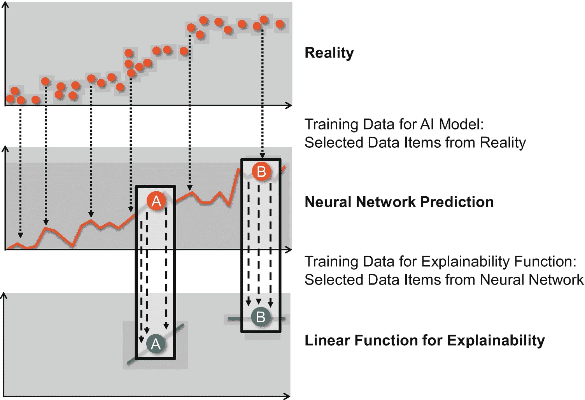

图 4-6

基于在兴趣点附近用线性函数逼近模型行为的局部可解释性

1.  **探测**。数据科学家需要训练数据来创建 XAI 模型。因此，他们在兴趣点附近探测神经网络模型。在图 4-6 中，他们会分别查找模型预测的房价，例如，对于 79 平方米、80 平方米、80.5 平方米和 82 平方米（情况 A），以及 185 平方米、203 平方米和 210 平方米（情况 B）。

2.  **构建可解释模型**。数据科学家使用步骤 1 中的数据探测结果来训练一个新模型。这个新模型估计神经网络在 A 点和 B 点附近的行为。核心思想是使用一个简单的估计函数，例如线性回归。预测质量会降低，但线性函数易于理解。因此，在图 4-6 中，数据科学家为两个兴趣点 A 和 B 创建了两个独立的线性函数。

3.  **理解与解释**。步骤 2 中的线性逼近函数使我们能够理解 A 点和 B 点附近的局部情况。在情况 A 中，房屋面积的变化对价格影响很大，但在情况 B 中影响不大。对于具有更多输入特征（不仅仅是居住面积，还包括花园面积、浴室和车棚数量，或者房子是否有阳台或室外游泳池）的模型，解释显然会更加丰富。

给数学基础较强的读者一个提示：关键不仅仅是计算梯度，而是在兴趣点周围进行探测。这种方法可以减少局部扰动和噪声恰好位于兴趣点上的影响，而这些扰动和噪声在附近区域可能并不存在（图 4-7）。

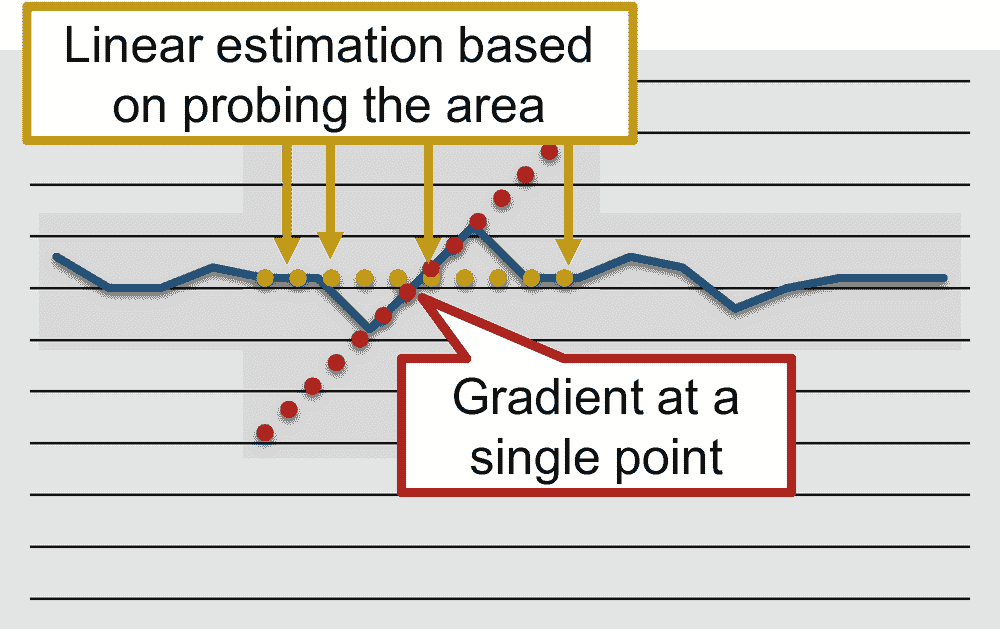

图 4-7

使用梯度与基于区域探测的线性回归来逼近局部行为

总结：局部可解释性能够识别——对于具体的预测——改变哪些参数最能改变预测结果。它帮助房主弄清楚，对于他们各自的房子，是增加一个游泳池还是停车场更能提升房屋价值。

### 全局可解释性

与局部可解释性相反，全局可解释性不关注单个预测。它追求的是不可能之事：向人类解释一个本质上过于复杂而无法理解的神经网络及其整体行为。一种著名的算法是排列重要性。排列重要性决定了各种输入特征对给定模型预测的影响。

该算法遍历所有输入列。每次迭代都会打乱表格中某一特定列的值（图 4-8，➌）。准确率下降得越多，被打乱的单个特征就越重要。例如，通过比较打乱`sex`列和`zip`列后的准确率，数据科学家可以理解`sex`对顾客购物习惯的影响比邮政编码更大（图 4-8，➍）。

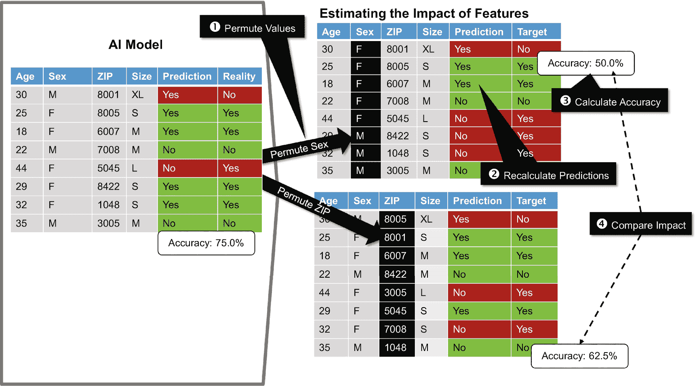

图 4-8

理解排列重要性

可解释人工智能是一个高度动态的领域，每年都会涌现许多新想法。然而，由于监管压力以及社会期望企业行为合乎道德，如今的商业产品已经实现了 XAI 功能，这从所有大型云服务提供商——谷歌云、微软 Azure 和亚马逊 AWS——身上可以得到证明。看到小众研究迅速成为主流并对许多公司产生重要影响，这令人着迷。

## 总结

在企业环境中，关于人工智能使用的伦理讨论由三个问题驱动：

-   设想的用例在伦理上是否可以接受？我们是否应该且想要创建和使用这个 AI 模型？
-   我们是否按照伦理标准来设计模型？例如，我们是否为了更快获得结果而以不当方式使用数据？
-   AI 模型本身是否合乎伦理？特别是，模型是否无偏见且公平？

虽然无偏见的 AI 模型往往与商业目标一致，但其他伦理方面需要平衡伦理上的期望与商业上的必要性——并且制定明确的职责划分程序可以减少团队和个人之间激烈冲突的风险。

然而，关于人工智能的伦理讨论已经走出了学术界。政策制定者正在积极制定人工智能监管法规。人工智能监管不仅仅关乎伦理。经济方面以及促进创新和全球竞争力也同样重要。然而，伦理因素对人工智能监管有着重大影响。

数据隐私法已实施多年，但欧盟的《通用数据保护条例》彻底革新了关于我们如何存储、管理、处理和使用数据的法规。布鲁塞尔正在酝酿一项《人工智能法案》，这很可能会影响我们未来开发和部署 AI 模型的方式。在美国，联邦贸易委员会正在为人工智能的新世界重新解释现有法律。

例如，联邦贸易委员会要求银行列出导致拒绝信贷的四个关键因素。在基于规则决策的传统世界中，这是一个简单的任务，但如果使用拥有数千个节点和权重的神经网络，这就变成了一个挑战。难怪“可解释人工智能”会成为学术界和大型云服务提供商的热门话题。例如，全局可解释性识别出对整体模型行为最重要的输入因素。另一方面，局部可解释性则关注影响单个预测的最主要因素。观察联邦贸易委员会的要求、学术研究以及大型科技公司 AI 服务创新如何追求同一个目标——更好地理解基于 AI 模型的决策——真是令人大开眼界。

