# 5. 构建一个人工智能交付组织

当人工智能要撼动你的公司时，零星的几个项目是行不通的。你需要一个稳定的人工智能组织，随时准备介入、提供帮助，并推动公司向数据与人工智能驱动型企业转型。这一目标对数据科学家和整个人工智能组织都有影响。他们必须拓宽视野，将重心从项目和模型转移到为组织内部进行人工智能的“国家建设”上来。任务就是：构建一个持久的人工智能组织。

构建人工智能组织始于识别（内部）客户并确保资金支持。客户意味着组织内部存在一些管理者，他们面临可以用人工智能解决且愿意用人工智能解决的挑战。你必须说服他们，你的人工智能组织技术过硬，理解他们的业务挑战，并能帮助他们实现目标。一个人工智能组织不能只关注技术，或者只存在于少数分工高度细化的大型企业中。从理解业务问题到为具体场景提供解决方案，这种端到端的视角是与客户合作成功以及获得资金支持的关键。

当你初涉公司政治时，尤其要留意两种支持你的管理者。一位*赞助者*会帮助你为你的服务提供资金。她有预算，或者能帮你从其他人那里获得资金。另一方面，一位*非物质支持者*会告诉你，你、你的想法和你的创业精神有多么出色。然而，她没有钱，也不会为你争取任何预算。

一旦人工智能组织确保了资金，团队就必须交付承诺的人工智能项目，并梳理和运行其人工智能基础设施。花费数月时间评估技术和细化所有技术概念，很少能符合企业的期望。相反，赞助者和高级管理者希望看到人工智能组织能带来实质性的商业价值。

本章通过阐述以下三个方面，帮助管理者成功应对这些挑战：

-   塑造人工智能服务，即讨论（人工智能）服务的典型要素以及存在哪些选择。
-   审视运行项目以创建卓越人工智能模型的人工智能组织所面临的组织挑战。
-   详细说明人工智能运维的组织需求，这些运维需要长期运行人工智能模型，例如，作为解决方案代码的一部分或在专用的人工智能运行时服务器上运行。

这种主题组合有助于管理者准备他们的服务提案，并在高级管理层批准概念并确保资金后，实施实际的服务组织。

## 塑造人工智能服务

就个人而言，我一直很喜欢与团队和管理者一起在 IT 部门内塑造服务。你会与工程师、管理者和客户进行大量讨论，从而加深你对主题和组织的了解。这就像歌德的《浮士德》中所追求的：“……理解是什么将世界的核心联系在一起，看清它的一切运作和根源。”

### IT 服务特性

“服务”是这样一个术语：大多数人对它的理解更多是直觉性的，而非精确的。然而，精确的理解有助于设计人工智能（及其他）服务。大约二十年前，乔·佩帕德详细阐述了 IT 服务的主要特性。它们是：无形性、人为因素、生产与消费的同时性，以及无法预先演示。

**无形性**反映了服务不会产生任何你可以触摸到的实物。相反，服务是关于某人为某事做某事，这可能会改变有形或数字资产。

人工智能团队通常会创建、部署和维护数字资产：人工智能模型、应用和使用模型时以列表形式呈现的推理结果、用于数据清洗和准备的代码，或者将模型集成到复杂解决方案中时的接口配置。此外，人工智能团队还可能提供沟通密集型的咨询（例如，帮助内部客户明确人工智能应解决的问题），或为与模型及其集成相关的技术事件提供支持。

**人为因素**反映了人们的互动与协作。专业地处理客户互动，对于避免客户不满与成功解决问题同样重要。数据科学家通常比他们的许多客户拥有更多的学术成就。尽管如此，他们必须耐心地解释主题，用易于理解的语言沟通，重视内部客户的业务知识和经验，并表现出对应用场景的兴趣和理解。

第二个经常被忽视的方面是客户方需要做出建设性贡献。假设人工智能运行时服务器与销售活动管理系统之间的集成出现问题。活动管理系统的所有者或管理者不能简单地指责人工智能团队，并拒绝在自己这边进行调试。与客户合作的资历和经验有助于处理此类情况。

**生产与消费的同时性**意味着服务的提供和消费通常同时发生。如果医生给我做检查，我必须到场。人工智能服务也是如此。当人工智能模型或接口出现故障时，人工智能团队必须尽快开始处理问题。此类事件不能等待，这种支持服务也无法提前准备并“入库”。根据具体请求的不同，这种同时性会有所放宽。创建一个人工智能模型是一项需要数周的任务。你可能不想在八月份生成一份客户名单，用于在十二月初向他们发放圣诞树优惠券。你必须在十一月或十二月做这件事，尽管早一天或晚一天差别不大。

这种同时性对人工智能组织有两个影响。首先，管理层必须确保人工智能团队始终有适量的工作——既不能太多，也不能太少。其次，虽然对人工智能模型等数字资产可以进行主动质量控制，但对于人际互动则无法进行主动质量控制。培训数据科学家如何与客户打交道是一项重要措施。然而，当数据科学家对客户大喊大叫时，你无法在影响客户之前对互动进行“质量控制”。你只能在事后进行“损害控制”。

**无法预先演示**。通常不可能在合同签署和服务建立之前演示一项 IT 服务。你无法试驾一项 IT 或人工智能服务。人工智能经理或数据科学家可以解释基于新人工智能模型的销售团队的成功案例。尽管如此，这种故事叙述并不能完全等同于现场演示，例如，演示人工智能能为优化发动机的团队带来的好处。

IT 和人工智能服务的特性对**人工智能组织**有明确的影响。如前所述，由于人工智能服务的生产与消费同时性，人工智能经理必须仔细平衡潜在的人员配置需求与因项目取消或延迟造成的工作缺口。具有咨询或 IT 服务提供商背景的管理者会觉得这显而易见。对于具有更多学术背景的员工来说，这是一个新的方面。另外两个影响是相似的——对顾问来说显而易见，对其他人来说则更令人惊讶。人工智能团队成员需要具备人际交往能力，以实现富有成效的日常互动，尤其是与客户互动的团队成员。最后，当人工智能组织需要识别新项目时，由于人工智能服务的无形性和无法预先演示的特性，人工智能经理的获取客户技能至关重要。然而，确切的要求和需求因项目而异，因服务而异——尤其是在具有不同企业文化和组织结构的公司之间差异更大。

### AI 服务类型

创建一个用于识别建造下一个购物中心最佳地点的 AI 模型，与运行并开发一个用于网店向客户推荐下一个最佳购买商品的 AI 组件，是两种完全不同的服务。前者是一个 AI 项目（服务）；后者则需要一个稳定的 AI 运维服务。

项目——`AI 项目`及其他——都有明确界定的目标和可交付成果，并附有设定的截止日期和透明的工作量估算。所有项目经理的目标都是“按时按预算”交付。

AI 项目的核心可交付成果是一个（或多个）AI 模型，并辅以次要可交付成果。一种典型的次要可交付成果是推理结果，例如一份供银行顾问参考的列表，列出他们应该致电哪些客户以推销新的投资基金。该列表是通过将 AI 模型应用于客户的购买历史记录而生成的。另一种次要可交付成果是对 AI 模型的分析和解释，指出并列出对整体结果影响最大的（输入）参数，例如，在模拟高炉炼钢生产时的碳含量或精确温度。

AI 项目需要 AI 专家与业务部门员工之间进行强有力的协作才能成功。后者拥有所需的业务知识；他们必须分享这些知识，并愿意讨论和回答数据科学家关于数据语义、确切业务需求以及结果业务含义的问题。

第二种服务类型包括`AI 运维服务`，它有两种变体。第一种是将 AI 组件集成到软件解决方案中。软件组件在需要时触发 AI 模型进行推理。这无需人工参与。第二种 AI 运维服务变体需要数据科学家或 IT 专家在需要时或定期（例如每月）生成 AI 推理结果。运维工程师可能不仅一次，而是每月生成一份霓虹橙色手袋潜在买家列表。

AI 组织必须平衡自动化成本与手动推理执行及处理客户请求的成本——同时还要考虑运营风险，例如偶尔混淆了应该向谁发送霓虹橙色手袋优惠券，以及向谁发送阿斯科特领带优惠券。此外，即使目标是完全自动化，第二种变体也符合最小可行产品（MVP）理念：在开发完全自动化等高级功能之前，先让解决方案运行起来并提供初步结果。

无论如何，与项目不同，AI 运维服务是一项持续多年的长期承诺。AI 运维服务需要运行和维护一个 AI 平台、自行开发的代码和接口，并监控模型质量。不时地重新训练模型是必要的，这需要一些短期项目。因此，AI 运维服务需要（一些）AI 知识，但总的来说，运行和维护一个 AI 组件是一个标准的 IT 运维主题。数据科学家对于与模型相关的挑战至关重要。然而，IT 运维和应用管理专家可以接管所有其他任务。

与项目服务相比，AI 运维服务具有不同的协作模式。项目需要密切互动以提高效率。相比之下，运维服务为了降低成本而尽量减少互动。它们更倾向于异步、高度结构化和标准化的互动：工单和工作流系统，而不是电子邮件、电话和现场支持。我们稍后将更详细地讨论这个主题。此外，表 5-1 总结了 AI 项目和运维服务的特征并进行了比较。

**表 5-1** 比较 AI 项目服务和 AI 运维服务

| | AI 项目服务 | AI 运维服务 |
| --- | --- | --- |
| 目标与可交付成果 | 创建一个 AI 模型，并应用一次（或几次），或分析该模型 | 确保 AI 团队或 AI 组件持续交付 AI 推理结果 |
| 持续时间 | 有限。一旦所有可交付成果提供完毕，项目即结束 | 长期、持续的服务，通常持续数年 |
| 持续时间 | 单一、定义明确的项目，具有清晰的可交付成果 | 通常持续数年 |
| 范围 | 创建一个 AI 模型，并将模型应用于数据一次或几次，或分析模型提供的见解。 | 频繁的手动推理，或运行和维护包含 AI 模型的 AI 组件，监控 AI 模型退化，触发 AI 模型重新训练 |
| 互动模式 | 业务与 AI 专家之间的紧密协作 | 主要使用工单系统 |

### 描述 AI 服务类型

你的人工智能项目和服务组织，是更像快餐店还是高级餐厅的体验？当你去一家高档餐厅时，服务员会与你闲聊几句，了解你偏好的食物类型，并帮你选择菜单。侍酒师会根据你独特的葡萄酒偏好，为你搭配完美的佐餐酒。接着，厨师在准备餐点时，会考虑到你的过敏情况。这与在麦当劳的触摸屏上点一个巨无霸，两分钟后在柜台拿到一个装有餐点的纸袋，是完全不同的体验。这是两种不同的体验，两个不同的细分市场，以及两种不同的价格标签。同样地，任何 AI 部门都应该清楚他们的客户期望什么，以及管理层资助什么。

Peppard 的 **IT 服务矩阵**（图 5-1）是一个简单的工具，用于验证客户期望与 AI 组织实际服务主张是否匹配。该矩阵考虑了两个维度，将服务分配到四种服务类型之一：“服务工厂”、“服务商店”、“服务商场”和“服务精品店”。

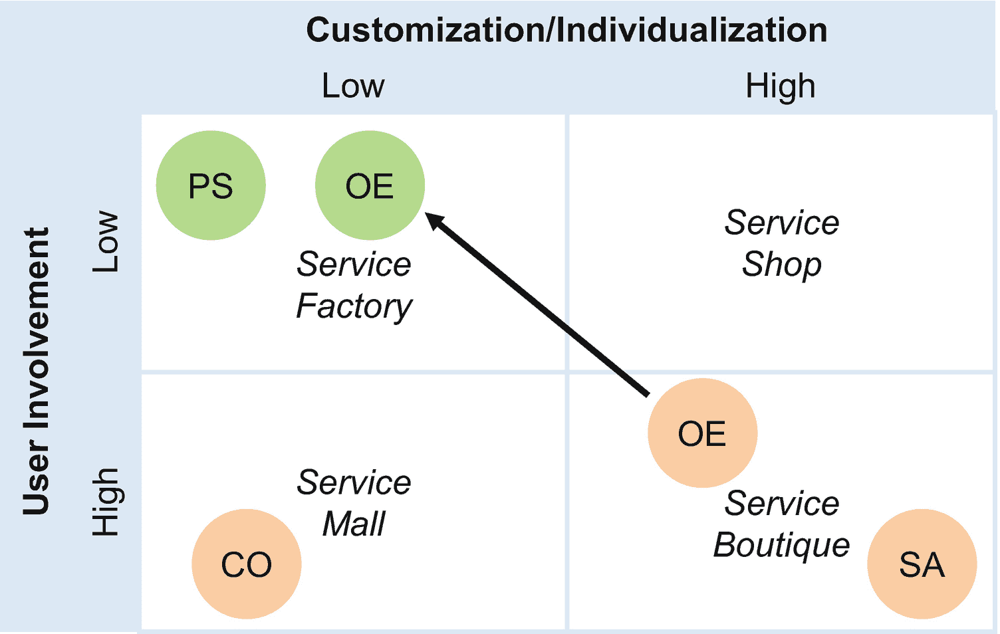

图 5-1

包含 AI 服务的 Peppard IT 服务矩阵：平台服务 (PS)、AI 咨询 (CO)、战略咨询 (SA) 和卓越运营支持 (OE)

第一个区分标准询问不同客户需要多少**定制化**。第二个标准关注服务员工与用户之间的**互动**。为了取得良好效果，他们沟通或协作的频率和时长如何？

“豪华”模式是**服务精品店**：AI 部门与客户和用户之间互动频繁、协作紧密，并且可以提出高度个性化的需求。为管理咨询生成战略洞察就属于这一类。高层管理人员有足够的资源来资助专门的 AI 项目——这些项目对于支持高影响力的战略决策是有意义的。此外，独特的产品组合增强计划也可能向 AI 部门提出此类服务请求。例如，一家医疗诊断公司开发了一个 AI 支持的解决方案，用于诊断特定疾病。

除了 C 级别的 AI 项目，用于创建新的（非平凡的）AI 模型的常规 AI 项目也属于服务精品店类别。例如，数据科学家在创建支持营销活动的第一个 AI 模型时，必须分析每一个细节。然而，后续可能会产生协同效应。数据科学家在创建第二个、第三个或第四个模型时，可以重用数据源或数据准备和清理逻辑。这是一个渐进的发展过程。有远见的 AI 管理者会培养和鼓励这种趋势。

**服务工厂模式**适用于客户与 AI 服务组织没有或只有有限接触的服务，他们获得的是满足大部分需求、无需太多个性化的标准化服务。通常，当 AI 组织在 AI 运行时服务器上运行 AI 模型时，它就扮演着服务工厂的角色。服务器必须运行，部署的 AI 模型必须可操作，并且供消费预测和分类结果的应用程序使用的接口必须保持在线。然而，不需要与客户进行直接的个人互动。实际上，添加、改进或重新训练 AI 模型意味着该服务会（暂时）切换到服务精品店风格。

**服务商店**类别涵盖那些互动较少，但仍然高度针对客户进行定制的请求。软件开发项目属于这一类，设计公司的 IT 网络基础设施也是如此。然而，对于倾向于需要数据科学家与领域或业务专家进行大量互动的 AI 组织来说，这类服务并不典型。当 AI 管理者意识到他们正试图建立和运行这样的服务时，他们应该分析整体情况。这真的是一个服务商店的用例吗？还是项目赞助者试图通过让项目看起来像服务商店而非服务精品店项目来节省资金？这种想法在纸面上节省了资金，但往往会导致惨痛的失败。

**服务商场**类别提供的服务个性化或定制化程度低，但与客户的互动和参与度高。如果 AI 部门提供承包商式的内部 AI 咨询，那么它们就在这个类别中运作。在这种情况下，AI 组织拥有一个数据科学家池，他们帮助其他团队处理与 AI 相关的任务。这些数据科学家需要出色的社交技能，以及为个别客户定制解决方案的能力。与客户的互动很多，但定制化程度有限。这就像租车。你可以租一辆两门或四门的车——如果你的团队需要 AI 支持，你可以分别聘请一位掌握 `Python` 或 `R` 技能的 AI 顾问。

不同的模式——服务工厂、服务商场、服务商店和服务精品店——对 AI 组织来说尤其重要。它们影响着哪些服务属性对于具体的 AI 服务至关重要。

### 理解服务属性

一个管理良好的 AI 组织会将其精力集中在重要的服务属性上。Philip 和 Hazlett 的 PCP 属性模型有助于 AI 组织确定正确的优先级。他们的模型区分了三种服务属性：关键属性、核心属性和外围属性（图 5-2）。

最重要的是**关键服务属性**。AI 服务和项目的关键要素通常是 AI 模型及其在客户环境中的评估和使用。一个具体的例子是，为一家电话公司构建的用于预测客户流失的 AI 模型，以及一份可能在下周终止合同的潜在客户名单。此类交付成果需要 AI 专业知识，包括统计学和机器学习知识、工具使用经验，以及整合所有相关数据以构建卓越模型的经验。

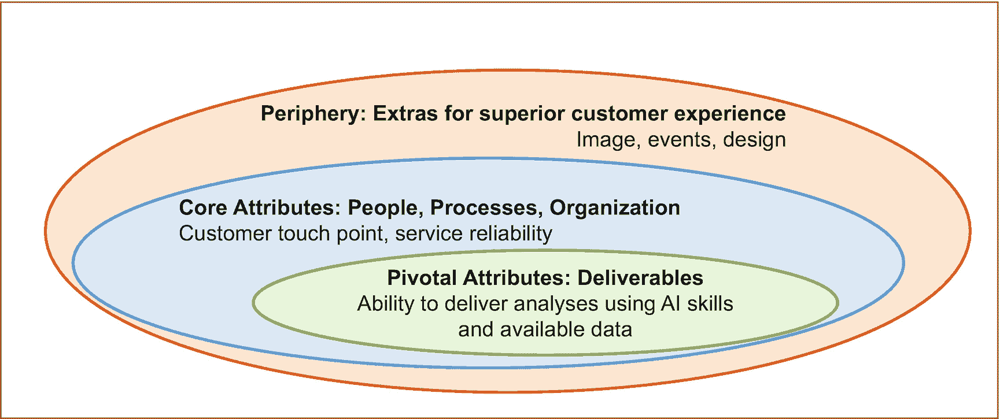

图 5-2

Philip 和 Hazlett 的服务 PCP 属性模型

**核心服务属性**对于长期客户满意度至关重要。它们涵盖了人员、流程和组织，以及这些要素如何相互作用并创造服务体验。它们应确保可靠和友好的服务。例如，客户接触点是什么样的？客户如何接受它们？是否有电话支持，热线电话是否如宣传的那样可以接通？是否有使用方便且比电话支持更省钱的工单系统？项目组织能否按时交付？在完全不同领域的多个 IT 部门中，我观察到未能管理好这些核心服务属性会导致问题升级和挫败感。

最后，还有用于产生“哇”效应的**外围服务属性**。它们能激发客户、管理者和用户的兴趣。例如，报告和列表设计得好吗？团队成员是否在会议上发表演讲，从而在项目中与他们合作变得有趣？是否有社区活动来促进 AI 服务团队与客户之间，以及客户与客户之间的关系？它们能激发兴趣，并在事情偶尔出错时为你赢得一些好感，但如果 AI 组织未能充分交付关键属性和核心属性，它们就毫无用处。

在建立 AI 服务时，理解、分类和设计服务属性是一项重要任务。AI 管理者必须理解并/或定义它们。人员配置、资源分配和管理层的关注度必须反映出各种服务属性的重要性。

### 设计（并衡量）服务质量

你努力工作，甚至付出了额外的努力。然而，你的客户、老板或朋友仍然对结果不满意，并直截了当地表达他们的情绪。这在个人生活和商业环境中都令人沮丧。AI 团队及其内部客户和利益相关者也可能遇到这种情况。然而，AI 管理者在理解不同的服务质量层次时（图 5-3），可以减少摩擦的风险。

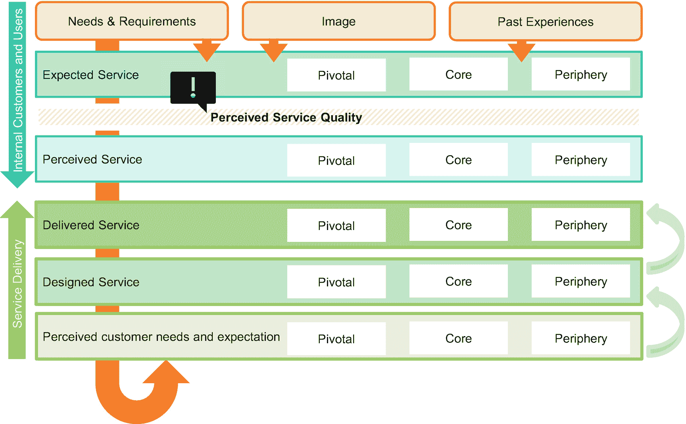

**图 5-3** 设计与理解服务质量

AI（及非 AI）服务的客户满意度取决于对以下方面的感知服务质量：

*   *服务交付的内容*（关键要素）以及
*   *服务交付的方式*（核心与外围要素）

事实上，**期望**取决于**客观需求**和要求，例如，提升某个特定移动套餐的销售额。AI 团队的形象和声誉会影响期望，以往互动的经历也是如此。这些是**主观影响因素**。客户和用户基于这些不同因素形成他们对服务的期望。他们将*期望的*服务与*感知到的*服务进行比较。客户满意度并不仅仅取决于 AI 团队根据*自身*标准和指南交付服务的质量。它还取决于客户的期望和感知。

在服务交付方面，存在三个不同的**服务质量层次**。起点是对客户需求和意愿的*感知*。下一步是*设计*满足这些客户需求的服务。然后，由 AI 团队实施并*交付*所设计的服务。每个环节都可能发生误解，从而影响服务满足客户期望的整体适配度。如前所述，还存在客户对已交付服务的感知。而且，一如既往，有些客户看到的是半满的杯子，而另一些则看到的是半空的杯子。

基于 Grönroos、Parasuraman 以及 Philip 和 Hazlett 数十年来关于服务质量的研究，这一分层模型的含义有三点：

1.  严谨的服务设计和经验丰富的数据科学家创建高性能 AI 模型至关重要。
2.  仅有关于服务如何运作的精彩 PPT 是不够的。AI 管理者、AI 翻译员、团队负责人或顾问必须与交付团队合作，将概念落实到实际运作的组织中。他们必须检查服务概念在现实中是否可行。
3.  管理利益相关者和客户的期望是 AI 管理者工作的重要组成部分。在项目启动前和进行中处理差距，比在耗尽所有预算后再处理要容易得多。

对于经验丰富的 IT 服务管理者以及具有 IT 或管理咨询背景的专业人士来说，这三条指导原则听起来熟悉、简单且显而易见。然而，它们能帮助首次担任领导角色的高技术专家，避免他们亲身经历所有痛苦的教训。运营一项服务是沟通与承诺的结合。根据我的服务设计经验，为潜在客户写下服务的关键点会有所帮助。你做什么？局限性是什么？这并不会让额外的沟通变得多余。它有助于促进对需求和期望的讨论——并防止客户方产生错误的假设。

## 管理 AI 项目服务

AI 项目训练 AI 模型，并得出可操作的见解，例如面向销售的潜在买家目标列表，或面向产品经理的典型买家特征。管理一个运行众多此类项目的组织，需要了解不同的工作负载模式、理解预算编制的成本结构，并向客户沟通结果。然而，首先，AI 组织必须理解所需的能力。

### AI 项目服务的能力三要素

“能力”一词源于企业架构。它有助于表达一个组织单元能够做什么。这并不意味着一个组织单元仅仅具备承担任务的理论知识。拥有能力意味着拥有熟练的员工、工具、流程定义和方法论。该组织单元、团队或 AI 组织必须能够或已经在今天成功执行这些任务。

遵循 CRISP-DM 方法论，并经历创建 AI 模型的所有阶段（即，不包括部署阶段，该阶段更偏向运维而非项目任务），我们可以识别出 AI 项目服务组织所需的所有能力（图 5-4）。

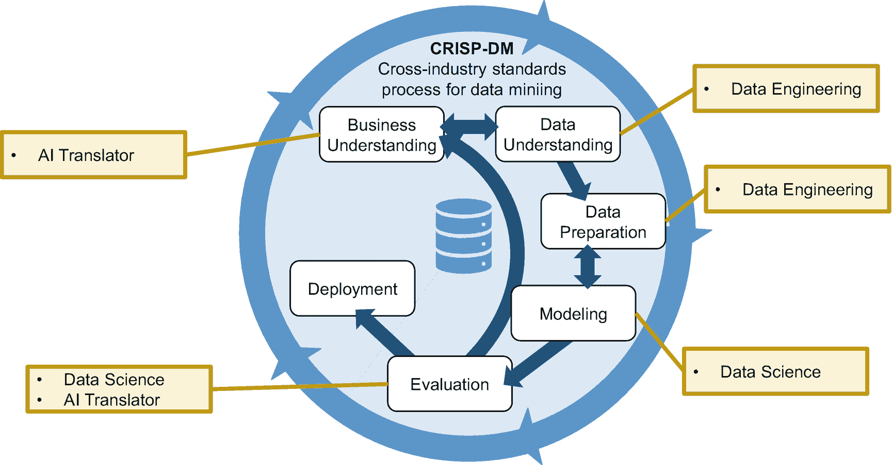

**图 5-4** 能力——以 CRISP-DM 为中心的视角

**核心能力**是**数据科学**专业知识。它是在“建模”阶段创建 AI 模型以及在“评估”阶段评估 AI 模型质量的基础。这是 AI 组织最显而易见的能力。而另外两项所需的能力——“AI 翻译员”和“数据工程”——则常常被低估，尽管它们在几乎所有项目中都需要更多的时间和精力。

AI 组织需要**数据工程能力**来执行“数据理解”和“数据准备”阶段，以完成以下任务：

*   组织层面的挑战，例如获得数据所有者使用其数据的许可
*   数据传输：用户与权限、网络带宽、传输工具
*   理解数据模型和数据的语义
*   分析数据质量

区分数据工程和数据科学能力对于人员配置至关重要。无所不能的超级英雄既罕见又昂贵。大多数公司都有熟悉`SQL`以及公司一个或多个数据库的专家。他们在准备数据导出方面效率极高。他们可以承担数据清洗和准备工作，而无需深入的数学、机器学习或 AI 知识。他们在每个 AI 组织中都很有帮助，尤其是当他们非常了解数据源时。虽然他们需要与数据科学家互动来执行任务，但他们通过解放数据科学家，使其能更专注于创建和优化 AI 模型，从而帮助了 AI 组织。

AI 项目所需的第三个也是最后一个**能力**是 AI 翻译员。他理解业务问题，将其转化为 AI 任务，并向业务方展示结果并进行讨论。他理解 AI 模型提供的见解类型，并应具备进行粗略工作量估算的基本知识。他不必能够创建和优化模型。该角色类似于经典软件工程中的业务分析师：理解商业挑战，在与用户和客户交谈时提出正确的问题，向管理层展示结果，并编写高层级规格说明。没有软件项目会派其`Java`专家去 C-level 讨论软件开发项目的战略目标。AI 管理者同样不应派遣技能高超且专业化的数据科学家去处理此类事务。

数据科学、数据工程和 AI 翻译员构成了能力三巨头，在组织使用一次性 AI 模型支持战略决策时不可或缺。图 5-5 将它们置于更广阔的背景下。数据工程与数据提供者和数据源紧密相连，确保 AI 组织能够整合公司任何数据库中存储的尽可能多的数据。AI 翻译员则与各部门管理者合作，识别哪些战略决策可以从 AI 中受益。换言之，创建哪些 AI 模型有助于通过预测个人或群体行为来分析战略和运营挑战？

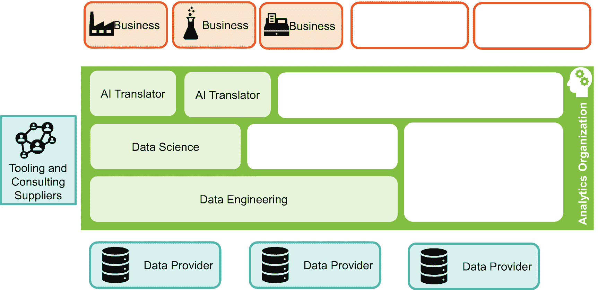

图 5-5

面向咨询型 AI 服务的 AI 服务团队能力（白色方框：后续其他 AI 服务所需占位符）

数据科学家与这两者都合作：与 AI 翻译员共同识别哪些 AI 模型对业务有益，与数据工程师协作获取所需数据。实际上，没有外部供应商的参与，这幅图景并不完整。例如，咨询公司可能接管完整的任务或项目；承包商可以扩充内部团队。此外，还有组织用于提升效率的工具供应商（包括公有云提供商）。

为避免误解：图 5-5 列出了许多能力，但并不意味着 AI 组织应为每种能力招聘 2-3 人。它更像是一份需要分配给团队成员的任务清单。在一个大型 AI 组织中，你和其他五位数据科学家可能在一个专门的数据科学团队中工作。如果 AI 组织只能资助两名数据科学家或工程师，那么这两人需要共同负责所有事务。因此，任何团队发展战略或招聘新专家的流程，都应综合考虑通常所需的所有能力，以及当前团队的优势和劣势。

## 工作负载模式

当 AI 组织（主要）运行基于 AI 的咨询项目时，工作负载具有特定模式。这对 IT 或管理咨询领域来说很典型，但对具有不同专业背景的 AI 经理和数据科学家而言可能是新概念。处于**项目业务**中意味着要一个接一个地获取和交付项目。公司应该在超市连锁店的哪里开设下一个新分店？在向媒体和新闻界展示新车之前，我们能否最后一次改进发动机？这些项目遵循 CRISP-DM 方法论。在几天或几个月内，数据科学家创建模型并向客户解释其影响。项目随之结束。数据科学家没有后续任务，也没有额外的项目成本。相反，对业务的好处可能才刚刚开始，例如增加收入或降低成本（图 5-6，左侧）。当一个项目结束时，数据科学家和工程师就该转向下一个项目了。他们甚至可能使用新的、不同的技术。对于总是寻求新挑战的经验丰富的数据科学家来说，这是完美的工作方式。

对 AI 经理而言，这意味着需要不断获取新项目。只有新项目才能证明 AI 团队对公司高层管理的重要性，并确保资金支持。一个已完成项目带来的持续节省，不足以让 AI 组织保持其重要性。如果没有下一个项目，首席信息官可以关闭 AI 组织而不会对组织产生影响。

一个 AI 组织（或其一部分）通常同时运行少量或大量并行项目，因为总有新项目启动，而旧项目则相继结束。图 5-6（右侧）说明了这一方面。

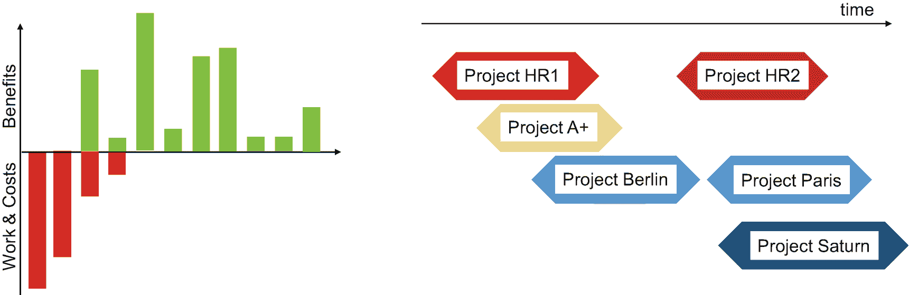

图 5-6

支出与回报模式（左侧）以及专注于咨询式 AI 咨询项目的 AI 组织的工作投入结构（右侧）

## 预算与成本

仅凭“AI 主管”等令人印象深刻的头衔，不足以让 AI 经理建立起一个由数据科学家、数据工程师和 AI 翻译员组成的蓬勃发展的 AI 团队。他们需要预算来资助团队，并支付 AI 项目的工具和基础设施费用。为了制定预算，他们必须了解 AI 项目服务的成本结构。我们首先审视单个 AI 项目的成本结构，然后拓宽视野，关注整个 AI 组织的成本结构。

理解两个**基本成本维度**至关重要：不可避免成本与设计成本，以及固定成本与可变成本。不可避免成本是你无法避免的成本。设计成本意味着管理层明确决定在哪些方面投入超出最低限度的资源。例如，为每位数据科学家工作站配备两到三台显示器，而不是一台。

第二个维度区分了固定成本和可变成本。当你购买用于机器学习的服务器时，这些是固定成本。无论是否进行 AI 模型训练，都必须支付这些费用。相比之下，云中按需付费的虚拟机则是可变成本的例子。

AI 项目具有以下由四类成本构成的成本结构（如图 5-7 所示）：

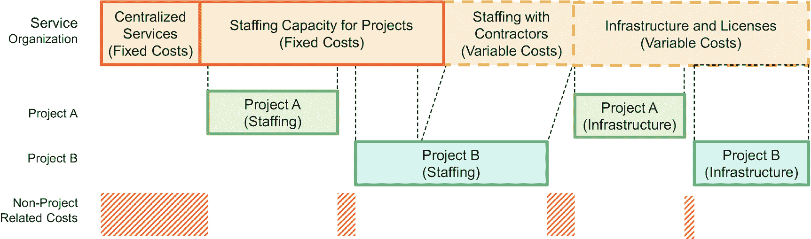

图 5-7

AI 项目服务的成本结构

*   员工和承包商的人员成本
*   基础设施，例如员工工作场所以及用于机器学习训练的计算和存储资源
*   AI 平台（如 SAP 或 SAS）的许可费用
*   集中化职能

当使用内部员工时，**人员成本**对于 AI*组织*来说是固定成本。即使员工工作量不足或无事可做，公司也必须支付他们的工资。然而，在审视*项目*成本时，人员成本是可变的。项目通常仅按内部员工提供支持的程度来支付其费用。项目总体工作量与 AI 组织可用员工之间的不匹配是一个挑战。工作量过大因资源不足会导致项目延期；工作量不足则可能引发成本削减活动。找到合适的平衡点是 AI 经理的关键任务。应对工作量波动的一种方法是，通过使用可更快速伸缩的承包商来扩充内部员工，从而使部分人员成本变得可变。

**基础设施成本**（除员工工作场所外）和**许可成本**对于使用云服务的 AI 项目和 AI 组织来说是完全可变的。或者，假设一个 AI 组织为其项目构建自己的 AI 平台，那么这些成本则属于**集中化服务成本**的一部分。后者还包括用于与客户互动的专用工单系统，或用于存储文档的 SharePoint。因此，以项目为中心的 AI 组织应谨慎控制集中化服务的成本。如果它们是固定成本，则可能成为财务负担，使得内部服务可能比外部采购的咨询服务更昂贵。

一旦 AI 管理者了解了其成本结构，就必须确保有足够的**资金**。具体细节因公司而异，这可能是一个高度政治化的问题。我只想简要解释两种典型模式：内部服务提供者和**优先排序的赞助者**（图 5-8）。最后一种是最方便的。由一位（或几位）高级管理者提供资金。其结果是：由他选择 AI 组织要开展的项目。谁出钱，谁点歌。如果他来自市场部门，AI 组织很可能专注于市场营销和销售主题。如果赞助者是负责潜艇研发部门的负责人，那么 AI 团队将优化与潜艇相关的挑战。图 5-8 展示了 AI 组织与优先排序的赞助者之间的典型互动。

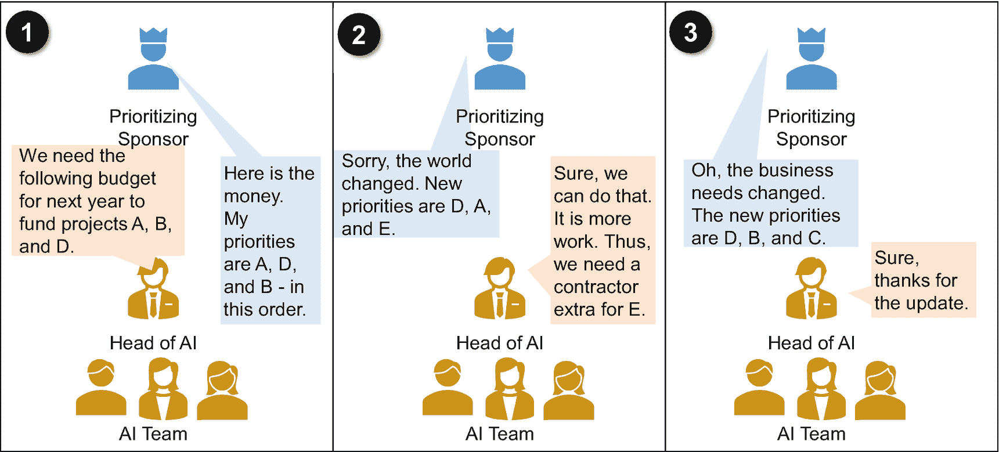

图 5-8
具有优先排序赞助者的 AI 组织示意图

第二种选择是内部**服务提供者预算**模式（图 5-9）。这在共享服务组织中很典型。AI 管理者必须在组织内部找到能够（至少部分）资助成本的客户。可变的、项目特定的成本很容易收取，而固定成本的融资则可能具有挑战性。在可变成本上增加一定百分比以分摊固定成本是一种典型机制。

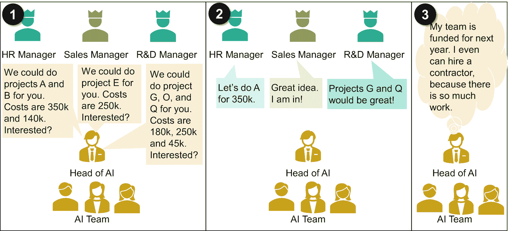

图 5-9
服务提供者预算模式的资金

通过这个简短的介绍，AI 管理者无需商业学位即可与他们的直线经理和客户讨论成本和资金问题。

### 销售成果：数据故事讲述

触及你的受众对于书籍作者、记者、喜剧演员以及 AI 组织来说至关重要。不幸的是，今天瓜德罗普岛的气压对我们大多数人来说毫无意义。而对于那些少数居住在那里的人来说，他们更关心的是明天下午是温暖晴朗还是炎热多雨伴有雷暴，而不是气压。这是一个完美的例子，说明你能预测的东西（气压）可能对受众没有直接帮助。相反，他们想知道明天他们所在的地方是否会下雨。

同样，数据科学家也必须了解他们的受众。他们是 AI 和机器学习算法、预测分析和统计学方面的专家，旨在从海量数据集中发现未见过的、意想不到的相关性。然而，项目结果必须满足四个标准，特别是对于帮助制定战略决策的项目：

1.  **与受众相关**。市场部门对客户洞察和销售感兴趣，而不是优化支持功能。
2.  **为受众提供新见解**。在 AI 项目展示其结果后，他们知道了什么？有什么新发现？预测明天中午撒哈拉沙漠不会下雪，可能不会被视作开创性的新见解。
3.  **可操作**。结果应允许进行一些改进、优化或效率提升。显然，收益必须高于项目投资。
4.  **引人入胜的呈现**。信息必须让受众感到好奇和感兴趣。

这些任务很好地契合了 CRISP-DM 方法论（图 5-10）。检查主题的相关性是业务理解阶段的一部分，该阶段在规划要做什么时进行，并在评估阶段重复进行。在展示结果之前，AI 项目团队必须检查他们是否提供了相关的新见解以及这些见解是否可操作。当然，演示和书面文档也应该吸引受众。所有这些活动都极具创造性和分析性。它们是 AI 翻译者的完美任务，他们深入了解客户、用户及其业务背景。

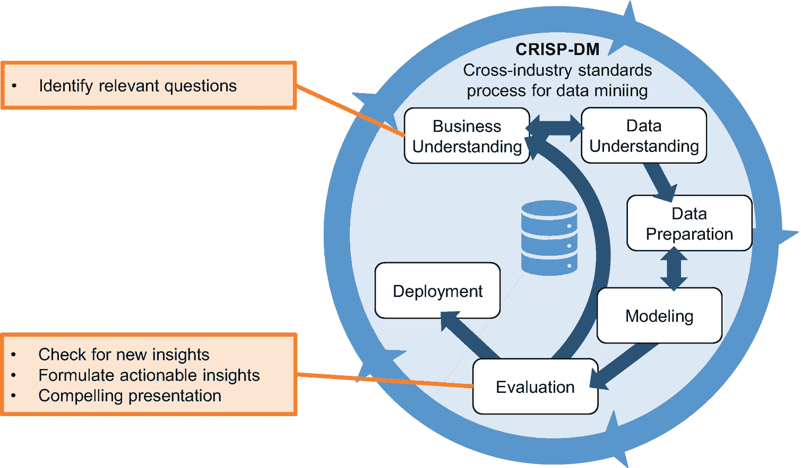

图 5-10
数据科学家如何让业务部门听到他们的声音

我想通过一个具体例子来说明这一点，即如何将一个模型变成一个引人入胜的故事。2020 年 7 月，一家瑞士报纸提供了一个完美的例子，展示了如何以枯燥无意义的方式呈现数据。他们报道称，联邦公共卫生办公室（BAG）宣布瑞士和列支敦士登新增 108 例新冠感染病例。这比前一天增加了一倍多。周一有 43 例新确诊病例，周日有 99 例，周六有 110 例。

当我们审视这四个标准时，会发现这条新闻满足了第一个标准。这条信息对瑞士的读者来说是相关的。但它提供了新见解吗？没有。读者事后并不知道这些数字是令人欣慰还是令人担忧。他们数周乃至数月来一直听说，不能直接比较每天的数字，因为某些工作日的数据会更高。因此，一条仅仅提供今天数字和过去三天信息的新闻是毫无价值的。上周每个工作日的数据能提供更好的指示。这个周二，我们有 108 例；一周前，只有 70 例。昨天，我们有 43 例，而前一周是 63 例。虽然这听起来可能不令人担忧，但如果七天移动平均线显示每周增长 12%，情况就不同了。

尽管如此，这些信息对大多数读者来说仍然过于抽象，无法让他们觉得相关。绝对数字太低了（726 例，对比 800 万人口）。你中欧洲百万彩票（5+1 个号码全中）的可能性都比这大。然而，通俗小报会通过将这些数字与同年三月的第一次创伤性封锁联系起来，使其对瑞士的每个人都具有相关性。那天的每日感染人数是 1063 例。按照每周 12% 的增长速度，瑞士将在下一个冬季再次达到同样的水平。头版上一个大字标题会是“预计圣诞节前后第二次封锁”。突然间，一个抽象的数字对每个人都变得相关，甚至对政治家来说也是可操作的——这是一个将简单数字转化为吸引所有人注意力的戏剧性故事的完美例子。

为避免任何误解：这过去和现在都不是一个实际的预测。所依据的数据和使用的统计模型都不充分。这个例子突显了沟通可以（过度）实现什么。当 AI 管理者想要在组织内进行创新时，他们的结果必须引起业务部门的注意并触及他们的受众。利益相关者、（业务）管理者或客户可能没有 AI 背景。他们可能过于急躁和忙碌，无法自己理解。在这种（典型的）情况下，AI 组织有责任让 AI 翻译者提供帮助，或者确保一些数据科学家拥有出色的沟通技巧。

## 管理 AI 运营服务

当 AI 组织创建模型并将其集成到更大的解决方案中并运行时，AI 组织（这一部分）的设立和工作方式会进一步发展。其能力、财务状况、技能和成本驱动因素与咨询式、以项目为中心的 AI 组织不同。对于 AI 运营服务，会出现新的主题，例如目标运营模式、与外部的清晰支持接触点或模型管理。AI 组织需要六种能力，而不是仅仅三种。

### 六大人工智能能力

在审视人工智能运维服务所需的能力时，存在运维服务的核心任务——以及人工智能运维组织也必须履行的任务。事实上，它必须能够运行至少小规模的人工智能项目，例如创建（较简单的）初始人工智能模型和重新训练模型。因此，人工智能运维组织也需要人工智能项目能力的“三驾马车”：数据科学、数据工程和人工智能翻译员。（图 5-11）。

在审视额外能力时，与人工智能运维组织尤其相关的是**集成工程能力**。它涵盖了安装和修补软件组件，以及配置人工智能组织后续负责维护的接口。集成工程包括将人工智能组件的接口与其他解决方案连接起来，以利用人工智能逻辑丰富传统业务流程。在人工智能语境中，一个很好的例子是安装诸如 `RStudio Server` 之类的软件，或者将 `RStudio` 与 `LDAP` 集成，这包含了典型的**应用管理**（AM）和**IT 运维**任务：解决问题、安装补丁，以及协调与其他应用程序和底层基础设施的发布。它还可能涵盖将人工智能组件与 IT 部门的中央监控解决方案集成，该方案会查找中止的进程或日志中的错误和警告消息，以便在问题影响用户之前（理想情况下）发现它们。

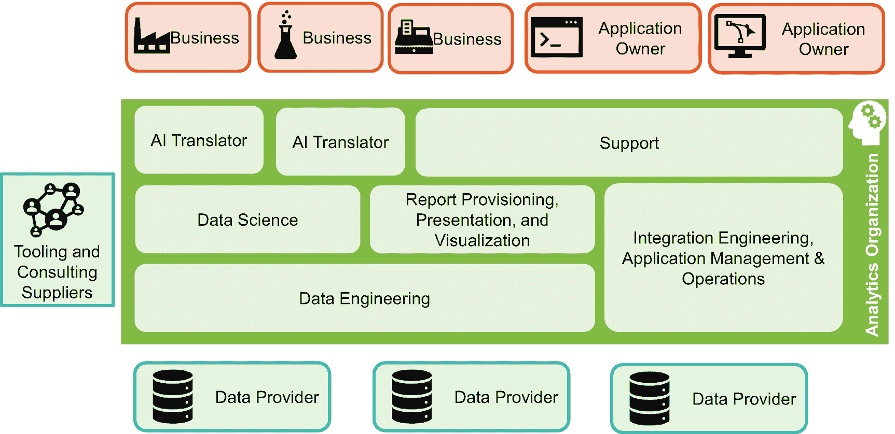

图 5-11

人工智能运维服务组织的能力

**支持能力**反映了组件并非总能按预期工作，这需要支持专家来分析情况并修复问题。因此，人工智能运维意味着需要一个支持团队，或者至少需要明确定义的专家，他们负责处理用户和客户的互动，并确保快速响应。他们是面向用户和客户的门面，例如，当用户错过某个结果、接口发生故障或接口配置需要更改时。此外，在人工智能运维组织中，他们可能执行常规的人工智能任务，例如在重新训练模型的背景下。

让应用管理和支持专家参与常规的人工智能任务，能提高人工智能组织的韧性。当这些专家从人工智能项目和数据科学家手中接管模型时，他们需要成熟的脚本和清晰的文档。这对组织的好处显而易见：从现在起，当某位数据科学家生病时，不会因为只有他一个人知道运行和重新训练在线销售关键人工智能模型的所有脚本和技巧而导致一切崩溃。

根据我的经验，在规模较小且专注的组织中，如果每天只有少量用户互动、少数几个组件以及不太复杂的系统和接口，一个人就可以同时承担支持和应用管理工作。尽管如此，这些仍然是不同的任务和能力。一个侧重于被动响应用户互动和解决较简单的挑战，包括最终用户的误操作（支持能力）。另一个，即应用管理，则更侧重于主动维护，以及在人工智能组件或接口发生故障时分析更棘手的问题。由于需要相似的技能和社交能力，将两者结合起来是合理的。然而，显然，如果一个职位只由一个人担任，那么必须指定副手。

有一项能力可能需要也可能不需要：**报告提供、演示和可视化**。人工智能通常提供列表，但——尤其是在解释模型是项目或人工智能组织核心时——更复杂的可视化会有所帮助。此外，当人工智能组织每天或每周提供新列表时，将这些列表作为 `CSV` 或 `Excel` 文件通过电子邮件附件发送出去是有问题的。这工作量大。而且，随着时间的推移，很可能发生操作失误。人工智能组织向销售人员发送了旧列表，导致收入下降。此外，有人可能错误地将此类邮件发送给组织外部人员，从而可能泄露敏感数据。因此，一个用于提供报告的平台至关重要——用户越多，拥有一个具有明确支持模式的稳定平台就越重要。理想情况下，人工智能组织应将其结果输入公司标准解决方案，例如商业智能（BI）解决方案或企业资源规划平台。

### 工作负载模式

“重复性业务”和“拉平（工作负载）曲线”是描述人工智能服务组织如何处理支持和应用维护任务的两句口号。

**重复性业务**意味着人工智能组织提供持续的服务。对于人工智能模型或组件的用户和客户来说，支持组织、软件维护和应用管理是必要的。人工智能模型能产生业务效益或运营效率，但这只有在人工智能服务组织持续运作的情况下才能实现。如果高层管理关闭了人工智能组织，那么从那一刻起，效益和效率就消失了。图 5-12 说明了这种支出和效益随时间变化的模式。

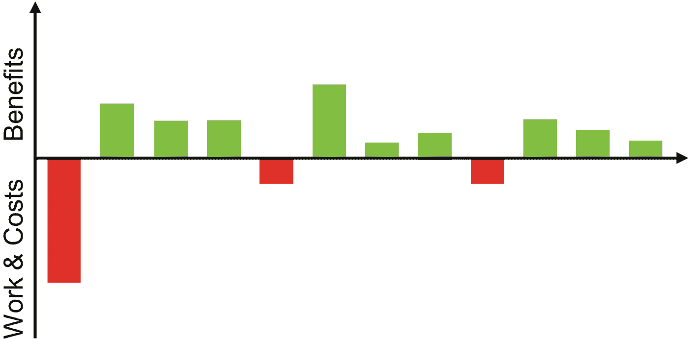

图 5-12

理解人工智能运维服务的工作量与成本 vs. 业务效益

“拉平工作负载曲线”这句口号反映了运维服务可以在一定程度上将工作负载转移到不同的天、周甚至月。应用管理人员和支持人员可以同时为多个团队和应用程序工作。图 5-13 中的例子说明了这一点。该人工智能服务组织为三个应用程序支持和维护人工智能模型及接口。此外，他们还运行一个即将上线的项目。如果每个项目都有独立的团队，那么应用 X 团队需要三名专家，应用 Z 需要三名，应用 R 需要两名，项目 13 需要一名。总共，该组织需要为九名专家支付薪酬。当共享人员时，他们只需要四名——如果他们设法将一个工作日从第三天移到另一天，那么只需要三名。许多维护任务可以推迟几天或几周，这是拉平工作负载曲线和提高组织效率的关键。

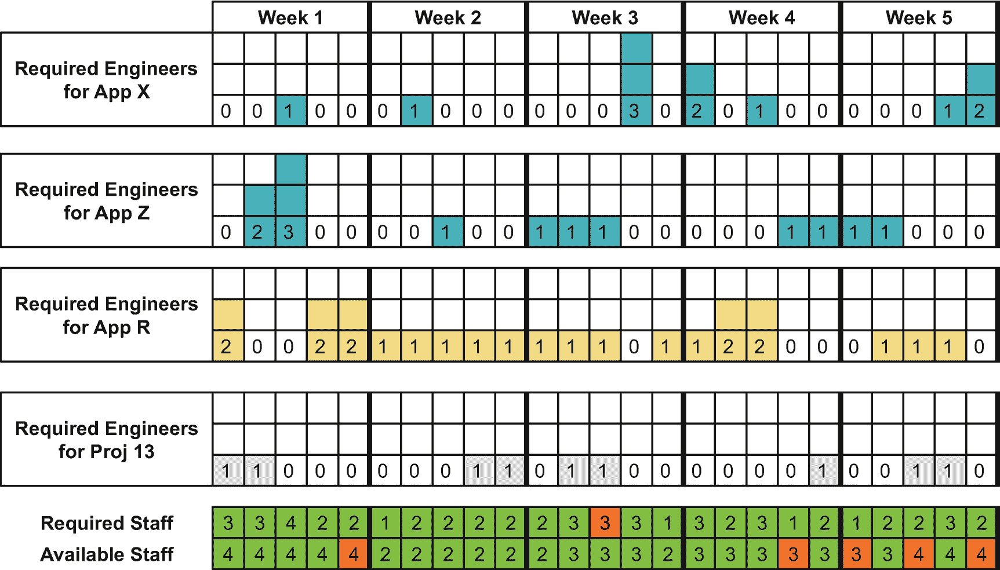

图 5-13

在包含一个项目的多应用环境中，支持和应用管理的工作负载规划

### 理解并管理成本驱动因素

AI 运维服务管理者面临的一大挑战是，要在预防措施上投入足够资金以稳定解决方案，并确保有充足的支持与工程人员来处理事件和支持案例。对服务运行的有意投入并不会产生利润。然而，投入不足则会导致服务疏忽成本，并损害业务。两种极端做法可以说明这一挑战。支持台可以只安排一名实习生，在周一早上、周三和周四下午查看邮件，并帮助解决 GUI 误操作问题。另一种做法是，提供 7/24 电话支持热线，配备三名随时待命的高级工程师，外加专业的监控和告警系统，从而进一步降低事件发生的可能性。成本不同，对组织其他部门的影响也各异。

**运行服务的成本**是指组织（自愿）为支持能力和持续应用管理所花费的资金。因此，第一个成本领域是**支持与问题管理**，其包含以下三个主要成本驱动因素（图 5-14）：

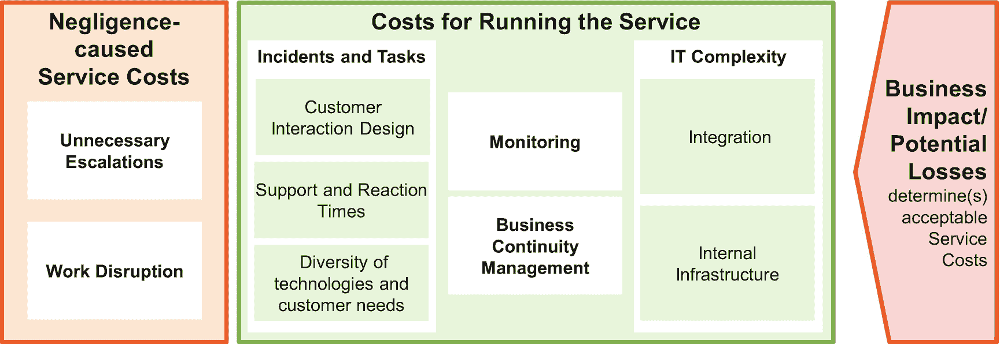

图 5-14

理解持续数据科学服务的成本

- **客户交互设计**。电话、上门服务台、电子邮件、工单系统、常见问题解答、单页文档说明、培训——提供客户和用户支持的方式有很多种。然而，正确的方法取决于请求的数量和复杂性，并会影响与用户和客户沟通所花费的时间。
- **支持与响应时间**。7/24 支持需要更多工程师，产生的成本也高于仅在工作日上午 9 点到中午提供支持的情况。同样，如果工单必须在五分钟内（而非四小时内）得到回复，人员配置需求和成本将会激增。
- **服务组合的多样性**。使用了哪些技术，例如 `Python`、`SAS`、`SAP Analytics` 或 `R`？已部署服务的实现方式和业务目标差异有多大？即使是帮助客户使用 GUI，也需要支持人员理解相关技术。当需要解决涉及真正工程问题的支持案例时，则需要更多的技术知识。根本问题在于，每班一名工程师是否能在知识层面处理所有请求——还是需要两到三名工程师。在向服务组合中添加任何新技术之前，这是一个至关重要的问题。

后一个方面反映了技术及其影响。**IT 基础设施的复杂性**同样会影响服务成本。首先，这涵盖了更多与**集成**相关的要素，例如接口的数量和稳定性。例如，是否使用了消息中间件，还是通信和交互是自行编码实现的？AI 组件协同工作的应用程序是否稳定，或者是否总是出现事件和关于哪个解决方案是问题根本原因的讨论？这些问题与生产系统之间的相互作用有关。然而，AI 组织还必须维护其**内部**硬件和软件**基础设施**，包括 CI/CD 流水线，特别是当这些流水线与其他软件开发团队、运行时服务器、AI 平台等的流水线集成时。

**业务连续性管理**和**监控**代表了额外的成本模块。具体细节取决于 IT 组织是否已部署相应的解决方案和流程。因此，它们同样不能帮助您创造业务价值；它们“仅仅”能更早地发现问题或减少问题的影响。

所有这些提到的支持和应用管理成本都是直接可见的。成本控制专家能精确了解所花费的资金，但看不到其收益。这种情形在成本优化举措中很容易成为预算削减的目标。少一个人？你应该看不出任何影响。我们可以削减一名工程师而不影响服务；为什么不连第二个职位也一起砍掉呢？这就像大学里流传的一个故事。为了省钱，他们在冬天降低了室内温度以减少供暖成本。你可以年复一年地重复这种做法——直到你的电费账单暴涨，因为办公室冷得无法工作，员工们带来了电暖器。应用管理和支持成本也是如此。它们可以被削减到几乎为零。其影响是严重的：AI 组织内部产生疏忽成本，而 AI 组织外部则产生业务影响。

**疏忽成本**是指由于支持和应用管理未能正常运作，在 AI 组织内部产生的成本和精力。首要影响是中断正在进行的 AI（项目）任务。对合理甚至不合理的用户和客户请求进行不当、不专业的处理，可能导致事态升级。事态升级不仅耗费管理层的时间，也同样耗费数据科学家和工程师的时间。后者必须收集数据、查找旧的电子邮件通信等。这些努力需要付出成本，并阻碍正在进行的项目。如果没有支持组织，数据科学家就得回答最简单的用户问题。换句话说：如果初次使用的用户不理解 GUI 或按错了按钮，数据科学家就会因项目工作（开发新 AI 模型）而受到干扰。此外，如果系统停止工作，打补丁或重新配置的时间压力会大得多。因此，需要比在较不紧张的环境下采取预防措施时更多的人来处理问题。此外，在用户打电话或开单之前，通过监控发现的每一个问题都能减少支持渠道的工作量。

最后，**业务影响**和**潜在损失**反映了因 AI 无法正常工作而未能实现的业务机会或节省的成本。例如，假设 AI 组件生成的追加销售和交叉销售推荐占网店收入的 20%。那么，当该 AI 组件宕机或开始提出糟糕建议时，这些收入就消失了。如果业务经理没有意识到这一点，AI 经理就应该在预算讨论中提出来，尤其是当高级管理人员质疑模型质量和服务稳定性的成本时。

### 模型管理

“它是我的，我告诉你。我自己的。我的宝贝。是的，我的宝贝。”《指环王》中的这句名言，罕见地表达了对一件器物的珍视与痴迷。AI 组织也应如此，像对待宝贵的公司资产和知识产权一样，精心呵护它们的 AI 模型。这正是模型管理的任务。

模型管理面临的真正 IT 或 AI 挑战有限。尽管如此，它仍是所有 AI 运维挑战中技术性最强的一个。它涵盖三个主要方面。第一个方面涉及 CRISP-DM 模型工程过程中的质量保证。第二个方面是部署后模型质量的监控与管理。第三个也是最后一个方面，是组织如何在模型的生命周期内将其作为工件进行管理（图 5-15）。

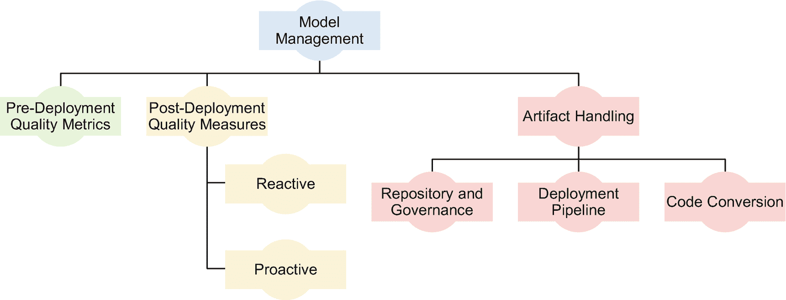

图 5-15

模型管理中的主题

前一章完全致力于模型创建过程中的质量保证，并对部署后的质量度量做了简要说明。下文我们将从一个不同的视角进行阐述。

`被动方法`是一种`自动化模型评分`和`KPI 监控`，用于检测输入数据以及由此产生的预测或分类中的变化（“漂移”）（图 5-16）。输入数据分布是否发生变化？或者更具体地说，例如，其平均值或上下限值是否发生变化？输出分布是否随时间变化？或者业务影响是否发生变化，例如转化率下降？当监控检测到某个 KPI 低于阈值时，它可以为数据科学家生成警报，提示他们重新训练 AI 模型。最简单的选择是使用最新的数据（如果旧数据仍然相关且有用，也可能包含旧数据）训练相同的神经网络架构。最全面的重新训练方法是重复完整的模型开发过程，包括特征开发和超参数优化。

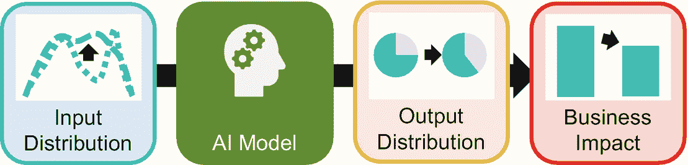

图 5-16

分析模型、神经网络与漂移

这是一种被动方法，因为只有当可检测到的 KPI 衰减表明需要时，才会启动重新训练。另一方面，`主动`方法则是在 KPI 看起来仍然良好时也进行重新训练。`冠军-挑战者模式`就属于这一类。当前投入生产的模型是冠军模型。尽管该模型（仍然）满足质量要求，但数据科学家已经在准备一个名为挑战者模型的新模型。数据科学家依赖最新数据或尝试更复杂的优化，并比较冠军模型和挑战者模型的性能。如果挑战者模型优于冠军模型，则挑战者模型成为新的冠军模型。否则，数据科学家将丢弃挑战者模型，并开始开发下一个模型。图 5-17 说明了这种冠军-挑战者竞赛。通常，冠军-挑战者模式是一种试图找到最佳解决方案的 A/B 测试。

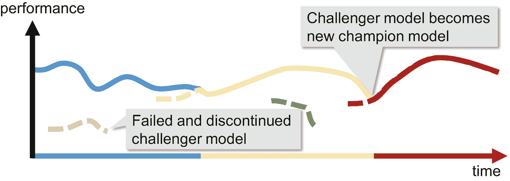

图 5-17

冠军-挑战者模式

除了质量方面，将`模型视为工件`并优化其处理，以及希望其在公司流程中顺利推进，是模型管理的另一个主题。数据科学家使用它们、共享它们、记录它们、存储和归档它们，或者对它们进行版本控制。许多任务在软件工程中很常见；其他则是新的。然而，有三个方面尤其相关（图 5-18）：

1.  基于工具的`托管部署流程`或`管道`强制执行公司规程，并降低运营风险和障碍。传统的 IT 组织倾向于使用诸如 `Jira` 或 `ServiceNow` 之类的工具，为签署需求、质量保证和部署实施复杂的审批流程。这种旧式方法侧重于可审计性。这对许多组织来说是强制性的，并且可能对 AI 组织及其创建和部署模型的方式具有约束力。较新的趋势是开发人员和数据科学家使用 CI/CD 管道自动化发布构建和部署。他们使手动工作变得多余。他们节省了时间，并降低了部署错误（错误的环境、错误的模型、错误的参数等）的风险。AI 管理者应检查其流程是否完全整合到公司的变更管理流程中，是否依赖相同的工具，并满足审计要求。

2.  `代码转换`功能可帮助数据科学家和软件开发人员在使用不同技术时协同工作。前几章讨论的将 AI 模型集成到软件解决方案中的选项之一，是使用解决方案开发人员使用的编程语言（重新）编写模型代码。数据科学家或软件工程师可以手动执行此任务，但这显然容易出错。或者，代码转换包可以自动化此步骤。公司使用的开发语言和不同的 AI 工具越多，这方面就越关键。

3.  数据科学家必须将模型作为宝贵的公司资产存储在中央`存储库`中。存储库可确保模型不会丢失或被意外删除，支持数据科学家之间的协作，并确保可审计性。

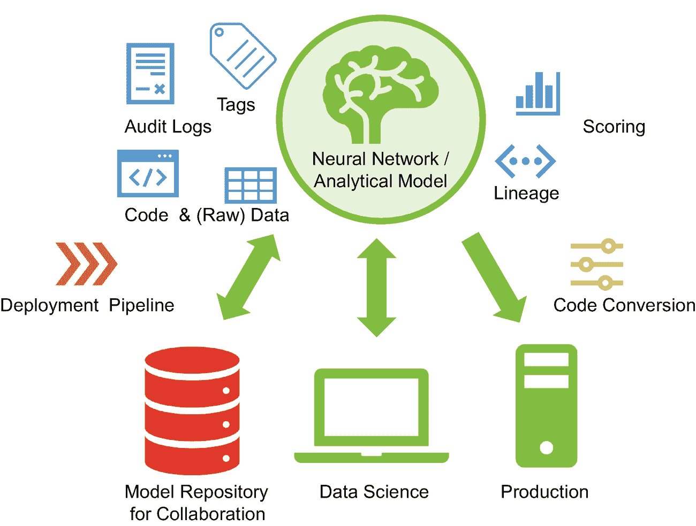

图 5-18

企业环境中的模型管理

存储库需要一些额外的说明。例如，AI 组织可以使用 IT 部门为软件工程设置的代码存储库。显然，AI 组织会存储 AI 模型的参数和超参数。此外，附加信息对于部署过程、搜索模型或通过审计至关重要。这些可能的附加信息包括：

*   数据准备和模型训练`代码`，以及实际的`数据或对数据的引用`。只有这种组合才能使数据科学家在以后精确地重现相同的模型。

*   `数据谱系`，记录数据从源头到成为训练数据的整个过程。例如，财务数据是来自企业数据仓库，还是来自一个由后勤部门的实习生创建、随后被五个团队复制和修改的晦涩难懂的 Excel 文件？

*   衡量模型性能的`评分`。它们记录了质量保证活动的严谨性，并证明了模型的充分性。

*   `审计日志`，记录关键活动，例如谁更改了训练代码或数据准备，或者将模型部署到了哪个环境。

*   `标签`，用于存储附加信息。例如，参与项目的数据科学家、模型的具体用途，或者数据科学家为何使用特定的超参数值。

# 存储 AI 模型与模型管理

将 AI 模型与附加（元）数据一同存储在仓库中，强制执行严格的部署流程，并监控模型部署后的性能——这是模型管理的三大支柱。当然，模型管理只是处于时髦热门的**数据科学**工作与光鲜亮丽的**管理层**之间的夹心层。尽管如此，模型管理是可持续 AI 计划所需的粘合剂。这种粘合剂能让企业从 AI 计划中受益多年，而不仅仅是几周或几个月。最终，模型管理凭借所有模型仓库信息和工件，为未来的数据科学项目提供快速启动支持——复用从未如此便捷。

## 组织 AI 团队

恭喜！你已经塑造了你的服务，分析了必要的能力，准备了预算，获得了资金，并招聘了合适的人才。然而，要启动你的 AI 服务，你的员工必须知道如何处理哪些任务，如何在 AI 团队及公司其他部门内协作，以及如何处理和完成用户与客户的请求。

**AI 项目服务**对 AI 团队结构是否超级严谨是宽容的——它们（应该）有明确的目标。AI 管理层只需将工程师和数据科学家分配到项目中，并明确他们在每个项目上可以投入多少时间。`CRISP-DM`方法论规范了 AI 专家的日常工作（图 5-19，左侧）。

**AI 运维服务**则需要更复杂的组织架构。试想一下，一个在线商城的 AI 组件突然向搜索沙滩装的顾客推荐滑雪装备。在这种情况下，AI 团队面临着巨大的压力，需要冷静、迅速且专业地解决问题。

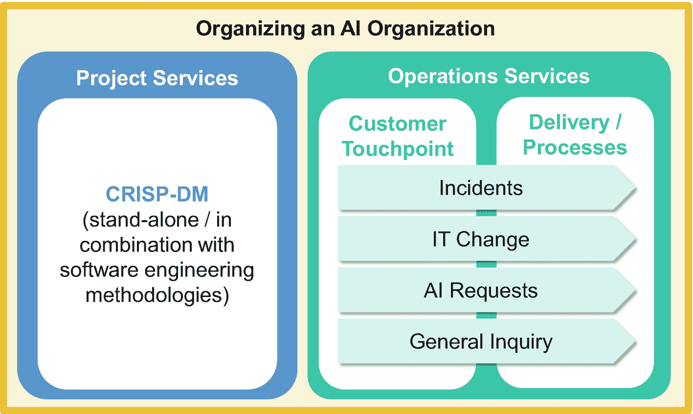

图 5-19

组织 AI 团队的主题

与项目最大的区别在于，大多数运维组织需要同时为多个（内部）客户、应用或服务提供服务。他们需要响应事件和特定的客户请求。典型任务包括重启组件、修复接口问题或配置新接口。他们还会安排预防性维护，例如在供应商提供新补丁时进行安装。这类任务通常让工程师忙碌几小时或几天，而非几个月或几年。为了保持支持专家的工作管道饱满，他们需要同时处理多个应用和接口，如图 5-13 所示——或者他们在一个超级复杂的应用背景下工作。

服务组织面临的挑战是：每个人都想从共享服务的低成本中获益，即专家不只为一个接口或一个小型组件工作。尽管如此，每个人都期望获得卓越的服务，即使其他客户和用户同时遇到问题，并争夺支持组织的注意力。

在组建 AI 运维团队应对这些日常挑战时，组织实际的服务交付（例如在系统上实施变更）只是其中一项任务。成功的关键还在于作为核心和外围服务属性一部分的**客户接触点**。在这里，用户、客户和 AI 运维组织进行互动。接听首次使用者的电话，或为了获取服务请求的所有细节而反复发送电子邮件，既耗时又让 AI 运维专家忙碌不堪。更糟的是，可能还需要参加各种会议和研讨会。没有哪个经理愿意为一个两小时的任务，因为耗时的研讨会、做笔记以及员工之间的大量邮件往来而支付 20 小时的费用。AI 组织必须避免这种情况。

但成本只是一个方面。确保 AI 运维专家能够专注于任务而不被客户请求打断是第二个需求。处理关键更新需要一段时间内不受干扰的注意力。将工作负载随时间平均分配是实现成本效益的第三个关键要素。非紧急任务会被推迟到低峰期，即使客户认为他们的需求是公司最重要、最紧急的。

AI 管理者必须精心设计客户接触点。常见问题解答页面和良好的文档可以减少联系 AI 运维团队的需求。一种广泛遵循的服务设计选项是防止 AI 运维专家或工程师与其他组件的用户直接接触。共享邮箱是一个起点；但唯一的长期解决方案是使用请求表单或工单系统，例如`Jira`。它们能确保透明度，了解哪些团队需要多少支持。此外，如果其他团队成员因假期或生病需要接手，她可以访问所有事件的信息。在某些情况下，用户和客户需要特定的联系人。这时，AI 组织就需要额外的人员配置——并且必须有人为这种高级服务提供资金。

**服务交付**的主要挑战是确保请求的顺畅处理和路由，以及 AI 团队内部及与其他团队的良好协作。所有涉及到的专家都必须清楚自己正在执行哪些活动，从同事那里接收哪些中间结果，以及自己需要交付哪些成果。解决方案是什么？清晰定义且达成共识的流程。

对于 AI 组织而言，有四个流程或流程领域尤其值得关注：

*   **事件流程**：之前正常工作的东西突然无法工作，需要修复。例如，AI 运行时服务器突然停止响应请求。
*   **变更请求**：对正常工作的内容进行更改或提升到新水平。例如，应该为模型退化设置警报。未来，当购买推荐商品的客户比例低于 20%（目前是 30%）时，就应该触发警报。
*   **AI 请求**：与具体 AI 模型相关的问题、愿望和需求，例如重新训练模型或澄清关于模型的问题。
*   **一般咨询**：用于其他问题和非时间关键方面的标准输入窗口。

**流程定义**明确了谁在何时、使用何种工具和系统做什么。具有深厚 IT 或科学背景的管理者和专家倾向于定义覆盖所有可能情况的流程。这种方法成本极高，识别每一种可能的情况通常很困难甚至不可能，而且流程定义会分散用户对核心思想的注意力，即运维和支持专家应该专注于什么才能提供卓越的服务。

定义流程更可取的方法是专注于建模和培训“快乐路径”。这些是流程能够顺畅进行的情况。只对频繁发生的错误情况进行建模，而不是每个异常情况。对于独立行动、训练有素的支持和运维专家来说，异常情况在实践中很少成为问题。他们会找到解决方案。如果情况超出了他们的专业领域和舒适区，他们会联系管理层。仅需提醒一点，这个假设可能并非适用于所有公司文化和每种文化背景。

**泳道流程模型**（图 5-20）是一种直观的流程建模技术，适用于记录 AI 运营流程。每个泳道代表一个部门、团队或特定角色。流程由不同步骤组成，这些步骤在列或泳道中的位置定义了由谁执行任务。如果员工在流程中需使用特定 IT 系统完成某项任务，则还应明确标注所使用的系统。泳道流程模型（与 UML 状态机等不同）只能可视化不含过多分支或循环的流程。若泳道模型过于复杂，可将其拆分为两到三个子模型，否则该流程可能因过于复杂而难以被团队日常使用。一旦 AI 组织定义了所有核心流程（例如上文提到的四个流程）并培训了所有团队成员，该组织即可投入运营。

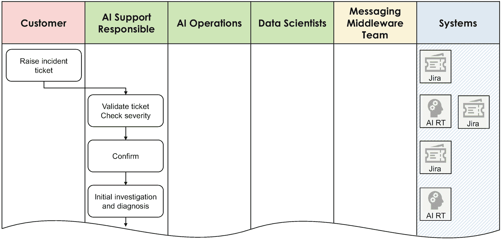

图 5-20  
包含五个参与者及额外行（标注参与者所用系统）的泳道流程模型示例

AI 组织在设计和实施流程时的一项指导原则是**与公司其他流程的兼容性**。如果其他团队需要执行特定步骤，这些团队也必须就流程和工具达成一致。在许多情况下，IT 部门基于事实标准——**信息技术基础架构库**（**ITIL**）——来定义流程。然而，仅了解标准对 AI 组织帮助不大。IT 部门会对 ITIL 流程进行大幅定制：谁负责审批来自哪个系统的请求？使用哪些表单？不同流程对应哪些工具？这些细节因公司而异，但对 AI 流程的顺利运行至关重要。

许多 AI 解决方案内置了工作流引擎，可帮助 AI 组织结构化其工作。这是一个便捷选项，但 AI 组织应清楚其局限性：他们可能需同时使用其他系统，并在系统间手动复制工单。假设数据库团队需要导出并移交某些数据，他们会接受 AI 组织工作流系统分配的任务吗？或许会，但在大型 IT 部门中几乎不可能。当市场团队发现“购买连衣裙的客户也……”功能失效时，他们会选择在公司级的**事件管理**系统中提交工单，让 IT 部门排查细节吗？还是更愿意自行判断这是 AI 问题还是网店问题，再寻找正确的事件工单系统，并在 AI 组织的特定工具中提交工单？显然不会。AI 组织必须确保其流程和请求工具符合公司标准，否则一旦系统与业务产生关联，便会陷入困境。

尽管流程至关重要，但如今许多组织更关注定义组织运作方式的**（目标）运营模型**（TOM）。TOM 描述的是预期的未来运营模式，而“当前运营模型”则指现状。提供运营服务的 AI 组织通常需要制定 TOM，其目的并非仅维持运营流程，而是探讨 AI 组织的战略方向、规划组织转型路径，并明确其可能性与局限性。

（目标）运营模型涵盖以下核心方面（图 5-21）：

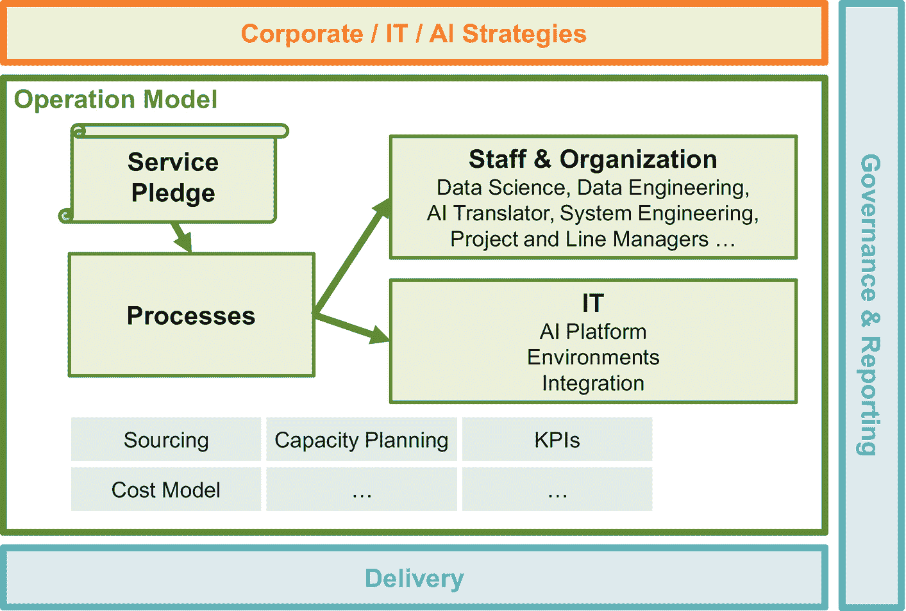

图 5-21  
AI 组织的运营模型

*   **服务承诺**与价值主张：此处可参考本章开头介绍的 AI 组织业务价值与服务塑造方法。
*   **流程**：哪些活动由谁按何种顺序、使用哪些工具执行？上文已对此进行讨论。
*   **人员与组织**：承担流程中定义的任务。
*   **IT**：作为（高效）流程执行的核心“赋能者”，提供基础设施、应用程序及其参数化配置。

AI 管理者可基于本书内容快速明确前三个主题并形成文档。但许多支撑性主题（包括 KPI、IT 资源与人员容量规划、采购策略（如内部员工、承包商、咨询公司））仍需进一步澄清。运营模型的第四个重要方面是所需的 IT 基础设施，这将是下一章的主题。

## 总结

本章详细阐述了管理 AI 组织（而非 IT 部门内的普通团队）的特定要求，重点涵盖三个主题：塑造 AI 服务、管理用于创建新 AI 模型的 AI 项目服务，以及确保 AI 模型及其推理运行与维护（基础设施）的可靠运营。

塑造服务的核心在于理解业务部门与 AI 组织之间的协作模式。这些模式直接影响资金需求，以及 AI 组织如何向潜在内部客户展示其服务以合理管理预期。同时，它指导 AI 管理者明确服务的哪些方面是关键、核心或外围，从而为投资决策奠定基础。

希望开展 AI 项目的 AI 组织需要数据科学专业知识，但也需要数据工程能力以高效利用现有数据，以及 AI 翻译能力以弥合业务需求与 AI 模型应交付的具体需求之间的鸿沟——这便是我们的“能力三要素”。理解成本驱动因素和预算结构是额外要点，而项目导向型资金的主要挑战也需指出：平衡项目获取（以证明组织相关性并确保资金）与执行已获取项目所需的可用资源。

当 AI 组织需要运行和维护 AI 模型时，还需具备额外能力：支持与应用管理、集成工程、报告与可视化。他们必须将 AI 模型管理和模型性能监控作为两项 AI 特有的运营任务。最后，流程定义和目标运营模型有助于 AI 组织建立结构，确保日常运营顺畅。

这些知识正是 AI 管理者区别于传统 IT 管理者或专注于技术与算法的数据科学家的关键所在。

