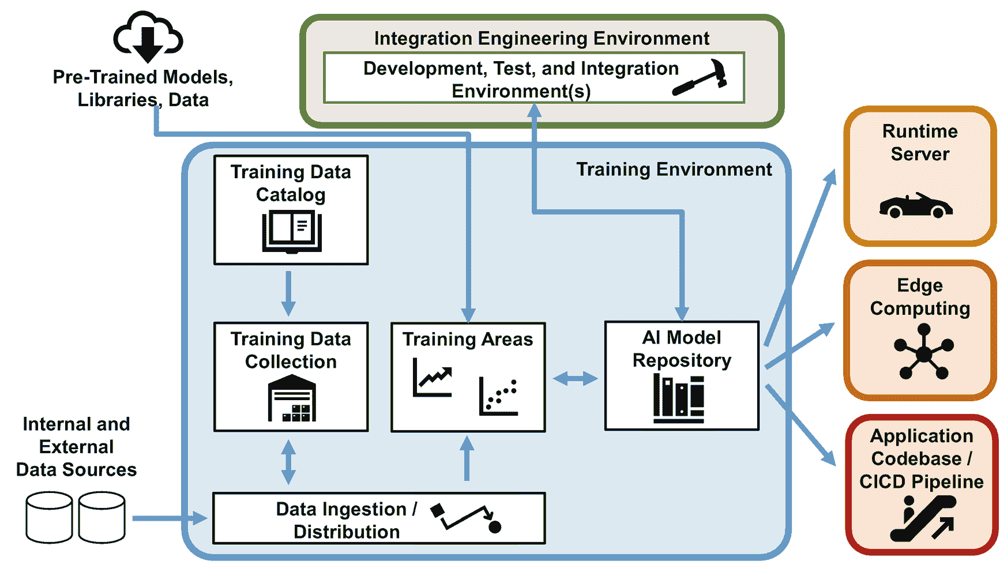
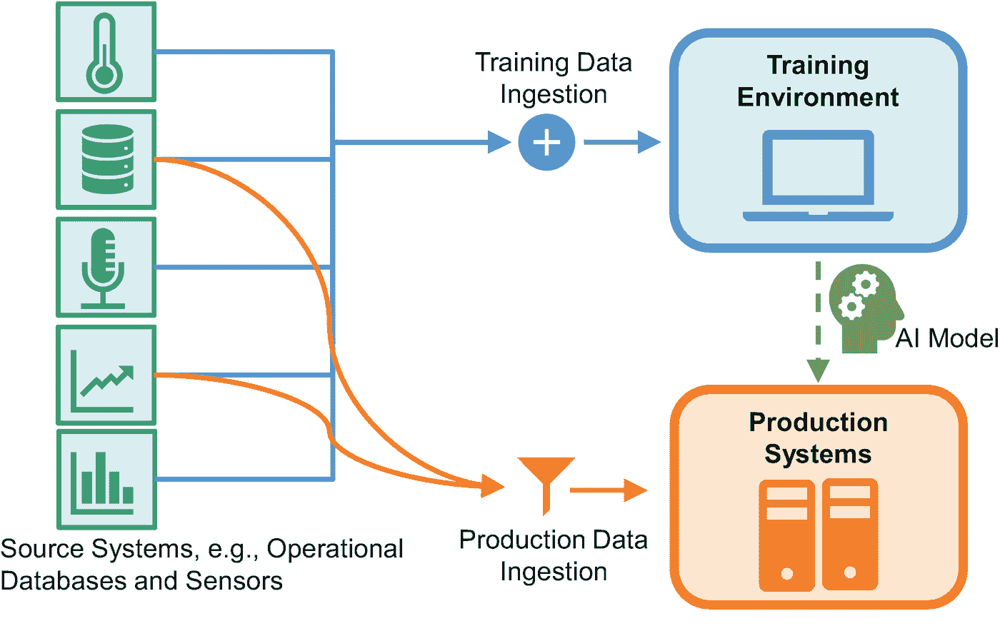
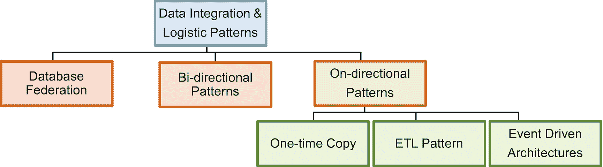

# 6. AI 与数据管理架构

IT 架构中的 AI 能力远非锦上添花，而是前瞻性、数据驱动型创新企业的核心能力。它虽非全部，但绝非点缀。AI 组织需将其组件集成到企业整体应用架构中——而其自身的系统架构通常也不仅限于几个`Jupyter`笔记本。换言之，本章将探讨任何非单人模式的 AI 组织都会面临的重大架构问题。

架构挑战涉及三个主题：

*   为模型训练及持续执行与推理设计 AI 环境架构
*   将 AI 环境集成到企业数据管理架构中
*   理解公有云对 AI 环境的影响

# 构建 AI 环境架构

对于组织的效率和能力而言，工具是核心赋能因素。工具会影响并决定 AI 组织能够交付的服务类型及其工作效率。

我们在前文章节中已经探讨过 Jupyter Notebook。它有助于创建和优化 AI 模型。在此，我们将拓宽视角，审视 AI 组织高效运作所需的其他赋能系统（图 6-1）。



图 6-1

AI 组织的应用全景

## 将数据导入 AI 环境

训练 AI 模型并将其应用于实际数据进行推理，需要充足的数据。这些数据可能来自运营系统、数据仓库、物理传感器、日志文件或其他数据源。挑战在于构建一种架构，能够将所有潜在相关数据输送至 AI 训练环境，或输送至生产系统中使用已训练 AI 模型执行推理的组件（图 6-2）。



图 6-2

AI 组织的数据导入场景

训练和推理用例在设置和技术解决方案上相似，但存在两点细微差异。对于**训练数据**，经验法则是：**越多越好**。每个数据点包含更多属性，会增加更多属性被证明与模型相关并对其产生贡献的几率。无论模型是进行预测还是分类，其准确性都会提升。更多行数据能使模型更稳定，更多表则能支持更广泛的用例。如果输入变量不相关，它们最终不会成为模型的一部分。

**推理数据**作为已训练就绪的 AI 模型的输入。这类数据描述了 AI 模型进行预测或分类的当前情境。例如，数据可能描述化学反应器的状态，模型则预测反应器是否会在接下来一小时内爆炸。此类 AI 模型拥有一组输入参数。数据科学家或自动化工具必须精确提供所有这些输入参数的当前值。数据更多并无益处。假设模型需要五分钟前的反应器压力，那么即使我们知道两天前或一分钟前的压力——甚至撒哈拉沙漠明天的天气预报——预测结果也不会改善。模型无法将此类非必要数据纳入其预测和分类中。

虽然非必要数据对推理无用，但架构的灵活性仍是明智之举。重新训练后的 AI 模型下一版本可能会增加两个属性。理想情况下，数据科学家拥有一种架构，允许通过重新配置（即无需修改代码）从已连接的组件中移除属性或添加新属性。

训练数据与推理数据之间的第二个细微差别在于不同的**数据交付频率**。模型重新训练是数据科学家偶尔进行的活动，例如每隔几周一次。推理则更为频繁。例如，市场部门可能每周运行两次 AI 解决方案，通过预测哪些文章和广告对哪些客户最有效，来实现新闻通讯的个性化。甚至实时推理也是可能的，例如在客户浏览在线商店时，针对特定广告和商品进行精准推送。

数据交付或数据导入的**技术实现**可以基于现有的数据集成模式（图 6-3）。大多数公司已经运行着一个或多个合适的系统。接下来几段讨论的特性有助于向内部数据集成团队或外部供应商及集成合作伙伴传达需求。当然，如果 AI 组织对潜在可行的模式有所了解，也会大有裨益。



图 6-3

选定的数据集成模式

# 数据库集成模式

最著名的数据库相关集成模式可能是**数据库联邦模式**。联邦定义了来自不同数据库的数据库模式如何相互关联。该模式允许查询多个数据库中的表，甚至可以在不知道也不关心它们位于哪个数据库的情况下进行连接。考虑到两个 AI 数据摄取用例，联邦模式无助于将数据从运营数据库获取到训练环境或用于推理的生产系统。

**双向模式**保持两个（或多个）系统中的冗余数据一致。例如，一个解决方案在苏黎世有一个数据库，在新加坡有一个数据库，以减少数据访问延迟。两者存储相同的数据。双向更新模式使应用程序和用户能够写入其区域数据库，而不仅仅是写入一个全局主数据库。诸如“同步”或“关联”之类的双向模式，会将一个数据库中的更改传播到另一个数据库并更新那里的数据——对用户和应用程序完全透明。

用于训练或推理数据的双向模式会迅速将运营数据库中的新数据或更新数据转发到训练和推理环境。然而，它们也会产生不希望的且可能灾难性的后果：假设一位数据科学家在训练环境中删除了包含当月所有付款记录的表。由于每次更新都会同步到另一个数据库，这些数据就会从运营数据库中消失。这不是一个好主意！因此，双向模式不适合数据摄取用例。我们需要一种模式，确保更新和数据从运营数据库（或传感器、数据仓库、日志等）流向 AI 环境，而不是反向流动。

三种**单向模式**特别相关。第一种是**一次性复制模式**。数据库管理员或数据科学家手动将数据从源系统复制到训练环境，以训练 AI 模型并随后运行推理。这种模式避免了在自动化数据复制上的投资，需要手动工作。典型的用例包括概念验证、支持独特战略决策（扩展到拉丁美洲还是太平洋地区？）的 AI 模型，或者需要不频繁重新训练且源系统可能变化的 AI 模型。

第二种单向模式是**提取、转换、加载（ETL）流程模式**。它在数据仓库中广为人知。该模式包含三个步骤：提取、转换和加载。它们分别代表提取源系统的相关数据，转换数据以匹配目标模式（包括数据清洗和整合），以及将数据加载到目标系统。数据科学家或工程师通常使用 SQL 脚本实现这些步骤。一个编排组件调用并执行它们，确保稳定可靠的执行，例如每周日凌晨 2:30 执行。

`ETL`流程模式是批处理的典型示例。你随时间收集数据；然后，系统一次性处理所有收集到的数据。该模式适用于需要数据用于定期重新训练或预计算推理结果的 AI 用例。举个例子：一家银行想知道客户最可能额外购买的产品。在每个月开始时，银行用最新的客户行为和数据更新训练数据，并重新训练其 AI 模型。然后，银行（预）计算每个客户的下一个最佳产品。当客户登录其移动应用或联系呼叫中心时，系统或呼叫中心代理向客户推荐该产品。它从预计算的数据中获取信息，不需要任何在线推理。

`ETL`集成模式可能是对于支持和优化关键业务运营流程与决策的 AI 组织来说最相关的模式。计算每周或每月哪些客户可能取消电话套餐并不是最具创新性的用例。但是，这些用例确保了众多 AI 组织的资金，因为它们的商业价值是可清晰衡量的——对于此类用例，`ETL`模式完美适用。

第三种单向模式是**事件驱动架构模式**。物理或虚拟世界中的变化——一个新的传感器值或客户点击时尚商品——会触发一个事件。事件通过使用诸如`Apache Kafka`等技术互联的应用程序和组件流动。事件路由是业务逻辑的一部分。它决定哪些系统看到并处理哪些事件。与`ETL`流程模式有两个相关区别。第一，（近）实时处理。第二，发布-订阅通信风格。组件将事件放入诸如“客户操作”或“天气传感器 CDG”之类的通道。其他组件订阅通道以接收并处理这些事件。它们可能将结果放入另一个通道以触发后续处理。这是一种完全去中心化的计算模型。

事件驱动架构允许实时处理。以（近）实时方式交付*训练*数据没有好处，因为重新训练不会那么频繁发生。然而，某些用例受益于实时*推理*。

然而，集成模式和技术选择应经过深思熟虑。切换模式或技术会耗费时间和金钱。对于较大的组织来说，这是一项复杂的任务。因此，AI 组织也应考虑生命周期方面。两三年后有哪些集成模式可用？IT 部门对`ETL`工具有什么计划？事件驱动架构很少是必需的，但使用它们可以成为保护投资的战略举措，因为 IT 部门正朝着这个方向发展。理想情况下，AI 组织应确保其与 IT 部门的集成架构保持一致。

所以，总结一下，单向模式是将训练数据摄取到训练环境以及将数据交付给 AI 模型进行推理的解决方案。在回答以下三个问题后，为训练和推理数据摄取选择合适的模式就变得轻而易举：

*   你在训练环境中多久构建或重新训练一次模型？
*   AI 模型是用于实时推理，还是推理活动作为批处理作业执行（例如，在每个月开始时）？
*   未来几年，集成架构在集成模式和工具方面的路线图是什么？

### 存储训练数据

训练数据摄取模式将数据送入 AI 训练环境，而该环境需要存储这些数据。目前存在多种传统和新兴技术用于数据存储（图 6-4）。AI 组织应做出明智决策，确定在训练环境中使用哪些技术。


**图 6-4** 训练数据存储选项

组织、处理和存储结构化表格类数据最流行的形式是`SQL`数据库，其中也包含了`数据仓库`技术。

数据仓库针对高效执行大规模数据集上的复杂查询（OLAP——在线分析处理）进行了优化。架构师和数据库管理员依赖专门的模式和表结构来实现更高效的查询执行（“星型”和“雪花型”模式）。相比之下，OLTP（在线事务处理）优化型数据库支持更高的事务速率，即读取、写入和更新单行或少数几行。对于大多数 AI 用例而言，OLTP 优化型与 OLAP 优化型数据库之间的差异不应产生显著影响（至少在没有过于复杂的数据提取查询时）。很可能，大部分数据处理发生在`Jupyter`笔记本中，而非数据库内。

对于 AI 组织而言，使用`SQL`数据库存储（部分）训练数据是必需的，尽管可能还需要其他技术。`SQL`数据库的相关性基于这样一个事实：大多数（业务和/或企业）数据都以表的形式存储在`SQL`数据库中。表具有 AI 训练算法所需的输入数据结构。因此，将数据转换为不同结构进行存储通常只会带来成本，而没有任何益处。

`SQL`数据库还具有其他优势。首先，项目人员配置很容易，因为市场上`SQL`技能非常普及。其次，大多数 IT 部门都有数据库管理员，可以协助解决复杂的技术问题。AI 组织无需专门的技术知识。最后，AI 组织只需要一个不带高级功能的普通`SQL`数据库。因此，像`Maria DB`这样免许可费用的数据库就完全适用。

虽然数据库和数据仓库技术源自上个千年，但`No-SQL`（不仅仅是 SQL）数据库的兴起则是 2010 年代的现象。`No-SQL`数据库的世界是多样化的，从关注可扩展性（通过减少事务保证）到读时模式（我们在数据湖中也能看到这一点），再到不同的数据结构。后者是这里的重点：键值存储、文档数据库和图数据库。它们都以不同的方式存储数据。

**键值存储**的数据模型极其精简——由键和值组成的对，例如`<114.5.82.4, 20.07.2020 09:32>`。检索值（例如，IP 地址上次连接到数据库的时间）需要键（例如，IP 地址）。AI 组织可以轻松地将此类键值对存储在`SQL`数据库中。这样，他们就能避免建立一个技术动物园。

**文档数据库**存储的是——没错——文档。文档是半结构化的，最流行的格式是`XML`和`JSON`。文档允许嵌套属性，并且不强制固定的属性结构。一个典型的`JSON`文档如下所示：

```
{
"article": {
"title": "Mobile Testing",
"journal": "ACM SIGSOFT Software Engineering Notes"
"author": {
"firstname": "Klaus",
"lastname": "Haller"
}
}
}
```

即使源数据来自文档数据库，AI 组织也应质疑在其 AI 训练环境中建立一个或多个专用文档数据库的必要性。虽然有很好的替代方案，但`SQL`数据库通常不在其中。由于文档的半结构化特性，具有严格模式的`SQL`数据库通常不太适合。相比之下，数据湖和对象存储是潜在的替代方案，我们将在本节后面讨论。

**图数据库**使复杂互联主题和关系的建模与查询变得直观。社交网络是一个极佳的应用领域。图由节点和连接节点的边组成。节点可以代表人员或主题等。节点和边都可以拥有属性来存储附加信息。图 6-5 包含了多种节点类型：个人、一个名为“辣妹组合”的乐队、他们的专辑以及他们的一些歌曲。边代表各种关系，例如成为乐队成员、发行了某张专辑，或者某首歌是专辑的一部分。

虽然基于图数据库的应用可以检索出令人兴奋的结果和见解，但在技术上并没有要求必须在图数据库而非`SQL`数据库中执行此类分析。图数据库无法存储那些无法放入`SQL`数据库的数据或数据关系。图数据库更像是一种优化。它们简化了针对特定场景编写查询的过程，或者允许更快的查询执行。AI 组织是否应该在其技术栈中添加图数据库？答案取决于具体情况。AI 组织是否需要自行运行图数据库，还是 IT 部门有专家团队来管理，或者他们可以使用软件即服务的图数据库服务，从而免去安装、维护和打补丁的工作？这些数据是否被广泛使用，并且图数据库是否存储了重要、相关的信息？使用图结构数据训练 AI 模型的意图是什么？`SQL`数据库中是否存在无法通过其他方式解决的性能问题？图数据库需要一个商业案例来验证，与在 AI 环境中不使用它们相比，它们能带来财务上的收益。


**图 6-5** 在图数据库中表示辣妹组合

**数据湖**是存储海量文件数据（甚至达到 PB 级）的合适选择。与简单的文件系统不同，数据湖允许搜索文件内容并聚合信息。例如，统计文件夹结构`2021/07/*`及其子文件夹中“潜在违规”日志条目的数量，以了解是否比上个月有更多事件。数据湖实现了读时模式功能，但其操作（与集成到应用程序中的文档数据库不同）针对的是涵盖来自各种应用程序数据的大规模数据集。无需定义数据结构或模式，只需定义在文件中的何处以及如何查找相关属性。因此，如果未找到该属性，数据湖会继续执行查询而不会抛出异常，这意味着——与`SQL`数据库的情况不同——如果特定属性不存在，不会有直接反馈。

AI 组织迟早需要处理半结构化或非结构化数据。他们必须将此类数据存储在某个地方，而通常`SQL`数据库并不合适。`Hadoop`数据湖是正确选择吗？它需要投入精力来搭建和维护。如果你是一个大型组织，也许可以。较小的组织可以使用云中的数据湖服务。

最后，**对象存储**（`object storage`）也是一种值得提及的存储选项。自`AWS S3`推出以来，对象存储的相关性日益增强。过去是文件系统，如今则是对象存储技术：存放文件和文档的地方。它是云中的“标准存储类型”。与传统文件不同，对象存储无法直接操作文件，只能替换文件，这并不会影响人工智能组织的工作。不过，投入一些时间来详细阐述如何处理非结构化（及半结构化）数据，仍然是很有意义的。

## 数据湖与数据仓库

数据湖是人工智能组织捕获和存储海量数据（包括来自各种源系统的文本、音频、视频和传感器数据）的热门选择。与此同时，企业也运行着庞大的数据仓库，后者在报告和分析大量（业务）数据方面尤为强大。虽然数据湖和数据仓库看起来像是冗余的概念，但事实并非如此。人工智能组织能从两者中受益，尽管其技术流程和商业层面有所不同。

`ETL`（提取、转换、加载）之于数据仓库，正如`ELT`（提取、加载、转换）之于数据湖。步骤相同，但顺序不同（图 6-6）。延迟转换步骤在成本方面是一个颠覆性的改变。转换步骤是最耗时且最昂贵的环节，涵盖数据清洗和确保一致性。确保一致性是一项分析密集型的、需要人工完成的任务，尤其是在多个数据库和报告包含相似但定义略有不同的关键绩效指标时。与不同业务团队的多位专家和管理人员讨论并达成共识，可能需要数周时间。其好处在于：数据仓库拥有“黄金标准”的数据质量，工程师和业务用户都可以信赖，这也是管理者愿意为数据仓库提供资金的原因。因此，在将数据加载到数据仓库之前，避免成本高昂的转换步骤是不可行的。结果，即使是添加单个属性也需要投入成本，从而限制了快速添加数据的能力。管理层（始终）对数据仓库团队是否添加数据以及添加哪些数据拥有发言权。

相比之下，数据湖存储的是未经清洗的原始数据。这里没有关于单个属性的讨论，而是决定添加哪个数据库或包含大量日志文件的哪些文件夹。添加数据不会产生高昂的成本，无论是项目中的分析成本还是后续的存储成本。这些低成本正是数据湖的成功因素。工程师可以仅仅基于一种模糊的希望——未来某时某人可能会有某种想法来使用这些数据——就添加数据。然后，这个“某人”再为包括清洗和准备在内的转换步骤付费。


图 6-6

将数据摄入数据仓库（上图）和数据湖（下图）

## 数据目录

高质量人工智能模型的一个关键先决条件是充足的训练数据。哪些客户可能在接下来几周内终止合同？装配线上的哪些螺丝有缺陷？如果数据科学家能够访问训练其机器学习模型所需的数据，他们就能回答（几乎）世界上所有的问题。

数据仓库提供了大量结构良好、文档齐全且一致的数据。相比之下，数据湖收集了数据仓库所存储的大量数据，但缺乏类似的文档——这并非数据科学家所爱，但却是任何数据湖业务案例中不可或缺的一部分，如前文所述。此外，运营数据库和其他数据存储方式可能包含数据科学家感兴趣的其他数据。数据目录包含关于各种数据源（无论是运营数据库、数据湖还是其他数据）中数据的信息。它有助于人工智能项目找到他们尚不了解的、可能相关的训练数据。数据目录是区分有用数据湖和无用数据沼泽的关键。它是一个赋能者，能够加速人工智能项目的工作。

数据目录可以提供数据属性和表级别的信息。表级别信息包含三个要素（图 6-7）。首先，数据集有一个名称和唯一标识符。其次，数据集有一个描述该表内容的说明，通常还会根据公司的分类系统添加类别信息以及关键词，以便潜在的数据用户能够快速找到数据。第三，还有额外的元数据，例如发布者、发布时间、发布者是谁、数据血缘信息等。


图 6-7

一个公开可用数据集的描述

数据集描述是数据目录中最关键的信息。它使数据科学家能够搜索并识别出可能有助于训练他们当前正在开发的人工智能模型的有用数据集。

数据目录还提供属性级别的信息，包括技术数据类型（`String` vs. `Integer`），理想情况下还包括领域数据类型（例如，一个字符串是存储员工姓名还是护照 ID）。数据目录甚至可能提供每列的最小值和最大值。图 6-8 展示了这两个级别。

属性的领域数据类型和数据集描述反映了一个典型的数据目录用例：查找所有包含 IBAN、客户姓名或患者记录的列，这对于法律和合规团队（例如在 GDPR 背景下）至关重要，但对数据科学家来说帮助不大。


图 6-8

理解数据目录

数据仓库自带数据目录和词汇表——而且大家都知道，建立这些目录和词汇表非常耗时。那么，人工智能组织或 IT 部门能否通过自动化创建数据湖的数据目录（例如，使用数据丢失防护（DLP）工具，如`Symantec`或`Google Cloud DLP`）来降低成本和人工工作量呢？

# 简短回答

**法律与合规**团队受益，数据科学家则不然。`DLP`工具非常适合查找领域数据类型。它们能识别数据库和数据湖中哪些表或文件包含客户姓名、患者记录或宗教信仰信息等。因此，它们非常适合识别与`GDPR`相关的信息。但它们无助于理解文件和表中更复杂的**语义**。这些是所有有未付款项的客户，还是那些真正重要的瑞士客户？辐射测量值是昨天的，还是切尔诺贝利灾难后一周的？收集和整理此类信息需要人工操作。严格执行维护流程是确保每个人在此背景下完成任务的唯一途径。如果上传者未提供包含数据科学家所需全部信息的描述，`IT`部门必须从技术上阻止任何数据上传至数据湖或`AI`训练数据集合。

从`Excel`和`MS Access`到专用商业软件，`AI`组织和`IT`部门在数据目录方面有多种选择。选择复杂且更昂贵解决方案的原因在于它们集成了群体智能功能，并支持**治理流程**——后者尤为重要，尤其是在`GDPR`时代或伦理讨论日益关键的背景下。复杂的流程和系统适配器使专家能够更高效地工作，尽管这更多是合规而非`AI`议题。**群体智能**模拟资深专家帮助新同事的建议。资深专家会指导年轻同事找到工作所需的数据集。她知道当银行客户前往哪个分行时，在哪里能找到数据。她知道在哪里能找到在移动银行门户中点击抵押贷款产品详情页面的客户。模拟此类建议的数据目录功能，其建议基于对常用数据集和属性或过去提交的典型查询的统计。此类建议无需直接的人工输入。一种不那么高科技的众包目录信息方法是让数据科学家（或其他数据用户）对数据集的相关性和质量进行评分。例如，后者在`Qlik`的数据目录中通过三个成熟度级别实现：青铜级代表原始数据，白银级代表经过清洗并初步处理、可供数据分析师使用的数据，黄金级代表可直接供业务用户使用的报告。融入群体智能仍处于初级阶段，但可能很快会成为初级数据科学家或新入职公司数据科学家生产力的游戏规则改变者。

总结：数据目录对于充分利用数据湖中的所有数据以及公司中不太知名的数据源至关重要。在建立和维护数据目录时，这关乎纪律和严格的流程。它们对合规和治理问题也有很大帮助——而即将到来的群体智能功能是提高数据科学家生产力的绝佳机会。

## 模型与代码仓库

仓库是追求运营顺畅的`AI`组织必备的技术能力。我们之前简要介绍过它们。它们降低了关键模型无备份副本或混淆`AI`模型变体与版本的风险。此外，当多位数据科学家和工程师处理相同或相似模型时，它们还能简化协作。

仓库充当所有`AI`模型及附加数据的中心枢纽，并存储以下内容：

*   模型的**目的**，即对模型实现功能的描述
*   **AI 模型**本身，例如一个`Jupyter`笔记本文件，包括其先前版本
*   与生产使用相关的**其他代码**（来自集成工程的接口代码）或用于复现模型的代码（数据准备和清理脚本）
*   记录训练阶段模型质量的**实验历史**，包括架构和（超）参数设置
*   生产使用的**审批**，例如“审批点击”等工作流操作，或上传至工具中的电子邮件

`AI`模型的仓库可以有各种复杂程度，从仅使用`GitHub`，到来自公有云提供商（如`Microsoft Azure Machine Learning MLOps`）或专业`AI`供应商（如`Verta AI`，配备炫酷仪表盘和`CI/CD`部署流水线集成）的集成式`MLOps`平台。由于模型是业务关键型知识产权，因此必须确保仓库的安全和保护。

### 执行 AI 模型

将卓越的 AI 模型集成到组织的运营流程中，能极大提升公司的运营效率。换言之，应用程序通过调用 AI 模型进行预测或分类。除了不进行任何集成的预计算，我们之前从技术集成角度讨论了两种方法：`AI 运行时服务器`和通过重新实现将`模型集成到应用程序的代码库中`。我们已经从集成工程和测试的角度探讨了这些主题——在此，我们将聚焦于更多架构层面的考量。

通过将模型重新实现为应用程序代码的一部分进行集成，意味着架构责任不在 AI 组织内部，而是由软件架构师和软件开发团队负责。运行其软件解决方案的责任也同样如此。

AI 模型运行环境有多种实现方案，主要包括商业供应商的 AI 平台、开源解决方案，以及边缘计算/边缘智能的独特配置。

**商业 AI 供应商平台**，例如`SAS`或`Dataiku`，以及公有云提供商，都有一个共同且直接的销售主张：便捷性、用户友好性和高生产力。它们提供的 AI 运行环境不仅简化了模型训练，也简化了部署和使用。客户为这些便捷性和生产力优势付费。此外，他们还会隐性地接受供应商锁定，例如，数据科学家可能无法将数据准备和清洗工作迁移到新平台上。

一个重要说明：存在一些事实上的商业平台，它们看起来像是“免费”的，或者以提供“开源”组件为营销点。它们甚至可能不对软件或集成开发环境收费，并营销其使用了开源组件和行业标准。尽管如此，它们仍可能造成（云）供应商锁定。你可能无需支付软件许可费，但代价是无法快速将工作负载迁移到其他（云）供应商。在云端选择“免费”或“开源”技术时，AI 组织应仔细核查这一细节，因为接受供应商锁定在选择 AI 平台时会开启更多可能性。

构建一个**基于开源的 AI 平台**，意味着整合各种开源组件，以构建一个满足特定 AI 组织需求的环境。例如，在`Jupyter`笔记本中训练模型，使用`GitHub`作为代码仓库，并将结果打包成`Docker`容器推送到公有云提供商进行可扩展执行，或在内部集群上运行。AI 组织（及其内部客户）可以讨论由谁负责运行和监控模型，或者模型是否成为实际代码库的一部分。

最后，还有**边缘智能**。边缘智能意味着推理不仅发生在公司的数据中心或云数据中心，而是在所有区域部署边缘服务器来承担 AI 推理任务（图 6-9）。物理上的邻近性解决了延迟问题，例如，当澳大利亚内陆地区的设备调用冰岛服务器上的预测服务时。


图 6-9

边缘智能

边缘智能对于计算和存储能力有限的物联网设备解决方案很有意义。其假设是这些设备无法在本地运行 AI 推理。随着时间的推移，第二个用例可能会变得更加重要：保护 AI 模型作为关键知识产权。公司可能会避免将 AI 模型部署到物联网设备上，以防止竞争对手通过购买或窃取运行 AI 模型的设备来获取模型。

AI 组织可以自行部署边缘智能模式。然而，依赖云提供商可以简化部署，尤其是在可能受益于其他功能时，例如集成物联网设备以及使用 AI 或数据管理功能。为了避免过于天真地陷入云提供商锁定局面，制定透明的 AI 和云战略会有所帮助——无论是对于物联网和边缘智能，还是对于你的 AI 平台。

## AI 与数据管理架构

虽然上一节是关于 AI 环境的，现在我们来看 AI 环境如何融入并从组织的整体数据管理架构中受益——以及 AI 与其他类似服务的关系。图 6-10 提供了一个包含所有相关组件和概念的高层概览，其中显然包括数据仓库。


图 6-10

传统与新型商业智能架构的架构蓝图

# AI 与经典数据仓库架构

数据库和数据仓库不仅有助于在 AI 环境中存储数据。企业使用它们已有数十年之久。在 AI 出现之前，数据驱动型企业的架构由操作型数据库层和数据仓库层组成。

**操作型数据库**通过存储和处理数据来服务于业务应用。例如，它们存储主数据、产品描述、银行转账或销售点记录。

业务用户（可能在数据库管理员的支持下）可以针对数据提交临时查询。我们针对“银发族”的营销活动是否导致上个月该年龄段的新签合同客户增多？这是一个具有明确分析重点的临时查询示例。

查询操作型数据库存在两个**局限性**。首先，可能对操作产生影响。长时间运行的复杂分析查询可能会影响数据库的稳定性和性能，进而影响整个系统。针对在线商店的数据库提交此类查询可能并不合适。第二个局限性在于操作型数据库的侧重点。它们（通常）只存储一个应用程序或一个特定领域的数据。合并来自不同数据库（例如，一个包含在线商店数据，另一个包含零售店数据）的数据对于临时查询来说工作量大，并且需要付出巨大努力才能使其在数月乃至数年内保持稳定。打开防火墙或处理服务账户和证书只是其中的一些示例任务。因此，几乎所有公司都会运行一个或多个数据仓库，用于收集和合并来自各种操作型数据库的数据。

一个典型的**数据仓库**包含三个层级：临时存储区层、整合数据仓库层和精选数据集市层。**临时存储区**是 ETL 过程中从操作型数据库或其他数据源复制而来的数据的中间存储位置。在 ETL 过程中，数据仓库软件从操作型仓库中提取数据，进行转换，并将其加载到整合数据仓库层。转换过程还包括数据聚合、数据清理以及消除不一致性。第三个数据仓库层提供精选的**数据集市**。它们以用户友好的方式，为会计、销售或运营报告等主要用户群体提供与其相关的数据。

从**AI 组织的视角**来看，一个拥有数据集市和整合层表的数据仓库是一个巨大的机遇。它是高质量训练数据的来源，这些数据具有公司范围内一致的语义，并涵盖公司的所有领域。构建一个类似的解决方案通常需要数百万美元和数年的努力，这是任何 AI 组织都应避免的。然而，数据仓库有两个明显的局限性。数据不是实时的。ETL 流程通常在夜间运行，以最大限度地减少对办公时间操作型数据库的影响。因此，数据至少是一天前的，但公司某些数据的刷新频率可能不会超过每月一次。其次，数据仓库在添加新数据方面不够灵活。公司其他部门期望数据仓库提供一致的数据，这要求在添加一个属性（或一个或多个表）之前进行深入分析。尽管如此，对于 AI 组织来说，数据仓库仍然是一个绝佳的机会，可以利用一些初始的、高质量的、“零投入”的训练数据，在新领域快速启动活动。

在这种理想情况下，AI 组织将其解决方案构建为一个新的顶层，基于数据集市或整合数据仓库层，如图 6-10 所示。AI 组织越少直接处理操作型数据库，其运营就越具成本效益和敏捷性。

## 自助式商业智能

将自助式商业智能（SSBI）工具称为近期数据管理和分析史上最大的骗局，可能有些言过其实。问题不在于它们的功能，而在于它们被推销给客户的方式。许多供应商试图让客户相信，该工具能让他们执行与数据科学家和 AI 算法类似的分析——但这并不正确。

如图 6-10 中的架构所示，SSBI 工具位于数据仓库或数据集市之上（AI 组件也是如此）。这些工具**使业务用户能够**自行定义和创建表及视图。与数据仓库的视图和表相比，业务用户的视角可能非常狭窄，不会左顾右盼，也不会考虑是否已经存在类似的绩效指标。速度、便利性、无需费力通常是业务用户关注的焦点。撇开所有批评不谈，SSBI 工具解决了业务需求，并促进了企业职能部门（如全球性组织的控制部门）的协作。当工作涉及从各种 Excel 文件中复制数据、清理和整合这些信息时，SSBI 工具因其协作功能而能提供巨大帮助。然而，当 AI 组织考虑使用来自 SSBI 工具的数据时，他们应该意识到，其数据质量可能不如来自数据仓库或操作型数据库的数据可靠。

如果 SSBI 工具**阻碍了 AI 的采用**，那么它就会成为 AI 组织和公司创新潜力的一个问题。SSBI 工具是镀金的 Excel 替代品，拥有更多可供摆弄的功能，但并不能让业务用户手动生成与 AI 项目成果同等水平的洞察和模型（并且提供没有解释的 AI 算法也可能无法产生有用的模型）。SSBI 工具的问题不在于其功能，而在于业务用户是否坚持使用 SSBI 工具“自己分析”AI 问题，而不是让统计或机器学习算法做得更好，或者试图在不理解所需方法论的情况下创建 AI 模型。这是 SSBI 工具的一个巨大风险或劣势，并且可能导致 AI 组织在公司内的地位出现问题。AI 管理者应警惕这一点。


图 6-11
经典 AI 架构，其中 AI 平台是唯一的“智能”解决方案（左），以及当今环境中包含各种集成 AI 能力组件的泛灵智能（右）

### 泛神智能

泛神智能反映出，无论是数据仓库团队还是人工智能组织，都无法垄断海量数据的收集以及利用人工智能方法生成额外洞察的能力。软件供应商在传统产品中增强人工智能功能，无论他们开发的是核心银行系统、楼宇控制应用，还是网络管理与监控解决方案（图 6-11）。

例如，网络团队可能希望通过更快地识别根本原因来加快客户事件的解决时间。一个典型场景是：WLAN 路由器崩溃，导致数百台设备无法访问，进而引发监控系统产生数百个事件。这种事件洪流阻碍了网络支持工程师识别出崩溃的路由器才是根本原因。

在这种情况下，人工智能组织可以提供帮助，训练一个模型，用于在存在几个“真实”事件引发大量非根本原因的次要事件时，识别根本原因。人工智能专家基于极少数案例训练模型。他们从监控团队获取所需的训练数据，或者通过创建与所有网络及硬件设备的接口来获取。但有一个更快的解决方案：网络管理部门购买一款网络监控与管理解决方案，该方案自带所有重要厂商设备的接口，并且除了传统的网络管理与监控功能外，还包含一个人工智能组件。`Moogsoft` 就是这样的软件提供商。你需要提供大量数据并进行大量训练，但如果你是企业网络负责人，你会选择现成的标准软件，还是自行开发？

泛神智能已成为现实。越来越多的软件供应商在其产品中融入人工智能功能。因此，人工智能组织可能会倾向于那些对客户和业务有直接影响的战略性应用，企业希望整合来自各种来源的数据，构建一个卓越的模型，以获得竞争优势。

### 新的数据类别

主数据和事务数据，这是多年前大多数系统能够存储的内容。如今，新的数据类别已成为标准，例如日志和行为数据、物联网数据或外部数据。

在线时装店仅仅保存你的收货地址和订单历史，这已经是很久以前的事了。如今的企业对数据如饥似渴，它们存储并分析行为数据。客户如何在在线时装店中导航？他们滚动浏览哪些商品？哪些东西会让他们停留一秒钟——或者十秒钟？通常，这些数据来自日志文件。物联网设备提供传感器数据，例如压力和温度信息——或者图片和视频流。它们是数字化物流、制造或生产等新业务领域的核心构建模块——也是技术和工业企业核心产品创新的基础。

如果企业内部没有所需的数据，它们会越来越依赖外部数据提供商。外部数据可以是“付费”数据，例如关于客户信用度或验证收货地址的数据。许多国家和公共机构也免费公开其数据，例如作为“开放数据”倡议的一部分。这类外部数据通常以易于使用的形式提供，例如 CSV 文件中的表格。当人工智能组织发现此类有价值的外部数据有益时，它们可以轻松集成这些数据。相比之下，行为数据、日志文件数据和物联网数据通常需要更多的数据准备工作，人工智能组织才能集成这些数据并用于训练目的。对于每个小型人工智能案例，这种投资可能无法收回成本。尽管如此，这仍然是优化人工智能模型的绝佳机会，这些模型对企业成功具有重大影响，无论是客户理解还是物流优化。

## 云服务与人工智能架构

公共云提供商释放了巨大的创新潜力，尤其是对中小企业而言，使它们能够无需前期投资即可集成高度创新、即用型的技术。它们改变了 IT 组织的工作方式、思考和处理人工智能的方式，并且是 2020 年代人工智能架构最重要的影响因素。

云计算建立在三大支柱之上：

*   基础设施即服务 (IaaS)
*   平台即服务 (PaaS)
*   软件即服务 (SaaS)

最广为人知的是 IaaS 和 SaaS。每个人都已经使用软件即服务解决方案多年：`Google Docs`、`Salesforce` 和 `Hotmail` 就是众所周知的例子。它们对用户和 IT 部门都很方便。SaaS 消除了安装、维护和升级软件的负担。在网络上使用人工智能解决方案，例如托管的 `Jupyter` 笔记本环境，使得自行安装变得过时——尽管将其与其他公司系统集成的努力不应被低估。

IaaS——基础设施即服务——也蓬勃发展。许多 IT 部门已将其部分或全部服务器迁移到云端。他们从云提供商处租用位于云提供商数据中心的计算和存储容量。因此，IT 部门不再需要购买、安装和运行服务器——也无需操心数据中心建筑和电气设施。IaaS 为人工智能组织带来了重大好处，因为它解决了处理需求高度波动的问题。人工智能组织不必购买容量足以应对每月一次训练大型人工智能模型时极端负载的硬件。相反，他们可以根据需要租用所需资源。他们可以获得即时且无限的扩展性、高可靠性，或这些特性的任意组合。

IaaS 和 SaaS 彻底改变了 IT 服务交付。按下一个按钮就能获得一台虚拟机。Office O365 使得在公司服务器上安装软件补丁变得过时。更快、更便宜——但无论是 IaaS 还是 SaaS，都无法让你为客户构建革命性的新服务或产品。PaaS——平台即服务——开启了这一机遇。PaaS 是快速创新领域的游戏规则改变者。每个人工智能部门都应密切关注云提供商的创新管道。

借助 PaaS，软件开发人员和人工智能专家可以使用即用型构建模块（例如数据库、数据管道，或用于开发、集成和部署的工具）来组装和运行应用与服务，而无需处理复杂的安装或 IT 运维。真正的游戏规则改变者是大型云服务提供商对生产级人工智能服务的巨额投资，从计算机视觉到文本提取，旨在让没有人工智能背景的开发人员也能使用最先进的人工智能技术。此外，它们还提供一些奇特而小众的产品，例如用于卫星数据的地面站或用于构建增强现实应用的服务——并且它们允许第三方提供商提供其软件，希望产生像 iStore 或 PlayStore 那样的网络效应。

这些 PaaS 服务也影响着人工智能组织，并非每位数据科学家都会对每一项变化感到满意。如果云提供商提供图像识别服务，那么就不再需要也没有机会自行训练通用的人工智能模型了。应用开发人员会使用这些服务，而不是要求人工智能组织训练一个人工智能模型。例如，他们集成 AWS 的 `Rekognition` 服务所需的时间，与编写一个 `printf` 命令差不多——结果就是，他们能知道照片中的人是否在微笑，以及同一张图片中是否有汽车。商品化的人工智能服务将来自云端。因此，人工智能组织可能不得不转向更复杂、更特定于企业的任务，构建并维护更庞大的人工智能解决方案——或者借调掌握例如 Azure 人工智能功能知识的工程师。

# 排版后的内容

另一方面，来自公有云的 AI 服务需要一定的治理。IT 部门和 AI 组织不应过于天真。首先，云服务并非免费。商业案例仍然是必需的，尤其是当你身处低利润市场，并且需要调用大量昂贵的云服务时。其次，市场力量发生了变化。一些公司每年都向其较小的 IT 供应商施压要求折扣。而云供应商则处于不同的竞争层级。第三，使用特定的利基服务——那些能帮助你设计独特产品和服务以击败竞争对手的“新奇”服务——会导致云供应商锁定。

平台即服务（PaaS）层面的云供应商锁定是无法避免的。企业架构师、解决方案架构师和 AI 架构师必须管理这一令人不快的现实。一个简单的措施是根据组件的预期生命周期来分离解决方案和组件。“枯燥的”后端组件会运行数十年。IT 部门必须能够轻松地将它们迁移到不同的云供应商，且工作量很小。此外，还有一些创新的、生命周期较短的服务、移动应用或 Web 前端。它们的预期寿命不到十年——而且，每一位新任的市场总监或品牌官都会要求进行根本性的变革。对于这类解决方案，供应商锁定问题就不那么令人担忧了。反正每隔几年，在开发下一个版本时，你都可以更换技术平台。

这对 AI 组织的影响是显而易见的：

*   **数据准备和数据清洗活动**很可能是生命周期最长的产物。在更换平台时能够重用它们至关重要。
*   **用于“自助式”AI 模型开发的平台**并不那么重要。所有平台都支持线性回归和神经网络。如果数据准备工作到位，重新训练这些模型就不是什么大问题。
*   **PaaS 产品**，如标注支持、目标检测或语音识别，会导致严重的供应商锁定。它们尚未标准化，功能和接口各不相同。

供应商锁定是令人痛苦的。一些供应商因其每年在许可和定价上玩弄花样的“创造力”而令人畏惧。另一方面，组织无法完全避免任何形式的锁定，尤其是当替代方案意味着错失 AI PaaS 服务带来的快速收益时。被使用 PaaS 力量的更具创新性的竞争对手攻击，并不是一个可行的替代方案。IT 部门可能会忽视 IaaS 和 SaaS 所承诺的成本节约和敏捷性提升，但 AI 组织在拒绝将 AI PaaS 服务作为创新机会时应谨慎行事。

## 总结

AI 组织面临的第一个架构挑战是组织其 AI 环境，用于训练 AI 模型，并可能用于使用训练好的模型进行推理。这里有明显的组件，例如带有 Jupyter Notebook 的训练区域，以及用于训练数据的数据库或数据湖等数据存储。然而，只有维护良好的数据目录才能真正挖掘数据湖中的数据宝藏——如果没有到位的数据摄取和数据集成解决方案，更新训练数据将是一场噩梦。模型管理有助于跟踪现有的 AI 模型及其版本，防止出现模型丢失或部署过时模型等混乱情况。AI 组织可能还需要管理用于推理的 AI 运行时环境——或者由解决方案团队接管模型，将其集成到他们的代码中，并在没有 AI 组织参与的情况下运行应用程序。

AI 组织只有掌握了必要的数据，才能高效运作。因此，了解各种选项至关重要，例如直接从运营数据库、物联网设备、数据湖或外部来源导出数据。尽管如此，最好的数据源仍然是数据仓库：文档齐全、维护良好、涵盖多个领域的一致数据。数据仓库使 AI 组织能够快速为各种新领域或业务问题创建 AI 模型。

未来几年，越来越多的 AI 环境将迁移到云端。仅在训练模型时为计算资源付费，是提高资源效率的重要推动力。然而，对 AI 组织来说，最大的变化是 AI PaaS 服务，它使得训练诸如普通图像检测之类的标准服务变得过时，从而解放数据科学家，让他们专注于处理公司特定的棘手问题。

