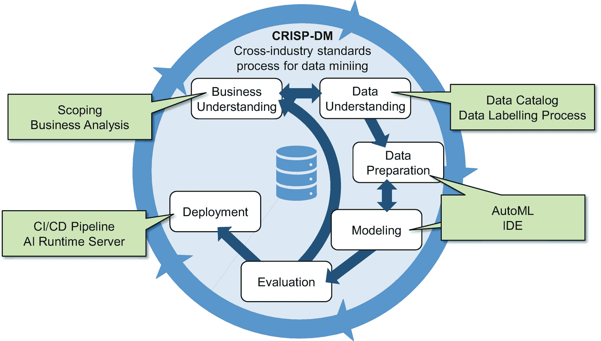
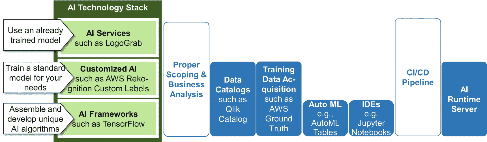

# 数据准备与 CRISP-DM 阶段

数据准备还涵盖数据清洗：跳过属性为空的记录行、将空字段设为默认值，或根据外部信息估算缺失值。在此阶段，数据科学家需要将来自不同表格和数据库的数据整合在一起。所有客户信息必须集中在一个表中，这就要求合并和关联来自一个或多个数据库的表格。核心数据库可能提供账户余额信息，而客户与银行顾问的会面次数则来自客户关系管理系统的表格。最后，有时还需要调整数据的语法或格式：例如布尔值`'Y'`和`'N'`可能需要映射为数字`'0'`和`'1'`。

CRISP-DM 的第四个阶段是**建模**。这是核心任务，也是数据科学家最钟爱的环节：创建人工智能模型。他们需要决定是训练神经网络还是线性回归模型，并定义如何衡量和评估模型质量，在模型创建完成后执行评估。最后，他们需要记录模型的准确率，并对可能相互竞争的模型进行比较。

**评估**阶段将最终决定模型是否可用于生产环境。该阶段涵盖质量保证，以及判断模型是否足够优秀以投入生产。与从 IT/人工智能视角审视模型的建模阶段不同，评估阶段要检验模型是否真正有助于实现业务目标。这甚至可能意味着要在现实中应用和试用模型。例如，某银行分行可能会致电流失风险高的客户。一个月后，项目组将该分行的数据与另一家未采取额外措施挽留潜在流失客户的类似分行进行对比。这种对比能够验证人工智能带来的效益。

第六个也是最后一个阶段是**部署**。项目需要规划模型的使用方式，制定监控策略以检测模型性能退化，并确保人工智能的维护工作。此外，该阶段还包括生成最终项目报告以及举办经验总结研讨会。

项目通常不会以瀑布式线性方式经历这些阶段（参见图 2-18 中的箭头）。有时，后退一步反而能更快或更好地达成最终目标。例如，假设某人工智能项目发现银行上个季度主要流失的是德国客户。这时，合规和销售经理可能会突然想起，正是他们迫使这些客户离开——而他们并未告知人工智能项目团队。于是，新一轮迭代变得必要。事实上，人工智能项目在第二次迭代中会从数据和洞察中获益匪浅。

通常，在缺乏详细的特定公司数据的情况下，项目应规划三次迭代。第二次迭代所需的工作量通常约为第一次的 50%，第三次约为 25%。此外，实践经验表明，实际创建和训练人工智能模型仅占总体时间预算的 10%到 20%。这只是很小的一部分——这也是 IT 组织试图提高数据科学家生产力的原因。他们希望数据科学家能专注于核心任务，并创建能创造商业价值的新模型。

## 提高数据科学家的生产力

提高数据科学家的工作效率是一个重要议题，尽管不同组织的具体动机各不相同。科技公司和初创企业往往无法招募到足够多具备特定技术或领域知识的专家。其他公司——尤其是在 IT 服务或咨询领域——则面临另一种困境。他们（或其客户的管理者）对利用人工智能进行创新有着绝妙的想法。大多数情况下，数据也是可用的。然而，根据我在头脑风暴研讨会上的经验，财务收益、节省的成本与实际项目成本往往并不匹配。没有业务经理愿意投资 10 万瑞士法郎开展一个人工智能项目，只为每年节省 3 万瑞士法郎。人工智能项目很酷，但也很陌生，因此被视为“有风险”。犹豫不决的经理们可能期望看到无懈可击的商业案例。当人工智能组织能够提高生产力时，成本就会下降，而商业价值保持不变。人工智能项目能更快地实现回报，并带来更高的节省或收益。

遵循 CRISP-DM 流程是识别改进潜力的结构化方法（图 2-19）。第一个阶段是“业务理解”。关于**业务分析**和需求分析的广泛现有文献涵盖了理解用户、客户和管理者目标与需求的所有方法论和工具。除了这些通用的方法论知识外，还存在针对人工智能的优化第一阶段的机会。本书在本章开头的**范围界定**部分以及前一章关于商业价值的讨论中对此进行了阐述。

图 2-19

人工智能项目的优化选项

范围界定和业务分析并不能减少数据科学家在清理和准备训练数据以及训练具体模型方面的工作量。然而，良好的业务理解能降低数据科学家未能完全理解业务挑战的风险。对预期目标理解不足，可能会导致——在数周紧张工作之后——得出这样的结论：人工智能模型是正确的且训练有素，但对任何人都没有帮助。

CRISP-DM 流程的第二个阶段“数据理解”涵盖数据收集与获取、理解实际数据以及验证数据质量。此阶段存在两个相关的优化选项：管理训练数据以及建立或引入数据目录。**数据目录**汇总了存储在组织数据湖、数据库和数据仓库中的各种数据集的信息。它有助于数据科学家找到相关的训练数据。其好处是双重的。首先，数据目录减少了数据科学家识别训练数据所需的时间。其次，由于数据科学家能够使用更广泛、更相关的可用训练数据，人工智能模型可能会变得更好。我们将在后续章节中更详细地探讨数据目录。

数据目录有助于找到现有的训练数据。有时，数据科学家会处理那些没有可用训练数据的人工智能解决方案。假设一个由人工智能驱动的应用程序需要根据图像判断装配线上的方向盘是否可以包装并发货给客户。训练这样的模型需要拥有标记为“质量合格”或“质量不合格”的方向盘图像。收集和标记图像既耗时、费力又昂贵，因为训练集必须足够大。在装配线上拍摄 1000 张方向盘照片需要多长时间？其中一些必须适合发货，另一些则不能。对于有缺陷的方向盘，每个质量问题至少需要拍摄 20 张图像。

对于数据科学家和人工智能项目来说，好消息是：他们可以通过`AWS SageMaker Ground Truth`等服务来优化标注任务。该服务通过多种方式革新了标注流程：

1.  将标注任务外包给 AWS 管理的工人或第三方服务提供商。这种外包使数据科学家无需亲自标注大型数据集，也无需识别和协调内部或外部人员来协助他们。如果标注工作不需要过于专业的技能，外包是可行的。此外，数据隐私限制和知识产权保护可能会限制这种外包。

2.  管理劳动力：该服务将待标注的文本或图片批次进行编译，并将其分配给不同的内部或外部贡献者——无需通过邮件和电话询问状态，也无需组织项目会议。

3.  通过让多个贡献者标注相同的图片或文本来提高标注质量。

4.  减少人工标注工作量：AWS 可以区分“简单”的训练数据项。它可以自行标注这些简单项，而具有挑战性的训练数据项则需要人工贡献者来标注。

下一阶段是“数据准备”。这是一项繁琐、耗时且艰巨的工作，旨在将初始数据集整理成有助于训练 AI 模型的形式。数据科学家可以使用特定于 AI 的**集成开发环境**（IDE），例如之前讨论过的`Jupyter`笔记本，来更高效地完成这项工作。这些 IDE 通过允许仅执行长脚本中的选定命令、简化注释和文档的编写以及促进协作，从而加速了开发过程。

自动机器学习（`AutoML`）有望实现数据准备、训练算法选择、超参数设置以及 AI 模型训练的自动化。`AutoML`将这些任务理解为（高维）优化问题，一个智能的`AutoML`算法可以在无需人工干预的情况下自主解决这些问题。你提供一个表格——`AutoML`会返回一个训练好的、可直接使用的 AI 模型。

这听起来像科幻小说，但市场上的各种产品证明了事实并非如此。例如，谷歌的`GCP AutoML Tables`、`SAP Data Intelligence AutoML`或`Microsoft Azure Automated ML`。目前尚不清楚`AutoML`是否以及在何种情况下能够超越或构建出与经验丰富的数据科学家“手工制作”的模型同样优秀的模型。尽管如此，`AutoML`已经是一个游戏规则改变者。它加速并简化了 AI 模型的创建过程，而无需庞大的数据科学团队。帕累托原则（80/20 法则）同样适用于数据科学项目。通常，快速、低投入地获得一个相对较好的模型，比花费数月时间追求完美模型要好。

最后，AI 组织也可以优化部署阶段。这个阶段主要由通用的 IT 工程任务组成。因此，`CI/CD`流水线等通用改进措施能带来好处。AI 模型成为应用程序代码的一部分，或者在独立的 AI 运行时服务器上运行。摩擦越少，潜在错误就越少。其他工程团队联系数据科学家以帮助调试或修复集成问题的频率也会降低。

并非所有介绍的优化方案都对每个 AI 项目都有帮助。在 AI 技术栈中，层级越高，项目和组织需要优化的领域就越少。当公司完全依赖现有的、即用型**AI 服务**时，他们既不需要训练机器学习模型，也不需要处理训练数据。他们将一切都外包了。这样就没有什么可以或需要优化的了。

依赖**定制化 AI**的公司会提供训练数据，但将实际的训练和模型创建委托给外部合作伙伴。采用这种策略的组织可以通过数据目录和改进的数据标注流程来优化其工作。

许多数据科学家和组织（仍然）倾向于使用`TensorFlow`等**AI 框架**来训练机器学习模型。他们受益于数据目录、改进的数据标注流程或 IDE。他们还可以使用`AutoML`来改进和（半）自动化特定的数据科学任务。

总的来说，优化 AI 团队的效率有两个方面。最重要的是，如果可能的话，要追求 AI 技术栈中的高层级。然后，针对所选的 AI 技术层，可以进行额外的优化（图 2-20）。

图 2-20

AI 创新全景图：技术栈、用例、改进方案

