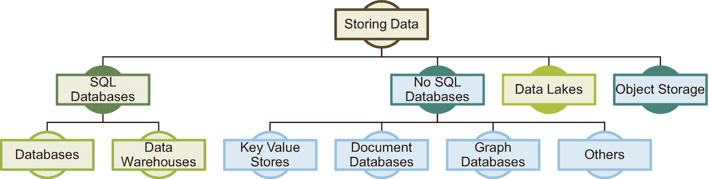
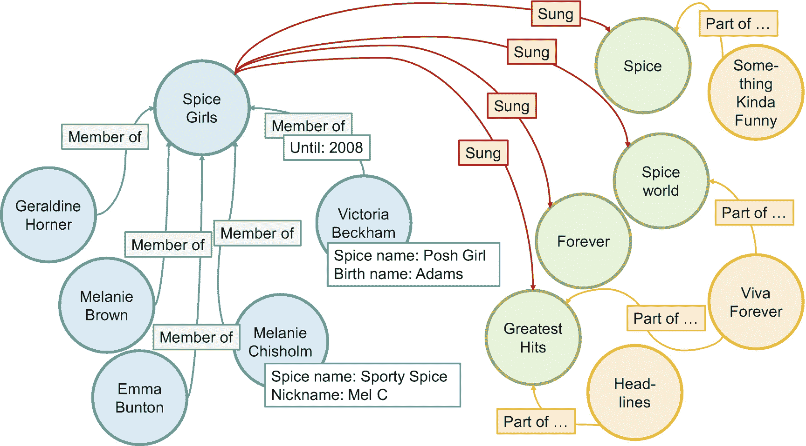
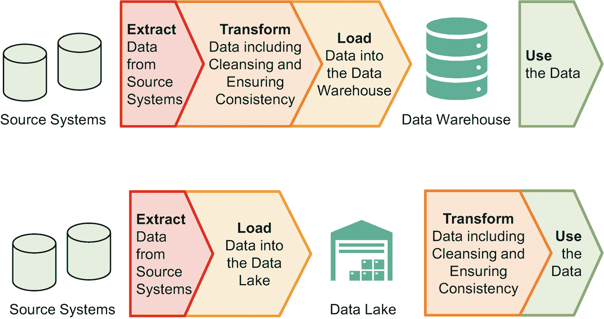
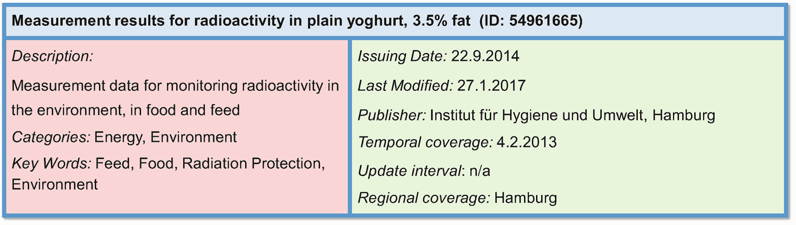
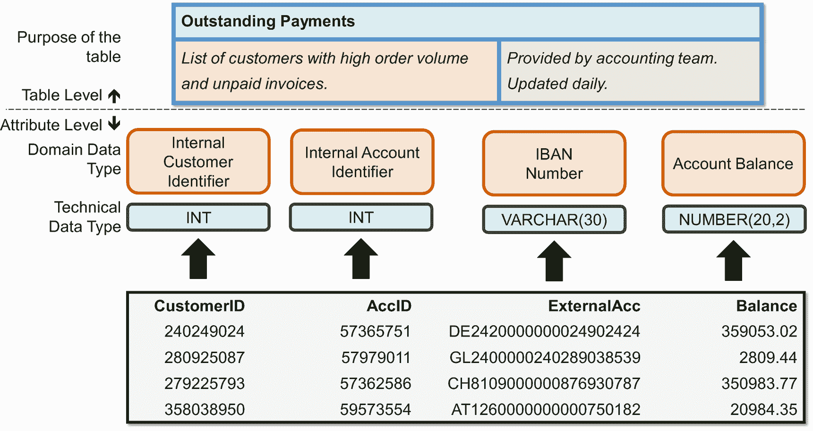

# 数据库集成模式

最著名的数据库相关集成模式可能是**数据库联邦模式**。联邦定义了来自不同数据库的数据库模式如何相互关联。该模式允许查询多个数据库中的表，甚至可以在不知道也不关心它们位于哪个数据库的情况下进行连接。考虑到两个 AI 数据摄取用例，联邦模式无助于将数据从运营数据库获取到训练环境或用于推理的生产系统。

**双向模式**保持两个（或多个）系统中的冗余数据一致。例如，一个解决方案在苏黎世有一个数据库，在新加坡有一个数据库，以减少数据访问延迟。两者存储相同的数据。双向更新模式使应用程序和用户能够写入其区域数据库，而不仅仅是写入一个全局主数据库。诸如“同步”或“关联”之类的双向模式，会将一个数据库中的更改传播到另一个数据库并更新那里的数据——对用户和应用程序完全透明。

用于训练或推理数据的双向模式会迅速将运营数据库中的新数据或更新数据转发到训练和推理环境。然而，它们也会产生不希望的且可能灾难性的后果：假设一位数据科学家在训练环境中删除了包含当月所有付款记录的表。由于每次更新都会同步到另一个数据库，这些数据就会从运营数据库中消失。这不是一个好主意！因此，双向模式不适合数据摄取用例。我们需要一种模式，确保更新和数据从运营数据库（或传感器、数据仓库、日志等）流向 AI 环境，而不是反向流动。

三种**单向模式**特别相关。第一种是**一次性复制模式**。数据库管理员或数据科学家手动将数据从源系统复制到训练环境，以训练 AI 模型并随后运行推理。这种模式避免了在自动化数据复制上的投资，需要手动工作。典型的用例包括概念验证、支持独特战略决策（扩展到拉丁美洲还是太平洋地区？）的 AI 模型，或者需要不频繁重新训练且源系统可能变化的 AI 模型。

第二种单向模式是**提取、转换、加载（ETL）流程模式**。它在数据仓库中广为人知。该模式包含三个步骤：提取、转换和加载。它们分别代表提取源系统的相关数据，转换数据以匹配目标模式（包括数据清洗和整合），以及将数据加载到目标系统。数据科学家或工程师通常使用 SQL 脚本实现这些步骤。一个编排组件调用并执行它们，确保稳定可靠的执行，例如每周日凌晨 2:30 执行。

`ETL`流程模式是批处理的典型示例。你随时间收集数据；然后，系统一次性处理所有收集到的数据。该模式适用于需要数据用于定期重新训练或预计算推理结果的 AI 用例。举个例子：一家银行想知道客户最可能额外购买的产品。在每个月开始时，银行用最新的客户行为和数据更新训练数据，并重新训练其 AI 模型。然后，银行（预）计算每个客户的下一个最佳产品。当客户登录其移动应用或联系呼叫中心时，系统或呼叫中心代理向客户推荐该产品。它从预计算的数据中获取信息，不需要任何在线推理。

`ETL`集成模式可能是对于支持和优化关键业务运营流程与决策的 AI 组织来说最相关的模式。计算每周或每月哪些客户可能取消电话套餐并不是最具创新性的用例。但是，这些用例确保了众多 AI 组织的资金，因为它们的商业价值是可清晰衡量的——对于此类用例，`ETL`模式完美适用。

第三种单向模式是**事件驱动架构模式**。物理或虚拟世界中的变化——一个新的传感器值或客户点击时尚商品——会触发一个事件。事件通过使用诸如`Apache Kafka`等技术互联的应用程序和组件流动。事件路由是业务逻辑的一部分。它决定哪些系统看到并处理哪些事件。与`ETL`流程模式有两个相关区别。第一，（近）实时处理。第二，发布-订阅通信风格。组件将事件放入诸如“客户操作”或“天气传感器 CDG”之类的通道。其他组件订阅通道以接收并处理这些事件。它们可能将结果放入另一个通道以触发后续处理。这是一种完全去中心化的计算模型。

事件驱动架构允许实时处理。以（近）实时方式交付*训练*数据没有好处，因为重新训练不会那么频繁发生。然而，某些用例受益于实时*推理*。

然而，集成模式和技术选择应经过深思熟虑。切换模式或技术会耗费时间和金钱。对于较大的组织来说，这是一项复杂的任务。因此，AI 组织也应考虑生命周期方面。两三年后有哪些集成模式可用？IT 部门对`ETL`工具有什么计划？事件驱动架构很少是必需的，但使用它们可以成为保护投资的战略举措，因为 IT 部门正朝着这个方向发展。理想情况下，AI 组织应确保其与 IT 部门的集成架构保持一致。

所以，总结一下，单向模式是将训练数据摄取到训练环境以及将数据交付给 AI 模型进行推理的解决方案。在回答以下三个问题后，为训练和推理数据摄取选择合适的模式就变得轻而易举：

*   你在训练环境中多久构建或重新训练一次模型？
*   AI 模型是用于实时推理，还是推理活动作为批处理作业执行（例如，在每个月开始时）？
*   未来几年，集成架构在集成模式和工具方面的路线图是什么？


### 存储训练数据

训练数据摄取模式将数据送入 AI 训练环境，而该环境需要存储这些数据。目前存在多种传统和新兴技术用于数据存储（图 6-4）。AI 组织应做出明智决策，确定在训练环境中使用哪些技术。



**图 6-4** 训练数据存储选项

组织、处理和存储结构化表格类数据最流行的形式是`SQL`数据库，其中也包含了`数据仓库`技术。

数据仓库针对高效执行大规模数据集上的复杂查询（OLAP——在线分析处理）进行了优化。架构师和数据库管理员依赖专门的模式和表结构来实现更高效的查询执行（“星型”和“雪花型”模式）。相比之下，OLTP（在线事务处理）优化型数据库支持更高的事务速率，即读取、写入和更新单行或少数几行。对于大多数 AI 用例而言，OLTP 优化型与 OLAP 优化型数据库之间的差异不应产生显著影响（至少在没有过于复杂的数据提取查询时）。很可能，大部分数据处理发生在`Jupyter`笔记本中，而非数据库内。

对于 AI 组织而言，使用`SQL`数据库存储（部分）训练数据是必需的，尽管可能还需要其他技术。`SQL`数据库的相关性基于这样一个事实：大多数（业务和/或企业）数据都以表的形式存储在`SQL`数据库中。表具有 AI 训练算法所需的输入数据结构。因此，将数据转换为不同结构进行存储通常只会带来成本，而没有任何益处。

`SQL`数据库还具有其他优势。首先，项目人员配置很容易，因为市场上`SQL`技能非常普及。其次，大多数 IT 部门都有数据库管理员，可以协助解决复杂的技术问题。AI 组织无需专门的技术知识。最后，AI 组织只需要一个不带高级功能的普通`SQL`数据库。因此，像`Maria DB`这样免许可费用的数据库就完全适用。

虽然数据库和数据仓库技术源自上个千年，但`No-SQL`（不仅仅是 SQL）数据库的兴起则是 2010 年代的现象。`No-SQL`数据库的世界是多样化的，从关注可扩展性（通过减少事务保证）到读时模式（我们在数据湖中也能看到这一点），再到不同的数据结构。后者是这里的重点：键值存储、文档数据库和图数据库。它们都以不同的方式存储数据。

**键值存储**的数据模型极其精简——由键和值组成的对，例如`<114.5.82.4, 20.07.2020 09:32>`。检索值（例如，IP 地址上次连接到数据库的时间）需要键（例如，IP 地址）。AI 组织可以轻松地将此类键值对存储在`SQL`数据库中。这样，他们就能避免建立一个技术动物园。

**文档数据库**存储的是——没错——文档。文档是半结构化的，最流行的格式是`XML`和`JSON`。文档允许嵌套属性，并且不强制固定的属性结构。一个典型的`JSON`文档如下所示：

```
{
"article": {
"title": "Mobile Testing",
"journal": "ACM SIGSOFT Software Engineering Notes"
"author": {
"firstname": "Klaus",
"lastname": "Haller"
}
}
}
```

即使源数据来自文档数据库，AI 组织也应质疑在其 AI 训练环境中建立一个或多个专用文档数据库的必要性。虽然有很好的替代方案，但`SQL`数据库通常不在其中。由于文档的半结构化特性，具有严格模式的`SQL`数据库通常不太适合。相比之下，数据湖和对象存储是潜在的替代方案，我们将在本节后面讨论。

**图数据库**使复杂互联主题和关系的建模与查询变得直观。社交网络是一个极佳的应用领域。图由节点和连接节点的边组成。节点可以代表人员或主题等。节点和边都可以拥有属性来存储附加信息。图 6-5 包含了多种节点类型：个人、一个名为“辣妹组合”的乐队、他们的专辑以及他们的一些歌曲。边代表各种关系，例如成为乐队成员、发行了某张专辑，或者某首歌是专辑的一部分。

虽然基于图数据库的应用可以检索出令人兴奋的结果和见解，但在技术上并没有要求必须在图数据库而非`SQL`数据库中执行此类分析。图数据库无法存储那些无法放入`SQL`数据库的数据或数据关系。图数据库更像是一种优化。它们简化了针对特定场景编写查询的过程，或者允许更快的查询执行。AI 组织是否应该在其技术栈中添加图数据库？答案取决于具体情况。AI 组织是否需要自行运行图数据库，还是 IT 部门有专家团队来管理，或者他们可以使用软件即服务的图数据库服务，从而免去安装、维护和打补丁的工作？这些数据是否被广泛使用，并且图数据库是否存储了重要、相关的信息？使用图结构数据训练 AI 模型的意图是什么？`SQL`数据库中是否存在无法通过其他方式解决的性能问题？图数据库需要一个商业案例来验证，与在 AI 环境中不使用它们相比，它们能带来财务上的收益。



**图 6-5** 在图数据库中表示辣妹组合

**数据湖**是存储海量文件数据（甚至达到 PB 级）的合适选择。与简单的文件系统不同，数据湖允许搜索文件内容并聚合信息。例如，统计文件夹结构`2021/07/*`及其子文件夹中“潜在违规”日志条目的数量，以了解是否比上个月有更多事件。数据湖实现了读时模式功能，但其操作（与集成到应用程序中的文档数据库不同）针对的是涵盖来自各种应用程序数据的大规模数据集。无需定义数据结构或模式，只需定义在文件中的何处以及如何查找相关属性。因此，如果未找到该属性，数据湖会继续执行查询而不会抛出异常，这意味着——与`SQL`数据库的情况不同——如果特定属性不存在，不会有直接反馈。

AI 组织迟早需要处理半结构化或非结构化数据。他们必须将此类数据存储在某个地方，而通常`SQL`数据库并不合适。`Hadoop`数据湖是正确选择吗？它需要投入精力来搭建和维护。如果你是一个大型组织，也许可以。较小的组织可以使用云中的数据湖服务。


最后，**对象存储**（`object storage`）也是一种值得提及的存储选项。自`AWS S3`推出以来，对象存储的相关性日益增强。过去是文件系统，如今则是对象存储技术：存放文件和文档的地方。它是云中的“标准存储类型”。与传统文件不同，对象存储无法直接操作文件，只能替换文件，这并不会影响人工智能组织的工作。不过，投入一些时间来详细阐述如何处理非结构化（及半结构化）数据，仍然是很有意义的。

## 数据湖与数据仓库

数据湖是人工智能组织捕获和存储海量数据（包括来自各种源系统的文本、音频、视频和传感器数据）的热门选择。与此同时，企业也运行着庞大的数据仓库，后者在报告和分析大量（业务）数据方面尤为强大。虽然数据湖和数据仓库看起来像是冗余的概念，但事实并非如此。人工智能组织能从两者中受益，尽管其技术流程和商业层面有所不同。

`ETL`（提取、转换、加载）之于数据仓库，正如`ELT`（提取、加载、转换）之于数据湖。步骤相同，但顺序不同（图 6-6）。延迟转换步骤在成本方面是一个颠覆性的改变。转换步骤是最耗时且最昂贵的环节，涵盖数据清洗和确保一致性。确保一致性是一项分析密集型的、需要人工完成的任务，尤其是在多个数据库和报告包含相似但定义略有不同的关键绩效指标时。与不同业务团队的多位专家和管理人员讨论并达成共识，可能需要数周时间。其好处在于：数据仓库拥有“黄金标准”的数据质量，工程师和业务用户都可以信赖，这也是管理者愿意为数据仓库提供资金的原因。因此，在将数据加载到数据仓库之前，避免成本高昂的转换步骤是不可行的。结果，即使是添加单个属性也需要投入成本，从而限制了快速添加数据的能力。管理层（始终）对数据仓库团队是否添加数据以及添加哪些数据拥有发言权。

相比之下，数据湖存储的是未经清洗的原始数据。这里没有关于单个属性的讨论，而是决定添加哪个数据库或包含大量日志文件的哪些文件夹。添加数据不会产生高昂的成本，无论是项目中的分析成本还是后续的存储成本。这些低成本正是数据湖的成功因素。工程师可以仅仅基于一种模糊的希望——未来某时某人可能会有某种想法来使用这些数据——就添加数据。然后，这个“某人”再为包括清洗和准备在内的转换步骤付费。



图 6-6

将数据摄入数据仓库（上图）和数据湖（下图）

## 数据目录

高质量人工智能模型的一个关键先决条件是充足的训练数据。哪些客户可能在接下来几周内终止合同？装配线上的哪些螺丝有缺陷？如果数据科学家能够访问训练其机器学习模型所需的数据，他们就能回答（几乎）世界上所有的问题。

数据仓库提供了大量结构良好、文档齐全且一致的数据。相比之下，数据湖收集了数据仓库所存储的大量数据，但缺乏类似的文档——这并非数据科学家所爱，但却是任何数据湖业务案例中不可或缺的一部分，如前文所述。此外，运营数据库和其他数据存储方式可能包含数据科学家感兴趣的其他数据。数据目录包含关于各种数据源（无论是运营数据库、数据湖还是其他数据）中数据的信息。它有助于人工智能项目找到他们尚不了解的、可能相关的训练数据。数据目录是区分有用数据湖和无用数据沼泽的关键。它是一个赋能者，能够加速人工智能项目的工作。

数据目录可以提供数据属性和表级别的信息。表级别信息包含三个要素（图 6-7）。首先，数据集有一个名称和唯一标识符。其次，数据集有一个描述该表内容的说明，通常还会根据公司的分类系统添加类别信息以及关键词，以便潜在的数据用户能够快速找到数据。第三，还有额外的元数据，例如发布者、发布时间、发布者是谁、数据血缘信息等。



图 6-7

一个公开可用数据集的描述

数据集描述是数据目录中最关键的信息。它使数据科学家能够搜索并识别出可能有助于训练他们当前正在开发的人工智能模型的有用数据集。

数据目录还提供属性级别的信息，包括技术数据类型（`String` vs. `Integer`），理想情况下还包括领域数据类型（例如，一个字符串是存储员工姓名还是护照 ID）。数据目录甚至可能提供每列的最小值和最大值。图 6-8 展示了这两个级别。

属性的领域数据类型和数据集描述反映了一个典型的数据目录用例：查找所有包含 IBAN、客户姓名或患者记录的列，这对于法律和合规团队（例如在 GDPR 背景下）至关重要，但对数据科学家来说帮助不大。



图 6-8

理解数据目录

数据仓库自带数据目录和词汇表——而且大家都知道，建立这些目录和词汇表非常耗时。那么，人工智能组织或 IT 部门能否通过自动化创建数据湖的数据目录（例如，使用数据丢失防护（DLP）工具，如`Symantec`或`Google Cloud DLP`）来降低成本和人工工作量呢？


