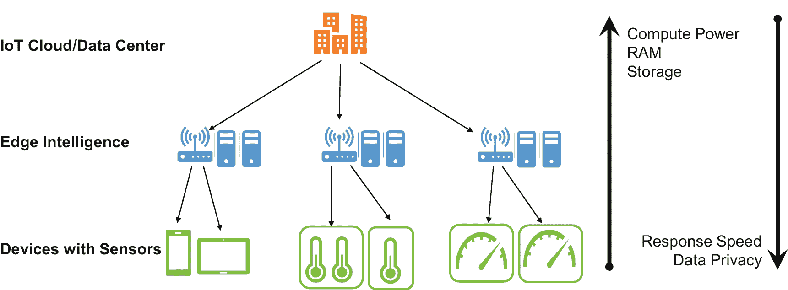
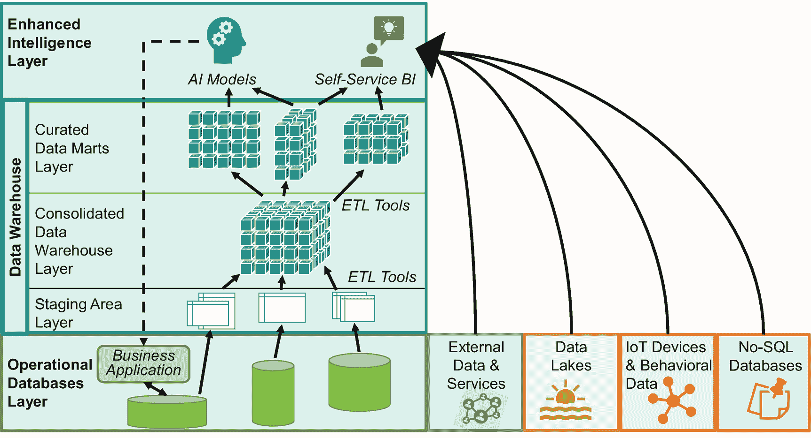

# 简短回答

**法律与合规**团队受益，数据科学家则不然。`DLP`工具非常适合查找领域数据类型。它们能识别数据库和数据湖中哪些表或文件包含客户姓名、患者记录或宗教信仰信息等。因此，它们非常适合识别与`GDPR`相关的信息。但它们无助于理解文件和表中更复杂的**语义**。这些是所有有未付款项的客户，还是那些真正重要的瑞士客户？辐射测量值是昨天的，还是切尔诺贝利灾难后一周的？收集和整理此类信息需要人工操作。严格执行维护流程是确保每个人在此背景下完成任务的唯一途径。如果上传者未提供包含数据科学家所需全部信息的描述，`IT`部门必须从技术上阻止任何数据上传至数据湖或`AI`训练数据集合。

从`Excel`和`MS Access`到专用商业软件，`AI`组织和`IT`部门在数据目录方面有多种选择。选择复杂且更昂贵解决方案的原因在于它们集成了群体智能功能，并支持**治理流程**——后者尤为重要，尤其是在`GDPR`时代或伦理讨论日益关键的背景下。复杂的流程和系统适配器使专家能够更高效地工作，尽管这更多是合规而非`AI`议题。**群体智能**模拟资深专家帮助新同事的建议。资深专家会指导年轻同事找到工作所需的数据集。她知道当银行客户前往哪个分行时，在哪里能找到数据。她知道在哪里能找到在移动银行门户中点击抵押贷款产品详情页面的客户。模拟此类建议的数据目录功能，其建议基于对常用数据集和属性或过去提交的典型查询的统计。此类建议无需直接的人工输入。一种不那么高科技的众包目录信息方法是让数据科学家（或其他数据用户）对数据集的相关性和质量进行评分。例如，后者在`Qlik`的数据目录中通过三个成熟度级别实现：青铜级代表原始数据，白银级代表经过清洗并初步处理、可供数据分析师使用的数据，黄金级代表可直接供业务用户使用的报告。融入群体智能仍处于初级阶段，但可能很快会成为初级数据科学家或新入职公司数据科学家生产力的游戏规则改变者。

总结：数据目录对于充分利用数据湖中的所有数据以及公司中不太知名的数据源至关重要。在建立和维护数据目录时，这关乎纪律和严格的流程。它们对合规和治理问题也有很大帮助——而即将到来的群体智能功能是提高数据科学家生产力的绝佳机会。

## 模型与代码仓库

仓库是追求运营顺畅的`AI`组织必备的技术能力。我们之前简要介绍过它们。它们降低了关键模型无备份副本或混淆`AI`模型变体与版本的风险。此外，当多位数据科学家和工程师处理相同或相似模型时，它们还能简化协作。

仓库充当所有`AI`模型及附加数据的中心枢纽，并存储以下内容：

*   模型的**目的**，即对模型实现功能的描述
*   **AI 模型**本身，例如一个`Jupyter`笔记本文件，包括其先前版本
*   与生产使用相关的**其他代码**（来自集成工程的接口代码）或用于复现模型的代码（数据准备和清理脚本）
*   记录训练阶段模型质量的**实验历史**，包括架构和（超）参数设置
*   生产使用的**审批**，例如“审批点击”等工作流操作，或上传至工具中的电子邮件

`AI`模型的仓库可以有各种复杂程度，从仅使用`GitHub`，到来自公有云提供商（如`Microsoft Azure Machine Learning MLOps`）或专业`AI`供应商（如`Verta AI`，配备炫酷仪表盘和`CI/CD`部署流水线集成）的集成式`MLOps`平台。由于模型是业务关键型知识产权，因此必须确保仓库的安全和保护。

### 执行 AI 模型

将卓越的 AI 模型集成到组织的运营流程中，能极大提升公司的运营效率。换言之，应用程序通过调用 AI 模型进行预测或分类。除了不进行任何集成的预计算，我们之前从技术集成角度讨论了两种方法：`AI 运行时服务器`和通过重新实现将`模型集成到应用程序的代码库中`。我们已经从集成工程和测试的角度探讨了这些主题——在此，我们将聚焦于更多架构层面的考量。

通过将模型重新实现为应用程序代码的一部分进行集成，意味着架构责任不在 AI 组织内部，而是由软件架构师和软件开发团队负责。运行其软件解决方案的责任也同样如此。

AI 模型运行环境有多种实现方案，主要包括商业供应商的 AI 平台、开源解决方案，以及边缘计算/边缘智能的独特配置。

**商业 AI 供应商平台**，例如`SAS`或`Dataiku`，以及公有云提供商，都有一个共同且直接的销售主张：便捷性、用户友好性和高生产力。它们提供的 AI 运行环境不仅简化了模型训练，也简化了部署和使用。客户为这些便捷性和生产力优势付费。此外，他们还会隐性地接受供应商锁定，例如，数据科学家可能无法将数据准备和清洗工作迁移到新平台上。

一个重要说明：存在一些事实上的商业平台，它们看起来像是“免费”的，或者以提供“开源”组件为营销点。它们甚至可能不对软件或集成开发环境收费，并营销其使用了开源组件和行业标准。尽管如此，它们仍可能造成（云）供应商锁定。你可能无需支付软件许可费，但代价是无法快速将工作负载迁移到其他（云）供应商。在云端选择“免费”或“开源”技术时，AI 组织应仔细核查这一细节，因为接受供应商锁定在选择 AI 平台时会开启更多可能性。

构建一个**基于开源的 AI 平台**，意味着整合各种开源组件，以构建一个满足特定 AI 组织需求的环境。例如，在`Jupyter`笔记本中训练模型，使用`GitHub`作为代码仓库，并将结果打包成`Docker`容器推送到公有云提供商进行可扩展执行，或在内部集群上运行。AI 组织（及其内部客户）可以讨论由谁负责运行和监控模型，或者模型是否成为实际代码库的一部分。

最后，还有**边缘智能**。边缘智能意味着推理不仅发生在公司的数据中心或云数据中心，而是在所有区域部署边缘服务器来承担 AI 推理任务（图 6-9）。物理上的邻近性解决了延迟问题，例如，当澳大利亚内陆地区的设备调用冰岛服务器上的预测服务时。

图 6-9

边缘智能

边缘智能对于计算和存储能力有限的物联网设备解决方案很有意义。其假设是这些设备无法在本地运行 AI 推理。随着时间的推移，第二个用例可能会变得更加重要：保护 AI 模型作为关键知识产权。公司可能会避免将 AI 模型部署到物联网设备上，以防止竞争对手通过购买或窃取运行 AI 模型的设备来获取模型。

AI 组织可以自行部署边缘智能模式。然而，依赖云提供商可以简化部署，尤其是在可能受益于其他功能时，例如集成物联网设备以及使用 AI 或数据管理功能。为了避免过于天真地陷入云提供商锁定局面，制定透明的 AI 和云战略会有所帮助——无论是对于物联网和边缘智能，还是对于你的 AI 平台。

## AI 与数据管理架构

虽然上一节是关于 AI 环境的，现在我们来看 AI 环境如何融入并从组织的整体数据管理架构中受益——以及 AI 与其他类似服务的关系。图 6-10 提供了一个包含所有相关组件和概念的高层概览，其中显然包括数据仓库。

图 6-10

传统与新型商业智能架构的架构蓝图

