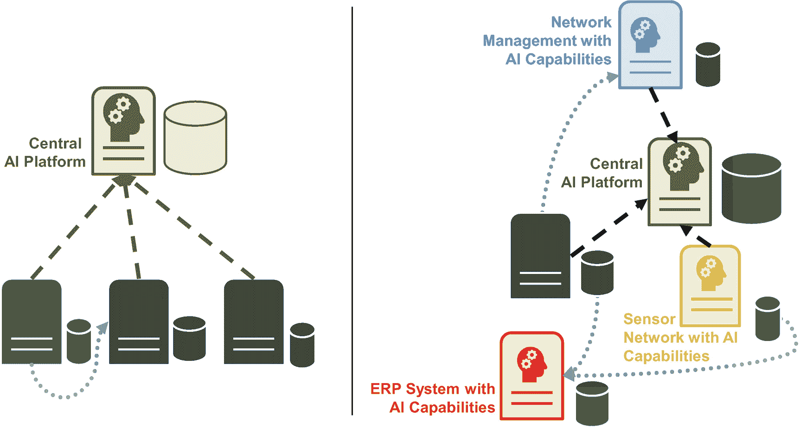

# AI 与经典数据仓库架构

数据库和数据仓库不仅有助于在 AI 环境中存储数据。企业使用它们已有数十年之久。在 AI 出现之前，数据驱动型企业的架构由操作型数据库层和数据仓库层组成。

**操作型数据库**通过存储和处理数据来服务于业务应用。例如，它们存储主数据、产品描述、银行转账或销售点记录。

业务用户（可能在数据库管理员的支持下）可以针对数据提交临时查询。我们针对“银发族”的营销活动是否导致上个月该年龄段的新签合同客户增多？这是一个具有明确分析重点的临时查询示例。

查询操作型数据库存在两个**局限性**。首先，可能对操作产生影响。长时间运行的复杂分析查询可能会影响数据库的稳定性和性能，进而影响整个系统。针对在线商店的数据库提交此类查询可能并不合适。第二个局限性在于操作型数据库的侧重点。它们（通常）只存储一个应用程序或一个特定领域的数据。合并来自不同数据库（例如，一个包含在线商店数据，另一个包含零售店数据）的数据对于临时查询来说工作量大，并且需要付出巨大努力才能使其在数月乃至数年内保持稳定。打开防火墙或处理服务账户和证书只是其中的一些示例任务。因此，几乎所有公司都会运行一个或多个数据仓库，用于收集和合并来自各种操作型数据库的数据。

一个典型的**数据仓库**包含三个层级：临时存储区层、整合数据仓库层和精选数据集市层。**临时存储区**是 ETL 过程中从操作型数据库或其他数据源复制而来的数据的中间存储位置。在 ETL 过程中，数据仓库软件从操作型仓库中提取数据，进行转换，并将其加载到整合数据仓库层。转换过程还包括数据聚合、数据清理以及消除不一致性。第三个数据仓库层提供精选的**数据集市**。它们以用户友好的方式，为会计、销售或运营报告等主要用户群体提供与其相关的数据。

从**AI 组织的视角**来看，一个拥有数据集市和整合层表的数据仓库是一个巨大的机遇。它是高质量训练数据的来源，这些数据具有公司范围内一致的语义，并涵盖公司的所有领域。构建一个类似的解决方案通常需要数百万美元和数年的努力，这是任何 AI 组织都应避免的。然而，数据仓库有两个明显的局限性。数据不是实时的。ETL 流程通常在夜间运行，以最大限度地减少对办公时间操作型数据库的影响。因此，数据至少是一天前的，但公司某些数据的刷新频率可能不会超过每月一次。其次，数据仓库在添加新数据方面不够灵活。公司其他部门期望数据仓库提供一致的数据，这要求在添加一个属性（或一个或多个表）之前进行深入分析。尽管如此，对于 AI 组织来说，数据仓库仍然是一个绝佳的机会，可以利用一些初始的、高质量的、“零投入”的训练数据，在新领域快速启动活动。

在这种理想情况下，AI 组织将其解决方案构建为一个新的顶层，基于数据集市或整合数据仓库层，如图 6-10 所示。AI 组织越少直接处理操作型数据库，其运营就越具成本效益和敏捷性。

## 自助式商业智能

将自助式商业智能（SSBI）工具称为近期数据管理和分析史上最大的骗局，可能有些言过其实。问题不在于它们的功能，而在于它们被推销给客户的方式。许多供应商试图让客户相信，该工具能让他们执行与数据科学家和 AI 算法类似的分析——但这并不正确。

如图 6-10 中的架构所示，SSBI 工具位于数据仓库或数据集市之上（AI 组件也是如此）。这些工具**使业务用户能够**自行定义和创建表及视图。与数据仓库的视图和表相比，业务用户的视角可能非常狭窄，不会左顾右盼，也不会考虑是否已经存在类似的绩效指标。速度、便利性、无需费力通常是业务用户关注的焦点。撇开所有批评不谈，SSBI 工具解决了业务需求，并促进了企业职能部门（如全球性组织的控制部门）的协作。当工作涉及从各种 Excel 文件中复制数据、清理和整合这些信息时，SSBI 工具因其协作功能而能提供巨大帮助。然而，当 AI 组织考虑使用来自 SSBI 工具的数据时，他们应该意识到，其数据质量可能不如来自数据仓库或操作型数据库的数据可靠。

如果 SSBI 工具**阻碍了 AI 的采用**，那么它就会成为 AI 组织和公司创新潜力的一个问题。SSBI 工具是镀金的 Excel 替代品，拥有更多可供摆弄的功能，但并不能让业务用户手动生成与 AI 项目成果同等水平的洞察和模型（并且提供没有解释的 AI 算法也可能无法产生有用的模型）。SSBI 工具的问题不在于其功能，而在于业务用户是否坚持使用 SSBI 工具“自己分析”AI 问题，而不是让统计或机器学习算法做得更好，或者试图在不理解所需方法论的情况下创建 AI 模型。这是 SSBI 工具的一个巨大风险或劣势，并且可能导致 AI 组织在公司内的地位出现问题。AI 管理者应警惕这一点。

图 6-11
经典 AI 架构，其中 AI 平台是唯一的“智能”解决方案（左），以及当今环境中包含各种集成 AI 能力组件的泛灵智能（右）

### 泛神智能

泛神智能反映出，无论是数据仓库团队还是人工智能组织，都无法垄断海量数据的收集以及利用人工智能方法生成额外洞察的能力。软件供应商在传统产品中增强人工智能功能，无论他们开发的是核心银行系统、楼宇控制应用，还是网络管理与监控解决方案（图 6-11）。

例如，网络团队可能希望通过更快地识别根本原因来加快客户事件的解决时间。一个典型场景是：WLAN 路由器崩溃，导致数百台设备无法访问，进而引发监控系统产生数百个事件。这种事件洪流阻碍了网络支持工程师识别出崩溃的路由器才是根本原因。

在这种情况下，人工智能组织可以提供帮助，训练一个模型，用于在存在几个“真实”事件引发大量非根本原因的次要事件时，识别根本原因。人工智能专家基于极少数案例训练模型。他们从监控团队获取所需的训练数据，或者通过创建与所有网络及硬件设备的接口来获取。但有一个更快的解决方案：网络管理部门购买一款网络监控与管理解决方案，该方案自带所有重要厂商设备的接口，并且除了传统的网络管理与监控功能外，还包含一个人工智能组件。`Moogsoft` 就是这样的软件提供商。你需要提供大量数据并进行大量训练，但如果你是企业网络负责人，你会选择现成的标准软件，还是自行开发？

泛神智能已成为现实。越来越多的软件供应商在其产品中融入人工智能功能。因此，人工智能组织可能会倾向于那些对客户和业务有直接影响的战略性应用，企业希望整合来自各种来源的数据，构建一个卓越的模型，以获得竞争优势。

### 新的数据类别

主数据和事务数据，这是多年前大多数系统能够存储的内容。如今，新的数据类别已成为标准，例如日志和行为数据、物联网数据或外部数据。

在线时装店仅仅保存你的收货地址和订单历史，这已经是很久以前的事了。如今的企业对数据如饥似渴，它们存储并分析行为数据。客户如何在在线时装店中导航？他们滚动浏览哪些商品？哪些东西会让他们停留一秒钟——或者十秒钟？通常，这些数据来自日志文件。物联网设备提供传感器数据，例如压力和温度信息——或者图片和视频流。它们是数字化物流、制造或生产等新业务领域的核心构建模块——也是技术和工业企业核心产品创新的基础。

如果企业内部没有所需的数据，它们会越来越依赖外部数据提供商。外部数据可以是“付费”数据，例如关于客户信用度或验证收货地址的数据。许多国家和公共机构也免费公开其数据，例如作为“开放数据”倡议的一部分。这类外部数据通常以易于使用的形式提供，例如 CSV 文件中的表格。当人工智能组织发现此类有价值的外部数据有益时，它们可以轻松集成这些数据。相比之下，行为数据、日志文件数据和物联网数据通常需要更多的数据准备工作，人工智能组织才能集成这些数据并用于训练目的。对于每个小型人工智能案例，这种投资可能无法收回成本。尽管如此，这仍然是优化人工智能模型的绝佳机会，这些模型对企业成功具有重大影响，无论是客户理解还是物流优化。

## 云服务与人工智能架构

公共云提供商释放了巨大的创新潜力，尤其是对中小企业而言，使它们能够无需前期投资即可集成高度创新、即用型的技术。它们改变了 IT 组织的工作方式、思考和处理人工智能的方式，并且是 2020 年代人工智能架构最重要的影响因素。

云计算建立在三大支柱之上：

*   基础设施即服务 (IaaS)
*   平台即服务 (PaaS)
*   软件即服务 (SaaS)

最广为人知的是 IaaS 和 SaaS。每个人都已经使用软件即服务解决方案多年：`Google Docs`、`Salesforce` 和 `Hotmail` 就是众所周知的例子。它们对用户和 IT 部门都很方便。SaaS 消除了安装、维护和升级软件的负担。在网络上使用人工智能解决方案，例如托管的 `Jupyter` 笔记本环境，使得自行安装变得过时——尽管将其与其他公司系统集成的努力不应被低估。

IaaS——基础设施即服务——也蓬勃发展。许多 IT 部门已将其部分或全部服务器迁移到云端。他们从云提供商处租用位于云提供商数据中心的计算和存储容量。因此，IT 部门不再需要购买、安装和运行服务器——也无需操心数据中心建筑和电气设施。IaaS 为人工智能组织带来了重大好处，因为它解决了处理需求高度波动的问题。人工智能组织不必购买容量足以应对每月一次训练大型人工智能模型时极端负载的硬件。相反，他们可以根据需要租用所需资源。他们可以获得即时且无限的扩展性、高可靠性，或这些特性的任意组合。

IaaS 和 SaaS 彻底改变了 IT 服务交付。按下一个按钮就能获得一台虚拟机。Office O365 使得在公司服务器上安装软件补丁变得过时。更快、更便宜——但无论是 IaaS 还是 SaaS，都无法让你为客户构建革命性的新服务或产品。PaaS——平台即服务——开启了这一机遇。PaaS 是快速创新领域的游戏规则改变者。每个人工智能部门都应密切关注云提供商的创新管道。

借助 PaaS，软件开发人员和人工智能专家可以使用即用型构建模块（例如数据库、数据管道，或用于开发、集成和部署的工具）来组装和运行应用与服务，而无需处理复杂的安装或 IT 运维。真正的游戏规则改变者是大型云服务提供商对生产级人工智能服务的巨额投资，从计算机视觉到文本提取，旨在让没有人工智能背景的开发人员也能使用最先进的人工智能技术。此外，它们还提供一些奇特而小众的产品，例如用于卫星数据的地面站或用于构建增强现实应用的服务——并且它们允许第三方提供商提供其软件，希望产生像 iStore 或 PlayStore 那样的网络效应。

这些 PaaS 服务也影响着人工智能组织，并非每位数据科学家都会对每一项变化感到满意。如果云提供商提供图像识别服务，那么就不再需要也没有机会自行训练通用的人工智能模型了。应用开发人员会使用这些服务，而不是要求人工智能组织训练一个人工智能模型。例如，他们集成 AWS 的 `Rekognition` 服务所需的时间，与编写一个 `printf` 命令差不多——结果就是，他们能知道照片中的人是否在微笑，以及同一张图片中是否有汽车。商品化的人工智能服务将来自云端。因此，人工智能组织可能不得不转向更复杂、更特定于企业的任务，构建并维护更庞大的人工智能解决方案——或者借调掌握例如 Azure 人工智能功能知识的工程师。

