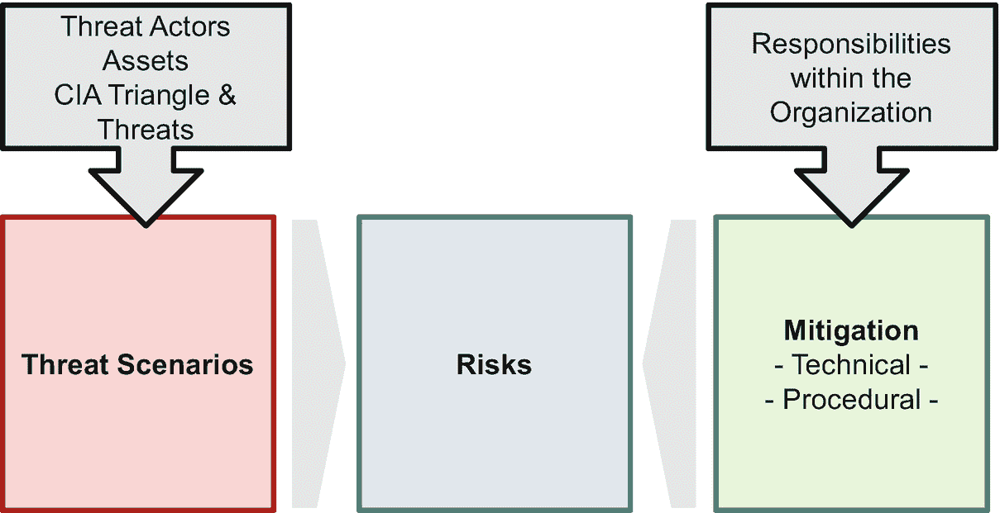

# 7. 保护 AI 环境

曾几何时，IT 和信息安全很简单。IT 安全专家部署恶意软件代理并设置防火墙——组织就安全了。如今，信息安全变得更加激动人心和复杂，需要每个人的贡献。即使是 AI 组织中的数据科学家也必须了解并致力于安全——而 AI 管理者可能突然需要为其组织的 AI 基础设施的适当安全措施负责并承担责任。压力无处不在，但必要的专业知识却并非如此——尤其是在 AI 组织中。更复杂的是，许多资深 IT 安全和风险专业人士对他们所评估的 AI 方法论和技术缺乏深入理解。这是一个两难困境，本章通过探讨四个主题来提供解决方案：

*   **CIA 三角**：描述 IT 和信息安全的核心目标
*   **协作模式与责任分配**：IT 安全与 AI 组织之间的协作模式与责任分配
*   **AI 特定的安全威胁与风险场景**：包括潜在的攻击者和受攻击的资产
*   **具体的技术和流程措施**：用于缓解 AI 相关风险并提高整体安全水平

图 7-1 展示了它们之间的相互依赖关系。以下页面将详细阐述这些主题。

图 7-1

IT 安全风险——全景图

